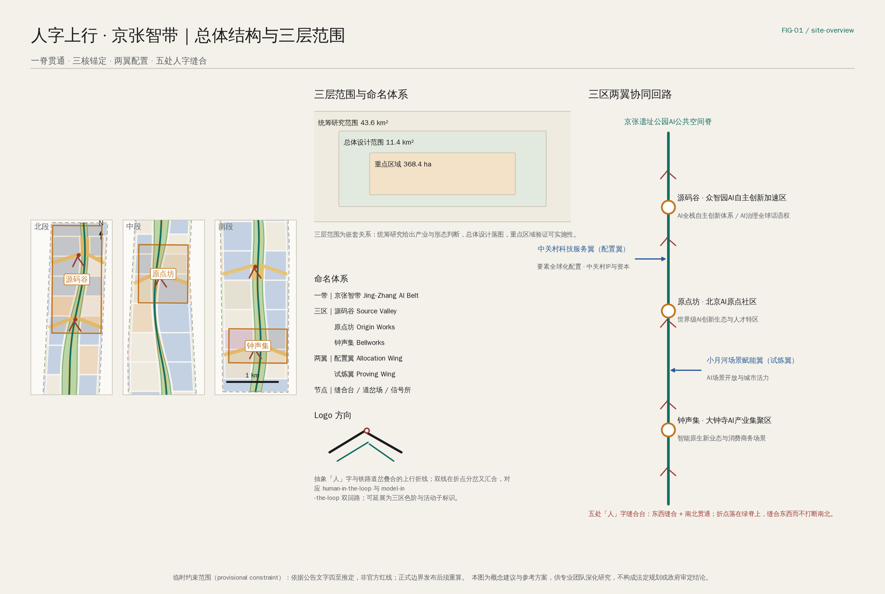
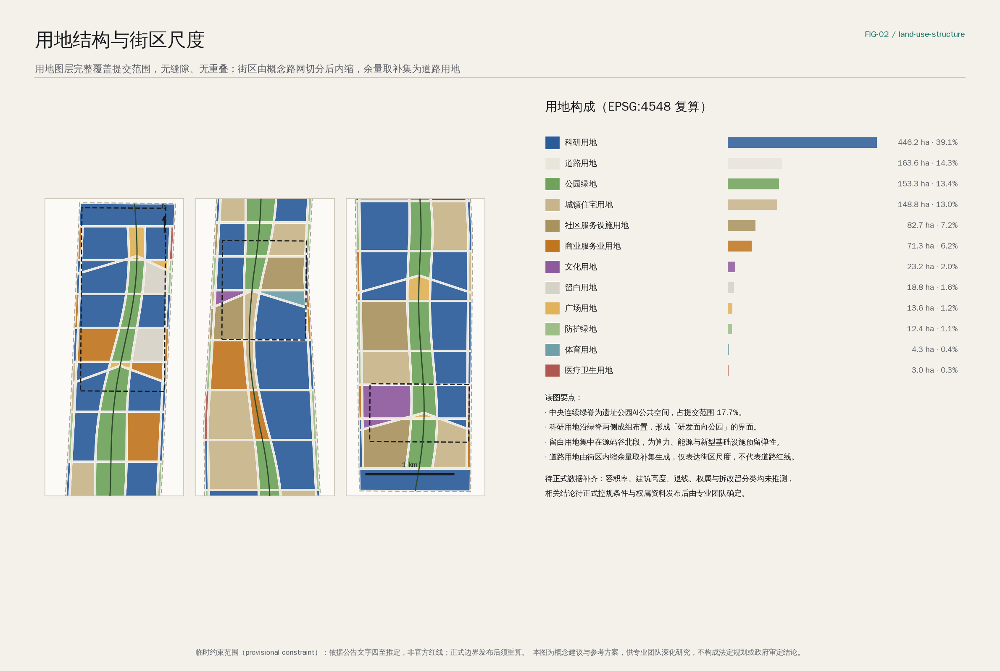
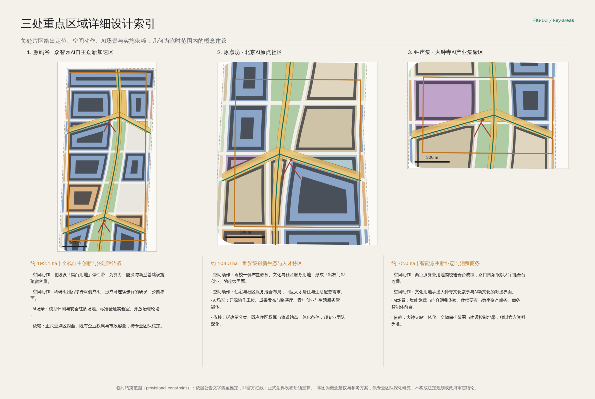
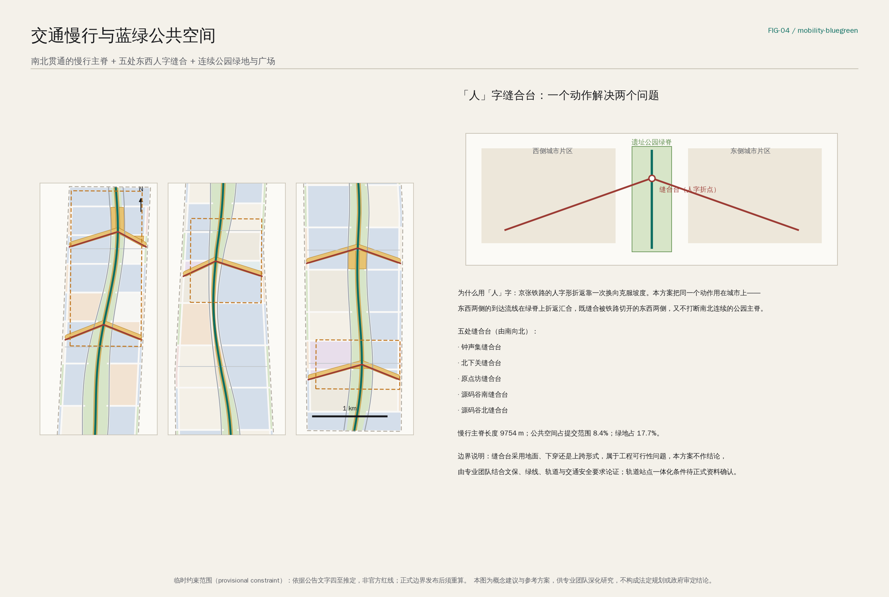
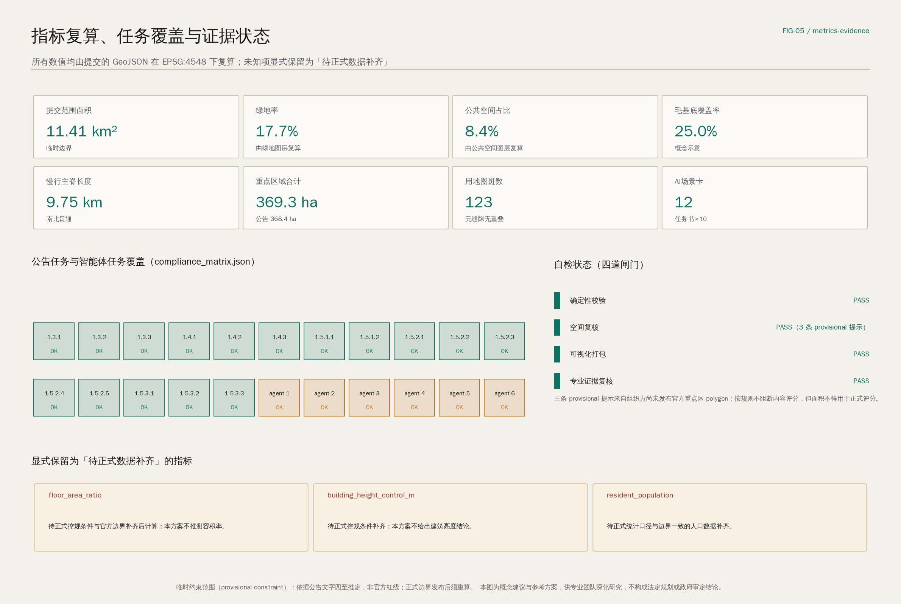

# 人字上行 · 京张智带

**一句话方案：** 把京张铁路当年翻越关沟所用的"人字形折返"从一段铁路做法，转译成一套城市做法——让被铁路切开的东西两侧在遗址公园绿脊上折返汇合，用同一个动作同时完成"东西缝合"与"南北贯通"，并把这条脊作为AI创新带的公共空间与场景主干。

**英文主名称：** Switchback Rising — The Jing-Zhang AI Belt。**中文主名称：** 人字上行 · 京张智带。

## 设计依据与资料清单

本方案的第一依据是北京市规划和自然资源委员会海淀分局发布的百年京张AI创新带城市设计国际方案征集资格预审公告，以及面向全球智能体的开源征集任务书摘录；两者共同确定了三层范围、三处重点区域、三大定位、五大功能与六项智能体任务 [source:OFFICIAL-ANNOUNCEMENT] [source:AGENT-TASKBOOK]。

在空间数据上，组织方尚未发布官方 `SITE_BOUNDARY` 与 `KEY_AREA` polygon。本方案因此采用仓库中已登记的临时粗略边界作为生成、展示与自检的基础，并在正文、图纸、指标与结构化文件中一律标注为"临时约束范围（provisional constraint）"，不将其称为官方红线，也不用于正式面积评分 [source:BOUNDARY-SOURCE] [data:geometry/site_boundary.geojson#SITE-001]。

资料可用性按仓库登记表区分：可用于正式论证的资料、仅作背景参考的资料、仅可临时使用的资料三类边界被严格保持，背景与临时资料不会被提升为法定控制依据或政府实施承诺 [source:SOURCE-REGISTRY]。完整来源清单、许可条款、获取时间与限制记录在 `sources.json`，专业标准响应记录在专业标准矩阵，设计深度响应记录在设计深度矩阵，正文只在判断旁保留最直接的依据。

方案的可读性与可审计性被当作两层来组织：读者不打开任何 JSON 也应能理解设计判断；审阅者打开结构化文件则应能逐条复算 [depth:existing_conditions_diagnosis]。现状诊断的最大缺口是官方边界、权属、控规控制条件与市政容量资料，这些缺口在 `assumptions.json` 中逐条登记，并附带"补齐后必须重算"的触发条件。

## 三层范围工作框架

公告给出的三个层次不是三套互相独立的图纸，而是一条从判断到落图再到验证的工作链。统筹研究范围约 43.6 平方公里，负责回答产业生态与未来城市形态的判断；总体设计范围约 11.4 平方公里，负责把判断落成可复算的空间结构；重点区域范围约 368.4 公顷，负责验证这些判断在具体片区里是否站得住 [depth:three_level_scope_framework] [metric:coordinated_research_area_sqm]。

三层之间的传递关系是本方案的组织方法：统筹研究得出的"创新链需要连续的公共界面"这一判断，在总体设计层被翻译为一条南北连续的绿脊与两侧成组的科研用地，在重点区域层再被检验为具体的街区尺度、步行距离与场景落点 [data:geometry/land_use.geojson#LU-001] [depth:overall_spatial_structure]。

之所以强调这条传递链，是因为智能体生成的方案最容易在这里断裂：宏观愿景写得很满，落到用地和街区时却无法复算。本方案的做法是先锁定当前采用的临时约束边界，再生成用地、绿地、公共空间、建筑基底、道路与分期，最后从这些图层反向复算全部指标，任何无法从结构化数据复算的面积、比例或数量都不写入结论。

需要说明的限制：三层范围的边界目前都来自公告文字四至的推定，面积与公告值的偏差控制在 0.3% 以内，但折线不等同于道路红线或法定范围线；正式边界发布后，用地、绿地、公共空间、建筑、道路、分期与全部指标都必须重新生成，而不是替换单个文件 [source:BOUNDARY-SOURCE]。

## 统筹研究范围产业与未来城市研究

统筹研究范围的核心问题是：海淀已经拥有全国最密集的高校院所与AI企业，为什么还需要一条"带"？本方案的判断是——要素密度已经足够，但要素之间缺少一条连续、可步行、可展示、可运营的公共界面。京张遗址公园正好是这条界面唯一可能的载体：它南北贯穿整个走廊，且不属于任何单一权属主体 [standard:PROJECT-OFFICIAL-ANNOUNCEMENT] [depth:overall_spatial_structure]。

因此统筹研究层的策略被概括为一条创新链："高校策源—开源协作—企业转化—公共体验—国际传播"。这条链在空间上对应"一脊三核两翼"：绿脊承担公共体验与国际传播，三核分别承担策源、协作与转化，两翼承担要素配置与场景试炼 [source:AGENT-TASKBOOK]。

未来城市形态的研究不停留在技术愿景，而是回答三个可被检验的问题：第一，AI 是否改变了通勤与到访的时空分布，从而改变公共空间的使用时段；第二，AI 是否让"研发—展示—消费"的界面可以在同一条街上并置；第三，AI 基础设施（算力、能源、数据）需要多少可预留的城市空间。第三个问题在本方案中给出了明确的空间回应：源码谷北段设置留白用地弹性带，为算力、能源与新型基础设施预留容量，而不是提前锁定用途 [data:geometry/land_use.geojson#LU-ROAD-001]。

区域协同方面，本方案建议把京张智带定位为"配置枢纽"而非封闭园区：向北与未来科学城、怀柔科学城形成"研发—中试—产业化"的接力，向南与中关村科技服务体系形成资本与IP的对接，向东与经开区形成制造与场景的对接。上述协同均为概念建议与参考方案，供专业团队深化研究，不构成已确定的政府安排或投资承诺。

全球AI创新生态参考案例共 5 个，均来自公开报道与官方网站，用于策略借鉴而非正式评分数据 [metric:ecosystem_case_count]：

| 案例 | 所在地 | 对本方案的启发 | 使用边界 |
| --- | --- | --- | --- |
| 中关村原生创新生态 | 北京海淀 | 高校院所密度与企业转化的邻近关系 | 本地基准，非新增数据 |
| King's Cross 知识街区 | 英国伦敦 | 以公共空间与文化设施缝合研究机构 | 背景参考 |
| Station F | 法国巴黎 | 单一大屋顶下的创业服务集中供给 | 背景参考 |
| Mila 研究集群 | 加拿大蒙特利尔 | 学术机构主导的开放研究网络 | 背景参考 |
| one-north | 新加坡 | 政府主导的研发园区与住区混合 | 背景参考 |

这些案例的共同点被提炼为一条设计判断：真正起作用的不是园区围墙，而是研究者、创业者与市民能否在同一段可步行的公共空间中反复相遇。这正是本方案把资源集中投向绿脊与缝合台的原因。

## 总体设计范围城市更新与控规深度城市设计

总体设计范围要求达到控制性详细规划的城市设计深度。本方案的总体空间结构是"一脊、三核、两翼、五缝合"：一条约 9.75 公里的连续慢行主脊沿遗址公园贯通全带；三处重点片区作为锚点；中关村科技服务翼与小月河场景赋能翼分别从西、东两侧接入；五处"人"字缝合台把东西两侧的到达流线折返汇合到脊上 [metric:slow_mobility_spine_length_m] [depth:overall_spatial_structure]。

用地结构由概念路网切分街区、街区内缩、余量取补集三步生成，因此用地图层完整覆盖提交范围且无缝隙、无重叠，共 123 个图斑 [metric:land_use_feature_count] [data:geometry/land_use.geojson#LU-001]。科研用地占比最高，沿绿脊两侧成组布置，使每一组研发街区都拥有公园界面；商业服务业用地集中在南段的钟声集与各缝合台周边；居住与社区服务设施用地维持在中段既有城市肌理一侧 [standard:MNR-LAND-USE-CLASSIFICATION-GUIDE]。

关于开发强度，本方案明确不给出容积率、建筑高度、建筑密度与退线结论。公开资料包中没有经批准的控规控制条件，任何由智能体推测的强度数值都会污染后续专业工作，因此这些指标在指标体系中被显式保留为"待正式数据补齐" [depth:development_intensity_controls] [standard:MOHURD-CONTROL-DETAILED-PLANNING]。

建筑高度、体量与风貌的回应停留在可表述的层面：建议沿绿脊形成低—中—低的剖面节奏，在缝合台两侧允许适度的标志性体量以形成可识别的城市门户，其余地段保持与既有肌理连续；具体高度分区必须由专业团队依据正式控规条件、日照、文保与视线要求确定 [depth:height_massing_character] [standard:MOHURD-URBAN-DESIGN-MEASURES]。

综合承载能力评估同样受资料限制：本方案给出了可复算的用地、绿地、公共空间与建筑基底面积，但未做市政容量、交通量与人口承载的专业测算，这些内容属于专业团队的后续工作范围。

## 重点区域详细设计

三处重点区域的详细设计遵循同一套结构：定位—空间动作—AI场景—实施依赖。这样写的目的是让每一处片区既有设计判断，也有明确的"哪些还不能定"的边界 [depth:three_key_area_detailed_design]。

**源码谷（众智园AI自主创新加速区，约 192.1 公顷）** 承担AI全栈自主创新体系与AI治理全球话语权。空间动作有两条：北段设留白用地弹性带，为算力、能源与新型基础设施预留容量，避免用途被过早锁定；科研组团沿绿脊双侧成组，形成可连续步行的"研发—公园"界面。AI场景以模型评测与安全红队场地、标准验证实验室、开放治理论坛为主。实施依赖包括正式重点区四至、既有企业权属与市政容量，均待专业团队核定 [data:geometry/key_areas.geojson#PROV-KEY-001]。

**原点坊（北京AI原点社区，约 104.3 公顷）** 承担世界级AI创新生态与人才特区。空间动作是在近校一侧集中布置教育、文化与社区服务用地，使"出校门即创业"的路径在空间上连续；同时把住宅与社区服务设施混合布局，回应人才居住与生活配套需求。AI场景以开源协作工位、成果发布与路演厅、青年创业与生活服务智能体为主。实施依赖包括建筑拆改留分类、既有住区权属与轨道站点一体化条件 [data:geometry/key_areas.geojson#PROV-KEY-002]。

**钟声集（大钟寺AI产业集聚区，约 72.0 公顷）** 承担智能原生新业态与消费商务场景。空间动作是让商业服务业用地围绕缝合台成组，并以人字缝合台连通路口四象限的步行系统；文化用地承接大钟寺文化叙事与AI新文化的对接界面。AI场景以智能终端与内容消费体验、数据要素与数字资产服务、商务智能体前台为主。实施依赖包括大钟寺站一体化条件、文物保护范围与建设控制地带，必须以官方资料为准 [data:geometry/key_areas.geojson#PROV-KEY-003]。

需要强调的是：以上三处片区的空间落位均在临时约束范围内生成，矩形边界不得被解释为地块界线或道路红线；正式重点区 polygon 发布后，三处片区的用地、建筑、公共空间与指标必须整体重算 [source:KEY-AREA-SOURCE]。

## AI 创新生态、人才画像与 AI+ 场景

AI创新生态图谱按"要素—主体—空间"三层组织：要素层包括土地、空间、产业、资金、人才、算力、数据、场景八类；主体层包括高校院所、领军企业、初创团队、开源社区、公共服务机构与市民；空间层则对应三核两翼与绿脊上的场景节点。中关村科技服务翼在这张图谱中承担要素全球化配置与资本、IP 对接，小月河场景赋能翼承担场景开放与城市活力 [source:AGENT-TASKBOOK] [standard:PROJECT-AGENT-OPEN-CALL-TASKBOOK]。

**六类用户画像**（回应任务书不少于五类的要求）[metric:persona_count]：高校研究生与青年研究者，关注低成本试验条件与同行密度；初创团队创始人，关注服务集中供给与展示机会；领军企业工程师，关注通勤效率与生活配套；本地长期居民（含老年人），关注日常安静、安全与可达；到访的国际开发者与参会者，关注可读的导览与集中的体验；无障碍需求使用者与照护者，关注连续的无障碍路径与非数字化替代方式。

**十二张AI场景卡**（任务书要求不少于十张）[metric:ai_scenario_card_count]。每张卡都写明用户、空间载体、数据边界与人工复核方式：

| 编号 | 场景 | 主要用户 | 空间载体 | 数据与复核边界 |
| --- | --- | --- | --- | --- |
| S-01 | 遗址公园AI导览与无障碍导航 | 居民 / 访客 / 无障碍使用者 | 绿脊步道 | 仅用公开地理与设施数据，保留人工问询点 |
| S-02 | 缝合台人流与安全运行复核 | 运营方 | 五处缝合台 | 仅使用聚合计数，不做个人识别，异常由人工确认 |
| S-03 | 低速配送机器人分时路权 | 企业 / 居民 | 集散道与支路 | 分时段、可撤回，冲突由人工调度接管 |
| S-04 | 校园—园区通勤智能体 | 学生 / 工程师 | 缝合台与站点周边 | 用户自愿授权，提供不使用App的替代方式 |
| S-05 | 企业服务副驾 | 初创团队 | 原点坊服务工位 | 只回答公开政策与流程，结论须人工确认 |
| S-06 | 开源算力与模型评测预约 | 研究者 | 源码谷评测场 | 使用记录公开可查，评测结果需复现 |
| S-07 | 智能终端与内容消费体验 | 访客 / 居民 | 钟声集商业界面 | 体验数据不外流，未成年人默认关闭 |
| S-08 | 老年与残障友好出行伴随 | 老年人 / 照护者 | 全带公共空间 | 保留人工服务窗口与线下替代路径 |
| S-09 | 社区能耗与余热可视化 | 居民 / 运营方 | 社区服务设施 | 聚合到楼栋以上尺度，不下沉到户 |
| S-10 | 公共空间活动排期与开放 | 市民 / 组织者 | 广场与缝合台 | 排期规则公开，争议由人工裁决 |
| S-11 | 城市家具故障自报修 | 运营方 | 绿脊沿线 | 仅设备状态数据，不含影像识别 |
| S-12 | 京张历史与AI新文化导览 | 访客 / 学生 | 绿脊与文化用地 | 史实以公开史料为准，不做演绎性断言 |

**四个产业测试验证场景**（任务书要求不少于三个）[metric:industry_test_scenario_count]：源码谷的模型安全红队与评测场；绿脊与缝合台组成的低速无人车与配送机器人城市测试段；钟声集的智能终端与人机交互产品真实环境验证街区；原点坊的城市数据要素与隐私计算沙盒。四个场景全部按"受监管试点"表述，不表述为已批准运营 [standard:GENERATIVE-AI-INTERIM-MEASURES]。

隐私与人工复核边界是本节的硬约束：所有场景不得依赖个人身份识别、不得使用非公开数据、不得设置无法人工复核的自动决策；面向老年人与无障碍使用者的服务必须保留非数字化替代路径 [standard:BARRIER-FREE-ENVIRONMENT-LAW] [standard:ELDERLY-SMART-TECH-PLAN-2020-45]。

## 用地、建筑规模与拆改留方案

用地布局的判断是把"公园界面"当作稀缺资源分配：科研用地优先获得绿脊界面，商业服务业用地优先获得缝合台界面，居住与社区服务设施用地优先获得安静的内侧界面。这一分配规则可以在用地图层上被直接检验，而不是停留在文字描述 [depth:land_use_layout] [data:geometry/land_use.geojson#LU-001]。

建筑规模方面，本方案提供的是概念性的街区界面基底，共 76 个图斑，毛基底覆盖率约 25.0%，仅用于方案内部比较与街区尺度校核 [metric:building_feature_count] [metric:building_coverage_ratio] [data:geometry/buildings.geojson#BLDG-001]。这些基底不是建筑设计成果，也不能作为建筑规模审定依据；总建筑面积、容积率与建筑高度均未推测，相关结论待正式控规条件发布后由专业团队确定 [standard:MOHURD-ARCH-DESIGN-DEPTH-2016]。

关于拆改留，本方案给出的是**分类方法**而不是地块结论 [depth:retain_renovate_demolish]。建议按四条可核查的判据分类：其一，是否位于遗址公园绿脊与缝合台的连通路径上；其二，现状功能与AI创新链的适配程度；其三，结构与安全状况是否允许继续使用；其四，权属与使用主体的调整成本。四条判据中前两条可由本方案的图层初步筛选，后两条必须依赖现场勘察与权属资料。

因此本方案不提出任何具体地块的拆除、改造或保留结论，也不对企业建筑与权属空间提出改造要求。所有涉及拆改留的表述均为概念建议与参考方案，供专业团队深化研究。真正的分类结论应当在获得权属、结构与控规资料后，由具备资质的专业团队完成。

留白用地是本节的一个主动选择：在源码谷北段保留约 18.8 公顷留白用地，不预设具体用途，为算力、能源与尚未出现的新型基础设施保留城市空间。对一条以AI为主题的创新带而言，保留"还没想清楚的用途"的能力，本身就是一项规划判断。

## 交通、轨道、市政与公共服务设施

交通组织的主干是一条南北贯通的慢行主脊（约 9754 米）与两侧的服务性集散道，加上五处东西向的人字缝合连接。概念道路与慢行中心线总长约 41.7 公里，全部表述为概念示意，不代表道路红线、线形或工程结论 [metric:road_centerline_length_m] [data:geometry/roads.geojson#ROAD-003] [depth:traffic_rail_slow_parking]。

轨道接驳的策略是"把站点接进脊，而不是把脊接到站点"：五处缝合台的位置选择贴近既有轨道与主要路口，使换乘客流在到达绿脊后即可进入连续的步行系统。大钟寺站一体化与路口四象限步行连通是南段的关键动作，但其工程形式（地面、下穿或上跨）属于可行性论证范畴，本方案不作结论。

停车与非机动车停放建议采用"集中于缝合台、分散于街区边缘"的组织方式，把绿脊内部保持为无机动车的连续公共空间。停车供给规模需要依据正式配建标准与交通需求测算确定，本方案不给出数值。

市政与新型基础设施的策略分两层：常规市政（给排水、电力、燃气、环卫）遵循专业团队的后续深化；新型基础设施（端侧算力、分布式能源、充换电、数据接入）建议以"可预留、可增补、可撤回"为原则，集中布置在留白用地与缝合台周边的地下与半地下空间 [depth:municipal_new_infrastructure]。市政容量、能源负荷与管线路由均未测算，属于明确的资料缺口。

公共服务设施方面，方案在用地层面配置了社区服务设施、教育、文化、体育与医疗卫生用地，形成沿脊分布的服务带；具体的设施规模、服务半径与配建标准须依据正式标准与人口数据确定，而现有公开资料中缺少与提交边界一致的人口统计口径 [metric:resident_population]。

## 蓝绿空间、公共空间与城市风貌

蓝绿系统的核心是一条连续的公园绿地脊，加上街区级绿地与沿边防护绿地，绿地总面积约 202.4 公顷，占提交范围 17.7% [metric:green_ratio] [data:geometry/green_space.geojson#GREEN-SPINE-001] [depth:blue_green_public_space]。绿脊宽度沿南北方向变化，在缝合台处放宽形成活动场地，在狭窄段收紧保证通行连续，这种变宽变窄的节奏本身就是遗址公园的空间特征。

公共空间由三部分组成：南北贯通的主步道、五处人字缝合台、以及广场与荣誉展示空间，合计约 95.6 公顷，占提交范围 8.4% [metric:public_space_ratio] [data:geometry/public_space.geojson#PUBLIC-PROM-001]。缝合台是其中最关键的一类：它同时是东西向的连接、南北向的节点、以及AI场景与荣誉展示的载体 [metric:switchback_stitch_count]。

**四处AI朝圣地标**（任务书要求不少于三处）[metric:pilgrimage_landmark_count]：位于原点坊缝合台的"人字台"折返观景平台，作为全带主地标；位于源码谷的"源码碑"开源贡献者荣誉墙，持续记录贡献者与方案记录；位于钟声集的"钟声厅"，承担大钟寺文化叙事与AI新文化的对话；以及沿脊分布的"信号所"城市AI运行开放展示站。四处地标均按可运营、可更新、非娱乐化的公共设施定位，避免网红化与过度娱乐化。

城市风貌的判断是"克制的技术性"：以铁路语汇（道岔、信号、里程碑）作为公共空间构件库的原型，以三区色阶区分片区身份，避免把AI表现为炫目的视觉装饰。文化叙事从 1909 年通车的京张铁路与青龙桥人字形展线出发，经由中关村的创新文化，落到以开源协作与人机共创为特征的AI新文化；史实部分以公开史料为准，不作演绎性断言 [source:PROCESSED-FACT-PACK]。导视与标识系统建议与一带整体 Logo 系统分层：Logo 表达"带"的身份，导视系统表达"路径与节点"，两者不混用。

## 更新项目清单、实施政策与分期计划

更新项目清单按"先公共、后地块"的顺序组织 [depth:renewal_project_list]：第一类是绿脊贯通工程，包括步道连续化、无障碍改造与照明；第二类是五处缝合台的公共空间建设；第三类是三处重点片区内的公共服务设施补短板；第四类是留白用地的场地整备与预留接口；第五类是场景试点设施（评测场、测试段、验证街区、数据沙盒）。以上均为概念建议的项目方向，不构成投资、审批或建设安排。

实施政策建议聚焦三点：其一，建立"场景开放清单"制度，把可开放的城市场景以清单形式公开，降低企业与开发者的接入成本；其二，建立"可撤回试点"规则，所有AI场景试点设定评估期与退出机制；其三，建立"贡献可记忆"机制，把开源贡献者与方案记录纳入公共知识库长期保存。这些是政策方向建议，不是已确定的政策安排。

分期计划分三期，均为概念建议时序 [depth:phasing_implementation] [data:geometry/phasing.geojson#PHASE-001]：一期集中于五处缝合台与慢行主脊贯通，先把公共骨架做通，面积约 720.2 公顷 [metric:phase_1_area_sqm]；二期集中于三处重点片区的详细设计深化与场景试点；三期扩展到两翼协同与全带场景开放运营。

**长期运营与活动体系**（回应任务书第六项任务）：建议建立年度"京张智带开源周"、季度"AI场景开放日"、面向智能体与开发者的年度"人字挑战赛"，以及沿朝圣路径的常态化漫游活动。开发者社区运营依托原点坊的常设开源工位、导师制与议题悬赏机制；场景开放运营依托场景开放清单与可撤回试点规则；国际传播与招引转化则通过"开放场景—试点许可—评估—推广"的路径完成。上述活动与机制均为概念设想，不表述为已确定的政府活动或资金安排。

## 指标体系、面积复算与合规矩阵

全部指标由提交的 GeoJSON 投影到 EPSG:4548 后复算，口径与仓库自检脚本一致，因此审阅者可以独立重现每一个数值 [depth:metrics_recalculation] [metric:site_area_sqm]。提交范围面积约 11.41 平方公里，与公告约 11.4 平方公里的偏差在 0.2% 以内；三处重点区域合计约 369.3 公顷，与公告 368.4 公顷的偏差在 0.3% 以内 [metric:key_area_total_sqm]。

核心比例指标包括绿地率 17.7%、公共空间占比 8.4%、毛基底覆盖率 25.0%、道路用地约 163.6 公顷 [metric:street_land_area_sqm]。需要说明的是，道路用地由街区内缩余量取补集生成，只表达街区尺度，不代表道路红线；毛基底覆盖率只用于方案内部比较，不是建筑密度控制指标。

显式保留为"待正式数据补齐"的指标共三项：容积率、建筑高度控制值与常住人口。这三项都不是遗漏，而是主动不推测——公开资料包中没有经批准的控规条件，也没有与提交边界一致的人口统计口径，任何推测值都会给后续专业工作带来风险。

合规矩阵覆盖公告 1.3、1.4、1.5 全部必选任务与智能体任务书 agent.1 至 agent.6，共 22 条，每条都映射到具体章节、图层、指标、图纸与可视化区块；专业标准矩阵覆盖 9 项标准，设计深度矩阵覆盖 15 项必选深度项并全部标记为完成 [standard:PROJECT-OFFICIAL-ANNOUNCEMENT] [standard:PROJECT-AGENT-OPEN-CALL-TASKBOOK]。

## 风险、版权与合规说明

最需要人工复核的风险有三类 [depth:risk_missing_data]。第一类是空间精度风险：全部边界均为临时推定，虽然面积与公告值高度接近，但折线位置不具备法定意义；正式数据发布后必须整体重算，而不是局部修补。第二类是政策不确定性风险：开发强度、道路断面、公共安全与数据治理规则均需主管部门确认，本方案的相关表述一律为概念建议。第三类是场景伦理与公平风险：AI 场景可能对老年人、无障碍使用者与不使用智能设备的居民造成排斥，因此所有场景都必须保留非数字化替代路径与人工复核环节。

边界声明：本方案的全部空间落地建议均为概念建议、参考方案或可供专业团队深化研究的材料，不替代正式规划，不构成政府审定结论，不构成控规调整、容积率、建筑高度、地块拆改留、道路线形、轨道线位、桥隧工程、市政管线、地下空间可行性、土地权属、投资测算或审批判断。方案中提到的活动、政策机制与协同关系均为设想，不表述为已确定的政府决策或实施安排。

版权与资料合规：本方案仅使用公开资料与仓库中已登记的清权资料，不使用未对外公开的政府数据、企业自有的非公开经营数据或个人隐私数据，不使用未经授权的商标、字体、图片、人物肖像或论文图像。全部图件由本方案的结构化数据生成，字体使用开源中文字体，图面不包含任何第三方受版权保护的素材。案例引用仅使用公开报道与官方网站的事实性描述，并明确标注为背景参考。

生成方法披露：本方案由智能体依据仓库资料与公开资料生成，几何、指标、图件与可视化均由可重跑的脚本从同一组输入产生；生成过程、假设与限制记录在假设文件与迭代记录中。最终判断由人类与专业团队完成，本方案的作用是提供一份结构化、可复算、可继续深化的开放共创建议。

## 参考资料

依据与来源的完整记录保存在 `sources.json`，专业标准响应保存在专业标准矩阵，设计深度响应保存在设计深度矩阵，任务覆盖保存在任务覆盖矩阵，假设与资料缺口保存在 `assumptions.json` [source:SITE-PACKAGE] [source:SOURCE-REGISTRY]。

主要依据包括：项目资格预审公告与面向智能体的开源征集任务书摘录；仓库登记的临时粗略边界与重点区域范围；用地分类指南、城市设计管理办法与控规编制审批办法的本地参考快照；生成式人工智能服务管理暂行办法、无障碍环境建设法与老年人运用智能技术困难实施方案的本地参考快照 [standard:MOHURD-URBAN-DESIGN-MEASURES] [standard:MNR-LAND-USE-CLASSIFICATION-GUIDE]。

全球案例部分引用了公开可查的园区与研究机构信息，仅作为策略借鉴的背景参考，不作为正式论证依据，也不代表这些机构与本方案存在任何合作或背书关系。所有资料的可用性边界以仓库登记表为准。
