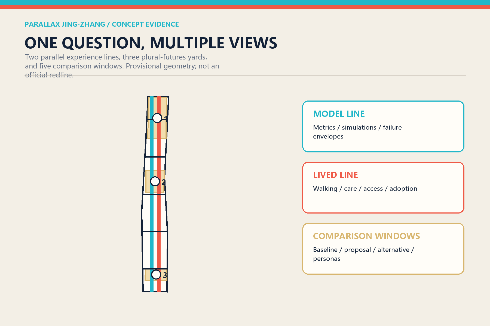
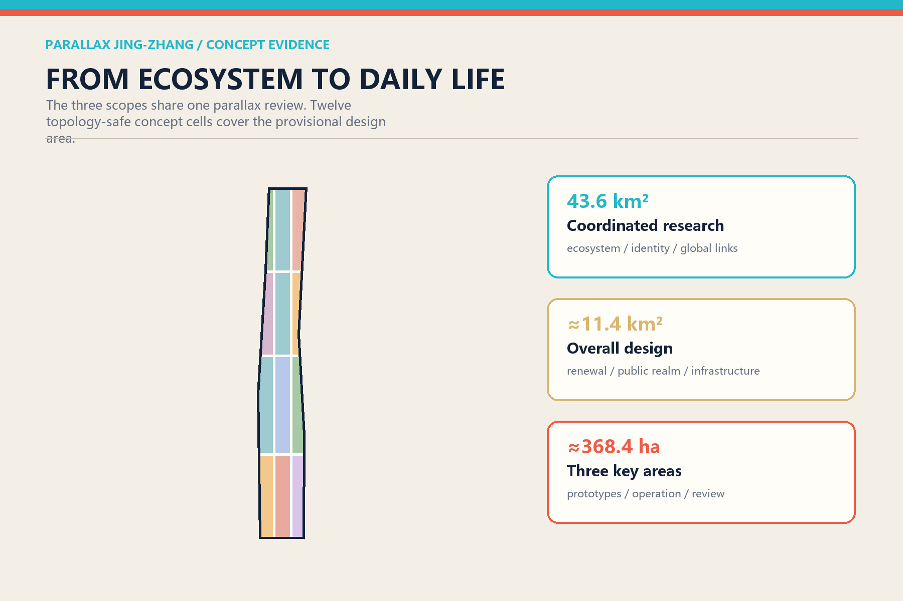
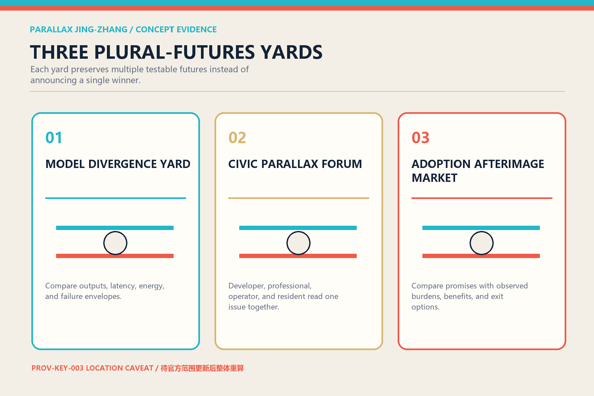
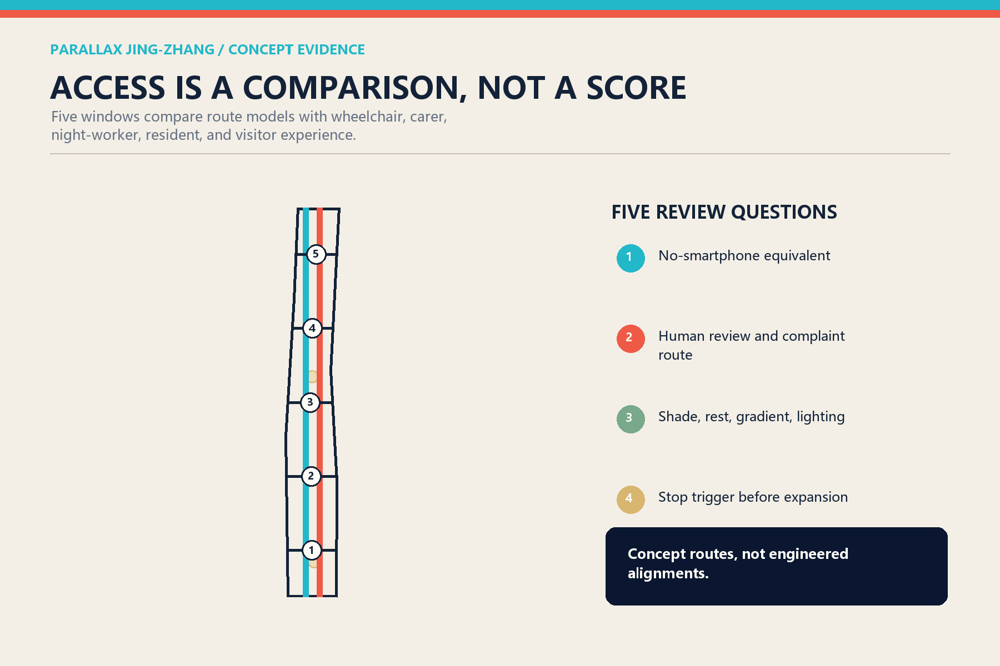
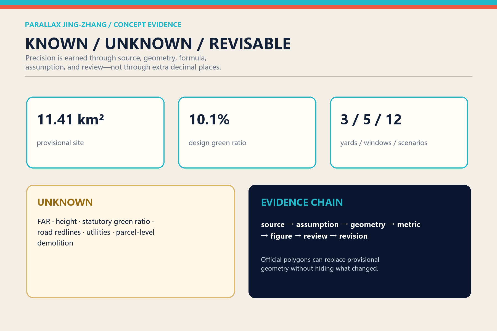

# PARALLAX JING-ZHANG

> **The scarce resource in a future city is not another automated answer. It is public space where different answers can be seen, compared, challenged, and corrected.**

## Design Basis and Source List

The official announcement controls the three planning scales, the three key areas, and the people-city-industry objectives. The repository taskbook, standards snapshots, enums, provisional geometry, and validation scripts form the working contract. The overall boundary is a provisional reconstruction whose projected area is approximately 11.41 million square metres, not an official redline. The three key-area polygons are also provisional, and PROV-KEY-003 has a repository-recorded location caveat. The package therefore separates design precision from boundary precision: spatial mechanisms are discussable, while statutory controls, engineering alignments, parcel decisions, and financial commitments remain unknown.[source:OFFICIAL-ANNOUNCEMENT]

Evidence is split into sources, explicit assumptions, nine spatial layers, and metrics that label only reproducible values as known. Because official control-plan, ownership, building survey, utilities, heritage, and control-line data are unavailable, the constraints layer intentionally remains empty. An explicit gap is safer and more replaceable than fabricated precision.[depth:existing_conditions_diagnosis]

## Three-Level Scope Framework

The 43.6-square-kilometre coordinated research area asks how Haidian can sustain a global AI ecosystem. The approximate 11.4-square-kilometre overall design area asks how that ecosystem becomes an everyday city. The three detailed areas ask which spatial prototypes can be responsibly developed by professional teams. Each scale uses the same parallax review: an industry claim needs a spatial host; a spatial claim needs an operator and users; an operating claim needs an alternative and a stop condition.[standard:PROJECT-OFFICIAL-ANNOUNCEMENT]

The structure is one parallax corridor, three plural-futures yards, and five types of comparison windows. Two conceptual experience routes sit roughly 350 metres apart. The Model Line communicates sensing, simulation, and system metrics. The Lived Line communicates walking, care, commerce, accessibility, and everyday friction. Five east-west links compare access, comfort, ecology, adoption, and public trust. They are experience networks, not proposed road redlines.[data:geometry/roads.geojson#ROAD-PX-MACHINE]

## Coordinated Research Area: Industry and Future City Research

Many innovation-district narratives present universities, laboratories, capital, and firms as a frictionless pipeline. Parallax treats productive disagreement as infrastructure. Researchers value reproducibility; firms face adoption cost; public authorities need accountable boundaries; residents ask who actually benefits. Seven cases become institutional components rather than copied forms: Helsinki's public AI register, Singapore's AI Verify ecosystem, NIST AIRC, NIST TEVV, the UK AI Security Institute's comparative evaluations, Montréal's research-talent-business density, and Vector Institute's bridge between research and responsible adoption.[source:HELSINKI-AI-REGISTER] [source:SINGAPORE-AI-VERIFY]

The resulting loop is origin, verification, adoption, and retrospective review. Zhongzhiyuan hosts stack-level testing; the AI Origin Community hosts university transfer, reproduction, and public explanation; Dazhongsi hosts device adoption, market feedback, and content experiences. The two wings provide professional services and real-life testing. Every adoption should return failure modes and the profiles of people who did and did not benefit, not only transaction figures.[depth:overall_spatial_structure]

The identity is an original pair of offset lines: vermilion for lived experience and cyan for machine representation. Their overlap creates a viewing window. The English name preserves the memory of railway tracks while changing their meaning from identical direction to a shared question seen from different positions.

## Overall Design Area: Urban Renewal and Regulatory-Plan-Level Urban Design

Twelve topologically complete concept cells cover the provisional boundary using only registered land-use codes. Research, education, culture, community services, commerce, housing, and green space alternate around the two experience lines. Comparison enters everyday ground-floor life instead of being isolated inside an exhibition hall. The polygons cover the site without area overlap, but this computational fact is not a statutory approval. Twelve building shapes are program envelopes used to test adjacency, not claims about real buildings.[standard:MNR-LAND-USE-CLASSIFICATION-GUIDE]

Renewal proceeds from interface to host to institution. Reversible tables, bilingual wayfinding, shade, and portable displays can establish comparison windows first. Spatial hosts follow only after controls and surveys are available. Continuous evaluation, complaint handling, and annual review come last. FAR, height, density, setbacks, road sections, and bridge feasibility remain unknown. Character guidance is relational: permeable ground floors, divided long façades, visible reversible construction, brick red, pale stone, timber, and low-reflectance metal.[depth:development_intensity_controls]

Every project is represented by three adjacent cards: current baseline, proposed change, and no-build or alternative option. Uncertainty moves from the footnote to the principal civic experience. This is the project's key distinction from a single final masterplan.

## Detailed Design of Key Areas

The Model Divergence Yard in Zhongzhiyuan compares multiple models, chips, and tools on the same task. Three interfaces disclose result differences, energy-latency-failure envelopes, and human review records. It does not crown a permanent best model; it publishes suitable and unsuitable conditions. The garden also provides shade, rainwater functions, and outdoor evaluation space, subject to official river and flood information.[data:geometry/key_areas.geojson#PROV-KEY-001]

The Civic Parallax Forum in the AI Origin Community uses four seats for one question: a developer explains mechanism, a professional explains boundaries, an operator explains cost, and residents or users describe consequences. Publication begins a return path instead of ending one. Recognition includes reproductions, negative results, and repairs alongside successful releases.

The Adoption Afterimage Market in Dazhongsi compares product promises with the afterimage of use: whose time was saved, whose burden increased, whether a non-smart path remains, and whether migration is possible after vendor exit. Four-quadrant connectivity is framed as an experience objective, not an engineered alignment. The PROV-KEY-003 caveat is displayed and all downstream geometry will be recomputed when official data arrives.[source:PROVISIONAL-BASIS]

## AI Innovation Ecosystem, Personas, and AI+ Scenarios

Six personas have equal rights to contest and revise the system: open-source developers; start-ups; enterprise product leads; nearby residents; university researchers and students; and older, disabled, or temporarily digitally excluded users. Personas support service design but do not become identifiable individual profiles. Each scenario must disclose its minimum data, human reviewer, complaint path, equivalent non-smart route, and stop trigger.[standard:BARRIER-FREE-ENVIRONMENT-LAW]

Twelve cards use the same-question/different-view format: multi-model street questions; edge-compute energy comparison; route prediction versus walking diaries; flood simulation versus field inspection; AI wayfinding versus human guidance; service agent versus human specialist; releases plus negative-result archive; provenance-labelled generated content; device trials with seven-day return visits; care suggestions with human confirmation; crowd models plus on-site safety staff; and three-panel renewal alternatives. Three industrial test scenes address stack interoperability, accessible public-service agents, and device migration plus long-term adoption.[metric:scenario_card_count]

Success is not a flawless demo. It is the ability to catch failure, support different users, preserve a human route, and continue after a vendor leaves. Tests begin in a sandbox, proceed to a bounded participant group, and expand only after accountable review. High-risk judgments remain with named professionals.

## Land Use, Building Scale, and Retain-Renovate-Demolish Strategy

The twelve land-use cells are a structured discussion base, not parcels or rezoning proposals. Research and education support reproduction and talent circulation; culture and squares support public explanation; commerce and community services test real adoption; parks connect ecological performance to public life. Each cell carries a machine-readable concept-only regulatory status.[data:geometry/land_use.geojson#LU-PX-06]

No building-by-building retain, renovate, or demolish decision is made because surveyed building and ownership data are missing. The building layer contains four program envelopes in each key-area role: laboratory, incubator, cultural explanation, and community service. Professional development must begin with survey, ownership, structural safety, and heritage checks, then apply retain-first, low-disturbance retrofit, reversible addition, and only-when-necessary new build.[data:geometry/buildings.geojson#BLDG-PX-01]

FAR, height, and statutory green ratio are null in the metrics file. The repository also lacks an official full text for the architectural design-depth reference, so the gap is recorded rather than replaced with an unofficial mirror.[standard:MOHURD-ARCH-DESIGN-DEPTH-2016]

## Transport, Rail, Municipal Infrastructure, and Public Services

The parallel lines are not motor roads. The Model Line favours cycling, visible sensing, and metric explanation. The Lived Line favours walking, rest, care, local commerce, and accessibility. Five transverse windows compare the same destination through navigation models, wheelchair users, carers with pushchairs, night workers, and visitors. Geometry supplies route lengths, but sections, gradients, crossings, and safety require transport design.[data:geometry/roads.geojson#ROAD-PX-LIVED]

Municipal and digital infrastructure use visible service cabinets that disclose energy ranges, queues, retention periods, outage state, and a human contact without exposing personal inputs or trade secrets. Distributed energy, edge compute, drainage, and communications remain interfaces, not load or capacity calculations. Public services keep an equivalent no-smartphone route, especially in legally enumerated medical, social-security, finance, and payment contexts; this statement is not generalized into an unsupported universal legal claim.[depth:municipal_new_infrastructure]

## Blue-Green Network, Public Space, and Urban Character

A green spine follows the Model Line with shade, rain gardens, and slow mobility. Three ecological yards occupy the key-area roles, while five transverse public interfaces make east-west stitching visible. Green and public-space areas are calculated as separate unions because ecological performance and public use can overlap. They must not be added together as a false total.[metric:green_ratio]

Four low-scale pilgrimage landmarks avoid spectacle. An Error Clock displays confidence ranges; Centennial Twin Tracks combine railway measure with version history; the Undecided Table preserves conflicting evidence; and the Afterimage Gate keeps promises beside observed outcomes. None depends on giant screens, corporate logos, or a personified AI icon.

The character language is offset without rupture. Brick-red and cyan lines remain slightly displaced across wayfinding, paving joints, shade structures, and publications. From afar they form one corridor; nearby they reveal different positions. Railway memory becomes a method: gauge enables coordination, while parallax enables correction.[standard:MOHURD-URBAN-DESIGN-MEASURES]

## Renewal Projects, Implementation Policy, and Phasing

Eight projects form the implementation list: five portable comparison windows; the three named yards; accessible twin-line walks; public AI system cards; four cultural landmarks; and an offline Parallax Atlas. Each record includes a baseline, proposal, alternative, dependency, operator, exit condition, and annual review field. Nothing without ownership, funding, or approval evidence is described as committed.[depth:renewal_project_list]

Phase 1 is a reversible 0–18 month pilot. Phase 2, from 18–48 months, begins only after official controls, accountable operation, and public comment. Phase 3 starts after four years and uses post-occupancy evidence to expand, alter, or remove interventions. Expansion is not pre-defined as the only success.[data:geometry/phasing.geojson#PHASE-PX-1]

Operations follow one week, one season, one year: weekly same-question tests, quarterly multi-role review, and an annual Parallax Almanac that records successes, failures, unresolved questions, and retired projects. Recognition values maintainers and problem finders as well as inventors.

## Metrics, Area Recalculation, and Compliance Matrix

Spatial metrics are recomputed from one geometry set: provisional site area, design green and public-space areas and ratios, concept footprints, twin-route length, and transverse links. Content counts include three yards, five windows, twelve scenarios, six personas, three industrial tests, four landmarks, and seven cases. Statutory indicators remain separate from post-pilot operating indicators.[metric:site_area_sqm]

The compliance matrix covers seventeen announcement requirements and six agent-taskbook requirements. The standards matrix answers each professional basis, while the depth matrix links fifteen design-depth items to chapters, drawings, geometry, metrics, and checks. Counts establish coverage, not quality; quality depends on alternatives, human review, and stop conditions.[depth:metrics_recalculation]

## Risk, Copyright, and Compliance

The principal risk is misreading provisional geometry, concept land use, demonstrations, or operating aspirations as approved facts. The package repeats provisional and concept labels across geometry, narrative, HTML, and PDF; keeps constraints empty; and stores unavailable metrics as null. Public AI services should use lawful sources, data minimization, generated-content labelling, complaint routes, and human review. Applicability of filing, security evaluation, or other legal duties must be determined by accountable operators and counsel.[standard:GENERATIVE-AI-INTERIM-MEASURES]

All authored text, programmatic figures, bilingual pages, and PDFs are original for this submission and licensed CC BY 4.0. External official and institutional sources support facts and methods; their logos, page design, and restricted images are not copied. The cover, corridor plan, sections, axonometric prototypes, and comparison windows are drawn locally from the submitted GeoJSON and proposal parameters; no photography, generative imagery, or third-party map is used as spatial evidence. Methods and limitations are recorded in `report/copyright_statement.md`. The offline pages load no remote fonts, map tiles, trackers, or APIs. Professional planning, architecture, transport, utilities, landscape, legal, and accessibility review remains required.

## References

Seven international cases and every official or institutional entry are recorded in `sources.json`. Local standards snapshots live under `brief/site-package/standards/references/`. Case practices are not presented as Beijing rules; they are design lessons attached to adjacent claims.[source:NIST-TEVV]

The project's most reusable output is not a final masterplan but a public design protocol. Anyone may add a perspective, provided they disclose evidence, conditions of use, who benefits, who does not, and how to exit. Geometry can change with official data, and the proposal itself can change with lived experience.
