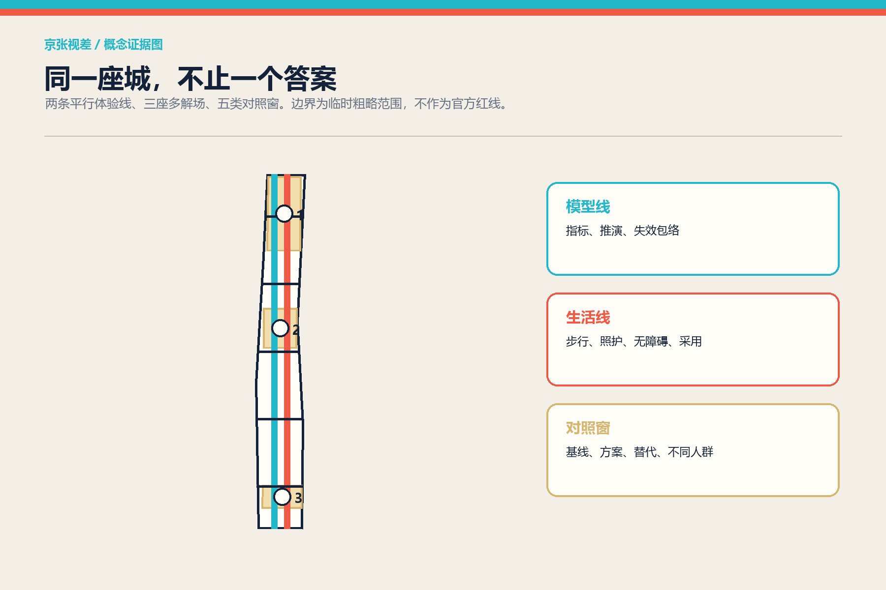
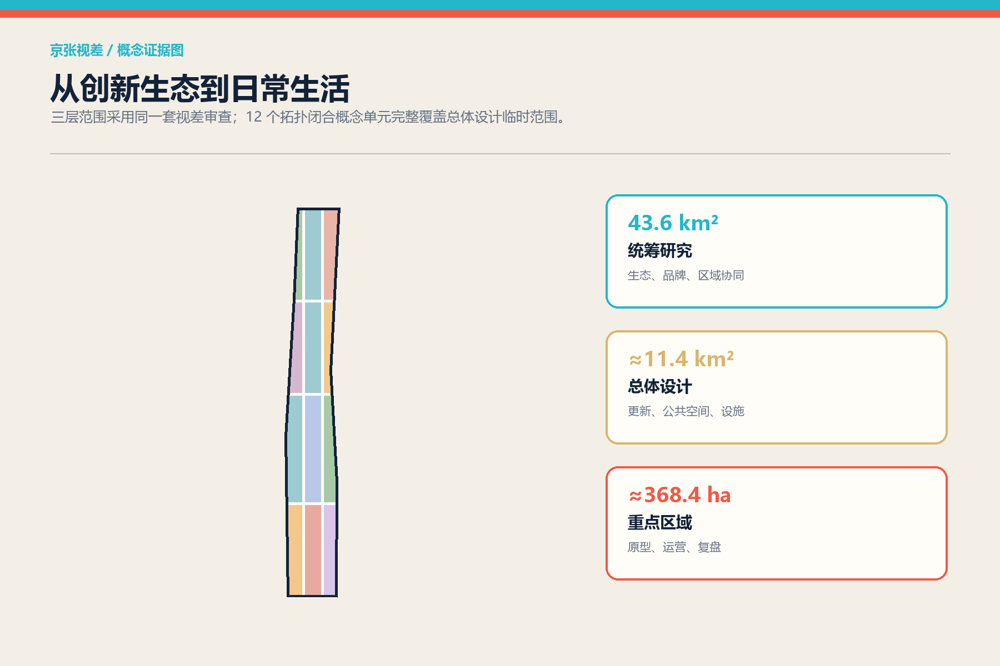
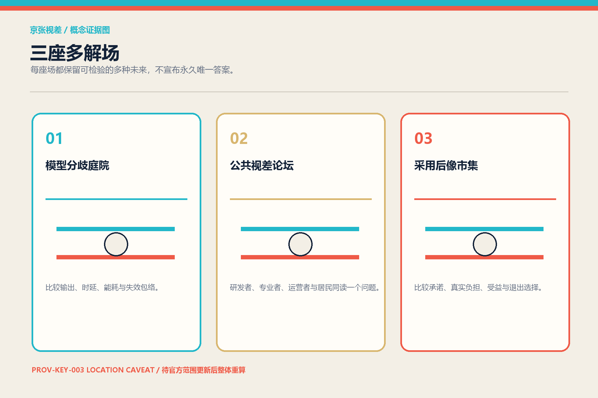
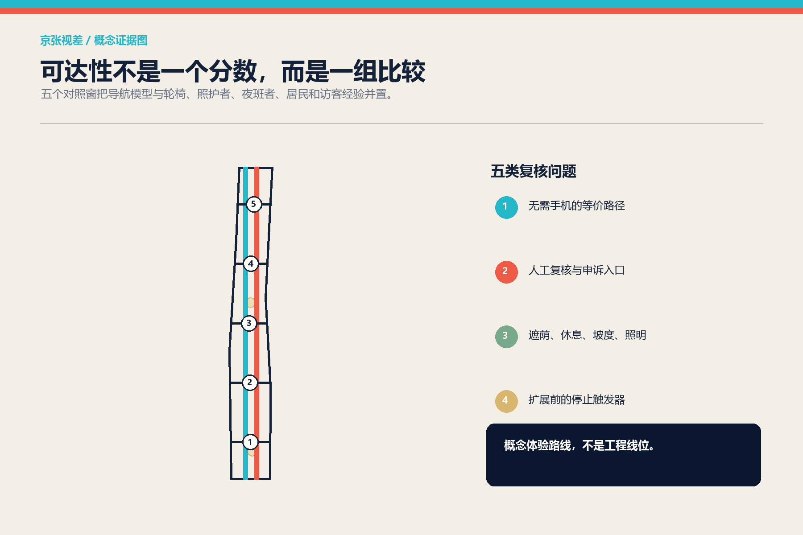
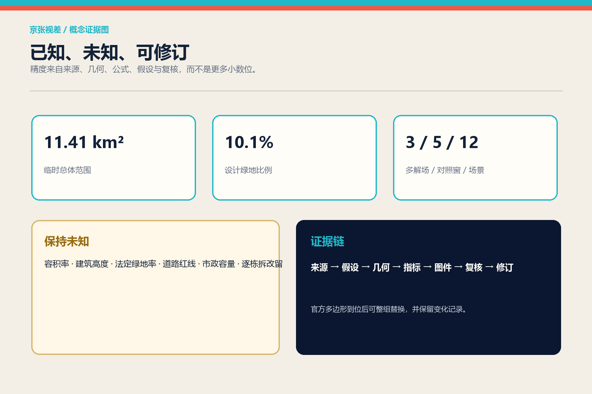

# 京张视差 / PARALLAX JING-ZHANG

> **一句话判断：未来城市最稀缺的不是更多自动答案，而是让不同答案被看见、比较、质疑和修正的公共空间。**

## 设计依据与资料清单

本方案以官方公告规定的三层范围、三处重点区域和“人—城—产”目标为主控依据，以仓库任务书、标准快照、分类枚举、临时几何和校验脚本为工作合同。总体设计范围采用仓库登记的临时粗略边界，投影复算面积为约 1,141 万平方米；它只用于概念生成与一致性检查，不是官方红线。三处重点区也为 provisional，其中南部 PROV-KEY-003 存在仓库已记录的位置疑点。因此，本方案把边界精度与设计精度分开：空间机制可以讨论，法定控制、道路工程、具体拆改留和投资承诺保持 unknown。[source:OFFICIAL-ANNOUNCEMENT] [source:PROVISIONAL-BASIS]

证据被分为四层：`sources.json` 记录外部与仓库来源，`assumptions.json` 记录缺口，九个 GeoJSON 图层提供可计算空间对象，`metrics.json` 只把能复算的数值标为 known。官方控规、道路红线、权属、现状建筑、市政、文保和蓝绿控制线均未取得，`constraints.geojson` 因而有意保持空集。保留空集比画出伪约束更诚实，也使后续官方数据能够无歧义替换。[standard:MOHURD-CONTROL-DETAILED-PLANNING] [depth:existing_conditions_diagnosis]

## 三层范围工作框架

43.6 平方公里统筹研究范围回答“海淀怎样形成全球 AI 生态”；约 11.4 平方公里总体设计范围回答“创新生态怎样落成日常城市”；约 368.4 公顷重点区域回答“哪些空间原型能被专业团队继续深化”。三层之间采用同一套“视差审查”：宏观产业主张必须找到空间承载，空间主张必须找到运营者与使用者，运营主张必须公开替代方案与停止条件。这样，战略、总图和节点不再是三套互不相认的语言。[standard:PROJECT-OFFICIAL-ANNOUNCEMENT] [depth:three_level_scope_framework]

总体结构为“一条视差线、三座多解场、五类对照窗”。“视差线”不是新增道路红线，而是由相距约 350 米的两条概念体验线组成：模型线展示传感、推演与系统指标；生活线记录步行、照护、经营与无障碍体验。五处东西向对照窗把两线连接，分别比较可达性、舒适度、生态表现、产业采用和公共信任。三座多解场位于三类重点区角色中，允许相同问题同时保留多套可检查的方案。[data:geometry/roads.geojson#ROAD-PX-MACHINE] [metric:comparison_window_count]

## 统筹研究范围产业与未来城市研究

多数 AI 创新区方案把高校、实验室、资本和企业列成一条顺畅管线；京张视差刻意加入“分歧的生产力”。科研机构关注可复现，企业关注采用成本，城市管理关注责任边界，居民关注生活是否真正改善。七个国际案例不被复制为形式，而被转译为七种制度部件：赫尔辛基的公开登记、Singapore AI Verify 的共享测试、NIST AIRC 的跨角色风险资源、NIST TEVV 的生命周期验证、英国 AISI 的比较评测与局限说明、蒙特利尔的研究—人才—企业密度、Vector Institute 的研究与应用桥接。[source:HELSINKI-AI-REGISTER] [source:SINGAPORE-AI-VERIFY] [source:NIST-AIRC]

由此形成“策源—复核—采用—回看”生态回路。众智园承担自主栈和测试验证；AI 原点社区承担高校成果、多模型复现和公众解释；大钟寺承担终端采用、市场反馈与内容消费；中关村科技服务翼提供法务、知识产权、资本和国际合作接口；小月河场景翼把结果放回真实生活。每次采用都必须回传失败类型、受益人群和未受益人群，成为下一轮研究问题，而不是只回传交易额。[depth:overall_spatial_structure] [source:VECTOR-INSTITUTE]

品牌符号不是一个封闭徽章，而是一对可独立又可叠合的偏移线：朱红线代表人的经验，青色线代表机器的表征；两线交叠处形成“视窗”。英文名 `PARALLAX JING-ZHANG` 保留铁路双轨的记忆，却把“同轨同向”改写为“同题多视角”。图形由本方案本地程序绘制，不依赖企业标识或第三方字体资产。

## 总体设计范围城市更新与控规深度城市设计

总体用地采用 12 个完整无缝的概念单元，代码只使用仓库登记的国土空间用地分类子集。科研、教育、文化、社区服务、商业和绿地围绕两条体验线交替布置，使“比较”发生在日常经过的首层界面，而不是孤立展馆。图层完整覆盖临时边界且无面重叠；这是拓扑事实，不是控规审批结论。建筑基底为 12 个 program envelopes，用于测试场景邻接，明确不指向任何真实建筑拆除。[standard:MNR-LAND-USE-CLASSIFICATION-GUIDE] [data:geometry/land_use.geojson#LU-PX-01]

更新方法是“先界面、后载体、再制度”。第一步用可移动桌台、双语导视和低扰动遮荫形成对照窗；第二步在官方条件明确后改造或嵌入多解场；第三步才把持续评测、公开申诉和年度复盘纳入运营。所有建筑高度、容积率、密度、退线、道路断面与桥隧可行性均标记 unknown。风貌导则只提出尺度关系：沿遗址公园保持开放首层、细分长界面、显露可逆构造，材料采用铁路砖红、浅石、木与低反射金属；具体数值由后续控规与建筑专业确定。[depth:development_intensity_controls] [depth:height_massing_character]

相较“先画终局蓝图”，视差方法为每个项目保留三张并排卡：现状基线、建议改变、不建设/另一方案。公众不必先相信 AI，便可以从自己关心的维度比较。这也是本方案脱颖而出的关键：城市设计不是把不确定性藏进脚注，而是把它做成空间的主要体验。

## 重点区域详细设计

**众智园·模型分歧庭院**把自主模型、芯片与工具链的差异转成可参观测试。三个连续界面分别展示同一任务的结果差异、能耗/时延/失效包络、人工复核记录。庭院不评选永久“冠军模型”，而公布适用条件和不可用条件。绿色空间承担雨洪、遮荫和室外评测的双重作用；具体清河边界与防洪条件待官方数据确认。[data:geometry/key_areas.geojson#PROV-KEY-001] [depth:three_key_area_detailed_design]

**AI 原点·公共视差论坛**围绕高校成果转化设置四席同题评议：研发者说明原理，规划与伦理专家说明边界，运营者说明成本，居民/使用者说明真实后果。论坛连接模型线与生活线，形成“发布不是结束”的回访路径。开源贡献以可复现实验、负结果和修复记录共同计入荣誉，不把流量等同价值。

**大钟寺·采用后像市集**比较产品承诺与使用后的“后像”：节省了谁的时间，增加了谁的负担，离线或人工替代是否可用，供应商退出后能否迁移。四象限步行连通只提出体验目标与比较方法，不声称工程线位。PROV-KEY-003 的位置疑点在图面显著标注；待官方范围更新后整组几何、指标和图纸重算。[data:geometry/key_areas.geojson#PROV-KEY-003] [source:PROVISIONAL-BASIS]

## AI 创新生态、人才画像与 AI+ 场景

六类画像共同拥有否决与修正权：开源开发者关注复现与声誉；初创团队关注低成本测试和合规支持；企业产品负责人关注迁移、维护与采用；周边居民关注宁静、照护和公平；高校师生关注成果转化与学术独立；老人、残障者和临时数字困难者关注不依赖手机的完整路径。画像只用于服务设计，不建立可识别个人档案。[standard:BARRIER-FREE-ENVIRONMENT-LAW] [depth:risk_missing_data]

十二张场景卡被组织为“同题不同视角”：01 多模型街头问答；02 端侧算力能耗对照；03 慢行模型预测与居民步行日志；04 雨后积水模拟与现场踏勘；05 AI 导视与无手机人工导览；06 企业服务智能体与真人专员；07 开源成果发布与负结果档案；08 生成内容展览与来源标识；09 智能终端试用与七日回访；10 社区照护建议与人工确认；11 活动客流预案与现场安全员；12 城市更新方案三联屏。每张卡公开数据最小化、人工复核、申诉入口、替代路径与停止触发器。[standard:GENERATIVE-AI-INTERIM-MEASURES] [metric:scenario_card_count]

三个产业测试场分别位于三座多解场：自主栈互操作测试、公共服务智能体可达性测试、智能终端迁移与长期采用测试。成功不以演示是否顺利判断，而以失败能否被捕获、不同群体是否都能完成任务、供应商退出是否仍可服务判断。任何测试都先沙盒、后限定人群、再决定是否扩展；高风险判断必须由具名专业责任人复核。

## 用地、建筑规模与拆改留方案

用地层的 12 个单元是结构化讨论底图，不是地块确权或调规建议。科研和教育单元为模型复现与人才流动提供载体；文化与广场单元承接公共解释；商业和社区服务单元承接真实采用；公园绿地单元把生态表现纳入同题比较。每个单元带有 `regulatory_status=concept_only_pending_official_control_plan`，便于机器审查避免把概念误读为法定用途。[data:geometry/land_use.geojson#LU-PX-06] [depth:land_use_layout]

现状建筑数据缺失，因此不做逐栋“拆改留”。`buildings.geojson` 只绘制三组、每组四个概念载体包络：实验室、孵化器、文化解释空间与社区服务。深化顺序为：先完成现状测绘、权属、结构安全和文保核查；再按“保留优先—低扰动改造—可逆加建—必要时新建”评估；最后由专业团队形成逐栋决策。当前可复算的建筑基底面积只表示方案包络，不表示建设规模。[data:geometry/buildings.geojson#BLDG-PX-01] [metric:building_footprint_area_sqm]

缺少的容积率、建筑高度和法定绿地率在 `metrics.json` 中均为 unknown，避免常见的伪精确。建筑专业深度规定的官方正文在仓库尚未取得，因此只登记为资料缺口，不借用第三方镜像补齐。[standard:MOHURD-ARCH-DESIGN-DEPTH-2016] [assumption:A-BUILDINGS-001]

## 交通、轨道、市政与公共服务设施

两条平行线不是机动车道路：模型线优先承载骑行、传感展示和指标解释；生活线优先承载步行、休息、照护、社区商业与无障碍体验。五条横向对照窗把东西向缝合变成可体验任务：同一目的地分别由导航模型、轮椅使用者、推车照护者、夜班员工和访客完成，再比较时间、绕行、坡度感受、照明与人工求助。路线长度由 GeoJSON 在 EPSG:4548 中计算，但断面与交叉口需交通专业复核。[data:geometry/roads.geojson#ROAD-PX-LIVED] [depth:traffic_rail_slow_parking]

市政与新基建采用“可见但不过度暴露”的服务柜：显示能耗范围、算力排队、数据保留周期、故障状态和人工联系人，不展示个人输入或商业秘密。分布式能源、端侧算力、排水和通信只是接口建议；负荷、市政容量、消防与管线均未测算。公共服务必须保留无需智能手机的等价路径，尤其在医疗、社保、金融、缴费等法律列举场景中提供现场指导或人工办理，不能把该条款泛化成未经核实的全场景结论。[depth:municipal_new_infrastructure] [standard:ELDERLY-SMART-TECH-PLAN-2020-45]

## 蓝绿空间、公共空间与城市风貌

视差绿脊沿模型线形成遮荫、雨水花园与慢行复合带，三座生态庭院嵌入重点区角色，五个横向公共界面把东西联系可视化。绿地和公共空间面积来自设计图层的 union 复算；它们可能相互叠合，因而分别表达生态绩效与公共使用权，不相加为“总开放空间”。这一区分避免重复计量，也让后续官方绿线替换更清晰。[data:geometry/green_space.geojson#GREEN-PX-SPINE] [metric:green_ratio]

四个“朝圣地标”均是低尺度公共装置：北端“误差钟”以光影显示不同模型置信区间；清华园记忆节点“百年双轨”把铁路刻度与版本时间线叠合；原点“未决桌”保留相互冲突但有证据的方案；南端“后像门”在采用后持续展示承诺与观察差距。它们不使用巨型屏、企业 logo 或拟人化 AI 偶像，避免以奇观替代公共性。

城市风貌采用“偏移而不撕裂”：砖红与青色两套细线在导视、铺装接缝、遮荫构件和图册中保持微小错位；远看形成统一走廊，近看显露不同观点。铁路文化不是背景贴图，而是比较方法的历史隐喻：轨距让列车协同，视差让城市保留校正能力。[standard:MOHURD-URBAN-DESIGN-MEASURES] [depth:blue_green_public_space]

## 更新项目清单、实施政策与分期计划

项目清单包含八项：PX-01 五个可移动对照窗；PX-02 模型分歧庭院；PX-03 公共视差论坛；PX-04 采用后像市集；PX-05 双线无障碍踏勘；PX-06 公开 AI 系统卡；PX-07 四座文化地标；PX-08 离线视差图谱。每项都有基线、建议、替代方案、依赖、运营者、退出条件和年度复盘字段。没有权属、资金与审批依据的内容只写成概念建议。[depth:renewal_project_list] [source:AGENT-TASKBOOK]

阶段一是 0—18 个月的可逆试点：用临时设施完成五个对照窗和三类踏勘，任何安全或公平问题可在 48 小时内停止展示。阶段二是 18—48 个月：在官方控制、运营责任和公众意见明确后推进三座多解场及建筑载体。阶段三是 4 年后：根据入住后评估决定扩展、调整或撤除；不把“扩展”预设为唯一成功结果。[data:geometry/phasing.geojson#PHASE-PX-1] [depth:phasing_implementation]

年度运营建议为“一周、一季、一年”：每周同题开放测试；每季由居民、开发者、专业人员和运营者共同审阅分歧；每年发布“京张视差年鉴”，同时记录有效方案、失败方案、未解决问题和退出项目。传播不以排名羞辱参与者，贡献荣誉同时认可复现者、问题发现者与维护者。

## 指标体系、面积复算与合规矩阵

核心空间指标由同一组几何重算：临时边界面积、设计绿地面积及比例、公共空间面积及比例、概念建筑基底、两线长度与五条横向联系。内容指标则计数 3 座多解场、5 个对照窗、12 张场景卡、6 类画像、3 个产业测试、4 个地标和 7 个国际案例。法定与运营指标被明确分开：前者等待官方条件，后者需试点后才产生基线。[metric:site_area_sqm] [metric:public_space_ratio]

`compliance_matrix.json` 覆盖公告 17 项与智能体任务书 6 项；`standard_matrix.json` 对必需专业依据逐条回应；`design_depth_matrix.json` 将 15 个深度项与章节、图件、几何、指标和自检关联。数字不被当成装饰：例如绿地率是本设计图层的 ratio，不是法定绿地率；场景卡数量证明覆盖，不证明质量；质量由是否存在替代路径、人工复核与停止条件判断。[depth:metrics_recalculation] [source:SITE-PACKAGE]

## 风险、版权与合规说明

最大风险不是“模型不够先进”，而是把临时边界、概念用地、场景演示或运营愿景误读为已批准事实。为此，图层属性、正文、HTML 和 PDF 重复标注 provisional / concept；约束层保持空；未知指标保持 null。涉及公众的 AI 服务遵循合法来源、数据最小化、生成内容标识、投诉入口和人工复核；具体服务是否适用备案、安全评估或其他义务，须由责任主体依法判断，本方案不作法律结论。[standard:GENERATIVE-AI-INTERIM-MEASURES] [depth:risk_missing_data]

所有文本、程序化图件、双语页面和 PDF 由本次参与原创生成，以 CC BY 4.0 提交；官方与机构来源只作事实和方法引用，不复制其页面视觉、logo 或受限图像。封面、总图、剖面、轴测原型和比较窗口均由本地程序从提交 GeoJSON 与方案参数绘制，不使用摄影、生成式图像或第三方地图作为空间证据；生成方法和局限详见 `report/copyright_statement.md`。网页完全离线，不调用远程字体、地图瓦片、追踪脚本或 API。专业规划、建筑、交通、市政、景观、法律与无障碍结论仍需相应责任人复核。

## 参考资料

七个案例及官方/机构入口已逐项登记于 `sources.json`；本地标准快照登记于 `brief/site-package/standards/references/`。关键依据包括官方公告、任务书、城市设计管理办法、控规编制审批办法、国土空间用地分类、无障碍环境建设法与生成式人工智能服务管理暂行办法。引用只支持相邻判断，不将案例城市的制度直接宣称为北京现行规则。[source:OFFICIAL-ANNOUNCEMENT] [source:NIST-TEVV]

本方案最重要的可复用资产不是一张终局总图，而是一种公共设计协议：任何人都可以提出新视角，但必须说明证据、适用条件、受益者、未受益者与退出方式。若未来官方数据改变，几何和指标可以重算；若公众经验改变，方案本身也应被允许改变。
