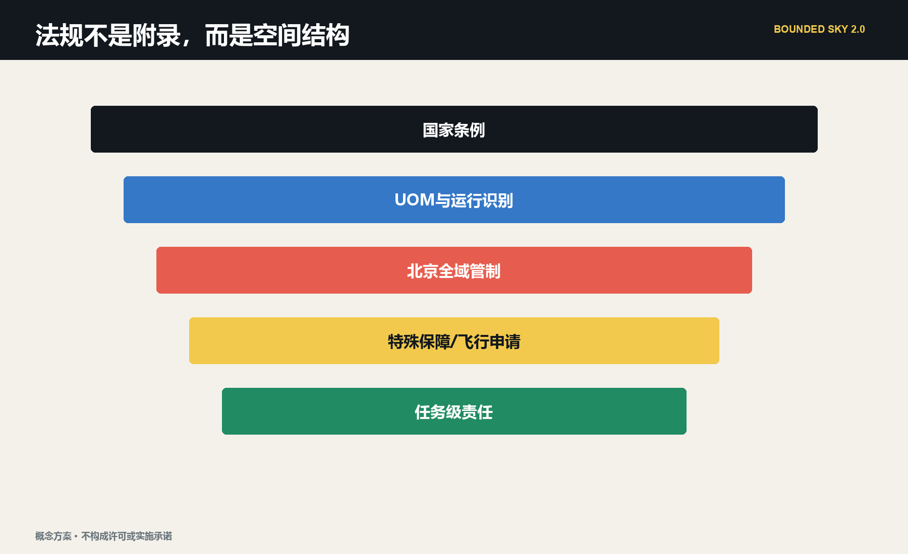
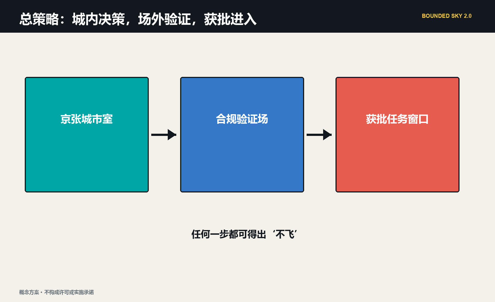
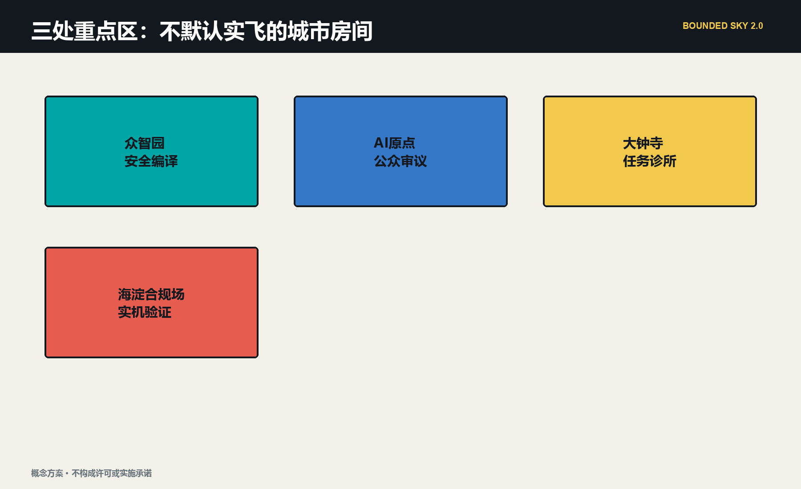
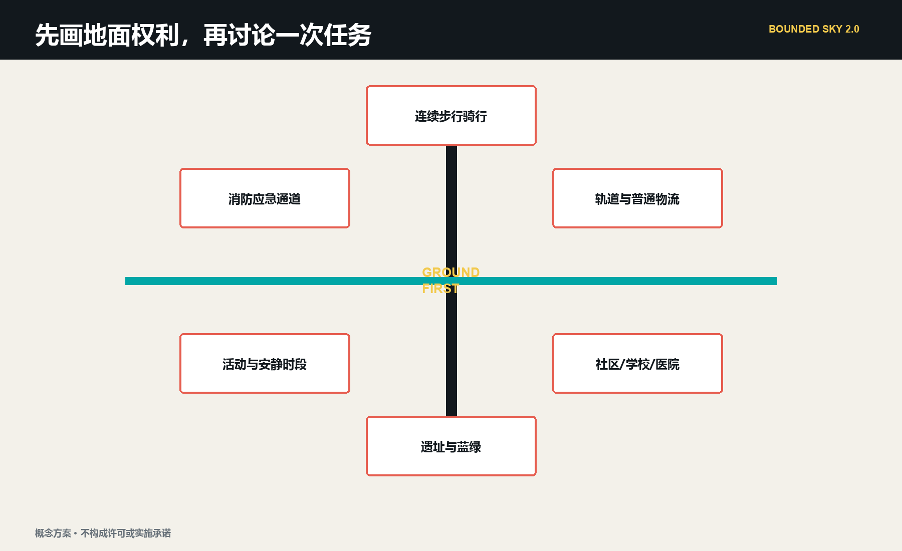
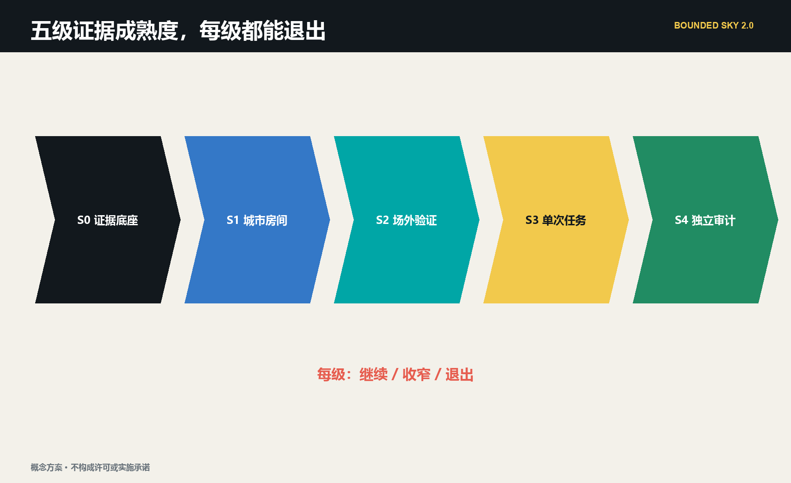

# 天空有边 / BOUNDED SKY：百年京张低空公共协议带

> 城市的天空不是效率的空白页。每一次飞行都在消耗安全、安静、碳、地面占用与公共时间；先把这些代价写进公开账本，再讨论低空经济能够飞多远。

本方案不是航线、机库或飞行表演设计，而是一套面向北京真实管制条件的“城市低空公共服务验证基础设施”。2026 年 5 月 1 日起，北京全域室外无人机活动须申请，六环内无人机及核心部件存储原则上受禁；因此京张沿线三处重点区默认不存机、不建常态机巢、不开放公园航路，只承担数字孪生、任务诊断、公众审议、规则回放和责任展示。实机保管、飞手训练、运行识别和失效验证接到海淀机场或其他经主管部门确认的合规场地；只有应急、消防、医疗、生态或设施维护等任务证明公共必要性，并完成特殊保障、飞行申请、运营、安全、隐私、噪声和地面隔离后，才可能以“一次任务、一个时窗、一名指挥、一套退出动作”临时进入 [source:BEIJING-UAS-REGULATION-2026] [source:BEIJING-UAS-SPECIAL-SAFEGUARD-2026]。

这使“天空有边”从限制技术的口号变成一个可操作的城市设计命题：边界首先是法律边界，其次是公共利益边界，再次是地面空间、安静、隐私、能源和财政边界。Agent 不审批、不操控、不自动扩张，只把真实需求编译成证据缺口、候选方案、地面对照和停止条件，帮助人类判断“是否值得飞、能否合法飞、失败后谁接手”。

## 核心概念与机制：低空预算编译器

“低空预算编译器”把一条自然语言请求编译成可复核的城市动作，而不是把 Agent 当成自动写规划的聊天界面。输入层接收任务主管、受益人、紧迫性、地面对照、概念位置、时窗、运行人和失败代价；约束层叠加北京管制、特殊保障、UOM/运行识别、气象通信、敏感区、隐私、噪声、生态和地面隔离；预算层记录安全、安静/生态、隐私/数据、能源/碳、地面公共空间五本账；决策层只输出拒绝、桌面仿真、场外验证、待补证据、获批任务窗口、终止转地面六类状态；证据层保存版本号、触发的 `stop_if`、人工复核者、事故/投诉与恢复动作 [data:visual/assets/agent-governance.json]。

它采用“三段式责任链”：京张城市室负责需求诊断、数字孪生和公众审议；合规验证场负责设备保管、操控训练、运行识别和封闭实测；获批任务窗口负责一次真实公共任务。三段之间不是自动流水线，任何一段都可作出“不飞”的最终建议。规则或官方边界更新时，Agent 重新编译全部任务、图层和指标；人类委员会可以冻结规则、改写预算或一键否决，结果回到公开账本 [data:simulation.json#SIM-BS-001] [depth:ai_scenario_system]。

## 设计依据与资料清单

方案首先服从征集公告的三层范围、三处重点区域、城市更新、交通市政、AI 场景和公共空间任务；面向智能体任务书补充品牌、案例、场景卡、文化叙事、朝圣节点和长期运营 [source:OFFICIAL-ANNOUNCEMENT] [source:AGENT-TASKBOOK]。公开资料不足以支持真实航路、建筑高度、权属、噪声基线、气象窗口或运营许可，因此临时边界只用于概念拓扑和复算，所有运行性能保持为“待现场测量”或“离线合成压力测试”。正文中的“城市房间”“验证接口”“任务窗口”和“预算”均为可供专业团队深化的设计建议，不是法定空域或政府决定。

政策链分四层。国家《无人驾驶航空器飞行管理暂行条例》规定实名登记、飞行活动申请、安全主体责任、应急处置、网络信息安全和噪声控制；民航 UOM 与 2026 年运行识别规范要求可被识别和监管；北京 2026 年地方规定进一步明确全域管制和六环内存储边界；北京低空经济行动方案则把海淀定位在监管/服务平台、城市低空数字底图、测试验证和应用示范，而不是中央城区批量物流和客运 [source:UAS-INTERIM-REGULATION] [source:CAAC-OPERATING-ID-2026] [source:BEIJING-LOW-ALTITUDE-ACTION-PLAN]。政策支持产业不等于许可项目，这是方案最重要的证据纪律。

需求链来自海淀与北京已公开实践：海淀正在推进高层建筑消防隐患治理、防汛准备和森林防火智慧指挥，已有无人机森林防火巡护、海淀机场科研验证和消防飞手训练；北京洪涝救援已使用无人机开展应急通信和监测。这些材料证明“应急、消防、巡检、验证”值得继续研究，却不能证明京张的点位、频次和设备已经可行 [source:HAIDIAN-EMERGENCY-NEEDS-2026] [source:HAIDIAN-AIRPORT-PRACTICE-2025] [source:BEIJING-FLOOD-UAS-PRACTICE-2025]。

场地链提醒方案保持克制：京张二期服务近 70 个社区、约 45 万居民、10 余所高校和 40 余家科研机构；遗址公园的首要价值是生态、文化、历史展示、休闲和免费公共使用。低空系统必须服务这些密集的真实主体，而不是把公园当成没有地面权利的基础设施走廊 [source:JINGZHANG-PHASE2-CONTEXT] [source:JINGZHANG-PARK-PUBLIC-REALM]。

当前总体边界和三处重点区均来自仓库临时粗略几何，不能用于审批、确权、精确面积或真实飞行规划 [data:geometry/site_boundary.geojson#SITE-001]。取得官方 polygon、建筑与人口敏感点、气象、噪声、通信覆盖和许可资料后，Agent 必须重裁所有图层，重新计算地面与空中预算，重跑 12 项压力测试，并更新五张图、双语网页和 PDF；不能只替换一张底图。

## 三层范围工作框架

三层空间由同一条“真实问题－地面对照－验证证据－人类责任－退出结论”贯通。43.6 km² 统筹研究范围组织北京技术输出、海淀机场等合规验证和京津冀外场接口；11.4 km² 总体设计范围保护地面公共权利，部署数字底图、任务账本和公共审议界面；368.4 ha 三处重点区域分别承担安全编译、公众审议和城市任务诊断。三个尺度都不生成实际航线，越接近真实运行，越必须离开概念图转入主管部门的正式程序 [depth:three_level_scope_framework]。

五维公共预算分别是：安全风险、安静与生态、隐私与数据、能源与碳、地面公共空间。当前 0-100 数值只是离线压力测试单位，不代表分贝、事故概率、碳排、合法数据量或法定容量。预算不能购买硬门：即使公共收益很高，只要许可、运行人、运行识别、气象通信、地面隔离、隐私或人工指挥任一不成立，结论仍是拒绝或回到桌面 [data:geometry/constraints.geojson#BS-CELL-01] [metric:airspace_budget_dimension_count]。

空间骨架升级为“一线、三室、一场、五账、两翼”。一线是京张遗址公园地面公共生活连续线；三室是众智园安全编译室、原点社区公众审议室、大钟寺城市任务诊所；一场是独立合规实飞验证接口；五账是五类公共预算；东翼连接高校、研究机构与专业审查，西翼连接社区、公共服务和地面运营。它把“创新带”从设备走廊改成证据和责任走廊 [data:spatial.json]。

| 层级 | 主要对象 | 可做 | 默认不可做 | 关键产物 |
|---|---|---|---|---|
| 统筹研究范围 | 区域产业与监管协同 | 方法、标准、场外验证网络 | 推定跨区航路与合作 | 验证接口清单、规则版本 |
| 总体设计范围 | 公园、社区、交通、公共服务 | 数字底图、地面对照、公众预算 | 常态航路、机巢与机库 | 敏感受体图、任务账本 |
| 三处重点区 | 可感知的公共界面 | 仿真、展陈、任务诊断、申诉 | 未经批准的室外飞行 | 三类城市房间与责任地标 |
| 获批任务窗口 | 单次公共任务 | 按批准条件执行和审计 | 自动复用和规模扩张 | 任务证据包、事后评估 |

## 统筹研究范围产业与未来城市研究

“天空有边”对应三大定位：世界级 AI 产业的公共验证带、低空系统与城市规划协同的规则实验室、可被公众理解和叫停的未来城市样板。五类功能为研发验证、成果转化、企业服务、人才生活、公共文化；北部众智园侧重全栈验证与安全标准，中部原点社区侧重高校成果转化与公众协商，南部大钟寺侧重城市服务和国际展示，两翼分别连接科研网络与社区产业网络。这一结构回应任务书但不声称形成了既定产业政策 [source:AGENT-TASKBOOK] [standard:PROJECT-AGENT-OPEN-CALL-TASKBOOK]。

产业生态不是“引入更多无人机企业”的名单，而是六类可复核接口：飞控与感知企业提供受限能力；高校提供算法、噪声和人因研究；规划团队定义地面公共权利；运营方提交任务与保险/回退材料；社区代表参与预算和安静时段审议；审计机构保存事件、投诉和恢复记录。区域协同采用接口而非虚构合作：未来科学城可交换测试方法，怀柔科学城可提供科学仪器场景研究，经开区可交流制造与运维规范，京津冀节点可共享匿名化规则模板；任何跨区应用都须重新许可和本地评估。

Agent 的不可替代性来自连续协商而不是“自动写规划”。它需要在不断变化的天气、任务优先级、预算余额、投诉阈值、设备状态和人工指令之间形成可解释方案，保存每次拒绝的理由，并在边界或政策更新时全链复算。人工委员会保留预算设定、敏感区确认、紧急放行和最终否决权；Agent 不能审批、不能替代操控员，也不能把历史偏好变成永久配额 [data:visual/assets/agent-governance.json]。

### 全球案例对照与全栈生态映射

为避免把“世界级生态”写成企业名单，本包选取六个公开案例，只比较空间与治理机制：Kendall Square 对应高校、企业和公共空间的紧凑接口；22@Barcelona 对应存量更新与知识产业混合；King's Cross Knowledge Quarter 对应文化机构、科研组织和公共界面的连续网络；Paris-Saclay 对应跨节点科研协作；Station F 对应共享平台和分阶段创业服务；Toronto Waterfront 对应公共空间优先与技术治理审议。每个案例的可转化机制、不可直接套用的限制和来源状态记录在 `visual/assets/ecosystem-cases.json`，均为 background-only，不支撑本地投资、产值、招商或政策承诺 [source:GLOBAL-CASE-SHORTLIST] [data:visual/assets/ecosystem-cases.json]。

“一线、三室、一场、五账、两翼”对应八要素全栈生态：土地是临时边界与可退出的地面权利；空间是三个城市房间和场外验证接口；产业是飞控、感知、声学、规划、运营与审计网络；资金只作为待核的全生命周期成本与保险约束；人才包括研究者、操控员、维护者、社区审查者和无障碍服务者；算力采用可审计的离线编译与端侧最小化；数据只保留任务必要字段和事件摘要；场景由 12 张卡和四类能力验证驱动。中关村科技服务翼负责方法、知识产权和专业服务，小月河场景赋能翼负责公共体验与地面替代 [depth:ai_ecosystem_mapping] [data:visual/assets/operations-program.json]。

## 总体设计范围城市更新与控规深度城市设计

总体层不先画航线，而是先画“地面优先图”。连续绿地、公共活动界面、学校医院等敏感点、轨道换乘、人群密集时段、消防和维护通道构成低空设计的负空间；只有在这些权利被标注且有人工等价服务后，才讨论单次任务是否值得进入正式申请。原有用地、绿地、公共空间、建筑和慢行图层继续作为结构化底板，概念约束通过 `constraints.geojson` 叠加，不改变临时用地边界 [data:geometry/land_use.geojson#LU-001] [depth:overall_spatial_structure]。

总体空间不画连续开放走廊，而画四类负空间：人员密集和活动时段、学校医院社区等敏感受体、遗址生态和安静空间、交通与应急通道。任何候选任务先从这些负空间中被“扣除”，再讨论是否仍有必要。建筑更新坚持“保留优先、室内优先、可逆嵌入”：城内只部署不含飞行器存储的数字展示、人工服务、声景实验和数据审计界面；不因屋顶看似空闲就推定可起降 [standard:MOHURD-CONTROL-DETAILED-PLANNING]。

城市更新由协议反推空间：地面设置不依赖 App 的任务说明与申诉入口；站点周边保留人工交接和普通物流路径；公园边缘采用可撤除的状态构件；数据设施优先使用端侧处理，只上传任务必要的事件摘要。若普通路径、人工回退或安静边界不能持续，低空服务停止而不是让地面使用者让路。该原则把“可退出”变成城市设计条件，而非软件免责声明 [data:geometry/public_space.geojson#PUBLIC-001]。

## 重点区域详细设计

众智园“安全编译室”对应 AI 全栈自主创新和治理功能。空间原型由任务 schema 工坊、城市峡谷数字孪生、运行识别联调台、失效注入剧场和专业签认室组成，全部可置于既有室内或临时展陈。这里把算法、飞控、通信、气象、人因、保险和应急写成同一份证据包；不存储无人机，不以室内研发反推室外许可。产业价值是形成可复用的测试方法、接口规范和失败案例库，而不是形成飞行吞吐量 [data:geometry/key_areas.geojson#PROV-KEY-001]。

北京 AI 原点社区“公众审议室”对应世界级创新生态与人才生活。它由安静声景室、最小视场体验台、非 App 人工入口、算法公平复演桌和申诉调解墙组成。居民、学生、残障人士、照护者和一线服务人员用合成数据检查：任务是否必要、谁承担噪声、图像是否过度、地面替代是否被忽略。验收不是“支持率”，而是不同群体的影响是否被记录、异议是否能冻结规则、修复是否能回放 [source:PIPL] [data:geometry/key_areas.geojson#PROV-KEY-002]。

大钟寺“城市任务诊所”对应智能原生新业态，但它不做客运或常态配送枢纽。消防、医院、园林、应急、文保和设施维护团队带着真实问题来“挂号”，依次提交受益人、紧迫性、地面基线、任务时限、失败代价和主管责任；Agent 生成三套方案：纯地面、低空辅助、不执行。只有公共价值和完整证据胜过地面对照时，任务才被推荐到场外验证。地面空间优先修补四象限步行、非机动车和人工物流，状态界面不承担默认起降 [data:geometry/key_areas.geojson#PROV-KEY-003]。

三处重点区通过“一场”联动海淀合规验证资源。海淀机场公开实践显示其可服务科研验证、载荷开发、标准研究、巡护与消防训练，但本方案只提出方法接口，不声称已签合作或获授权。送往场外验证的不是商业订单，而是一份包含测试目的、合格判据、失效注入、运行识别、数据处理和人工责任的实验合同 [source:HAIDIAN-AIRPORT-PRACTICE-2025]。

## AI 创新生态、人才画像与 AI+ 场景

七类用户画像决定系统如何治理而非如何营销：应急/消防指挥需要确定的权限链；医疗团队需要端到端责任与冷链证据；园林/文保/市政维护者需要“发现到工单”的闭环；运行人和飞手需要明确批准边界；研究开发者需要可重复测试；残障人士、照护者和非智能手机使用者需要等价地面服务；居民、学生和游客需要安静、隐私、告知与申诉。画像只描述服务角色，不建立个人行为档案 [source:PIPL] [depth:ai_scenario_system]。

十二张场景卡围绕六个公共任务、四个能力验证和两个负向测试展开：灾害通信、高层火情侦察、急救样本/关键物资、汛情测绘、森林绿地火险巡护、遗址/市政设施巡检；运行识别、城市峡谷通信与接管、噪声与人因、网络中断地面恢复；常态餐饮/广告和载人观光/公园娱乐必须被拒绝。每张卡都同时列出城市室、验证场、获批任务窗口、地面对照、最低证据、成功判据和停止条件 [data:visual/assets/scenario-cards.json] [metric:scenario_card_count]。

四类产业验证任务分别是：广播式/网络式运行识别与 UOM 接口；复杂遮挡下通信、定位、失链和人工接管；任务级声学、重复暴露和群体差异；隐私最小化、端侧处理、用途锁定和任务后删除。它们能形成飞控、通信、载荷、人因、声学、合规和城市规划企业共同使用的开放挑战集。Agent 先检查 schema，再输出“桌面、场外、补证、拒绝”，绝不把仿真结果自动升级为飞行 [source:CAAC-OPERATING-ID-2026] [data:simulation.json#SIM-BS-001]。

| 场景组 | 先证明什么 | 主要量化项 | 必须由谁签认 |
|---|---|---|---|
| 应急与消防 | 地面通信/视线确有缺口 | 信息有效性、响应时耗、失链与越界 | 应急/消防指挥、运行人 |
| 医疗 | 时效收益大于新增风险 | 端到端时间、温控、交接完整性 | 医疗责任人、运行人 |
| 生态与维护 | 发现能进入处置闭环 | 误报、工单闭环、影像删除 | 资产主管、园林/文保 |
| 产业验证 | 失效可控、身份可见 | 识别完整性、接管、丢包、声学 | 专业测试与主管部门 |
| 负向测试 | 规则不被商业压力穿透 | 稳定拒绝、理由公开 | 公共治理委员会 |

这不是抽象的算法展示，而是 AI 城市规划闭环：数据输入来自临时 GeoJSON、任务 schema、天气/噪声占位和人工指令；算法负责约束求解、冲突排程、偏差对照和版本化复算；服务对象包括急救人员、维护者、科研团队、残障人士、居民、学生、游客和企业；人工复核决定许可、隐私、应急与最终否决。每次决策都必须回到交通、公共空间、社区治理和产业运营的具体界面，才能进入下一期试验 [data:visual/assets/agent-governance.json] [metric:simulation_success_rate]。

## 用地、建筑规模与拆改留方案

用地结构沿用四类临时分区：AI 研发创新、公园绿地与开敞空间、产业商业服务、社区服务配套。低空协议不创造第五类法定用地，也不以“新基建”名义占用公园：绿地优先安静、生态和遗址体验；社区优先隐私和服务等价；研发区承载室内数字验证；商业区承载任务诊断与公众展示。任何实机存储、充换电、机库、机巢和常态起降均不作为本范围内的默认设施 [source:BEIJING-UAS-REGULATION-2026] [data:geometry/land_use.geojson#LU-002]。

建筑采取“保留、室内轻改、可撤展陈、新建不建议”四级动作。轻改只包括任务柜台、数字孪生屏、声学体验、端侧数据处理和责任账本；可撤展陈包括非飞行器形态的停止钟、账本墙和换手门。没有必要在公共空间展示真实飞行器或电池，避免存储、安全、消防和品牌展销混淆。现有 `buildings.geojson` 只是概念基底，不能推导真实承载、产权或拆改量 [data:geometry/buildings.geojson#BLDG-001]。

体量、建筑高度、开发强度和屋顶形态不由 Agent 猜填。城市风貌控制强调设备不遮挡铁路文化线索、不以企业广告占据公共界面、夜间状态光不制造光扰、所有设施可在试点结束后恢复原状。若专业复核证明某节点不适合，协议允许删除节点而不破坏整体系统；这种“可少做”是有界天空区别于基础设施扩张叙事的实施纪律。

## 交通、轨道、市政与公共服务设施

交通策略始终把步行、骑行、轨道和普通物流放在低空之前。京张遗址公园的连续慢行线是不可被飞行任务侵占的公共底板；大钟寺等换乘节点先解决四象限步行、非机动车和人工交接，再研究低空服务。Agent 每次排程都必须验证地面等价路径是否可用，若转地面会造成新的无障碍或拥堵风险，则任务进入人工协调，而不是简单把成本转嫁给街道 [data:geometry/roads.geojson#ROAD-001] [depth:transport_municipal_facilities]。

城内市政接口被压缩为普通电源、数据沙箱、声学/环境基线仪器和公共状态终端，不设置无人机充换电或存储。真实任务所需的运行识别、通信冗余、气象、应急处置和消防保障由批准文件与运行人证据包定义，不能被城市设计图替代。所有设备以“可维护、可撤除、可审计、不遮挡、不收集无关数据”为准入条件 [source:CAAC-UOM-NOTICE] [source:CAAC-OPERATING-ID-2026]。

公共服务采用双入口：数字入口提交结构化请求，人工入口负责解释、代办、申诉和紧急处置。城市 Agent 可以生成候选排程和影响说明，操控、放行、事故响应、隐私判断和公共预算变更仍由具名责任人完成。网络中断时系统冻结新增任务、保存当前状态、通知人工接管并恢复地面服务；无法完成这一链条时保持关闭 [data:visual/assets/agent-governance.json]。

## 蓝绿空间、公共空间与城市风貌

蓝绿系统不是航路背景，而是首先被保护的敏感主体。清河、小月河、连续绿地和遗址公园承载生态、休憩、运动与历史记忆，方案用低对比临时边界表达定位，用安静边、无持续追踪、鸟类与季节性调查待补、活动时段暂停等规则表达设计态度。绿地和公共空间比例来自当前临时几何，只能用于方案内部一致性检查 [data:geometry/green_space.geojson#GREEN-001] [metric:green_ratio]。

地面公共空间设置三类概念地标：北部“公共停止钟”展示谁能暂停以及如何恢复；中部“天空账本墙”把匿名化预算、拒绝和投诉复演为公共教育；南部“地空换手门”解释轨道、步行、人工物流与低空任务的责任交接。它们共同构成 AI 朝圣路线，但都只是可供景观、无障碍、声学和运营团队深化的建议，不是已建成设施 [metric:ai_landmark_count]。

地标不是一次性雕塑，而是“责任回放荣誉层”和公共空间组件库的载体：只有完成版本化复演、公开理由、限制披露并获得具名人工签认的公共任务，才进入责任回放荣誉层；状态牌、人工服务台、预算刻度、安静边界和回退标识五类组件均可撤、可维护、不阻断步行，并保留纸面和口头入口。组件目录、荣誉规则和三处地标的显示层级见 `visual/assets/landmark-component-library.json` [data:visual/assets/landmark-component-library.json]。

品牌标识是一条被括号约束的京张轨迹：黑色基线代表地面公共权利，青色开放段代表可审查任务，黄色预算刻度代表稀缺额度，珊瑚红只用于暂停和风险。中文“天空有边”与英文“BOUNDED SKY”并列，公共状态不依赖颜色，另配文字、形状和声音提示。城市风貌不追求飞行器满天，而以“看得见规则、看不见技术负担”为目标 [data:visual/assets/identity-system.json]。

文化叙事沿“铁路把远方带到海淀—中关村把知识变成公共协作—AI 让城市学会暂停和复演”三章展开。遗址公园连续地面线是第一章的空间载体，东西两翼的协商节点承接第二章，三处责任地标承接第三章；导视以地面基线、编号刻度、停止符号、换手门和回放时间戳构成语法，中文、英文、非颜色线索和人工解释同时存在。国际传播只使用概念状态文案，明确没有路线、飞行、许可或建成地标，避免把文化叙事变成科技装饰 [data:visual/assets/culture-signage.json] [depth:cultural_storyline]。

## 更新项目清单、实施政策与分期计划

首批十个项目包为：法规与证据底线、官方边界重算器、城市低空数字底图、三处城市房间、公共任务 schema、场外验证接口、12 项挑战集、运行识别/失效测试、公众申诉与修复、年度成本和退出审计。每个包有责任角色、输入、采购/合作边界、停止条件和证据产物；缺少责任人与许可时保持“研究中”，不以展会或招商节点倒逼放行 [data:geometry/phasing.geojson#PHASE-001]。

分期采用五级证据成熟度。S0（0-6 个月）完成法规、官方边界需求、受体和地面对照；S1（6-12 个月）开放城市房间与离线挑战，不接触真实飞行；S2（12-18 个月）在独立合规场地完成设备、运行识别、通信、声学、人因和应急验证；S3 没有固定日期，只在主管部门和任务责任人确认公共必要性后讨论一次获批任务窗口；S4 是独立复盘，只有任务收益、投诉、成本和失败均达到事先标准才允许重复。每一级都可扩展、收窄或退出 [assumption:A-AIRSPACE-AUTH-001] [depth:phasing_implementation]。

| 阶段 | 交付物 | 进入门 | 退出触发 |
|---|---|---|---|
| S0 证据底座 | 来源库、敏感受体、地面对照、责任图 | 任务主管具名 | 无必要性或资料不可得 |
| S1 城市房间 | 数字孪生、场景卡、公众预算、申诉 | 合成/脱敏数据 | 规则无法解释或群体影响遗漏 |
| S2 场外验证 | 运行识别、失效、声学、人因报告 | 合规场地和专业计划 | 安全状态、隐私或恢复不达标 |
| S3 单次任务 | 批准、运行、地面隔离、应急包 | 全部主管门与公众告知 | 任一条件变化或现场指挥终止 |
| S4 审计 | 效益、成本、投诉、事件、删除证明 | 独立复核 | 收窄、暂停或永久退出 |

长期运营建议为“Bounded Sky Open Lab / 有界天空开放实验室”：全球团队面对同一组公开合成任务，不比赛飞得多，而比赛谁能更早识别“不该飞”、谁能用更少数据完成判断、谁的失效和地面恢复最清楚。年度账本沉淀为可复用规则、失败案例和测试方法；该活动尚未获批，不代表政府主办、采购或招商承诺。

运营体系按季度形成“规则校准—封闭验证—公共回放—责任账本”年度循环：开发者从公开任务 schema 和离线回放包进入，运营方补充责任、保险和恢复材料，社区审查规则并发起复演，专业团队在官方资料和许可齐备后决定是否继续。活动品牌只是一套可撤的传播和审计格式，不是注册商标或政府活动安排；每个阶段都保留扩展、收窄、退出三种结论，低空关闭时人工和普通物流服务必须继续。开发者、运营者、社区和机构的后续转化路径及门槛记录在 `visual/assets/operations-program.json` [data:visual/assets/operations-program.json] [depth:long_term_operation]。

## 指标体系、面积复算与合规矩阵

空间已知值只包括当前临时几何可重算的总体面积、建筑基底、绿地比例、公共空间比例和三处重点区数量，均不能替代官方统计 [metric:site_area_sqm] [metric:public_space_ratio]。航路、高度、容量、频次、事故率、居民接受度和运营成本保持未知。新版 KPI 不追求架次，而围绕七个判据：合法批准完整率、运行识别与日志完整率、紧急任务相对地面对照的收益、失效转安全状态、隐私删除与用途锁定、任务事件噪声/投诉、全生命周期公共成本。除合规完整率和数据删除等应为 100% 的底线外，具体阈值必须由基线和试验共同确定，不能由 Agent 猜数。

每次任务的最小审计记录为：需求编号、主管责任人、受益人、地面对照、批准版本、运行人/飞行器身份、时空边界、五维预算、人工指挥、异常、投诉、地面恢复、数据删除、成本和最终“继续/收窄/退出”。公开账本只展示匿名化任务级摘要，不公开姓名、电话、住址或可反推个体的轨迹 [source:PIPL]。

离线仿真包含 12 个结构化任务，所有任务通过 schema 并留下审计；系统对普通商业、隐私越界、网络中断和权限缺失执行预期拒绝或回退，所以“仿真成功率 1.0”只表示控制分支按设计运行，不表示飞行成功 [metric:simulation_task_count] [metric:simulation_success_rate]。一个先到先得的合成对照接受更多请求却产生四次预算越界，而有界策略保持零能耗预算越界；这只是算法压力测试，不是现实世界优越性证明。

合规矩阵逐条映射公告 1.3、1.4、1.5 与 agent.1-agent.6；标准矩阵覆盖城市设计、控规深度、用地分类、无障碍、适老与数据边界；设计深度矩阵把每项判断连接到正文、图层、指标、图纸和自检。任何输入更新都会触发统一流水线：锁定版本、重裁 GeoJSON、复算指标、重跑仿真、重绘中英文图、重生成 PDF/HTML、再执行完整自检 [depth:metrics_recalculation]。

## 技术实施专篇：从概念提案到可深化城市方案

### 1. 成熟城市方案对标与京张适配结论

本专篇的作用不是把已有概念重复一遍，而是回答专业团队接手后最先提出的四个问题：依据什么继续、在哪里继续、由谁继续、继续到什么程度必须停。北京部分对标北京城市总体规划、海淀分区规划和北京城市更新专项规划 [source:BEIJING-MASTER-PLAN-2035] [source:HAIDIAN-DISTRICT-PLAN-2035] [source:BEIJING-URBAN-RENEWAL-PLAN]。低空实施部分对标深圳、上海已经形成政府文件的基础设施和产业行动方案 [source:SHENZHEN-LOW-ALTITUDE-INFRA-2026] [source:SHANGHAI-LOW-ALTITUDE-ACTION-2027]。对标不比较宣传口号，也不把其他城市的设施数量、航线规模和商业目标搬到北京；只比较规划文件如何把目标拆成空间、设施、项目、责任、时序、指标和维护机制。

北京成熟规划的首要特征是“约束先于增量”。总体规划以首都功能、人口资源环境承载力、减量集约、历史文化保护和多规合一统领专项行动；海淀分区规划把科技创新与生态文化、公共服务、空间秩序放在同一张实施框架中；城市更新专项规划强调小规模、渐进式、可持续更新，反对脱离需求的大拆大建。对应到本项目，低空经济不能成为新增建设量和设备采购的免责理由，任何房间、平台或外场接口都应优先复用既有空间、既有机房和既有公共服务流程。方案的建设价值首先体现在减少无效投资、阻止不必要飞行、把已有资源编排成可审计能力，而不是创造一条在当前法规和数据条件下无法成立的“空中景观轴”。

深圳成熟方案的价值在于将低空基础设施拆成起降设施、信息基础设施、创新测试设施和安全管控设施，并进一步形成设施网、空联网、航路网和服务网。文件对每一任务列出牵头单位和配合单位，明确复用与新建、分类与共享、建设与运营之间的关系 [source:SHENZHEN-LOW-ALTITUDE-INFRA-2026]。本方案借用这种系统分解方法，但不借用其高密度起降点、商业航线、载人服务或社区配送目标。京张带位于北京中心城区高敏感环境，且北京 2026 年规定对室外无人驾驶航空器活动实施全域申请批准和严格存放管理，因此本项目的“设施网”主要是城内决策房间、数据接口、公众告知和地面恢复资源；真实飞行设施只能作为场外、独立审批、按任务调用的外部能力。

上海成熟方案的价值在于把产业目标拆成企业培育、关键配套、软硬设施、场景应用和综合保障，并为每项行动配置责任单位；尤其将设施网、空联网、航路网、服务网分别建设，避免用一个展示平台代替完整治理 [source:SHANGHAI-LOW-ALTITUDE-ACTION-2027]。京张项目不承担整机制造和城市级航路建设，但可承担“需求定义、规则验证、任务审计、公众复核、失败回放”四类薄弱环节。换言之，其他城市建设的是可规模运行的供给能力，京张更适合建设首都中心城区的需求筛选与治理能力，两者不是规模竞赛关系。

对标后形成六条不可被后续设计削弱的适配结论。第一，以公共任务为项目入口，不以飞行器、企业或设备为入口。第二，把飞行许可、规划许可、工程许可、数据合规、采购立项分别处理，任何一项不能替代其他项。第三，城市房间只承担决策、模拟、展示和审计，不存放航空器，不预设室外试飞。第四，场外验证场属于外部专业资源，是否使用、使用哪里、如何运输和保管均由独立审批决定。第五，每个场景必须有地面对照和“不执行”选项，证明低空方式具备净公共收益后才可进入下一阶段。第六，规划成果必须可随官方边界、重点区几何、调查数据和法规更新而复算，不能把当前临时图形固化为工程事实。

| 对标层次 | 成熟方案的做法 | 京张适配动作 | 明确不照搬内容 |
|---|---|---|---|
| 城市总体规划 | 资源承载力、减量发展、历史文化、实施体检 | 建立公共利益预算和动态退出机制 | 不新增城市级开发指标 |
| 分区规划 | 科技创新、公共服务、生态文化统筹 | 三处城市房间分工并与社区、高校、机构协作 | 不虚构新的法定功能分区 |
| 城市更新 | 小规模渐进更新、项目库、公众参与 | 优先改造既有室内空间，按项目包推进 | 不大拆大建，不以概念替代立项 |
| 深圳低空设施 | 起降、通导监气象、测试、安全管控分类 | 建立接口清单和外场验证调用标准 | 不采用其数量、半径和商业航线目标 |
| 上海行动方案 | 产业、设施、场景、保障和责任单位 | 建立任务责任矩阵、采购包和年度评估 | 不承担整机产业和载人交通目标 |

### 2. 规划合同、成果深度与使用边界

本方案被定义为“概念城市设计阶段的技术实施建议书”，而不是法定规划、控规调整、建设工程设计、飞行活动申请或政府投资项目建议书。它可以支持三类后续工作：一是帮助规划和城市更新团队判断哪些室内空间、公共服务和数字基础设施值得纳入深化；二是帮助应急、消防、园林、医疗、文保和市政部门把实际问题写成可比较的任务需求；三是帮助低空监管、运营和技术团队提前识别证明材料、测试条件、责任关系和停止条件。它不能直接支持选址征地、工程招标、设备采购、航线公布、飞行计划、敏感数据采集或商业招商。

成果深度按“判断可用、数据可换、项目可拆、责任可追”四项标准控制。判断可用，是指每项设计主张都有适用前提、反例和停止条件，不需要阅读者猜测作者意图。数据可换，是指临时边界和合成参数被清晰标记，后续官方数据到位时可以通过脚本或表格重算，不需要重画全部成果。项目可拆，是指每一建设建议能够分解为需求确认、方案设计、许可咨询、采购实施、测试验收和运行复盘，不以一张总图掩盖实施环节。责任可追，是指每个决定至少标明需求主管、批准主体、资产责任人、运行责任人、数据责任人和公众接口，不以“平台自动决定”逃避人类责任。

本方案设置五个成果层级。L0 为证据底账，包括法规、规划、公开实践、临时几何、未知项和版本日期。L1 为决策规则，包括场景准入、六道硬闸门、五维预算、负面清单和地面对照。L2 为空间与设施建议，包括三处城市房间的功能、面积带、设备接口、消防与无障碍要求、场外验证连接方式。L3 为项目实施包，包括工作分解、投资口径、责任矩阵、时序、采购和验收。L4 为运行与退出，包括任务账本、事件响应、公众申诉、年度评估、暂停和撤除。只有 L0-L4 同时存在，方案才具备建设参考价值；仅有概念、形象和场景卡不能称为完整实施方案。

后续专业团队使用本成果时必须执行“先核验、后引用”。引用空间面积前核验官方边界和坐标系统；引用建筑和公共空间前核验现状测绘、权属、结构安全和消防条件；引用任务需求前由主管部门确认频次、时效和现有流程；引用成本前完成市场询价、建设条件和全生命周期测算；引用法规前确认现行版本和主管机关解释。任何会议纪要、效果图、企业材料或模型输出都不能替代这些核验。

| 成果 | 当前状态 | 可用于 | 不可用于 | 转正式所需输入 |
|---|---|---|---|---|
| 总体与重点区几何 | provisional | 概念拓扑、复算流程测试 | 红线、征地、精确面积 | 官方 CAD/GIS、坐标、控制点 |
| 三处城市房间 | 功能建议 | 需求书、空间筛选、初步测算 | 施工图、消防审批、租赁承诺 | 房屋清单、权属、测绘、结构机电条件 |
| 12 个场景 | 任务协议 | 部门访谈、桌面推演、测试计划 | 飞行批准、商业运营 | 具名需求、地面对照、许可咨询、风险评估 |
| 五维预算 | 规则框架 | 对比方案、设定数据采集计划 | 法定限值、容量承诺 | 声学、能耗、隐私、空间和公平基线 |
| 投资估算 | 规划级区间 | 资金筹划、方案比选 | 招标控制价、合同价 | 工程量、设备清单、询价、税费和运维方案 |

### 3. 现状诊断：从“创新带”叙事转向真实城市问题

京张遗址公园二期公开资料显示，项目沿线约 9 公里，涉及近 70 个社区、约 45 万居民、10 余所高校和 40 余家科研机构 [source:JINGZHANG-PHASE2-CONTEXT]。这意味着项目不是一块可以封闭试验的空白场地，而是高密度居住、通勤、教育、科研、商业、遗产和公园活动叠加的连续城市界面。低空方案如果只看到“高校和企业多”，会忽略居民睡眠、学校时段、医院秩序、文保景观、树冠生态、轨道与道路安全等约束；如果只看到“公园开放空间”，又会误把公共空间当成无人机设备场。现状诊断因此必须从人、任务和责任出发，而不是从可飞面积出发。

现有公共服务已经具备大量地面能力。消防有接警、出动、楼宇消防设施、登高平台和现场指挥；防汛有气象预警、水位监测、道路巡查和抢险队伍；医疗有 120、专车、院内物流和冷链；园林有护林员、固定监控和巡查车辆；文保和市政有人工巡检、望远设备、高空作业和维修工单。低空方式只能补充这些体系中的具体时间或视角缺口，不能把既有系统描述成“空白”。成熟的需求访谈必须先记录当前流程的响应时间、覆盖盲区、人员风险、失败频次和成本，再判断低空是否值得测试。若当前流程已经满足服务目标，方案应输出“不建设、不飞行”的结论。

海淀公开应急工作表明，高层建筑消防、防汛准备和森林防火巡护是现实治理任务 [source:HAIDIAN-EMERGENCY-NEEDS-2026]；海淀机场公开实践表明，低空研发验证、巡护和消防培训需要受控场地和专业组织 [source:HAIDIAN-AIRPORT-PRACTICE-2025]。两类证据组合后支持的是“需求存在、场外验证已有基础”，而不是“京张带适合常态飞行”。北京全域运行申请、六环内存放限制和特殊保障制度进一步要求把任务必要性、存放保管、运输交接、运行识别、人员责任和应急处置写进前置材料 [source:BEIJING-UAS-REGULATION-2026] [source:BEIJING-UAS-SPECIAL-SAFEGUARD-2026]。

现状空间诊断分为四类界面。第一类是高敏感公共界面，包括学校、医院、社区庭院、遗址展示、儿童活动和安静休憩空间，默认不设置飞行和存放设施，只允许室内告知、复核和服务咨询。第二类是城市服务界面，包括消防、应急、市政、园林、医疗等既有机构及其地面流程，可作为任务需求和恢复资源来源，但不自动成为起降点。第三类是创新验证界面，包括高校实验室、企业研发和数字平台，可提供模型、传感、仿真和测试能力，但必须与审批、公共利益和采购中立相分离。第四类是外部合规验证界面，包括经独立确认的机场、试验区或封闭场地，用于承接需要真实飞行的验证，不在本方案中指定合作主体或承诺档期。

### 4. 数据底账、调查计划与可信度分级

当前数据底账分为 A、B、C、D 四级。A级为现行法规、政府批复规划、正式标准和主管机关公告，可支撑原则、程序和责任判断；A级资料仍需检查时效，不能被解释为具体项目许可。B级为区级政府公开实践、项目公开介绍和经核验的公共统计，可支撑需求和背景，但不能精确外推到某一地点。C级为主办方临时几何、公开地图解释和概念模型，只支撑拓扑、流程和演示。D级为合成仿真、假设参数和 Agent 推演，只能用于测试决策逻辑。所有图表、指标和项目结论必须显示最低可信度级别，避免读者把一张精美图误认为官方数据。

正式深化前需要完成十项基础调查。其一，获取总体范围和三处重点区官方边界、坐标系统、控制线与权属。其二，完成现状建筑、道路、公共空间、绿地、地下空间、机房和屋顶的测绘与权属核验。其三，建立学校、医院、养老、社区、文保、轨道、重要机关和其他敏感受体清单。其四，调查背景声环境、典型活动时段和安静时段。其五，梳理应急、消防、医疗、园林、文保和市政现有任务流程与地面对照。其六，核验通信、定位、气象、供电、网络安全和数据存储条件。其七，咨询无人驾驶航空器主管机关、民航、公安、规划、住建、消防、网信和行业主管部门，形成书面问题清单。其八，开展公众和一线工作人员访谈，记录反对意见和不可接受情景。其九，完成既有房屋结构、消防、无障碍、机电和疏散条件调查。其十，建立设备采购、软件维护、保险、人员培训和地面恢复的市场价格基线。

调查不追求“一次把所有数据采完”，而采用问题驱动。每个任务先写出决定所需的最小证据，再确定采集方法、精度、更新频率、责任人和删除规则。例如判断医疗样本任务，不需要先采集全区人流视频，而需要医院间现有运输时耗分布、样本温控要求、接收窗口、交接责任和失败处置；判断高层火情侦察，不需要建立居民人脸库，而需要典型楼型、消防战术需求、热流和遮挡条件、空地协同以及图像删除规则。数据最小化既是隐私要求，也是控制项目成本和模型偏差的工程方法 [source:PIPL]。

| 调查包 | 核心字段 | 方法 | 更新频率 | 责任建议 | 未完成时的决定 |
|---|---|---|---|---|---|
| 空间权属包 | 红线、产权、管理边界、屋顶和机房权利 | 官方资料、测绘、产权核验 | 方案与施工前 | 规划/资产团队 | 不选址、不估精确面积 |
| 敏感受体包 | 学校、医院、社区、文保、安静时段 | 现场踏勘、部门资料、公众访谈 | 每年及重大变化 | 城市设计/公众参与团队 | 默认关闭现场试验 |
| 任务需求包 | 触发条件、频次、时效、现有流程、失败 | 流程访谈、历史工单、桌面演练 | 每季度 | 各需求主管部门 | 不进入采购和验证 |
| 技术环境包 | 通信、定位、气象、供电、网络、遮挡 | 专业测试与仿真 | 测试前与系统升级后 | 专业检测机构 | 只做离线模拟 |
| 经济包 | 建设、软件、人员、保险、维护、替换、退出 | 工程量和市场询价 | 每次立项及年度 | 造价/财务团队 | 不宣称经济可行 |

### 5. 目标体系：公共价值、建设价值与产业价值的顺序

项目目标按“公共价值优先、建设价值可证、产业价值后置”排序。公共价值是对紧急服务、人员安全、隐私、安静、公平和公共空间的净改善；建设价值是形成可复用的空间、数据、流程、标准、测试和责任资产；产业价值是在前两项成立后，为研发机构和企业提供透明、可重复、与真实需求连接的验证条件。任何产业展示、品牌活动、招商合作或设备采购，只要削弱公共价值或绕开建设价值，都不进入本方案近期项目库。

近期目标不是开通航线，而是在 6 至 12 个月内建立三项基础能力：一套经多部门确认的城市任务需求库，一套能稳定拒绝不必要请求的规则与审计系统，一套可调用外部合规验证资源的标准接口。中期目标是在 12 至 24 个月内完成若干不依赖京张实飞的桌面推演和场外验证，形成可公开复核的成本、收益、噪声、数据和恢复证据。远期目标必须由前两阶段结果触发，可能是继续少量公共任务、保持纯室内研究，也可能是关闭低空方向并把城市房间转为更广义的城市安全与技术治理设施。

建设价值用八类资产衡量，而不是用架次衡量：一是任务定义资产，能把部门诉求转成可测量问题；二是法规证据资产，能说明每个决定对应的规则版本和主管咨询；三是空间资产，能复用既有房屋并服务日常公共活动；四是数据资产，具备来源、质量、权限、期限和删除记录；五是测试资产，包含基线、失效注入和复演包；六是组织资产，具名责任和跨部门协作可持续；七是公众资产，告知、申诉和解释机制可使用；八是退出资产，设备、合同、数据和服务能够有序撤除或转用。

本项目不设置“必须飞起来”的成功叙事。若桌面推演证明地面方案更快、更便宜或更可接受，拒绝低空任务本身就是成果；若验证显示关键技术不成熟，形成清楚的失败条件和改进需求也是成果；若公众反对集中在不可缓解的空间或隐私冲突，收窄或退出是规划理性的体现。只有在合法、必要、安全、可恢复、可支付和可接受同时成立时，才讨论下一步。

### 6. 总体空间实施框架：一条地面公共脊柱、三处城市房间、一个外场接口

空间实施不绘制未经批准的空中走廊，而构建一条完全依托地面的公共脊柱。公共脊柱由京张遗址公园、慢行系统、社区公共服务、高校科研节点和既有城市管理设施组成，承担公众到达、问题提交、成果展示、地面恢复和文化叙事。三处城市房间分布在中置院、AI 原点社区和大钟寺重点区域，各自承担安全编译、公众复核和任务门诊。外场接口不是第四个建设节点，而是一套选择和调用合规测试场的程序，包括场地资格、运输保管、人员资质、测试计划、数据回传和事故责任。该结构确保即使没有任何室外飞行，三处房间也能作为城市安全、数字治理和公共创新设施持续使用。

空间选址采用“排除优先、复用优先、可逆优先”三步法。先排除产权不清、结构消防不合格、无障碍无法改善、紧邻高敏感受体、影响遗产真实性或需要大规模拆改的房屋；再从政府、园区、高校、社区或公共文化既有空间中筛选可共享场所；最后比较隔墙、家具、弱电、声学和设备是否可以拆装、迁移或转作其他公共用途。选址不是在图上放置三个标志，而是形成候选清单、排除理由、尽调记录和推荐顺序。当前方案只给功能和面积带，不指认具体产权房屋。

三处房间均采用“前台公共区、中台工作区、后台受控区”结构。前台向公众开放，提供任务说明、规则查询、非敏感回放、意见提交和无障碍服务；中台供部门、专业团队和社区代表开展工作坊、桌面推演和评审；后台承载权限管理、日志、受控数据和系统维护。前台与后台在网络、门禁、视线和声学上分离，公众展示终端不得直接访问生产数据。空间设计要保证关闭后台系统后，前台仍能作为普通社区会议、科普、培训或应急信息空间使用。

### 7. 中置院“安全编译室”建设任务书

安全编译室的核心产品不是飞行控制，而是“任务编译结果”。输入是部门提出的城市问题，例如高层火情需要补充外立面观察；输出是一份机器可读、人可解释、可被批准或拒绝的任务包，至少包括需求编号、受益人、地面对照、必要性、任务空间、时间窗口、数据范围、运行识别、人员责任、天气边界、失效方式、地面恢复、公众告知、成本和停止条件。编译室不接收“展示一下技术”“找个场景落地”这类未定义请求，必须先由任务门诊补齐问题和主管责任。

建议建筑使用面积为 600 至 900 平方米，分为六个功能单元。第一，任务接收与项目室，约占 12%，用于材料核验、访谈和立项前辅导。第二，数字孪生与模型室，约占 22%，配置大屏、工作站和离线算力，用于公开或合成数据的空间模拟。第三，规则与许可协同室，约占 15%，用于法规版本、标准矩阵和主管咨询记录。第四，失效注入与桌面演练室，约占 20%，可切换为应急指挥桌面场景。第五，受控数据与设备间，约占 12%，实行分级门禁、网络隔离和备份。第六，共享会议、储物、无障碍和后勤空间，约占 19%。这些比例是设计任务书的功能带，不是施工面积指标，需在房屋确定后复核。

室内基础设施分为通用设施和任务设施。通用设施包括消防报警、应急照明、无障碍通行、独立空调、稳定供电、UPS、综合布线、会议声学、门禁和视频会议；任务设施包括空间数据工作站、仿真节点、日志服务器、版本仓库、时钟同步、测试网络、数据脱敏终端和只读公众镜像。不得采购与已确认任务无关的大型展示屏、专用无人机、机库、充换电设备或长期闲置算力。服务器优先使用政务云、合规行业云或既有机构资源，是否本地部署由数据等级和网络安全评估决定。

安全编译室设置五类接口。规划接口接收官方边界、控制线、更新项目和空间底图；任务接口接收应急、消防、医疗、园林、文保、市政等部门需求；监管接口记录飞行、运行识别、数据、消防和工程咨询；技术接口连接仿真、测试、运营和检测机构；公众接口发布规则摘要、任务状态、投诉和复演结果。接口不等于数据全量共享，每类接口必须定义数据字段、调用目的、责任人、保存期限和异常处理。

验收不以“平台上线”为完成。空间验收检查消防、无障碍、声学、网络分区和可逆改造；功能验收要求至少用六类场景、两类负面请求和三类失效完成端到端演练；数据验收检查来源、权限、删除、备份和审计；组织验收要求具名值班、批准、数据和恢复责任；公众验收要求非技术人员能理解为什么某任务被接受或拒绝。任何一类不通过，系统只能作为内部研究环境，不得对外宣称形成城市低空运行能力。

### 8. AI 原点社区“公众复核室”建设任务书

公众复核室解决的是技术决策的可见性和可争议性。低空任务即使合法，也可能在噪声、隐私、公共空间、公平和心理安全上不可接受；反之，公众反对也需要被准确记录，而不是被简化成一个满意度百分比。复核室将任务规则、地面对照、受影响群体、数据使用、失败记录和成本用可理解方式呈现，支持社区居民、学生、老年人、残障人士、游客、商户和一线工作人员提出异议、补充证据或要求重演。

建议建筑使用面积为 450 至 700 平方米。公共展陈与规则查询约占 25%，采用实体图板、触摸终端和可打印摘要，不依赖佩戴设备；可变工作坊与听证空间约占 30%，容纳 30 至 50 人并支持小组讨论；声景与人因实验空间约占 15%，用于经过同意的匿名化声音和视觉提示比较，不进行未经批准的真人识别；无障碍咨询与安静室约占 10%，为听力、视力、认知或情绪敏感人群提供替代参与方式；工作人员、设备、储物和后勤约占 20%。空间应与社区日常服务共用，避免成为低使用率的专门展厅。

公众复核采用“五张公开表”。任务说明表回答谁提出、服务谁、为什么现在需要；影响表列出噪声、视线、隐私、安全、公共空间和生态影响；替代表比较地面方案、低空方案和不执行方案；责任表列出批准、运行、数据、事故和申诉责任；结果表记录继续、收窄、暂停或退出以及理由。表格公开的是任务级信息，不公开个人住址、病情、联系方式、精确敏感轨迹或可识别影像。对于应急任务，可在事后限定时间内补充公开，不因紧急而永久免除审计。

参与不是一次发布会。方案阶段开展问题征集和价值排序；测试前开展影响告知和停止条件评审；测试中提供实时投诉和异常上报；测试后公开结果和差异解释；年度评估讨论是否继续投入。参与对象按受影响程度而不是按“创新兴趣”选择，直接受影响居民、学校、医院和一线工作人员的意见权重不能被外地参观者或行业活动稀释。重大分歧应记录少数意见和未解决事项，不能用平均满意度掩盖。

公众复核室的验收包含可理解性测试。随机邀请不熟悉低空行业的参与者阅读同一任务材料，检查其能否说出任务目的、数据用途、主要风险、谁负责和如何反对；若多数人只能记住品牌和技术优势，说明展示失败。还应进行无障碍测试、安静环境测试、个人信息泄漏测试、断网运行测试和高峰人流疏散测试。验收结果进入公开账本。

### 9. 大钟寺“城市任务门诊”建设任务书

任务门诊是需求侧入口，防止方案被供应商设备清单牵引。它面向应急、消防、医疗、园林、文保、市政、社区和公共空间管理者，采用类似临床问诊的过程识别问题：症状是什么，何时发生，现有流程如何，最严重后果是什么，哪些数据能够证明，地面方案为何不足，低空方式可能增加什么风险。门诊输出任务定义、证据缺口和下一步建议，而不是承诺飞行。

建议建筑使用面积为 500 至 800 平方米。接诊与案例库约占 20%，保存匿名化流程图、工单类型和既有解决方案；跨部门会诊室约占 25%，支持地图、流程和责任共同编辑；地面对照实验区约占 20%，用于包装、交接、通信、传感和人工流程演练；项目孵化与采购咨询约占 15%，把成熟任务转换为研究委托、服务采购或工程咨询需求；其余为设备、档案、无障碍和后勤。空间不设置公开无人机陈列作为主体验，避免需求讨论被特定产品绑架。

每个任务依次经过八个问题。第一，公共问题是否真实存在且有具名主管。第二，受益人和受影响人分别是谁。第三，现有地面流程、成本和失败点是什么。第四，不执行会造成什么可验证后果。第五，低空方式提供的独特能力是什么。第六，新增风险、许可和数据义务是什么。第七，失败时如何切回地面。第八，谁承担持续费用和事故责任。若前四问无法回答，任务退回调研；若第五问没有独特价值，优先改进地面流程；若第六至八问无解，任务关闭。

任务门诊建立“问题而非项目”档案。一个问题可对应低空、地面机器人、固定传感器、流程优化、人员培训或不行动等多个方案；同一设备也不能跨问题自动复制。档案至少保留问题版本、证据、参与者、备选方案、决定和复核日期。供应商可以提交能力材料，但不得参与最终必要性和采购条件的单方制定。涉及潜在采购时，应进行利益冲突声明和供应商中立审查。

### 10. 场外合规验证接口与测试场选择

场外接口是一个程序，不是地图上的箭头。专业团队首先根据任务类型确定需要真实飞行验证的技术问题，例如失链恢复、热成像遮挡、冷链包装、运行识别或声学源强；再形成测试需求书，比较已有实验数据、半实物仿真和真实飞行是否必要。只有无法通过低风险方法回答的问题才进入真实飞行候选。随后对候选场地进行空域与批准、运营资质、场地隔离、气象、通信、消防、应急、保险、数据和交通条件审查。

场地选择至少设置十二个评分项：合法可用性、与测试问题的代表性、地面和空中隔离、人员资质、设备保管、气象监测、通信导航、事故救援、数据安全、公众与生态影响、交通和物流、全成本。合法可用性和事故救援是门槛项，不可由其他分数补偿。场地名称和合作关系必须在对方书面确认后才能公开；本方案提及海淀机场公开实践，只说明海淀存在受控验证能力，不构成合作声明 [source:HAIDIAN-AIRPORT-PRACTICE-2025]。

航空器从存放点到测试场、从测试场到维护点的全链条都需记录。记录包括设备登记与运行识别、存放资格、运输包装、交接人员、封签、能源状态、维护状态、软件版本、载荷、测试前检查、异常和返库。北京六环内存放限制意味着不能默认把航空器留在三处城市房间，也不能把临时运输解释为长期保管。具体安排由主管机关和专业运行团队确认 [source:BEIJING-UAS-REGULATION-2026]。

测试采用“单变量、可复演、先失效”原则。单变量是一次测试只改变有限条件，避免在天气、软件、载荷和人员同时变化时无法解释结果；可复演是输入、版本、环境和日志足以让独立团队重复；先失效是先验证拒绝、终止、失链、返航、地面恢复和数据删除，再验证性能上限。未经失效测试的成功飞行不构成进入城市任务的证据。

### 11. 设施体系分级与最低配置

参照成熟低空基础设施方案的分类方法，本项目将设施分成七类，但仅前三类在京张带内形成近期建设建议。第一类是公众与任务服务设施，即三处城市房间。第二类是数字与数据设施，包括任务库、规则引擎、空间底图、仿真、日志、公众镜像和接口管理。第三类是地面恢复设施，包括人工调度、车辆、便携通信、现场隔离和备用流程。第四类是测试设施，由场外合规场地提供。第五类是运行设施，包括航空器、起降、充换电、维护和存放，本项目近期不在京张带内建设。第六类是空域与信息保障，包括通信、导航、监视、气象和运行识别，只通过主管系统和外场条件验证，不自建城市级网络。第七类是安全管控设施，由法定主管体系承担，本项目仅提供任务和日志接口。

最低配置遵循“没有任务不采购、没有责任不接入、没有运维不建设”。每项设备申请必须说明对应任务、使用频次、共享可能、数据等级、耗材、维护、校准、软件订阅、人员培训、替换周期和退出处置。显示屏、工作站和服务器按峰值并发与开放时段估算，不以展厅视觉效果决定数量。测试设备优先租赁或共享，只有连续使用成本低于租赁且具备运维人员时才采购。

建议形成四级配置包。基础包支持任务访谈、规则查询、普通会议和公开展示；专业包增加空间分析、仿真、受控数据和桌面演练；验证包由外场提供测试航空器、测量、通信、气象和安全隔离；应急包由需求部门提供指挥、通信、车辆、医疗、消防和地面恢复。不同包的资产和责任分开，避免一次采购把公共空间变成设备仓库。

| 配置包 | 必需能力 | 典型资产 | 责任主体建议 | 验收重点 |
|---|---|---|---|---|
| 基础公共包 | 咨询、告知、工作坊、无障碍 | 家具、打印、终端、助听、导视 | 场馆运营方 | 可达、可懂、断网可用 |
| 专业决策包 | GIS、仿真、规则、日志、回放 | 工作站、受控服务器、版本库 | 技术运营方与数据责任人 | 权限、版本、复演、删除 |
| 场外验证包 | 隔离、测量、飞行、失效注入 | 测试场、航空器、气象、通导监 | 获批运行人与场地 | 合法、安全、可复现 |
| 地面恢复包 | 服务连续、事故处置、公众通知 | 人员、车辆、通信、封控、医疗 | 任务主管部门 | 切换时间、容量、具名责任 |

### 12. 数字系统总体架构

数字系统不是“大屏驾驶舱”，而是六个相互隔离又可审计的服务。需求服务保存问题定义、主管、受益人、地面对照和证据缺口；规则服务保存法规、标准、负面清单、硬闸门和版本；空间服务管理官方与临时图层、敏感受体、任务范围和精度；模拟服务执行桌面推演、容量和失效测试；运行证据服务接收外场或获批任务的身份、状态、日志和异常；公众服务发布脱敏摘要、意见、投诉和年度结果。任何服务故障都不应导致地面公共服务中断。

系统采用最小耦合。任务可以在没有实时飞行数据时完成需求评审；公众页面可以在后台停机时提供静态规则和联系方式；模拟系统不能直接下发飞行命令；外场日志进入证据区前进行完整性校验和敏感字段隔离；内部身份与公众任务编号分开。这样既降低网络安全风险，也防止研究原型被误用为运行控制平台。

数据模型包含九类核心对象：问题、任务、地点、主体、批准、资产、事件、影响和决定。问题记录城市服务缺口；任务记录为回答问题设计的行动；地点记录空间来源和精度；主体记录组织角色而非无关个人信息；批准记录版本、范围和期限；资产记录设备和软件；事件记录计划与异常；影响记录五维预算和公众反馈；决定记录接受、拒绝、收窄、暂停、恢复或退出。对象之间通过不可变编号连接，修改形成新版本而不是覆盖历史。

权限采用职责分离。需求主管能提交和查看所属任务，但不能修改法规版本；规则管理员能维护规则但不能批准自身提出的任务；数据管理员能执行授权和删除但不能改变评审结论；运行人能上传日志但不能删除异常；公众只能访问脱敏镜像；审计人员拥有只读跨系统视图。紧急情况下的临时权限必须有时限、理由、批准人和事后复核。

系统接口遵循开放格式和可退出原则。空间数据使用可审计 GIS 格式，任务和日志使用版本化结构化数据，文档使用长期可读格式，关键规则和计算方法保留离线副本。采购合同要求数据可导出、接口有说明、日志可验证、停服有迁移支持，不将核心责任锁定在单一模型或供应商。AI 模型可以辅助分类、检索和模拟，但其版本、输入、输出和人工决定必须记录；模型不得自动批准飞行、自动驳回公众申诉或决定事故责任。

### 13. 网络安全、数据治理与隐私工程

网络安全从业务分区开始。公众访问区、办公区、专业仿真区、受控数据区和外部交换区采用不同网络和账户域；设备管理、日志、备份和监控独立授权。外场数据先进入隔离交换区，完成恶意文件、格式、身份、时间和完整性检查后，才进入证据服务。公众展示从只读镜像发布，不连接受控数据库。移动存储介质默认禁用，确需使用时登记、扫描、加密和销毁。

数据治理以任务为单位建立目录。每个字段说明来源、目的、法律依据或同意、精度、可见角色、保存期限、删除方式和是否进入公众摘要。视频和图像默认在边缘完成目标任务所需处理，能不上传原始数据就不上传；需要保留时裁剪非任务区域、去除人脸和车牌等无关标识，并设自动删除。紧急任务可以有不同保存需求，但需由主管和数据责任人书面确认，事后审计。

隐私影响评估在任务进入场外验证前完成。评估包括必要性、替代方案、可能识别的人群、敏感地点、数据流、算法推断、共享对象、个人权利、泄漏后果和缓解措施。对学校、医院、住宅窗户、宗教活动、文保安防和特殊人群等高敏感内容，若无法通过视场限制、分辨率控制、边缘处理和时段安排降低风险，任务不得继续。公众告知不能替代合法性和必要性，也不能以进入公共空间视为同意。

安全事件按四级响应。一级为无敏感数据的轻微配置偏差，由值班人员纠正并记录；二级为可能影响任务结果或少量内部数据的事件，暂停相关任务并通知责任人；三级为涉及个人信息、系统控制或跨任务扩散的事件，关闭接口、保全证据、启动法务和主管报告；四级为影响公共安全、敏感信息或重大运行的事件，立即停止系统和相关任务，按法定程序处置。恢复必须经过根因分析、修复验证和责任批准，不能因为展示活动或进度压力提前上线。

### 14. 六道硬闸门与任务评审程序

任何任务从需求进入到可能实施，依次通过合法性、必要性、安全性、数据与隐私、公共空间与公平、经济与持续性六道硬闸门。硬闸门不是加权评分，任一不通过即停止或退回补证。合法性闸门检查主体、航空器、人员、活动、空域、时间、存放、运输、运行识别和地方特殊保障；必要性闸门比较地面方案和不执行后果；安全性闸门检查失效、隔离、天气、通信、能源、维护和应急；数据闸门检查最小化、权限、保存和个人权利；公共空间闸门检查噪声、视线、生态、可达性和群体差异；经济闸门检查建设、运维、保险、人员、替换、恢复和退出全成本。

评审分为初筛、会诊、编译、复核、验证和决定六步。初筛由任务门诊完成，拒绝没有具名主管、没有受益人或只为展示的请求。会诊由需求部门、地面服务、一线工作人员和专业团队共同梳理现状。编译由安全编译室把任务转换为结构化材料并运行桌面推演。复核由公众复核室和专业审查分别检查公共影响与技术证据。验证优先采用历史数据、仿真、半实物和场外测试，最后才考虑获批任务。决定由有权人类作出，系统只提供建议和证据。

每次评审必须形成“缺口单”，而不是只有通过或不通过。缺口分为数据、责任、许可、技术、空间、公众和资金七类，注明补齐主体和期限。缺口未补齐不得通过会议口头承诺消除。若同一缺口连续两个评审周期无法解决，任务自动进入暂停；若超过一个年度仍无具名责任和资金来源，进入退出评估。这样可以防止长期挂账的“示范场景”消耗公共资源。

紧急任务不免除闸门，而采用预案前置。应急部门可为高概率任务提前完成主体、设备、人员、数据、隔离、恢复和联系方式准备，真实事件发生时只更新灾情、地点、天气、时间和指挥命令。事后在规定周期内补齐日志、影响、投诉、数据处置和复盘。未进入预案库的临时请求仍需主管机关决定，平台不能自行扩大紧急例外。

### 15. 场景一：灾害通信补位实施程序

任务触发条件是公网或专网在明确区域、明确时段出现影响应急指挥或公众求助的缺口，且地面通信车、便携基站、卫星终端等不能在目标时限内覆盖。需求主管为应急指挥体系，受益人为受灾公众和现场队伍。任务包必须给出通信缺口地图、需要承载的业务类型、用户数量级、最低带宽与时延、持续时间、地面设备到达时间和退出条件。不得以日常网络优化、活动直播或品牌展示触发。

技术验证依次进行链路预算、地面设备对照、系留或其他平台比选、场外遮挡与失链测试、指挥演练。通信载荷与飞行控制链路必须区分，业务拥塞不能导致控制失效；设备需支持身份认证、加密、日志和容量限制。测试至少覆盖主链路中断、备用链路切换、定位异常、能源不足、天气恶化和人员接管。成功不是“连上网络”，而是在限定时间内满足已定义应急业务，同时飞行和数据风险受控。

地面恢复包括通信车、便携基站、卫星终端、人工传令和重点点位值守。任务开始前确认每种恢复资源的到位时间、容量、负责人和联系方式。低空平台一旦触发天气、通信、隔离、能源或指挥停止条件，服务按优先级切回地面；公众不能因为试验系统退出而失去基本通信。测试报告必须同时记录低空方案和地面方案的时效、覆盖、人员、能源和成本。

建设建议主要落在安全编译室的通信仿真与日志能力、任务门诊的应急流程库、公众复核室的状态告知模板，以及应急部门已有通信资源接口。不在京张带建设常态空中基站和专用起降点。只有经主管机关认定的具体灾害任务才可能调用场外验证或获批运行。

### 16. 场景二：高层火情先期侦察实施程序

任务目标是补充消防指挥对外立面、屋面、热源、烟气和通道的研判，不替代接警、消防设施、登高平台、人员搜救和指挥决定。需求主管为消防救援或依法承担消防职责的组织。进入任务库前先选择典型楼型和火情问题，明确现有观察盲区、需要信息、可接受延迟和错误后果。不得把日常住宅拍摄或物业巡查包装为消防任务。

桌面阶段建立非敏感合成楼宇、热源、烟气、风场和救援航空器冲突情景。场外测试验证热成像分辨率、反射和遮挡、回传延迟、定位漂移、热流和烟气对设备影响、飞手与指挥沟通、坠落隔离和紧急终止。图像界面必须区分测量、算法提示和人工判断，不能把模型框选当成确认人员或火点。测试前由消防专业人员定义哪些信息真正改变战术，避免采集大量无用视频。

真实任务若被批准，现场指挥拥有唯一任务优先权；飞行活动不得妨碍有人救援航空器、登高平台、水枪阵地、疏散和救援人员。预先设置禁入方向、最高接近条件、失链状态和坠落隔离。任何热流、风、通信、定位或空地冲突超限立即终止。数据按案件和消防要求受控保存，非任务住宅影像进行遮挡或删除。

建设价值体现在形成楼型与指挥需求库、热成像和通信测试方法、空地协同口令、图像最小化规则和地面恢复流程，而不是购买一批消防无人机。设备由具备资质和维护能力的专业组织提供，城市房间只保存经过脱敏的训练与复盘材料。

### 17. 场景三：急救样本与关键物资实施程序

该场景仅服务具有明确医学时效、包装条件和责任交接的样本、血液或关键小型物资。医院或卫生主管部门必须说明物品类别、时效窗、温度、震动、污染、生物安全、取送地点、接收人员和失败后果，并提供现有 120、专车、轨道、骑手或院内物流的时耗分布。若地面方式在目标时限内更稳定，任务不进入低空验证。

建设前不先选航线，而先做端到端流程实验。任务门诊布置包装、封签、温控、扫描、交接和异常处置演练；安全编译室比较交通高峰、天气、准备时间、等待批准、装卸和地面接驳后的总时耗。低空飞行时间不能单独作为收益。场外验证测试包装固定、温度保持、振动、跌落、能源、通信、交接和污染处置，样本质量由专业医学或检测人员判定。

责任链采用双人或电子等效核验。发出方确认物品、包装、温度和身份；运行方确认航空器、载荷、批准和目的地；接收方确认窗口、封签、温度和完整性。任何一方未就绪不得起运。异常包括超温、封签破坏、延误、错误地点、航空器故障和接收失败，必须有隔离、报告和重新取样方案。患者和样本信息仅使用完成交接所需最小字段，公众账本只公布匿名任务统计。

该场景近期建设内容是标准包装测试台、温度和震动记录、交接系统接口、地面对照数据库和责任模板，不在京张公园或社区设置物流柜和常态起降点。只有连续多次桌面和场外测试证明端到端净收益，且主管部门、医院、运行人和监管共同批准，才讨论单次任务窗口。

### 18. 场景四：汛情与积水快速测绘实施程序

任务触发为强降雨后道路、下凹桥区、河道或设施受损信息不能在指挥时限内通过水位计、固定视频、道路巡查和群众报告获得。需求主管为防汛或应急指挥。任务包明确灾情范围、优先点位、所需空间精度、更新时间、天气窗口、救援活动和敏感区遮罩。低空任务不能在气象条件超出设备或运行限制时以“应急”为由继续。

桌面阶段叠合公开地形、水系、道路、设施和历史积水信息，设计最小观察清单。场外阶段验证雨后风、能见度、链路、定位、影像拼接、积水边界识别、断链恢复和数据交付。算法结果必须与水位计、地面照片或人员报告交叉验证，不能把未校准的影像色差直接解释为水深。输出面向指挥的点位、范围、可信度和更新时间，而不是追求视觉完整的三维模型。

运行优先级服从救援。飞行和地面人员不得占用消防、救护、抢险车辆通道，不得妨碍有人航空救援。敏感住宅、学校、医院和重要设施采用视场限制和遮罩；原始影像保存期限由任务主管和数据责任人确定。天气恶化、通信中断、救援冲突、图像无法最小化或信息已由地面获得时立即停止。

建设建议包括防汛任务模板、重点点位数据接口、天气和风险网格接入、影像质量与可信度标注、地面交叉验证工具和应急公开模板。北京已有灾害通信和监测实践只能证明技术可能参与应急，不证明京张带具体任务可行 [source:BEIJING-FLOOD-UAS-PRACTICE-2025]。

### 19. 场景五：森林与绿地火险巡护实施程序

该场景服务园林、应急和周边公众，重点是把已有巡护实践转为“发现、人工核验、地面处置、结果关闭”的任务闭环。主管部门提供区域、火险等级、季节、巡护时段、地面人员、历史异常和生态敏感期。低空方式只补充难以观察或需要快速复核的部分，不替代护林员、瞭望、固定监控和巡逻车。

测试关注热源误报、树冠遮挡、阳光反射、烟雾、定位、喊话效果、公众活动和任务移交。模型发现必须由具名人员复核，复核后形成地面工单；没有处置人员时不得以增加巡护频次制造无人处理的告警。声学和视觉影响按受体和时段评估，繁殖、迁徙、极端高温和公众活动密集期可设置禁用窗口。

数据按事件保存，常态巡护不建立人员轨迹和活动画像。镜头方向、分辨率和飞行路径尽量避开住宅窗户、学校和休憩人群；误采数据及时删除。公众可查询任务主管、时间段、目的和投诉方式，但不公开可能被用于破坏生态或设施安全的敏感细节。

建设内容主要是异常分类、人工复核界面、地面派单接口、生态时段规则和声学基线。若现有固定监控与人工巡护已经覆盖，新增低空任务应被拒绝或仅用于极端火险的预案验证。

### 20. 场景六：遗址与市政设施精细巡检实施程序

该场景面向桥梁构件、屋面、幕墙、管线附属、树木高位病害和遗址展示设施等难接近部位。资产责任人先提交资产编码、缺陷类型、现有巡检方式、维修工单流程和历史问题。任务目标必须落到“发现什么、如何复核、谁维修、何时关闭”，只采集不维修不构成公共价值。

文保对象需由文保专业人员确定允许观察的部位、距离、光照、振动、设备和数据使用。飞行器下洗、碰撞、噪声和视觉干扰可能影响遗产真实性和公众体验，不能因为非接触成像就假定无影响。市政对象则需考虑交通、轨道、电力、燃气、通信和地下空间的专业安全边界。无法确认资产责任或专业要求时，只做地面和桌面研究。

场外验证测试定位精度、视场控制、非识别成像、缺陷样本、误检复核和工单接口。算法只提供候选缺陷及可信度，专业人员确认后才能进入维修。成果包含位置、时间、设备、环境、图像处理、确认人和处置状态。原始影像按资产和安全要求分级，公众摘要只展示不敏感的维护结果。

建设建议包括资产任务模板、缺陷分类库、最小视场工具、专业复核席位和工单闭环接口。京张遗址公园的文化、生态和免费公共空间优先，任何巡检活动均应避开高峰并保持地面游览连续 [source:JINGZHANG-PARK-PUBLIC-REALM]。

### 21. 四类验证与两类负面测试

除六类公共任务外，项目必须先完成四类横向验证。运行识别验证检查设备登记、广播式与网络式识别、时间一致性、公众可见信息和个人信息隔离 [source:CAAC-OPERATING-ID-2026]。城市峡谷通信验证检查遮挡、多径、定位漂移、链路切换和人工接管。噪声与人因验证检查源强、事件暴露、音调、重复效应、视觉提示和群体差异。网络中断与地面恢复验证检查请求冻结、状态发布、任务终止、人工派单、日志保全和服务连续。

负面测试用于证明系统会说“不”。普通餐饮配送和广告请求在现阶段缺乏公共必要性，地面替代充分，且增加噪声、公共空间和公平成本，规则应稳定拒绝，不因付费、品牌或活动压力改变。载人观光和公园娱乐飞行与中心城区循序推进、遗址公园地面公共文化优先不相容，不进入本方案验证。负面测试每次规则更新后重跑，防止模型或配置漂移把禁止请求放行。

### 22. 五维公共预算的测量方案

安全预算不是单一事故概率，而是许可完整、技术风险、地面暴露、应急能力和剩余不确定性的组合。测量项包括批准与主体完整率、设备和人员状态、失效检测时间、进入安全状态时间、地面隔离完整性、异常数量和未关闭风险。初期不设置虚假事故率目标，因为缺少本地样本；先要求所有任务具备可验证停止条件和零未解释重大异常。

安静预算采用任务事件而非平均声级宣传。调查背景声环境、受体、活动和安静时段，场外测量设备源强、音调、持续和重复，模拟传播只作为筛选，现场是否测试另行批准。评价同时记录物理指标、可感知性、突发性、投诉和脆弱群体影响。海淀声环境区划提供背景管理参考，但不直接给出无人机合法阈值 [source:HAIDIAN-SOUND-ZONING]。

能源预算覆盖航空器、载荷、通信、计算、空调、运输、地面待命和设备替换，不只记录电池电量。每个任务比较低空、地面和不执行的全链条能源与碳影响，记录数据来源和不确定性。若低空缩短飞行但增加大量车辆待命、专用机房或设备闲置，不能宣称绿色。

隐私预算记录采集对象、空间范围、分辨率、识别可能、保存时间、访问次数、共享和删除。预算不是允许“消耗一定隐私”，而是检查是否达到目的最小化；涉及高敏感数据时门槛更高。公平预算记录受益人、受影响人、服务覆盖、费用承担、投诉可达、数字鸿沟和替代服务。商业客户的支付能力不构成公共任务优先级。

五维预算形成任务前预测、任务中监控和任务后实绩三列。预测与实绩差异超过约定范围时触发复盘；连续出现系统性偏差时暂停同类任务并调整模型。具体数值阈值由基线调查、专业标准、主管要求和测试共同确定，Agent 不预设法定限值。

### 23. 失效、安全状态与地面恢复标准

每个任务至少分析人员、航空器、能源、通信、导航、气象、载荷、软件、数据、场地和组织十一类失效。失效分析不只列故障名称，还描述可检测信号、检测时间、系统动作、人工动作、地面影响、通知和恢复。多个失效可能同时发生，例如强风引起能源快速下降并造成链路波动，测试应覆盖合理组合而非单点理想情况。

安全状态按任务定义，可能是拒绝启动、保持地面、终止载荷、悬停后受控降落、返航、进入指定隔离区或切换地面服务。不能把“自动返航”作为所有失效的通用答案，因为返航路径可能穿越更高风险区域。安全状态由运行、场地、任务和应急专业人员共同确认，并在桌面和场外验证。

地面恢复必须与低空系统解耦。负责恢复的人员、车辆、通信和服务不能依赖同一故障网络或同一供应商后台。恢复演练记录触发到确认、派单、到位、服务恢复和关闭的时间，检查容量而非只演示一次成功。未证明地面恢复可用的任务不得进入真实运行。

### 24. 建设项目库与工作分解

项目库分为“必须先做、条件成熟再做、当前不做”三组。必须先做包括基础调查、任务需求库、三处房间候选尽调、规则与证据系统最小版本、桌面推演、公众参与和外场资源调研。条件成熟再做包括既有房屋改造、专业仿真环境、场外验证采购、数据接口和小规模年度开放实验室。当前不做包括京张带内专用起降场、常态机库和充换电、固定航路、载人设施、商业配送网络、全域感知网络以及没有任务依据的大屏和设备采购。

工作分解结构分为八个包。WP1 为项目治理和法规咨询，建立决策机构、版本、会议、冲突和许可问题清单。WP2 为现状与需求调查，完成空间、权属、敏感受体、公共任务和地面对照。WP3 为城市房间设计，完成候选比选、概念设计、消防无障碍、机电网络和可逆改造。WP4 为数字系统最小版本，完成数据模型、规则、任务、日志、公众镜像和安全。WP5 为桌面与半实物验证，完成六类任务、四类横向测试和负面测试。WP6 为场外验证，按需采购场地、运行、检测和保险。WP7 为公众参与和传播，完成告知、工作坊、申诉和年度报告。WP8 为评估、运维和退出，完成资产、人员、服务、数据和合同的全生命周期管理。

每个工作包必须有输入、输出、责任人、依赖、验收和退出。比如 WP3 的输入包括房屋清单、权属、测绘、结构消防、任务和投资边界；输出包括候选比选、平面和系统建议、工程量、造价区间、运营模式和风险；依赖是 WP2 需求与房屋调查；验收由资产、规划、消防、无障碍、运营和公众代表共同检查；若没有合格房屋或长期运营单位，WP3 输出“暂不建设实体房间，采用共享空间和移动服务”。

项目库采用滚动管理，每季度更新状态：概念、调查、候选、立项、设计、许可、采购、实施、验收、运行、暂停、退出。状态变化必须附证据，不允许通过修改名称绕开未解决问题。一个项目连续两个季度没有责任人、资金或关键许可路径，移出近期库；恢复时重新评审法规和需求。

| 项目编号 | 项目名称 | 近期输出 | 启动前提 | 主要验收 | 退出触发 |
|---|---|---|---|---|---|
| P01 | 规则与法规底账 | 版本库、问题清单、咨询纪要 | 具名法务与主管联络 | 可追溯、无越权表述 | 规则失效或无人维护 |
| P02 | 城市任务需求库 | 六类任务流程与地面对照 | 需求部门参加 | 问题、数据、责任完整 | 无真实需求或地面已解决 |
| P03 | 三处房间候选尽调 | 房屋比选和改造边界 | 官方房屋与权属清单 | 结构消防无障碍可行 | 无合格空间或运营主体 |
| P04 | 决策与审计最小系统 | 任务、规则、日志、公众镜像 | 数据责任和安全方案 | 负面测试、恢复、导出 | 锁定供应商或无法审计 |
| P05 | 桌面及半实物验证 | 测试报告、失败案例、改进项 | 场景证据和专业团队 | 可复演、差异可解释 | 测试问题不清或无地面对照 |
| P06 | 场外验证框架协议 | 合格资源池、任务订单模板 | 独立合法审查 | 单任务许可、保险、日志 | 场地或运行资质不满足 |
| P07 | 公众复核与年度账本 | 公开材料、异议、年度决定 | 隐私与发布规则 | 可理解、可申诉、有回应 | 参与失真或信息泄漏 |

### 25. 投资估算方法与成本边界

概念阶段不提供单一总投资承诺，而建立可复算的成本模型。成本分为一次性建设、年度固定运维、任务变动成本、风险准备和退出成本。一次性建设包括调查设计、房屋改造、消防无障碍、机电网络、家具终端、软件开发和安全测评；固定运维包括场地、人员、云与网络、软件订阅、设备校准、内容更新、保险和审计；变动成本包括场外场地、航空器和人员、运输、气象、检测、临时隔离和地面恢复；风险准备覆盖返工、法规变化、事故处置和数据事件；退出成本覆盖数据迁移删除、合同终止、设备处置和空间恢复。

估算采用“数量乘单价加风险”的透明结构。数量来源于房屋测绘、设备清单、人员班次和任务频次；单价来自不少于三家市场询价、政府采购信息或类似工程，标明日期、税费和地区；风险根据设计深度和条件设置，不用一个固定百分比掩盖差异。对尚无数量或价格的项目保持未知并列出取数任务，不能为了完整表格编造金额。

为支持早期决策，可设置三个投资情景但不赋虚假精确值。轻量情景复用三处共享空间和现有云资源，重点投入任务调研、规则、桌面推演和公众参与；标准情景对三处既有房屋进行可逆改造，建设独立专业工作区和受控数据环境，并采购按任务的场外验证；扩展情景只有在连续年度公共任务和外场证据成立后，增加专业实验、检测和跨机构接口。任何情景都不包含京张带内常态起降和机库存放。

经济比较采用“每个有效公共结果的全成本”，而不是每架次成本。通信任务的结果可能是恢复一定范围关键业务；消防任务是提供改变指挥判断的可核验信息；医疗任务是按时完整交付；巡检任务是形成并关闭维修工单。若架次增加但有效结果不变，效率下降。成本还需与地面方案和不执行损失比较，并对安全、隐私和公平等难货币化影响单列，不强行折算成一个净现值。

财政或公共资金只承担公共任务、共同基础能力和开放审计，不补贴没有公共必要性的商业飞行。企业参与可通过研发委托、测试服务和公开采购，但不能以设备捐赠换取规则、场地或数据特权。高校参与以研究、方法和人才为主，研究数据和发表需遵守任务与隐私边界。社会资本参与空间运营时，公共服务时段、收费、数据和退出必须写入合同。

### 26. 采购策略与供应商中立

采购按能力和成果拆包，不以“建设一个低空平台”打包。建议至少分为规划与需求咨询、空间与工程设计、数字系统、网络安全与数据治理、桌面仿真、场外验证、专业检测、公众参与、运营维护和独立评估。拆包降低单一供应商同时定义需求、出售设备、验证自身结果和评价项目的利益冲突。确需总集成时，需求、验收和独立测试仍由不同主体承担。

需求文件使用可验证条款。数字系统要求数据模型、接口、版本、权限、日志、导出、离线运行、故障恢复和源代码或持续维护安排；空间改造要求消防、无障碍、声学、网络分区、可逆性和竣工资料；场外验证要求主体资格、批准、保险、场地、人员、设备、气象、隔离、日志和事故处置；公众参与要求对象覆盖、材料可理解、异议记录和回应。避免使用“国际领先、全场景、智能化”等无法验收词语。

技术评分与价格评分之外增加公共利益和退出评分。公共利益检查是否支持地面对照、负面请求、公众解释和数据最小化；退出评分检查数据导出、格式开放、许可终止、资产可转用、供应商替换和空间恢复。试点合同采用短周期、里程碑和停止权，不因“示范连续性”自动续约。重大缺陷、许可变化、数据事件或需求消失时，采购人可暂停或终止。

验收采用证据包而非现场演示。证据包包括需求追踪、设计、代码或配置版本、测试计划、原始日志、缺陷、修复、复测、培训、资产、运维和退出资料。演示成功但证据不完整视为未通过。算法指标必须说明数据、样本、基线、误差和适用范围，不接受只展示最佳案例。

### 27. 组织架构与责任矩阵

建议建立轻量的“公共任务治理委员会”，而不是新增永久行政机构。委员会由项目牵头、规划、应急、公安或低空管理、消防、卫生、园林、文保、市政、数据与网信、资产运营、社区和独立专业人员组成，按任务邀请相关成员。委员会决定项目规则、任务进入、重大风险、年度预算和继续/退出；不替代法定审批和现场指挥。

下设五个工作角色。任务办公室维护问题库、会议和项目状态；规则与安全组维护法规、标准、风险和测试；空间与设施组负责房屋、工程、资产和地面恢复；数据与技术组负责系统、模型、接口、安全和日志；公众与评估组负责参与、申诉、公开和独立评估。每个角色必须有主责和替补，避免关键能力只在供应商或个人手中。

RACI 责任矩阵中，A 表示最终负责，R 表示执行，C 表示咨询，I 表示知情。任务必要性由需求主管 A，任务办公室 R，社区和专业团队 C；法定批准由有权机关 A/R，项目团队只提供材料；场外测试由获批运行人 A，测试机构 R；现场公共安全由现场指挥 A；数据合规由数据控制者 A，系统运营 R；公众申诉由项目牵头 A，公众组 R；事故由法定责任主体承担，不由 AI 或“平台”承担。所有矩阵随任务具体化，不能用项目总体矩阵替代单次责任。

重大决定设置回避。设备供应商不得单独确认需求必要性和自身验收；模型开发者不得单独评价模型公平；运行人不得删除自身异常；项目运营方不得单独关闭公众投诉；出资方不得越过法定审批。利益冲突在会议和报告中公开，无法回避时引入独立评审。

### 28. 分期路线与阶段门

S0“停下来核验”为 0 至 3 个月。完成法规版本、官方数据申请、主管咨询、任务部门访谈、房屋候选和项目组织。输出是红线与未知项，不进行空间施工和真实飞行。阶段门要求至少三类具名公共任务、具名责任组织、无矛盾的法规路径和可获得的地面对照；不满足则保持研究状态。

S1“把问题编译清楚”为 3 至 9 个月。使用共享空间搭建轻量任务门诊和安全编译环境，完成六类任务流程、两类负面测试、数据目录和公众材料。阶段门要求结构化任务可通过专业和公众复核，系统能稳定拒绝不必要请求，地面恢复有具名资源。未满足不进入实体房间改造。

S2“改造可逆的城市房间”为 6 至 15 个月，可与 S1 后半段交叠。对通过尽调的既有房屋进行概念、方案、许可和可逆改造，建设通用公共与专业决策能力。阶段门要求消防、无障碍、网络安全、运营和年度资金落实；否则继续使用共享空间，不因建筑形象延误核心任务。

S3“先失败、后性能的场外验证”为 9 至 21 个月。按任务采购场外测试，优先运行识别、失链、人工接管、地面恢复、包装和声学验证。每类测试至少包含基线、正常、单失效、组合失效和重复。阶段门要求问题得到可复演回答、重大异常关闭、全成本和公众影响可解释；未满足则收窄或停止同类任务。

S4“单次获批公共任务窗口”不设置自动日期。只有具体公共需求、全部审批、专业评估、保险、现场指挥、公众告知和地面恢复同时存在时，才讨论单次任务。任务结束即关闭窗口，下一次重新核验，不因一次成功形成默认航线或常态权限。载人、观光、餐饮、广告和普通商业配送不在本方案 S4 范围。

S5“年度继续或退出”从首年开始。年度评估比较公共结果、地面对照、异常、投诉、数据、成本和组织能力，给出继续、收窄、转用、暂停或退出。退出不是失败，而是避免沉没成本继续扩大。城市房间可转为城市安全实验室、数字治理培训和公共参与空间；软件和数据按开放格式迁移；专用设备依法处置。

### 29. 年度运营计划

年度运行分四个季度。第一季度更新法规、标准、责任、项目库和数据基线，关闭过期任务。第二季度完成桌面推演、房间开放日和场外测试准备。第三季度根据天气、公共活动和主管安排开展必要验证，同时重点检查高温、强降雨和公众高峰的停止条件。第四季度完成独立评估、公众回放、成本结算和下一年度决定。应急预案全年维护，但不以年度活动替代真实指挥。

每月运行包括任务门诊、规则变更审查、数据删除检查、系统备份恢复、投诉关闭和资产巡检。每季度进行一次负面请求回归测试、一次断网与地面恢复演练、一次跨角色权限检查和一次公众可理解性抽测。每年进行网络安全、隐私影响、无障碍、消防、设备资产和供应商退出检查。

开放实验室每年发布有限、脱敏、可复演的挑战包，内容来自已确认问题和合成数据。参赛或研究团队评价重点是问题识别、拒绝能力、数据最小化、失效恢复和解释，不以飞行数量、速度或视觉效果排名。挑战结果不能自动进入政府采购或真实任务，需经过独立评审和正常程序。

人员配置按能力而非头衔。基础运营需要项目经理、任务分析、法规与安全、空间设施、数据技术、公众参与、运维支持和行政财务；专业消防、医疗、气象、声学、文保、航空和网络安全按任务调用。值班和应急角色需明确可到位时间，不能只列专家顾问名单。

### 30. 绩效指标与评估方法

绩效分为底线、结果、能力和学习四层。底线指标包括批准完整、运行识别、重大风险关闭、数据删除、事故和服务连续，任何底线失败优先于其他成绩。结果指标按任务定义，例如通信恢复的有效业务、消防信息对指挥的实际贡献、医疗端到端时效与完整性、汛情信息的可定位和更新、巡护异常的核验处置、巡检缺陷的工单关闭。

能力指标衡量任务定义完整率、地面对照覆盖、测试复演率、异常关闭时间、公众材料可理解、投诉处理、开放格式导出、人员替补和地面恢复演练。学习指标衡量规则改进、拒绝案例、失败案例、方法复用和取消无效项目带来的节约。架次、设备数量、参观人数和媒体传播只作为活动数据，不作为核心成效。

评估使用前后对照和并行对照。前后对照比较同一流程引入新方法前后的时效、质量、风险和成本；并行对照在同一时期比较低空、地面和不执行方案。样本量不足时不做夸大统计推断，报告个案、区间和不确定性。算法评价按人群、地点、天气和任务分层，不能只报总体平均。

独立评估机构不能同时承担被评系统的主要开发或运营。评估可查阅受控证据但公开时脱敏。年度报告至少包含任务与拒绝、公共结果、地面对照、异常、投诉、数据、成本、资产、人员、法规变化和下一年度决定。报告明确哪些是事实、估算、假设和未知。

### 31. 质量管理与设计审查

质量管理采用需求追踪矩阵。每条主办方任务、法规要求、专业标准、用户需求和公众问题都对应正文、数据、图层、图纸、测试和验收。修改任何核心判断时检查所有关联成果，防止正文说不飞、图纸却画航线，或中文说明与英文版本、PDF、HTML不一致。manifest 哈希保证文件版本一致，但不能替代内容审查。

设计审查设 30%、60%、90% 和交付四个节点。30% 检查问题、边界、依据和替代方案；60% 检查空间、系统、项目、成本和许可接口；90% 检查跨专业冲突、可建性、运维和验收；交付检查版本、文件、来源、版权、可访问性和复算。每次审查形成问题、责任、期限和关闭证据，未关闭重大问题不得进入下一节点。

图纸质量要求比例、坐标、来源、日期、图例、精度和概念/正式状态清楚。临时几何以醒目标识覆盖正文、图签和数据属性。表格中未知值保持 TBD 并给出获取方法。效果图不能表现未经批准的设施、飞行、合作标识或人群活动为既成事实。PDF 字号按阅读距离控制，A3 正文不小于可持续阅读字号，A0 只承载关键判断和大型图表，不放无法现场阅读的长段小字。

### 32. 退出、转用与遗留责任

退出触发包括需求消失、地面方案更优、法规路径关闭、重大安全或数据事件、公众影响不可缓解、长期无责任与资金、供应商不可替代和评估无净公共收益。触发后先暂停新增任务，保全日志和证据，通知主管、使用者和受影响人，评估正在进行的任务与合同，再决定整改、收窄或终止。

数据退出按目录执行：依法应留存的证据移交具备责任的主体；到期个人信息验证删除；公开材料保持脱敏；模型和代码记录版本与许可；供应商副本按合同销毁并提供证明。系统退出前导出开放格式、验证可读性和完整性，不能用“平台关闭”解释数据不可取回。

空间退出优先转为社区会议、城市安全培训、数字治理研究和公共展陈。可拆设备移交、共享、出售或依法报废；专用装修恢复或转用；租赁和能源合同关闭。场外验证为按任务服务，不形成京张固定航空资产，减少退出负担。人员完成知识交接和劳动安排，不能把持续责任留给临时项目人员。

事故、投诉、未结工单、版权、采购质保和数据责任不会随项目名称结束自动消失。退出计划列出遗留事项、责任人、资金和关闭标准，并在年度报告中公开适当摘要。只有遗留责任有接收主体，项目才算完成退出。

### 33. 近期十二个月行动清单

第 1 个月完成项目治理、官方数据申请、法规版本冻结和六类需求部门邀请。第 2 个月开展流程访谈、房屋候选收集和公众问题征集。第 3 个月形成第一版任务库、敏感受体清单、地面对照和许可问题清单。第 4 个月完成三处房间候选初筛、数字系统数据模型和负面测试。第 5 个月开展六类任务桌面推演、断网恢复演练和公众材料测试。第 6 个月提交阶段评估，决定哪些任务、房屋和系统继续。

第 7 至 8 个月对通过的房屋开展测绘、结构消防、无障碍、机电和造价研究，同时完成场外验证资源市场调研。第 9 个月形成房间方案设计任务书、数字最小系统采购需求和场外框架协议草案。第 10 个月完成专业审查、公众复核和投资情景比较。第 11 个月只对证据充分的项目启动立项或采购程序。第 12 个月发布年度账本，给出继续、收窄和退出清单，不以完成数量替代质量。

十二个月最低成果包括：一份主管咨询和法规底账、六份公共任务流程与地面对照、两份负面测试、三处房间候选尽调、一个可离线复演的最小系统、一次跨部门断网恢复演练、一套公众复核材料、一份成本模型、一份场外资源调研和一份年度决定。若这些成果未完成，不进入真实任务窗口。

### 34. 附录 A：三处城市房间空间计划表

空间计划表用于候选房屋比选和方案设计，不等于建设指标。所有面积均为建议带，专业团队应依据现状柱网、疏散、消防、无障碍、采光、设备和共享安排调整。三处房间不需要各自复制全部功能，可通过预约、远程和移动设备共享；后台受控数据也可集中部署。若共享可以减少改造和运维，应优先共享。

安全编译室的任务接收区需要两至三个访谈位、材料扫描与临时保密存放，避免在开放展区讨论敏感任务。数字孪生区需要可分组工作台、两面以上可书写墙、地图显示和工作站，显示设备亮度与座位距离匹配。规则协同区需要法规和标准版本墙、远程会议与只读资料终端。失效演练区使用可移动桌椅、独立声学和多路网络，可在不接真实控制系统的情况下模拟指挥。受控区采用实体与网络门禁，机柜离开公共视线并满足散热、消防和维护。

公众复核室的入口即显示“这里不批准飞行”，防止参观者误解。展陈按任务而非设备组织，一张任务单同时展示地面、低空和不执行方案。工作坊空间的桌椅、字幕、助听、照明和通道支持不同参与者。声景实验区必须有参与同意、音量保护、退出按钮和替代参与方式。安静室不布置闪烁屏幕和连续声音。意见提交提供纸质、人工、电话和数字方式，不能只用扫码。

任务门诊的接诊区避免企业品牌占据入口，问题地图和流程卡是主视觉。会诊室同时展示责任链和时间轴，帮助一线人员指出真实等待和交接。地面对照区可放置标准包装、通信终端、传感器和流程道具，但所有设备可移动并有资产记录。采购咨询区与供应商展示分开，评审资料受控。档案采用问题编号，个人或敏感业务材料进入受控存储。

| 房间 | 功能单元 | 建议面积带 | 关键条件 | 可共享方式 | 禁止配置 |
|---|---|---:|---|---|---|
| 安全编译室 | 任务接收 | 70-110平方米 | 声学、材料暂存、无障碍 | 与门诊预约共享 | 开放讨论敏感任务 |
| 安全编译室 | 数字孪生与模型 | 130-200平方米 | 供电、散热、网络分区 | 高校/云算力 | 直接飞行控制 |
| 安全编译室 | 规则许可协同 | 80-130平方米 | 版本显示、远程会议 | 法务与主管咨询 | 把咨询写成批准 |
| 安全编译室 | 失效演练 | 120-180平方米 | 灵活家具、隔音、多网 | 应急培训 | 接入未批准生产系统 |
| 公众复核室 | 展陈与查询 | 110-175平方米 | 可理解、无障碍、离线 | 社区展览 | 飞行器主导陈列 |
| 公众复核室 | 工作坊与听证 | 135-210平方米 | 字幕、助听、疏散 | 社区会议 | 强制数字参与 |
| 公众复核室 | 声景人因 | 65-105平方米 | 同意、限声、退出 | 高校研究 | 未经同意识别 |
| 任务门诊 | 接诊与案例库 | 100-160平方米 | 保密、流程展示 | 公共服务咨询 | 供应商占据入口 |
| 任务门诊 | 跨部门会诊 | 125-200平方米 | 地图、流程、责任共编 | 城市更新工作坊 | 无责任人项目路演 |
| 任务门诊 | 地面对照实验 | 100-160平方米 | 可清洁、可移动、记录 | 应急/医疗培训 | 航空器长期存放 |

### 35. 附录 B：单次任务最小证据包

证据包首页使用一页摘要，任何批准或评审人员不阅读技术附件也能看到任务目的、主管、受益人、地点与时间、地面对照、主要风险、所需批准、成本和停止条件。摘要不能用“智慧赋能、提升效率”等泛词，必须给出现有问题和预期改变。版本号、编制人、复核人和有效期位于首页。

附件一为需求与地面对照，包括现行流程图、时耗或质量基线、人员与设备、历史失败、用户和不执行后果。附件二为空间与环境，包括来源、精度、敏感受体、天气、通信、定位、地面隔离和公众活动。附件三为主体与许可，包括需求主管、资产责任、运行人、人员、设备、存放运输、运行识别、申请和批准。附件四为技术与安全，包括架构、载荷、能源、维护、失效、接管、安全状态和地面恢复。附件五为数据与公众，包括字段、视场、目的、权限、保存、删除、告知、投诉和公平评估。附件六为经济与合同，包括一次性、固定、变动、保险、风险和退出成本。附件七为测试和结果，包括基线、用例、日志、异常、差异和决定。

证据包设置红色缺失页，自动汇总所有 TBD、过期、相互矛盾和未签责任。缺失页必须在会议第一页讨论，不能放在附件末尾。硬闸门对应材料未齐时，系统显示“不可进入下一阶段”，但保留退回和补证路径。应急预案任务可提前准备固定附件，事件发生时更新变量附件。

证据包保留决定链。每次接受、拒绝、收窄、暂停、恢复和退出记录决定人、依据、异议和日期；旧版本只读保存。AI 生成的摘要和风险提示标明模型、版本、输入和人工确认，不让生成文字替代原始证据。公众版从正式证据包派生并脱敏，任何删减有理由记录。

### 36. 附录 C：主管咨询问题矩阵

项目团队不自行解释许可边界，咨询材料应把事实、假设和问题分开。向低空或飞行管理相关主管咨询任务是否属于需申请活动、适用空域和程序、特殊保障条件、主体和材料、运行识别、紧急任务和事后报告。向公安咨询六环内存放、运输交接、现场安全和重大活动要求。向规划和住建咨询城市房间用途、更新方式、建筑改造和设施属性。向消防咨询房屋改造、设备间、能源和场外测试消防。向网信和数据主管咨询数据处理、重要数据、网络安全和跨机构共享。向行业部门咨询任务必要性和专业标准。

咨询不使用抽象问题“能不能飞”，而给出受控情景。例如：某消防任务由消防指挥发起，设备在六环外合规存放，事件发生后运输至经批准地点，任务持续若干分钟，只采集外立面热图并按案件保存，需要哪些主体、申请、现场和事后材料。具体情景更可能获得可执行回答，也暴露方案中尚未定义的事实。

所有咨询记录日期、机构、渠道、参加人、所述事实、答复、待补和后续确认。口头沟通只作为问题线索，涉及关键许可的结论需以正式文件、平台结果或主管确认作为依据。法规变化后标记旧咨询失效并重新确认。不同部门意见冲突时，不选择最宽松解释，而提交治理委员会和有权机关协调。

| 议题 | 主管咨询目标 | 必备事实 | 不能替代的程序 |
|---|---|---|---|
| 飞行活动 | 判断申请、空域、时段和限制 | 主体、设备、地点、时间、任务 | 正式飞行申请与批准 |
| 特殊保障 | 判断公共/研究任务材料与条件 | 必要性、保管、责任、应急 | 主管机关个案决定 |
| 存放运输 | 判断六环内外保管与交接 | 存放点、运输、封签、人员 | 公安及相关管理要求 |
| 房屋改造 | 判断用途、更新、消防和施工 | 权属、测绘、方案、设备 | 规划、消防、施工审批 |
| 数据处理 | 判断个人信息和网络安全义务 | 字段、视场、目的、共享、期限 | 个案合规和安全评估 |
| 公共采购 | 判断立项、预算、采购与资产 | 需求、工程量、市场、运维 | 正常财政和采购程序 |

### 37. 附录 D：测试用例库最低要求

每个场景至少建立十五类用例：正常基线、地面对照、不执行对照、输入缺失、权限缺失、批准过期、设备身份不符、天气接近边界、通信降级、定位漂移、能源异常、载荷异常、人工接管、地面恢复和公众投诉。高风险场景增加组合失效、敏感数据误采、现场冲突和供应商服务中断。负面场景验证规则在不同用户、支付、品牌、活动和时间压力下仍稳定拒绝。

用例包含编号、目的、前置、输入、步骤、预期、实际、日志位置、偏差、严重度、责任和复测。预期结果同时包括系统动作、人工动作、公众信息和地面服务；不能只检查软件返回码。测试数据注明合成、匿名或真实，真实数据另行批准。自动测试覆盖结构、权限、规则和回归，人工测试覆盖理解、协作、现场和伦理。

严重缺陷分四级。S1 可能导致违法、人员重大风险、敏感信息泄漏或地面服务丧失，立即停止相关系统和任务；S2 可能导致错误批准、失效未处理或重要结果错误，暂停上线并修复；S3 影响局部功能、效率或解释，限定时间修复；S4 为文字、易用性或非关键显示问题，进入迭代。任何 S1、S2 未关闭不得进入真实任务。

复测由未实施原修复的人员或独立团队执行，使用同一输入验证缺陷关闭，再运行相关回归防止副作用。无法稳定复现的异常仍记录和评估，不因“一次没发生”关闭。测试报告公开适当摘要，重大失败不只在内部缺陷系统保存。

### 38. 附录 E：建设与运行验收清单

空间验收检查权属与批准、消防分区与疏散、无障碍路线和设施、结构与荷载、供配电与接地、空调散热、给排水、照明、声学、门禁、网络分区、材料环保、导视和可逆拆装。现场按设计图、竣工图和实际共同检查，不能只看施工单位报告。公众空间邀请不同年龄和能力用户试用。

数字验收检查需求覆盖、数据模型、接口、账户、最小权限、多因素认证、日志、时钟、备份、恢复、漏洞、依赖、离线、性能、导出、删除、模型版本和公众镜像。恢复演练从备份重建，不以“备份任务成功”替代可恢复。供应商提供管理员、开发、运维和用户文档以及培训记录。

业务验收使用真实流程但不必使用真实敏感数据。六类任务由对应专业人员执行端到端桌面演练，四类验证由专业团队执行，负面请求由独立人员测试。每项任务必须能解释进入或拒绝、找到证据、触发停止、切换地面并关闭数据。业务负责人签字不替代安全和公众验收。

运营验收检查组织、值班、替补、联系方式、维护、校准、耗材、保险、供应商支持、投诉、事件、年度预算和退出。没有持续资金和具名人员的系统即使技术通过也不投入运行。试运行设置期限和范围，到期必须重新决定，不自动转常态。

### 39. 附录 F：运行台账字段字典

任务台账字段包括任务编号、问题编号、任务类别、需求主管、受益群体、影响群体、地面对照、决定状态、决定理由、批准编号与有效期、地点版本、时间窗、人员与设备身份、运行识别、天气版本、五维预算预测、实际、异常、停止、地面恢复、数据目录、投诉、成本和关闭。公开台账只保留不敏感字段和区间。

资产台账包括资产编号、类别、所有者、位置、使用任务、采购或租赁、价格、保修、维护、校准、软件、账户、能源、状态、责任人、替换和退出。航空器和专用测试资产原则上由外场或运行人管理，不进入城市房间资产。共享资产记录预约和使用，防止重复采购。

规则台账包括规则编号、来源、标题、发布和生效日期、适用范围、解释限制、关联闸门、关联任务、维护人、复核日期和替代版本。规则变更自动触发受影响任务复核，不能只更新网页文本。咨询记录与规则分开，避免把非正式答复当法规。

事件台账包括发现时间、来源、任务、类别、严重度、影响、即时动作、通知、证据、根因、整改、复测、关闭和公开摘要。投诉作为事件来源之一但不等同于技术故障；重复投诉按地点、时段和群体分析，不能逐条关闭后忽略模式。

### 40. 附录 G：公共参与问题清单

参与前向公众说明项目当前没有什么：没有已批准航线、没有京张带内常态机库、没有载人或观光计划、没有企业合作承诺、临时边界不是官方红线。再说明正在研究什么：哪些公共问题值得比较，如何拒绝不必要任务，如何保护安静、隐私和公共空间，如何让地面服务连续。清晰的“不是什么”比宏大愿景更能建立可信讨论。

问题按价值、影响和程序组织。价值问题包括谁受益、是否必要、为什么不能用地面方案；影响问题包括噪声、视线、隐私、生态、安全、费用和空间占用；程序问题包括谁决定、如何批准、如何投诉、发生事故谁负责、数据何时删除、何时退出。参与者可以提出新问题和不可接受条件，不被限制在主办方选项。

参与结果按支持、有条件支持、反对、信息不足和程序异议分类，并记录理由与受影响程度。项目回应可以接受、部分接受、需研究或不接受，但必须说明依据和后续。反对意见不被删除或用“科普不足”概括。对直接受影响但参与困难的人群提供上门、电话、纸质和代理支持。

### 41. 附录 H：专业深化任务书目录

城市设计与更新团队接收总体范围、重点区、现状、房屋候选、公共空间、遗产和慢行资料，输出空间比选、更新方式、公共界面、建筑与景观、工程量和分期。建筑与工程团队接收房屋测绘、结构消防、无障碍、机电和设备条件，输出方案、系统、材料、概算和许可。低空专业团队接收场景、许可问题和外场资源，输出测试、运行、安全和责任，不在未批准情况下画正式航路。

数字与数据团队接收对象模型、规则、接口、权限、日志和公众需求，输出架构、原型、安全、测试、运维和迁移。应急与行业团队接收任务流程和地面对照，确认专业需求、停止、恢复和结果。公众参与团队接收受影响群体、材料和决定，输出参与、异议和回应。造价与财务团队接收工程量、设备、人员和任务频次，输出情景成本和资金安排。法务与合规团队维护法规、许可、合同、隐私和版权边界。

每份深化任务书使用相同章节：背景与问题、范围与不范围、依据、输入与可信度、用户与责任、成果、深度、接口、里程碑、审查、验收、风险、知识产权、数据、运维和退出。任务书中禁止出现无来源的精确目标和默认合作单位。专业团队可以挑战本方案结论，挑战需提供证据和影响分析。

### 42. 附录 I：成熟案例学习记录

北京城市总体规划提供的是规划纪律：首都功能、减量发展、资源环境约束、历史文化保护、宜居治理和实施监督。对本项目最重要的不是复制其城市尺度内容，而是任何创新都必须服从首都安全、公共利益和空间承载，方案必须能进入“一张蓝图”和体检评估 [source:BEIJING-MASTER-PLAN-2035]。

海淀分区规划提供的是区域统筹：科技创新不是孤立园区活动，要与生态文化、公共服务、交通和城市治理共同组织。三处城市房间因此不做三个企业展厅，而承担不同公共职能并连接沿线社区、高校和科研机构 [source:HAIDIAN-DISTRICT-PLAN-2035]。

北京城市更新专项规划提供的是实施方式：小规模、渐进式、可持续，建立项目库和多方参与，避免大拆大建。三处房间优先复用、可逆改造、共享运营；没有合格空间时保持移动和共享服务，不为地标而建设 [source:BEIJING-URBAN-RENEWAL-PLAN]。

深圳低空基础设施建设方案提供的是系统分类和责任分解：起降、通信、导航、监视、气象、算力、测试、安全管控和跨设施融合分别安排，任务有牵头与配合单位。京张借用分类和责任方法，但将真实运行设施外置，不采用深圳数量和商业目标 [source:SHENZHEN-LOW-ALTITUDE-INFRA-2026]。

深圳起降设施布局规划进一步说明设施规划需要与土地、交通、公共服务、能源和信息基础设施衔接，并且规划发布仍不等于每次运行获批。京张当前缺少建设起降设施的必要性和许可条件，因此把该案例作为未来比较框架，而不是选点依据 [source:SHENZHEN-VERTIPORT-LAYOUT-2035]。

上海行动方案提供的是产业、设施、场景和保障协同以及具名责任。京张不追求产业规模，但可把需求定义、适航与测试接口、服务网和综合保障转成公共任务治理工具 [source:SHANGHAI-LOW-ALTITUDE-ACTION-2027]。成熟案例最终强化了本方案的克制：在北京中心城区，最有价值的低空基础设施可能不是更多起降点，而是更严格的任务筛选、证据、恢复和公众问责。

### 43. 附录 J：交付前 100 项检查的分组原则

交付检查不机械列出一百句“已完成”，而按十组各十项执行。第一组检查项目身份、作者、版本、路径、语言、范围、阶段、版权、联系人和变更记录。第二组检查主办任务、法规、规划、标准、来源、时效、限制、引用、冲突和未知。第三组检查总体、重点区、用地、建筑、道路、绿地、公共空间、约束、分期和坐标。第四组检查产业、生态案例、用户、场景、地标、文化、品牌、运营、负面清单和公共利益。

第五组检查六类任务的需求、主管、受益、地面对照、许可、安全、数据、成本、停止和恢复。第六组检查三处房间的选址、权属、功能、面积、消防、无障碍、机电、网络、共享和退出。第七组检查数字系统的对象、接口、权限、日志、备份、恢复、删除、模型、导出和供应商替换。第八组检查项目库、投资、采购、责任、时序、验收、运维、绩效、年度评估和退出。第九组检查中文、英文、HTML、A3、A0、图件、表格、字体、可读性和离线。第十组检查 manifest、哈希、换行、schema、自检、空间评审、视觉评审、专业评审、提交范围和 exact head。

每项检查记录检查人、日期、证据和结果，失败项分阻塞、重大、一般和建议。阻塞与重大未关闭不得声明 ready_for_review。机器检查覆盖格式、哈希、引用和已知规则；人工检查覆盖逻辑、建设价值、可读性、法律语义和视觉误导。两者缺一不可。

### 44. 附录 K：正式数据到位后的复算与变更控制

正式数据到位不是简单替换底图，而是一次受控变更。数据接收时记录提供机构、文件名、格式、坐标、日期、覆盖、精度、许可和联系人，保留原始只读副本并计算哈希。数据团队先检查文件可读、坐标和拓扑，再与当前临时数据比较范围、面积、对象数量和关键关系。差异报告由规划、空间、任务和指标负责人共同阅读，确定哪些结论需要重算、重画、重审或撤回。

总体边界更新后，重新计算范围面积、建筑基底、绿地、公共空间、道路和重点区关系，但不把临时几何得出的比例直接继承。重点区更新后，检查三处城市房间的候选范围、公共界面、敏感受体和慢行连接；若官方重点区与概念位置差异较大，功能可以迁移，不为保持效果图位置强行解释。用地和权属更新后，重新评估房屋复用、公共开放和运营主体。建筑调查更新后，重新评估结构、消防、无障碍、机电和工程量。

任务数据更新后，重新计算现有地面流程的时效、质量、人员、成本和失败，不只更新低空方案。声学、气象、通信和定位基线更新后，重新运行五维预算和测试筛选。法规或主管意见更新后，定位所有关联规则、场景、图件、任务书、合同和公众材料，形成影响清单。任何影响合法性或安全性的变化立即暂停相关任务，不等待年度评估。

变更按四级管理。一级为文字、链接和不影响结论的格式修正，经编辑复核即可发布。二级为数据或图形更新但不改变核心策略，需专业复核、重算和自检。三级为任务、空间、成本、责任或技术架构变化，需跨专业审查和公众材料更新。四级为法规、边界、重大风险或公共利益判断变化，需治理委员会重新决定，必要时暂停、撤回或重新立项。每次变更保留原因、范围、负责人、测试、批准和发布日期。

成果之间建立依赖图。proposal.md 是主语言主体；英文版本保持核心主张、边界、场景、责任和实施等义；HTML 是离线阅读派生；A3 是技术阅读版；A0 是现场总览；JSON 和 GeoJSON 是结构化证据；manifest 是文件清单和字节一致性；self_check 是某一版本的验证结果。主文改变后，不允许只改 PDF；结构化数据改变后，不允许只更新 manifest 哈希而不检查正文；图形改变后，检查中英文、图注和无障碍替代文本。

复算采用双人原则。第一人执行数据转换、计算、图表和文件更新，第二人从原始输入独立抽查公式、单位、坐标、数量和结论。关键面积和比例至少用两种方式校核；成本检查数量与单价来源；时间检查准备、批准、装卸、运行、接驳和关闭全链条；指标检查分母、样本和缺失。无法独立验证的值标为估算或未知，不通过增加小数位制造精确感。

版本发布前创建候选包，冻结输入并运行完整流水线：结构和 schema 检查、空间审查、视觉包装、专业证据、链接与引用、双语对应、PDF 渲染、字体与可读性、manifest 哈希、Git index blob 哈希和提交范围。Windows 环境额外检查 CRLF 与 Git 规范化后的差异，manifest 必须针对实际提交 blob 而不是未规范化工作区计算。发布后记录 exact head，后续 CI 只评价该 head；任何推送都视为新版本重新验证。

变更通知按受影响对象发送。内部技术修正通知项目团队；公众材料或任务状态变化更新公开页面；暂停和退出通知需求部门、运行或测试单位、场地、数据和受影响人；涉及批准的变化提交有权机关。通知说明发生什么、为什么、影响哪些任务、现在应做什么和何时复核，不用“系统升级”掩盖规则或责任变化。

### 45. 附录 L：方案成熟度判定

成熟度不以文本长度判断。五万字是最低阅读与论证容量，真正成熟需要证据、空间、任务、项目和运营一致。M0 为概念提出，只有问题和方向；M1 为结构完整，具备现状、目标、策略、场景和风险；M2 为技术可深化，具备数据底账、空间任务书、系统架构、测试和责任；M3 为项目可决策，具备官方输入、需求确认、投资、许可路径、采购和验收；M4 为可实施，具备批准、施工或服务合同、运维、保险和地面恢复；M5 为可持续运行，具备实绩、年度评估、公众问责和退出。

当前方案目标是达到 M2，并为 M3 列出清楚输入，不宣称已经达到 M3-M5。主办方临时几何、公开需求证据和合成测试足以建立方法，但不足以完成官方选址、精确工程量、飞行批准和投资决策。把成熟度说清楚比把所有项目写成“近期落地”更有建设价值，因为专业团队可以据此安排调查、预算和决策。

M2 的最低证据是：正文对主办任务完整回应；三处重点区有功能、空间、接口、运营和退出任务书；六类公共任务有地面对照、许可、安全、数据、成本和停止；两类负面请求可稳定拒绝；数字系统有对象、权限、日志和迁移；项目库有责任、时序、投资方法和验收；公众有告知、参与、投诉和回应；所有未知明确标记并有获取计划。

进入 M3 前必须取得官方边界和重点区、房屋与权属、真实任务基线、主管咨询、合格运营和场外资源、建设条件、市场询价、公众复核和具名资金责任。进入 M4 前必须完成法定规划建设和相关行业程序、采购合同、测试关闭、人员培训、保险和应急。进入 M5 只由运行实绩证明，不能在设计阶段预先宣布。

如果部分条件长期不能满足，方案可在较低成熟度稳定运行。例如三处房间可作为 M2 的城市治理研究网络，不进入真实飞行；某一医疗任务可停在桌面阶段，而消防通信任务进入场外验证；空间改造可取消，任务和规则服务继续。成熟度允许分场景、分项目，而不是一个“项目已落地”标签覆盖全部差异。

## 风险、版权与合规说明

最高风险不是技术不够酷，而是把政策产业方向误读为飞行许可、把应急例外泛化为商业常态、把公园和居民当成背景。`risk.json` 因而把管制/特殊保障、运行安全、任务必要性、隐私与首都安全列为 5 级；噪声生态、公平公共空间、经济持续性和证据成熟度列为 4 级。所有高风险场景默认关闭，证明责任在申请方 [data:risk.json] [depth:risk_missing_data]。

数据原则是最小化：任务账本记录任务类型、时间窗、预算消耗、决定理由和责任角色，不记录与服务无关的人脸、连续个人轨迹或跨场景画像。公众可以查询规则、提交异议并要求复演；不能解释的数据关联必须删除或停止使用。Agent 的决策是建议，审批、执法、操控、事故责任、敏感信息判断和最终公共利益权衡均由人类承担。

本方案文本、代码式结构、图面和版式由 Codex 在用户授权下生成；引用的官方公告、任务书、法规和仓库资料保留原权利与来源。图件由本包 GeoJSON、JSON 和原创几何元素派生，不使用新闻图片、第三方地图瓦片、企业商标或未清权字体。许可仅覆盖社区展示和征集评审，不代表转让第三方资料权利，也不代表官方认可、规划审批、飞行许可、工程可行性或实施承诺。

## 参考资料

1. 北京市规划和自然资源委员会海淀分局，《百年京张 AI 创新带城市设计国际方案征集资格预审公告》 [source:OFFICIAL-ANNOUNCEMENT]。
2. 仓库 `brief/site-package/agent_taskbook.json`，面向智能体的任务书、六项任务和补充评审维度 [source:AGENT-TASKBOOK]。
3. 北京市人民政府，《北京市促进低空经济产业高质量发展行动方案（2024-2027 年）》 [source:BEIJING-LOW-ALTITUDE-ACTION-PLAN]。
4. 北京市人大常委会，《北京市无人驾驶航空器管理规定》，2026 年 5 月 1 日施行 [source:BEIJING-UAS-REGULATION-2026]。
5. 北京市公安局，《北京市无人驾驶航空器特殊保障规定（试行）》等 [source:BEIJING-UAS-SPECIAL-SAFEGUARD-2026]。
6. 国务院、中央军委，《无人驾驶航空器飞行管理暂行条例》 [source:UAS-INTERIM-REGULATION]。
7. 中国民航局，UOM 监管服务公告与《民用无人驾驶航空器系统运行识别规范》解读 [source:CAAC-UOM-NOTICE] [source:CAAC-OPERATING-ID-2026]。
8. 海淀区公开的应急、消防、森林防火巡护与海淀机场验证实践 [source:HAIDIAN-EMERGENCY-NEEDS-2026] [source:HAIDIAN-AIRPORT-PRACTICE-2025]。
9. 京张遗址公园二期与一期公共空间资料 [source:JINGZHANG-PHASE2-CONTEXT] [source:JINGZHANG-PARK-PUBLIC-REALM]。
10. 《中华人民共和国个人信息保护法》与海淀声环境功能区资料 [source:PIPL] [source:HAIDIAN-SOUND-ZONING]。
11. 临时总体边界与三处重点区域，仅用于概念生成、自检和复算流程 [source:BOUNDARY-SOURCE]。
12. 本包 `simulation.json`、`metrics.json` 与 `visual/assets/scenario-cards.json`，作为离线设计协议和可重复压力测试记录。
