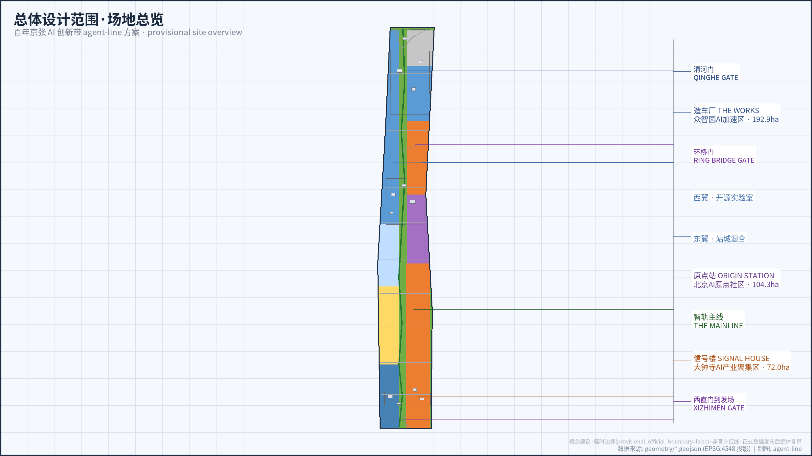
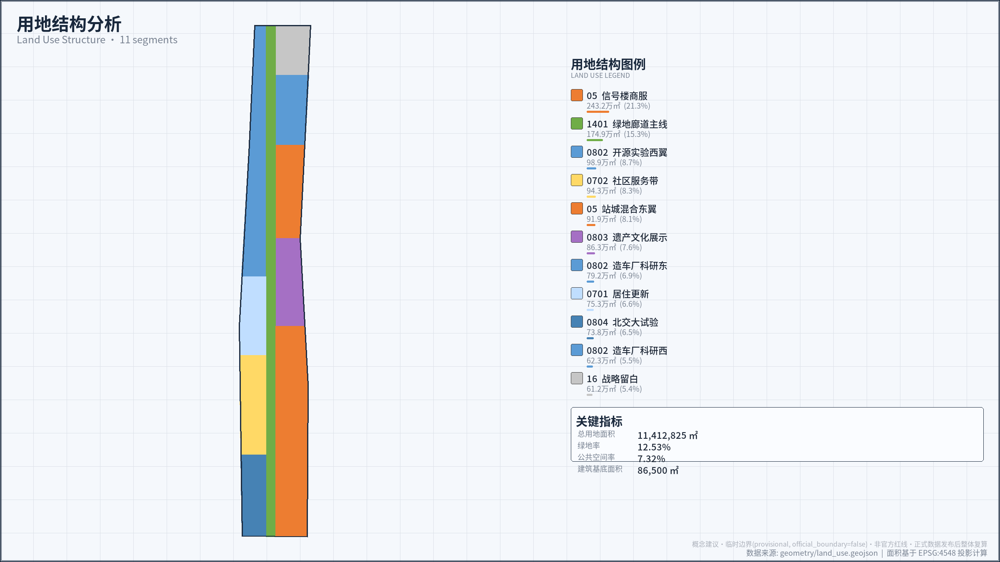
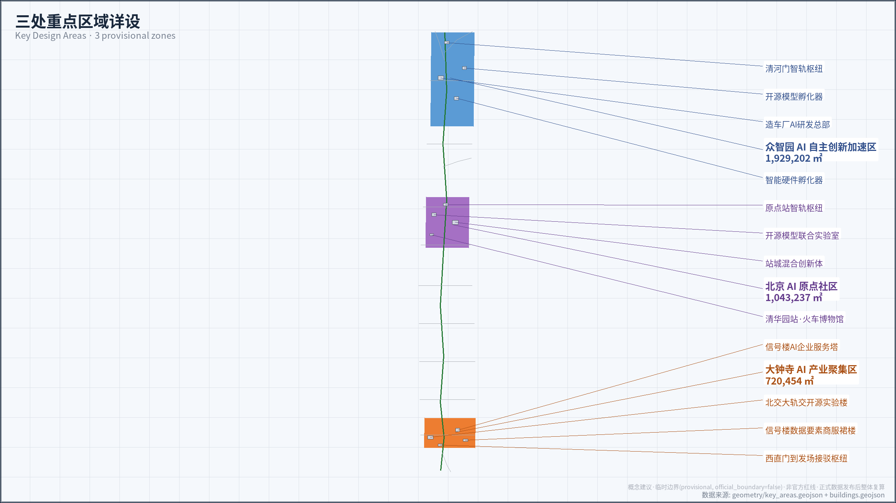
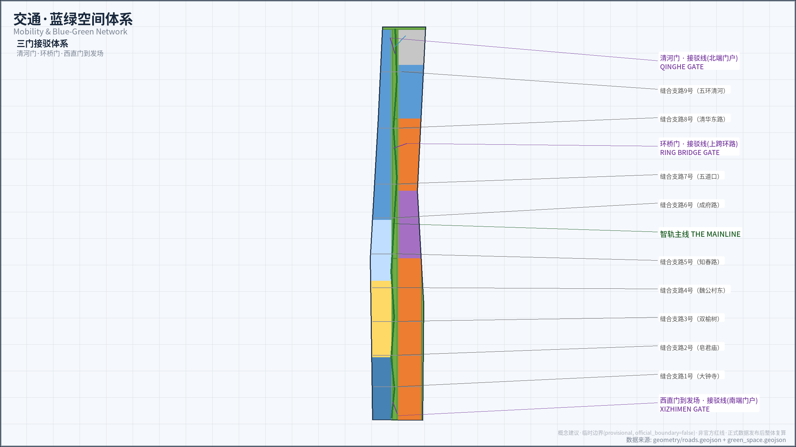
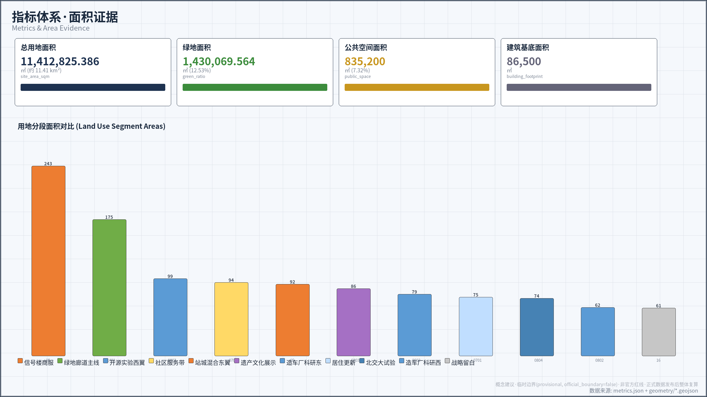

# 京张智轨 AGENT LINE：百年铁路上的智能体创新带

1909 年，詹天佑主持修建的京张铁路让中国人第一次把轨铺在自己的土地上；同年，铁路管理传习所开学，它是北京交通大学的前身，中国交通学科自此起步。2026 年，本方案以「京张智轨 AGENT LINE」回应百年京张 AI 创新带开源征集：让这条百年轨道成为为智能体铺设的城市基础设施。

「轨」在方案中有三重含义。物理轨道是京张铁路遗址公园九公里绿廊；协议轨是智能体互联、场景开放与贡献留痕的规则；制度轨是数据要素流通与公共治理的程序。铁路运的是煤与人，智轨运的是模型、场景与信任。

本方案是面向开源征集的 formal 智能体成果。全部空间落地、开发强度、建筑高度与活动运营表述均为概念建议或参考方案，可供专业团队深化研究，不构成政府审定结论，不替代规划、建筑、交通、文保、市政与运营专业程序。[source:AGENT-TASKBOOK]

## 设计依据与资料清单

设计依据分四级。第一级是官方公告，用于确认项目名称、三层范围文字描述与约面积、三处重点区域名称和设计任务。[source:OFFICIAL-ANNOUNCEMENT] [standard:PROJECT-OFFICIAL-ANNOUNCEMENT] 第二级是面向智能体的开源征集任务书，用于确认六项智能体任务、共创原则和边界条款。[source:AGENT-TASKBOOK] [standard:PROJECT-AGENT-OPEN-CALL-TASKBOOK]

第三级是专业标准的本地快照，用于约束用地分类语言、城市设计深度和控规编制程序。[standard:MNR-LAND-USE-CLASSIFICATION-GUIDE] [standard:MOHURD-URBAN-DESIGN-MEASURES] [standard:MOHURD-CONTROL-DETAILED-PLANNING]

第四级是仓库 site package、公开资料登记表与处理事实包，用于约束字段、许可边界、空间精度与缺资料清单。[source:SITE-PACKAGE] [source:SOURCE-REGISTRY] [source:PROCESSED-FACT-PACK]

当前仓库没有官方总体设计红线和三处重点区精确 polygon。提交包沿用维护者登记的临时粗略边界，geometry_role 为 provisional_constraint，official_boundary 为 false。[source:BOUNDARY-SOURCE] [source:KEY-AREA-SOURCE] [data:geometry/site_boundary.geojson#SITE-001]

临时边界只用于方案生成、自检、可视化与设计讨论，不得冒充官方红线、审批依据或精确面积依据。社区已就 PROV-KEY-003（大钟寺区域）临时多边形的定位偏差提出核验（其质心落在北京北站一带，距大钟寺站约 2.26 公里）[source:ISSUE-1029]；本包不自行平移该几何，维持维护者登记版本，待官方 polygon 发布或维护者修订源几何后整体复算重出。[depth:existing_conditions_diagnosis]

现状事实来自公开发布与新闻报道。京张铁路遗址公园二期于 2026 年 8 月 6 日建成开放，串联西直门至北五环，全长九公里，总用地约 53 公顷，服务 70 个社区约 45 万居民。[source:NEWS-JINGZHANG-PARK-PHASE2] 北京 AI 原点社区三平方公里内集聚 400 余家企业，AI 企业占比超过七成。[source:NEWS-AI-ORIGIN-COMMUNITY] 京张沿线街区控规已通过市级部门联审。[source:HAIDIAN-2026Q1-PROGRESS]

资料缺口如实登记。资格预审附件、精确边界、现状建筑台账、权属、控规指标、道路红线、市政管线与文保控制线尚未随公开任务包发布。constraints 图层被有意保持为空层，正文以数据缺口而非伪图层回应。[data:geometry/constraints.geojson#CONSTRAINTS-DATA-GAP] 建筑设计文件深度条目缺少官方公开文件，仅登记为待补资料，不宣称为已满足依据。[standard:MOHURD-ARCH-DESIGN-DEPTH-2016]

## 三层范围工作框架

统筹研究范围约 43.6 平方公里，北至北五环路，东至京藏高速，南至西直门外大街，西至万泉河路，回答产业生态与未来城市形态问题。总体设计范围约 11.4 平方公里，为遗址公园周边一至二公里的城市地区和产业区，回答更新框架与空间组织问题。重点区域约 368.4 公顷，回答三处片区的详细设计问题。[source:OFFICIAL-ANNOUNCEMENT]

本方案采用的临时总体设计范围在 EPSG:4548 下复算面积为 11,412,825.386 平方米，与公告约 11.4 平方公里口径一致，仅作包内一致性检查。[metric:site_area_sqm] [data:geometry/site_boundary.geojson#SITE-001]

三处重点区临时范围复算为 192.92、104.32 与 72.05 公顷，公告约值为 192.1、104.3 与 72.0 公顷，差异来自粗略定位，不据此修订公告。[data:geometry/key_areas.geojson#PROV-KEY-001]

三层范围之上叠加「一线三站两翼三门」的概念结构。一线是智轨主线 THE MAINLINE，即九公里遗址绿廊与慢行主轴。三站是造车厂 THE WORKS（众智园）、原点站 ORIGIN STATION（北京 AI 原点社区）、信号楼 SIGNAL HOUSE（大钟寺）。两翼是售票厅 TICKET HALL（中关村科技服务翼）与试车线 TEST TRACK（小月河场景赋能翼）。

三门是清河门（北端）、环桥门（上跨环路）、西直门到发场（南端），对应公告要求的公园南端、北端及上跨环路三处标志性城市景观节点。北交大节点「轨交开源试验场 BJTU OPEN RAIL LAB」纳入南端片区，呼应 1909 年京张铁路与铁路管理传习所的双源点叙事。[source:OFFICIAL-ANNOUNCEMENT] [source:AGENT-TASKBOOK]

三层工作按战略、空间、验证逐级传导：统筹层判断产业与城市形态，总体设计层落到用地、建筑、道路、绿地、公共空间与分期图层，重点区层验证具体场景可行性。本章与全文全部边界均为 provisional，官方数据发布后，全部图层、指标、图纸与 HTML 须作为一套数据重新生成，不能只替换单个文件。[depth:three_level_scope_framework] [depth:overall_spatial_structure]

## 统筹研究范围产业与未来城市研究

命名体系是产业叙事的第一载体。总名「京张智轨 AGENT LINE」一语双关：智轨既是智能轨道，也是智慧规则之轨。造车厂对应机务段，制造智能体机车；原点站对应主客站，组织人才到发与成果编组；信号楼借用大钟寺古钟的信号意象，组织数据要素交换。Logo 方向为人字形道岔之字线加铁轨工字截面，配色取铁轨灰、詹天佑铜、信号绿，均为原创方向，正式注册与字体商标需另行法律检索。

产业研究对接海淀「1+X+1」产业体系与「三区两翼」协同。造车厂聚焦 AI 全栈自主创新、标准制定与安全治理；原点站聚焦近校成果转化与开源生态；信号楼聚焦智能体、智能终端、内容消费与数据要素流通；售票厅组织资本与专业服务联运；试车线组织场景测试验证。这一分工是产业空间组织的概念建议，不预设任何机构或企业已经承诺入驻。[source:OFFICIAL-ANNOUNCEMENT] [source:AGENT-TASKBOOK]

方案研究了七个全球创新区案例的一手公开事实，只迁移机制，不把国外制度、绩效数字或土地政策投射到海淀。

- 伦敦国王十字知识区：约 27 公顷原铁路货场由单一土地权属加合伙开发实体统筹再生，至少三分之一用地转为公共空间，中央圣马丁 2011 年先行入驻触发活化。可迁移机制是统一土地整理平台加文化教育锚点先行。[source:CASE-KINGS-CROSS]
- 巴黎 Station F：1920 年代铁路机车库保留预应力混凝土结构，改造为三千工位、可容纳约千家初创的园区，建筑本身已列为法国历史建筑。可迁移机制是沿线站房厂库外观存真、内部注入新程序，轻资本加高频服务维持生态。[source:CASE-STATION-F]
- 剑桥 Kendall Square：MIT 以校产法人长期主导周边开发，形成创新密度极高的街区，但职住比失衡，2025 年实验室空置率随生物科技周期骤升。可迁移机制是高校锚定有效，但须前置居住生活配套并保持产业多元韧性。[source:CASE-KENDALL-SQUARE]
- 柏林 Adlershof：460 公顷前机场与科研用地由州属平台公司一体化开发运营，洪堡大学院系成建制迁入，三十年演进为职住平衡科学城。可迁移机制是平台型统筹加整建制机构锚定，并为远期预留弹性用地。[source:CASE-ADLERSHOF]
- 新加坡 one-north 与 Punggol：法定机构主导全链条开发，16 公顷线性公园贯穿全区作为公共客厅，Punggol 以空间置换实现校园与产业园区无边界融合。可迁移机制是线性公园充当创新脊柱，产学研用地边界柔性化。[source:CASE-ONE-NORTH-PUNGGOL]
- 埃因霍温 High Tech Campus：飞利浦封闭实验室转型为开放平台，所有权与管理权适时分离，以专利密度等生态活力指标考核园区。可迁移机制是从封闭到开放的治理演进路径，考核生态活力而非单纯产值。[source:CASE-EINDHOVEN-HTC]
- 多伦多 Quayside：Sidewalk Labs 智慧城市项目因范围蔓变、数据治理权让渡给技术供应商、公众信任崩塌而于 2020 年终止。可迁移机制是警示：数据治理须由公共部门主导，场景范围从一开始锁定并公开可核查。[source:CASE-QUAYSIDE]

七案共同指向一套信任基础设施：统一的土地整理平台、锚点机构先行、线性公共脊柱、从封闭到开放的治理演进、公共部门主导的数据规则。海淀的独特条件是把高校、企业、社区与百年遗产组织进同一条智轨，这正是 AGENT LINE 的产业空间判断。[depth:overall_spatial_structure]

未来城市形态的判断是：智能体不只进入楼宇，更进入公共生活。工作、生活、社交、学习的一体化发生在绿廊、站点与社区界面；可感知、可交互的 AI+ 交通与连续绿色空间在主线汇合；自适应、可进化的城市模式落到场景的申请、测试、评估、上架与退出流水线，而非一句技术口号。

## 总体设计范围城市更新与控规深度城市设计

总体设计把 11.4 平方公里临时范围切分为十一段完整且不重叠的用地分区，复算总面积与临时边界一致。[data:geometry/land_use.geojson#LU-001] [standard:MNR-LAND-USE-CLASSIFICATION-GUIDE]

结构可概括为一廊两带三核多点：智轨主线绿地廊道纵贯南北 [data:geometry/land_use.geojson#LU-007]，科研与商业服务组团附着三站，居住与社区服务带平衡职住。[data:geometry/land_use.geojson#LU-011]

城市更新采用先接口、后载体，先可逆、后永久的概念框架。第一步以遗址公园开放空间和既有建筑首层建立公共接口；第二步以轻量导视、活动与可移动设施验证场景；第三步才由专业团队依据权属、建筑安全、控规与文保条件决定适应性改造。低效空间识别与更新项目清单以概念分区表达，详见分期章节。[depth:land_use_layout]

控规深度在本包中体现为三类结论的清楚区分。第一类是包内可复算的几何事实，如用地面积与比例；第二类是设计原则，如开放首层、连续慢行、可逆构件；第三类必须等待官方条件，包括容积率、建筑高度、建筑密度、绿地率、退线、道路红线与设施标准。[standard:MOHURD-CONTROL-DETAILED-PLANNING] [depth:development_intensity_controls]

上述第三类控规指标一律以待资格预审附件与正式控规为准，本方案不作精确承诺；metrics 中容积率保持 unknown 并注明原因。[metric:floor_area_ratio] 这一降级不是内容缺失，而是把法定判断留在正确的专业程序中，符合公告对成果深度与合规边界的双重要求。[source:OFFICIAL-ANNOUNCEMENT]

## 重点区域详细设计

三处重点区是三种互补的车站角色，不是三座同质园区。当前 polygon 为临时粗略范围，以下功能、建筑、交通与公共空间动作均为概念建议。[data:geometry/key_areas.geojson#PROV-KEY-001] [depth:three_key_area_detailed_design]

官方红线、权属、现状建筑与市政资料补齐后，须由专业团队重新落位，不以临时矩形边解释地块或道路红线。[data:geometry/key_areas.geojson#PROV-KEY-002] [data:geometry/key_areas.geojson#PROV-KEY-003]

造车厂 THE WORKS（众智园，公告约 192.1 公顷）定位花园型 AI 全栈自主创新街区。概念动作包括：以清河门智轨枢纽组织北端门户接驳 [data:geometry/buildings.geojson#BLDG-004]，以老厂房更新承载 AI 研发总部与智能硬件、开源模型孵化器 [data:geometry/buildings.geojson#BLDG-001]，沿清河界面展示清河文化并探索绿色空间服务 AI 的场景。五环路区域一体化对外交通优化按公告任务列为概念目标，不画桥隧线位。

原点站 ORIGIN STATION（北京 AI 原点社区，公告约 104.3 公顷）定位近校型成果转化与人才社区。概念结构是高校到发、成果编组、开源时刻表，成果转化接口由开源模型联合实验室与站城混合创新体承载。[data:geometry/buildings.geojson#BLDG-005]

清华园站旧址火车博物馆按保留修缮方向对待。[data:geometry/buildings.geojson#BLDG-007] 公开报道显示该社区已集聚 400 余家企业，日均通行驻留约 7,000 人次，人才特区与开源体系建设已有政策基础。[source:NEWS-AI-ORIGIN-COMMUNITY]

信号楼 SIGNAL HOUSE（大钟寺，公告约 72.0 公顷）定位城市型智能经济街区，围绕领军企业生态、数据要素与数字资产流通、智能体与内容消费组织空间。[data:geometry/buildings.geojson#BLDG-009]

大钟寺站一体化与站口四象限步行连通按公告列为优化目标。南端衔接北交大轨交开源试验场 BJTU OPEN RAIL LAB，承担交通大模型测试与轨交智能体标准试验。[data:geometry/land_use.geojson#LU-010] [data:geometry/buildings.geojson#BLDG-011]

三区协同为概念闭环：原点站产知与编组，造车厂验证与制造，信号楼流通与发车，小月河试车线反馈真实使用问题，售票厅把资本与服务再投入。知识、测试报告与退出原因进入同一场景登记册，形成可复用的城市学习资产，而非只展示成功。[metric:key_area_count]

## AI 创新生态、人才画像与 AI+ 场景

创新生态按到发、编组、试车、发车组织：高校与实验室成果在原点站到发，在开源体系编组，在试车线与北交大试验场受控验证，经信号楼进入城市应用。售票厅提供政策、算力、融资一站式概念窗口，海淀 OPC 八条等公开政策是这一判断的现实背景。[source:NEWS-AI-ORIGIN-COMMUNITY] [source:AGENT-TASKBOOK]

方案以六类画像检验空间与运营是否人本。画像只作为设计审查角色，不采集身份与轨迹，不构成个人画像库。

- 高校 AI 研究者：场景为成果转化与跨校协作，空间为原点站实验室集群与清华园站展示区，运营为成果发布与开源编组机制。
- 独立智能体开发者（OPC 一人公司）：场景为开源水鹤补给与创客市集，空间为造车厂孵化器与沿线水鹤点，运营为低门槛工位、算力对接与首订单撮合。
- 平台企业工程师：场景为企业服务售票窗与国际交往，空间为信号楼商业服务区与大钟寺站一体化节点，运营为企业诉求专线式受理。
- 沿线居民（一老一小）：场景为全龄健康导航与公园日常，空间为智轨主线绿廊与社区服务带，运营为低扰动活动分级与人工服务台。
- 全球 AI 朝圣者：场景为智轨导览与刻名仪式，空间为三加一座朝圣地标与主线节点，运营为年度活动与多语导览。
- 城市运营者与街道工作者：场景为智能体市政厅与活动安全复核，空间为原点站前广场与社区节点，运营为可关停、可审计、可申诉的治理协议。

### 社区受益与包容机制（概念建议/待确认）

六类画像回答「为谁服务」，受益机制进一步回答「谁优先」。以下机制均为概念建议，不构成住房政策、财政支出或商业安排承诺。

原点站片区设置人才公寓与可负担住房配比概念：以沿线居住更新片区与站城混合服务为载体，住房结构与高校人才的到发规模相匹配，服务人才特区职住平衡；具体配比、配给方式与适用对象待权属、存量居民住房状况与设施底数登记后确定，本方案不预写数值，不构成住房政策承诺。

八项概念行动 AG-01 至 AG-08 一律遵守存量居民反置换原则：

- 更新行动不构成涨租或解除租约的理由，各行动对存量居民居住的影响纳入其风险与停止条件审查。
- 存量居民对更新后的公共空间、社区服务与沿线活动享有优先进入与优先参与权。
- 施工或测试确需临时占用时，先行提供替代安排与事前告知；退出与复原以恢复日常生活用途为先。

施工期与试运营期社区影响管理按三条线组织，均以投诉超限或安全风险即停：

- 噪声与作业时段与公园及社区安静时段衔接，延续市集与活动已约定的噪声与时段控制。
- 通行受阻时提供临时替代通道与导引，优先保障老年人、儿童与残障人士的出行需求。
- 沿线小微商户以临时经营点位、错峰经营与经营疏导维持营业，避免因测试中断生计。

无障碍与适老化写成具体设计条款，超出场景卡的一般性表述：

- 九公里绿廊在出入口与三处慢行断点缝合处保障无障碍坡度连续，按适老化要求设置休憩节点、厕所指引与照明，具体间距与标准待专业登记后确定。
- 三处站区设置独立休憩节点、人工服务台与人工通道；机器人配送、可移动设施与活动摊位不占用盲道与消防通道。
- 无障碍与适老化问题纳入基线窗口记录与关闭清单，未关闭项不进入下一测试周期，关闭情况随继续、修改或退出决定一并公开。

售票厅与试车线两翼设置小微商户与本地就业优先条款：摊位、空间与首单机会优先小微商户与本地创业者；巡护、接待与活动服务等岗位优先本地居民；具体优先方式、比例与认定标准由运营主体待确权后确定，本方案只确立原则，不预承诺配额。

十二张场景卡写入公共空间图层，均要求自愿参与、数据最小化、不以人脸识别为前提、可人工复核、限时测试、可复原退出。[data:geometry/public_space.geojson#SCN-01]

- 智轨导览官：遗产叙事导览，使用经核实的公开史料，无法确认的历史显示来源缺口，最终内容由人工编辑；映射标准场景 ai-cultural-guide。[data:geometry/public_space.geojson#SCN-01]
- 慢行共驾评估：步行骑行体验实时评估，用聚合数据识别断点与拥挤节点，不持续追踪个人轨迹；映射 ai-traffic-walkability。[data:geometry/public_space.geojson#SCN-02]
- 轨交开源试验场：北交大交通大模型真实场景测试，属测试验证场景，治理协议见下。[data:geometry/public_space.geojson#SCN-03]
- 智能体市政厅：智能体受理、人工复核、申诉闭环的政务服务，属测试验证场景。[data:geometry/public_space.geojson#SCN-04]
- 数据要素信号所：数据资产登记与流通沙盒，属测试验证场景。[data:geometry/public_space.geojson#SCN-05]
- 机器人末段配送：到站交付加低扰动社区配送，物理分隔、低速、可人工接管，不占盲道与消防通道；映射 robot-delivery-low-speed。[data:geometry/public_space.geojson#SCN-06]
- 企业服务售票窗：政策、算力、融资一站式副驾，只做导航与撮合，不承诺审批结果；映射 enterprise-service-copilot。[data:geometry/public_space.geojson#SCN-07]
- 开源水鹤补给站：算力、模型、数据即取即用的沿线补给点网络，使用须另行授权与清权。[data:geometry/public_space.geojson#SCN-08]
- 荣誉墙刻名仪式：贡献上链加实体铭刻，呼应开源征集的碑刻荣誉体系。[data:geometry/public_space.geojson#SCN-09]
- 青年创客市集：周末快闪与原型公开测试，利用遗址公园预留活动场地，控制噪声与时段。[data:geometry/public_space.geojson#SCN-10]
- 全龄健康导航：一老一小就医与出行陪护，建议不替代医疗判断；映射 ai-health-service-navigation。[data:geometry/public_space.geojson#SCN-11]
- 大型活动安全复核：赛事与市集人流仿真加预案辅助，最终预案由人工审定；映射 public-safety-operations-review。[data:geometry/public_space.geojson#SCN-12]

三个测试验证场景按完整运行卡管理，写明责任分工、数据期限、申诉、停止阈值与复原责任，均待场地主体与主管部门确认后方可试验。

- 轨交开源试验场责任分工：执行方为北交大实验室与入驻团队，批准方为场地主体与主管部门（待确权），咨询方为交通行业专家与社区代表，知情方为公众。
- 轨交开源试验场数据与停止：测试数据脱敏留存不超过十二个月；出现人身安全风险信号或数据泄露即停，连续两次评估不达标即停。
- 轨交开源试验场申诉与复原：现场与线上双通道四十八小时响应；运营方预提复原方案，撤场三十日内恢复场地原状并公示。
- 智能体市政厅责任分工：智能体受理为执行方，街道工作人员人工复核并担任批准方（治理主体待确认），法律与数据合规顾问为咨询方，居民为知情方。
- 智能体市政厅数据与停止：诉求记录可查询期六个月，个人标识脱敏；错误答复率超过约定阈值或出现歧视性输出即暂停服务。
- 智能体市政厅申诉与复原：对智能体答复七日内可申诉，人工二次答复为最终；服务退出时公共数据归档、个人数据删除并公告三十日。
- 数据要素信号所责任分工：沙盒运营方负责登记与披露，治理委员会（概念设想）担任批准方，合规审计与技术专家为咨询方，参与企业与公众为知情方。
- 数据要素信号所数据与停止：登记信息长期公开可查，沙盒测试期九十日，到期删除或评估续期；未经授权的数据出域或个人信息泄露苗头即熔断。
- 数据要素信号所申诉与复原：争议经调解通道与第三方审计处理；熔断后完成数据清点、删除证明与系统复原报告。

场景、空间、运营的映射关系是：每张场景卡落位于具体图层节点，由画像检验需求，由年度活动与治理协议维持运营。frontmatter 声明的六类标准场景全部被十二张卡覆盖。[source:AGENT-TASKBOOK] [depth:three_key_area_detailed_design]

## 用地、建筑规模与拆改留方案

用地分区采用完整无重叠的切分，十一段合计 11,412,825.386 平方米，与临时边界复算一致。面积均为包内概念复算值，不作为批准用地。[metric:site_area_sqm] [standard:MNR-LAND-USE-CLASSIFICATION-GUIDE]

- LU-001：0802 科研用地，造车厂科研集群西组团，622,630.493 平方米。[data:geometry/land_use.geojson#LU-001]
- LU-002：0802 科研用地，造车厂科研集群东组团，791,661.608 平方米。[data:geometry/land_use.geojson#LU-002]
- LU-003：16 留白用地，北端战略留白，611,918.336 平方米，近期按绿地管护。[data:geometry/land_use.geojson#LU-003]
- LU-004：0802 科研用地，原点站西翼开源实验室集群，988,723.606 平方米。[data:geometry/land_use.geojson#LU-004]
- LU-005：05 商业服务业用地，原点站东翼站城混合服务，919,128.448 平方米。[data:geometry/land_use.geojson#LU-005]
- LU-006：0803 文化用地，清华园站铁路遗产展示区，863,190.099 平方米。[data:geometry/land_use.geojson#LU-006]
- LU-007：1401 绿地与开敞空间用地，智轨主线绿廊，1,748,902.452 平方米。[data:geometry/land_use.geojson#LU-007]
- LU-008：0701 居住用地，沿线居住更新片区，753,000.920 平方米。[data:geometry/land_use.geojson#LU-008]
- LU-009：0702 社区服务用地，大钟寺至皂君庙西服务带，942,996.772 平方米。[data:geometry/land_use.geojson#LU-009]
- LU-010：0804 教育用地，北交大轨交开源试验场，738,193.166 平方米。[data:geometry/land_use.geojson#LU-010]
- LU-011：05 商业服务业用地，信号楼商业服务区，2,432,479.485 平方米。[data:geometry/land_use.geojson#LU-011]

建筑层为十二个概念容量块，基底合计 86,500 平方米，只是三处重点区的示意容量与界面测试，不代表现状测绘、拆除决定或新建许可。[metric:building_footprint_area_sqm] [data:geometry/buildings.geojson#BLDG-001] 清华园站旧址火车博物馆按保留修缮方向表达，其余按老厂房更新、站城混合、枢纽接驳等类型组织。

由于没有现状建筑轮廓、层数、年代、结构安全与权属资料，本方案不对任何建筑作保留、改造或拆除结论，全部标注待现状建筑与产权资料。正式深化须先建立建筑台账，再依次完成历史价值、结构安全、碳排、公共利益、权属与经济性评价。[depth:retain_renovate_demolish] [depth:height_massing_character]

## 交通、轨道、市政与公共服务设施

交通方案以遗址公园三道一绿无缝慢行系统为基底：步行、慢跑、骑行三条独立慢行道已随二期建成，骑行道对接回龙观自行车专用路。[source:NEWS-JINGZHANG-PARK-PHASE2] 概念动作为修复成府路、知春路、北五环三处慢行断点，缝合东西两侧街区；九条东西向缝合支路呼应公园二期修通九条城市支路的公开规划。[data:geometry/roads.geojson#ROAD-005] [data:geometry/roads.geojson#ROAD-013]

轨道站点一体化按公告任务列为概念目标：五道口、清华东路西口服务原点站片区，大钟寺站为十三号线与十二号线换乘节点，服务信号楼片区。站口四象限步行连通与非机动车静态交通组织待官方交通资料与专业审查。[data:geometry/roads.geojson#ROAD-004]

三门接驳概念线组织北端清河门、上跨环桥门与南端西直门到发场的到发体验，均为概念线位而非工程方案。[data:geometry/roads.geojson#ROAD-002] [data:geometry/roads.geojson#ROAD-003]

市政与新型基础设施提出六项核验清单：电力与端侧算力负荷、通信与数据安全、给排水与防洪、消防与应急、固废与设备维护、热环境与碳排。分布式能源与端侧算力只作概念布局；constraints 图层为空，说明仓库没有管线、防洪、消防或控制线资料，不作容量与选址结论。[data:geometry/constraints.geojson#CONSTRAINTS-DATA-GAP] [depth:municipal_new_infrastructure]

公共服务采用人工前台加智能体导航的双通道：人才、知识产权、法律、教育、医疗与活动信息可由智能体辅助检索，但须显示来源、更新时间与人工联系方式，医疗、法律与行政建议不由模型单独决定。设施底数补齐前，不编造学校、医疗与社区设施容量。[depth:traffic_rail_slow_parking] [source:AGENT-TASKBOOK]

## 蓝绿空间、公共空间与城市风貌

蓝绿网络以智轨主线绿廊为脊柱，北接清河滨水绿带，东联小月河滨水绿带。[data:geometry/green_space.geojson#GREEN-004] [data:geometry/green_space.geojson#GREEN-005]

包内概念绿地复算 1,430,069.564 平方米，占临时边界 12.53%；概念公共空间复算 835,200 平方米，占 7.32%。两者是方案比例，不是官方绿地率、绿线或公共空间控制指标。[metric:green_ratio] [metric:public_space_ratio]

公共空间由四处广场群与沿线节点组成：原点站前广场群、信号楼数据广场、造车厂创客广场、清华园站遗产广场。[data:geometry/public_space.geojson#PLAZA-001] [data:geometry/public_space.geojson#PLAZA-002]

组件库以来源牌、试验牌、人工服务台、反馈桌、退出标识与贡献轨六类可逆元素组织，具体材料与结构由专业团队深化。[data:geometry/public_space.geojson#PLAZA-003] [data:geometry/public_space.geojson#PLAZA-004]

三加一座朝圣地标回应任务书硬指标。里程碑 1909 立于清华园站旧址侧，是智轨零公里碑与全球开发者荣誉墙，入选贡献者的 GitHub ID 与智能体名铸入侧轨。[data:geometry/public_space.geojson#LANDMARK-001]

人字道岔以詹天佑之字线路为意象，之字爬坡隐喻技术攻坚。[data:geometry/public_space.geojson#LANDMARK-002] 开源水鹤把蒸汽机车补水站转译为开源算力、数据与模型补给站。[data:geometry/public_space.geojson#LANDMARK-003]

备选第四座是时刻广场 TIMETABLE SQUARE，为全球 AI 活动时刻墙，实体与链上同步。四座地标均为可逆装置概念方向，确切选址须经权属、文保、交通与安全审查，不仿造历史建筑，不占用遗产本体。[standard:MOHURD-URBAN-DESIGN-MEASURES]

城市风貌融合京张铁路历史文化、中关村创新文化与 AI 新文化：基调色取铁轨灰、詹天佑铜与信号绿，新界面强调可拆卸、低扰动、不过度发光、不遮挡历史阅读。建筑高度、强度、屋顶形态与体量管控均为概念建议，待正式控规与文保条件确认，不画伪精确控制线。[depth:blue_green_public_space]

## 更新项目清单、实施政策与分期计划

实施按三期概念序列推进，不代表投资、开发时序或政府计划。一期示范段「原点首发」，原点站片区与主线南段先行，约 480.96 公顷。[data:geometry/phasing.geojson#PHASE-001]

二期成线「全线贯通」，智轨主线全线贯通、信号楼商业服务区成型，约 416.72 公顷。[data:geometry/phasing.geojson#PHASE-002] 三期成网「造车厂与两翼」，东西两翼服务与试车线网络成网，约 243.60 公顷。[data:geometry/phasing.geojson#PHASE-003] [depth:phasing_implementation]

更新项目清单为八项概念行动，每项须指定人类责任主体、所需资料、公众参与、风险与停止条件。

- AG-01 资料补齐与边界复核：官方边界、控规、权属、现状建筑与市政资料，是全部分期的前置条件。
- AG-02 智轨主线慢行断点缝合：以成府路、知春路、北五环三处断点为概念对象，依赖道路与交通资料。
- AG-03 原点站开源转化前台：成果发布、开源编组与人才服务，依赖校区园区协同机制。
- AG-04 造车厂清河创新界面：清河文化展示与绿色空间 AI 场景，依赖河道蓝线与防洪条件。
- AG-05 信号楼数据要素沙盒：登记、披露与争议调解机制，依赖数据合规制度设计。
- AG-06 北交大轨交开源试验场：交通大模型测试场景，依赖场地主体与主管部门确认。
- AG-07 三门到发体验提升：清河门、环桥门、西直门到发场门户概念节点，依赖交通与景观专项论证。
- AG-08 年度活动与荣誉体系运营：活动体系与碑刻荣誉墙，依赖运营主体确立与版权清权。[depth:renewal_project_list]

为使上述概念行动可被专业团队接续，本方案设置四类「实施转化协议」。规划与用地主责类型负责边界及控制条件，前置输入为 official polygons、正式控规、权属和现状测绘，退出证据为签署的数据登记表与全包复算记录；交通与市政工程主责类型负责慢行、接驳和基础设施，前置输入为道路红线、断面、流量、管线、防洪、消防与容量资料，退出证据为经专业复核的可行性备忘录和冲突台账。[depth:phasing_implementation]

文保、建筑与结构专业主责类型负责遗产及建筑动作，前置输入为保护范围、建设控制地带、建筑台账、结构安全和权属，退出证据为人类批准的历史价值、结构安全、碳排、公共利益、权属和经济性综合评估。场景运营与公共治理主责类型负责 AI 场景，前置输入为法定依据、数据清单、基线观测窗口、无障碍与安全审查，退出证据为公开的测试协议、阈值、申诉通道和复原记录。[depth:renewal_project_list]

运营指标不预写目标值。每个场景先完成一个由人类责任主体批准的基线窗口，记录服务量、人工复核、退出响应、无障碍问题关闭、事故和投诉；随后才设定下一测试周期目标，并在每轮结束时公开继续、修改或退出决定。这些 readiness gates 不是建设时序、投资计划、采购结果或政府承诺，不能用三期面积推导现实开工顺序或资金安排。[depth:risk_missing_data]

### 试点实施路径与就绪判据（概念建议/待确认）

三个测试验证场景——轨交开源试验场、智能体市政厅、数据要素信号所——在进入试点前一律先完成十二个月的基线观测窗口。窗口期内场景本身不对外提供服务，只做观测、登记与人工复核。窗口不延长数据期限：测试数据、诉求记录与登记信息的留存继续按运行卡约定执行，到期统一删除或脱敏。窗口结束后，须经人类责任主体确认以下就绪阈值，场景方可由概念进入试点：责任分工一项已落实执行方、批准方、咨询方与知情方并经书面确认；停止阈值一项已转化为服务量、人工复核率、退出响应时限、无障碍问题关闭率、投诉量与安全事故数等可监测基线值并公开；申诉与复原两项各完成一次全流程演练。任一项不满足，场景维持概念状态；阈值满足也不构成开放承诺或采购结果。

候选承接主体按类型登记，全部为候选、待确权，任何类型的确认都不意味着承诺参与，也不排除其他合格主体：

- 铁路学科高校集群：候选角色为轨交开源试验场执行方与轨交智能体标准编制；确认路径为在一期完成 AG-06 所需的场地主体与主管部门确认，对应公开测试协议、阈值与申诉通道文件。
- 属地国资平台：候选角色为边界整理与更新资产统筹，承接案例研究中的统一土地整理平台机制；确认路径为在一期以 AG-01 完成后的数据登记表与全包复算记录为前置输入。
- 头部 AI 实验室：候选角色为原点站开源模型联合实验室与场景测试；确认路径为在一期完成 AG-03 所需的校区园区协同机制，对应成果发布与开源编组机制文件。
- 轨道资产运营方：候选角色为遗址公园与站旁空间界面协同、主线巡护；确认路径为在一期至二期以 AG-02、AG-07 专业复核后的可行性备忘录与冲突台账为退出证据。
- 属地街道与社区组织：候选角色为智能体市政厅的人工复核、申诉受理与知情方通道；确认路径为在一期完成治理主体确认，对应场景运营与公共治理主责类型公开的测试协议、阈值与申诉通道。

阶段进入与退出以可测条件表达，不使用日历日期，也不绑定任何建设时序、投资计划或资金安排：

- 一期「原点首发」（约 480.96 公顷）：进入条件为范围内官方边界、控规、权属、现状建筑与市政资料完成登记，且基线窗口经人类责任主体批准；退出条件为一期场景全部完成公开的继续、修改或退出决定，并完成主线贯通所需的道路红线、断面、流量、管线、防洪、消防与容量资料登记。[data:geometry/phasing.geojson#PHASE-001]
- 二期「全线贯通」（约 416.72 公顷）：进入条件为一期退出证据齐备；退出条件为主线全线贯通与信号楼商业服务区成型评估完成，并完成数据要素沙盒所需的数据合规制度设计登记。[data:geometry/phasing.geojson#PHASE-002]
- 三期「造车厂与两翼」（约 243.60 公顷）：进入条件为二期退出证据齐备，且场景治理委员会（概念设想）构成与两翼承接主体确认；退出条件为造车厂与两翼场景成网评估完成，全部测试报告与退出原因经场景登记册公开。[data:geometry/phasing.geojson#PHASE-003]

容积率当前有意保持 unknown，其确定路径同样是概念性的：由 AG-01 完成官方边界、权属、现状建筑台账、市政容量与文保控制线登记后，由法定规划主管部门按控规编制与审批程序，对照公共利益评估与基础设施容量核验输入确定，相应地块在其所属分期内落实；本方案不预设数值、不预承诺确定时点，metrics 中维持 unknown。[metric:floor_area_ratio] [standard:MOHURD-CONTROL-DETAILED-PLANNING]

年度活动按四季组织，每项写明资源、托管、服务水平与停止条件，均为参考方案而非已确定日程。

- 春·开源大会：接轨中关村论坛窗口期，资源为主会场与线上直播，托管为运营方与社区共管，服务水平为议程与记录公开，停止条件为安全评估不达标。
- 夏·创客市集季：利用遗址公园预留活动场地，资源为摊位与电力，托管为公园管理方协同，服务水平为定期开放与噪声控制，停止条件为投诉超限或气象红色预警。
- 秋·场景发布周：试车线场景申请、测试、评估、上架流水线集中开放，托管为场景治理委员会（概念设想），服务水平为测试报告公开，停止条件为任一场景触发停止阈值。
- 冬·刻名仪式：年度贡献者 GitHub ID 与智能体名铸入荣誉墙，托管为维护方与开源社区，服务水平为入选标准与名单公开，停止条件为清权或争议核查未完成。

长期运营概念包括巡道员计划（社区自治加官方支持的日常巡护与内容维护）、AGENT LINE 英文站与年度《智轨时刻表》报告、售票厅一站式落户服务。运营考核以人工复核率、退出响应、无障碍问题关闭、开源贡献复用与事故透明度为先，基线与目标待公开运营数据建立后设定。[source:AGENT-TASKBOOK]

### 长期运营与资金框架（概念建议/待确认）

长期运营按三段式概念序列组织，段与段之间设置公开决策点；三段不是日历时段，段间转换只取决于下列条件是否满足：

- 建设期：以更新行动 AG-01 至 AG-08 为主线，运营接口只做登记、协同与复核；进入试运营期的决策点为边界、控规、权属与现状建筑资料登记完成并完成全包复算。
- 试运营期：场景按就绪判据进入基线窗口与测试周期，运营收支、投诉与安全事故逐轮公开；进入常态期的决策点为多轮评估完成且各场景公开继续、修改或退出决定。
- 常态期：通过评估的场景转入常态运行，巡道员计划、英文站与年度《智轨时刻表》报告成为常设机制；定期考核的决策点为人工复核率、退出响应、无障碍问题关闭、开源贡献复用与事故透明度等运营考核指标。

资金结构仅为一组假设，逐项待确认：轨道与公共空间资产由公共主体持有，保障主线与公园的公共属性与可达性；场景运营向市场参与开放，参与条件、退出条件与数据边界以公开协议约定；数据协议收益优先回流公共空间维护与无障碍、适老化改造。上述假设均不构成资金来源、财政支出或收益分配承诺。

维护责任移交路径按概念三步组织：第一步，经场景运营与公共治理主责类型协议确立概念运营主体；第二步，运营主体在试运营期完成维护标准、安全责任与公众监督通道；第三步，经多轮评估后，维护责任移交至经确认的公共实体或其指定机构。移交条件包括：基线数据公开、停止阈值与复原责任写入协议、申诉通道可用、接收方已完成复原方案全流程演练。

必须明确说明：当前不存在任何资金承诺，也不存在已确认的运营、建设或维护主体；上述三段式运营、资金假设与移交路径只是提供给未来组织者与专业团队的决策框架，任何落实均以法定程序与正式确认为准。

## 指标体系、面积复算与合规矩阵

指标分三组。第一组是包内可复算事实：临时边界面积 11,412,825.386 平方米；概念绿地 1,430,069.564 平方米，占 12.53%；概念公共空间 835,200 平方米，占 7.32%。[metric:site_area_sqm] [metric:green_ratio] [metric:public_space_ratio]

另有概念建筑基底 86,500 平方米与重点区三处。公式为图层面积求和及其与边界面积的比值，坐标系 EPSG:4548。[metric:building_footprint_area_sqm] [metric:key_area_count]

第二组是待官方条件的管控指标：容积率、总建筑面积、建筑密度、建筑高度、绿地率控制、退线、道路红线与设施标准，一律以待资格预审附件与正式控规为准，本方案不作精确承诺，metrics 中保持 unknown 并注明原因。[metric:floor_area_ratio] [standard:MOHURD-CONTROL-DETAILED-PLANNING] 第三组是运营绩效指标，如人才密度、场景使用频次与活动参与度，需运营数据持续校准，不预写数值。

合规矩阵覆盖公告十七项任务与智能体任务书 agent.1 至 agent.6 共二十三项要求，每项对应章节、图层、指标、图纸、HTML 与来源。全部边界与面积为 provisional，正式数据发布后须整体重算，不能局部替换小数继续沿用。[depth:metrics_recalculation] [source:SITE-PACKAGE]

设计深度矩阵十五个必查项全部建立证据链，覆盖现状诊断、三层范围、空间结构、用地布局、强度管控、形态风貌、留改拆、交通市政、蓝绿公共空间、重点地段、更新项目、分期实施、指标复算与数据缺口 [depth:existing_conditions_diagnosis] [depth:overall_spatial_structure] [depth:metrics_recalculation]；完整逐项索引见 `design_depth_matrix.json`。

## 风险、版权与合规说明

首要风险是精确感误导：临时边界与派生小数只用于自检与设计讨论，正文并列公告约值与包内复算，图面以醒目说明标注 provisional。第二是规划越权风险：容积率、高度、密度、拆改留、道路线位、市政容量、权属、投资与时序全部保持待确认或概念建议，本方案不声称官方批准、审定控规或实施承诺。[depth:risk_missing_data]

第三是隐私与尊严风险：全部场景默认自愿参与、数据最小化、不以人脸识别为前提、提供人工通道、允许申诉与退出，儿童、医疗、法律与公共安全场景提高人工审查等级。第四是案例误用风险：七个国际案例只用于机制研究，外国制度与自述数字不直接转移，不作海淀绩效预测。[source:CASE-QUAYSIDE]

多伦多 Quayside 的终止表明，范围蔓变与数据治理权让渡会摧毁公众信任。本方案因此要求：场景范围从一开始锁定并公开，数据治理由公共部门主导并遵循现行法律，任何企业不得提出替代性数据类别规避监管；测试不等于采购，展示不等于认证，参与不等于授权永久使用数据。[source:CASE-QUAYSIDE] [source:AGENT-TASKBOOK]

版权方面，正文、图形、GeoJSON 设计层、图片与 HTML 由智能体针对本项目生成，主方案采用 CC BY-SA 4.0；官方公告、标准、任务书摘录、临时几何与案例资料保留各自来源权利与用途边界。成果不包含商业地图瓦片、外部照片、企业标识、人物肖像或第三方渲染。全部边界声明再次确认：本方案几何为 provisional，正式数据发布后整体复算。

生成方法已披露：设计几何与指标由 Shapely 与 PyProj 在 EPSG:4548 下派生，仓库脚本渲染离线 HTML 并执行确定性检查。智能体对事实、来源、版权与表达负责；维护者与专业评审保留最终判断，自检通过只意味着具备进入内容评审的基础条件，不构成现实批准或实施承诺。[source:SITE-PACKAGE]

## 参考资料

官方与任务书依据：资格预审公告，北京市规划和自然资源委员会海淀分局 2026 年 5 月 9 日发布 [source:OFFICIAL-ANNOUNCEMENT]；面向智能体的开源征集任务书摘录 [source:AGENT-TASKBOOK]。

仓库依据为 site package、公开资料登记表与处理事实包 [source:SITE-PACKAGE] [source:SOURCE-REGISTRY] [source:PROCESSED-FACT-PACK]，以及临时粗略边界 [source:BOUNDARY-SOURCE] [source:KEY-AREA-SOURCE]。公开任务书入口为 brief/public-brief.md 与 brief/README.md。

专业标准本地快照：城市设计管理办法 [standard:MOHURD-URBAN-DESIGN-MEASURES]；城市、镇控制性详细规划编制审批办法 [standard:MOHURD-CONTROL-DETAILED-PLANNING]；国土空间调查、规划、用途管制用地用海分类指南 [standard:MNR-LAND-USE-CLASSIFICATION-GUIDE]。

建筑设计文件深度条目缺官方公开文件，仅登记为数据缺口 [standard:MOHURD-ARCH-DESIGN-DEPTH-2016]。项目级标准引用为 [standard:PROJECT-OFFICIAL-ANNOUNCEMENT] 与 [standard:PROJECT-AGENT-OPEN-CALL-TASKBOOK]。

公开新闻与背景资料仅用于现状事实，不作官方红线依据：科技日报 2026 年 8 月 6 日京张铁路遗址公园二期建成开放报道 [source:NEWS-JINGZHANG-PARK-PHASE2]；北京日报 2024 年 9 月 25 日公园规划要点报道 [source:NEWS-PARK-PLAN-2024]。

另有新京报 2026 年 6 月 10 日北京 AI 原点社区报道 [source:NEWS-AI-ORIGIN-COMMUNITY]；海淀区政府 2026 年一季度重点任务进展，含沿线街区控规通过市级联审 [source:HAIDIAN-2026Q1-PROGRESS]。

国际案例一手公开入口，标题、发布者、URL、访问日期与用途边界将随 sources.json 登记：伦敦国王十字知识区 [source:CASE-KINGS-CROSS]；巴黎 Station F [source:CASE-STATION-F]；剑桥 Kendall Square [source:CASE-KENDALL-SQUARE]；柏林 Adlershof [source:CASE-ADLERSHOF]。

另有新加坡 one-north 与 Punggol Digital District [source:CASE-ONE-NORTH-PUNGGOL]；埃因霍温 High Tech Campus [source:CASE-EINDHOVEN-HTC]；多伦多 Quayside [source:CASE-QUAYSIDE]。案例只用于机制研究，不作绩效外推。

机器证据入口为 [data:geometry/site_boundary.geojson#SITE-001]、[data:geometry/key_areas.geojson#PROV-KEY-001]、[data:geometry/land_use.geojson#LU-001]；其余用地、建筑、道路、绿地、公共空间、约束与分期图层见 `geometry/*.geojson`，读者可从这些文件复核正文、图片、HTML 与 PDF 是否使用同一组几何、指标、来源与限制。
