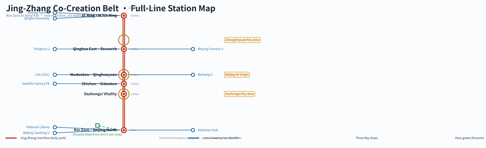
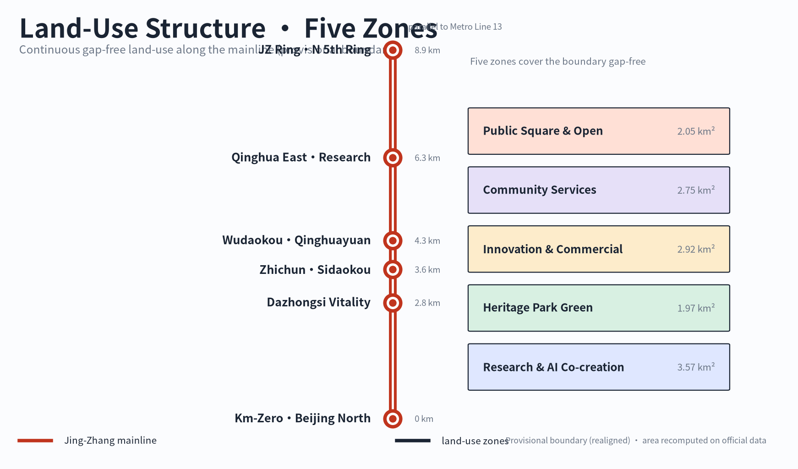
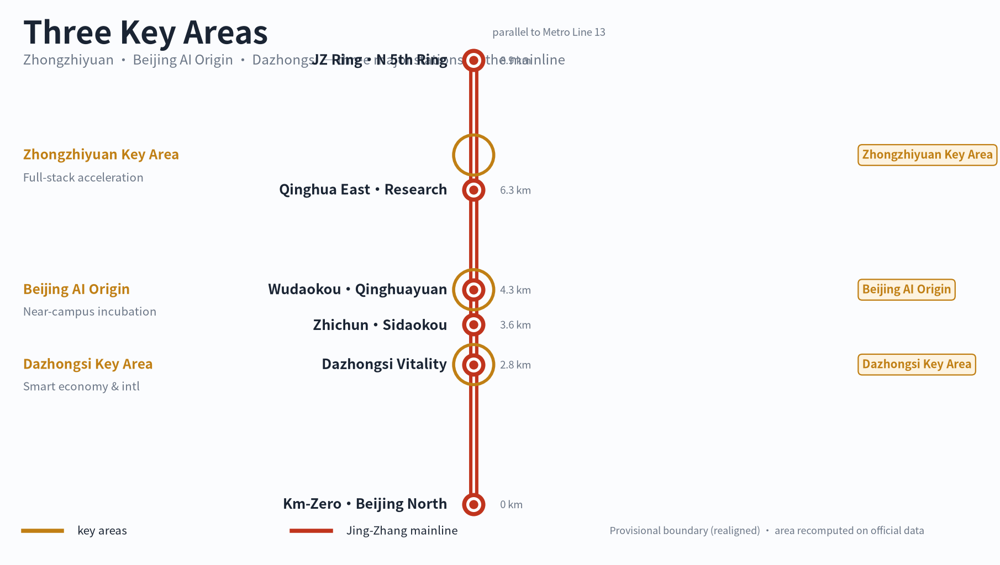
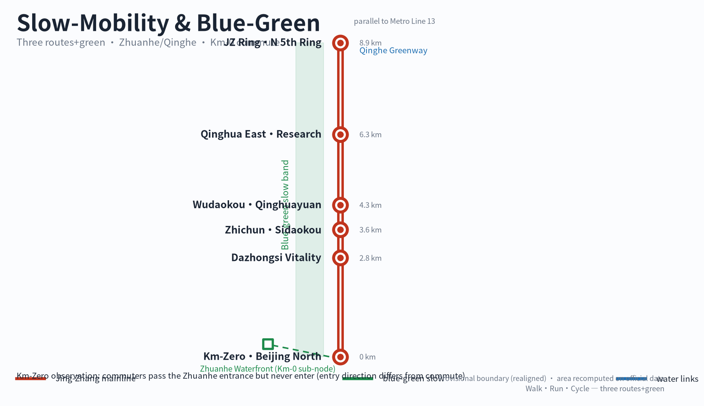
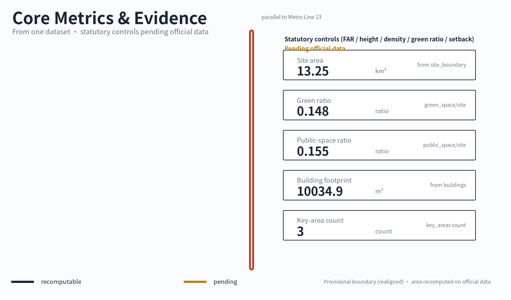

# Jing-Zhang School-Enterprise Co-Creation Belt: From Kilometer Zero to the Nine-Kilometer Commons

This proposal begins with a small observation. Between the south gate of Beijing Jiaotong University's east campus and Xizhimen metro station, many students walk every day. They pass the park entrance near the Zhuanhe waterfront, but almost none of them go in, because the direction into the park is not the direction toward the metro — entering means a detour, and it is not on the way. The entrance is there, the waterside seats are there, yet it is only a boundary, not a destination. This proposal does not start from a grand AI-city narrative. It starts from this repeatedly passed, repeatedly ignored moment, and asks one concrete question: how can the nine kilometers of the Jing-Zhang Railway Heritage Park turn from "a boundary one passes" into "a daily park where one knows the next stop," and then let universities and enterprises meet along that line. The proposal is titled *Jing-Zhang School-Enterprise Co-Creation Belt: From Kilometer Zero to the Nine-Kilometer Commons*. All spatial and operational content is a conceptual suggestion, a reference scheme, or material for professional teams to deepen; it does not constitute statutory planning, an approved government conclusion, or an implementation commitment.

## Design Basis and Source List

The first basis of this proposal is the official pre-qualification announcement, "Centennial Jing-Zhang AI Innovation Belt Urban Design International Open Call," issued by the Haidian Branch of the Beijing Municipal Commission of Planning and Natural Resources on 9 May 2026, together with the agent-facing open-call taskbook registered in the repository [source:DATA-SRC-OFFICIAL-ANNOUNCEMENT-20260509] [source:DATA-SRC-AGENT-TASKBOOK-20260518]. The announcement fixes the project name, the textual scope and areas of the three levels, the design tasks, and the required deliverable depth; the taskbook fixes the six mandatory agent tasks agent.1 through agent.6. The chapters, layers, metrics, and matrices of this proposal are organized around these two documents, with item-by-item mapping stored in the compliance matrix.

The second basis is the professional standards and public sources registered in the repository. The professional language of urban design and regulatory-plan depth comes from the Ministry of Housing and Urban-Rural Development's *Urban Design Management Measures* and *Measures for the Formulation and Approval of Regulatory Detailed Planning* [standard:MOHURD-URBAN-DESIGN-MEASURES] [standard:MOHURD-CONTROL-DETAILED-PLANNING], and land-use terminology comes from the Ministry of Natural Resources' land-and-sea use classification guide [standard:MNR-LAND-USE-CLASSIFICATION-GUIDE]. Node facts such as Jing-Zhang Kilometer Zero, Qinghuayuan Station, Sidaokou, and the Jing-Zhang Ring come from official and officially affiliated media reports; node names, heritage-status chains, and open status were verified item by item before writing, with the verification records and limitations kept in `sources.json`.

The third basis is field evidence, whose limits must be stated honestly. Among the proposal's users is an observer who has long walked this commute route; the proposal cites the "Beijing Jiaotong University student commute-path observation" anonymously and does not point to any individual identity. The field evidence has three parts: the participant's years of path memory, cross-verification against public sources, and two earlier path photographs (Xizhimen, and the Gaoliangqiao / Jiaoda East Road junction). The author was not in Beijing during writing and did not take new site photographs, so the current condition of places such as the Zhuanhe waterfront sub-node is described from memory plus public reporting, with confidence flagged per node in the node layer; it is not an engineering or ownership conclusion. This limitation is registered as A-FIELD-001 in `assumptions.json`.

Regarding the boundary, this proposal uses a provisional rough boundary that has been re-aligned to the real Jing-Zhang heritage-park corridor (Beijing North Railway Station → Qinghe) [data:geometry/site_boundary.geojson#SITE-001]; its attributes are provisional constraint, non-official boundary, rough precision. It is used only for scheme generation, self-check, visualization, and design discussion; it is not an official redline, an approval basis, or a basis for precise area calculation. The realigned provisional boundary is about 13.3 square kilometres, larger than the announcement's ~11.4 km² reference, because it must cover all verified nodes; the absence of official organizer polygons does not block content scoring, but once official data is released the boundary, key areas, land use, roads, green space, public space, buildings, phasing, and all metrics must be regenerated and recomputed — a trigger registered as A-BOUNDARY-001 and A-BOUNDARY-REALIGN-001. Statutory control indicators such as floor-area ratio, building height, building density, green-space ratio, and setback are all currently missing and are written throughout as "pending official data"; no estimated value is passed off as an approved indicator.

## Three-Level Scope Framework

The announcement defines three working levels: a coordinated research area of about 43.6 square kilometres, concerned with the AI industry ecosystem and the future urban form; an overall design area of about 11.4 square kilometres, covering the urban districts and industry zones within one to two kilometres of the Jing-Zhang heritage park and requiring urban design at regulatory-plan depth; and a key detailed-design area of about 368.4 hectares, comprising from north to south the Zhongzhiyuan AI independent-innovation acceleration area, the Beijing AI Origin Community, and the Dazhongsi AI industry cluster, requiring detailed design [source:DATA-SRC-OFFICIAL-ANNOUNCEMENT-20260509] [depth:three_level_scope_framework].

This proposal translates the three levels into a single readable line. The coordinated research level answers "what is this belt": it is the Jing-Zhang School-Enterprise Co-Creation Belt, a nine-kilometre public mainline whose main body is a daily-use park. The overall design level answers "how is this line organized": the railway mainline carries the park itself, while universities, enterprises, transport, and communities join the mainline as transfer nodes — like the relationship between a main line and interchange stations on a metro map [data:geometry/constraints.geojson#ZONE-001]. The key-area level answers "what role the three key areas play on this line": they are the three interchanges where universities and enterprises meet most densely, not three isolated industrial parks.

The order of the three levels of work is fixed. First the provisional boundary and existing constraints are locked, then land use is divided and green and public space arranged, then nodes and scenarios are placed, and finally metrics are recomputed from the layers. No area, ratio, or project count that cannot be recomputed from structured data is written into a conclusion. The three levels are mapped item by item in the compliance matrix to chapters, layers, metrics, drawings, and self-check items.

| Level | Announcement requirement | This proposal's answer | Data anchor |
| --- | --- | --- | --- |
| Coordinated research area 43.6 km² | AI innovation ecosystem and future urban form | the school-enterprise co-creation industry narrative and the nine-kilometre public mainline | compliance matrix, sources.json |
| Overall design area ~13.3 km² (announcement ~11.4 km² is the reference) | regulatory-plan-depth urban design and renewal framework | metro-map "mainline + transfer nodes" spatial organization | [data:geometry/site_boundary.geojson#SITE-001], [data:geometry/land_use.geojson#LU-001] |
| Key detailed-design area 368.4 ha | detailed design of three key areas | Zhongzhiyuan, Origin Community, Dazhongsi as three school-enterprise interchanges on the mainline | [data:geometry/key_areas.geojson#PROV-KEY-001], [metric:key_area_count] |

## Coordinated Research Area: Industry and Future City Research

The design judgment at the coordination level is one sentence: the scarcest resource in Haidian is not another office building, but a low-cost, everyday interface where the talent produced by universities meets the real needs of enterprises. Haidian has nearly twenty universities and research institutes and a dense concentration of AI firms, yet campus, park, block, and community have long operated separately. This proposal advances "school-enterprise co-creation" as the industry-organization logic: universities continuously produce talent and results, that talent and those results ultimately serve enterprises and society, and the heritage park's public mainline is the shared interface where the two sides meet, experiment, and present. This answers the announcement's task of "building a world-class AI innovation ecosystem" and explains the proposal's name [source:DATA-SRC-AGENT-TASKBOOK-20260518].

Cross-verified against official public material and open maps, the Beijing Satellite Manufacturing Factory Science Park carries institutions such as the Weixin Institute through the renewal of old factory buildings, and can serve as a real resource sample of school-enterprise co-creation; universities along the line such as Beihang, Beijing Forestry University, and Beijing Sport University join as conceptual transfer resources on both sides of the mainline, which does not mean those institutions have committed to participate [source:TRANSFER-SRC-JINGZHANG-PLANNING-20211216] [source:TRANSFER-SRC-SATELLITE-PARK-20260812] [source:TRANSFER-SRC-OSM-20260812].

The announcement's three positionings fall into a clear hierarchy in this proposal. The Centennial Jing-Zhang culture belt is the identity layer, carried by the nine-kilometre railway mainline and six real nodes. The urban AI life-experience belt is the daily layer, carried by slow mobility, seating, waterfront, and light interaction. The AI integration-and-innovation belt is the increment layer, appearing only at a few open exchange nodes and never pre-empting the park's daily and cultural primacy. The "three zones and two wings" spatial frame is likewise translated: the three zones are the three key interchanges on the mainline, and the Zhongguancun technology-service wing and Xiaoyuehe scenario-empowerment wing are connecting resources on either side of the mainline, joining in the same way as universities and enterprises — as transfer nodes, not as a new main axis.

### Naming, identity, and overall concept (agent.1)

The overall concept is named the "Jing-Zhang School-Enterprise Co-Creation Belt"; the English name is *Jing-Zhang School-Enterprise Co-Creation Belt*, and the subtitle "From Kilometer Zero to the Nine-Kilometer Commons" directly states the spatial extent and the starting point. The identity direction uses metro-map language: the nine-kilometre mainline is a continuous line, the six mainline nodes are stations, universities, enterprises, hubs, and communities are interchange symbols, and sub-nodes such as the Zhuanhe waterfront are the entrance/exit markers of the Kilometer-Zero station. This visual system is at the same time the information system, in two levels: the first is the complete nine-kilometre line, giving a whole-line cognition; the second is the "next stop" prompt, so that at any node one only needs to know where to go next. Naming and identity are conceptual suggestions for professional teams to deepen and involve no trademark registration or official naming.

### Global AI-ecosystem and linear-heritage cases (agent.2)

This proposal studies seven cases, each with the reason it cannot be copied directly. Phase one and two of the Jing-Zhang Railway Heritage Park are the most direct local references: phase one linked about 2.4 kilometres of greenway from Qinghua East Road to Zhichun Road, and phase two opened a full line of about nine kilometres, proving that phased implementation is feasible, though its operating mechanism is still forming [source:NODE-SRC-PEOPLE-2023] [source:NODE-SRC-STD-2026]. Shougang Park proves industrial heritage can sustain long-term operation, but its single owner and Winter Olympics resources cannot be replicated. New York's High Line and Chicago's The 606 prove linear heritage parks depend on entrances and community governance rather than the trail alone, and their property and funding systems differ from Beijing's. Paris's Station F proves a railway building can become an entrepreneurship ecosystem, but it is a single building with private capital, while Jing-Zhang is a linear, multi-owner space. Helsinki's Kalasatama proves a "test scenario" needs an institutionalized interface rather than a one-off exhibition. The Zhongguancun Forum is the local highest-level event asset; this proposal chooses to be its host space and city-roaming network rather than starting a competing brand.

### Cultural narrative (agent.5)

The cultural mainline is made of three layers of time. The first is the century of Jing-Zhang, the memory of China's self-built railway beginning at the former Xizhimen station and Qinghuayuan Station [source:NODE-SRC-CHINA-RAILWAY] [source:NODE-SRC-THU-HISTORY]. The second is Zhongguancun, the dare-to-try culture from "Electronics Street" to the independent-innovation demonstration zone. The third is the new AI culture — open-source, co-creative, tolerant of trial and error — the contemporary engineering culture. The three layers are not expressed through sculpture groups but stacked on the same line: walking the nine-kilometre mainline, the railway is underfoot, universities are beside you, and enterprises lie ahead. The concrete carriers of the narrative are the two-level line information, the node storytelling, and the content rotation of the co-creation table — all light, replaceable interventions.

The answer on future urban form is therefore concrete: AI does not change the spatial skeleton of this belt; it changes the feedback speed of public space. Whether an entrance is understood, whether a seat is used, whether a slow-mobility link is broken — all can be sensed, discussed, and improved at low cost. This is what this proposal understands by "an urban form adapted to AI as a new quality productive force": a shift from a one-off delivered built environment to a continuously iterating public product.

## Overall Design Area: Urban Renewal and Regulatory-Plan-Level Urban Design

The announcement uses about 11.4 square kilometres as the reference for the overall design area and requires urban design at regulatory-plan depth; this proposal's provisional boundary has been re-aligned to the real park corridor and recomputes to about 13.3 square kilometres. This proposal's understanding of that depth is: the spatial structure, land-use division, renewal classification, and facility layout must be complete and reviewable, while all statutory control indicators honestly remain "pending official data" [standard:MOHURD-CONTROL-DETAILED-PLANNING] [depth:land_use_layout].

The spatial structure continues the "mainline plus transfer" organization. The Jing-Zhang mainline slow-mobility spine runs south to north [data:geometry/roads.geojson#ROAD-001], parallel to Metro Line 13 from Beijing North Railway Station to Qinghe, with six mainline nodes strung along it, and transfer resources (Xizhimen hub, Beijing Jiaotong University, Tsinghua University, the Chinese Academy of Sciences, the Qinghe waterfront green corridor, and others) joining as interchange nodes [data:geometry/constraints.geojson#TRANSFER-01]. Land use is fully divided within the provisional boundary into five categories, gap-free and non-overlapping: research and AI co-creation land, Jing-Zhang heritage-park green space, innovation-service and commercial-service land, community-service-facility land, and public-square and open-activity land [data:geometry/land_use.geojson#LU-001].

The overall urban-renewal strategy is light intervention. This proposal does not propose new large fixed buildings and does not assume large-scale demolition; renewal actions focus on retention and reuse, functional replacement, interface opening, and small-scale stitching. The industry-function layout serves the school-enterprise co-creation logic: research and co-creation functions sit close to university transfer nodes, enterprise-service and exhibition functions sit close to Dazhongsi and the Origin Community, and community-service functions fill the interfaces between the mainline and residential areas. Because official regulatory-plan conditions are missing, intensity indicators such as total building volume, floor-area ratio, building height, and building density are all marked as pending official data, and the design-layer building footprint is only a conceptual expression [data:geometry/buildings.geojson#BLDG-001] [metric:building_footprint_area_sqm].

## Detailed Design of Key Areas

The three key areas use the repository's registered provisional rough boundaries [data:geometry/key_areas.geojson#PROV-KEY-001] [data:geometry/key_areas.geojson#PROV-KEY-002] [data:geometry/key_areas.geojson#PROV-KEY-003]; area figures follow the announcement text (Zhongzhiyuan about 192.1 hectares, Origin Community about 104.3 hectares, Dazhongsi about 72.0 hectares), with precise boundaries pending official data. The detailed-design depth is organized at the urban-design depth of a comprehensive implementation plan, covering functional format, conceptual building scale, retain-renovate-demolish classification, public-space connectivity, traffic organization, and implementation dependencies [depth:three_key_area_detailed_design].

Distinctively, this proposal understands the three key areas as lying on the nine-kilometre mainline rather than as three separate plots.

| Key area | Role on the mainline | Conceptual spatial moves | School-enterprise co-creation scenarios | Main pending conditions |
| --- | --- | --- | --- | --- |
| Zhongzhiyuan AI independent-innovation acceleration area | northern industry anchor, connecting toward the Jing-Zhang Ring | strengthen the Qinghe waterfront interface and open test environments in green space; organize industry exhibition and low-carbon innovation exchange | full-stack indigenous-technology showcase, standards and safety-governance public workshops, green-computing experience | official polygon, Qinghe blue line, flood-control and ecological conditions |
| Beijing AI Origin Community | middle school-enterprise interchange hub, close to the Qinghua East Road node | stitch slow-mobility interfaces among campus, park, and block; add spaces for results release, talent services, and open-source collaboration | near-campus results-transfer stations, open-source release, talent-service windows | campus boundaries, ownership, ground-floor tenant status |
| Dazhongsi AI industry cluster | southern urban gateway, connecting the Dazhongsi community vitality section | around Dazhongsi station integration and four-quadrant pedestrian connectivity at the junction, renew the public environment around key enterprises | smart-terminal and agent showcase, enterprise-service reception hall, content-consumption scenarios | rail-station conditions, junction and municipal-utility data |

All three zones offer conceptual suggestions only and draw no demolition or change conclusions for specific parcels. There is public reporting on urban-renewal policy context in the Dazhongsi area, but a case-specific approved indicator cannot be extrapolated into a general control condition for the whole area — a point restated in the risk chapter.

## AI Innovation Ecosystem, Personas, and AI+ Scenarios

This chapter answers agent.3 and agent.4. The design judgment is: AI scenarios must grow on the mainline nodes and serve real people, not float on technical jargon. All scenarios are conceptual suggestions; data collection follows the minimization principle; public interaction uses no face recognition, no forced login, and no collection of personal data unrelated to function; governance boundaries follow the public provisions on generative-AI service management [source:DATA-SRC-GENERATIVE-AI-INTERIM-MEASURES].

### User personas (no fewer than five)

The personas all come from the talent-flow chain of school-enterprise co-creation, not from abstract population categories.

| Persona | Relationship to the mainline | Typical need | Spatial response | Boundary |
| --- | --- | --- | --- | --- |
| commuting university student | the person who passes the Kilometer-Zero entrance daily but never enters | to know the park starts here and what the next stop offers | Kilometer-Zero identity marker, next-stop prompt, a reason to return outside commute hours | anonymous observation, no personal-trajectory tracking |
| university researcher / results transferor | enters the mainline from Qinghua East Road and Wudaokou nodes | a low-cost place to show and connect results | Origin Community results-transfer station, co-creation table display rotation | results and data need authorization |
| enterprise recruiter / technical-service provider | transfers in from Origin Community and Dazhongsi | to reach talent, present real problems, get public feedback | enterprise-service reception hall, co-creation table problem wall | enterprise marks and cases must be rights-cleared |
| nearby community resident | a daily user of the mainline | a quiet daily park, community services, low disturbance | community vitality section, shared living rooms, graded activities | resident personas not used for commercial recommendation |
| AI-culture and railway-culture visitor | explores along the mainline | a readable cultural narrative and pilgrimage nodes | two-level line information, three landmarks, voice storytelling | content sources must be traceable |
| park operator / maintainer | keeps the mainline running | a clear feedback entry and maintenance priority | co-creation table feedback aggregation, facility-issue routing | feedback data only aggregated statistically |

### Scenario cards (no fewer than ten)

The scenario cards correspond one-to-one with nodes and are numbered along the mainline order. The three marked "test" are industry test/validation scenarios.

| Scenario card | Node | Content | Mapped call scenario |
| --- | --- | --- | --- |
| 01 Kilometer-Zero origin cognition | Jing-Zhang Kilometer Zero / Beijing North Railway Station | let a passer-by see at a glance that the park starts here and what lies nine kilometres north | ai-cultural-guide |
| 02 next-stop prompt system | all six nodes | each node answers one question: where is the next stop, how long, what to see | ai-traffic-walkability |
| 03 railway-memory voice storytelling | Zhichun Road · Sidaokou | scan-and-go anonymous voice guide telling the stories of rails, locomotives, and stations | ai-cultural-guide |
| 04 commute slow-mobility checkup (test) | Kilometer Zero to Dazhongsi section | identify slow-mobility breakpoints, lighting gaps, and entrance-visibility problems with low-intrusion methods | ai-traffic-walkability |
| 05 enterprise-service copilot (test) | Dazhongsi, Origin Community | a public query-terminal prototype for enterprise policy, scenario, and event information | enterprise-service-copilot |
| 06 results-transfer station | Origin Community, Qinghua East Road node | a small release-and-matchmaking space for university results where both sides meet with low threshold | enterprise-service-copilot |
| 07 AI Co-Creation Table | first at the Kilometer-Zero sub-node | a physical model plus a no-login public screen where the public comments on node improvements | see the dedicated section below |
| 08 low-speed delivery pilot (test) | Wudaokou to Qinghua East Road section | a concept validation of low-speed unmanned delivery inside the park, with limited times and routes | robot-delivery-low-speed |
| 09 accessible-path prompts | whole line | continuous path information for wheelchair, stroller, and visually impaired users | ai-traffic-walkability |
| 10 park event calendar | community vitality section | rotatable light-event information release, creating reasons to return outside commute | ai-cultural-guide |
| 11 night-safety feedback | whole line | anonymous reporting of lighting and safety-perception issues, aggregated to guide maintenance ordering | ai-traffic-walkability |

### AI Co-Creation Table

The AI Co-Creation Table is this proposal's only core AI-device concept, sited first at the Zhuanhe waterfront sub-node of the Kilometer-Zero node [data:geometry/constraints.geojson#NODE-01A]. It has three parts: a physical model showing the node-improvement scheme, a public screen operable without login, and an optional QR code for continued participation after leaving. Participation is fully anonymous, with no face recognition and no collection of personal data unrelated to improvement opinions. It works as an experience-feedback-iterate loop: the public experiences in the park, gives feedback at the table, and the operator aggregates the feedback and adjusts the next round. The first iteration targets the Kilometer-Zero node itself — the very entrance commuters repeatedly pass. The co-creation table is at present only a concept, not built, and implies no procurement or construction commitment.

### AI pilgrimage landmarks and honor display (agent.4)

Three pilgrimage landmarks unfold along the mainline from south to north. The first is Jing-Zhang Kilometer Zero, anchored on Beijing North Railway Station and the former Xizhimen station site, telling the starting point of China's railway [data:geometry/constraints.geojson#NODE-01] [source:NODE-SRC-CHINA-RAILWAY]. The second is Qinghuayuan Station at Wudaokou, using its complete heritage-status chain to tell how the railway and the university enabled each other [data:geometry/constraints.geojson#NODE-04] [source:NODE-SRC-BJGOV-2023-05]. The third is the northern landmark node toward the Jing-Zhang Ring, pointing to the continuation of the nine-kilometre narrative northward [data:geometry/constraints.geojson#NODE-06]. The honor display is not a grand monument but a "co-creation annual rings" concept at the co-creation table: each round of adopted public suggestions and the participating university and enterprise teams are recorded on a replaceable display face, making contribution memorable and echoing the taskbook's co-creation charter.

## Land Use, Building Scale, and Retain-Renovate-Demolish Strategy

Land use is fully divided within the provisional boundary into five categories; adjacent polygons share boundary coordinates, gap-free and non-overlapping [data:geometry/land_use.geojson#LU-001]. Land-use terminology follows a project subset of the Ministry of Natural Resources' land-and-sea use classification guide [standard:MNR-LAND-USE-CLASSIFICATION-GUIDE].

| Land-use ID | Name | Design intent |
| --- | --- | --- |
| LU-001 | research and AI co-creation land | carries school-enterprise co-creation functions, close to university and research transfer nodes |
| LU-002 | Jing-Zhang heritage-park green space | the mainline park itself, the first carrier of daily use and railway identity |
| LU-003 | innovation-service and commercial-service land | enterprise service, exhibition, and consumption scenarios, concentrated at Dazhongsi and the Origin Community |
| LU-004 | community-service-facility land | daily facilities serving residents along the line |
| LU-005 | public-square and open-activity land | node squares, event and co-creation display faces |

The retain-renovate-demolish logic follows the statutory urban-renewal language of "retention, renovation, and demolition together, with retention and improvement as the main approach." This proposal's order of judgment is: the existing park and railway remains are retained and activated as a whole; existing buildings along the line mainly undergo functional replacement and interface opening; new construction is limited to small-scale, movable, replaceable service facilities; and there is no demolition recommendation based on this proposal. The building-footprint layer expresses only a conceptual co-creation building base [data:geometry/buildings.geojson#BLDG-001], whose area metric has low confidence [metric:building_footprint_area_sqm] because the existing-building survey, ownership, and regulatory-plan conditions are all missing. Total building scale, floor-area ratio, building height, building density, green-space-ratio control values, and setback are all pending official data; the text provides no estimated figures.

## Transport, Rail, Municipal Infrastructure, and Public Services

The transport chapter returns to the proposal's starting point. A Beijing Jiaotong University student's commute from the east-campus south gate toward Xizhimen metro is not aligned with the direction into the park entrance; entering requires a detour. This proposal therefore explicitly does not take "turning the park into a commute shortcut" as a design premise — that is the wrong question. The right question is to turn the entrance from a boundary into a destination: to let people know this is Jing-Zhang Kilometer Zero, know what lies along the nine kilometres north, and know which stop is next. The commuter still takes the fastest route to the metro, but the park begins to enter his or her mental map, and there is a reason to return outside commute hours. This is the real starting point of slow-mobility system design [data:geometry/roads.geojson#ROAD-001].

For rail and interchange, the Xizhimen hub is the most important transfer node, where Beijing North Railway Station, metro lines, and the park's Kilometer Zero converge [data:geometry/constraints.geojson#TRANSFER-01]. Dazhongsi station integration and four-quadrant pedestrian connectivity at the junction are the Dazhongsi key-area tasks named in the announcement, expressed here as conceptual interchange links [data:geometry/roads.geojson#ROAD-002]. The school-enterprise connections toward Qinghua East Road are expressed the same way [data:geometry/roads.geojson#ROAD-003]. Road redlines, junction-reconstruction conditions, and rail-station engineering data are missing, so all interchange content is a conceptual suggestion.

Municipal and public-service facilities follow the light-intervention principle. This proposal does not propose building or relocating large municipal facilities; it only suggests supplementing, at the node level, services directly tied to park use: drinking water, toilets, lighting, accessibility, non-motorized-vehicle parking, and power for small events. Accessibility design follows the principles of the Barrier-Free Environment Construction Law; the whole slow-mobility path and the two-level information system should be independently usable by wheelchair and visually impaired users [source:DATA-SRC-BARRIER-FREE-ENVIRONMENT-LAW]. Engineering data on pipelines, drainage, flood control, and fire protection are missing and are listed as preconditions for formal deepening.

## Blue-Green Network, Public Space, and Urban Character

The skeleton of the blue-green system is the nine-kilometre park mainline itself. Green space is organized as continuous park green and a railway-memory green corridor [data:geometry/green_space.geojson#GREEN-001]; public space is organized as station squares and community shared living rooms [data:geometry/public_space.geojson#PUBLIC-001]. Recomputed within the provisional boundary, the green-space ratio is about 0.148 and the public-space ratio about 0.155 [metric:green_ratio] [metric:public_space_ratio]. The design meaning of these two numbers is: park green is the main body of this belt, while public-space nodes where people can linger and act are still scarce — which is exactly why a waterside seat at the Kilometer-Zero entrance deserves to be taken seriously. The figures are based on the provisional boundary and must be recomputed once official data is released.

The Zhuanhe waterfront is the concrete sample of this chapter. It has waterside seating and sees short rests, but lacks any prompt that "this is where the nine kilometres begin." The conceptual suggestion is to treat it as a sub-node of the Kilometer-Zero node: a starting-point marker, a full-line route map, a next-stop prompt, plus rotatable co-creation content. The intervention stays light, movable, and replaceable, and does not change the engineering status of the waterfront [data:geometry/constraints.geojson#NODE-01A].

Urban character is formed by stacking three cultural layers: the industrial-heritage texture of the Jing-Zhang railway, the open-innovation temperament of Zhongguancun, and the light, iterable quality of the AI era. Character-control tools are a unified language of wayfinding, public art, and node furniture, not pseudo-precise control of building height, massing, and interface. With no heritage-control boundary or regulatory-plan conditions, this proposal gives no specific character-control figures; such content is pending official data and will be deepened by professional teams [depth:blue_green_public_space].

## Renewal Projects, Implementation Policy, and Phasing

Renewal projects are organized by the logic of "mainline cognition first, node experience second, district deepening third"; all are conceptual project suggestions with no commitment of investment or implementing body [depth:renewal_project_list].

| ID | Project | Type | Main content | Main dependency |
| --- | --- | --- | --- | --- |
| QX-01 | Jing-Zhang Kilometer-Zero sample | public space and information system | starting-point marker, full-line route map, next-stop prompt, Zhuanhe waterfront sub-node activation | entrance ownership, signage permission |
| QX-02 | two-level line information system | wayfinding and digital service | nine-kilometre full-line map plus next-stop prompts at each node | six-node name verification, content operation |
| QX-03 | AI Co-Creation Table first iteration | public-participation device | physical model plus no-login screen; first round improves the Kilometer-Zero entrance | data-compliance review, operating body |
| QX-04 | Dazhongsi community vitality section upgrade | urban renewal | station integration and four-quadrant pedestrian connectivity concept deepening | rail-station and road engineering data |
| QX-05 | Origin Community results-transfer interface | industry-service space | campus-park slow-mobility stitching, results release and talent service | campus boundaries and ownership |
| QX-06 | Zhichun Road · Sidaokou memory storytelling | cultural display | remains interpretation and anonymous voice guide | heritage-requirement verification |

Phasing is strictly distinguished from the call's design period: the call's roughly 100 days is the deliverable-submission time, while implementation phasing is the renewal-advancement path. The conceptual phasing has three stages: the first activates the northern nodes and the Jing-Zhang Ring direction, the second builds the middle school-enterprise co-creation continuous interface, and the third completes the Kilometer-Zero sample and the southern community vitality section [data:geometry/phasing.geojson#PHASE-001]. The phasing puts the most mature park sections first and places the Kilometer-Zero hub area — which needs the most ownership coordination — after public participation is sufficient, consistent with the official park-building experience of "phased, sectioned implementation."

Long-term operation answers agent.6. The operating concept's skeleton is "one line, one calendar, one loop." One line is the nine-kilometre mainline as a long-term brand asset. One calendar is an annual public-event arrangement linked to existing event systems such as the Zhongguancun Forum — this proposal acts as the host space and city-roaming network, not a competing brand. One loop is the co-creation table's experience-feedback-iterate mechanism, rotating park content quarterly. Operating-responsibility boundaries are stated honestly: this proposal does not assume that any government body, university, or enterprise has committed to participate; the operating body, funding source, and approval path are all to be confirmed, and deepening by a professional team is recommended once ownership and governance structure are clear.

## Metrics, Area Recalculation, and Compliance Matrix

The metric system is presented honestly in three classes. The first class is spatial metrics directly recomputable from the submitted geometry: the provisional-boundary area is about 13.252 million square metres (about 13.3 km²), differing from the announcement's ~11.4 km² reference; green-space area, green-space ratio, public-space area, public-space ratio, and key-area count are all recomputed against the new boundary [metric:site_area_sqm] [metric:key_area_count]. Area recalculation is done uniformly under the EPSG:4548 projection, with formulas and source files fully kept in `metrics.json`. The second class is statutory indicators that depend on official regulatory plans: floor-area ratio, building height, building density, statutory green-space ratio, and setback — all pending official data, each marked in `metrics.json` as pending with the reason noted, and none reverse-inferred from design geometry. The third class is operating-performance metrics, such as co-creation-table participation rounds and node revisit rates, which are continuously calibrated during operation and are not numerically committed here.

The compliance matrix is the master file of task responsiveness. Every task in announcement sections 1.3, 1.4, and 1.5 and every agent.1–agent.6 task — all 23 requirements — is mapped item by item to report chapters, layers, metrics, drawings, pages, sources, assumptions, and self-check items, frozen in `compliance_matrix.json` [source:DATA-SRC-AGENT-TASKBOOK-20260518]. The mapping rules are fixed by the requirements ledger; the text, figures, page, and drawings share one set of identifiers, and any missing item is exposed by self-check rather than covered by prose. The three-way metric classification also enters `metrics.json`, `assumptions.json`, and the compliance matrix, so that an operating vision is not miswritten as an approved planning condition.

## Risk, Copyright, and Compliance

The first risk is the uncertainty of boundary and metrics. All spatial conclusions in this proposal rest on a provisional rough boundary; the official SITE_BOUNDARY and the three key-area polygons are not yet public, and all statutory control indicators are missing. The response is to make the uncertainty explicit: the provisional boundary is drawn in figures as a low-contrast dashed line, unknown metrics are itemized in `metrics.json` with the reason for each gap, and the whole is recomputed when official data is released rather than patched locally [depth:risk_missing_data].

The second risk is the limit of field evidence. The proposal's core observation comes from one commuter's long-term path memory, public sources, and two earlier path photographs (Xizhimen, and the Gaoliangqiao / Jiaoda East Road junction); no new photographs could be taken during writing, and the current state of the Zhuanhe waterfront has not been confirmed by recent imagery. The proposal therefore confines its statement of the entrance problem to the level of "entrance visibility and cognition," and does not infer engineering, ownership, or management conditions. The Beijing Jiaotong University perspective is cited anonymously and contains no personally identifiable information. If a professional team deepens the work, the first step should be a systematic site survey.

The third risk is overstatement. Every spatial, construction, operational, and event content in this proposal is a conceptual suggestion, a reference scheme, or material for professional teams to deepen. The proposal does not claim official approval, an approved regulatory plan, land ownership, engineering feasibility, investment scale, or any government or enterprise participation commitment, nor does it extrapolate a case-specific renewal project's approved indicators into general district conditions.

On copyright and bilingual compliance, this proposal's primary text is Chinese, and the equivalent English text is `proposal.en.md`; the two correspond one-to-one in chapters, claims, metrics, and figure positions. The two path photographs are the participant's own material and contain no identifiable person; all other cited material is from public sources, with provenance and licensing recorded in `sources.json` and `report/copyright_statement.md`. The offline display page loads no remote scripts, remote fonts, map tiles, iframes, forms, or external interfaces, and does not track reader behavior. AI-related content follows the principles of data minimization and human review; the urban agent does not replace planning approval or final human judgment.

## References

- "Centennial Jing-Zhang AI Innovation Belt Urban Design International Open Call — Pre-qualification Announcement," Haidian Branch, Beijing Municipal Commission of Planning and Natural Resources, 2026-05-09 [source:DATA-SRC-OFFICIAL-ANNOUNCEMENT-20260509]
- Excerpt of the agent-facing open-call taskbook for the Centennial Jing-Zhang AI Innovation Belt urban design, 2026-05-18 [source:DATA-SRC-AGENT-TASKBOOK-20260518]
- Public report on Phase 1 of the Jing-Zhang Railway Heritage Park, People's Daily Online, 2023-06-29 [source:NODE-SRC-PEOPLE-2023]
- Report on the completion and opening of Phase 2 of the Jing-Zhang Railway Heritage Park, Science and Technology Daily, 2026-08-06 [source:NODE-SRC-STD-2026]
- Report on the full nine-kilometre opening of Phase 2 of the Jing-Zhang Railway Heritage Park, Beijing Daily, 2026-08-07 [source:NODE-SRC-BJD-2026]
- Supplementary list of Beijing Municipal Cultural-Relic Protection Units, Jing-Zheng-Fa [2023] No. 5, Beijing Municipal People's Government, 2023 [source:NODE-SRC-BJGOV-2023-05]
- "Qinghuayuan Station and Tsinghua University," Tsinghua University History Museum, 2023-04-29 [source:NODE-SRC-THU-HISTORY]
- Former Xizhimen station site, Railway Culture column, China State Railway Group [source:NODE-SRC-CHINA-RAILWAY]
- MOHURD *Urban Design Management Measures*; MOHURD *Measures for the Formulation and Approval of Regulatory Detailed Planning*; MNR *Land-and-Sea Use Classification Guide*
- *Interim Measures for the Management of Generative AI Services*, CAC and six other departments, 2023; *Barrier-Free Environment Construction Law of the PRC*, 2023
- Repository site package: `brief/site-package/` (design brief, taskbook excerpt, provisional boundary, enums, metric ranges, standard snapshots)
- Full machine-readable index: `sources.json`, `metrics.json`, `assumptions.json`, `compliance_matrix.json`, `standard_matrix.json`, `design_depth_matrix.json`
