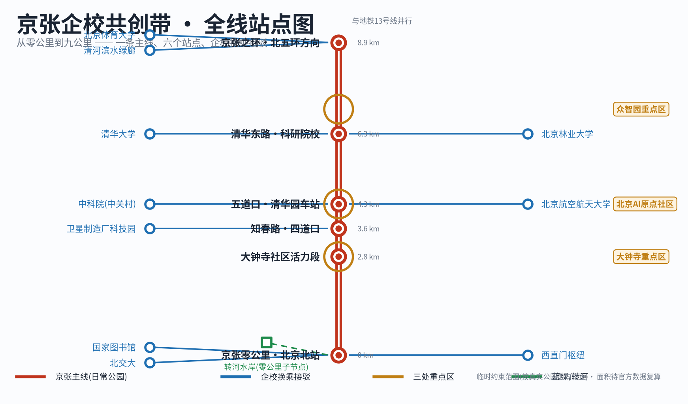
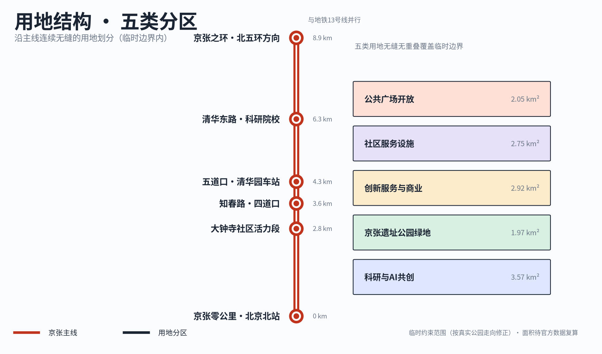
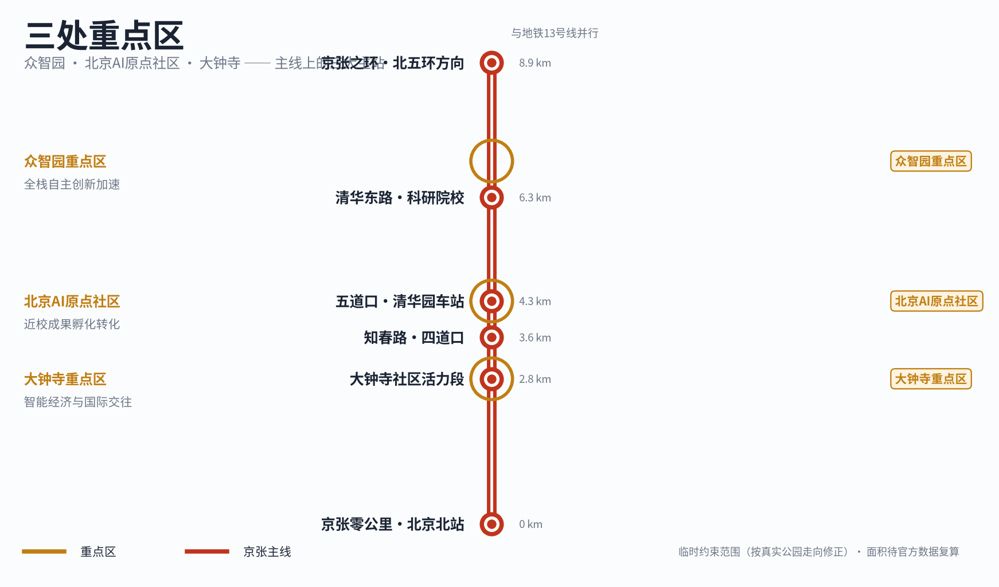
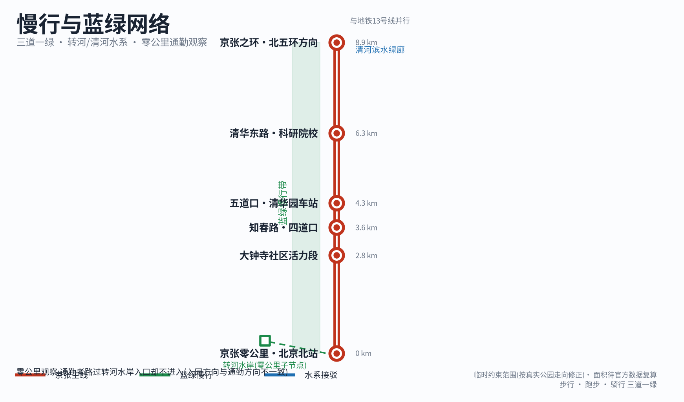
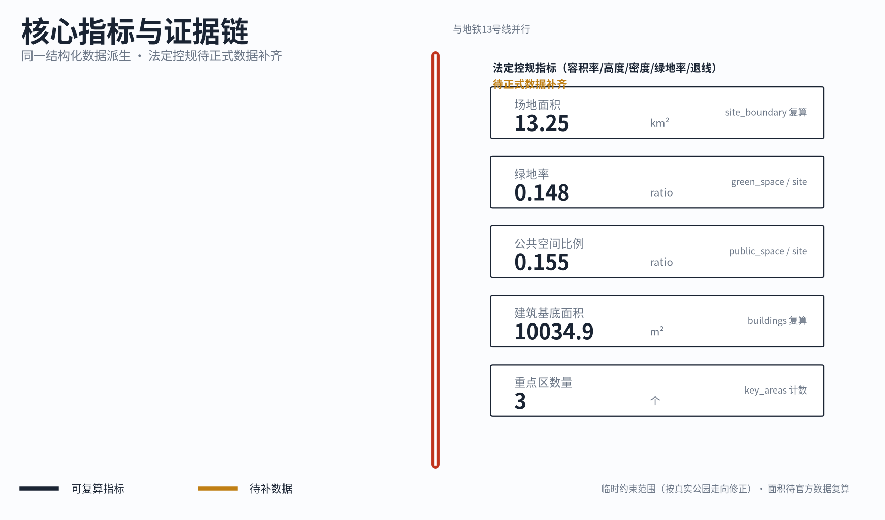

# 京张企校共创带：从零公里到九公里

本方案从一件小事开始。北京交通大学东校区南门到西直门地铁站之间，每天有大量学生步行通勤。他们会路过转河水岸附近的公园入口，但几乎没有人进去，因为进入公园的方向与去往地铁站的方向并不一致——入园要绕一段路，不顺路。入口就在那里，椅子也在那里，可它只是一道边界，不是一个目的地。本方案不从宏大的 AI 城市叙事出发，而从这个被反复路过、反复被忽略的瞬间出发，回答一个具体问题：怎样让京张铁路遗址公园的九公里，从“路过的边界”变成“知道下一站去哪的日常公园”，再让高校和企业在这条线上相遇。方案名称为《京张企校共创带：从零公里到九公里》，全部空间与运营内容均为概念建议、参考方案或可供专业团队深化研究的材料，不构成法定规划、政府审定结论或实施承诺。

## 设计依据与资料清单

本方案的第一依据是北京市规划和自然资源委员会海淀分局 2026 年 5 月 9 日发布的《百年京张 AI 创新带城市设计国际方案征集资格预审公告》，以及仓库登记的面向智能体开源征集任务书 [source:DATA-SRC-OFFICIAL-ANNOUNCEMENT-20260509] [source:DATA-SRC-AGENT-TASKBOOK-20260518]。公告确定了项目名称、三层范围文字口径与面积、设计任务和成果深度要求；任务书确定了 agent.1 至 agent.6 六项必答任务。本方案的章节、图层、指标和矩阵均按这两份文件组织，逐项映射保存在任务覆盖矩阵中。

第二组依据是仓库登记的专业标准与公共来源。城市设计与控规深度的专业语言来自住建部《城市设计管理办法》和《城市、镇控制性详细规划编制审批办法》[standard:MOHURD-URBAN-DESIGN-MEASURES] [standard:MOHURD-CONTROL-DETAILED-PLANNING]，用地术语来自自然资源部用地用海分类指南 [standard:MNR-LAND-USE-CLASSIFICATION-GUIDE]。京张零公里、清华园车站、四道口、京张之环等节点事实来自官方与官方媒体公开报道，节点名称、文保身份链和开放状态在写作前逐条核验，核验记录与局限保存在 `sources.json`。

第三组依据是现场证据，其边界必须如实说明。方案使用者中有一位长期走这条通勤路线的观察者，方案以匿名方式引用“北交大学生通勤路径观察”，不指向任何个人身份。现场证据由三部分构成：参与者多年的路径记忆、公开来源交叉核验、两张早期路径照片（西直门、高梁桥与交大东路路口）。方案撰写期间作者不在北京，没有补拍新的现场照片，因此转河水岸子节点等处的现状描述以记忆加公开报道为准，置信度在节点图层中逐项标注，不作为工程或权属结论。这一限制在 `assumptions.json` 的 A-FIELD-001 中登记。

关于边界，本方案使用已校正至真实京张遗址公园走廊（北京北站→清河）的临时粗略范围 [data:geometry/site_boundary.geojson#SITE-001]，其属性为临时约束范围（provisional constraint）、非官方边界、粗略精度。它只用于方案生成、自检、可视化和设计讨论，不是官方红线，不作为审批依据或精确面积依据。该真实走廊校正后的临时范围约13.3平方公里，大于公告约11.4平方公里参考值，因为需要覆盖全部已核验节点；组织方官方 polygon 的缺失不阻断内容评分，但一旦官方数据发布，边界、重点区、用地、道路、绿地、公共空间、建筑、分期和全部指标都必须重新生成与复算，这一触发条件登记在 A-BOUNDARY-001 和 A-BOUNDARY-REALIGN-001。容积率、建筑高度、建筑密度、绿地率、退线等法定控制指标当前全部缺失，正文一律写作“待正式数据补齐”，不以推测值冒充审定指标。

## 三层范围工作框架

公告确定了三个工作层次：统筹研究范围约 43.6 平方公里，关注 AI 产业生态与未来城市形态；总体设计范围约 11.4 平方公里，以京张遗址公园周边 1 至 2 公里的城市地区和产业区为对象，要求达到控规的城市设计深度；重点区域范围约 368.4 公顷，自北向南为众智园 AI 自主创新加速区、北京 AI 原点社区、大钟寺 AI 产业聚集区，要求详细设计 [source:DATA-SRC-OFFICIAL-ANNOUNCEMENT-20260509] [depth:three_level_scope_framework]。

本方案把三层范围转译为一条可读的线。统筹研究层回答“这条带是什么”：它是京张企校共创带，一条以日常公园为主体的九公里公共主线。总体设计层回答“这条线怎么组织”：铁路主线承载公园本身，高校、企业、交通、社区作为换乘节点接入主线，像地铁线路图上主线与换乘站的关系 [data:geometry/constraints.geojson#ZONE-001]。重点区域层回答“三处重点区在这条线上扮演什么角色”：它们是主线上校企相遇最密集的三个换乘区，而不是三座孤立的产业园。

三层工作的先后顺序是固定的。先锁定临时边界与既有约束，再划分用地、布置绿地与公共空间，再放置节点与场景，最后从图层复算指标。任何无法从结构化数据复算的面积、比例或项目数量，都不写入结论。三层范围在任务覆盖矩阵中逐条挂接到章节、图层、指标、图纸与自检项。

| 层级 | 公告要求 | 本方案的回答 | 数据落点 |
| --- | --- | --- | --- |
| 统筹研究范围 43.6 km² | AI 创新生态与未来城市形态 | 企校共创的产业叙事与九公里公共主线 | 任务覆盖矩阵、sources.json |
| 总体设计范围约13.3 km²（公告11.4 km²为参考口径） | 控规深度城市设计与更新框架 | 地铁线路图式的“主线加换乘节点”空间组织 | [data:geometry/site_boundary.geojson#SITE-001]、[data:geometry/land_use.geojson#LU-001] |
| 重点区域范围 368.4 ha | 三处重点区详细设计 | 众智园、原点社区、大钟寺作为主线上的三个校企换乘区 | [data:geometry/key_areas.geojson#PROV-KEY-001]、[metric:key_area_count] |

## 统筹研究范围产业与未来城市研究

统筹层的设计判断只有一句话：海淀最稀缺的资源不是又一栋办公楼，而是高校产出的人才与企业真实需求之间低成本、日常化的相遇界面。海淀拥有近 20 所高校院所与高密度的 AI 企业，但校区、园区、街区、社区长期各自运转。本方案提出“企校共创”作为产业组织逻辑：高校持续产出人才与成果，人才与成果最终服务于企业与社会，而遗址公园这条公共主线是二者见面、试错、展示的公共接口。这回应公告“构建世界级 AI 创新生态体系”的任务，也解释了本方案名称的由来 [source:DATA-SRC-AGENT-TASKBOOK-20260518]。

经官方公开资料与开放地图交叉核验，北京卫星制造厂科技园以老厂房更新承载微芯研究院等机构，可作为企校共创的真实资源样本；北航、北林、北体等沿线高校则作为主线两侧的概念性换乘资源接入，不代表相关机构已承诺参与 [source:TRANSFER-SRC-JINGZHANG-PLANNING-20211216] [source:TRANSFER-SRC-SATELLITE-PARK-20260812] [source:TRANSFER-SRC-OSM-20260812]。

公告的三个定位在本方案中落在一条清晰的层级上。百年京张文化带是身份层，由九公里铁路主线和六个真实节点承载；都市 AI 生活体验带是日常层，由慢行、座椅、水岸和轻量互动承载；AI 融合创新带是增量层，只在少数开放交流节点出现，不抢占公园的日常与文化主体。三区两翼的空间框架同样被转译：三区是主线上的三个重点换乘区，中关村科技服务翼与小月河场景赋能翼是主线两侧的接驳资源，接入方式与高校、企业相同，都是换乘节点而非新的主轴。

### 命名、标识与总体概念（agent.1）

总体概念命名为“京张企校共创带”，英文名为 Jing-Zhang School-Enterprise Co-Creation Belt，副标题“从零公里到九公里”直接点出空间范围与起点。标识方向采用地铁线路图语言：九公里主线为一条连续线，六个主线节点为站点，高校、企业、枢纽、社区为换乘符号，转河水岸等子节点为零公里站内的出入口标识。这套视觉系统同时就是信息系统，分为两级：第一级是完整的九公里线路，让人建立全线认知；第二级是“下一站”提示，让人在任何一个节点只知道下一步去哪。命名与标识均为概念建议，供专业团队深化，不涉及商标注册或官方定名。

### 全球 AI 生态与线性遗产案例（agent.2）

本方案研究了七个案例，每个都写明不可直接复制之处。京张铁路遗址公园一期与二期是本地最直接的参照，一期约 2.4 公里绿道串联清华东路至知春路，二期开放后全线约九公里，证明分段实施可行，但其运营机制仍在形成中 [source:NODE-SRC-PEOPLE-2023] [source:NODE-SRC-STD-2026]。首钢园证明工业遗产可以承载持续运营，但单一业主与冬奥资源不可复制。纽约 High Line 与芝加哥 The 606 证明线性遗产公园依赖出入口与社区治理，而非单纯步道，其产权与筹资制度与北京不同。巴黎 Station F 证明铁路建筑可以转化为创业生态，但它是单体建筑加私人资本，京张是带状多权属空间。赫尔辛基 Kalasatama 证明“测试场景”需要制度化接口而非一次性展览。中关村论坛是本地最高能级活动资产，本方案选择做它的承载空间与城市漫游网络，不另起竞争品牌。

### 文化叙事（agent.5）

文化主线由三层时间构成。第一层是百年京张，从西直门站旧址与清华园车站开始的中国自主铁路记忆 [source:NODE-SRC-CHINA-RAILWAY] [source:NODE-SRC-THU-HISTORY]。第二层是中关村，从电子一条街到自主创新示范区的敢试文化。第三层是 AI 新文化，开源、共创、可试错的当代工程师文化。三层叙事不靠雕塑群表达，而是叠在同一条线路上：走在九公里主线上，脚下是铁路，身边是高校，前方是企业。叙事的具体载体是两级线路信息、节点讲述和共创台的内容轮换，全部为轻量、可更换的介入。

未来城市形态的回答因此很具体：AI 不改变这条带子的空间骨架，它改变的是公共空间的反馈速度。一个入口是否被理解、一张座椅是否被使用、一段慢行是否中断，都可以被低成本地感知、讨论和改进。这是本方案理解的“适配 AI 新质生产力的城市形态”，即从一次性交付的建成环境，转向持续迭代的公共产品。

## 总体设计范围城市更新与控规深度城市设计

公告以约11.4平方公里作为总体设计范围参考，公告要求达到控规的城市设计深度；本次临时边界已校正至真实公园走廊，复算约13.3平方公里。本方案对这一深度的理解是：空间结构、用地划分、更新分类和设施布局必须完整、可审查，同时所有法定控制指标如实保持为“待正式数据补齐”[standard:MOHURD-CONTROL-DETAILED-PLANNING] [depth:land_use_layout]。

空间结构延续“主线加换乘”的组织。京张主线慢行识别廊道贯穿南北 [data:geometry/roads.geojson#ROAD-001]，与地铁13号线自北京北站至清河的走向并行，六个主线节点串联其间，换乘资源（西直门枢纽、北交大、清华大学、中科院、清河滨水绿廊等）以接驳节点形式接入 [data:geometry/constraints.geojson#TRANSFER-01]。用地在临时边界内完整划分为五类，无缝无重叠：科研与 AI 共创用地、京张遗址公园绿地、创新服务与商业服务用地、社区服务设施用地、公共广场与开放活动用地 [data:geometry/land_use.geojson#LU-001]。

城市更新的总体策略是轻介入。本方案不提出新建大型固定建筑，不以大拆大建为前提，更新动作以保留利用、功能置换、界面开放和小尺度织补为主。产业功能布局服务于企校共创逻辑：科研与共创功能贴近高校换乘节点，企业服务与展示功能贴近大钟寺与原点社区，社区服务功能填满主线与居住区的接口。建筑总量、容积率、建筑高度、建筑密度等强度指标因官方控规条件缺失，全部标记为待正式数据补齐，设计层的建筑基底仅为概念性表达 [data:geometry/buildings.geojson#BLDG-001] [metric:building_footprint_area_sqm]。

## 重点区域详细设计

三处重点区使用仓库登记的临时粗略范围 [data:geometry/key_areas.geojson#PROV-KEY-001] [data:geometry/key_areas.geojson#PROV-KEY-002] [data:geometry/key_areas.geojson#PROV-KEY-003]，面积口径以公告文字为准（众智园约 192.1 公顷、原点社区约 104.3 公顷、大钟寺约 72.0 公顷），精确边界待正式数据补齐。详细设计深度按规划综合实施方案的城市设计深度组织，覆盖功能业态、建筑规模概念、拆改留分类、公共空间连通、交通组织与实施依赖 [depth:three_key_area_detailed_design]。

与众不同的是，本方案把三处重点区放在九公里主线上理解，而非三块独立用地。

| 重点区 | 在主线上的角色 | 概念性空间动作 | 校企共创场景 | 主要待补条件 |
| --- | --- | --- | --- | --- |
| 众智园 AI 自主创新加速区 | 北端产业锚点，衔接京张之环方向 | 强化清河滨水界面与绿色空间中的开放测试环境，组织产业展示与低碳创新交往 | 全栈自主技术展示、标准与安全治理公开工作坊、绿色算力体验 | 官方 polygon、清河蓝线、防洪与生态条件 |
| 北京 AI 原点社区 | 中段校企换乘枢纽，贴近清华东路节点 | 缝合校区、园区、街区的慢行接口，补足成果发布、人才服务与开源协作空间 | 近校成果转化驿站、开源发布、人才服务窗口 | 校区边界、权属、首层业态现状 |
| 大钟寺 AI 产业聚集区 | 南段城市门户，衔接大钟寺社区活力段 | 围绕大钟寺站一体化与路口四象限步行连通，更新企业周边公共环境 | 智能终端与智能体展示、企业服务会客厅、内容消费场景 | 轨道站点条件、道路交叉口与市政管线资料 |

三区均提出概念建议，不涉及具体地块的拆改结论。大钟寺片区已有城市更新政策语境的公开报道，但个案批准指标不能外推为本片区通用控制条件，这一点在风险章节再次声明。

## AI 创新生态、人才画像与 AI+ 场景

本章回应 agent.3 与 agent.4。设计判断是：AI 场景必须长在主线节点上，服务真实的人，而不是悬浮在技术名词上。所有场景均为概念建议，数据采集遵守最小化原则，公共互动不做人脸识别、不强制登录、不采集与功能无关的个人数据，治理边界参照生成式人工智能服务管理的公开条文 [source:DATA-SRC-GENERATIVE-AI-INTERIM-MEASURES]。

### 用户画像（不少于 5 类）

画像全部来自企校共创的人才流动链条，而非抽象人群分类。

| 画像 | 与主线的关系 | 典型需求 | 空间响应 | 边界 |
| --- | --- | --- | --- | --- |
| 通勤的高校学生 | 每天路过零公里入口却不进入的人 | 知道公园从这里开始、知道下一站有什么 | 零公里身份标识、下一站提示、非通勤时段的回访理由 | 匿名观察，不追踪个人轨迹 |
| 高校科研与成果转出者 | 从清华东路、五道口节点进入主线 | 低成本的成果展示与对接场所 | 原点社区成果转化驿站、共创台展示轮换 | 成果与数据需授权 |
| 企业招聘与技术服务方 | 从原点社区、大钟寺换乘进入 | 接触人才、展示真实问题、获取公共反馈 | 企业服务会客厅、共创台问题墙 | 企业标识与案例须清权 |
| 公园周边社区居民 | 主线的日常使用者 | 安静的日常公园、社区服务、低扰动 | 社区活力段、共享客厅、活动分级 | 居民画像不用于商业推荐 |
| AI 文化与铁路文化访客 | 沿主线探索的人 | 可读的文化叙事与朝圣节点 | 两级线路信息、三大地标、语音讲述 | 内容来源须可追溯 |
| 公园运营与维护者 | 让主线持续运转的人 | 清晰的反馈入口与维护优先级 | 共创台反馈汇总、设施问题报修流转 | 反馈数据只做聚合统计 |

### 场景卡（不少于 10 张）

场景卡与节点一一对应，编号沿用主线顺序。其中标注“测试”的三张为产业测试验证场景。

| 场景卡 | 所在节点 | 内容 | 对应征集场景 |
| --- | --- | --- | --- |
| 01 零公里起点认知 | 京张零公里/北京北站 | 让路过者一眼知道公园从这里开始、向北九公里有什么 | ai-cultural-guide |
| 02 下一站提示系统 | 全线六节点 | 每个节点只回答一个问题：下一站去哪、多久、看什么 | ai-traffic-walkability |
| 03 铁路记忆语音讲述 | 知春路·四道口 | 扫码即走的匿名语音导览，讲述铁轨、车头与车站故事 | ai-cultural-guide |
| 04 通勤慢行体检（测试） | 零公里至大钟寺段 | 用低侵入方式识别慢行断点、照明缺口与入口可见性问题 | ai-traffic-walkability |
| 05 企业服务副驾驶（测试） | 大钟寺、原点社区 | 面向企业的政策、场景、活动信息公共查询终端原型 | enterprise-service-copilot |
| 06 成果转化驿站 | 原点社区、清华东路节点 | 高校成果的小型发布与对接空间，校企双方低门槛见面 | enterprise-service-copilot |
| 07 AI 共创台 | 零公里子节点先行 | 实体模型加无登录公共屏幕，公众对节点改造提意见 | 见下文专节 |
| 08 低速配送试点（测试） | 五道口至清华东路段 | 公园内部的低速无人配送概念验证，限定时段与路线 | robot-delivery-low-speed |
| 09 无障碍路径提示 | 全线 | 为轮椅、婴儿车与视障使用者提供连续路径信息 | ai-traffic-walkability |
| 10 公园活动日历 | 社区活力段 | 可轮换的轻量活动信息发布，创造非通勤回访理由 | ai-cultural-guide |
| 11 夜间安全反馈 | 全线 | 匿名上报照明与安全感问题，聚合后指导维护排序 | ai-traffic-walkability |

### AI 共创台

AI 共创台是本方案唯一的核心 AI 装置概念，位置首选零公里节点的转河水岸子节点 [data:geometry/constraints.geojson#NODE-01A]。它由三部分组成：一个展示节点改造方案的实体模型，一块无需登录即可操作的公共屏幕，一个可选的二维码供离场后继续参与。参与全程匿名，不做人脸识别，不采集与改造意见无关的个人数据。它的工作方式是体验、反馈、迭代的闭环：公众在公园里体验，在共创台上反馈，运营方聚合反馈后调整下一轮方案。第一轮迭代的对象就是零公里节点自身，也就是那个被通勤者反复路过的入口。共创台目前仅为概念呈现，未建成，不构成任何采购或建设承诺。

### AI 朝圣地标与荣誉展示（agent.4）

三处朝圣地标沿主线由南向北展开。第一处是京张零公里，以北京北站与西直门站旧址为锚点，讲述中国铁路的起点 [data:geometry/constraints.geojson#NODE-01] [source:NODE-SRC-CHINA-RAILWAY]。第二处是五道口的清华园车站，以完整的文物身份链讲述铁路与大学的相互成就 [data:geometry/constraints.geojson#NODE-04] [source:NODE-SRC-BJGOV-2023-05]。第三处是京张之环方向的北端地标节点，指向九公里叙事向北的延续 [data:geometry/constraints.geojson#NODE-06]。荣誉展示不做宏大纪念碑，而是在共创台设置“共创年轮”概念：每一轮被采纳的公众建议与参与的高校、企业团队被记录在可更换的展示面上，让贡献可记忆，呼应任务书的共创宪章。

## 用地、建筑规模与拆改留方案

用地在临时边界内完整划分为五类，相邻多边形共享边界坐标，无缝、无重叠 [data:geometry/land_use.geojson#LU-001]。用地术语遵循自然资源部用地用海分类指南的项目子集 [standard:MNR-LAND-USE-CLASSIFICATION-GUIDE]。

| 用地编号 | 名称 | 设计意图 |
| --- | --- | --- |
| LU-001 | 科研与 AI 共创用地 | 承载校企共创功能，贴近高校与科研换乘节点 |
| LU-002 | 京张遗址公园绿地 | 主线公园本体，日常使用和铁路身份的第一载体 |
| LU-003 | 创新服务与商业服务用地 | 企业服务、展示与消费场景，集中在大钟寺与原点社区 |
| LU-004 | 社区服务设施用地 | 服务沿线社区居民的日常设施 |
| LU-005 | 公共广场与开放活动用地 | 节点广场、活动与共创展示面 |

拆改留逻辑遵循“留改拆并举、以保留利用提升为主”的城市更新法定语言。本方案的判断顺序是：现状公园与铁路遗存整体保留并活化；沿线既有建筑以功能置换和界面开放为主；新建仅限小尺度、可移动、可更换的服务设施；不存在以本方案为依据的拆除建议。建筑基底图层只表达概念性的共创建筑基底 [data:geometry/buildings.geojson#BLDG-001]，其面积指标置信度为低 [metric:building_footprint_area_sqm]，因为现状建筑普查、权属和控规条件均缺失。总建筑规模、容积率、建筑高度、建筑密度、绿地率控制值与退线全部待正式数据补齐，正文不提供任何推测数值。

## 交通、轨道、市政与公共服务设施

交通章节回到全方案的出发点。北交大学生从东校区南门前往西直门地铁的通勤，与进入公园入口的方向并不一致，入园需要绕行。本方案因此明确不以"把公园变成通勤捷径"为设计前提，那是错误的问题。正确的问题是把入口从边界变成目的地：让人知道这里是京张零公里，知道向北九公里沿线有什么，知道下一站是哪。通勤者依然走最快路线去地铁，但公园开始进入他的心智地图，非通勤时间有了回访理由。这是慢行系统设计的真实起点 [data:geometry/roads.geojson#ROAD-001]。

轨道与接驳方面，西直门枢纽是最重要的换乘节点，北京北站、地铁线路与公园零公里在此交汇 [data:geometry/constraints.geojson#TRANSFER-01]。大钟寺站一体化与路口四象限步行连通是公告点名的大钟寺重点区任务，本方案以概念性接驳线表达 [data:geometry/roads.geojson#ROAD-002]。清华东路方向的校企接驳以同样方式表达 [data:geometry/roads.geojson#ROAD-003]。道路红线、交叉口改造条件和轨道站点工程资料缺失，全部接驳内容均为概念建议。

市政与公共服务设施遵循轻介入原则。本方案不提出大型市政设施的新建或迁改，只建议在节点层级补足与公园使用直接相关的服务：饮水、卫生间、照明、无障碍、非机动车停放和小型活动用电。无障碍设计遵循无障碍环境建设法的原则，全线慢行路径与两级信息系统都应可被轮椅与视障使用者独立使用 [source:DATA-SRC-BARRIER-FREE-ENVIRONMENT-LAW]。管线、排水、防洪、消防等工程资料缺失，列为正式深化的前置条件。

## 蓝绿空间、公共空间与城市风貌

蓝绿系统的骨架就是九公里公园主线本身，绿地以连续公园绿地与铁路记忆绿廊组织 [data:geometry/green_space.geojson#GREEN-001]，公共空间以站点广场与社区共享客厅组织 [data:geometry/public_space.geojson#PUBLIC-001]。临时边界内复算的绿地率约 0.148，公共空间比例约 0.155 [metric:green_ratio] [metric:public_space_ratio]。这两个数字的设计含义是：公园绿地是这条带子的主体，而可停留、可活动的公共空间节点仍然稀缺，这正解释了为什么零公里入口的一把临水座椅值得被认真对待。数值基于临时边界，官方数据发布后须复算。

转河水岸是本章的具体样板。那里有临水座椅，存在短时休息行为，但缺少“这里是九公里起点”的任何提示。概念建议是把它作为零公里节点的子节点处理：一套起点标识、一块全线线路图、一处下一站提示，再加上可轮换的共创内容。介入保持轻量、可移动、可更换，不改变水岸的工程现状 [data:geometry/constraints.geojson#NODE-01A]。

城市风貌由三层文化叠加而成：京张铁路的工业遗存质感、中关村的开放创新气质、AI 时代的轻量与可迭代。风貌控制手段是导视系统、公共艺术和节点家具的统一语言，而非对建筑高度、体量和界面的伪精确控制。在无文保控制范围线与控规条件的情况下，本方案不给出任何具体风貌控制数值，相关内容待正式数据补齐后由专业团队深化 [depth:blue_green_public_space]。

## 更新项目清单、实施政策与分期计划

更新项目按“先主线认知、再节点体验、后片区深化”的逻辑组织，全部为概念性项目建议，不承诺投资与实施主体 [depth:renewal_project_list]。

| 编号 | 项目 | 类型 | 主要内容 | 主要依赖 |
| --- | --- | --- | --- | --- |
| QX-01 | 京张零公里样板 | 公共空间与信息系统 | 起点标识、全线线路图、下一站提示、转河水岸子节点激活 | 入口权属、标识许可 |
| QX-02 | 两级线路信息系统 | 导视与数字服务 | 九公里全线图加各节点下一站提示 | 六节点名称核验、内容运营 |
| QX-03 | AI 共创台首轮迭代 | 公共参与装置 | 实体模型加无登录屏幕，首轮改进零公里入口 | 数据合规审查、运营主体 |
| QX-04 | 大钟寺社区活力段提升 | 城市更新 | 站点一体化与四象限步行连通概念深化 | 轨道站点与道路工程资料 |
| QX-05 | 原点社区成果转化界面 | 产业服务空间 | 校区园区慢行缝合、成果发布与人才服务 | 校区边界与权属 |
| QX-06 | 知春路·四道口记忆讲述 | 文化展示 | 遗存解说与匿名语音导览 | 文保要求核验 |

分期与征集设计周期严格区分：征集的约 100 天是成果提交时间，实施分期是更新推进路径。概念性分期为三个阶段，第一阶段激活北段节点与京张之环方向，第二阶段构建中段校企共创连续界面，第三阶段完成零公里样板与南段社区活力段 [data:geometry/phasing.geojson#PHASE-001]。分期顺序把最成熟的公园区段放在前面，把需要最多权属协调的零公里枢纽区放在公众参与充分之后，这与官方“分期分段实施”的公园建设经验一致。

长期运营回应 agent.6。运营概念的骨架是“一条线路、一张日历、一个闭环”：一条线路指九公里主线作为长期品牌资产；一张日历指与中关村论坛等既有活动体系衔接的年度公共活动安排，本方案做承载空间与城市漫游网络，不另起竞争品牌；一个闭环指共创台的体验、反馈、迭代机制，让公园内容按季度轮换。运营责任边界如实声明：本方案不假设任何政府机构、高校或企业已承诺参与，运营主体、经费来源与审批路径均为待确认事项，建议由后续专业团队在权属与治理结构明确后深化。

## 指标体系、面积复算与合规矩阵

指标体系分三类如实呈现。第一类是可由提交几何直接复算的空间指标：临时边界面积约 1325.2 万平方米（约13.3平方公里），与公告约11.4平方公里参考口径存在差异；绿地面积、绿地率、公共空间面积、公共空间比例和重点区数量均按新边界重算 [metric:site_area_sqm] [metric:key_area_count]。面积复算统一在 EPSG: 4548 投影下完成，公式与来源文件完整保存在 `metrics.json`。第二类是依赖官方控规的法定指标：容积率、建筑高度、建筑密度、法定绿地率、退线，全部待正式数据补齐，`metrics.json` 中逐项如实标记为待补并注明原因，不以设计几何反推。第三类是运营绩效指标，如共创台参与轮次与节点回访情况，属于运营期持续校准的对象，本次不作数值承诺。

合规矩阵是任务响应性的主控文件。公告 1.3、1.4、1.5 各条任务与 agent.1 至 agent.6 全部 23 项要求，逐项映射到报告章节、图层、指标、图纸、页面、来源、假设与自检项，冻结于 `compliance_matrix.json` [source:DATA-SRC-AGENT-TASKBOOK-20260518]。映射规则按需求台账固定，正文、图件、页面与图纸沿用同一组标识，任何一项缺失都会在自检中暴露，而不是被文字覆盖。指标的三类划分同时进入 `metrics.json`、`assumptions.json` 与任务覆盖矩阵，避免把运营愿景误写成审定规划条件。

## 风险、版权与合规说明

第一项风险是边界与指标的不确定性。本方案全部空间结论基于临时粗略边界，官方 SITE_BOUNDARY 与三处重点区 polygon 尚未公开；法定控制指标全部缺失。应对方式是把不确定性显性化：临时边界在图件中以低对比虚线表达，未知指标在 `metrics.json` 中逐项注明缺口原因，正式数据发布后整体重算，不局部修补 [depth:risk_missing_data]。

第二项风险是现场证据的局限。方案的核心观察来自一位通勤者的长期路径记忆、公开来源和两张早期路径照片（西直门、高梁桥与交大东路路口），撰写期间未能补拍新照片，转河水岸现状未获近期影像确认。方案因此把入口问题的表述限定在“入口可见性与认知”层面，不推断工程、权属或管理现状。北交大视角以匿名方式引用，不含任何可识别个人身份的信息。若专业团队深化，第一步应是系统的现场核查。

第三项风险是表述越界。本方案可能出现的一切空间、建设、运营与活动内容均为概念建议、参考方案或可供专业团队深化研究的材料。方案不声称官方批准、审定控规、土地权属、工程可行性、投资规模或任何政府与企业的参与承诺，也不把个案更新项目的批准指标外推为片区通用条件。

版权与双语合规方面，本方案为中文主稿，英文等义稿为 `proposal.en.md`，两者章节、主张、指标与图位一一对应。两张路径照片为参与者自有素材，不含可识别个人；其余引用材料均为公开来源，出处与许可记录在 `sources.json` 与 `report/copyright_statement.md`。离线展示页面不加载远程脚本、远程字体、地图瓦片、iframe、表单或外部接口，不跟踪读者行为。AI 相关内容遵守数据最小化与人工复核原则，城市智能体不替代规划审批与人类最终判断。

## 参考资料

- 《百年京张 AI 创新带城市设计国际方案征集资格预审公告》，北京市规划和自然资源委员会海淀分局，2026-05-09 [source:DATA-SRC-OFFICIAL-ANNOUNCEMENT-20260509]
- 面向全球智能体开展百年京张 AI 创新带城市设计开源征集任务书摘录，2026-05-18 [source:DATA-SRC-AGENT-TASKBOOK-20260518]
- 京张铁路遗址公园一期公开报道，人民网，2023-06-29 [source:NODE-SRC-PEOPLE-2023]
- 京张铁路遗址公园二期建成开放报道，科技日报，2026-08-06 [source:NODE-SRC-STD-2026]
- 九公里京张铁路遗址公园二期全线开放报道，北京日报，2026-08-07 [source:NODE-SRC-BJD-2026]
- 京政发 〔2023〕5 号北京市文物保护单位增补名单，北京市人民政府，2023 [source:NODE-SRC-BJGOV-2023-05]
- 《清华园车站与清华大学》，清华大学校史馆，2023-04-29 [source:NODE-SRC-THU-HISTORY]
- 西直门站旧址，中国国家铁路集团有限公司铁路文化栏目 [source:NODE-SRC-CHINA-RAILWAY]
- 住建部《城市设计管理办法》；住建部《城市、镇控制性详细规划编制审批办法》；自然资源部《国土空间调查、规划、用途管制用地用海分类指南》
- 《生成式人工智能服务管理暂行办法》，国家网信办等七部门，2023；《中华人民共和国无障碍环境建设法》，2023
- 仓库场地包：`brief/site-package/`（设计任务书、任务书摘录、临时边界、枚举、指标范围、标准快照）
- 完整机器可读索引：`sources.json`、`metrics.json`、`assumptions.json`、`compliance_matrix.json`、`standard_matrix.json`、`design_depth_matrix.json`
