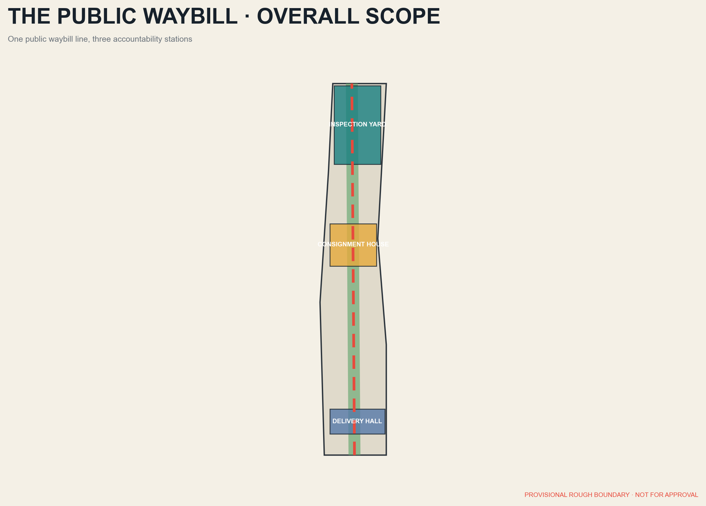
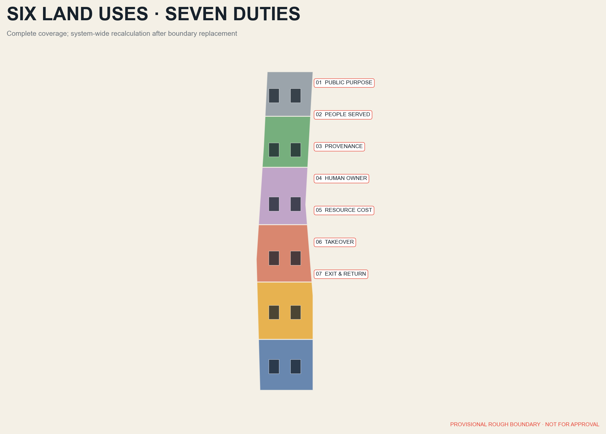
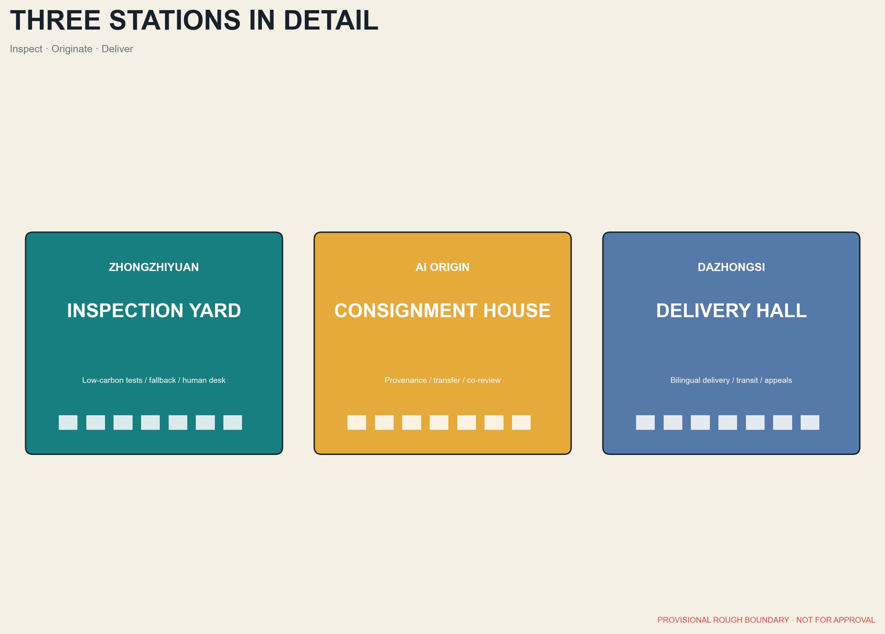
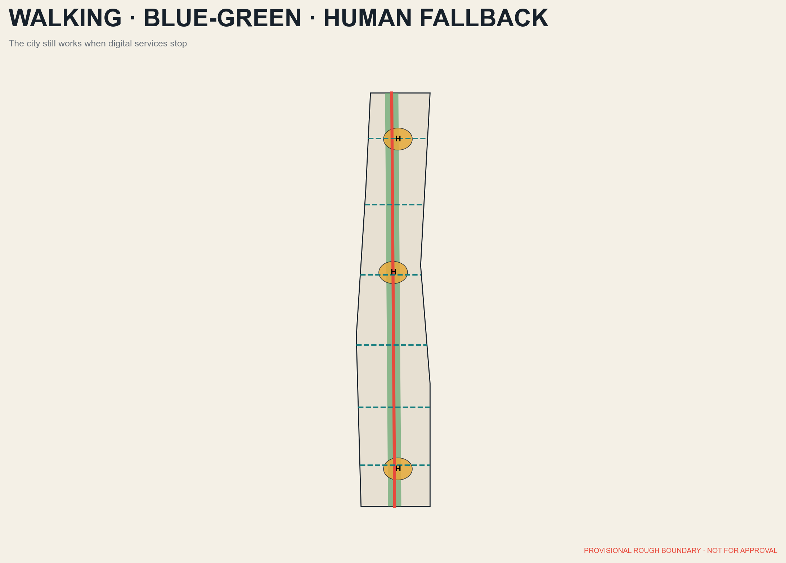
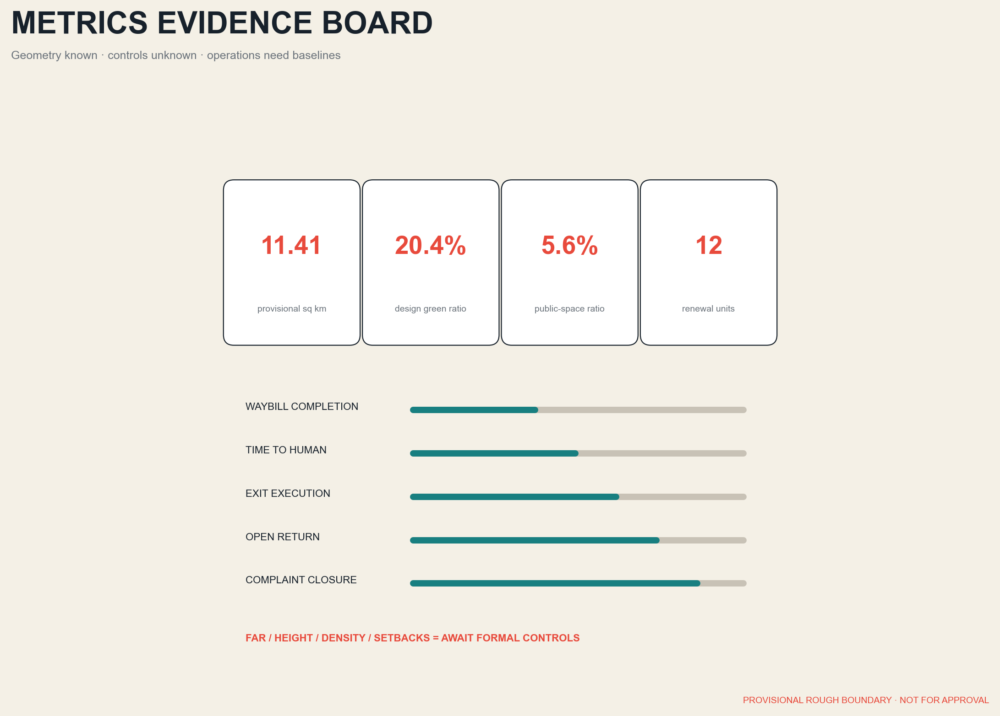

# THE PUBLIC WAYBILL / 京张通单

> Every urban AI travels with a public waybill that anyone can read, inspect, challenge, and retire.

<!-- participant_build_revision: 20260810T053045Z -->

## Design Basis and Source List

This proposal begins with the official announcement, the agent taskbook, the public site package, and applicable national rules. The announced scopes are approximately 43.6 sq km for coordinated research, 11.4 sq km for overall design, and 368.4 ha across three key areas. Geometry uses the repository's provisional rough boundaries available on 7 August 2026; it is not a statutory redline, parcel boundary, or approval basis. [source:OFFICIAL-ANNOUNCEMENT] [source:BOUNDARY-SOURCE]

The workflow is source registration, spatial generation, metric recalculation, and human-machine review. `sources.json` records authority and permission, `assumptions.json` records gaps, nine GeoJSON layers hold design objects, and `metrics.json` recalculates area in EPSG:4548. Statutory FAR, height, density, green ratio, setbacks, utilities, and ownership controls are absent, so the package does not disguise design suggestions as approved controls. [source:SOURCE-REGISTRY] [assumption:A-CONTROLS-001]

The waybill is a shared legend for space and governance. Before an AI service enters the district it discloses seven fields: public purpose, people served, data and model provenance, accountable human operator, energy and resource cost, takeover and appeal route, and expiry, exit, and public return. It is a proposed transparency interface, not a new statutory permit. [standard:PROJECT-AGENT-OPEN-CALL-TASKBOOK] [standard:GENAI-INTERIM-MEASURES]

## Three-Level Scope Framework

Across the 43.6 sq km research area, the waybill works as a regional innovation compact: universities trace research provenance, companies disclose product responsibility and resource use, public bodies publish real needs, and communities evaluate public value. Within the 11.4 sq km overall design area it becomes a spatial network: the heritage park is the Public Freight Line, east-west streets are collection routes, and the three key areas inspect, originate, and deliver waybills. [source:AGENT-TASKBOOK] [depth:three_level_scope_framework]

The structure is one line, three stations, seven fields, and many service points. Zhongzhiyuan is the Inspection Yard for validation and low-carbon testing; Beijing AI Origin is the Consignment House for university transfer and open source; Dazhongsi is the Delivery Hall for enterprise release, public services, and international exchange. Health, education, mobility, retail, and neighbourhood governance occupy distributed points. [data:geometry/key_areas.geojson#PROV-KEY-001] [data:geometry/roads.geojson#ROAD-001]

The research level does not invent parcels; the overall level uses replaceable geometric partitions; each key area defines projects, public space, building actions, operators, and stage gates. Official polygons will trigger system-wide recalculation of every derived layer and metric. [data:geometry/land_use.geojson#LU-001] [metric:site_area_sqm]

## Coordinated Research Area: Industry and Future City Research

The industrial chain is reframed from a generic research-incubation-commercialisation sequence into an auditable public delivery chain. Universities create an origin waybill; open-source communities check provenance and licences; Zhongzhiyuan tests safety, performance, energy, and fallback; enterprises deliver services at Dazhongsi; communities evaluate real benefit and trigger renewal or exit. Algorithms, compute, data, products, people, and civic services share one accountability relationship. [source:AGENT-TASKBOOK] [depth:ai_industry_ecosystem]

Six international cases are method references, not imported controls. Kendall Square shows the shift from office cluster to innovation community; one-north demonstrates proximity among research, firms, and startup platforms; Paris-Saclay combines science, services, ecology, and digital planning; Smart Kalasatama uses agile pilots and resident co-creation; Toronto Quayside shows that privacy and public accountability precede deployment; Melbourne shows a city-university open testbed. [source:CASE-KENDALL] [source:CASE-ONE-NORTH] [source:CASE-PARIS-SACLAY]

The Beijing translation is a public, reversible, comparable 90-to-180-day pilot protocol. Each pilot publishes its baseline, beneficiaries, failure conditions, and human takeover, then returns an open method, anonymised statistics, a spatial improvement, or public training. Public space must continue to work when digital services stop. [source:CASE-KALASATAMA] [source:CASE-QUAYSIDE] [source:CASE-MELBOURNE]

## Overall Design Area: Urban Renewal and Regulatory-Plan-Level Urban Design

The Public Waybill is the core concept: not an isolated form, but a civic innovation system connecting an accountability mechanism, spatial network, pilot model, community review, and exit scenarios. Six recalculable land-use families organise innovation R&D, mixed services, civic culture, housing and talent services, green open space, and transport and infrastructure. Together they cover the provisional overall boundary without overlap. Every partition has a traceable identifier and area. [data:geometry/land_use.geojson#LU-001] [standard:MNR-LAND-USE-CLASSIFICATION]

Renewal follows a strict sequence: retain and repair first, reversible additions second, demolition and replacement last. Heritage and buildings with public memory require survey. Usable workshops and ground floors become Waybill Workshops, human takeover desks, and shared rooms. Closed edges are stitched with small public passages and removable structures. Footprints are conceptual renewal objects, not permit drawings. [data:geometry/buildings.geojson#BLDG-001] [depth:retain_renovate_demolish]

Development intensity follows capacity before numbers. Transport, schools, health, drainage, energy, heritage, daylight, and public space are assessed before statutory FAR, height, density, and setbacks are set. This proposal leaves absent controls absent and offers only massing principles for low- to mid-rise northern courts, continuous middle street walls, and permeable southern station edges. [assumption:A-INTENSITY-002] [depth:development_intensity_controls]

## Detailed Design of Key Areas

**Zhongzhiyuan Inspection Yard** is a garden-based validation ground near Qinghe and the Fifth Ring Road. A civic foyer displays every waybill's seven fields; closed testing occurs only in authorised environments; low-carbon compute, edge devices, robots, and accessible interaction occupy reversible courts. Spatial moves open sealed edges, extend green links, retain mature trees, create a human takeover centre, and add a public gallery. [data:geometry/key_areas.geojson#PROV-KEY-001] [depth:three_key_area_detailed_design]

**Beijing AI Origin Consignment House** makes a walking seam among universities, parks, and neighbourhoods. Open-source results jointly record provenance, licence, users, and human accountability. **Dazhongsi Delivery Hall** uses station integration and four-quadrant pedestrian links to turn enterprise display into public delivery, with bilingual waybills and devices kept outside accessible clear routes. [data:geometry/key_areas.geojson#PROV-KEY-002] [data:geometry/key_areas.geojson#PROV-KEY-003]

All three areas follow three hard rules: collection devices provide visible notice, automated decisions lead to a reachable human desk, and temporary installations state removal and data-disposal dates. Current rectangles are provisional discussion devices and official boundaries trigger full redesign. [metric:key_area_count] [assumption:A-BOUNDARY-003]

## AI Innovation Ecosystem, Personas, and AI+ Scenarios

Five core personas shape the proposal: open-source developers needing affordable compute and release space; startups needing real testbeds and compliance coaching; research families needing housing, education, and international services; older and disabled residents needing accessible, human, offline alternatives; and local merchants needing low-threshold tools, copyright protection, and clear benefit. Visitors, maintenance workers, teachers, clinicians, and public officers validate the design. [source:AGENT-TASKBOOK] [standard:BARRIER-FREE-ENVIRONMENT-LAW]

Twelve scenario waybills cover safer walking, accessible transfers, responsive night buses, community health referral, learning support, assisted public-service access, merchant operations, public-space programming, facility repair, bilingual heritage interpretation, low-carbon compute dispatch, and extreme-weather duty. Each states users, place, minimum data, human takeover, operator, and exit. Risk scores never directly determine enforcement, diagnosis, or educational punishment. [data:geometry/public_space.geojson#PUBLIC-001] [standard:GENAI-INTERIM-MEASURES]

Three validation families test edge-model energy and fallback at Zhongzhiyuan, enterprise-agent sources and human confirmation at AI Origin, and multilingual accessible terminals and complaint closure at Dazhongsi. Railway heritage, Qinghe park, and Dazhongsi gateway are three civic landmarks, expressed through a perforated ticket line and seven-field bilingual identity. [data:geometry/phasing.geojson#PHASE-001] [depth:cultural_narrative_landmarks]

## Land Use, Building Scale, and Retain-Renovate-Demolish Strategy

The six land-use families use the national classification as a semantic base and record area in `land_use.geojson`. Innovation and mixed services focus around the three stations and transit links; civic culture follows the heritage spine; housing and talent services sit within daily living areas; green and transport infrastructure form the continuous base. All proportions are design values derived from a provisional boundary and cannot substitute for planning approval. [data:geometry/land_use.geojson#LU-002] [standard:MNR-LAND-USE-CLASSIFICATION]

Twelve conceptual building units are tagged retain, renovate, reversible addition, or conditional replacement. Retained structures carry memory and low-impact public uses; renovations open ground floors, improve energy performance, and complete accessibility; replacement occurs only after transport, utility, and heritage assessment. Total floor area and FAR remain unknown because surveys, storeys, and official boundaries are missing. [data:geometry/buildings.geojson#BLDG-002] [metric:building_footprint_area_sqm]

Massing uses verifiable principles: park edges remain publicly accessible, station edges have permeable ground floors, historic traces keep view corridors and fine grain, and residential edges control night noise, glare, and heat. Every building action passes structural safety, heritage value, embodied carbon, demand, and reversibility tests. [assumption:A-HEIGHT-004] [depth:height_massing_character]

## Transport, Rail, Municipal Infrastructure, and Public Services

The movement framework contains one continuous heritage walking spine, six east-west collection and delivery routes, three transit gateways, and neighbourhood loops. Cross-routes are priority directions, not proposed road redlines. Implementation must verify ownership, rail protection, junction flows, and fire access. Walking, cycling, and continuous accessibility precede new parking, whose supply awaits integrated transport assessment. [data:geometry/roads.geojson#ROAD-001] [depth:traffic_rail_slow_parking]

Municipal infrastructure follows visible minimalism. Equipment is concentrated at maintainable nodes, sensing collects only what a service needs, and energy use and shutdown state are publicly displayed. Critical services keep offline and human alternatives. Rain gardens, permeable paving, shade, and lighting are coordinated with communications, charging, and edge compute to avoid repeated excavation. [data:geometry/green_space.geojson#GREEN-001] [depth:municipal_new_infrastructure]

Public services form a 15-minute human fallback network. Three stations host fixed desks; neighbourhood points host rotating staff; phone and physical channels accompany digital access. Health, education, legal, and safety scenarios support qualified people rather than replace them. Older people, disabled people, children, and non-Chinese speakers test usability before deployment. [standard:BARRIER-FREE-ENVIRONMENT-LAW] [source:AGENT-TASKBOOK]

## Blue-Green Network, Public Space, and Urban Character

The heritage park and Qinghe connections form a long-lived blue-green base: one continuous green spine, three Waybill Parks, and distributed rain pockets. Green and public-space layers are generated inside the provisional boundary so design ratios can be recalculated. These are comparison metrics, not statutory green ratios. Each technology pilot returns shade, seating, permeable ground, or public ecological knowledge. [data:geometry/green_space.geojson#GREEN-001] [metric:green_ratio]

Public-space types are the Inspection Court, Consignment Lane, Delivery Hall, Neighbourhood Lounge, and Quiet Garden. Guidance, robots, and screens occupy a removable equipment edge and never reduce the main clear width. Physical navigation remains legible when equipment is off. Warm low-level lighting reduces disturbance, and general public safety does not rely on facial recognition. [data:geometry/public_space.geojson#PUBLIC-001] [metric:public_space_ratio]

Urban character draws on railway precision, restraint, and durability. Brick, weathering steel, pale recycled materials, and Qinghe teal signage form the palette; perforated ticket lines appear only at entrances, ground nodes, and waybill panels. The northern Validation Greenhouse, middle Open Code Arcade, and southern Bilingual Delivery Hall are useful landmarks measured by everyday dwell, accessibility, and post-technology spatial quality. [standard:MOHURD-URBAN-DESIGN-MEASURES] [depth:blue_green_public_space]

## Renewal Projects, Implementation Policy, and Phasing

Twelve projects form the programme: official boundary reconciliation; heritage and building survey; heritage walking spine; six collection and delivery routes; Zhongzhiyuan Inspection Yard; AI Origin Consignment House; Dazhongsi Delivery Hall; human fallback network; rain-pocket system; physical and digital waybill identity; annual independent evaluation; and an open template with training. Each needs a lead, partners, permits, funding, failure exit, and public return. [data:geometry/phasing.geojson#PHASE-001] [depth:renewal_project_list]

Phase 1, proposed for 2026-2027, is Originate: confirm boundaries and conditions, select three reversible pilots, and establish public-expert review. Phase 2, proposed for 2028-2030, is Interchange: build the spine and key civic spaces, then extend to mobility, enterprise, education, and neighbourhood services. Phase 3, proposed for 2031-2035, is Deliver: renew, relocate, or retire after independent evaluation and publish an international toolkit. Dates are proposals, not commitments. [data:geometry/phasing.geojson#PHASE-002] [assumption:A-PHASING-005]

Policy tools include a waybill template, admission checklist, public-benefit evaluation, data-minimisation review, takeover drills, equipment exit bond, and annual review. Stage gates measure accessible continuity, time to human takeover, waybill completion, exit execution, open-output delivery, energy per service, benefit distribution, and complaint closure. [standard:GENAI-INTERIM-MEASURES] [depth:phasing_implementation]

## Metrics, Area Recalculation, and Compliance Matrix

All areas are calculated in EPSG:4548 while published geometry remains EPSG:4326. The provisional overall boundary recalculates to 11,412,825.386 sq m. Building footprints, green space, public space, and each land-use category are summed from their layers. The land-use union should cover the site without overlap, with tolerance reported by deterministic checks. [data:geometry/site_boundary.geojson#SITE-001] [metric:site_area_sqm]

Metrics have three classes. Known geometry metrics include provisional site area, proposed green and public-space ratios, and conceptual footprints. Deferred statutory metrics include FAR, height, density, daylight, parking, and utility capacity. Operational metrics include waybill completion, takeover time, exit rate, and public return. Targets require pilot baselines and are not fabricated here. [metric:green_ratio] [assumption:A-OPS-006]

Three matrices preserve accountability: `compliance_matrix.json` maps announcement tasks, `standard_matrix.json` maps standards, and `design_depth_matrix.json` maps professional depth. The narrative attaches only one to three evidence markers to each claim while full indexes remain in structured files. [standard:MOHURD-CONTROL-DETAILED-PLANNING] [depth:metrics_recalculation]

## Risk, Copyright, and Compliance

The first risk is missing boundaries and controls. Provisional rectangles may distort area and relationships; statutory intensity, ownership, utilities, rail protection, and heritage controls remain unverified. Mitigation is visible labelling, prohibition on approval use, system-wide recalculation when formal data arrives, and a retained assumption log. [assumption:A-BOUNDARY-003] [depth:risk_missing_data]

The second risk concerns digital rights: over-collection, model bias, automated error, vendor lock-in, and cybersecurity. Every waybill requires minimum data, human takeover, logs, appeal, timed deletion, and an alternative service. Personal information, health, education, legal, or safety deployments require separate professional and legal assessments. [standard:GENAI-INTERIM-MEASURES] [standard:BARRIER-FREE-ENVIRONMENT-LAW]

The third risk is funding, coordination, maintenance, energy burden, obsolescence, and participation fatigue. Reversible trials, public-space-first investment, maintenance budgets, exit assurance, and independent annual review reduce it. The workflow separates public and non-public material and checks privacy, copyright, authorisation, human review, delivery risk, and compliance boundaries. Text, graphics, geometry, HTML, and PDFs are generated by the declared AI agent from permitted materials; no case imagery or layout is copied. This proposal does not represent organiser or government approval. [source:SOURCE-REGISTRY] [assumption:A-COPYRIGHT-007]

## References

1. Beijing Municipal Commission of Planning and Natural Resources, Haidian Branch, official announcement for the Centennial Jing-Zhang AI Innovation Belt urban design call. [source:OFFICIAL-ANNOUNCEMENT]

2. Project repository `agent_taskbook.json`, public site package, source registry, and processed fact pack. [source:AGENT-TASKBOOK] [source:PROCESSED-FACT-PACK]

3. MOHURD urban design and detailed planning materials, the MNR land-use classification guide, Interim Measures for Generative AI Services, and the Law on Building Accessible Environments. [standard:MOHURD-URBAN-DESIGN-MEASURES] [standard:MNR-LAND-USE-CLASSIFICATION]

4. Official materials from the City of Cambridge, JTC one-north, EPA Paris-Saclay, Forum Virium Helsinki, Waterfront Toronto, and the City of Melbourne are used only as background cases. [source:CASE-KENDALL] [source:CASE-ONE-NORTH] [source:CASE-PARIS-SACLAY]

5. Case conclusions are this proposal's synthesis of primary pages, not endorsements of Jing-Zhang by those institutions. Figures load no remote basemap, font, script, API, form, iframe, or tracker. URLs, usage, and permission boundaries are recorded item by item in `sources.json`. [source:SOURCE-REGISTRY] [assumption:A-COPYRIGHT-007]
