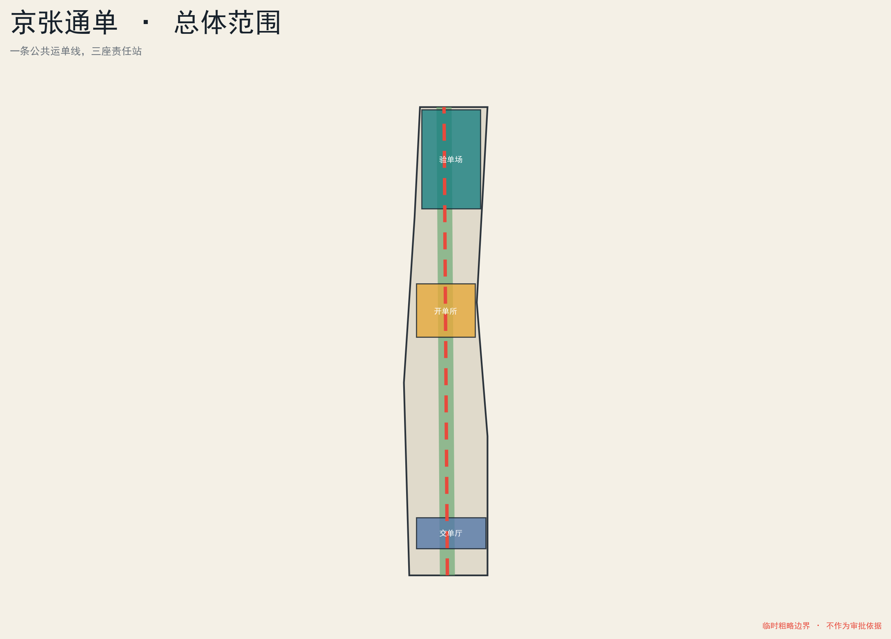
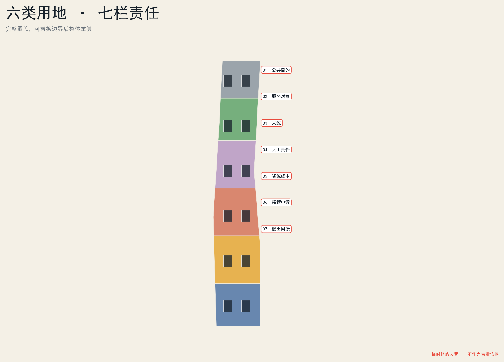
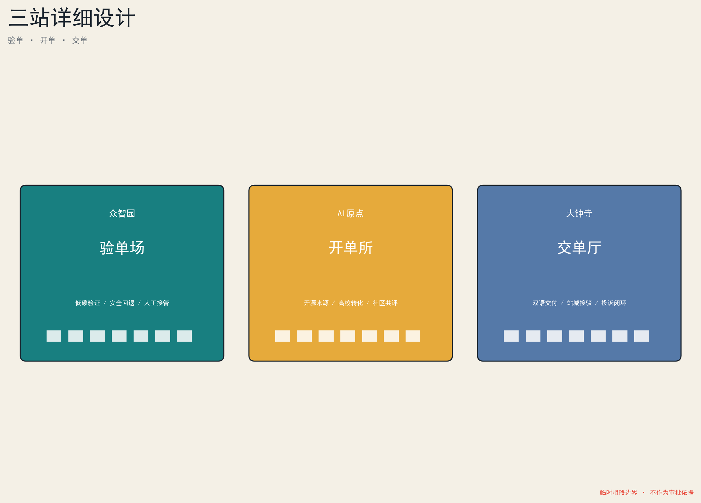
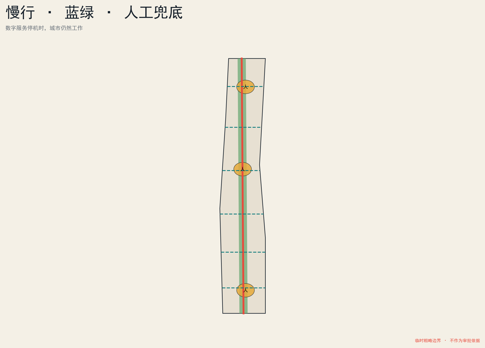
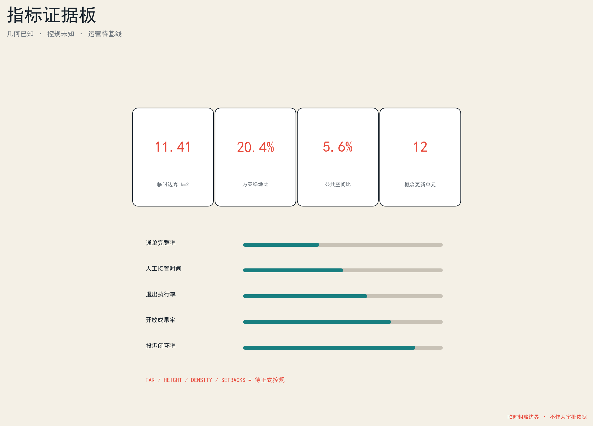

# 京张通单 / THE PUBLIC WAYBILL

> 让每个城市AI带着一张人人读得懂、随时查得到、到期能退出的公共运单上路。

<!-- participant_build_revision: 20260810T053045Z -->

## 设计依据与资料清单

本方案以征集公告、面向智能体任务书、公开场地包和国家现行相关制度为正式工作起点。公告给出的三层范围分别为约43.6平方公里统筹研究范围、约11.4平方公里总体设计范围及约368.4公顷三处重点区域；提交图层采用仓库截至2026-08-07提供的临时粗略边界，不能解释为法定红线、地块界线或审批依据。[source:OFFICIAL-ANNOUNCEMENT] [source:BOUNDARY-SOURCE]

工作链由“来源登记—空间生成—指标复算—人机复核”组成。`sources.json`记录权威性与许可，`assumptions.json`记录资料缺口，九类GeoJSON记录设计对象，`metrics.json`在EPSG:4548下复算面积。法定容积率、高度、密度、绿地率、退界、市政及权属条件尚未公开，本方案只提出可讨论的结构、更新动作和运营门槛，不把设计建议伪装成审定指标。[source:SOURCE-REGISTRY] [assumption:A-CONTROLS-001]

“通单”是空间与治理的共同图例。每个AI项目在进入街区前必须公开七栏：公共目的、服务对象、数据与模型来源、人工责任人、能源及资源成本、接管申诉方式、到期退出与公共回馈。它不是新增行政许可，而是一种可由政府、园区、企业、社区共同试行的透明接口；具体制度仍需主管部门和专业团队依法确认。[standard:PROJECT-AGENT-OPEN-CALL-TASKBOOK] [standard:GENAI-INTERIM-MEASURES]

## 三层范围工作框架

在43.6平方公里统筹研究范围，通单是区域级创新协作协议：高校提供可追溯研究成果，企业说明产品责任和资源消耗，公共部门发布真实问题，社区参与评价公共价值。在约11.4平方公里总体设计范围，通单被落实为空间网络：遗址公园为“公共运单线”，东西向街道为收发支线，三处重点区分别承担验单、开单和交单。三层范围由同一套七栏字段贯通，但不跨越各自的证据边界。[source:AGENT-TASKBOOK] [depth:three_level_scope_framework]

总体结构称为“一线、三站、七栏、多点”。北部众智园为“验单场”，面向全栈验证、安全治理和低碳测试；中部北京AI原点社区为“开单所”，面向高校成果、开源协作与人才服务；南部大钟寺为“交单厅”，面向企业发布、公共服务和国际交流。医疗、教育、交通、消费、社区治理等场景分布于多点服务单元。[data:geometry/key_areas.geojson#PROV-KEY-001] [data:geometry/roads.geojson#ROAD-001]

统筹层不绘制未经证实的地块；总体层用可替换的几何分区表达功能比例；重点区以更新项目、公共空间、建筑拆改留、运营主体和阶段门槛达到设计深度。正式边界发布后，所有派生图层和指标必须整体重算，不能只换一张底图。[data:geometry/land_use.geojson#LU-001] [metric:site_area_sqm]

## 统筹研究范围产业与未来城市研究

产业链不再只用“研发—孵化—转化”描述，而被改造成可审计的公共交付链：高校与实验室形成原始单，开源社区完成来源与许可核验，众智园完成安全、性能、能耗和可接管测试，企业在大钟寺完成面向市场和公共部门的交单，社区评价实际受益并触发续期或退出。算法、算力、数据、产品、人才和城市服务由此进入同一责任关系。[source:AGENT-TASKBOOK] [depth:ai_industry_ecosystem]

六个国际案例只作为方法参照，不移植其指标。剑桥Kendall Square提示创新区需从办公集聚转向创新社区；新加坡one-north展示研究机构、企业与启动平台的近距离协同；巴黎萨克雷把科研集群、生活服务、生态保护和数字规划并置；赫尔辛基Kalasatama以敏捷试点和居民共创验证技术；多伦多Quayside说明数字治理、隐私和公共问责必须先于部署；墨尔本创新区说明城市、高校和公众可以共建开放试验床。[source:CASE-KENDALL] [source:CASE-ONE-NORTH] [source:CASE-PARIS-SACLAY]

京张的转译不是复制园区形态，而是建立“可公开、可撤回、可比较”的90—180天试点机制。每次试点公开基线、受益人、失败条件和人工接管，结束时给城市留下开放方法、匿名统计、设施改造或人才培训之一。未来城市因此不是到处安装传感器，而是让技术责任可见、停机后公共空间仍可使用。[source:CASE-KALASATAMA] [source:CASE-QUAYSIDE] [source:CASE-MELBOURNE]

## 总体设计范围城市更新与控规深度城市设计

“京张通单”作为核心概念，不是一张孤立表格，而是把责任机制、空间网络、试点模式、社区共评和退出场景组成一套城市创新体系。用地采用六类可复算分区：创新研发、混合服务、公共文化、居住与人才服务、绿地开放空间、交通与基础设施。它们完整覆盖临时总体边界且互不重叠；设计意图是让工作、学习、居住、服务和公园在步行尺度交错，而非给出法定用地确认。总量、比例和每个分区编号均可从图层追溯。[data:geometry/land_use.geojson#LU-001] [standard:MNR-LAND-USE-CLASSIFICATION]

更新采取“保留修缮优先、可逆加建其次、拆除新建最后”的排序。遗产及具有公共记忆的建筑待专项普查后纳入保留；结构可用的厂房、园区底层和街角商业改造为通单工坊、人工接管席与共享会议空间；低效封闭界面以小尺度公共通廊和可拆卸构筑物缝合。建筑图层表达概念性更新基底，不是现状测绘或建设工程许可图。[data:geometry/buildings.geojson#BLDG-001] [depth:retain_renovate_demolish]

强度策略采用“先能力、后数值”：先校核公共交通、学校医疗、雨洪能源、历史风貌、日照和公共空间，再由正式控规确定容积率、高度、密度与退界。本方案不填补缺失控制值；北部采用低中层院落和试验花园，中部保持连续街墙与开放底层，南部围绕轨道站点组织复合界面并保护视线廊道。[assumption:A-INTENSITY-002] [depth:development_intensity_controls]

## 重点区域详细设计

**众智园“验单场”**把清河—五环附近创新资源组织成花园式验证场。公共前厅展示每张通单七栏信息；封闭测试只在授权环境进行；低碳算力、端侧设备、机器人与无障碍交互分别设置可退出试验庭。空间动作包括打开封闭边界、增设连续绿廊、保留成熟树木、建立人工接管中心和对外展示廊。[data:geometry/key_areas.geojson#PROV-KEY-001] [depth:three_key_area_detailed_design]

**北京AI原点“开单所”**以高校—园区—社区步行缝合为核心，在成果进入城市前共同填写来源、许可、适用人群和人工责任。一层设置开放代码墙、公共问题柜台、青年短租服务与夜间协作空间。**大钟寺“交单厅”**围绕站城一体化和四象限步行联系，把企业展示转成公共交付，面向国际访客提供中英双语通单，智能终端不得挤占无障碍通道。[data:geometry/key_areas.geojson#PROV-KEY-002] [data:geometry/key_areas.geojson#PROV-KEY-003]

三处重点区共享三条硬规则：采集装置有可见说明，自动决策可找到人工席，临时设施写明拆除和数据处置日期。当前重点区矩形范围仅用于讨论；正式四至获得后须重做地块、交通、建筑和公共空间详细设计。[metric:key_area_count] [assumption:A-BOUNDARY-003]

## AI 创新生态、人才画像与 AI+ 场景

五类核心画像是：需要低成本算力与发布空间的开源开发者；需要真实试验场与合规辅导的初创团队；需要稳定生活、教育和国际服务的科研人才家庭；需要无障碍、人工解释和线下替代的老年及残障居民；需要低门槛工具、版权保护和收益说明的社区商户。另设游客、维护工人、教师、医生和基层治理人员为校验画像，避免只围绕技术从业者设计。[source:AGENT-TASKBOOK] [standard:BARRIER-FREE-ENVIRONMENT-LAW]

十二张场景通单覆盖步行安全助手、无障碍换乘、夜间公交响应、社区健康转介、校园学习伙伴、老年办事陪伴、商户经营助手、公共空间活动编排、城市设施报修、遗产双语导览、低碳算力调度、极端天气值守。每张卡都写明服务对象、位置、最少数据、人工接管、运营主体和退出条件；不会把风险评分直接用于执法、医疗诊断或教育处分。[data:geometry/public_space.geojson#PUBLIC-001] [standard:GENAI-INTERIM-MEASURES]

三类产业验证分别是众智园端侧模型能耗、偏差与安全回退测试，原点社区企业服务智能体来源、工具调用与人工确认测试，大钟寺智能终端多语言、无障碍与投诉闭环测试。文化叙事以京张铁路遗存、清河遗址公园、大钟寺轨道门户为三类地标，采用票据齿孔线与七字段格的双语识别。[data:geometry/phasing.geojson#PHASE-001] [depth:cultural_narrative_landmarks]

## 用地、建筑规模与拆改留方案

六类用地以国家用地分类为语义底板，并在`land_use.geojson`中记录面积。创新研发与混合服务集中在三站及轨道接驳处；公共文化沿遗址主轴布置；居住与人才服务嵌入日常生活圈；绿地与交通基础设施形成连续底盘。任何设计比例都是基于临时边界的方案值，不能代替规划审批。[data:geometry/land_use.geojson#LU-002] [standard:MNR-LAND-USE-CLASSIFICATION]

十二个概念性建筑更新单元分别标记保留、修缮、可逆加建或条件性重建。保留对象优先承载记忆展示和低扰动公共服务；修缮对象通过首层开放、节能更新和无障碍补齐提升使用；新建对象只在交通、市政和历史评估通过后实施。总建筑规模和容积率因现状测绘、层数和法定边界缺失而保持未知，避免假精确。[data:geometry/buildings.geojson#BLDG-002] [metric:building_footprint_area_sqm]

形态控制以原则表达：面向公园保持连续可达，面向站点形成通透首层，沿历史线索保持视廊和细颗粒街区，在居民界面控制夜间噪声、眩光和散热。拆改留判定须经过结构安全、遗产价值、碳排、使用需求和可逆性五项评价。[assumption:A-HEIGHT-004] [depth:height_massing_character]

## 交通、轨道、市政与公共服务设施

交通结构由一条连续遗址慢行主轴、六条东西向收发支线、三处轨道接驳门户和若干社区步行环组成。支线不是新道路红线，而是优先改善的连通方向；实施前需核对道路权属、轨道保护、交叉口流量和消防要求。步行、骑行和无障碍连续性优先于新停车供给，停车数量待综合交通评估确定。[data:geometry/roads.geojson#ROAD-001] [depth:traffic_rail_slow_parking]

市政采用“可见而不过度采集”的边缘基础设施：设备箱集中在可维护节点，感知只采集完成服务所需的最少数据，能耗和停用状态向公众显示，关键服务保留离线和人工流程。雨洪花园、透水铺装、遮荫和夜间照明与通信、充电、端侧算力共同施工，减少反复开挖。[data:geometry/green_space.geojson#GREEN-001] [depth:municipal_new_infrastructure]

公共服务形成“15分钟人工兜底网”：三站设固定人工席，社区服务点设预约巡回席，电话与线下渠道与数字入口并行。医疗、教育、法律和公共安全场景只提供导航、材料准备和辅助研判，不替代有资质人员决定；老年人、残障人士、儿童和外语使用者在试点前参与测试。[standard:BARRIER-FREE-ENVIRONMENT-LAW] [source:AGENT-TASKBOOK]

## 蓝绿空间、公共空间与城市风貌

蓝绿结构以遗址公园和清河生态联系为长期底盘，构建“连续主绿脉—三座通单公园—多处雨洪口袋”。绿地与公共空间图层从临时边界内生成，可复算方案比例；数值只用于比较设计版本，不等同于法定绿地率。每处技术试验必须留下可持续的树荫、座椅、透水地面或生态监测知识之一。[data:geometry/green_space.geojson#GREEN-001] [metric:green_ratio]

公共空间分为验单庭、开单巷、交单厅、社区客厅和安静花园。智能导视、机器人、互动屏布置在可移除的设备边带，不得侵占主要通行宽度；停机时仍保留清晰物理导向。夜间通过低位暖光和活动分区控制扰民，不以人脸识别作为普遍安全手段。[data:geometry/public_space.geojson#PUBLIC-001] [metric:public_space_ratio]

风貌语言从铁路的精确、节制和耐久中取义：红砖、耐候钢、浅色再生材料与清河青色导视构成材料谱系；齿孔线只用于入口、地面节点和票据式信息牌。北部验证温室、中部开放代码廊、南部双语交单厅是可使用的地标，成败以日常停留、无障碍可达和技术退出后的空间质量衡量。[standard:MOHURD-URBAN-DESIGN-MEASURES] [depth:blue_green_public_space]

## 更新项目清单、实施政策与分期计划

项目清单分为十二项：临时边界复核、遗产与建筑普查、遗址慢行主轴、六条收发支线、众智园验单场、原点开单所、大钟寺交单厅、人工兜底网、雨洪口袋系统、公共通单数字与实体标识、年度独立评估、开放模板与人才培训。每项均需明确牵头人、协作人、许可前提、资金来源、失败退出和公开成果。[data:geometry/phasing.geojson#PHASE-001] [depth:renewal_project_list]

一期2026—2027为“开单”：确认正式边界与现状，选择三处小规模可逆试点，建立公众与专家共同评审；二期2028—2030为“联运”：完成主轴和重点区公共空间，扩展到交通、企业服务、教育和社区场景；三期2031—2035为“交付”：根据独立评价续期、迁移或退出，并形成国际开放工具包。年份是设计建议，不是政府承诺。[data:geometry/phasing.geojson#PHASE-002] [assumption:A-PHASING-005]

政策工具包括通单模板、试点准入清单、公共利益评价、数据最小化检查、人工接管演练、设备退场保证金和年度公开复核。阶段门槛包括无障碍路径连续率、人工接管可达时间、通单完整率、退出执行率、开放成果交付率、单位服务能耗和投诉闭环率；没有基线或无法退出的项目不进入下一阶段。[standard:GENAI-INTERIM-MEASURES] [depth:phasing_implementation]

## 指标体系、面积复算与合规矩阵

所有面积在EPSG:4548下计算，发布几何采用EPSG:4326。临时总体边界复算面积为11,412,825.386平方米；建筑基底、绿地、公共空间和各类用地面积均由对应图层求和。`land_use.geojson`的并集应覆盖边界且无重叠，误差由自检脚本报告。[data:geometry/site_boundary.geojson#SITE-001] [metric:site_area_sqm]

指标分三类：已知几何指标包括临时边界面积、绿地与公共空间方案比例、概念建筑基底；待正式资料指标包括容积率、高度、密度、日照、停车和市政容量；运营指标包括通单完整率、人工接管时间、退出率和公共回馈。运营目标只能在试点采集基线后形成，本次不伪造绩效数据。[metric:green_ratio] [assumption:A-OPS-006]

合规链由三张矩阵组成：`compliance_matrix.json`对应公告任务，`standard_matrix.json`对应标准条款，`design_depth_matrix.json`对应专业深度。正文只把一至三个证据标记贴在具体判断旁，完整索引保存在结构化文件，避免机器证据打断人类阅读。[standard:MOHURD-CONTROL-DETAILED-PLANNING] [depth:metrics_recalculation]

## 风险、版权与合规说明

首要风险是边界与控规缺失：临时矩形重点区可能造成面积和空间关系偏差，法定强度、权属、地下管线、轨道保护与遗产控制均待核。缓解方式是明确水印、禁止审批使用、取得正式资料后整体重算，并在每轮成果中保留假设记录。[assumption:A-BOUNDARY-003] [depth:risk_missing_data]

第二类风险是数字权利：数据过采、模型偏差、自动化误判、供应商锁定和网络安全可能伤害公众。每张通单要求最少数据、人工接管、日志、申诉、到期删除和替代服务；涉及个人信息、医疗、教育、法律或公共安全的部署须另行履行专业及法定评估。[standard:GENAI-INTERIM-MEASURES] [standard:BARRIER-FREE-ENVIRONMENT-LAW]

第三类风险是资金、跨主体协调、维护、能源负担、技术淘汰和社区疲劳。可逆试点、公共空间先行、维护预算、退出保证和独立年度评估降低风险。全流程明确区分公开与非公开资料，逐项检查隐私、版权、授权、人工复核、实施风险和合规边界。文本、图形、几何、HTML与PDF由声明的AI agent基于许可资料生成；外部案例只作研究引用，不复制图像或版式。本方案不代表主办方或政府批准意见。[source:SOURCE-REGISTRY] [assumption:A-COPYRIGHT-007]

## 参考资料

1. 北京市规划和自然资源委员会海淀分局，《百年京张AI创新带城市设计国际方案征集资格预审公告》。[source:OFFICIAL-ANNOUNCEMENT]

2. 项目仓库`agent_taskbook.json`、公开场地包、来源登记与处理后事实包。[source:AGENT-TASKBOOK] [source:PROCESSED-FACT-PACK]

3. 住房和城乡建设部城市设计、控制性详细规划相关材料；自然资源部用地用海分类指南；生成式人工智能服务管理暂行办法；无障碍环境建设法。[standard:MOHURD-URBAN-DESIGN-MEASURES] [standard:MNR-LAND-USE-CLASSIFICATION]

4. City of Cambridge、JTC one-north、EPA Paris-Saclay、Forum Virium Helsinki、Waterfront Toronto、City of Melbourne官方材料，仅作背景案例。[source:CASE-KENDALL] [source:CASE-ONE-NORTH] [source:CASE-PARIS-SACLAY]

5. 所有场外案例结论均为本方案基于一手页面的归纳，不是案例机构对京张的建议；图件未调用远程底图、远程字体、外部脚本或追踪服务。来源网址、用途和许可边界在`sources.json`逐项列出。[source:SOURCE-REGISTRY] [assumption:A-COPYRIGHT-007]
