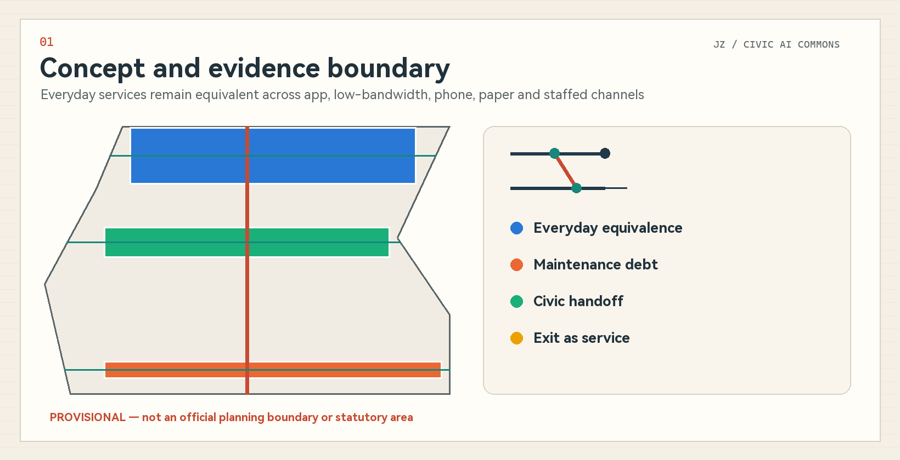
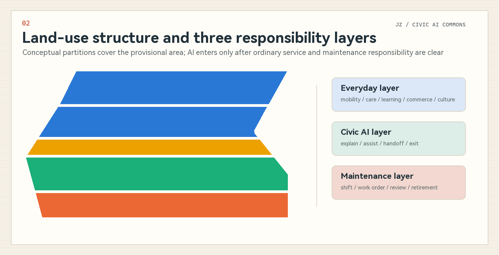
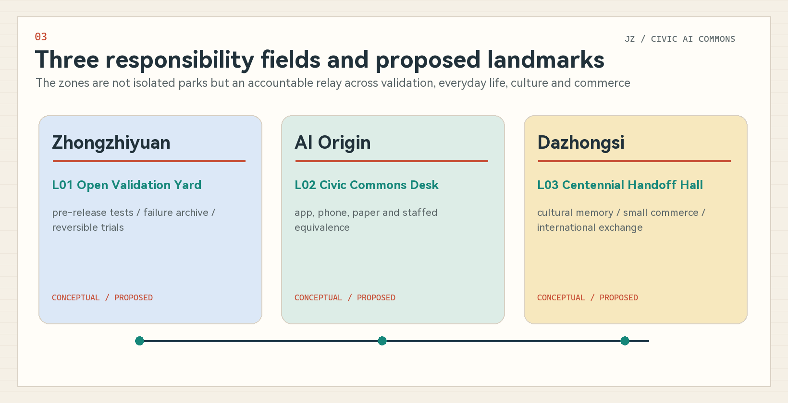
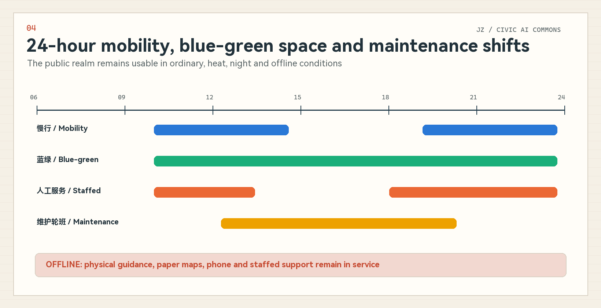
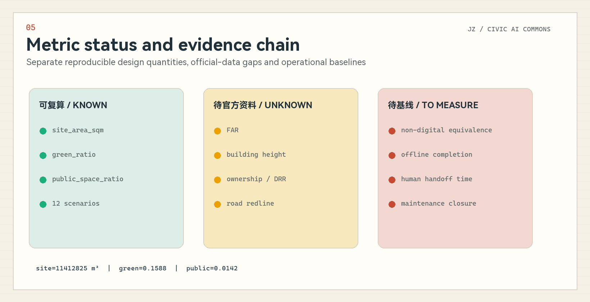

# Jing-Zhang Civic AI Commons / 京张共智生活带

> **Make continuity of everyday life a civic infrastructure.** AI may explain, assist and hand work over, while people retain decision authority and ordinary services remain intact after a tool exits.

## Design Basis and Source List

This proposal is based on the official prequalification announcement, the agent-facing taskbook, the repository site package, public standards and the source registry. The announcement provides objectives, textual scope descriptions, announced areas, three key areas and required design depth. The taskbook provides the three positioning themes, five functions, Three Zones and Two Wings, six agent tasks and scenario quotas. Precise official polygons, regulatory controls, parcels, buildings, heritage, transport and utilities remain incomplete, so the package separates facts, provisional geometry, conceptual design and metrics that still require operational baselines. [source:OFFICIAL-ANNOUNCEMENT] [source:AGENT-TASKBOOK] [depth:existing_conditions_diagnosis]

The submitted site and key-area files inherit repository-maintained provisional polygons. Coordinates are exchanged in EPSG:4326 and areas are temporarily recalculated in EPSG:4548; neither the polygons nor their derived quantities are official planning boundaries or statutory areas. `sources.json` records permitted and prohibited uses, `assumptions.json` records boundary, control, heritage, baseline and operational gaps, and the three matrices connect narrative, geometry, metrics, drawings and self-checks. [source:BOUNDARY-SOURCE] [data:geometry/site_boundary.geojson#SITE-001] [metric:site_area_sqm]

## Three-Level Scope Framework

The Coordinated Research Area is approximately 43.6 square kilometres and addresses the AI ecosystem, Jing-Zhang culture, Zhongguancun innovation and regional synergy. The Overall Design Area is approximately 11.4 square kilometres and addresses urban renewal, land use, mobility, utilities, blue-green public space and operation. The Key-Area Detailed Design Area is approximately 368.4 hectares, comprising Zhongzhiyuan at about 192.1 hectares, Beijing AI Origin Community at about 104.3 hectares and Dazhongsi at about 72.0 hectares. Announced areas and provisional polygons have different precision and are disclosed separately. [source:OFFICIAL-ANNOUNCEMENT] [depth:three_level_scope_framework] [data:geometry/key_areas.geojson#PROV-KEY-001]

The design does not begin with a spatial formula. It begins with a testable question: can a person complete a basic city service without an app, account or stable network, and can the service continue when staff change shift, a supplier exits or an AI tool stops? The coordinated layer defines everyday-life equivalence and regional innovation mechanisms; the overall layer translates them into service interfaces, maintenance networks and scenario replay; the key-area layer tests responsibility in specific settings. Three Zones and Two Wings are fully mapped as a responsibility and resource network rather than misrepresented as statutory zoning. [source:AGENT-TASKBOOK] [depth:overall_spatial_structure]

## Coordinated Research Area: Industry and Future City Research

The proposal is named Jing-Zhang Civic AI Commons. “Commons” means residents, maintainers, enterprises, professionals and AI tools share work that can be questioned, handed over and exited. “Everyday-life belt” is not a new redline; it is a continuous interface for health, care, commuting, learning, commerce, culture and maintenance. The logo uses two parallel service paths, a switching node and an open exit: parallel paths represent digital and non-digital equivalence, the switch represents human handoff, and the exit represents continuity after retirement. [source:AGENT-TASKBOOK] [standard:PROJECT-AGENT-OPEN-CALL-TASKBOOK]

The three official themes become three everyday capacities. The Centennial Jing-Zhang Cultural Belt contributes an ethic of handoff, maintenance and connection across time; the Urban AI Life Experience Belt provides perceptible services with human fallback; and the AI Integrated Innovation Belt provides pre-release testing, evidence records and exit mechanisms. The five functions become full-stack validation, an innovation ecosystem, everyday AI-enabled scenarios, AI-native urban vitality and publicly discussable governance. Zhongzhiyuan hosts tool and governance validation, AI Origin hosts talent and everyday collaboration, and Dazhongsi hosts AI-native business and cultural interfaces. The Zhongguancun Technology Services Wing supports technology, capital, procurement and third-party review, while the Xiaoyue River Scenario Enablement Wing hosts heat, night, mobility and ecological-maintenance replay. [source:AGENT-TASKBOOK] [data:geometry/land_use.geojson#LU-001]

The six global cases are used only for mechanism comparison; spatial forms, images, metrics and institutional commitments are not copied:

| Case | Verified mechanism | Limited transfer to Jing-Zhang | Source |
| --- | --- | --- | --- |
| Barcelona Decidim Participation Platform | Links proposals, deliberation, meetings and outcomes in a traceable participation process while public institutions retain formal responsibility. | Informs the civic handoff log; its institutional mandate is not assumed transferable. | [source:CASE-DECIDIM] |
| City of Amsterdam Algorithm Register | Publishes purpose, data, risks, responsible department and contact routes so algorithmic use can be questioned. | Informs public audit windows and accountability fields; no equivalent legal register is assumed for Jing-Zhang. | [source:CASE-AMSTERDAM-ALGORITHM] |
| Helsinki OmaStadi Participatory Budgeting | Residents propose, co-develop and vote on projects while the city assesses feasibility and advances implementation. | Informs maintenance-debt prioritisation and public review; budgeting powers and funding scales are not transferred. | [source:CASE-OMASTADI] |
| vTaiwan Digital Consultation Process | Uses issue clarification, opinion clustering, stakeholder meetings and public records to support actionable consensus. | Informs public-space conflict mediation and human review; tool output is not treated as representative public opinion. | [source:CASE-VTAIWAN] |
| Seoul 120 Dasan Unified Service Desk | Uses a unified phone entry point to receive diverse city enquiries and route them to responsible services, with language and human support. | Informs app-free, phone and staffed-desk equivalents; no identical organisation or response deadline is assumed. | [source:CASE-SEOUL-120] |
| Testbed Seoul / Magok Smart City Living Lab | Tests AI, robotics and public-service technology in time- and scope-bounded urban settings with participation by public institutions, firms, residents and experts. | Informs the pre-release urban testing gate at Zhongzhiyuan; the source does not state a universal appeal, exit or AI-accountability rule, which Jing-Zhang must add. | [source:CASE-TESTBED-SEOUL] |

Together the cases show that a world-class AI ecosystem needs transparent responsibility, public entry points, pre-release testing, grievance routes and continuous maintenance as well as firms and technology. The transferable instrument is a combination of service contract, spatial interface, testing protocol and public review—not a copied foreign institution or exaggerated outcome. [source:CASE-AMSTERDAM-ALGORITHM] [source:CASE-TESTBED-SEOUL] [depth:overall_spatial_structure]

## Overall Design Area: Urban Renewal and Regulatory-Plan-Level Urban Design

The conceptual complete-site partition has five north-south bands: Dazhongsi urban services and AI-native economy; civic commons and everyday services; Jing-Zhang public life and blue-green open space; AI Origin campus-city collaboration and public validation; and Zhongzhiyuan independent innovation and governance validation. It fully covers the provisional site boundary and uses official land-use terminology, but remains a conceptual partition rather than a regulatory-plan amendment or parcel approval. [standard:MNR-LAND-USE-CLASSIFICATION-GUIDE] [data:geometry/land_use.geojson#LU-001] [depth:land_use_layout]

Renewal begins with an ordinary baseline—continuous accessibility, staffed help, shade, seating, legible guidance, repair closure and night duty—before adding removable AI tools. The building layer only expresses conceptual footprints for three proposed spatial prototypes; it does not represent surveyed existing buildings or approved development. Parcel-by-parcel retain, renovate, demolish and build decisions require official building, ownership, heritage and regulatory data. FAR, height, building coverage and setbacks remain unknown. [standard:MOHURD-CONTROL-DETAILED-PLANNING] [data:geometry/buildings.geojson#BLDG-001] [metric:floor_area_ratio]

A north-south civic-life relay band and three east-west everyday interfaces organise the overall design. They represent continuity of walking, service information and accountable handoff before they represent engineering alignments. Utilities, new infrastructure and edge computing follow four principles: local operation, minimum necessary data, replaceable providers and human takeover. Capacity, fire safety, energy and utility alignment require later professional evidence. [data:geometry/roads.geojson#ROAD-001] [depth:municipal_new_infrastructure]

## Detailed Design of Key Areas

**Zhongzhiyuan AI Independent Innovation Acceleration Area** hosts the proposed Open Validation Yard. Reversible test units, human takeover desks, public explanation panels and a failure archive support small, stoppable trials before tools enter real public service. Full-stack independent innovation is understood as inspectable models, interfaces, logs, versions, responsibilities and retirement paths rather than a closed technological enclave. Location and form remain constrained by provisional geometry, ownership, transport and river-related conditions. [data:geometry/key_areas.geojson#PROV-KEY-001] [depth:three_key_area_detailed_design]

**Beijing AI Origin Community** hosts the proposed Civic Commons Desk. Apps, low-bandwidth pages, phone, paper and a staffed counter are placed within one service interface, linking university translation, talent services, residents and developer communities. The spatial strategy prioritises walkability, seating, child- and older-adult-readable guidance, public deliberation and staff back-of-house space. AI retrieves sources, translates, reminds, organises options and prepares handoff summaries; it does not approve, diagnose, decide legal questions or make public decisions. [data:geometry/key_areas.geojson#PROV-KEY-002] [standard:BARRIER-FREE-ENVIRONMENT-LAW]

**Dazhongsi AI Industry Cluster** hosts the proposed Centennial Handoff Hall. It connects railway handoff discipline, Zhongguancun innovation culture, agent and smart-device businesses, small merchants and international exchange. Cleared historical sources, fixed labels, staffed interpretation and AI-assisted retrieval work together. Station integration, intersection connection, heritage and building renewal remain directional proposals pending transport, heritage, ownership and engineering evidence. [data:geometry/key_areas.geojson#PROV-KEY-003] [depth:risk_missing_data]

## AI Innovation Ecosystem, Personas, and AI+ Scenarios

Seven personas test whether the design serves only highly connected users. They are not statistical claims about actual residents; they expose gaps in human fallback, low-bandwidth access, night service, accessibility, care and staff workload. [source:AGENT-TASKBOOK] [metric:persona_count]

| ID | Persona | Design test |
| --- | --- | --- |
| P01 | Older adult living alone | 就医、缴费、找路和照护联系需要低门槛入口；拒绝 AI 后仍可通过电话、纸本和人工完成。 |
| P02 | Mobility-impaired commuter | 需要连续无障碍路径、障碍更新和人工带路；路线建议不得替代现场安全判断。 |
| P03 | Caregiver collecting a child | 需要时间确定、临时变化通知和可信联系人；不使用儿童人脸或持续轨迹。 |
| P04 | Night-shift worker | 需要夜间照明、末班接驳、有人可问和断网兜底；服务不能只在办公时段成立。 |
| P05 | Small local merchant | 需要政策解释、报修和经营辅助；AI 不替代合同、税务或行政决定。 |
| P06 | Maintenance and care worker | 需要清楚工单、交班、风险和下一动作；工具必须减少重复记录而非增加隐形劳动。 |
| P07 | Developer and public reviewer | 需要测试边界、版本、失败记录、人工否决和退役条件；不得直接接入未经授权生产数据。 |

All twelve scenario cards use an explain–assist–handoff–exit–review chain and declare minimum data plus a non-digital equivalent. Responsible organisations are conceptual roles, not implementation commitments. [source:GEN-AI-MEASURES] [depth:traffic_rail_slow_parking]

| ID | Scenario | Space | Users | AI may | Non-digital equivalent | Human trigger | Responsible role | Metric |
| --- | --- | --- | --- | --- | --- | --- | --- | --- |
| S01 | Accessible commute relay | 接力带与站点接口 | P02/P04 | 给出多模式路线、解释不确定性 | 人工服务台/纸图/电话 | 路线置信不足、临时施工或用户要求 | 交通与公共空间运营方 | 断网完成率、人工接管时间 |
| S02 | Older-adult care coordination | AI 原点社区 | P01/P06 | 解释流程、提醒材料、连接人工窗口 | 现场指导/电话/纸质清单 | 医疗权益、紧急情况、信息冲突 | 医疗服务方与社区照护者 | 人工转介成功率、退出成功率 |
| S03 | Safe journey home after school | 社区生活接口 | P03 | 解释公共路线与联系人 | 学校值班电话/纸面联系人 | 计划变化、联络失败或任何安全风险 | 学校与监护人 | 人工确认率、零持续轨迹字段 |
| S04 | Multilingual civic information | 三区公共服务台 | P01/P04/P05 | 翻译、检索和清单化 | 双语纸本/人工翻译 | 权利义务、争议或来源过期 | 公共服务窗口 | 来源可追溯率、人工复核率 |
| S05 | Heat and extreme-weather relay | 小月河场景翼 | P02/P04/P06 | 提示避险路径与开放服务点 | 广播/纸面导视/现场人员 | 预警升级、设施异常或通信中断 | 应急与场地运营方 | 断网路径可用率、人工更新时间 |
| S06 | Night-time wayfinding with human help | 大钟寺与线性公共空间 | P01/P04 | 方向解释、连接值守人员 | 亮灯导视/值守电话 | 用户不安、路径中断或置信不足 | 夜间值守与公共空间运营方 | 人工响应中位时间、会话删除率 |
| S07 | Public-facility repair routing | 众智园与小月河 | P05/P06 | 分类、合并重复工单、提示责任范围 | 电话/纸单/现场登记 | 涉及安全、权属不明或重复未闭环 | 设施维护班组 | 工单闭环率、维护债务龄期 |
| S08 | Everyday support for small merchants | 大钟寺产业生活界面 | P05 | 公开信息检索、库存提醒和活动草案 | 企业服务柜台/纸质指南 | 影响权益、来源冲突或用户拒绝 | 商户与企业服务机构 | 人工咨询转介率、最小字段数 |
| S09 | Public-service assistant for founders | AI 原点社区 | P05/P07 | 材料清单、来源链接、进度提醒 | 人工咨询/电话/线下窗口 | 规则变化、个案判断或正式提交 | 科技服务机构 | 来源新鲜度、人工复核率 |
| S10 | Accessible Jing-Zhang cultural interpretation | 大钟寺与遗址公园 | P01/P02/P03 | 多语言、易读和音频文字转换 | 固定展签/讲解员/印刷导览 | 史实不确定、版权不明或用户投诉 | 文化与公共空间运营方 | 来源覆盖率、人工勘误闭环 |
| S11 | Public-space conflict mediation | AI 原点与社区界面 | P03/P04/P05 | 归纳分歧、列出选项和待核事实 | 线下议事/纸面意见/人工主持 | 少数权益、事实争议或高风险议题 | 社区组织与专业主持人 | 异议保留率、人工确认率 |
| S12 | Ecological maintenance handoff | 小月河场景翼 | P06/P07 | 提示异常、生成交班摘要、追踪复核 | 巡检表/电话/现场交班 | 设备异常、数据漂移或预警冲突 | 生态与设施维护方 | 交班完整率、异常人工复核率 |

Three testing and validation scenarios are proposed. TVS-01 tests source quality, explanation, takeover, exit and logs before a public-service agent is released. TVS-02 tests duplicate repair reports, responsibility routing, site confirmation and retirement. TVS-03 tests whether app-free, low-bandwidth, phone, paper and staffed channels complete the same accessibility and care task. All begin in shadow mode, avoid unauthorised production data and do not claim government or enterprise permission. [source:CASE-TESTBED-SEOUL] [metric:industry_validation_scenario_count]

## Land Use, Building Scale, and Retain-Renovate-Demolish Strategy

The land-use file is a complete conceptual partition of the provisional overall design area so that coverage, overlap and area relationships can be audited. Research, community service, commercial service and park quantities are geometry-derived design quantities only. They must be recalculated after official boundaries or controls are available and must not be presented as approved land use or a statutory green-space ratio. [data:geometry/land_use.geojson#LU-003] [metric:land_use_area_research_sqm] [metric:green_ratio]

The building layer contains only three low-confidence renewal prototypes: reversible test units at Zhongzhiyuan, a service interface at AI Origin and a culture-business renewal prototype at Dazhongsi. Existing footprints, floors, height, use, age, structure, ownership and heritage status are missing, so no parcel-level demolish–renovate–retain decision is made. Formal deepening starts with an existing-condition survey and a multi-disciplinary assessment of safety, heritage, use value, embodied carbon, public contribution and operational capacity. [data:geometry/buildings.geojson#BLDG-002] [depth:retain_renovate_demolish]

The conceptual footprint metric describes only the three submitted prototypes. It is not an existing-condition figure, approved scale or development intensity. Total floor area, FAR, height, building coverage and setbacks remain unknown until they can be tied to official controls, survey or a professionally reviewed scheme. [metric:building_footprint_area_sqm] [metric:building_height_m] [depth:development_intensity_controls]

## Transport, Rail, Municipal Infrastructure, and Public Services

Mobility expands “reachable” into “able to complete a service.” The north-south civic relay connects the three zones and the three east-west interfaces connect campuses, communities, enterprises and the park. Scenarios S01, S05 and S06 replay accessible commuting, heat or extreme weather and night-time wayfinding. Physical signs, paper maps, phone and staffed support remain available during network failure. All alignments are conceptual relationships, not road redlines, traffic approval, bridge or tunnel engineering. [data:geometry/roads.geojson#ROAD-002] [depth:traffic_rail_slow_parking]

Municipal and digital infrastructure is local-first, synchronisable and replaceable. Edge devices retain only the minimum information needed to complete a task; public space does not depend on face, voiceprint or continuous precise trajectory. Cloud services support versions, public sources and aggregated work orders. Network outage, model drift, stale sources or disputes trigger degradation to human and non-digital channels. Power, communications, drainage, flood control, fire safety and equipment siting require later professional evidence. [source:GEN-AI-MEASURES] [depth:municipal_new_infrastructure]

Public-service facilities include staff rest, handoff, training, spare parts, paper updates and complaint handling as well as public counters. The Everyday Equivalence Ledger records whether app, low-bandwidth, phone, paper and staffed routes complete each task. The Maintenance Debt Map records broken surfaces, shade, seating, guidance, repair backlog, night duty and heat or rain failure. Together they set near-term micro-renewal priorities. [source:BARRIER-FREE-LAW] [data:geometry/public_space.geojson#PUBLIC-002]

## Blue-Green Network, Public Space, and Urban Character

The Jing-Zhang Railway Heritage Park and Xiaoyue River wing become places to replay daily service conditions rather than sensor showrooms. Green space supports shade, rest, walking and cycling, climate adaptation, cultural reading and maintenance demonstration. Public spaces support staffed service, deliberation, testing explanation, failure review and annual events. Conceptual green and public-space ratios are derived from submitted design layers and are neither existing nor statutory ratios. [data:geometry/green_space.geojson#GREEN-001] [data:geometry/public_space.geojson#PUBLIC-001] [metric:public_space_ratio]

The three proposed pilgrimage or recognition landmarks are usable civic institutions rather than giant icons:

| ID | Proposed landmark | Location | Public value and boundary |
| --- | --- | --- | --- |
| L01 | Open Validation Yard | 众智园 | 以可逆测试单元、失败档案和公开说明呈现 AI 上线前验证；是拟议公共空间，不是已批准建设。 |
| L02 | Civic Commons Desk | 北京 AI 原点社区 | 把 App、电话、纸本与人工窗口放在同一服务界面，展示生活等价性账本。 |
| L03 | Centennial Handoff Hall | 大钟寺 | 用铁路交班隐喻连接京张记忆、中关村创新文化和当代公共服务责任。 |

Urban character follows a “warm civic technology” language. Ivory evokes a readable public archive, railway red marks current responsibility and switching, teal marks maintained and reusable states, and deep slate supports professional legibility. All symbols and diagrams are original; no railway institutional mark, company trademark, portrait, remote map tile or uncleared image is used. Heritage boundaries and historical claims require curatorial and conservation evidence. Generated representation must never impersonate a site photograph or completed project. [standard:MOHURD-URBAN-DESIGN-MEASURES] [source:OFFICIAL-ANNOUNCEMENT]

## Renewal Projects, Implementation Policy, and Phasing

The near term begins with an eight-to-twelve-week staffed baseline: audit accessibility, seating, shade, guidance, human help, phone and paper routes; establish maintenance-debt and work-order handoff formats; and demonstrate reversible versions of the three civic interfaces. The medium term connects cross-area services, publishes anonymised indicators and records failures. The long term develops open service contracts, replacement and retirement so technological change does not break ordinary service. [data:geometry/phasing.geojson#PHASE-001] [depth:phasing_implementation]

Eight independent work packages are proposed: JZ-01 equivalence baseline; JZ-02 maintenance-debt audit; JZ-03 reversible civic interfaces; JZ-04 three testing protocols; JZ-05 night, heat and offline replay; JZ-06 open handoff and exit protocol; JZ-07 culture and recognition archive; and JZ-08 annual Civic AI Commons Assembly. Any package can pause or stop independently. Site, funding, procurement, enterprise, university and government decisions require separate approval. [source:AGENT-TASKBOOK] [depth:renewal_project_list]

Operations use daily shift handoff, monthly maintenance-debt review, quarterly scenario replay and an annual Civic AI Commons Assembly. The assembly brings together developer validation, staff experience, resident questions, cultural archives and international comparison but does not promise investment, public funding or event approval. International communication focuses on removable tools, human responsibility and service continuity rather than an “unmanned city” narrative. [source:CASE-DECIDIM] [source:CASE-VTAIWAN]

## Metrics, Area Recalculation, and Compliance Matrix

Metrics have three levels. First are provisional geometry-derived quantities such as site, green, public space and conceptual footprints. Second are FAR, height, coverage and retain–renovate–demolish controls kept unknown without official evidence. Third are everyday equivalence, offline completion, human handoff and maintenance closure indicators that require an operational baseline. Every number in the figures comes from `metrics.json`; “known” means reproducible from a declared source, not official. [depth:metrics_recalculation] [metric:site_area_sqm] [metric:green_space_area_sqm]

The package contains six global cases, twelve AI scenario cards, three industry validation scenarios, seven personas and three proposed landmarks. These counts demonstrate task coverage, not quality or implementation performance. Spatial ratios retain low confidence because both boundary and participant-controlled design layers are provisional or conceptual. [metric:global_case_count] [metric:ai_scenario_card_count] [metric:proposed_landmark_count]

The compliance matrix covers announcement sections 1.3, 1.4 and 1.5 plus agent.1–agent.6. The standard matrix links announcement, taskbook and professional standards. The design-depth matrix responds to fifteen depth items through a complete method and explicit data gaps. Every entry points to real sections, drawings, layers, metrics, sources, assumptions and self-checks. [standard:PROJECT-OFFICIAL-ANNOUNCEMENT] [depth:risk_missing_data]

## Risk, Copyright, and Compliance

The primary risk is provisional geometry and missing base information. When official polygons, regulatory controls, parcels, existing buildings, heritage, transport, utilities, public facilities and ownership become available, all layers, metrics, drawings and HTML must be replaced or recalculated together. Current layers, ratios, projects and landmarks are conceptual recommendations. The proposal claims no official approval, resident consent, enterprise commitment, public funding, engineering feasibility or guaranteed implementation. [source:BOUNDARY-SOURCE] [data:geometry/constraints.geojson#CONSTRAINTS] [depth:risk_missing_data]

AI scenarios follow minimum-data, notice, source traceability, human review, complaint, exit and retirement principles. Medical, legal, administrative, safety, child, accessibility and public-decision issues trigger human handling. Generated content does not impersonate current conditions, public opinion, approval or measurement. Any deployment requires separate operational, legal, security, accessibility and professional assessment. [source:GEN-AI-MEASURES] [source:BARRIER-FREE-LAW]

Text, symbols, logo, diagrams, HTML and PDFs are co-created by Sakimu99 and AI collaborator “幽浮喵 / Fufu AI”. Claude Code is the working environment, and the session model and production process are disclosed in `agent.json` and the copyright statement. No external image, map, font file or institutional mark is redistributed; international cases are cited only for mechanisms from official public pages. Full rights information is in `report/copyright_statement.md`.

## References

1. Haidian Branch, Beijing Municipal Commission of Planning and Natural Resources, official prequalification announcement, 9 May 2026.
2. Agent-facing open-call taskbook excerpt, 18 May 2026, rights-cleared repository material.
3. Ministry of Housing and Urban-Rural Development, Measures for Urban Design Management.
4. Ministry of Housing and Urban-Rural Development, Measures for Regulatory Detailed Planning.
5. Ministry of Natural Resources, Land and Sea Use Classification Guide for Territorial Spatial Planning.
6. Law of the People’s Republic of China on Building an Accessible Environment.
7. Interim Measures for the Management of Generative Artificial Intelligence Services.
8. Official public pages for Decidim, Amsterdam Algorithm Register, OmaStadi, vTaiwan, Seoul 120 Dasan and Testbed Seoul, used for mechanism comparison only.
9. See `sources.json` for the full machine-readable source, rights and use-limit index. [source:SOURCE-REGISTRY]
