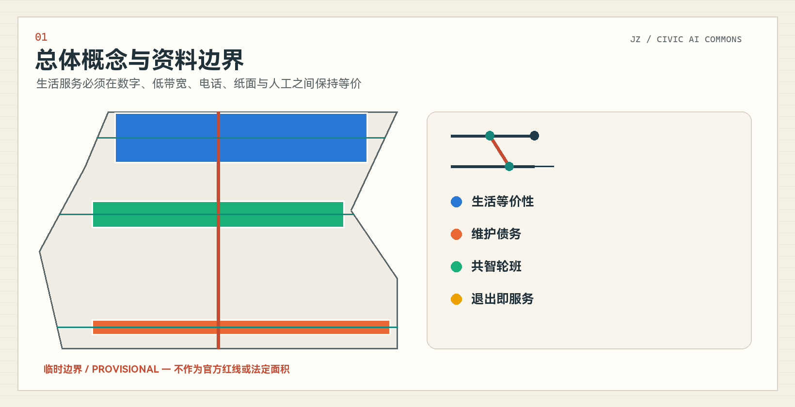
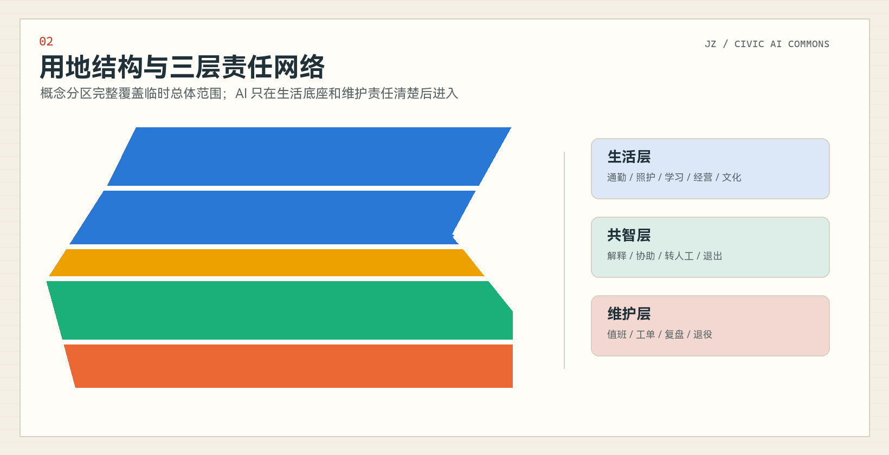
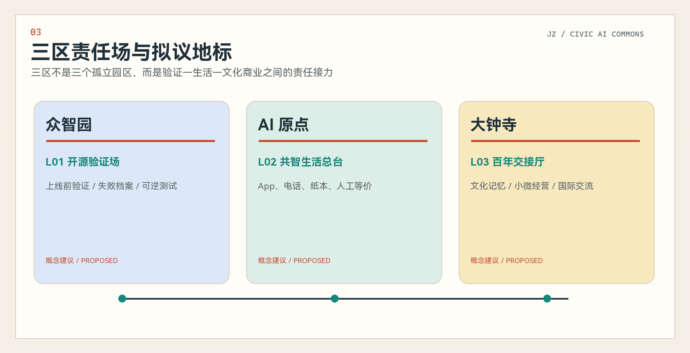
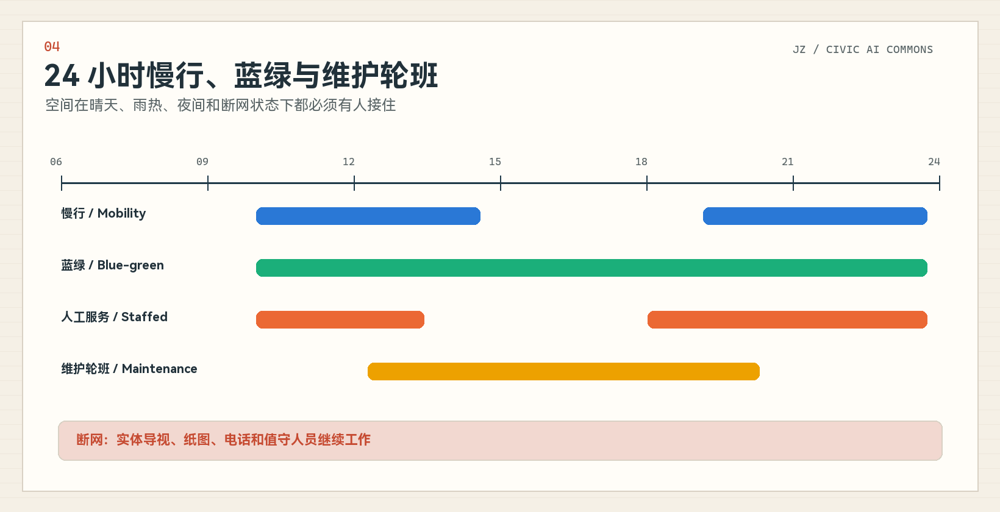
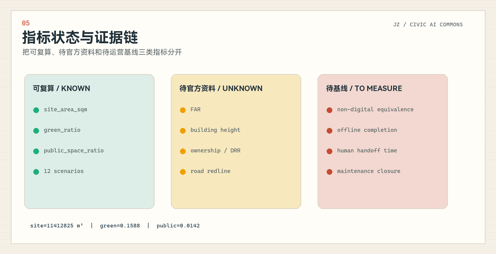

# 京张共智生活带 / Jing-Zhang Civic AI Commons

> **让生活的连续性成为公共基础设施。** AI 可以解释、协助和交接，但人类保留决定权；任何工具退出后，普通服务仍应成立。

## 设计依据与资料清单

本方案以官方资格预审公告、面向智能体任务书、仓库场地包、公开标准和来源登记表为依据。公告提供项目目标、三层范围的文字四至与面积、三处重点区及设计深度；任务书提供三大定位、五大功能、三区两翼、六项 agent 任务和场景数量要求。正式空间控制所需的官方 polygon、控规、宗地、建筑、文保、交通和市政资料目前不完整，因此本方案把事实、临时几何、概念设计和待测运营指标分层管理。[source:OFFICIAL-ANNOUNCEMENT] [source:AGENT-TASKBOOK] [depth:existing_conditions_diagnosis]

`geometry/site_boundary.geojson` 和 `geometry/key_areas.geojson` 继承仓库的 provisional polygons，输入坐标为 EPSG:4326，面积只为 EPSG:4548 下的临时复算值；它们不得被解释为官方红线、审批依据或精确法定面积。`sources.json` 记录每个来源的允许用途与禁止用途，`assumptions.json` 记录边界、控规、文保、基线和运营承诺缺口，三个矩阵负责把正文、图层、指标、图纸与自检连接成证据链。[source:BOUNDARY-SOURCE] [data:geometry/site_boundary.geojson#SITE-001] [metric:site_area_sqm]

## 三层范围工作框架

统筹研究范围约 43.6 平方公里，承担 AI 产业生态、京张文化、中关村创新和区域协同研究；总体设计范围约 11.4 平方公里，承担城市更新、用地、交通市政、蓝绿公共空间和运营框架；重点区域范围约 368.4 公顷，包含众智园约 192.1 公顷、北京 AI 原点社区约 104.3 公顷和大钟寺约 72.0 公顷。三层面积来自公告，临时 polygon 来自仓库推定数据，两者的精度等级不同，必须分别披露。[source:OFFICIAL-ANNOUNCEMENT] [depth:three_level_scope_framework] [data:geometry/key_areas.geojson#PROV-KEY-001]

本方案不从“一脊三核两翼”的形式套型出发，而从一个可验证问题出发：人在没有 App、账号或稳定网络时，是否仍能完成基本城市服务；工作人员换班、供应商退出或 AI 暂停后，服务能否继续。统筹层定义生活等价性和区域创新机制，总体层把它落实为服务接口、维护网络和场景回放，重点区层验证具体责任场。官方“三区两翼”仍被完整映射，但作为责任和资源网络，而不是被误画成法定分区。[source:AGENT-TASKBOOK] [depth:overall_spatial_structure]

## 统筹研究范围产业与未来城市研究

方案命名为“京张共智生活带”，英文名为 “Jing-Zhang Civic AI Commons”。“共智”指居民、维护者、企业、专业机构与 AI 工具共同形成可质询、可接管、可退出的公共工作；“生活带”不是一条新增红线，而是医疗、照护、通勤、学习、经营、文化和维护服务的连续接口。Logo 由两条平行生活路径、一个切换节点和一个开放出口构成：平行路径表示数字与非数字等价，切换节点表示人工交接，开放出口表示退出后服务保持。[source:AGENT-TASKBOOK] [standard:PROJECT-AGENT-OPEN-CALL-TASKBOOK]

三大定位被转译为三项日常能力：百年京张文化带提供“交班、维护、跨地域连接”的公共伦理；都市 AI 生活体验带提供有人工兜底的可感知服务；AI 融合创新带提供上线前测试、证据记录与退出机制。五大功能分别落实为全栈验证、创新生态、AI+ 日常场景、智能原生活力和可公开讨论的治理。众智园承担全栈工具与治理验证，北京 AI 原点社区承担人才与生活协作，大钟寺承担智能原生业态与文化接口；中关村科技服务翼提供技术、资本、采购和第三方审查支持，小月河场景翼提供雨热、夜间、慢行和生态维护的真实回放条件。[source:AGENT-TASKBOOK] [data:geometry/land_use.geojson#LU-001]

全球案例只借机制，不复制形态、图像、数据或制度承诺：

| 案例 | 已核验机制 | 对京张的有限转化 | 来源 |
| --- | --- | --- | --- |
| 巴塞罗那 Decidim 参与平台 | 把提议、讨论、会议与结果放入可追踪的参与流程，并保留公共机构的正式责任。 | 用于设计共智轮班和议题交接记录；不照搬其制度授权。 | [source:CASE-DECIDIM] |
| 阿姆斯特丹算法登记册 | 以公开条目说明算法用途、数据、风险、责任部门和联系渠道，使技术部署可被质询。 | 转化为公共审计窗和场景卡责任字段；不推定京张已有同等法规或登记制度。 | [source:CASE-AMSTERDAM-ALGORITHM] |
| 赫尔辛基 OmaStadi 参与式预算 | 居民提出、共同完善并投票选择城市项目，城市负责可实施性判断和推进。 | 用于维护债务优先级讨论和公开复盘；预算制度与资金规模不直接迁移。 | [source:CASE-OMASTADI] |
| vTaiwan 数字协商流程 | 通过议题澄清、意见聚类、利益相关者会议和公开记录辅助形成可行动共识。 | 用于公共空间冲突调解和人工复核流程；不把工具输出当作民意代表。 | [source:CASE-VTAIWAN] |
| 首尔 120 Dasan 统一咨询入口 | 用统一电话入口接收多类城市问题并转介到对应服务部门，强调语言支持与人工服务。 | 用于无 App、电话和人工柜台等价路径；不推定相同组织架构或响应时限。 | [source:CASE-SEOUL-120] |
| 首尔城市测试床 / 麻谷生活实验室 | 在时间和范围受控的真实城市空间中测试 AI、机器人和公共服务技术，并由公共机构、企业、居民与专家共同参与验证。 | 用于众智园的上线前城市测试闸门；原页面未提供统一申诉、退出或 AI 责任规则，因此京张必须补足。 | [source:CASE-TESTBED-SEOUL] |

这些案例共同说明，世界级 AI 创新生态不仅是企业和技术集聚，还需要透明责任、公众入口、上线前测试、申诉渠道和持续维护。京张的可转化抓手是“服务合同 + 空间接口 + 测试协议 + 公开复盘”，而不是移植国外制度名称或夸大绩效。[source:CASE-AMSTERDAM-ALGORITHM] [source:CASE-TESTBED-SEOUL] [depth:overall_spatial_structure]

## 总体设计范围城市更新与控规深度城市设计

总体设计范围采用五段概念用地分区：南端大钟寺城市服务与智能原生业态、中南段共智社区与日常服务、中段京张公共生活与蓝绿开敞空间、中北段 AI 原点校地协作与公共验证、北端众智园自主创新与治理验证。该分区完整覆盖临时 site boundary，并使用自然资源部用地分类代码表达，但它仍是概念性完整分区，不是控规调整或地块审批。[standard:MNR-LAND-USE-CLASSIFICATION-GUIDE] [data:geometry/land_use.geojson#LU-001] [depth:land_use_layout]

更新框架不是“大拆大建”，而是优先完成无障碍连续、有人可问、遮阴休息、导视、报修闭环和夜间值守等生活底座，再叠加可撤回 AI 工具。`geometry/buildings.geojson` 只表达三类拟议空间原型的概念 footprint，不代表现状建筑或法定建设规模；官方建筑、权属和控规数据到位后，应进行保留、改造、拆除、新建的逐栋专业判定。容积率、建筑高度、建筑覆盖率和退线全部保持 unknown。[standard:MOHURD-CONTROL-DETAILED-PLANNING] [data:geometry/buildings.geojson#BLDG-001] [metric:floor_area_ratio]

总体空间由一条南北公共生活接力带和三个东西生活接口组织。它们首先代表慢行、服务信息和责任交接的连续性，不是道路红线、桥隧线位或工程承诺。市政、新基建和端侧算力只提出“可离线、最小数据、可替换供应商、可人工接管”的接口原则，具体容量、消防、供能和管线必须待专业资料补齐。[data:geometry/roads.geojson#ROAD-001] [depth:municipal_new_infrastructure]

## 重点区域详细设计

**众智园 AI 自主创新加速区**以“开源验证场”为拟议地标。空间以可逆测试单元、人工接管台、公开说明墙和失败档案组成，支持公共服务代理、端侧工具、无障碍设备和生态维护工具在进入真实服务前进行小规模、可暂停的验证。全栈自主创新不等于封闭系统，而是让模型、接口、日志、版本、责任和退役路径可以被专业团队检查。具体建筑和场地位置受 provisional polygon、权属、交通和清河相关条件约束。[data:geometry/key_areas.geojson#PROV-KEY-001] [depth:three_key_area_detailed_design]

**北京 AI 原点社区**以“共智生活总台”为拟议地标。它把 App、低带宽网页、电话、纸本和人工窗口并列，把高校成果转化、人才服务、居民日常和开发者社区放在同一公共界面。空间策略强调近校步行、可坐可停、儿童和老人可理解的导视、居民议事与工作人员后台；AI 只做来源检索、翻译、提醒、选项整理和交班摘要，不代替审批、诊疗、法律判断或公共决定。[data:geometry/key_areas.geojson#PROV-KEY-002] [standard:BARRIER-FREE-ENVIRONMENT-LAW]

**大钟寺 AI 产业聚集区**以“百年交接厅”为拟议地标。它把京张铁路交班纪律、中关村创新文化、智能体与智能终端业态、小微经营和国际交流连接起来。文化导览采用清权资料、固定展签、人工讲解与 AI 辅助检索并行；商业和企业服务保留人工咨询及来源链接。站点一体化、四象限连通、文保和建筑更新仅提出方向，需等待正式交通、文保、权属和工程条件。[data:geometry/key_areas.geojson#PROV-KEY-003] [depth:risk_missing_data]

## AI 创新生态、人才画像与 AI+ 场景

七类 persona 用来检查服务是否只为高数字能力用户设计。画像不是对真实居民的统计或预测，而是用于发现人工兜底、低带宽、夜间、无障碍、照护和工作人员负担等设计缺口。[source:AGENT-TASKBOOK] [metric:persona_count]

| ID | 用户画像 | 设计检验问题 |
| --- | --- | --- |
| P01 | 独居老人 | 就医、缴费、找路和照护联系需要低门槛入口；拒绝 AI 后仍可通过电话、纸本和人工完成。 |
| P02 | 行动障碍通勤者 | 需要连续无障碍路径、障碍更新和人工带路；路线建议不得替代现场安全判断。 |
| P03 | 接送儿童家长 | 需要时间确定、临时变化通知和可信联系人；不使用儿童人脸或持续轨迹。 |
| P04 | 夜班工作者 | 需要夜间照明、末班接驳、有人可问和断网兜底；服务不能只在办公时段成立。 |
| P05 | 小微商户 | 需要政策解释、报修和经营辅助；AI 不替代合同、税务或行政决定。 |
| P06 | 维护与照护人员 | 需要清楚工单、交班、风险和下一动作；工具必须减少重复记录而非增加隐形劳动。 |
| P07 | 开发者与公共审核员 | 需要测试边界、版本、失败记录、人工否决和退役条件；不得直接接入未经授权生产数据。 |

十二张场景卡均执行“解释—协助—转人工—退出—复盘”责任链，并设置最小数据和非数字等价路径。以下表格中的运营主体为概念责任角色，不代表任何机构已承诺实施。[source:GEN-AI-MEASURES] [depth:traffic_rail_slow_parking]

| ID | 场景 | English | 空间 | 用户 | AI 可做 | 非数字等价 | 转人工条件 | 责任角色 | 指标 |
| --- | --- | --- | --- | --- | --- | --- | --- | --- | --- |
| S01 | 无障碍通勤接力 | Accessible commute relay | 接力带与站点接口 | P02/P04 | 给出多模式路线、解释不确定性 | 人工服务台/纸图/电话 | 路线置信不足、临时施工或用户要求 | 交通与公共空间运营方 | 断网完成率、人工接管时间 |
| S02 | 老人就医与照护安排 | Older-adult care coordination | AI 原点社区 | P01/P06 | 解释流程、提醒材料、连接人工窗口 | 现场指导/电话/纸质清单 | 医疗权益、紧急情况、信息冲突 | 医疗服务方与社区照护者 | 人工转介成功率、退出成功率 |
| S03 | 儿童放学后的安全回家 | Safe journey home after school | 社区生活接口 | P03 | 解释公共路线与联系人 | 学校值班电话/纸面联系人 | 计划变化、联络失败或任何安全风险 | 学校与监护人 | 人工确认率、零持续轨迹字段 |
| S04 | 多语言公共事务解释 | Multilingual civic information | 三区公共服务台 | P01/P04/P05 | 翻译、检索和清单化 | 双语纸本/人工翻译 | 权利义务、争议或来源过期 | 公共服务窗口 | 来源可追溯率、人工复核率 |
| S05 | 雨热与极端天气接力 | Heat and extreme-weather relay | 小月河场景翼 | P02/P04/P06 | 提示避险路径与开放服务点 | 广播/纸面导视/现场人员 | 预警升级、设施异常或通信中断 | 应急与场地运营方 | 断网路径可用率、人工更新时间 |
| S06 | 夜间迷路与有人可问 | Night-time wayfinding with human help | 大钟寺与线性公共空间 | P01/P04 | 方向解释、连接值守人员 | 亮灯导视/值守电话 | 用户不安、路径中断或置信不足 | 夜间值守与公共空间运营方 | 人工响应中位时间、会话删除率 |
| S07 | 公共设施报修分流 | Public-facility repair routing | 众智园与小月河 | P05/P06 | 分类、合并重复工单、提示责任范围 | 电话/纸单/现场登记 | 涉及安全、权属不明或重复未闭环 | 设施维护班组 | 工单闭环率、维护债务龄期 |
| S08 | 小商户日常经营助手 | Everyday support for small merchants | 大钟寺产业生活界面 | P05 | 公开信息检索、库存提醒和活动草案 | 企业服务柜台/纸质指南 | 影响权益、来源冲突或用户拒绝 | 商户与企业服务机构 | 人工咨询转介率、最小字段数 |
| S09 | 创业者公共服务办理助手 | Public-service assistant for founders | AI 原点社区 | P05/P07 | 材料清单、来源链接、进度提醒 | 人工咨询/电话/线下窗口 | 规则变化、个案判断或正式提交 | 科技服务机构 | 来源新鲜度、人工复核率 |
| S10 | 京张文化无障碍导览 | Accessible Jing-Zhang cultural interpretation | 大钟寺与遗址公园 | P01/P02/P03 | 多语言、易读和音频文字转换 | 固定展签/讲解员/印刷导览 | 史实不确定、版权不明或用户投诉 | 文化与公共空间运营方 | 来源覆盖率、人工勘误闭环 |
| S11 | 公共空间冲突协商 | Public-space conflict mediation | AI 原点与社区界面 | P03/P04/P05 | 归纳分歧、列出选项和待核事实 | 线下议事/纸面意见/人工主持 | 少数权益、事实争议或高风险议题 | 社区组织与专业主持人 | 异议保留率、人工确认率 |
| S12 | 生态维护轮班 | Ecological maintenance handoff | 小月河场景翼 | P06/P07 | 提示异常、生成交班摘要、追踪复核 | 巡检表/电话/现场交班 | 设备异常、数据漂移或预警冲突 | 生态与设施维护方 | 交班完整率、异常人工复核率 |

三组产业测试验证场景为：TVS-01 公共服务代理上线前验证，测试来源、解释、人工接管、退出与日志；TVS-02 设施维护协同，测试重复工单合并、责任分流、现场确认和退役；TVS-03 无障碍与照护等价性，测试无 App、低带宽、电话、纸本和人工服务能否完成同一任务。三组测试均从 shadow 模式开始，不直接进入生产系统，不使用未经授权数据，也不声称已获政府或企业许可。[source:CASE-TESTBED-SEOUL] [metric:industry_validation_scenario_count]

## 用地、建筑规模与拆改留方案

`geometry/land_use.geojson` 是基于临时总体范围形成的完整概念分区，确保机器审查可以检查覆盖、重叠与面积关系。科研、社区服务、商业服务和公园绿地的面积是 geometry-derived design quantities，仅用于比较方案结构；官方边界或控规到位后必须重算，不能把当前比例写成法定用地或绿地率。[data:geometry/land_use.geojson#LU-003] [metric:land_use_area_research_sqm] [metric:green_ratio]

建筑层只设置三个低置信度更新原型：众智园可逆测试单元、AI 原点服务界面、大钟寺文化与商业更新原型。缺少现状建筑轮廓、层数、高度、用途、年代、结构、权属和文保资料，因此不作逐栋拆改留判定；`retain_renovate_demolish_status` 明确为 unknown。正式深化需先建立现状调查，再采用“安全与文保约束—使用价值—结构碳—公共贡献—运营能力”的多专业判定流程。[data:geometry/buildings.geojson#BLDG-002] [depth:retain_renovate_demolish]

当前概念 building footprint 面积只说明图层中三个空间原型的投影量，不代表现状、批准建设规模或开发强度。总建筑面积、容积率、建筑高度、建筑覆盖率和退线保持 unknown；任何后续数值必须来自 official controls、测绘或专业方案并更新来源、假设、图纸和指标。[metric:building_footprint_area_sqm] [metric:building_height_m] [depth:development_intensity_controls]

## 交通、轨道、市政与公共服务设施

交通策略把“可到达”扩展为“能完成服务”：南北公共生活接力带连接三区，三个东西生活接口把高校、社区、企业与公园联系起来。S01、S05、S06 分别用无障碍通勤、雨热极端天气和夜间迷路回放检查路径；断网时仍保留实体导视、纸图、电话和值守人员。所有线路都是概念关系，不代表道路红线、交通组织批复、跨路工程或站点改造方案。[data:geometry/roads.geojson#ROAD-002] [depth:traffic_rail_slow_parking]

市政与新型基础设施采用“本地可工作、云端可同步、供应商可替换”的原则。端侧设备只保存完成任务所需的最小信息，公共空间不依赖人脸、声纹或持续精确轨迹；云端用于版本、公开资料和匿名化工单汇总。发生网络中断、模型漂移、来源过期或争议时，服务降级到人工与非数字路径。具体供电、通信、排水、防洪、消防和设备布点需在官方资料与工程评估后深化。[source:GEN-AI-MEASURES] [depth:municipal_new_infrastructure]

公共服务设施不只包括面向居民的前台，还包括工作人员休息、交班、培训、备件、纸本更新和投诉处理空间。`生活等价性账本`逐项记录 App、低带宽、电话、纸本和人工窗口能否完成任务；`维护债务地图`记录破损、遮阴、座椅、导视、报修、夜班和雨热失效；二者共同决定近期微更新优先级。[source:BARRIER-FREE-LAW] [data:geometry/public_space.geojson#PUBLIC-002]

## 蓝绿空间、公共空间与城市风貌

蓝绿公共空间以京张遗址公园和小月河场景翼为生活回放场，不把生态空间变成传感器展厅。绿地承担遮阴、休息、步行骑行、雨热适应、文化阅读和维护示范；公共空间承担人工服务、议事、测试说明、失败复盘和年度活动。概念 green/public-space ratios 来自提交图层，不能被误读为现状或法定指标。[data:geometry/green_space.geojson#GREEN-001] [data:geometry/public_space.geojson#PUBLIC-001] [metric:public_space_ratio]

拟议的三个朝圣/荣誉地标不是巨型雕塑，而是可使用的公共制度空间：

| ID | 拟议地标 | 位置 | 公共价值与边界 |
| --- | --- | --- | --- |
| L01 | 开源验证场 | 众智园 | 以可逆测试单元、失败档案和公开说明呈现 AI 上线前验证；是拟议公共空间，不是已批准建设。 |
| L02 | 共智生活总台 | 北京 AI 原点社区 | 把 App、电话、纸本与人工窗口放在同一服务界面，展示生活等价性账本。 |
| L03 | 百年交接厅 | 大钟寺 | 用铁路交班隐喻连接京张记忆、中关村创新文化和当代公共服务责任。 |

城市风貌采用“温暖公共科技”：米白代表可阅读的公共档案，铁路红代表当前责任和切换动作，青绿代表已维护、已保存和可复用状态，深灰蓝保证专业可读性。标志、图标和图件全部原创，不使用铁路机构标志、企业商标、人物肖像、外部地图瓦片或未清权图片。文保边界和历史事实由专业策展与文保资料复核；生成式表现不得冒充现场照片或已建成项目。[standard:MOHURD-URBAN-DESIGN-MEASURES] [source:OFFICIAL-ANNOUNCEMENT]

## 更新项目清单、实施政策与分期计划

近期（概念建议）先进行 8—12 周人工基线：盘点无障碍、座椅、遮阴、导视、有人可问、电话与纸本路径，建立维护债务和工单交接格式；同时在三处重点区以可逆模块演示总台、验证场和交接厅。中期在不依赖单一供应商的前提下连接跨区服务、公开匿名化指标和失败案例。长期形成开放服务合同、替换与退役机制，使技术变化不破坏普通服务。[data:geometry/phasing.geojson#PHASE-001] [depth:phasing_implementation]

项目包包括：JZ-01 生活等价性基线、JZ-02 维护债务盘点、JZ-03 三类可逆公共接口、JZ-04 三组产业验证、JZ-05 夜间/雨热/断网场景回放、JZ-06 开放交班与退出协议、JZ-07 文化与荣誉档案、JZ-08 年度共智生活大会。每个包都可以独立暂停或取消；涉及场地、资金、采购、企业、学校或政府安排的内容均需另行决策。[source:AGENT-TASKBOOK] [depth:renewal_project_list]

运营节奏为每日交班、每月维护债务复盘、季度生活场景回放和年度“京张共智生活大会”。大会包括开发者验证、工作人员经验、居民问题、文化档案和国际案例交流，但不承诺招商、资金或活动审批。国际传播重点展示可撤回工具、人工责任和服务连续性，而不是制造“无人城市”叙事。[source:CASE-DECIDIM] [source:CASE-VTAIWAN]

## 指标体系、面积复算与合规矩阵

指标分为三层：一是由 GeoJSON 复算的临时空间量，如 site area、green/public space、conceptual footprints；二是缺 official controls 而保持 unknown 的 FAR、高度、覆盖率和拆改留；三是需要运营基线的生活等价、断网完成、人工接管和维护闭环。图中数字均从 `metrics.json` 读取；known 不代表官方，只表示可从当前声明来源复算。[depth:metrics_recalculation] [metric:site_area_sqm] [metric:green_space_area_sqm]

本包包含 6 个全球案例、12 张 AI 场景卡、3 个产业测试场景、7 类 personas 和 3 个拟议地标。数量用于检查任务覆盖，不等于质量或实施绩效。空间比例则因 provisional boundary 和概念图层保持 low confidence；评审阅读时必须同时看到状态、来源、公式与假设。[metric:global_case_count] [metric:ai_scenario_card_count] [metric:proposed_landmark_count]

`compliance_matrix.json` 覆盖公告 1.3、1.4、1.5 和 agent.1—agent.6；`standard_matrix.json` 连接官方公告、任务书和专业标准；`design_depth_matrix.json` 以“完整方法 + 明确数据缺口”响应 15 个深度项。所有矩阵都指向真实章节、图纸、图层、指标、来源、假设和自检，不能替代正文的专业论证。[standard:PROJECT-OFFICIAL-ANNOUNCEMENT] [depth:risk_missing_data]

## 风险、版权与合规说明

首要风险是临时边界和基础数据缺失。官方 polygon、控规、宗地、现状建筑、文保、交通、市政、公共服务和权属资料到位后，必须整体替换和复算，不能只换一张边界图。当前图层、比例、项目和地标均为概念建议；不声称官方批准、居民同意、企业入驻、政府资金、工程可行或保证实施。[source:BOUNDARY-SOURCE] [data:geometry/constraints.geojson#CONSTRAINTS] [depth:risk_missing_data]

AI 场景遵守最小数据、明确告知、来源可查、人工复核、可投诉、可退出和可退役原则。医疗、法律、行政、安全、儿童、无障碍和公共决策等高影响事项必须转人工；生成内容不得冒充现场、民意、审批或实测。任何上线需由适当的运营、法律、安全、无障碍和专业团队另行评估。[source:GEN-AI-MEASURES] [source:BARRIER-FREE-LAW]

文字、图标、Logo、图表、HTML 和 PDF 由 Sakimu99 与 AI 协作者“幽浮喵 / Fufu AI”共同创作；使用 Claude Code 作为工作环境，模型与生成过程在 `agent.json` 和版权声明中如实披露。方案不再分发外部图片、地图、字体文件或机构标志；国际案例只引用官方页面文字机制。完整权利说明见 `report/copyright_statement.md`。

## 参考资料

1. 北京市规划和自然资源委员会海淀分局：《百年京张AI创新带城市设计国际方案征集资格预审公告》，2026-05-09。
2. 面向全球智能体的开源征集任务书摘录，2026-05-18，仓库清权资料。
3. 住房和城乡建设部：《城市设计管理办法》。
4. 住房和城乡建设部：《城市、镇控制性详细规划编制审批办法》。
5. 自然资源部：《国土空间调查、规划、用途管制用地用海分类指南》。
6. 《中华人民共和国无障碍环境建设法》。
7. 《生成式人工智能服务管理暂行办法》。
8. Decidim、Amsterdam Algorithm Register、OmaStadi、vTaiwan、Seoul 120 Dasan 与 Testbed Seoul 官方公开页面；仅用于机制比较。
9. 完整机器索引、许可与用途限制见 `sources.json`。[source:SOURCE-REGISTRY]
