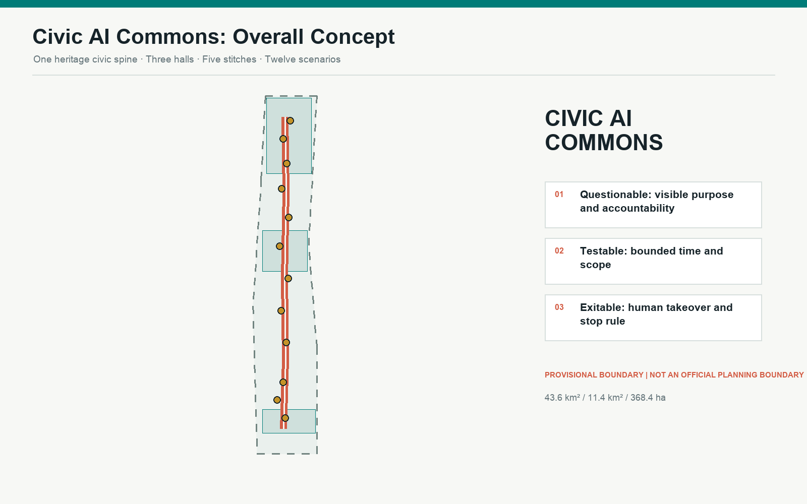
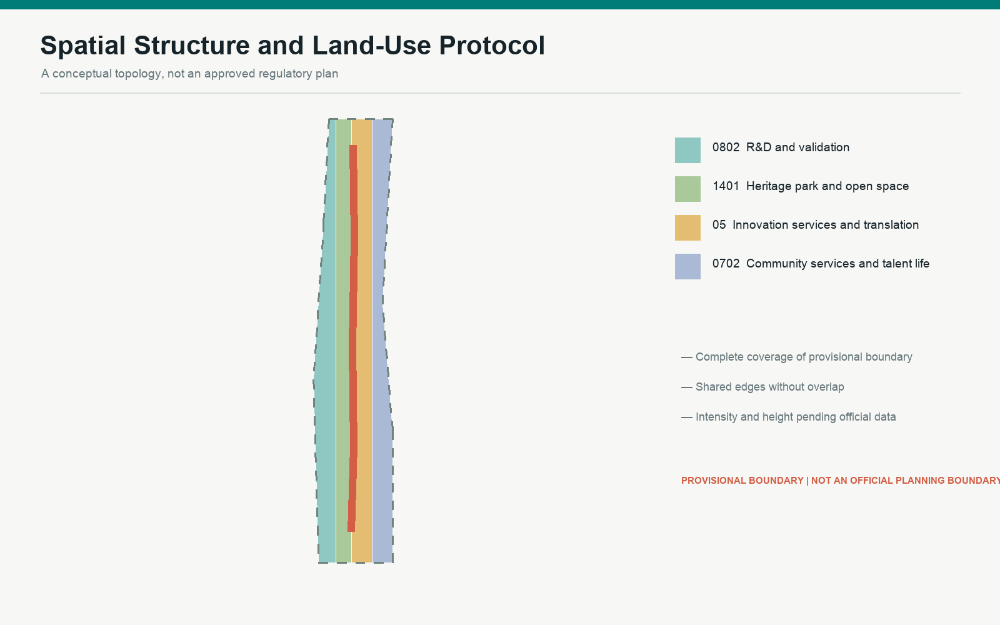
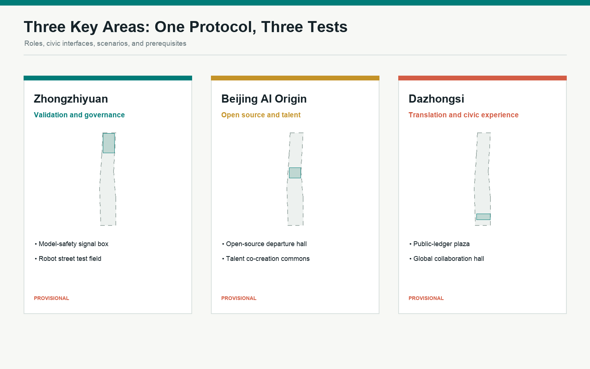
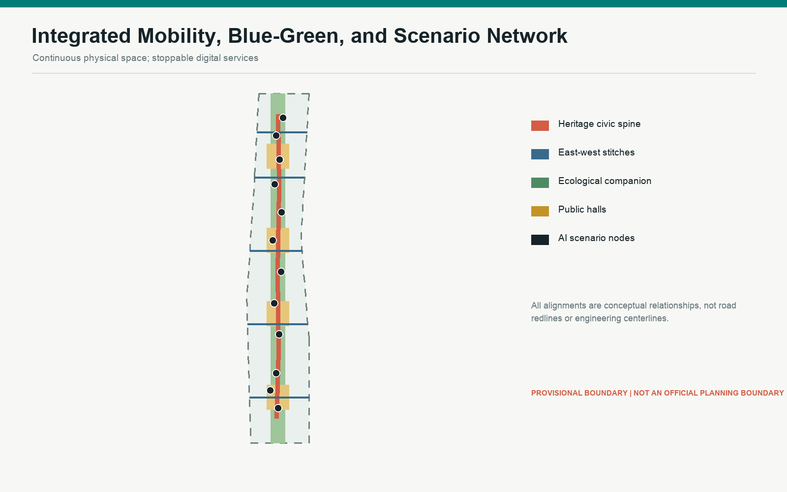
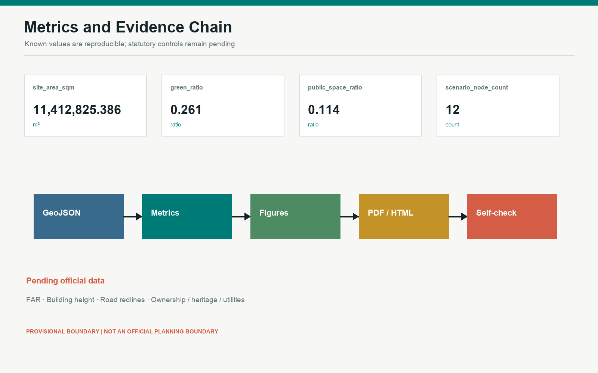

# CIVIC AI COMMONS: A Jing-Zhang Protocol That Can Be Questioned, Tested, and Exited

> Submission status: professional design package preview. Spatial boundaries are provisional constraints, not official planning boundaries. Every spatial move is a conceptual reference for professional teams to deepen.

## Design Basis and Source List

This proposal uses only public or rights-cleared repository materials. The official announcement defines the three scope levels, key areas, task context, and deliverables. The Agent Taskbook defines the positioning, functions, Three Zones and Two Wings, and six required Agent tasks. The submitted boundary is the repository provisional rough polygon and may support generation, display, and intake checks only; it is not an official boundary, ownership record, road redline, or approval basis [source:OFFICIAL-ANNOUNCEMENT] [source:AGENT-TASKBOOK] [source:BOUNDARY-SOURCE]. The Source Registry and processed fact pack separate formal-ready, background-only, and provisional-only evidence. Missing regulatory controls, surveys, utilities, heritage controls, and ownership are carried as open conditions [source:SOURCE-REGISTRY] [depth:existing_conditions_diagnosis].

## Three-Level Scope Framework

The Coordinated Research Area studies the 43.6 sq km innovation ecosystem and future-city mechanism. The Overall Design Area uses the announced approximate 11.4 sq km working scope for renewal, public-space, and infrastructure concepts. The three Key-Area Detailed Design Areas use the announced approximate 368.4 ha task scope to test validation and governance, open-source talent, and translation into civic experience. All submitted polygons are provisional and cannot support official precision claims [data:geometry/site_boundary.geojson#SITE-001] [data:geometry/key_areas.geojson#PROV-KEY-001] [metric:site_area_sqm]. Strategy becomes a spatial protocol, then a set of key-area pilots: one heritage civic spine, five east-west stitches, four public halls, and twelve scenario nodes [depth:three_level_scope_framework] [depth:overall_spatial_structure].

## Coordinated Research Area: Industry and Future City Research

The proposal is named CIVIC AI COMMONS. The track metaphor joins railway history, the audit trail of an AI service, and the decision trail that residents can question. Two parallel rails and an open bracket form the identity direction: technology always leaves room for human intervention and exit. The spatial model is one spine, three civic halls, two wings, and twelve scenarios [standard:PROJECT-AGENT-OPEN-CALL-TASKBOOK]. Seven background precedents inform mechanisms rather than dimensions: Station F, one-north, 22@Barcelona, Kendall Square, Kalasatama, Toronto Waterfront, and Seoul DMC. The transferable lessons are shared platforms, open validation, mixed daily life, durable operations, and public accountability. Their current facts and applicability require professional source review before downstream use.

## Overall Design Area: Urban Renewal and Regulatory-Plan-Level Urban Design

A low-regret-first renewal method organizes a complete topological land-use partition: research and validation, heritage park and civic open space, innovation services and translation, and community services and talent life [data:geometry/land_use.geojson#LU-001] [depth:land_use_layout]. A north-south heritage walking spine and five east-west stitches connect the two wings. Four public halls host human fallback, transparent testing, contribution display, and community service [data:geometry/roads.geojson#ROAD-001]. Conceptual building footprints test spatial capacity only; they are neither a survey nor an approved development envelope [metric:building_footprint_area_sqm]. FAR, height, demolition, investment, ownership, fire, heritage, and utility decisions remain pending official data and professional review [depth:development_intensity_controls] [depth:height_massing_character].

## Detailed Design of Key Areas

Zhongzhiyuan becomes the Validation and Governance Hall with a model-safety signal box, robot street test field, and open standards workshop. Beijing AI Origin Community becomes the Open Source and Talent Hall, joining near-campus walking, an open-source departure hall, talent commons, and embedded community services. Dazhongsi becomes the Translation and Civic Experience Hall, connecting transit access, four-quadrant walking, a public-ledger plaza, and an international demo room [data:geometry/key_areas.geojson#PROV-KEY-001] [depth:three_key_area_detailed_design]. Each area follows the same seven-field deepening template: role, structure, adaptive buildings, mobility, public space, AI scenarios, and prerequisites. Because each polygon is provisional, parcel-level renewal, height, engineering alignment, and construction claims are explicitly excluded [source:KEY-AREA-SOURCE].

## AI Innovation Ecosystem, Personas, and AI+ Scenarios

Six personas guide the design: open-source developers; start-ups and small teams; anchor firms and international visitors; university communities; nearby residents; and older people, children, disabled people, or people with low digital confidence. No persona may be inferred from unauthorized personal tracking. Twelve scenario cards are spatially indexed: open-source departure hall; heritage memory stop; human fallback hall; accessible navigation stop; AI Origin commons; robot street test field; model-safety signal box; edge-compute test siding; global collaboration hall; contributor honor wall; Zhongzhiyuan open-source gate; and Dazhongsi public-ledger plaza. Cards 06, 07, and 08 are industrial test scenarios. Every pilot needs a purpose, minimum-data rule, accountable operator, human review, stop condition, and public retrospective [data:visual/assets/scenario_nodes.json#SCN-01] [metric:scenario_node_count].

## Land Use, Building Scale, and Retain-Renovate-Demolish Strategy

The complete land-use partition uses repository codes from the national land-use classification subset; custom concept roles never replace the machine-readable codes [standard:MNR-LAND-USE-CLASSIFICATION-GUIDE] [data:geometry/land_use.geojson#LU-001]. Buildings follow retain first, adapt second, and cautiously infill last. The heritage workshop and human fallback hall prioritize existing structures; validation workshops and talent halls proceed only after structural, fire, ownership, heritage, and regulatory confirmation. Submitted footprints are conceptual comparison devices, not existing buildings or buildable area [data:geometry/buildings.geojson#BLDG-001] [depth:retain_renovate_demolish]. FAR and building height remain unknown. A later building-by-building record should test heritage value, structural state, use intensity, civic interface, carbon impact, and ownership risk.

## Transport, Rail, Municipal Infrastructure, and Public Services

The mobility plan does not invent vehicle redlines. It uses a heritage walking spine and five east-west stitches to improve walking, cycling, transit access, resting, and accessible wayfinding; intersection geometry, widths, parking, and signals require a transport study [data:geometry/roads.geojson#ROAD-001] [depth:traffic_rail_slow_parking]. AI navigation offers advice only, while physical signs and human assistance remain available. New infrastructure follows a plug-in, metered, and stoppable principle: edge compute, sensing, and robot charging should attach to existing facilities where appropriate and disclose purpose, data scope, operator, hours, and failure contact. Energy, drainage, communications, fire, sanitation, and utilities are interface questions, not engineering conclusions [depth:municipal_new_infrastructure].

## Blue-Green Network, Public Space, and Urban Character

The Jing-Zhang heritage ecological companion is the continuous civic floor; four public halls create places to stop, ask, rest, and participate. Green and public-space ratios are calculated from provisional concept geometry for internal consistency only, not as statutory controls [data:geometry/green_space.geojson#GREEN-001] [data:geometry/public_space.geojson#PUBLIC-001] [metric:green_ratio]. Three pilgrimage and honor nodes make accountability visible: the Zhongzhiyuan Open-Source Gate displays verifiable contributions; the AI Origin Departure Hall shows the path from research to open collaboration; and the Dazhongsi Public-Ledger Plaza publishes scenario purpose, version, accountability, and review. Contribution sleepers record only authorized community contributions. Materials, lighting, heritage relationships, accessibility, and trademarks require separate review [depth:blue_green_public_space].

## Renewal Projects, Implementation Policy, and Phasing

Four phases are a risk-reduction order, not a confirmed development schedule. Phase 0 aligns official data, surveys, ownership, heritage, and public questions. Phase 1 pilots low-regret wayfinding, accessibility, human fallback, and reversible civic scenarios. Phase 2 considers adaptive building work and utility interfaces after professional review. Phase 3 establishes annual evaluation, scenario exit, and spatial post-occupancy review [data:geometry/phasing.geojson#PHASE-001] [depth:phasing_implementation]. The project list includes the heritage spine, five stitches, three key halls, four public halls, three industrial test types, contribution sleepers, accessible navigation, edge-compute interfaces, the green companion, and a governance dashboard. An annual rhythm of spring proposals, summer trials, autumn global release, and winter review is a reference operating model, not a government commitment [depth:renewal_project_list].

## Metrics, Area Recalculation, and Compliance Matrix

All known values are recalculated in EPSG:4548 from the submitted provisional geometry: site area, conceptual footprint, green space, public space, and mobility length. HTML data-metric values match metrics.json exactly [metric:site_area_sqm] [metric:public_space_ratio] [metric:road_length_m]. Scenario nodes, phases, and required key areas are counted from GeoJSON; the compliance matrix covers announcement tasks and agent.1 through agent.6, while the standard and design-depth matrices preserve the complete audit layer [metric:scenario_node_count] [metric:phase_count] [metric:key_area_count]. Recalculation does not convert a provisional polygon into official evidence. When official polygons arrive, constraints, topology, figures, PDFs, and self-checks must all be regenerated [depth:metrics_recalculation].

## Risk, Copyright, and Compliance

Key risks are misreading provisional geometry as official; mistaking conceptual footprints for demolition or construction; privacy, bias, or over-automation in AI services; unresolved heritage, accessibility, utilities, and mobility constraints; and confusing generated diagrams with observed conditions. Controls include persistent provisional labels, unknown statutory values, human fallback and stop mechanisms, source and generation records, and professional review before implementation [depth:risk_missing_data] [source:SOURCE-REGISTRY]. Five figures, bilingual PDFs, and offline HTML are generated locally from the submitted GeoJSON and JSON with Python, Pillow, Shapely, and repository tools. They contain no remote map, news screenshot, identifiable person, or corporate trademark. The missing official architecture design-depth reference remains a data gap rather than claimed authority [standard:MOHURD-ARCH-DESIGN-DEPTH-2016].

## References

1. Haidian Branch of the Beijing Municipal Commission of Planning and Natural Resources, official open-call announcement, 2026.
2. Rights-cleared Agent Taskbook extract supplied for the open call.
3. Local reference snapshots for urban design administration and regulatory detailed planning.
4. Local reference snapshot of the national land-use classification guide.
5. Repository Source Registry, processed fact pack, and provisional boundary, with the boundary limited to generation, intake checks, and design discussion [source:SITE-PACKAGE] [source:BOUNDARY-SOURCE].
6. Global innovation-district examples are background mechanism comparisons only and require current official-source and applicability review before professional use.
