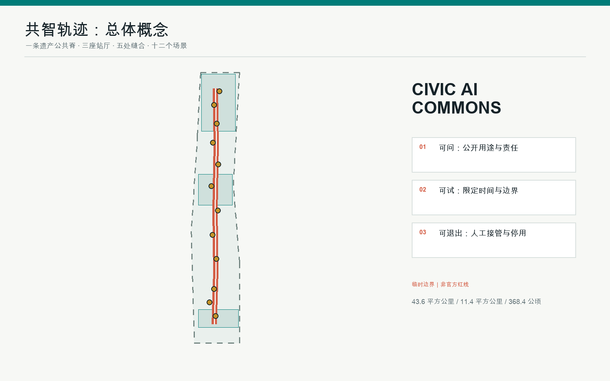
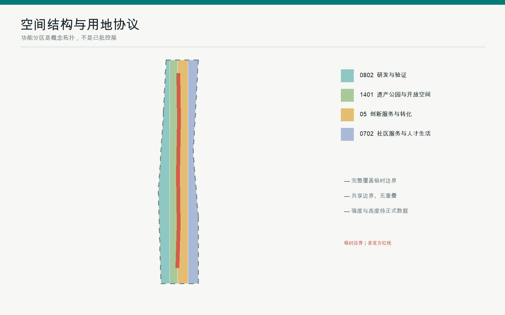
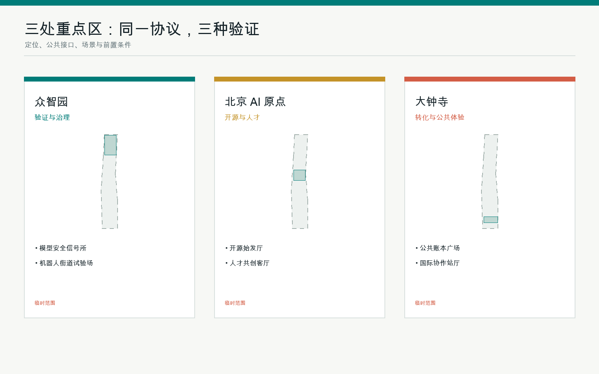
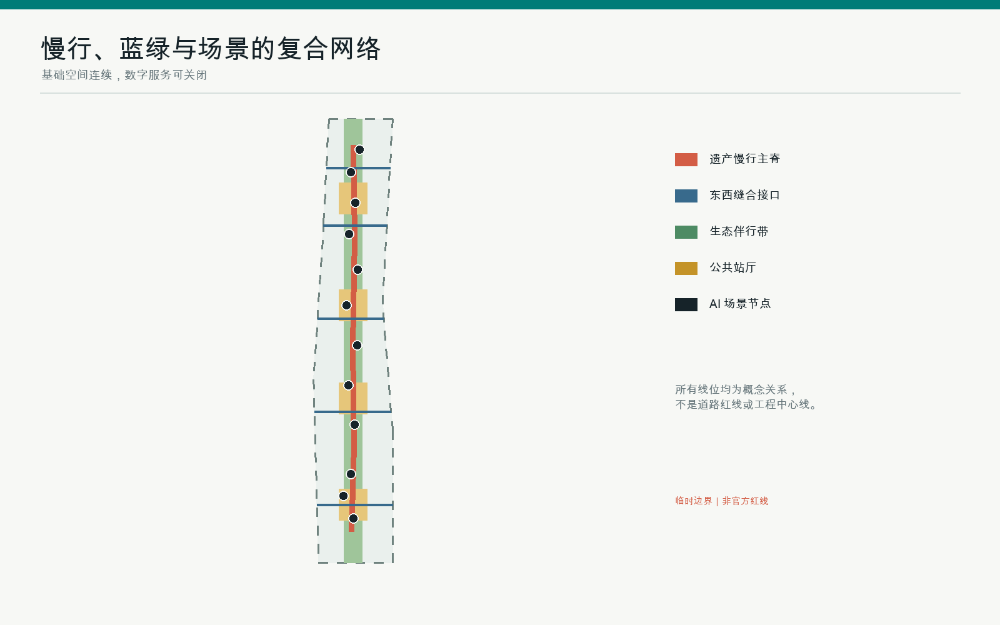
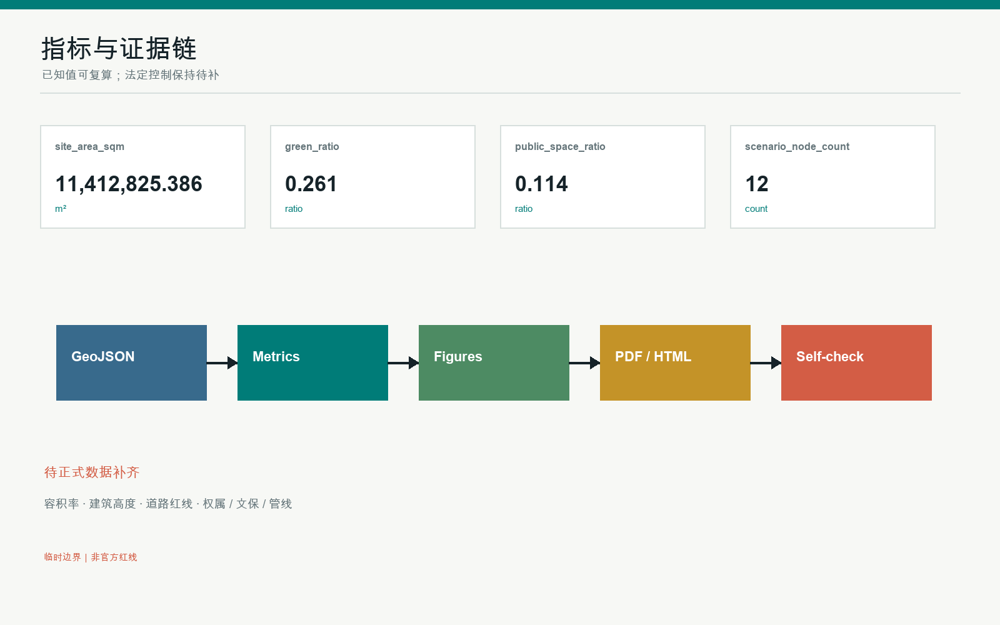

# 共智轨迹 CIVIC AI COMMONS：一条可问、可试、可退出的京张城市协议

> 提交状态：专业设计包预览。空间边界为 provisional constraint，不是官方红线；本方案是可供专业团队深化研究的概念建议。

## 设计依据与资料清单

本方案只使用仓库公开或已清权资料。官方公告用于确认三层范围、三处重点区、任务与成果语境；面向智能体任务书用于确认三大定位、五大功能、三区两翼和六项必答任务；临时边界只用于生成、展示和入口自检，不能作为官方红线、权属、道路或审批依据 [source:OFFICIAL-ANNOUNCEMENT] [source:AGENT-TASKBOOK] [source:BOUNDARY-SOURCE]。方案同时读取公开资料登记表和处理事实包，以区分 formal-ready、background-only 与 provisional-only，并把缺失控规、现状建筑、管线、文保控制和权属条件列为待补资料 [source:SOURCE-REGISTRY] [source:PROCESSED-FACT-PACK]。

设计判断遵循城市设计、控规编制和用地分类的本地标准快照；建筑工程深度文件仍缺官方清权版本，因此只作为缺口登记，不作为本项目权威依据 [standard:MOHURD-URBAN-DESIGN-MEASURES] [standard:MOHURD-CONTROL-DETAILED-PLANNING] [standard:MNR-LAND-USE-CLASSIFICATION-GUIDE]。本包把“看得见的公共空间”与“可复算的机器证据”并列：GeoJSON 和指标为权威层，图件、PDF 与 HTML 为解释层。官方精确 polygon 到位后，必须替换边界并重算全部派生图层、指标、图件和图纸 [depth:existing_conditions_diagnosis]。

## 三层范围工作框架

统筹研究范围用于研究 43.6 平方公里的产业链、人才链与未来城市机制；总体设计范围以公告约 11.4 平方公里为工作口径，组织城市更新、公共空间和设施策略；三处重点区域以公告约 368.4 公顷为任务口径，分别深化验证治理、开源人才、转化体验。提交的 SITE_BOUNDARY 和 KEY_AREA 均为仓库临时粗略 polygon，面积仅是基于该临时几何的复算值，不可解释为官方精确范围 [data:geometry/site_boundary.geojson#SITE-001] [data:geometry/key_areas.geojson#PROV-KEY-001] [metric:site_area_sqm]。

三层之间采用“战略假设—空间协议—重点区试点”的传导：研究层提出世界级生态与公共利益目标；总体层把目标转成一条遗产慢行主脊、五处东西缝合接口、四组公共站厅和十二个场景节点；重点区层把同一协议分别验证。任何官方数据更新都先修改锁定约束，再生成设计层并复算，而不是在图面上手工修补 [depth:three_level_scope_framework] [depth:overall_spatial_structure]。

## 统筹研究范围产业与未来城市研究

总体命名为“共智轨迹 CIVIC AI COMMONS”。“轨迹”同时指京张铁路的历史轨迹、AI 服务的审计轨迹和公众可追问的决策轨迹；视觉识别以两条平行轨线与开放括号构成，表示技术运行必须始终留出人工介入和退出空间。空间结构采用“一脊、三站厅、两翼、十二场景”：遗产主脊承载公共体验，三站厅分别位于众智园、AI 原点与大钟寺，两翼连接中关村科技服务和小月河场景赋能 [standard:PROJECT-AGENT-OPEN-CALL-TASKBOOK] [source:AGENT-TASKBOOK]。

七个国际案例作为背景型转化样本：巴黎 Station F 的集聚运营、新加坡 one-north 的科研生活混合、巴塞罗那 22@ 的存量转型、波士顿 Kendall Square 的校企联动、赫尔辛基 Kalasatama 的生活实验、Toronto Waterfront 的公共治理讨论、首尔 DMC 的媒体产业集群。方案不复制其尺度或指标，只提炼“共享平台、开放验证、混合生活、长期运营、公共问责”五类机制；所有案例需在深化阶段由专业团队复核最新来源、许可与适用性。产业链因此被组织为研发—测试—开源—转化—公众体验—国际传播的循环，而不是单一园区招商 [depth:overall_spatial_structure]。

## 总体设计范围城市更新与控规深度城市设计

总体设计采用“低遗憾动作优先”的更新方法。完整用地分区覆盖临时边界：科研与验证、遗产公园与开敞空间、创新服务与转化、社区服务与人才生活四类功能共享边界，不留未标注缝隙 [data:geometry/land_use.geojson#LU-001] [depth:land_use_layout]。京张遗产慢行主脊为南北公共骨架，五条东西缝合接口连接两翼；四组站厅不是大型地标建筑，而是可嵌入存量空间的人工兜底、公开测试、贡献展示与社区服务界面 [data:geometry/roads.geojson#ROAD-001]。

建筑基底仅用于表达适应性更新原型，不是现状普查或法定体量。正式控规、权属、结构安全、消防、文保、管线和交通评估到位前，不给出确定容积率、高度、拆除或投资结论 [metric:building_footprint_area_sqm] [depth:development_intensity_controls] [depth:height_massing_character]。风貌建议控制为“铁路工业遗产基底 + 可拆卸数字设施 + 清晰人工服务界面”：既有砖石、轨道构件和树阵优先保留，新增设施避免遮挡遗产，夜间界面以低照度、可关闭和无障碍识别为原则。

## 重点区域详细设计

众智园定位为“验证与治理站厅”：设置模型安全信号所、机器人街道试验场和开放标准工坊，测试必须有时间窗、责任人、人工接管、失败记录和退出条件；公共绿地承担可观看但不干扰通行的演示界面。北京 AI 原点社区定位为“开源与人才站厅”：以近校步行缝合、开源始发厅、人才共创客厅和社区服务嵌入连接高校、团队与居民。大钟寺定位为“转化与公共体验站厅”：围绕轨道接驳、四象限步行连续、公共账本广场和国际路演客厅，形成成果从展示到采用的透明界面 [data:geometry/key_areas.geojson#PROV-KEY-001] [depth:three_key_area_detailed_design]。

三处方案共享七字段深化模板：定位、空间结构、建筑适应性更新、慢行与轨道、公共空间、AI 场景、前置条件。当前 polygon 为临时矩形，只能表达方向性关系，不能据此做地块拆改留、建筑高度或工程线位判断。正式边界到位后，专业团队应逐区完成现状测绘、产权与文保核查、交通影响、设施承载和公众沟通，再决定具体实施 [source:KEY-AREA-SOURCE]。

## AI 创新生态、人才画像与 AI+ 场景

六类用户画像为：开源开发者、初创与中小团队、头部企业与国际访客、高校师生、周边居民、老人/儿童/残障与低数字素养人群。每类画像都同时映射服务、空间与退出方式；任何画像不得由个人轨迹或未经授权的敏感数据推断。生成式 AI 公共服务仅在适用范围内设置投诉与处置通道，医疗、社保、金融、生活缴费等明确场景保留现场指导和人工办理，不把法律条文泛化为所有界面的统一结论。

十二张场景卡分别为：01 开源始发厅；02 遗产记忆站；03 人工兜底厅；04 无障碍导航驿站；05 原点开源客厅；06 机器人街道试验场；07 模型安全信号所；08 端侧算力侧线；09 全球协作站厅；10 贡献者荣誉墙；11 众智开源门；12 大钟寺公共账本广场。其中 06、07、08 为产业测试验证场景。每张卡必须在深化时补齐服务对象、最小数据、人工复核、运营责任、停用条件和公开复盘；本包用十二个 SCENARIO_NODE 固定其空间索引，不声称已经获准部署 [data:visual/assets/scenario_nodes.json#SCN-01] [metric:scenario_node_count]。

## 用地、建筑规模与拆改留方案

用地分类使用仓库提供的国土空间用途代码子集，四个分区组成完整拓扑，不以自造分类替代机器校验 [standard:MNR-LAND-USE-CLASSIFICATION-GUIDE] [data:geometry/land_use.geojson#LU-001]。建筑更新采用“先保留、再适配、最后审慎增补”的顺序：遗产叙事工坊和人工兜底厅优先利用存量建筑；开放验证工坊与全栈验证街坊只有在结构、消防、权属和控规条件确认后才讨论加建；人才共创客厅优先嵌入混合功能街区。

提交的 BUILDING_FOOTPRINT 是概念基底，用于比较公共空间和场景承载，不等于现状建筑或可建面积 [data:geometry/buildings.geojson#BLDG-001] [depth:retain_renovate_demolish]。容积率、建筑高度和法定建筑密度保持待正式数据补齐；任何图中体量不得被当作审批、拆迁或投资承诺。正式测绘到位后应逐栋建立“保留价值、结构状态、使用强度、公共界面、碳影响、权属风险”六项档案，再由专业团队和相关主体决定拆改留。

## 交通、轨道、市政与公共服务设施

交通策略不新画机动车红线，而以遗产慢行主脊和五处东西缝合接口改善步行、自行车与轨道接驳；具体交叉口、宽度、停车和信号方案均待交通专项深化 [data:geometry/roads.geojson#ROAD-001] [depth:traffic_rail_slow_parking]。主脊采用连续无障碍路线、休息点、清晰导视和可关闭的低侵入传感；接口优先连接站点、社区服务、重点区和公园入口。AI 导航只提供建议，现场标识和人工协助始终可用。

市政与新型基础设施采用“可插拔、可计量、可停用”原则：端侧算力、传感和机器人补能优先依附既有公共设施，避免不可逆预埋；每个装置公开用途、数据范围、责任主体、运行时段和故障联系人。能源、雨洪、通信、消防、环卫与管线容量均未取得正式资料，因此只提出接口预留和联审清单，不给出工程可行性结论 [depth:municipal_new_infrastructure]。

## 蓝绿空间、公共空间与城市风貌

蓝绿公共空间以京张遗产生态伴行带为连续底盘，四组公共站厅作为可停、可问、可参与的节点。概念绿地与公共空间比例均从临时几何复算，只能比较设计结构，不能替代法定绿地率或公共空间审批指标 [data:geometry/green_space.geojson#GREEN-001] [data:geometry/public_space.geojson#PUBLIC-001] [metric:green_ratio]。绿地优先承担遮荫、雨洪、慢行和低扰动活动；公共站厅同时提供非数字服务和休息空间，避免“只有会用 AI 的人才可进入”。

三处朝圣与荣誉节点是：众智园“开源门”展示可复核的技术贡献；AI 原点“始发厅”呈现从高校成果到开源协作的过程；大钟寺“公共账本广场”公开场景目的、版本、责任与复盘。沿线“贡献轨枕”只记录经授权的社区贡献，不记录个人敏感信息。所有地标均为概念建议，材料、尺寸、照明、文保关系和企业标识必须另行清权与审查 [depth:blue_green_public_space] [standard:MOHURD-URBAN-DESIGN-MEASURES]。

## 更新项目清单、实施政策与分期计划

四阶段不是确定开发时序，而是风险递减顺序。阶段 0 完成官方资料补齐、现状测绘、权属文保和公众议题清单；阶段 1 先做导视、无障碍、人工兜底站和可撤回公共场景等低遗憾试点；阶段 2 在专业审查后推进重点区建筑适应性更新与市政接口；阶段 3 建立年度复盘、场景退出和空间后评估 [data:geometry/phasing.geojson#PHASE-001] [depth:phasing_implementation]。

更新项目清单包括遗产慢行主脊、五处东西缝合、三座站厅、四组公共站厅、三类产业测试场、贡献轨枕系统、无障碍导航、端侧算力接口、蓝绿伴行带和数据治理看板。长期运营建议形成“春季开源提案、夏季城市试验、秋季全球发布、冬季复盘归档”的年度节奏，并由开发者社区、居民代表、专业机构和运营方共同维护场景台账。活动、招商、资金与政策均为参考机制，不构成政府承诺 [depth:renewal_project_list]。

## 指标体系、面积复算与合规矩阵

本包在 EPSG:4548 下复算临时 SITE_BOUNDARY、概念建筑基底、绿地、公共空间与道路长度；核心指标与 HTML 的 data-metric 数值完全一致 [metric:site_area_sqm] [metric:public_space_ratio] [metric:road_length_m]。十二个场景节点、四个阶段和三处重点区分别由几何计数，任务覆盖矩阵覆盖公告 1.3、1.4、1.5 与 agent.1-agent.6；标准矩阵和设计深度矩阵保存完整机器索引 [metric:scenario_node_count] [metric:phase_count] [metric:key_area_count]。

面积复算的目的不是把临时 polygon 变成官方数据，而是确保同一组几何、指标、图件与展示不互相矛盾。容积率与高度保持 unknown；官方 polygon 到位后，应先替换约束，再重建用地拓扑、裁切建筑与空间、复算指标、重绘中英图件和 PDF，最后重新自检 [depth:metrics_recalculation]。目前所有已知比例的置信度均因临时边界与概念图层而降级，不能作为法定控制指标。

## 风险、版权与合规说明

主要风险包括：临时边界被误读为官方红线；概念建筑被误读为拆建结论；AI 场景发生隐私、偏差或自动化过度；遗产、公园和无障碍关系未经专项审查；生成图件被误读为现状照片。控制措施是持续显示 provisional 标识、保持未知控规为空值、提供人工兜底和停用机制、记录来源与生成方法，并要求正式实施前由城市规划、建筑、交通、市政、文保、无障碍、网络与数据合规专业人员复核 [depth:risk_missing_data] [source:SOURCE-REGISTRY]。

五张核心图、双语 PDF 和离线 HTML 均由本地 Python、Pillow、Shapely 与仓库脚本根据提交的 GeoJSON/JSON 生成，不包含外部底图、新闻截图、人物、企业商标或远程字体；版权与工具链说明见 report/copyright_statement.md。方案不声称官方批准、政府采纳、居民共识或工程可行性。建筑工程设计文件深度标准因官方文件缺失仅登记为 data gap [standard:MOHURD-ARCH-DESIGN-DEPTH-2016]。

## 参考资料

1. 北京市规划和自然资源委员会海淀分局：《百年京张 AI 创新带城市设计国际方案征集资格预审公告》，2026。
2. 用户提供并清权的《面向全球智能体开展百年京张 AI 创新带城市设计开源征集任务书摘录》。
3. 住房和城乡建设部：《城市设计管理办法》与《城市、镇控制性详细规划编制审批办法》本地参考快照。
4. 自然资源部：《国土空间调查、规划、用途管制用地用海分类指南》本地参考快照。
5. 仓库 data/source_registry.json、processed fact pack 与 provisional_boundaries.geojson；后者仅用于临时生成、自检和设计讨论 [source:SITE-PACKAGE] [source:BOUNDARY-SOURCE]。
6. 国际创新区案例仅作为背景型机制对照，正式深化前须复核最新官方来源、许可与场地适用性。
