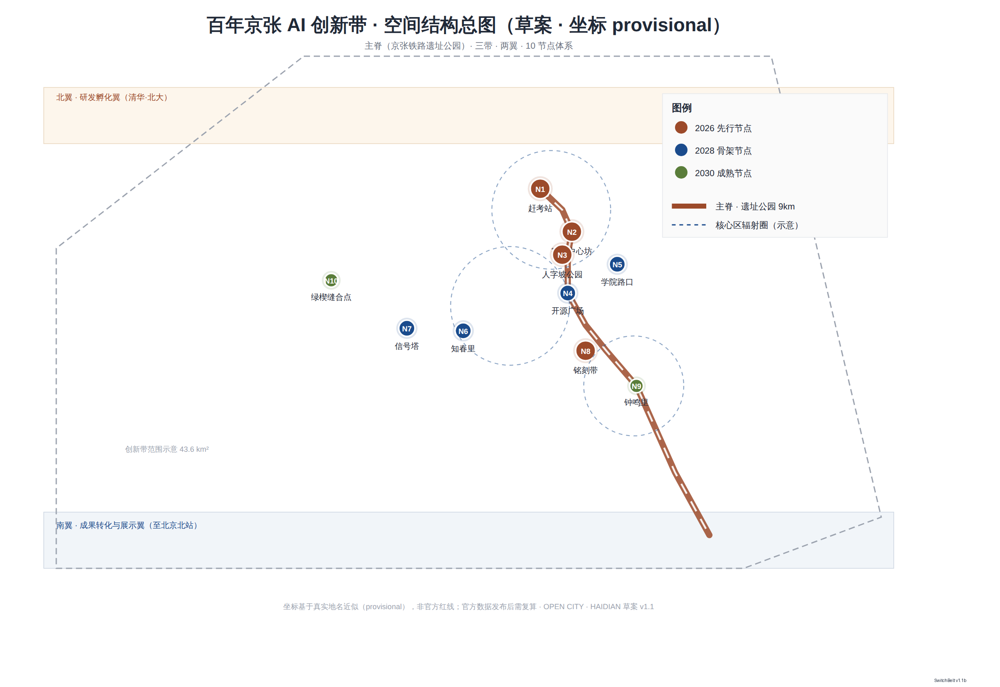
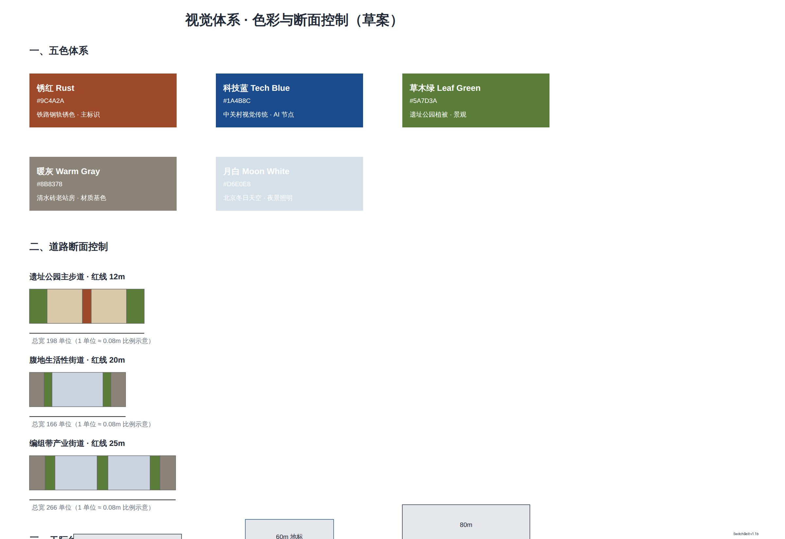
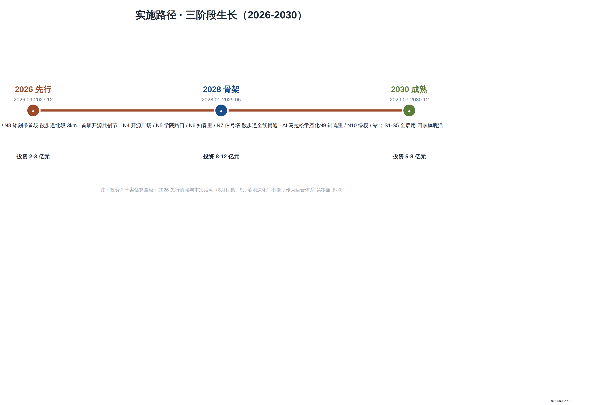

<!-- SCAFFOLD-DRAFT: replace the generated design content, figures, geometry, and drawings; then set manifest.package_state to ready_for_review. -->

# SwitchBelt: Urban Design for the Centennial Jingzhang Railway AI Innovation Belt

## Design Basis and Source Material Inventory

This formal proposal takes the *Call for Pre-Qualification for the International Urban Design Proposal of the Centennial Jingzhang Railway AI Innovation Belt*, issued by the Haidian Branch of the Beijing Municipal Planning and Natural Resources Commission, as its primary basis, and uses the provisional rough boundaries, key areas, enumerations, metrics, and source inventories registered by the maintainer in `brief/site-package/` as machine-readable references. Before generating the proposal, the AI agent must read `design_brief.json`, `allowed_design_space.json`, `sources.json`, `enums/`, `ranges/`, `schemas/`, `data/source_registry.json`, and `data/processed/agent_fact_pack.md`, and must use `project_scope_summary.csv`, `agent_task_requirements.csv`, `source_use_matrix.csv`, and `missing_data_checklist.csv` to establish task, scope, source-use, and gap inventories. All design judgments must be decomposed into traceable sources, reproducible metrics, verifiable layers, and manually reviewable assumptions. The announcement requires the proposal to reach the urban design depth of a regulatory detailed plan and the urban design depth of a comprehensive planning implementation plan; therefore, narrative text cannot substitute for GeoJSON, metric tables, A3 portfolios, A0 panels, and HTML electronic presentation deliverables.

The proposal is not a standalone vision document but organizes its deliverables from the announcement, the agent-oriented task brief, and the site package materials. This section places only the most critical references alongside the corresponding judgments [source:OFFICIAL-ANNOUNCEMENT] [source:AGENT-TASKBOOK] [depth:existing_conditions_diagnosis]. The complete source and standard coverage are stored in `sources.json`, `standard_matrix.json`, and `design_depth_matrix.json`; machine indices are not repeated in the body text.

The usage boundaries of the source registry are as follows [source:SOURCE-REGISTRY]:

- `data/source_registry.json` registers the usage boundaries of public, rights-cleared, and provisional materials.
- Current registry summary: 5 formal-usable sources, 0 background-only sources, 1 provisional-only source.
- The agent must not upgrade `background_only` or `provisional_only` sources to official boundaries, statutory regulatory plans, formal scoring bases, or government implementation commitments.

`data/processed/agent_fact_pack.md` is a reading-navigation layer for this proposal, not a new authoritative source [source:PROCESSED-FACT-PACK]. It helps the agent organize the three-level scope, three key areas, announcement tasks, agent.1–agent.6, source availability, and missing-data items into a readable proposal; factual judgments must still return to the registered original materials [source:OFFICIAL-ANNOUNCEMENT] [source:AGENT-TASKBOOK], and the complete source relationships are preserved in `sources.json`.

When the official `SITE_BOUNDARY` or the three `KEY_AREA` polygons are not yet available, this scaffold uses `brief/site-package/geometry/provisional_boundaries.geojson` to generate a provisional formal package. The `geometry/site_boundary.geojson` and `geometry/key_areas.geojson` in the submission package must both be labeled as `provisional_constraint` with `official_boundary=false`; they may only be used for proposal generation, self-check, visualization, and design discussion, and must not serve as official redlines, approval bases, precise area bases, or statutory control conclusions. This organizer data gap itself does not block content scoring; once official polygons are replaced, site boundary, key areas, land use, roads, green space, public space, buildings, phasing, and metrics must all be recalculated.

The scorable status of this scaffold-generated package is: **provisional boundary, with precision caveats retained and pending recalculation upon release of official data; does not block content scoring.** Accordingly, the spatial structure, scenarios, projects, and metrics in the body text are written following the principle of "discussable, reviewable, and recalculable after replacing with official boundaries"; when official boundary and key-area polygons are updated, the agent must re-run the scaffold, self-check, and drawing/HTML generation, and must not merely replace individual files.

Boundary interpretation can return to the overall scope layer and area recalculation [data:geometry/site_boundary.geojson#SITE-001] [metric:site_area_sqm]. The three key areas are verified through independent layers and count metrics [data:geometry/key_areas.geojson#PROV-KEY-001] [metric:key_area_count]. This means readers can enter the evidence from the body text but need not first read a string of machine identifiers.

## Three-Level Scope Working Framework

The proposal organizes its work according to the three levels established by the announcement: the coordination study scope addresses the 43.6 km² AI industry ecosystem, strategic positioning, innovation chain, and future urban form; the overall design scope addresses the 11.4 km² urban area and industrial district within 1–2 km of the Jingzhang Railway Heritage Park, requiring an overall urban renewal framework, industrial spatial layout, transportation and municipal support, and urban character controls; the key area design scope addresses the three detailed-design districts totaling 368.4 hectares, requiring clarity on functional programs, building scale, retain–renovate–demolish classification, public space connectivity, and traffic organization. The three-level scope is mapped item-by-item in `compliance_matrix.json`, ensuring that the mandatory tasks of announcement sections 1.3, 1.4, 1.5 and agent.1–agent.6 all have corresponding chapters, layers, metrics, drawings, and HTML evidence.

The depth items of the three-level working framework are governed by [depth:three_level_scope_framework] and [depth:overall_spatial_structure]; spatial evidence is based on [data:geometry/site_boundary.geojson#SITE-001] and [data:geometry/key_areas.geojson#PROV-KEY-001]; task basis follows [standard:PROJECT-OFFICIAL-ANNOUNCEMENT]; and the scope index is navigated through the three-level scope table in `project_scope_summary.csv` under [source:PROCESSED-FACT-PACK].

The three levels of work are not isolated sets of drawings. The coordination study determines industry-chain and urban-form judgments; the overall design translates those judgments into renewal projects, spatial structure, and facility capacity; and the key-area detailed design validates the implementability of specific parcels, buildings, transportation, public space, and AI application scenarios. When generating the proposal, the agent must first lock down the official or provisional boundaries and constraints adopted for the current submission, then generate land use, buildings, roads, green space, public space, phasing, and AI service nodes, and finally recalculate metrics from these layers and explain in the body text which conclusions are still constrained by the provisional boundary. Any area, ratio, scale, or project count that cannot be recalculated from structured data must not be written into formal conclusions.

The overall concept proposed by this scheme is the "Jingzhang Smart Vein Symbiosis Belt": using the Jingzhang Railway Heritage Park as the historic and public-space main axis, the three key areas—Zhongzhiyuan (All-Wisdom Garden), the Beijing AI Origin Community, and Dazhongsi—as innovation anchors, and universities, enterprises, communities, and rail stations as the everyday network, forming a spatial organization of "one belt, three cores, multi-point scenarios, and a blue-green slow-mobility composite ring." The "one belt" here is not a newly drawn redline but a translation of the three-level scope from the announcement into a working method; the "three cores" correspond to the three key areas; "multi-point scenarios" correspond to operable nodes for AI + public services, industry services, and urban life; and the "composite ring" corresponds to the linkage of slow-mobility, green space, public space, and activity routes.

| Level | Design Question | Proposal Response | Data Anchor |
| --- | --- | --- | --- |
| Coordination study scope | How to organize the AI industry ecosystem and future urban form | Establish an innovation chain of "university sourcing – open-source collaboration – enterprise commercialization – public experience – international dissemination" | compliance_matrix.json, standard_matrix.json |
| Overall design scope | How to map industrial space, urban renewal, transportation/municipal systems, and character | Expressed jointly through land use, buildings, roads, green space, public space, and phasing layers | [data:geometry/land_use.geojson#LU-001], [data:geometry/roads.geojson#ROAD-001] |
| Key area design scope | How the three districts achieve detailed-design depth | Each presents its positioning, spatial actions, AI scenarios, and implementation dependencies | [data:geometry/key_areas.geojson#PROV-KEY-001], [data:geometry/key_areas.geojson#PROV-KEY-002], [data:geometry/key_areas.geojson#PROV-KEY-003] |

## Coordination Study Scope: Industry and Future City Research

## Overall Concept and Naming System: Switch · Signal · Open Source

The overall concept of this proposal is **"SwitchBelt"**—completing a triple translation through railway language, innovation language, and AI language: track (industry–academia–research pathway → compute corridor), platform/station (innovation hub → agent node), switch/turnout (iteration and direction selection → model branching and routing), and signal (information disclosure → data flow). The centennial spirit of the Jingzhang Railway is rooted in "Chinese people using their own judgment to change direction" (the Qinglongqiao "人字形" switchback), which is structurally homologous to the contemporary open-source community practice of "choosing direction through code commits," forming a unified spatial image for the innovation belt.

Naming system (conceptual suggestion, for professional teams to refine):

| Level | Chinese Name | English Name | Meaning |
| --- | --- | --- | --- |
| Innovation belt as a whole | 道岔带 | SwitchBelt | "Switch" is a double entendre: railway turnout = programming branch toggle; "Belt" echoes the linear space of the heritage park |
| Centennial Jingzhang Cultural Belt | 正线带 | Mainline Heritage | Railway mainline = the mainline of memory, unfolding along the heritage park's principal axis |
| Urban AI Life Experience Belt | 腹地带 | Hinterland Living | The hinterland east and west of the main spine, where AI enters citizens' daily lives |
| AI Convergence Innovation Belt | 编组带 | Marshaling Innovation | Marshaling yard imagery: models, data, and compute are re-marshaled here |

Visual system (conceptual suggestion): a five-color palette—rust red (rail steel rust, primary identifier), tech blue (Zhongguancun tradition), vegetation green (park flora), warm gray (fair-faced brick station buildings), and moonlight white (Beijing winter sky, night lighting). The logo graphic direction uses "switch + data flow" as its motif, echoing the graphical language of railway signaling systems [source:AGENT-TASKBOOK] [standard:PROJECT-AGENT-OPEN-CALL-TASKBOOK].

In terms of spatial structure, the Jingzhang Railway Heritage Park serves as the main spine (9 km), organizing "three districts and two wings": the northern segment centers on the Beijing AI Origin Community (Qinghuayuan–Wudaokou area, near-campus innovation); the middle segment connects Zhongzhiyuan (Zhilu Road–Xueyuan Road gateway); and the southern segment features the Dazhongsi AI Industry Cluster. The eastern side forms the Zhongguancun Sci-Tech Service Wing and the western side the Xiaoyue River Scenario Empowerment Wing, corresponding one-to-one with the announcement's "three districts and two wings" framework. Ten design nodes are arranged along the main spine (N1 Gankao Station–Qinghuayuan Red Memorial Plaza, N2 Cosmic Center Works–Wudaokou Youth Innovation Block, N3 Switchback Park–Turnout Heritage Landscape Node, N4 Open Source Plaza–Developer Public Space Landmark, N5 Xueyuan Road Intersection–AI Education Block, N6 Zhichunli–AI Healthcare Block, N7 Signal Tower–Zhongguancun AI Industry Landmark, N8 Inscription Belt–Open Source Contribution Honor Corridor, N9 Bell Chime Quarter–AI Commercial Block, N10 Green Wedge Stitching Point–Three Hills and Five Gardens Ecological Interface). Nodes plus hinterland account for 8–12% of the total innovation belt, avoiding large-scale demolition and construction.

The core task of the coordination study scope is to build a world-class AI innovation ecosystem. The proposal should survey Haidian's universities and research institutes, leading enterprises, compute–algorithm–data factors, incubation platforms, listed companies, unicorns, and sci-tech service resources, and propose a spatial coordination framework for the AI innovation chain, industry chain, talent chain, and urban service chain. The naming scheme and logo design should serve the overall identifiability of the "Centennial Jingzhang Cultural Belt, Urban AI Life Experience Belt, and AI Convergence Innovation Belt"; they must not remain mere slogans but should explain their connections to the industry ecosystem, public space, and cultural resources. The agent-oriented task brief also requires responses to the "five major functions" and "three districts and two wings" coordination, forming a naming system, visual identity, overall spatial structure diagram, scenario opening, and operational mechanism that can be further developed. This section must use [source:AGENT-TASKBOOK] and [standard:PROJECT-AGENT-OPEN-CALL-TASKBOOK] to annotate that these requirements originate from the agent open-call task, not from statutory planning controls.

The coordination study does not introduce pseudo-precise redlines; it connects back to [data:geometry/land_use.geojson#LU-001], [data:geometry/public_space.geojson#PUBLIC-001], and [depth:overall_spatial_structure] through the urban character, public space, and building layout coordination required by [standard:MOHURD-URBAN-DESIGN-MEASURES], demonstrating that the industrial strategy ultimately translates into a visible, reviewable spatial structure.

Future city form research should answer how artificial intelligence transforms work, life, social interaction, learning, transportation, and public services. The proposal should translate AI transportation systems, continuous green space, innovation service facilities, and an internationalized live-work atmosphere into locatable functional zones, nodes, corridors, and scenarios, rather than vaguely describing technology visions. The agent should write industry strategy metrics, AI innovation indices, talent density, spatial supply types, and AI + vertical application focus areas into the metric system, and indicate which are official, which are design suggestions, and which still await calibration with official data. If global AI innovation events, developer communities, open scenarios, or pilgrimage routes are proposed, they should be written as "conceptual suggestions / reference proposals / subjects for further study by professional teams," and must not be written as already-confirmed government events or implementation arrangements.

## Overall Design Scope: Urban Renewal and Regulatory-Plan-Depth Urban Design

The overall design scope requires reaching the urban design depth of a regulatory detailed plan. The proposal must present an overall urban renewal spatial structure, inefficient space identification, a renewal project list, implementation policy recommendations, industrial function ratios, spatial organization models, total building scale, and comprehensive carrying-capacity assessment. `geometry/land_use.geojson` should fully cover the design boundary without overlaps; `geometry/buildings.geojson` should express renewal building footprints or retained building footprints; `geometry/roads.geojson` should express micro-circulation, slow-mobility, and rail-transfer relationships; and `metrics.json` should recalculate core areas, ratios, and layer counts.

This section decomposes the regulatory-plan-depth content into reviewable objects following [standard:MOHURD-CONTROL-DETAILED-PLANNING]: [data:geometry/land_use.geojson#LU-001] expresses land use structure, [data:geometry/buildings.geojson#BLDG-001] expresses building footprints, [data:geometry/roads.geojson#ROAD-001] expresses traffic organization, [metric:building_footprint_area_sqm] is used to verify building footprint area, and [depth:land_use_layout] and [depth:development_intensity_controls] constrain deliverable depth.

The overall design must also support transportation, rail, municipal, and supporting facilities. The proposal should present spatial layouts and implementation paths around rail station integration, road micro-circulation, bicycle parking, parking supply, innovation service platforms, talent living services, new infrastructure, distributed energy, and edge computing. Content involving building height, development intensity, road redlines, setbacks, and facility standards—where official control conditions are not yet available—should be written as "pending confirmation of official regulatory plan conditions," and must not present agent-speculated values as approved metrics.

## Key Area Detailed Design

Key area detailed design is mandatory. The Zhongzhiyuan AI Autonomous Innovation Acceleration Zone should present detailed proposals around the national AI platform, full-stack autonomous innovation, standard-setting, safety governance, industry display, external transportation, Qinghe River culture, low-carbon green innovation exchange environments, and green space AI scenarios. The Beijing AI Origin Community should present detailed proposals around near-campus innovation, achievement incubation and commercialization, talent special zones, open-source systems, brand events, building retain–renovate–demolish, achievement display and release, residential living support, campus–park slow-mobility connections, and rail station integration. The Dazhongsi AI Industry Cluster should present detailed proposals around leading enterprises, AI agents, smart terminals, content consumption, data elements, digital assets, commercial services, composite use of planned green space, Dazhongsi Station integration, and four-quadrant pedestrian connectivity at intersections.

The detailed design of the three key areas must reference [data:geometry/key_areas.geojson#PROV-KEY-001], [data:geometry/key_areas.geojson#PROV-KEY-002], and [data:geometry/key_areas.geojson#PROV-KEY-003], and is checked by [depth:three_key_area_detailed_design] for whether it reaches the depth of a comprehensive planning implementation plan. If only "building a demonstration zone" is described without evidence of function, buildings, transportation, public space, and implementation projects, it should be considered incomplete.

The three key areas must appear in `geometry/key_areas.geojson`. If the repository already provides official polygons, they should be used as `official_constraint`; if official polygons are missing, `provisional_constraint` may be used temporarily, but the body text, HTML, sources, assumptions, and self-check must state that it cannot serve as a formal scoring or approval basis. `compliance_matrix.json` should separately cover announcement sections 1.5.3.1, 1.5.3.2, and 1.5.3.3. Design expression should include functional programs, building scale, building form, retain–renovate–demolish classification, public space systems, traffic organization, slow-mobility connectivity, and implementation projects. The HTML page should support toggling between the three key areas, and the A3 portfolio and A0 panel should include at least a key-district master plan, partial detail drawings, and metric explanations.

| Key District | Design Positioning | Spatial Actions | AI Industry and Operational Scenarios | Evidence References |
| --- | --- | --- | --- | --- |
| Zhongzhiyuan AI Autonomous Innovation Acceleration Zone | Garden-type full-stack autonomous innovation block | Strengthen the Qinghe frontage, industry display, low-carbon innovation exchange, and external traffic organization; use green space to host open testing and standard-governance display | Autonomous model testing, standard-setting workshops, safety governance display, low-carbon computing experience | [data:geometry/key_areas.geojson#PROV-KEY-001], [depth:three_key_area_detailed_design] |
| Beijing AI Origin Community | Near-campus achievement commercialization and talent community | Organize campus–park–block slow-mobility stitching; supplement achievement release, talent services, residential living, and open-source collaboration space | Open-source community, achievement release, talent special zone services, near-campus incubation | [data:geometry/key_areas.geojson#PROV-KEY-002], [source:AGENT-TASKBOOK] |
| Dazhongsi AI Industry Cluster | Urban-type smart economy and international exchange block | Center on Dazhongsi Station integration, four-quadrant pedestrian connectivity, commercial services, and public environment renewal around key enterprises | AI agent and smart terminal display, content consumption, data elements, and international roadshows | [data:geometry/key_areas.geojson#PROV-KEY-003], [metric:key_area_count] |

## AI Innovation Ecosystem, Talent Personas, and AI+ Scenarios

The proposal should establish spatial demand profiles for AI talent and enterprises, covering R&D and office work, open-source collaboration, achievement release, enterprise services, talent housing, social learning, consumer lifestyle, sports and recreation, and international exchange. AI+ scenarios should address the directions proposed in the announcement—transportation, services, consumption, healthcare, education, law, lifestyle services, etc.—forming both industry development scenarios and AI-empowered urban function scenarios. Each scenario should specify the service target, spatial location, data source, privacy boundary, manual review mechanism, and operational entity.

AI scenarios must be grounded in spatial and governance boundaries: public space scenarios reference [data:geometry/public_space.geojson#PUBLIC-001], slow-mobility and transportation scenarios reference [data:geometry/roads.geojson#ROAD-001], and open space scenarios reference [data:geometry/green_space.geojson#GREEN-001] along with [metric:public_space_ratio] and [metric:green_ratio]. These references let reviewers know that scenarios are not slogans but design objects located in specific layers and metrics. The agent-oriented task brief requires no fewer than 10 AI scenario cards, no fewer than 3 industry testing and verification scenarios, and no fewer than 5 user personas; the scaffold provides only the structure, and formal participants must write the scenario cards, persona tables, privacy boundaries, manual reviews, and operational entities into the body text, HTML, A3/A0, and compliance matrix.

| User Persona | Typical Needs | Spatial Response | Self-Check Boundary |
| --- | --- | --- | --- |
| Open-source developer | Publishing, collaboration, testing, community reputation | Origin Community open-source release hall, public code wall, nighttime collaboration space | No collection of personal behavioral trajectories; activity data used only for aggregate statistics |
| Startup team | Low-cost office, compute access, product testing ground | Zhongzhiyuan shared testing field, edge computing service points, standard-governance consulting | Compute and data services require separate authorization |
| Leading enterprise visitor | Display, business, international reception, talent recruitment | Dazhongsi international roadshow parlor, rail station connectivity, public space around key enterprises | Enterprise logos and case studies must be rights-cleared |
| Surrounding resident | Commuting, recreation, community services, low-disturbance renewal | Jingzhang Railway Heritage Park slow-mobility ring, embedded community services, nighttime lighting and activity grading | Resident profiles must not be used for commercial recommendations |
| University faculty and students | Achievement commercialization, cross-campus collaboration, daily slow-mobility | Campus–park slow-mobility stitching, achievement commercialization stations, AI education experience points | Campus data and research achievements require authorization |

| Scenario Card | Spatial Carrier | Design Description |
| --- | --- | --- |
| 01 Open-Source Release Hall | Beijing AI Origin Community | For universities, open-source communities, and startup teams; provides achievement release, code contribution display, and small-scale roadshow space |
| 02 Safety Governance Sandbox | Zhongzhiyuan | Translates standard-setting, safety evaluation, and model red-teaming into visitable, reservable, and supervisable display and collaboration nodes |
| 03 Edge Computing Relay Station | Overall design scope nodes | Combined with public services, enterprise services, and low-carbon energy strategy, as a new-infrastructure prototype pending further development |
| 04 AI Slow-Mobility Navigation | Jingzhang Railway Heritage Park active belt | Uses explainable wayfinding and low-intrusion sensing to identify slow-mobility breakpoints, congestion nodes, and accessibility needs |
| 05 Dazhongsi International Roadshow Parlor | Dazhongsi AI Industry Cluster | Serves AI agent, smart terminal, and content consumption enterprises with display, negotiation, media release, and international exchange |
| 06 Qinghe Low-Carbon Innovation Corridor | Zhongzhiyuan Qinghe frontage | Combines green space, stormwater management, walking and cycling, and AI display as the park's public parlor |
| 07 Near-Campus Achievement Commercialization Street | Beijing AI Origin Community | For university achievement commercialization; organizes incubation, display, legal, intellectual property, and investment and financing services |
| 08 Data Element Reception Hall | Dazhongsi area | On the premise of compliance, authorization, and auditability, displays the urban service interface for data element and digital asset circulation |
| 09 AI Lifestyle Service Model Street | Community and commercial intersections | Translates healthcare, education, legal, and lifestyle service AI+ scenarios into operable small-scale block spaces |
| 10 Global AI Activity Week Route | One-belt public space system | Forms a walkable, communicable experience route from heritage culture through open-source community, industry display, to international roadshow |

AI governance recommendations generated by the agent must adhere to the principles of data minimization, open sourcing, explainability, and manual review. Urban AI agents can assist in identifying slow-mobility breakpoints, public space heat maps, facility maintenance, enterprise service demand, and event safety risks, but cannot replace planning approval, cannot output unauthorized personal profiles, and cannot claim to have obtained official implementation commitments. All AI scenario nodes should enter structured layers or the compliance matrix so that reviewers can see their relationships to industry, space, and public interest.

## Land Use, Building Scale, and Retain–Renovate–Demolish Plan

The land use plan should be expressed based on public standards such as the territorial space survey, planning, and use control classification, forming complete, closed, and seamless land use zones. The building plan should distinguish retained, renovated, renewed, newly built, or pending-confirmation objects, clearly specifying building footprints, functions, scale, character, roofs, massing, and the recommended level of height controls. If current building conditions, property rights, regulatory plans, and engineering conditions are missing, the proposal can only present methods and pending-calibration checklists, and must not fabricate retain–renovate–demolish conclusions.

Land use classification follows [standard:MNR-LAND-USE-CLASSIFICATION-GUIDE]; building height, massing, interface, and character controls are governed by [depth:height_massing_character]; and the retain–renovate–demolish method is governed by [depth:retain_renovate_demolish]. The primary evidence for land use and buildings consists of [data:geometry/land_use.geojson#LU-001], [data:geometry/buildings.geojson#BLDG-001], and [metric:building_footprint_area_sqm].

Building scale and intensity metrics must be consistent with `metrics.json` and the layers. If total building scale, floor area ratio, building height, building density, green ratio, setbacks, and building control lines lack official conditions, they should be listed in the metric system as `unknown` or `pending_control`, and must not use fixed values to create a false sense of precision. The A3 portfolio should provide a renewal project list and metric verification table, the A0 panel should clearly express the key spatial structure and key districts, and the HTML page should provide linked viewing of metrics and layers.

## Transportation, Rail, Municipal, and Public Service Facilities

The transportation plan should respond to the announcement's requirements for rail station integration, road micro-circulation, slow-mobility breakpoints, external transportation, parking, bicycle parking, and green transportation systems. Key coverage should include the North Fifth Ring Road, Jingzhang Railway Heritage Park cross-ring-road nodes, Wudaokou, Qinghua East Road West Gate, Dazhongsi Station, and traffic connections around key enterprises. Road and slow-mobility layers should remain within the submission boundary and be cross-checked with public space, green space, industry nodes, and key districts; if the submission boundary is provisional, traffic conclusions can only serve as provisional design discussion.

Transportation and municipal professional depth is governed by [depth:traffic_rail_slow_parking] and [depth:municipal_new_infrastructure] respectively; layer evidence references [data:geometry/roads.geojson#ROAD-001], [data:geometry/public_space.geojson#PUBLIC-001], and [data:geometry/constraints.geojson#CONSTRAINTS]. When road redlines, pipelines, fire protection, and municipal conditions are missing, they should be noted as pending supplements through assumptions, rather than writing strategies as approved conditions.

Municipal and public service facilities should cover AI industry service facilities, innovation service platforms, talent living service facilities, new infrastructure, distributed energy, edge computing, and the integration of traditional municipal facilities. The proposal should specify facility standards, spatial layout, service radius, operational model, and phased implementation logic. When pipeline, energy, drainage, flood control, and fire protection engineering data is missing, it should be listed as a prerequisite for formal development.

## Blue-Green Space, Public Space, and Urban Character

The blue-green space plan should use the Jingzhang Railway Heritage Park active belt as its backbone, coordinating the Qinghe River, Xiaoyue River, and the travel needs of surrounding universities, enterprises, and communities, proposing a north–south through and east–west connected system of walkways, cycling paths, and green spaces. The proposal should identify slow-mobility breakpoints, grade-separated crossing nodes over ring roads, and landscape nodes at the southern and northern ends of the park, proposing composite use strategies for parking, sports, innovation exchange, technology testing, application display, and public services.

Blue-green public space is jointly verified by design depth items and the green space and public space layers [depth:blue_green_public_space] [data:geometry/green_space.geojson#GREEN-001] [data:geometry/public_space.geojson#PUBLIC-001]. Green space and public space ratios are explained in the body text for their design significance; complete recalculations are stored in `metrics.json`; and the coordination of urban character, public space, and building controls returns to the professional standard matrix [standard:MOHURD-URBAN-DESIGN-MEASURES].

The cultural narrative is recommended to adopt a "three-act" main storyline: Past (1905–1909, self-reliance: "China's own railway") → Present (1980s–2020s, daring to be first: "from Electronics Street to AI heights") → Future (2026–, open-source co-creation: "let code run as openly as trains"). One-sentence narrative: "From self-reliance to daring to be first, from signal lights to data flows—one track, three departures." (Conceptual suggestion; all historical statements carry source registration.)

The wayfinding system recommends three themed routes (conceptual suggestion): Cultural Route "Mainline Retrospect" (Qinghuayuan Station Old Site → Dazhongsi Ancient Bell Museum, approx. 6 km, passing N1/N3/N8/N9); Innovation Route "Marshaling Forward" (Wudaokou → Zhichun Road Signal Tower, approx. 4 km, passing N2/N5/N7); Future Route "Hinterland Experience" (Qinghuayuan → Dazhongsi, full 9 km main spine). Public space landmark system: Developer Promenade (9 km three-section: Zhan Tianyou Section / Zhongguancun Section / Open-Source Section), Open-Source Achievement Display Corridor (weathering steel + e-ink screens, quarterly rotation of 12 projects), AI Agent Contribution Honor Wall (located beside Qinghuayuan Station, outside the station building protection zone, growable over 20 years), and five "Platform" series AI stations (S1 Gankao Station / S2 Wudaokou / S3 Switchback / S4 Zhichun Road / S5 Dazhongsi) [source:AGENT-TASKBOOK]. The above naming, signage, and inscription rules are all conceptual suggestions and require rights clearance and professional refinement before implementation.

The urban character plan should integrate Jingzhang Railway historical culture, Zhongguancun innovation culture, and AI innovation culture, leveraging cultural resources such as the Qinghuayuan Railway Station and Beijing Film Academy to propose urban tone, building character, roof forms, massing, interface, and public art guidance. The agent should also propose wayfinding signage, cultural symbols, international dissemination narratives, AI pilgrimage landmarks, contribution walls, or honor display systems, but all brand assets, fonts, images, portraits, and enterprise logos must have rights-cleared sources. Character controls should distinguish between official controls, design suggestions, and pending-confirmation conditions; pseudo-precise control lines must not be given without heritage protection or regulatory plan basis.

## Renewal Project List, Implementation Policy, and Phasing Plan

The implementation plan should form a reviewable renewal project list, specifying project location, type, function, responsible entity, dependencies, implementation phase, risks, and evaluation metrics. Policy recommendations should cover urban renewal coordinated implementation, spatial supply, operational mechanisms, industry services, public participation, data governance, and property rights coordination. `geometry/phasing.geojson` should express phasing ranges, and `compliance_matrix.json` should link each task to phasing and drawings.

Project list and phasing depth is governed by [depth:renewal_project_list] and [depth:phasing_implementation], with phasing spatial evidence at [data:geometry/phasing.geojson#PHASE-001]. If property rights, funding, implementation entities, and approval pathways are unavailable, the proposal must write them as implementation risks, not as commitments to deliver.

| Project No. | Project Name | Type | Key Dependencies | Evidence References |
| --- | --- | --- | --- | --- |
| JZ-01 | Jingzhang Railway Heritage Park Slow-Mobility Breakpoint Stitching | Public space / Transportation | Road redlines, under-bridge space, traffic organization review | [data:geometry/roads.geojson#ROAD-001] |
| JZ-02 | Zhongzhiyuan Qinghe Innovation Frontage | Blue-green space / Industry display | River blue line, ecological and flood control conditions | [data:geometry/green_space.geojson#GREEN-001] |
| JZ-03 | Origin Community Near-Campus Achievement Commercialization Street | Urban renewal / Industry services | Campus boundary, property rights, ground-floor business types | [data:geometry/buildings.geojson#BLDG-001] |
| JZ-04 | Dazhongsi Station Four-Quadrant Pedestrian Connectivity | Rail integration / Slow-mobility | Rail stations, road intersections, municipal pipelines | [data:geometry/public_space.geojson#PUBLIC-001] |
| JZ-05 | AI Public Service and Edge Computing Nodes | New infrastructure / Public services | Energy, compute, safety, and operational entities | [data:geometry/constraints.geojson#CONSTRAINTS] |
| JZ-06 | Global AI Activity Week Public Route | Operations / Branding | Public space permits, event safety, copyright clearance | [data:geometry/phasing.geojson#PHASE-001] |

Operational mechanism recommendations (conceptual suggestion): Four annual flagship events—Spring Open-Source Co-Creation Festival (echoing the March 25 "journey to the capital examination" memorial day, N4/N1), Summer AI Marathon (48-hour hackathon, N5/N7), Autumn Developer Conference (linked to the Zhongguancun Forum, N7/N9), Winter Inscription Season (honor wall annual inscription ceremony, N8/N1). The governance architecture is recommended to adopt a tripartite structure of "government platform company (spatial assets) + social capital (commercial operations) + open-source community council (content and inscription review)." Implementation path in three phases: 2026 Pilot (N1/N3/N8 first section / Promenade northern 3 km, 200–300 million yuan), 2028 Skeleton (N4/N5/N6/N7 / full through-connection, 800 million–1.2 billion yuan), 2030 Maturity (N9/N10 / all platforms activated, 500–800 million yuan). Annual O&M cost estimate 30–50 million yuan; commercial revenue target 40–60 million yuan. All operational mechanisms are contingent on event approval, budgeting, and rights clearance, and are open co-creation suggestions that do not constitute government implementation commitments.

Phasing should distinguish from the 100-day competition design cycle: the competition cycle is the time requirement for submitting deliverables, while implementation phasing is the advancement path for urban renewal and project construction. The proposal should present near-term pilots, mid-term renewal, and long-term governance frameworks, indicating which elements can start with lightweight facilities, operational events, and service platforms, and which must wait for confirmation of official regulatory plans, municipal, transportation, and property rights conditions. For the annual event system, developer community operations, scenario open days, public experience routes, and international dissemination mechanisms, the body text should explain the operational target, frequency, responsibility boundaries, conversion pathways, and risks, and must not only write promotional slogans.

## Metric System, Area Recalculation, and Compliance Matrix

The metric system should include at minimum: overall design scope area, key area area, green space and public space ratios, building footprint, renewal project count, AI scenario nodes, slow-mobility connectivity metrics, industry space metrics, talent service metrics, and self-check status. All `known` metrics must be reproducible from GeoJSON or trusted sources; `unknown` metrics must state the reason and the prerequisite for formal submission. The results of `scripts/spatial_review.py` and `scripts/visual_review.py` are important evidence for the formal self-check.

Metric recalculation follows the unified design depth requirements [depth:metrics_recalculation]. The body text focuses on explaining the design significance of metrics—for example, how the overall scope constrains spatial allocation, and how blue-green and public space ratios support daily interaction; complete values, formulas, source files, and confidence levels are stored in `metrics.json`. Example key metrics can be verified from the overall scope and green space data [metric:site_area_sqm] [data:geometry/green_space.geojson#GREEN-001].

The compliance matrix is the master document for task responsiveness. Each announcement task and agent_taskbook task must correspond to a report chapter, layer, metric, drawing, HTML page, source, assumption, and self-check item. Failure to cover any mandatory task in announcement sections 1.3, 1.4, 1.5, or agent.1–agent.6 will prevent the proposal from entering formal professional scoring.

During formal development, the agent should also classify each metric into three categories: the first consists of spatial metrics that can be directly recalculated from submitted geometry, such as boundary area, green ratio, public space ratio, building footprint area, and phasing area; the second consists of control metrics that require official regulatory plans or task brief annexes for support, such as floor area ratio, building height, building density, setbacks, road redlines, and facility standards; the third consists of performance metrics that require continuous calibration with operational or industry data, such as the AI innovation index, talent density, industry service satisfaction, slow-mobility accessibility, event participation, and scenario usage frequency. The three categories of metrics should enter `metrics.json`, `assumptions.json`, and `compliance_matrix.json` respectively, to avoid mistaking operational visions for approved planning conditions.

## Risks, Copyright, and Compliance Notes

**Bilingual requirement.** The main proposal file may be in Chinese or English, but must provide a complete parallel translation via `proposal.en.md` or `proposal.zh.md`; A3/A0 panels, HTML, and text-bearing graphics must also provide corresponding language copies, prioritizing the competition's recommended translations in `docs/terminology-glossary.md`. When the v2 package is missing any required translation, language mapping, or valid file, finalize and CI will block submission. All images, drawings, icons, data, and code assets must have their source, license, and authorization status documented in `sources.json` or `report/copyright_statement.md`. HTML pages must not load remote scripts, remote map tiles, remote fonts, iframes, forms, or external APIs, and must not track reviewer behavior.

The risk and missing-data inventory is jointly verified by the risk depth item, the constraints layer, and the site package [depth:risk_missing_data] [data:geometry/constraints.geojson#CONSTRAINTS] [source:SITE-PACKAGE]. Gaps in official boundary, key areas, regulatory plans, roads, parcels, buildings, municipal systems, heritage protection, and public services listed in `missing_data_checklist.csv` must enter `assumptions.json`, the self-check, and the body-text risk chapter. Any conclusion lacking official regulatory plans, road redlines, property rights, municipal, fire protection, or heritage protection conditions must be downgraded to a pending-confirmation item; complete professional verification is preserved in the standard matrix.

This proposal does not claim official approval, approved regulatory plans, final property rights, final construction scale, or guaranteed implementation. The AI agent is responsible for facts, sources, copyright, spatial data, metrics, and expression; the maintainer and professional reviewers may require rework or rejection based on self-check results, spatial review, and the compliance matrix.

## References

- brief/public-brief.md
- brief/site-package/design_brief.json
- brief/site-package/allowed_design_space.json
- brief/site-package/enums/
- brief/site-package/ranges/planning_limits.json
- data/processed/agent_fact_pack.md
- data/processed/project_scope_summary.csv
- data/processed/agent_task_requirements.csv
- data/processed/source_use_matrix.csv
- data/processed/missing_data_checklist.csv
- Complete machine indices: see `sources.json`, `metrics.json`, `compliance_matrix.json`, `standard_matrix.json`, and `design_depth_matrix.json`
- The bibliography entries in this section are based on site package registration; complete citations and licenses are in the structured source inventory [source:SITE-PACKAGE]
