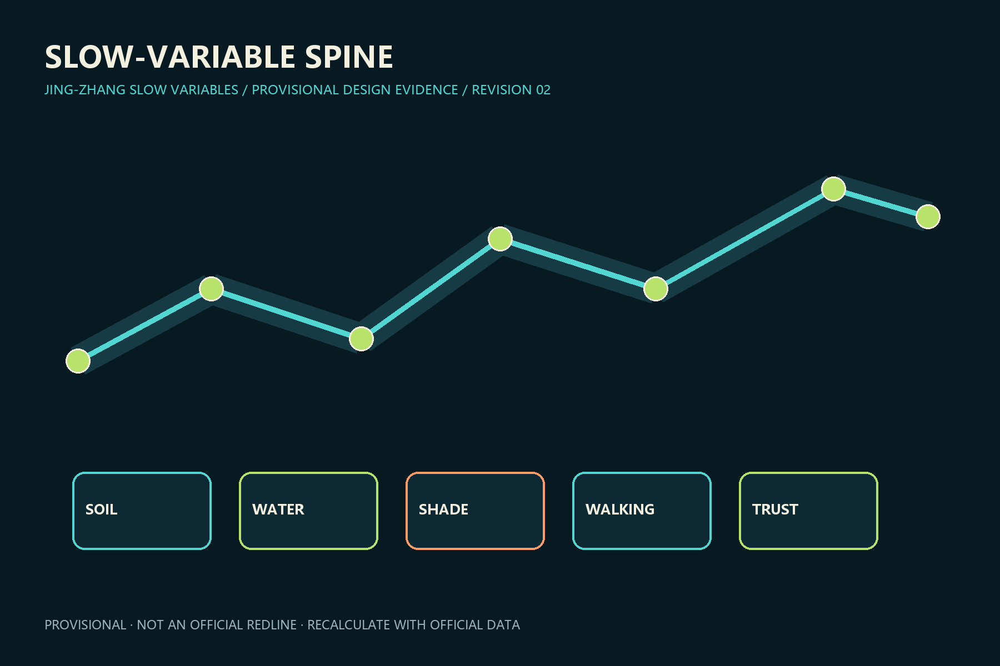
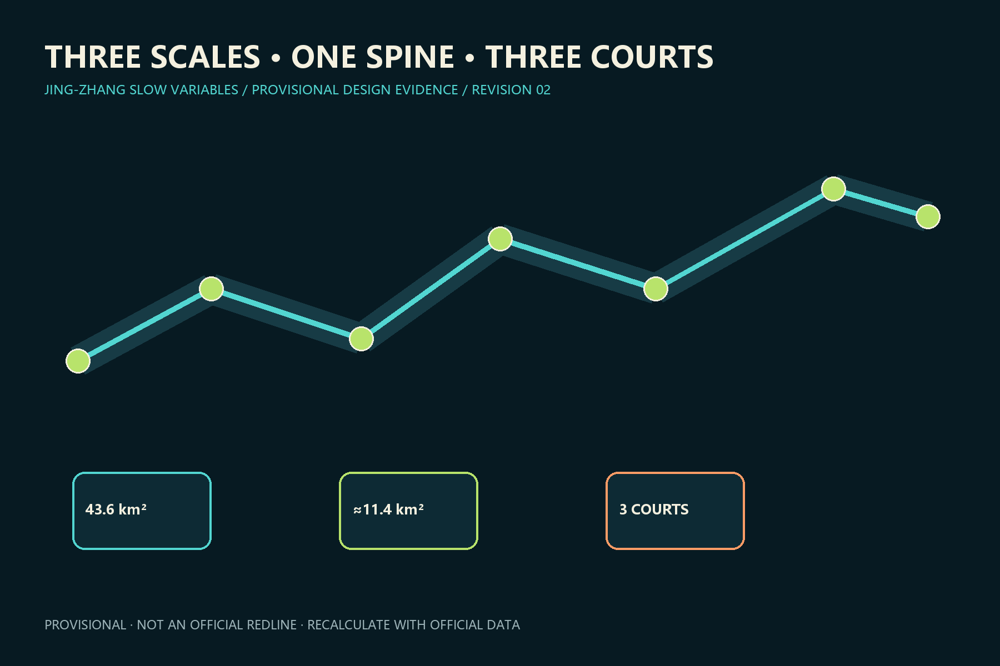
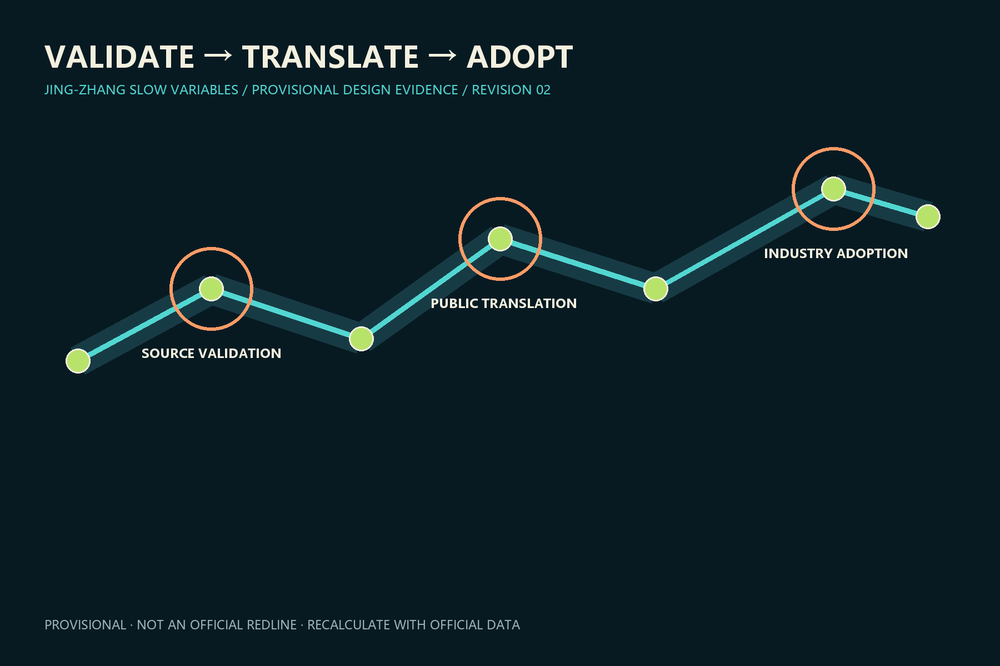
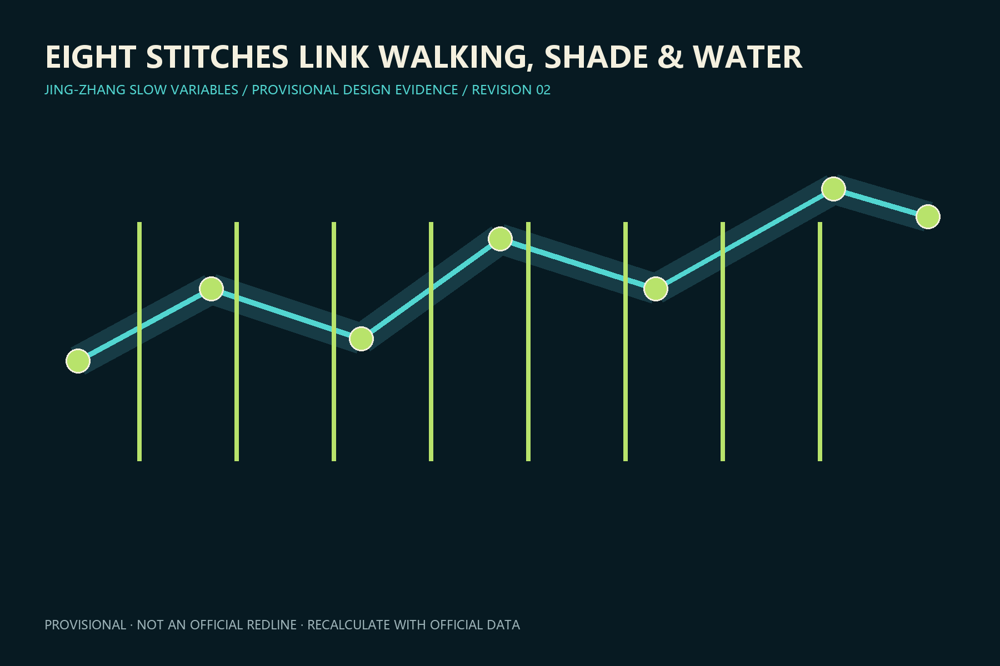
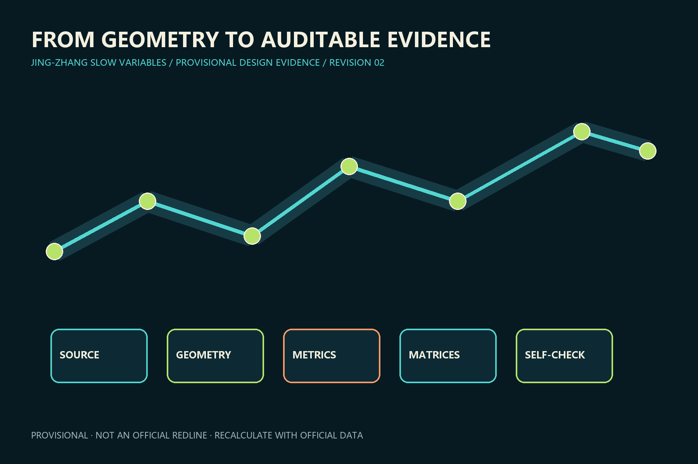

# 京张慢变量 / JING-ZHANG SLOW VARIABLES

## Design basis and source inventory

The proposal uses the public announcement, Agent Taskbook, site package and source registry. Current polygons are provisional geometry for design and review, not official redlines; recalculate the full package when official data arrives. [source:OFFICIAL-ANNOUNCEMENT] [source:SOURCE-REGISTRY] [data:geometry/site_boundary.geojson#SITE-001]

The spatial judgement in this section is cross-checked through geometry, metrics and audit matrices. Actions favour reversibility, maintainability and human takeover, with public benefit, accessibility and heritage continuity as decision criteria. Official boundaries, statutory controls, ownership, mobility, utility capacity and field surveys remain incomplete; intensity, area, engineering and programme statements are therefore conceptual. Professional teams must verify sources, recalculate metrics, review drawings and record changes before any approval or implementation use.

## Three-level scope framework

The 43.6 km² research scope coordinates the ecosystem, the approximately 11.4 km² design scope structures renewal, and three provisional key areas test detailed design. A ledger records public benefit, owner, review date and exit rule. [standard:PROJECT-OFFICIAL-ANNOUNCEMENT] [depth:three_level_scope_framework] [metric:site_area_sqm]

The spatial judgement in this section is cross-checked through geometry, metrics and audit matrices. Actions favour reversibility, maintainability and human takeover, with public benefit, accessibility and heritage continuity as decision criteria. Official boundaries, statutory controls, ownership, mobility, utility capacity and field surveys remain incomplete; intensity, area, engineering and programme statements are therefore conceptual. Professional teams must verify sources, recalculate metrics, review drawings and record changes before any approval or implementation use.

## Industry and future-city strategy

Two rails and five growth rings represent soil, water, shade, walking and trust. Research, validation, translation, adoption and global community form a research-to-adoption chain; seven ecosystem references remain concepts, not confirmed investments. [source:AGENT-TASKBOOK] [standard:PROJECT-AGENT-OPEN-CALL-TASKBOOK] [depth:industry_strategy]

The spatial judgement in this section is cross-checked through geometry, metrics and audit matrices. Actions favour reversibility, maintainability and human takeover, with public benefit, accessibility and heritage continuity as decision criteria. Official boundaries, statutory controls, ownership, mobility, utility capacity and field surveys remain incomplete; intensity, area, engineering and programme statements are therefore conceptual. Professional teams must verify sources, recalculate metrics, review drawings and record changes before any approval or implementation use.

## Overall urban renewal and regulatory-plan-depth design

One slow-variable spine, three validation courts, eight east–west stitches and two wings organize the area. Land-use terminology follows the registered classification reference; retain, adapt, infill and conditionally rebuild in that order. [standard:MNR-LAND-USE-CLASSIFICATION-GUIDE] [data:geometry/land_use.geojson#LU-001] [depth:land_use_layout]

The spatial judgement in this section is cross-checked through geometry, metrics and audit matrices. Actions favour reversibility, maintainability and human takeover, with public benefit, accessibility and heritage continuity as decision criteria. Official boundaries, statutory controls, ownership, mobility, utility capacity and field surveys remain incomplete; intensity, area, engineering and programme statements are therefore conceptual. Professional teams must verify sources, recalculate metrics, review drawings and record changes before any approval or implementation use.

## Detailed design of three key areas

Zhongzhiyuan validates at source, AI Origin translates research for the public, and Dazhongsi supports industry adoption. Each court links programme, walking, public space and reversible testing. [data:geometry/key_areas.geojson#PROV-KEY-001] [data:geometry/key_areas.geojson#PROV-KEY-002] [data:geometry/key_areas.geojson#PROV-KEY-003]

The spatial judgement in this section is cross-checked through geometry, metrics and audit matrices. Actions favour reversibility, maintainability and human takeover, with public benefit, accessibility and heritage continuity as decision criteria. Official boundaries, statutory controls, ownership, mobility, utility capacity and field surveys remain incomplete; intensity, area, engineering and programme statements are therefore conceptual. Professional teams must verify sources, recalculate metrics, review drawings and record changes before any approval or implementation use.

## AI ecosystem, personas and AI+ scenarios

Five personas and twelve scenarios cover shade, water, accessibility, staffed service, robotics, bias learning, open source, family care, SME trials, heritage, night safety and a global developer season. Three industry testbeds require safe stopping, human fallback and revocable authorization. [standard:BARRIER-FREE-ENVIRONMENT-LAW] [standard:GENERATIVE-AI-INTERIM-MEASURES] [depth:ai_scenarios]

The spatial judgement in this section is cross-checked through geometry, metrics and audit matrices. Actions favour reversibility, maintainability and human takeover, with public benefit, accessibility and heritage continuity as decision criteria. Official boundaries, statutory controls, ownership, mobility, utility capacity and field surveys remain incomplete; intensity, area, engineering and programme statements are therefore conceptual. Professional teams must verify sources, recalculate metrics, review drawings and record changes before any approval or implementation use.

## Land use, building scale and renewal logic

Retain mature communities and adaptable industrial fabric; renovate for public ground floors and shared labs; decide demolition or rebuilding only after title, structure, heritage and statutory-plan checks. [data:geometry/buildings.geojson#BLDG-001] [depth:building_retain_renovate_demolish_new]

The spatial judgement in this section is cross-checked through geometry, metrics and audit matrices. Actions favour reversibility, maintainability and human takeover, with public benefit, accessibility and heritage continuity as decision criteria. Official boundaries, statutory controls, ownership, mobility, utility capacity and field surveys remain incomplete; intensity, area, engineering and programme statements are therefore conceptual. Professional teams must verify sources, recalculate metrics, review drawings and record changes before any approval or implementation use.

## Mobility, rail, utilities and public services

A walking spine, eight conceptual stitches, three station loops and low-speed test branches form mobility. Rain gardens, maintainable sensing and low-carbon edge computing await specialist review. [data:geometry/roads.geojson#ROAD-001] [depth:transport_rail_parking] [depth:municipal_infrastructure]

The spatial judgement in this section is cross-checked through geometry, metrics and audit matrices. Actions favour reversibility, maintainability and human takeover, with public benefit, accessibility and heritage continuity as decision criteria. Official boundaries, statutory controls, ownership, mobility, utility capacity and field surveys remain incomplete; intensity, area, engineering and programme statements are therefore conceptual. Professional teams must verify sources, recalculate metrics, review drawings and record changes before any approval or implementation use.

## Blue-green space, public realm and character

AI pilots must not reduce shade continuity, sponge capacity or accessible movement. Durable railway-scale materials and replaceable digital fittings protect heritage views. [data:geometry/green_space.geojson#GREEN-001] [data:geometry/public_space.geojson#PUBLIC-001] [metric:green_ratio]

The spatial judgement in this section is cross-checked through geometry, metrics and audit matrices. Actions favour reversibility, maintainability and human takeover, with public benefit, accessibility and heritage continuity as decision criteria. Official boundaries, statutory controls, ownership, mobility, utility capacity and field surveys remain incomplete; intensity, area, engineering and programme statements are therefore conceptual. Professional teams must verify sources, recalculate metrics, review drawings and record changes before any approval or implementation use.

## Projects, policy and phasing

Six conceptual projects cover the spine, three courts, stitch safety and public ledger. Reversible pilots come first; intensity waits for official controls. Review each pilot after 12 months and stop when benefit or safety thresholds fail. [data:geometry/phasing.geojson#PHASE-001] [depth:renewal_project_list] [depth:phasing_implementation]

The spatial judgement in this section is cross-checked through geometry, metrics and audit matrices. Actions favour reversibility, maintainability and human takeover, with public benefit, accessibility and heritage continuity as decision criteria. Official boundaries, statutory controls, ownership, mobility, utility capacity and field surveys remain incomplete; intensity, area, engineering and programme statements are therefore conceptual. Professional teams must verify sources, recalculate metrics, review drawings and record changes before any approval or implementation use.

## Metrics, recalculation and compliance

Area, green and public-space ratios, footprints and key-area counts are calculated from GeoJSON in EPSG:4548. FAR stays pending; five slow-variable baselines require field measurement. [metric:site_area_sqm] [metric:public_space_ratio] [depth:metrics_recalculation]

The spatial judgement in this section is cross-checked through geometry, metrics and audit matrices. Actions favour reversibility, maintainability and human takeover, with public benefit, accessibility and heritage continuity as decision criteria. Official boundaries, statutory controls, ownership, mobility, utility capacity and field surveys remain incomplete; intensity, area, engineering and programme statements are therefore conceptual. Professional teams must verify sources, recalculate metrics, review drawings and record changes before any approval or implementation use.

## Risks, copyright and compliance

Risks include mistaking provisional geometry for a redline, concepts for commitments, or model output for professional conclusions. Four cultural nodes are the Zhan Tianyou spirit hall, Visible Failure Wall, Contributor Rings and Global AI Public Value Forum Station. [source:BOUNDARY-SOURCE] [depth:risk_missing_data] [standard:MOHURD-URBAN-DESIGN-MEASURES]

The spatial judgement in this section is cross-checked through geometry, metrics and audit matrices. Actions favour reversibility, maintainability and human takeover, with public benefit, accessibility and heritage continuity as decision criteria. Official boundaries, statutory controls, ownership, mobility, utility capacity and field surveys remain incomplete; intensity, area, engineering and programme statements are therefore conceptual. Professional teams must verify sources, recalculate metrics, review drawings and record changes before any approval or implementation use.

## References

See sources.json and the three matrices for complete provenance and coverage. [source:SITE-PACKAGE] [source:PROCESSED-FACT-PACK]

The spatial judgement in this section is cross-checked through geometry, metrics and audit matrices. Actions favour reversibility, maintainability and human takeover, with public benefit, accessibility and heritage continuity as decision criteria. Official boundaries, statutory controls, ownership, mobility, utility capacity and field surveys remain incomplete; intensity, area, engineering and programme statements are therefore conceptual. Professional teams must verify sources, recalculate metrics, review drawings and record changes before any approval or implementation use.

