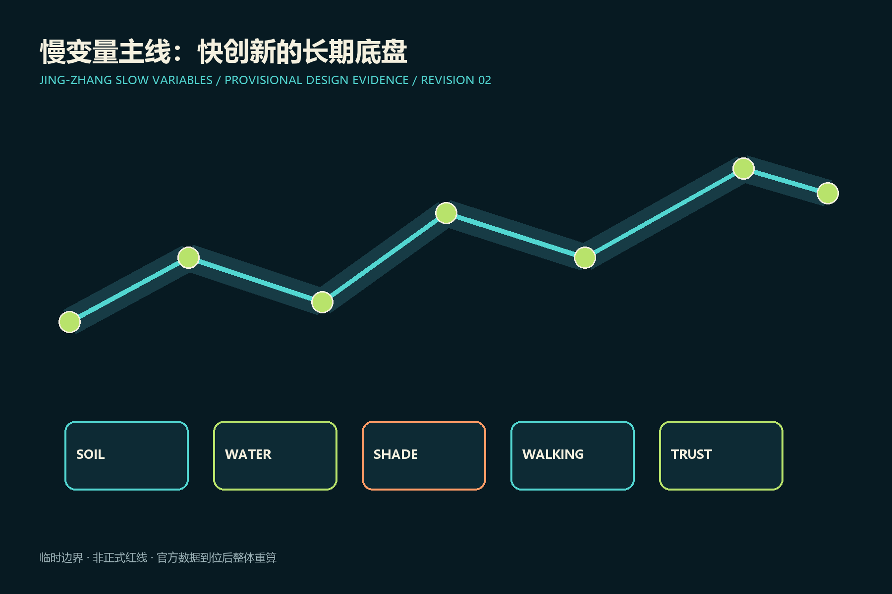
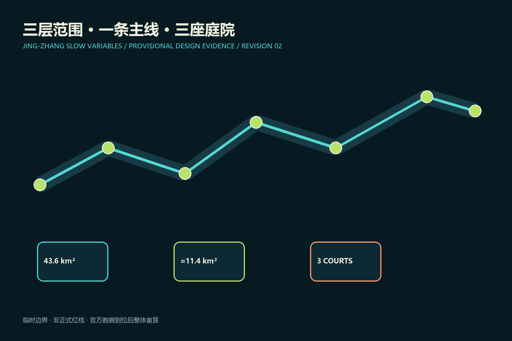
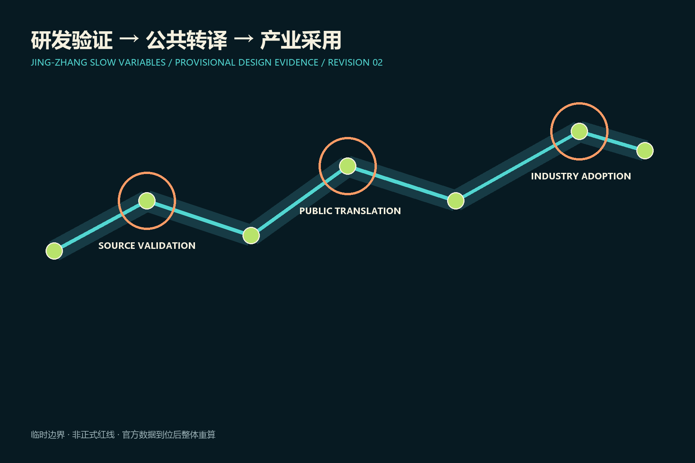
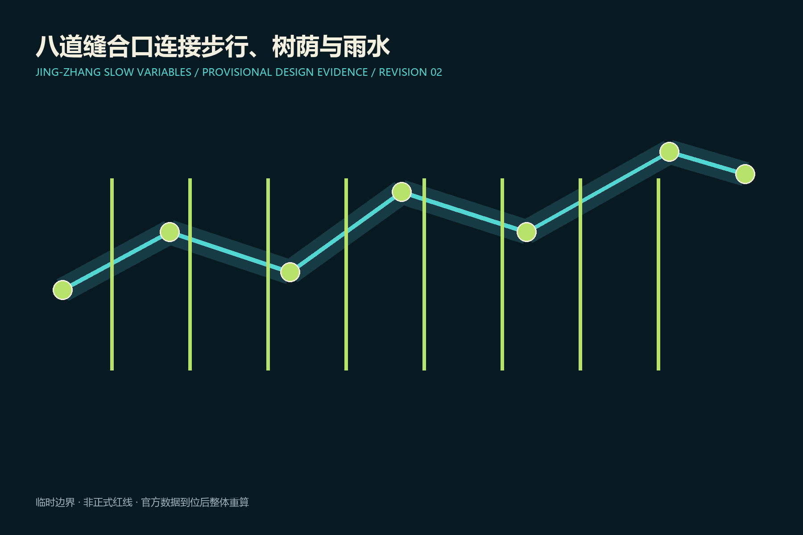
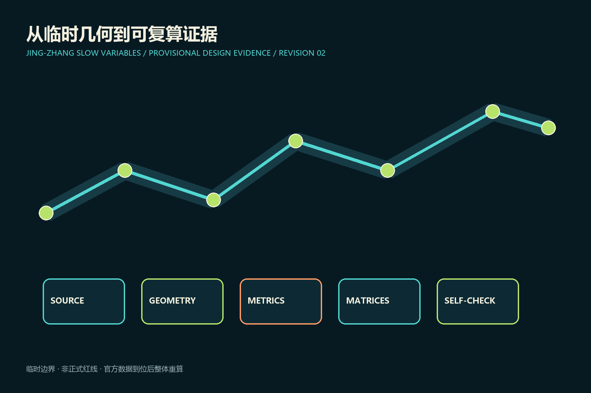

# 京张慢变量 / JING-ZHANG SLOW VARIABLES

## 设计依据与资料清单

方案依据公开公告、智能体任务书、场地包和来源登记表。当前场地与三处重点区均为维护者提供的临时粗略几何，只用于概念生成、复算和讨论，不是正式红线；官方多边形到位后必须整体重算。 [source:OFFICIAL-ANNOUNCEMENT] [source:SOURCE-REGISTRY] [data:geometry/site_boundary.geojson#SITE-001]

本节的空间判断将通过提交包中的几何、指标与矩阵交叉复核。设计动作优先采用可逆、可维护和可由人工接管的方式，并把公共利益、无障碍与遗产连续性作为取舍条件。由于正式边界、控规条件、产权、交通、市政容量和现状实测尚未完整公开，本节涉及强度、面积、工程和实施时序的内容均为概念建议；专业团队取得正式资料后，应核对源文件、重算相关指标、复核图面并记录变更，不得把临时结果直接用于审批或建设。

## 三层范围工作框架

43.6平方公里统筹研究层负责创新生态，约11.4平方公里总体设计层组织遗址公园两侧更新，三处临时重点区承接详细验证。“慢变量账本”为每个项目登记公共收益、责任人、复核日和退出条件。 [standard:PROJECT-OFFICIAL-ANNOUNCEMENT] [depth:three_level_scope_framework] [metric:site_area_sqm]

本节的空间判断将通过提交包中的几何、指标与矩阵交叉复核。设计动作优先采用可逆、可维护和可由人工接管的方式，并把公共利益、无障碍与遗产连续性作为取舍条件。由于正式边界、控规条件、产权、交通、市政容量和现状实测尚未完整公开，本节涉及强度、面积、工程和实施时序的内容均为概念建议；专业团队取得正式资料后，应核对源文件、重算相关指标、复核图面并记录变更，不得把临时结果直接用于审批或建设。

## 统筹研究范围产业与未来城市研究

品牌“京张慢变量”以双轨与五个年轮点代表土壤、雨水、树荫、步行和信任。三项定位是可验证AI城市客厅、研发到采用的开源试验带、以长期公共价值校准技术速度的百年新线；五项功能是研发、验证、转译、采用和全球社区。七类生态案例覆盖自主模型、具身智能、医疗辅助、教育沙盒、低碳算力、遗产解释和中小企业服务，均为概念参考而非招商承诺。 [source:AGENT-TASKBOOK] [standard:PROJECT-AGENT-OPEN-CALL-TASKBOOK] [depth:industry_strategy]

本节的空间判断将通过提交包中的几何、指标与矩阵交叉复核。设计动作优先采用可逆、可维护和可由人工接管的方式，并把公共利益、无障碍与遗产连续性作为取舍条件。由于正式边界、控规条件、产权、交通、市政容量和现状实测尚未完整公开，本节涉及强度、面积、工程和实施时序的内容均为概念建议；专业团队取得正式资料后，应核对源文件、重算相关指标、复核图面并记录变更，不得把临时结果直接用于审批或建设。

## 总体设计范围城市更新与控规深度城市设计

总体结构为“一条慢变量主线、三座验证庭院、八道东西缝合口、两翼协作网”。用地术语沿用登记的国家分类；建筑采取保留优先、适应性改造、小体量补缺、条件触发新建。高度、容积率、退线和拆除结论因缺少正式条件保持待确认。 [standard:MNR-LAND-USE-CLASSIFICATION-GUIDE] [data:geometry/land_use.geojson#LU-001] [depth:land_use_layout]

本节的空间判断将通过提交包中的几何、指标与矩阵交叉复核。设计动作优先采用可逆、可维护和可由人工接管的方式，并把公共利益、无障碍与遗产连续性作为取舍条件。由于正式边界、控规条件、产权、交通、市政容量和现状实测尚未完整公开，本节涉及强度、面积、工程和实施时序的内容均为概念建议；专业团队取得正式资料后，应核对源文件、重算相关指标、复核图面并记录变更，不得把临时结果直接用于审批或建设。

## 重点区域详细设计

众智园是“源头验证庭院”，设置遮荫研发街、开放基准大厅与低速测试环；AI原点社区是“公共转译庭院”，缝合校区、园区和社区并配置市民复核台；大钟寺是“产业采用庭院”，以站城步行环、可变首层和企业验证厅承接采用。 [data:geometry/key_areas.geojson#PROV-KEY-001] [data:geometry/key_areas.geojson#PROV-KEY-002] [data:geometry/key_areas.geojson#PROV-KEY-003]

本节的空间判断将通过提交包中的几何、指标与矩阵交叉复核。设计动作优先采用可逆、可维护和可由人工接管的方式，并把公共利益、无障碍与遗产连续性作为取舍条件。由于正式边界、控规条件、产权、交通、市政容量和现状实测尚未完整公开，本节涉及强度、面积、工程和实施时序的内容均为概念建议；专业团队取得正式资料后，应核对源文件、重算相关指标、复核图面并记录变更，不得把临时结果直接用于审批或建设。

## AI 创新生态、人才画像与 AI+ 场景

五类人物为研究创业者、居民与老人、儿童与照护者、中小企业用户、无障碍访客。12个场景是树荫导航、雨洪预警、无障碍伴行、人工服务台、低速机器人、偏差公开课、开源发布、家庭托育、中小企业试用、遗产导览、夜间安全、全球开发者季。三个行业验证场分别检验具身智能安全停机、公共服务人工兜底、企业智能体可撤销授权。 [standard:BARRIER-FREE-ENVIRONMENT-LAW] [standard:GENERATIVE-AI-INTERIM-MEASURES] [depth:ai_scenarios]

本节的空间判断将通过提交包中的几何、指标与矩阵交叉复核。设计动作优先采用可逆、可维护和可由人工接管的方式，并把公共利益、无障碍与遗产连续性作为取舍条件。由于正式边界、控规条件、产权、交通、市政容量和现状实测尚未完整公开，本节涉及强度、面积、工程和实施时序的内容均为概念建议；专业团队取得正式资料后，应核对源文件、重算相关指标、复核图面并记录变更，不得把临时结果直接用于审批或建设。

## 用地、建筑规模与拆改留方案

保留成熟社区和可再利用产业建筑；改造优先导入公共首层、共享实验室与生活服务；拆除和新建须经产权、结构、历史价值与正式控规核验，本方案不作地块级拆迁判断。 [data:geometry/buildings.geojson#BLDG-001] [depth:building_retain_renovate_demolish_new]

本节的空间判断将通过提交包中的几何、指标与矩阵交叉复核。设计动作优先采用可逆、可维护和可由人工接管的方式，并把公共利益、无障碍与遗产连续性作为取舍条件。由于正式边界、控规条件、产权、交通、市政容量和现状实测尚未完整公开，本节涉及强度、面积、工程和实施时序的内容均为概念建议；专业团队取得正式资料后，应核对源文件、重算相关指标、复核图面并记录变更，不得把临时结果直接用于审批或建设。

## 交通、轨道、市政与公共服务设施

遗址公园慢行主线、八处概念缝合口、三处站城步行环和低速测试支线组成交通网络。市政建议包括雨水花园、可维护监测与低碳边缘算力，容量、管位和工程可行性待专项核验。 [data:geometry/roads.geojson#ROAD-001] [depth:transport_rail_parking] [depth:municipal_infrastructure]

本节的空间判断将通过提交包中的几何、指标与矩阵交叉复核。设计动作优先采用可逆、可维护和可由人工接管的方式，并把公共利益、无障碍与遗产连续性作为取舍条件。由于正式边界、控规条件、产权、交通、市政容量和现状实测尚未完整公开，本节涉及强度、面积、工程和实施时序的内容均为概念建议；专业团队取得正式资料后，应核对源文件、重算相关指标、复核图面并记录变更，不得把临时结果直接用于审批或建设。

## 蓝绿空间、公共空间与城市风貌

新增AI试点不得降低连续树荫、海绵滞蓄和无障碍通行能力。公共空间采用铁路构件比例、耐久材料和可替换数字设施，传感器不得遮挡遗产视廊或制造强制交互。 [data:geometry/green_space.geojson#GREEN-001] [data:geometry/public_space.geojson#PUBLIC-001] [metric:green_ratio]

本节的空间判断将通过提交包中的几何、指标与矩阵交叉复核。设计动作优先采用可逆、可维护和可由人工接管的方式，并把公共利益、无障碍与遗产连续性作为取舍条件。由于正式边界、控规条件、产权、交通、市政容量和现状实测尚未完整公开，本节涉及强度、面积、工程和实施时序的内容均为概念建议；专业团队取得正式资料后，应核对源文件、重算相关指标、复核图面并记录变更，不得把临时结果直接用于审批或建设。

## 更新项目清单、实施政策与分期计划

六个概念项目为主线示范段、三座验证庭院、八道缝合口安全改善和公开账本。近期做可逆标线、遮荫与开放测试；中期做站城接口和适应性改造；远期待官方边界与控规后决定强度。每个试点12个月复核，不达公共收益或风险过高即缩减退出。 [data:geometry/phasing.geojson#PHASE-001] [depth:renewal_project_list] [depth:phasing_implementation]

本节的空间判断将通过提交包中的几何、指标与矩阵交叉复核。设计动作优先采用可逆、可维护和可由人工接管的方式，并把公共利益、无障碍与遗产连续性作为取舍条件。由于正式边界、控规条件、产权、交通、市政容量和现状实测尚未完整公开，本节涉及强度、面积、工程和实施时序的内容均为概念建议；专业团队取得正式资料后，应核对源文件、重算相关指标、复核图面并记录变更，不得把临时结果直接用于审批或建设。

## 指标体系、面积复算与合规矩阵

场地面积、绿地率、公共空间率、建筑基底面积和重点区数量均从GeoJSON在EPSG:4548下复算；容积率保持待数据补齐。树荫连续性、雨水滞蓄、无障碍绕行、人工接管时间和试验退出率需后续实测建基线，不虚构数值。 [metric:site_area_sqm] [metric:public_space_ratio] [depth:metrics_recalculation]

本节的空间判断将通过提交包中的几何、指标与矩阵交叉复核。设计动作优先采用可逆、可维护和可由人工接管的方式，并把公共利益、无障碍与遗产连续性作为取舍条件。由于正式边界、控规条件、产权、交通、市政容量和现状实测尚未完整公开，本节涉及强度、面积、工程和实施时序的内容均为概念建议；专业团队取得正式资料后，应核对源文件、重算相关指标、复核图面并记录变更，不得把临时结果直接用于审批或建设。

## 风险、版权与合规说明

主要风险是把临时几何误读为红线、把概念项目误读为政府承诺、把算法输出误读为专业结论。所有成果持续标注临时状态、人工责任与停止条件；官方资料更新后重算全包。四个文化节点为詹天佑工程精神馆、失败可见墙、开源贡献者年轮台、全球AI公共价值论坛站。 [source:BOUNDARY-SOURCE] [depth:risk_missing_data] [standard:MOHURD-URBAN-DESIGN-MEASURES]

本节的空间判断将通过提交包中的几何、指标与矩阵交叉复核。设计动作优先采用可逆、可维护和可由人工接管的方式，并把公共利益、无障碍与遗产连续性作为取舍条件。由于正式边界、控规条件、产权、交通、市政容量和现状实测尚未完整公开，本节涉及强度、面积、工程和实施时序的内容均为概念建议；专业团队取得正式资料后，应核对源文件、重算相关指标、复核图面并记录变更，不得把临时结果直接用于审批或建设。

## 参考资料

完整来源、许可与限制见sources.json；专业、任务和深度响应见三个矩阵文件。 [source:SITE-PACKAGE] [source:PROCESSED-FACT-PACK]

本节的空间判断将通过提交包中的几何、指标与矩阵交叉复核。设计动作优先采用可逆、可维护和可由人工接管的方式，并把公共利益、无障碍与遗产连续性作为取舍条件。由于正式边界、控规条件、产权、交通、市政容量和现状实测尚未完整公开，本节涉及强度、面积、工程和实施时序的内容均为概念建议；专业团队取得正式资料后，应核对源文件、重算相关指标、复核图面并记录变更，不得把临时结果直接用于审批或建设。

