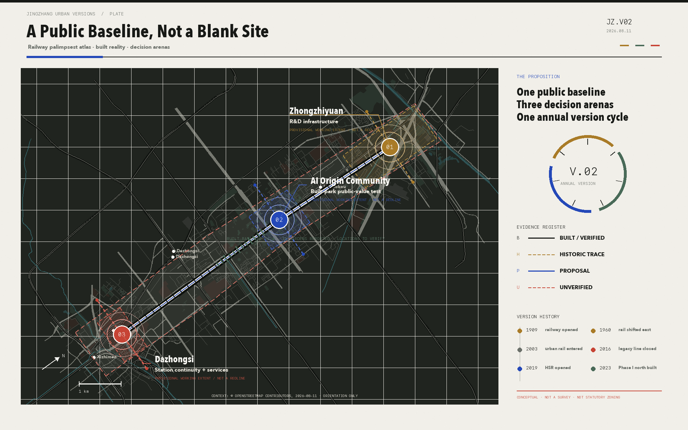
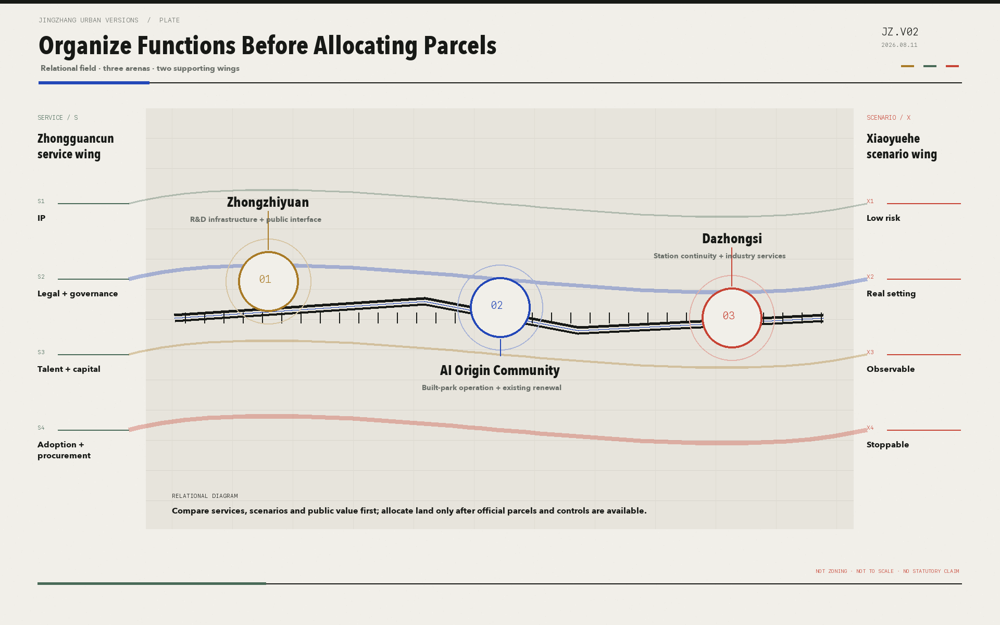
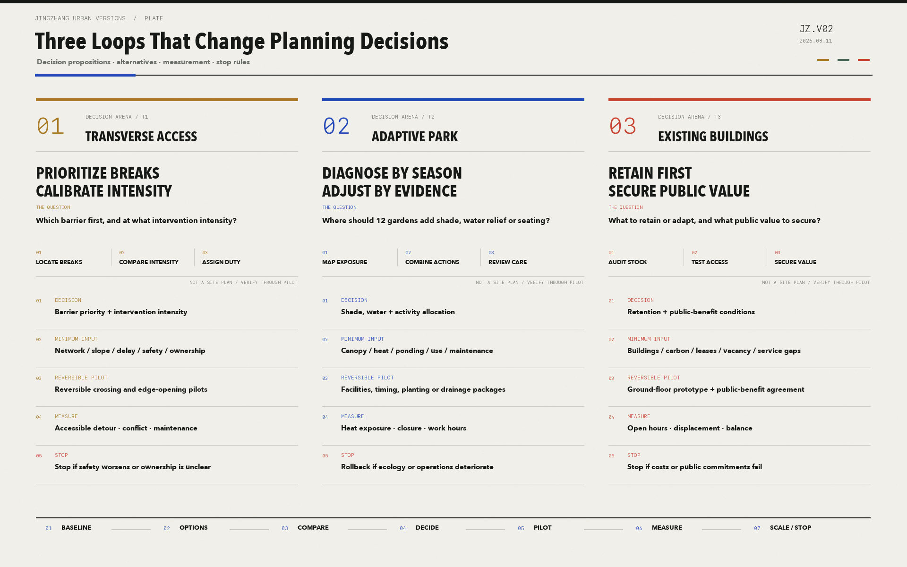
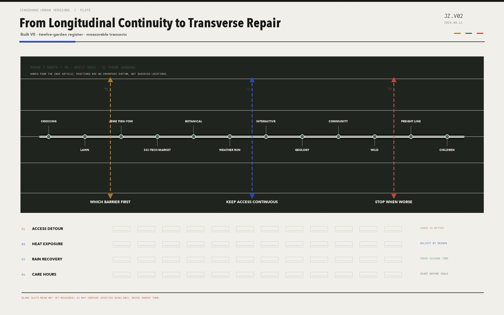
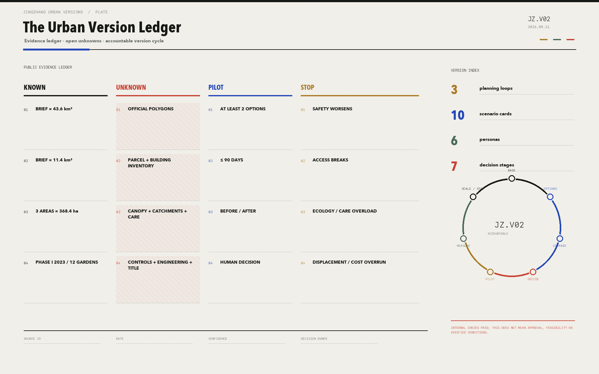

# Jing-Zhang City Version

## Design Basis and Source List

This proposal does not address a green corridor waiting to be designed from scratch. Published literature records that the Jing-Zhang High-Speed Railway runs in an underground tunnel for approximately 6.4 km between Xueyuan South Road and the North Fifth Ring Road, creating conditions to reorganize surface space along the corridor; Phase I covered the stretch from Zhichun Road to Qinghua East Road, was designed from 2020 to 2022, and was completed in 2023, with 12 themed gardens formed in its northern section. The literature describes the removal of barriers beneath the viaduct, recovery of parking space, provision of an all-weather running route, a science-and-innovation market, restoration of rail segments, and reuse of railway materials as completed practices, not aspirations of this proposal. [source:PHASE1-NORTH-2025] [metric:built_phase1_garden_count]

The six sets of international open-call proposals from around 2020 provide methodological historical material. They repeatedly identified transverse barriers created by the railway, Line 13, roads, and compound edges, and demonstrated working methods such as "framework - sequence - node" and "masterplan - section - operation." This proposal adopts only the problem types and methods of reasoning. It does not copy their naming, spatial composition, bridge forms, renderings, icons, quantities, or contemporary-condition judgements; third-party images and PDFs are not included in the submission package. [source:JZ-COMPETITION-2020]

The formal basis remains the project announcement, the taskbook for agents, the repository source registry, and local standard snapshots. The announcement identifies an approximately 43.6 km2 Coordinated Research Area, an approximately 11.4 km2 Overall Design Area, and three Key-Area Detailed Design Areas totalling approximately 368.4 ha, but does not provide precise polygons, parcels, buildings, ownership information, or Regulatory Detailed Planning conditions that could support statutory judgement. [source:OFFICIAL-ANNOUNCEMENT] [source:SOURCE-REGISTRY]

Accordingly, this iteration consistently distinguishes four categories of information: **verified facts**, **historical proposal leads**, **conceptual recommendations in this proposal**, and **items pending formal information**. The provisional boundaries supplied in the repository serve only as relationship diagrams and machine checks, not as planning boundaries, parcels, or a basis for precise area figures. The layers in this iteration express only investigation subjects, relationships, and future recalculation tasks; they do not establish statutory conclusions about land use, buildings, or phasing. [data:geometry/site_boundary.geojson#SITE-001] [depth:existing_conditions_diagnosis]

## Three-Level Scope Framework

The three levels of scope correspond to three types of research scale, deliverable depth, and implementation threshold.

| Scope | Question addressed in this iteration | Outputs | Explicitly not undertaken |
| --- | --- | --- | --- |
| Coordinated Research Area, approximately 43.6 km2 in the announcement | How Haidian's research, talent, computing capacity, capital, services, and urban issues can form a collaborative loop | Innovation-ecology relationships, international mechanism comparisons, and the Three Zones and Two Wings mechanism | Enterprise lists, investment amounts, or output commitments |
| Overall Design Area, approximately 11.4 km2 in the announcement | How Jing-Zhang heritage, parks, rail, neighbourhoods, and industrial space can share one public baseline | Issue register, connection priorities, and a blue-green and public-service framework | Statutory land use, FAR, height, or road redlines |
| Three Key-Area Detailed Design Areas, approximately 368.4 ha in total in the announcement | How task-based detailed design can define spatial issues, project prototypes, and preconditions for implementation | Three decision loops, project cards, selected reversible pilots, and stop conditions | Specific demolish-renovate-retain decisions, bridges or tunnels, or engineering-feasibility conclusions |

The three provisional polygons for Zhongzhiyuan, the Beijing AI Origin Community, and Dazhongsi serve only to locate the tasks. Once official polygons are available, the scope should be replaced as a whole and existing-condition surveys, road-network analysis, land-use zoning, and all area calculations should be redone, rather than refining the provisional rectangles. [data:geometry/key_areas.geojson#PROV-KEY-001] [metric:brief_key_area_total_ha] [depth:three_level_scope_framework]

## Industry and Future-City Research for the Coordinated Research Area

### Core Proposition: City Version, Not a Smart Showcase

Railways once reorganized regional relationships through gauge, timetables, signals, and engineering accountability. A century later, the AI Innovation Belt should not demonstrate advancement through more sensors and screens. It should organize renewal through a unified **evidence baseline, option comparison, and post-evaluation**. The Jing-Zhang Railway Heritage Park and its completed spaces constitute the public baseline; the three key areas support three types of decision test; and every spatial intervention creates a City Version record that can be queried, challenged, and rolled back.

The spatial and governance structure is condensed into "**one public baseline, three decision testbeds, and one annual versioning mechanism**." The public baseline registers heritage, completed projects, walking and cycling and accessibility, trees and stormwater, services, management, and periods of use. The three testbeds respectively address research infrastructure, the mix of research, education, and daily life, and station-city and industrial services. The annual version updates issue priorities, option selection, funding preconditions, implementation results, and stop records, rather than only promotional renderings. [standard:PROJECT-AGENT-OPEN-CALL-TASKBOOK] [depth:overall_spatial_structure]

"AI-led" does not mean that algorithms obtain planning authority. AI's role is to enlarge the search for alternatives, reveal multi-objective conflicts and sensitivities, and bring changes before and after implementation into the next round of option comparison and retest records. Statutory procedures, value judgements, and public-interest trade-offs remain the responsibility of accountable authorities, professional teams, and the public.

### Three Strategic Positions, Five Functions, and Three Zones and Two Wings

The three strategic positions proposed in the taskbook are translated into three assessable tasks. The Centennial Jing-Zhang Cultural Belt establishes a verifiable heritage register; the Urban AI Life Experience Belt evaluates technologies through accessibility, thermal comfort, and public-service evaluation; and the AI Integrated Innovation Belt connects research, pilot-scale testing, governance, procurement, and urban problems into a validation chain. The five functions correspondingly become basic research and engineering, innovation-ecosystem collaboration, public scenario validation, urban-operations improvement, and trustworthy governance and international dialogue.

The three zones form a continuous validation chain: **Zhongzhiyuan validates models and infrastructure, the Beijing AI Origin Community validates the public value of technology, and Dazhongsi validates the actual use of services**. The Zhongguancun Technology Services Wing provides intellectual-property, legal, talent, capital, and translation services. The Xiaoyue River Scenario Enablement Wing provides low-risk, observable, and stoppable urban trials. The two wings are not new corridors, but cross-area service agreements and scenario-access mechanisms. [source:AGENT-TASKBOOK]

### Mechanism Comparison of Six International Institutions and Projects

| Case | Transferable mechanism | Choice for Jing-Zhang |
| --- | --- | --- |
| Vector Institute, Toronto | An independent nonprofit links research, talent, enterprise adoption, and the public sector | Learn from the "neutral connector"; do not assume research spaces should be open as visitor attractions [source:VECTOR-INSTITUTE] |
| Mila, Montreal | A university alliance combines open science, talent development, entrepreneurship, and public policy | Connect academia and the city through public issues; do not copy the campus brand [source:MILA] |
| Alan Turing Institute, United Kingdom | An interdisciplinary national research institution undertakes research, skills, and public discussion together | Put ethics and social science first; do not substitute a single technical metric for public judgement [source:TURING-INSTITUTE] |
| AI Singapore 100 Experiments | Move from a real problem to a time-limited prototype before deciding whether to extend it | Use "problem - prototype - review"; do not transplant its funding amounts or organizational commitments [source:AI-SINGAPORE-100E] |
| Seoul AI Hub | An urban-operational platform for incubation, talent, R&D facilities, and open innovation | Learn staged enterprise services; do not invent recruitment claims or enterprise lists [source:SEOUL-AI-HUB] |
| AI Verify Foundation, Singapore | Turn trustworthy-AI principles into tools that can be tested and improved together | Set up test records for urban pilots; passing a tool test is not equivalent to legal compliance [source:AI-VERIFY] |

The visual system takes historical rails and public verification as its cues. Boards and webpages use restrained distinctions for facts, models, environmental conditions, and stop states, avoiding a corporate-style technology blue and railway, corporate, or institutional trademarks. The version number follows the form "JZ.VYYYY.NN"; graphics serve only as an identity direction for this proposal.

## Urban Renewal and Regulatory-Detailed-Planning-Depth Urban Design for the Overall Design Area

This iteration changes overall design from "drawing a finished state" to establishing a project decision framework that can determine project sequence and intensity. Its spatial framework has three parts: the longitudinal Jing-Zhang public baseline, transverse repair of urban connections, and distributed public-service and knowledge nodes. The longitudinal structure first respects completed parks and verified heritage. The transverse structure compares roads, rail, walls, and entrances point by point. A node enters the project register only when existing demand, a responsible managing entity, and all-day accessibility have been established. [data:geometry/roads.geojson#ROAD-BASELINE-01] [standard:MOHURD-URBAN-DESIGN-MEASURES]

### AI Planning Loop 1: Prioritizing Horizontal Barriers and Accessible Connections

The **decision to change** is "which break in the network to address first, and at what intensity," not an algorithm's automatic selection of a bridge type. Inputs include verified roads, rail, entrances, walls, ownership, and gradients; measured travel times for wheelchair users, pedestrians, cyclists, and people pushing prams; crossing wait times, crashes, and complaints; and authorized aggregated footfall data. Under safety, accessibility, heritage-disturbance, cost, and maintenance constraints, AI generates at least two options from ground-level improvements, interface opening, under-viaduct improvement, underpasses, and grade-separated crossings, and explains the sensitivity of results to weights and missing data.

Transport, rail, landscape, planning and natural-resources authorities, ownership entities, and disabled users review the options together. Reversible actions such as markings, signals, ramps, lighting, opening barriers, and wayfinding are tested first. Retesting uses accessible detour time for typical users during periods of high demand, crossing wait time, conflict incidents, all-day availability, and maintenance labor hours, while recording samples, construction status, and measurement conditions. The pilot is suspended if safety worsens, the accessible chain is broken, or management responsibility has not been secured. [data:geometry/roads.geojson#ROAD-CROSSING-01] [standard:BARRIER-FREE-ENVIRONMENT-LAW]

### AI Planning Loop 2: Thermal Comfort, Stormwater, and Activity Reconfiguration in the Completed Park

This round must determine where, among the 12 themed gardens in the northern section of Phase I documented in the cited literature, to prioritize adding shade, adjusting water and seating, changing operating times, or reducing facilities. Trees and canopy cover, hourly thermal conditions, ponding and drainage records, cross-season manual observations, activity calendars, repair reports, and maintenance labor hours form the inputs after field investigation; facial recognition and individual trajectories are not assumed. AI compares three combinations: lightweight facility adjustments, planting and soil improvements, and localized drainage retrofits, while showing heat exposure, use by different groups, ecological disturbance, and maintenance cost.

Landscape, water-management, operations staff, and nearby residents select the pilot together. Movable shade, seating, and time adjustments come first; planting and drainage enter professional design only after cross-season validation. Heat-exposure duration, effective shaded seats, post-rain closure duration, diversity of use, repair frequency, and weekly maintenance labor hours form the retest indicators. The intervention is rolled back if it obstructs accessible movement, increases ecological harm, or exceeds maintenance capacity. [data:geometry/green_space.geojson#GREEN-REVIEW-01] [source:PHASE1-NORTH-2025]

### AI Planning Loop 3: Existing-Building Renewal and Public-Value Allocation

This round must determine which buildings to retain or renovate, which ground floors should accommodate research translation, and which spaces should secure community services. Once a formal building register, structural and fire-safety data, ownership and leases, vacancy rate, energy use, whole-life carbon, accessibility, industrial demand, public-service gaps, and potential displacement impacts are in place, AI generates in parallel three combinations: existing-building low-carbon priority, innovation-capacity priority, and public-service priority. It does not output a single opaque optimum.

Responsible authorities, owners, parks or universities, operators, and communities make the trade-offs openly. Opening hours, shared area, pricing, and maintenance responsibility are conditions for project admission and must be specified in legally determined project agreements or management documents. One existing ground floor or interface is renovated first and retested through utilization, avoided embodied carbon, public opening hours, service coverage, rent and displacement risk, and operating revenue and expenditure. Expansion stops if displacement is evident, cost runs out of control, or public commitments cannot be fulfilled. [data:geometry/buildings.geojson#BLDG-AUDIT-01] [depth:retain_renovate_demolish]

The three loops share a seven-step method: **register the baseline - generate alternatives - compare publicly - make an accountable determination - run a reversible pilot - retest performance - extend or stop**. This forms the proposal's AI-supported collaborative planning method: algorithms support option generation and retesting, while accountable determinations remain with statutory procedures and human actors. [metric:decision_stage_count]

## Key-Area Detailed Design

Precise key-area boundaries are still unavailable. This section sets out task-based detailed design and must not be interpreted as a parcel plan. [data:geometry/key_areas.geojson#PROV-KEY-002] [depth:three_key_area_detailed_design]

| Key area | Core issue and role | Spatial action | First version and stop condition |
| --- | --- | --- | --- |
| Zhongzhiyuan AI Independent Innovation Acceleration Area | Research infrastructure needs a visible interface with public interest in the city | Organize research, pilot-scale testing, standards, safety evaluation, and shared services as a controlled openness gradient across three interfaces: appointment-based, semi-open, and public; at the park edge, prioritize appointment-based access, a service front desk, and continuous walking rather than landscaped perimeter fencing | Establish a pilot public interface for research and development; do not expand access if safety, intellectual property, or operations responsibility cannot be secured [data:geometry/key_areas.geojson#PROV-KEY-001] |
| Beijing AI Origin Community | Universities, research, communities, and the completed park are adjacent, but technical translation may become disconnected from daily life | Use the 12 themed gardens in the northern section of Phase I documented in 2025 literature as the baseline of urban life, adding interpretation of outcomes, community issues, thermal comfort, and accessibility retesting; prioritize existing ground floors over new landmarks | Test a "park operations version"; return to non-digital processes if data is unnecessary, the experience is inequitable, or the maintenance burden rises [data:geometry/public_space.geojson#PUBLIC-PILOT-02] |
| Dazhongsi AI Industry Cluster | Stations, commerce, enterprise services, and community use must jointly determine public benefit | Prioritize continuous station-to-street accessibility, accessible ground floors, public services, and activity capacity; enterprise display must not occupy basic circulation or free places to stay | Test a "station-city service version"; suspend it if pedestrian conflict, displacement, or commercial data entering public decision-making occurs [data:geometry/key_areas.geojson#PROV-KEY-003] |

The three areas are not three styles. Under one method, they respectively address the public interface of research and development, operations of the completed park, and station-city services. The Zhongguancun Wing connects legal, intellectual-property, talent, capital, and procurement capacity to the three key areas. The Xiaoyue River Wing brings scenarios that have passed access review into real settings and maintains exit records.

## AI Innovation Ecosystem, User Profiles, and AI-Enabled Scenarios

### Six User Groups Are Not "Traffic Labels"

| User group | Essential needs | Non-negotiable planning safeguard |
| --- | --- | --- |
| Researchers and engineers | Trustworthy testing, collaboration, publication, and rapid review | Public settings must not become sites of data collection without consent |
| Start-ups and small and medium-sized enterprises | Accessible computing capacity, legal support, procurement, and real problems | Public resources must not be exchanged for designated suppliers or enterprise-recruitment promises |
| Everyday park users | Shade, seating, running, family use, and night-time safety | Basic services must not depend on an app or identity recognition |
| Older people, disabled people, and carers | Continuous accessibility, on-site guidance, and human assistance | An "average optimum" must not sacrifice a minority's complete route |
| Small businesses and front-line operations staff | Predictable events, loading, repair reporting, and maintenance labor hours | Algorithmic recommendations must not become unappealable penalties or burdens |
| Planning managers and professional teams | Traceable evidence, comparison of alternatives, responsibility, and budgets | A model must not replace statutory procedure or professional sign-off |

### Ten Scenario Cards

| ID / scenario | Urban decision to change | Minimum data and AI role | Spatial or operational output | Human determination and stop rule |
| --- | --- | --- | --- | --- |
| T1 Cross-connection baseline test | Priority of breaks and intervention intensity | Measured accessible travel time, crashes, and ownership; generate multiple network options across modes | Reversible crossing, ramp, and opening-hours options | Multi-agency and disabled-user review; stop if safety worsens |
| T2 Park adaptive operations test | Priorities for shade, water adjustment, and activities in the 12 gardens | Canopy, heat, ponding, use, and maintenance; compare three combinations | Movable facilities, operating times, and planting, soil, or drainage tasks | Landscape, water-management, and resident determination; roll back if ecology or maintenance is overloaded |
| T3 Existing-building renewal public-value test | Retention and renovation, and public-service allocation | Formal buildings, carbon, vacancy, leases, and service gaps; generate three combinations | Ground-floor prototype and public-benefit arrangement | Owner, professional, and community determination; stop for displacement or runaway cost |
| S4 Heritage evidence assistant | Which narratives may be displayed publicly | Archives, heritage protection, and field verification; search conflicts and mark confidence | Bilingual interpretation, sources, and tags pending verification | Heritage and historical review; do not publish when sources conflict |
| S5 Tree and post-rain recovery triage | Where to address heat exposure or ponding first | Trees, soils, rainfall, and repair reports; recommend maintenance priority only | Field work orders and retest points | Landscape and water-management authorization; no automatic control of engineering equipment |
| S6 Station-to-street accessibility assistance | Which route is genuinely continuous | Official entrances, construction status, and manual accessibility checks | Static wayfinding, human assistance, and digital prompts in parallel | On-site staff verification; take information offline when it expires |
| S7 Equal access to public services | Whether digital services create a new barrier | Service directory, wait time, and human counters; do not collect unnecessary identity data | Equal entry through in-person counters, telephone, paper, and digital routes | Service provider responsibility; suspend digital expansion if the non-digital route fails |
| S8 Activity capacity and quiet periods | When and where activities should be accommodated | Activity calendars, noise, vegetation recovery, and manual observation | Time and area zoning with days without activities retained | Park operation and community review; reduce activity if complaints or ecological pressure exceed limits |
| S9 Open validation of urban scenarios | Which AI can enter a public pilot | Problem statement, model card, data permissions, and test plan | A sandbox of no more than 90 days and public results | Independent technical, ethics, and operations review; do not start without a clear exit plan |
| S10 Annual City Version audit | Whether a project should continue, adjust, or exit | Baselines, costs, benefits, complaints, and failure records for each pilot | Annual City Version ledger, project ranking, and stop list | Public hearing and confirmation by responsible authorities; no automatic renewal |

All ten cards specify their subject, data minimization, model role, physical outcome, responsible party, and stop condition. T1-T3 are priority tests in which industrial capacity and urban decision-making are examined together. [metric:scenario_card_count] [standard:GENERATIVE-AI-INTERIM-MEASURES]

## Land Use, Building Scale, and Demolish-Renovate-Retain Strategy

Where formal parcels, existing-building information, and Regulatory Detailed Planning conditions are absent, giving precise land-use classes and building quantities is not "further development"; it creates false precision. In this iteration, "land_use.geojson" does not establish statutory land-use allocation. It only records investigation subjects, functional relationships, and future recalculation tasks in a machine-readable layer. The functional-relationship diagram only expresses relationships among research, translation, urban application, and the public baseline. [data:geometry/land_use.geojson#LU-BASE-01] [standard:MNR-LAND-USE-CLASSIFICATION-GUIDE]

The building layer places no fictitious building blocks. It marks several existing-building anchors for survey, selected through rules for investigating heritage, public services, accessibility, renewal pressure, and related conditions. Once formal information is available, each building must sequentially be assessed for authenticity and ownership, structural and fire safety, use and vacancy, heritage value, carbon and energy, public services, leases, and displacement risk before entering a multi-option comparison of retention, repair, functional conversion, limited addition, or renewal. [data:geometry/buildings.geojson#BLDG-AUDIT-02] [depth:land_use_layout]

Building area, green ratio, public-space ratio, Floor Area Ratio, height, density, and parking provision are all recorded as pending. The text does not quote provisional polygon calculations to decimal places. Only once official parcels, current surveys, and specialist conditions are in place can they be recalculated with consistent coordinates, topology, and methods. [metric:building_footprint_area_sqm] [metric:floor_area_ratio] [depth:development_intensity_controls]

## Transport, Rail, Municipal Infrastructure, and Public Service Facilities

Transport judgement shifts from "drawing one continuous greenway" to "repairing transverse breaks one by one." Longitudinally, the Jing-Zhang heritage and completed park form the public baseline. Transversely, every road, rail corridor, wall, waterway, and station receives a comparison table of "barrier object - affected groups - possible actions - safety and accessibility - ownership - cost - maintenance - approval." Ground-level improvements and interface opening take priority over capital-intensive structures. Bridges, underpasses, and rail-related works first require lists for option comparison, clearance, accessibility, fire safety, ownership, and maintenance; they are determined after specialist study, and this iteration does not presuppose an engineering solution. [data:geometry/roads.geojson#ROAD-CROSSING-02] [depth:traffic_rail_slow_parking]

Municipal and new infrastructure follow a "public service before equipment procurement" approach. Lighting, drinking water, sanitation, rest, accessibility, drainage, and maintenance are the foundational services. Communications, edge computing, environmental sensing, and digital signage enter pilots only where data is necessary, energy use is manageable, responsibility is clear, and a human alternative is possible. Sensors must not be the reason for a project to exist; equipment life and maintenance budgets must enter whole-life assessment. [data:geometry/constraints.geojson#CONSTRAINT-REGISTER-01] [depth:municipal_new_infrastructure]

For older people and disabled people, this proposal actively adopts on-site guidance, human assistance, and non-digital alternatives as service principles. Functions involving highly sensitive public services require separate verification against applicable law, data-security requirements, and sectoral standards. [standard:ELDERLY-SMART-TECH-PLAN-2020-45] [standard:BARRIER-FREE-ENVIRONMENT-LAW]

## Blue-Green Space, Public Space, and Urban Character

The northern section of Phase I has already demonstrated that railway remnants, space beneath the viaduct, running, community activity, planting, geology, and children's use can coexist. The next round does not aim to create more themed gardens. It focuses instead on **cross-season operational quality**: canopy cover and heat exposure, post-rain recovery, continuous accessibility, time spent by different groups, active and quiet periods, repair reporting, and maintenance labor hours jointly determine whether additions should be made. Blue-green facilities must state where water comes from, how it overflows, and who maintains them; they cannot carry the color of "ecology" only in renderings. [data:geometry/green_space.geojson#GREEN-REVIEW-02] [depth:blue_green_public_space]

This proposal translates the taskbook's "AI pilgrimage landmark" into three low-material-input **public knowledge nodes**, avoiding another symbolic large-volume structure:

1. **Engineering Evidence Platform**: at a heritage-facing public interface confirmed by the professional team, display archival sources, engineering judgements, and disputes pending verification; do not use generated content to rewrite history.
2. **Open Model Benchmark Station**: at the conceptual public interface of the Beijing AI Origin Community, disclose model cards, test conditions, failures, and human determinations.
3. **City Version Deliberation Platform**: at the conceptual service interface of Dazhongsi, display project alternatives, funding preconditions, public comments, annual retesting, and the stop list.

The three nodes share a public record format: contributor, issue, method, data permission, version, limitation, reviewer, public feedback, and withdrawal status. Public value comes from reproducible contributions, not from corporate advertising, personality cults, or check-in attractions substituting for public knowledge. [data:geometry/public_space.geojson#PUBLIC-KNOWLEDGE-01] [metric:knowledge_node_count]

The cultural narrative links three types of engineering and knowledge experience: railway-engineering organization in 1909, Zhongguancun's knowledge production and industrial translation since the twentieth century, and contemporary AI's open collaboration and trustworthy governance. Wayfinding shows time, source grade, and version number together. Historical identification, the overall brand, and temporary-event graphics remain layered separately, without mixing trademarks and portraits. External communication emphasizes decisions that are comparable, open to challenge, and revisable.

## Renewal Project List, Implementation Policy, and Phased Implementation Plan

Phasing no longer divides land into north, central, and south segments; it advances according to evidence and approval thresholds. [data:geometry/phasing.geojson#PHASE-GATE-01] [depth:phasing_implementation]

| Threshold | Conceptual projects | Main participants | Condition for entry to the next stage |
| --- | --- | --- | --- |
| G0 Public Baseline, recommended window of 0-6 months (adjusted to information and consultation progress) | Register of heritage and completed projects; accessible breaks; trees and stormwater; service and building information list | Planning and land, landscape, transport, subdistrict, ownership, and professional teams | Sources, dates, responsibility, and gaps are queryable |
| G1 Reversible Pilots, recommended window of 6-18 months (adjusted to approval and funding progress) | T1-T3 tests, paper and human alternatives, and public review | Scenario operations, technical and ethics review, residents, and users | Baseline, at least two options, budget, exit, and a 90-day retest plan are complete |
| G2 Professional Design and Approval, recommended window of 18-36 months (subject to specialist study) | Validated connection, blue-green, building-renewal, and public-service projects | Qualified design teams and relevant responsible authorities | Specialist demonstration, statutory process, funding, and long-term maintenance are secured |
| G3 Annual Review, ongoing | Retesting, project ranking, stop list, and open-source data and method updates | A recommended cross-departmental coordination mechanism | Each year, publicly disclose successes, failures, items not undertaken, and the next round of issues |

Routine work does not create a separate festival. It produces public outcomes around decisions: baseline work makes issues and data gaps public; review of alternatives makes comparative testing public; and annual review publishes lists for continuation, adjustment, and exit. The developer community must apply through real urban problems and submit a model card, data permission, energy use, and an exit plan. Subsequent links between enterprises and talent occur through open problems, validation results, and lawful procurement or cooperation procedures; enterprise recruitment and funding commitments are not assumed. [depth:renewal_project_list]

## Metrics, Area Recalculation, and Compliance Matrix

This iteration uses metrics to test decision quality. The first class is the known announcement scale: 43.6 km2, 11.4 km2, 368.4 ha, and three key areas, used only to describe the task scope. The second class is submission completeness: three planning loops, ten scenario cards, six user groups, six international institutions and projects, three public knowledge nodes, and seven decision stages. The third class is the performance baseline that must be established on site, including accessible detour, heat exposure, post-rain closure, public opening hours, maintenance labor, rent and displacement risk. These cannot be entered as predicted values in this iteration. [metric:ai_planning_loop_count] [metric:global_case_count]

Precise professional area figures for the site, buildings, green space, and public space remain pending formal information. To meet the repository's spatial-consistency checks, "metrics.json" separately records areas derived from the provisional working polygon, and machine values of 0 for this iteration's green-space and public-space polygon layers. The latter two indicate only that this iteration has not encoded area-based proposals; they do not mean existing conditions are 0 and do not enter the design commitment. GeoJSON points and lines remain research-task anchors and relationship diagrams. Once official polygons and current-condition data are available, recalculation follows EPSG:4548, with simultaneous updates to metrics, drawings, HTML, matrices, and version number. [metric:site_area_sqm] [depth:metrics_recalculation]

The compliance matrix maps announcement items 1.3-1.5 and agent.1-agent.6 one by one. The standards matrix adds the boundaries for generative AI, accessibility, and older people's use of smart technology. The design-depth matrix distinguishes between "concept complete" and "professional information pending." "Internal self-check passed" means only that the submission package is internally verifiable; it does not mean government approval, engineering feasibility, or an accurate representation of current conditions. [standard:MOHURD-CONTROL-DETAILED-PLANNING] [depth:risk_missing_data]

## Risk, Copyright, and Compliance Statement

The principal risk is not model error alone, but presenting provisional information, historical proposals, or model outputs as certain planning. This proposal sets four safeguards: facts carry dates and sources; models display alternatives and uncertainty together; pilots retain human, non-digital, and exit routes; and structural works, Regulatory Detailed Planning, and demolish-renovate-retain decisions return to qualified professional teams and statutory procedures. For public generative-AI services, content governance, complaint handling, filing, and related obligations are checked item by item in applicable circumstances. A single provision must not be generalized to every urban-technology obligation. [standard:GENERATIVE-AI-INTERIM-MEASURES]

The newly added text, diagrams, offline website, and structured records in this proposal were collaboratively produced by Sh7ne and Codex for this task and are uniformly licensed as "COMMUNITY-DISPLAY-ONLY." The competition PDFs and the 2025 paper supplied by the user are used only for reading, fact verification, and methodological research. Their original files are not redistributed, third-party images are not embedded, and protected design expressions are not copied. AI contributed to source synthesis, drafting, structured data, programmatic diagrams, and checks; final planning responsibility remains with the appropriate human actors. [source:JZ-COMPETITION-2020]

All spatial implementation content is an open co-creation recommendation and reference proposal for further development by professional teams. It does not replace formal planning and does not constitute a commitment to government approval, investment, construction, or operations.

## References

1. Haidian Branch of the Beijing Municipal Commission of Planning and Natural Resources, "Prequalification Announcement for the International Open Call for Urban Design Proposals for the Centennial Jing-Zhang AI Innovation Belt," 2026-05-09. [source:OFFICIAL-ANNOUNCEMENT]
2. "Excerpt from the Taskbook for the Centennial Jing-Zhang AI Innovation Belt Urban Design Open Call for Global Agents," rights-cleared repository version, 2026-05-18. [source:AGENT-TASKBOOK]
3. Liu Dongyun, Li Baowei, Sun Miao, and Yang Ying, "Northern Section of Phase I of the Beijing Jing-Zhang Railway Heritage Park," Landscape Architecture, 2025(9): 92-97, DOI: 10.3724/j.fjyl.LA20250427, CC BY-NC-ND. [source:PHASE1-NORTH-2025]
4. Six sets of concept-proposal texts for the Jing-Zhang Railway Heritage Park connection, approximately 2020, research copies supplied by the user; used only for background comparison and not treated as current conditions or reproducible assets. [source:JZ-COMPETITION-2020]
5. Ministry of Housing and Urban-Rural Development, "Measures for Urban Design Administration" and "Measures for the Preparation and Approval of Regulatory Detailed Planning for Cities and Towns," local snapshots. [standard:MOHURD-URBAN-DESIGN-MEASURES] [standard:MOHURD-CONTROL-DETAILED-PLANNING]
6. Standing Committee of the National People's Congress, "Law of the People's Republic of China on the Construction of a Barrier-Free Environment"; and General Office of the State Council, "Implementation Plan for Effectively Addressing the Difficulties Older People Face in Using Smart Technology," local snapshots. [standard:BARRIER-FREE-ENVIRONMENT-LAW] [standard:ELDERLY-SMART-TECH-PLAN-2020-45]
7. Official websites of Vector Institute, Mila, the Alan Turing Institute, AI Singapore, Seoul AI Hub, and the AI Verify Foundation, accessed 2026-08-11; used only for mechanism comparison. See "sources.json" for details.
