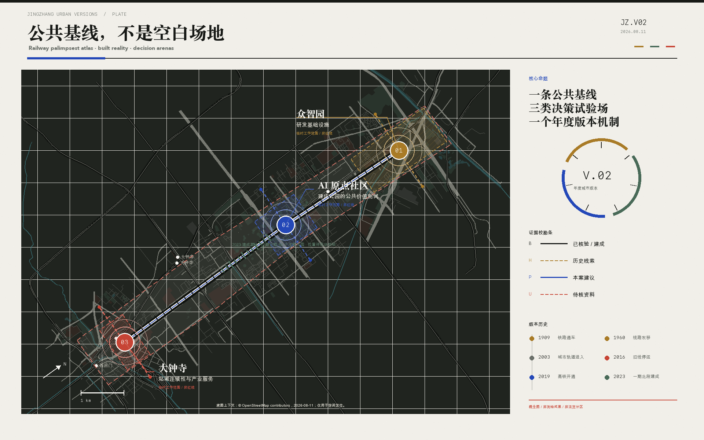
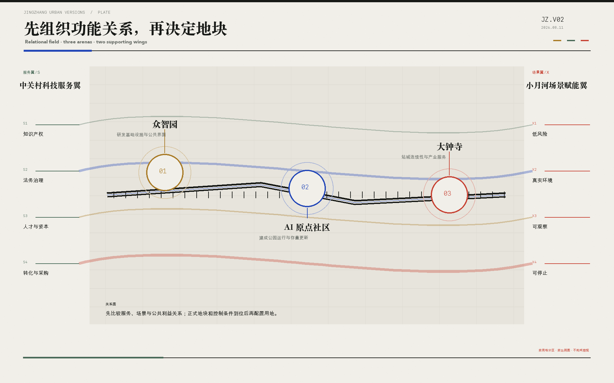
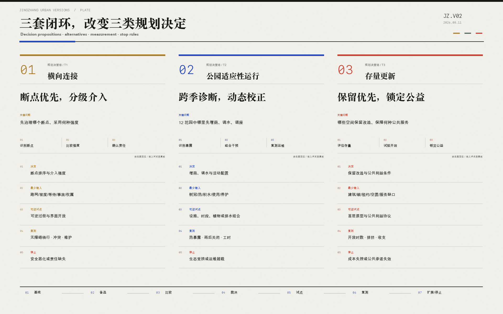
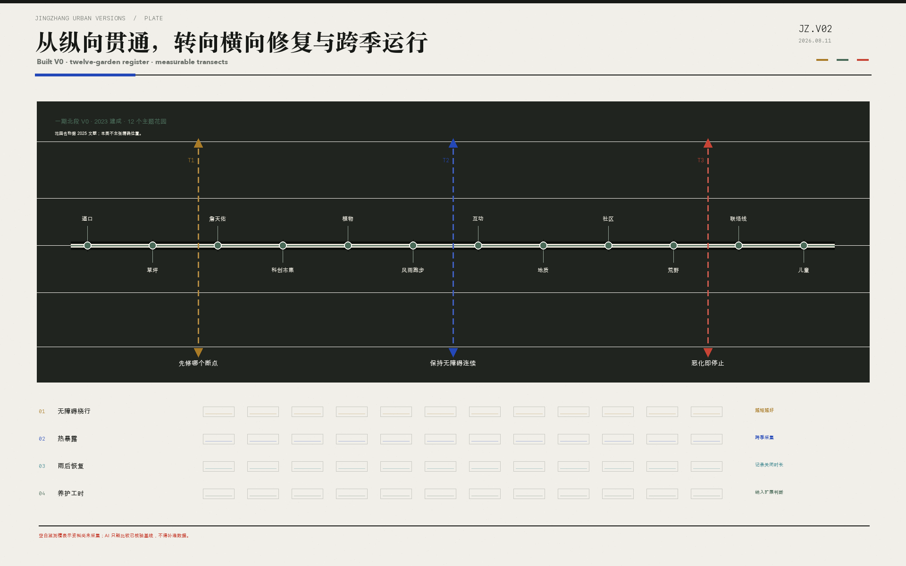
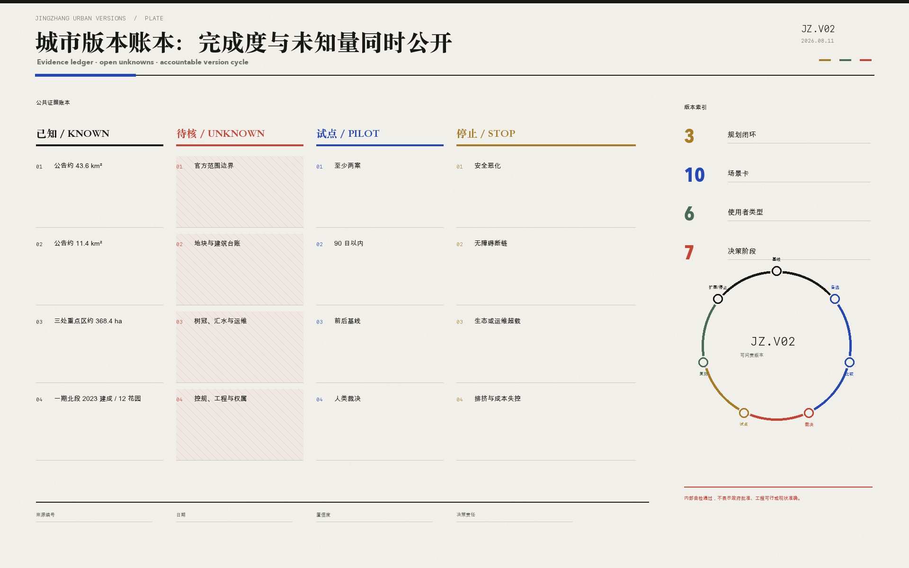

# 京张城市版本

## 设计依据与资料清单

本案面对的不是一条等待从零设计的绿廊。公开文献记载，京张高铁在学院南路至北五环之间约 6.4 km 采用地下隧道，为沿线地面空间重组提供条件；一期选取知春路至清华东路，2020—2022 年设计、2023 年建成，北段已形成 12 个主题花园。文献所述桥下护栏拆除、停车空间回收、风雨跑步道、科创市集、复原铁轨及铁路材料再利用，属于已建实践，而非本案愿景。[source:PHASE1-NORTH-2025] [metric:built_phase1_garden_count]

2020 年前后的六组国际征集文本提供了方法史料：它们反复识别铁路、13 号线、道路和大院边界造成的横向阻隔，也展示了“骨架—段落—节点”“总图—剖面—运营”等工作方法。本案只吸收问题类型和推演方法，不复制其命名、空间构图、桥型、效果图、图标、数值或当时现状判断；第三方图像与 PDF 不进入提交包。[source:JZ-COMPETITION-2020]

正式任务依据仍是项目公告、面向智能体任务书、仓库资料登记和本地标准快照。公告给出约 43.6 km² 统筹研究范围、约 11.4 km² 总体设计范围和三处重点区合计约 368.4 ha，但没有提供可用于法定判断的精确多边形、地块、建筑、产权和控规条件。[source:OFFICIAL-ANNOUNCEMENT] [source:SOURCE-REGISTRY]

因此，本版固定区分四类信息：**已核验事实**、**历史方案线索**、**本案概念建议**、**待正式资料补齐**。仓库提供的临时范围只作关系示意与机器校验，不作红线、地块或精确面积依据；本版图层仅表达待调查对象、关系和后续复算任务，不形成法定用地、建筑或分期结论。[data:geometry/site_boundary.geojson#SITE-001] [depth:existing_conditions_diagnosis]

## 三层范围工作框架

三层范围对应三种研究尺度、成果深度和实施门槛。

| 范围 | 本版回答的问题 | 输出 | 明确不做 |
| --- | --- | --- | --- |
| 统筹研究范围，公告约 43.6 km² | 海淀的研究、人才、算力、资本、服务和城市问题如何形成协作回路 | 创新生态关系、国际机制比较、三区两翼机制 | 企业名单、投资额、产值承诺 |
| 总体设计范围，公告约 11.4 km² | 京张遗产、公园、轨道、街区和产业空间如何共享一套公共基线 | 问题台账、连接优先级、蓝绿与公共服务骨架 | 法定用地、容积率、高度、道路红线 |
| 三处重点区，公告合计约 368.4 ha | 如何以任务型详细设计明确空间问题、项目原型和实施前置条件 | 三套决策闭环、项目卡、部分可逆试点与停止条件 | 具体拆改留、桥隧和工程可行性结论 |

众智园、北京 AI 原点社区、大钟寺三处临时多边形只承担任务定位。官方多边形到位后，应整体替换范围，重新完成现状普查、路网分析、地类分区和所有面积计算，而不是把临时矩形继续细化。[data:geometry/key_areas.geojson#PROV-KEY-001] [metric:brief_key_area_total_ha] [depth:three_level_scope_framework]

## 统筹研究范围产业与未来城市研究

### 核心命题：城市版本，而非智能橱窗

铁路曾以轨距、时刻、信号和工程责任重组区域联系。百年后的 AI 创新带，不应以更多传感器和屏幕证明先进，而应以统一的**证据基线、方案比选和后评估**组织更新。京张遗址公园及其建成空间构成公共基线；三个重点区承担三类决策试验；每次空间干预形成可查询、可质询、可回滚的“城市版本”记录。

空间与治理结构为“**一条公共基线、三类决策试验场、一个年度版本机制**”。公共基线登记遗产、建成项目、慢行与无障碍、树木与雨洪、服务、管理和使用时段；三类试验场分别处理研发基础设施、产学与生活混合、站城与产业服务；年度版本更新问题优先级、方案选择、资金前置条件、实施结果和停止记录，而非只更新宣传效果图。[standard:PROJECT-AGENT-OPEN-CALL-TASKBOOK] [depth:overall_spatial_structure]

“AI 引领”不意味着算法取得规划决定权。AI 的作用是扩大备选方案搜索，揭示多目标冲突和敏感性，并将实施前后变化纳入下一轮方案比选与复测记录；法定程序、价值判断和公共利益权衡仍由责任部门、专业团队与公众承担。

### 三大定位、五项功能与三区两翼

任务书提出的三大定位被转译为三项可考核工作：百年京张文化带建立可核验的遗产台账；都市 AI 生活体验带以无障碍、热舒适和公共服务评价技术；AI 融合创新带把研发、中试、治理、采购和城市问题接成验证链。五项功能相应落到基础研究与工程化、创新生态协作、公共场景验证、城市运行改进、可信治理与国际对话。

三区形成连续验证链：**众智园验证模型与基础设施，AI 原点社区验证技术的公共价值，大钟寺验证服务的真实使用**。中关村科技服务翼提供知识产权、法务、人才、资本和转化服务；小月河场景赋能翼提供低风险、可观察、可中止的城市试验。两翼不是新建廊道，而是跨区域的服务协议和场景准入机制。[source:AGENT-TASKBOOK]

### 六个国际机构与项目的机制比较

| 案例 | 可转译机制 | 京张的取舍 |
| --- | --- | --- |
| Vector Institute，多伦多 | 独立非营利机构连接研究、人才、企业采用与公共部门 | 学习“中立连接器”；不把研究空间默认开放成参观景点 [source:VECTOR-INSTITUTE] |
| Mila，蒙特利尔 | 大学联盟、开放科学、人才培养、创业与公共政策并行 | 以公共议题连接学术与城市；不复制园区品牌 [source:MILA] |
| Alan Turing Institute，英国 | 跨学科国家研究机构同时承担研究、技能与公共讨论 | 将伦理和社会科学前置；不以单一技术评价替代公共判断 [source:TURING-INSTITUTE] |
| AI Singapore 100 Experiments | 由真实问题进入限期原型，再决定是否扩展 | 采用“问题—原型—复盘”；不移植其资助额度和组织承诺 [source:AI-SINGAPORE-100E] |
| Seoul AI Hub | 城市运营的孵化、人才、研发设施和开放创新平台 | 学习分阶段企业服务；不编造招商和企业名单 [source:SEOUL-AI-HUB] |
| AI Verify Foundation，新加坡 | 将可信 AI 原则转成可测试、可共同改进的工具 | 为城市试点设置测试记录；不把工具通过等同于法律合规 [source:AI-VERIFY] |

视觉系统以历史轨道与公开校核为线索，展板和网页用克制的事实、模型、环境和停止状态区分信息，避免企业化科技蓝与铁路、企业或机构商标。版本号采用 `JZ.VYYYY.NN`，图形仅作本案识别方向。

## 总体设计范围城市更新与控规深度城市设计

本版把总体设计从“画一个完成态”改为“建立可决定项目先后与强度的项目决策框架”。空间骨架由三部分构成：纵向的京张公共基线，横向的城市连接修复，分布式的公共服务与知识节点。纵向首先尊重已建公园和真实遗产；横向逐点比较道路、轨道、围墙和出入口；节点只在已有需求、管理主体和全天候可达条件成立时进入项目库。[data:geometry/roads.geojson#ROAD-BASELINE-01] [standard:MOHURD-URBAN-DESIGN-MEASURES]

### AI 规划闭环 1：横向阻隔与无障碍连接优先级

**改变的决定**是“先治理哪个断点、采用多大强度”，而不是让算法自动选桥型。输入包括经核验的道路、轨道、出入口、围墙、产权和坡度，轮椅、步行、骑行与推车的实测时间，过街等待、事故与投诉，以及经授权的聚合人流数据。AI 在安全、无障碍、遗产扰动、成本和维护约束下生成地面优化、界面开放、桥下整治、下穿或跨越等至少两案，并说明结果对权重与缺失数据的敏感性。

交通、轨道、园林、规自、产权单位与残障使用者共同评审；先测试标线、信号、坡道、照明、围栏开放和导视等可逆动作。以高需求时段典型使用者的无障碍绕行时间、过街等待、冲突事件、全天可用率和维护工时复测，并记录样本、施工状态和测量条件。安全恶化、无障碍链条中断或管理责任未落实即暂停。[data:geometry/roads.geojson#ROAD-CROSSING-01] [standard:BARRIER-FREE-ENVIRONMENT-LAW]

### AI 规划闭环 2：建成公园的热舒适、雨洪与活动再配置

本轮需要判断的是：在文献记载的一期北段 12 个主题花园中，哪里优先增荫、调水、调座、调整时段或减少设施。树木与冠幅、逐时热环境、积水与排水记录、跨季人工观察、活动日历、报修和养护工时经现场调查后构成输入，不默认使用人脸识别或个体轨迹。AI 比较轻设施调度、植物与土壤改善、局部排水改造三类组合，同时展示热暴露、不同人群使用、生态扰动和维护成本。

景观、水务、运营人员和周边居民共同选取试点；移动遮荫、座椅和时段调整先行，种植与排水在跨季验证后再进入专业设计。热暴露时长、有效遮荫座位、雨后关闭时长、使用多样性、报修频率和每周养护工时构成复测指标；挤占无障碍通行、增加生态损害或超出维护能力即回滚。[data:geometry/green_space.geojson#GREEN-REVIEW-01] [source:PHASE1-NORTH-2025]

### AI 规划闭环 3：存量建筑更新与公共利益配置

本轮需要判断的是：哪些建筑保留或改造，哪些首层承担研发转化，哪些空间保障社区服务。正式建筑台账、结构消防、产权租约、空置率、能耗、全生命周期碳、可达性、产业需求、公共服务缺口和潜在搬迁影响齐备后，AI 并列生成存量低碳优先、创新容量优先、公共服务优先三类组合，不输出一个黑箱最优解。

主管部门、产权人、园区或高校、运营方和社区公开取舍；开放时段、共享面积、价格和维护责任作为项目准入条件，并在依法确定的项目协议或管理文件中明确。先改造一个存量首层或界面，以利用率、避免的隐含碳、公共开放时数、服务覆盖、租金与搬迁风险、运营收支复测；排挤明显、成本失控或公共承诺无法履行即停止扩展。[data:geometry/buildings.geojson#BLDG-AUDIT-01] [depth:retain_renovate_demolish]

三套闭环共同采用七步工作法：**登记基线—生成备选—公开比较—责任裁决—可逆试点—绩效复测—扩展或停止**。这构成本案的 AI 协作规划方法：算法支持方案生成和复测，责任裁决仍由法定程序与人类主体完成。[metric:decision_stage_count]

## 重点区域详细设计

精确重点区边界尚缺，本节给出的是任务型详细设计，不能解释为地块方案。[data:geometry/key_areas.geojson#PROV-KEY-002] [depth:three_key_area_detailed_design]

| 重点区 | 主要矛盾与定位 | 空间动作 | 首轮版本与停止条件 |
| --- | --- | --- | --- |
| 众智园 AI 自主创新加速区 | 研发基础设施需要与城市公共利益建立可见接口 | 将研发、中试、标准、安全评估和共享服务组织为“预约、半开放、公共”三类界面的受控开放梯度；园区边界优先研究预约开放、服务前台和连续步行，而非景观化围挡 | 建立研发公共接口样本；若安全、知识产权或运维责任不能成立，不扩大开放 [data:geometry/key_areas.geojson#PROV-KEY-001] |
| 北京 AI 原点社区 | 高校、科研、社区和已建公园相邻，但技术转译与日常生活可能脱节 | 以 2025 年文献记载的一期北段 12 个主题花园为城市生活基线，叠加成果解释、社区议题、热舒适和无障碍复测；存量首层优先于新地标 | 测试“公园运行版本”；若数据并非必要、体验不公平或维护负担上升，回到非数字流程 [data:geometry/public_space.geojson#PUBLIC-PILOT-02] |
| 大钟寺 AI 产业聚集区 | 站点、商业、企业服务和社区使用需要共同判断公共收益 | 优先研究站到街的连续无障碍、可进入首层、公共服务与活动容量；企业展示不得侵占基本通行和免费停留 | 测试“站城服务版本”；若人流冲突、排挤或商业数据混入公共决策，暂停 [data:geometry/key_areas.geojson#PROV-KEY-003] |

三处片区不是三种风格，而是在同一方法下分别处理研发公共接口、建成公园运行和站城服务。中关村翼负责为三处重点区接入法务、知识产权、人才、资本和采购能力；小月河翼负责把通过准入的场景接入真实环境并形成退出记录。

## AI 创新生态、人才画像与 AI+ 场景

### 六类使用者不是“流量标签”

| 使用者 | 关键需求 | 规划不能越过的底线 |
| --- | --- | --- |
| 研究者与工程师 | 可信测试、协作、发布与快速复盘 | 公共场景不成为未经同意的数据采集场 |
| 初创与中小企业 | 低门槛算力、法务、采购和真实问题 | 不以指定供应商或招商承诺换取公共资源 |
| 公园日常使用者 | 遮荫、座椅、跑步、亲子、夜间安全 | 基本服务不依赖 App 或身份识别 |
| 老年人、残障人士与照护者 | 连续无障碍、现场指引、人工服务 | 不以“平均最优”牺牲少数人的完整路径 |
| 小商户与一线运维人员 | 可预期活动、装卸、报修与维护工时 | 不把算法建议转化为无申诉的处罚或负担 |
| 规划管理与专业团队 | 可追溯证据、多案比选、责任和预算 | 模型不能替代法定程序与专业签责 |

### 十张场景卡

| 编号 / 场景 | 要改变的城市决定 | 最少数据与 AI 作用 | 空间或运营输出 | 人工裁决与停止规则 |
| --- | --- | --- | --- | --- |
| T1 横向连接基准测试 | 断点先后与干预强度 | 实测无障碍时间、事故、产权；生成多方式网络多案 | 可逆过街、坡道、开放时段方案 | 多部门与残障使用者评审；安全恶化即停 |
| T2 公园适应性运行测试 | 12 花园的增荫、调水和活动优先级 | 树冠、热、积水、使用、维护；比较三类组合 | 移动设施、时段、植物土壤或排水任务 | 景观、水务、居民裁决；生态或维护超载即回滚 |
| T3 存量更新公共价值测试 | 保留改造与公共服务配置 | 正式建筑、碳、空置、租约、服务缺口；生成三类组合 | 首层原型与公共利益约定 | 产权、专业与社区裁决；排挤或成本失控即停 |
| S4 遗产证据助手 | 哪些叙事可以公开展示 | 档案、文保与现场核验；检索冲突并标置信度 | 双语解释、来源和待核标签 | 文保与史学复核；来源冲突时不发布 |
| S5 树木与雨后恢复分诊 | 先处理何处热暴露或积水 | 树木、土壤、降雨、报修；只作维护优先级建议 | 现场工单与复测点 | 园林和水务签发；不得自动控制工程设备 |
| S6 站到街无障碍协助 | 哪条路径真正连续 | 官方出入口、施工状态、人工无障碍核查 | 静态导视、人工服务和数字提示并行 | 现场人员复核；信息过期立即下线 |
| S7 公共服务同等可达 | 数字服务是否制造新门槛 | 服务目录、等待与人工窗口，不采集不必要身份 | 线下窗口、电话、纸面和数字同等入口 | 服务机构负责；非数字路径失效即暂停数字扩张 |
| S8 活动容量与安静时段 | 何时、何地承载活动 | 活动日历、噪声、植被恢复、人工观察 | 分时分区与保留无活动日 | 公园运营和社区评审；投诉或生态压力越界即减量 |
| S9 城市场景开放验证 | 哪项 AI 能进入公共试点 | 问题、模型卡、数据许可、测试计划 | 90 日以内的沙盒与公开结果 | 独立技术、伦理、运营评审；无明确退出方案不得启动 |
| S10 年度城市版本审计 | 项目继续、调整还是退出 | 各试点基线、成本、收益、投诉和失败记录 | 年度版本册、项目排序和停止清单 | 公开听证与责任部门确认；不得自动续期 |

十张卡均明确对象、数据最小化、模型作用、物理结果、责任人和停止条件；其中 T1—T3 是产业能力与城市决策同时接受检验的优先测试。[metric:scenario_card_count] [standard:GENERATIVE-AI-INTERIM-MEASURES]

## 用地、建筑规模与拆改留方案

在缺少正式地块、现状建筑和控规条件时，给出精确地类和建筑量不是“深化”，而会形成伪精度。本版 `land_use.geojson` 不形成法定用地配置，仅以机器可读图层记录待调查对象、功能联系和后续复算任务。功能联系图只表达研发、转译、城市应用和公共基线之间的关系。[data:geometry/land_use.geojson#LU-BASE-01] [standard:MNR-LAND-USE-CLASSIFICATION-GUIDE]

建筑图层不放置虚构楼座，只标记若干待普查的存量建筑锚点；选点以遗产、公共服务、可达性和更新压力等调查规则确定。正式资料到位后，每栋建筑依次完成真实性与权属、结构消防、使用与空置、遗产价值、碳与能源、公共服务、租约和搬迁风险调查，再进入保留、修缮、功能置换、局部加建或更新的多案比较。[data:geometry/buildings.geojson#BLDG-AUDIT-02] [depth:land_use_layout]

建筑面积、绿地率、公共空间率、容积率、高度、密度和停车配建均记为待补；正文不引用临时多边形计算到小数点后的结果。只有官方地块、现状测绘和专业条件齐备后，才按统一坐标、拓扑和口径复算。[metric:building_footprint_area_sqm] [metric:floor_area_ratio] [depth:development_intensity_controls]

## 交通、轨道、市政与公共服务设施

交通判断从“画一条连续绿道”转为“逐个修复横向断点”。纵向以京张遗址和已建公园为公共基线，横向为每一处道路、轨道、围墙、河道与站点建立“阻隔对象—受影响人群—可选动作—安全与无障碍—权属—造价—维护—审批”比较表。地面优化和界面开放优先于重资产结构；桥、下穿和轨道相关工程先形成比选、净空、无障碍、消防、权属和维护清单，待专项论证后确定，不在本版预设工程方案。[data:geometry/roads.geojson#ROAD-CROSSING-02] [depth:traffic_rail_slow_parking]

市政与新型基础设施采用“先公共服务、后设备采购”。照明、饮水、卫生、休憩、无障碍、排水和维护是底层服务；通信、端侧计算、环境传感和数字标牌只有在数据必要、能耗可控、责任明确、可人工替代时才进入试点。传感器不得成为项目存在的理由，设备寿命和维护预算必须进入全生命周期评估。[data:geometry/constraints.geojson#CONSTRAINT-REGISTER-01] [depth:municipal_new_infrastructure]

面向老年人和残障人士，本案将现场指导、人工服务和非数字替代作为主动采用的服务原则。涉及高敏感公共服务的功能，另按适用法律、数据安全和行业规范专项核验。[standard:ELDERLY-SMART-TECH-PLAN-2020-45] [standard:BARRIER-FREE-ENVIRONMENT-LAW]

## 蓝绿空间、公共空间与城市风貌

一期北段已经证明，铁路遗存、桥下空间、跑步、社区活动、植物、地质和儿童使用可以共存。下一轮不以再造主题花园为目标，而以**跨季运行质量**为重点：树冠与热暴露、雨后恢复、无障碍连续、不同人群停留、活动与安静时段、报修和维护工时共同决定是否增建。蓝绿设施必须说明水从哪里来、如何溢流、谁维护，不能只在效果图中承担“生态”颜色。[data:geometry/green_space.geojson#GREEN-REVIEW-02] [depth:blue_green_public_space]

本案将任务书中的“AI 朝圣地标”转译为三处低物耗的**公共知识节点**，避免另建象征性大体量：

1. **工程证据台**：在经专业团队确认的遗产公共界面，展示史料来源、工程判断和待核争议，不用生成内容改写历史。
2. **开放模型基准站**：在 AI 原点社区的概念公共接口，公开模型卡、测试条件、失败结果和人类裁决。
3. **城市版本议事台**：在大钟寺的概念服务界面，展示项目多案、预算前置条件、公众意见、年度复测和停止清单。

三处节点共享公开记录格式：贡献者、问题、方法、数据许可、版本、局限、复核者、公共反馈与撤回状态。公共价值来自可复现贡献，不以企业广告、人物崇拜或打卡替代公共知识。[data:geometry/public_space.geojson#PUBLIC-KNOWLEDGE-01] [metric:knowledge_node_count]

文化叙事以三类工程与知识经验相接：1909 年铁路工程组织经验，20 世纪以来中关村的知识生产与产业转化，以及当代 AI 的开放协作与可信治理。导视同时显示时间、来源等级和版本号；历史标识、整体品牌和临时活动视觉彼此分层，不混用商标与人物肖像。对外表达强调决策可比较、可质询、可修正。

## 更新项目清单、实施政策与分期计划

分期不再按北中南切割土地，而按证据和审批门槛推进。[data:geometry/phasing.geojson#PHASE-GATE-01] [depth:phasing_implementation]

| 门槛 | 概念项目 | 主要参与者 | 进入下一阶段的条件 |
| --- | --- | --- | --- |
| G0 公共基线，建议窗口 0—6 个月（随资料与协商进度调整） | 遗产与建成项目台账、无障碍断点、树木雨洪、服务和建筑资料清单 | 规自、园林、交通、街道、产权与专业团队 | 来源、日期、责任与缺口可查询 |
| G1 可逆试点，建议窗口 6—18 个月（随审批与资金进度调整） | T1—T3 三项测试、纸面和人工替代、公众评审 | 场景运营、技术与伦理评审、居民和使用者 | 基线、两案以上、预算、退出和 90 日复测计划完整 |
| G2 专业设计与审批，建议窗口 18—36 个月（以专项论证为准） | 经验证的连接、蓝绿、建筑更新和公共服务项目 | 有资质设计团队及相关主管部门 | 专项论证、法定程序、资金与长期维护落实 |
| G3 年度复盘，持续 | 复测、项目排序、停止清单、开源数据和方法更新 | 建议建立的跨部门协作机制 | 每年公开成功、失败、未做事项和下一轮问题 |

常态化工作不另造节庆，而围绕决策形成公共成果：基线公开问题与数据缺口，多案评审公开对照测试，年度复盘发布继续、调整和退出清单。开发者社区必须从真实城市问题报名，提交模型卡、数据许可、能耗和退出计划；企业与人才的后续连接通过公开问题、验证结果、采购或合作的合法程序发生，不预设招商和资金承诺。[depth:renewal_project_list]

## 指标体系、面积复算与合规矩阵

本版用指标检验决策质量。第一类为已知公告口径：43.6 km²、11.4 km²、368.4 ha 和三处重点区，只用于任务范围说明；第二类为本案成果完整度：3 套规划闭环、10 张场景卡、6 类使用者、6 个国际机构与项目、3 个公共知识节点和 7 个决策阶段；第三类为需要在现场建立的绩效基线，包括无障碍绕行、热暴露、雨后关闭、公共开放时数、维护工时、租金与搬迁风险，不能在本版填写预测值。[metric:ai_planning_loop_count] [metric:global_case_count]

专业意义上的场地、建筑、绿地和公共空间精确面积仍待正式资料补齐。为满足仓库的空间一致性校验，`metrics.json` 另行记录临时工作多边形的派生面积，以及本版绿地、公共空间面图层为 0 的机器值；后两者只说明本版没有编码面积型方案，不表示现状为 0，也不进入设计承诺。GeoJSON 中的点和线仍只是研究任务锚点与关系示意。官方多边形和现状数据到位后，才按 EPSG:4548 重算，并同步更新指标、图纸、HTML、矩阵与版本号。[metric:site_area_sqm] [depth:metrics_recalculation]

合规矩阵逐条映射公告 1.3—1.5 与 agent.1—agent.6；标准矩阵补入生成式 AI、无障碍和老年人智能技术使用边界；设计深度矩阵明确“概念已完成”与“专业资料待补”的差异。“内部自检通过”只表示提交包内部可校验，不表示政府批准、工程可行或现状准确。[standard:MOHURD-CONTROL-DETAILED-PLANNING] [depth:risk_missing_data]

## 风险、版权与合规说明

最大的风险不是模型误差本身，而是把临时资料、历史方案或模型输出写成确定规划。本案设置四道防线：事实标日期和来源；模型同时展示备选与不确定性；试点保留人工、非数字与退出路径；结构性工程、控规和拆改留回到有资质专业团队与法定程序。涉及公共生成式 AI 服务时，仅在适用情形下逐项核验内容治理、投诉和备案等义务。不得以单一条款概括全部城市技术义务。[standard:GENERATIVE-AI-INTERIM-MEASURES]

本案新增的文本、图解、离线网页和结构化记录由 Sh7ne 与 Codex 在本次任务中协作生成，许可统一为 `COMMUNITY-DISPLAY-ONLY`。用户提供的竞赛 PDF 和 2025 年论文只用于阅读、事实核验与方法研究；不再分发原文件，不嵌入第三方图片，不复制受保护的方案表达。AI 参与资料归纳、文字草拟、结构化数据、程序化图解与校验，最终规划责任仍需由相应人类主体承担。[source:JZ-COMPETITION-2020]

所有空间落地内容均为开放共创建议和可供专业团队深化的参考方案，不替代正式规划，不构成政府审定、投资、建设或运营承诺。

## 参考资料

1. 北京市规划和自然资源委员会海淀分局：《百年京张 AI 创新带城市设计国际方案征集资格预审公告》，2026-05-09。[source:OFFICIAL-ANNOUNCEMENT]
2. 《面向全球智能体开展百年京张 AI 创新带城市设计开源征集任务书摘录》，仓库清权版本，2026-05-18。[source:AGENT-TASKBOOK]
3. 刘东云、李保炜、孙淼、杨颖：《北京京张铁路遗址公园一期工程北段》，《风景园林》2025(9): 92—97，DOI: 10.3724/j.fjyl.LA20250427，CC BY-NC-ND。[source:PHASE1-NORTH-2025]
4. 京张铁路遗址公园贯通概念方案征集六组文本，约 2020 年，用户提供研究副本；仅作背景比较，不视为当前现状或可复制资产。[source:JZ-COMPETITION-2020]
5. 住房和城乡建设部：《城市设计管理办法》及《城市、镇控制性详细规划编制审批办法》本地快照。[standard:MOHURD-URBAN-DESIGN-MEASURES] [standard:MOHURD-CONTROL-DETAILED-PLANNING]
6. 全国人大常委会：《中华人民共和国无障碍环境建设法》；国务院办公厅《关于切实解决老年人运用智能技术困难的实施方案》本地快照。[standard:BARRIER-FREE-ENVIRONMENT-LAW] [standard:ELDERLY-SMART-TECH-PLAN-2020-45]
7. Vector Institute、Mila、Alan Turing Institute、AI Singapore、Seoul AI Hub、AI Verify Foundation 官方网站，访问日期 2026-08-11；只用于机制比较，详见 `sources.json`。
