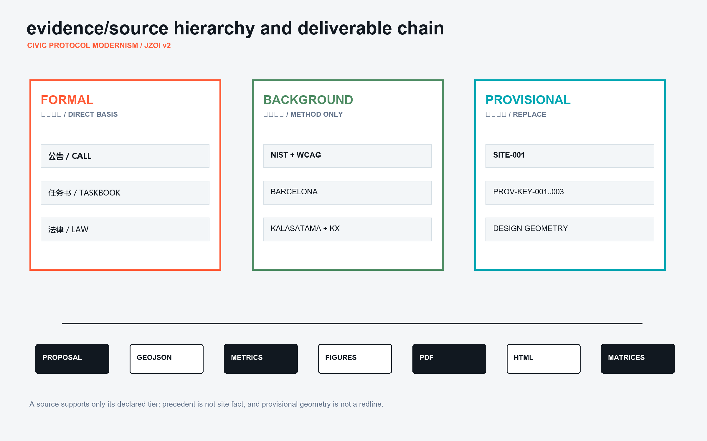
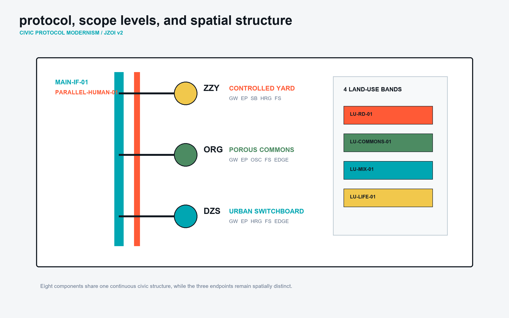
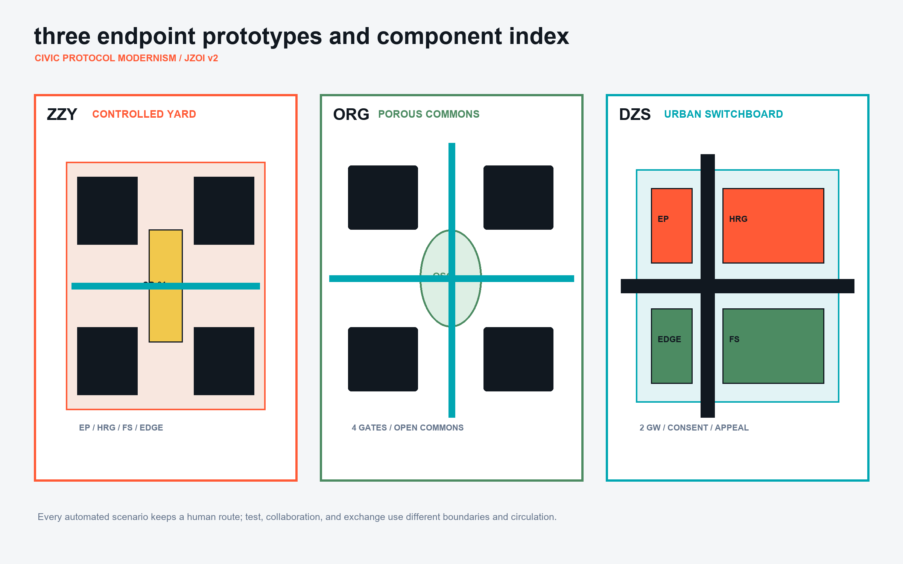
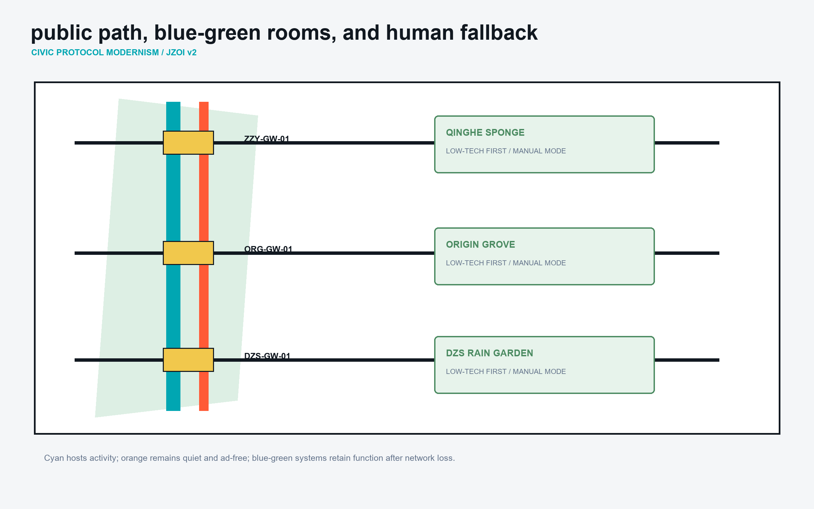
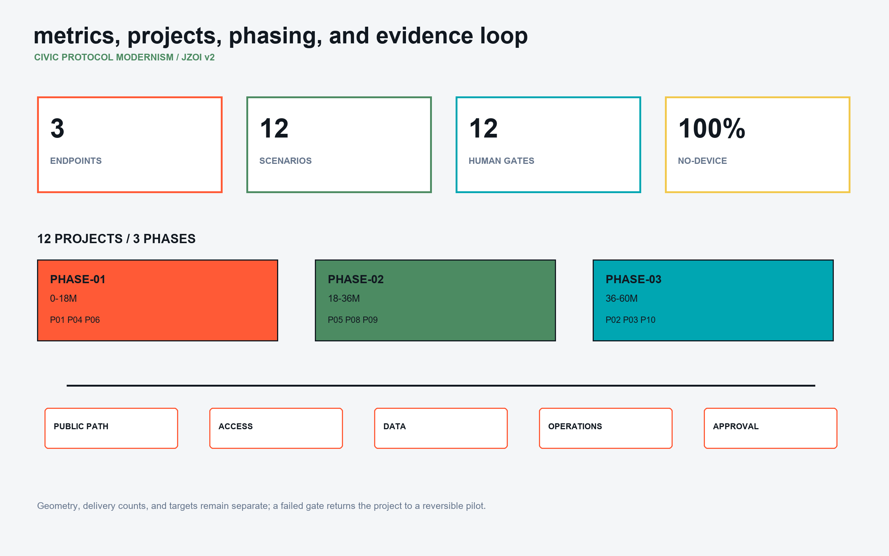

# Jingzhang Open Interface: An Urban Interface Protocol with Three Public Endpoints

> **Core position** The Jingzhang corridor does not need another closed campus or digital showcase. It needs a public interface where university research, enterprise validation, and civic rights can be tested under the same visible rules. JZOI organizes the provisional 11.4 sq km overall-design frame around the continuous `MAIN-IF-01` public interface. Zhongzhi becomes the **CONTROLLED YARD**, Beijing AI Origin Community becomes the **POROUS COMMONS**, and Dazhongsi becomes the **URBAN SWITCHBOARD**. Every automated service runs beside `PARALLEL-HUMAN-01`: people without smartphones, people who decline data authorization, and people who reject automated decisions still receive the same basic service.

This is a concept urban-design package based on provisional geometry. It is not a statutory plan, construction permit, ownership statement, or government commitment. All control lines, building actions, operators, and metrics must be recalibrated after authoritative boundaries, controls, ownership, transport, municipal, fire, heritage, and public-consultation evidence are supplied.[source:OFFICIAL-ANNOUNCEMENT] [source:SITE-PACKAGE]

## Design Basis and Source List

Evidence is managed in three tiers. **Formal** sources directly frame this proposal: the official call, the agent taskbook, the land-use classification subset, the Personal Information Protection Law, and the Barrier-Free Environment Construction Law. **Background** sources provide transferable methods only: the NIST AI Risk Management Framework, WCAG 2.2, Barcelona Superblocks, Smart Kalasatama, and King's Cross. They do not establish Beijing site facts or replace Chinese standards. **Provisional** sources are `SITE-001` and `PROV-KEY-001..003`, used only as a common coordinate frame; they are not redlines or parcels.[source:SOURCE-REGISTRY] [source:PIPL-2021] [source:BARRIER-FREE-LAW-2023]

| Tier | Supports | Does not support | Treatment |
| --- | --- | --- | --- |
| Formal | Scope, public-interest duties, data rights, land-use vocabulary, accessibility duties | Ownership, FAR, road redlines | Direct matrix evidence |
| Background | Risk governance, co-creation, heritage renewal, low-speed public space | Beijing conditions or statutory parameters | Transfer principle and rejected-copy note |
| Provisional | Relative position, count, and test frame | Exact areas, approvals, acquisition, engineering | Recalculate after replacement |

Three precedents produce three deliberate choices. Barcelona contributes the return of road space to everyday public life, but its grid is not copied. Kalasatama contributes resident-defined urban experimentation, but device-first governance is rejected. King's Cross contributes the pairing of heritage fabric and mixed public realm, but private-estate rules cannot replace a public appeal path.[source:CASE-BARCELONA] [source:CASE-KALASATAMA] [source:CASE-KINGS-CROSS]

## Three-Level Scope Framework

The 43.6 sq km research area studies the relationship between university origination, open-source collaboration, enterprise validation, and public adoption without adding a new redline. The 11.4 sq km overall-design area carries `MAIN-IF-01`, the blue-green network, service edges, and twelve renewal projects. The three detailed areas, approximately 368.4 ha in total, test three different endpoint types. The three levels answer ecosystem, continuous urban structure, and implementable prototype questions respectively.[source:OFFICIAL-ANNOUNCEMENT] [depth:three_level_scope_framework]

The protocol has eight spatial components: `MAIN-IF` continuous public interface; `GW` gateways across road, campus, and station edges; `EP` research or service endpoints; `SB` bounded test yards; `HRG` named human review gates; `FS` no-device staffed desks; `OSC` open-source commons; and `EDGE` civic edges facing water, neighbourhoods, or transport. These are acceptance objects, not decorative vocabulary.[data:geometry/roads.geojson#MAIN-IF-01] [data:geometry/public_space.geojson#ZZY-SB-01] [metric:endpoint_count]

## Coordinated Research Area: Industry and Future City Research

The ecosystem follows five steps: a public problem enters, a bounded test runs, a human review is recorded, a service may be adopted, and an unsafe or unwanted service can exit. Universities and open-source groups define problems at `ORG-OSC-01`; enterprises test at `ZZY-SB-01`; residents, legal reviewers, and accessibility advisers review at `ZZY-HRG-01` or `DZS-HRG-01`; approved services connect through `DZS-SWITCH-01`; failed services exit with a public reason. This creates demand for low-cost repair tables, compliance rooms, staffed appeal halls, screen-free desks, and removable test rails rather than office area alone.[data:geometry/buildings.geojson#ORG-OSC-01] [data:geometry/buildings.geojson#ZZY-HRG-01]

**Visual identity.** The Chinese name is “京张开放接口”; the English name is **JINGZHANG OPEN INTERFACE**, abbreviated **JZOI**. The mark is two open brackets around one continuous baseline: access and exit, held by railway continuity. The palette is Protocol Black `#111820`, Review Orange `#FF5A36`, Interface Cyan `#00A6B2`, Commons Green `#4C8B62`, and Sandbox Yellow `#F1C84C`. Color never carries status alone; labels and line patterns repeat it. IDs use `site-component-number`. Wayfinding answers four questions: where, who can use it, who is responsible, and how to use the human route.

The future-city test is not sensor density. It is continuity of the public path, refusal of automated decisions, equal human access, stoppability, evidenced contribution, and accountable operations. The package therefore records a 1.0 no-device fallback ratio, twelve human-review gates, a 48-hour first-response target, and a 99% planned-open-hours target. The latter two are pilot targets, not observed performance.[metric:no_device_fallback_coverage] [metric:appeal_response_target_hours]

## Overall Design Area: Urban Renewal and Regulatory-Plan-Level Urban Design

Four complete land-use units frame the temporary boundary: research and validation interface `LU-RD-01`, Jingzhang public commons `LU-COMMONS-01`, industry and civic-service mixed edge `LU-MIX-01`, and community life and talent services `LU-LIFE-01`. They are structural concept units, not parcels. FAR, height, density, setback, and parking controls remain unknown. Ground floors facing `MAIN-IF-01` alternate public rooms, staffed windows, and enterprise services instead of forming a continuous private wall.[data:geometry/land_use.geojson#LU-COMMONS-01] [standard:MNR-LAND-USE-CLASSIFICATION-GUIDE]

Renewal follows “retain the frame, adapt the ground floor, add reversibly, decide demolition last.” Twelve building footprints carry `retain_action`. Without structural, fire, ownership, and heritage surveys, no building is assigned a demolition conclusion. Reversible additions stay behind the verified existing datum; interface fronts remain visually and physically permeable. Numerical controls must be established after surveying and statutory review.[data:geometry/buildings.geojson#DZS-HRG-01] [depth:retain_renovate_demolish]

Capacity has two gates: spatial capacity for walking, fire access, accessibility, drainage, and maintenance; and operational capacity for staffing, appeals, retention, test concurrency, and shutdown. If either gate fails, a service remains in the sandbox. `GAP-ROAD-01`, `GAP-HERITAGE-01`, `GAP-WATER-01`, and `GAP-UTILITY-01` make the missing professional inputs visible.[data:geometry/constraints.geojson#GAP-UTILITY-01] [assumption:A-UTILITIES-009]

## Detailed Design of Key Areas

The three key areas share a protocol but not a copied spatial personality.

### Zhongzhi / ZZY: CONTROLLED YARD

`ZZY-SB-01` is a bounded test yard with booking windows, named reviewers, and stop conditions. `ZZY-EP-01` is a model and robotics validation hall; `ZZY-HRG-01` is the human review and standards center; `ZZY-EDGE-01` faces Qinghe as a low-carbon workshop; `ZZY-GW-01` is the east-west gateway; `ZZY-FS-01` serves enterprise users without a device. The human path cannot be occupied by testing. In an incident, ordinary walking, staffed registration, and paper notice are restored first. Adaptation of large existing spaces and visible low-tech water systems precede digital controls.[data:geometry/public_space.geojson#ZZY-SB-01] [data:geometry/roads.geojson#ZZY-GW-01]

### Beijing AI Origin Community / ORG: POROUS COMMONS

`ORG-OSC-COURT` has no single privileged entrance. Campus, neighbourhood, and enterprise users enter from four directions. `ORG-OSC-01` hosts dependency clinics and repair tables; `ORG-EP-01` translates research into testable prototypes; `ORG-FS-01` handles screen-free advice, IP, and neighbourhood rights; `ORG-EDGE-01` places talent-life services at the street edge. `ORG-GW-01` is a desired campus-city connection requiring boundary, road, and ownership coordination. The contribution wall publishes only consented project versions, repairs, public value, and review results, never personal behaviour rankings.[data:geometry/public_space.geojson#ORG-OSC-COURT] [data:geometry/buildings.geojson#ORG-FS-01]

### Dazhongsi / DZS: URBAN SWITCHBOARD

`DZS-SWITCH-01` joins the east-west `DZS-GW-01` and north-south `DZS-GW-02`, placing rail access, retail, data consent, appeals, and cultural display on one urban interface. `DZS-EP-01` handles civic and enterprise services; `DZS-HRG-01` handles consent, explanation, and appeal; `DZS-FS-01` provides staffed processing; `DZS-EDGE-01` displays devices and content without blocking movement. Four-quadrant links address crossing delay, level changes, and night visibility. Screens and events retreat from the main path.[data:geometry/public_space.geojson#DZS-SWITCH-01] [data:geometry/roads.geojson#DZS-GW-02]

## AI Innovation Ecosystem, Personas, and AI+ Scenarios

Six user groups are explicit co-decision makers: low-budget start-ups, students and researchers, enterprise operators with compliance duties, older and no-smartphone residents, people who need step-free and quiet routes, and neighbours affected by noise or data processing. The last three groups have refusal, explanation, appeal, and exit rights.[source:PIPL-2021] [source:BARRIER-FREE-LAW-2023]

| ID | Scenario / place | Minimum data | Human route and stop rule | Operator / metric |
| --- | --- | --- | --- | --- |
| SC-01 | Model Audit Window / ZZY-SB-01 | Test version and error class, no identity | Named reviewer; severe bias stops the test | Independent evaluator; complete audit log |
| SC-02 | Robotic Courtesy Field / ZZY-SB-01 | Device trajectory and anonymous events | Physical safety stop; human path stays open | Yard operator; zero blocked human events |
| SC-03 | Qinghe Low-carbon Console / ZZY-FS-COURT | Aggregate environment and energy | Manual irrigation and patrol remain independent | Estate + water adviser; quarterly drill |
| SC-04 | Screen-free Enterprise Desk / ZZY-FS-COURT | User-submitted case only | Paper, phone, and staffed entrances | Enterprise-service body; equal completion |
| SC-05 | Open Dependency Clinic / ORG-OSC-COURT | Software bill of materials | Legal mentor; uncleared licence blocks release | Open-source group; licence clarity |
| SC-06 | Prototype Repair Table / ORG-OSC-COURT | Version and voluntary contribution | On-site mentor; hazardous prototype stays contained | University + lab; reproducible prototypes |
| SC-07 | Neighbourhood Rights Translator / ORG-FS-COURT | Voluntary service request | Explanation, withdrawal, and appeal | Community centre; first response within 48h |
| SC-08 | Talent-life Exchange / ORG-FS-COURT | Object and time slot, no credit score | Staffed collection if unattended | Community operator; non-digital completion |
| SC-09 | Data Consent Gate / DZS-SWITCH-01 | Single-service consent token | Refusal transfers to human with no basic-service penalty | Compliance body; withdrawal 100% |
| SC-10 | Civic Service Appeal Desk / DZS-SWITCH-01 | Appeal materials and case log | Named staff; automated result is never final | Civic coordinator; overdue cases count |
| SC-11 | Century Technology Table / DZS-EDGE-COURT | Cleared archive metadata | Paper, tactile model, and guide | Cultural body; complete rights ledger |
| SC-12 | Quiet Navigation Strip / DZS-SWITCH-01 | Fixed-time status only, no personal data | Tactile sign and staff route run in parallel | Station-city operator; step-free usability |

All scenarios follow purpose limitation, minimum collection, conspicuous notice, withdrawal, human explanation, and time-limited deletion. No public-space identity recognition is proposed. NIST AI RMF is used only as a Govern-Map-Measure-Manage worksheet; Chinese law and competent review remain controlling.[source:NIST-AI-RMF] [metric:human_review_gate_count]

## Land Use, Building Scale, and Retain-Renovate-Demolish Strategy

The land-use layer is complete, closed, non-overlapping, and uses the repository classification vocabulary. Fine-grained functions are carried by buildings and public-space features, avoiding pseudo-parcels on a provisional frame. `LU-RD-01` is research, `LU-COMMONS-01` is park/open space, `LU-MIX-01` is commercial service, and `LU-LIFE-01` is community service.[data:geometry/land_use.geojson#LU-RD-01] [metric:site_area_sqm]

Each footprint carries `retain_action`: `retain` keeps the body and opens the ground floor; `renovate` adapts interior and frontage; `add_reversible` adds removable service infrastructure. None is demolition. Total floor area, FAR, statutory height, density, and parking remain unknown until official controls are supplied.[data:geometry/buildings.geojson#ORG-EP-01] [metric:building_footprint_area_sqm]

Three reviewable massing rules apply: ground floors facing `MAIN-IF` remain permeable; additions stay behind the verified existing datum; heritage and water edges use reversible, low-glare, low-noise installations. These become numeric controls only after survey, daylight, fire, and heritage review.[depth:height_massing_character] [assumption:A-BUILDING-004]

## Transport, Rail, Municipal Infrastructure, and Public Services

Transport first protects the north-south continuity of `MAIN-IF-01` and `PARALLEL-HUMAN-01`, then uses gateways for cross-connections. The main interface hosts scenarios and wayfinding; the human path stays quiet, advertisement-free, and free of mandatory digital interaction. ZZY uses a test cycle loop and east-west gateway; ORG uses the campus-city passage and shared street; DZS uses four-quadrant links and the station-city north-south interface. Exact alignments remain pending road-redline, station, and traffic evidence.[data:geometry/roads.geojson#PARALLEL-HUMAN-01] [assumption:A-MOBILITY-005]

Accessibility means more than a ramp: no-step routes, tactile and high-contrast information, frequent seats, quiet waiting points, visible staffed help, and wayfinding that does not depend on color or phone. The offline HTML follows WCAG 2.2 principles for perceivable, operable, understandable, and robust content; the physical design follows Chinese barrier-free law and later professional review.[source:W3C-WCAG22] [source:BARRIER-FREE-LAW-2023]

Municipal systems are “low-tech first, digitally augmented and withdrawable.” Rain gardens retain function without sensors; lights have local manual control; offline signs remain legible; edge-compute cabinets stay outside public movement; power, cooling, fire, drainage, and maintenance capacity remain reservations until `GAP-UTILITY-01` is cleared.[data:geometry/constraints.geojson#GAP-WATER-01]

## Blue-Green Network, Public Space, and Urban Character

`GREEN-MAIN-01` is the ecological base. The three key areas become a Qinghe sponge test garden, an Origin shared grove, and a Dazhongsi station rain garden. The green ratio is a concept-geometry result, not a regulatory green-space requirement. Water levels, overflow, and maintenance can be displayed, but screens cannot replace shade, soil, or drainage; basic ecological function remains after sensor shutdown.[data:geometry/green_space.geojson#GREEN-MAIN-01] [metric:green_ratio]

The visual language is **Civic Protocol Modernism**. Black structural lines show responsibility boundaries; orange shows human review; cyan shows access; green shows no-device commons; yellow shows bounded testing. The component kit includes `IF-MARK`, `CONSENT-POST`, `HUMAN-DESK`, `TEST-RAIL`, and `QUIET-BEACON`. Each carries a feature ID, operator, open hours, data rule, and complaint route.

The cultural map is a route about infrastructure becoming public knowledge: railway engineering memory, Qinghe ecology, university open-source work, civic-service appeal, and intelligent-device consumption. The **OPEN BRACKET** landmark at `DZS-EDGE-COURT` uses two enterable brackets and a century timeline; it has no face recognition, ranking, or dynamic advertising. The contribution ledger publishes consented project versions, repairs, public value, and reviews; names can be withdrawn while anonymous project evidence remains.[data:geometry/public_space.geojson#DZS-EDGE-COURT]

## Renewal Projects, Implementation Policy, and Phasing

| Project | Deliverable | Accountable role | Gate | Acceptance / exit |
| --- | --- | --- | --- | --- |
| JZOI-P01 Continuous public interface | MAIN-IF, human path, signs | District public-space coordinator | Redline, access, fire | Continuous passage; digital elements stoppable |
| JZOI-P02 Controlled Yard | SB, validation hall, review centre | Yard + independent evaluator | Safety boundary, insurance | Physical-stop drill passes |
| JZOI-P03 Qinghe edge | FS, rain garden, low-carbon workshop | Yard + water/landscape advisers | Blue line, flood, maintenance | Manual mode works |
| JZOI-P04 Origin commons | OSC, translation hall, repair tables | University + open-source groups | Campus coordination, licences | Public hours and dependency list |
| JZOI-P05 Neighbourhood edge | Staffed window, shared street, life services | Community + service body | Ownership and ground-floor review | Equal non-digital service |
| JZOI-P06 Switchboard | Four-quadrant links, consent and appeal halls | Station-city coordinator | Entrances, traffic, utilities | Basic service after refusal |
| JZOI-P07 Cultural forecourt | Open Bracket, gallery, quiet signs | Cultural + commercial operators | Rights, noise, safety | Clear ledger and path |
| JZOI-P08 Open research frontage | Bookable evaluation rooms | Owner + park operator | Building/fire survey | Public hours delivered |
| JZOI-P09 Mixed service edge | Alternating civic/enterprise frontage | Street + owners | Tenancy and fire review | Civic floor protected |
| JZOI-P10 No-device network | Staff, phone, paper, desks | Scenario operators | Staffing and budget | 100% fallback coverage |
| JZOI-P11 Contribution ledger | Version, review, exit register | Independent secretariat | Consent, rights, audit | Correctable and quarterly public |
| JZOI-P12 Annual program | Seasonal public operations | Public-interest alliance | Venue, fund, safety | Annual keep/change/exit report |

`PHASE-01` (0-18 months) pilots light components at DZS, ORG, and the main interface; `PHASE-02` (18-36 months) renews the Origin edge and overall ground floors; `PHASE-03` (36-60 months) advances the Controlled Yard and ecological edge. Advancement requires public-path, accessibility, data-governance, operating-budget, and professional-approval gates.[data:geometry/phasing.geojson#PHASE-01] [depth:phasing_implementation]

The annual cycle is problem intake in spring, bounded validation in summer, public adoption hearing in autumn, and exit/maintenance month in winter. Every month includes a no-device service day; every quarter includes a network-loss, human-takeover, and appeal-routing drill. Public oversight, venue operators, data processors, independent evaluators, and community representatives have separate duties. Recommended roles are not confirmed government commitments.

## Metrics, Area Recalculation, and Compliance Matrix

Metrics are separated into geometry, delivery counts, and operational targets. Geometry metrics include site area, building footprint, green/public ratios, and interface lengths. Delivery counts include three endpoints, twelve scenarios, twelve review gates, and twelve projects. Operational targets include a 48-hour first human response and 99% planned open-hour availability; they become performance indicators only after a measured baseline.[metric:main_interface_length_m] [metric:scenario_node_count]

`compliance_matrix.json` gives each call and agent requirement its narrowest section, feature IDs, metric, drawing panel, source, assumption, and self-check. `standard_matrix.json` distinguishes formal basis, professional method, and data gap. `design_depth_matrix.json` separately checks diagnosis, structure, land use, massing, retain-renovate-demolish, transport, municipal systems, blue-green public space, key areas, projects, phasing, metrics, and risk. Drawings and HTML use the same IDs so a reviewer can trace a scenario to space, operator, and exit rule.[depth:metrics_recalculation] [standard:PROJECT-OFFICIAL-ANNOUNCEMENT]

## Risk, Copyright, and Compliance

The largest risks are not model accuracy alone: a public space may be occupied by a test, refusal may reduce service, a human window may be nominal, provisional geometry may be mistaken for a redline, or operating funds may stop. Controls are a physically separate human path, equal basic service after refusal, public staffing and response records, visible provisional labels, and renewal gates that disclose budget, complaints, shutdowns, and access results.[source:PIPL-2021] [depth:risk_missing_data]

`report/copyright_statement.md` records each asset. Proposal text, design geometry, diagrams, and code-generated figures are authored for this submission. Official pages are cited for facts and requirements; precedent pages are background research. No third-party photographs, icons, map tiles, trademarks, or font files are copied. PNG/PDF rendering uses local system fonts; font binaries are not included. Offline HTML loads no remote resource, tracking, form, or API.

When official boundary, key-area polygons, controls, road/rail, municipal, building, ownership, heritage, and public-service data arrive, the rebuild order is: replace constraints; intersect and adjust design objects; recompute metrics; regenerate figures, PDF, and HTML; refresh the matrices and manifest; then obtain joint sign-off from planning, architecture, transport, landscape, municipal, accessibility, data-compliance, and operations reviewers. Until then, this remains eligible concept evidence, not construction or statutory approval.

## References

- Project basis: [source:OFFICIAL-ANNOUNCEMENT] [source:AGENT-TASKBOOK] [source:SOURCE-REGISTRY]
- Chinese law and classification: [source:PIPL-2021] [source:BARRIER-FREE-LAW-2023] [source:MNR-LAND-USE]
- Risk and accessibility background: [source:NIST-AI-RMF] [source:W3C-WCAG22]
- Urban precedent background: [source:CASE-BARCELONA] [source:CASE-KALASATAMA] [source:CASE-KINGS-CROSS]
- Machine-readable index: `sources.json`, `metrics.json`, `assumptions.json`, `compliance_matrix.json`, `standard_matrix.json`, `design_depth_matrix.json`
