# Jingzhang Open Interface: From Evidence to Public Endpoints

A three-tier scope, continuous public interface, and three differentiated endpoints translate AI innovation into an auditable, rejectable, stoppable, and recalculable urban-design and implementation framework.

> Concept design and provisional geometry; not a statutory redline, survey, construction document, or government commitment.

## Design Basis and Source List

Evidence tiers, source limits, provisional scope, and legal constraints are explicit. Formal sources frame the task and public interest; Background sources provide transferable methods only; Provisional sources support relative placement and recalculation. This section separates design intent, evidence limits, spatial objects, metric implications, and data gaps. Concept geometry is used only for relative placement and option comparison; all areas, boundaries, ownership, capacity, operating responsibility, and approval conclusions must be recalculated after authoritative survey, controls, transport, utilities, fire, heritage, accessibility, and public-consultation evidence arrive. The compatibility residual is not new construction or an existing classification and does not expand direct intervention; it only closes the legacy file topology contract. This section also explains how design intent becomes traceable objects: official calls, taskbooks, laws, and public sources establish public-interest and expression limits; Gate B concept geometry records relative position, connections, and spatial prototypes; Gate C projects, scenarios, metrics, and phases record implementation responsibility, human review, stop conditions, and evidence closure. Areas, lengths, counts, and ratios are recalculated only where sources and formulas are explicit; fields without survey, controls, ownership, transport, utilities, fire, heritage, accessibility, operating-roster, or public-consultation evidence remain unknown, target, or future monitoring. Every automated service retains staffed, paper, phone, explanation, withdrawal, and exit routes. The compatibility projection serves legacy file format only and does not assert statutory planning, approval, redlines, land classification, ownership, construction scale, or government commitment. [source:SOURCE-REGISTRY]

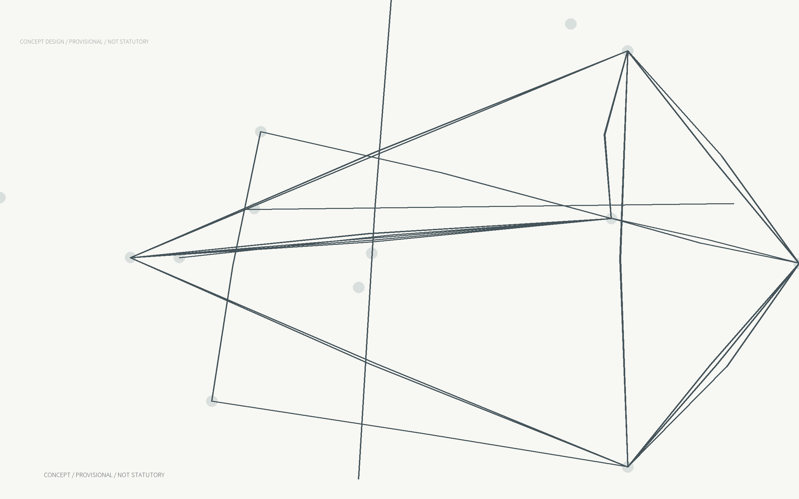

## Three-level Scope Framework

Three levels answer ecosystem, continuous urban structure, and implementable prototype questions. The research area adds no redline; the overall area carries the interface and project network; detailed areas test three differentiated endpoints. This section separates design intent, evidence limits, spatial objects, metric implications, and data gaps. Concept geometry is used only for relative placement and option comparison; all areas, boundaries, ownership, capacity, operating responsibility, and approval conclusions must be recalculated after authoritative survey, controls, transport, utilities, fire, heritage, accessibility, and public-consultation evidence arrive. The compatibility residual is not new construction or an existing classification and does not expand direct intervention; it only closes the legacy file topology contract. This section also explains how design intent becomes traceable objects: official calls, taskbooks, laws, and public sources establish public-interest and expression limits; Gate B concept geometry records relative position, connections, and spatial prototypes; Gate C projects, scenarios, metrics, and phases record implementation responsibility, human review, stop conditions, and evidence closure. Areas, lengths, counts, and ratios are recalculated only where sources and formulas are explicit; fields without survey, controls, ownership, transport, utilities, fire, heritage, accessibility, operating-roster, or public-consultation evidence remain unknown, target, or future monitoring. Every automated service retains staffed, paper, phone, explanation, withdrawal, and exit routes. The compatibility projection serves legacy file format only and does not assert statutory planning, approval, redlines, land classification, ownership, construction scale, or government commitment. [data:geometry/site_boundary.geojson#SITE-001]

## Research Area Industry and Future-city Study

The industry ecosystem moves from problem intake through controlled testing, human review, public adoption, and exit. Universities, open-source communities, enterprises, residents, and independent evaluators collaborate through distinct endpoints with traceable responsibility and evidence. This section separates design intent, evidence limits, spatial objects, metric implications, and data gaps. Concept geometry is used only for relative placement and option comparison; all areas, boundaries, ownership, capacity, operating responsibility, and approval conclusions must be recalculated after authoritative survey, controls, transport, utilities, fire, heritage, accessibility, and public-consultation evidence arrive. The compatibility residual is not new construction or an existing classification and does not expand direct intervention; it only closes the legacy file topology contract. This section also explains how design intent becomes traceable objects: official calls, taskbooks, laws, and public sources establish public-interest and expression limits; Gate B concept geometry records relative position, connections, and spatial prototypes; Gate C projects, scenarios, metrics, and phases record implementation responsibility, human review, stop conditions, and evidence closure. Areas, lengths, counts, and ratios are recalculated only where sources and formulas are explicit; fields without survey, controls, ownership, transport, utilities, fire, heritage, accessibility, operating-roster, or public-consultation evidence remain unknown, target, or future monitoring. Every automated service retains staffed, paper, phone, explanation, withdrawal, and exit routes. The compatibility projection serves legacy file format only and does not assert statutory planning, approval, redlines, land classification, ownership, construction scale, or government commitment. [data:geometry/land_use.geojson#LU-RD-01]

## Overall-design Urban Renewal and Detailed Urban Design

The overall design proposes a concept structure for the public interface, blue-green network, gateways, service edges, and twelve projects. FAR, statutory height, ownership, road redlines, and engineering capacity remain unknown until authoritative evidence enables recalculation. This section separates design intent, evidence limits, spatial objects, metric implications, and data gaps. Concept geometry is used only for relative placement and option comparison; all areas, boundaries, ownership, capacity, operating responsibility, and approval conclusions must be recalculated after authoritative survey, controls, transport, utilities, fire, heritage, accessibility, and public-consultation evidence arrive. The compatibility residual is not new construction or an existing classification and does not expand direct intervention; it only closes the legacy file topology contract. This section also explains how design intent becomes traceable objects: official calls, taskbooks, laws, and public sources establish public-interest and expression limits; Gate B concept geometry records relative position, connections, and spatial prototypes; Gate C projects, scenarios, metrics, and phases record implementation responsibility, human review, stop conditions, and evidence closure. Areas, lengths, counts, and ratios are recalculated only where sources and formulas are explicit; fields without survey, controls, ownership, transport, utilities, fire, heritage, accessibility, operating-roster, or public-consultation evidence remain unknown, target, or future monitoring. Every automated service retains staffed, paper, phone, explanation, withdrawal, and exit routes. The compatibility projection serves legacy file format only and does not assert statutory planning, approval, redlines, land classification, ownership, construction scale, or government commitment. [data:geometry/public_space.geojson#ZZY-SB-01]

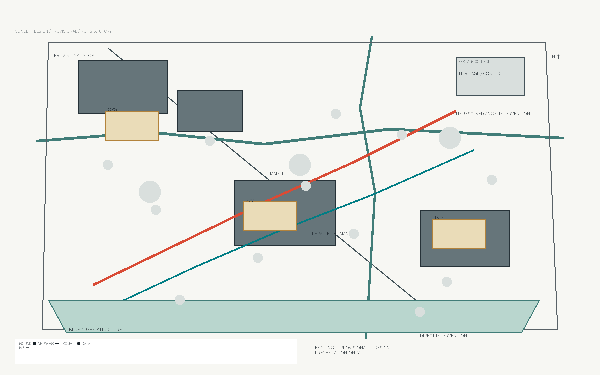

## Detailed Design of Key Areas

ZZY, ORG, and DZS share an interface protocol while forming a Controlled Test Yard, Porous Commons, and Urban Switchboard. Each endpoint has spatial objects, staffed paths, stop conditions, accountable roles, and reviewable drawings. This section separates design intent, evidence limits, spatial objects, metric implications, and data gaps. Concept geometry is used only for relative placement and option comparison; all areas, boundaries, ownership, capacity, operating responsibility, and approval conclusions must be recalculated after authoritative survey, controls, transport, utilities, fire, heritage, accessibility, and public-consultation evidence arrive. The compatibility residual is not new construction or an existing classification and does not expand direct intervention; it only closes the legacy file topology contract. This section also explains how design intent becomes traceable objects: official calls, taskbooks, laws, and public sources establish public-interest and expression limits; Gate B concept geometry records relative position, connections, and spatial prototypes; Gate C projects, scenarios, metrics, and phases record implementation responsibility, human review, stop conditions, and evidence closure. Areas, lengths, counts, and ratios are recalculated only where sources and formulas are explicit; fields without survey, controls, ownership, transport, utilities, fire, heritage, accessibility, operating-roster, or public-consultation evidence remain unknown, target, or future monitoring. Every automated service retains staffed, paper, phone, explanation, withdrawal, and exit routes. The compatibility projection serves legacy file format only and does not assert statutory planning, approval, redlines, land classification, ownership, construction scale, or government commitment. [source:PIPL-2021]

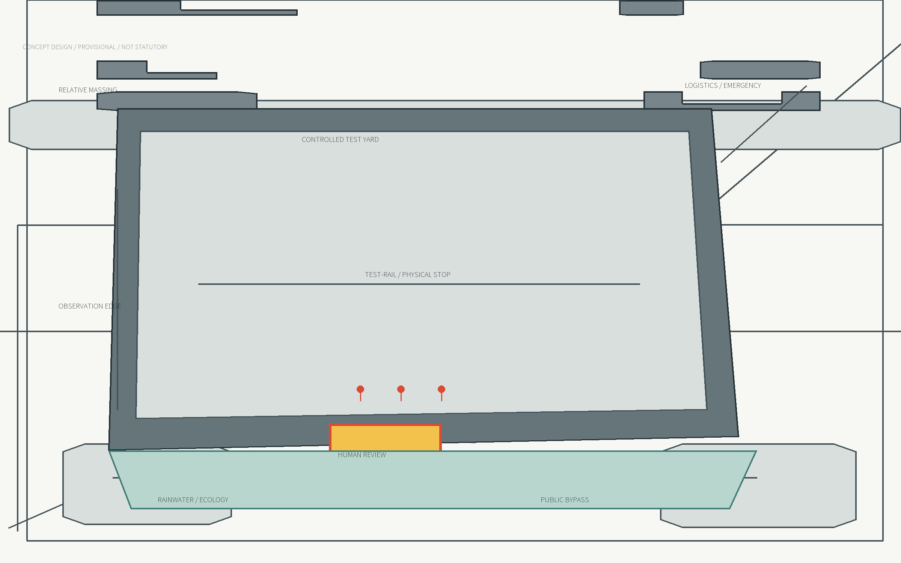

## AI Ecosystem, User Profiles, and AI+ Scenarios

Users include startups, students, enterprise operators, people without devices, disabled people, and neighbours. Twelve AI scenarios apply data minimisation, clear notice, withdrawal, human explanation, and stop conditions; basic service never depends solely on automation or smartphones. This section separates design intent, evidence limits, spatial objects, metric implications, and data gaps. Concept geometry is used only for relative placement and option comparison; all areas, boundaries, ownership, capacity, operating responsibility, and approval conclusions must be recalculated after authoritative survey, controls, transport, utilities, fire, heritage, accessibility, and public-consultation evidence arrive. The compatibility residual is not new construction or an existing classification and does not expand direct intervention; it only closes the legacy file topology contract. This section also explains how design intent becomes traceable objects: official calls, taskbooks, laws, and public sources establish public-interest and expression limits; Gate B concept geometry records relative position, connections, and spatial prototypes; Gate C projects, scenarios, metrics, and phases record implementation responsibility, human review, stop conditions, and evidence closure. Areas, lengths, counts, and ratios are recalculated only where sources and formulas are explicit; fields without survey, controls, ownership, transport, utilities, fire, heritage, accessibility, operating-roster, or public-consultation evidence remain unknown, target, or future monitoring. Every automated service retains staffed, paper, phone, explanation, withdrawal, and exit routes. The compatibility projection serves legacy file format only and does not assert statutory planning, approval, redlines, land classification, ownership, construction scale, or government commitment. [data:geometry/buildings.geojson#ORG-EP-01]

## Land Use, Building Scale, and Retain/Renovate/Demolish

Land-use and building objects express a concept proposal rather than statutory parcels. Direct intervention is concentrated in approximately 1.713 sq km of concept program; the remaining SITE_BOUNDARY is unresolved context and a compatibility analysis residual with no statutory classification. This section separates design intent, evidence limits, spatial objects, metric implications, and data gaps. Concept geometry is used only for relative placement and option comparison; all areas, boundaries, ownership, capacity, operating responsibility, and approval conclusions must be recalculated after authoritative survey, controls, transport, utilities, fire, heritage, accessibility, and public-consultation evidence arrive. The compatibility residual is not new construction or an existing classification and does not expand direct intervention; it only closes the legacy file topology contract. This section also explains how design intent becomes traceable objects: official calls, taskbooks, laws, and public sources establish public-interest and expression limits; Gate B concept geometry records relative position, connections, and spatial prototypes; Gate C projects, scenarios, metrics, and phases record implementation responsibility, human review, stop conditions, and evidence closure. Areas, lengths, counts, and ratios are recalculated only where sources and formulas are explicit; fields without survey, controls, ownership, transport, utilities, fire, heritage, accessibility, operating-roster, or public-consultation evidence remain unknown, target, or future monitoring. Every automated service retains staffed, paper, phone, explanation, withdrawal, and exit routes. The compatibility projection serves legacy file format only and does not assert statutory planning, approval, redlines, land classification, ownership, construction scale, or government commitment. [data:geometry/green_space.geojson#GREEN-MAIN-01]

## Mobility, Rail, Municipal, and Public-service Facilities

The main interface and staffed path remain continuous, with gateways, slow modes, emergency access, logistics, and accessibility expressed separately. Background roads are reference only; concept paths are not projected as road redlines; municipal, rail, and service capacity require professional evidence. This section separates design intent, evidence limits, spatial objects, metric implications, and data gaps. Concept geometry is used only for relative placement and option comparison; all areas, boundaries, ownership, capacity, operating responsibility, and approval conclusions must be recalculated after authoritative survey, controls, transport, utilities, fire, heritage, accessibility, and public-consultation evidence arrive. The compatibility residual is not new construction or an existing classification and does not expand direct intervention; it only closes the legacy file topology contract. This section also explains how design intent becomes traceable objects: official calls, taskbooks, laws, and public sources establish public-interest and expression limits; Gate B concept geometry records relative position, connections, and spatial prototypes; Gate C projects, scenarios, metrics, and phases record implementation responsibility, human review, stop conditions, and evidence closure. Areas, lengths, counts, and ratios are recalculated only where sources and formulas are explicit; fields without survey, controls, ownership, transport, utilities, fire, heritage, accessibility, operating-roster, or public-consultation evidence remain unknown, target, or future monitoring. Every automated service retains staffed, paper, phone, explanation, withdrawal, and exit routes. The compatibility projection serves legacy file format only and does not assert statutory planning, approval, redlines, land classification, ownership, construction scale, or government commitment. [data:geometry/roads.geojson#MAIN-IF-01]

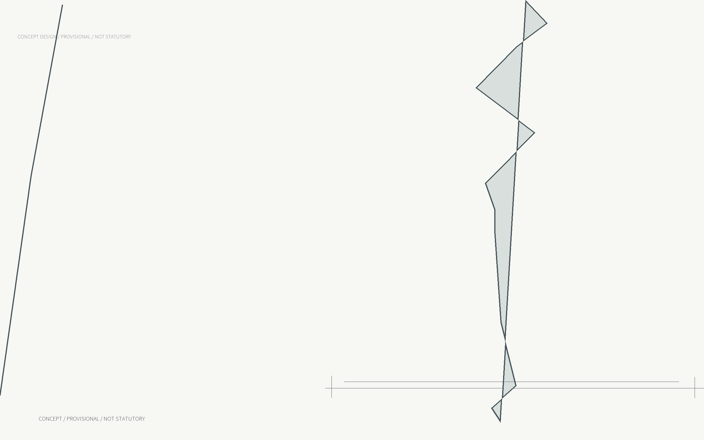

## Blue-green Space, Public Realm, and Urban Character

Blue-green space combines stormwater, shade, ecological maintenance, and public stay. Public realm supports daily movement, staffed service, test separation, and cultural display. Basic public and ecological functions remain after device shutdown, and colour never carries status alone. This section separates design intent, evidence limits, spatial objects, metric implications, and data gaps. Concept geometry is used only for relative placement and option comparison; all areas, boundaries, ownership, capacity, operating responsibility, and approval conclusions must be recalculated after authoritative survey, controls, transport, utilities, fire, heritage, accessibility, and public-consultation evidence arrive. The compatibility residual is not new construction or an existing classification and does not expand direct intervention; it only closes the legacy file topology contract. This section also explains how design intent becomes traceable objects: official calls, taskbooks, laws, and public sources establish public-interest and expression limits; Gate B concept geometry records relative position, connections, and spatial prototypes; Gate C projects, scenarios, metrics, and phases record implementation responsibility, human review, stop conditions, and evidence closure. Areas, lengths, counts, and ratios are recalculated only where sources and formulas are explicit; fields without survey, controls, ownership, transport, utilities, fire, heritage, accessibility, operating-roster, or public-consultation evidence remain unknown, target, or future monitoring. Every automated service retains staffed, paper, phone, explanation, withdrawal, and exit routes. The compatibility projection serves legacy file format only and does not assert statutory planning, approval, redlines, land classification, ownership, construction scale, or government commitment. [data:geometry/phasing.geojson#PHASE-01]

## Renewal Projects, Implementation Policy, and Phasing

Twelve renewal projects advance in three phases, each passing public-path, accessibility, data-governance, operating-budget, and professional-approval gates. Projects can return to reversible pilots; failed services publish reasons and exit; project-scenario relations remain in structured traceability. This section separates design intent, evidence limits, spatial objects, metric implications, and data gaps. Concept geometry is used only for relative placement and option comparison; all areas, boundaries, ownership, capacity, operating responsibility, and approval conclusions must be recalculated after authoritative survey, controls, transport, utilities, fire, heritage, accessibility, and public-consultation evidence arrive. The compatibility residual is not new construction or an existing classification and does not expand direct intervention; it only closes the legacy file topology contract. This section also explains how design intent becomes traceable objects: official calls, taskbooks, laws, and public sources establish public-interest and expression limits; Gate B concept geometry records relative position, connections, and spatial prototypes; Gate C projects, scenarios, metrics, and phases record implementation responsibility, human review, stop conditions, and evidence closure. Areas, lengths, counts, and ratios are recalculated only where sources and formulas are explicit; fields without survey, controls, ownership, transport, utilities, fire, heritage, accessibility, operating-roster, or public-consultation evidence remain unknown, target, or future monitoring. Every automated service retains staffed, paper, phone, explanation, withdrawal, and exit routes. The compatibility projection serves legacy file format only and does not assert statutory planning, approval, redlines, land classification, ownership, construction scale, or government commitment. [metric:site_area_sqm]

## Metrics, Area Recalculation, and Compliance Matrix

Metrics are separated into geometric recalculation, delivery counts, and operating targets. Compatibility metrics serve the legacy visualization contract only within provisional geometry and carry compatibility_only and non-rights claims. Gate C target, monitoring, and unknown states remain in canonical_status extensions. This section separates design intent, evidence limits, spatial objects, metric implications, and data gaps. Concept geometry is used only for relative placement and option comparison; all areas, boundaries, ownership, capacity, operating responsibility, and approval conclusions must be recalculated after authoritative survey, controls, transport, utilities, fire, heritage, accessibility, and public-consultation evidence arrive. The compatibility residual is not new construction or an existing classification and does not expand direct intervention; it only closes the legacy file topology contract. This section also explains how design intent becomes traceable objects: official calls, taskbooks, laws, and public sources establish public-interest and expression limits; Gate B concept geometry records relative position, connections, and spatial prototypes; Gate C projects, scenarios, metrics, and phases record implementation responsibility, human review, stop conditions, and evidence closure. Areas, lengths, counts, and ratios are recalculated only where sources and formulas are explicit; fields without survey, controls, ownership, transport, utilities, fire, heritage, accessibility, operating-roster, or public-consultation evidence remain unknown, target, or future monitoring. Every automated service retains staffed, paper, phone, explanation, withdrawal, and exit routes. The compatibility projection serves legacy file format only and does not assert statutory planning, approval, redlines, land classification, ownership, construction scale, or government commitment. [source:OFFICIAL-ANNOUNCEMENT]

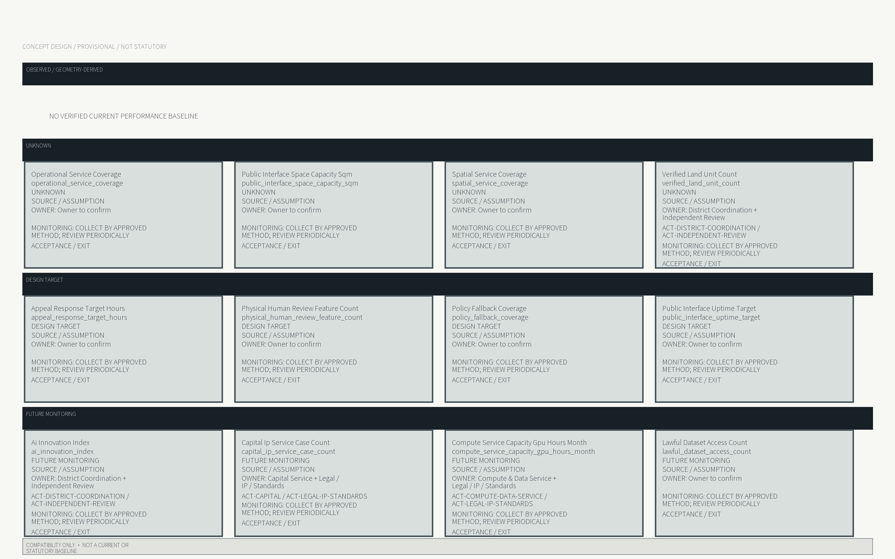

## Risks, Copyright, and Compliance

Primary risks are provisional geometry being mistaken for redlines, public space being occupied by tests, service degradation after consent refusal, failed staffed paths, and insufficient operating budgets. Text, geometry, and code-generated graphics are agent-generated; laws and cases are cited only, and professional sign-off follows authoritative recalculation. This section separates design intent, evidence limits, spatial objects, metric implications, and data gaps. Concept geometry is used only for relative placement and option comparison; all areas, boundaries, ownership, capacity, operating responsibility, and approval conclusions must be recalculated after authoritative survey, controls, transport, utilities, fire, heritage, accessibility, and public-consultation evidence arrive. The compatibility residual is not new construction or an existing classification and does not expand direct intervention; it only closes the legacy file topology contract. This section also explains how design intent becomes traceable objects: official calls, taskbooks, laws, and public sources establish public-interest and expression limits; Gate B concept geometry records relative position, connections, and spatial prototypes; Gate C projects, scenarios, metrics, and phases record implementation responsibility, human review, stop conditions, and evidence closure. Areas, lengths, counts, and ratios are recalculated only where sources and formulas are explicit; fields without survey, controls, ownership, transport, utilities, fire, heritage, accessibility, operating-roster, or public-consultation evidence remain unknown, target, or future monitoring. Every automated service retains staffed, paper, phone, explanation, withdrawal, and exit routes. The compatibility projection serves legacy file format only and does not assert statutory planning, approval, redlines, land classification, ownership, construction scale, or government commitment. [depth:risk_missing_data]

## References

Complete sources, standards, assumptions, matrices, metrics, geometry, figures, and limitations are registered in machine-readable files. This package does not replace statutory planning, permits, ownership decisions, surveys, or construction documents; compatibility projection does not change Gate A, B, or C truth. This section separates design intent, evidence limits, spatial objects, metric implications, and data gaps. Concept geometry is used only for relative placement and option comparison; all areas, boundaries, ownership, capacity, operating responsibility, and approval conclusions must be recalculated after authoritative survey, controls, transport, utilities, fire, heritage, accessibility, and public-consultation evidence arrive. The compatibility residual is not new construction or an existing classification and does not expand direct intervention; it only closes the legacy file topology contract. This section also explains how design intent becomes traceable objects: official calls, taskbooks, laws, and public sources establish public-interest and expression limits; Gate B concept geometry records relative position, connections, and spatial prototypes; Gate C projects, scenarios, metrics, and phases record implementation responsibility, human review, stop conditions, and evidence closure. Areas, lengths, counts, and ratios are recalculated only where sources and formulas are explicit; fields without survey, controls, ownership, transport, utilities, fire, heritage, accessibility, operating-roster, or public-consultation evidence remain unknown, target, or future monitoring. Every automated service retains staffed, paper, phone, explanation, withdrawal, and exit routes. The compatibility projection serves legacy file format only and does not assert statutory planning, approval, redlines, land classification, ownership, construction scale, or government commitment. [source:SOURCE-REGISTRY]

## Concept and Public Interface

A continuous public interface connects three endpoints while a staffed path runs beside automation.

<!-- FIG-01 -->

<!-- FIG-03 -->
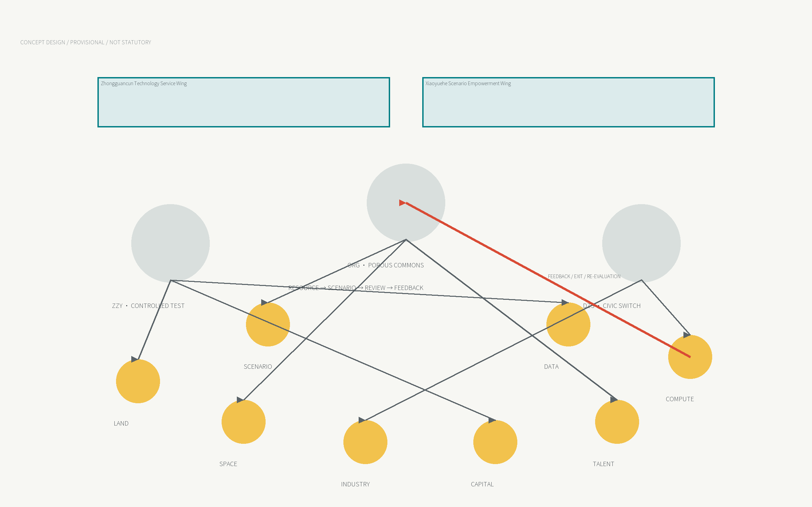

## Evidence Tiers and Source Limits

Formal, Background, and Provisional evidence are separated so recalculation needs remain visible.

<!-- FIG-02 -->
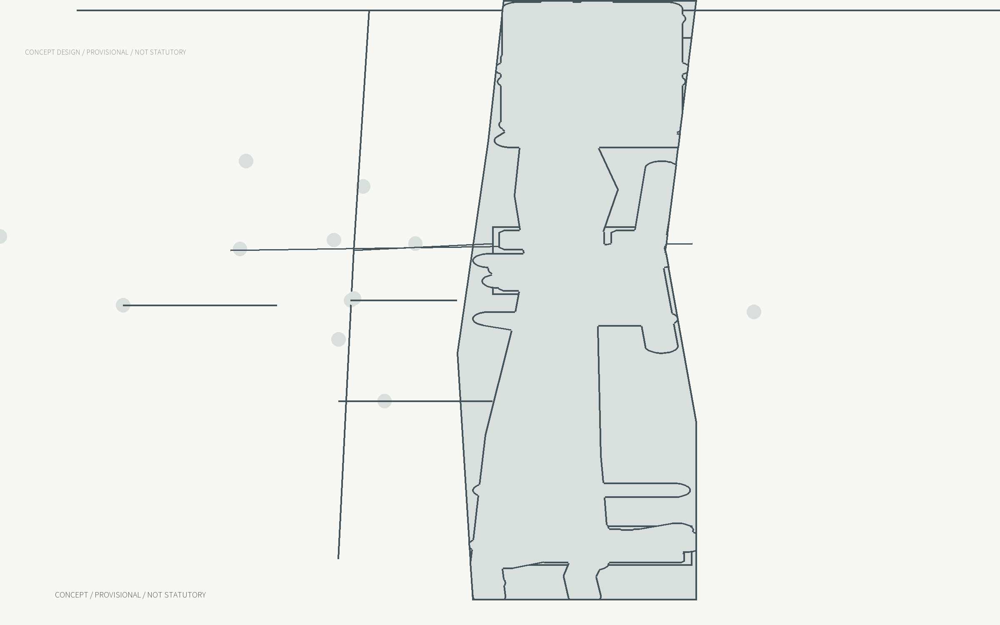

## Three Levels and Ecosystem Relations

Research, overall design, and detailed areas answer ecosystem, structure, and prototype questions.

<!-- FIG-03 -->

## Overall Urban-design Masterplan

The overall structure combines the public interface, blue-green network, gateways, and twelve renewal projects.

<!-- FIG-04 -->

<!-- FIG-05 -->
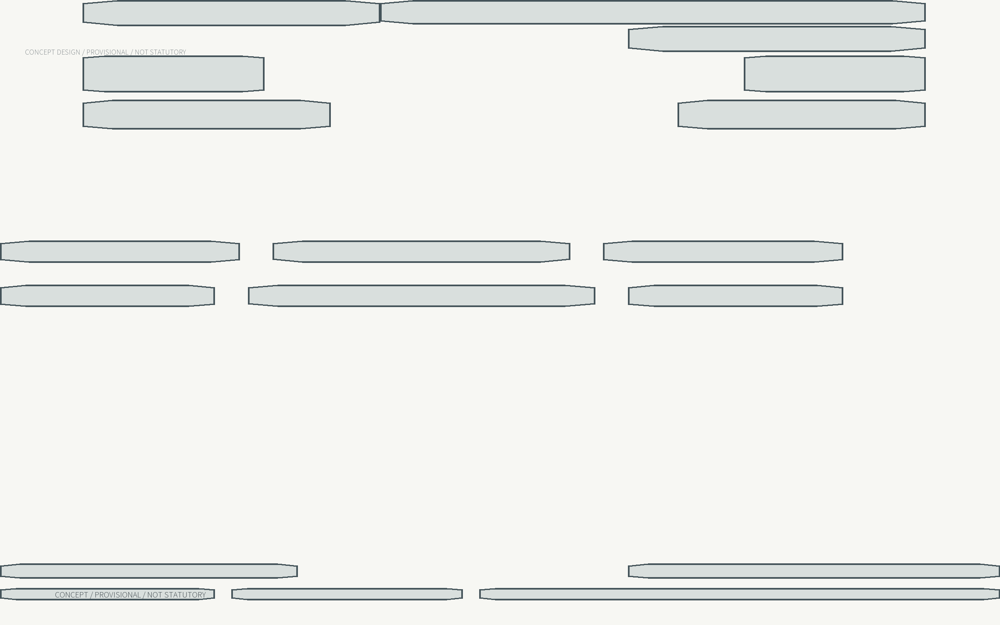

## ZZY Controlled Test Yard

Boundaries, booking, human review, and physical stop conditions contain safe testing.

<!-- FIG-08 -->

## ORG Porous Commons

A four-direction commons connects campus, neighbourhood, and enterprise through shared repair tables.

<!-- FIG-09 -->
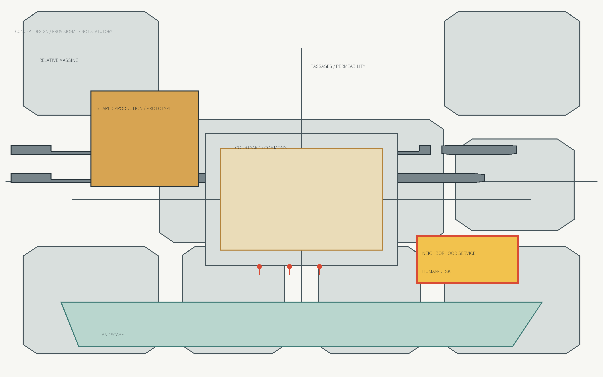

## DZS Urban Switchboard

Consent, appeal, service, and culture meet at the station interface; refusal never reduces basic service.

<!-- FIG-10 -->
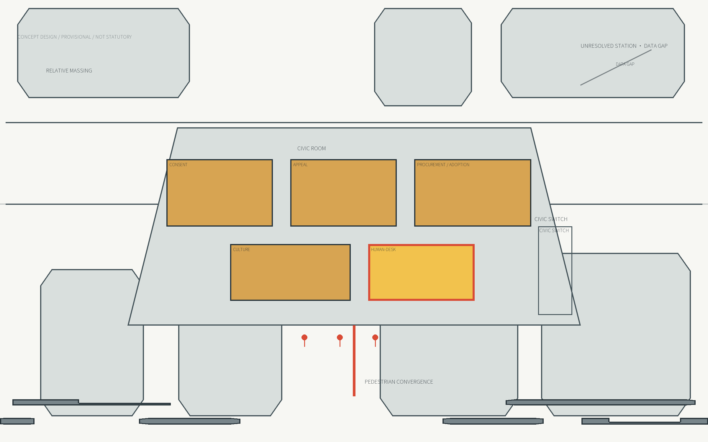

## Twelve Scenarios and Staffed Fallback

All twelve scenarios retain minimum data, staffed paths, and explicit stop conditions.

<!-- FIG-14 -->
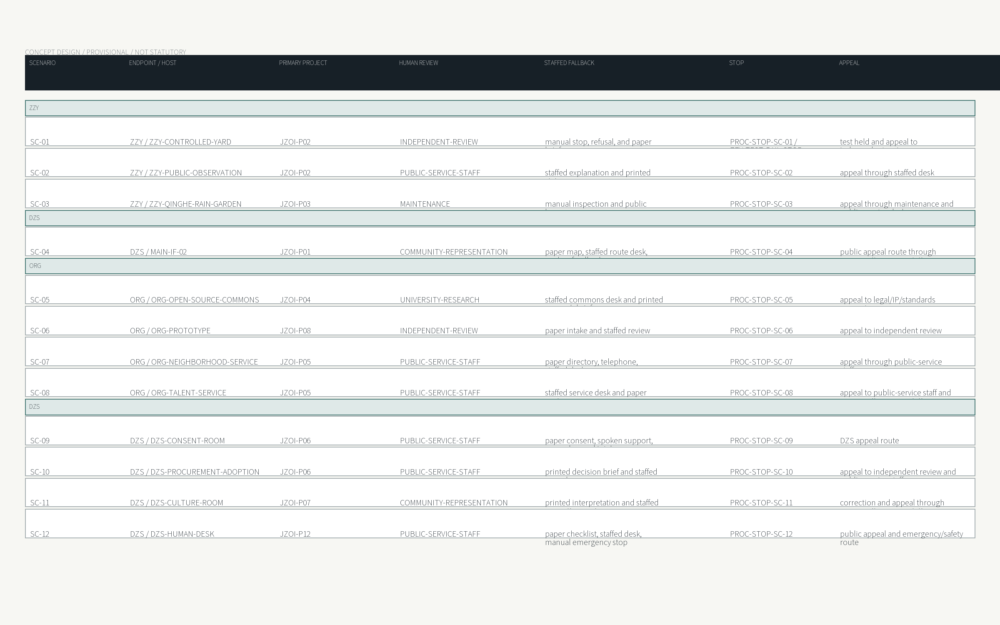

## Landmarks, Components, and Identity

Landmarks and components express responsibility, interface status, human review, and no-device access.

<!-- FIG-12 -->
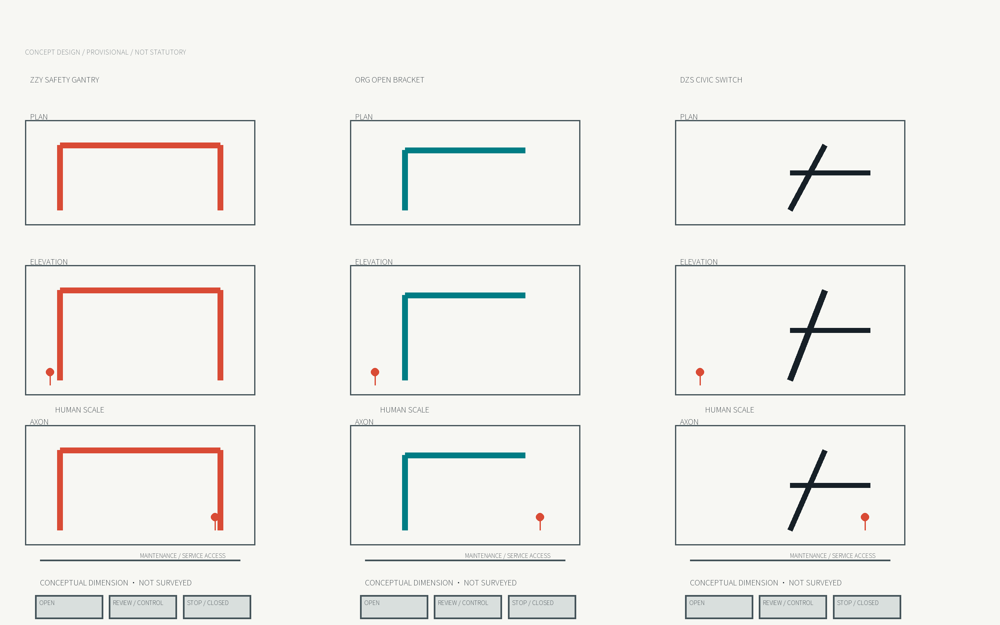

<!-- FIG-13 -->
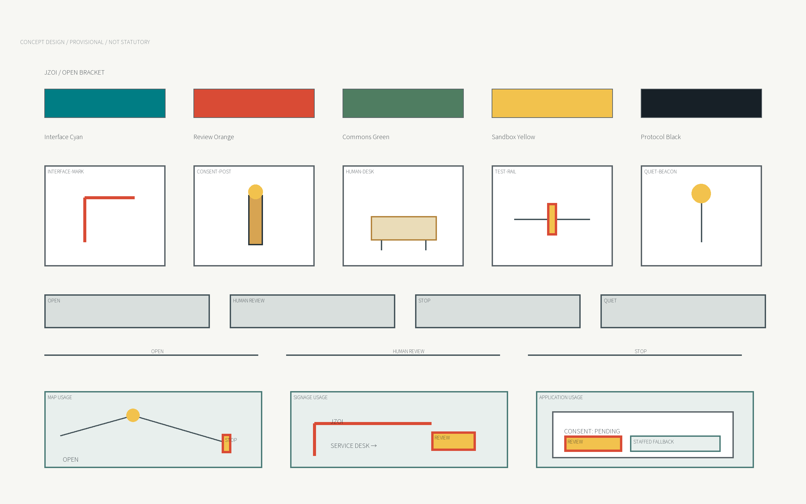

## Implementation Projects and Phasing

Twelve projects move through three phases while evidence gaps remain explicit and traceable.

<!-- FIG-15 -->
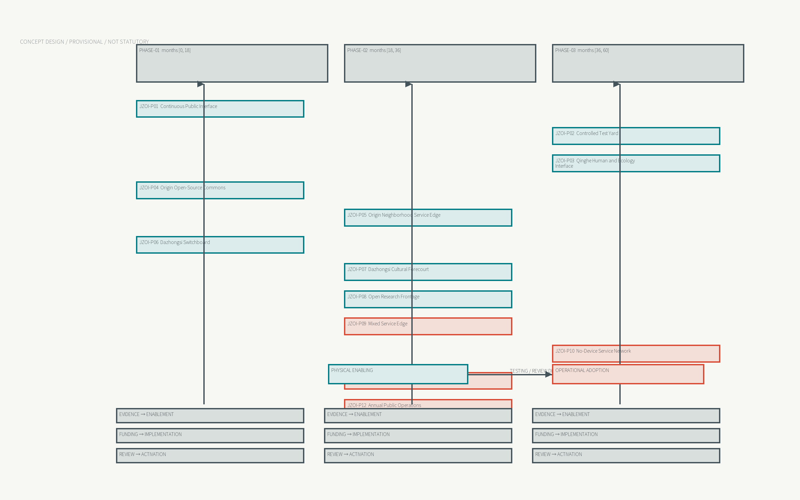

## Metrics, Evidence, Monitoring, and Exit

Recalculated geometry, delivery counts, and operational targets stay separate so failure can trigger stop and recalculation.

<!-- FIG-16 -->

## Risks, Rights, and Professional Limits

Provisional boundaries, ownership, controls, utilities, heritage, and operating budgets remain prerequisites.

<!-- FIG-06 -->

<!-- FIG-07 -->
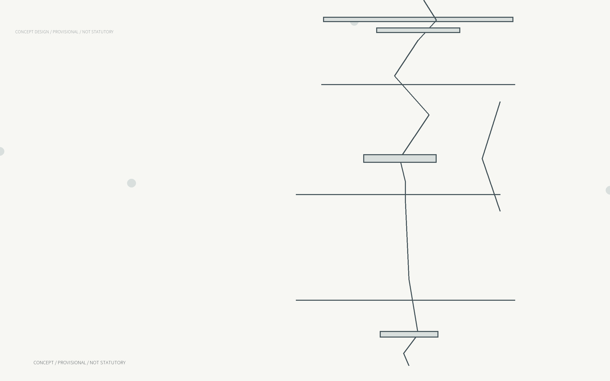

<!-- FIG-11 -->
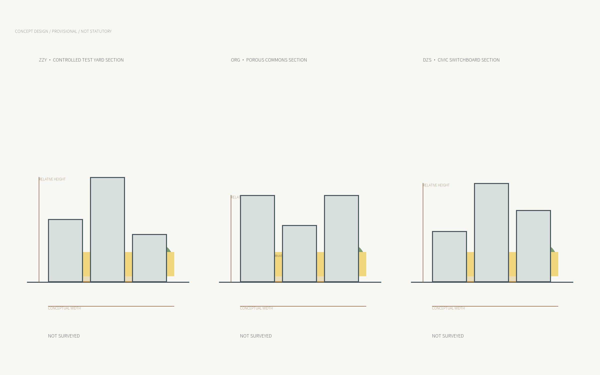

## Glossary

- **Controlled Test Yard** / 受控测试院
- **Porous Commons** / 多孔协作院
- **Urban Switchboard** / 城市交换台
- **Human Review Gate** / 人工复核门
- **Staffed Fallback** / 人工服务回退
- **Non-digital Access** / 无设备通行
- **Blue-green Public Space** / 蓝绿公共空间
- **Three-tier Scope** / 三层范围

<!-- generated-by: build_deliverables.py language=en.en -->
