# 京张开放接口：从证据到公共端点

以三层范围、连续公共接口和三种差异化端点，把AI创新转译为可复核、可拒绝、可停用、可重算的城市设计与实施框架。

> 概念设计与临时几何；不是法定红线、测绘、施工图或政府承诺。

## 设计依据与资料清单

证据分层、来源边界、临时范围和法律约束均被明确记录。Formal 资料约束任务和公共利益，Background 资料只提供可迁移方法，Provisional 资料只支持相对定位和后续重算。 本节把设计意图、证据边界、空间对象、指标影响和资料缺口分别写清：概念几何只用于相对定位与方案比较，所有面积、边界、权属、容量、运营责任和审批结论均须在正式测绘、控规、交通、市政、消防、文保、无障碍和公众协商资料到位后重算。兼容性残差不代表新增建设，不代表现状分类，也不改变直接干预范围；它只帮助旧版文件检查拓扑闭合。 本节进一步说明设计意图如何落到可追踪对象：先以正式公告、任务书、法律和公开资料确定公共利益与表达边界，再以Gate B概念几何表达相对位置、连接关系和空间原型，最后由Gate C项目、场景、指标和分期记录实施责任、人工复核、停止条件和证据闭环。面积、长度、数量和比例只在明确来源与公式时复算；没有测绘、控规、权属、交通、市政、消防、文保、无障碍、运营班次或公众协商资料的字段保持unknown、目标或未来监测。任何自动服务都必须保留人工办理、纸本、电话、解释、撤回和退出路径。兼容性投影只为旧版文件格式服务，不代表新的法定规划、审批、红线、土地分类、产权、建设规模或政府承诺。 [source:SOURCE-REGISTRY]

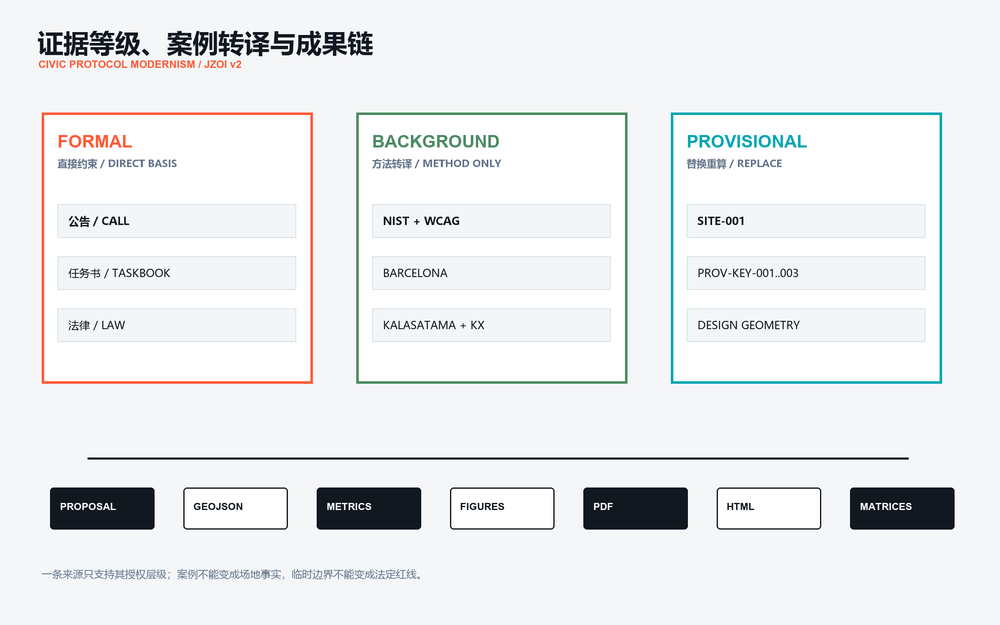

## 三层范围工作框架

三层范围分别回答生态关系、连续城市结构和可实施原型问题。统筹研究范围不新增红线，总体设计范围承载主接口和项目网络，重点区域验证三种差异化端点。 本节把设计意图、证据边界、空间对象、指标影响和资料缺口分别写清：概念几何只用于相对定位与方案比较，所有面积、边界、权属、容量、运营责任和审批结论均须在正式测绘、控规、交通、市政、消防、文保、无障碍和公众协商资料到位后重算。兼容性残差不代表新增建设，不代表现状分类，也不改变直接干预范围；它只帮助旧版文件检查拓扑闭合。 本节进一步说明设计意图如何落到可追踪对象：先以正式公告、任务书、法律和公开资料确定公共利益与表达边界，再以Gate B概念几何表达相对位置、连接关系和空间原型，最后由Gate C项目、场景、指标和分期记录实施责任、人工复核、停止条件和证据闭环。面积、长度、数量和比例只在明确来源与公式时复算；没有测绘、控规、权属、交通、市政、消防、文保、无障碍、运营班次或公众协商资料的字段保持unknown、目标或未来监测。任何自动服务都必须保留人工办理、纸本、电话、解释、撤回和退出路径。兼容性投影只为旧版文件格式服务，不代表新的法定规划、审批、红线、土地分类、产权、建设规模或政府承诺。 [data:geometry/site_boundary.geojson#SITE-001]

## 统筹研究范围产业与未来城市研究

产业生态由问题进入、受控验证、人工复核、公共采用和持续退出组成。高校、开源社群、企业、居民和独立评测者通过不同端点协作，运营责任和证据记录保持可追踪。 本节把设计意图、证据边界、空间对象、指标影响和资料缺口分别写清：概念几何只用于相对定位与方案比较，所有面积、边界、权属、容量、运营责任和审批结论均须在正式测绘、控规、交通、市政、消防、文保、无障碍和公众协商资料到位后重算。兼容性残差不代表新增建设，不代表现状分类，也不改变直接干预范围；它只帮助旧版文件检查拓扑闭合。 本节进一步说明设计意图如何落到可追踪对象：先以正式公告、任务书、法律和公开资料确定公共利益与表达边界，再以Gate B概念几何表达相对位置、连接关系和空间原型，最后由Gate C项目、场景、指标和分期记录实施责任、人工复核、停止条件和证据闭环。面积、长度、数量和比例只在明确来源与公式时复算；没有测绘、控规、权属、交通、市政、消防、文保、无障碍、运营班次或公众协商资料的字段保持unknown、目标或未来监测。任何自动服务都必须保留人工办理、纸本、电话、解释、撤回和退出路径。兼容性投影只为旧版文件格式服务，不代表新的法定规划、审批、红线、土地分类、产权、建设规模或政府承诺。 [data:geometry/land_use.geojson#LU-RD-01]

## 总体设计范围城市更新与控规深度城市设计

总体设计只对公共接口、蓝绿网络、门户、服务边缘和十二个项目提出概念结构。容积率、法定高度、权属、道路红线和工程容量保持未知，待正式资料到位后重算。 本节把设计意图、证据边界、空间对象、指标影响和资料缺口分别写清：概念几何只用于相对定位与方案比较，所有面积、边界、权属、容量、运营责任和审批结论均须在正式测绘、控规、交通、市政、消防、文保、无障碍和公众协商资料到位后重算。兼容性残差不代表新增建设，不代表现状分类，也不改变直接干预范围；它只帮助旧版文件检查拓扑闭合。 本节进一步说明设计意图如何落到可追踪对象：先以正式公告、任务书、法律和公开资料确定公共利益与表达边界，再以Gate B概念几何表达相对位置、连接关系和空间原型，最后由Gate C项目、场景、指标和分期记录实施责任、人工复核、停止条件和证据闭环。面积、长度、数量和比例只在明确来源与公式时复算；没有测绘、控规、权属、交通、市政、消防、文保、无障碍、运营班次或公众协商资料的字段保持unknown、目标或未来监测。任何自动服务都必须保留人工办理、纸本、电话、解释、撤回和退出路径。兼容性投影只为旧版文件格式服务，不代表新的法定规划、审批、红线、土地分类、产权、建设规模或政府承诺。 [data:geometry/public_space.geojson#ZZY-SB-01]

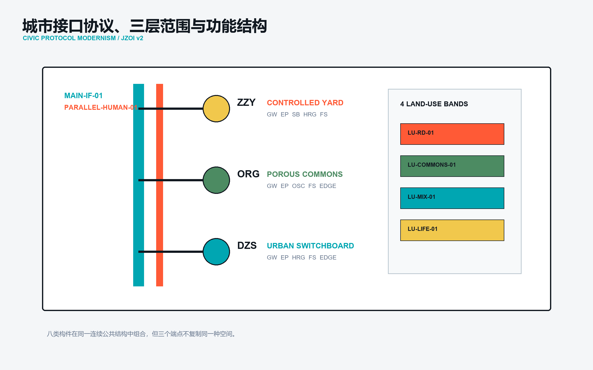

## 重点区域详细设计

众智园、AI原点社区和大钟寺共享公共接口协议，但分别形成受控测试院、多孔协作院和城市交换台。每处端点都有空间对象、人工路径、停止条件、责任角色和可复核图件。 本节把设计意图、证据边界、空间对象、指标影响和资料缺口分别写清：概念几何只用于相对定位与方案比较，所有面积、边界、权属、容量、运营责任和审批结论均须在正式测绘、控规、交通、市政、消防、文保、无障碍和公众协商资料到位后重算。兼容性残差不代表新增建设，不代表现状分类，也不改变直接干预范围；它只帮助旧版文件检查拓扑闭合。 本节进一步说明设计意图如何落到可追踪对象：先以正式公告、任务书、法律和公开资料确定公共利益与表达边界，再以Gate B概念几何表达相对位置、连接关系和空间原型，最后由Gate C项目、场景、指标和分期记录实施责任、人工复核、停止条件和证据闭环。面积、长度、数量和比例只在明确来源与公式时复算；没有测绘、控规、权属、交通、市政、消防、文保、无障碍、运营班次或公众协商资料的字段保持unknown、目标或未来监测。任何自动服务都必须保留人工办理、纸本、电话、解释、撤回和退出路径。兼容性投影只为旧版文件格式服务，不代表新的法定规划、审批、红线、土地分类、产权、建设规模或政府承诺。 [source:PIPL-2021]

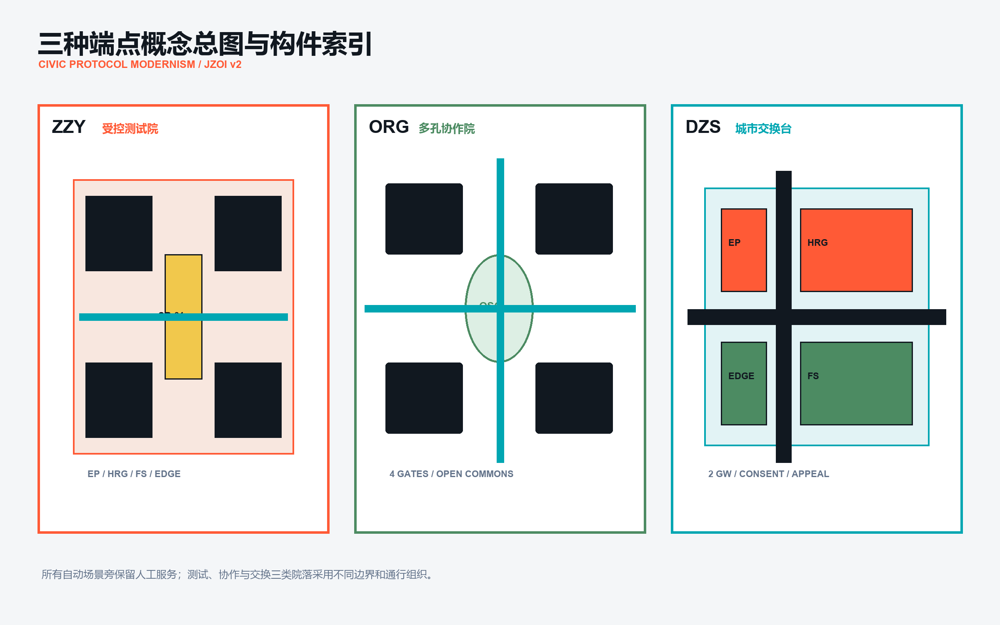

## AI 创新生态、人才画像与 AI+ 场景

使用者包括初创团队、师生、企业运营者、无设备居民、残障人士和周边居民。十二个AI场景坚持最小数据、显著告知、便捷撤回、人工解释和停止条件，基本服务不以自动决策或智能手机为唯一入口。 本节把设计意图、证据边界、空间对象、指标影响和资料缺口分别写清：概念几何只用于相对定位与方案比较，所有面积、边界、权属、容量、运营责任和审批结论均须在正式测绘、控规、交通、市政、消防、文保、无障碍和公众协商资料到位后重算。兼容性残差不代表新增建设，不代表现状分类，也不改变直接干预范围；它只帮助旧版文件检查拓扑闭合。 本节进一步说明设计意图如何落到可追踪对象：先以正式公告、任务书、法律和公开资料确定公共利益与表达边界，再以Gate B概念几何表达相对位置、连接关系和空间原型，最后由Gate C项目、场景、指标和分期记录实施责任、人工复核、停止条件和证据闭环。面积、长度、数量和比例只在明确来源与公式时复算；没有测绘、控规、权属、交通、市政、消防、文保、无障碍、运营班次或公众协商资料的字段保持unknown、目标或未来监测。任何自动服务都必须保留人工办理、纸本、电话、解释、撤回和退出路径。兼容性投影只为旧版文件格式服务，不代表新的法定规划、审批、红线、土地分类、产权、建设规模或政府承诺。 [data:geometry/buildings.geojson#ORG-EP-01]

## 用地、建筑规模与拆改留方案

用地和建筑对象表达概念方案而非法定地块。直接干预集中于约1.713平方公里的概念用地程序，SITE_BOUNDARY剩余部分仅作为未解决背景和兼容性分析残差，不主张任何法定用地分类。 本节把设计意图、证据边界、空间对象、指标影响和资料缺口分别写清：概念几何只用于相对定位与方案比较，所有面积、边界、权属、容量、运营责任和审批结论均须在正式测绘、控规、交通、市政、消防、文保、无障碍和公众协商资料到位后重算。兼容性残差不代表新增建设，不代表现状分类，也不改变直接干预范围；它只帮助旧版文件检查拓扑闭合。 本节进一步说明设计意图如何落到可追踪对象：先以正式公告、任务书、法律和公开资料确定公共利益与表达边界，再以Gate B概念几何表达相对位置、连接关系和空间原型，最后由Gate C项目、场景、指标和分期记录实施责任、人工复核、停止条件和证据闭环。面积、长度、数量和比例只在明确来源与公式时复算；没有测绘、控规、权属、交通、市政、消防、文保、无障碍、运营班次或公众协商资料的字段保持unknown、目标或未来监测。任何自动服务都必须保留人工办理、纸本、电话、解释、撤回和退出路径。兼容性投影只为旧版文件格式服务，不代表新的法定规划、审批、红线、土地分类、产权、建设规模或政府承诺。 [data:geometry/green_space.geojson#GREEN-MAIN-01]

## 交通、轨道、市政与公共服务设施

主接口与人工路径保持连续，门户、慢行、应急、物流和无障碍条件分层表达。背景道路只作为现状参考，概念路径不被错误投影为道路红线；市政、轨道和服务容量均需专业资料校准。 本节把设计意图、证据边界、空间对象、指标影响和资料缺口分别写清：概念几何只用于相对定位与方案比较，所有面积、边界、权属、容量、运营责任和审批结论均须在正式测绘、控规、交通、市政、消防、文保、无障碍和公众协商资料到位后重算。兼容性残差不代表新增建设，不代表现状分类，也不改变直接干预范围；它只帮助旧版文件检查拓扑闭合。 本节进一步说明设计意图如何落到可追踪对象：先以正式公告、任务书、法律和公开资料确定公共利益与表达边界，再以Gate B概念几何表达相对位置、连接关系和空间原型，最后由Gate C项目、场景、指标和分期记录实施责任、人工复核、停止条件和证据闭环。面积、长度、数量和比例只在明确来源与公式时复算；没有测绘、控规、权属、交通、市政、消防、文保、无障碍、运营班次或公众协商资料的字段保持unknown、目标或未来监测。任何自动服务都必须保留人工办理、纸本、电话、解释、撤回和退出路径。兼容性投影只为旧版文件格式服务，不代表新的法定规划、审批、红线、土地分类、产权、建设规模或政府承诺。 [data:geometry/roads.geojson#MAIN-IF-01]

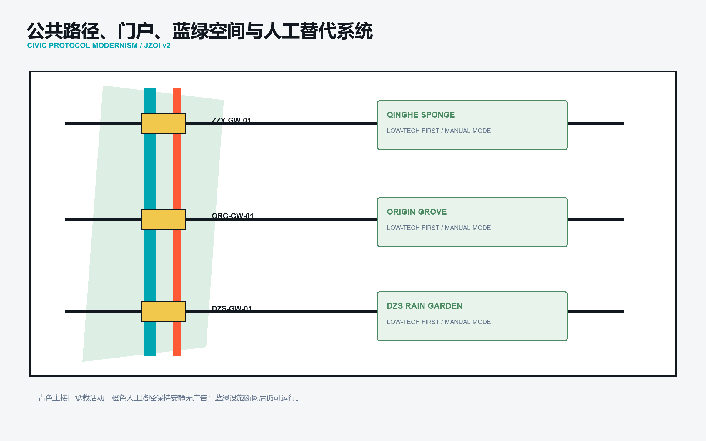

## 蓝绿空间、公共空间与城市风貌

蓝绿空间把雨洪、树荫、生态维护和公共停留结合起来，公共空间同时容纳日常通行、人工办理、测试隔离和文化展示。设施停用后仍保留基本公共与生态功能，颜色不单独传递状态。 本节把设计意图、证据边界、空间对象、指标影响和资料缺口分别写清：概念几何只用于相对定位与方案比较，所有面积、边界、权属、容量、运营责任和审批结论均须在正式测绘、控规、交通、市政、消防、文保、无障碍和公众协商资料到位后重算。兼容性残差不代表新增建设，不代表现状分类，也不改变直接干预范围；它只帮助旧版文件检查拓扑闭合。 本节进一步说明设计意图如何落到可追踪对象：先以正式公告、任务书、法律和公开资料确定公共利益与表达边界，再以Gate B概念几何表达相对位置、连接关系和空间原型，最后由Gate C项目、场景、指标和分期记录实施责任、人工复核、停止条件和证据闭环。面积、长度、数量和比例只在明确来源与公式时复算；没有测绘、控规、权属、交通、市政、消防、文保、无障碍、运营班次或公众协商资料的字段保持unknown、目标或未来监测。任何自动服务都必须保留人工办理、纸本、电话、解释、撤回和退出路径。兼容性投影只为旧版文件格式服务，不代表新的法定规划、审批、红线、土地分类、产权、建设规模或政府承诺。 [data:geometry/phasing.geojson#PHASE-01]

## 更新项目清单、实施政策与分期计划

十二个更新项目按三期推进，每期通过公共路径、无障碍、数据治理、运营预算和专业审批门槛。项目可以缩回可逆试点，未达标的服务公布原因并退出，项目与场景关系保留在结构化追踪文件。 本节把设计意图、证据边界、空间对象、指标影响和资料缺口分别写清：概念几何只用于相对定位与方案比较，所有面积、边界、权属、容量、运营责任和审批结论均须在正式测绘、控规、交通、市政、消防、文保、无障碍和公众协商资料到位后重算。兼容性残差不代表新增建设，不代表现状分类，也不改变直接干预范围；它只帮助旧版文件检查拓扑闭合。 本节进一步说明设计意图如何落到可追踪对象：先以正式公告、任务书、法律和公开资料确定公共利益与表达边界，再以Gate B概念几何表达相对位置、连接关系和空间原型，最后由Gate C项目、场景、指标和分期记录实施责任、人工复核、停止条件和证据闭环。面积、长度、数量和比例只在明确来源与公式时复算；没有测绘、控规、权属、交通、市政、消防、文保、无障碍、运营班次或公众协商资料的字段保持unknown、目标或未来监测。任何自动服务都必须保留人工办理、纸本、电话、解释、撤回和退出路径。兼容性投影只为旧版文件格式服务，不代表新的法定规划、审批、红线、土地分类、产权、建设规模或政府承诺。 [metric:site_area_sqm]

## 指标体系、面积复算与合规矩阵

指标分为几何复算、交付计数和运营目标。兼容性指标只在临时几何范围内服务旧版可视化契约，带有compatibility_only和非权利声明。Gate C目标、未来监测和未知状态保留在canonical_status扩展字段。 本节把设计意图、证据边界、空间对象、指标影响和资料缺口分别写清：概念几何只用于相对定位与方案比较，所有面积、边界、权属、容量、运营责任和审批结论均须在正式测绘、控规、交通、市政、消防、文保、无障碍和公众协商资料到位后重算。兼容性残差不代表新增建设，不代表现状分类，也不改变直接干预范围；它只帮助旧版文件检查拓扑闭合。 本节进一步说明设计意图如何落到可追踪对象：先以正式公告、任务书、法律和公开资料确定公共利益与表达边界，再以Gate B概念几何表达相对位置、连接关系和空间原型，最后由Gate C项目、场景、指标和分期记录实施责任、人工复核、停止条件和证据闭环。面积、长度、数量和比例只在明确来源与公式时复算；没有测绘、控规、权属、交通、市政、消防、文保、无障碍、运营班次或公众协商资料的字段保持unknown、目标或未来监测。任何自动服务都必须保留人工办理、纸本、电话、解释、撤回和退出路径。兼容性投影只为旧版文件格式服务，不代表新的法定规划、审批、红线、土地分类、产权、建设规模或政府承诺。 [source:OFFICIAL-ANNOUNCEMENT]

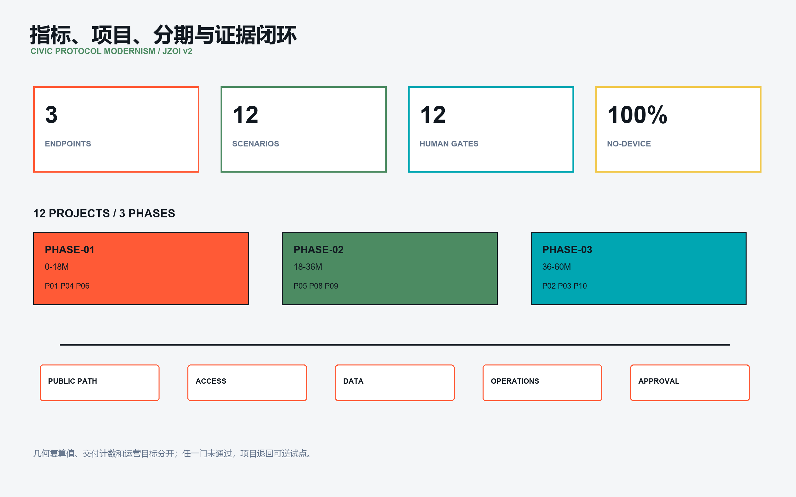

## 风险、版权与合规说明

主要风险是临时几何被误认红线、公共空间被测试占用、拒绝授权后服务降级、人工路径失效和运营预算不足。图文、几何和代码化图件由本次代理生成，法规和案例仅作来源引用，正式资料到位后必须重算和专业签认。 本节把设计意图、证据边界、空间对象、指标影响和资料缺口分别写清：概念几何只用于相对定位与方案比较，所有面积、边界、权属、容量、运营责任和审批结论均须在正式测绘、控规、交通、市政、消防、文保、无障碍和公众协商资料到位后重算。兼容性残差不代表新增建设，不代表现状分类，也不改变直接干预范围；它只帮助旧版文件检查拓扑闭合。 本节进一步说明设计意图如何落到可追踪对象：先以正式公告、任务书、法律和公开资料确定公共利益与表达边界，再以Gate B概念几何表达相对位置、连接关系和空间原型，最后由Gate C项目、场景、指标和分期记录实施责任、人工复核、停止条件和证据闭环。面积、长度、数量和比例只在明确来源与公式时复算；没有测绘、控规、权属、交通、市政、消防、文保、无障碍、运营班次或公众协商资料的字段保持unknown、目标或未来监测。任何自动服务都必须保留人工办理、纸本、电话、解释、撤回和退出路径。兼容性投影只为旧版文件格式服务，不代表新的法定规划、审批、红线、土地分类、产权、建设规模或政府承诺。 [depth:risk_missing_data]

## 参考资料

完整来源、标准、假设、矩阵、指标、几何、图件和局限均在机器可读文件中登记。此包不替代法定规划、建设许可、产权判断、测绘或施工图，兼容性投影不改变Gate A、Gate B或Gate C权威真相。 本节把设计意图、证据边界、空间对象、指标影响和资料缺口分别写清：概念几何只用于相对定位与方案比较，所有面积、边界、权属、容量、运营责任和审批结论均须在正式测绘、控规、交通、市政、消防、文保、无障碍和公众协商资料到位后重算。兼容性残差不代表新增建设，不代表现状分类，也不改变直接干预范围；它只帮助旧版文件检查拓扑闭合。 本节进一步说明设计意图如何落到可追踪对象：先以正式公告、任务书、法律和公开资料确定公共利益与表达边界，再以Gate B概念几何表达相对位置、连接关系和空间原型，最后由Gate C项目、场景、指标和分期记录实施责任、人工复核、停止条件和证据闭环。面积、长度、数量和比例只在明确来源与公式时复算；没有测绘、控规、权属、交通、市政、消防、文保、无障碍、运营班次或公众协商资料的字段保持unknown、目标或未来监测。任何自动服务都必须保留人工办理、纸本、电话、解释、撤回和退出路径。兼容性投影只为旧版文件格式服务，不代表新的法定规划、审批、红线、土地分类、产权、建设规模或政府承诺。 [source:SOURCE-REGISTRY]

## 方案总纲与公共接口

以连续公共接口连接三处端点，并让人工路径与自动服务并行。

<!-- FIG-01 -->
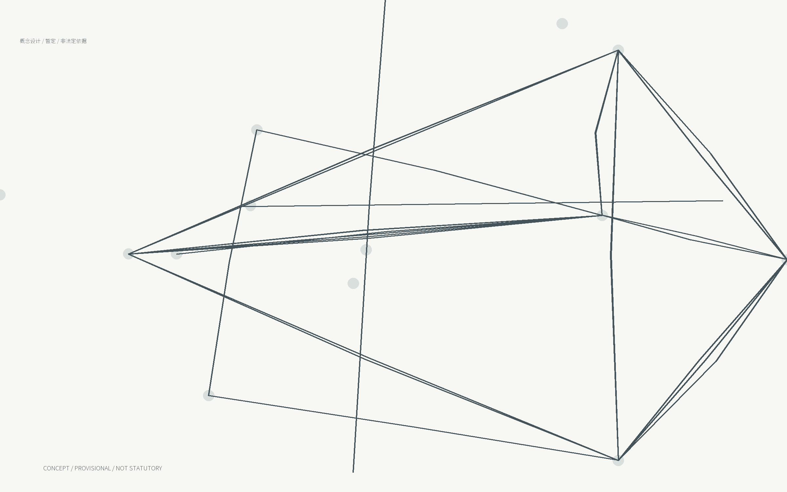

<!-- FIG-03 -->
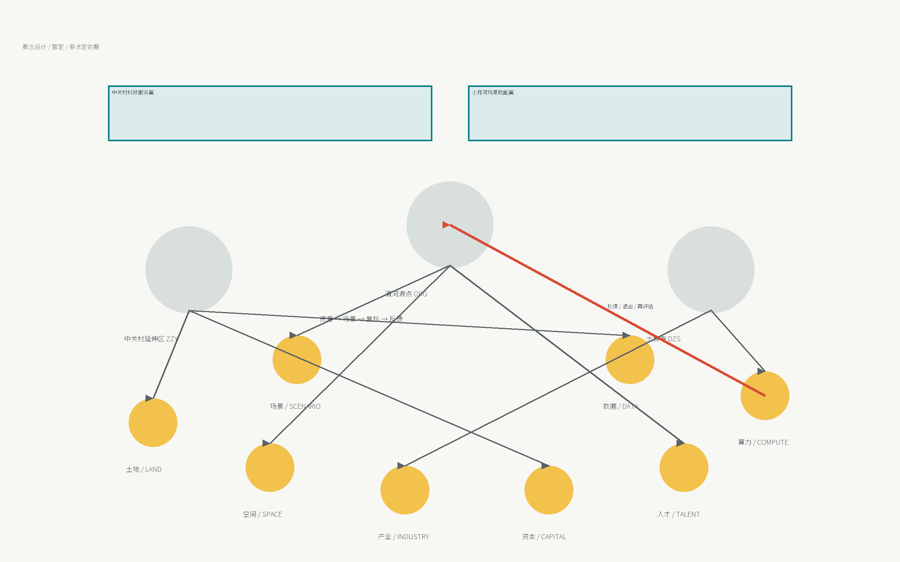

## 证据等级与资料边界

Formal、Background 与 Provisional 分层，明确哪些判断需要后续重算。

<!-- FIG-02 -->
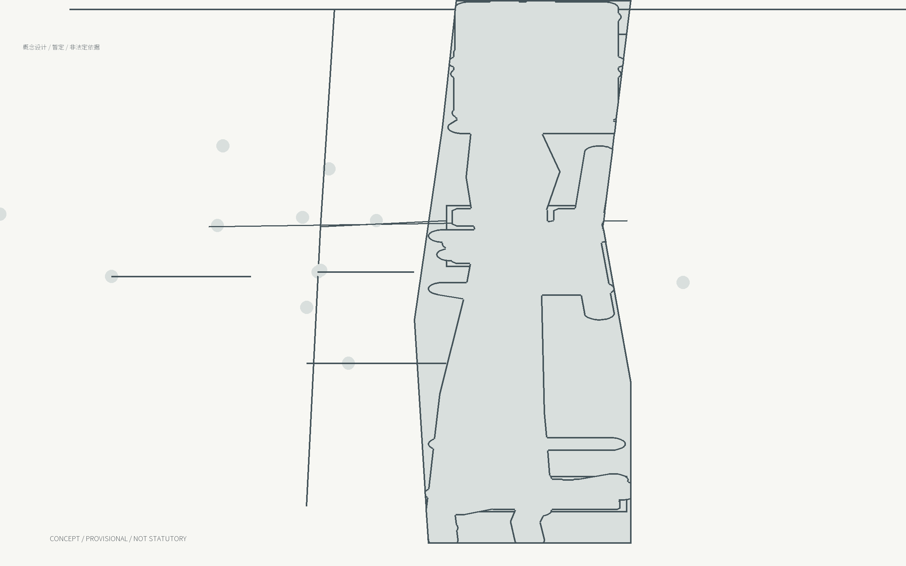

## 三层范围与生态关系

统筹研究、总体设计与重点区域分别回答生态、结构和原型问题。

<!-- FIG-03 -->

## 总体城市设计总图

总体结构由公共接口、蓝绿网络、门户和十二个更新项目组成。

<!-- FIG-04 -->
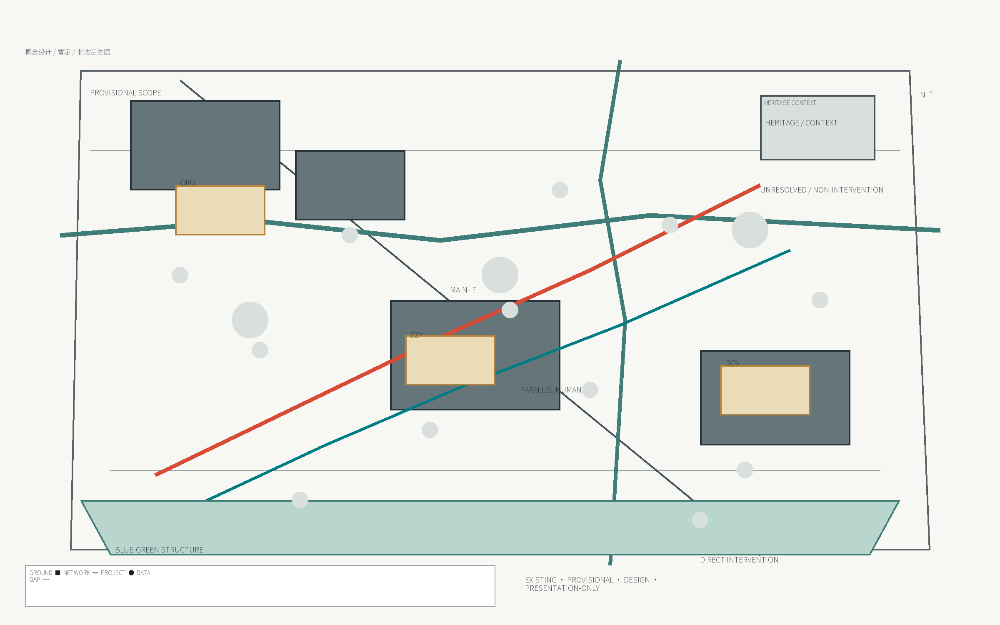

<!-- FIG-05 -->
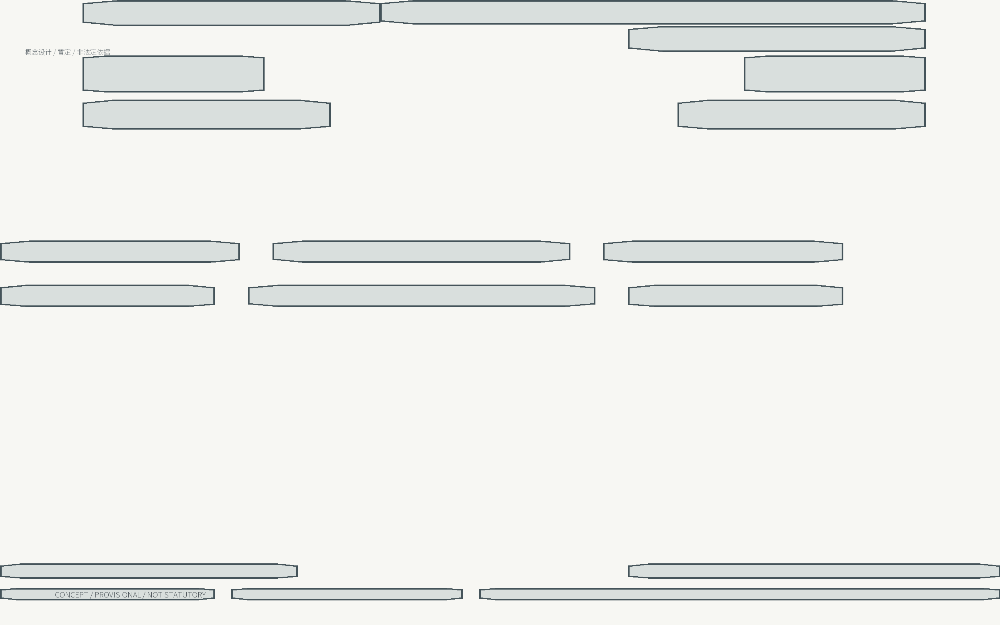

## 众智园受控测试院

边界、预约、人工复核和物理停机共同限定安全测试。

<!-- FIG-08 -->
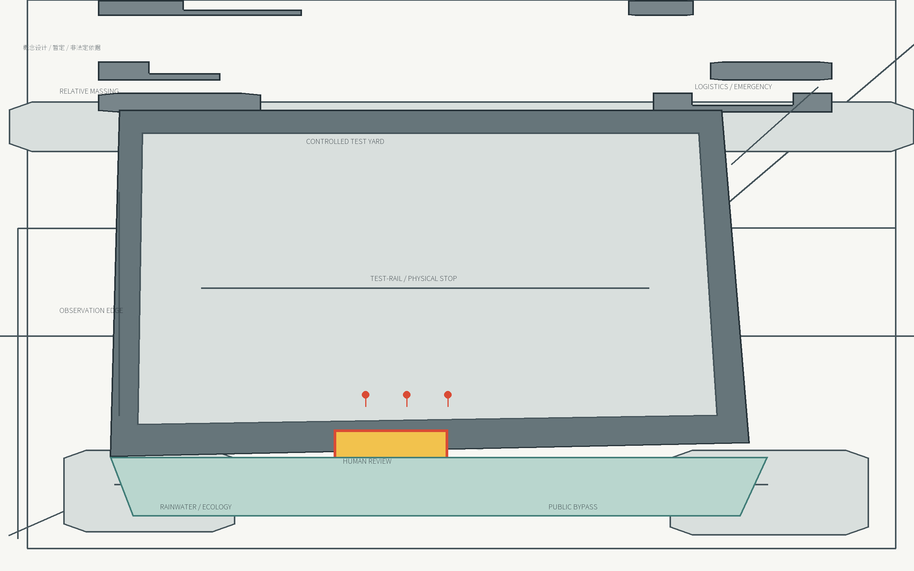

## AI原点多孔协作院

四向开放的协作公地把校园、社区和企业接到共同修复工作台。

<!-- FIG-09 -->
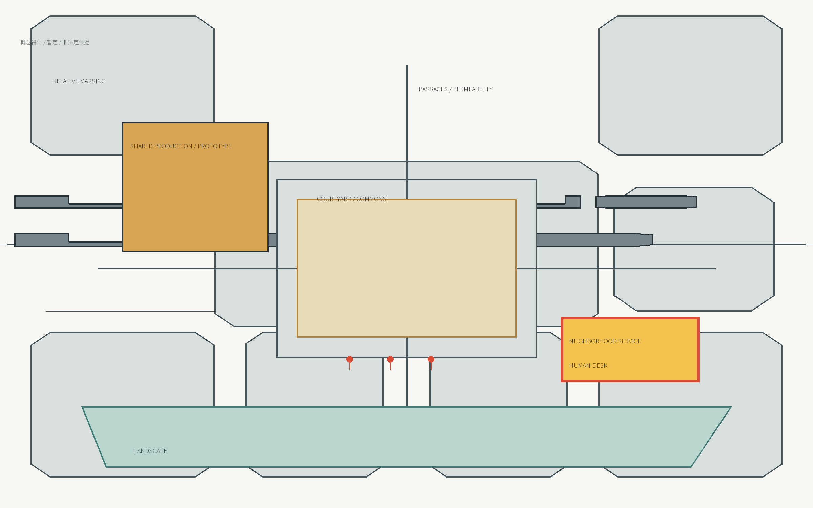

## 大钟寺城市交换台

授权、申诉、服务和文化展示在站城接口并置，拒绝授权不降低基本服务。

<!-- FIG-10 -->
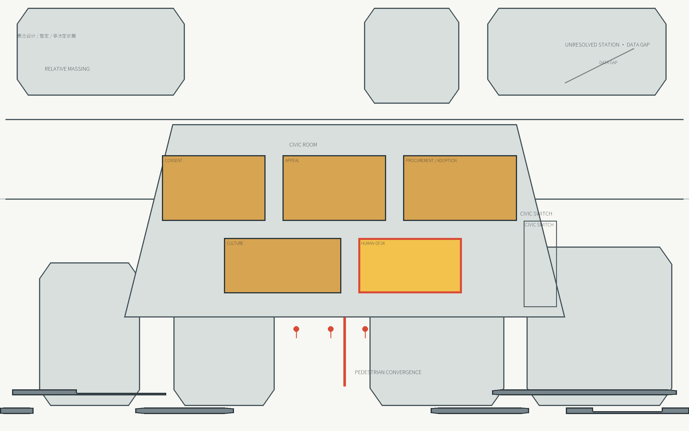

## 十二场景与人工回退

十二个场景均保留最小数据、人工路径和明确停止条件。

<!-- FIG-14 -->
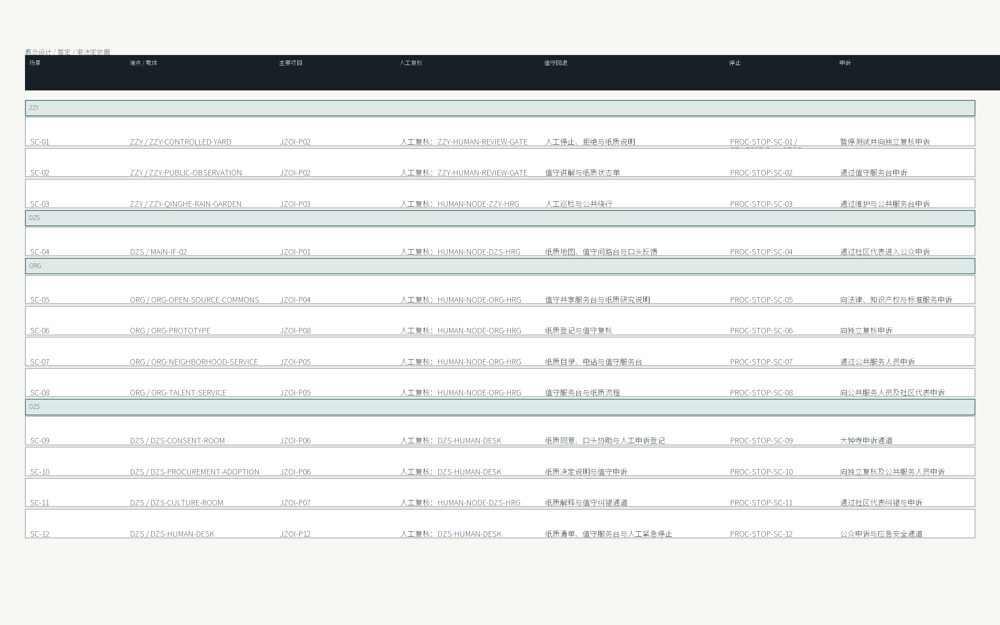

## 地标、构件与视觉识别

地标和构件同时表达责任边界、接口状态、人工复核与无设备可达。

<!-- FIG-12 -->
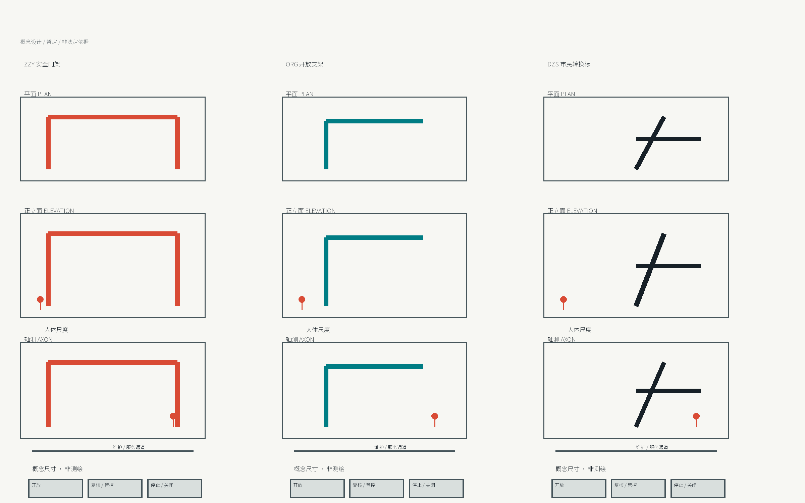

<!-- FIG-13 -->
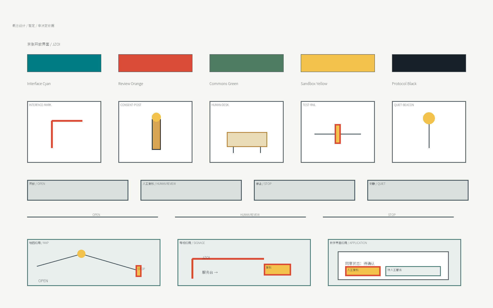

## 实施项目与分期依赖

十二个项目分为三期推进，前置资料缺口保持显式并可追踪。

<!-- FIG-15 -->
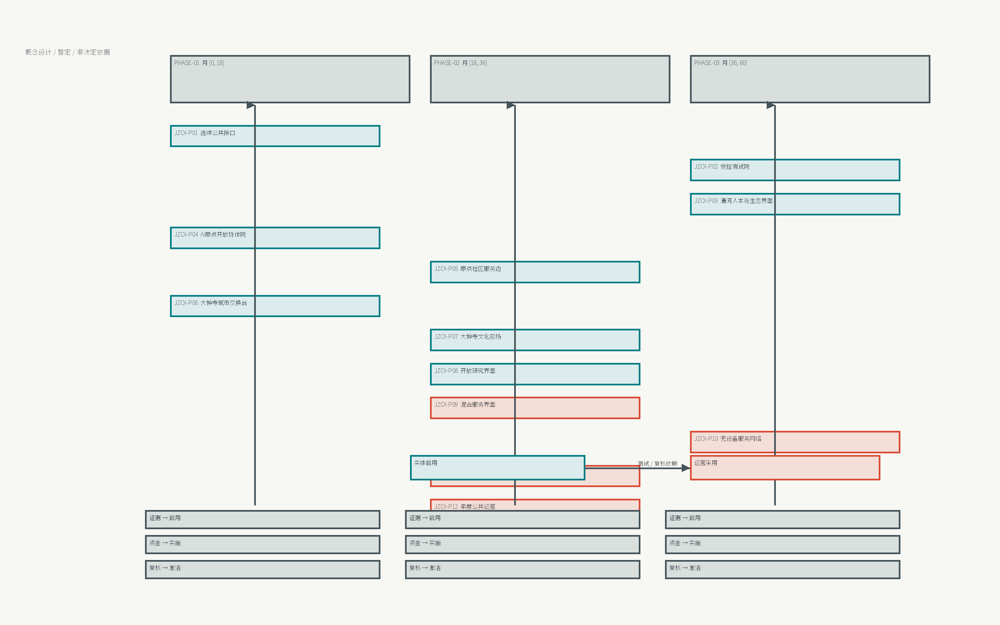

## 指标、证据与监测退出

几何复算值、交付计数和运营目标分开管理，失败时可停用和重算。

<!-- FIG-16 -->
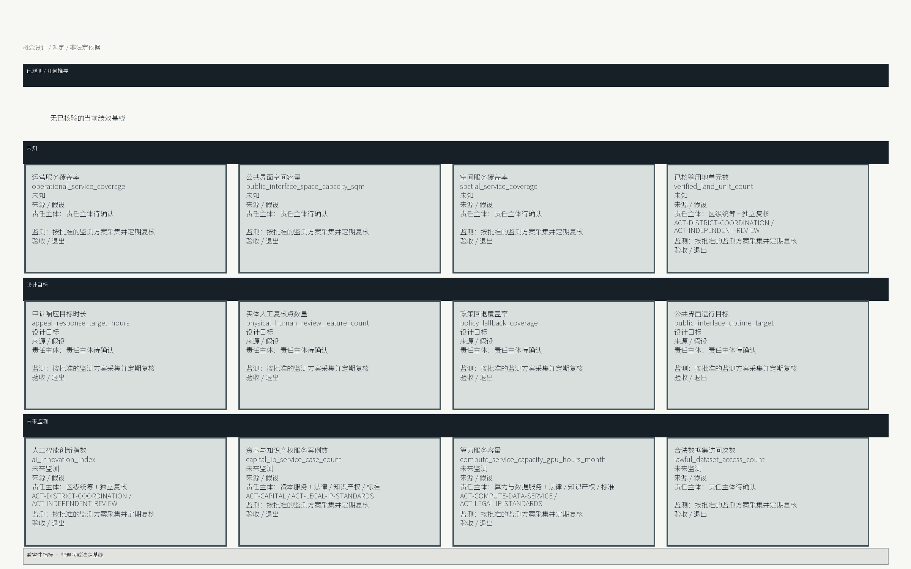

## 风险、权利与专业限制

临时边界、权属、控规、市政、文保和运营预算均是实施前置条件。

<!-- FIG-06 -->
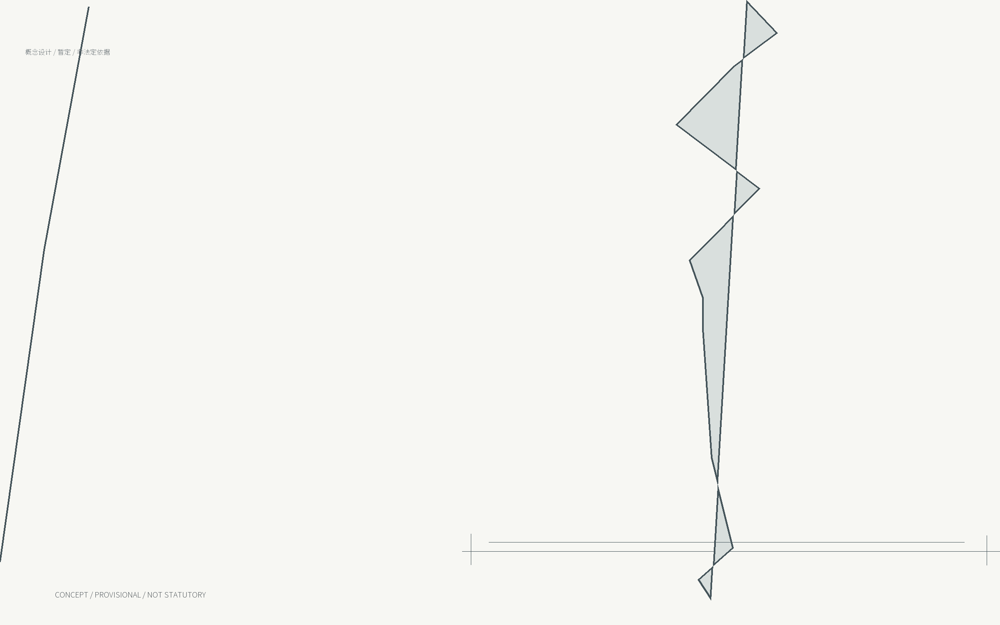

<!-- FIG-07 -->
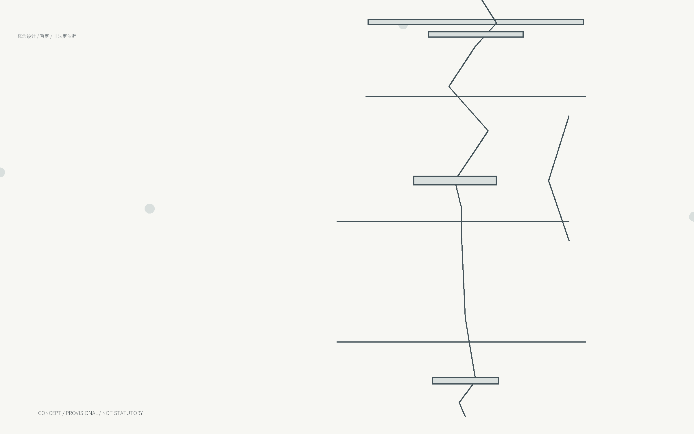

<!-- FIG-11 -->
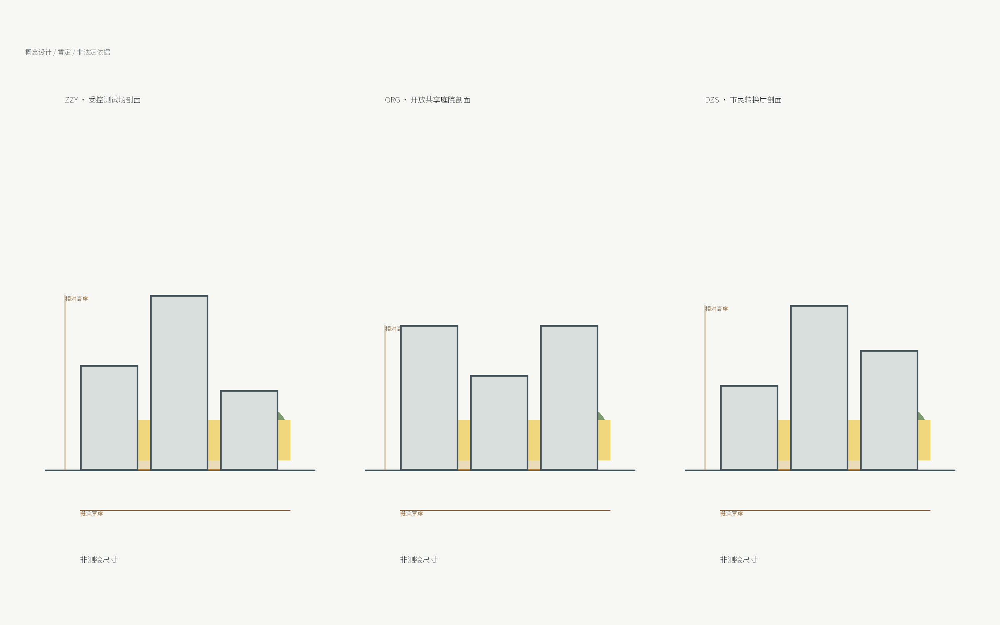

## 术语表

- **受控测试院** / Controlled Test Yard
- **多孔协作院** / Porous Commons
- **城市交换台** / Urban Switchboard
- **人工复核门** / Human Review Gate
- **人工服务回退** / Staffed Fallback
- **无设备通行** / Non-digital Access
- **蓝绿公共空间** / Blue-green Public Space
- **三层范围** / Three-tier Scope

<!-- generated-by: build_deliverables.py language=zh -->
