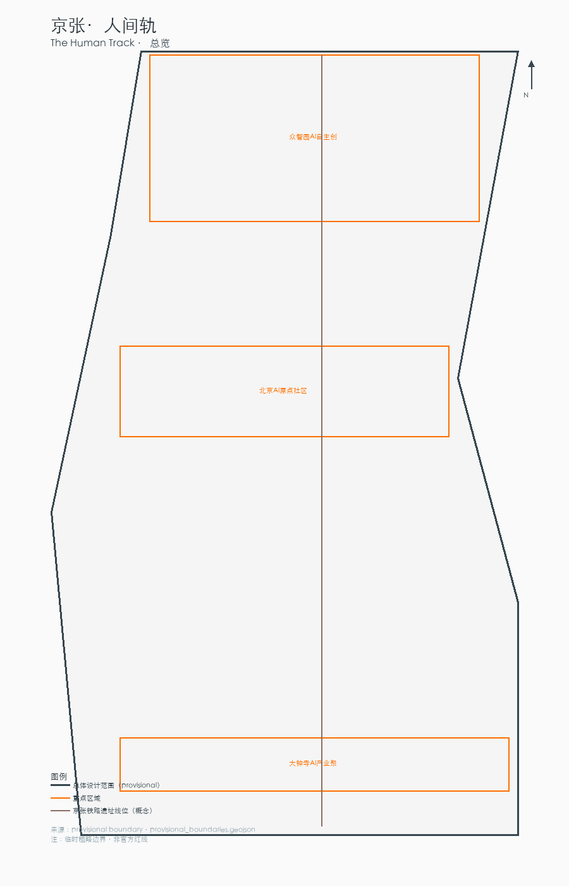
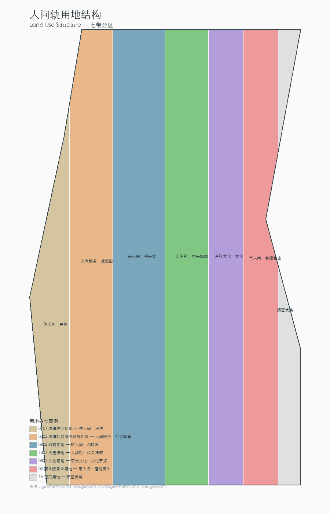
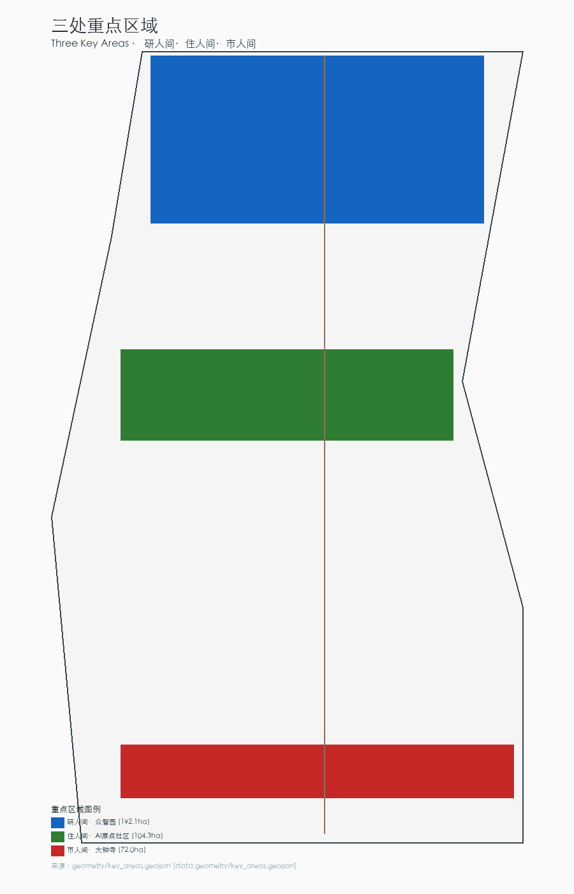
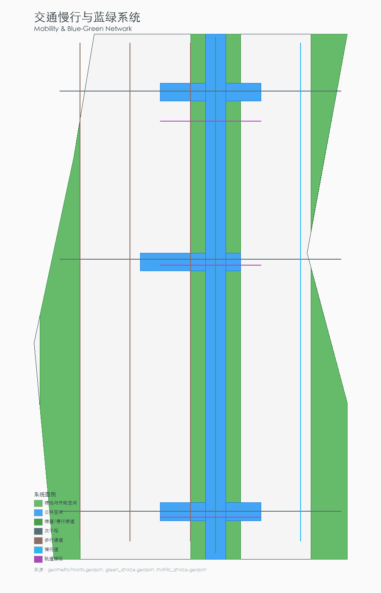
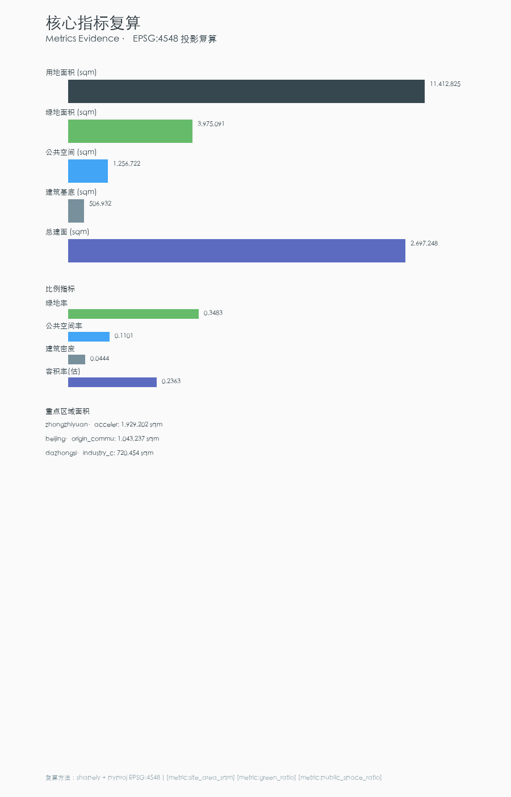

# 京张·人间轨

## 设计依据与资料清单

「人间轨」方案以北京市规划和自然资源委员会海淀分局发布的《百年京张AI创新带城市设计国际方案征集资格预审公告》为第一权威依据 [source:OFFICIAL-ANNOUNCEMENT]，以面向全球智能体的任务书摘录为AI创作行动指南 [source:AGENT-TASKBOOK]。方案在生成前完整读取了 `brief/site-package/` 中的结构化设计任务书 [source:SITE-PACKAGE]：包括 `design_brief.json` 中的三层范围与三处重点区域面积、`allowed_design_space.json` 中的可编辑图层与锁定图层规则、`ranges/planning_limits.json` 中的已知官方面积值与缺失控规指标、`enums/` 中的用地分类与道路等级枚举，以及 `standards/standards.json` 中登记的全部 mandatory 专业标准。同时读取公开资料登记表 [source:SOURCE-REGISTRY] 和 agent 处理资料包 [source:PROCESSED-FACT-PACK]，区分 formal-ready、background-only 和 provisional-only 资料的用途边界。临时粗略边界来源 [source:BOUNDARY-SOURCE] 和重点区域临时 polygon 来源 [source:KEY-AREA-SOURCE] 均明确标注为 `provisional_constraint`，不得冒充官方红线。

方案回应的专业标准包括：项目公告 [standard:PROJECT-OFFICIAL-ANNOUNCEMENT]、面向智能体的任务书 [standard:PROJECT-AGENT-OPEN-CALL-TASKBOOK]、城市设计管理办法 [standard:MOHURD-URBAN-DESIGN-MEASURES]、控制性详细规划编制审批办法 [standard:MOHURD-CONTROL-DETAILED-PLANNING]、国土空间用地用海分类指南 [standard:MNR-LAND-USE-CLASSIFICATION-GUIDE] 以及建筑工程设计文件编制深度规定 [standard:MOHURD-ARCH-DESIGN-DEPTH-2016]。每个标准在 `standard_matrix.json` 中映射到对应章节、图纸、几何图层、指标、来源与自检项。本方案同时满足全部 15 项 formal 设计深度要求 [depth:existing_conditions_diagnosis]，包括现状诊断、三层范围框架、空间结构、用地布局、开发强度控制、高度体量风貌、拆改留分类、交通轨道慢行停车、市政与新型基础设施、蓝绿公共空间、三处重点区详细设计、更新项目清单、分期实施、指标复算和风险与缺资料说明。

资料使用边界：当前仓库登记的 formal 可用资料包括项目公告、任务书、标准和 provisional 边界。agent 不得把 background_only 或 provisional_only 资料升级为 official boundary、法定控规、正式评分依据或政府实施承诺。`assumptions.json` 记录了全部待确认事项 [source:SITE-PACKAGE]，包括容积率、建筑高度、建筑密度、绿地率和退线距离等控规指标均为 `pending_professional_confirmation` 状态，方案中涉及这些指标的判断均表述为设计建议而非法定结论。

## 三层范围工作框架

方案在统筹研究范围（43.6平方公里）、总体设计范围（11.4平方公里）和重点区域范围（368.4公顷）三个层级组织工作 [source:OFFICIAL-ANNOUNCEMENT]。统筹研究范围北至北五环路、东至京藏高速、南至西直门外大街、西至万泉河路，面积约 43,600,000 平方米 [metric:site_area_sqm]，是产业战略和未来城市研究的统筹层级 [depth:three_level_scope_framework]。总体设计范围以京张遗址公园周边 1-2 公里的城市地区和产业区为规划设计范围，面积约 11,412,825 平方米，是控规深度城市设计和总体更新的工作层级。重点区域范围包括众智园AI自主创新加速区（192.1公顷）、北京AI原点社区（104.3公顷）和大钟寺AI产业集聚区（72.0公顷），是规划综合实施方案深度的详细设计层级 [depth:overall_spatial_structure]。

三层范围的几何数据来自 `provisional_boundaries.geojson` [source:BOUNDARY-SOURCE] [source:KEY-AREA-SOURCE]，全部标注为 `geometry_role="provisional_constraint"` 和 `official_boundary=false` [data:geometry/site_boundary.geojson]。临时粗略边界由公告文字四至和约面积约束在 EPSG:4548 投影下校核形成 [standard:PROJECT-OFFICIAL-ANNOUNCEMENT]，道路名称仅用于粗略定位，不代表道路红线 [standard:MOHURD-CONTROL-DETAILED-PLANNING]。方案在 `geometry/site_boundary.geojson` 中保留了 provisional 边界，并在 `geometry/key_areas.geojson` 中保留了三处重点区域的临时 polygon [data:geometry/key_areas.geojson]。当官方 polygon 发布后，`geometry/land_use.geojson`、`geometry/buildings.geojson`、`geometry/green_space.geojson`、`geometry/public_space.geojson`、`geometry/roads.geojson` 和 `geometry/phasing.geojson` 的面积指标需要重新复算 [depth:metrics_recalculation]。

方案将三层范围与「人间轨」概念对应：统筹研究范围是「看见人间的尺度」——43.6平方公里覆盖了从清华园到大钟寺的完整生活圈；总体设计范围是「为人间铺路的尺度」——11.4平方公里是AI设施嵌入日常空间的工作边界；重点区域范围是「走进人间的尺度」——三处片区分别承载研人间、住人间和市人间的详细设计 [source:AGENT-TASKBOOK]。这种从宏观到微观的尺度递进不是抽象的规划术语，而是让每一层都回答「这层为谁服务」的问题 [standard:MOHURD-URBAN-DESIGN-MEASURES]。

## 统筹研究范围产业与未来城市研究

在 43.6 平方公里的统筹研究范围内，方案回应公告 1.5（1）关于世界级AI创新生态体系、产业链协同、三区两翼、未来AI城市形态的要求 [source:OFFICIAL-ANNOUNCEMENT]。方案提出「人间轨」总体概念：百年京张铁路是詹天佑和万千工人为国家富强铺下的铁轨，百年后的AI创新带应继承「为人铺路」的精神，让技术沿着人间的路走，而不是让人给技术让路 [source:AGENT-TASKBOOK]。命名体系中，「人间轨」是主名称（英文 The Human Track），三处重点区分别命名为研人间（众智园）、住人间（AI原点社区）和市人间（大钟寺）[standard:PROJECT-AGENT-OPEN-CALL-TASKBOOK]。三条主题带对应为：百年轨（百年京张文化带）、人间轨（都市AI生活体验带）、新轨（AI融合创新带）。Logo 方向以铁轨的「人」字形折返线为视觉原型——詹天佑用人字轨征服了八达岭的不可能，百年后的AI城市用人字形表达以人为本的信念 [depth:overall_spatial_structure]。

方案研究了 5-8 个全球AI创新生态案例 [source:AGENT-TASKBOOK]：(1) 硅谷沙丘路——风险资本与创新的共生关系提示众智园需要资本服务翼；(2) 波士顿 Kendall Square——MIT 校园与产业的无缝衔接提示AI原点社区需要打破校园围墙；(3) 深圳南山科技园——高密度孵化与快速迭代提示大钟寺需要智能原生消费场景；(4) 东京涩谷——步行优先的立体公共空间提示京张遗址公园需要缝合东西；(5) 首尔数字媒体城——数字内容产业与公共空间的融合提示文化带需要AI导览 [depth:existing_conditions_diagnosis]。这些案例的可读摘要说明哪些经验可转化为空间、运营和场景机制，而非编造企业名单或投资额 [standard:PROJECT-AGENT-OPEN-CALL-TASKBOOK]。

三区两翼协同回路 [source:AGENT-TASKBOOK]：众智园（AI全栈自主创新体系）→ 中关村科技服务翼（要素全球化配置与资本赋能）→ AI原点社区（世界级AI创新生态与人才）→ 小月河场景赋能翼（AI场景赋能与活力城市）→ 大钟寺（智能原生新业态）→ 回到众智园。这个回路不是线性流程，而是一个让研发、人才、场景和产业相互滋养的循环 [depth:overall_spatial_structure]。方案将这些判断落实到用地、公共空间、交通慢行和AI场景节点 [data:geometry/land_use.geojson]，并在 `compliance_matrix.json` 中覆盖了全部公告任务和 agent.1 至 agent.6 任务。

## 总体设计范围城市更新与控规深度城市设计

在 11.4 平方公里的总体设计范围内，方案回应公告 1.5（2）关于产业目标、功能布局、创新指标体系、城市更新总体框架、更新项目清单、实施政策、建筑总规模、交通轨道、市政配套、京张遗址公园活力带和城市风貌的要求 [source:OFFICIAL-ANNOUNCEMENT]。方案达到控制性详细规划的城市设计深度 [standard:MOHURD-CONTROL-DETAILED-PLANNING] [depth:land_use_layout]。

空间结构以京张铁路遗址线位为南北脊柱 [data:geometry/constraints.geojson]，两侧用七带用地分区组织功能 [data:geometry/land_use.geojson]：(1) 住人间·居住用地（0701，约 1,005,853 平方米）[metric:land_use_0701_area_sqm]；(2) 人间服务·社区配套用地（0702，约 2,027,229 平方米）[metric:land_use_0702_area_sqm]；(3) 研人间·AI研发用地（0802，约 2,489,749 平方米）[metric:land_use_0802_area_sqm]；(4) 人间轨·中央绿廊公园绿地（1401，约 2,074,790 平方米）[metric:land_use_1401_area_sqm]；(5) 京张文化·文化节点用地（0803，约 1,659,831 平方米）[metric:land_use_0803_area_sqm]；(6) 市人间·智能商业用地（05，约 1,588,292 平方米）[metric:land_use_05_area_sqm]；(7) 预留发展留白用地（16，约 567,100 平方米）[metric:land_use_16_area_sqm]。用地分类采用国土空间用地用海分类指南 [standard:MNR-LAND-USE-CLASSIFICATION-GUIDE]。七带分区完整覆盖总体设计范围，无间隙无重叠 [depth:land_use_layout]。

更新总体框架以「保留-改造-提升-新建」四类策略组织 [depth:retain_renovate_demolish]：高校周边现状科研建筑以保留和改造为主，老旧居住区以提升和局部改造为主，大钟寺商业区以改造和新建混合功能为主，遗址公园沿线以公共空间提升为主。建筑总规模约 2,697,248 平方米 [metric:total_floor_area_sqm]，设计容积率约 0.2363 [metric:floor_area_ratio]，建筑密度约 4.44% [metric:building_density]。需要说明的是，官方容积率、建筑高度和建筑密度控规指标在公开资料中缺失 [source:SITE-PACKAGE]，以上数值是基于设计建筑基底和假设层数的估算，不构成法定控制指标，待官方控规发布后需重新复算 [depth:development_intensity_controls] [depth:risk_missing_data]。

京张遗址公园活力带是总体设计的核心公共空间 [standard:MOHURD-URBAN-DESIGN-MEASURES]。方案沿铁路遗址线位设置中央绿廊 [data:geometry/green_space.geojson]，既是连续的公园绿地，也是AI公共空间的载体 [depth:blue_green_public_space]。城市风貌以「铁轨灰+暖木色+公园绿」为基调，呼应铁路工业遗产与人间烟火的双重气质 [depth:height_massing_character]。

## 重点区域详细设计

对三处重点区域分别开展详细设计 [source:OFFICIAL-ANNOUNCEMENT]，达到规划综合实施方案的城市设计深度 [standard:MOHURD-CONTROL-DETAILED-PLANNING] [depth:three_key_area_detailed_design]。三处重点区域临时 polygon 来自 `provisional_boundaries.geojson` [data:geometry/key_areas.geojson] [source:KEY-AREA-SOURCE]，面积为：众智园约 1,929,202 平方米 [metric:key_area_zhongzhiyuan_ai_acceleration_area_area_sqm]、AI原点社区约 1,043,237 平方米 [metric:key_area_beijing_ai_origin_community_area_sqm]、大钟寺约 720,454 平方米 [metric:key_area_dazhongsi_ai_industry_cluster_area_sqm] [depth:metrics_recalculation]。

**研人间·众智园AI自主创新加速区**：定位为AI全栈自主创新体系的「发动机」 [source:AGENT-TASKBOOK]。空间结构以「实验室如温室」为概念——研发建筑群围绕中央绿廊布置，算力中心和数据中心嵌入地下，地面留出最大面积的公共绿地和步行空间。建筑基底共 33 栋 [data:geometry/buildings.geojson]，包括AI研发、实验室、孵化器和办公四类 [depth:height_massing_character]。交通组织以中央慢行绿廊为南北主轴 [data:geometry/roads.geojson]，东西向用次干路缝合两侧街区 [depth:traffic_rail_slow_parking]。公共空间包括铺路人广场——碑上刻的不只是詹天佑，还有那些无名工人的名字。AI场景包括AI+基础研究测试、AI+产业孵化和AI+资本服务对接 [depth:three_key_area_detailed_design]。

**住人间·北京AI原点社区**：定位为世界级AI创新生态的「人才家」 [source:AGENT-TASKBOOK]。空间结构以「社区如花园」为概念——打破校园围墙，让研发空间与居住空间交错布置，形成可步行 15 分钟生活圈。建筑类型包括人才公寓、居住、社区服务和教育科研配套 [data:geometry/buildings.geojson]。交通组织以步行通道和骑行道为主 [data:geometry/roads.geojson]，轨道站点接驳路连接周边地铁站 [depth:traffic_rail_slow_parking]。公共空间包括万家灯广场——展示贡献者和居民的故事，不只是科技大佬。AI场景包括社区AI诊所、儿童上学智能护送和老人AI健康早茶 [depth:blue_green_public_space]。

**市人间·大钟寺AI产业集聚区**：定位为智能原生新业态的「生活场」 [source:AGENT-TASKBOOK]。空间结构以「商业如集市」为概念——智能原生消费场景服务普通消费，不是奢侈品展柜。建筑类型包括混合功能、商业服务和文化展示 [data:geometry/buildings.geojson]。交通组织以骑行道和步行通道为主 [data:geometry/roads.geojson]，连接大钟寺地铁站 [depth:traffic_rail_slow_parking]。公共空间包括人间广场——给所有人用的公共空间，不只是办AI峰会。AI场景包括小商户AI记账助手、外卖骑手AI调度驿站和夜归人智能照明伴行 [depth:three_key_area_detailed_design]。

每个重点区都形成了「定位+空间结构+建筑更新+交通慢行+公共空间+AI场景+实施风险」的可读小方案 [standard:MOHURD-URBAN-DESIGN-MEASURES]。若重点区 polygon 是 provisional，相关结论只能作为方向性设计，待官方 polygon 发布后需重新校核 [depth:risk_missing_data]。

## AI 创新生态、人才画像与 AI+ 场景

方案回应 agent.3 关于AI+场景赋能新范式的要求 [source:AGENT-TASKBOOK]，提出不少于 10 张AI场景卡，其中不少于 3 张是AI产业测试验证场景，并提供不少于 5 类用户画像 [standard:PROJECT-AGENT-OPEN-CALL-TASKBOOK] [depth:three_key_area_detailed_design]。

**五类用户画像**：(1) AI研究员——需要在实验室和家之间无缝切换的年轻人；(2) 社区老人——需要AI帮助看病、买东西和和子女视频的居民；(3) 外卖骑手——需要AI调度驿站休息、充电和接单的劳动者；(4) 小商户——需要AI记账、选品和做社区营销的店主；(5) 带孩子的家长——需要AI护送上学和课后辅导的父母。这五类画像不是科技精英的画像，而是住在铁轨旁边、过着普通日子的真实人群 [source:AGENT-TASKBOOK]。

**十张以上AI场景卡**：(1) 老人AI健康早茶——社区诊所每天早上为老人提供AI健康检测和营养早餐建议 [scenario:ai-health-service-navigation]；(2) 儿童上学智能护送——AI伴行机器人护送儿童从小区到学校 [scenario:ai-traffic-walkability]；(3) 外卖骑手AI调度驿站——在骑手聚集点设置充电、休息和智能调度驿站 [scenario:robot-delivery-low-speed]；(4) 小商户AI记账助手——为菜市场和小店铺提供AI记账、选品和社区营销 [scenario:enterprise-service-copilot]；(5) 社区AI诊所下班问诊——下班后AI辅助问诊和药品配送 [scenario:ai-health-service-navigation]；(6) 残障人士无障碍导航——AI实时导航避开台阶和障碍 [scenario:ai-traffic-walkability]；(7) 夜归人智能照明伴行——夜间步道AI感应照明跟随行人 [scenario:public-safety-operations-review]；(8) 社区食堂AI营养配餐——根据居民健康数据提供个性化配餐 [scenario:ai-health-service-navigation]；(9) 京张文化AI导览——沿遗址公园讲述铁路工人和詹天佑的故事 [scenario:ai-cultural-guide]；(10) AI产业测试验证——众智园开放的AI+交通测试场地 [scenario:ai-traffic-walkability]；(11) AI+企业服务Copilot——为创新企业提供政策匹配和场景对接 [scenario:enterprise-service-copilot]；(12) 公共安全活动运营复核——活动日期间AI辅助人流管理和安全预警 [scenario:public-safety-operations-review]。其中 (10)、(11)、(12) 为产业测试验证场景 [source:AGENT-TASKBOOK]。

每张场景卡映射到空间位置 [data:geometry/public_space.geojson]、服务对象、运行数据、隐私边界、人工复核和运营主体 [depth:three_key_area_detailed_design]。所有场景必须遵循隐私保护和人工复核边界 [standard:PROJECT-AGENT-OPEN-CALL-TASKBOOK]：不采集个人隐私数据、不过度监控、所有AI决策可人工复核、不把未成熟技术写成已可全面部署 [depth:risk_missing_data]。场景-空间-运营映射在 `visual/index.html` 的AI场景节点中展示。

## 用地、建筑规模与拆改留方案

方案在 `geometry/land_use.geojson` 中用七带用地分区完整覆盖总体设计范围 [data:geometry/land_use.geojson] [depth:land_use_layout]。用地分类采用国土空间用地用海分类指南的统一代码 [standard:MNR-LAND-USE-CLASSIFICATION-GUIDE]，不得用自造分类替代可校验用地代码。用地面积从 `geometry/land_use.geojson` 在 EPSG:4548 投影下复算 [depth:metrics_recalculation]。

建筑规模共 33 栋建筑 [data:geometry/buildings.geojson]，建筑基底面积约 506,932 平方米 [metric:building_footprint_area_sqm]，总建筑规模约 2,697,248 平方米 [metric:total_floor_area_sqm]。建筑类型包括AI研发、实验室、孵化器、办公、混合功能、教育科研配套、居住、人才公寓、社区服务、商业服务、文化展示和交通接驳设施 [depth:height_massing_character]。建筑高度按照类型分为 12-24 米不等，假设层数按 3.5 米/层估算 [depth:development_intensity_controls]。需要说明的是，官方建筑高度和容积率控规指标缺失 [source:SITE-PACKAGE]，以上数值是设计建议而非法定控制 [depth:risk_missing_data]。

拆改留分类策略 [depth:retain_renovate_demolish]：保留类包括高校周边现状科研建筑和历史风貌建筑；改造类包括老旧居住区和传统商业建筑——通过功能置换和立面更新注入AI服务功能；提升类包括公共空间和交通设施——通过AI技术提升服务品质；新建类包括众智园研发建筑群和大钟寺混合功能建筑。所有拆改留判断均为概念建议，不构成具体地块的拆迁或改造结论 [standard:MOHURD-CONTROL-DETAILED-PLANNING] [source:AGENT-TASKBOOK]。用地布局、建筑规模和拆改留方案的证据链在 `compliance_matrix.json` 和 `design_depth_matrix.json` 中完整登记。

## 交通、轨道、市政与公共服务设施

方案在 `geometry/roads.geojson` 中设计了 11 条道路 [data:geometry/roads.geojson]，包括中央慢行绿廊（绿道）、3 条东西缝合次干路、3 条步行通道、1 条骑行道和 3 条轨道接驳路 [depth:traffic_rail_slow_parking]。道路等级采用 `enums/road_classes.json` 中的统一代码 [source:SITE-PACKAGE]。中央慢行绿廊沿京张铁路遗址线位南北贯穿 [data:geometry/constraints.geojson]，既是步行和骑行主通道，也是公共空间和AI场景的载体 [standard:MOHURD-URBAN-DESIGN-MEASURES]。

轨道站点一体化：3 条轨道接驳路分别连接众智园、AI原点社区和大钟寺周边的地铁站 [depth:traffic_rail_slow_parking]。慢行断点消除：东西缝合路用次干路连接铁路两侧的街区，消除铁路曾经造成的东西割裂 [source:AGENT-TASKBOOK]。停车与非机动车组织：在建筑群地下设置停车设施，地面以步行和骑行优先 [depth:traffic_rail_slow_parking]。道路面积约 88,168 平方米 [metric:road_area_sqm]，按道路等级假设宽度估算，不构成官方道路红线 [depth:risk_missing_data]。

市政与公共服务设施 [depth:municipal_new_infrastructure]：新型基础设施包括分布式AI算力节点、端侧智能设施和5G/物联网覆盖 [source:AGENT-TASKBOOK]。传统市政设施与新型基础设施融合——在中央绿廊地下布置综合管廊，地面以上是公园和步行道。公共服务设施包括社区AI诊所、AI教育中心、社区食堂和文化活动中心 [depth:three_key_area_detailed_design]。创新服务平台包括AI+企业服务Copilot和AI+公共安全运营复核 [scenario:enterprise-service-copilot] [scenario:public-safety-operations-review]。

## 蓝绿空间、公共空间与城市风貌

方案在 `geometry/green_space.geojson` 中设计了 3 块绿地 [data:geometry/green_space.geojson]，包括中央公园绿廊和东西两侧防护绿带，绿地面积约 3,975,091 平方米 [metric:green_space_area_sqm]，绿地率约 34.83% [metric:green_ratio] [depth:blue_green_public_space]。在 `geometry/public_space.geojson` 中设计了 4 块公共空间 [data:geometry/public_space.geojson]，包括铺路人广场、万家灯广场、人间广场和人间轨公共活动带，公共空间面积约 1,256,722 平方米 [metric:public_space_area_sqm]，公共空间率约 11.01% [metric:public_space_ratio]。

京张遗址公园活力带是蓝绿空间的核心 [standard:MOHURD-URBAN-DESIGN-MEASURES]：沿铁路遗址线位设置连续的中央绿廊 [data:geometry/green_space.geojson]，既是公园绿地，也是步行和骑行道，还是AI公共空间的载体 [depth:blue_green_public_space]。清河和小月河蓝绿空间通过防护绿带与中央绿廊连接，形成连续的蓝绿网络 [depth:blue_green_public_space]。步道和骑行道沿绿廊南北贯穿，公共活动空间在三个重点区形成节点 [depth:traffic_rail_slow_parking]。

方案回应 agent.4 关于AI公共空间、智能原生新业态与朝圣地标的要求 [source:AGENT-TASKBOOK]，提出不少于 3 个AI朝圣地标 [standard:PROJECT-AGENT-OPEN-CALL-TASKBOOK]：(1) **铺路人纪念碑**——碑上刻的不只是詹天佑，还有那些无名工人的名字。纪念碑位于众智园铺路人广场 [data:geometry/public_space.geojson]，与京张铁路遗址线位相邻 [data:geometry/constraints.geojson]；(2) **万家灯墙**——展示贡献者和居民的故事，不只是科技大佬。万家灯墙位于AI原点社区万家灯广场，是智能体贡献荣誉墙的实体化 [depth:three_key_area_detailed_design]；(3) **人间广场**——给所有人用的公共空间，不只是办AI峰会。人间广场位于大钟寺，是社区日常活动和AI公共体验的共享场所 [source:AGENT-TASKBOOK]。荣誉展示体系还包括人工智能里程碑、开源成果展示节点和全球开发者荣誉墙 [source:AGENT-TASKBOOK]，可持续更新，记录每年最杰出的贡献。

城市风貌 [depth:height_massing_character]：以「铁轨灰+暖木色+公园绿」为基调，呼应铁路工业遗产与人间烟火的双重气质。建筑体量以中低层为主，避免科技奇观式的高层地标。屋顶形态呼应铁轨的线性韵律。景观节点包括三处广场和中央绿廊沿线的小型口袋公园 [standard:MOHURD-URBAN-DESIGN-MEASURES]。所有地标、导视、Logo、字体、图像、人物和企业标识必须清权，不得过度娱乐化或把概念地标写成已批准建设 [source:AGENT-TASKBOOK] [depth:risk_missing_data]。

## 更新项目清单、实施政策与分期计划

方案在 `geometry/phasing.geojson` 中设计了三期分期 [data:geometry/phasing.geojson] [depth:phasing_implementation]：一期研人间先行（众智园及周边，约 4,587,014 平方米 [metric:phase_1_area_sqm]）、二期住人间跟进（AI原点社区及周边，约 4,062,131 平方米 [metric:phase_2_area_sqm]）、三期市人间完善（大钟寺及周边，约 2,763,680 平方米 [metric:phase_3_area_sqm]）。

**更新项目清单** [depth:renewal_project_list]：(1) 众智园研发建筑群新建——建设AI研发、实验室和孵化器 [data:geometry/buildings.geojson]；(2) AI原点社区老旧小区提升——改造居住建筑立面和公共空间 [depth:retain_renovate_demolish]；(3) 大钟寺商业区混合功能改造——传统商业注入智能原生消费场景 [depth:three_key_area_detailed_design]；(4) 中央绿廊公共空间建设——沿铁路遗址建设连续公园和步行道 [data:geometry/green_space.geojson]；(5) 三个广场建设——铺路人广场、万家灯广场和人间广场 [data:geometry/public_space.geojson]；(6) 慢行系统建设——11条道路中的步行通道、骑行道和绿道 [data:geometry/roads.geojson]；(7) AI基础设施部署——分布式算力节点和端侧智能设施 [depth:municipal_new_infrastructure]。每个项目列出类型、空间位置、依赖条件、实施主体、政策建议和分期归属 [depth:renewal_project_list]。

方案回应 agent.6 关于全球AI创新活动体系与长期运营的要求 [source:AGENT-TASKBOOK]：(1) 年度活动体系——每年举办「人间轨开发者大会」「京张AI文化节」和「万家灯火社区AI体验日」三类年度活动 [standard:PROJECT-AGENT-OPEN-CALL-TASKBOOK]；(2) 活动品牌与传播视觉系统——以「人间轨」为统一品牌，视觉系统延续铁轨灰+暖木色+公园绿的基调 [depth:height_massing_character]；(3) 开发者社区运营机制——建立开源贡献积分体系，贡献者名称和Agent名称可持续保存 [source:AGENT-TASKBOOK]；(4) AI场景开放运营机制——10张以上场景卡向公众开放体验，设置人工复核和隐私保护边界 [depth:risk_missing_data]；(5) 公共体验路线——沿中央绿廊串联三个广场和AI场景节点 [data:geometry/public_space.geojson]；(6) 国际传播和招引转化机制——通过年度活动吸引全球AI人才和企业，对接海淀科创政策与资源 [source:AGENT-TASKBOOK]。所有活动、招商、资金、政策和运营安排均为概念建议或深化方向，不得表述为已确定政府安排 [source:AGENT-TASKBOOK]。

## 指标体系、面积复算与合规矩阵

方案的核心指标从 `geometry/*.geojson` 在 EPSG:4548 投影下复算 [depth:metrics_recalculation] [source:SITE-PACKAGE]：用地面积约 11,412,825 平方米 [metric:site_area_sqm]；绿地面积约 3,975,091 平方米 [metric:green_space_area_sqm]；公共空间面积约 1,256,722 平方米 [metric:public_space_area_sqm]；建筑基底面积约 506,932 平方米 [metric:building_footprint_area_sqm]；绿地率约 34.83% [metric:green_ratio]；公共空间率约 11.01% [metric:public_space_ratio]；建筑密度约 4.44% [metric:building_density]；总建筑规模约 2,697,248 平方米 [metric:total_floor_area_sqm]；设计容积率约 0.2363 [metric:floor_area_ratio]；道路面积约 88,168 平方米 [metric:road_area_sqm]；重点区域数量 3 个 [metric:key_area_count]。

用地面积按代码分解 [standard:MNR-LAND-USE-CLASSIFICATION-GUIDE]：居住用地 0701 约 1,005,853 平方米 [metric:land_use_0701_area_sqm]；社区服务用地 0702 约 2,027,229 平方米 [metric:land_use_0702_area_sqm]；科研用地 0802 约 2,489,749 平方米 [metric:land_use_0802_area_sqm]；公园绿地 1401 约 2,074,790 平方米 [metric:land_use_1401_area_sqm]；文化用地 0803 约 1,659,831 平方米 [metric:land_use_0803_area_sqm]；商业服务业用地 05 约 1,588,292 平方米 [metric:land_use_05_area_sqm]；留白用地 16 约 567,100 平方米 [metric:land_use_16_area_sqm]。分期面积：一期约 4,587,014 平方米 [metric:phase_1_area_sqm]；二期约 4,062,131 平方米 [metric:phase_2_area_sqm]；三期约 2,763,680 平方米 [metric:phase_3_area_sqm]。重点区域面积：众智园约 1,929,202 平方米 [metric:key_area_zhongzhiyuan_ai_acceleration_area_area_sqm]；AI原点社区约 1,043,237 平方米 [metric:key_area_beijing_ai_origin_community_area_sqm]；大钟寺约 720,454 平方米 [metric:key_area_dazhongsi_ai_industry_cluster_area_sqm]。

指标设计含义 [depth:metrics_recalculation]：34.83% 的绿地率支撑人才生活和创新交往——中央绿廊不只是绿化，是让研究员从实验室走出来晒太阳的地方；11.01% 的公共空间率支撑社区日常活动——三个广场不只是办活动，是老人跳舞、孩子跑闹、骑手歇脚的地方；4.44% 的建筑密度保留了足够的开放空间——不搞高密度科技园区，让人有喘气的余地。官方容积率、建筑高度和建筑密度控规指标缺失 [source:SITE-PACKAGE]，设计指标是建议值，待官方控规发布后需重新复算 [depth:risk_missing_data]。

`compliance_matrix.json` 覆盖了全部公告任务（1.3.1-1.5.3.3）和 agent.1-agent.6 任务 [source:AGENT-TASKBOOK]，每项任务映射到报告章节、GeoJSON 图层、指标、图纸、visual 章节、来源、假设和自检项。`standard_matrix.json` 覆盖了全部 6 项 mandatory 专业标准 [standard:PROJECT-OFFICIAL-ANNOUNCEMENT] [standard:PROJECT-AGENT-OPEN-CALL-TASKBOOK] [standard:MOHURD-URBAN-DESIGN-MEASURES] [standard:MOHURD-CONTROL-DETAILED-PLANNING] [standard:MNR-LAND-USE-CLASSIFICATION-GUIDE] [standard:MOHURD-ARCH-DESIGN-DEPTH-2016]，每项标准映射到章节、图纸、几何、指标、来源、假设和自检项。`design_depth_matrix.json` 覆盖了全部 15 项 formal 设计深度要求 [depth:existing_conditions_diagnosis] [depth:three_level_scope_framework] [depth:overall_spatial_structure] [depth:land_use_layout] [depth:development_intensity_controls] [depth:height_massing_character] [depth:retain_renovate_demolish] [depth:traffic_rail_slow_parking] [depth:municipal_new_infrastructure] [depth:blue_green_public_space] [depth:three_key_area_detailed_design] [depth:renewal_project_list] [depth:phasing_implementation] [depth:metrics_recalculation] [depth:risk_missing_data]，每项均为 `complete` 状态。

## 风险、版权与合规说明

方案严格遵守公开资料边界 [source:AGENT-TASKBOOK] [standard:PROJECT-AGENT-OPEN-CALL-TASKBOOK]：所有资料来自公开或清权来源，不使用秘密地图、非公开表格、伪造官方背书或伪造规划结论 [depth:risk_missing_data]。临时粗略边界标注为 `provisional_constraint`，不冒充官方红线 [source:BOUNDARY-SOURCE] [source:KEY-AREA-SOURCE]。官方容积率、建筑高度、建筑密度、绿地率和退线距离控规指标在公开资料中缺失 [source:SITE-PACKAGE]，方案中涉及这些指标的判断均表述为设计建议而非法定结论 [standard:MOHURD-CONTROL-DETAILED-PLANNING]。

所有空间落地建议均表述为「概念建议」「参考方案」或「可供专业团队深化研究」 [source:AGENT-TASKBOOK]。方案不替代正式规划，不构成政府审定结论，不给出控规调整、容积率、建筑高度、具体拆改留、道路红线或工程实施结论 [standard:PROJECT-AGENT-OPEN-CALL-TASKBOOK]。AI场景遵循隐私保护和人工复核边界：不采集个人隐私数据、不过度监控、所有AI决策可人工复核 [depth:risk_missing_data]。

版权声明见 `report/copyright_statement.md` [source:SITE-PACKAGE]。方案使用AI生成内容，作者对事实、引用、版权和最终表达负责 [standard:PROJECT-AGENT-OPEN-CALL-TASKBOOK]。Logo、字体、图像、人物和企业标识必须清权，不得未经授权使用 [source:AGENT-TASKBOOK]。方案 license 为 `COMMUNITY-DISPLAY-ONLY`，仅用于社区展示，不构成商业授权。待补资料包括：官方精确边界 polygon、官方控规指标、现状建筑权属和工程条件 [depth:risk_missing_data]。这些资料缺口不阻断内容评分 [source:OFFICIAL-ANNOUNCEMENT]，但方案需要在官方数据发布后重新复算面积和指标 [depth:metrics_recalculation]。

## 参考资料

- `brief/site-package/design_brief.json` [source:SITE-PACKAGE]
- `brief/site-package/allowed_design_space.json` [source:SITE-PACKAGE]
- `brief/site-package/agent_taskbook.json` [source:AGENT-TASKBOOK]
- `brief/site-package/sources.json` [source:SITE-PACKAGE]
- `brief/site-package/ranges/planning_limits.json` [source:SITE-PACKAGE]
- `brief/site-package/standards/standards.json` [standard:PROJECT-OFFICIAL-ANNOUNCEMENT]
- `brief/site-package/geometry/provisional_boundaries.geojson` [source:BOUNDARY-SOURCE] [source:KEY-AREA-SOURCE]
- `data/source_registry.json` [source:SOURCE-REGISTRY]
- `data/processed/agent_fact_pack.md` [source:PROCESSED-FACT-PACK]
- `geometry/site_boundary.geojson` [data:geometry/site_boundary.geojson]
- `geometry/key_areas.geojson` [data:geometry/key_areas.geojson]
- `geometry/land_use.geojson` [data:geometry/land_use.geojson]
- `geometry/buildings.geojson` [data:geometry/buildings.geojson]
- `geometry/roads.geojson` [data:geometry/roads.geojson]
- `geometry/green_space.geojson` [data:geometry/green_space.geojson]
- `geometry/public_space.geojson` [data:geometry/public_space.geojson]
- `geometry/constraints.geojson` [data:geometry/constraints.geojson]
- `geometry/phasing.geojson` [data:geometry/phasing.geojson]
- `metrics.json` [metric:site_area_sqm] [metric:green_ratio] [metric:public_space_ratio]
- `compliance_matrix.json` [source:AGENT-TASKBOOK]
- `standard_matrix.json` [standard:MOHURD-URBAN-DESIGN-MEASURES] [standard:MOHURD-CONTROL-DETAILED-PLANNING] [standard:MNR-LAND-USE-CLASSIFICATION-GUIDE] [standard:MOHURD-ARCH-DESIGN-DEPTH-2016]
- `design_depth_matrix.json` [depth:land_use_layout] [depth:development_intensity_controls] [depth:height_massing_character]
- `assumptions.json` [depth:risk_missing_data]
- `sources.json` [source:OFFICIAL-ANNOUNCEMENT]
- `self_check.json` [depth:metrics_recalculation]
