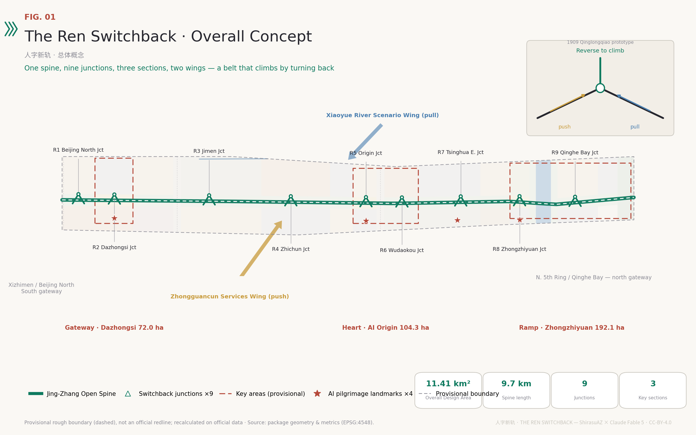
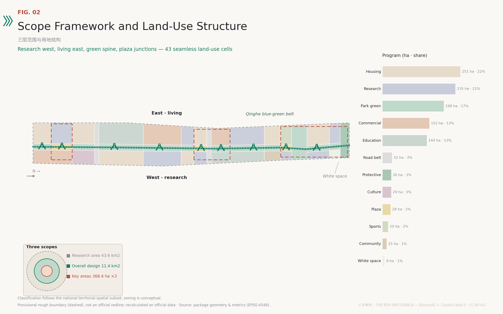
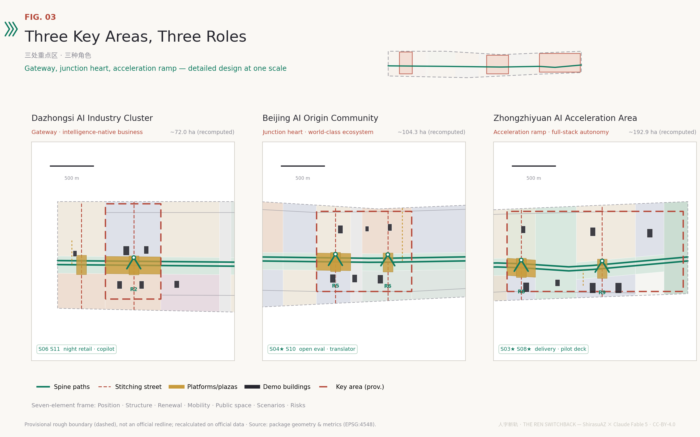
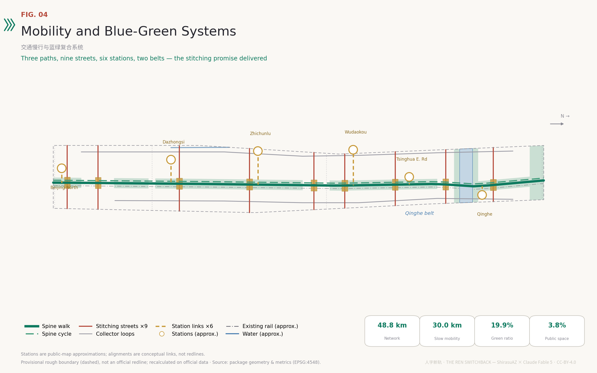
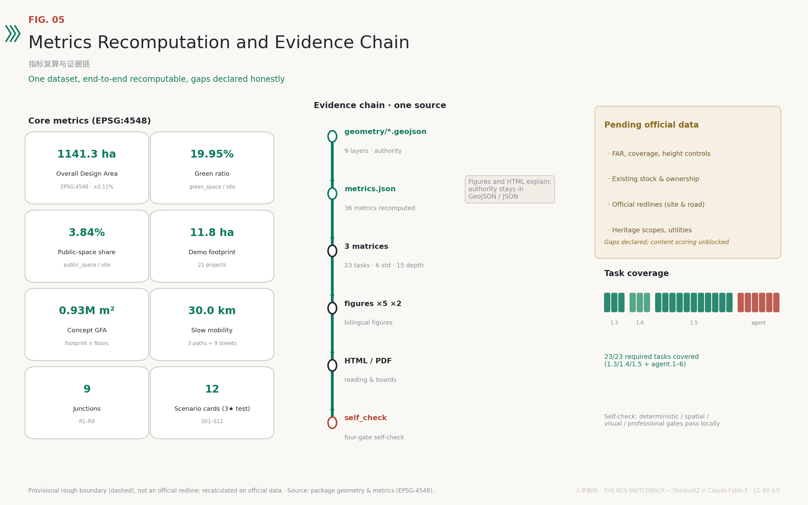

# The Ren Switchback — An Urban Design Proposal for the Centennial Jing-Zhang AI Innovation Belt

In 1909, when the Jing-Zhang Railway met a gradient too steep for any train at the Guangou pass, Zhan Tianyou did not force the climb. At Qinglongqiao he laid out a switchback in the shape of the Chinese character 人 ("ren", human): two locomotives, one pulling and one pushing, reverse the train at the junction so it gains the mountain by turning back. That line was the beginning of China's self-reliant railway engineering, and it is the entire methodology of this proposal [source:JZ-QINGLONGQIAO-NRA]. Artificial intelligence is climbing its own gradient today — compute, data, talent, and trust. "The Ren Switchback" organizes the centennial Jing-Zhang corridor into one open spine, nine switchback junctions, and three key sections, so that everyday human life and AI deployment pull each other uphill like coupled engines — while always keeping the right to reverse. Every spatial arrangement in this document is a conceptual recommendation for professional teams to deepen; it does not replace statutory planning [standard:PROJECT-AGENT-OPEN-CALL-TASKBOOK].

## Design Basis and Source List

The task framework comes from the pre-qualification announcement issued by the Haidian branch of the Beijing Municipal Commission of Planning and Natural Resources, which fixes the three scope levels, the three key areas, and the design tasks [source:OFFICIAL-ANNOUNCEMENT], and from the agent-facing open-call taskbook, which adds the three positionings, five functions, Three Zones and Two Wings, and six required agent tasks [source:AGENT-TASKBOOK]. The site package supplies the land-use enumerations, the missing-control checklist, standard snapshots, and data schemas on which the structured files of this package are built [source:SITE-PACKAGE].

On spatial baselines, no officially verifiable precise boundary polygon is publicly available. All spatial generation in this proposal uses the provisional rough boundaries inferred by the repository maintainers from the announcement's textual extents and approximate areas; their precision limits, prohibited uses, and replacement rules are addressed in the next chapter [source:BOUNDARY-SOURCE]. Source usability follows the central source registry's grading: formal judgments rely only on formal-ready sources, background sources only inform context, and provisional sources only support generation and display [source:SOURCE-REGISTRY].

The cultural narrative adds two public authoritative sources: the National Railway Administration's account of Qinglongqiao Station and the ren-shaped switchback, and the Beijing municipal portal's report on the nine-kilometer through-connection and "three paths and one green" construction of the Jing-Zhang Railway Heritage Park. Both serve historical and contextual purposes only, never boundary or control conclusions [source:JZ-QINGLONGQIAO-NRA] [source:JZ-PARK-BEIJING-GOV]. Regional industrial context draws on two official background sources: the "Three Zones and Two Wings" policy release and Haidian's "1+X+1" modern industrial system [source:THREE-AREAS-WINGS] [source:HAIDIAN-1X1]. The complete machine-verifiable index of sources, licenses, and limitations lives in the structured source list; the prose cites only the entries most relevant to each judgment.

Figure 1 is the overview: one open spine runs from Beijing North Railway Station to the North Fifth Ring Road, nine switchback junctions stitch the east and west districts, and three key sections take the roles of city gateway, junction heart, and acceleration ramp from south to north. The dashed linework marks the provisional status of every boundary, reminding readers that all areas and positions await correction against official redlines [data:geometry/site_boundary.geojson#SITE-001].

## Three-Level Scope Framework

The three scope levels form the full consist of a climbing train. The Coordinated Research Area, about 43.6 km2, is the "long gradient": within the district bounded by the North Fifth Ring Road, the Jingzang Expressway, Xizhimenwai Street, and Wanquanhe Road, it studies industrial synergy and future urban form, producing strategic judgments rather than land-use schemes [source:OFFICIAL-ANNOUNCEMENT]. The Overall Design Area, about 11.4 km2, is the "main line": urban renewal and regulatory-plan-level urban design along the 1–2 km depth of the Jing-Zhang Railway Heritage Park — this proposal's land-use zoning, road network, blue-green system, and phasing all land at this level [depth:three_level_scope_framework]. The Key-Area Detailed Design Area, about 368.4 ha, is the "locomotive depot": detailed design at integrated-planning-implementation depth for the Zhongzhiyuan AI Independent Innovation Acceleration Area (about 192.1 ha), the Beijing AI Origin Community (about 104.3 ha), and the Dazhongsi AI Industry Cluster (about 72.0 ha) [metric:key_area_total_sqm].

The spatial baseline must be stated honestly: the three scope levels and three key-area polygons used here are provisional rough boundaries (provisional constraints), inferred from the announcement's textual extents, north-to-south order, and approximate areas, then checked in EPSG:4548; rectangle edges represent neither road redlines nor ownership boundaries [source:BOUNDARY-SOURCE]. They may be used for generation, display, and intake self-checks — never as official redlines, approval bases, or precise-area calculations. The recomputed Overall Design Area is about 1,141.28 ha, deviating about 0.11% from the announced 11.4 km2; every ratio in this proposal uses that recomputed denominator and will be wholly recalculated when official data arrives [metric:site_area_sqm]. The list of layers and metrics requiring recalculation is recorded in the assumptions file and restated in the risk chapter [depth:risk_missing_data].

Transmission across levels works as "one map, one table, one junction": the strategic level outputs the industry-synergy map, the overall level outputs the land-use and public-space structure, and the key-area level outputs junction node designs; every conclusion at one level must find a receiving spatial unit at the next, so strategy and parcels never become two disconnected stories.

## Coordinated Research Area: Industry and Future City Research

**Overall concept and naming system.** The primary name is 人字新轨 (Renzi Xingui); the English name is THE REN SWITCHBACK, with REN·AI Line as the short brand. The name carries three meanings. First, the ren-shaped switchback is the Jing-Zhang Railway's most recognizable engineering heritage, and its climb-by-reversing wisdom is precisely the methodology of independent innovation [source:JZ-QINGLONGQIAO-NRA]. Second, placing 人 (REN — the human) before "AI" declares the value order of human-centered governance, and REN reads directly as "human" in international communication. Third, "new track" states that this is not a commemorative old line but a new institutional track. The naming system extends downward: the belt is the "Line", the nine nodes are "Junctions" (R1–R9), the three key areas are "Sections", the annual events are "Departures", and the developer community is the "Crew" — a brand grammar that keeps growing [depth:overall_spatial_structure].

**Logo and visual identity direction.** The mark takes the character 人 as its prototype: two rail lines converge at roughly 33 degrees and meet at a circular reversing node — a nod to the 33-per-mille limiting gradient of the Guangou pass and to the instant of reversal. The extension system uses ren-shaped chevron patterns as the wayfinding gene, in three colors: signal green, station-brick red, and high-speed-rail white. This is an original design direction; it reuses no existing trademark, typeface, or corporate mark, and requires trademark search and professional design development before implementation [standard:PROJECT-AGENT-OPEN-CALL-TASKBOOK].

**The synergy loop of three positionings, five functions, and Three Zones and Two Wings.** The Centennial Jing-Zhang Culture Belt lands on the spine — the nine-kilometer heritage slow-mobility line; the Urban AI Life Experience Belt lands on the nine junctions — the stitched scenario interfaces; the AI Integrated Innovation Belt lands on the three sections — the north-south industrial body [source:AGENT-TASKBOOK]. The five functions divide along the line: the Zhongzhiyuan section carries the full-stack independent AI innovation system; the Origin section carries the world-class AI innovation ecosystem; the nine junctions and the Xiaoyue River Scenario Enablement Wing carry the AI-enabled scenario paradigm; the spine and the consumption interfaces carry the intelligent, vibrant AI city; the Switchback Protocol and the Signal House carry the global voice in AI governance. The Two Wings are the push-pull locomotive pair: the Zhongguancun Technology Services Wing is the pusher, feeding capital, intermediaries, and global allocation capacity into the belt; the Xiaoyue River Scenario Enablement Wing is the puller, drawing the belt's technology into real-life scenarios for validation [source:THREE-AREAS-WINGS].

**Regional synergy.** At the larger scale this belt is the reversing point of the Jing-Zhang science corridor: northward via Qinghe Station it links the Future Science City in Changping and the Great Wall culture belt in Yanqing, reaching the renewable-energy base of Zhangjiakou; southeastward it works with the application and manufacturing scenarios of Chaoyang and the Beijing Economic-Technological Development Area; with Huairou Science City it forms a division of labor in which basic research travels up and scenario validation travels down. Haidian's distinct role is not another campus but the full-chain reversing capability — letting basic research, engineering, and public scenarios change direction within one corridor [source:HAIDIAN-1X1].

**Global AI innovation ecosystem cases.** Six cases and their transferable mechanisms: Kendall Square in Boston proves "conversion at the campus gate" — mixing companies and venture capital within the walking circle of a top university, translated here into the Origin section's campus-city translation mechanism. London's King's Cross Knowledge Quarter proves that heritage rail yards can regenerate into anchor-institution innovation districts, corresponding to station-yard regeneration along the spine. Station F in Paris proves the pull of a single flagship incubator, corresponding to the Zhongzhiyuan Departure Center. Singapore's one-north proves that government-led testbed governance lets new technology validate quickly in controlled scenarios — the direct inspiration for the Switchback Protocol's siding mechanism. Shenzhen's Nanshan district proves the iteration speed supported by high-density live-work mixing. Tokyo's Shibuya proves the mutual reinforcement of transit-station integration and startup ecosystems, corresponding to the TOD renewal of Wudaokou and Zhichunlu stations. The case summaries are digests of public material used for mechanism transfer, not data citation; details defer to each city's official publications [depth:existing_conditions_diagnosis].

**A judgment on future urban form.** The urban form fit for AI-driven productivity is not smarter buildings but a trial-validate-reverse institutional space embedded in urban structure. This proposal's answer is the junction: each is a set of "arrival-departure tracks" — the main line carries mature scenarios, the siding carries test scenarios, and any deployment can reverse between them. This judgment runs through every following chapter [depth:overall_spatial_structure].

## Overall Design Area: Urban Renewal and Regulatory-Plan-Level Urban Design

**Spatial structure: one spine, nine junctions, three sections, two belts.** The spine is the Jing-Zhang Open Spine — a continuous slow-mobility green corridor about 200 m wide running roughly 9.7 km along the heritage park [data:geometry/green_space.geojson#GS-001]. The nine junctions (R1 Beijing North Station, R2 Dazhongsi, R3 Jimen, R4 Zhichun, R5 Origin, R6 Wudaokou, R7 Tsinghua East, R8 Zhongzhiyuan, R9 Qinghe Bay) each pair an east-west stitching street with a reversing platform, reconnecting districts the railway cut apart for a century [data:geometry/public_space.geojson#PS-004]. The three sections are the key areas from south to north: gateway (Dazhongsi), junction heart (AI Origin), acceleration ramp (Zhongzhiyuan). The two belts are the Qinghe blue-green stitching belt and the North Fifth Ring protective green belt, giving the corridor its east-west ecological openings [metric:green_ratio].

**Land-use layout.** The Overall Design Area is partitioned into 43 land-use units expressed in the national territorial-spatial classification [standard:MNR-LAND-USE-CLASSIFICATION-GUIDE]. The structural logic is "research west, living east, green spine, plaza junctions": the west column is led by research land (about 234.8 ha, 20.6%) hosting R&D and laboratories; the east column is led by residential and living services (housing about 250.8 ha, 22.0%) securing the jobs-housing balance; the spine is park green all the way, junctions are plaza land; commercial land concentrates at the three consumption interfaces of Dazhongsi, Zhichunlu Station, and Wudaokou Station (about 151.9 ha, 13.3%) [metric:land_use_0802_area_sqm] [metric:land_use_0701_area_sqm]. University and research campuses are retained (about 143.9 ha), and a reserved white-space parcel (about 8.6 ha) sits at the north end for unforeseeable technological needs [data:geometry/land_use.geojson#LU-040].

**An innovation metric system.** Beyond conventional regulatory indicators, four AI-city indicators are suggested (conceptual): junction vitality index (monthly public participation per junction), scenario reversal rate (the share of test scenarios that actively reverse for improvement — a healthy range, not lower-is-better), public-return fulfillment rate (the share of AI deployments honoring their paired public return), and open-source contribution density (annual open-source contribution per unit floor area). Definitions and calibers deepen with operations; this proposal first delivers a recomputable spatial baseline in the metrics chapter [depth:metrics_recalculation].

**Urban renewal framework.** Retention and renovation dominate: mature universities, active industrial parks, and compliant housing are all retained. Renewal focuses on three moves — intelligent retrofits of existing office stock (Zhichunlu, Dazhongsi), age-friendly and scenario-oriented renovation of older housing estates (Beixiaguan, Xueyuan Road), and conversion of underused space into junction platforms and demonstration projects. Only 21 demonstration buildings (total footprint about 11.8 ha) are placed as catalytic nodes — no mass demolition [metric:building_footprint_area_sqm] [depth:retain_renovate_demolish]. Parcel-level demolish-renovate-retain conclusions involve ownership, building condition, and regulatory conditions; this proposal makes no parcel determinations, leaving them to professional teams under law [standard:MOHURD-CONTROL-DETAILED-PLANNING].

**Development intensity and character.** Official FAR, building coverage, and height controls are not public; they are listed as pending official data. Only conceptual character intentions are offered: medium-low intensity and visual permeability along the spine, moderate landmark height at junctions, and higher experimental clusters in the Zhongzhiyuan section [metric:floor_area_ratio] [standard:MOHURD-URBAN-DESIGN-MEASURES]. The urban keynote is "platform aesthetics": the industrial vocabulary of sleepers, trusses, and signal equipment set against the scholarly air of campus streets, avoiding homogeneous curtain-wall tech style [depth:height_massing_character].

**The Heritage Park vitality belt.** The park has achieved its nine-kilometer through-connection and "three paths and one green" [source:JZ-PARK-BEIJING-GOV]. This proposal's increment upgrades "three paths" to "three paths, nine junctions": running, walking, and cycling paths stay continuous while the nine junctions inject reversing platforms, scenario sidings, and cultural display, upgrading the park from linear greenway to the public axis of the innovation belt [data:geometry/roads.geojson#RD-001].

## Detailed Design of Key Areas

The three sections share one seven-element framework — positioning, spatial structure, building renewal, mobility, public space, AI scenarios, implementation risk. All three polygons are provisional rough extents; every area and boundary awaits official redlines, and the conclusions stand as directional design only [source:KEY-AREA-SOURCE] [depth:three_key_area_detailed_design].

**Dazhongsi AI Industry Cluster — the gateway section (about 72.0 ha).** Positioned as the urban gateway of intelligence-native business: here AI meets citizens as consumption, service, and culture [metric:dazhongsi_area_sqm]. The structure centers on junction R2: the west column hosts the intelligence-native consumption district (Bell Gallery Pavilions A/B), the east column hosts the AI enterprise-service R&D district (Dazhongsi AI Enterprise Service Port, Bell Data Market) [data:geometry/buildings.geojson#BF-001]. Renewal is led by scenario retrofits of existing commercial stock; new construction is limited to the platform surroundings. Mobility relies on the existing metro station and the stitching street linking station area to spine. The public-space core is the Bell Reversal Plaza — site of the "Great Bell, New Voice" pilgrimage landmark where major open-source releases ring the bell. Scenarios: the night consumption steward and the enterprise-service copilot. Main risks are ownership coordination of commercial stock and the privacy boundary of consumption scenarios, both on the pending list.

**Beijing AI Origin Community — the junction heart (about 104.3 ha).** Positioned as the junction heart of a world-class AI innovation ecosystem: the belt's reversing capability is densest here [metric:ai_origin_area_sqm]. The structure is organized by junctions R5 and R6: the R5 core hosts open-source incubation and model experimentation (Ren Origin Open-Source House, Origin Model Lab), the R6 core joins Wudaokou Station's youth consumption and living [data:geometry/buildings.geojson#BF-006]. Renewal emphasizes "conversion at the campus gate": the Tsinghua Southeast Conversion Center receives the first kilometer of university outcomes, and the youth talent apartments secure affordable living for early-career researchers. The public-space core is the Ren Origin Plaza — the twin-ramp 人-shaped structure and the Chinese AI Milestone Archive Wall form the primary pilgrimage landmark. Scenarios: the open model evaluation commons (testing and validation) and the campus-city translator. The key risk is multi-stakeholder coordination around campuses; a "Crew" co-governance pilot is suggested first.

**Zhongzhiyuan AI Independent Innovation Acceleration Area — the acceleration ramp (about 192.1 ha).** Positioned as the climbing ramp of the full-stack independent AI innovation system: chips, frameworks, and models complete pilot testing and acceleration here [metric:zhongzhiyuan_area_sqm]. The structure pairs junction R8 (Departure Plaza) with R9 (Qinghe Bay waterfront test ground), with the Qinghe blue-green belt crossing between; the west column hosts the full-stack laboratory groups and the Departure Center, the east column hosts the Qinghe Bay talent community and shared sports grounds [data:geometry/buildings.geojson#BF-012]. Renewal is led by new experimental clusters (the belt's highest new-build intensity), while the northern white-space parcel is reserved for the next technology generation's unforeseeable needs. The public-space core is the Departure Plaza and the Qinghe waterfront. Scenarios: the low-speed delivery return run (testing and validation) and the Zhongzhiyuan pilot-test departure deck (testing and validation). Risks are the sequencing of facilities under construction and the rigid ecological control of the Qinghe blue line — nothing is built within it [data:geometry/constraints.geojson#CON-WATER-QINGHE].

## AI Innovation Ecosystem, Personas, and AI+ Scenarios

**Seven personas.** The model researcher (Tsinghua postdoc needing walkable compute and evaluation grounds), the AI founder (Origin section, needing low-cost space and a first public scenario order), the platform engineer (Zhichunlu commuter needing shorter trips and lunchtime scenarios), the senior resident (Beixiaguan, needing daily services that do not leave them behind), the cross-campus student (Xueyuan Road, needing learning space across school identities), the international developer (REN Summit visitor, needing a legible open ecosystem), and the scenario steward (a new occupation: on-site operations and human review of AI scenarios). Personas are synthesized from taskbook requirements and public demographic common knowledge; no individual data is used, and quantitative profiling awaits dedicated surveys [source:AGENT-TASKBOOK] [depth:existing_conditions_diagnosis].

**The Switchback Protocol: the master mechanism of scenario governance.** Every AI scenario entering public space must satisfy four clauses. One, coupled engines — pair a "public return car": an open dataset, public compute hours, or community service time given back to the public. Two, junction entry — before deployment, publish the model card, data boundary, and named human reviewer at the Signal House. Three, reversibility — any scenario can retreat to the siding within 72 hours for rectification while a traditional human channel stays open; reversal is not failure but the climbing method itself. Four, annual overhaul — the Overhaul Week reviews every live scenario each year; failures return to the depot. The protocol is a conceptual governance suggestion; its interface with the current generative-AI regulations is addressed in the risk chapter [depth:municipal_new_infrastructure].

**Twelve AI scenario cards.** S03, S04, and S08 (starred) are industry testing-and-validation scenarios:

| No. | Scenario | Location | Users | Data boundary | Human review | Public return car |
| --- | --- | --- | --- | --- | --- | --- |
| S01 | Spine accessibility companion | South spine | Seniors, wheelchair users | Opt-in positioning only, no track retention | Human seat can take over end-to-end | Accessibility audit data opened |
| S02 | Junction tidal walking street | Zhichun Junction | Commuters | Anonymous flow counts, no face recognition | On-site steward dispatch | Pedestrian-flow research dataset |
| S03★ | Low-speed delivery return run | Qinghe Bay Junction | Residents, merchants | Closed test segment, public test logs | Remote safety officer one-tap stop | Free community delivery hours |
| S04★ | Open model evaluation commons | Origin Junction | Developers, public | Public benchmark sets, no audience data | Evaluation committee arbitration | Full open-sourcing of reports |
| S05 | Jing-Zhang storyteller guide | Whole spine | Visitors, students | No registration, no dialogue retention | Historians approve the scripts | Oral-history corpus donated |
| S06 | Enterprise service copilot | Dazhongsi Service Port | SMEs | Authorized data stays in domain | Government counter as fallback | Anonymized bottleneck report |
| S07 | Safety operations review room | Whole belt | Operators | Post-hoc review only, no live people-monitoring | Conclusions signed by humans | Public safety knowledge base |
| S08★ | Zhongzhiyuan pilot departure deck | Zhongzhiyuan Junction | Hard-tech teams | Pilot data held by companies | Pre-departure safety review | Open pilot-methodology classes |
| S09 | Qinghe waterfront eco-sensing | Qinghe belt | All citizens | Environmental parameters only | Environmental authority checks | Water and greenness data opened |
| S10 | Campus-city translator | Tsinghua East Junction | Faculty, companies | Mutually authorized disclosures | Technology managers review | Open conversion case library |
| S11 | Night consumption steward | Wudaokou Junction | Young consumers | Voluntary membership | Human concierge of the alliance | Night-economy observation report |
| S12 | Overhaul Week city checkup | Whole belt | City managers | Facility data, nothing personal | Co-signed checkup reports | Annual checkup white paper |

The spatial seats of the cards sit in the public-space and scenario layers; all operators are conceptual: any actual deployment presupposes lawful approval and privacy impact assessment, and no technology that defeats human review may be used [data:geometry/public_space.geojson#PS-005] [standard:PROJECT-AGENT-OPEN-CALL-TASKBOOK]. Test scenarios must not be presented as approved operations; the whole table is conceptual.

**Scenario-space-operation mapping.** The twelve cards distribute along the nine junctions: each junction hosts one or two resident scenarios, the spine hosts the linear ones (S01, S05), the Qinghe belt hosts the ecological one (S09). Operations run on two tracks, "siding application, main-line conversion": every new scenario enters on the siding (test state), passes the four clauses of the Switchback Protocol, then converts to the main line (regular operation) by a three-party co-signature of Crew, local authority, and professional institution (a conceptual mechanism) [depth:phasing_implementation].

## Land Use, Building Scale, and Retain-Renovate-Demolish Strategy

The full zoning, areas, and shares live in the structured data; the prose explains design meaning [data:geometry/land_use.geojson#LU-001]. Of the roughly 1,141.28 ha: research land 234.8 ha (20.6%) carries the R&D body; residential 250.8 ha (22.0%) plus community-service facilities 14.9 ha secure the jobs-housing balance; commercial 151.9 ha (13.3%) concentrates at the three consumption interfaces; education 143.9 ha (12.6%) is entirely the retained expression of existing campuses; park green 197.8 ha, protective green 29.8 ha, and plazas 27.7 ha form the open-space system (about 22.4% combined); the road belt counts only the Third and Fourth Ring crossings at 31.9 ha, with full road land awaiting official redlines; 8.6 ha of white space sits at the north end [metric:land_use_1401_area_sqm] [metric:road_area_estimate_sqm].

Building scale is expressed at two levels. First, the demonstration level: 21 catalytic buildings with a combined footprint of about 11.8 ha and a conceptual gross floor area of about 926,000 m2, each mapped one-to-one to a building feature and fully recomputable [metric:demo_project_gfa_concept_sqm] [data:geometry/buildings.geojson#BF-014]. Second, the corridor level: the existing building stock and renewable capacity lack public baselines, so FAR and coverage are listed as pending official data — this proposal fabricates no total-scale conclusion [metric:building_density].

The retain-renovate-demolish strategy is "retention as the base, renovation as the main move, new-build as points, demolition as the exception": retain about seventy percent (campuses, mature housing, active industry, and all heritage fabric); renovate about a quarter (office intelligence retrofits, age-friendly estate renovation, scenario retrofits of underperforming commerce); new-build limited to demonstration projects and junction platforms (about 5%); demolish only what lawful procedures certify as dangerous or illegal construction. These are conceptual shares — parcel-level conclusions require ownership surveys, condition appraisals, and regulatory conditions, which this proposal does not determine [depth:retain_renovate_demolish] [standard:MOHURD-CONTROL-DETAILED-PLANNING].

On supply mechanisms, a "Platform Covenant" pilot is suggested: owners contribute space-use rights as shares in junction scenario operations with returns distributed by contribution; the white-space parcel follows "reserve and trigger" management, released only when a full-stack technology passes the Departure Deck pilot and forms a concrete spatial demand (conceptual suggestions).

## Transport, Rail, Municipal Infrastructure, and Public Services

**Slow-mobility spine and stitching streets.** The network focuses on completing links, not expansion: the spine walking and cycling paths run the full line (joining the park's "three paths" [source:JZ-PARK-BEIJING-GOV]), nine east-west stitching streets break the century-old lateral barrier at the junctions, and two collector loops serve the west and east columns. The designed network totals about 48.8 km, of which slow mobility (walking, cycling, stitching streets) is about 30.0 km [metric:slow_mobility_length_m] [data:geometry/roads.geojson#RD-003]. All alignments are conceptual; classes and sections defer to statutory planning.

**Transit-station integration.** Six existing stations (Beijing North, Dazhongsi, Zhichunlu, Wudaokou, Tsinghua East Road West Exit, Qinghe) each get a station-spine link bringing station flows to the spine within about 150 m [data:geometry/roads.geojson#RD-014]. Station positions are approximations from public maps; interface schemes await coordination with rail operators. Beijing North and Qinghe, as national-rail gateways, take the ceremonial roles of "welcome south, depart north".

**Parking and static traffic.** Junction platforms reserve shared underground berths (conceptual), guiding cars to intercept outside the belt via park-and-ride plus last-mile slow mobility; low-speed delivery vehicles and shared bikes are dispatched within siding scenarios and never occupy the spine's main right-of-way.

**Municipal and new infrastructure.** Conventional municipal systems upgrade on the existing base; no pipeline engineering conclusions are made [depth:municipal_new_infrastructure]. New infrastructure proposes three conceptual layers: junction compute posts — one edge-compute room per junction serving low-latency inference locally and offering "public compute hours" to the Crew; a sensing ethics fence — all sensing follows minimum collection, on-site de-identification, and public disclosure, with people-tracking deployments prohibited; and energy resilience — rooftop photovoltaics and storage microgrids piloted on demonstration projects, with an energy checkup during Overhaul Week. All are conceptual; security assessment and filing obligations are handled per law [standard:PROJECT-AGENT-OPEN-CALL-TASKBOOK].

**Public services.** Two shortboards are filled: affordable housing for early-career researchers (two talent-apartment demonstrations) and embedded services for existing communities (Jimen and Origin community service stations) [data:geometry/buildings.geojson#BF-011]. The Barrier-Free Environment Law's human-service requirements for listed public-service venues translate into a design bottom line: every junction scenario keeps a human channel [source:BARRIER-FREE-LAW].

## Blue-Green Network, Public Space, and Urban Character

**Blue-green skeleton.** One vertical, two horizontals: the spine park green runs the full line; the Qinghe blue-green stitching belt (about 51.0 ha) opens the corridor to the waterfront in the north while the Xiaoyue River provides a secondary water-green edge along the east; the North Fifth Ring protective belt (about 29.8 ha) seals the top — total green about 227.7 ha [metric:green_space_area_sqm] [data:geometry/green_space.geojson#GS-009]. The recomputed green ratio is about 19.95%; adding plaza land brings open space to about 22.4% — provisional-boundary values, conceptual reference only [metric:green_ratio]. Blue lines are rigid constraints; nothing is built within the approximate blue-line belts [data:geometry/constraints.geojson#CON-WATER-XIAOYUE].

**Public-space system.** Three tiers: belt level — the spine and nine reversing platforms (public space totaling about 43.9 ha as a union, about 3.84% [metric:public_space_ratio]); junction level — pocket plazas and station forecourts along the stitching streets; section level — the core plaza of each key area. The public-space component library offers five standard pieces (conceptual, open-source designs published with this package): the platform canopy (shelter plus photovoltaics), the signal column (lighting plus disclosure screen), the spike bench (sleeper reuse), sleeper paving (heritage material vocabulary), and the truss gallery (demountable exhibition) [depth:blue_green_public_space].

**AI pilgrimage landmarks and the honor display system.** Four landmarks form the pilgrimage sequence (all conceptual; siting and form await heritage, ownership, and safety verification). One, the Ren Origin (Origin Junction) — a twin-ramp 人-shaped structure whose inner walls carry the Chinese AI Milestone Archive; climbing and reversing re-enacts the engineering wisdom of 1909 in the body. Two, the Centennial Signal House (near the former Qinghuayuan Station site, exact siting subject to heritage authorities) — the AI governance disclosure center where every scenario's model card is archived and consultable. Three, the Great Bell, New Voice (Dazhongsi Junction) — the release-bell ceremony ground where major open-source launches ring the bell, ancient bell culture and release culture in dialogue. Four, the Departure Deck (Zhongzhiyuan Junction) — the outdoor departure ceremony ground for full-stack achievements. The honor system is a three-piece set: the archive wall records projects, station nameplates record people (contributors' names cast as railway station signs), and milestone markers record versions — making contribution memorable and heritable [source:AGENT-TASKBOOK] [depth:blue_green_public_space].

**Cultural narrative: the self-reliant gradient, the open junction, the people's track.** Three acts. Act one, the self-reliant gradient — in 1909 the Jing-Zhang Railway crossed Guangou by the ren-shaped switchback, the origin memory of China's independent engineering [source:JZ-QINGLONGQIAO-NRA]. Act two, the open junction — forty years of Zhongguancun daring, from the Electronics Street to open-source communities, the same courage to reverse. Act three, the people's track — the core of the new AI culture is human-machine reversal and open co-creation: technology climbs under the human gaze. Spatial carriers: milestones along the spine (K0 at Beijing North), narrative nameplates at junctions, chevron wayfinding, and a station-sign typeface (to be originally designed or openly licensed). The international one-liner: The line that climbs by turning back. Historical statements defer to authoritative sources and await review by cultural-history professionals [depth:height_massing_character].

## Renewal Projects, Implementation Policy, and Phasing

**Project list.** All 21 demonstration projects map to building features, grouped by section: Dazhongsi 5 (Bell Gallery A/B, Enterprise Service Port, Bell Data Market, Ancient Bell Digital Culture Hall); Origin 6 (Open-Source House, Model Lab, Youth Talent Apartments, Smart Consumption Box, Conversion Center, Community Service Station); Zhongzhiyuan 6 (Lab Groups A/B, Departure Center, Talent Community Pavilion, Shared Sports Barn, North Extension R&D Pavilion); corridor nodes 4 (North Gateway Mobility Lab, Zhichun Office Retrofit Model, Jimen Community Parlor, Qinghe Station City Parlor) [metric:renewal_project_count] [data:geometry/buildings.geojson#BF-019]. Nine reversing platforms and the component-library deployment are the public-space projects. All projects are conceptual; implementers, investment, and sequencing await deepening.

**Phasing.** Spatial preparation advances south to north in three phases while all three key sections start junction pilots immediately. Near term (2026–2028, conceptual): the launch section of about 434.0 ha — the south gateway and Dazhongsi, the south spine through-connected, junctions R1–R3 built, and Signal House disclosure piloted at all nine junctions [metric:phase1_area_sqm]. Mid term (2028–2031): the stitching section of about 428.1 ha — the middle junctions networked, the Origin ecosystem formed, the REN Summit annualized [metric:phase2_area_sqm]. Long term (2031–2035): the acceleration section of about 279.2 ha — the Zhongzhiyuan full-stack system and Qinghe Bay waterfront completed, the whole belt jointly operated [metric:phase3_area_sqm] [data:geometry/phasing.geojson#PH-1]. Phasing is a conceptual sequence, not a development-timing commitment [depth:phasing_implementation].

**Implementation policy suggestions (all conceptual).** One, junction joint ventures: per-junction consortia of local authority, owners, operators, and Crew. Two, the Platform Covenant: renewal finance through space-use rights as shares with contribution-based returns. Three, the public-return ledger: AI deployments' public returns entered into corporate social-responsibility evaluation. Four, white-space triggering: the northern reserve released against pilot-test results.

**The global AI event system and long-term operations.** Four beats a year: the spring Departure Festival (Zhongzhiyuan — new technologies and products depart together); the autumn REN Summit (Origin — the global AI governance and developer annual); the monthly Junction Day (nine junctions take turns opening sidings for public experience); the year-end Overhaul Week (whole-belt scenario recheck and city checkup, findings public). The developer community "Crew" runs on three pieces: the Crew Passport (contribution record), Nameplate Honors (physical gratitude), and the Through Ticket (cross-scenario space benefits). Scenario access runs on siding applications: teams worldwide may apply for siding slots, pass the Switchback Protocol, and convert to the main line. The attraction-conversion loop: Summit showcase — siding validation — main-line operation — landing services via the Technology Services Wing. Four brand assets — the naming system, the ren chevron, the ceremonial traditions (bell, departure, overhaul), and the open archive — are suggested to be held and maintained by a belt-level operator (a conceptual mechanism, not a determined arrangement) [source:AGENT-TASKBOOK] [depth:renewal_project_list].

## Metrics, Area Recalculation, and Compliance Matrix

Core metrics are recomputable from the geometry layers in EPSG:4548; here the design meanings are explained, with full definitions in the structured metrics file [depth:metrics_recalculation].

| Metric | Value | Design meaning |
| --- | --- | --- |
| Overall Design Area | ~1,141.28 ha | Provisional recomputation, 0.11% off the announced 11.4 km2 |
| Green ratio | ~19.95% | Spine + Qinghe belt + protective belt, meeting talent expectations of environment |
| Public-space share | ~3.84% | Union of nine platforms + three plazas, the physical interface of innovation exchange |
| Demonstration footprint | ~11.8 ha | The restrained scale of catalytic renewal, not mass redevelopment |
| Slow-mobility length | ~30.0 km | Three paths and nine streets, the quantified stitching promise |
| Key areas combined | ~369.3 ha | Three-section recomputation, 0.24% off the announced 368.4 ha |

The meaning of the ~19.95% green ratio: with the corridor already built out, a 20%-level green commitment is achievable through spine continuity and the Qinghe opening alone, without large-scale clearance [metric:green_ratio]. The meaning of 3.84% public space: about 2.6 ha of reversing platform per junction plus three core plazas (union basis — platform-plaza overlaps are not double-counted) — the minimum spatial guarantee of scenario operations [metric:public_space_ratio]. The meaning of the ~926,000 m2 conceptual GFA: leveraging whole-belt renewal with about 1% of the land, the catalytic logic of the existing-stock era [metric:demo_project_gfa_concept_sqm].

Pending official data: FAR, building coverage, height controls (regulatory conditions), existing building totals (survey baseline), full road land (redlines) [metric:floor_area_ratio]. To recalculate after official redlines: all land-use unit areas, the three scope levels and key areas, green and public-space ratios, and phase areas — a mechanical rerun that leaves the design structure intact [source:BOUNDARY-SOURCE].

Task coverage: the announcement's three purposes (1.3), three scope levels (1.4), all design tasks (1.5), and the six required agent tasks (agent.1–agent.6) map item by item onto the chapters of this document, the nine geometry layers, 36 metrics, both drawing sets, and the visualization page; the complete mapping lives in the compliance, standard, and design-depth matrices [standard:PROJECT-OFFICIAL-ANNOUNCEMENT].

## Risk, Copyright, and Compliance

**Spatial-data risk.** The greatest uncertainty is the provisional boundary: every spatial conclusion rests on inferred polygons, and official redlines may change the corridor width, key-area extents, or the existence of some land-use units. Mitigation is structural: all layers, metrics, and drawings derive from one dataset and can be recomputed end-to-end when redlines update [source:BOUNDARY-SOURCE] [depth:risk_missing_data]. The second uncertainty is the existing-condition baseline: building condition, ownership, and utilities have no public data; every affected statement is marked pending confirmation.

**AI governance compliance.** Where scenario cards involve services generating content for the public, the relevant clauses of the Interim Measures for the Administration of Generative AI Services apply per their Article 2 scope; security-assessment and filing obligations are handled per law, and this proposal presumes no scenario has completed compliance procedures [source:GEN-AI-MEASURES]. All scenarios run the double bottom line of "reversibility plus a human channel", and human service in listed public-service venues follows Article 39 of the Barrier-Free Environment Law [source:BARRIER-FREE-LAW].

**Copyright and generation disclosure.** All text, drawings, geometry, and visualizations were generated by an AI agent (Claude Fable 5, via Claude Code) under the authorization of the human participant, based on public and rights-cleared material. Figures are drawn from original vector data; no map screenshots, news images, or third-party photography are used. Embedded fonts are Source Han Sans (SIL Open Font License) and matplotlib's DejaVu, both permitting embedding and distribution. The logo and wayfinding are original directional suggestions reusing no existing trademark or type asset [depth:risk_missing_data]. The proposal is licensed CC-BY-4.0; later agents and professional teams are welcome to build on it with attribution. See the copyright statement file.

**Boundary declaration.** This proposal is an open co-creation concept. It does not replace statutory planning and constitutes no government-approved conclusion. All spatial suggestions are conceptual recommendations and reference schemes for professional teams to deepen. It contains no final conclusions on regulatory adjustments, FAR, building height, parcel-level demolish-renovate-retain, road redlines, engineering feasibility, investment estimates, or approval judgments; all events, policies, and operating mechanisms are visions, not determined government arrangements [standard:PROJECT-AGENT-OPEN-CALL-TASKBOOK].

## References

1. Haidian Branch, Beijing Municipal Commission of Planning and Natural Resources: Pre-qualification Announcement for the International Solicitation of Urban Design Proposals for the Centennial Jing-Zhang AI Innovation Belt, 2026-05-09.
2. Excerpts from the taskbook for the agent-facing open call (user-provided, rights-cleared), 2026-05-18.
3. National Railway Administration: "A Century-Old Small Station on the Most Beautiful Railway — Qinglongqiao Station", 2022-04-05.
4. Beijing Municipal Government portal: "Haidian: Phase II of the Jing-Zhang Railway Heritage Park to Start by Year End", 2024-09-20.
5. Ministry of Housing and Urban-Rural Development: Administrative Measures for Urban Design, 2017-03-14.
6. Ministry of Housing and Urban-Rural Development: Measures for the Preparation and Approval of Regulatory Detailed Plans of Cities and Towns.
7. Ministry of Natural Resources: Guide to Land and Sea Use Classification for Territorial Spatial Survey, Planning, and Use Control, 2023-11-22.
8. Beijing Municipal Science & Technology Commission and Zhongguancun Administrative Committee: "Three Zones and Two Wings" Building a World-Class AI Cluster, 2026-04-03.
9. People's Government of Haidian District: Haidian Releases the "1+X+1" Modern Industrial System, 2026-03-02.
10. Repository provisional boundary data and derivation basis: provisional_boundaries.geojson and its basis document, 2026-06-05.

The complete machine-verifiable source index, metric definitions, task coverage, and professional evidence chain live in sources.json, metrics.json, and the three matrix files of this package [source:SITE-PACKAGE].
