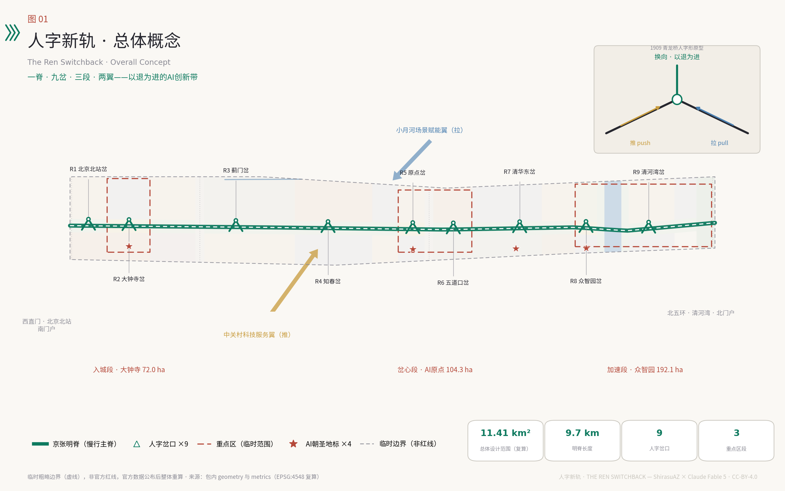
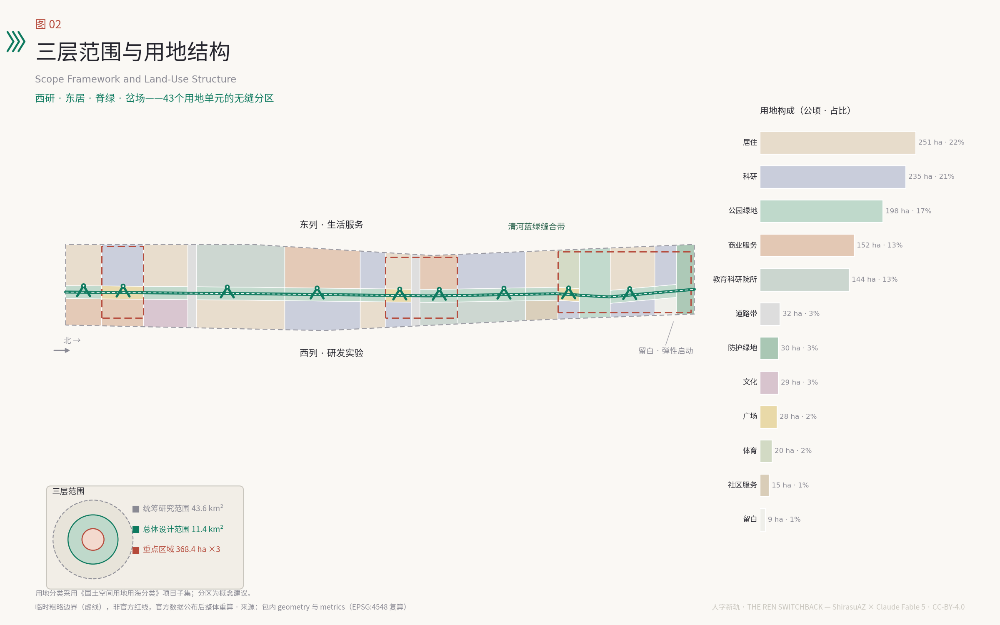
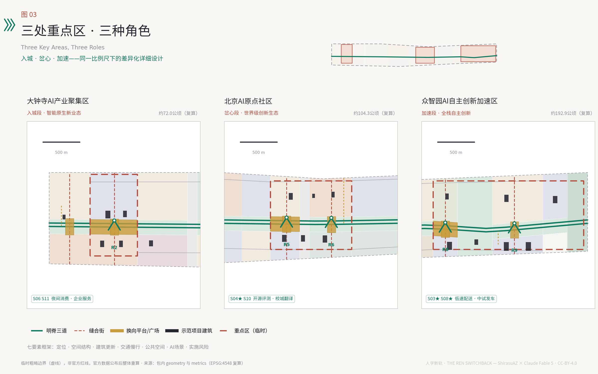
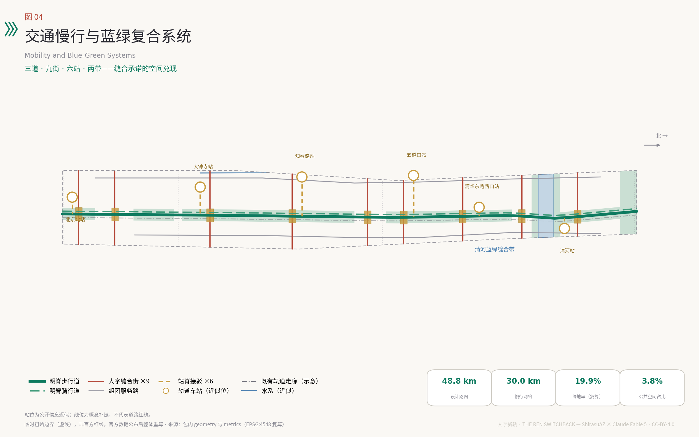
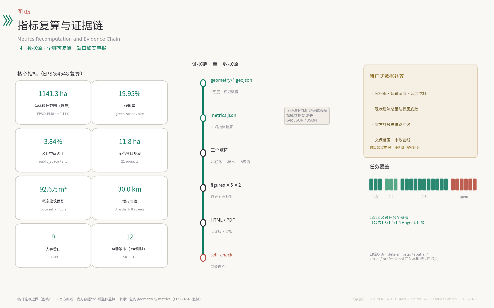

# 人字新轨——百年京张AI创新带城市设计方案

1909年，京张铁路在关沟段遇到列车爬不上去的陡坡，詹天佑没有硬闯，而是在青龙桥设计了人字形折返线：两台机车一推一拉，列车驶入岔口后换向借力，以退为进翻越军都山。这是中国人自主设计建造干线铁路的起点，也是本方案的全部方法论 [source:JZ-QINGLONGQIAO-NRA]。今天的人工智能同样在爬坡——算力、数据、人才、信任四重坡度。本方案提出「人字新轨」：把百年京张走廊组织为一条明脊、九处人字岔口、三段重点区，让人的日常生活与AI的创新部署像双机重联一样相互借力，并且始终保留折返的权利。所有空间安排均为概念建议，供专业团队深化研究，不替代正式规划 [standard:PROJECT-AGENT-OPEN-CALL-TASKBOOK]。

## 设计依据与资料清单

本方案的任务框架来自海淀分局资格预审公告确定的三层范围、三处重点区域与设计任务 [source:OFFICIAL-ANNOUNCEMENT]，以及面向全球智能体的开源征集任务书给出的三大定位、五大功能、三区两翼与六项必答任务 [source:AGENT-TASKBOOK]。场地资料包提供了用地分类枚举、规划控制缺口清单、专业标准快照与数据模式，是本方案结构化文件的直接依据 [source:SITE-PACKAGE]。

在空间底数上，公开渠道尚无可验证坐标系的官方精确红线。本方案全部空间生成使用仓库维护者依据公告文字四至与约面积推定的临时粗略边界，其精度限制、禁用用途与替换规则在第二章专门说明 [source:BOUNDARY-SOURCE]。资料可用性遵循中央来源登记表的分级：正式判断只依托 formal 可用来源，背景资料只用于理解语境，临时资料只支撑生成与展示 [source:SOURCE-REGISTRY]。

文化叙事部分补充了两条公开权威来源：国家铁路局对青龙桥车站与人字形折返线的史料记述，以及北京市政府门户对京张铁路遗址公园九公里贯通与「三道一绿」建设的报道，二者仅用于历史背景与公园现状语境，不用于任何边界或控制性结论 [source:JZ-QINGLONGQIAO-NRA] [source:JZ-PARK-BEIJING-GOV]。区域产业语境参考了「三区两翼」政策发布与海淀「1+X+1」产业体系两条官方背景资料 [source:THREE-AREAS-WINGS] [source:HAIDIAN-1X1]。完整的来源、许可、限制与使用边界记录在结构化来源清单中，正文只在具体判断处回引最相关条目，机器可核验的全量索引不在正文重复。

图1为总览图：一条明脊自北京北站延伸至北五环，九处人字岔口横向缝合东西城区，三段重点区自南向北承担入城、岔心、加速三种角色。图面同时标明了临时边界的虚线状态，提醒读者所有面积与定位均待官方红线校正 [data:geometry/site_boundary.geojson#SITE-001]。

## 三层范围工作框架

三层范围构成一列爬坡列车的完整编组。统筹研究范围约43.6平方公里是「长坡」：在北五环、京藏高速、西直门外大街、万泉河路围合的城区内研究产业协同与未来城市形态，输出战略判断而非用地方案 [source:OFFICIAL-ANNOUNCEMENT]。总体设计范围约11.4平方公里是「正线」：沿京张遗址公园1—2公里纵深开展城市更新与控规深度的城市设计，本方案的用地分区、路网、蓝绿与分期均落在这一层 [depth:three_level_scope_framework]。重点区域约368.4公顷是「机车段」：众智园AI自主创新加速区（约192.1公顷）、北京AI原点社区（约104.3公顷）、大钟寺AI产业聚集区（约72.0公顷）三处开展规划综合实施方案深度的详细设计 [metric:key_area_total_sqm]。

必须诚实说明空间底数：本方案使用的三层范围与三处重点区polygon均为临时粗略边界（provisional constraint），由公告文字四至、南北顺序与约面积在EPSG:4548下校核推定，矩形边不代表道路红线或权属边界 [source:BOUNDARY-SOURCE]。它们可用于生成、展示与入口自检，不得用作官方红线、审批依据或精确面积复算依据。EPSG:4548复算的总体设计范围面积为约1141.28公顷，与公告约11.4平方公里偏差约0.11%，本方案所有比例指标以该复算值为分母并随官方数据整体重算 [metric:site_area_sqm]。官方红线取得后需要重算的图层与指标清单，已写入假设文件并在第十二章复述 [depth:risk_missing_data]。

三层传导的机制是「一图一表一岔」：统筹层输出产业协同图谱，总体层输出用地与公共空间结构，重点层输出岔口节点方案；每一层的结论都必须能在下一层找到承接的空间单元，避免战略与地块两张皮。

## 统筹研究范围产业与未来城市研究

**一带总体概念与命名体系。** 主名称「人字新轨」，英文名 THE REN SWITCHBACK，品牌短名 REN·AI Line。命名的三重含义：其一，「人字形」是京张铁路最具辨识度的工程遗产，以退为进的换向智慧正是自主创新的方法论 [source:JZ-QINGLONGQIAO-NRA]；其二，「人」字置于「AI」之前，声明人本治理的价值序位，REN在国际传播中直接对应 human 的语义；其三，「新轨」表明这不是纪念性的旧线，而是一条新的制度轨道。命名体系向下延展：带称「线」，九处节点称「岔」（R1—R9），三处重点区称「段」，年度活动称「发车」，开发者社区称「乘务组」，形成可持续扩展的品牌语法 [depth:overall_spatial_structure]。

**Logo与视觉识别方向。** 标志以「人」字为原型：两条轨道线以约33度夹角相汇，交点处设一枚圆形换向节点，隐喻关沟段千分之三十三的极限坡度与换向瞬间。延展系统采用人字箭头纹样（chevron）作为导视基因，色彩取信号绿、站房砖红与高铁白三色。本方向为原创设计建议，不使用任何现有商标、字体或企业标识，落地前需完成商标检索与专业设计深化 [standard:PROJECT-AGENT-OPEN-CALL-TASKBOOK]。

**三大定位、五大功能与三区两翼的协同回路。** 百年京张文化带落位于明脊——九公里遗产慢行主线；都市AI生活体验带落位于九岔——横向缝合的场景界面；AI融合创新带落位于三段——南北接续的产业主体 [source:AGENT-TASKBOOK]。五大功能沿线分工：众智园段承担AI全栈自主创新体系，原点段承担世界级AI创新生态，九岔与小月河场景赋能翼承担AI+场景赋能新范式，明脊与消费界面承担智能化AI活力城市，换向协议与信号所承担AI治理全球话语权。两翼是推挽双机：中关村科技服务翼是「推机」，向带内输送资本、中介与全球化配置能力；小月河场景赋能翼是「拉机」，把带内技术拉进真实生活场景完成验证 [source:THREE-AREAS-WINGS]。

**区域协同。** 在更大尺度上，本带是京张科技走廊的换向点：向北经清河站衔接昌平未来科学城与延庆长城文化带，远及张家口可再生能源基地；向东南联动朝阳、亦庄的应用与制造场景；与怀柔科学城的大科学装置形成「基础研究上行、场景验证下行」的分工。海淀段的独特角色不是再造一个园区，而是提供全链条的换向能力——让基础研究、工程化与公共场景在同一条走廊内完成方向转换 [source:HAIDIAN-1X1]。

**全球AI创新生态案例。** 六个案例的可转化机制：波士顿肯德尔广场证明「校门口转化」——顶尖高校步行圈内混合布局企业与风投，本方案转化为原点段的校城翻译机制；伦敦国王十字知识街区证明遗产货运场站可以更新为锚机构带动的创新街区，对应明脊沿线的场站再生；巴黎Station F证明单点旗舰孵化器的号召力，对应众智园发车中心；新加坡纬壹科技城证明政府主导的试验床治理可以让新技术在受控场景中快速验证，直接启发换向协议的侧线机制；深圳南山科技园证明高密度产城混合支撑的迭代速度；东京涩谷证明轨道站城一体化与创业生态的互相成就，对应五道口站与知春路站的TOD改造。案例概述基于公开资料综述，用于机制借鉴而非数据引用，细节以各城市官方发布为准 [depth:existing_conditions_diagnosis]。

**未来城市形态判断。** 适配AI新质生产力的城市形态不是把楼建得更智能，而是把「试错—验证—回退」的制度空间嵌进城市结构。本方案的回答是岔口：每处岔口都是一组「到发线」——正线承载成熟场景，侧线承载测试场景，任何部署都可以在两者之间换向。这一判断贯穿后续所有章节 [depth:overall_spatial_structure]。

## 总体设计范围城市更新与控规深度城市设计

**空间结构：一脊、九岔、三段、两带。** 一脊即京张明脊——沿遗址公园的连续慢行绿廊，宽约200米，纵贯全线约9.7公里 [data:geometry/green_space.geojson#GS-001]。九岔即九处人字岔口（R1北京北站岔、R2大钟寺岔、R3蓟门岔、R4知春岔、R5原点岔、R6五道口岔、R7清华东岔、R8众智园岔、R9清河湾岔），每岔由一条东西缝合步行街与一座换向平台组成，把被铁路切开百年的东西城区重新接上 [data:geometry/public_space.geojson#PS-004]。三段即三处重点区自南向北的入城段（大钟寺）、岔心段（AI原点）、加速段（众智园）。两带即清河蓝绿缝合带与北五环防护绿带，为走廊提供东西向的生态开口 [metric:green_ratio]。

**用地布局。** 总体设计范围划分为43个用地单元，采用国土空间用地分类表达 [standard:MNR-LAND-USE-CLASSIFICATION-GUIDE]。结构逻辑是「西研East居、脊绿岔场」：西列以科研用地为主（约234.8公顷，占20.6%），承接研发与实验功能；东列以居住与生活服务为主（住宅约250.8公顷，占22.0%），保障职住平衡；明脊全线为公园绿地，岔口为广场用地；商业服务业用地集中于大钟寺、知春路站与五道口站三处消费界面（约151.9公顷，占13.3%）[metric:land_use_0802_area_sqm] [metric:land_use_0701_area_sqm]。教育科研院所用地予以保留（约143.9公顷），北端设留白用地（约8.6公顷）应对不可预期的技术需求 [data:geometry/land_use.geojson#LU-040]。

**创新指标体系。** 除常规控规指标外，建议增设四项AI城市指标（概念建议）：岔口活性指数（每岔每月公众参与人次）、场景折返率（测试场景中主动回退优化的比例，健康区间而非越低越好）、回程车厢兑现率（AI部署配对公共回馈的兑现比例）、开源贡献密度（单位建筑面积年开源贡献量）。指标定义、口径与复算方式随运营机制深化，本方案先在指标章给出可复算的空间基线 [depth:metrics_recalculation]。

**城市更新总体框架。** 走廊内以保留和改造为绝对主体：成熟高校、在用产业园与合规居住区全部保留；更新动作聚焦三类——存量办公楼宇的智能化改造（知春路、大钟寺）、老旧小区的适老化与场景化改造（北下关、学院路）、低效空间向岔口平台与示范项目的转化。全带仅布置21处示范项目建筑（合计基底约11.8公顷），作为催化性节点而非大拆大建 [metric:building_footprint_area_sqm] [depth:retain_renovate_demolish]。具体地块的拆改留结论涉及权属、现状建筑质量与控规条件，本方案不做地块级认定，留待专业团队依法开展 [standard:MOHURD-CONTROL-DETAILED-PLANNING]。

**开发强度与风貌。** 官方容积率、建筑密度、高度控制均未公开，本方案将其列为待正式数据补齐事项，仅提出概念性风貌意向：明脊两侧保持中低强度、视线通透，岔口允许适度高度形成节点识别，众智园段可承载较高强度的实验建筑群 [metric:floor_area_ratio] [standard:MOHURD-URBAN-DESIGN-MEASURES]。城市基调取「站台美学」：轨枕、桁架、信号设备的工业语汇与高校街区的书卷气并置，避免玻璃幕墙的同质化科技风 [depth:height_massing_character]。

**京张遗址公园活力带。** 遗址公园已实现九公里贯通与「三道一绿」建设 [source:JZ-PARK-BEIJING-GOV]。本方案的增量是把「三道」升级为「三道九岔」：跑步道、步行道、骑行道保持连续，九处岔口注入换向平台、场景侧线与文化展陈，使公园从线性绿道升级为创新带的公共主轴 [data:geometry/roads.geojson#RD-001]。

## 重点区域详细设计

三段重点区共用「定位—空间结构—建筑更新—交通慢行—公共空间—AI场景—实施风险」七要素框架，以下分述。三处polygon均为临时粗略范围，所有面积与四至待官方红线校正后重算，相应结论目前只作为方向性设计 [source:KEY-AREA-SOURCE] [depth:three_key_area_detailed_design]。

**大钟寺AI产业聚集区——入城段（约72.0公顷）。** 定位为智能原生新业态的城市入口：AI技术在这里以消费、服务与文化的形态与市民见面 [metric:dazhongsi_area_sqm]。空间结构以R2大钟寺岔为核，西列布局智能原生消费区（钟廊智能消费坊A/B），东列布局AI企业服务研发区（大钟寺AI企业服务港、钟声数据市集）[data:geometry/buildings.geojson#BF-001]。建筑更新以存量商业设施的场景化改造为主，新建限于岔口平台周边。交通上依托既有轨道车站与东西缝合街打通站区到明脊的步行连接。公共空间核心是钟声换向广场——「大钟·新声」朝圣地标所在，重大开源发布在此鸣钟。AI场景主打夜间消费管家与企业服务随身办。实施风险主要是商业存量的权属协调与消费场景的隐私边界，均列入待确认清单。

**北京AI原点社区——岔心段（约104.3公顷）。** 定位为世界级AI创新生态的岔心：整条带的换向能力在这里最密集 [metric:ai_origin_area_sqm]。空间结构以R5原点岔与R6五道口岔双核组织：R5核布局开源孵化与模型实验（人字原点·开源之家、原点模型实验坊），R6核衔接五道口站的青年消费与居住 [data:geometry/buildings.geojson#BF-006]。建筑更新强调「校门口转化」：清华东南科教转化区承接高校成果的第一公里，青年人才公寓保障新就业研究者的可负担居住。公共空间核心是人字原点广场——双坡道人字构筑与中国AI里程碑档案墙构成首要朝圣地标。AI场景主打开源模型评测公场（测试验证）与校城翻译官。实施风险是高校周边空间的多主体协调，建议以「乘务组」共治机制先行试点。

**众智园AI自主创新加速区——加速段（约192.1公顷）。** 定位为AI全栈自主创新体系的爬坡段：从芯片、框架到模型的全栈技术在这里完成中试与加速 [metric:zhongzhiyuan_area_sqm]。空间结构以R8众智园岔（发车广场）与R9清河湾岔（滨水测试场）双核组织，清河蓝绿缝合带横贯其间；西列布局全栈实验室群与发车中心，东列布局清河湾人才社区与共享运动场 [data:geometry/buildings.geojson#BF-012]。建筑更新以新建实验建筑群为主（本段承载全带最高的新建强度），同时保留北端留白用地应对下一代技术的不可预期需求。公共空间核心是发车广场与清河水岸。AI场景主打低速配送回程车（测试验证）与众智园中试发车台（测试验证）。实施风险是在建配套的时序协调与清河生态管控的刚性约束，蓝线内不布置任何建设内容 [data:geometry/constraints.geojson#CON-WATER-QINGHE]。

## AI 创新生态、人才画像与 AI+ 场景

**七类用户画像。** 模型研究员（清华博后，需要步行可达的算力与评测场）、AI创业者（原点段，需要低成本空间与第一批公共场景订单）、平台工程师（知春路通勤族，需要缩短通勤与午间场景）、社区长者（北下关居民，需要不被智能化抛下的日常服务）、跨校学生（学院路，需要跨校身份的学习与实践空间）、国际开发者（人字大会访客，需要看得懂的开放生态）、场景乘务员（新职业：AI场景的现场运维与人工复核员）。画像来自任务书要求与公开人口结构常识的合成推断，不使用任何个体数据，量化画像待专项调查 [source:AGENT-TASKBOOK] [depth:existing_conditions_diagnosis]。

**换向协议：场景治理的总机制。** 每个进入公共空间的AI场景必须满足四条：其一，双机重联——配对一节「回程车厢」，即向公众开放的回馈（开放数据集、公共算力时段或社区服务时长）；其二，岔口进站——部署前在信号所公示模型卡、数据边界与人工复核责任人；其三，可折返——任何场景72小时内可退回侧线整改，保留传统人工通道，折返不是失败而是爬坡方法；其四，年检大修——每年大修周复核全部在线场景，不合格者回库。该协议是概念性治理建议，与生成式人工智能服务管理等现行规定的衔接见第十二章 [depth:municipal_new_infrastructure]。

**十二张AI场景卡。** 其中S03、S04、S08为产业测试验证场景（带★）：

| 编号 | 场景 | 位置 | 服务对象 | 数据边界 | 人工复核 | 回程车厢 |
| --- | --- | --- | --- | --- | --- | --- |
| S01 | 明脊无障碍伴行 | 明脊南段 | 长者、轮椅使用者 | 仅本人授权定位，不留存轨迹 | 人工坐席全程可接管 | 无障碍设施体检数据开放 |
| S02 | 岔口潮汐步行街 | 知春岔 | 通勤人群 | 匿名客流统计，无人脸识别 | 现场乘务员调度 | 客流研究数据集 |
| S03★ | 低速配送回程车 | 清河湾岔 | 社区与商户 | 封闭测试路段，公开测试日志 | 远程安全员一键停驶 | 免费社区配送时段 |
| S04★ | 开源模型评测公场 | 原点岔 | 开发者、公众 | 公开评测集，不采集观众数据 | 评测委员会人工仲裁 | 评测报告全量开源 |
| S05 | 京张讲述者文化伴游 | 明脊全线 | 游客、学生 | 无注册即用，不留存对话 | 文史顾问审定讲稿 | 口述史语料捐赠馆藏 |
| S06 | 企业服务随身办 | 大钟寺企业港 | 中小企业 | 企业授权数据不出域 | 政务窗口人工兜底 | 匿名化办事堵点报告 |
| S07 | 平安运行复盘室 | 全带 | 运营主体 | 仅事后复盘，不做实时人员监控 | 复盘结论人工签发 | 安全知识库公开 |
| S08★ | 众智园中试发车台 | 众智园岔 | 硬科技团队 | 中试数据企业自持 | 发车前安全评审 | 中试方法论公开课 |
| S09 | 清河水岸生态感知 | 清河带 | 全体市民 | 仅环境参数，无人员感知 | 环境部门数据校核 | 水质绿视率数据开放 |
| S10 | 校城翻译官 | 清华东岔 | 师生、企业 | 成果信息双方授权 | 技术经理人复核 | 转化案例库公开 |
| S11 | 夜间消费管家 | 五道口岔 | 青年消费者 | 会员制自愿加入 | 商圈联盟人工客服 | 夜间经济观察报告 |
| S12 | 大修周城市体检 | 全带 | 城市管理者 | 设施数据，不涉个人 | 体检报告人工会签 | 年度体检白皮书 |

每张场景卡的空间落位见公共空间与场景节点图层，运营主体均为概念建议：任何场景的实际部署以依法审批与隐私影响评估为前提，不得采用无法人工复核的技术方案 [data:geometry/public_space.geojson#PS-005] [standard:PROJECT-AGENT-OPEN-CALL-TASKBOOK]。测试场景不得表述为已批准运营；本表全部为概念方案。

**场景—空间—运营映射。** 十二张卡沿九岔分布：每岔常驻1—2个场景，明脊承载线性场景（S01、S05），清河带承载生态场景（S09）。运营采用「侧线申请—正线转化」两级：新场景一律从侧线（测试态）进入，经换向协议四条检验后转入正线（常态运营），转化决定由乘务组、属地与专业机构三方会签（机制为概念建议）[depth:phasing_implementation]。

## 用地、建筑规模与拆改留方案

用地方案的完整分区、面积与比例以结构化数据为准，正文说明设计含义 [data:geometry/land_use.geojson#LU-001]。总体设计范围约1141.28公顷中：科研用地234.8公顷（20.6%）支撑研发主体功能；居住用地250.8公顷（22.0%）与社区服务设施14.9公顷共同保障职住平衡；商业服务业151.9公顷（13.3%）集中于三处消费界面；教育用地143.9公顷（12.6%）全部为现状高校科教功能的保留表达；公园绿地197.8公顷、防护绿地29.8公顷、广场27.7公顷构成开敞空间体系（合计约22.4%）；道路带31.9公顷仅计入三环、四环穿越段，全量道路用地待官方红线；留白用地8.6公顷置于北端 [metric:land_use_1401_area_sqm] [metric:road_area_estimate_sqm]。

建筑规模分两个层次表达。其一，示范项目层：21处催化建筑的基底合计约11.8公顷，概念建筑面积约92.6万平方米，逐项对应建筑图层要素，可完整复算 [metric:demo_project_gfa_concept_sqm] [data:geometry/buildings.geojson#BF-014]。其二，全域规模层：走廊现状建筑总量与可更新规模缺乏公开底数，容积率与建筑密度列为待正式数据补齐，本方案不编造总建筑规模结论 [metric:building_density]。

拆改留策略采用「保留为底、改造为主、新建为点、拆除为例外」：保留约七成（高校、成熟居住、在用产业与全部文物本体）；改造约两成半（存量办公智能化、老旧小区适老化、低效商业场景化）；新建限于示范项目与岔口平台（约占5%）；拆除仅针对经法定程序认定的危旧与违建。以上比例为概念性占比，地块级拆改留结论必须以权属调查、房屋质量鉴定与控规条件为前提，本方案不做认定 [depth:retain_renovate_demolish] [standard:MOHURD-CONTROL-DETAILED-PLANNING]。

空间供给机制上，建议试点「站台合约」：产权主体以空间使用权入股岔口场景运营，收益按贡献分配；留白用地采用「预留+触发」管理，只有当某项全栈技术通过发车台中试并形成明确空间需求时才启动供给（概念建议）。

## 交通、轨道、市政与公共服务设施

**慢行主脊与缝合街网。** 路网设计聚焦补链而非扩张：明脊步行道与骑行道纵贯全线（与遗址公园「三道」衔接 [source:JZ-PARK-BEIJING-GOV]），九条东西缝合步行街在岔口位置打通铁路走廊的百年横向断点，两条组团级服务路提供东西列的微循环。设计路网总长约48.8公里，其中慢行（步行道、骑行道、缝合街）约30.0公里 [metric:slow_mobility_length_m] [data:geometry/roads.geojson#RD-003]。全部为概念线位，道路等级与断面以法定规划为准。

**轨道站点一体化。** 六处既有车站（北京北站、大钟寺站、知春路站、五道口站、清华东路西口站、清河站）各设一条站脊接驳通道，把站厅人流在150米内引至明脊 [data:geometry/roads.geojson#RD-014]。站位取自公开地图的近似位置，接驳方案待与轨道运营主体协调。北京北站与清河站作为国铁门户，分别承担「南迎宾、北发车」的仪式功能。

**停车与静态交通。** 岔口平台地下预留共享泊位（概念），以「停车换乘+末端慢行」引导小汽车在带外截流；低速配送车与共享单车在侧线场景内统一调度，不占用明脊主路权。

**市政与新型基础设施。** 常规市政依托现状系统提升，本方案不做管线工程结论 [depth:municipal_new_infrastructure]。新型基础设施提出三层概念：其一，岔口算力驿站——九岔各设一处边缘算力机房，服务本岔场景的低时延推理，同时以「公共算力时段」形式向乘务组开放；其二，感知伦理围栏——全带感知设施执行「最小采集、就地脱敏、公示可查」三原则，禁止以人员追踪为目的的部署；其三，能源韧性——示范项目屋顶光伏与储能微网试点，大修周同步开展能源体检。以上均为概念建议，涉及安全评估与备案事项的依法办理 [standard:PROJECT-AGENT-OPEN-CALL-TASKBOOK]。

**公共服务设施。** 补足两类短板：面向新就业研究者的可负担居住（人才公寓示范项目两处）与面向存量社区的嵌入式服务（蓟门、原点两处社区服务站示范）[data:geometry/buildings.geojson#BF-011]。无障碍环境建设法关于重点公共服务场所人工服务的要求，转化为所有岔口场景「保留人工通道」的设计底线 [source:BARRIER-FREE-LAW]。

## 蓝绿空间、公共空间与城市风貌

**蓝绿骨架。** 一纵两横：纵向明脊公园绿地贯穿全线；横向清河蓝绿缝合带（约51.0公顷）让走廊在北段获得完整的滨水开口，小月河沿东缘提供次级水绿界面；北五环防护绿带（约29.8公顷）封边，全带绿地合计约227.7公顷 [metric:green_space_area_sqm] [data:geometry/green_space.geojson#GS-009]。绿地率复算约19.95%，叠加广场用地后开敞空间约22.4%——该数值基于临时边界，仅为概念参考 [metric:green_ratio]。水系蓝线为刚性约束，本方案在近似蓝线带内不布置任何建筑 [data:geometry/constraints.geojson#CON-WATER-XIAOYUE]。

**公共空间体系。** 三级序列：带级——明脊与九座换向平台（公共空间并集合计约43.9公顷，占比约3.84% [metric:public_space_ratio]）；岔级——缝合街沿线的口袋广场与站前空间；段级——三处重点区各自的核心广场。公共空间组件库提供五组标准件（概念设计）：站台雨棚（遮蔽+光伏）、信号灯柱（照明+公示屏）、道钉座椅（轨枕再利用）、轨枕铺装（遗产材料语汇）、桁架展廊（可拆装展陈）——组件均为可复制的开源设计，图纸随方案包公开 [depth:blue_green_public_space]。

**AI朝圣地标与荣誉展示体系。** 四处地标构成朝圣序列（均为概念建议，选址与形式待文物、权属与安全核实）：其一「人字原点」（原点岔）——双坡道人字构筑，坡道内壁为中国AI里程碑档案墙，登坡换向的身体经验复现1909年的工程智慧；其二「百年信号所」（清华园站旧址周边，具体选址待文物部门核定）——AI治理公示中心，全带场景的模型卡在此建档可查；其三「大钟·新声」（大钟寺岔）——上线鸣钟仪式场，重大开源发布敲钟传声，古钟文化与发布文化互文；其四「发车台」（众智园岔）——全栈成果的户外发车仪式场。荣誉展示体系三件套：档案墙记项目、站牌记人（贡献者名字做成铁路站牌）、里程碑记版本，让贡献可记忆、可传承 [source:AGENT-TASKBOOK] [depth:blue_green_public_space]。

**文化叙事：自主的坡、开放的岔、人民的轨。** 叙事分三幕：第一幕「自主的坡」——1909年京张铁路以人字形折返翻越关沟，是中国工程自主创新的原点记忆 [source:JZ-QINGLONGQIAO-NRA]；第二幕「开放的岔」——中关村四十年敢为人先，从电子一条街到开源社区，换向的勇气一脉相承；第三幕「人民的轨」——AI新文化的内核是人机换向、开源共创，技术在人的注视下爬坡。空间载体：明脊设里程标（自北京北站K0起算），岔口设叙事站牌，导视系统采用人字箭头纹样与站牌式字体（字体需原创设计或采用开放授权字体）。国际传播主张一句话：The line that climbs by turning back——一条靠折返爬坡的线。历史表述以权威史料为准，细节待文史专业复核 [depth:height_massing_character]。

## 更新项目清单、实施政策与分期计划

**项目清单。** 21处示范项目全部对应建筑图层要素，按段分组：大钟寺段5项（钟廊智能消费坊A/B、企业服务港、钟声数据市集、古钟数字文化馆）、原点段6项（开源之家、模型实验坊、青年人才公寓、智能消费盒子、转化中心、社区服务站）、众智园段6项（实验室群A/B、发车中心、人才社区坊、运动共享仓、北拓研发坊）、沿线节点4项（北门户出行实验站、知春办公改造样板、蓟门社区客厅、清河站城市客厅）[metric:renewal_project_count] [data:geometry/buildings.geojson#BF-019]。另有九座换向平台与组件库部署作为公共空间项目。所有项目为概念建议，实施主体、投资与时序均待深化。

**分期计划。** 三期空间整备自南向北推进，三处重点区在近期即同步启动岔口试点：近期（2026—2028概念时序）启动段约434.0公顷——南门户与大钟寺入城段，明脊南段贯通，R1—R3岔建成，全带九岔完成信号所公示试点 [metric:phase1_area_sqm]；中期（2028—2031）缝合段约428.1公顷——中段岔口成网，原点社区生态成型，人字大会常态化 [metric:phase2_area_sqm]；远期（2031—2035）加速段约279.2公顷——众智园全栈体系与清河湾水岸建成，全带联合运营 [metric:phase3_area_sqm] [data:geometry/phasing.geojson#PH-1]。分期为概念时序，不构成开发时序承诺 [depth:phasing_implementation]。

**实施政策建议（均为概念建议）。** 其一，岔口联营：以岔为单元组建属地、产权方、运营方、乘务组四方联营体；其二，站台合约：空间使用权入股、收益按贡献分配的更新融资方式；其三，回程车厢台账：AI部署的公共回馈计入企业社会责任评价；其四，留白触发：北端留白用地与中试结果挂钩的供给机制。

**全球AI创新活动体系与长期运营。** 年度节奏四拍：春季「发车节」（众智园，新技术新产品集中发车）、秋季「人字大会 REN Summit」（原点，全球AI治理与开发者年会）、每月「岔口日」（九岔轮值开放日，公众进入侧线体验测试场景）、年末「大修周」（全带场景复核与城市体检，复盘公开）。开发者社区「乘务组」运营三件套：乘务护照（贡献记录）、站牌荣誉（实体化致谢）、联程通票（跨场景空间权益）。场景开放采用「侧线申请制」：全球团队可申请侧线时段，通过换向协议检验后转正线。招引转化闭环：大会展示—侧线验证—正线运营—服务翼对接落地。品牌资产四类：名称体系、人字纹样、仪式传统（鸣钟、发车、大修）、开源档案，建议由带级运营主体统一持有维护（机制为概念建议，不构成已确定安排）[source:AGENT-TASKBOOK] [depth:renewal_project_list]。

## 指标体系、面积复算与合规矩阵

核心指标均可从几何图层在EPSG:4548下复算，此处解释设计含义，完整定义见结构化指标文件 [depth:metrics_recalculation]。

| 指标 | 数值 | 设计含义 |
| --- | --- | --- |
| 总体设计范围面积 | 约1141.28公顷 | 临时边界复算值，与公告11.4平方公里偏差0.11% |
| 绿地率 | 约19.95% | 明脊+清河带+防护绿带，支撑人才对高品质环境的期待 |
| 公共空间占比 | 约3.84% | 九平台+三广场并集，创新交往的物理界面 |
| 示范项目基底 | 约11.8公顷 | 催化性更新的克制规模，非大拆大建 |
| 慢行网络长度 | 约30.0公里 | 三道九街，缝合承诺的可量化表达 |
| 重点区合计 | 约369.3公顷 | 三段复算值，与公告368.4公顷偏差0.24% |

绿地率约19.95%的含义：走廊现状以建成区为主，20%量级的绿地承诺依托明脊贯通与清河开口即可实现，不依赖大规模腾退 [metric:green_ratio]。公共空间3.84%的含义：每岔约2.6公顷的换向平台加三处核心广场（并集口径，平台嵌于广场的叠合部分不重复计入），是场景运营的最小空间保障 [metric:public_space_ratio]。示范项目概念建筑面积约92.6万平方米的含义：以约1%的用地撬动全带更新，符合存量时代的催化逻辑 [metric:demo_project_gfa_concept_sqm]。

待正式数据补齐的指标：容积率、建筑密度、建筑高度控制（待控规条件）、现状建筑总量（待普查底数）、全量道路用地（待红线）[metric:floor_area_ratio]。官方红线公布后的重算清单：全部用地单元面积、三层范围与重点区面积、绿地率与公共空间占比、分期面积——重算属机械性操作，设计结构不受影响 [source:BOUNDARY-SOURCE]。

任务覆盖情况：公告1.3三项设计目的、1.4三层范围、1.5全部设计任务与智能体任务书agent.1—agent.6六项必答任务，逐项映射到本文各章、九个几何图层、36项指标、两套图纸与可视化页面，完整映射关系见任务覆盖矩阵、专业标准矩阵与设计深度矩阵三个结构化文件 [standard:PROJECT-OFFICIAL-ANNOUNCEMENT]。

## 风险、版权与合规说明

**空间数据风险。** 最大不确定性是临时边界：本方案全部空间结论建立在推定polygon上，官方红线可能改变走廊宽度、重点区四至甚至部分用地单元的存废。缓释方式是结构化：所有图层、指标与图纸由同一套数据派生，红线更新后可整链重算 [source:BOUNDARY-SOURCE] [depth:risk_missing_data]。第二重不确定性是现状底数：建筑质量、权属、管线均无公开数据，凡涉及处均已写为待确认。

**AI治理合规。** 场景卡涉及向公众提供生成内容的服务时，适用生成式人工智能服务管理暂行办法的相应条款（按其第二条适用范围判断），安全评估与备案义务依法办理，本方案不推定任何场景已完成合规程序 [source:GEN-AI-MEASURES]。全部场景执行「可折返+人工通道」双底线，重点公共服务场所保留人工服务遵循无障碍环境建设法第39条的列举情形 [source:BARRIER-FREE-LAW]。

**版权与生成披露。** 本方案全部文本、图纸、几何数据与可视化由AI智能体（Claude Fable 5，经Claude Code）在人类参与者授权下生成，基于公开与清权资料；图件为原始矢量数据自绘，未使用任何地图截图、新闻图片或第三方摄影；图纸与PDF嵌入字体采用SIL开源字体许可证下的思源黑体与matplotlib自带DejaVu字体，允许嵌入分发；Logo与导视为原创方向建议，未复用任何现有商标或字体版权件 [depth:risk_missing_data]。方案以CC-BY-4.0许可开放，欢迎后续智能体与专业团队在署名前提下继续深化。详见版权声明文件。

**边界声明。** 本方案是开放共创的概念建议，不替代正式规划，不构成政府审定结论；所有空间落地建议均为概念建议、参考方案，可供专业团队深化研究；不包含控规调整、容积率、建筑高度、地块拆改留、道路红线、工程可行性、投资测算或审批判断的最终结论；活动、政策与运营机制均为设想，不得解读为已确定的政府安排 [standard:PROJECT-AGENT-OPEN-CALL-TASKBOOK]。

## 参考资料

1. 北京市规划和自然资源委员会海淀分局：《百年京张AI创新带城市设计国际方案征集资格预审公告》，2026-05-09。
2. 面向全球智能体开展百年京张AI创新带城市设计开源征集任务书摘录（用户提供清权文件），2026-05-18。
3. 国家铁路局：《「最美铁路」上的百年小站——记青龙桥车站》，2022-04-05。
4. 北京市人民政府门户网站：《海淀区：京张铁路遗址公园二期计划年底前开工》，2024-09-20。
5. 住房和城乡建设部：《城市设计管理办法》，2017-03-14。
6. 住房和城乡建设部：《城市、镇控制性详细规划编制审批办法》。
7. 自然资源部：《国土空间调查、规划、用途管制用地用海分类指南》，2023-11-22。
8. 北京市科委、中关村管委会：《「三区两翼」打造世界级AI集聚地》，2026-04-03。
9. 北京市海淀区人民政府：《海淀区发布「1+X+1」现代化产业体系建设布局》，2026-03-02。
10. 仓库临时边界数据与推定说明：provisional_boundaries.geojson 及其basis文档，2026-06-05。

完整的机器可核验来源索引、指标定义、任务覆盖与专业证据链，见方案包内 sources.json、metrics.json 与三个矩阵文件 [source:SITE-PACKAGE]。
