# 我，百年京张铁路，今天觉醒了感知系统——第二次测量：可感京张感知基线带

一百一十九年前，一群人扛着水准仪走进这片荒野，他们测量坡度、曲率与里程，要回答一个问题：这条铁路能通向多远。他们把答案刻进了关沟的岩壁和青龙桥的人字形道岔里。

一百一十九年后，铁路的钢轨被抬进博物馆，路基变成了一条穿过海淀腹地的绿色长廊。城市在它两侧长满了实验室、宿舍楼、快递站和早点摊。人们从它上面走过去、跑过去、骑过去，很少有人再问它通向多远——他们更常在心里嘀咕另外几件事：这段路怎么没有一棵树；这段坡道推不上去；这段路晚上太黑，我要不要绕开。

这份规划就从这些嘀咕开始。它主张：京张需要第二次测量。第一次测量的对象是地形，第二次测量的对象是人的感受；第一次用的是水准仪，第二次用的是断面、指标、调研与复测；第一次的成果是一条铁路，第二次的成果是一条**好走、好停、好用**的公共空间主轴，以及一套能被验算、被追问、被修改的更新方法。

> **本篇怎么读。** 全篇十三章，每章先讲一段发生在这条线上的故事，再讲这段故事对应的规划怎么做；每章都配一张规划图和一张概念效果图。故事中的人物是这条线上真实使用者的合成形象，用于说明规划要解决的问题，不是已发生事件的记录。文中所有范围为暂定研究边界，不作为法定规划边界；感知类数值为模型估算，须经现场踏勘与公众调研复核；低速智能设备的线路、驿站与限速为概念性建议，实施前须完成审批。每章末尾一行小字是给机器与校核者看的索引，读故事时可以跳过。

**项目速览。** 总体设计范围 1141.3 公顷；公共空间主轴长约 9.3 公里；沿线设 18 处评估断面，模型估算平均短板指数 0.416，其中 5 处不低于 0.45，构成一期整治对象；重点地区 3 处，合计 369.2 公顷；概念用地单元 9 个；应用场景 16 项，其中需受控测试者 6 项；低速配送试验线路中心线累计 18.8 公里，服务驿站 3 处、合计 972 平方米；更新项目 12 项，分三期实施。

---

## 第一章　醒来：设计依据与资料清单

五月的第三个清晨，天还没有全亮，林深就到了大钟寺北边的那段路基上。

她是这次工作组里最年轻的规划师，也是唯一一个把闹钟定在四点四十的人。组里争论过很多次：一个遗址公园的更新方案，到底该从哪里开始？有人说先看上级规划，有人说先做产业研究，有人说先请无人机飞一圈拍现状。林深的答案是先来走一遍——在人最少的时候走一遍，再在人最多的时候走一遍，两遍之间的差别就是这条线真正的问题。

五点四十,东边的天亮起来。露水从草丛里升上来，铁轨的旧枕木还留在铺装里，像谁在地上画了一行虚线。她看见一个穿橙色马甲的人推着车从远处过来，扫帚的沙沙声比脚步先到。

那是陈守义，这段路的护养工，人们叫他老陈。他今年五十七岁，父亲是京张线上的扳道工。老陈把车停下，看了看她手里的图板：“又是来画图的？”

“来量东西的。”林深说。

“量什么？路我熟，九点几公里，我一天走两遍。”

“量您走这两遍里，哪一段最难走。”

老陈笑了一下，那种见过太多规划的笑。然后他伸出手指，往南边点了三下：“那儿夏天晒得站不住；那儿有个坎，轮椅上不去；再往南那一段，晚上灯是断的。”

林深把这三句话记在了图板的第一页。后来这份规划里所有的指标、断面、项目和分期，本质上都是在回答老陈那三根手指。

但她那天还做了另一件不那么诗意的事：她把手上所有资料摊在临时工作站的长桌上，一份一份分类——哪些是可以直接用的，哪些只能当作概念推定，哪些必须老老实实写上“待明确”。这件事听起来枯燥，却决定了这份规划的诚实程度。因为规划最容易犯的错误不是画得不好，而是把不知道的事情说成知道。

**规划怎么做。** 本次工作先建立资料分级，再动笔画线。第一级是征集公告与任务书，它们确定了选题、范围与成果要求；第二级是国家与行业规范，包括城市设计管理办法、控制性详细规划技术规范与用地分类指南，它们决定了成果的深度语言；第三级是公开地图与铁路遗产资料，用于识别线路走向、站点相对位置与两侧功能；第四级是本方案自建的空间数据，包括评估断面、概念用地单元、绿地骨架与低速配送试验线路。四级资料的可信度依次递减，因此凡是依赖第四级得出的结论，正文一律标注其概念属性。

据此形成三张清单。可直接使用的：线路走向、站点相对位置、公开的功能分布。可概念推定的：断面位置、用地单元边界、绿地与公共空间骨架。必须标注待明确的：法定用地边界、容积率、建筑限高、道路红线、产权归属、市政与文物保护条件。此外还有一张“本次不采集”清单——个人轨迹、人脸、未清权街景与航拍影像——它约束的不是别人，而是本方案自己。

现状诊断也在这一步完成。这条线的问题不是缺少形象，而是缺少三样具体的东西：连续的树荫、可以坐下的位置、晚上敢走的照明。它同时缺少一样制度性的东西：一个能把使用者的判断写回规划的接口。前者是设计问题，后者是机制问题，本方案两者都要回答。

| 资料层级 | 具体内容 | 在本方案中的用途 | 使用限制 |
| --- | --- | --- | --- |
| 征集公告与任务书 | 选题方向、范围要求、成果构成 | 确定研究对象与成果清单 | 以公告正式文本为准 |
| 国家与行业规范 | 城市设计管理办法、控规技术规范、用地分类指南、建筑设计文件深度规定 | 确定成果深度与表达语言 | 不替代法定审批 |
| 公开地图与遗产资料 | 线路走向、站点相对位置、两侧功能 | 识别空间关系与文化线索 | 精度有限，不用于工程定位 |
| 自建空间数据 | 断面、用地单元、绿地、试验线路、分期范围 | 支撑指标复算与方案表达 | 概念性判断，须现场复核 |
| 待明确资料 | 法定边界、容积率、限高、红线、产权、市政、文保 | 列入前置条件与风险清单 | 结论一律降级为待确认 |

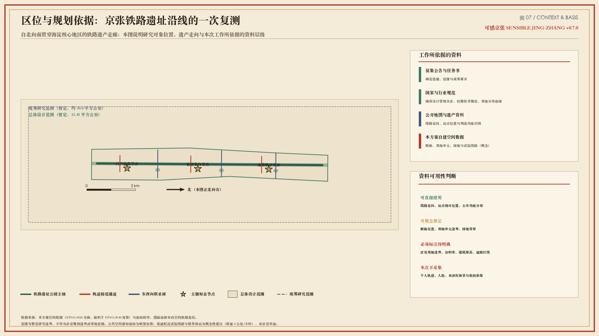

这张图先回答“在哪里”。外层虚线是暂定的统筹研究范围，约 43.6 平方公里；内层实线是总体设计范围，11.41 平方公里，形状被铁路的走向拉成一条南北向的带子。右侧两栏是这一章的实质内容——工作所依据的资料，以及每类资料能走多远。请注意：图上所有边界都是研究用的暂定边界，法定边界发布后需要整体复算。

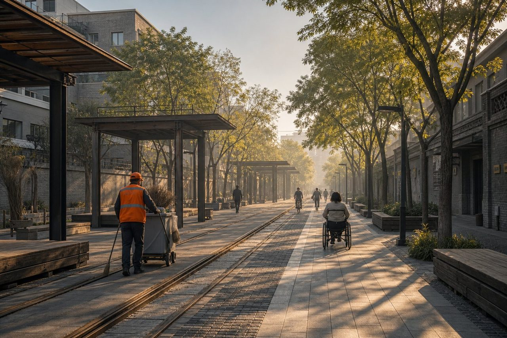

这就是老陈每天推着车经过的那一段，也是这份规划希望它变成的样子：钢轨留在铺装里当作记忆，树荫连续，坐处成组，路面平到轮椅可以自己走。画面是概念效果图，不是实景，也没有表达建筑形式与高度——那些要等法定资料。

> 校核索引（技术核对用，阅读时可跳过）：[standard:PROJECT-OFFICIAL-ANNOUNCEMENT] [standard:PROJECT-AGENT-OPEN-CALL-TASKBOOK] [depth:existing_conditions_diagnosis] [data:geometry/site_boundary.geojson#SITE-BOUNDARY] [metric:site_area_sqm] [source:OFFICIAL-ANNOUNCEMENT] [source:AGENT-TASKBOOK] [source:SITE-PACKAGE] [source:SOURCE-REGISTRY] [source:PROCESSED-FACT-PACK] [source:BOUNDARY-SOURCE] [source:OSM-CONTEXT]

---

## 第二章　尺子的三种长度：三层范围工作框架

六月初的评审会上，工作组第一次吵得不太客气。

一位做产业研究的同事说，你们的范围太窄了，AI 产业是区域性的，只画一条带子说明不了问题。一位做详细设计的同事说，你们的范围太宽了，四十多平方公里怎么落到一把座椅上。争到最后，主持会议的老工程师放下笔说了一句：“那就准备三把尺子。”

这句话后来成了这份规划的骨架。

林深回去把三把尺子的长度定下来：最长的一把量区域，回答产业与人群的趋势；中间的一把量这条带子，回答空间结构与更新顺序；最短的一把量三处地方和十八个断面，回答具体做什么、做到什么程度。三把尺子不能混用——用区域的尺子谈座椅，会变成空话；用座椅的尺子谈产业，会变成越权。

有人问：这三层之间怎么传导？林深在白板上画了一条向下的箭头，又画了一条向上的箭头。向下的那条好理解：研究结论决定空间结构，空间结构决定详细设计。向上的那条是这份规划真正想加进去的东西——现场复测的结果要能回过头来改评估口径，公众复核的结果要能决定下一轮先修哪里。规划不是一次写完的答案，而是一个可以被修改的过程。

会议结束时，老工程师提醒了一句：“三层都要说清楚你不承诺什么。”这句话被写进了每一层的工作说明里。

**规划怎么做。** 统筹研究层约 43.6 平方公里，工作内容是产业与未来城市研究、区域功能关系与人群趋势判断；它**不**出具用地方案，也不提出建设指标。总体设计层 11.41 平方公里，工作内容是城市更新与面向控规深化的概念性城市设计，包括总体结构、功能带、断面体系、公共空间与慢行网络；因为容积率、建筑限高与道路红线均属待明确资料，本层成果的准确表述是“面向控规深化的概念性城市设计”，而不是“已达控规深度”。重点地区层为 3 处、合计 369.2 公顷，工作内容是详细设计与断面整治标准做法，深度要求到设施类型、界面关系与实施顺序。

三层之间的传导按五步固定下来：研究结论、空间结构、详细设计、现场复测、下一轮清单。前三步自上而下，后两步自下而上。每一轮循环留下三件可查的东西：一份复测记录、一份公众意见的处理说明、一份修改后的项目清单。

| 层级 | 范围 | 工作内容与深度 | 明确不承诺的事项 |
| --- | --- | --- | --- |
| 统筹研究层 | 约 43.6 平方公里（暂定） | 产业与未来城市研究、区域功能关系、人群趋势 | 不出具用地方案与建设指标 |
| 总体设计层 | 11.41 平方公里（暂定） | 城市更新与面向控规深化的概念性城市设计 | 不认定容积率、限高与道路红线 |
| 重点地区层 | 3 处 · 369.2 公顷 | 详细设计、断面整治标准做法、设施与界面 | 不替代工程设计与施工图 |
| 断面作业面 | 18 处评估断面 | 分类整治、复测与整改 | 不以模型估算替代现场判断 |

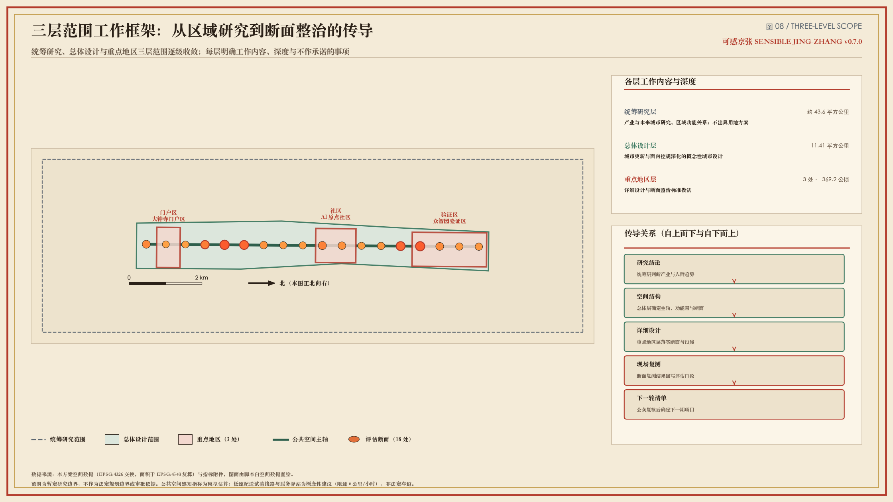

图上三个套合的范围就是那三把尺子：最外层虚线是统筹研究，中间浅绿是总体设计，三块红框是重点地区，主轴上的小圆点是十八处评估断面。右下方的链条图是传导关系——注意最后两环是向上的，这是本方案与常规“逐级下达”最不一样的地方。

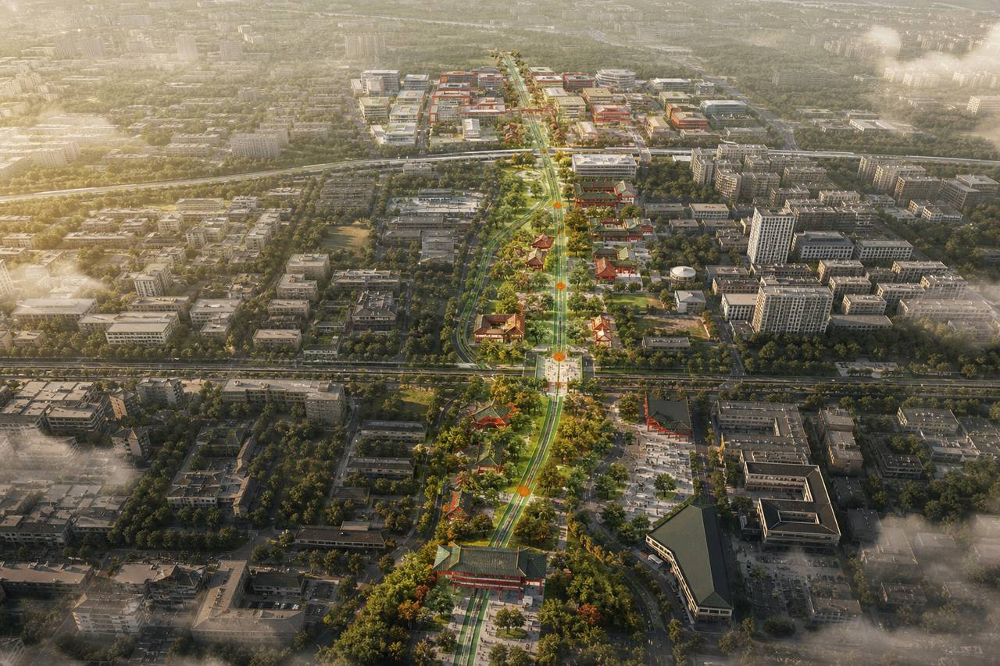

从空中看，三层范围其实是同一件事的三个尺度：一条连续的绿脊，两侧向它打开的首层，以及沿线三处承担不同职能的地方——北端接住到达的人，中段接住留下来的人，南端接住来试验的人。画面为概念效果图，不表达建筑形式与高度。

> 校核索引（技术核对用，阅读时可跳过）：[depth:three_level_scope_framework] [data:geometry/key_areas.geojson#KEY-001] [metric:key_area_count] [source:KEY-AREA-SOURCE] [standard:MOHURD-URBAN-DESIGN-MEASURES]

---

## 第三章　实验室的门开向街道：统筹研究范围产业与未来城市研究

六月下旬，林深花了两周时间做一件看起来和公共空间无关的事：走访这条线两侧的实验室、园区和创业公司。

第一站是一家做具身智能的公司。会议室里，一位工程师给她演示机器人抓取杯子，抓了三次，成功两次。她问：“它在实验室里能走多远？”对方答：“在楼里没问题。”她又问：“那它到楼外呢？”对方笑了：“出了门，情况就复杂了。”

她把这句话记下来。整个下午的走访都在重复同一个结构：技术在室内成熟，在室外不成熟；不是因为算法不够好，而是因为室外没有为它准备位置。人行道太窄、坡道不连续、停靠没有地方、责任没有约定。这些恰好都是规划的问题，不是算法的问题。

第二站是一所高校旁边的旧厂房，二楼有几十个工位，租给刚毕业的年轻人。有个博士生正在门口吃盒饭。林深问他，最需要什么。他想了想说：“需要一个不用消费也能坐两小时的地方。”

这句话比任何产业分析都精准。它说明了一件事：所谓创新生态，很大一部分是公共空间的问题——年轻人能不能负担、能不能偶遇、能不能在深夜安全地回家。技术带不带来创新，取决于人愿不愿意留在这里。

那天晚上，林深在笔记上写：把实验室的门开向街道。这成为整个产业研究部分的结论句。

**规划怎么做。** 统筹层的产业判断不落用地指标，只回答三件事：这里的创新活动需要什么样的公共面、什么样的人需要被留住、以及国际上哪些做法值得借鉴而哪些必须警惕。

创新功能的公共面确定为三种：门户服务面设在大钟寺门户区，承担企业与访客问询、产业信息公开；社区创新面设在 AI 原点社区，承担青年工作室、公众调研与社区客厅；验证展示面设在众智园，承担受控测试走廊与成果展示。三种公共面的共同要求是首层开放、可步行到达、不设门禁式围合。

需要被留住的人分为六类，本方案据此提出空间需求而非人口指标：青年研究人员需要可负担工位、非正式交流场所与夜间安全通行；在校学生需要校门至主轴的连续步行与错峰驻留位置；周边居民需要遮阴、座椅、无障碍与合理的服务半径；企业与创业者需要问询前台、展示界面与设备交接空间；配送与运维人员需要装卸等候位置、饮水与遮阴；访客与游客需要出站辨向、文化解说与休憩点。

国际经验按“可借鉴机制”和“须警惕教训”两类各自记录，共 7 例。可借鉴的部分包括：以街区为单元重新分配道路空间、把废弃铁路改造为区域绿道、在城市中设定明确边界的测试区、以及把公共服务数字化与实体服务网点并置。须警惕的部分只有一条，但足够重要：某国际滨水智慧社区项目因数据治理边界不清而终止——它提醒本方案，任何数据类场景都必须先说明采集范围、保存期限与退出机制，再谈应用价值。

| 研究结论 | 空间响应 | 落点 | 边界说明 |
| --- | --- | --- | --- |
| 技术在室外缺少位置 | 为低速设备设置专用通行层与交接驿站 | 主轴外侧、3 处驿站 | 路权与运营须审批 |
| 青年需要非消费停留场所 | 社区客厅、错峰驻留带、可负担工位界面 | AI 原点社区与校园段 | 不作房源与租金承诺 |
| 创新活动需要公共展示面 | 首层开放、展示设施沿主轴设置 | 三处重点地区 | 不新增封闭园区界面 |
| 国际经验须区分机制与教训 | 借鉴空间机制、规避数据失控风险 | 全线场景规则 | 案例仅作方法参考 |

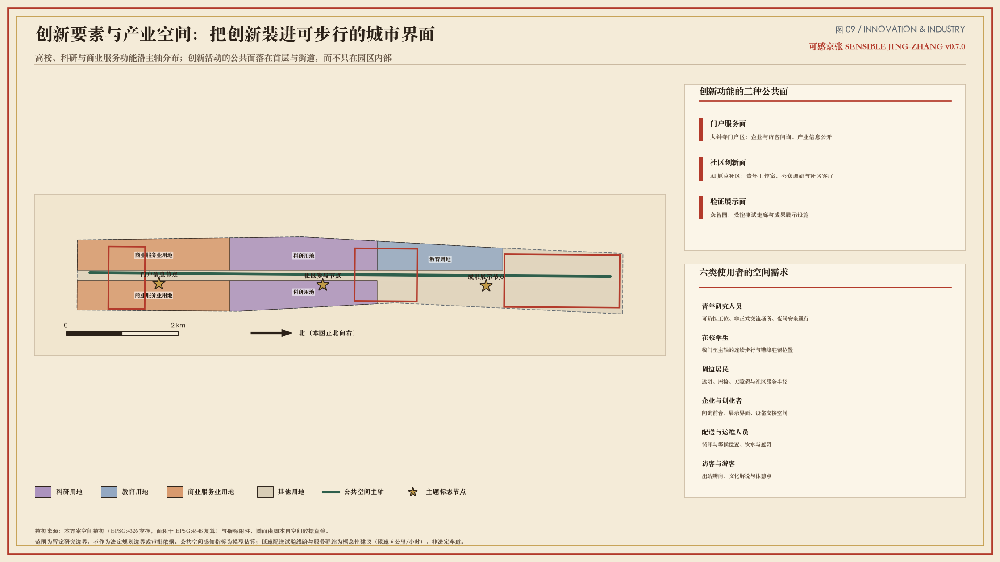

紫色是科研用地，蓝灰是教育用地，橙色是商业服务业用地——它们在图上几乎贴着主轴排列，这说明创新功能与公共空间不是两件事，而是一条界面的两面。右下那张表是本章真正的产出：六类人各自需要什么样的空间。

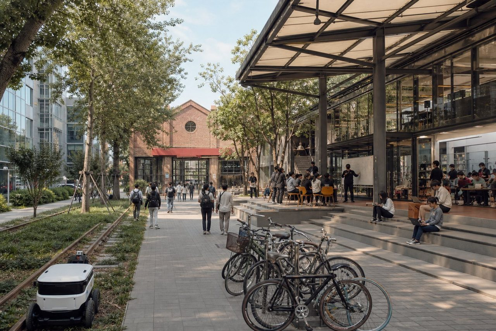

“把实验室的门开向街道”长成的样子：首层是可以看进去的工坊，台阶就是座位，红砖车间被改成入口，低速配送设备停在绿化带外侧、不进入人的通行带。画面为概念效果图，不代表已建成或已审批的项目。

> 校核索引（技术核对用，阅读时可跳过）：[metric:persona_count] [metric:ecosystem_case_count] [source:VATA-PAPER] [source:CITY-LANDSCAPE-INSIGHT] [source:CASE-SG-PDD] [source:CASE-SG-IMDA] [source:CASE-SG-URA] [source:CASE-BCN-SUPERBLOCK] [source:CASE-MEADOWAY] [source:CASE-CHOUTEAU] [source:CASE-HEL-TESTBED] [source:CASE-QUAYSIDE-LESSON] [source:THEORY-OLDENBURG-THIRDPLACE] [source:THEORY-JACOBS-DEATH-LIFE]

---

## 第四章　一条脊、三个院、十八次停下：总体设计范围城市更新与控规深度城市设计

七月的第一个星期，工作组做了一件很笨的事：把九点三公里走了十八次。

准确地说，是每隔大约五百米停下来一次，在每个停下的地方记四件事——头顶有没有树荫，眼前有多少绿，身边有没有能坐下的地方，晚上这里的灯亮不亮。四件事都用零到一的分值记，谁记的谁签名。老陈起初不理解：“这有什么好记的，我一说你就知道了。”

第九次停下的时候，他改了主意。那天下午两点，气温三十六度，他们停在一处接驳等候点，头顶什么都没有。一位带孩子的居民在等人，孩子把脸埋在她的裙子里躲太阳。老陈站了三分钟，自己先受不了了：“行，你们记吧，这个真得记下来。”

十八张记录纸摊在桌上的时候，一件事变得很清楚：这条线的问题不是平均的。有几段其实相当好——树密、有座、晚上也亮；有五段则明显不行，而且这五段恰好都在人最多的地方：一处在校园门廊附近，两处在夜间照明断开的暗段，两处在没有任何遮蔽的接驳等候点。林深把这五段圈出来，写下一句在后面所有会议上都被反复引用的话：**先修最差的五段，再谈别的。**

有人担心这么做“不够宏大”。林深的回答是：一条九公里的路，如果有五段让人不想走，那么剩下四公里修得再漂亮，人们也只会记住那五段。

**规划怎么做。** 总体结构定为“一脊、三区、十八断面”。一脊是长约 9.3 公里的公共空间主轴，承担南北贯通的慢行、生态与休闲功能，主轴自身连续不中断，跨越东西向道路处以平交优先、必要处结合现状高差处理。三区是大钟寺门户区、AI 原点社区与众智园验证区，分别承担到达接驳、日常参与与受控验证三项职能。十八断面是沿主轴平均间距约 540 米布设的评估点位，在门户、校园与夜间薄弱段加密复核；断面不是装饰性的编号，而是本方案的作业单元：整治按断面立项，复测按断面进行，公开也按断面公布。

评估维度固定为四项，并合成一个短板指数：遮阴条件、绿视比例、驻留可能与夜间安全。短板指数越高说明该断面越需要优先整治；全线模型估算平均值为 0.416，最高 0.554，不低于 0.45 的共 5 处。这里必须说清口径：四项分值来自本方案的模型估算，不是实测数据；它的作用是给出一个可复算、可争论的排序起点，实施前须现场踏勘并经公众调研复核，复核结果回写评估权重。

十八处断面按问题类型归为六族，每族对应一套标准做法：门户接驳族补辨向与遮阴；校园门廊族解决高峰通行与错峰驻留的矛盾；综合短板族补遮阴、座椅与饮水；社区生活族补服务与无障碍；夜间安全族补连续照明与活跃界面；验证展示族补设备通行层与观看区分离。城市更新方式以整治提升为主，避免大规模拆除重建：本方案的判断是，这条线缺的不是新建量，而是连续性。

| 断面 | 街段 | 短板指数 | 遮阴 | 绿视 | 驻留 | 夜间安全 | 断面族与首要措施 |
| --- | --- | --- | --- | --- | --- | --- | --- |
| PS-SEC-05 | ST-JZ-05 | 0.554 | 0.52 | 0.62 | 0.41 | 0.506 | 综合短板族：遮阴构架与成组座椅 |
| PS-SEC-15 | ST-JZ-15 | 0.548 | 0.53 | 0.58 | 0.43 | 0.425 | 夜间安全族：连续照明与界面整治 |
| PS-SEC-14 | ST-JZ-14 | 0.518 | 0.51 | 0.57 | 0.40 | 0.333 | 夜间安全族：照明与可呼叫停靠点 |
| PS-SEC-06 | ST-JZ-06 | 0.515 | 0.53 | 0.60 | 0.44 | 0.356 | 夜间安全族：照明与自然监视 |
| PS-SEC-04 | ST-JZ-04 | 0.457 | 0.78 | 0.66 | 0.45 | 0.623 | 综合短板族：驻留带与饮水点 |
| PS-SEC-10 | ST-JZ-10 | 0.446 | 0.36 | 0.55 | 0.52 | 0.697 | 综合短板族：补植与遮阴 |
| PS-SEC-01 | ST-JZ-01 | 0.430 | 0.35 | 0.52 | 0.55 | 0.637 | 门户接驳族：辨向与遮阴 |
| PS-SEC-16 | ST-JZ-16 | 0.420 | 0.79 | 0.63 | 0.47 | 0.563 | 验证展示族：通行层与观看区分离 |
| PS-SEC-11 | ST-JZ-11 | 0.395 | 0.68 | 0.62 | 0.53 | 0.684 | 社区生活族：服务与无障碍 |
| PS-SEC-07 | ST-JZ-07 | 0.390 | 0.79 | 0.68 | 0.48 | 0.402 | 校园门廊族：错峰驻留与夜间照明 |
| PS-SEC-17 | ST-JZ-17 | 0.368 | 0.84 | 0.70 | 0.52 | 0.659 | 验证展示族：展示界面与休憩 |
| PS-SEC-18 | ST-JZ-18 | 0.368 | 0.66 | 0.65 | 0.55 | 0.699 | 验证展示族：端点收束与标识 |
| PS-SEC-13 | ST-JZ-13 | 0.375 | 0.78 | 0.69 | 0.50 | 0.486 | 夜间安全族：暗段照明与解说 |
| PS-SEC-08 | ST-JZ-08 | 0.357 | 0.84 | 0.71 | 0.54 | 0.545 | 校园门廊族：通行组织与配送时段 |
| PS-SEC-09 | ST-JZ-09 | 0.352 | 0.67 | 0.66 | 0.57 | 0.649 | 校园门廊族：驻留带与树荫 |
| PS-SEC-12 | ST-JZ-12 | 0.349 | 0.84 | 0.72 | 0.56 | 0.609 | 社区生活族：座椅与活动场地 |
| PS-SEC-03 | ST-JZ-03 | 0.328 | 0.84 | 0.73 | 0.58 | 0.690 | 门户接驳族：信息设施与休憩 |
| PS-SEC-02 | ST-JZ-02 | 0.324 | 0.67 | 0.70 | 0.60 | 0.694 | 门户接驳族：解说与标识 |

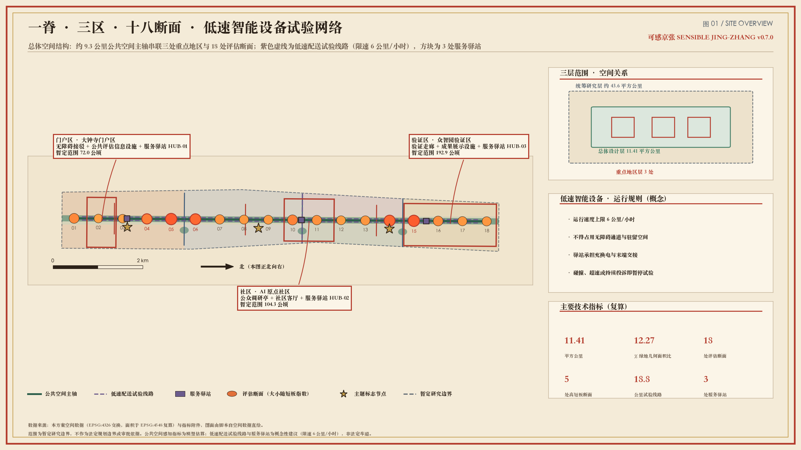

这是全篇最需要慢慢看的一张图。先看那条绿线是否连续——它是主轴；再看橙色圆点的大小，圆点越大表示模型估算的短板越显著，五个最大的就是一期要动的地方；最后看三个红框与紫色虚线的关系，紫色虚线是低速配送试验线路，它平行于主轴而不占用主轴。

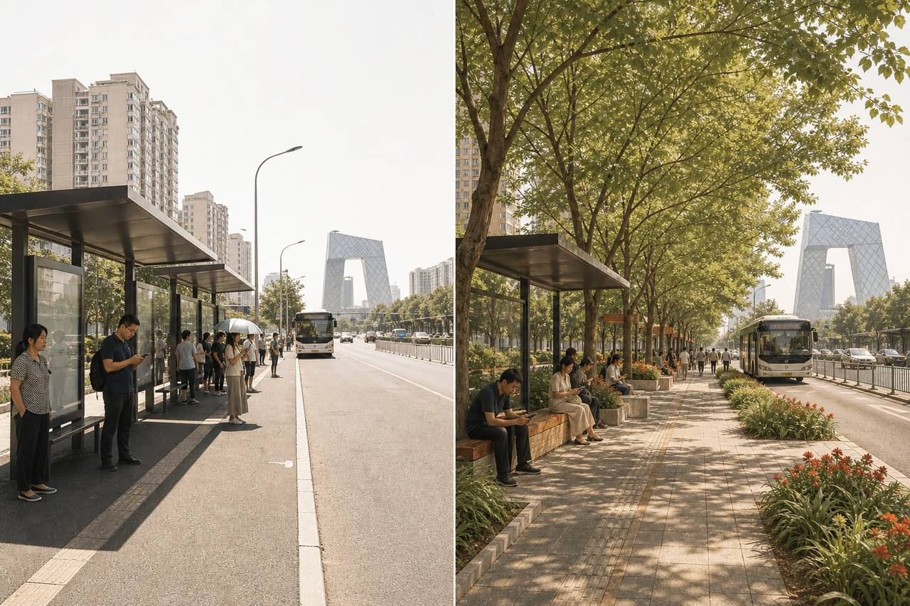

左边是老陈第九次停下的那个地方，右边是整治之后。请注意右图里新增的停留空间来自边界空间的重组，没有压缩人行通道；信息牌被放在通行带之外，不挡路。整治效果须在建成 90 日后复测确认，未达目标则调整或撤除。

> 校核索引（技术核对用，阅读时可跳过）：[depth:overall_spatial_structure] [metric:park_spine_length_m] [metric:perception_section_count] [metric:mean_perception_shortfall] [metric:high_shortfall_section_count] [data:geometry/public_space.geojson#PS-SEC-05] [standard:MOHURD-CONTROL-DETAILED-PLANNING] [source:THEORY-GEHL-PLDP] [source:THEORY-LYNCH-IMAGE]

---

## 第五章　三处必须成功的地方：重点区域详细设计

七月末的一个上午，林深在校园门廊那一段遇到了苏禾。

苏禾开一家旧书店，坐轮椅，这条路她每天走两趟。那天她停在一处坡道前面，前轮上去了，后轮卡住了。林深过去帮忙，苏禾摆了摆手：“不用，我等一下就好。”她真的等了一会儿，等到坡道上一个推婴儿车的人先过去，然后自己找了一个角度，慢慢上去了。

“这个坡不算最难的。”她后来说，“最难的是有些地方根本没有坡，只有一个台阶。你们画图的时候，觉得那是三厘米；对我来说那是一堵墙。”

同一天下午，林深在大钟寺站的出站口看到了另一种“墙”。一位第一次来的访客提着行李站在路口，左右各有一条路，两条都没有标识。他先往东走了五十米，又折回来往西走，最后拦住一个路人问路。整个过程四分半钟。交通把他送到了城市边上，却没有把他送进城市。

那天晚上，工作组把这两件事写在一起，得出一个结论：三处重点地区不是三个展示项目，而是三个必须成功的地方——门户区解决“进得来”，社区解决“留得下”，验证区解决“试得住”。任何一处失败，整条线就断在那里。

**规划怎么做。** 大钟寺门户区（暂定 72.0 公顷）的核心任务是无障碍接驳连续体：从轨道出站口到公园入口的 150 至 300 米内，必须完成辨向、遮阴、坐憩与信息四件事。具体做法为连续遮阴的首层界面、与导向标识同高的公共评估信息牌、成组座椅、全程无台阶的连续坡道；不设置广告化屏幕墙，不以形象构筑物替代功能。此处同时预留低速设备服务驿站 HUB-01 的接口。

AI 原点社区（暂定 104.3 公顷）的核心任务是把参与变成日常：公众调研亭与社区客厅并置在居民日常动线上，而不是设在需要专程前往的地方；社区客厅由保留建筑改造，兼顾公共卫生间、饮水与临时避雨；调研实行知情同意与随时退出，结论回写至公开界面。驿站 HUB-02 承担末端交接，位置避开无障碍通道与主要驻留区。

众智园验证区（暂定 192.9 公顷）的核心任务是“可运行，也可停止”：验证走廊内设备通行带、行人通行带与观看区在平面上彼此分离，设置明确的进入与退出端点、限速标识与人工接管位置；成果展示设施沿主轴设置，向公众开放。驿站 HUB-03 承担设备交接与充换电。

三处地区的详细设计统一执行三条底线：驻留带设于通行带之外且净宽不小于 1.5 米；所有新增设施不得占用无障碍通道；一期即完成本地区范围内高短板断面的整治。

| 重点地区 | 暂定面积 | 核心任务 | 一期任务 | 前置条件 |
| --- | --- | --- | --- | --- |
| 大钟寺门户区 | 72.0 公顷 | 到达与接驳、产业与访客服务 | 接驳连续体、公共评估信息设施、HUB-01 接口预留 | 站口资料、道路红线、产权协商 |
| AI 原点社区 | 104.3 公顷 | 日常参与、青年活动、社区服务 | 调研亭与社区客厅改造、无障碍整治 | 产权核定、建筑安全评估 |
| 众智园验证区 | 192.9 公顷 | 受控验证、成果展示、设备交接 | 验证走廊与观看区分离、HUB-03 交接 | 交通与消防审批、运营主体确定 |

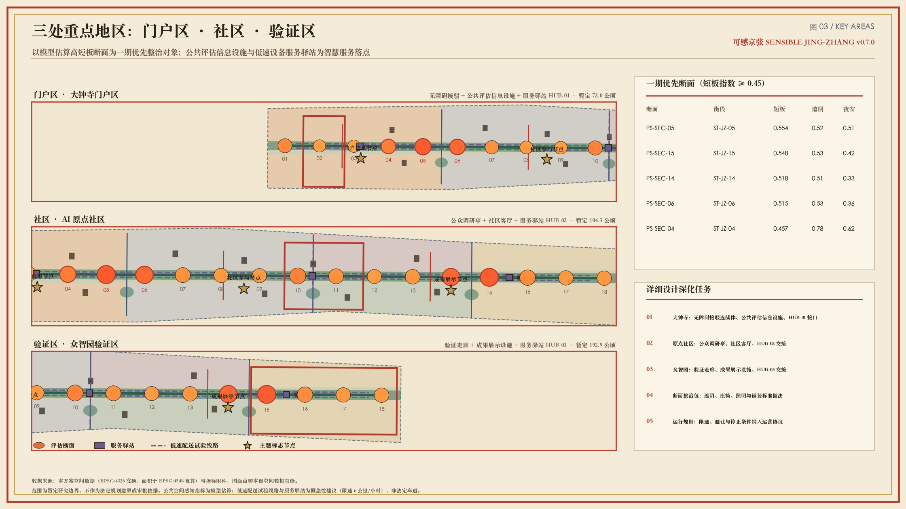

三个窗口用同一比例、同一图例，是为了让人一眼看出它们的问题类型不同：门户区的问题在接驳连续性，社区段的问题在停留与参与空间，园区段的问题在试验与展示界面的组织。右侧列出的一期优先断面就是上一章圈出的那五段中落在这三处的部分。

这是给那位问路四分半钟的访客准备的地方：出站抬头就能看见方向，走十几步有树荫，再走几步有座位，信息牌不比人高、也不闪烁。门户的成败不在于气派，而在于陌生人是否能顺利进入城市。

> 校核索引（技术核对用，阅读时可跳过）：[depth:three_key_area_detailed_design] [metric:ai_landmark_count] [data:geometry/key_areas.geojson#KEY-003] [source:THEORY-WHYTE-SOCIAL-LIFE] [source:THEORY-PPS-PLACE] [source:THEORY-UN-HABITAT-PUBLIC]

---

## 第六章　会思考的城市要先学会等人：AI 创新生态、人才画像与 AI+ 场景

八月，众智园的验证走廊里出了一件小事，后来改变了这份规划里所有与技术有关的条款。

那天下午三点，顾一鸣的团队在做低速配送设备的第七次路测。设备沿着规定路线走得很稳，走到走廊中段时，一个抱着快递箱的行人从侧面横穿进来。设备识别到了，减速，停住。行人没有察觉，从它前面走了过去。

按测试脚本，设备应该在障碍消失后自动起步。它起步了——但比顾一鸣预期早了半秒。那半秒里没有发生任何事故，可是顾一鸣自己先出了一身汗。他当场按下急停，把测试终止，回去改了两条规则：起步前必须确认通行带内无人，以及任何一次犹豫都要人工接管而不是自动继续。

“可以运行，也必须可以停止。”他后来在评审会上说了这句话。林深把它抄进了本章的开头。

同一个月，AI 原点社区的调研亭第一次试运行。亭子不大，一张桌子、两把椅子、几张断面照片。来的人比预想的多，问题也比预想的具体：一位老人问，能不能把座椅放在有树的那一侧；一位年轻母亲问，夏天下午三点这条路能不能不要走；一位视障使用者问，路口的提示音能不能不要那么大。这些问题都不宏大，但每一个都能直接改一张图。

那天亭子里挂了一句话，是林深写的：**会思考的城市，要先学会等人。**

**规划怎么做。** 应用场景共 16 项，按服务、测试、文化、运营、产业、治理、青年与健康八类布置，其中需要受控测试的 6 项单独管理。每一项场景都必须同时回答三个问题：落在哪个断面或节点、由谁负责、什么条件下停止。未能回答第三个问题的场景，不进入试点。

场景的共同停止条件为五条：行人通行或无障碍空间被占用；出现碰撞、超速或持续投诉；采集范围超出公告内容或缺少知情同意；运行数据无法复核或无法公开说明；文物保护、消防与交通前置条件未满足。任一条件触发即暂停，暂停记录与处理结果一并公开。

人才与使用者画像共 6 类，已在第三章列出空间需求，此处进一步落为场景配置：青年研究人员对应青年公共空间匹配与夜间安全线路；在校学生对应错峰驻留与热舒适导航；周边居民对应社区服务、健康活动提示与公众调研；企业与创业者对应企业服务问询与成果展示；配送与运维人员对应低速配送试点与设备交接；访客与游客对应文化导览与信息公开。

感知与信息设施采用统一支座：可拆卸环境传感组件仅采集温湿度、照度与噪声等环境量，不采集图像与身份信息；机位随灯杆一体设置，不新增独立杆件；设施撤除后支座可复用。公众调研按可部署协议执行，本次成果不包含已完成的受访者数据，相关结论须在协议实施并通过样本质量审查后形成。

| 编号 | 场景 | 类型 | 主要空间 | 停止或退出条件 |
| --- | --- | --- | --- | --- |
| SC01 | 热舒适步行导航 | 服务 | 主轴与口袋公园 | 高温风险误导或投诉越线 |
| SC02 | 无障碍路径服务 | 服务 | 门户接驳廊 | 存在个人重识别风险 |
| SC03 | 夜间安全步行线路 | 服务 | 夜间安全薄弱断面 | 误报或照明扰民 |
| SC04 | 公众调研亭 | 测试 | AI 原点社区 | 调研协议未部署 |
| SC05 | 环境舒适度测试场 | 测试 | 众智园验证走廊 | 未达到安全阈值 |
| SC06 | 文化导览 | 文化 | 沿线叙事节点 | 文物保护前置未满足 |
| SC07 | 微短剧共创拍摄开放 | 运营 | 指定广场与驻留区 | 公共通行被挤占 |
| SC08 | 企业服务问询 | 产业 | 大钟寺门户界面 | 出现强制画像 |
| SC09 | 低速配送试点 | 测试 | 低速配送试验线路 | 碰撞、超速或持续投诉 |
| SC10 | 建设后评估公开看板 | 治理 | 公共评估信息设施 | 数据不可复核 |
| SC11 | 青年公共空间匹配 | 青年 | 社区公共节点 | 出现骚扰申诉 |
| SC12 | 健康活动风险提示 | 健康 | 公园段落 | 越出非医疗建议范围 |
| SC13 | 自主清扫与维护设备 | 测试 | 主轴非高峰时段 | 噪声扰民或通行冲突 |
| SC14 | 设施巡检与复测 | 测试 | 十八处评估断面 | 机器巡检替代人工决策 |
| SC15 | 断面数字档案 | 治理 | 全线 | 出现数据治理失控风险 |
| SC16 | 可拆卸环境传感组件 | 测试 | 感知设施模块支座 | 未取得批准的传感设备 |

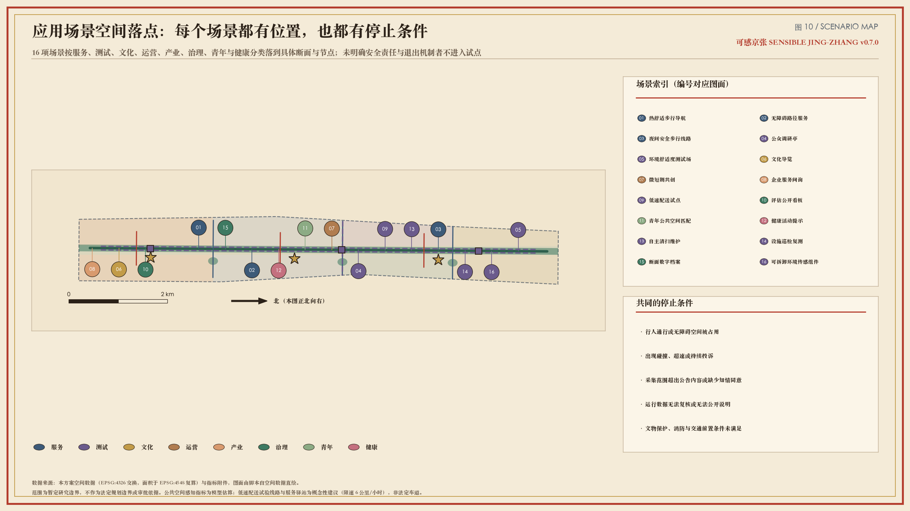

这张图的用途是把“智慧”从形容词变成位置：每一个编号都对应图面上一个具体断面，而不是笼统地覆盖全线。图右下的五条停止条件比左边的编号更重要——它们决定了这些场景能不能被信任。

调研亭之所以要这么小、这么普通，是因为它必须出现在人们本来就会经过的地方。参与不是活动，而是一种可以随手完成的事情。图中人物为示意，调研须依据知情同意协议开展，不采集生物特征。

> 校核索引（技术核对用，阅读时可跳过）：[metric:scenario_card_count] [metric:test_validation_scenario_count] [metric:robot_hub_count] [metric:robot_hub_area_sqm] [source:SP-SURVEY-PAPER] [source:SP-SURVEY-PLATFORM] [source:SP-SURVEY-PROTOCOL] [source:THEORY-15MIN-CITY] [source:THEORY-15MIN-CRITIQUE] [source:THEORY-WALKSCORE]

---

## 第七章　留下来的墙：用地、建筑规模与拆改留方案

九月，工作组在 AI 原点社区遇到了这次工作里最难的一次谈话。

会议室是社区居委会借的，桌上放着一份建筑评价表。表上有一栏写着“建议拆除”，对应的是一排一九七几年的单层车间。产权单位的代表说得很干脆：这排房子结构一般、日常没人用，拆了正好腾出空地。

王阿婆坐在最边上。她在这个院子里住了四十一年，父亲是铁路上的工人。她听完举了手：“那排房子的墙，是我小时候上学天天摸着走过去的。你们说它没人用——它当过食堂、当过托儿所、当过自行车棚。它一直都有人用，只是现在没人管。”

那天没有当场做结论。工作组回去做了三件事：请结构工程师复核了那排车间的实际状况，重新算了如果保留改造需要增加多少投入，以及把王阿婆的意见完整地写进了评价表的“公众意见”一栏。三周后，评价结果由“建议拆除”改为“保留改造”，并在公开说明里写清了改变的理由。

这是这份规划第一次把一条意见变成一次修改。林深后来说，那天她学到的不是尊老，而是一种更基本的东西：判断建筑价值的标准里，必须包含使用记忆，因为使用记忆本身就是公共资产。

**规划怎么做。** 概念用地共 9 个单元，合计 1141.3 公顷，与暂定研究范围的复算面积一致。主轴为公园绿地，两翼依次布置商业服务业、科研、教育、公共管理与公共服务以及城镇住宅用地，形成带状复合结构；北端保留一处留白用地，作为未来功能与设施的弹性空间。必须强调：用地类别为概念性判断，法定用地性质、边界与指标须在取得控制性详细规划资料后校核。

建筑规模只给出可复算的部分：概念建筑基底面积 7.3 公顷，用于研究界面关系与首层开放度，不代表实际建筑量。容积率、建筑限高与人口容量三项均标注为待明确——在道路红线、产权与控规条件不清的情况下，任何强度数字都会误导后续工作。风貌控制因此改用可执行的相对要求：临主轴一侧首层通透率不低于 60%，新建体量沿主轴退让并压低，屋顶设备集中隐蔽处理，保留建筑的立面材料与砌筑方式作为区段风貌基准。

拆改留按八项评价打分决定：结构安全、使用记忆、界面价值、功能适配、无障碍改造可行性、能耗与运维成本、公众意见、产权与实施可行性。评价结果分三类：保留修缮、保留改造、拆除重建。原则上以保留修缮与保留改造为主，拆除限于结构评定不安全或严重阻断公共通行的情形；任何拆除建议须同时给出替代方案与公众意见处理说明。

| 用地单元 | 用地类别 | 概念面积 | 规划意图 | 待明确事项 |
| --- | --- | --- | --- | --- |
| LU-SPINE | 公园绿地 | 174.9 公顷 | 主轴绿地与断面整治载体 | 法定绿地边界 |
| LU-COMM-N | 商业服务业用地 | 约 152 公顷 | 门户区服务与产业界面 | 容积率与限高 |
| LU-RD-W | 科研用地 | 约 178 公顷 | 研发功能与首层开放界面 | 用地性质核定 |
| LU-RD-E | 科研用地 | 约 141 公顷 | 研发与验证功能衔接 | 用地性质核定 |
| LU-EDU-S | 教育用地 | 约 126 公顷 | 校园与主轴的连续步行 | 校园边界与开放时段 |
| LU-PUB-M | 公共管理与公共服务 | 约 96 公顷 | 社区服务与公共设施 | 设施标准与规模 |
| LU-RES-M | 城镇住宅用地 | 约 138 公顷 | 居住与日常服务半径 | 人口容量 |
| LU-RES-S | 城镇住宅用地 | 约 87 公顷 | 居住与社区客厅 | 产权与改造条件 |
| LU-RESERVE-N | 留白用地 | 约 48 公顷 | 弹性预留 | 后续功能待定 |

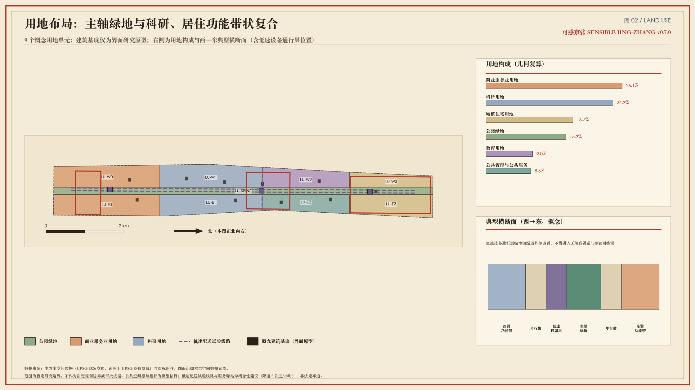

图上每个色块是一个概念用地单元，右上是构成比例，右下是那张需要记住的横断面：自西向东为功能带、步行带、低速设备层、主轴绿道、步行带、功能带。低速设备层在绿道外侧，不进入无障碍通道与驻留带——这是整个方案里最不能让步的一条剖面关系。

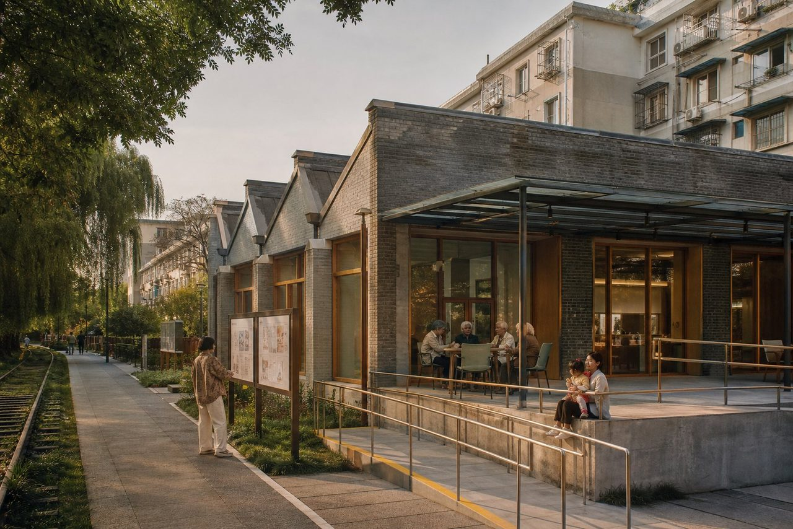

这就是王阿婆那排车间。锯齿屋架和砖柱留下来，柱间换成大面木框玻璃，檐下加一片雨棚和一条坡道，里面是社区客厅和公共卫生间。保留不是不动，而是把已经存在的空间重新变得可用。改造须以结构安全评估与产权协商为前置条件。

> 校核索引（技术核对用，阅读时可跳过）：[depth:land_use_layout] [depth:development_intensity_controls] [depth:height_massing_character] [depth:retain_renovate_demolish] [metric:land_use_parcel_count] [metric:building_footprint_area_sqm] [data:geometry/land_use.geojson#LU-SPINE] [data:geometry/buildings.geojson#BLD-KEY-002-01] [standard:MNR-LAND-USE-CLASSIFICATION-GUIDE] [standard:MOHURD-ARCH-DESIGN-DEPTH-2016]

---

## 第八章　先接住人：交通、轨道、市政与公共服务设施

十月，林深在早高峰的校园门廊那一段站了整整一个小时，只为了看清一件事：这条路上到底有几种速度在同时通过。

八点十分，速度最快的是自行车，其次是快步走的学生，第三是推着保温箱的骑手，最慢的是拉着行李箱的访客和拄拐的老人。一条不到四米宽的界面里，四种速度互相插缝。她数到第十七次侧身避让时，一个骑手在她前面刹住了车——车头擦到了一个正在低头看手机的学生的书包带。

那个骑手叫小满，白天在附近学校上课，中午和晚上送单。他把车停到一边，喘着气说了一句挺清醒的话：“不是我们想抢路，是这段路只有一条路。”

那天下午，林深去查了这一段的道路条件，发现问题不在总宽度，而在分配：通行、停留、装卸、绿化四件事挤在同一个断面里，谁都不够用。她在图上做了一次很朴素的操作——把停留从通行里拿出来，放到界面一侧；把装卸从人行道上拿出来，放到限定时段与限定位置；把绿化从装饰变成隔离带。同一条路，宽度没变，四种速度各自有了位置。

老陈后来补了一条建议：“清扫也得排时间。”他每天六点前扫完北段，八点以后就不进主通道，因为“人多的时候，我这车也是障碍”。这句话被写进了运营条款：所有作业与设备通行都要有时段。

**规划怎么做。** 慢行网络按四个层次组织：带级为主轴绿道，南北贯通；段级为 3 条东西向联系廊与轨道接驳通道，负责缝合两侧社区与校园；邻里级为口袋公园、断面驻留带与驿站节点；共享层为低速配送试验线路，中心线累计约 18.8 公里（含两侧平行线路与 1 条横向连接线），设计运行速度上限 6 公里/小时。总体设计范围内概念路网密度为 2.93 千米/平方千米。

轨道接驳的要求集中在一句话：出站后 150 至 300 米内完成辨向、遮阴、坐憩与信息。在站口资料与道路红线未明确前，本方案不提出跨线设施的工程定位，也不计算站点服务覆盖率——这类数字在缺少法定资料时只会造成误判。

断面空间分配确定四条通则：行人通行带优先且连续；驻留带设于通行带之外，净宽不小于 1.5 米；装卸与配送等候限定位置与时段，不占用无障碍通道；低速设备通行带贴绿化隔离带外侧设置，与行人带保持连续物理分隔。夜间时段设备进一步限速并加密避让提示。

市政与公共服务按专项登记要求，不预设工程规模：电力与充电容量随分期核定；给排水结合遮阴绿化与雨水花园，优先使用中水与雨水；照明采用连续低眩光方案并评估对居住界面的影响；信息设施机位随灯杆一体设置，不新增独立杆件；公共服务结合保留建筑改造补充社区客厅与公共卫生间；环卫作业安排在非高峰时段，噪声与作业时间纳入运营协议。

| 专项 | 概念层要求 | 一期动作 | 待明确事项 |
| --- | --- | --- | --- |
| 轨道接驳 | 出站 150–300 米内完成四件事 | 门户区接驳连续体 | 站口位置与客流数据 |
| 慢行网络 | 四层次组织、路网密度 2.93 千米/平方千米 | 主轴连续贯通与高差整治 | 道路红线 |
| 低速设备路权 | 独立通行层、限速 6 公里/小时 | 驿站接口预留 | 交通与运营审批 |
| 电力与通信 | 机位随灯杆一体、容量随分期核定 | 信息设施用电接入 | 管线资料 |
| 给排水与灌溉 | 雨水花园与中水优先 | 遮阴绿化灌溉配套 | 市政接口条件 |
| 照明 | 连续低眩光、避免光污染 | 夜间薄弱段照明整治 | 照度实测 |
| 公共服务 | 结合保留建筑补充社区服务 | 社区客厅与公共卫生间 | 设施标准与产权 |
| 环卫与维护 | 分时作业、月度巡检 | 作业时段纳入协议 | 运营主体 |

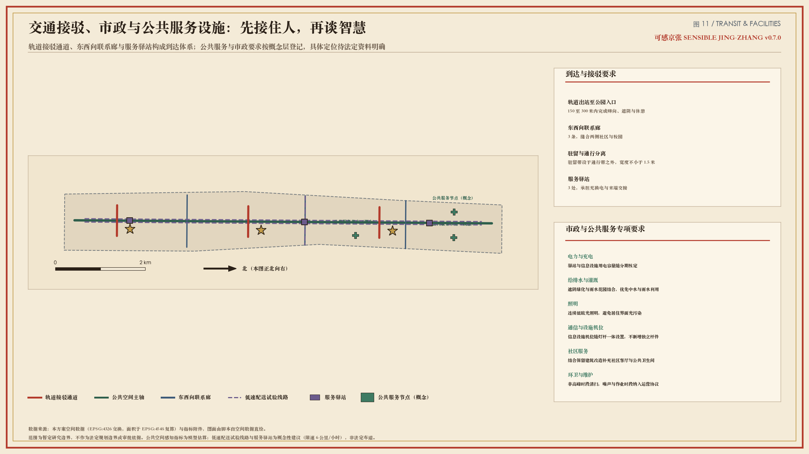

红色是轨道接驳通道，绿色是主轴，蓝灰是东西向联系廊，紫色虚线与方块是低速设备的线路与驿站，绿色十字是概念性的公共服务节点。这张图要读的是“到达链条”是否闭合：从站口进来，能不能一路有荫、有坐、有指示地走到主轴上。

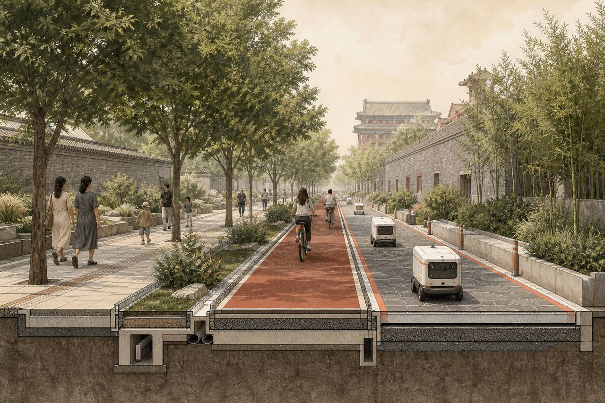

这张图是给小满和那个被擦到书包的学生看的：共享不等于混行。设备带与行人带之间有连续的绿化隔离，停留区在通行区之外，装卸有固定位置。断面分层是低速设备进入公共空间的前置条件，不是可选项。

> 校核索引（技术核对用，阅读时可跳过）：[depth:traffic_rail_slow_parking] [depth:municipal_new_infrastructure] [metric:road_network_density_km_per_sqkm] [metric:robot_corridor_length_m] [data:geometry/roads.geojson#RD-SPINE] [data:geometry/constraints.geojson#CONSTRAINTS] [source:THEORY-NACTO-STREETS] [source:THEORY-COMPLETE-STREETS]

---

## 第九章　树荫是最便宜的科技：蓝绿空间、公共空间与城市风貌

第二年七月，同样的下午两点，同样的三十六度，林深又去了一次那个接驳等候点。

这一次，那里有一片树荫。补植的国槐还不算高，但树冠已经接上了，加上一片爬满藤的钢架，阴影从等候点一直连到旁边的台阶。台阶上坐着三个人：一位推婴儿车的母亲、一对老夫妇，还有一个把车停在旁边、正在喝水的骑手。

苏禾也在。她把轮椅停在阴影边缘，说了一句让林深记了很久的话：“你们做了很多智慧的东西，但今天我最感谢的是这几棵树。”

那天工作组带了温度计。阴影里比阳光下低了四度多。四度不是一个能上新闻的数字，可它决定了一个人愿不愿意在这里等十分钟，决定了老人下午要不要出门，决定了这条路在夏天是不是还算“通的”。

林深在当天的记录最后写了一句：树荫是这条线上最便宜的科技。它不需要网络、不需要电、不需要维护协议，只需要有人在图上给它留出位置，并且愿意等它长起来。

**规划怎么做。** 蓝绿与公共空间按三级组织。带级为主轴绿道，承担降温、慢行与生态连通三项复合功能，绿化以高大乔木为主形成连续林荫，避免以单一景观花境替代遮阴功能。段级为东西向联系廊的行道树与街头绿地，负责把主轴的绿延伸进社区。邻里级为口袋公园与断面驻留带，标准配置为连续遮阴、成组座椅、饮水点、可渗透铺装与小型雨水花园。

指标口径必须分清两件常被混淆的事：绿地系统的几何面积比为 12.27%，指本方案概念绿地几何面积占总体设计范围的比例；公共空间节点面积比为 1.34%，指评估断面、口袋公园与驿站等公共空间节点的面积占比。二者含义不同，不可互相替代，也不等同于法定绿地率。

城市风貌以“可执行的相对要求”表达，不作形式规定：临主轴一侧首层通透率不低于 60%，形成可看进去的界面；新建体量沿主轴退让并压低，避免连续高墙；保留建筑的立面材料与砌筑方式作为区段风貌基准，新建材料与之协调；铁路遗存（钢轨、枕木、道砟、站台边缘）保留在铺装与场地中作为线索，不作仿古复建；夜间照明以路径与界面为主，标志物照明不得成为夜间最亮元素。

| 层级 | 空间要素 | 标准配置 | 相关指标 |
| --- | --- | --- | --- |
| 带级 | 主轴绿道 | 连续林荫、生态连通、慢行贯通 | 主轴长度 9.3 公里 |
| 段级 | 东西向联系廊与街头绿地 | 行道树连续、路口无障碍 | 联系廊 3 条 |
| 邻里级 | 口袋公园与驻留带 | 遮阴、成组座椅、饮水、雨水花园 | 公共空间节点面积比 1.34% |
| 系统 | 概念绿地整体 | 高乔为主、可渗透铺装 | 绿地几何面积比 12.27% |

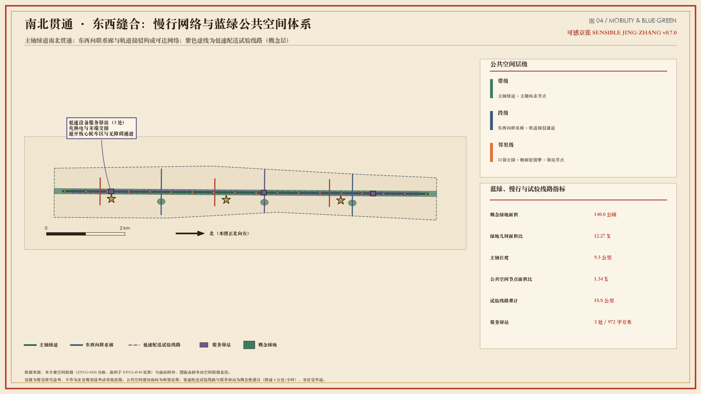

这张图请配合上一章一起看：那一章讲“怎么到”，这一章讲“到了之后是否舒服”。深绿是概念绿地，主轴是那条最粗的绿线；右侧两栏区分了公共空间的三个层级与四项指标的口径——尤其请注意绿地几何面积比与公共空间节点面积比不是同一件事。

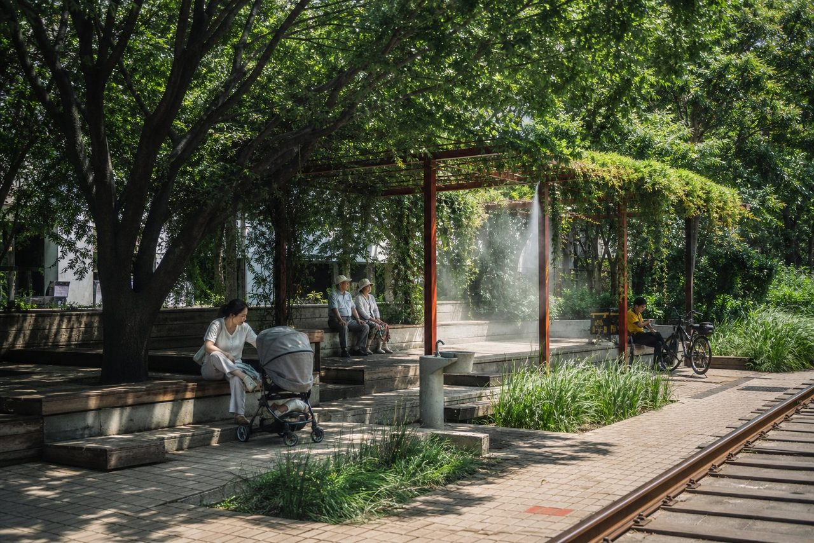

这就是那一片让苏禾道谢的树荫：台阶是座位，藤架补上乔木还不够高的那几年，饮水和雾化解决最热的两个小时，边上的浅草沟是雨水花园。画面为概念效果图；乔木成荫需要时间，因此一期先补植并以轻型构架过渡。

> 校核索引（技术核对用，阅读时可跳过）：[depth:blue_green_public_space] [metric:green_ratio] [metric:public_space_ratio] [data:geometry/green_space.geojson#GS-SPINE] [source:THEORY-EPA-GREEN-INFRA] [source:THEORY-GEHL-CITIES-PEOPLE]

---

## 第十章　把愿望排队：更新项目清单、实施政策与分期计划

十二月的那次会议，桌上摆着二十七条建议，而能确定的钱只够做四五件事。

每条建议背后都有一个具体的人。老陈要的是那五段的树荫和灯；苏禾要的是全线没有台阶；小满要的是配送有地方停；顾一鸣要的是验证走廊；王阿婆要的是社区客厅早点开门。二十七条都合理，这正是最难的地方——规划真正的技术含量不在于把好事想出来，而在于把好事排出顺序，并且能说清为什么这样排。

争论到一半，有人提出按“见效快、拍照好看”排序。林深没有直接反对，她把十八张断面记录纸重新摊在桌上：“如果我们按好看排序，第一期会去修已经最好的那几段，因为那里最容易出效果。可那五段最差的地方还在那儿，明年夏天还是一样晒。”

最后确定的排序规则很简单，也很难被推翻：先看短板指数，再看是否依赖法定资料，最后看是否需要产权协商。第一期只做那些“最差、且现在就能动”的事。会议结束时，老陈说了句：“这回像是真要动了。”

**规划怎么做。** 更新项目共 12 项，分三期实施。分期判据：一期为短板指数不低于 0.45、且不依赖法定资料即可实施的整治类项目；二期为需要产权协商、跨部门协调或新建设施的项目；三期为依赖运营机制、审批授权与长期监测的项目。三期共同的前置条件为法定边界、产权核定、交通组织与文物保护审查。

实施政策提出四项机制。第一，产权协商前置：涉及产权单位的项目在立项阶段即形成协商备忘，未达成协商不进入施工。第二，共建共管：社区客厅、口袋公园与驻留带由社区参与日常维护，维护责任与经费来源在协议中写明。第三，运营协议管住技术：低速设备与所有 AI 场景的限速、时段、避让、停止条件与数据边界写入运营协议，违反即暂停。第四，公众复核决定下一轮：每年一次公开复测，复测结果与公众意见共同决定下一期项目清单的排序，调整理由一并公开。

每个项目在立项时登记四项内容：整治前基线、目标值、复测时间与责任主体；建成 90 日后复测，达标结项，未达标提出整改并纳入年度监测。这套做法的意义在于：项目不是做完就结束，而是要证明它真的改善了什么。

| 编号 | 项目 | 分期 | 责任类型 | 前置条件 |
| --- | --- | --- | --- | --- |
| P-01 | 五处高短板断面遮阴与休憩整治 | 一期 | 公共空间整治 | 现场复核 |
| P-02 | 主轴无障碍连续贯通与高差整治 | 一期 | 公共空间整治 | 现状测量 |
| P-03 | 大钟寺门户接驳与公共评估信息设施 | 一期 | 接驳与信息设施 | 站口资料 |
| P-04 | 夜间安全薄弱段照明与界面整治 | 一期 | 市政与界面 | 照度实测 |
| P-05 | 三条东西向联系廊缝合工程 | 二期 | 道路与慢行 | 道路红线 |
| P-06 | 口袋公园与驻留带补建 | 二期 | 绿地与公共空间 | 用地条件 |
| P-07 | AI 原点社区调研亭与社区客厅改造 | 二期 | 建筑改造 | 产权协商与结构评估 |
| P-08 | 三处服务驿站建设与接口落实 | 二期 | 设施与运营 | 交通与消防审批 |
| P-09 | 众智园验证走廊与展示设施 | 二期 | 测试设施 | 运营主体与安全方案 |
| P-10 | 建设后评估与年度监测常态运行 | 三期 | 机制建设 | 数据治理方案 |
| P-11 | 低速配送试验线路扩展 | 三期 | 路权与运营 | 前期试点评估与审批 |
| P-12 | 文化叙事与公众沟通年度活动 | 三期 | 运营与文化 | 场地许可与授权 |

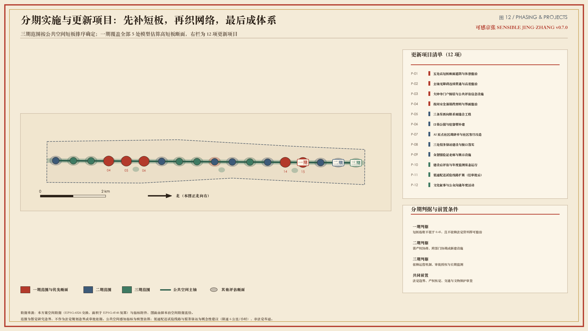

红、蓝、青三块范围就是三期，主轴上的红色圆点是一期优先断面——可以直接检查一件事：一期是否覆盖了全部五处高短板断面。图右下的分期判据是这张图的“判卷标准”，任何调整都应当先说明它符合哪一条判据。

三期里最需要耐心的一项：验证走廊。它的价值不在于展示设备能跑多快，而在于证明一套规则可以让设备在人多的地方安全地慢下来、停下来、把决定交回给人。图为概念效果图，实施前须完成交通、消防与运营审批。

> 校核索引（技术核对用，阅读时可跳过）：[depth:renewal_project_list] [depth:phasing_implementation] [metric:renewal_project_count] [metric:phasing_stage_count] [data:geometry/phasing.geojson#PH-1] [source:THEORY-CPTED] [source:THEORY-SPACE-SYNTAX]

---

## 第十一章　一把可以被验算的尺子：指标体系、面积复算与合规矩阵

第二年一月，工作组在自查时发现了一个错误。

有人在核对材料时注意到，方案里两处提到“绿地比例”，数字却不一样：一处写 12.27%，另一处写的是把口袋公园和驻留带也算进去之后的数。两个数都算得出来，但它们不是同一个东西——前者是绿地系统的几何面积比，后者混入了公共空间节点。差别不大，可性质很坏：同一个词指两件事，后面所有的比较都会失效。

那天的处理方式很不浪漫：把两个口径分开命名，把每个数字的计算范围写清楚，把所有正文、图纸和网页里的表述统一，然后在变更记录里写明改过这件事。没有人因此获得表扬，但这份规划的可信度是从这里开始的。

林深在会上说了一句听起来平淡的话：“我们要交的不只是一套图，而是一把可以被别人验算的尺子。”一把尺子如果只有自己看得懂，它量出来的东西就没有意义。

**规划怎么做。** 指标分三类管理。第一类是可由提交几何直接复算的空间指标，全部由 EPSG:4326 交换几何投影至 EPSG:4548 后复算，任何人拿到空间数据都能重算出同样的结果。第二类是需要法定资料支撑的管控指标，包括容积率、建筑限高与人口容量，一律标注为待明确，不作推定。第三类是需要运营与调研数据持续校准的绩效指标，包括感知类分项与场景使用情况，标注为模型估算或待实测。

第一类共 21 项，构成本方案的可复算基础：总体面积 1141.3 公顷；绿地系统几何面积比 12.27%；公共空间节点面积比 1.34%；概念建筑基底 7.3 公顷；公共空间主轴长度 9.3 公里；评估断面 18 处；高短板断面 5 处；平均短板指数 0.416；低速配送试验线路 18.8 公里；服务驿站 3 处、合计 972 平方米；应用场景 16 项，其中受控测试类 6 项；国际案例 7 例；分期 3 期；主题标志节点 3 处；使用者类别 6 类；更新项目 12 项；概念路网密度 2.93 千米/平方千米；概念用地单元 9 个；重点地区 3 处。

合规矩阵按三类文件相互校核：标准矩阵回应征集公告、任务书与四部国家及行业规范的要求；设计深度矩阵覆盖现状诊断、三层范围、总体结构、用地布局、强度管控、高度风貌、拆改留、交通与市政、蓝绿公共空间、重点地区详细设计、项目清单、分期实施、指标复算与风险缺资料共 15 项；任务覆盖矩阵逐条对应公告条目与征集要求。三类矩阵的每一项都能在正文找到对应段落，反之正文每一处结论也能追到一项矩阵条目。

| 指标类别 | 处理方式 | 代表指标 | 复核条件 |
| --- | --- | --- | --- |
| 可复算空间指标 | 由空间数据在 EPSG:4548 下复算 | 面积、长度、比例、数量共 21 项 | 法定边界发布后整体复算 |
| 待明确管控指标 | 标注待明确，不作推定 | 容积率、建筑限高、人口容量 | 取得控规资料后确定 |
| 待实测绩效指标 | 标注模型估算或待实测 | 遮阴、绿视、驻留、夜间安全 | 现场踏勘与公众调研 |
| 口径纪律 | 同一名称只对应一个计算范围 | 绿地几何面积比与公共空间节点面积比分列 | 变更须写入迭代记录 |

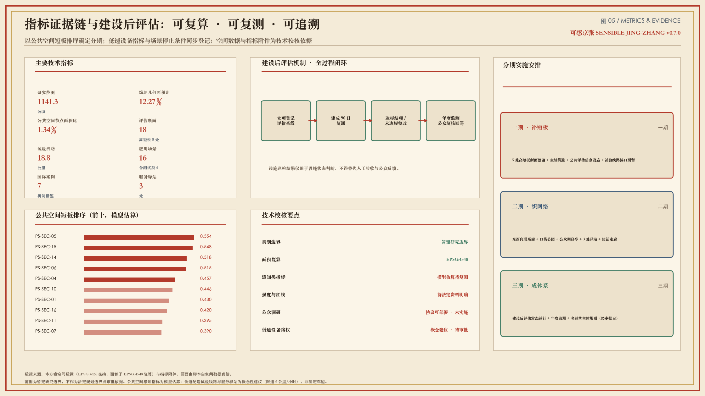

左上是主要技术指标，左下是短板排序，中间是建设后评估的四步闭环——立项登记、建成 90 日复测、达标结项或未达标整改、年度监测回写，右侧是分期安排。这张图的作用是让人能顺着数字反查到断面，再顺着断面反查到项目。

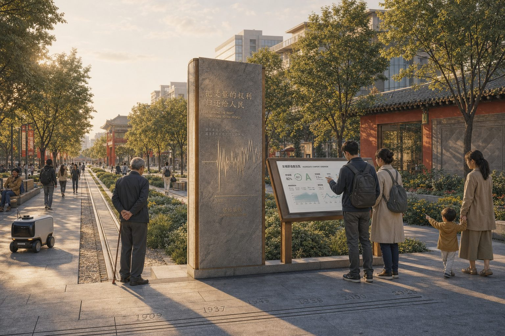

指标最终要回到人面前。每年一次的复测日，把整治前基线、目标值与复测结果并排公布，未达标的项目当场登记整改；下一期先修哪里，由公开结果与公众意见共同决定。画面为概念效果图，相关活动须依场地许可与授权开展。

> 校核索引（技术核对用，阅读时可跳过）：[depth:metrics_recalculation] [metric:site_area_sqm] [metric:green_ratio] [metric:public_space_ratio] [metric:building_footprint_area_sqm] [metric:land_use_parcel_count] [metric:key_area_count] [metric:ai_landmark_count] [metric:persona_count] [metric:ecosystem_case_count] [metric:phasing_stage_count] [source:SITE-PACKAGE] [source:PROCESSED-FACT-PACK]

---

## 第十二章　夜里那一段路：风险、版权与合规说明

三月，天还黑得早。程宁在实验室待到十点半，出门的时候只剩下一段路要走。

她走的是主轴的南段。前面两百多米的灯是好的，再往前，路灯的间距忽然变大，光和光之间留下一段黑。她在进入那段黑之前站住了，做了一件很多人都做过的事：算了一下绕路要多久。绕路要多走七分钟。她最后没有绕，而是掏出手机把电筒打开，快步走了过去。

第二天她在调研亭留了一条意见，写得很短：“不要摄像头，要灯。”

工作组把这条意见带回去讨论。有人提出增加视频监控点位，理由是“可以提高安全感”。反对的理由更充分：黑暗本身是问题，监控只是记录问题；一段没有灯、没有人、没有可以停靠的地方的路，装再多摄像头，走的人也还是会犹豫。最终确定的做法是四件事——连续照明、活跃的首层界面、可呼叫的停靠点、以及日常维护，同时明确一条底线：巡检与监测记录只用于判断设施状态，不用于识别个人。

这一章因此不只是一份免责声明。它是这份规划关于“技术在城市里能做什么、不能做什么”的正式回答。

**规划怎么做。** 风险按四类登记并给出应对。第一类是资料风险：范围为暂定研究边界，法定边界、控规、道路红线、产权、市政与文物保护资料均未取得，因此凡涉及强度、红线与产权的结论一律降级为待确认，法定资料发布后须整体复算。第二类是技术风险：低速智能设备场景必须可紧急停止、可人工接管、可公开复盘，运行日志按期公开复盘要点；发生碰撞、超速或持续投诉即暂停试验。第三类是数据与隐私风险：不采集不必要的数据，不以个人轨迹换取热力图，不建立人脸数据库，不追踪个体行程；环境传感仅采集温湿度、照度与噪声等环境量；数据的采集范围、保存期限与退出机制在方案实施前公开说明。第四类是越权风险：不让模型替代医生、教师、执法与审批决策；健康与安全类场景只提供提示，不提供诊断与处置结论。

版权与授权说明如下：本方案的正文、规划图、文化主视觉、概念效果图、公开成果页与图册均为本次提交原创生成；地图使用本方案登记的暂定几何，不引用未清权的街景、航拍与第三方影像；国际案例与理论仅用于方法借鉴，均标注来源；文化叙事与共创活动须取得场地许可与肖像授权，作品可标注对应空间位置，但传播量不作为空间品质的评价指标。

合规底线一并说明：本方案不声称获得官方批准、不构成法定规划、不代表资金落实或实施授权；文中提出的所有低速设备路权、测试场景与运营规则，均须在取得交通、消防、产权、文物保护与数据治理等相关审批后方可实施。

| 风险类别 | 具体风险 | 本方案应对 | 触发后的动作 |
| --- | --- | --- | --- |
| 资料风险 | 法定边界与控规资料缺失 | 结论降级为待确认，标注待明确 | 资料发布后整体复算 |
| 技术风险 | 低速设备在人群中的安全 | 独立通行层、限速、人工接管 | 碰撞或投诉即暂停试验 |
| 数据风险 | 采集越界与个人可识别 | 仅采集环境量、公开采集边界 | 不可复核即停止运行 |
| 越权风险 | 模型替代专业判断 | 场景限定为提示与信息服务 | 越界即下线场景 |
| 版权风险 | 影像与素材权利不清 | 全部自制、案例标注来源 | 权利异议即撤换素材 |
| 公共性风险 | 活动挤占公共通行 | 限定时段与位置、保留通行 | 通行受阻即终止活动 |

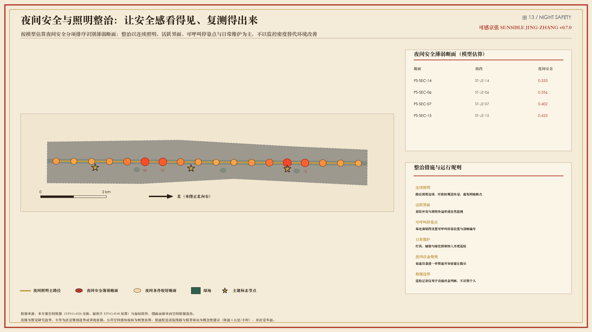

深色底不是风格，而是这张图要表达的处境：图上颜色越红、圈越大的断面，模型估算的夜间条件越差，程宁走的那一段就在其中。右侧六条措施里没有一条是增加监控——安全感来自光、来自有人、来自有地方可以停下。

亮度层级是这张图的重点：路径最亮，界面其次，信息设施最暗。技术在这里退到了后面——它负责让人知道自己在哪里、可以向谁求助，而不是负责盯着每一个人。照明须按规范设计并评估扰民影响。

> 校核索引（技术核对用，阅读时可跳过）：[depth:risk_missing_data] [source:AWAKENING-POSTER] [source:RENDERS-SUITE] [standard:MOHURD-URBAN-DESIGN-MEASURES] [data:geometry/constraints.geojson#CONSTRAINTS]

---

## 第十三章　第二次测量之后：参考资料与附录

第二年五月的复测日，老陈提前退休了三个月，但他还是来了。

那天沿线十二处叙事节点依次熄灯，是文化活动的收束仪式。熄灯之前，公共评估信息设施上把一年的数字并排放着：五处高短板断面的整治前基线、目标值和复测结果；两处达标，两处接近，一处没达到——没达到的那处当场登记了整改，写明了责任主体和下一次复测时间。
围观的人不多，几十个。有人在看，有人在拍照，有人在问“凭什么是这五处先修”。工作组的人一条条解释了排序规则。

老陈站在最外面。轮到他说话时，他没讲成绩，只说了一句：“我扫了十九年，第一回有人把我说的话写在牌子上。”

苏禾那天从北端一直摇到南端，用了两个小时零六分钟，中途没有一次需要别人帮忙。她说这是她第一次“把这条路走完”。小满送完最后一单来看熄灯，他的车停在新划的等候位上。程宁把手机电筒放回口袋，因为那段路的灯已经连上了。

林深在那天的记录里写了这份规划的最后一句话：第一次测量结束时，我们得到了一条铁路；第二次测量结束时，我们希望得到的是一座愿意为使用者重新量一遍的城市。而“第二次”这个说法本身就意味着，还会有第三次。

规划到这里交卷，但它留下的不是结论，而是一把尺子和一套规矩：谁都可以拿去重量一遍，量出不一样的结果，就按规矩改。

**参考资料与引用说明。** 本方案的任务背景、发展愿景与重点方向引自公开任务书草案，资料可用范围引自公开资料边界说明；两份文件均为项目维护者发布的公开版草案，正式文本发布后须复核相关表述。

- 公开任务书草案：`brief/public-brief.md`，用于项目背景、发展愿景、重点方向与方案边界的基础引用
- 公开资料边界说明：`brief/README.md`，用于界定可公开、不可公开与需复核资料的使用范围

引用资料共 39 项，按六组登记：第一组为征集主控文件，包括公告、任务书与场地资料包；第二组为边界与数据治理资料，包括来源登记、事实包与边界说明；第三组为方法与工具文献，包括人在环路评价方法、感知与城市景观研究、调研平台与协议；第四组为国际案例一手页共 8 项，含 1 项失败教训；第五组为城市设计与城市科学理论共 16 项；第六组为本方案自制视觉与地理底图说明。各组条目的完整标识见本章校核索引与 `sources.json`。

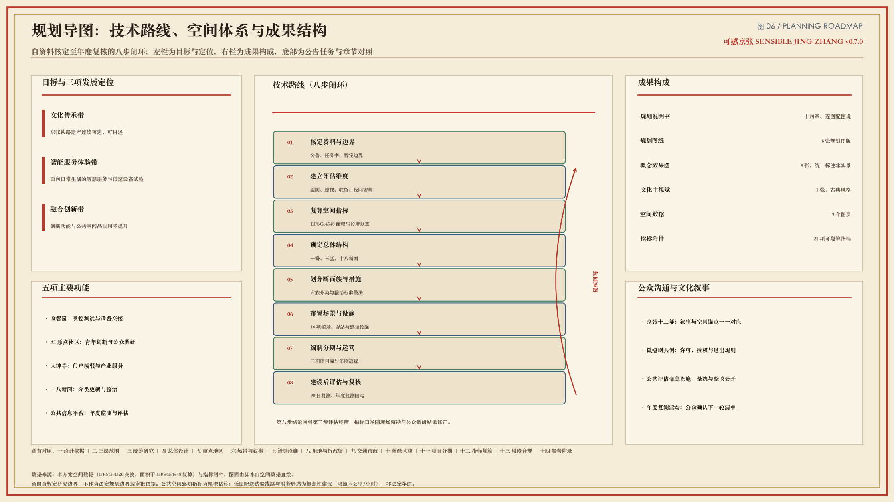

如果只看一张图就想知道这份规划怎么做出来的，就看这张。八步闭环从核定资料开始，到建设后评估结束，而第八步的箭头回到第二步——这条回头的箭头是全篇的方法核心。导图为方法示意，不含空间比例关系。

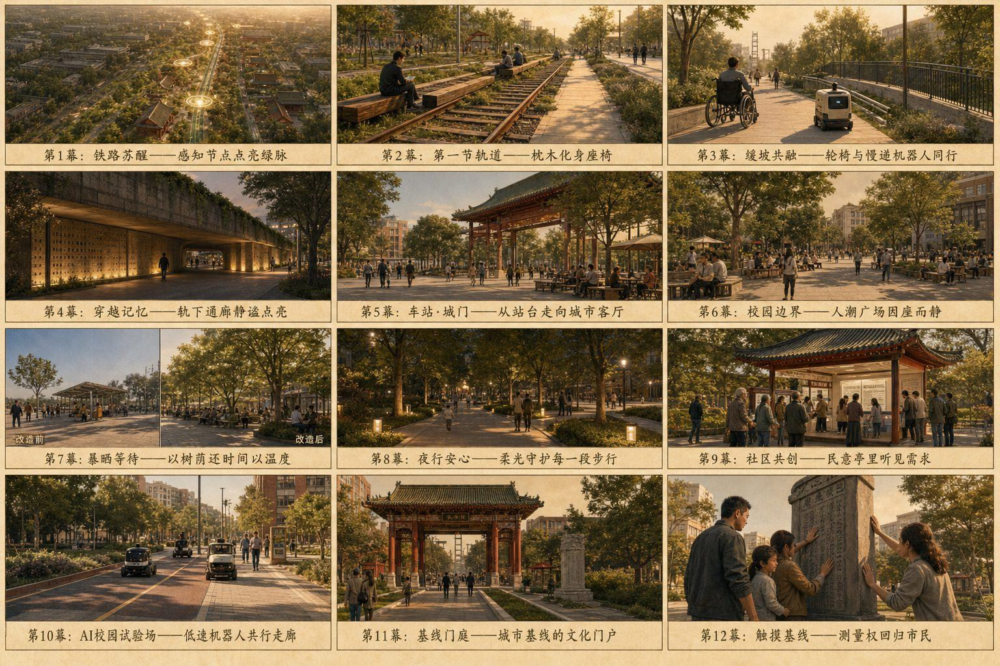

这十二格就是本篇十三章故事在空间上的落点，也是公众沟通活动的十二个站点：从清晨的第一批通勤者，到坡道上的三类使用者，到暗段里的照度记录，到复测日的公众确认。文化叙事用于沟通，不作为现状事实、技术指标或规划依据。

### 附录一　理论依据与规划响应

| 理论或方法 | 核心命题 | 本方案的规划响应 | 适用边界 |
| --- | --- | --- | --- |
| Lynch 城市意象 | 路径、边界、区域、节点与地标构成可意向性 | 一脊三区结构、主题标志节点与信息设施体系 | 仅用于空间识别，不作历史叙事依据 |
| Gehl 公共生活观测 | 以人的尺度与停留行为衡量空间质量 | 四项评估维度与断面复测方法 | 尚未完成全年连续观测 |
| Jacobs 街道眼 | 功能混合与自然监视带来安全 | 首层开放、活跃界面替代监控密度 | 不支持大规模一次性拆除 |
| Whyte 小型公共空间 | 座椅、日照与边界触发交往 | 成组座椅、台阶座位、遮阴与饮水配置 | 设施须兼顾可达与日常使用 |
| Oldenburg 第三场所 | 居住与工作之外的非正式交往场所 | 社区客厅与青年公共空间 | 不开展强制性社交画像 |
| PPS 与 UN-Habitat | 场所评价与包容性治理 | 公共空间评估口径与公众复核机制 | 设施数量不等于公共性 |
| Space Syntax | 网络整合度与选择度影响使用 | 断点识别与东西向联系廊选线初筛 | 未本地化计算前不发布数值排名 |
| Walk Score 类方法 | 设施步行可达性评价 | 预留本地化复算方法 | 不直接引用商业平台评分 |
| 15 分钟城市及其批判 | 日常功能的近距配置与其局限 | 统筹层服务配置检查与可达性校核 | 服务数量不等于真实可达 |
| Complete Streets 与 NACTO | 多模式街道空间再分配 | 步行与无障碍优先、设备层次末 | 不设占用行人空间的设备专道 |
| CPTED | 自然监视与日常维护提升安全 | 夜间照明、界面整治与月度巡检 | 不以监控替代环境改善 |
| 绿色基础设施 | 蓝绿空间的复合效益 | 主轴承担降温、慢行与生态连通 | 绿化不以单一景观美化为目标 |

### 附录二　图纸与配文索引

| 图号 | 图名 | 类型 | 所在章节 |
| --- | --- | --- | --- |
| 主视觉 | 文化主视觉《京张醒来之后》 | 古典风格主视觉 | 卷首 |
| 图 01 | 区位与规划依据 | 规划图 | 第一章 |
| 图 02 | 三层范围工作框架 | 规划图 | 第二章 |
| 图 03 | 创新要素与产业空间 | 规划图 | 第三章 |
| 图 04 | 总体空间结构 | 规划图 | 第四章 |
| 图 05 | 三处重点地区详细设计 | 规划图 | 第五章 |
| 图 06 | 应用场景空间落点 | 规划图 | 第六章 |
| 图 07 | 用地布局与典型横断面 | 规划图 | 第七章 |
| 图 08 | 交通接驳、市政与公共服务设施 | 规划图 | 第八章 |
| 图 09 | 慢行网络与蓝绿公共空间体系 | 规划图 | 第九章 |
| 图 10 | 分期实施与更新项目 | 规划图 | 第十章 |
| 图 11 | 指标证据链与建设后评估 | 规划图 | 第十一章 |
| 图 12 | 夜间安全与照明整治 | 规划图 | 第十二章 |
| 图 13 | 规划导图 | 规划图 | 第十三章 |
| 景 01 | 清晨的公共空间主轴（R10） | 概念效果图 | 第一章 |
| 景 02 | 全带鸟瞰（R01） | 概念效果图 | 第二章 |
| 景 03 | 校园与园区创新界面（R11） | 概念效果图 | 第三章 |
| 景 04 | 短板断面整治前后（R03） | 概念效果图 | 第四章 |
| 景 05 | 大钟寺门户人视（R02） | 概念效果图 | 第五章 |
| 景 06 | 公众调研亭（R04） | 概念效果图 | 第六章 |
| 景 07 | 保留车间改造为社区客厅（R12） | 概念效果图 | 第七章 |
| 景 08 | 共享断面分层（R07） | 概念效果图 | 第八章 |
| 景 09 | 夏日口袋公园（R13） | 概念效果图 | 第九章 |
| 景 10 | 众智园验证走廊（R05） | 概念效果图 | 第十章 |
| 景 11 | 年度复测日（R09） | 概念效果图 | 第十一章 |
| 景 12 | 夜间安全整治（R06） | 概念效果图 | 第十二章 |
| 景 13 | 十二幕分镜长卷（R08） | 概念效果图 | 第十三章 |

全部图纸在正文对应位置均配有说明文字，A0 图版与 A3 图册按同一图序编排，图序、图名与文字口径三者一致。

### 附录三　假设、前置条件与校核索引

| 假设编号 | 内容 | 影响 |
| --- | --- | --- |
| A-BOUNDARY-001 | 范围为暂定研究边界 | 全部面积类指标须在法定边界发布后复算 |
| A-CONTROLS-001 | 容积率、限高、红线待明确 | 强度与形态结论降级为待确认 |
| A-KEYAREA-001 | 重点地区范围为暂定研究范围 | 详细设计范围须复核 |
| A-PERCEPTION-MODEL-001 | 感知类分项为模型估算 | 排序须经现场与公众调研复核 |
| A-SURVEY-PROTOCOL-001 | 公众调研协议可部署但未实施 | 相关结论待样本审查后形成 |
| A-ROBOT-001 | 低速设备路权为概念建议 | 实施前须完成交通与运营审批 |
| A-PRIVACY-001 | 不采集个人可识别数据 | 场景设计受此约束 |
| A-AI-SAFETY-001 | 模型不替代专业判断 | 健康与安全场景仅作提示 |
| A-INTENSITY-001 | 建筑规模仅给出基底 | 不推定总建筑量 |
| A-TRANSIT-001 | 站口与客流资料缺失 | 不计算站点覆盖率 |
| A-MUNICIPAL-001 | 市政管线资料缺失 | 专项仅作要求登记 |
| A-ACCESS-001 | 无障碍现状需实测 | 高差整治量待测量确定 |
| A-BRAND-001 | 标志与视觉为自制 | 不涉第三方权利 |
| A-OPS-001 | 运营主体未确定 | 运营条款为建议条款 |
| A-RENDER-001 | 效果图为概念图像 | 不作现状或建成证明 |
| A-DRAMA-001 | 文化叙事为沟通方案 | 不作规划依据 |
| A-THEORY-001 | 理论引用为方法背景 | 不替代本地论证 |

校核索引按五类标签组织，覆盖来源、标准、深度、数据与指标：来源共 39 项，与 `sources.json` 逐条对应；标准共 6 项，与 `standard_matrix.json` 对应；成果深度共 15 项，与 `design_depth_matrix.json` 对应；数据引用覆盖 9 个空间图层；可复算指标 21 项，与 `metrics.json` 一致。各章末尾小字行已分别标注对应条目，便于逐章追溯。

> 校核索引（技术核对用，阅读时可跳过）：[source:SOURCE-REGISTRY] [source:BOUNDARY-SOURCE] [source:KEY-AREA-SOURCE] [source:AGENT-TASKBOOK] [standard:PROJECT-AGENT-OPEN-CALL-TASKBOOK] [depth:existing_conditions_diagnosis] [data:geometry/public_space.geojson#PS-LM-1] [metric:perception_section_count] [metric:renewal_project_count] [metric:scenario_card_count] [metric:test_validation_scenario_count] [metric:robot_corridor_length_m] [metric:robot_hub_count] [metric:robot_hub_area_sqm] [metric:road_network_density_km_per_sqkm] [metric:park_spine_length_m] [metric:mean_perception_shortfall] [metric:high_shortfall_section_count]

---

**规划愿景：以京张铁路遗产为纽带，持续改善沿线公共空间品质，形成安全、舒适、开放并可持续评估的城市公共空间主轴。**

