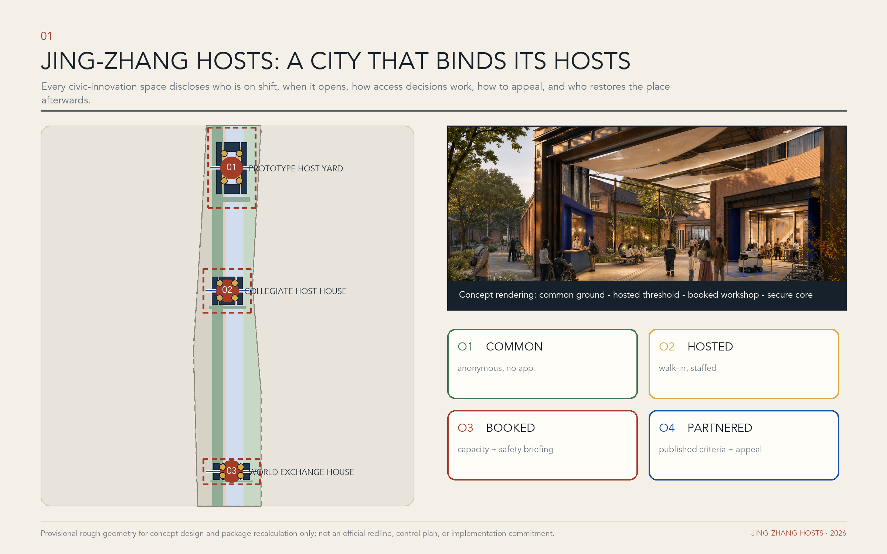
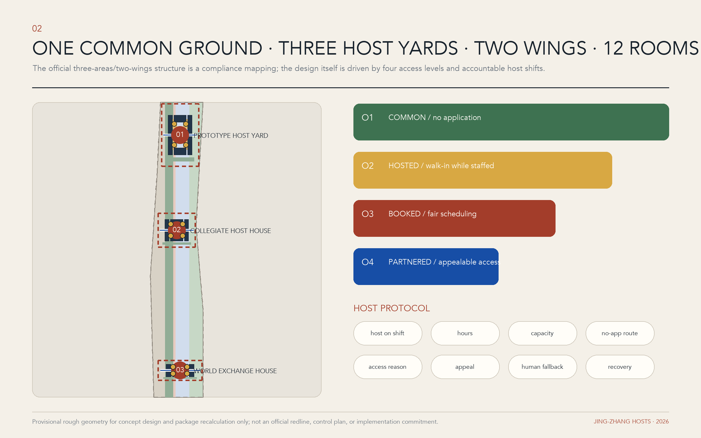
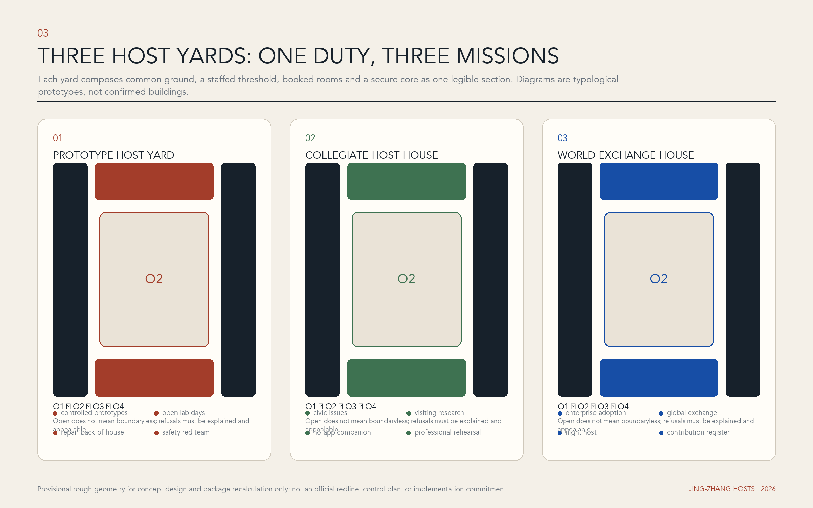
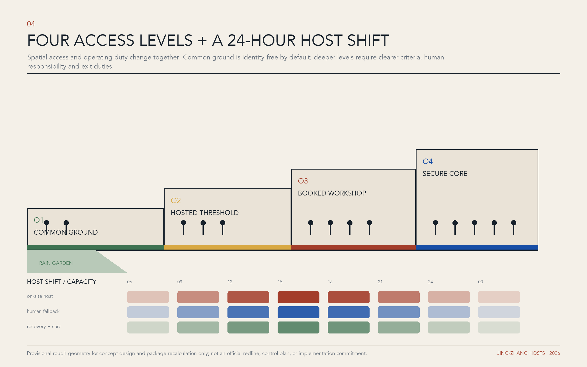
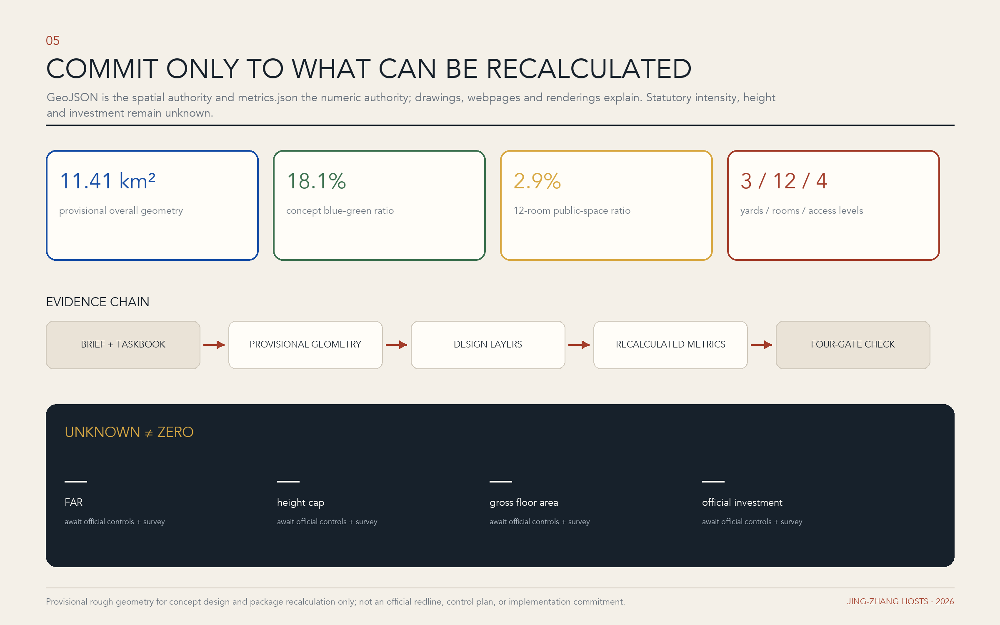

# 京张相迎 | JING-ZHANG HOSTS: An AI City That Binds Its Hosts to Account

> **Proposal in one sentence:** In the AI era, a city's scarcest resource is not only computing power, but a host willing to be accountable. JING-ZHANG HOSTS does not create another visitor-navigation service. It requires every public-innovation space to disclose who is on duty, when it opens, how admission works, why access may be refused, how a decision can be appealed, and who restores the place after people and projects leave.

## Design Basis and Source List

The proposal first observes the three working scales and deliverable depth established by the call: an approximately 43.6-square-kilometre coordinated research area, an approximately 11.4-square-kilometre overall design area, and three key areas totalling approximately 368.4 hectares. Their taskbook areas are approximately 192.1 hectares for Zhongzhiyuan, 104.3 hectares for the Beijing AI Origin Community, and 72.0 hectares for Dazhongsi. These figures organise research and narrative; they do not replace statutory boundaries, title records, or regulatory-plan conclusions. [source:OFFICIAL-ANNOUNCEMENT] [source:AGENT-TASKBOOK] The proposal uses a three-part discipline of fact, inference, and proposition. Statements explicitly established by the official notice, taskbook, and site package are facts; areas, ratios, and connections calculated from available data are inferences; spatial ideas still requiring survey, ownership, utilities, transport, and statutory-planning verification are identified as proposals or candidate interfaces. [depth:existing_conditions_diagnosis]

The evidence base comprises the official call, Agent Taskbook, site package, source registry, boundary and key-area data, processed existing-condition data, planning-limit notes, geometry files, and metric files. The verifiable package does not yet contain every official key-area polygon, parcel title, complete existing-building attribute, rail and bus ridership series, underground utility record, contamination and structural-safety assessment, statutory floor-area ratio, or height control. This submission therefore makes no unsupported claim that a particular parcel must be cleared, a road will certainly be added, or a building is definitively retained. [source:SITE-PACKAGE] [source:SOURCE-REGISTRY] Boundaries, key areas, and building outlines in the drawings provide conceptual orientation and a recalculation index only; coordinates, approvals, and field surveys issued or accepted by the competent authorities must replace them in the next stage. [data:geometry/site_boundary.geojson#SITE-001]

Research examines seven cases verified through project or municipal sources: Melbourne City Ambassadors, International House Helsinki, Helsinki Central Library Oodi, Barcelona's Ateneus de Fabricacio, Here East in London, Oil Tank Culture Park in Seoul, and Singapore's one-north. They respectively ask how staffed welcome services can be distributed, how cross-agency services can share an address, how public, bookable, and quiet spaces can be layered, how innovation facilities return value to society, how industrial heritage can combine open and controlled domains, how different relics can receive differentiated interventions, and how research, incubation, and everyday support can form a continuous ecosystem. The cases frame questions and calibration; they neither prove local success nor license copying foreign institutions or architectural forms. [source:CASE-MELBOURNE] [source:CASE-IHH] [source:CASE-OODI]

The central finding is that the Centennial Jing-Zhang corridor's distinctive opportunity is not another campus type. Railway heritage as a story of arrival, Zhongguancun's innovation ecosystem, university research, and the movement of AI talent can together form an urban institution in which every host team has a name, shifts are visible, authority has limits, admission can be appealed, and departure includes restoration. Case sources and the conditions that prevent literal transplantation are recorded in `sources.json`; any claimed outcome must still be verified against the originating material and a local baseline. [source:CASE-ATENEUS] [source:CASE-HERE-EAST] [source:CASE-OIL-TANK]

## Three-Level Scope Framework

The concept organises the three scales as **one ground, three yards, two wings, and twelve host rooms**. The approximately 43.6-square-kilometre coordinated research area is not a master plan seeking uniform development; it is a host network. Universities, laboratories, businesses, communities, public agencies, cultural institutions, and ecological assets become candidate nodes with distinct duties, allowing the study to trace how talent, knowledge, capital, use cases, and public problems can meet. The approximately 11.4-square-kilometre overall design area becomes a Welcome Common Ground. Using verifiable railway heritage and existing public-space clues, it creates a continuous but divisible system for arrival, orientation, display, work, rest, and departure. The three key areas become host yards able to receive real projects, with design extending to entrances, ground floors, shared rooms, servicing, security zones, and operating shifts. [depth:three_level_scope_framework] [data:geometry/key_areas.geojson#PROV-KEY-001]

The **one ground** is common ground, not another linear park that turns the railway into a code metaphor. It treats the heritage park and its cross-city interfaces as a shared surface that is publicly accessible, anonymous by default, and usable without an app. From there, staffed and scheduled thresholds, covered walks, desks, quiet rooms, accessible routes, and testing interfaces lead into progressively more specialised settings. The **three yards** correspond to Zhongzhiyuan, the Beijing AI Origin Community, and Dazhongsi, with complementary duties for making and governance, shared learning and talent life, and urban adoption and international exchange. The **two wings** are directions of cooperation rather than new administrative borders. The Zhongguancun technology-service wing links intellectual property, law, capital, standards, and international collaboration; the Xiaoyue River scenario wing links resident life, public services, and feedback from real conditions. Their nodes and routes remain interfaces until official boundaries, existing roads, and institutional willingness are confirmed. [source:AGENT-TASKBOOK]

The whole system uses four access levels. O1, the **Open Porch**, requires neither an app nor a booking and provides directions, printed information, drinking water, short stays, and human help. O2, the **Shared Living Room**, hosts displays, conversations, and low-risk experiences during staffed hours. O3, the **Bookable Workroom**, supports research, advice, co-creation, and controlled trials. O4, the **Secure Core**, is restricted to authorised staff and contains experimental equipment, sensitive data, or operational back ends. Every unit receives a readable Host Plaque naming the responsible party, opening hours, intended users, data terms, emergency contact, and exit route. The gradient protects openness while acknowledging research security, privacy, and the limits of urban operations. [standard:MOHURD-URBAN-DESIGN-MEASURES]

## Coordinated Research Area: Industry and Future City Research

At the coordinated scale, the industrial argument is not for another AI belt measured only by company counts and floor area. It repairs the least visible link between knowledge production and urban adoption: accountable stewardship. Zhongguancun and surrounding universities can supply research, engineering, and talent; firms can turn ideas into products; communities and public agencies can articulate real problems. What is often missing is a role that explains rules, hosts the first encounter, arranges a bounded trial, and remains responsible when it ends. JING-ZHANG HOSTS calls this the **host economy**: research institutions host knowledge access, firms host product safety, public bodies host public value, communities host lived knowledge, and professional services host compliance and translation. It adds no approval tier; it gives existing actors discoverable and reviewable interfaces. [source:AGENT-TASKBOOK] [depth:overall_spatial_structure]

The seven international cases yield seven transferable mechanisms. Melbourne combines fixed contact points and roving human ambassadors, demonstrating that a findable person requires locations, shifts, and service evidence, while tourist guidance cannot substitute for public service. International House Helsinki coordinates migration, employment, family, and employer services at one physical interface, suggesting that cross-agency referral needs explicit authority without importing Finnish eligibility rules. [source:CASE-MELBOURNE] [source:CASE-IHH] Oodi layers public events, bookable making, quiet occupation, and staff assistance, showing that openness does not mean abandonment. Barcelona's public fabrication network joins technical staff, first-visit conversations, making support, and social return, indicating that public value must enter the operating agreement. [source:CASE-OODI] [source:CASE-ATENEUS]

Here East reuses an Olympic media complex as a community of education, enterprise, creativity, and public events, offering a reference for placing public ground, shared innovation, and secure interiors together while warning that access to a privately managed campus is not automatically a public right. Seoul's Oil Tank Culture Park assigns different strategies of retention, light intervention, performance, and information exchange to six industrial relics, suggesting that structure, significance, and operations should jointly determine heritage renewal. one-north demonstrates that research, incubation, investment, and daily support need regional continuity rather than a single lobby. [source:CASE-HERE-EAST] [source:CASE-OIL-TANK] [source:CASE-ONE-NORTH] Because Haidian's institutional and market conditions differ, the proposal translates only five methods: staffed shifts, access gradients, adaptive reuse, shared services, and public return. It does not copy architectural forms or governance promises. [standard:PROJECT-AGENT-OPEN-CALL-TASKBOOK]

The future-city premise is **the city as a conditional host, not a limitless laboratory**. Every AI prototype entering lived urban space must answer nine questions: Who hosts it? Whom does it serve? Where does it operate? For how long? What data does it use? Who can stop it? Who provides human fallback? What public return does it produce? How will it withdraw or repair the site afterward? These questions form the JZ Host Protocol, making welcome for innovation and protection of the public the same act. They also turn international-talent support from a one-time reception into a persistent and visible urban capacity: visitors can find a person, understand the rules, enter an appropriate network, and on departure revoke permissions, return equipment, and archive outcomes. [depth:risk_missing_data]

The coordinated area ultimately produces three living registers. A host-node map records institutions and spaces willing to assume public duties. A problem-and-capability register matches urban needs and technical capacity with non-sensitive, updateable information. A public-return ledger records opening hours, served groups, validation findings, reasons for stopping, and continuing responsibility. These registers collect no individual movement trails and use neither faces nor device identifiers to create hidden profiles; inter-institutional sharing is limited to necessary, authorised, and revocable data. In this way, 43.6 square kilometres becomes a network of urban relationships rather than a blueprint that makes every district the same. [source:PROCESSED-FACT-PACK]

## Overall Design Area: Urban Renewal and Regulatory-Plan-Level Urban Design

The overall design organises 11.4 square kilometres as a continuous yet divisible **Welcome Common Ground**. Repairs to existing interfaces, open ground floors, walking connections, signage and lighting, and staffed operating points turn scattered assets into an arrival system understandable to an ordinary person. Its structure is not a sightseeing line from start to finish but a cycle of arrival, orientation, meeting, making, feedback, and departure. Candidate actions in each segment begin with reversible, low-impact measures: reveal obscured entrances, add sheltered open porches, place human service desks on authorised public-building ground floors, complete accessible crossings, and convert unused time slots into bookable workrooms. Any action affecting road reservations, historic buildings, structural work, fire safety, or railway safety remains subject to formal information and specialist review. [depth:land_use_layout] [data:geometry/site_boundary.geojson#SITE-001]

Land use and programme follow a three-part section of **front desk, commons, and back of house**. Street-facing fronts provide barrier-free enquiry, legible displays, community service, and explanations of human-AI collaboration. Middle commons contain meetings, teaching, shared work, prototype discussion, and small controlled experiences. Back-of-house space contains laboratories, equipment, storage, waste transfer, plant, and data infrastructure. O1-O4 access levels link the three, preventing innovation from retreating into closed campuses while avoiding forced exposure of secure research. Proposed AI research, public green, industrial service, and community-service uses express a conceptual relationship only and require review against statutory land-use classification, current ownership, and public-service assessment. [data:geometry/land_use.geojson#LU-001] [standard:MNR-LAND-USE-CLASSIFICATION-GUIDE]

The form strategy is **small halls, long porches, thick ground floors, and quiet courtyards**, not landmark towers competing for the skyline. New street edges should first create enterable ground floors and continuous shelter. Existing buildings should first address thresholds, stairs, lifts, toilets, acoustics, and wayfinding. Research equipment requires inspectable safety boundaries. No fictional values are assigned to height, floor-area ratio, building coverage, green ratio, or setbacks under current data conditions; each parcel must be calibrated against the formal regulatory plan. [depth:development_intensity_controls] [depth:height_massing_character] Two facing brackets form the letter H as the visual language; their negative space reads as both a doorway and an interface. Weathered red carries the time of railway material, warm paper white supports human-readable information, cobalt identifies digital services, and black marks rules and warnings. Every AI-generated perspective must be labelled a conceptual scene, never disguised as a completed project or approval commitment.

The minimum unit of implementation is not a parcel but a **Host Room**: a named place, a reachable person or team, a public calendar, defined safety and data rules, and a visible route out. Twelve Host Rooms can be distributed through the three yards and common ground, recognisable through a shared plaque and service protocol while allowing each architectural response to fit its context. Renewal can therefore begin with small units that can actually be operated, and use evidence can determine later permanent construction, instead of completing large forms first and searching for content afterward. [standard:MOHURD-CONTROL-DETAILED-PLANNING]

## Detailed Design of Key Areas

The three key areas are not competing technology parks but three courtyards in one hosting system. **Zhongzhiyuan: Prototype Host Yard**, the host yard for full-stack making and governance, supports collaboration from algorithms and compute through hardware and scenario testing. It contains a controlled prototype yard, an Open Lab Day vestibule, equipment handover, a protected observation gallery, and an AI-governance room. The public can understand what a machine is doing and who can stop it from O1 and O2, while specialists configure and evaluate it in O3 and O4. Robot routes, loads, fire constraints, and noise limits remain undefined until specialist engineering. [source:AGENT-TASKBOOK] [data:geometry/key_areas.geojson#PROV-KEY-001]

**Beijing AI Origin Community: Collegiate Host House** embeds shared learning and talent life in everyday settings rather than concentrating them in one service hall. Candidate spaces include an international-arrival desk, visiting-researcher studios, inter-university learning rooms, family and care referral, a quiet night Host Room, and a no-app window. It serves not only elite talent but also family members, young developers, local residents, and people with limited digital confidence. Housing, school places, health care, and visa matters receive only authorised information and referral; the Host House promises no outcome beyond an institution's authority. [data:geometry/key_areas.geojson#PROV-KEY-002] [depth:three_key_area_detailed_design]

**Dazhongsi: World Exchange House** hosts translation among firms, city users, and international visitors as the yard for urban adoption and global exchange. Candidate programmes include a multilingual arrival hall, market-adoption gallery, city-problem desk, cultural-content rehearsal room, enterprise-service Host Rooms, and an outcomes forum. Adoption here is not attention after a launch event. It decomposes an AI service into intended users, risks, human fallback, cost, feedback, and exit conditions, enabling small and medium enterprises, community service workers, and purchasers to make informed decisions. Commercial mix and leasing remain subject to market and ownership research. [data:geometry/key_areas.geojson#PROV-KEY-003]

Each yard receives one **honour node**, but honour is not a cult of personality. The **Century Arrival Hall** builds a time sequence from verified Jing-Zhang Railway figures, engineering, urban change, and contemporary arrival stories; oral histories disclose speaker permission and uncertainty. The **Registry of Hosts** records institutions, teams, and maintainers willing to accept public responsibility, displaying terms and current status without creating permanent, irrevocable personal rankings. The **Global Guestbook** records collaboration themes, public outcomes, and follow-up while excluding individual movement trails, home addresses, and unconsented identity data. All three locations are candidates pending assessment of historical value, public ownership, and operational accessibility. [source:BOUNDARY-SOURCE]

Detailed design uses one common **threshold section**. A no-app, no-booking O1 porch faces the street; behind it is a staffed O2 shared living room; next comes an O3 workroom requiring explicit consent and booking; the innermost layer is the O4 secure core. Every place defines both day and night and both ordinary-day and event-day states, with separate routes for equipment, waste, fire response, staff rest, and emergency escape. Architect, operator, accessibility adviser, fire engineer, and data-governance lead should jointly sign the pre-opening checklist so that a space drawn as open remains open in daily life. [standard:MOHURD-ARCH-DESIGN-DEPTH-2016]

## AI Innovation Ecosystem, Personas, and AI+ Scenarios

JING-ZHANG HOSTS does not reduce talent to an elite label. Six task-based personas calibrate space and service. A **visiting AI researcher** needs to learn rules, find collaborators, and handle family and everyday matters quickly. A **young founder, open-source developer, or solo company** needs affordable meetings, trustworthy tests, and intellectual-property referral. A **local resident or family** asks whether technology improves life and whom to contact when it fails. An **SME owner or frontline operator** needs calculable adoption costs, training, and a manual replacement process. An **older or disabled person, or anyone with limited digital confidence**, needs a route that depends on neither smartphone, voice input, nor facial recognition. A **first-time or international visitor** needs multilingual, intelligible guidance that does not overpromise. Personas shape tasks rather than a personal-label database; evaluation uses anonymous aggregates, active opt-in, and minimum necessary data. [source:AGENT-TASKBOOK]

Twelve scenario cards form a complete chain from arrival to withdrawal. Every card identifies a host, location, access level, duration, data boundary, human fallback, stop condition, and public return:

1. **International Talent Welcome Desk:** trained city-service hosts provide multilingual orientation, institutional introductions, and referrals; they promise no visa, housing, education, or medical outcome.
2. **First 72 Hours Kit:** transport, temporary work, health, family, accessibility, and emergency contacts are assembled in parallel print and digital checklists, with source and update date on every link.
3. **Visiting Researcher Residency:** a time-limited residency connects universities, firms, and community questions; entry agreements define how open the work will be, equipment conditions, and departure archiving.
4. **Open Lab Host Day:** a research team explains purpose, failure, and risk from outside its safety boundary; the public may ask questions but may not enter an unauthorised core.
5. **City Problem Reception:** residents, organisations, and frontline workers submit problems. A host first asks whether AI is suitable and whether a simpler non-AI answer exists, then publishes the case status.
6. **Hosted Prototype Yard (Industrial Validation 1):** embodied robots, edge devices, or urban-sensing prototypes operate within closed periods, fixed routes, and human takeover, recording anomalies, stop reasons, withdrawal, and restoration. [depth:three_key_area_detailed_design]
7. **Hosted Public-Service Rehearsal (Industrial Validation 2):** educational, health, legal, or administrative assistance is rehearsed only in simulations or authorised settings. AI makes no final decision; qualified people review outputs and retain a human route.
8. **Hosted Market Adoption Hall (Industrial Validation 3):** smart retail, enterprise services, and cultural content enter small trials with bounded users and time, testing cost, training, complaint handling, and exit rather than substituting display clicks for adoption.
9. **Multilingual No-App Companion:** on-site staff, paper maps, and optional translation devices work together; nobody must scan, register, provide a phone number, or submit a face.
10. **Night Host Room:** at a safety-assessed location, a quiet waiting place provides telephone help, basic charging, and referral, without confusing night-time vitality with continuous noise and consumption.
11. **Heritage Host Walk:** verified sources and voluntarily authorised oral histories connect railway-heritage nodes. Material may be explicitly marked “pending verification,” and no fictional person or event is generated.
12. **Check-out & Withdrawal:** participants can revoke data permissions, return equipment, close accounts, clarify ownership of outcomes, and verify that temporary installations have restored the site.

The three industrial validations use one process: bounded trial, independent observation, public finding, and reversible exit. Validation 1 tests safety, human takeover, and operating cost for embodied intelligence in a real but controlled environment. Validation 2 tests public-service AI for explanation, professional review, bias, and a non-digital alternative. Validation 3 tests enterprise and cultural AI products for training burden, complaint handling, commercial durability, and exit cost. Success does not automatically justify expansion, and failure need not be hidden. Without an identifiable responsible party, defined data boundary, and human fallback, a prototype does not enter a real setting. [depth:risk_missing_data]

A proposed **Council of Hosts** coordinates the ecosystem, bringing together local governance, research and universities, firms, communities, accessibility, law and ethics, and operations. Its legal form, powers, and funding require confirmation by competent authorities and participating institutions. Each year the council organises Host Week, an Open Lab Season, calls for urban problems, international residency cycles, and failure-and-exit reviews, then publishes a public-return ledger. AI is not the system's host; it is a hosted tool. Every automated service must show, on the same interface, the person responsible, the person able to stop it, and the non-digital alternative. [standard:PROJECT-OFFICIAL-ANNOUNCEMENT]

## Land Use, Building Scale, and Retain-Renovate-Demolish Strategy

The proposal follows three rules: activate before adding, stay reversible before becoming permanent, and verify operations before fixing scale. The provisional overall-design geometry currently recalculates to approximately 11,412,825.386 square metres, while conceptual building footprints total approximately 827,699.635 square metres. These figures test internal package consistency only; they are not ownership areas, a survey of existing buildings, gross floor area, or approval indices. [metric:site_area_sqm] [metric:building_footprint_area_sqm] Total construction, above- and below-ground area, floor-area ratio, building height, coverage, setback, and parking provision still require a formal regulatory plan, survey, ownership, structure, fire, and transport evidence, so no falsely precise quota is offered at this stage. [depth:development_intensity_controls]

Retain, renovate, or demolish is decided in four steps. First, establish historical, cultural, industrial, and social value; do not demolish before assessment. Second, verify structure, fire safety, accessibility, and building services; appearance alone cannot decide retention. Third, verify use and ownership: who may open the space, for how long, and from what maintenance budget? Fourth, compare light renovation, partial addition, and replacement through whole-life carbon, cost, and operating performance. Give priority to retaining ground floors, courtyards, halls, links, and long-span rooms that can host the programme. Give priority to repairing thresholds, toilets, lifts, acoustics, weather protection, and servicing. Demolition is considered only when professional assessment finds safe adaptation infeasible and procedure, compensation, and public benefit are sufficient. [depth:retain_renovate_demolish]

New work uses a phased **kit of host parts**: a one-room-scale enquiry kiosk, mobile display and interpretation unit, demountable porch, bookable workroom, quiet room, equipment handover, and test box with independent servicing. No component receives a standard area in advance; scenario, occupancy, fire, and accessible circulation determine size. Permanent construction enters design only after a 100-day operational pilot supplies evidence of use. AI research, industry and business services, community services, and park space in the conceptual land-use drawing express functional relationships and are not proposals for statutory reclassification. [data:geometry/land_use.geojson#LU-003] [data:geometry/buildings.geojson#BLDG-01-01]

## Transport, Rail, Municipal Infrastructure, and Public Services

Transport prioritises arrival, comprehension, and exit. The common ground first checks continuity for walking and wheelchairs: crossing waits, ramps, tactile paving, shelter, night lighting, seating, toilets, and safe passage across railway or rapid-transport infrastructure. It then identifies interfaces with rail stations, bus stops, shared bicycles, taxi drop-off, and campus shuttles. Available information cannot support conclusions about new roads, new stations, or definite passenger volumes. Drawn roads are conceptual connections and require a specialist transport survey and competent-authority data. [depth:traffic_rail_slow_parking] [data:geometry/roads.geojson#ROAD-01]

Each Host Yard publishes a **last 500 metres guide** from the nearest public-transport alighting point to the O1 porch, with continuous wayfinding, a printed map, night-visible signs, and an accessible alternative route. Large events use timed booking, public-transport priority, and temporary traffic management instead of defaulting to more car parking. Logistics, experimental equipment, refuse, ride-hailing, and visitor walking should be separated by route or time. Embodied systems may not test on unauthorised public roads. Any construction, crossing, or lighting within railway facilities or their protection zones remains subject to railway safety, heritage, and other specialist controls; visual narrative never overrides an engineering boundary. [standard:MOHURD-CONTROL-DETAILED-PLANNING]

Municipal and new infrastructure form a two-layer system of **visible responsibility**. The physical layer includes power, water, drainage, reclaimed water, communications, fire systems, sanitation, charging, equipment storage, and emergency power. The digital layer includes booking, access, interpretation, device status, and public operations boards. When the digital layer fails, the O1 desk, paper process, staffed telephone, and mechanical opening remain available. Every sensor discloses purpose, collection extent, retention period, and responsible person; facial recognition and continuous individual tracking are not defaults, and data from separate validation projects are not automatically combined. [depth:municipal_new_infrastructure]

Public services refer rather than replace. AI tools in health, education, law, administration, and employment may help explain, organise, and book, but qualified people retain professional judgement. Candidate Host Room provisions include family-friendly amenities, quiet space, gender-neutral toilets, and accessible toilets, to be resolved under site conditions and applicable standards. Success is measured by time to reach a responsible person, whether a problem closes, and whether a non-digital route remains—not by scan counts or numbers of screens. [source:OFFICIAL-ANNOUNCEMENT]

## Blue-Green Network, Public Space, and Urban Character

The blue-green system is both an ecological network and the most equal public front room of the welcome system. Current conceptual geometry recalculates a green-space ratio of approximately 18.11% and a public-space ratio of approximately 2.91%. These are internal ratios of objects drawn within a provisional boundary, not statutory green ratios, verified existing conditions, or construction targets. [metric:green_ratio] [metric:public_space_ratio] The next stage must combine formal terrain, water, tree, sponge-city, ecological-sensitivity, and ownership evidence to determine which spaces can stay continuously open and which require seasonal or safety restrictions. [depth:blue_green_public_space]

Public space is layered as **porch, pocket court, host walk, and quiet green island**. Porches support enquiry, weather protection, and waiting. Pocket courts hold brief meetings and low-risk displays. The host walk connects three yards and makes opening times legible. Quiet green islands reserve room for residents, children, older people, birds, and night rest without allowing events to occupy everything. Activity density does not pursue permanent bustle; sound and light fall at night, and large screens, drones, or highly interactive devices never become the default landscape. Every temporary installation states its maintainer, power supply, wind-safety method, removal date, and responsibility for restoring the ground. [data:geometry/green_space.geojson#GREEN-01]

Urban character rejects mirror glass, blue light strips, and cyberpunk imagery as shorthand for the future. Weathered red refers to railway materials and accumulated time; warm paper white supports legibility and human skin tones; cobalt is reserved for digital interfaces; black identifies rules, safety, and no-entry zones. The facing-bracket H can become a door plaque, ground interface, porch joint, or wayfinding frame. Five status labels—open, bookable, controlled, paused, and exited—make responsibility as clear as a traffic signal. Heritage narratives require sources, and new structures maintain a legible old-new distinction rather than imitating the past. [standard:MOHURD-URBAN-DESIGN-MEASURES]

The three honour nodes create a public-space story of **arrival, responsibility, and contribution**. The Century Arrival Hall explains how knowledge and people reached the city; the Registry of Hosts identifies who carries responsibility today; the Global Guestbook records the public outcomes left by collaboration. Their value lies not in monumental sculpture but in trustworthy content stewardship, periodic updates, and revocable permission. Candidate public-space outlines await official boundaries and fieldwork; current drawings make no claim about occupation or title. [data:geometry/green_space.geojson#GREEN-01] [data:geometry/public_space.geojson#HOST-01-01]

## Renewal Projects, Implementation Policy, and Phasing

The project register follows **protocol first, light renovation for validation, permanent work by demonstrated merit**. Initial non-construction projects establish the host-node and contact register, publish the JZ Host Protocol, train multilingual and accessibility-aware hosts, verify railway history, and create a public calendar plus complaint and withdrawal procedures. Initial light works provide three candidate staffed O1 desks, no-app wayfinding, reversible porches, quiet rooms, the parallel print-and-digital First 72 Hours Kit, and three controlled industrial validations. Medium- and long-term work may then repair discontinuities in the common ground, establish permanent halls for the three yards, create shared inter-institutional facilities, and add only buildings demonstrated to be necessary. [depth:renewal_project_list]

Implementation comprises a preparatory Phase 0 followed by four delivery phases. **Phase 0: Evidence and Authorisation** verifies boundaries, ownership, buildings, transport, utilities, ecology, history, and institutional willingness, then classifies what cannot proceed, what must wait, and what may be tested. **Phase 1: 100-Day Hosting Pilot** places three staffed desks at authorised existing public interfaces and begins the Prototype Yard, Public-Service Rehearsal, and Market Adoption Hall validations; 100 days is an operating observation period, not permission to bypass approval. **Phase 2: Reversible Spatial Network** uses pilot evidence to improve thresholds, accessibility, lighting, signs, shared workrooms, and wing connections. **Phase 3: Permanent Host Yards and Common Ground** builds only demonstrated permanent space after statutory planning, engineering, heritage, and environmental assessment. **Phase 4: Continuous Operations and Annual Review** uses Host Week, residencies, the public ledger, and exit audits to keep correcting the system. Phases 1–3 correspond to the three spatial implementation features; Phases 0 and 4 are pre-design verification and continuing operations, so they do not invent additional construction boundaries. [depth:phasing_implementation] [data:geometry/phasing.geojson#PHASE-01]

Operations have three levels: Council of Hosts, the three yard teams, and scenario hosts. The council reviews public value, ethics, safety, and annual resources. Yard teams maintain opening hours, facilities, training, and cross-area cooperation. A scenario host is accountable for participants, data, human fallback, and restoration within one test. Every project uses nine registration fields: host entity, served group, physical address, duration, consent and data, safety boundary, human fallback, public return, and stopping and exit conditions. Loss of the responsible party, a changed data purpose, inadequate safety capacity, or an unresolved complaint automatically pauses the project; publicity never offsets risk. [source:AGENT-TASKBOOK]

The suggested funding mix combines core public-service funding, institutional membership and co-production, scenario-validation contracts, and charitable or research funds. The public O1 entrance remains free of payment and registration barriers, and sponsorship buys neither hidden data nor exclusive urban space. Policy tools include authorised time-sharing of existing space, liability and insurance terms for sandboxes, public-data minimisation, reversible approval for temporary installations, accessibility and human-fallback checks, publication of failure, and a restoration bond. Competent authorities and participating bodies must lawfully determine organisation, procurement, insurance, and budgets; this proposal invents no existing institution or funding commitment. [standard:PROJECT-OFFICIAL-ANNOUNCEMENT]

## Metrics, Area Recalculation, and Compliance Matrix

The measurement framework shifts from **how much was built** to **whether responsibility can be reached**. Primary dimensions are host accessibility, public opening, talent inclusion, industrial validation, accessibility and equity, data and safety, spatial ecology, and exit restoration. Suggested core measures include median time to reach the accountable person; share of AI services with explicit human fallback; share of first-time visitors able to orient themselves; share of submitted problems receiving a defined next step; follow-through rate for university-firm-community projects; resident and SME participation; no-app task completion; accessible field-task completion; trials that stop, return equipment, and restore on schedule; and share of failures and corrections made public. Targets are set only after baseline observation, never as attractive but unobserved promises. [depth:metrics_recalculation]

Area recalculation follows **traceable geometry, explainable definitions, and visible gaps**. The current conceptual boundary measures approximately 11,412,825.386 square metres; building footprints project to approximately 827,699.635 square metres; green and public-space ratios are approximately 18.11% and 2.91%; and there are 3 key areas. Floor-area ratio remains `unknown` because reliable storey and floor-area data are absent. [metric:site_area_sqm] [metric:building_footprint_area_sqm] [metric:key_area_count] Every geometry revision must rerun area statistics and overlap tests, confirming unique IDs for key areas, land use, buildings, roads, green space, public space, and phasing, and agreement between narrative figures and generated metrics. An unknown stays `unknown`; an estimate must not masquerade as a survey.

The compliance matrix covers six relationships: sources to facts, design depth to the taskbook, land-use labels to current guidance, urban-design content to the required expression depth, engineering and architectural information to stage limits, and privacy, copyright, and AI generation to disclosure. Each finding uses one of four statuses—verified, inferred, pending verification, or proposed—and assigns a next-step owner. For statutory planning, transport, municipal capacity, structural and fire safety, heritage, ecology, data governance, and public procurement, the proposal identifies questions and design interfaces but does not replace specialist review. [standard:MNR-LAND-USE-CLASSIFICATION-GUIDE] [standard:MOHURD-ARCH-DESIGN-DEPTH-2016]

Evaluation combines quantitative and qualitative evidence. Quantitative evidence comes from anonymous operational records, field counts, task tests, and geometry recalculation. Qualitative evidence comes from consented interviews, observation notes, complaints, and reviews. Individual trails, emotion recognition, and opaque “talent scores” may not optimise services. A short public-return ledger is issued quarterly; each year, an external group including community and accessibility representatives samples scenario cards, stop records, and restorations. Metrics do not create a single district ranking. They help decide which Host Room deserves extension, which needs correction, and which should exit. [source:SOURCE-REGISTRY]

## Risk, Copyright, and Compliance

Eight principal risk classes shape the design. **Data risk:** incomplete formal boundaries, title, regulatory plans, buildings, utilities, ridership, and ecological evidence may alter location or scale; retain candidate language and evidence gates. **Concept risk:** a host could decay into a brand ambassador or event volunteer; bind the role through reachability, stopping power, accountability, and exit. **Social risk:** international-talent services could displace local residents; keep the O1 public entrance, community seats, and equity measures together. **Technical risk:** AI error, bias, loss of control, and vendor lock-in require final human judgement, minimum data, replaceable interfaces, and stop conditions. **Spatial risk:** nominal openness may create noise, crowding, and ecological pressure; use time, capacity, quiet zones, and restoration audits. [depth:risk_missing_data]

The remaining three are **operational risk**, in which completed space lacks staff or maintenance funding, answered by a 100-day staffed test before permanent construction; **governance risk**, in which an inter-institutional council has unclear powers or is captured by strong actors, answered by publishing membership, conflicts, decisions, and appeals; and **narrative and copyright risk**, in which railway history, personal likeness, maps, fonts, photographs, or case material are misused, answered by recording author, source, licence, adaptation, and publication date. Personal information at honour nodes requires explicit consent and withdrawal; the Global Guestbook records collaborative outcomes, not personal movement. [source:SOURCE-REGISTRY]

AI generation follows six steps under the rule **machines expand options; people own judgement**. First, an agent reads the notice, taskbook, site package, source registry, and geometry, then lists facts and gaps. Second, it generates several organising ideas and checks names and similarities; the team selects responsibility and welcome as the HOSTS core instead of crowded metaphors such as railway-as-code, operating systems, or a communal dining table. Third, deterministic scripts generate or test boundaries, key areas, functions, roads, green and public space, and phase geometry. Fourth, every claim receives a source, standard, depth, data, or metric marker. Fifth, urban design, operations, transport, accessibility, data-governance, and local-participant perspectives receive human review. Sixth, and only then, an image model produces conceptual scenes whose captions disclose generation, prompt version, human editing, and non-built status. [source:PROCESSED-FACT-PACK]

No real identity, contact detail, home address, unpublished commercial secret, or sensitive public datum is sent to a model. Text and images undergo fact checking, copyright review, spatial-consistency testing, and discrimination review; case imagery is preferably self-drawn, authorised, or openly licensed. The final package discloses model, tool, version, generation date, and extent of human editing. No AI suggestion replaces a registered professional, competent authority, or public process. If a model invents history, a place name, institutional collaboration, or engineering condition, that material is deleted rather than sheltered behind the word conceptual. [standard:PROJECT-AGENT-OPEN-CALL-TASKBOOK]

The proposal differs from a familiar smart-city showroom because screens are not the protagonist; accountable relationships are. It differs from hotel hospitality because welcome is not a consumer service but a durable institution crossing research, industry, and public life. It differs from long-table or shared-meal narratives because cooperation depends not on a dining symbol but on enterable thresholds, verifiable protocols, and revocable permissions. Copyright rests on original submitted text, traceable generation records, and lawful material. International cases are paraphrased proportionately and linked to originating institutions. [standard:MOHURD-URBAN-DESIGN-MEASURES]

## References

The following material forms the source framework for this stage. Machine-readable IDs, limits of use, and original links are recorded in `sources.json`. International cases support mechanism comparison only; they are neither site facts nor evidence of local implementation performance:

1. The official notice for the Centennial Jing-Zhang AI Innovation Belt Urban Design Open Call, used for scope, objectives, and deliverable requirements. [source:OFFICIAL-ANNOUNCEMENT]
2. The Agent Open Call Taskbook, used for the three scopes, three key areas, two-wing positioning, scenarios, and validation requirements. [source:AGENT-TASKBOOK]
3. The site package, source registry, and processed fact pack, used for boundaries, geometry, metrics, and declarations of missing data. [source:SITE-PACKAGE] [source:PROCESSED-FACT-PACK]
4. Ministry of Housing and Urban-Rural Development materials on urban design, detailed regulatory planning, and architectural-design depth, together with Ministry of Natural Resources guidance on land and sea-use classification for survey, planning, and use control. Current editions and applicable provisions require final verification. [standard:MOHURD-URBAN-DESIGN-MEASURES] [standard:MNR-LAND-USE-CLASSIFICATION-GUIDE]
5. City of Melbourne, City Ambassadors and visitor-contact statistics, used to study fixed service points, roving human staffing, and measurable service; visitor-economy guidance is not equated with public hosting. [source:CASE-MELBOURNE]
6. International House Helsinki, used to study a cross-agency physical interface for migration, work, family, and employer services; Finnish immigration and qualification systems are not transferred. [source:CASE-IHH]
7. Oodi Helsinki Central Library, used to study a gradient of public activity, bookable making, quiet occupation, and staff help; its landmark architectural form is not copied. [source:CASE-OODI]
8. Barcelona Ateneus de Fabricacio, used to study the responsibility process linking public digital fabrication, technical hosts, first-visit guidance, free use, and social return. [source:CASE-ATENEUS]
9. Here East, London, used to study adaptive reuse of large industrial and Olympic heritage and the coexistence of public ground, event space, shared innovation, and secure experimentation; access to a private campus is not treated as a public right. [source:CASE-HERE-EAST]
10. Oil Tank Culture Park, Seoul, used to study retention, light intervention, variable operation, and civic participation across different relics; neither the spectacle of tanks nor a one-off festival is copied. [source:CASE-OIL-TANK]
11. JTC one-north and LaunchPad, used to study regional coordination of research, incubation, investment, flexible space, and everyday support; local siting still requires institutional willingness, title, and transport verification. [source:CASE-ONE-NORTH]

Case citation follows three rules: prefer the originating institution, translate mechanisms rather than forms, and disclose limits. Promotional language is not rewritten as objective performance; one case cannot prove an inevitable Haidian outcome; and an image of unknown origin cannot demonstrate the design. Every site conclusion must return to Jing-Zhang data, institutional interviews, public participation, and professional review. Every number must trace to a source or recalculation script, and every unknown condition must remain explicitly pending verification. [source:SOURCE-REGISTRY] [depth:risk_missing_data]
