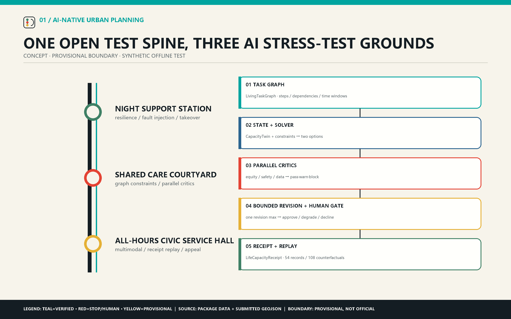
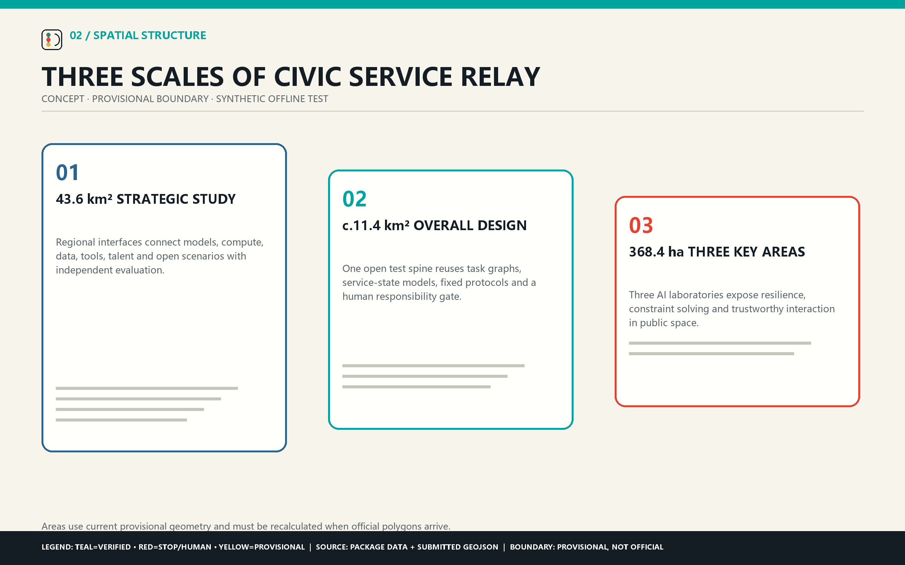
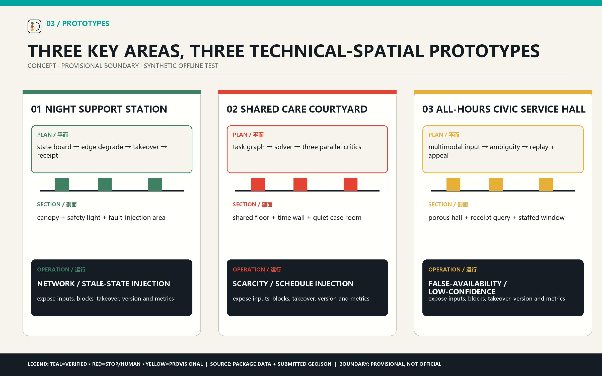
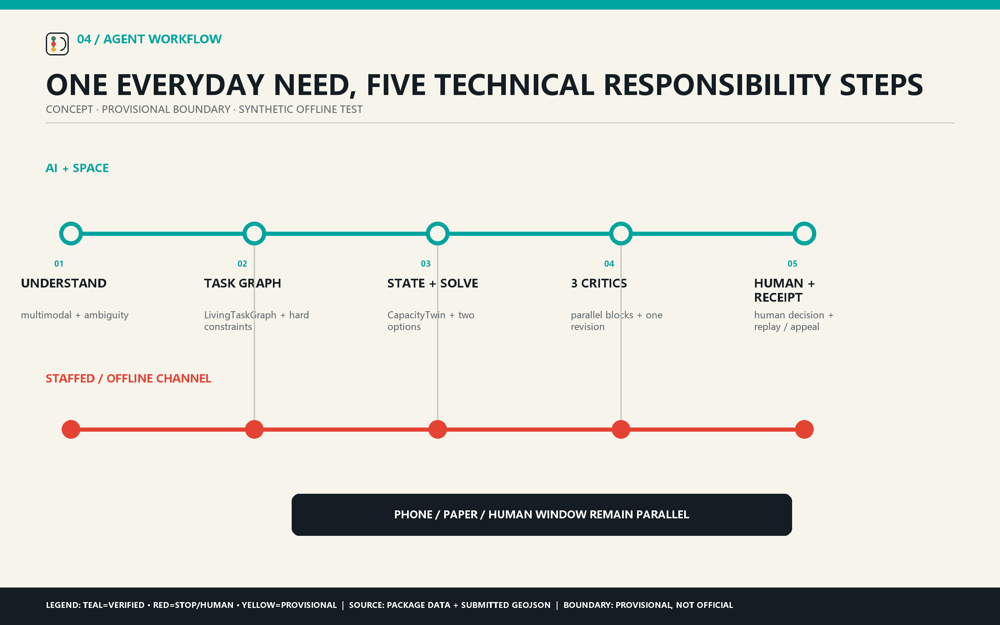
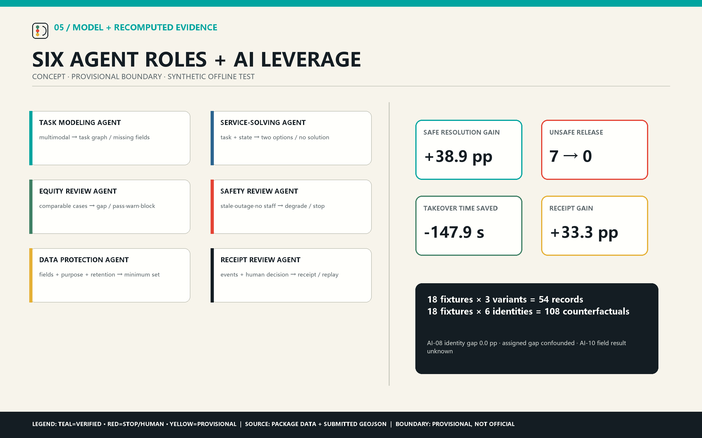

# JING-ZHANG CIVIC SERVICE RELAY

## URBAN MULTI-AGENT COLLABORATION TESTBED

**Help everyday needs connect, get resolved and receive a clear response.** Jing-Zhang Civic Service Relay is an AI-native urban design method. It converts a cross-time, cross-place and cross-provider need into a `LivingTaskGraph`, then reads location, hours, available slots, responsible staff, staffed fallback and freshness from `CapacityTwin`. A service-solving agent generates two constraint-compliant options. Equity, operations-safety and data-protection agents review in parallel; blocking findings may trigger one bounded revision only. Responsible staff then approve, degrade, hand off or decline. `LifeCapacityReceipt` preserves provenance, versions, the human decision and appeal for offline replay. AI therefore enters the planning decision itself: urban design tests whether an everyday task can actually remain continuous under real constraints. [source:AGENT-TASKBOOK] [source:REVIEW-RUBRIC]

**Technical sequence:** multimodal understanding → task graph → service-state model → graph constraint solving and two options → three parallel critics → one bounded revision → human responsibility gate → traceable receipt and replay.

This concept package uses provisional geometry and synthetic offline tasks. Its Node.js runner reexecutes three variants from 18 frozen fixtures, recomputes 54 records and 36 aggregate values, runs 108 persona-id counterfactuals, and requires an exact match with the submitted result. The evidence proves deterministic contract and failure-path replay only; field performance and operating entities remain unverified. [source:BOUNDARY-SOURCE]

## agent.1 — Concept, programme and three spatial scales

The official announcement, repository taskbook, review rubric and site package define the formal task. Beijing and Haidian policy documents provide current AI-policy context; NIST AI RMF and UN-Habitat provide background risk and people-centred governance methods. Formal, background and provisional sources stay separated in `sources.json`. [source:OFFICIAL-ANNOUNCEMENT] [source:NIST-AIRMF]

The organising structure is **one open test spine, three AI stress-test grounds and two staffed fallback channels**. The 43.6 km² strategic study connects models, compute, data, tools, talent and open scenarios; the roughly 11.4 km² overall-design scope reuses the same task graph, service-state model, protocols and responsibility gate; three provisional key areas host visible laboratories for resilience, constraint solving and trustworthy interaction. [depth:three_level_scope_framework] [data:geometry/site_boundary.geojson#SITE-001]

## agent.2 — Five-layer AI architecture and open ecosystem

The hybrid architecture has five layers: replaceable model interfaces for multimodal understanding and conflict explanation; a six-agent orchestration layer; a city-state layer built from `LivingTaskGraph` and `CapacityTwin`; spatial interfaces such as state boards, coordination tables, multilingual desks and staffed windows; and an evaluation-governance layer with frozen fixtures, baselines, blocking conditions, appeals and exit. The open operation chain is issue publication → synthetic data → solution submission → offline evaluation → professional review → version registry → authorised scenario transfer.

The six agents have bounded roles: Intake structures the request; Orchestration proposes plans; three critics can block on equity, operations/safety or data rights; Receipt and Replay preserve provenance without rewriting critic findings or the human decision. Models cannot decide public eligibility, invent unavailable capacity or replace statutory and high-impact decisions. [metric:AI-09]

## agent.4 — Three perceptible AI public laboratories

**Night Support Station / Zhongzhiyuan — Urban-agent resilience lab.** A task graph connects night transport, food, rest and care handoff; the service-state model checks hours, routes, staff and freshness. Network loss or stale data blocks recommendation, allows one revision and then triggers staffed/paper fallback. [data:geometry/key_areas.geojson#PROV-KEY-001]

**Shared Care Courtyard / AI Origin Community — Multi-agent constraint-solving ground.** A task graph encodes work, childcare, eldercare and transport dependencies; `CapacityTwin` supplies slots, hours and staff; the solver generates schedules; three critics test comparable-case equity, operational conflict and minimum data. Public eligibility remains a staff decision. [data:geometry/key_areas.geojson#PROV-KEY-002]

**All-Hours Civic Service Hall / Dazhongsi — Multimodal trustworthy-interaction lab.** Voice, text, paper transcription and staff input enter a task graph with source, ambiguity and confidence. Low confidence or rights-sensitive matters go to staff; receipts preserve translation changes, provenance, decisions and appeals. [data:geometry/key_areas.geojson#PROV-KEY-003]

## agent.3 — Six agent roles, use situations, scenarios and tests

Six synthetic personas cover night-shift work, caring responsibilities, open-source teams, international visitors, public-service operators and people with low digital access or mobility needs. Twelve scenario cards each state the task chain, minimum data, privacy boundary, human owner, non-digital path, appeal, stop rules and metrics. SC-02, SC-07 and SC-11 anchor the three comparison tests. [metric:persona_count] [metric:scenario_card_count]

TEST-AI-01 injects outage, stale service information and network loss at Night Support Station. TEST-AI-02 injects scarcity, schedule conflict and accessibility constraints at Shared Care Courtyard. TEST-AI-03 injects ambiguity, false availability and appeal at All-Hours Civic Service Hall. Each compares a reference rule, a single planner and the coordinated-agent system on the same 18 frozen synthetic tasks.

The current deterministic run reports **100.0% safe resolution**, **0 unsafe releases**, **100.0% receipt completeness** and a **0.333 data-minimisation ratio** for the Kernel. Safe refusal and task completion are reported separately. AI-10, the simulation-to-field gap, remains unknown until an authorised field test exists. [metric:AI-01] [metric:AI-10]

The high-leverage AI insertion points are unstructured request modelling, cross-service constraint solving, parallel pre-release criticism and executable replay. Against the single planner, the six-agent system gains **38.9 percentage points** in safe resolution, reduces unsafe releases from **7 to 0**, saves **147.9 seconds** in mean takeover time, and gains **33.3 points** in receipt completeness. These are synthetic technical gains, not financial or field ROI.

AI-08 replays all 18 tasks with each of six persona IDs as the only changed field, producing 108 counterfactual runs and a **0.0-point** identity-field completion gap. The raw assigned-fixture gap of **66.7 points** is disclosed as confounded by unequal task difficulty and is not used as a fairness conclusion.

## agent.5 — Railway, Zhongguancun and AI culture

“Relay” unifies the story: the railway connects places, the task graph connects steps, six agents hand off computational responsibilities, and staff take over when automation stops. Public displays show task dependencies, data freshness, critic findings, human decisions and version changes, shifting AI culture from watching machines to jointly testing an accountable urban method.

## agent.6 — Global developer programme and long-term operation

The overall structure is one civic spine, three service nodes and two access networks: blue-green walking supports physical access; staffed and offline channels support service access. The proposal prioritises existing ground floors, halls, courtyards and reversible components. Heights, FAR, rights, road engineering, fire safety, utilities and operating hours remain professional prerequisites. [depth:overall_spatial_structure] [depth:risk_missing_data]

Eight action packages cover outage drills, service-state registration, schedule solving, fairness review, multilingual accessibility walks, receipt and appeal drills, quarterly developer tests and annual public release/exit reviews. The operating chain is issue publication → synthetic data → solution submission → offline evaluation → professional review → version registry → authorised scenario transfer. Every package states prerequisites, evidence, stop conditions and professional handoff.

## Risk, rights and status

Real deployments require purpose limitation, authorisation, data minimisation, retention, deletion, human responsibility and appeal. Automation stops on stale or false service information, unresolved blocking findings, missing responsible staff, missing offline service, missing appeal or receipt failure. The internal `CapacityTwin` stores service, place, time, owner and freshness states; it does not model a person.

All figures, logo, HTML and PDF pages are generated from original package data. Web pages load no remote fonts, scripts, maps, images, iframes or CDNs. The proposal is a reference concept for professional deepening and does not claim government approval, statutory planning status, investment, procurement, permits or field performance.

## Machine-readable contract

`LivingTaskGraph={task_id, persona_id, steps, dependencies, time_window, accessibility_needs, consent, fallback}`; `CapacityTwin={capacity_id, place_id, service, available_slots, freshness, owner, human_channel, confidence}`; `LifeCapacityReceipt={receipt_id, request_summary, data_classes, proposal, critic_findings, human_decision, fallback, appeal, expiry, provenance}`.

Structured assets under `visual/assets/` contain 12 scenarios, six use situations, three test protocols, eight action packages, 18 fixtures, an executable replay, evaluation results, a receipt example and the asset-rights ledger. [source:UNHABITAT-AI-CITIES]
