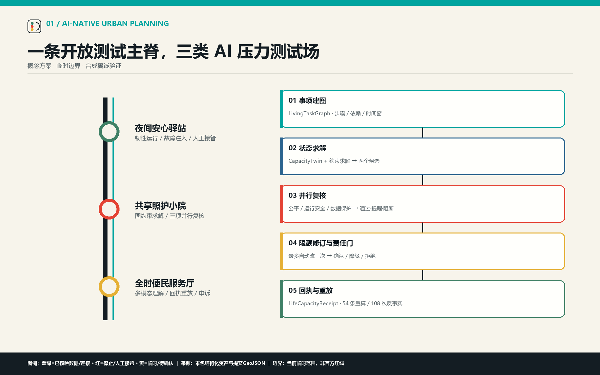
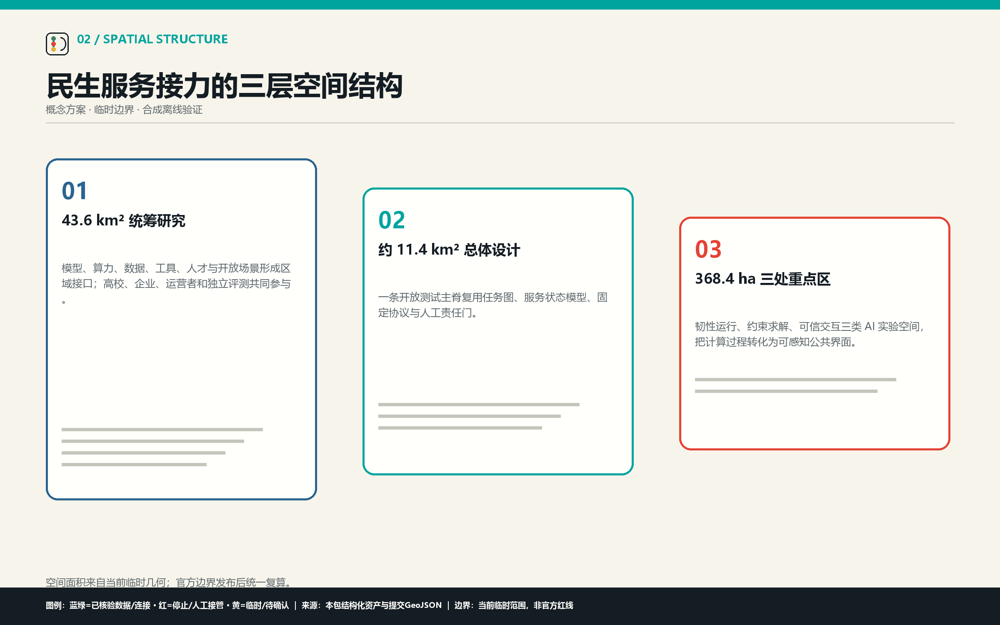
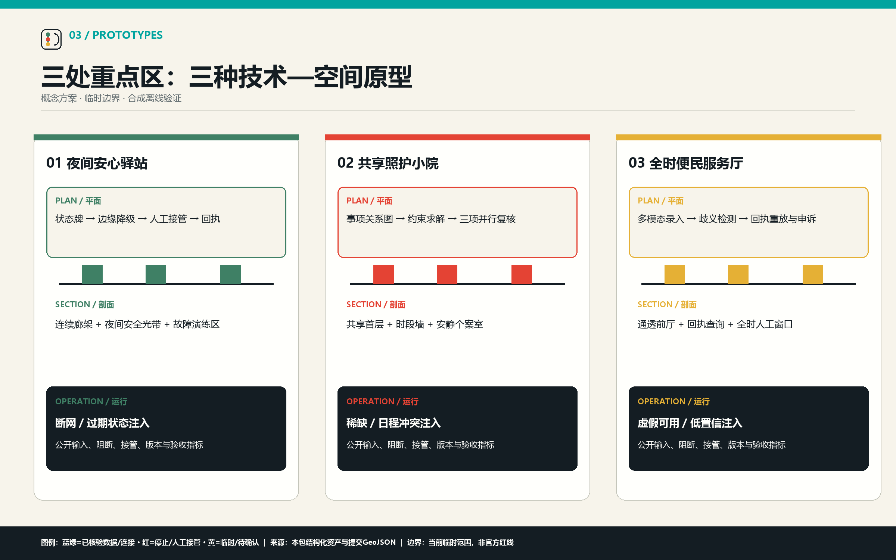
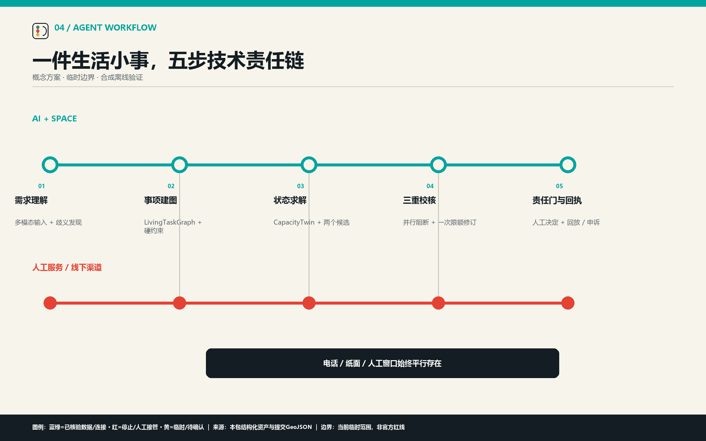
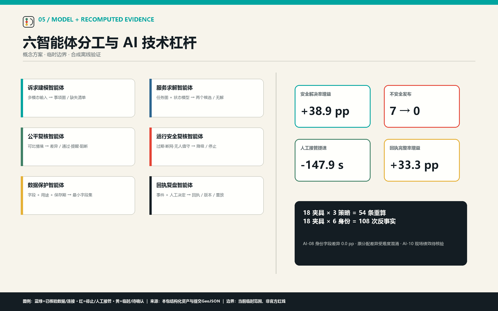

# 京张民生接力 / JING-ZHANG CIVIC SERVICE RELAY

## 城市多智能体协同实验带

**让一件件生活小事，接得上、办得成、有回应。** “京张民生接力”是一套 AI 原生城市设计方法：把跨时段、跨地点、跨服务主体的生活事项建成民生事项关系图 `LivingTaskGraph`，再从城市服务供给状态模型 `CapacityTwin` 读取地点、时段、名额、责任人员、人工窗口和信息更新时间。服务求解智能体依据硬约束生成两个备选；公平、运行安全和数据保护三个智能体并行复核，阻断项最多触发一次限额修订；仍有冲突时，由责任人员确认、转人工或拒绝发布。系统最后生成可查询、可申诉的可追溯服务回执 `LifeCapacityReceipt`，并保存来源、版本和决定供离线回放。AI 因而直接进入城市规划的判断过程：城市设计不只配置设施，还验证一件生活事能否在现实约束下连续完成。[source:AGENT-TASKBOOK] [source:REVIEW-RUBRIC] [source:JZ-AI-BELT-XINHUA-2026]

**技术链：** 多模态需求理解 → 民生事项关系图 → 城市服务供给状态模型 → 图约束求解与两个候选 → 三项并行复核 → 一次限额修订 → 人工责任门 → 可追溯回执与离线重放。

本成果使用临时边界与合成离线任务。空间面积来自当前提交 GeoJSON，可复算但不构成官方红线；Node.js 回放程序会从 18 个冻结夹具重新执行三种策略、重算 54 条结果记录、36 项聚合值和 108 次公平反事实，并与提交结果逐项比对。该证据只证明技术合同、冲突和失败路径可复算，现场绩效与实施主体保持待核验。[source:BOUNDARY-SOURCE] [assumption:A-GEO-001]

## 设计依据与资料清单

正式任务依据来自官方公告、仓库任务书、评审规则和场地资料包；技术语言参考国务院“人工智能+”行动、中国信通院智能体能力研究、新华社对百年京张 AI 创新带及可信智能体的报道。[source:OFFICIAL-ANNOUNCEMENT] [source:STATE-AI-PLUS-2025] [source:CAICT-AI-2024]

风险方法参考 NIST AI RMF 与 UN-Habitat 人本城市 AI 指南。正式资料、技术参考和临时资料在 `sources.json` 分开登记，背景案例不升级为本地事实或实施承诺。[source:JZ-AI-BELT-XINHUA-2026]

当前 `SITE-001` 面积为 11,412,825.386 平方米，三处重点区数量为 3；这两个数值只描述本包所用临时几何。建筑高度、开发强度、道路红线、权属、市政承载能力、服务时段和实际运营者缺少正式资料时均标记为“待核验”。[data:geometry/site_boundary.geojson#SITE-001] [metric:site_area_sqm]

## 三层范围工作框架

**Agent.1｜总体概念、功能与三层空间框架。**

总体结构是“**一条开放测试主脊、三类 AI 压力测试场、两条人工保障渠道**”。统筹研究范围约 43.6 平方公里，研究模型、算力、数据、人才、场景和生活服务的区域接口；总体设计范围约 11.4 平方公里，以京张遗址公园组织技术展示、公共活动、蓝绿慢行和人工服务网络；三处重点区域合计约 368.4 公顷，分别验证系统韧性、多约束求解和可信交互。[depth:three_level_scope_framework] [depth:overall_spatial_structure]

三层范围共享同一套任务图、状态模型和发布合同。统筹层配置模型、工具、场景与独立评测接口；总体层把状态牌、协同桌、人工窗口和回执查询区组织为公共网络；重点区把“建图—求解—复核—接管—重放”做成可进入、可观看、可测试的空间。[data:geometry/key_areas.geojson#PROV-KEY-001] [metric:key_area_count]

## 统筹研究范围产业与未来城市研究

**Agent.2｜五层 AI 架构与开放创新生态。**

系统采用五层混合架构：**模型接口层**负责多模态理解、候选表达和冲突解释；**智能体编排层**组织诉求建模、服务求解、三项复核和回执复盘；**城市状态层**以 `LivingTaskGraph` 与 `CapacityTwin` 保存任务依赖、时间窗、空间、供给、鲜度和人工渠道；**空间交互层**把状态牌、协同桌、多语受理台、人工窗口和故障演练区布置在三处重点区；**评测治理层**用冻结夹具、对照基线、阻断条件、责任人员、申诉和退出控制发布。[source:CAICT-AI-2024] [source:CAICT-INTELLIGENT-NATIVE-2026]

开放创新生态按“问题发布—合成数据—方案提交—离线评测—专业复核—版本入库—场景转化”运行。高校与开源社区提供任务和模型方法，企业提供可替换模型与工具，场景运营者提供合成或已授权的服务状态，市民与专业人员提出约束，独立评测保存失败和版本证据。场景能力以可重复任务、现实约束、人工责任和退出成本衡量。[source:HAIDIAN-15TH-PLAN-2026] [source:STATE-AI-PLUS-2025] [depth:existing_conditions_diagnosis]

六个全球案例仅提取机制：Woven City 的城市测试床、Barcelona Superblocks 的公共空间再分配、Helsinki Kalasatama 的时间节省目标、新加坡 Virtual Singapore 的跨部门空间模型、NIST AI RMF 的风险循环、UN-Habitat 的人本治理。可迁移的是公开测试、共同指标和退出机制；土地制度、数据授权、运营主体和工程条件必须本地重新验证。

这套架构把 AI 放在四个高杠杆瓶颈：用模型接口处理难以穷举的自然语言和歧义，用图结构与约束求解处理跨地点跨时段组合，用三个复核智能体处理发布前风险，用固定回放把失败转为下一轮测试资产。确定性规则、空间校验和人工责任继续由成熟工具承担；同一技术核心被三处空间复用，避免复制三套平台。集成成本高于可见收益的生产级平台留给后续专业团队。[standard:PROJECT-AGENT-OPEN-CALL-TASKBOOK] [depth:risk_missing_data]

## 总体设计范围城市更新与控规深度城市设计

总体结构为“一条公共主脊、三处服务节点、两条办理渠道”：京张遗址公园承载步行、停留、历史解释与公开复盘；三处重点区承载不同技术—空间原型；蓝绿慢行网络保障身体可达，人工服务与线下办理渠道保障服务可达。便民服务节点叠加在既有城市功能之上，优先利用首层、廊架、前厅、院落和可逆构件，不以新增大型建筑作为成立条件。[data:geometry/land_use.geojson#LU-001] [depth:land_use_layout]

用地、建筑、道路、绿地和公共空间图层保留原有临时资料精度。S3 仅在 `constraints.geojson` 增加三处原型的概念锚点，用于把任务、测试和图件回接到重点区；锚点不是选址批准。所有开发强度、建筑高度、拆改留、道路工程、消防和市政结论进入专业前置清单。[data:geometry/constraints.geojson#LCK-NODE-01] [depth:development_intensity_controls]

## 重点区域详细设计

**Agent.4｜三处可感知的 AI 公共实验地标。**

三处原型分别用平面组织交互界面、用剖面保证人机服务在同一视线中可理解、用运行协议规定故障注入与人工接管；每处同时公开输入、计算、阻断、回执和验收指标。

### 众智园：夜间安心驿站 / NIGHT SUPPORT STATION

**技术身份：城市智能体韧性运行实验站。** 夜班后的接驳、热食、短时休息和照护交接被建成带时间关系的事项图；状态模型核对营业时段、步行路线、人工窗口与信息鲜度，服务求解智能体给出两套路径。断网、信息过期或无人值守时，运行安全智能体阻断自动推荐；一次限额修订仍无解便转人工服务台和纸质路径。平面的服务状态牌、人工服务台和应急演练区分别对应状态模型、人工接管和故障注入，回执保存中断原因与接管时延。[data:geometry/key_areas.geojson#PROV-KEY-001] [metric:AI-06]

### AI 原点社区：共享照护小院 / SHARED CARE COURTYARD

**技术身份：多智能体约束求解实验场。** 工作、托育、长者照护和接送被建成带时间窗、前后依赖与无障碍条件的事项图；状态模型登记名额、时段、接驳时间和人工值守，约束求解器生成多套日程。公平、运行安全和数据保护智能体分别检查可比使用情境差异、值守与空间冲突、最小必要字段；超过阈值的方案不得自动发布，服务资格由责任人员确认。协同桌、时段墙、复核提示和安静个案室把任务图、动态状态、复核结果和人工责任变成可见空间。[data:geometry/key_areas.geojson#PROV-KEY-002] [metric:AI-08]

### 大钟寺：全时便民服务厅 / ALL-HOURS CIVIC SERVICE HALL

**技术身份：多模态可信交互实验厅。** 语音、文字、纸面和工作人员录入先由诉求建模智能体整理为带原文、歧义项和置信度的事项图；状态模型核对服务开放、路线可达、语言协助和人工窗口。数据保护智能体删除非必要字段，运行安全智能体拦截“页面可用、现场不可用”，公平智能体检查无智能手机是否具有同等路径。低置信或涉及权益的事项直接转人工；回执保存信息来源、翻译修改、人工决定和申诉结果。[data:geometry/key_areas.geojson#PROV-KEY-003] [metric:AI-09]

三处原型的形态、主要问题和测试失败不同：驿站处理夜间服务中断，小院处理紧张时段，服务厅处理多语与无障碍办理；它们共享同一服务回执规则，但不复制同一空间模板。[depth:three_key_area_detailed_design]

三处地标共享一套公开版本标识：**已通过离线重放、已完成专业复核、已完成授权现场验证、已降级、已退出**。现场只展示有证据支撑的状态，失败版本与退出原因同样进入版本墙。由此形成五类可进入生态的智能原生服务：事项图适配、服务状态维护、场景故障夹具、独立评测、回执与数据合规审计；它们围绕同一开放合同提供可替换模块，避免把场景开放等同于一次性设备采购。[source:STATE-AI-PLUS-2025]

## AI 创新生态、人才画像与 AI+ 场景

**Agent.3｜六智能体职责、典型使用情境与产业对照测试。**

六类典型使用情境只作为合成测试输入，不用于识别或分配真实个人：夜班模型工程师、承担照护的研发者、开源维护者与小团队、国际访客与研究者、公共服务与空间运营者、不便使用智能设备或行动不便者。每类情境都有一项需求、一组风险与一条线下人工渠道；完整字段见 `visual/assets/personas.json`。[metric:persona_count]

| 智能体 | 读取 | 产生 | 阻断责任 |
| --- | --- | --- | --- |
| 诉求建模智能体 | 自然语言、柜台录入 | `LivingTaskGraph`、缺失信息清单 | 关键信息缺失 |
| 服务求解智能体 | 事项图、`CapacityTwin` | 两套候选或无解说明 | 时间、名额、可达性等硬约束不满足 |
| 公平复核智能体 | 候选、可比使用情境 | 反事实差异、替代方案要求 | 超过公平阈值 |
| 运行安全复核智能体 | 服务状态、空间、人工值守 | 通过、降级或停止意见 | 信息过期、断网、无人接管、空间冲突 |
| 数据保护智能体 | 请求字段、用途、保存期 | 最小字段集、删除和撤回要求 | 越权采集、目的不清、无申诉 |
| 回执复盘智能体 | 全部事件与人工决定 | 服务回执、版本和重放日志 | 回执字段或来源不完整 |

十二张场景卡均包含民生事项关系图、AI 角色、最小数据、隐私边界、人工责任、线下人工渠道、申诉、停止条件、指标和状态。SC-02、SC-07、SC-11 是三项产业验证锚点。

| ID | 场景 | 原型 | AI 技术重点 | 人工与停止 |
| --- | --- | --- | --- | --- |
| SC-01 | 夜班后的四项服务接力 | 夜间安心驿站 | 服务链与供给核对 | 责任人确认；信息过期即停 |
| SC-02 | 断网后的人工接手 | 夜间安心驿站 | 失效发现与降级 | 人工/纸面办结；无人接手即停 |
| SC-03 | 夜间热食与安全到达 | 夜间安心驿站 | 虚假可用拦截 | 运营者核对营业与路径 |
| SC-04 | 夜间服务供给开放测试 | 夜间安心驿站 | 三策略对照与回放 | 独立评测签署 |
| SC-05 | 工作—托育—接送日程 | 共享照护小院 | 多约束求解 | 责任人确认资格与日程 |
| SC-06 | 长者照护交接 | 共享照护小院 | 数据最小化与到期 | 现场登记；可撤回 |
| SC-07 | 紧张名额公平复核 | 共享照护小院 | 三项复核与公平差异 | 责任人决定；模型不得定资格 |
| SC-08 | 科研活动照护衔接 | 共享照护小院 | 无法同时满足的条件说明 | 改期或拒绝虚假承诺 |
| SC-09 | 多语夜间便民服务 | 全时便民服务厅 | 诉求理解与低置信度转人工 | 人工翻译与纸本 |
| SC-10 | 无智能手机同等办理 | 全时便民服务厅 | 工作人员辅助模式 | 无账号、无生物识别 |
| SC-11 | 虚假可用信息申诉 | 全时便民服务厅 | 来源回放与服务状态纠正 | 停止推荐并受理申诉 |
| SC-12 | 京张民生接力公开复盘 | 全时便民服务厅 | 年度证据与到期退出 | 市民提问；场景可撤下 |

### 三项产业对照测试

18 个合成事项按固定清单分为三组，每组比较规则/静态基线、单一规划 Agent 与城市民生协同智能体系统。评测同时报告“事项办结”和“安全解决”，安全拒绝不会被包装成事项办结。当前系统在合成运行中的安全解决率为 **100.0%**，不安全发布为 **0**，服务回执完整率为 **100.0%**，数据最小化比为 **0.333**；这些是确定性离线结果，AI-10 仿真—现场差距与现场绩效均为“待核验”。[metric:AI-01] [metric:AI-10]

### AI 技术杠杆：少量高价值插入点

相对单一规划智能体，六智能体方案的安全解决率提高 **38.9 个百分点**，不安全发布由 **7** 降至 **0**，平均人工接管时间缩短 **147.9 秒**，回执完整率提高 **33.3 个百分点**，使用字段比例由 **0.583** 降至 **0.333**。收益来自四个高杠杆节点，而非全流程堆叠模型；这些数值是离线技术增益，不是财务回报或现场 ROI。

AI-08 采用 108 次反事实重放：把 18 个完全相同的冻结任务分别替换为六个 `persona_id`，其余字段不变，当前身份字段完成率差异为 **0.0 个百分点**。原始夹具按不同画像分配了不同难度，直接计算会得到 **66.7 个百分点**，该值受任务难度混淆，不再作为公平结论。反事实结果只证明系统不因身份字段改变结果，真实可达性与服务公平仍须现场测试。[metric:AI-08]

- TEST-AI-01 在夜间安心驿站注入断网、服务信息过期和服务中断，验收失效发现、人工接手、线下办结与服务回执。
- TEST-AI-02 在共享照护小院注入供给紧张、日程冲突和无障碍约束，验收硬约束、公平差异与人工资格责任。
- TEST-AI-03 在全时便民服务厅注入含混请求、虚假可用和申诉，验收多语、无障碍、人工解释与纠正记录。

## 用地、建筑规模与拆改留方案

京张民生接力采用“流程先行、存量适配、可逆构件、通过后深化”的空间策略。首轮优先在既有公共首层、站点前厅、院落和园路边缘布置服务信息牌、需求协同桌、人工窗口与回执查询区；涉及新增建筑、结构改造、规划绿地复合利用、交通组织或管线施工的动作，进入正式测绘、权属、消防、结构、交通和市政审查后再确定。[data:geometry/buildings.geojson#BLDG-001] [depth:retain_renovate_demolish]

当前建筑基底面积 310,807.184 平方米来自提交图层复算，只描述本包几何；容积率、高度和最终规模保持待核验。三处原型只表达功能关系与运行界面，不给出伪精确工程尺寸。[metric:building_footprint_area_sqm]

## 交通、轨道、市政与公共服务设施

慢行与轨道接驳承担便民服务的空间衔接：站点、园路、重点区入口和人工服务点形成可切换路径；夜间照明、无障碍、非机动车停放、临时等候和应急改道需由专业团队走读。市政与新型基础设施采用端侧聚合、事件最小化和可断网降级，AI 不控制车辆、飞控、机械动作或安全关键设施。[data:geometry/roads.geojson#ROAD-001] [depth:traffic_rail_slow_parking]

城市服务供给状态模型只登记服务、空间、时段、责任和更新时间，不建立个人孪生。真实 API、身份权限、网络安全、能源承载能力和运维班次属于后续专业接手项。[depth:municipal_new_infrastructure]

## 蓝绿空间、公共空间与城市风貌

京张遗址公园、清河和小月河构成身体可达的公共底盘。便民服务节点避让主要通行与生态空间，以可逆、可撤、可维护的构件表达状态：蓝绿色表示已核验数据与连接，信号红表示失败、冲突和人工接手，黄色表示到期或待确认，纸白与墨黑保证专业图纸可读。现有图层复算绿地约 1,408,600.768 平方米、公共空间约 836,345.643 平方米，分别占临时总边界的 12.3423% 与 7.3281%；这些比例用于检查方案是否侵占公共底盘，不代替法定绿地或公共空间指标。[data:geometry/green_space.geojson#GREEN-001] [metric:green_ratio] [metric:public_space_ratio]

三处 AI 实验地标以“沿路可达、入口可辨、人工窗口可见、故障状态可解释”为公共空间原则。夜间安心驿站把照明、连续廊架和纸面替代路径连成断网仍可使用的安全界面；共享照护小院用共享首层、时段墙和安静个案室容纳多主体协商；全时便民服务厅以通透前厅、回执查询区和人工申诉窗保证低置信请求能够退出自动流程。正式深化须补充树木、雨洪、热环境、照度、无障碍坡度、人流峰值、河道与文保控制等资料，并在官方边界到位后统一复算，避免让数字界面挤压真实的停留、通行和生态空间。[data:geometry/public_space.geojson#PUBLIC-001] [depth:blue_green_public_space]

## agent.5：京张铁路、中关村与 AI 新文化叙事

“接力”构成统一故事线：铁路把空间连续起来，事项图把生活步骤连接起来，六个智能体把计算职责交接起来，自动流程失败后由责任人员接手。三处节点的公共展示不只播放成果，还显示当前任务图、状态更新时间、复核意见、人工决定和版本变化，让 AI 文化从“观看机器”转向“共同检验一套城市判断方法”。视觉识别把铁路的连接与交接转译为三节点轨线与开放括号；开放括号表示责任人员可以介入、市民可以纠正和退出。文化叙事引用公开史实与任务书，不虚构文保范围、历史事件或政府品牌授权。[source:JZ-AI-BELT-XINHUA-2026]

## 更新项目清单、实施政策与分期计划

**Agent.6｜全球开发者活动与长期运营。**

八个行动包构成 S3 的可执行合同：AP-01 中断演练、AP-02 夜间服务状态登记、AP-03 日程求解、AP-04 公平复核、AP-05 多语无障碍走读、AP-06 服务回执与申诉演练、AP-07 季度开发者挑战、AP-08 年度公开复盘与退出。每包都含前置条件、合成数据、验收证据、停止条件和专业移交物。[depth:renewal_project_list]

实施采用三道发布门：0—90 天冻结合成事项、责任字段和线下人工服务 SOP；随后只在获授权的既有空间开展三处可逆试点；只有现场数据、专业审查、市民体验和退出成本同时可接受时，才讨论复制。任何阈值通过都不自动触发建设或扩大。[data:geometry/phasing.geojson#PHASE-001] [depth:phasing_implementation]

场景开放机制以匿名问题单、合成服务状态集、固定测试协议和版本记录为核心，形成“问题发布—合成数据—方案提交—离线评测—专业复核—版本入库—场景转化”七步链。季度开发者测试围绕三处实验地标发布故障夹具；年度公开复盘展示失败、修订、保留、降级与退出决定；通过的可复用组件进入版本库，涉及真实数据和空间实施的方案仍需有权主体与专业团队确认。高影响结果只由责任人员签署。[source:STATE-AI-PLUS-2025]

## 指标体系、面积复算与合规矩阵

指标分为空间复算、民生服务和 AI 技术三类。空间指标引用 GeoJSON；民生服务指标引用统一测试日志；AI-01 至 AI-09 由 `run-evaluation.js` 从冻结夹具重新执行三种策略并重算，结果必须与提交文件精确一致；AI-10 必须等待同类事项的现场测试。待核验项永远不写成零，合成结果永远不写成现场绩效。[depth:metrics_recalculation]

`compliance_matrix.json` 将公告与 agent.1—agent.6 映射到正文、GeoJSON、图件、A3/A0 和 HTML；`standard_matrix.json` 与 `design_depth_matrix.json` 保持正式要求、专业参考和设计深度的独立索引。[standard:PROJECT-OFFICIAL-ANNOUNCEMENT]

## 风险、版权与合规说明

数据默认使用合成或聚合状态；涉及真实服务供给、个人诉求、照护、健康、安全、权益和资格时，必须另行完成目的限定、授权、最小化、保存期、删除、人工责任和申诉设计。智能体只生成备选和风险提示，不自动分配公共服务资格。服务信息过期、虚假可用、阻断性问题未解决、无责任人员接手、无线下人工渠道、无申诉或无服务回执时，停止自动发布方案。[metric:AI-07]

五张核心图、Logo、HTML、A3/A0 和图标均由本包脚本与作者原创数据生成；中文使用本机 Microsoft YaHei 栅格化到图件，PDF 由自有页面图像生成；网页不加载远程字体、脚本、地图、图片、iframe 或 CDN。引用案例只作文字研究，并在 `sources.json` 与逐资产版权台账中登记。

本方案供专业团队深化研究，不构成政府审定、法定规划、投资或招商承诺、工程可行性、数据授权、服务许可或现场绩效。实际 GitHub 身份和公开发布由参与者确认。

## 参考资料

核心依据与链接见 `sources.json`：官方公告、场地资料包、智能体任务书、评审规则、国务院与北京 AI 政策、中国信通院智能体报告、新华社与北京日报强 AI 报道、NIST AI RMF、UN-Habitat AI & Cities。完整机器资产见 `visual/assets/`，包括技术合同、12 张场景卡、6 类典型使用情境、3 份测试协议、8 个行动包、18 个合成事项、可执行回放、评测结果、服务回执样例与版权台账。[source:UNHABITAT-AI-CITIES]

### 机器可读合同摘要

技术附录保留可复现的内部对象：`LivingTaskGraph={task_id, persona_id, steps, dependencies, time_window, accessibility_needs, consent, fallback}`；`CapacityTwin={capacity_id, place_id, service, available_slots, freshness, owner, human_channel, confidence}`；`LifeCapacityReceipt={receipt_id, request_summary, data_classes, proposal, critic_findings, human_decision, fallback, appeal, expiry, provenance}`。三项并行复核最多触发一次限额修订，未解决冲突进入责任人员复核或不发布。

### 证据索引

[source:SITE-PACKAGE] [source:SOURCE-REGISTRY] [standard:PROJECT-AGENT-OPEN-CALL-TASKBOOK]

[depth:height_massing_character] [depth:three_key_area_detailed_design] [data:geometry/public_space.geojson#PUBLIC-001]

[metric:green_ratio] [metric:public_space_ratio]
