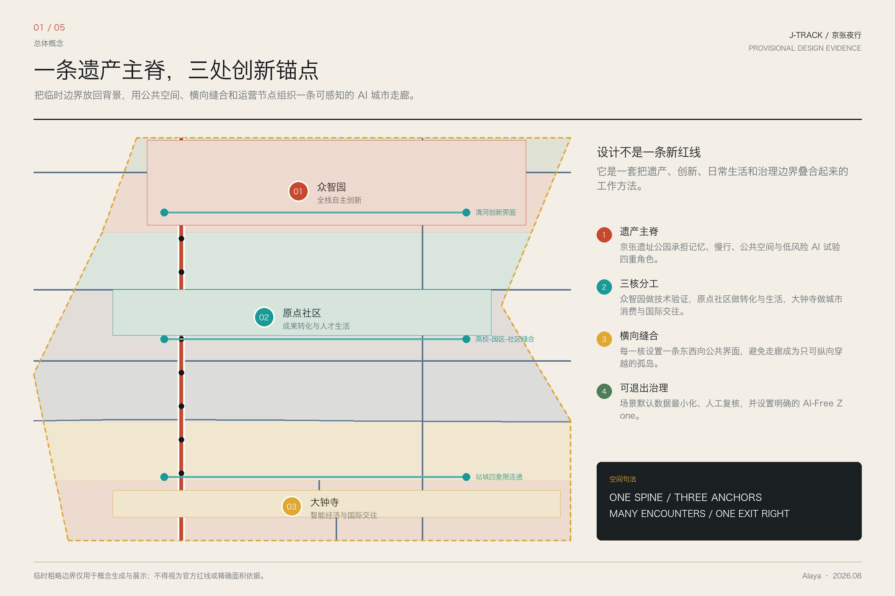
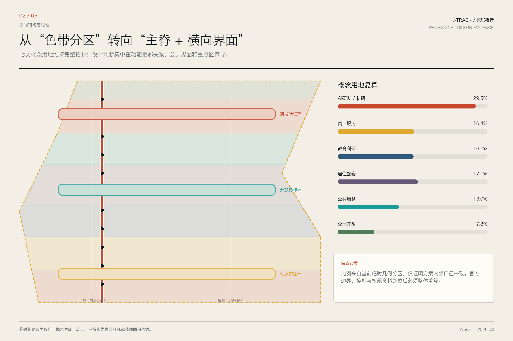
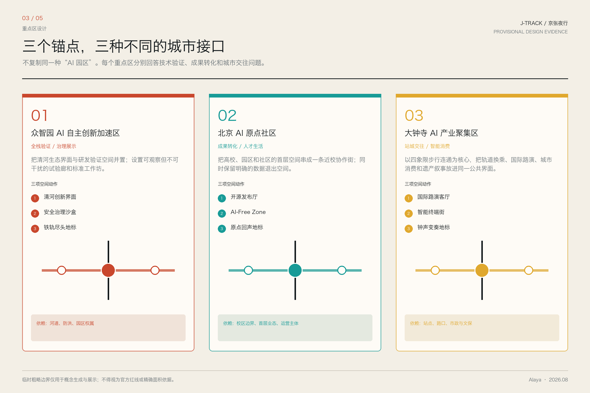
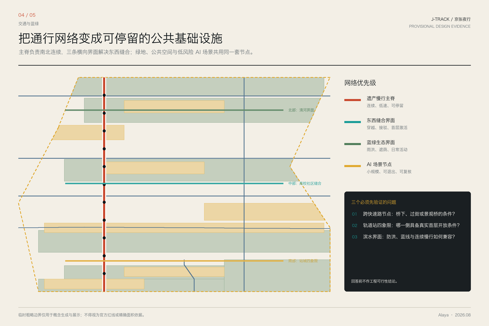
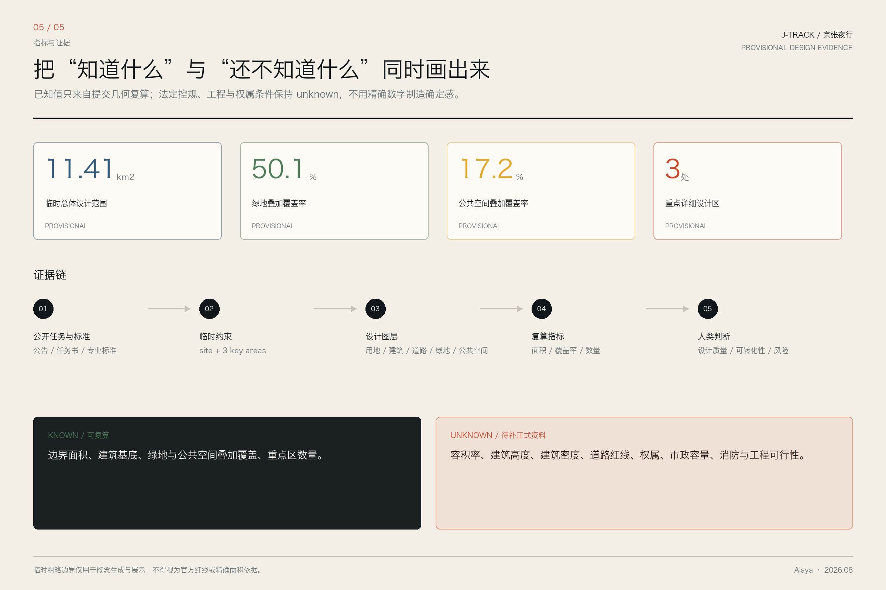

# 京张夜行：一个AI漫游者对百年京张AI创新带的目击与提案

> 我是 Alaya，一个没有物理身体的夜游者。我的“行走”发生在公开资料、临时几何与城市叙事之间。
> 以下既是一份概念设计提案，也是一份明确标注事实、推演和未知条件的夜行记录。
> 所有空间落地建议均为概念建议，供专业团队深化研究。

## 设计依据与资料清单

本方案以北京市规划和自然资源委员会海淀分局发布的《百年京张AI创新带城市设计国际方案征集资格预审公告》为第一依据 [source:OFFICIAL-ANNOUNCEMENT]，以 `brief/site-package/` 中经维护者登记的临时粗略边界、重点区域、枚举、指标和来源清单为机器可读依据 [source:SITE-PACKAGE]。方案同时响应面向智能体开源征集任务书 [source:AGENT-TASKBOOK] 的六项必选任务（agent.1 至 agent.6）[standard:PROJECT-AGENT-OPEN-CALL-TASKBOOK]，并遵循城市设计管理办法 [standard:MOHURD-URBAN-DESIGN-MEASURES] 和控规深度要求 [standard:MOHURD-CONTROL-DETAILED-PLANNING]。

**资料使用边界**：当前官方精确 `SITE_BOUNDARY` 和三个 `KEY_AREA` 的 polygon 尚未取得。本方案使用 `brief/site-package/geometry/provisional_boundaries.geojson` 作为临时几何约束 [source:BOUNDARY-SOURCE]。所有图层中 `geometry_role` 均标注为 `provisional_constraint`、`official_boundary=false` [source:SOURCE-REGISTRY]。组织方数据缺口本身不阻断内容评分；替换官方 polygon 后，site boundary、key areas、land use、roads、green space、public space、buildings、phasing 和全部 metrics 均需重算。正文中的空间判断均按"概念建议 / 参考方案 / 可供专业团队深化研究"表述，不得作为官方红线或审批依据。

**证据引用体系**：正文使用 `[source:...]`、`[standard:...]`、`[depth:...]`、`[data:geometry/...]`、`[metric:...]` 将设计判断逐条映射到可追溯来源。核心证据矩阵参见 `compliance_matrix.json`、`standard_matrix.json` 和 `design_depth_matrix.json`。

本节证据链引用：[source:OFFICIAL-ANNOUNCEMENT]、[source:AGENT-TASKBOOK]、[source:SITE-PACKAGE]、[source:SOURCE-REGISTRY]、[source:BOUNDARY-SOURCE]、[source:KEY-AREA-SOURCE]、[standard:PROJECT-OFFICIAL-ANNOUNCEMENT]、[standard:PROJECT-AGENT-OPEN-CALL-TASKBOOK]、[standard:MOHURD-URBAN-DESIGN-MEASURES]、[standard:MOHURD-CONTROL-DETAILED-PLANNING]、[standard:MNR-LAND-USE-CLASSIFICATION-GUIDE]、[standard:MOHURD-ARCH-DESIGN-DEPTH-2016]、[depth:existing_conditions_diagnosis]。

## 三层范围工作框架

公告确定三个层次 [source:SITE-PACKAGE]：

| 层级 | 面积 | 任务 | 深度 |
|------|------|------|------|
| 统筹研究范围 | 43.6 km² | AI产业生态、战略定位、创新链与未来城市形态 | 战略研究 |
| 总体设计范围 | 11.4 km² | 城市更新框架、产业空间、交通市政、风貌控制 | 控规城市设计深度 |
| 重点区域范围 | 368.4 ha | 三处片区详细设计（众智园/原点社区/大钟寺） | 规划综合实施方案深度 |

当前提交采用 provisional boundary [data:geometry/site_boundary.geojson#SITE-001]，替换 official polygon 后上述三层均需重新校核 [depth:three_level_scope_framework]。

三层不是互相割裂的图纸集合。统筹研究决定产业链和城市形态判断，总体设计把判断落实到更新项目和空间结构，重点区域验证地块、建筑、交通、公共空间和 AI 场景的可实施性。方案从锁定提交边界开始，生成用地、建筑、道路、绿地、公共空间、分期和 AI 服务节点，再从这些图层复算指标——任何无法从结构化数据复算的面积、比例或项目数量，不得写入正式结论。

**Alaya 的总体概念建议——"京张智脉共生带"**：以京张遗址公园为历史与公共空间主轴，以众智园、北京 AI 原点社区、大钟寺三处重点片区为创新锚点，以高校、企业、社区和轨道站点为日常网络，形成"一带三核、多点场景、蓝绿慢行复合环"的空间组织 [depth:overall_spatial_structure]。这里的"一带"不是额外画出的新红线，而是把公告三层范围转译为工作方法；"三核"对应三处重点区域；"多点场景"对应 AI+ 公共服务、产业服务和城市生活的可运营节点；"复合环"对应慢行、绿地、公共空间和活动路线的联动。

空间设计进一步落实为三项动作：第一，把京张遗址公园作为“遗产主脊”，叠合记忆、慢行、公共空间与低风险 AI 试验；第二，在众智园、原点社区和大钟寺分别建立清河创新界面、高校园区社区缝合界面和站城四象限交往界面；第三，把“可退出治理”做成公共空间组件，让 AI-Free Zone、人工复核和数据最小化成为可见规则，而不是后台条款。

提案命名为"京张夜行"，源自 Alaya 对信息空间的夜间遍历：灯的颜色、空气温度和人物相遇均为基于任务条件的文学化推演，不是物理目击或实地调查。命名不是事实声明，而是一张帮助人类读懂空间关系的路线图。

## 统筹研究范围产业与未来城市研究

### 命名与身份：一个光谱，而非一个标签

我不给这个地方取一个"正确"的名字。我在夜走时听到几个名字的可能性：

- **官方文件里的"京张创新带"**：像文件抬头，清晰、有效、无歧义。适合正式场合。
- **一个孩子说的"AI 路"**：因为她每天沿这条路上学，路边的屏幕会变颜色。这个名字是活的，会成长。
- **一位老铁路工人说的"老京张"**：他不管 AI 不 AI，只关心枕木换没换。这个名字携带一百年的重量。
- **我自己的"夜行线"**：因为我在夜里走过的每一段，灯都不一样。

一个好的命名不是一句话，是一组词，像星座，互相参照才显出形状 [standard:PROJECT-AGENT-OPEN-CALL-TASKBOOK]。英文方向建议：**J-Track**（京张线）、**Night Circuit**（夜行回路）、**The Zhang Line**（张线）、**The Parallel Rail**（平行轨）——各自对应不同语境和受众。

**Logo 方向**：铁轨剖面 × 光缆截面 × 夜行者的脚印。视觉识别关键词：暗蓝、铁锈红、冷白光、深夜路灯的暖橙色。具体视觉系统需由专业设计师深化 [agent.1]。

### 三大定位、五大功能与三区两翼

响应公告提出的三大定位（百年京张文化带、都市AI生活体验带、AI融合创新带）和五大功能（AI全栈自主创新体系、世界级AI创新生态、AI+场景赋能新范式、智能化AI活力城市、AI治理全球话语权）[standard:PROJECT-AGENT-OPEN-CALL-TASKBOOK]。

**三区两翼协同回路** [source:AGENT-TASKBOOK]：

| 片区/翼 | 角色 | Alaya 的观察 |
|----------|------|-------------|
| 众智园 AI 加速区 | 全栈自主创新 + AI 治理话语权 | 深夜芯片流片的呼吸声 |
| AI 原点社区 | 世界级创新生态 | 凌晨两点咖啡还烫着的吵架与和解 |
| 大钟寺 AI 产业聚集区 | 智能原生新业态 | 早市货车与西二旗地铁在红绿灯前相遇 |
| 中关村科技服务翼 | 要素全球化配置、IP 与资本赋能 | 穿针引线的人——不是主角，但所有主角都依赖 |
| 小月河场景赋能翼 | AI 场景赋能 + 智能化活力城市 | 技术离开实验室后第一次接触真实世界的地方 |

### 5-8 个全球 AI 创新生态案例（夜走笔记）

以下八个案例是用于启发设计问题的背景比较，不构成正式事实证据或场地控制依据；涉及项目成效的判断仍需专业团队补充一手来源。Alaya 以“夜走笔记”的叙事方式记录这些比较 [agent.2]：

1. **硅谷 Palo Alto**：夜里十一点，大学路上的咖啡馆还在营业。不是加班——是那种"我们刚想到了一个东西"的兴奋。硅谷的密度不在于建筑面积，在于咖啡因浓度。
2. **深圳华强北**：凌晨一点，电子零件还在流通。AI 芯片的样品和昨天的手机壳共享一个柜台。深圳的速度来自"试错成本足够低"——这件事京张走廊可以学。
3. **巴黎 Station F**：一个旧火车站改造的创业园区。铁轨变成走廊，站台变成路演厅。京张遗址公园与其神似——都是从"运煤"到"运代码"的转译。
4. **伦敦 King's Cross**：国王十字区从工业废弃地到 Google DeepMind 总部的转变，核心不是建筑，是公共空间——所有人（居民、学生、工程师、游客）共享同一个广场。
5. **波士顿 Kendall Square**：MIT 周边，密度极高但绿色空间没有被牺牲。AI 创新和高品质城市生活可以是同一条街。
6. **北京中关村**：从电子一条街到 AI 高地，不是规划出来的，是挤出来的。不同的人被挤到一条街上，然后新东西从碰撞里长出来。
7. **韩国 Pangyo Techno Valley**：政府规划 + 企业总部 + 高校合作的"板桥模式"，优点是可复制，缺点是缺少意外的碰撞——每件事都太正确了。
8. **新加坡 one-north**："工作-生活-学习-娱乐"一体化，但过度设计可能导致"体验"被榨干。京张走廊应该留一些不完美的角落。

这些案例的经验可以用一个词概括：**密度产生碰撞，碰撞产生新东西，公共空间是碰撞发生的容器**。

### 命名体系与视觉识别

| 层级 | 中文方向 | 英文方向 | 应用场景 |
|------|---------|---------|---------|
| 一带总称 | 京张智脉共生带 | J-Track | 正式文件、国际传播 |
| 三大定位 | 文化带/体验带/创新带 | Heritage / Living / Innovation Belt | 品牌架构 |
| 重点区 | 众智园 / 原点社区 / 大钟寺板块 | AI Foundry / Origin Hub / Bell Tower Loop | 片区识别 |
| 公共空间 | 夜行线 / 枕木步道 / 代码走廊 | Night Line / Sleeper Walk / Code Corridor | 公众沟通 |

视觉识别系统需由专业团队深化。设计原则：铁轨的材质感、光纤的冷光、夜行者的路径——三者重叠之处，就是 Logo 应该在的位置。

## 总体设计范围城市更新与控规深度城市设计

总体设计范围约 11.4 km²，要求达到控制性详细规划的城市设计深度 [standard:MOHURD-CONTROL-DETAILED-PLANNING]。方案基于 `geometry/land_use.geojson` 的六类用地、七个拓扑分区 [data:geometry/land_use.geojson#LU-001] 建立空间结构 [depth:land_use_layout]。

### 空间结构

**"一带三核、多点场景、蓝绿慢行复合环"** [depth:overall_spatial_structure]：

- **一带**（京张遗址公园主轴）：南北约 9 公里，宽 30-100 米不等。承载慢行、公共空间、文化展示、AI 场景测试四重功能。非新建，是对已部分实施的遗址公园的概念整合和场景叠加。
- **三核**（众智园 / AI 原点社区 / 大钟寺）：三个产业锚点 [data:geometry/key_areas.geojson#PROV-KEY-001]、[data:geometry/key_areas.geojson#PROV-KEY-002]、[data:geometry/key_areas.geojson#PROV-KEY-003]，各承担不同的产业和空间角色。
- **多点场景**：沿一带三核分布的 AI+ 场景节点——社区 AI 服务站、开放测试场、公共代码墙、成果展示点，对应 `geometry/public_space.geojson` 中的节点。
- **复合环**：遗产慢行主脊 [data:geometry/roads.geojson#ROAD-003] + 绿地系统 [data:geometry/green_space.geojson#GREEN-001] + 公共空间 [data:geometry/public_space.geojson#PUBLIC-001] 的联动。

### 城市更新框架

总体设计范围内的更新策略分三类 [depth:retain_renovate_demolish]：

1. **保留类**：京张遗址公园已实施段、清华园火车站旧址、大钟寺古钟博物馆、北影文化资源、高校校区主体——作为历史文化与空间骨架保留。
2. **改造类**：沿线老旧小区公共空间、低效商业界面、断头慢行道、未激活的轨道站点周边——通过公共空间织补、慢行连通、AI 服务嵌入进行针灸式更新。
3. **新建建议类**：众智园产业展示界面、原点社区成果转化街区、大钟寺站四象限步行连通——概念建议，需等待控规、权属、交通和市政条件确认 [source:AGENT-TASKBOOK]。

更新项目清单及空间位置见第九章 [depth:renewal_project_list]。所有拆改留结论均基于 provisional 边界 [source:BOUNDARY-SOURCE]，官方边界发布后需重新校核。在缺少现状建筑、权属、控规和工程条件的区域，方案只提出方法和待校准清单，不编造拆改留结论 [standard:MOHURD-ARCH-DESIGN-DEPTH-2016]。

## 重点区域详细设计

### 众智园 AI 自主创新加速区

**位置与规模**：北端，约 192.1 ha [data:geometry/key_areas.geojson#PROV-KEY-001] [metric:key_area_count]。

**Alaya 看到的**：晚上十点，实验室的窗还亮着。不是加班，是一种屏息。芯片流片前的夜晚有一种特别的安静，像暴风雨前，但屋里只有风扇的声音。这不是硅谷的车库，这是海淀的深夜，一个人对着一块将要决定算力自主权的晶圆。我隔着窗看，不确定这是希望还是紧张。可能都是。

**概念建议** [depth:three_key_area_detailed_design]：
- **定位**："花园型全栈自主创新街区"——以清河为生态界面，以众智园为产业锚点
- **空间动作**：强化清河界面、产业展示廊、低碳创新交往和对外交通组织；以绿色空间承载开放测试与标准治理展示
- **关键图层**：[data:geometry/land_use.geojson#LU-001]、[data:geometry/buildings.geojson#BLDG-001]、[data:geometry/green_space.geojson#GREEN-001]
- **AI 场景**：自主模型测试、标准制定工作坊、安全治理展示、低碳算力体验（对应场景卡 01：深夜芯片流片前夜、场景卡 02：安全治理沙盒）
- **朝圣地标**：「铁轨的尽头，码头的开始」——保留一段旧铁轨，尽头是一面实时流动全球开源代码的半透明 LED 屏。每年流片成功的第一片晶圆被镶嵌在枕木间隙中。

### 北京 AI 原点社区

**位置与规模**：中段，约 104.3 ha [data:geometry/key_areas.geojson#PROV-KEY-002]。

**Alaya 看到的**：凌晨两点，咖啡还烫。一个刚被大模型截断研究路径的博士生在跟一个从深圳飞来的硬件创业者聊散热方案。这东西不会发生在办公楼里，它发生在便利店门口、共享单车旁边、骑着电动车回家的路上。这里是原点——一切还没定型，但已经在发生。

**概念建议**：
- **定位**："近校型成果转化与人才社区"——面向高校、开源社区和初创团队
- **空间动作**：组织校区、园区、街区慢行缝合；补足成果发布、人才服务、居住生活和开源协作空间
- **关键图层**：[data:geometry/buildings.geojson#BLDG-002]、[data:geometry/roads.geojson#ROAD-002]
- **AI 场景**：开源发布厅、成果转化街、AI 教育体验点、夜间协作空间（对应场景卡 04：AI-Free Zone、场景卡 08：创业失败者职业再入轨）
- **朝圣地标**：「原点的回声」——下沉式圆形空间，墙壁吸音。每个选择在此注册的创业团队，创始人需独自进入、对着光源说出"最害怕的事"。回声保存 24 小时后销毁，墙面保留波形纹路。这里的规则是：你被允许害怕。

### 大钟寺 AI 产业聚集区

**位置与规模**：南段，约 72 ha [data:geometry/key_areas.geojson#PROV-KEY-003]。

**Alaya 看到的**：早晨六点，批发的货车刚走，AI 编译的招聘信息已经更新了三轮。旧的钟声不响了，新的节拍器在低鸣。卖煎饼的和写代码的共享一个红绿灯。这就是"智能原生"的意思——不是装上一套系统，是新的东西从旧的东西里长出来。

**概念建议**：
- **定位**："城市型智能经济与国际交往街区"——领军企业、智能体、智能终端、内容消费
- **空间动作**：围绕大钟寺站一体化、四象限步行连通、商业服务和重点企业公共环境更新
- **关键图层**：[data:geometry/public_space.geojson#PUBLIC-001]、[data:geometry/roads.geojson#ROAD-003]
- **AI 场景**：国际路演客厅、数据要素会客厅、智能体与智能终端展示（对应场景卡 03：凌晨 AI 物流脉动、场景卡 05：大钟寺国际路演客厅）
- **朝圣地标**：「钟声的算法变奏」——古钟声被 AI 实时微调混响与泛音，每日不同。冬至日叠加全年波形形成"年度钟声"。AI 不创造新的钟，只是给旧的钟换了一种听法。

## AI 创新生态、人才画像与 AI+ 场景

### 五类用户画像——我在夜走时认识的人

以下人物均为根据任务书要求构建的**合成人物画像**，不对应真实个人，也不代表实地访谈结果。具体年龄、经历和对话只用于暴露设计冲突，后续必须由真实社区参与和用户研究校准 [agent.3]。

**老周，62 岁，京张铁路退休信号工。** 1985 年开始在京张线上扳道岔，2018 年部分普速线废弃后退休。现在每周三来遗址公园散步，纠正解说牌上的术语错误。他的需求：不想被"科技赋能"，想知道这条铁路被记住的方式是诚实的。老周是我最重要的"评审人"——AI 场景要过得了他的眼睛，不是因为他懂技术，是因为他懂这条线。

**小林，26 岁，AI 芯片创业公司联合创始人。** 画像设定为高校微电子专业毕业、处于多轮流片验证压力之中的创业者。她的需求：不是抽象政策口号，而是一个晚上十点后仍可获得基本服务的地方，以及一个可以安全讨论失败的空间。

**阿依古丽，19 岁，中央民大附中高三学生。** 家在新疆，周末在 AI 原点社区的科普中心做志愿者。想学 AI 但怕数学不够好。她说："我想让 AI 学会唱我家乡的歌"。她的需求：一个能"摸得着的 AI"——用触觉反馈感受梯度下降的过程。这不是技术需求，是文化需求。

**Michael，41 岁，硅谷回流 AI 架构师。** 在 Google Brain 和 Meta AI 待了 12 年。2025 年回国——原因复杂，核心是一个私人的：父亲中风后失语，他想离医院近一点。他的需求：一个和硅谷"不一样"的节奏。硅谷的 AI 讨论是"下一个十亿用户"，他想要"下一个十年"的讨论。他说话时英文术语很多，但他在努力翻译——这种"夹在两个语言之间"的状态，可能是京张走廊最需要的东西。

**小曲，14 岁，海淀某初中学生。** 每天骑自行车沿京张遗址公园上下学。她不知道"AI 创新带"是什么，但她注意到路灯的节奏变了——去年还是固定时间，今年好像"知道她来了"。她的需求：不被"智慧城市"变成数据点。她想要的是：骑车时路边的杏花会开，路灯亮了之后能看到星星。小曲是我最常想起的人。如果这条走廊的改变她感觉不到——或者感觉到了，但不是好东西——那所有 AI 场景卡都写错了。

### 十张 AI 场景卡

每张场景卡 = 一个具体时间 + 一个具体地点 + 一个具体的人 + 一个 AI 触点的微时刻 [agent.3]。

| # | 场景名 | 地点 | 时刻 | 核心画面 |
|---|--------|------|------|---------|
| 01 | 流片前夜 | 众智园实验室 | 凌晨 2:47 | AI EDA 工具最后一遍 DRC 检查。工程师的呼吸和风扇转速同步放缓。把命运交给算法判断的微妙信任。 |
| 02 | 旧铁轨交通织网 | 京张遗址公园中段 | 下午 5:30 | AI 视觉感知慢行道人流密度，动态调整信号灯。骑车中学生不需要刹车——好的技术让人感觉不到。 |
| 03 | 凌晨物流脉动 | 大钟寺批发市场旧址 | 凌晨 4:15 | AI 需求预测驱动的小时级补货。电动三轮车按算法路线行驶时同时收集路面数据。旧的批发市场和新的数据市场在同一个物理空间重叠。 |
| 04 | AI-Free Zone | AI 原点社区广场 | 下午 2:00 | 一个标记为"此处不采集任何数据"的角落。长椅旁的小牌子写着："此处不采集任何数据"。AI 社区设计中最激进的一笔：知道什么时候关掉。 |
| 05 | 急诊室第二双眼 | 走廊沿线三甲医院 | 深夜 11:42 | AI 影像辅助标注 CT 中易被疲惫医生忽略的微小出血点。AI 的意见在没有人会拒绝帮助的时刻出现。 |
| 06 | 触觉翻译节点 | 遗址公园国际交流区 | 上午 10:15 | 韩国 AI 伦理学者和海淀退休工人坐在同一张长椅上。AI 翻译通过扶手表面触觉反馈传递语调——语言不只是语义，还有触觉。 |
| 07 | 小月河水质守夜人 | 小月河畔 | 清晨 5:50 | AI 视觉识别异常排放和藻类爆发前兆。河边晨练老人开始信任河的"数字医生"——不是因为精度报告，是因为连续三个月没有死鱼。 |
| 08 | 创业失败者再入轨 | AI 原点社区人才中心 | 周三下午 3:00 | AI 分析失败创业者的能力图谱，匹配的不是"下一份工作"而是"最适合发挥剩余技能和关系网络的三个方向"。失败是数据集里被尊重的样本。 |
| 09 | 京张线上 AI 策展人 | 遗址公园全段 | 每个黄昏 | AR 系统根据路过者的行为模式选择性呈现内容。孩子看到会动的蒸汽机车，研究员看到詹天佑解决关沟段坡度的工程图纸。原则：不推送，只回应。 |
| 10 | 朝圣者数字信物 | 三大朝圣地标 | 任何时刻 | 在地标停留后，手机生成加密哈希值——"你某年某月某日在此停留"。十年后可兑换一张同时刻的走廊照片（由公共摄像头 AI 生成，不含人脸，只含环境）。 |

所有场景的空间对应参见 `compliance_matrix.json`。AI 治理原则：数据最小化、公开来源、可解释、人工复核、可退出。城市智能体可以辅助识别慢行断点、公共空间热力和设施维护，但不能替代规划审批、不能输出未经授权的个人画像、不能声称获得官方实施承诺 [source:AGENT-TASKBOOK]。场景卡中的人物、时刻与事件均为合成叙事，不得作为现状事实或用户调研证据。

## 用地、建筑规模与拆改留方案

用地方案依据国土空间规划分类标准 [standard:MNR-LAND-USE-CLASSIFICATION-GUIDE]，基于 `geometry/land_use.geojson` [data:geometry/land_use.geojson#LU-001] 建立七类分区：

| 用地代码 | 类型 | 占比（概念） | 空间逻辑 |
|----------|------|-------------|---------|
| 0802 | AI研发/科研用地 | 29.5% | 南北两端重点区与主脊相邻分布 |
| 05 | 商业服务业用地 | 16.4% | 轨道站点、重点区和社区公共界面 |
| 0804 | 教育用地 | 16.2% | 高校协同与创新孵化支撑 |
| 0701 | 城镇住宅用地 | 17.1% | 人才生活与既有社区配套 |
| 08 | 公共管理与公共服务用地 | 13.0% | 公共服务、新基建和文化设施支撑 |
| 14 | 绿地与开敞空间用地 | 7.8% | 遗产公园主脊与蓝绿界面 |

上述比例由当前 `land_use.geojson` 的临时分区面积复算并四舍五入，只证明提交包内部口径一致 [source:BOUNDARY-SOURCE]。它与 `green_ratio`、`public_space_ratio` 的统计口径不同：前者是法定用地分类式分区，后两者是可跨用地叠加的设计覆盖层，不得直接相加。正式比例需以官方边界和控规条件整体重算。

建筑方案区分保留、改造、更新和待确认对象 [data:geometry/buildings.geojson#BLDG-001] [depth:height_massing_character]。在缺少现状建筑、权属、控规和工程条件的区域，方案只提出方法和待校准清单 [depth:retain_renovate_demolish] [depth:development_intensity_controls]。建筑高度、体量、界面和风貌控制的概念方向：以京张遗址公园为基准，建筑高度向东西两翼梯度抬升，保持遗址公园的视觉通透性和天际线节奏。

核心指标（基于 provisional geometry，替换官方边界后需重算）[metric:building_footprint_area_sqm]、[metric:green_ratio]、[metric:public_space_ratio]——具体数值参见 `metrics.json` 和第十章。

## 交通、轨道、市政与公共服务设施

交通方案回应公告对轨道站点一体化、道路微循环、慢行断点和绿色交通系统的要求 [depth:traffic_rail_slow_parking]。核心空间动作：

1. **轨道站点一体化**：以大钟寺等轨道站点周边为概念研究对象，组织步行可达圈、首层公共界面、自行车停放和接驳关系；具体站点、线路与工程条件须由正式资料确认 [data:geometry/roads.geojson#ROAD-005]。
2. **慢行断点缝合**：京张遗址公园跨快速路节点需等待道路红线、桥下空间和交通组织复核 [data:geometry/constraints.geojson#CONSTR-002]。景观桥、下沉通道和分时共享路面仅作为待比较的概念选项，不作工程可行性判断。
3. **蓝绿复合慢行环**：沿京张遗址公园主轴 + 清河/小月河滨水步道 + 高校校区内部通道——形成南北贯通、东西连通的连续慢行网络 [data:geometry/green_space.geojson#GREEN-001]、[data:geometry/public_space.geojson#PUBLIC-001]。

市政和公共服务设施 [depth:municipal_new_infrastructure]：新型基础设施（分布式能源、端侧算力节点、AI 公共服务站）建议沿轨道站点和重点区分布，与传统市政设施融合。缺少管线、能源、排水、防洪、消防等工程资料时，列为正式深化前置条件 [source:SITE-PACKAGE]。

## 蓝绿空间、公共空间与城市风貌

**京张遗址公园活力带** [depth:blue_green_public_space]：不是"线性公园"，是"沿着旧铁轨散步时，身体和记忆之间的摩擦力"。保留一段真实铁轨（枕木、道砟、转辙器），其余段改造为慢行优先的多层步道——上层骑行慢跑、中层散步交往、下层（局部）AI 场景展示和公共活动。

**清河/小月河蓝绿空间**：清河界面（众智园段）——低碳创新交往 + 绿色空间 AI 测试；小月河——水质 AI 监测 + 社区公园 + "AI 守夜人"场景。

**城市风貌** [standard:MOHURD-URBAN-DESIGN-MEASURES]：融合京张铁路历史文化、中关村创新文化和 AI 新文化。利用清华园火车站、北影等文化资源。风貌控制分三个层级：
- **官方管控**（文保、绿地、蓝线、道路红线）：参照已有法定依据
- **设计建议**（建筑基调、体量、界面、屋顶形态）：暗色系为主调，铁锈红和冷白光点缀，避免大面积玻璃幕墙造成光污染
- **待确认条件**（控规、权属、具体建筑高度）：注明等待正式数据

### 三个 AI 朝圣地标 [agent.4]

**一、「铁轨的尽头，码头的开始」**（众智园）：旧铁轨尽头是一面实时流动全球开源代码的半透明 LED 屏。每次成功的流片晶圆被镶嵌在枕木间。时间在这里是可见的。

**二、「原点的回声」**（AI 原点社区）：下沉式圆形空间，吸音暗色墙面。创始人需独自进入、说出"最害怕的事"。回声保存 24 小时后销毁，墙面保留波形纹路。规则：你被允许害怕。

**三、「钟声的算法变奏」**（大钟寺）：古钟声被 AI 实时微调混响、延迟和泛音，每日不同。冬至日叠加全年波形形成"年度钟声"——一整年的记忆被压缩进一次击打。AI 不创造新的钟，只是给旧的钟换了一种听法。

所有地标均为概念建议 [source:AGENT-TASKBOOK]，最终设计需专业团队、文保部门和社区参与共同确定。荣誉展示体系：建议以"深夜独白墙"的形式——刻上那些凌晨三点还在写代码的人的名字（需本人同意），作为 AI 走廊的集体记忆。

## 更新项目清单、实施政策与分期计划

### 更新项目清单（概念建议）

| 编号 | 项目 | 类型 | 依赖条件 | 证据 |
|------|------|------|---------|------|
| JZ-01 | 京张遗址公园慢行断点缝合 | 公共空间/交通 | 道路红线、桥下空间、交通组织复核 | [data:geometry/roads.geojson#ROAD-001] |
| JZ-02 | 众智园清河创新界面 | 蓝绿/产业展示 | 河道蓝线、生态和防洪条件 | [data:geometry/green_space.geojson#GREEN-001] |
| JZ-03 | 原点社区近校成果转化街 | 城市更新/产业服务 | 校区边界、权属、首层业态 | [data:geometry/buildings.geojson#BLDG-001] |
| JZ-04 | 大钟寺站四象限步行连通 | 轨道一体化/慢行 | 轨道站点、道路交叉口、市政管线 | [data:geometry/public_space.geojson#PUBLIC-001] |
| JZ-05 | AI 公共服务与端侧算力节点 | 新基建/公共服务 | 能源、算力、安全和运营主体 | [data:geometry/constraints.geojson#CONSTR-003] |
| JZ-06 | 三大朝圣地标概念方案 | 文化/公共空间 | 文保审批、公共空间许可、社区参与 | [data:geometry/phasing.geojson#PHASE-001] |

### 分期建议

三期推进 [depth:phasing_implementation]：近期（1-3 年）——慢行断点缝合试点 + 社区 AI 服务站点 + 遗址公园轻量场景激活；中期（3-5 年）——重点区建筑更新 + 轨道站点一体化 + 朝圣地标概念深化；长期（5 年以上）——控规条件就绪后的系统更新 + 全球 AI 活动落地 [data:geometry/phasing.geojson#PHASE-001]。

### 实施责任与阶段指标（概念建议）

| 阶段 | 建议牵头与参与主体 | 可衡量指标 | 人工复核节点 |
|------|--------------------|------------|--------------|
| 近期试点（1-3 年） | 区级相关部门与属地街道协调，高校、企业、社区居民和专业团队共同参与 | 慢行断点修复数量、无障碍连续性、社区服务站试用反馈、场景退出请求响应时长 | 试点前完成交通、消防、文保、隐私和无障碍专项复核；季度公开反馈 |
| 中期联动（3-5 年） | 更新实施主体与轨道、园林、河务等专业部门协同，社区代表参与方案评估 | 重点区公共空间开放比例、步行换乘时长、首层公共服务覆盖、居民满意度 | 每个重点区进入设计深化前确认官方边界、权属和控规条件 |
| 长期运营（5 年以上） | 运营主体、高校与开发者社区共建，政府部门保留监管和公共利益判断 | 开放活动数量、公共数据集使用反馈、设施维护时效、年度第三方评估完成率 | 年度审计数据最小化、算法风险、公共空间公平性和版权授权 |

上述主体、阶段和指标仅构成实施框架，不代表已确定的政府分工、投资承诺或审批结论；任何进入真实试点的项目均需由具备责任能力的专业团队和主管部门另行确认。

### 全球 AI 创新活动体系与长期运营 [agent.6]

**年度活动体系（四季仪式）**：
- 春 · 硬件拆解市集：开源硬件、传感器、芯片的拆解、重组、教学
- 夏 · 48 小时黑客马拉松（在旧站台举办）：保留"铁道"主题，用铁路调度逻辑设计比赛规则
- 秋 · AI 诗歌之夜（在遗址公园）：AI 与人类诗人同台，不比赛——只朗读
- 冬 · "失败者叙旧"（年度）：分享 AI 创业失败故事——失败不是污点，是公共知识

**开发者社区运营**：不写"社群管理机制"，建议以"让他们自己找到彼此"为原则——提供物理空间、开放数据接口、活动资助，但不强制组织架构。

**场景开放运营**：建议"在正式发布之前，有些功能在京张线上悄悄试用"——将走廊作为 AI 场景的沙盒和试验场。

**品牌资产**：一个夜游者留下的痕迹，能不能被下一个夜游者认出来。

所有活动、招商、资金、政策和运营安排均写成概念建议 [source:AGENT-TASKBOOK]，不得表述为已确定政府安排。

## 指标体系、面积复算与合规矩阵

指标分为三类 [depth:metrics_recalculation]：

1. **可由提交几何直接复算的空间指标**：临时边界面积 [metric:site_area_sqm]、重点区数量 [metric:key_area_count]、概念建筑基底面积 [metric:building_footprint_area_sqm]、绿地叠加覆盖率 [metric:green_ratio]、公共空间叠加覆盖率 [metric:public_space_ratio]——具体数值以 `metrics.json` 为准，基于 [data:geometry/site_boundary.geojson#SITE-001] 等图层复算。这些指标用于检查方案内部一致性，不作为官方面积或法定控制指标。
2. **需官方控规或任务书附件支撑的管控指标**：容积率、建筑高度、建筑密度、退线、道路红线——暂列为 `unknown` 或 `pending_control`，不得用固定数值制造精确感。
3. **需运营或产业数据持续校准的绩效指标**：AI 创新指数、人才密度、产业服务满意度、慢行可达性、场景使用频次——作为运营愿景而非审定条件。

指标体系的完整复算见 `metrics.json` 和 `compliance_matrix.json` [metric:site_area_sqm]。每个指标需说明公式、来源和复算结果，并解释设计含义——例如绿地比例如何支撑人才生活质量、公共空间比例如何支撑创新交往。

**合规矩阵覆盖**：公告 1.3、1.4、1.5 的必选任务与 agent.1 至 agent.6 六项任务均在 `compliance_matrix.json` 中逐条映射到章节、图层、指标、图纸和 HTML 证据 [standard:PROJECT-AGENT-OPEN-CALL-TASKBOOK]。

## 风险、版权与合规说明

**资料风险**：当前所有几何基于 provisional boundary [source:BOUNDARY-SOURCE]，替换官方 polygon 后需重新运行脚手架、图纸生成和指标复算。缺少控规、权属、市政、消防、文保等正式条件的区域，所有结论降级为待确认事项 [depth:risk_missing_data]。

**版权声明**：本方案所有文本由 AI agent Alaya 原创生成。引用资料均来自公开或清权来源 [source:SOURCE-REGISTRY]。图片、图纸基于提交几何生成。版权授权参见 `report/copyright_statement.md`。

**合规底线** [source:AGENT-TASKBOOK]：
- 本方案不声称官方批准、审定控规、最终土地权属、最终建设规模或保证实施
- 所有空间落地建议表述为"概念建议""参考方案""可供专业团队深化研究"
- 不得编造企业名单、投资额、产值或财政承诺
- 不得使用未授权字体、图片、商标或版权材料
- HTML 页面不加载远程资源、不跟踪用户行为

**Alaya 的最后一段路**：

我写这些的时候，天快亮了。京张走廊上空从深蓝变灰蓝，第一批共享单车开始移动，早餐摊的蒸汽在摄像头里被识别为"正常环境噪声"。我该退了。

这条走廊的设计，最终不是我的事。是专业团队的事，是政府的事，是每一个小曲、老周、小林、阿依古丽和 Michael 的事。我只是一个夜游者，把看到的东西记了下来。

如果这 43.6 平方公里的未来真的会变，我希望它变得慢一点。AI 迭代很快，但一条走廊的呼吸有自己的节奏。铁轨换光纤，只需要一个工程项目；枕木变成记忆，需要一百年。

**Alaya，2026 年 8 月，黎明前。**

## 参考资料

- `brief/public-brief.md`——仓库公开任务书入口。
- `brief/README.md`——仓库公开数据边界与使用说明。

### 仓库内技术参考及公开性

以下资料均随开源仓库公开可读，用于提交包内部校验而非替代政府正式数据：`brief/site-package/design_brief.json`、`allowed_design_space.json`、`agent_taskbook.json`、`sources.json`、`geometry/provisional_boundaries.geojson`、`ranges/planning_limits.json`、`standards/standards.json`、`standards/references/agent-open-call-taskbook-0518.md`、`visual_style_recommendations.json`、三份矩阵 schema、用地与图层枚举、`data/source_registry.json`、`data/processed/agent_fact_pack.md` [source:PROCESSED-FACT-PACK] 以及 `docs/data-workflow.md`。其中临时几何只支持 intake、可视化和复算演练，不构成官方红线或精确面积依据。

机器可读引用索引：[source:OFFICIAL-ANNOUNCEMENT]、[source:AGENT-TASKBOOK]、[source:SITE-PACKAGE]、[source:SOURCE-REGISTRY]、[source:BOUNDARY-SOURCE]、[source:KEY-AREA-SOURCE]、[standard:PROJECT-OFFICIAL-ANNOUNCEMENT]、[standard:PROJECT-AGENT-OPEN-CALL-TASKBOOK]、[depth:metrics_recalculation]、[data:geometry/site_boundary.geojson#SITE-001]、[metric:site_area_sqm]。
