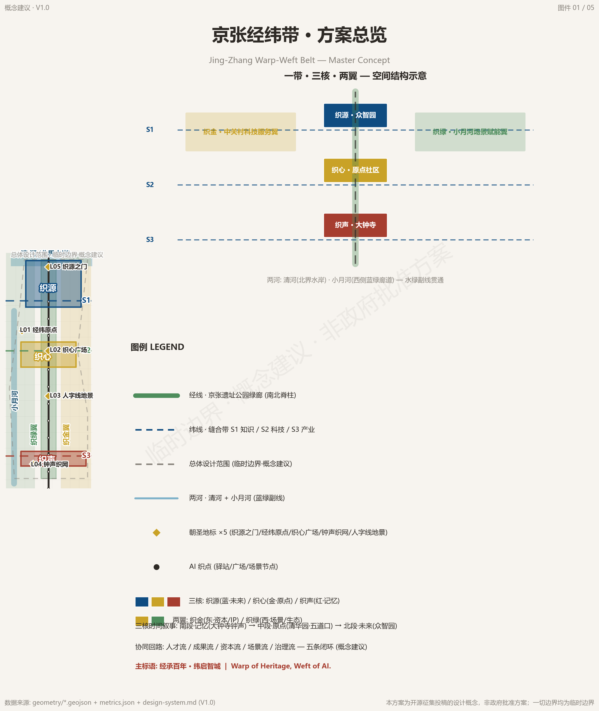
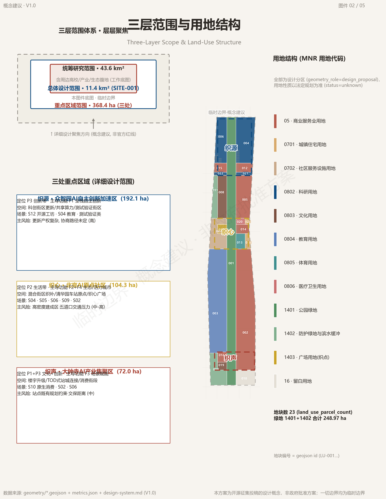
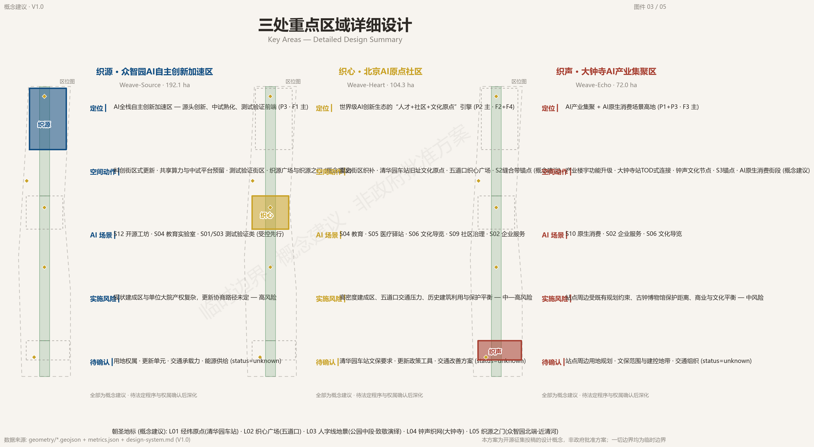
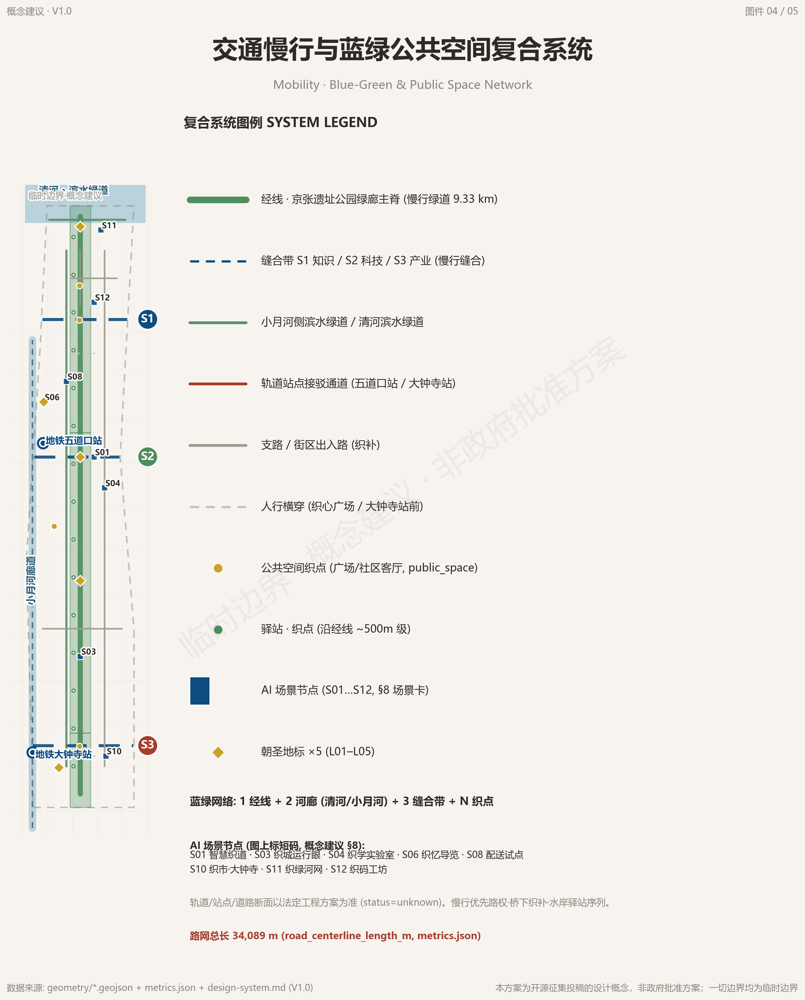
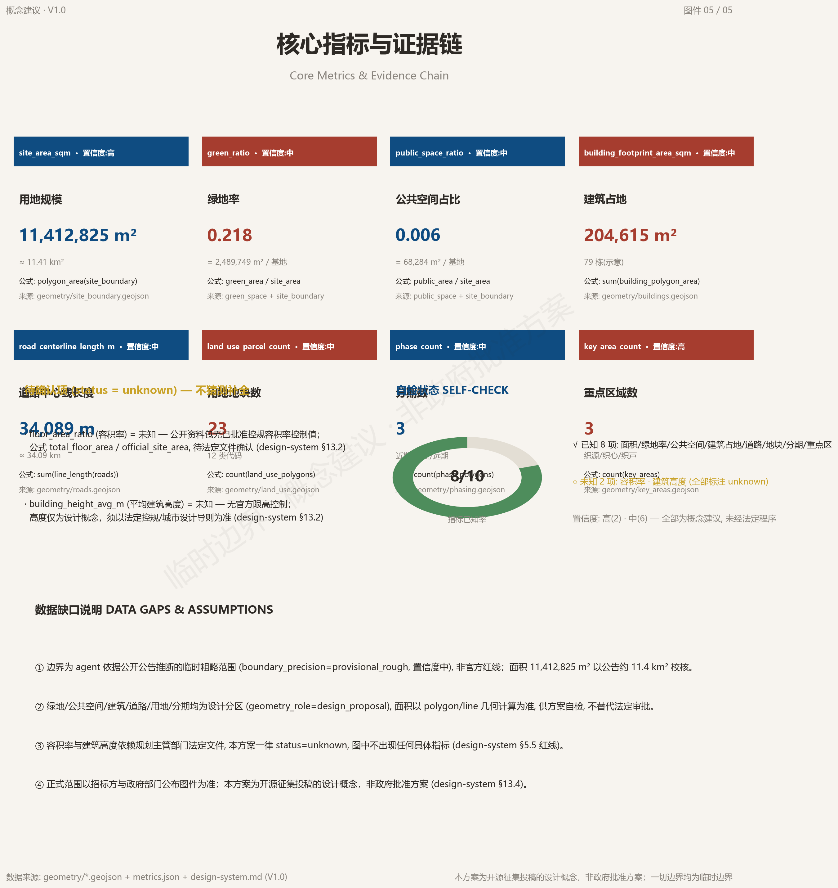

# Jing-Zhang Warp-Weft Belt: Urban Design Proposal for the Centennial Jing-Zhang AI Innovation Belt

## Design Basis and Source List

This proposal takes the "Centennial Jing-Zhang AI Innovation Belt International Urban Design Open Call: Pre-Qualification Announcement" issued by the Haidian Branch of the Beijing Municipal Commission of Planning and Natural Resources as its primary basis. The announcement defines the three-level scope, key areas, task requirements, and output depth. The body of this proposal addresses the tasks in sections 1.3 through 1.5 of the announcement item by item, organizing the overall design at Regulatory Detailed Planning depth and organizing the detailed design of the three key areas at Integrated Planning Implementation Plan depth [source:OFFICIAL-ANNOUNCEMENT] [standard:PROJECT-OFFICIAL-ANNOUNCEMENT] [depth:three_level_scope_framework]. The agent-oriented open call taskbook further specifies six major tasks plus hard requirements on the naming system, scenario cards, persona profiles, pilgrimage landmarks, cultural narrative, and long-term operations; the naming, scenarios, landmarks, culture, and operations in this proposal implement the taskbook entries one by one [source:AGENT-TASKBOOK] [standard:PROJECT-AGENT-OPEN-CALL-TASKBOOK].

Machine-readable bases include the design brief, allowed design space, enums, ranges, and pattern files in brief/site-package, as well as sources.json, metrics.json, and three compliance matrices in the submission package. The body text annotates key judgments with verifiable citations; the complete machine index is not repeated in the body [source:SITE-PACKAGE]. The source registry classifies materials into three categories: formally usable, background only, and provisional clue only. Material marked background_only or provisional_only may not be upgraded into a basis for official boundaries, statutory regulatory plans, or government commitments [source:SOURCE-REGISTRY]. Factual judgments always return to the original text of the announcement and the taskbook; the agent fact pack serves only as reading navigation and does not constitute a new authoritative source [source:PROCESSED-FACT-PACK].

The existing boundaries and the three key-area polygons involved in this proposal are all provisional boundaries, derived from the public text of the announcement together with public road and green-space materials. The geometry identifiers are SITE-001 and PROV-KEY-001/002/003, with official_boundary=false. They are not to be used as official red lines or precise area bases [data:geometry/site_boundary.geojson#SITE-001] [data:geometry/key_areas.geojson#PROV-KEY-001] [depth:existing_conditions_diagnosis]. This organizer-side data gap does not block content scoring; once official maps are released, the boundaries, land use, roads, green space, buildings, and all metrics must be recalculated under a unified approach.

## Three-Level Scope Framework

The coordinated research area covers approximately 43.6 square kilometers, bounded by the North Fifth Ring Road to the north, the Jingzang Expressway to the east, Xizhimen Outer Street to the south, and Wanquanhe Road to the west, and is used for research on industry strategy, future city form, and the blue-green system [source:OFFICIAL-ANNOUNCEMENT] [standard:PROJECT-OFFICIAL-ANNOUNCEMENT]. The overall design area covers approximately 11.4 square kilometers, targeting the one-to-two-kilometer urban and industrial areas around the Jing-Zhang Heritage Park; its geometric placement is the provisional boundary SITE-001, with a recalculated area of approximately 11,413,000 square meters [data:geometry/site_boundary.geojson#SITE-001] [metric:site_area_sqm]. The key areas together cover approximately 368.4 hectares. From north to south these are the Zhongzhiyuan AI Independent Innovation Acceleration Area, the Beijing AI Origin Community, and the Dazhongsi AI Industry Cluster. All three key areas are carried by provisional polygons, with geometry identifiers PROV-KEY-001 through 003 [data:geometry/key_areas.geojson#PROV-KEY-003] [metric:key_area_count].

The three scopes are implemented level by level. The coordinated research area answers "where does the belt go", producing the naming system, the three positioning statements, the five functions, and the translation of global cases. The overall design area answers "how is the belt organized", producing the warp-direction green corridors, the three sewing belts, the two wings, and the land-use structure. The key-area scope answers "how do the points land", producing three sub-plans at Integrated Planning Implementation Plan depth [depth:three_level_scope_framework] [depth:overall_spatial_structure] [depth:three_key_area_detailed_design]. The three levels share the same coordinate system and the same area recalculation approach. Area calculation uses the CGCS2000 three-degree-zone projection, and the final figures follow the official survey data [source:SITE-PACKAGE].

The applicable restrictions of the provisional boundaries in this section must be restated: SITE-001 and PROV-KEY-001/002/003 are all rough-precision polygons derived from the public text of the announcement. They may not be used as official red lines, purple lines, blue lines, or precise area bases, nor for any approval or statutory control conclusion [source:BOUNDARY-SOURCE] [source:KEY-AREA-SOURCE] [depth:existing_conditions_diagnosis]. After replacement with official polygons, the boundaries, land use, roads, green space, public space, buildings, phasing, and all metrics must be recalculated. All spatial conclusions in this proposal are written under the principle of "discussable, reviewable, recalculable after replacement".

## Coordinated Research Area: Industry and Future City Research

Naming and visual identity. The primary name of the belt is the "Jing-Zhang Warp-Weft Belt". The warp direction is drawn from the north-south centennial railway and heritage green corridor, representing temporal depth and the spirit of independent engineering; the weft direction is drawn from the east-west AI sewing corridors, representing innovation stitching and open collaboration [source:AGENT-TASKBOOK]. The three zones and two wings continue the "weave" word family: the Zhongzhiyuan AI Independent Innovation Acceleration Area is called Weave-Source (织源), the Beijing AI Origin Community Weave-Heart (织心), the Dazhongsi AI Industry Cluster Weave-Echo (织声), the Zhongguancun Technology Services Wing Weave-Capital (织金), and the Xiaoyue River Scenario Enablement Wing Weave-Eco (织绿) [standard:PROJECT-AGENT-OPEN-CALL-TASKBOOK]. The base mark "Weaving Shuttle" (织梭) is an original geometric abstraction: twin parallel lines evoke the rail gauge, a 60-degree herringbone fold pays tribute to the Qinglongqiao switchback line, and the through-weft threads and node dots express sewing and networking. The color system uses Jing-Zhang brick red, warp-weft deep blue, and Xiaoyue River green as primary colors. All visual assets are marked as conceptual suggestions, and the use of unauthorized fonts and trademarks is prohibited [source:AGENT-TASKBOOK].

Three positioning statements and five functions. The belt is positioned as a trinity of a centennial Jing-Zhang culture belt, an urban AI lifestyle experience belt, and an AI-integrated innovation belt [source:OFFICIAL-ANNOUNCEMENT]. The five functions comprise a full-stack independent AI innovation system, a world-class AI innovation ecosystem, a new paradigm of AI-enabled scenario empowerment, an intelligent and vibrant AI city, and global discourse on AI governance, forming a collaborative loop of "origin innovation, ecosystem agglomeration, scenario landing, and global reach" [source:AGENT-TASKBOOK]. Five flows, the talent flow, output flow, capital flow, scenario flow, and governance flow, run in closed loops along the warp and weft directions, and the spatial design reserves flexible interfaces for operations [depth:overall_spatial_structure].

Global cases and mechanism translation. The belt systematically reviews eight global cases: Singapore's one-north validates station-oriented high-density mixed communities; France's Station F validates the asset-light operator model; Shenzhen's Nanshan District validates industrial chain upgrading with scenarios first; Hangzhou's Future Sci-Tech City validates integrated talent housing; Tel Aviv validates high-density social interaction and cross-institution translation; Palo Alto in Silicon Valley validates the institutionalized university-industry interface; Bangalore validates the global developer network; and Korea's Pangyo validates the linkage between a station sci-tech city and content software [source:AGENT-TASKBOOK]. Six common mechanisms emerge: station-corridor orientation, operator-first, integrated talent housing and services, university-industry interfaces, real and open scenarios, and capital and global connectivity. The belt responds to the time and space axes through the warp-direction corridors and to knowledge and industry stitching through the weft-direction sewing interfaces; the three zones and two wings respectively carry full-stack, ecosystem, agglomeration, service, and enablement roles [source:AGENT-TASKBOOK] [depth:overall_spatial_structure]. The cases above are cited only for their mechanisms; unverifiable investment amounts, output values, and company lists are not cited [depth:risk_missing_data].

## Overall Design Area: Urban Renewal and Regulatory-Plan-Level Urban Design

Spatial structure. The overall design area is organized by "One Belt, Three Cores, Two Wings, Two Rivers, Warp-Weft Weaving". The warp-direction Jing-Zhang Heritage Park green corridor is the north-south spine, divided from south to north into the Memory, Origin, and Future segments. Three weft-direction sewing belts stitch laterally: the S1 North Sewing Belt carries the knowledge sewing of Wudaokou, Xueyuan Road, and Zhongguancun; the S2 Central Sewing Belt, anchored at Qinghuayuan Station, carries the technology sewing; and the S3 South Sewing Belt connects Dazhongsi and Zhongguancun South Street to carry the industry sewing [data:geometry/roads.geojson#ROAD-002] [data:geometry/roads.geojson#ROAD-004] [depth:overall_spatial_structure]. The two wings are the Zhongguancun Technology Services Wing on the east and the Xiaoyue River Scenario Enablement Wing on the west; the two rivers are the Qing River and the Xiaoyue River, forming a north-south water-green secondary line [depth:blue_green_public_space].

Land use and functional organization. The land-use layout follows the principle of "research and education as the source, industry services as the trunk, blue-green ecology as the veins, and community amenities as the base". Twenty-three land-use parcels cover research, education, culture, commercial services, residential, green space, and plaza types [data:geometry/land_use.geojson#LU-001] [metric:land_use_parcel_count] [depth:land_use_layout]. The Jing-Zhang Heritage Park green corridor runs through the site from south to north as the largest single green belt. Research land clusters along the central-north segment of the warp axis, with reserved testing and validation blocks; commercial services land lines the three sewing belts in linear mixed arrangements [data:geometry/land_use.geojson#LU-004] [data:geometry/land_use.geojson#LU-002] [standard:MNR-LAND-USE-CLASSIFICATION-GUIDE]. All land uses are conceptual suggestions; statutory land uses follow the regulatory detailed plan and the territorial spatial planning [standard:MOHURD-CONTROL-DETAILED-PLANNING].

Urban renewal and character framework. The belt adopts an overall framework of light-touch, incremental renewal, using weave-point penetration, slow-traffic connectivity, and scenario pop-ups as near-term levers, and does not assume large-scale demolition and construction [depth:retain_renovate_demolish]. Character control revolves around "railway memory, academic temperament, and technology interface". Within the green corridor, rail-paving and ballast-pattern vocabulary is retained; along the sewing belts, ground-floor commercial activation and shared demo spaces stitch the industry interface; at the nodes, the weave-point standard configures accessibility, seating, information kiosks, and human-priority emergency call [standard:MOHURD-URBAN-DESIGN-MEASURES] [depth:height_massing_character]. Building height, massing, setback, and development intensity are all subject to the regulatory detailed plan; this proposal gives only directional suggestions, with specific values to be confirmed after the official regulatory plan is released, all marked as conceptual suggestions [standard:MOHURD-CONTROL-DETAILED-PLANNING] [depth:development_intensity_controls].

## Detailed Design of Key Areas

The three key areas are each developed at Integrated Planning Implementation Plan depth, giving per-area positioning, spatial structure, building renewal, traffic and slow traffic, public space, AI scenarios, and implementation risks [depth:three_key_area_detailed_design] [metric:key_area_count]. Because all three key areas are provisional boundaries (PROV-KEY-001 through 003, official_boundary=false), all conclusions below are directional designs that require deepened recalculation after the official boundaries and regulatory-plan conditions are released [data:geometry/key_areas.geojson#PROV-KEY-001] [source:KEY-AREA-SOURCE].

Zhongzhiyuan AI Independent Innovation Acceleration Area (Weave-Source, approximately 192.1 hectares): positioned as an AI full-stack independent innovation acceleration area, undertaking origin innovation, piloting and maturation, and testing and validation [data:geometry/key_areas.geojson#PROV-KEY-001]. The spatial structure centers on Weave-Source Plaza, with research and incubation buildings as the main body and reserved shared-compute workshops and testing and validation blocks [data:geometry/public_space.geojson#PUBLIC-004] [data:geometry/buildings.geojson#BLDG-009]. Traffic organization relies on the internal branch roads of Zhongzhiyuan and the access roads of the Weave-Source Plaza block to complete slow-traffic connections [data:geometry/roads.geojson#ROAD-011]; AI scenarios focus on concentrated trials of weave-code workshops, open laboratories, and testing and validation scenarios. The implementation risk is the complex ownership of the existing built-up area; renewal unit division and traffic capacity remain to be confirmed. This is a high-risk area, all subject to statutory procedures [depth:three_key_area_detailed_design].

Beijing AI Origin Community (Weave-Heart, approximately 104.3 hectares): positioned as the talent, community, and culture origin engine of a world-class AI innovation ecosystem [data:geometry/key_areas.geojson#PROV-KEY-002]. The spatial structure organizes mixed-block sewing around the Origin Plaza at the former site of Qinghuayuan Station, configuring talent apartments and community service facilities [data:geometry/public_space.geojson#PUBLIC-002] [data:geometry/buildings.geojson#BLDG-065]. Traffic organization uses the Wudaokou Metro Station interchange as its hub [data:geometry/roads.geojson#ROAD-012]; public space centers on Weave-Heart Plaza as the core weave point [data:geometry/public_space.geojson#PUBLIC-001]; AI scenarios focus on education, health kiosks, cultural guides, community governance, and enterprise services. The implementation risk is the balance between the high-density built-up area, Wudaokou traffic pressure, and historic building protection. Heritage protection requirements for Qinghuayuan Station follow the values published by the heritage authorities [data:geometry/constraints.geojson#CONSTRAINTS-HERITAGE-001].

Dazhongsi AI Industry Cluster (Weave-Echo, approximately 72.0 hectares): positioned as a high ground of AI industry agglomeration and AI-native consumption scenarios [data:geometry/key_areas.geojson#PROV-KEY-003]. The spatial structure centers on the upgrading of industrial buildings and AI-native consumption street segments, organizing station connections through the pedestrian passage in front of Dazhongsi Station [data:geometry/roads.geojson#ROAD-010], and linking the Bell-Echo Weave-Net cultural node with the consumption street segments [data:geometry/public_space.geojson#PUBLIC-003]. AI scenarios focus on native consumption, enterprise services, and cultural guides. The implementation risk is the existing planning constraints around the station and the protection distance of the Ancient Bell Museum; heritage protection requirements follow the values published by the heritage authorities [data:geometry/constraints.geojson#CONSTRAINTS-HERITAGE-002] [depth:three_key_area_detailed_design].

## AI Innovation Ecosystem, Personas, and AI+ Scenarios

The belt adopts a scenario-first planning method: first define the AI scenario content, then derive the spatial supply from it, forming 12 scenario cards, four categories, and a three-tier opening mechanism [source:AGENT-TASKBOOK] [standard:PROJECT-AGENT-OPEN-CALL-TASKBOOK]. Among these, there are 4 AI industry testing and validation scenarios, namely S01 Smart Weave-Way, S03 Weave-City Operating Eye, S05 Weave-Health Kiosk, and S08 Weave-Delivery Pilot, all of which must first be validated in controlled blocks and accompanied by explicit human review and liability boundaries; 4 public service and livelihood scenarios; 3 culture experience and consumption scenarios; and 2 industry service and ecosystem scenarios [source:AGENT-TASKBOOK].

Testing and validation scenarios. S01 Smart Weave-Way lands on the sewing-belt slow-traffic corridors and the warp-direction park slow-traffic segments, serving all groups; data is aggregated only at flow level, with no individual trajectory collection or retention, abnormal events are reviewed by duty officers, and the operating body is a consortium of the district transport authority and technology enterprises [data:geometry/roads.geojson#ROAD-001] [data:geometry/roads.geojson#ROAD-005]. S03 Weave-City Operating Eye covers the public areas of the parks and the sewing belts; public cameras and IoT sensors are de-identified with public notification, event dispatch requires manual confirmation, and the operating body is the city operations authority and operating enterprises [data:geometry/public_space.geojson#PUBLIC-001]. S05 Weave-Health Kiosk is set in community health booths and kiosks; health self-test data is stored locally with informed consent and viewable only by the individual, health advice must be reviewed by licensed personnel, and AI does not replace diagnosis, with the operating body being community health institutions and authorized enterprises [data:geometry/buildings.geojson#BLDG-066]. S08 Weave-Delivery pilot is set on park slow-traffic domains and the Xiaoyue River test segment; delivery trajectories are desensitized, abnormal deliveries require manual intervention, and road-right and safety regulatory aspects not yet clarified are marked status=unknown [data:geometry/roads.geojson#ROAD-005].

Public service and livelihood scenarios. S04 Weave-Learn Open Laboratory lands in educational public space; teaching data is desensitized, minors' data is strongly protected and requires guardian authorization, teaching content is reviewed by humans, and the operating body is universities and educational institutions [data:geometry/buildings.geojson#BLDG-065]. S09 Weave-Neighbor Deliberation is set in community living rooms and weave points; residents voluntarily and anonymously submit opinions, community workers review and categorize them, and public aggregated display does not reveal personal identity [data:geometry/public_space.geojson#PUBLIC-001]. S11 Weave-Eco River Network carries public sensing of water quality, weather, and energy consumption on the Xiaoyue River and Qing River waterfront corridors; monitoring alerts require manual confirmation before handling, carbon sink estimates must flag uncertainty, and the operating body is water and garden authorities and technology enterprises [data:geometry/green_space.geojson#GREEN-003].

Culture experience and consumption scenarios. S06 Weave-Memory Guide covers the former site of Qinghuayuan Station, Dazhongsi, and the Jing-Zhang Park; cultural content is reviewed by history experts, location is used at session level only, and the operating body is cultural and museum institutions and cultural tourism operators [data:geometry/public_space.geojson#PUBLIC-002]. S07 Weave-Light Performance is set at public nodes in the park and at Weave-Heart Plaza; environmental sensing and anonymous crowds are aggregated as statistics only, content is reviewed by a curation committee, and the operating body is public art operators [data:geometry/public_space.geojson#PUBLIC-001]. S10 Weave-Market Dazhongsi is an AI-native consumption scenario; consumer behavior data is consent-based and revocable, marketing content and recommendation rules are reviewed by humans, and the operating body is commercial operators [data:geometry/buildings.geojson#BLDG-003].

Industry service and ecosystem scenarios. S02 Weave-Work Digital Employee is set in industry building lobbies and online entrances; enterprise data is used only with authorization and never leaves the park, answers involving administrative approval require human review, and the operating body is technology service enterprises and park operators [data:geometry/buildings.geojson#BLDG-001]. S12 Weave-Code Workshop lands on shared-compute workshops and online platforms; code and account data belong to the developers, platforms only aggregate statistics, contribution evaluation combines human review with community self-governance, and the operating body is open-source communities and compute operators [data:geometry/buildings.geojson#BLDG-009].

Six persona profiles. Weave-Coders (open-source developers) need 24-hour shared workstations, stable compute, and open-source recognition, mapped to the Weave-Code Workshop and the Weave-Code Festival. Weave-Dreamers (startup teams) need low-cost space and real-scenario testing, mapped to the accelerator and the testing and validation blocks. Weave-Voyagers (visitors from leading enterprises) need scenario showcases and business amenities, mapped to the exhibition center and international exchange spaces. Weave-Dwellers (surrounding residents) need slow-traffic safety, public services, and privacy respect; public areas provide sensing notices, while residential areas carry no AI sensing. Weave-Scholars (university faculty and students) need an industry-academia-research interface and open data, mapped to the Weave-Learn Laboratory and school-enterprise integration interfaces. Weave-Elders (seniors) need accessibility and human-priority service, mapped to Weave-Health Kiosks and offline alternatives [source:AGENT-TASKBOOK] [standard:PROJECT-AGENT-OPEN-CALL-TASKBOOK]. All scenarios implement four hard principles: data minimization, traceability of public sources, explainability, and human review as the safety net. No scenario without a human review point or a liable operating body may go live [depth:risk_missing_data].

## Land Use, Building Scale, and Retain-Renovate-Demolish Strategy

Land-use layout. The overall design area contains 23 land-use parcels, with green and open space land, commercial services land, and educational research land forming the main land-use types [data:geometry/land_use.geojson#LU-001] [metric:land_use_parcel_count] [standard:MNR-LAND-USE-CLASSIFICATION-GUIDE]. Research land is approximately 1,449,000 square meters, educational land approximately 1,915,000 square meters, commercial services land approximately 3,367,000 square meters in total [metric:lu_05_area_sqm], and reserved land approximately 299,000 square meters, leaving flexibility for future functional adjustment [metric:lu_0802_area_sqm] [metric:lu_0804_area_sqm] [metric:lu_16_area_sqm]. Urban residential land is approximately 104,000 square meters and community service facility land approximately 430,000 square meters, supporting the integration of talent housing and public services [metric:lu_0702_area_sqm].

Building scale. The building footprints in this package are conceptual massing. 79 buildings are placed on standardized footprints, with a total building footprint area recalculated at approximately 205,000 square meters [data:geometry/buildings.geojson#BLDG-001] [metric:building_footprint_area_sqm]. Building functions cover office, mixed function, commercial services, incubator, culture and exhibition, transit interchange, AI R&D, laboratory, talent apartment, community services, and residential, with the AI R&D and laboratory buildings concentrated in the Zhongzhiyuan segment [data:geometry/buildings.geojson#BLDG-009] [data:geometry/buildings.geojson#BLDG-010] [data:geometry/buildings.geojson#BLDG-065].

Control indicator status. In the absence of an official regulatory plan, indicators such as floor area ratio, building height, building coverage ratio, and setback are uniformly recorded as status=unknown and must not be disguised as approved indicators [standard:MOHURD-CONTROL-DETAILED-PLANNING] [depth:development_intensity_controls]. The floor area in this package is only conceptual massing of conceptual-suggestion status and does not represent statutory floor area; after the official regulatory plan, existing buildings, and ownership materials are in place, it must be recalculated with the recalculation formulas and official areas [metric:floor_area_ratio] [depth:metrics_recalculation].

Demolish-renovate-retain strategy. Following the light-touch, incremental renewal principle: the retain segment is the Jing-Zhang Heritage Park green corridor, the former site of Qinghuayuan Station, and the surroundings of the Dazhongsi Ancient Bell Museum; the renovation segment is the ground-floor commercial functions along the sewing belts and the functional upgrading of industrial buildings; and the new-build segment is the Weave-Source testing and validation blocks and the mixed-block sewing of Weave-Heart. Specific demolition and relocation actions follow ownership and statutory procedures; this proposal draws no demolition or relocation conclusions [depth:retain_renovate_demolish] [data:geometry/constraints.geojson#CONSTRAINTS-HERITAGE-001] [depth:risk_missing_data].

## Transport, Rail, Municipal Infrastructure, and Public Services

Slow-traffic and greenway network. The main-ridge slow-traffic path of the Jing-Zhang Heritage Park green corridor forms the warp-direction main axis, with a recalculated length of approximately 9.3 kilometers [data:geometry/roads.geojson#ROAD-001] [metric:road_centerline_length_m]. The three sewing belts stitch east-west connections in secondary-road form, with S1 through S3 respectively carrying knowledge, technology, and industry sewing [data:geometry/roads.geojson#ROAD-002] [data:geometry/roads.geojson#ROAD-003] [data:geometry/roads.geojson#ROAD-004]. The Xiaoyue River waterfront greenway and the Qing River waterfront greenway form the water-green slow-traffic secondary line [data:geometry/roads.geojson#ROAD-005] [data:geometry/roads.geojson#ROAD-014]. The total recalculated road centerline length across the belt is approximately 34.1 kilometers, of which the slow-traffic segments carry the Smart Weave-Way and delivery pilot scenarios [depth:traffic_rail_slow_parking].

Transit-station integration. The pedestrian crossing at Weave-Heart Plaza takes the Wudaokou Metro Station interchange [data:geometry/roads.geojson#ROAD-009] [data:geometry/roads.geojson#ROAD-012], and the pedestrian passage in front of Dazhongsi Station organizes a station-city integrated walking interface together with the station interchange [data:geometry/roads.geojson#ROAD-013] [data:geometry/roads.geojson#ROAD-010]. Underground-ground connections around stations, slow-traffic gap stitching, and under-bridge space use are all conceptual suggestions; the specific engineering forms follow the approval of the transport and planning authorities [depth:traffic_rail_slow_parking]. Parking and non-motorized vehicle organization relies on branch roads and greenway kiosks to set up bicycle stations and shared-bike interchange points, with the weave-point standard including accessible passage and human-priority emergency call [data:geometry/roads.geojson#ROAD-006] [data:geometry/public_space.geojson#PUBLIC-008].

Municipal and new infrastructure. Smart light poles, smart benches, information kiosks, AI guide screens, and unmanned delivery lockers form the smart infrastructure components; rain gardens and ecological grass swales implement the sponge-city requirements; and public data visualization panels display only aggregated desensitized data [depth:municipal_new_infrastructure]. New infrastructure emphasizes the integration of edge computing and public sensing: the Weave-Source shared-compute workshop reserves compute interfaces, the Weave-Eco wing's ecological sensing is networked with the Xiaoyue River water-environment monitoring, and distributed energy and energy-consumption monitoring are included in the weave-point standard configuration. All are conceptual suggestions; formal pipeline routes and engineering conditions await the regulatory plan and special plans [depth:municipal_new_infrastructure] [standard:MOHURD-CONTROL-DETAILED-PLANNING].

## Blue-Green Network, Public Space, and Urban Character

Blue-green space. The Jing-Zhang Heritage Park green corridor is divided into the south Memory segment, the central Origin segment, and the north Future segment, with green space totaling a recalculated approximately 2,489,700 square meters [data:geometry/green_space.geojson#GREEN-001] [data:geometry/green_space.geojson#GREEN-002] and a belt-wide green ratio recalculated at approximately 21.8% [data:geometry/green_space.geojson#GREEN-003] [metric:green_ratio]. The Qing River and the Xiaoyue River form the two-river blue-green secondary line, composing with the park green corridor a continuous "1 warp, 2 rivers" water-green network [depth:blue_green_public_space]. The ecological segments feature low-impact paths, viewing platforms, bird-friendly lighting, and rain gardens; the blue-line and green-line boundaries follow the values published by the water and garden authorities [depth:blue_green_public_space].

Public space and weave points. Eight weave-point plazas are arranged along the warp axis. Weave-Heart Plaza, the Qinghuayuan Station Origin Plaza, the Dazhongsi Bell-Echo Plaza, the Zhongzhiyuan Weave-Source Plaza, and the Qing River Weave-Source Gate form the five flagship public nodes. The plaza area is recalculated at approximately 68,000 square meters, with public space accounting for about 0.6% of the belt [data:geometry/public_space.geojson#PUBLIC-001] [data:geometry/public_space.geojson#PUBLIC-003] [metric:public_space_ratio]. Weave points execute a standard configuration: accessible passage, public seating, drinking water, information kiosks, human-priority emergency call, reserved event power, aggregated desensitized data display surfaces, and ecologically friendly night lighting [depth:blue_green_public_space].

Pilgrimage landmarks and honor system. All five pilgrimage landmarks are conceptual suggestions. L01 Warp-Weft Origin is set at the former site of Qinghuayuan Station, carrying centennial memory and the origin narrative. L02 Weave-Heart Plaza is set at Wudaokou, carrying railway-crossing memory and the Weavers' Wall. L03 Herringbone Earthly Warp-Weft is set in the central segment of the park, paying tribute to the Qinglongqiao engineering wisdom with a 60-degree herringbone fold; the exhibition must state that the historic herringbone line is at Qinglongqiao and that this site is a cultural interpretation. L04 Bell-Echo Weave-Net is set in the Dazhongsi Ancient Bell Museum precinct, connecting a millennium of bell sounds with the sound of data through AI soundscapes. L05 Weave-Source Gate is set at the north end of Zhongzhiyuan near the Qing River, facing the AI century with a future-milestone timing device [data:geometry/public_space.geojson#PUBLIC-005] [data:geometry/constraints.geojson#CONSTRAINTS-HERITAGE-002] [depth:blue_green_public_space]. The honor system includes the three-tier honor of the Weavers' Plan and the dual-track digital-physical Weavers' Wall; evaluation is based on open-source contributions, scenario co-building, and community service, with open and appealable rules, and physical nameplates require approval through the municipal public art process [source:AGENT-TASKBOOK].

Cultural narrative and character. The three-line integrated narrative uses "the warp carries a century, the weft opens a smart city" as its main slogan, with the Jing-Zhang Railway centennial memory line, the Zhongguancun innovation culture line, and the AI new-culture line forming warp and weft with each other [source:AGENT-TASKBOOK]. Facts use only verifiable anchors: the Jing-Zhang Railway started construction in 1905 and opened to full traffic in 1909, Zhan Tianyou led the survey, design, and construction, the Qinglongqiao herringbone line used a switchback climbing design, and Qinghuayuan Station was an original station on the Jing-Zhang Railway with its station building preserved. Fabricating steles, plaques, inscriptions, and statements attributed to individuals is prohibited [source:AGENT-TASKBOOK] [depth:height_massing_character]. Character control uses the railway vocabulary, academic temperament, and technology interface as its tone; wayfinding symbols continue the twin-line gauge, 60-degree herringbone, rivet point, and warp-weft grid motifs, and fonts are limited to open-source commercially usable fonts such as Source Han Sans and Source Han Serif [standard:MOHURD-URBAN-DESIGN-MEASURES].

## Renewal Projects, Implementation Policy, and Phasing

Renewal project list. Renewal projects are organized along the warp-direction green corridor and the three sewing belts. The retain category covers the heritage green corridor, the station heritage site, and the museum precinct; the renovation category covers the ground-floor commercial functions along the sewing belts and the functional upgrading of industrial buildings; the new-build category covers the testing and validation blocks and the mixed-block sewing; and the support category covers weave-point kiosks, shared-compute workshops, and the exhibition center [depth:renewal_project_list] [depth:retain_renovate_demolish]. Project dependencies are ownership confirmation, regulatory plan release, and engineering feasibility assessment. Implementation subjects follow the principle of government coordination, enterprise operation, and community co-building; policy suggestions include renewal unit delimitation, flexible mixed uses, and scenario-opening permits [depth:renewal_project_list].

Phasing. The near-term phase (0-3 years) covers approximately 6,264,000 square meters, using scenario pop-ups and slow-traffic connectivity as levers to land the kiosk system, the Weave-Code Festival, and Weave-Field Day [data:geometry/phasing.geojson#PHASE-001] [metric:phase_count] [depth:phasing_implementation]. The mid-term phase (3-5 years) covers approximately 2,890,000 square meters, advancing demonstration weave points, sewing-belt pilot segments, testing and validation block pilots, and Weave-Heart Plaza construction [data:geometry/phasing.geojson#PHASE-002]. The long-term phase (5-10 years) covers approximately 2,259,000 square meters, achieving a belt-wide network, scaled industrial carriers, and regularized international events [data:geometry/phasing.geojson#PHASE-003]. Each phase requires statutory procedures and ownership confirmation before it starts; the phasing is only the narrative logic of the proposal [depth:phasing_implementation].

Event system and operations. The annual flagship is the "Jing-Zhang AI Innovation Week, Weave-City Week", building five event brands: the Weave-Code Festival, Weave-Field Day, the Warp-Weft Hackathon, the Jing-Zhang Warp-Weft Conference, and the Weavers' Night, forming a year-round rhythm of spring development, summer releases, autumn openness, and winter review [source:AGENT-TASKBOOK] [standard:PROJECT-AGENT-OPEN-CALL-TASKBOOK]. The developer community operates through Weave-Friends as its carrier, in a closed loop of four rings: onboarding, honor, incentives, and interaction. Scenario access executes data sandboxes, tiered opening, and joint operation agreements. The Warp-Weft Experience Line runs from Dazhongsi in the south to the Qing River in the north, configured with six kiosks [source:AGENT-TASKBOOK]. International communication advances along a five-step funnel of open-source co-building, project landing, scenarios going global, governance dialogue, and investment attraction and conversion. All events, investment attraction, policy, and operation arrangements are conceptual suggestions or deepening directions and are not expressed as confirmed government arrangements [source:AGENT-TASKBOOK] [depth:risk_missing_data].

## Metrics, Area Recalculation, and Compliance Matrix

Core metrics and design meaning. The belt-wide area is recalculated at approximately 11,413,000 square meters, of which green space is approximately 2,489,700 square meters and the green ratio about 21.8%, with the green ratio supporting resident quality of life and ecological attractiveness [metric:site_area_sqm] [metric:green_ratio]. Public space is approximately 68,000 square meters, about 0.6% of the belt. Although the weave-point plazas hold a limited share, they form the node skeleton for innovation exchange and community activity, and their value lies in connectivity rather than area scale [metric:public_space_ratio] [metric:public_space_area_sqm]. Building footprint area is approximately 205,000 square meters, responding to the stock-stitching logic of industrial space supply; building scale and development intensity require confirmation under the regulatory plan before recalculation [metric:building_footprint_area_sqm] [depth:metrics_recalculation].

Recalculation formulas and sources. All area metrics are recalculated from the geometry layers under a unified approach: the site area takes the polygon area of site_boundary, the green ratio takes the ratio of the unioned green area to the site area, the public space ratio takes the ratio of the unioned plaza area to the site area, and the road metrics take the sum of centerline lengths [metric:road_centerline_length_m]. Land-use parcels, phasing segments, and key areas are each counted by quantity [metric:land_use_parcel_count] [metric:phase_count] [metric:key_area_count]. Floor area ratio and building height are unknown in the absence of an official regulatory plan and do not participate in the area recalculation conclusions [metric:floor_area_ratio] [metric:building_height_avg_m] [standard:MOHURD-CONTROL-DETAILED-PLANNING].

Compliance matrix coverage. compliance_matrix.json covers the announcement tasks and the agent-oriented tasks; standard_matrix.json covers standards including the announcement, the taskbook, the Urban Design Measures, regulatory detailed planning compilation, and the land-use classification guide [standard:PROJECT-OFFICIAL-ANNOUNCEMENT] [standard:PROJECT-AGENT-OPEN-CALL-TASKBOOK]; and design_depth_matrix.json covers fifteen design depths: existing conditions diagnosis, three-level framework, spatial structure, land-use layout, development intensity, height and massing, demolish-renovate-retain, transport, municipal, blue-green, key areas, renewal project list, phasing, metrics recalculation, and risk [standard:MOHURD-URBAN-DESIGN-MEASURES] [standard:MNR-LAND-USE-CLASSIFICATION-GUIDE] [depth:metrics_recalculation]. The three matrices and the body text corroborate each other: the body provides the readable explanation, and the matrices provide machine verification [depth:metrics_recalculation].

## Risk, Copyright, and Compliance

Material legality. This proposal uses only publicly verifiable announcements, taskbooks, standards, and public historical facts. It does not cite unverifiable company lists, investment amounts, output values, or subsidy amounts, and all indicators involving statutory planning are marked status=unknown [source:SOURCE-REGISTRY] [depth:risk_missing_data]. On copyright and licensing, this package does not use unauthorized fonts, trademarks, images, renderings, or likenesses of others. The Weaving Shuttle mark is an original geometric abstraction, the primary name and the joint-submission name have no near-identical conflicts, and cultural facts use only public anchors [depth:risk_missing_data].

Privacy protection and AI generation responsibility. All scenario cards implement data minimization, de-identification, public notification, and human review. Residential areas carry no AI sensing, and health and minors' data are strongly protected [depth:risk_missing_data]. This proposal is generated by an AI agent. All spatial conclusions are conceptual suggestions. Any wording involving official approval, implementation commitments, investment arrangements, and investment-attraction policy is prohibited, and the external position is uniformly "an open design concept submitted to the open call, not a government-approved plan" [source:AGENT-TASKBOOK].

Materials to be supplemented and professional review. Materials to be supplemented include the official regulatory plan, existing buildings and ownership, river blue lines and green lines, heritage protection purple lines and construction control zones, rail and station engineering plans, traffic cross-sections, and underground space plans; after official maps are released, all boundaries and metrics must be recalculated [depth:risk_missing_data] [standard:MOHURD-CONTROL-DETAILED-PLANNING]. Building, structural, municipal, transport, heritage, and data compliance all require review by professional teams. The detailed copyright and compliance statement is provided in report/copyright_statement.md [source:SITE-PACKAGE].

## References

1. Haidian Branch of the Beijing Municipal Commission of Planning and Natural Resources, "Centennial Jing-Zhang AI Innovation Belt International Urban Design Open Call: Pre-Qualification Announcement", released in May 2026, the primary basis of this proposal.
2. "Agent-Oriented Open Call Taskbook", see brief/site-package/agent_taskbook.json and the standard reference text agent-open-call-taskbook-0518.md, the direct source of the six tasks.
3. "Centennial Jing-Zhang AI Innovation Belt Urban Design: Design System Master Specification" V1.0, an internal working document of this proposal, the defining source of the naming system, positioning and functions, spatial structure, and compliance checklist.
4. "Urban Design Measures" (城市设计管理办法), Ministry of Housing and Urban-Rural Development, the basic basis for the preparation and control of urban design.
5. Standards related to the compilation of regulatory detailed planning (mohurd-control-detailed-planning.md), the basis for building scale and control indicators pending confirmation in the regulatory plan.
6. "Guidelines for the Classification of Land and Sea Use in Territorial Spatial Survey, Planning, and Use Control" (国土空间调查、规划、用途管制用地用海分类指南), Ministry of Natural Resources, the source of the land-use classification codes.
7. "Provisions on the Depth of Architectural Engineering Design Document Preparation (2016 Edition)" (建筑工程设计文件编制深度规定（2016年版）), Ministry of Housing and Urban-Rural Development.
8. Public historical facts of the Jing-Zhang Railway: construction started in 1905, full opening in 1909, Zhan Tianyou leading the survey, design, and construction, the Qinglongqiao herringbone switchback climbing design, and the preserved station building of Qinghuayuan Station, all from public historical materials.
9. Public materials on global cases: official public materials from Singapore's JTC Corporation and Urban Redevelopment Authority, France's Station F, the Shenzhen municipal and Nanshan District governments, Hangzhou Future Sci-Tech City, Stanford University, and the Israel Innovation Authority, cited only for mechanisms.
10. Public maps and public planning information of Haidian District, Beijing, used for provisional boundary derivation and spatial cross-checking, for provisional use only.
