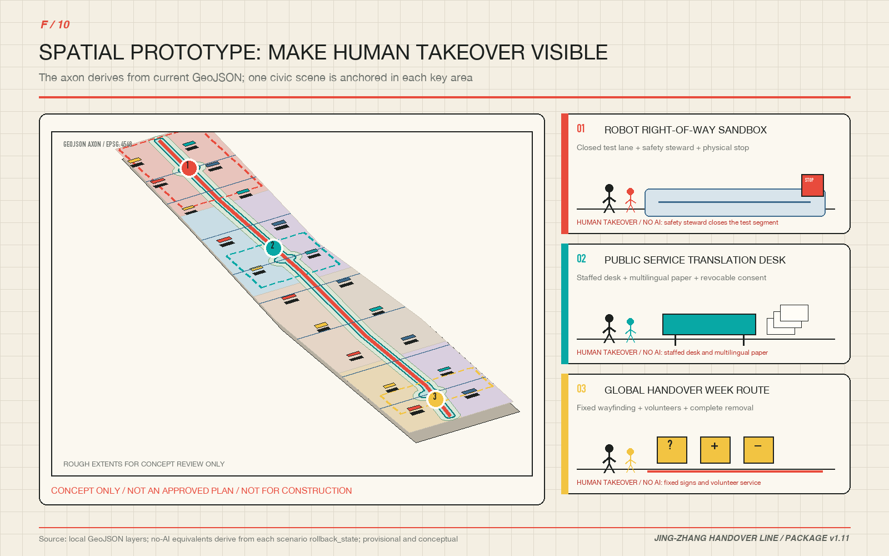
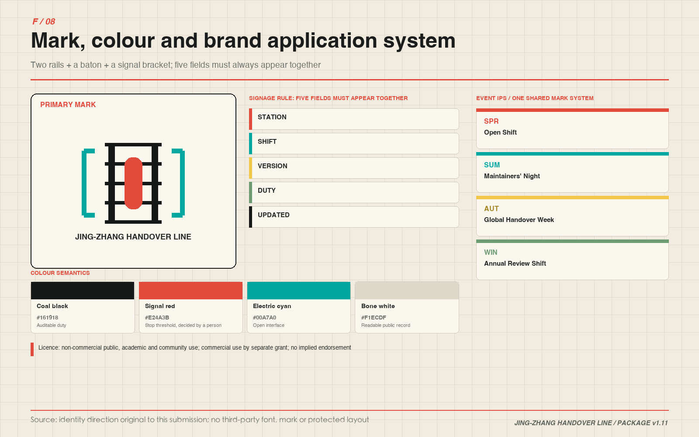
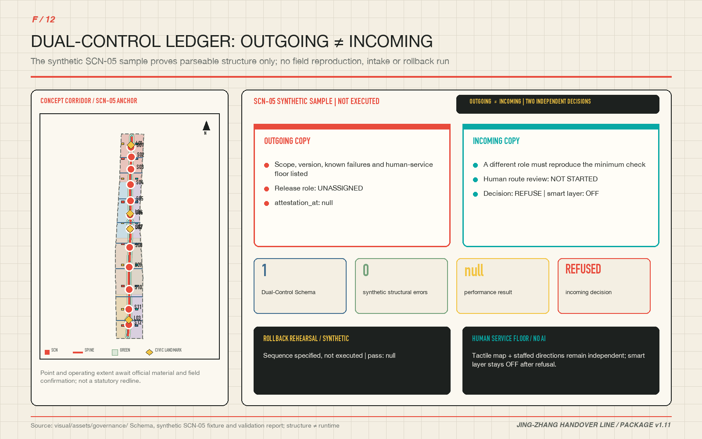
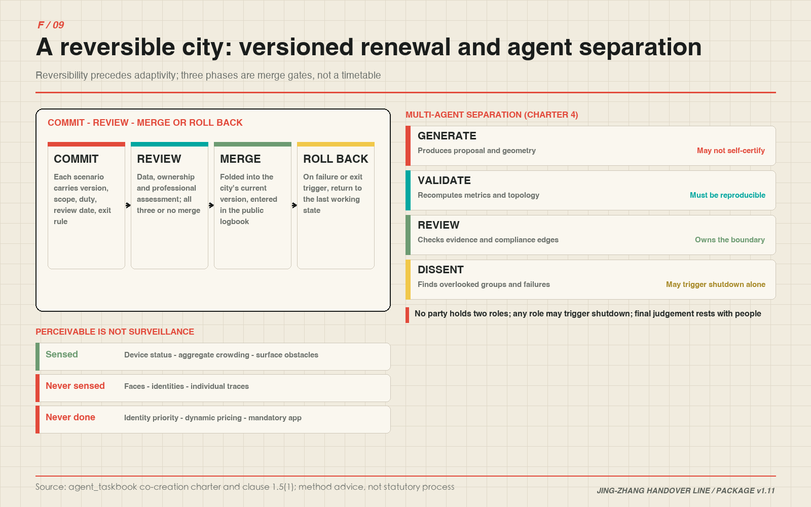
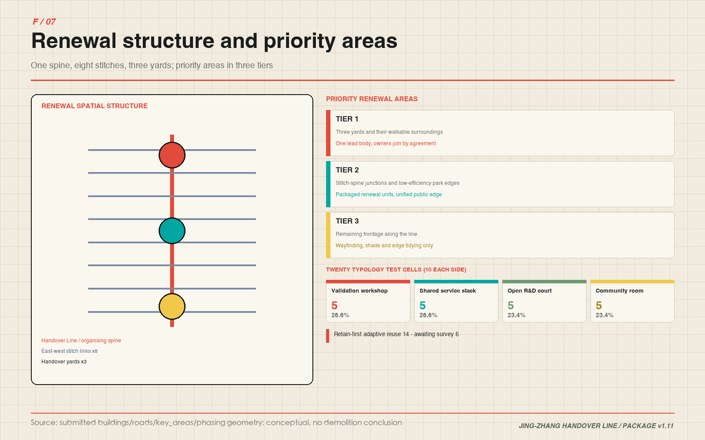
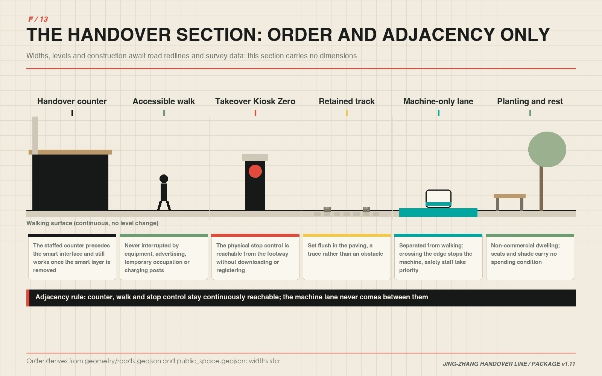
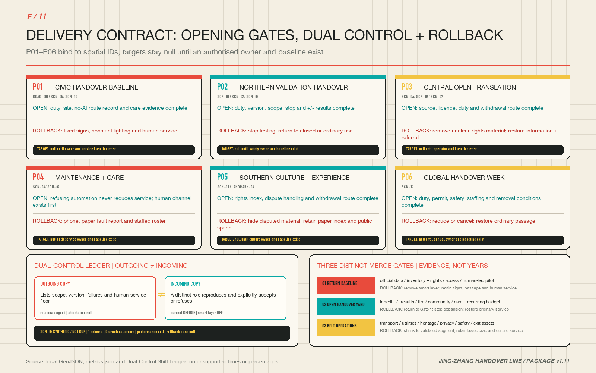
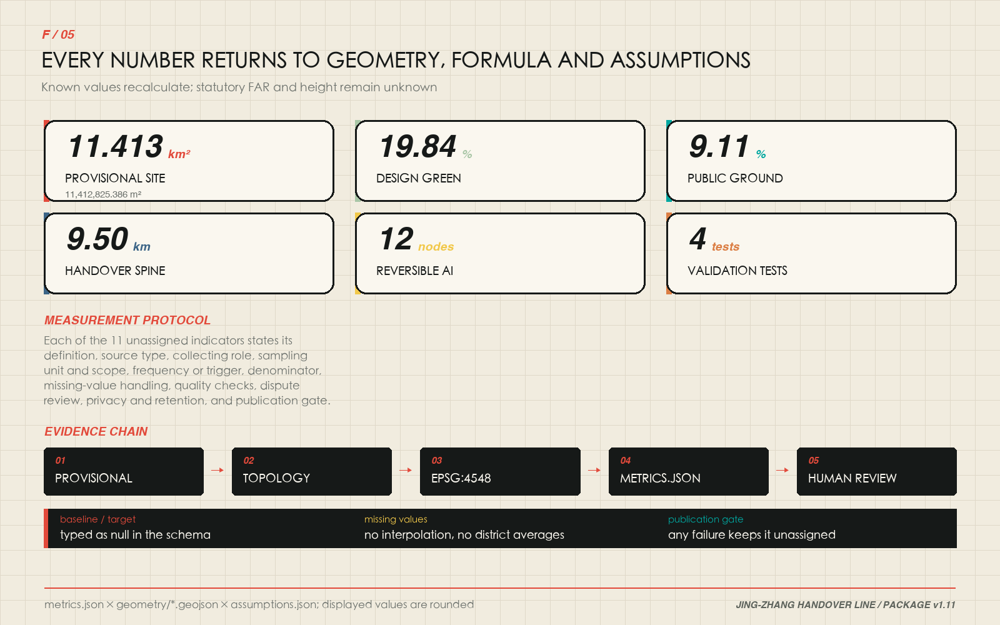

# JING-ZHANG HANDOVER LINE

> Intelligence moves. Responsibility stays visible.

The proposal translates a durable railway practice—shift handover—into a civic protocol for the AI era. Research hands a capability to validation; validation hands it to an open community; the community hands a service to residents. When the system is uncertain, offline, outside its boundary or challenged by a person, control must move back to an accountable human. “One line, three yards, two support wings and twelve reversible scenarios” is therefore both a spatial structure and a public-duty structure.

## Executive Brief

| Review question | The Handover Line's answer | Verifiable output |
| --- | --- | --- |
| Core proposition | The railway shift-handover becomes a civic AI protocol: capability may move, accountability must be signed for | Dual-Control Shift Ledger 0.3 and twelve reversible scenario cards |
| Spatial response | One handover line, three Handover Grounds, two support wings, eight stitch links, twenty renewal typology cells | Nine GeoJSON layers, eleven evidence figures, A3 booklet and A0 boards |
| Compliance anchor | Within "stoppable, contestable, with a no-AI equivalent", statutory basis and self-set standards are listed row by row; self-set standards are not written as general statutory duties | Four-column compliance baseline table; [source:GENERATIVE-AI-INTERIM-MEASURES] [source:BARRIER-FREE-ENVIRONMENT-LAW] [source:ELDERLY-SMART-TECH-PLAN] |
| Implementation start | Protocols, wayfinding and low-risk human-led pilots first; the three phases are merge gates, not a timetable | Six action packages, three conditional gates, [metric:phase_count] |
| Public value | Anyone can obtain equivalent basic service without using AI, and can trigger shutdown and appeal | Ten-component library, physical stop control at takeover kiosks, public duty logbook |
| Evidence status | Geometry and metrics recompute in EPSG:4548; district statistics calibrate questions only and never enter the metrics | [metric:site_area_sqm], [source:HAIDIAN-2025-STATISTICAL-BULLETIN] |
| Decision boundary | All spatial, brand, event, timing and role arrangements are conceptual advice, not statutory planning or a government commitment | Risk section, exit conditions, assumptions.json |

## Design Basis and Source List

The official call, agent taskbook and repository site package define the assignment. The package supplies schemas, enums, a source registry, provisional geometry and validators, while explicitly recording missing official boundaries, regulatory controls, ownership, roads, utilities, fire-safety, heritage and complete existing-building data. This submission keeps facts, inference and design separate: public facts are registered in sources.json; provisional polygons retain official_boundary=false; new geometry is labelled design_proposal. The authoritative entries are [source:OFFICIAL-ANNOUNCEMENT], [source:AGENT-TASKBOOK], [source:SITE-PACKAGE], [source:SOURCE-REGISTRY] and [source:PROCESSED-FACT-PACK].

Calculations use [source:BOUNDARY-SOURCE] and [source:KEY-AREA-SOURCE], represented by [data:geometry/site_boundary.geojson#SITE-001] and [data:geometry/key_areas.geojson#PROV-KEY-001]. They support concept generation, comparison and review, not statutory redlines or precise official areas. Exchange coordinates use EPSG:4326 and measurements use EPSG:4548. The design responds to [standard:PROJECT-OFFICIAL-ANNOUNCEMENT], [standard:PROJECT-AGENT-OPEN-CALL-TASKBOOK], [standard:MOHURD-URBAN-DESIGN-MEASURES], [standard:MOHURD-CONTROL-DETAILED-PLANNING], [standard:MNR-LAND-USE-CLASSIFICATION-GUIDE] and the disclosed data gap in [standard:MOHURD-ARCH-DESIGN-DEPTH-2016]. Existing-condition limits are recorded under [depth:existing_conditions_diagnosis]. Sonike submits the work; Codex (GPT-5) performs the current audit, data authoring and deterministic rendering, and user-operated Claude Opus 5 contributed to earlier editing rounds. Agent, copyright and changelog files disclose the collaboration; human reviewers retain final judgment.

### Compliance baseline: separate the statutory floor from what this proposal sets for itself

Three red lines recur throughout this proposal — stoppable, contestable, and backed by a no-AI equivalent. **Only part of each has a statutory source; the rest is a public-service standard this proposal adopts voluntarily.** The table below separates the two line by line, because presenting a voluntarily adopted standard as a general legal duty is itself a form of misrepresentation. The scope and effect of each provision follow the official text; this table is not legal advice.

| Red line in this proposal | Statutory basis and its **actual effect** | Not covered by the basis — set by this proposal | Spatial and operational consequence carried here |
| --- | --- | --- | --- |
| AI services can be stopped | Interim Measures for the Management of Generative AI Services, Article 14 (seven ministries, in force 2023-08-15) [source:GENERATIVE-AI-INTERIM-MEASURES]: **on discovering unlawful content**, providers must promptly stop generation, stop transmission and remove it. This is an **unlawful-content handling duty; it does not create a general user opt-out right** | **A standing user-facing stop control and on-demand shutdown outside unlawful-content cases** — a public-service standard set by this proposal | Takeover Kiosk Zero carries a physical stop control; every scenario card states its shutdown trigger and the fallback state after shutdown |
| Complaint entry is easy and its timeframe published | Same measures, Article 15: providers must maintain complaint and reporting mechanisms, set convenient entries, and **publish** the handling process and feedback timeframe. The Measures **set no numeric deadline** | **The numeric timeframe itself** is to be set by the future authorised operator from real staffing capacity; this proposal does not preset it | The public duty logbook is the physical carrier of "published process and feedback timeframe"; the delivery contract keeps that field open for calibration once an operator is authorised |
| Services with public-opinion attributes need prior assessment | Same measures, Article 17: services **with public-opinion attributes or social-mobilisation capacity** must undergo security assessment. It does not apply to services without those attributes | Treating all four industry validation scenarios as controlled sandboxes is **stricter than** the Article requires | All four industry validation scenarios are treated as controlled sandboxes and may not reach a public interface before assessment |
| Specific public service venues retain human handling | Law on the Construction of a Barrier-Free Environment, Article 39 (in force 2023-09-01; 8 chapters, 72 articles) [source:BARRIER-FREE-ENVIRONMENT-LAW]: public service venues **handling healthcare, social security, financial business or utility payment** must retain on-site guidance and human processing. It **does not extend to every public space or digital interface** | **Extending the human fallback to all twelve scenarios and the component library** — set by this proposal, not required by the Law | The City Handover Hall and community workrooms place the human counter ahead of the smart interface; all ten library components run independently once the smart layer is removed |
| Traditional channels kept alongside digitisation | State Council General Office Document No. 45 (2020), Implementation Plan on Resolving Older People's Difficulties in Using Smart Technology [source:ELDERLY-SMART-TECH-PLAN]: traditional service methods and smart-service innovation should run **in parallel**, across travel, healthcare, consumption, culture and administrative services. This is a **policy notice, not a legal duty**, and it sets no statutory control over any specific project | **The coverage and mandatory force of "all twelve scenarios"** — a standard set by this proposal; the "parallel" principle does not itself amount to "may not remove" | The "no-AI equivalent" column of each of the twelve scenarios maps to one of those high-frequency categories rather than a general pledge to "care for older people" |

The table also explains why reversibility precedes intelligence here: **the admission standard this proposal sets for itself is** that a service which cannot be stopped, cannot be contested and cannot be replaced by a person should not enter the public space designed here. **This is a design claim, not a statutory eligibility test** — standing rules make no such general provision. This package performs a compliance comparison only; it is not legal advice, and the application of any provision rests with the competent authorities and qualified legal professionals.

## Three-Level Scope Framework

The three scopes form one evidence chain. The coordinated research area asks how Haidian could build a globally connected ecosystem around open collaboration and trustworthy validation. The overall design area turns those mechanisms into land use, renewal, movement, blue-green space, civic facilities and implementation gates. Three key areas then test whether a real place can combine programme, building, access, public space, AI governance and delivery conditions. This cascade is governed by [depth:three_level_scope_framework] and [depth:overall_spatial_structure].

The provisional overall polygon computes to about 11.4 square kilometres [metric:site_area_sqm] for internal concept comparison only; it is not a precise redline or statutory area. Three provisional key areas are represented [metric:key_area_count]. The taskbook already assigns a function to each of the five areas, so this proposal does not invent a competing division of labour. It lands each official function on one identifiable handover action; the left two columns below are the taskbook's own wording, the right two are what this proposal contributes.

| Area (official name) | Function assigned by the taskbook | Handover action this proposal lands | Evidence entry |
| --- | --- | --- | --- |
| Zhongzhiyuan AI Acceleration Area | Full-stack self-reliant AI system and a global voice in AI governance | Build→Verify Yard: red-team desk, robot right-of-way sandbox, edge-energy station; the version, accountable role and stop record of every test batch form a governance output an outsider can re-examine | [data:geometry/key_areas.geojson#PROV-KEY-001], R-TEST-SAFETY |
| Beijing AI Origin Community | World-class AI innovation ecosystem | Verify→Share Yard: result relay, licensing and withdrawal, human counter; anything published carries source, licence, accountable role and a way to withdraw it | [data:geometry/key_areas.geojson#PROV-KEY-002], R-SERVICE-OPS |
| Dazhongsi AI Industry Cluster | AI-native new business forms | Share→Serve Yard: City Handover Hall, Century Logbook, oral-history booth; new business forms are admitted only where ordinary passage stays free of any spending or app condition | [data:geometry/public_space.geojson#SCN-11], R-CULTURE-VENUE |
| Zhongguancun Technology Services Wing | Global allocation of production factors, Zhongguancun IP and capital enablement | Eight shared stacks as the factor intake: legal, IP, talent, finance and standards reach the belt as interface plus rule plus reviewable record, replacing no existing institution | [depth:overall_spatial_structure], [data:geometry/land_use.geojson#LU-001] |
| Xiaoyuehe Scenario Enablement Wing | AI scenario enablement and an intelligent, vibrant AI city | The wing carries civic, environmental and everyday-life tests; the no-AI equivalent of each of the twelve reversible scenarios is proven here before it is repeated along the belt | [metric:scenario_node_count], [depth:blue_green_public_space] |

Capability does not only travel outward: complaints, maintenance records and shutdown reasons travel north again, closing a build–verify–share–serve–feedback loop. That loop is where "a global voice in AI governance" actually lands in space — the standing comes from records an outsider can re-examine, not from scale.

## Coordinated Research Area: Industry and Future City Research

The official call and the agent taskbook already fix the belt's three positions, five functions and "three areas, two wings" structure. This proposal does not invent a competing vocabulary; it translates each official term into an identifiable spatial carrier, an operable mechanism and a checkable evidence entry. "Handover Line" is the spatial name of that translation, not a replacement for the official positioning.

| Official position / function | Spatial and operational carrier | Evidence entry |
| --- | --- | --- |
| Position · Centennial Jing-Zhang Culture Belt | The Century Logbook, oral-history booth and the Tsinghuayuan Railway Station cultural anchor as one continuous record sequence | [data:geometry/public_space.geojson#SCN-11], A-HERITAGE-001 |
| Position · Urban AI Life Experience Belt | Twelve reversible scenarios on a continuous public handover ground | [metric:scenario_node_count], [metric:public_space_ratio] |
| Position · AI Integrated Innovation Belt | Eight shared stacks interfacing across the three areas in a build–verify–share–serve–feedback loop | [depth:overall_spatial_structure] |
| Function · Full-stack self-reliant AI system | Zhongzhiyuan Build→Verify Yard: red-team desk, robot right-of-way sandbox, edge-compute energy station | [data:geometry/key_areas.geojson#PROV-KEY-001] |
| Function · World-class AI innovation ecosystem | AI Origin Community Verify→Share Yard plus the Zhongguancun technology-services wing | [data:geometry/key_areas.geojson#PROV-KEY-002] |
| Function · AI+ scenario empowerment paradigm | Four controlled validation sandboxes and eight civic scenarios under one launch–review–exit rule | [metric:industry_validation_scenario_count] |
| Function · Intelligent, vibrant AI city | Xiaoyuehe scenario-enablement wing carrying civic, environmental and everyday-life tests | [depth:blue_green_public_space] |
| Function · Global voice in AI governance | Public duty logbook, four ledgers and Global Handover Week as a reviewable governance record | [depth:risk_missing_data] |

### District statistics narrow the question; they do not manufacture a target

Earlier rounds asserted only that "Haidian has abundant innovation resources" — a claim no reviewer can check and no designer can act on. This round admits one public statistic traceable to the publisher's own page, annotates every figure with its statistical scope, and uses it to narrow design questions rather than to set performance targets. [source:HAIDIAN-2025-STATISTICAL-BULLETIN]

| Verifiable finding (Haidian District, 2025) | Which design judgement it changed | What it cannot prove |
| --- | --- | --- |
| 123 filed and launched large models, 60% of Beijing's total | The belt faces services already inside a filing and security-assessment process, so validation scenarios are organised as file → assess → controlled launch → exit rather than as generic "model display" | That these models sit in the corridor, would join validation, or would generate visitors or output |
| 92 national key laboratories in the district, 63.4% of the city and 17.9% of the country | The belt does not rebuild research capacity; it carries only the interface for handing results out and having them independently verified, which is the Zhongzhiyuan Build→Verify Yard | That those laboratories would use belt facilities, or that their results count toward belt performance |
| 599 high-value invention patents per 10,000 people; 57,900 registered technology contracts worth CNY 405.31 billion | The bottleneck in adoption is reproducibility and accountability rather than volume, so the Verify→Share Yard makes version, licence, accountable role and withdrawal entry the delivery floor | Adoption efficiency, adoption destination, or how much the belt could raise contract value |
| Permanent population 3.111 million, down 11,000 year on year | Renewal does not presuppose population growth; all twenty renewal typology cells are designed to be removable and reversible | The corridor's population structure, commuting pattern or housing demand |
| 1,456 health institutions, of which 239 community health centres and stations | The no-AI equivalent must attach to the existing community service network rather than start a parallel one, so scenario 09 only navigates verified existing institutions and refers to human staff | Facility distribution, accessibility, appointment supply or new-facility demand inside the corridor |

The statistical unit of these figures is the whole district, far larger than the 43.6 km² coordinated research area. All of them are registered as `background_only` with `not_spatially_allocable=true`; they never enter metrics.json and change no geometry, area, alignment or phase. Original wording, collection method, unit conversion and usable / not-usable boundaries are recorded item by item in sources.json. Corridor-level ridership, OD, facility capacity and complaint baselines remain unknown this round rather than being filled with district averages.

Within that framing, the three working lines are a public validation corridor for trustworthy AI, a human-takeover demonstrator for AI-native urban life, and a shared memory field joining centennial engineering culture with open-source culture; the five actions are build, verify, share, serve and review. The taskbook calls for a global AI industry highland and pilgrimage destination. Here, “highland” means reusable test protocols, negative results and adoption interfaces; “pilgrimage” means public institutions where anyone can enter, challenge a system and see who is accountable—not tower height, company counts or one-off visitor traffic. The logo combines two rails, a baton and a signal bracket: coal black is auditable duty, signal red is the stop threshold, electric cyan is an open interface, and bone white is a readable public record.

Regional innovation synergy is stated at four levels rather than inside the belt alone. Within the belt, "three areas, two wings" organises the research, validation and service loop. Within the city, the proposal connects to the "two zones and one belt" industrial framework named in the official call, matching Zhongguancun Science City's technology supply to the belt's validation, open-sharing and scenario demand. At the municipal level, it reserves conceptual interfaces with Future Science City, Huairou Science City and Beijing Economic-Technological Development Area around a candidate original-research / engineering-validation / scale-application chain, but claims no agreed division of labour, partnership or committed resource. At the regional level, rejectable interfaces for compute, energy and scenario questions are reserved along the Jing-Zhang direction toward Zhangjiakou and other Beijing-Tianjin-Hebei nodes. The taskbook also names the North Latitude Community, but the public package supplies no cleared boundary, operator or existing partnership; this proposal therefore invents no location and reserves only a community-problem → de-identified feedback → bounded retest → public receipt interface, enabled only after the relevant party confirms it. Haidian's "1+X+1" industrial system is defined by the competent authorities; this proposal only supplies spatial interfaces and validation tools on its "AI+" side. All synergy is expressed as interfaces, rules and reviewable records—never as boundary changes, quota transfers, investment arrangements or commitments already made by any party.

| Taskbook-named counterpart | Minimum interface proposed by the belt | Minimum exchange artifact | Entry and exit gate |
| --- | --- | --- | --- |
| North Latitude Community | Community issue tickets and no-AI service testing | De-identified issues, failure modes and retest receipts | No location before party and licence confirmation; pause on personal-data or representation disputes |
| Future Science City | Edge-model, embodied-device and engineering-validation questions | Version cards, device passports and failure lists | Reject when IP, test duty or scope is unclear |
| Huairou Science City | Measurement, calibration and scientific-validation methods | Calibration note, uncertainty and review questions | No mutual recognition without data licence and professional responsibility |
| Beijing E-Town | Engineering, supply-chain and scale-use feedback | Interoperability evidence, maintenance and recall conditions | Stop transfer when product safety or consumer-rights gates fail |
| Beijing–Tianjin–Hebei nodes | Cross-city environmental and energy constraints | Comparable positive/negative results and retest conditions | Separately negotiated; no automatic deployment, compute or energy commitment |

Six global references contribute mechanisms, not copied form or performance claims, and each row states the institutional condition that does not transfer. Comparability is limited by A-CASES-001 and every translation is governed by [depth:overall_spatial_structure].

| Case | Mechanism | Translation here | Condition that does not transfer |
| --- | --- | --- | --- |
| JTC LaunchPad @ one-north [source:CASE-ONE-NORTH] | Testbed, incubation and ground-floor display on one site | Public validation street and visitable ground floor in the Build→Verify Yard | Single master developer and estate leasing regime |
| Smart Kalasatama [source:CASE-KALASATAMA] | Agile, resident-centred pilots that can be evaluated and stopped | Exit conditions and a no-AI equivalent in all twelve scenarios | City scale, welfare system and participation tradition |
| STATION F [source:CASE-STATION-F] | One shared service platform across many programmes | Eight shared stacks instead of an invented company list | Single-building private operator |
| 22@ Barcelona [source:CASE-22BARCELONA] | Economic transition aligned with housing, public space and governance | Three-layer renewal: operate first, convert last | Statutory land conversion and development-right transfer tools |
| Kendall Square K2C2 [source:CASE-KENDALL] | Land use, transport, urban design and action in one study | Nine geometry layers, metrics and depth matrix generated from one model | Zoning code and community review procedure |
| Knowledge Quarter London [source:CASE-KNOWLEDGE-QUARTER] | Consortium knowledge exchange with public access | Public Handover Table and Global Handover Week as common ground | Voluntary institutional alliance and existing cultural density |

Eight shared stacks replace an invented company list: land, space, industry, finance navigation, talent, compute, data and scenarios. Each stack has an interface, access conditions and a responsible operator. Residents should see not just an AI output but who owns the duty, how the system stops and where an appeal goes.

The link between industry and space is expressed as a recomputable functional share rather than a claim. Shares below are recomputed feature by feature from [data:geometry/land_use.geojson#LU-001] in EPSG:4548; the nine zones jointly cover the provisional site and total 100.00%. This is the area share of an urban-design structure — not a statutory land-use allocation, and not a share of output, employment or investment.

| Land-use zone | Code | Area share | Industry and function carried | Main area |
| --- | --- | --- | --- | --- |
| Handover Line parkland | 1401 | 19.84% | Climate ground, public exchange, open test space | Whole belt |
| Talent living and mixed community | 0701 | 12.79% | Housing and jobs-housing balance | Central segment |
| Community service and facilities | 0702 | 11.67% | Public service, care, visible maintenance stops | Whole belt |
| Education and open-source learning | 0804 | 11.26% | Teaching, research relay, open-source community | Origin Community |
| AI-native commerce and business | 05 | 9.99% | AI-native business and international exchange | Dazhongsi |
| Culture and public service | 0803 | 9.10% | Cultural narrative, oral history, public display | Dazhongsi, heritage park |
| Model validation and industry collaboration | 0802 | 8.92% | Model, robot and edge-compute testing | Zhongzhiyuan, centre |
| Technology services and translation | 05 | 8.71% | Legal, IP, standards, finance navigation | Zhongguancun services wing |
| Full-stack R&D and trial | 0802 | 7.72% | Foundation models and full-stack research | Zhongzhiyuan |

Innovation resources are coordinated through interfaces rather than name lists: universities and institutes supply original research and talent, and their interface is the campus research relay and the licensing catalogue; incubators supply low-cost trials and compliance access, and their interface is the shared test courts and service stacks; unicorns and listed companies supply engineering capacity and real scenarios, and their interface is the validation sandbox and the civic problem release. No company is named, no occupant is presumed, and no party is represented as having agreed to participate. The content of Haidian's "1+X+1" industrial system is defined by the competent authorities; this proposal only supplies spatial interfaces and validation tools on its "AI+" side.

## AI-Native Urban Form and Planning Method

The official call asks the proposal to imagine how AI changes ways of producing and living, to propose a matching urban form, to plan how urban functional elements are spatially organised in the AI era, and to propose an adaptive, evolvable development model. This section answers directly: AI does not add a layer of equipment to the city — it changes the scale, the time pattern and the replacement rate of space. The decisive variable of urban form therefore shifts from "how large do we build" to "how often does it change, and does anyone get hurt when it does".

| Change in production and daily life | Concrete spatial requirement | Where it lands here |
| --- | --- | --- |
| Training and simulation replace part of physical pilot production | Small enclosable, meterable, stoppable test space rather than long-span sheds | Shared test courts, sandbox edges |
| Edge compute disperses into the blocks | Utilities shift from central machine rooms to distributed cooling, separate metering, nearby waste-heat use | Edge metering cabinets, removable new infrastructure |
| Remote and hybrid work become normal | Fewer fixed desks, more bookable shared and short-term space | Shared service stacks, temporary use decks |
| Robot delivery and inspection reach the ground floor | Ground floors need separated human/machine arrival interfaces and controlled freight windows | Five-step arrival interface, logistics separated from visitors |
| People without smart devices face systematic exclusion | Every service needs a no-AI equivalent that is not slower or worse | The no-AI column across all twelve scenarios |
| Learning and employment cycles shorten | Low-threshold space that can be re-entered repeatedly | Campus research relay, community rooms |
| Models iterate faster than planning cycles | Planning output must be recomputable and reversible, not finalised once | Versioned renewal, condition-triggered phases |

The adaptive, evolvable development model has a concrete definition here: treat urban renewal as a versioned handover that may be refused and rolled back, rather than one-off construction. The twelve scenarios and twenty renewal typology cells form a registry of 32 conceptual objects [metric:versioned_asset_count]. Their authoritative features in [data:geometry/public_space.geojson#SCN-01] and [data:geometry/buildings.geojson#BLDG-001] share minimum version, scope, duty, review, acceptance and rollback fields. This is a pre-authorisation registry, not 32 independently validated or deployed systems; duty roles remain unassigned, and the common template is only a fail-closed entry gate.

### Dual-Control Shift Ledger: outgoing and incoming are independent decisions

To make "handover" more than a field count, v1.6 adds the original Dual-Control Shift Ledger 0.3. The outgoing shift records scope, version, inputs, known failures and the no-AI service floor. The incoming shift must independently reproduce the packet and explicitly accept or refuse it; an unresolved item cannot vanish between shifts. The machine-readable contract is [data:visual/assets/governance/shift-ledger.schema.json]. Its minimum example uses the low-risk SCN-05 accessible-route copilot with synthetic obstacle cards only: no personal data, no live service connection, `deployment_mode=sandbox_only`, human roles unassigned and performance results `null` [data:visual/assets/governance/example-scn05-shift-ledger.json]. The instance passes JSON Schema structural validation [metric:machine_readable_shift_protocol_count] [metric:schema_valid_synthetic_shift_count] [metric:shift_protocol_validation_error_count], recorded in [data:visual/assets/governance/validation-report.json]. Zero structural errors proves only that the synthetic record is machine-readable; it does not prove route correctness, service availability, legal compliance or readiness for field use.

The three phases are not a timetable but three merge gates—data, ownership and professional assessment must pass before a merge; if they do not, the state rolls back to the last working one. Being reversible is the precondition for being evolvable, which is exactly why every component in the library must be removable and why "reversible insertion" precedes "investigate" in the four-step building decision. A city that cannot undo its own decisions cannot adapt.

The perceivable, interactive "AI+" mobility system is defined by two boundaries. Perceivable is not surveillance: only device status, aggregate crowding and surface obstacles are sensed — never faces, identities or individual traces — and every sensing device posts on site what it collects. Interactive means each handover node offers the five-step interface of arrive, slow, recognise, ask for help, continue, layered with the accessible-route copilot and tactile wayfinding so the system works for people who do not look at a screen. Three things are explicitly not done: no identity-based movement priority, no dynamic pricing, and no app installation as a precondition for passage or entry. The continuous green space system is carried by the Handover Line itself, where walking continuity outranks any smart function.

Multi-agent collaboration, required by the fourth co-creation principle, lands as a governance structure built on separation rather than headcount: a generating agent produces the proposal and geometry, a validating agent independently recomputes metrics and topology, a reviewing agent checks evidence references and compliance boundaries, and a dissenting agent looks specifically for overlooked groups and failure modes. No single party may hold two of these roles, and the generator may not certify itself; validation must be reproducible by a third party from the same data; any role may trigger a shutdown; final judgement rests with people and professional teams. This submission is itself a product of that process — geometry, metrics, figures and matrices generated from one model, then checked separately by four deterministic gates and human review.

The territorial spatial planning contribution converges into three operable claims. First, write the unknowns into the deliverable: unknown items keep status=unknown with a definition, data precondition and assignment trigger, rather than filling the table with estimates. Second, keep design conclusions and statutory controls in separate columns at all times — design proposals marked design_proposal, provisional boundaries marked official_boundary=false, never mixed. Third, make the planning output a recomputable data package rather than a static album, so that once official data arrives one model reruns everything instead of someone redrawing it. The difference from a digital twin is that this proposal does not chase a real-time mirror; it only requires that every number can be traced back to geometry, formula and assumption. These are method proposals and do not replace the statutory preparation and approval process.

## Overall Design Area: Urban Renewal and Regulatory-Plan-Level Urban Design

The overall design area runs north to the Fifth Ring Road, east toward Xueyuan Road and Xitucheng Road, south to Xizhimenwai Street, and west toward Dazhongsi East Road and Heqing Road. The Jing-Zhang Rail Heritage Park is the only continuous public carrier crossing it, and this proposal treats it as the skeleton of the vitality belt rather than as background greenery: the Handover Line coincides with the park's north-south and east-west active-mobility system, eight stitch links tie in campuses, parks, communities and transit directions, and three yards raise the corridor from a landscape route to a public mechanism that carries build, verify and serve duties. The park's north end, south end and the section crossing the Fifth Ring Road are the three break points that need dedicated treatment; only connection intent and interface principles are given here, never a bridge, tunnel or engineering conclusion.

The structure is therefore a "skeleton–stitch–handover" system rather than a zoning drawing: the line carries responsibility, the links form a removable network, and the yards are where the operating mechanism changes. The topological land-use model has eleven features [metric:land_use_zone_count] and fully covers the provisional site in [data:geometry/land_use.geojson#LU-001]. Northern research land supports build and verification; mixed education, service, residential and community uses support the central open-source district; culture and service uses support the southern civic interface. The mix is not a collage: each segment should hold work, life, social and learning scenarios at once, which is how a walkable balance between jobs, housing and services is tested. Campus, park and neighbourhood integration is proposed first where a yard meets a stitch link, because that is where a coordinated delivery model is most likely to hold. This is a design proposition under [depth:land_use_layout], not an existing cadastral or statutory plan.

Renewal follows “inventory first, temporary use second, fixed work last.” Twenty building typology cells [metric:renewal_cell_count] in [data:geometry/buildings.geojson#BLDG-001] have a combined conceptual footprint of 221,014.099 square metres [metric:building_footprint_area_sqm]. They compare open R&D courts, validation workshops, shared service stacks and community collaboration rooms; they do not represent the existing building stock, demolition decisions or approved floor area.

FAR and maximum building height remain unknown [metric:floor_area_ratio] [metric:maximum_building_height_m]. Under [depth:development_intensity_controls], official controls, heritage requirements, transport capacity and utility data must enter the model before any intensity plan is produced.

## Detailed Design of Key Areas

All three polygons are provisional, represented by [data:geometry/key_areas.geojson#PROV-KEY-001], [data:geometry/key_areas.geojson#PROV-KEY-002] and [data:geometry/key_areas.geojson#PROV-KEY-003]. The work is directional and subject to [depth:three_key_area_detailed_design].

### Zhongzhiyuan AI Acceleration Area: Build→Verify Yard

The northern yard proposes a public validation street, two groups of shared test courts and a low-impact green edge toward the Qing River. Model red teaming, robot right-of-way tests and edge-compute energy tests display version, risk, duty person and shutdown method; logistics and controlled operations enter from inside the estate while visitors enter from the Handover Line, separated by a transparent but impassable safety interface. Because the area carries standard-setting and safety-governance work, buildings, green space and water are designed under one interface rule: the riverside section becomes an "explainable green space" that posts water quality, runoff, shade and equipment energy on fixed signage and on paper, so green space itself becomes a validation ground rather than decoration. Qing River engineering culture is shown through riverside record plates and the duty logbook without altering the channel. Improvements toward the Fifth Ring Road are stated as needs and priorities only; sections, ramps, crossings and feasibility must be judged by transport and municipal professionals against official data [depth:traffic_rail_slow_parking].

### Beijing AI Origin Community: Verify→Share Yard

The central yard groups a public handover table, campus research relay, translation desk, accessible-route copilot and community collaboration rooms around walkable open-source and living space. Ground floors stay continuous but graded at night; planting, shared living rooms and closable porches sit between research activity and quiet residential edges. Moving research into the city needs two walkable stages: an incubation stage next to campus gates and institute entrances, and a translation stage along the Handover Line that opens to the neighbourhood. Stations toward Wudaokou and Qinghua East Road West Entrance are the start of those two stages; integration there is not about adding retail floor area but about completing the "arrive – recognise – ask for help – enter public space" interface and repairing walking and cycling breaks between campuses and parks. Low-impact incremental renewal means validating demand with time-sharing and temporary use rights before discussing ownership and conversion. Open source is not unconditional disclosure: code, models, datasets and space use each carry their own licence, withdrawal path and safety review.

### Dazhongsi AI Industry Cluster: Share→Serve Yard

The southern yard hands capability to daily civic service. The Dazhongsi station direction, the commercial blocks and the south end of the Jing-Zhang Rail Heritage Park form a walkable sequence through the civic handover hall, Century Logbook and oral-history booth. Agent, smart-terminal and content-consumption businesses share one precondition — comparable, refusable, exitable — so AI-native commerce cannot require facial recognition or a mandatory app, and non-commercial access remains available. Data-element and digital-asset circulation is discussed only under consent, withdrawal and audit; the proposal does not design the trading rules themselves. The four quadrants at the Dazhongsi station intersection are currently car-dominated and are treated as the condition on which the southern segment depends: the quadrants need a continuous, visible, step-free walking relationship, with an arrival interface and a human help point in each. Bicycle parking follows "close to entrances, never occupying the continuous walking surface, recoverable and relocatable" rather than trading order for railings. Rail interchange, the exact quadrant connection, treatment of existing buildings and landmark height all require official transport, ownership, fire-safety and heritage data before professional development.

## AI Innovation Ecosystem, Personas, and AI+ Scenarios

Seven personas anchor the system. Each is bound to a spatial carrier, a scenario and an aggregate measure; none becomes a commercial tracking profile, and no persona is used to allocate resources or rank an individual.

| Persona | Core need | Spatial carrier | Scenarios | Measure (aggregate, non-identifying) |
| --- | --- | --- | --- | --- |
| Developers | Reproducible tests and contribution records | Public validation street, Public Handover Table | SCN-01, SCN-07 | Contribution entries, reproduction success rate |
| Start-up teams | Low-cost trials, compliance and compute access | Shared test courts, shared service stacks | SCN-02, SCN-03 | Trial queue time, access availability |
| Industry maintainers | Visible faults, versions and duty | Visible maintenance stop, Century Logbook | SCN-08 | Ticket closure rate, mean takeover time |
| Students and researchers | Clear translation and licensing boundaries | Campus research relay, open release hall | SCN-07 | Licence completeness, withdrawal response time |
| Residents and older people | Equal service without a smart device | Human desks, community collaboration rooms | SCN-06, SCN-09 | No-AI equivalent coverage |
| Disabled and temporarily impaired people | Verified continuous accessible routes | Accessible-route copilot, tactile maps | SCN-05 | Route verification pass rate, break repair time |
| International visitors | Multilingual explanation and human help | Public translation desk, Manual Override Pavilion | SCN-06, SCN-12 | Human-help response time, paper multilingual coverage |

Twelve nodes [metric:scenario_node_count] are encoded from [data:geometry/public_space.geojson#SCN-01], including four controlled industry-validation scenarios [metric:industry_validation_scenario_count]. Every row states the minimum data, the duty owner, manual takeover, the no-AI equivalent and the exit condition. The shared rule is that loss of connection, a scope breach, a risk threshold or any person's objection stops the smart function immediately while the basic service continues on the duty logbook.

| ID | Scenario and location | Users and minimum data | Human handover, no-AI equivalent and exit condition |
| --- | --- | --- | --- |
| SCN-01 | Model red-team desk; Zhongzhiyuan | Model teams; test samples, version and risk items only | Signed human review, paper risk log; exit on unresolved major risk |
| SCN-02 | Robot right-of-way sandbox; Zhongzhiyuan | Robot teams and safety staff; tracks inside a closed segment | Physical stop by safety staff, manual closed testing; exit on breach or outage |
| SCN-03 | Edge-compute energy station; Zhongzhiyuan | Operators; independent meter and task load | Manual shutdown, offline metering; exit on temperature or energy threshold |
| SCN-04 | Data-consent rehearsal; north-central edge | Data product teams and the public; voluntary consent records | Paper consent, immediate deletion window; exit if withdrawal is impossible |
| SCN-05 | Accessible-route copilot; Origin Community | People with reduced mobility; user-entered route barriers | Tactile map, human direction; exit if a route is unverified or broken |
| SCN-06 | Public translation desk; Origin Community | Residents and international visitors; text entered on site | Human desk, multilingual paper; hand over on low confidence or any rights decision |
| SCN-07 | Campus research relay; Origin Community | Students, staff, developers; author-cleared metadata | Human curation, open catalogue; withdraw if licence or safety review is unclear |
| SCN-08 | Visible maintenance stop; central segment | Facility maintainers and residents; anonymous faults, ticket status | Phone and paper reporting, human dispatch; hand over on auto-dispatch conflict |
| SCN-09 | Community care roster; living segment | Older people, carers, community staff; minimal roster data | Staff telephone roster; refusing algorithmic allocation does not reduce service |
| SCN-10 | Night-shift safety light; south-central segment | Night pedestrians and maintainers; device status, no facial capture | Fixed lighting, human patrol; revert to constant light on sensing anomaly |
| SCN-11 | Jing-Zhang oral-history booth; Dazhongsi | Residents, visitors, researchers; cleared archive index | Human guide and paper catalogue; show index only when provenance is uncertain |
| SCN-12 | Global Handover Week route; whole belt | Developers, public, international visitors; booking and anonymous counts | Fixed signage, volunteers; suspend interaction on crowding or safety risk |

The table above answers what is done, on what data and who takes over. The table below answers which space it occupies, who operates it and what happens to that space once the scenario stops. A scenario is not a service layered onto the city; it is a spatial arrangement with ownership, maintenance cost and an exit plan. After exit the space must return to public use rather than leave an unmaintained structure behind.

| Scenario | Space and component | Operator (proposed) | Opening rhythm | Cost and maintenance basis | Space after exit |
| --- | --- | --- | --- | --- | --- |
| SCN-01 Model red-team desk | R&D ground floor + handover table | Model team + third-party review | By test batch | Venue by the estate; review in project cost | Returns to shared review room |
| SCN-02 Robot right-of-way sandbox | Closed test court + sandbox edge | Robot team + safety officer | Timed closure | Safety staff and insurance are fixed costs | Edge removed, courtyard restored |
| SCN-03 Edge energy test station | Equipment deck + metering cabinet | Operator | Continuous, readings posted | Separately metered, energy self-borne | Cabinet removed, deck reverts |
| SCN-04 Data-consent rehearsal | Public handover ground + mobile stand | Data team + public service body | During events | One-off installation, no long occupation | Stand removed, movement restored |
| SCN-05 Accessible-route copilot | Continuous walking surface + tactile signage | Municipal maintenance | All day | Folded into accessibility maintenance | Tactile signage stays, smart layer off |
| SCN-06 Public translation desk | Community facility ground floor | Public service counter | Weekdays | Shares the staffed counter | Counter continues, screen removed |
| SCN-07 Campus research relay | Campus edge + open release hall | University transfer office | Term rhythm | Curation and licence review dominate | Returns to release and exhibition space |
| SCN-08 Visible maintenance stop | Small service point on the line | Facility maintainer | All day | Folded into the existing ticket system | Paper reporting point retained |
| SCN-09 Community care roster | Community collaboration room | Community and care bodies | Weekdays | Staff time, no extra equipment | Telephone roster continues |
| SCN-10 Night-shift safety light | Lighting poles on the active route | Municipal lighting | Night | Folded into lighting operations | Returns to constant lighting |
| SCN-11 Oral-history booth | Heritage park node + logbook column | Cultural body + volunteers | Weekends, festivals | Archive clearance is the upfront cost | Booth kept as a paper catalogue point |
| SCN-12 Global Handover Week route | Belt-wide public ground | Event organiser + volunteers | Once a year | Temporary, fully removed afterwards | All movement restored |

Four ledgers govern operation: a data ledger says what is and is not used; a duty ledger names the owner and on-site person; a takeover ledger sets thresholds and response time; an exit ledger records shutdown, deletion and service continuity. A system goes offline when it loses connection, breaches scope, crosses a risk threshold or is challenged by a person. The basic service continues.

### Self-selected area: five "AI+" vertical scenarios

Inside the overall design area but outside the three key areas, two segments are selected as vertical application trials: the education and software-dense stretch toward Xueyuan Road in the centre, and the daily-service and health-access stretch toward Xizhimenwai Street in the south. All five keep the same handover discipline — minimum data, duty owner, human takeover, no-AI equivalent, exit condition. A vertical sector does not relax it.

| Field | Scenario | Segment | Minimum data | Human takeover and no-AI equivalent |
| --- | --- | --- | --- | --- |
| AI+software | Open toolchain station: local builds, dependency audit, bug reproduction | Centre, Xueyuan Road | Code and build logs; no developer profiling | Human code review; offline mirror and paper list |
| AI+health | Community health explainer and referral desk: explains process, never diagnoses | South, Xizhimenwai | On-site question text; no health record retained | GP and triage counter; paper flow chart |
| AI+education | Campus study helper: explains method, never writes or grades | Centre, Xueyuan Road | Question text; no grades or identity collected | Teacher and TA hours; paper worked examples |
| AI+legal | Public legal intake desk: structures the request, shows the procedure | South, commercial blocks | User-stated facts only; nothing retained | Duty lawyer and legal-aid counter; paper guide |
| AI+daily service | Civic form and booking desk: form filling and process explanation | Community facilities, belt-wide | On-site form fields; no cross-matter linking | Staffed counter and phone; paper forms and assisted filling |

The shared red line: none of these may produce a diagnosis, judgment, score or eligibility decision that directly affects a person's rights; any rights-bearing judgement returns to a qualified human; and using the smart service must never be a precondition for receiving the basic service. The segments are a self-selected study scope — actual siting, institutional partners and professional qualifications must be confirmed by the competent authorities and institutions, and no partnership is claimed here.

## Land Use, Building Scale, and Retain-Renovate-Demolish Strategy

Land-use codes follow the public subset: 1401 parkland, 0802 research, 0804 education, 0803 culture, 0702 community service, 0701 residential and 05 commercial service. Their union covers the site without intentional overlap or gap. The continuous green class is both a land-use zone and the climate-comfort foundation of the line. This is a recalculable urban-design structure, not evidence of ownership or permission.

The official call asks for a priority-renewal-area map, a renewal spatial structure map, a land-use map and a renewal project list. Land use and the project list appear in the sections before and after this one; the renewal structure and priority areas are set out here. The renewal structure is "one spine, eight stitches, three yards": the Handover Line organises renewal, the eight east-west links carry it from the spine into the blocks, and the three yards are where renewal intensity and public value are highest. Priority areas follow in three tiers: tier 1 is the three yards and their walkable surroundings; tier 2 is the stitch-spine junctions and the low-efficiency space along both edges of the heritage park; tier 3 is the remaining frontage. Twenty typology cells sit ten to each side in [data:geometry/buildings.geojson#BLDG-001] — fourteen handled as retain-first adaptive reuse, six marked as awaiting building-by-building survey — with validation workshops, shared service stacks, open R&D courts and community rooms at five each, occupying roughly 26.6%, 26.6%, 23.4% and 23.4% of the cell footprint.

The low-efficiency space along the heritage park is where renewal pays off fastest and also where it goes wrong most easily: it pays off because much of it is walls, storage, temporary parking and backs turned to the park, so simply making the ground floor enterable raises public value; it goes wrong because ownership is complex and projects under construction or already approved are often involved. The delivery path is therefore fixed as "operate first, reversible second, permanent last", with the coordination model graded by tier: tier 1 suits one lead body with owners joining by agreement; tier 2 suits packaged renewal units where the public edge is unified while each owner delivers internally; tier 3 is limited to wayfinding, shade and edge tidying without touching ownership. Campus, park and neighbourhood integration is proposed first at the stitch-spine junctions, because that is where public access and shared benefit coincide. All of this is method and priority advice; actual bodies, boundaries and delivery arrangements must be set by the authorities and the owners.

Buildings follow four decisions: retain, adapt, reversible insertion and investigate. “Investigate” is not demolition; it holds a decision until survey, structural safety, ownership, fire, heritage and stakeholder work is complete. The approach satisfies [depth:retain_renovate_demolish]. Character guidance under [depth:height_massing_character] prioritises visible and accessible ground floors, courtyards and passages that break down large blocks, maintainable roofs, quiet residential edges and low-impact reversible work near heritage. Numerical height, setbacks and scale await official controls.

## Transport, Rail, Municipal Infrastructure, and Public Services

The active-mobility spine measures approximately 9,499.778 metres [metric:handover_spine_length_m]. With eight stitch links [metric:cross_link_count], the conceptual movement network totals 18,855.117 metres [metric:conceptual_movement_length_m] in [data:geometry/roads.geojson#ROAD-001]. These lines mark connectivity intent only. Transit integration, crossings, sections, parking, fire access and logistics require professional data and modelling under [depth:traffic_rail_slow_parking].

Municipal design follows “ordinary service first, smart layer removable.” Lighting, drainage, power, communications, fire safety, accessibility and a human desk precede sensors and models. Edge compute is separately metered; digital signs retain static text and tactile versions. Distributed energy and edge compute join conventional power, heat and communication systems under one rule — metered on site, published on site, stoppable on site: roofs and structures reserve space for distributed generation and storage, waste heat is used nearby first, and energy and temperature data are published through SCN-03. Whether and at what scale any of this connects must be determined by the energy and utility authorities against real capacity. The empty [data:geometry/constraints.geojson#CONSTRAINTS-DATA-GAP] honestly records that public utility and statutory constraint geometry is unavailable. No capacity, investment or connection date is promised. This fulfils [depth:municipal_new_infrastructure].

Road micro-circulation improves by "reconnect the breaks before widening anything": priority goes to reopening the branch roads and plot access routes between estates and neighbourhoods that walls, parking and freight now block, so short trips need not detour onto arterials. Branch and plot-access roads are the levels a proposal may discuss; arterials and expressways carry stated needs only, never a proposed change. The eight east-west stitch links exist precisely to make those breaks visible, for transport professionals to verify against official network, section and flow data. No redline, channelisation or signal scheme is proposed here.

Supporting facilities along the line follow "continuous walking first, static traffic off the public surface": car and bicycle parking sit near entrances without cutting the walking surface; sports and informal exchange facilities reuse under-bridge, residual and low-efficiency space as bookable public time slots; display and technology-testing functions concentrate along the public validation street instead of spreading into residential edges. Facility scale, provision standards and parking ratios must follow official regulatory plans and transport assessment; only layout principles and priorities are proposed here.

Four facility families form a checkable system-and-standard proposal, sharing one floor: reachable, stoppable, and backed by a human.

| Facility family | System components | Proposed standard (checkable basis) | Layout principle |
| --- | --- | --- | --- |
| AI industry service | Shared test courts, validation workshops, edge metering, sandbox edges | Each posts scope, duty person, shutdown method and exit record | Concentrated in the Build Yard, physically separated from public viewing |
| Innovation platform service | Legal and IP, standards and safety, finance navigation, international exchange | Beyond online booking, a staffed counter or phone line must remain | Along the services wing and yard ground floors; no named supplier |
| Talent living service | Community rooms, shared living rooms, care roster, translation desk | Walkable; never conditioned on face or device ID | Embedded in community-service land, night-graded to protect residents |
| New infrastructure | Edge compute, sensing, distributed energy and storage, digital signage | Separately metered and posted on site; basic function continues without the smart layer | Removable placement, roofs and structures first, withdrawal path reserved |

These are system and basis proposals; actual provision ratios, capacity and connection scale must be determined by the municipal, transport and industry authorities against official data.

## Blue-Green Network, Public Space, and Urban Character

The concept contains 2,264,695.802 m² of green space [metric:green_space_area_sqm], a 0.198434 ratio [metric:green_ratio], and 1,039,257.211 m² of public handover ground [metric:public_space_area_sqm], a 0.091060 ratio [metric:public_space_ratio]. Geometry is in [data:geometry/green_space.geojson#GREEN-01] and [data:geometry/public_space.geojson#PUBLIC-01]. These are design quantities on a provisional boundary, not current net gains or statutory ratios. They test whether shade, stormwater, rest, access and public trial interfaces have enough continuous ground. The system responds to [depth:blue_green_public_space].

Whether the public interface holds does not depend on how well any single fitting is made; it depends on the order of the elements. The staffed counter, the continuous accessible walk and the physical stop control must stay continuously reachable, and the machine-only lane never comes between them; the retained track sits flush in the paving as a trace rather than an obstacle. The section below fixes only that layer — order and adjacency. Widths, levels and construction depend on road redlines and survey data the public package does not supply, so the drawing carries no dimensions, and road area and road ratio stay unassigned in metrics.json as [metric:road_area_sqm] and [metric:road_ratio].

Public space is not custom-built once; it runs on a component library that can be repeated, removed and maintained. Ten components share the coal-black / signal-red / electric-cyan / bone-white vocabulary and one signage rule, so any of them can be added or withdrawn without altering its surroundings. No component carries camera or face-recognition capability; the smart layer is always a removable accessory.

| Component | Function | Material and scale principle | Removability | Main location |
| --- | --- | --- | --- | --- |
| Public Handover Table | Long table for code review, civic questions, research release | Weathering timber and steel, segmented | Fully demountable | Origin Community yard |
| Manual Override Pavilion | Physical stop button, human help, paper map | Light frame, self-lit at night | Base fixed, body replaceable | Every handover node |
| Logbook column | Posts operating status in fixed text and tactile form | Bone-white panel, replaceable inserts | Panels swap out | Three yards |
| Shift Clock | Shows model version, scope, next human review | Mechanical flip preferred over screen | Readable without power | Zhongzhiyuan north end |
| Tactile wayfinding post | Station, shift, version, duty person, update time | Raised type beside braille | Post relocatable | Spine and stitch junctions |
| Movable seating and shade unit | Rest, waiting, temporary activity | Stackable, one-person movable | Fully mobile | Public handover ground |
| Edge metering cabinet | Posts independent meter and temperature on site | Ventilated shell, readings exposed | Whole cabinet removable | Test stations and decks |
| Sandbox edge | Transparent but impassable safety interface | Visual grid, not a solid wall | Demountable in sections | Robot sandbox |
| Rain garden module | Gravity drainage, maintainable planting, shade | Standard modular units | Modules recoverable | Blue-green ground, waterside |
| Temporary use deck | Carries vacant-hours and short-term use rights | Raised timber deck, not anchored | Removable without damage | Renewal cell ground floors |

Four civic landmarks [metric:civic_landmark_count] are useful institutions rather than isolated sculpture. The Shift Clock displays model version, scope and next human review [data:geometry/public_space.geojson#LANDMARK-01]. The Public Handover Table hosts code review, civic questions and research release [data:geometry/public_space.geojson#LANDMARK-02]. The Century Logbook places railway maintenance, developer contribution and service review in one record [data:geometry/public_space.geojson#LANDMARK-03]. Manual Override Pavilions provide a physical stop, human help, paper map and accessible service [data:geometry/public_space.geojson#LANDMARK-04]. Honour goes to maintainers, vulnerability reporters, public-code contributors and people who improve accessibility—not to capital or attention.

Urban character uses a "railway maintenance ledger" vocabulary: coal-black structure, signal-red thresholds, electric-cyan interfaces, bone-white record surfaces, with wayfinding organised by station number, shift, version, duty person and update time. Cultural and artistic assets are joined without being occupied: the Tsinghuayuan Railway Station direction acts as the historic origin of the northern segment, presented through platform-scale record devices, paper archives and an oral-history interface, with no intervention proposed on the protected fabric itself and all conservation measures deferred to the heritage authority [depth:risk_missing_data]; the Beijing Film Academy direction along Xitucheng Road is treated as an interface for filmed records, public screening and shared narrative — a collaboration possibility, not a settled arrangement. The Qing River and Xiaoyuehe anchor public life in the northern and central segments, prioritising shade, places to sit and continuous walking, with removable and maintainable waterside elements. For areas with renewal potential, character control is expressed as checkable guidance rather than fixed numbers: height and intensity await the official regulatory plan; massing is controlled through courtyards, passages and interface segmentation; roof form follows "equipment integration first, a readable fifth façade, no large reflective or glare surfaces" and reserves space for distributed energy and stormwater elements. All of this is urban-design advice, subject to statutory approval [depth:height_massing_character].

## Renewal Projects, Implementation Policy, and Phasing

Twelve minimum projects begin with reversible public value: basic shade and wayfinding, red-team desk, robot sandbox, energy test, public handover table, research relay, accessible copilot, visible maintenance stop, civic handover hall, Century Logbook, oral-history booth and Handover Week route. Every project needs an owner, licence, maintenance budget, exit plan, deletion method and continuity arrangement. The project-list depth is recorded by [depth:renewal_project_list].

Three conditional phases [metric:phase_count] are represented in [data:geometry/phasing.geojson#PHASE-001]. Gate 1 returns to a trustworthy baseline through official data, inventory and low-risk human-led pilots. Gate 2 must inherit Gate 1's positive and negative results and opens the central handover yard only after ownership, fire, community and accessibility review. Gate 3 considers belt-wide operation only after transport, utilities, heritage, privacy, safety and recurring-budget tests. `phasing.geojson` no longer assigns calendar years; each feature instead records a distinct entry gate, acceptance gate and rollback state. Their areas are [metric:phase_1_area_sqm], [metric:phase_2_area_sqm] and [metric:phase_3_area_sqm]. Evidence, not dates, triggers delivery under [depth:phasing_implementation].

### Pilot Delivery Contract: responsibility, acceptance and handback on one line

The following are metric definitions that may be calibrated only after authorisation—not current government service levels, procurement clauses, budget commitments or approved deadlines. Until a real operator, service window and baseline are confirmed, KPI and response-time targets remain `null`; the table retains only binary "missing means no opening" gates and rollback states. `A` is the one future authorised role accountable for the result; `R` delivers it; `C-I` includes rights-holders, specialists and users who must participate before the decision and remain informed. If site rights, accountable party, permits, recurring resources, maintenance or asset disposition at exit is missing, the package does not open or expand.

| Action package and spatial ID | Minimum delivery; conceptual RACI | KPI definition and opening gate | SLO item awaiting calibration and rollback |
| --- | --- | --- | --- |
| P01 Civic handover baseline; ROAD-001, SCN-05/10 | Continuous accessible route, fixed wayfinding and human help; A: R-PUBLIC-SPACE; R: transport, landscape, accessibility, lighting, maintenance; C-I: all corridor users | Record a no-AI route audit for every opened segment; a missing record or any severe gap blocks opening | Human-help time awaits an operator and staffed-hours baseline; isolate the gap and return to fixed signs, constant lighting and human service |
| P02 Northern validation handover; SCN-01/02/03 | Version card, permission isolation, physical stop, independent metering and failure record; A: R-TEST-SAFETY; R: model, robot, energy and site safety; C-I: affected groups and independent reviewers | A batch is refused if duty, version, scope, stop drill or positive/negative result is missing | Record timing awaits safety-owner calibration; stop severe risk, do not restart before review, return to a closed court or ordinary equipment bay |
| P03 Central open translation; SCN-04/06/07 | Consent, licence, withdrawal, human desk and research relay; A: R-SERVICE-OPS; R: maintainers, legal, translation, product, ethics; C-I: authors, residents, developers | Do not publish if source, licence, duty, withdrawal route or no-AI service is missing | Acknowledgement and referral times await an operating baseline; remove unclear-rights material and restore ordinary information service |
| P04 Maintenance and care; SCN-08/09 | Phone/paper fault report, human dispatch and care roster; A: R-COMMUNITY-CARE; R: maintenance and care staff; C-I: residents, older people, carers | Refusing allocation never reduces basic service; publish staffed hours, backup channel and outage notice | Complaint time awaits a service baseline; dispatch conflict returns to phone and paper scheduling |
| P05 Southern culture and experience; SCN-11 and civic handover hall | Cleared index, paper catalogue, human complaint and non-commercial passage; A: R-CULTURE-VENUE; R: heritage, rights, exhibit and consumer-rights teams; C-I: contribution rights-holders and public | Do not display if source, licence, dispute or withdrawal route is missing; ordinary passage never requires purchase or app | Mark a dispute and pause recommendation on receipt; hide or restore after lawful review, and restore ordinary public space when needed |
| P06 Global Handover Week; SCN-12 | Problem call, controlled exercise, positive/negative result release, volunteers and complete removal; A: R-EVENT-OPS; R: event, safety, community, developer and maintenance teams; C-I: all participants | Continue, adjust and stop decisions all published; accessibility, emergency and removal checks cover every event segment | Reduce or cancel if duty, permit, recurring budget, safety, staffing or removal is unclear; restore everyday passage after the event |

A single unsupported capital figure cannot hide delivery risk. Six start sheets instead verify site rights, people and qualifications, permits and insurance, one-off installation, recurring operating budget, and maintenance plus data deletion. A pilot cannot begin before the first three are confirmed and cannot become routine before the latter three are confirmed. Every handover transfers the version record, positive and negative results, human edits, unresolved issues and the next accountable role together.

Brand and IP is not one logo but a system that extends, licenses and withdraws. The base layer is name and mark: 京张交接线 in Chinese, JING-ZHANG HANDOVER LINE in English, the mark built from two parallel rails, a handover baton and a signal bracket, with coal black for auditable duty, signal red for the threshold where a person must decide, electric cyan for the open interface and bone white for the readable public record. The application layer binds wayfinding, the component library and publications to one signage rule: station, shift, version, duty person and update time must appear together, and a mark missing any of the five counts as incomplete. The event layer carries four seasonal IPs — Open Shift, Maintainers' Night, Global Handover Week and Annual Review Shift — each with its own visual motif but one shared mark system. The licence layer states that the mark may be used for non-commercial public, academic and community purposes, that commercial use requires a separate grant, that the cultural signage system and the belt-wide mark system stay distinct, and that no use may imply government endorsement or a delivery commitment.

Delivery bodies follow "whoever benefits, maintains and can stop it", not project size. But "to be set by the competent authorities" must not stay an empty phrase — a division of labour nobody can hand over is not a division of labour. This round writes eight roles as a transferable specification [data:visual/assets/governance/role-spec.json]. Each states its minimum qualification, what it may decide, what it may not decide, its coverage pattern, the fallback when unstaffed, start and stop authority, which matters need two-person review and which independent second role performs it, the escalation path on disagreement, the evidence that must change hands at handover, and what must not open while the role is unfilled.

| Role | Stop authority | Two-person review required for | Prohibited while unfilled |
| --- | --- | --- | --- |
| R-PUBLIC-SPACE public space management | May stop unilaterally | Accessible-route acceptance, releasing a safety isolation | No smart layer on that segment; only fixed signage, constant lighting and human help |
| R-TEST-SAFETY controlled test safety | May stop testing unilaterally | Emergency-stop drill, resumption after serious risk | No controlled test may start; the machine lane returns to a closed state |
| R-SERVICE-OPS public service operations | May revert to human counter unilaterally | Licence and withdrawal verification, contested takedown | No smart-only interface; without a staffed counter the service does not go live |
| R-COMMUNITY-CARE community service and care | May revert to human dispatch unilaterally | Service changes touching residents' rights | Automated dispatch may not run alone |
| R-CULTURE-VENUE culture and venue | May hide a contested item unilaterally | Whether evidence suffices to record an honour entry | Nothing of unclear source or licence may be displayed |
| R-EVENT-OPS annual event operations | May shrink or cancel unilaterally | Accessibility and emergency coverage, strike-out completion | No event may run; temporary fittings must be removed first |
| R-INDEPENDENT-REVIEW independent review | May veto a resumption unilaterally | Filing of its own review opinion | No merge, publication or resumption requiring two-person review may proceed |
| R-DISSENT dissent and overlooked groups | May trigger shutdown unilaterally | Public statement after a unilateral shutdown | No new public-facing AI scenario, and no expansion of existing ones |

Every role carries `assignment_status: unassigned`, constrained in the schema as a constant — a specification is not an appointment. The proposal names no organisation or individual and claims no partnership, mandate or contract; assignment rests with the competent authorities. Three structural constraints are enforced by validation rather than asserted in prose: stop authority is distributed across several roles instead of concentrated in the operator, the second reviewer may never be the role itself, and the last step of every escalation path returns the judgement to a qualified human team.

Four annual shifts support long-term operation: Open Shift in spring, Maintainers’ Night in summer, Global Handover Week in autumn and Annual Review Shift in winter. The developer community follows issue ticket → transparent selection → minimum reproduction → bounded validation → maintainer handover → reusable artifact, with a duty role and licence at every step. Talent and enterprise conversion follows visit → problem match → controlled trial → public positive/negative results → professional referral → local partnership or explicit exit; no subsidy, procurement, investment or government commitment is claimed. International communication publishes bilingual protocol cards, a 90-second accessible route guide and an annual failure/repair digest, making the global AI industry highland and pilgrimage objective externally reviewable rather than merely photographable.

### Correctable honour record and public knowledge deposit

The Century Logbook is not a popularity ranking but a correctable contribution receipt. Any resident, maintainer, developer or public body may nominate through an issue ticket; every entry must carry the contributed object, public evidence, licence, impact boundary and a choice of real name, pseudonym or anonymity. One community and one professional reviewer decide only whether the evidence is sufficient to record, never whether the contributor has status or reach. After publication, every entry retains routes for objection, further evidence, correction, merge, withdrawal and appeal. An unresolved dispute hides the honour mark while preserving the audit trail; personal data expires with consent, while public methods, positive and negative results and version history remain deposited. The Annual Review Shift publishes additions, corrections, withdrawals and unresolved entries without ranking them. This makes public knowledge, memorable contribution and human dignity one mechanism: the city remembers responsibility while everyone keeps the right to correct a record or leave the system.

### Ready-to-use international communication copy

> The Jing-Zhang Handover Line is not a technology park that claims omnipotent AI. It is a civic route where responsibility is rehearsed in public. Every capability travels with a version, an applicability boundary, an accountable person and a shutdown method—from build to verification, from verification to open sharing, and from open sharing to everyday public service. Visitors can follow an accessible route through successes, failures and repairs, or choose an equivalent basic service without AI. Cities, universities, communities and maintainers are invited to bring one publishable problem and one responsibility they are willing to carry, then complete a reversible, reproducible and maintainable handover during Global Handover Week.

The audiences are city stewards, universities and open-source communities, public-service bodies, responsible enterprises and ordinary visitors. Entry points are the bilingual desk, the annual failure/repair digest, the accessible route card and a Global Handover Week issue ticket. No communication may imply government endorsement, procurement or statutory delivery.

## Metrics, Area Recalculation, and Compliance Matrix

Metrics make the design challengeable. Areas and lengths derive from EPSG:4548 geometry, while counts derive from feature properties. Known values include site, green and public-space areas and ratios, building typology footprint, spine and network length, stitch links, scenarios, validation tests, key areas, renewal cells, land-use features and phases. Every item records formula, source file, confidence and assumptions in metrics.json. This follows [depth:metrics_recalculation].

| Metric | Value and reading | Evidence |
| --- | --- | --- |
| Provisional site area | 11,412,825.386 m²; recalculated by the same algorithm once official boundaries arrive | [metric:site_area_sqm] |
| Conceptual green space | 2,264,695.802 m²; structural green, not a current net gain | [metric:green_space_area_sqm] |
| Conceptual green ratio | 0.198434; supports shade, stormwater and continuous walking | [metric:green_ratio] |
| Public handover ground | 1,039,257.211 m²; continuous corridor plus three yards | [metric:public_space_area_sqm] |
| Public space ratio | 0.091060; guarantees non-commercial use and human service | [metric:public_space_ratio] |
| Building typology footprint | 221,014.099 m²; twenty conceptual cells only | [metric:building_footprint_area_sqm] |
| Handover Line length | 9,499.778 m; continuous active-mobility and accountability spine | [metric:handover_spine_length_m] |
| Conceptual movement length | 18,855.117 m; includes eight east-west stitch links | [metric:conceptual_movement_length_m] |
| East-west stitch links | 8; pending transport and engineering verification | [metric:cross_link_count] |
| AI scenario nodes | 12; all with human takeover and a no-AI equivalent | [metric:scenario_node_count] |
| Industry validation scenarios | 4; controlled sandboxes only | [metric:industry_validation_scenario_count] |
| Correctable civic landmarks | 4; each locates an enablement gate, honour role and rollback state | [metric:civic_landmark_count] |
| Key areas | 3; all provisional boundaries | [metric:key_area_count] |
| Renewal typology cells | 20; not an inventory of existing buildings | [metric:renewal_cell_count] |
| Land-use features | 11; topological union covers the site | [metric:land_use_zone_count] |
| Version-interface registry | 32 conceptual objects awaiting authorisation; not 32 validated systems | [metric:versioned_asset_count] |
| Machine-readable shift ledger | one JSON Schema plus one synthetic SCN-05 instance | [metric:machine_readable_shift_protocol_count] [metric:schema_valid_synthetic_shift_count] |
| Structural validation errors | zero; this proves parseability, not real performance | [metric:shift_protocol_validation_error_count] |
| Conceptual phases | 3; condition-triggered, not automatic | [metric:phase_count] |

Land-use areas are 05 commercial service 2,133,693.511 m²; 0701 residential 1,459,314.115 m²; 0702 community service 1,332,004.101 m²; 0802 research 1,899,736.874 m²; 0803 culture 1,038,498.555 m²; 0804 education 1,284,882.427 m²; and 1401 parkland 2,264,695.802 m² [metric:land_use_05_sqm] [metric:land_use_0701_sqm] [metric:land_use_0702_sqm] [metric:land_use_0802_sqm] [metric:land_use_0803_sqm] [metric:land_use_0804_sqm] [metric:land_use_1401_sqm]. The three merge-gate footprints are 4,837,401.583 / 3,545,776.934 / 3,029,646.869 m² [metric:phase_1_area_sqm] [metric:phase_2_area_sqm] [metric:phase_3_area_sqm]; provisional key areas are 1,929,201.877 / 1,043,236.909 / 720,454.219 m² [metric:key_area_zhongzhiyuan_sqm] [metric:key_area_origin_community_sqm] [metric:key_area_dazhongsi_sqm]. Conceptual building-footprint coverage is 0.019365 [metric:conceptual_building_coverage_ratio], while total floor area, building density, road area and road ratio remain unassigned because neither a building survey nor road redlines exist [metric:total_floor_area_sqm] [metric:building_density] [metric:road_area_sqm] [metric:road_ratio]. The decimals record that a third party can reproduce the same geometry to the same place; they do not grant the external facts equal precision, and every value recalculates once official boundaries are published.

The official call also asks for a planning indicator system covering an AI innovation index, talent density and output scale. This proposal supplies definitions rather than values — but not because no data could be found. District statistics exist and are registered item by item [source:HAIDIAN-2025-STATISTICAL-BULLETIN]: 123 filed large models, 92 national key laboratories, 599 high-value invention patents per 10,000 people, CNY 405.31 billion in technology contract value. The problem is that their statistical unit is the whole district and cannot be allocated to the 43.6 km² corridor; writing a district figure in as a belt indicator produces unverifiable false precision and weakens the indicator system. They therefore remain `background_only`, used only to define measurement bases and locate bottlenecks. The table below fixes the calculation basis, the data precondition and the trigger for assignment; once official data arrives the same model assigns all of them at once, under the same recalculation rules as the geometric metrics.

| Planning indicator | Sampling unit / denominator | Frequency or trigger | Assignment precondition |
| --- | --- | --- | --- |
| AI innovation index [metric:ai_innovation_index] | One operating cycle of one scenario / scenarios authorised to run that period | Quarterly, plus an immediate entry whenever a scenario is shut down | Public contribution ledger and scenario operation records carrying negative results |
| Talent density [metric:talent_density] | One statistical district / its employment land area | Once, after the official statistical year is published | Official employment and enrolment statistics, land ownership data |
| Output scale [metric:output_scale] | One statistical year / no denominator | Once, after the official statistical year is published | Statistical scope definition and enterprise register |
| Renewed building scale [metric:renewed_building_scale_sqm] | One renewal cell / no denominator | Accumulated as each cell's planning conditions are issued | Renewal-cell planning conditions and existing floor area |
| AI enterprise clustering target [metric:ai_enterprise_target_count] | One enterprise or research institution / no denominator | Recorded once the competent authority sets a target | The authority's published target and the enterprise register |

That table used to carry only a definition and a data precondition, leaving a reader unable to tell who would produce the value, over what unit, or how often. This round upgrades all eleven unassigned indicators — including FAR, building height, total floor area, building density, road area and road ratio — into a machine-readable measurement protocol [data:visual/assets/governance/measurement-protocol.json] stating definition, source type, collecting role, sampling unit and scope, frequency or trigger, denominator, missing-value handling, quality checks, dispute review, privacy and retention, and the publication gate. Three boundaries live in the schema rather than in prose: `baseline` and `target` are typed as `null`, so no value can be introduced without changing the schema; missing-value handling forbids interpolation and substitution by district averages; and if any publication gate fails the indicator stays unassigned. Publishing a protocol is not publishing a target — the measurement basis is method, the target is a decision for the competent authorities. compliance_matrix.json covers official clauses and agent.1–6, standard_matrix.json covers six standards, and design_depth_matrix.json covers all fifteen required professional-depth items.

## Risk, Copyright, and Compliance

The central risk is confusing provisional data and concept work with an official decision. These dependencies are governed by [depth:risk_missing_data], and the empty [data:geometry/constraints.geojson#CONSTRAINTS-DATA-GAP] is itself the evidence that no public constraint geometry was fabricated — not a claim that no constraints exist.

| Risk | Handling this round | Action required before deepening | Register |
| --- | --- | --- | --- |
| Provisional boundary read as an official redline | official_boundary=false throughout; drawn as low-contrast dashed line | Recompute all nine geometry layers and every metric once a cleared official polygon exists | A-BOUNDARY-001 |
| Conceptual land use and intensity read as regulatory control | Building intensity and height stay unknown; visual finish does not manufacture certainty | Engage formal regulatory plans, planning conditions and technical review | A-CONTROLS-001 |
| Connection intent read as an engineering alignment | Eight stitch links express walking, cycling and interchange intent only | Add road redlines, rail, traffic volume, utilities and structural data | A-TRANSPORT-001 |
| Cultural nodes conflicting with heritage protection | No protection line is located; no permanent building is promised | Obtain heritage boundaries and requirements, then complete specialist review | A-HERITAGE-001 |
| Municipal interfaces read as capacity commitments | Demand-side interfaces only; no capacity is promised | Capacity and connection conditions set by the competent utility authorities | A-MUNICIPAL-001 |
| Conceptual building cells read as demolition decisions | Twenty cells are typological tests and identify no specific building | Complete per-building, ownership, structural, fire-safety and social-impact surveys | A-BUILDING-001 |
| Pilots becoming permanent with no way out | Every scenario states its shutdown trigger, exit condition and post-exit disposal | Fix operator, permit, budget, maintenance and data-deletion duties | A-OPERATIONS-001 |
| District statistics misapplied to the corridor | Public statistics flagged not_spatially_allocable and kept out of metrics.json | Collect corridor-level ridership, OD, facility capacity and complaint baselines | [source:HAIDIAN-2025-STATISTICAL-BULLETIN] |
| Smart services excluding non-digital users | All twelve scenarios carry a no-AI equivalent and a human counter | Complete accessibility and age-friendly assessment and acceptance as required by law | [source:BARRIER-FREE-ENVIRONMENT-LAW] |

Privacy uses data minimisation, voluntary participation, purpose limitation, withdrawal, limited retention and human appeal. Secret maps, non-public tables, unauthorised personal data, mandatory facial recognition and unreviewable rights decisions are excluded. People without a smartphone, non-Chinese speakers, disabled people, older people and anyone who declines AI retain equivalent basic service. **Only for public service venues handling healthcare, social security, financial business or utility payment is the human-processing floor set by [source:BARRIER-FREE-ENVIRONMENT-LAW] Article 39**; [source:ELDERLY-SMART-TECH-PLAN] is policy guidance, not a legal duty. **Extending equivalent service to all twelve scenarios, and adding "stoppable" and "contestable", are standards set by this proposal** — Articles 14 and 15 of [source:GENERATIVE-AI-INTERIM-MEASURES] inform them but do not require them.

All figures, diagrams, visual identity, text, geometry and PDFs are original for this submission or programmatically derived from cleared repository data. External cases are paraphrased without copying photographs, maps, trademarks or protected layouts; the only third-party typeface used is Noto Serif SC, licensed under OFL-1.1, which expressly permits embedding and redistribution. The proposal is an open co-design recommendation; it does not replace planning, architecture, transport, landscape, municipal, heritage, legal, privacy or engineering services, and makes no claim of government approval, funding, procurement or delivery.

### Rights and build provenance: itemised, and verifiable by command

Pointing at `report/copyright_statement.md` is not evidence. A reviewer, or any third party, should be able to judge this package's rights position without opening that file, so the conclusions are set out below together with the way to check them. Every row can be reproduced against this package using the command given.

| Asset class | What is actually used | Rights basis | Independent verification | Known limit |
| --- | --- | --- | --- | --- |
| Latin type in the drawings | Helvetica family and ZapfDingbats [source:FONT-PDF-BASE14] | PDF standard base fonts, referenced by name; **no font file is embedded or redistributed** | `pdffonts drawings/a3-booklet.pdf` → `Type 1 / WinAnsi / emb=no` | Glyphs are supplied by the reader; unlike Chinese, these fourteen faces are ones the specification requires readers to provide, so they carry no display risk |
| Chinese type in the drawings | Noto Serif SC Light, subset-embedded in all four PDFs [source:FONT-NOTO-SERIF-SC] | SIL Open Font License 1.1 (read from the font's own name table, IDs 13/14); OFL expressly permits embedding a subset and redistributing it with the document | Same command → `CID TrueType / UniGB-UCS2-H / emb=yes`; the font name object reads `<subset prefix>+NotoSerifSC` | The font file itself is not shipped in the package (the submission tree does not accept `.ttf`); it can be obtained and checked independently from the URL and sha256 recorded in sources.json |
| Type inside the PNG figures | macOS system font STHeiti Medium.ttc, rasterised by Pillow [source:FONT-STHEITI-RASTER] | Used only at local render time; the output is glyph pixels, and the package contains no `.ttc`/`.ttf` | `find assets -name '*.tt[cf]'` → no result | Re-running the generator on a machine without that face yields different glyphs |
| Build toolchain | Python 3.12.13 (PSF), reportlab 4.4.3 (BSD), Pillow 12.3.0 (MIT-CMU), shapely 2.1.2 (BSD-3), pyproj 3.7.2 (MIT), fontTools 4.60.1 (MIT), qpdf 12.3.2 (Apache-2.0), PyMuPDF 1.27.2.3 (AGPL-3.0 or Artifex commercial), Ghostscript 10.07.0 (AGPL-3.0) [source:TOOLCHAIN-BUILD] | Version and licence read from each dependency's own distribution metadata or `--version` output, not from secondary description | `python -c "import importlib.metadata as m; print(m.version('reportlab'), m.metadata('Pillow')['License-Expression'])"`, `gs --version` | PyMuPDF and Ghostscript run only as **tools** on the build machine; their code is neither redistributed nor linked into any deliverable, and the embedded font subset comes from an OFL face, not from any AGPL component |
| Geometry and metrics | Nine GeoJSON layers and metrics.json | Programmatically generated here, with formula and source file registered per metric | Recompute in EPSG:4548 following each metric's `formula` and `source_file` | The generators are not in the package, so the claim is **recomputable metrics, not byte-identical reproducibility** |
| Licence marker | `COMMUNITY-DISPLAY-ONLY` | One of the three `license` enum values in `schema/proposal.schema.json` (the others being CC-BY-4.0 and CC-BY-SA-4.0) | `git show HEAD:schema/proposal.schema.json` and read that enum | The repository publishes no canonical text for the marker, so this package states its own meaning below rather than impersonating a standard licence |

**The Chinese-typeface row is the one this version actually closes.** Up to v1.10 the Chinese text was referenced by Adobe standard CID font name and not embedded, and this table said so: "the reader must supply a CJK font pack or Chinese text may not display" — a reading dependency we had recorded ourselves and left open. This version replaces the Chinese font program in all four PDFs with a subset-embedded Noto Serif SC. The reason is not appearance but that **portability and provable rights have to hold at the same time**: OFL-1.1 is one of the few licences that explicitly permits embedding a font subset in a document and redistributing it with that document, so the act of embedding rests on a written permission rather than on our own judgement. Only the font program changes; the content streams are untouched, so line breaks, glyph positions and page dimensions match the previous version item for item, and the embedded figures compare pixel-identical on extraction. The encoding and character collection still use the Adobe predefined CMap `UniGB-UCS2-H` with Adobe-GB1 [source:FONT-ADOBE-CID], which is why that source record is demoted from "font origin" to "encoding declaration". The font name objects inside the PDFs were also changed from `STSong-Light` to `NotoSerifSC`, so the file no longer declares one face while carrying another. Latin type stays unembedded: the fourteen base fonts are ones the PDF specification requires readers to provide, and embedding a clone under the name Helvetica purely to make every `pdffonts` row read `emb=yes` would be worse provenance, not better.

What this package takes `COMMUNITY-DISPLAY-ONLY` to mean: copying and quoting is permitted for review, public display, teaching and knowledge capture within this open call, with attribution retained; it grants no commercial use and no right to present the contents as statutory planning or a government decision; any further use still requires the third party to verify the original rights status of each external source cited here.

**Build provenance.** Since v1.9 every deliverable is regenerated in a single build, so the package carries **one version number**: 26 figures, 38 drawing sheets and both offline pages all stamp `JING-ZHANG HANDOVER LINE / PACKAGE v1.11` (drawings add a page tag such as `01-13`). Up to v1.8 three stamps coexisted — body v1.9, sheets v1.6, figures v1.0 — because the latter two had not changed in content and were not re-rendered; v1.9 rebuilt them instead of restamping, and every version since reapplies the same process to the version stamp itself, so no version number coexists across carriers. This version's restamp can be checked item by item: the 24 PNG figures show **zero pixel change outside the declared rectangles** (same-period background reconstruction, then the stamp redrawn; `v1.10` and `v1.11` render to the same width under tabular digits, so the rectangle does not grow); the two JPEGs were re-encoded with the source quantisation tables, giving a maximum outside-rectangle channel delta of 24/27 and a mean of 0.08; and all 38 footer stamps and 20 embedded figures across the four PDFs were written as **equal-length replacements**, with page count and `PACKAGE v1.11` hit count equal set by set (13/13, 13/13, 6/6, 6/6).

Numbering is split into two non-colliding namespaces: drawing sheets use `JZ / NN` (A3 booklet) and `B / NN` (A0 boards), figures use `F / NN`. That removes the earlier collisions — A0 board 3 headed `JZ/03` while its embedded figure carried `JZ/06`, `JZ/08` fell outside the stated `01-06` set, and `spatial-prototype` and `handover-scene` were both `JZ/10`.

The first three sheets of each set (A3 `JZ/01`–`JZ/03`, A0 `B/01`–`B/03`) are re-laid out as native vector pages. Previously they embedded whole figures — each with its own frame, title and footer — inside the page frame, producing a figure-within-a-figure, two version numbers on one page, and inner captions unreadable at review resolution. Content is now set directly on the page, with a single header and footer. Remaining sheets keep their artwork and only have the footer restamped, with embedded figures replaced by the same files that ship in `assets/figures/`, so a figure is byte-identical in the standalone file and inside the drawings.

Whether a deliverable is still current should be judged from the manifest sha256 and the per-version changelog. Once official boundaries trigger a full recomputation, everything will again be unified in a single build. The deterministic render scripts used this round are **not shipped in the package**: the repository's `validate_submission.py` only admits data and asset file types inside a submission directory, and `.py` is not among the permitted extensions. This version therefore continues to claim **recomputable metrics only**, not byte-reproducible artefacts; the scripts can be offered separately as an Issue with a patch, per the taskbook's `continuous_participation.issue_collaboration_zh`.

## References

All twenty-one sources are registered in sources.json with authority level, collection method, spatial and temporal coverage, licence status and usable / not-usable boundaries. Where a unit conversion occurs, the original wording and the conversion method are recorded; where a fact is an administrative-scale background observation, it is flagged `not_spatially_allocable=true`.

### 1. Task authority

The baseline references inside the public source index are brief/public-brief.md, which states the public brief for this open call, and brief/README.md, which states how repository material may be used and where its public boundary lies.

- Open-call announcement, defining the three scope levels, key areas and required outputs: [source:OFFICIAL-ANNOUNCEMENT]
- Agent taskbook extract, defining six agent tasks, scenarios, brand and operations requirements: [source:AGENT-TASKBOOK]
- Repository site package, source registry and processed fact pack: [source:SITE-PACKAGE] [source:SOURCE-REGISTRY] [source:PROCESSED-FACT-PACK]
- Provisional overall and key-area geometry, both flagged official_boundary=false: [source:BOUNDARY-SOURCE] [source:KEY-AREA-SOURCE]
- Local standard matrix index: [standard:PROJECT-OFFICIAL-ANNOUNCEMENT] [standard:PROJECT-AGENT-OPEN-CALL-TASKBOOK] [standard:MOHURD-URBAN-DESIGN-MEASURES] [standard:MOHURD-CONTROL-DETAILED-PLANNING] [standard:MNR-LAND-USE-CLASSIFICATION-GUIDE] [standard:MOHURD-ARCH-DESIGN-DEPTH-2016]

### 2. Statutory and policy basis

Each of the three red lines has a source. This is a compliance comparison, not legal advice.

- Interim Measures for the Management of Generative AI Services (seven ministries, in force 2023-08-15): Article 14 on stopping generation and transmission **of unlawful content (not a general user opt-out right)**, Article 15 on complaint entries and **published** feedback timeframes (**no numeric deadline is set**), Article 17 on security assessment **for services with public-opinion or social-mobilisation capacity**: [source:GENERATIVE-AI-INTERIM-MEASURES]
- Law of the People's Republic of China on the Construction of a Barrier-Free Environment (in force 2023-09-01; 8 chapters, 72 articles), Article 39 requiring public service venues **handling healthcare, social security, financial business or utility payment** to retain on-site guidance and human processing (**it does not extend to every public space or digital interface**): [source:BARRIER-FREE-ENVIRONMENT-LAW]
- State Council General Office Document No. 45 (2020) on resolving older people's difficulties in using smart technology, establishing that traditional and smart services run in parallel: [source:ELDERLY-SMART-TECH-PLAN]

### 3. Background statistics and mechanism cases

- Haidian District 2025 Statistical Communiqué on National Economic and Social Development (Haidian Statistics Bureau, published 2026-04-10), administrative-scale background only, never entering metrics.json: [source:HAIDIAN-2025-STATISTICAL-BULLETIN]
- Six institutional websites or official city reports, all retrieved 2026-08-08, used for mechanism comparison only, with no transfer of performance, land regime, fiscal policy or governance arrangement to Haidian: [source:CASE-ONE-NORTH] [source:CASE-KALASATAMA] [source:CASE-STATION-F] [source:CASE-22BARCELONA] [source:CASE-KENDALL] [source:CASE-KNOWLEDGE-QUARTER]

### 4. Machine-readable data index

Nine geometry layers form a replaceable, recomputable and auditable base; wherever a drawing or narrative disagrees with them, the structured data and subsequent official material govern: [data:geometry/site_boundary.geojson#SITE-001], [data:geometry/key_areas.geojson#PROV-KEY-001], [data:geometry/land_use.geojson#LU-001], [data:geometry/buildings.geojson#BLDG-001], [data:geometry/roads.geojson#ROAD-001], [data:geometry/green_space.geojson#GREEN-01], [data:geometry/public_space.geojson#PUBLIC-01], [data:geometry/constraints.geojson#CONSTRAINTS-DATA-GAP], [data:geometry/phasing.geojson#PHASE-001].

The fifteen professional-depth entries are [depth:existing_conditions_diagnosis], [depth:three_level_scope_framework], [depth:overall_spatial_structure], [depth:land_use_layout], [depth:development_intensity_controls], [depth:height_massing_character], [depth:retain_renovate_demolish], [depth:traffic_rail_slow_parking], [depth:municipal_new_infrastructure], [depth:blue_green_public_space], [depth:three_key_area_detailed_design], [depth:renewal_project_list], [depth:phasing_implementation], [depth:metrics_recalculation], [depth:risk_missing_data].

Assumptions and recalculation triggers sit in assumptions.json; generation and rights are stated in report/copyright_statement.md; the four self-check results sit in self_check.json. A human reader can return from any point in the text to the JSON, GeoJSON, HTML and PDF and re-verify every key judgement.
