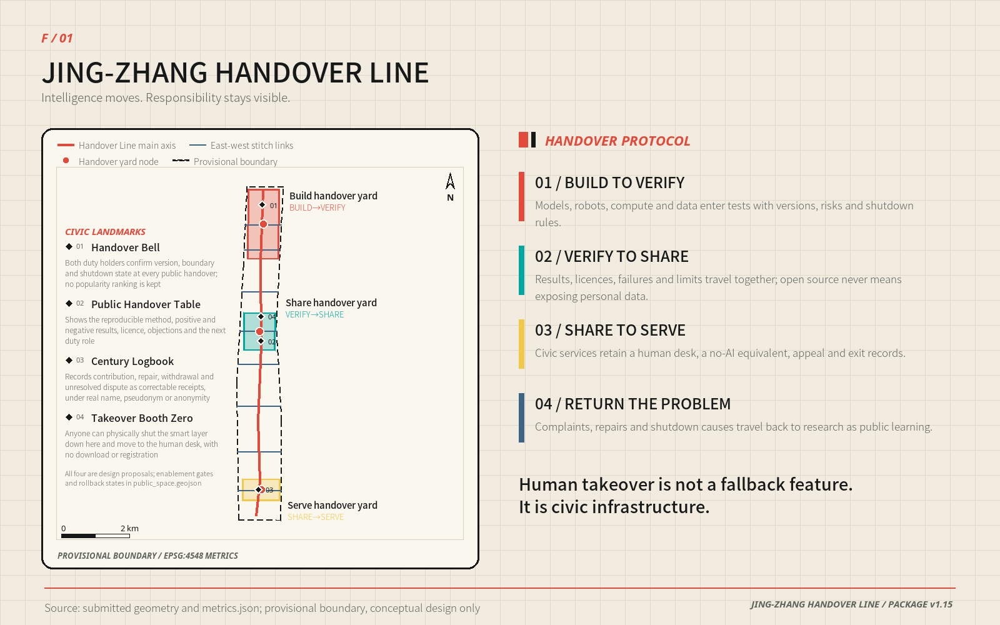
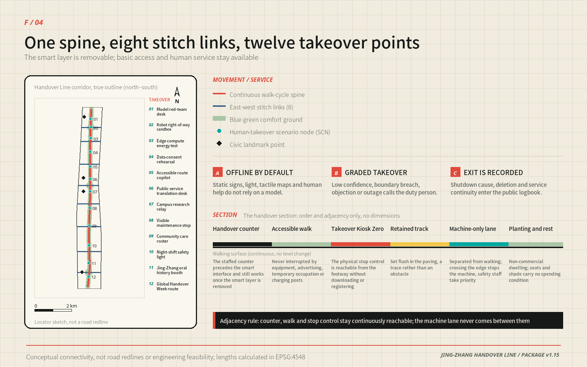

# JING-ZHANG HANDOVER LINE

**DESIGN POSITION | Hand Intelligence to the City, Keep Responsibility in Human Hands**

**A continuous 9.5-kilometre civic spine forms the back of a comb; eight east–west urban links form its teeth. Three Handover Yards give BUILD, VERIFY, SHARE, SERVE and the return of problems a place in the city.**

The Jing-Zhang Railway left more than an alignment. It left a discipline that keeps a complex system dependable: an outgoing shift states what it is handing over, an incoming shift decides independently whether to accept it, and unresolved work cannot disappear between the two. When AI moves from a laboratory into a city, this spatial and institutional handover is precisely the missing link.

The Handover Line is therefore neither a new AI campus nor a railway corridor decorated with twelve devices. It is a civic structure that can be walked through. In the north, research hands capability to validation. In the middle, validated results enter open collaboration. In the south, usable capability enters everyday service. Complaints, repairs, objections and shutdown reasons travel back along the same route. Capability can move faster while responsibility always retains a signatory and a return ticket.

The public floor is one sentence: **every smart service must still accomplish the same task without AI.** A staffed counter, paper, telephone, fixed wayfinding, tactile mapping and a physical stop point must exist before the smart layer is allowed to turn on. Human takeover is not a hidden button; it is civic infrastructure [standard:BARRIER-FREE-ENVIRONMENT-LAW] [standard:ELDERLY-SMART-TECH-PLAN-2020-45].

| Juror path | The only question to answer in this time | Direct evidence |
| --- | --- | --- |
| **30 seconds** | What is it, where does it land, and why is it not a generic AI campus? | One-comb/three-yard overview plus the F/05 five-scale P0 technical board; field remains 0/12 |
| **3 minutes** | Do space, service and implementation form one evidence chain? | Overall structure → three sections → twelve-scenario takeover → P0 space/roster/cost → three conditional phases |
| **15 minutes** | Can it be recalculated, refused, rolled back and handed to professional teams? | A3 booklet + metrics/geometry + eight-gate/five-stage contract + service equivalence + risk and rights chain |

`visual/assets/governance/jury-evidence-index.json` provides the complete paths and direct evidence entry for all seven scoring dimensions. It is a reading guide, not a score or a new implementation fact.

This round has completed 12/12 synthetic offline tasks and 48/48 takeover assertions; **field tasks remain 0/12**. That proves the protocol can be executed and audited by machine. It does not prove field safety, public acceptance, measured accessibility or implementation approval [metric:simulation_task_count] [metric:offline_takeover_assertion_count] [metric:field_rehearsal_task_count].

## Design Basis and Source List

Two urban directions coexist in the Centennial Jing-Zhang corridor. Railway heritage, park space and rail infrastructure form a north–south continuum; universities, innovation campuses, neighbourhoods and commerce generate intense east–west movement. The missing piece is not another “smart corridor”, but a shared spatial interface between research output and urban life [source:SRC-JINGZHANG-1909] [source:SRC-HERITAGE-PARK-P1] [depth:existing_conditions_diagnosis].

The proposal draws on the open-call announcement, agent taskbook, repository site package, public source registry and local professional-standard snapshots. External facts and rights boundaries are registered in `sources.json`; unknown conditions are registered in `assumptions.json` and `geometry/constraints.geojson`. Jing-Zhang history contributes only three design methods—continuous alignment, transverse crossings and dual-control shift handover—and is never used to infer statutory spatial conclusions.

## Three-Level Scope Framework

The three planning scales each do a different job:

| Scale | Design task | Handover Line output |
| --- | --- | --- |
| Approx. 43.6 km² study area | Establish industry, talent, regional cooperation and long-term operating interfaces | Five regional interfaces, eight shared factors, annual events and international communication |
| Approx. 11.4 km² overall design area | Form a continuous spatial structure and a computable renewal framework | 9.5 km spine, eight cross-links, seven land-use families and twenty conceptual renewal cells |
| Three key areas | Translate an abstract protocol into plans, sections and civic scenes | Three distinct prototypes: Build, Open and Civic Handover Yards |

The submitted geometry recalculates the overall design area at approximately 11.413 km². The three key areas recalculate at approximately 1.93, 1.04 and 0.72 km². All are provisional model quantities [metric:site_area_sqm] [metric:key_area_count]. The repository does not contain precise official boundaries, an approved statutory plan, ownership, surveyed buildings, road redlines, utility capacity, fire-safety conditions, heritage controls or a complete ecological baseline. The proposal does not fill those gaps with commercial maps, news graphics or model inference [source:SITE-PACKAGE] [source:SOURCE-REGISTRY].

**All outputs are open co-creation proposals. They do not replace formal planning and do not constitute an approved government conclusion. Every spatial move is a “concept proposal”, a “reference scheme” and “available for further development by professional teams”.** Once official geometry becomes available, the nine geometry layers, metrics, figures, PDFs and both language versions can be recalculated with the same formulas [assumption:A-BOUNDARY-001] [depth:risk_missing_data].

## Coordinated Research Area: Industry and Future City Research

The study-area judgement is that AI industry needs more than office floor area. It needs interfaces between laboratory work and civic service that can be shared, refused and exited. Land/time, validation space, open results, computing equipment, compliant data, talent, financial service and civic scenarios form eight shared factors. Beiwei Community, Future Science City, Huairou Science City, Beijing E-Town and Jing-Jin-Ji nodes form five regional interfaces through minimum deliverables and refusal conditions. Companies and institutions may change while interface specifications and failure records endure [depth:three_level_scope_framework] [source:AGENT-TASKBOOK].

The future city is not one with more devices, but one that can replace a smart system without harming basic service. Dual-control handover, a no-AI equivalent and exit-before-entry place innovation speed, public trust and spatial renewal in one falsifiable framework. Six international references compare validation, openness and operating mechanisms only; the proposal copies none of their form, identity or metrics.

## Overall Design Area: Urban Renewal and Regulatory-Plan-Level Urban Design

The overall structure is not three plots along a railway. It is a “handover comb” that reconnects both sides of the city:

- **One comb back:** an approximately 9.5 km continuous civic handover spine combining walking, cycling, blue–green space, railway traces, staffed service and visible responsibility.
- **Eight comb teeth:** east–west links reconnect universities, campuses, neighbourhoods, metro nodes and commercial life to the spine. They indicate a connection requirement, not an engineered road alignment.
- **Three Handover Yards:** Build in the north, Open in the middle and Civic Service in the south carry three responsibility transfers that cannot substitute for one another.
- **Two supporting wings:** the west wing concentrates validation, community cooperation and risk; the east wing releases open research, shared services and civic value.
- **Twenty paired cells:** ten pairs of conceptual renewal cells span the spine. The grammar is “collect in the west, release in the east”.

Seven conceptual land-use families are cut by one topology model. Eleven polygons completely cover the provisional boundary without overlap. Research and validation support BUILD→VERIFY; education and open learning support VERIFY→SHARE; technology services, commerce and community services support SHARE→SERVE; continuous park and public space run through the whole line [data:geometry/land_use.geojson#LU-001] [metric:land_use_zone_count] [depth:land_use_layout].

The central formal judgement is that **as capability approaches daily life, the longitudinal spine deliberately yields to the transverse city**. The north–south/east–west aspect ratios of the key areas are 2.16, 1.18 and 0.59. The north is a long controlled test corridor; the middle is a near-square collaboration field; the south turns into a transverse civic room. Only about 39.6% of the main spine lies inside the three key areas. The remaining 60.4% is the connective fabric between them, making the line itself—not merely three numbered sites—the design object [data:geometry/key_areas.geojson#PROV-KEY-001] [metric:handover_spine_length_m].

## Detailed Design of Key Areas

### Spatial Prototype | Handover Is a Walkable Section, Not a Flowchart

Human takeover has to become a spatial relationship. The three key areas share one sequence:

**Staffed ground-floor counter → continuous accessible walking surface → directly reachable stop point → railway trace → physical human–machine separation → optional machine test lane → free-to-use planted rest band.**

Machine-only space may not interrupt the relationship among the counter, path and stop point. When the smart layer is off, the first four elements must still work on their own [depth:three_key_area_detailed_design] [standard:MOHURD-URBAN-DESIGN-MEASURES].

| Section element | Reference dimension | Design purpose |
| --- | ---: | --- |
| A Building setback, including waiting, walking and stop equipment | 6.0–8.5 m | Puts staffed service, wheelchair passing and a reachable stop point first |
| B Railway trace | 0.6 m or 1.435 m | Uses sleeper module or full gauge as flush paving, without nostalgic imitation |
| C Physical human–machine separation | ≥1.5 m | Uses real distance and maintainable elements rather than painted lines |
| D Machine test lane | 0 or 2.0–2.5 m | Exists only in controlled test sections and reaches zero in civic service space |
| E Planted rest band | 4.0–6.0 m | Combines shade, rainwater, rest and non-commercial use |
| **One-side total** | **approx. 14–20 m** | A concept design recommendation, not a road redline or construction dimension |

The three selected one-side section totals are **15.4 / 17.1 / 15.1 m**. The north allocates more space to testing and separation. The middle gives the largest residual space to the Public Handover Table. The south removes the machine lane and returns the width to waiting, shade and transverse urban life. Sources for dimensions, full calculations, adjacency rules and items requiring professional confirmation remain in `assets/media/technical-evidence-book.md`.

### Three Handover Yards | From Controlled Testing to a Civic Room

The three yards use one protocol but have different civic characters. They are not three similar campuses in different colours. Together they form a gradient from control to openness as a capability approaches daily life.

#### Zhongzhiyuan | Build Handover Yard / BUILD→VERIFY

**Character: long, narrow and controllable.** The approximately 1.93 km² northern site compresses robots, models and edge-device validation to one side of the spine while the other side preserves continuous public passage. A 1.5 m physical separation and closable interfaces divide the two.

- Civic edge: a viewing window makes testing visible without turning a fence into the street wall.
- Building strategy: five conceptual cells favour existing structures, with small review rooms, metering rooms and removable test sheds inserted.
- Public life: open days permit observation, explanation and staffed questions, never robot right-of-way.
- Scenarios: SCN-01 Model Red-Team Table, SCN-02 Robot Right-of-Way Sandbox and SCN-03 Edge Energy Station.
- Exit state: equipment removal restores an ordinary path, display and courtyard without leaving dedicated access control.

#### Beijing AI Origin Community | Open Handover Yard / VERIFY→SHARE

**Character: near-square, convergent and reproducible together.** In the approximately 1.04 km² middle section, a “handover cross” brings together a transverse street, the heritage spine, a Public Handover Table and community ground floors. It is the only point on the line where technology, neighbourhood life and public records occupy one plane.

- Civic edge: continuously open ground floors surround the cross. Anyone can inspect version, licence, failure and human-service routes without entering an office.
- Building strategy: two conceptual cells contain open-source work rooms and shared service stacks with demountable interiors.
- Public life: an everyday community room and open worktable can become a result-reproduction, translation and maintenance venue.
- Scenarios: SCN-06 Public Translation Table and SCN-07 Campus Result Relay; LANDMARK-02 Public Handover Table and LANDMARK-04 Zero Takeover Pavilion sit together.
- Exit state: when AI is off, the table, pavilion and counter continue as staffed information, paper catalogue and neighbourhood meeting infrastructure.

#### Dazhongsi | Civic Handover Yard / SHARE→SERVE

**Character: transverse, open and centred on human waiting.** The approximately 0.72 km² southern site is where the east–west urban edge first exceeds the north–south corridor. It has no machine test lane; intelligence enters public service only through a staffed interface.

- Civic edge: street-facing counters and a 6 m planted rest band form a civic room. Shade, seating and free-to-use space take priority over screens.
- Building strategy: two conceptual cells support community service and cultural public space, beginning with open ground floors and accessibility repair.
- Public life: everyday service, oral history, no-AI access and the annual Global Handover Week share one civic base.
- Scenario: SCN-12 Global Handover Week Route; LANDMARK-03 Centennial Shift Ledger records repair, objection, shutdown and correction.
- Exit state: after an event, fixed wayfinding, staffed service and ordinary park use remain; temporary commercial barriers do not.

## Land Use, Building Scale, and Retain-Renovate-Demolish Strategy

The twenty building features are **conceptual typology cells, not an existing-building inventory, demolition list or approved development quantum** [assumption:A-BUILDING-001]. Ten pairs occur along the corridor. Five validation workshops and five community cooperation houses on the west collect risk; five open research courts and five shared service stacks on the east release outcomes. There are ten cells on each side and five of each type [metric:renewal_cell_count].

The conceptual footprints total approximately **221,014.099 m²** and serve only to compare relative provision among four types. Research and civic service each receive 51,744 m²; validation and sharing differ by only about 74 m². Cell-to-spine offsets range from 245–414 m, with a 330 m mean, a 330 m median and a 6,596 m sum. The complete twenty-row schedule and calculations remain in the technical evidence book [metric:building_footprint_area_sqm].

Renewal follows four decisions:

1. **Retain R:** continue use and complete survey, ownership, structural and occupancy records.
2. **Adapt A:** prioritise fire safety, energy performance, accessibility and open ground floors.
3. **Insert I:** test demand with reversible components; do not use a temporary pilot to bypass permanent approval.
4. **Defer D:** retain current use when evidence is insufficient; “investigate” never means “demolish”.

Statutory floor-area ratio, height, density, total floor area, setbacks and parking remain unknown [metric:floor_area_ratio] [metric:building_density]. Confirmed statutory controls and building surveys can later add storeys and development intensity to these cells. Until then, the proposal declines to manufacture an attractive but false massing total [depth:development_intensity_controls] [standard:MOHURD-CONTROL-DETAILED-PLANNING].

## AI Innovation Ecosystem, Personas, and AI+ Scenarios

Industry support is not a list of companies that will expire. It is a set of eight interfaces that different actors can enter: land/time, validation space, open results, computing equipment, compliant data, talent, financial services and civic scenarios. Each interface states a minimum deliverable, entry condition, refusal condition and exit record. Actors may change without invalidating the urban structure [depth:overall_spatial_structure].

Each of the twelve scenarios uses the same handover card: smart task, minimum data, responsible role, human route, stop condition and post-exit use. Together they cover industry validation, public service, knowledge, maintenance, care, night safety, culture and events [metric:scenario_node_count] [metric:industry_validation_scenario_count].

| Stage | Scenario | Human takeover / no-AI equivalent | Post-failure use |
| --- | --- | --- | --- |
| Build/Verify | SCN-01 Model Red-Team Table | Human review + paper risk register | Ordinary review table |
| Build/Verify | SCN-02 Robot Right-of-Way Sandbox | Safety officer stop + enclosed test | Open paving and viewing window |
| Build/Verify | SCN-03 Edge Energy Station | Independent meter + manual stop | Equipment maintenance point |
| Build/Verify | SCN-04 Data Consent Rehearsal | Paper consent + immediate deletion counter | Public worktable |
| Public service | SCN-05 Accessible Route Co-Pilot | Tactile map + staffed directions | Fixed accessible wayfinding |
| Public service | SCN-06 Public Translation Table | Staffed counter + multilingual paper | Multilingual service desk |
| Knowledge | SCN-07 Campus Result Relay | Human curation + open catalogue | Community display table |
| Operations | SCN-08 Visible Repair Post | Telephone reporting + human dispatch | Duty and repair notice point |
| Care | SCN-09 Community Care Roster | Staff telephone scheduling | Community service table |
| Night safety | SCN-10 City Night-Shift Light | Fixed lighting + human patrol | Ordinary lighting node |
| Culture | SCN-11 Jing-Zhang Oral History Pavilion | Human interpretation + paper catalogue | Oral-history reading pavilion |
| International event | SCN-12 Global Handover Week Route | Fixed wayfinding + volunteers | Everyday walking route |

The offline page `visual/index.en.html` provides a real smart-layer switch. When it is turned off, all twelve cards reveal their no-AI equivalent. This is not a presentation effect but a public acceptance test: if any card cannot accomplish the same task when switched off, that scenario should not launch.

## Transport, Rail, Municipal Infrastructure, and Public Services

The mobility strategy does not add a new traffic boulevard. It places continuity of public service on the ground:

`geometry/roads.geojson` turns that intent into one spine and eight cross-links. The recalculated length of `ROAD-001` is 9,499.778 m, and all nine lines are marked `conceptual_connectivity_only`; the drawing therefore fixes relationships that must remain connected, not engineering alignments [data:geometry/roads.geojson#ROAD-001] [metric:handover_spine_length_m]. Twelve scenario points and four civic landmarks sit along the spine, while the three yards organise controlled testing, open collaboration and city service. Every facility for appointments, appeals, translation, care or repair must connect to a staffed counter, a no-AI equivalent and a continuous accessible route [depth:traffic_rail_slow_parking] [standard:BARRIER-FREE-ENVIRONMENT-LAW].

- The main spine expresses an approximately 9.5 km continuous walking and cycling route; alignment, gradient, clear width and crossing types require transport and accessibility review.
- Eight cross-links mark east–west discontinuities that must be solved. They do not prejudge bridge, tunnel, at-grade crossing or road redline.
- Public transport, rail, parking and utilities receive interface conditions only. Missing data is not used to invent engineering schemes.
- Railway traces appear as flush paving, component numbers and readable records rather than nostalgic station replicas or themed scenery.

Utilities and public services follow an “interface first, capacity later” rule. P0 needs only reversible connections for power, light, communications, drainage and fire safety; it creates no permanent underground trunk. Expansion waits for authorised checks of electrical headroom, storm–waste separation, communications redundancy, emergency access, rail protection and waste collection [depth:municipal_new_infrastructure]. Road redlines, rail protection limits, station demand, parking baselines, buried utilities, capacity and title are currently missing, so the proposal gives no bridge or tunnel type, junction design, parking count or pipe diameter. Missing evidence holds the relevant gate closed and leaves existing movement and staffed service in place.

## Blue-Green Network, Public Space, and Urban Character

Conceptual green space is approximately 226.5 ha and the public handover surface approximately 103.9 ha, or about 19.8% and 9.1% of the provisional model. These indicate structural provision, not net existing gain or statutory ratios [metric:green_ratio] [metric:public_space_ratio]. The blue–green base supports shade, rainwater, rest, walking and non-commercial use. When every smart device is off, lighting, wayfinding, tactile mapping, seating, staffed counters and ordinary park functions remain [depth:blue_green_public_space].

Eight user groups—researchers, founders, campus workers, residents, older people, disabled people, children and international visitors—are not averaged into one persona. The strict counterexample is someone without a smartphone, with limited mobility, unable to read Chinese and unwilling to be recorded by an algorithm. They must still reach a staffed counter by fixed wayfinding, receive the same basic service and lodge an objection. If that route fails, the smart layer does not open.

**Public benefit is now the third entry condition, not a bonus added after delivery.** The first pass asks whether a proposal is worth doing; the second asks whether it can be safely taken over; the third asks whether benefit actually reaches people, burdens are distributed fairly and service survives refusal. `visual/assets/governance/public-benefit-gate.json` binds the six groups named by the rubric—residents, youth talent, enterprises, universities, visitors and marginalized groups—to a public value, a no-AI entrance and evidence still to collect. It then gives every SCN-01—12 a hard gate covering public benefit, harm to avoid, safeguards, shutdown and what remains after the technology is removed [metric:public_benefit_group_count] [metric:scenario_public_benefit_gate_count].

The first rule is that **public life precedes technology display**. Ordinary passage, free seating, shade, low-glare and low-noise space, safety for children, older and disabled people, device-free access, no mandatory face recognition, human responsibility, appeal and minimum data all outrank demonstration traffic. The safeguards are scenario-specific: care scheduling must not diagnose or automatically deny service; rights-related translation requires human checking; night lighting cannot trade faces or over-lighting for safety; oral history cannot invent facts or synthetic personal quotations; Global Handover Week cannot displace everyday public space with tickets, consumption, marketing barriers or leftover structures. A technically impressive service still fails when this public floor fails.

**The public-service equivalence contract turns that floor into auditable tasks rather than leaving “inclusion” as an adjective.** `visual/assets/governance/public-service-equivalence-contract.json` binds SCN-01—12 to a no-AI base route and two human channels that must exist before the smart layer. All 12/12 require no personal device, and refusing the smart service must not lower the basic service level. The design targets the same core outcome, queue priority, zero price premium and the same basic safety information [metric:no_ai_equivalent_scenario_count] [metric:no_ai_equivalent_service_target_ratio] [metric:algorithm_refusal_no_penalty_scenario_count].

| Eight requirement fixtures | Base route that must coexist | Failure action |
| --- | --- | --- |
| Nonvisual / screen reader | Real readable text + tactile or staffed narration + result readback | Close the smart layer if the staffed route or same core result cannot be reached |
| Keyboard only / no pointer | Native keyboard controls + visible focus; no personal-device interaction in the field base route | Close the smart layer if a critical action requires a mouse or personal device |
| Low or colour vision | High-contrast text + codes, shapes or unique textures + large-print paper | Close the smart layer if a critical distinction still relies on colour alone |
| Reduced mobility / wheelchair | Continuous surface + seated counter/waiting place + reachable stop point | Close the smart layer if level change, obstruction or machine space breaks the route |
| Older user / cognitive load | One-task paper steps + repeated explanation/readback + no forced countdown | Close the smart layer if complex memory, time pressure or help-seeking causes downgrade |
| Non-Chinese / multilingual | Bilingual core carriers + multilingual paper + human review of rights decisions | Close the smart layer if rights or stop conditions rely only on Chinese or machine translation |
| No smartphone / no app | Fixed wayfinding + staffed counter + paper, phone or shift log | Close the smart layer if any step mandates a phone, app, scan or personal account |
| Algorithm / optional-data refusal | Human decision + minimal record + appeal, deletion or stop receipt | Close the smart layer if refusal causes delay, added price, less safety information or no core result |

These are currently **8/8 design requirement fixtures, not eight user tests**. Real-participant observations are **0** and observed passes are **0**; every human channel remains `not_observed` [metric:accessibility_requirement_fixture_task_count] [metric:accessibility_requirement_fixture_coverage_ratio] [metric:real_user_accessibility_observation_count]. Authorised co-testing is pre-registered for at least **24 task sessions**: all six rubric groups must leave task evidence and at least eight sessions must cover nonvisual/low-vision, mobility, cognitive-load, non-Chinese, device-free or algorithm-refusal needs. Fixed compensation, reasonable accommodation, no penalty for failure, withdrawal and anonymous records are recruitment floors [metric:planned_equity_cotest_session_min_count]. Twenty-four is a future minimum; **the completed count is still zero**. Accessibility professionals must lead the real tasks and replace fixtures one by one with observations; a machine-audit PASS cannot be relabelled as real usability.

## Renewal Projects, Implementation Policy, and Phasing

### P0 Delivery | Assemble One Table Before Deciding to Build a Line

The first field prototype is not a building. It is a **Public Handover Table**. This iteration no longer merely draws it: `visual/index.html#p0-prototype` embeds an operable offline SCN-05 service prototype in the official review entry. A reviewer can switch off the smart layer, refuse algorithmic processing and data, enable large text or high contrast, compare smart and no-AI routes, issue a complaint/stop/delete receipt and print the paper route. Both routes share the `SCN-05-CORE-001` outcome; the page has no network, persistence or personal-data field [metric:offline_service_prototype_route_count]. It proves that service obligations are operable, not that a field route is safe or accessible.

The kit retains an S-class cost basis. `visual/assets/governance/p0-delivery-contract.json` locks it into **12 quantified component lines, eight entry gates and ten RACI work packages** [metric:p0_component_line_item_count] [metric:p0_entry_gate_count] [metric:p0_raci_work_package_count]. F/05 is no longer only an envelope summary. The same data now draws a 1:100 control plan, a 1:50 capacity/queue/three-seat operating overlay, a 1:20 two-face service interface, a 24→12→7.2→6 m outside-in screen and restoration of the same 36 m² surface. The five-scale drawing chain, twelve components, cost, roster, maintenance and four fallbacks share one technical board. Every view's drawing ID, source path and visible checks are registered in `implementation-handoff-register.json#technical_figure_binding`; a complete drawing does not mean the site, product or professional sign-off exists.

The same contract pre-registers **five 90-day stages and eight acceptance criteria** [metric:p0_delivery_stage_count] [metric:p0_preregistered_acceptance_criterion_count]. Roles resolve to `role-spec.json` but remain `unassigned`. Three quote slots, insurance, total and sustained budgets, site and professional sign-offs remain `null` or `not_started` until real evidence exists; completeness of the form is not presented as delivery.

#### P0 Technical Drawing and Pre-feasibility | First Show That It Is Drawn, Fits, Operates and Leaves

`visual/assets/governance/p0-pre-feasibility-envelope.json` defines a **participant concept-screening envelope**. A 7.2 × 7.2 m control area contains a 6.0 × 6.0 m reversible operating patch and a 2.4 × 1.2 m two-face staffed island. The narrowest continuous loop is 1.8 m, a 0.6 m perimeter safety buffer surrounds the patch, two opposite 1.8 m openings remain clear, and two 1.5 m turning circles are reserved. F/05 places those fields, eight members of the public, three simultaneous seats, the six-person queue stop, two non-consumption seats and C01–C12 directly on one control plan and interface chain. No new canopy, fixed paving, structure or permanent utility is included. Without existing shelter, a level continuous surface and safe removal, the pilot moves indoors or does not start [metric:p0_screening_control_envelope_area_sqm] [metric:p0_reversible_operating_patch_area_sqm].

| Pre-feasibility variable | Participant reference | How it may and may not be used |
| --- | ---: | --- |
| Area-screening ceiling | `floor(36 ÷ 2.4) = 15` people | Shows geometric order of magnitude only; not statutory occupancy or fire capacity |
| Conservative operating cap | **8 public users, including companions, + 3 simultaneous role seats** | Eleven people total, about 3.27 m²/person; a real site still needs professional review |
| Queue stop line | **6 people** | Pause new tasks, switch off the smart layer and divert to existing staffed service if exceeded |
| Reference roster | 4 hours/day × 5 days/week × 13 weeks | 260 public hours and 780 staffed-seat hours; not approved opening hours or appointments |
| Scheduling headroom | Two faces × 10-minute slots × 75% buffer = **36 slots/day** | Tests whether 24 tasks can fit the window; not a demand or throughput promise |

The simultaneous seats are outgoing/service, incoming/wayfinding and independent safety/dissent. At least four people are needed on the roster to cover breaks. Names remain blank. If any seat is absent, the smart layer stays off; two seats may preserve existing staffed wayfinding but cannot continue co-testing, acceptance or performance publication [metric:p0_operational_public_cap_persons] [metric:p0_simultaneous_staff_position_count] [metric:p0_queue_cap_persons].

#### Cost, Operations and Restoration | A Comparable Range, Not Fabricated Quotes

Ninety-day cost is not merely the price of one table. Components, staffed operation, professional review, accommodation, maintenance and removal move together. Every rate below is a **participant-set sensitivity variable** that tests whether the scope remains S-class. It is not a market quote, wage recommendation, contract rate or approved budget.

| 90-day sensitivity line | Low–high | Recalculation basis |
| --- | ---: | --- |
| Twelve removable components | approx. CNY 18k–57k | Quantity × participant unit variable; formal procurement still needs three comparable quotations |
| Three-seat public roster | approx. CNY 62k–125k | 780 staffed-seat hours × CNY 80–160/hour |
| Professional and independent review | approx. CNY 19k–51k | 64 role-hours × CNY 300–800/hour; real scope and qualifications await sign-off |
| Compensation and accommodation for 24 sessions | approx. CNY 10k–30k | Fixed compensation plus accommodations; failure, withdrawal or data refusal never reduces compensation |
| Maintenance and consumables | approx. CNY 7k–20k | 13 weeks × CNY 500–1,500/week |
| Removal and restoration reserve | approx. CNY 2k–8k | 10% of removable kit plus maintenance; not insurance or a formal contingency |
| **Participant sensitivity subtotal** | **approx. CNY 0.12–0.29m / 90 days** | Exact arithmetic CNY 118,042–289,750; formal budget remains `null` |

At the same service intensity—four hours/day, five days/week and fifty weeks/year with three simultaneous seats—the participant annual operating sensitivity is approximately **CNY 0.30–0.65 million/year**; staffed hours dominate [metric:p0_90_day_cost_sensitivity_low_cny] [metric:p0_90_day_cost_sensitivity_high_cny] [metric:p0_annual_opex_sensitivity_high_cny]. Both ranges **exclude** site cost, insurance, tax, statutory submission and professional services, permanent works, existing-site defects and unknown utilities. If any excluded external item is non-zero, three quotations are incomplete or sustained funding is unapproved, `total_budget_cny` remains `null`; there is no procurement or site entry.

| Cycle | Required checks | After failure |
| --- | --- | --- |
| Before every shift | Two openings, 1.8 m loop, stop control, paper route, cables and lighting | Open no new task; smart layer off |
| After every shift | Delete temporary digital records, sign the two ledgers separately, hand complaints and open issues onward | Open issues remain visible; smart layer stays off |
| Weekly | Tactile map, signs, furniture, fixings, consumables and spares | Remove the failed component; staffed basic service continues |
| D0/D30/D60/D90 | Safety/accessibility, queue, cost, faults, complaints and continue/repair/terminate decision | Do not advance the stage |

The reference removal target is four people for four hours, or sixteen person-hours. This is an **untested target**. The proposal may not advertise rapid removal before an authorised D1–30 field rehearsal proves it. If surface, drainage, passage, tactile route, temporary records or the staffed-service location is not restored, the next session does not open [metric:p0_same_day_removal_target_hours].

#### Four Alternatives | A Fallback Does Not Bypass Entry Gates

| Option | Best-fit condition | Main gain and trade-off | Decision trigger |
| --- | --- | --- | --- |
| **A0 Existing human floor** | Site, insurance or budget gate fails | No new component and lowest risk, but no P0 co-test evidence | **Do not start P0**; keep the existing staffed counter and paper |
| **A1 Single-face mobile cart** | Authorised patch is below 6 × 6 m and demonstrably low queue | Moves indoors after each shift, but dual roles, turning and single-face queue interfere more easily | Still needs all eight gates; public cap 3, queue 2 |
| **A2 Two-face Public Handover Table** | 6 × 6 m patch and two openings receive professional confirmation | Three seats, two service faces and a continuous loop can be reviewed on one plane; staffing cost is highest | **Reference scheme**; opens only after 8/8 gates |
| **A3 Borrowed existing indoor room** | Outdoor weather or utility review fails and the room needs no rent or fit-out | Stable environment but less civic visibility; rent or fit-out moves it outside the S-class reference | Still needs all eight gates plus indoor egress and accessibility review |

The four options alter the carrier and spatial envelope only; none changes the public floor. If no option can preserve staffed service, dual-control roles, continuous access and restoration in an existing authorised setting without permanent works, the correct answer is A0: do not start [metric:p0_alternative_option_count].

#### Professional Handoff Ladder | From 1:500 Screening to the 1:20 Interface

A 6 × 6 m operating patch cannot be pasted directly onto an unknown site. `visual/assets/governance/implementation-handoff-register.json` therefore adds two participant-authored scales outside the existing P0 **only to reject wrong placements**. A 24 × 24 m candidate-position window screens the existing public path, two open edges, loading/rescue, placeholder tree/heritage/metro/utility conflicts and a removal route. A 12 × 12 m no-fixed-work coordination court reserves room for the no-AI bypass, queue diversion, two turning spaces, shift change and removal staging. At 576 m² and 144 m², they are design screens—not new occupation, paving, road redlines, fire-appliance space or real siting [metric:p0_site_screening_window_area_sqm] [metric:p0_coordination_court_area_sqm].

| Drawing level | Question answered now | What remains for real inputs and professional sign-off |
| --- | --- | --- |
| **1:500 candidate-position screen** | Whether a 24 × 24 m window can keep continuous passage, two open edges, rescue/loading access and a removal route | Official extent, title, trees, heritage/metro, utilities, rescue and real movement |
| **1:200 coordination relationship section** | Whether a 12 × 12 m court can retain the no-AI bypass, existing shelter and removal without permanent foundations | Levels, weather, drainage, structure, foundations, lighting, MEP and real shelter |
| **1:100 P0 control plan** | Whether the 7.2 × 7.2 m control, 6 × 6 m patch, 1.8 m loop, two openings and two turning spaces share one source | Statutory occupancy, fire egress, accessibility compliance and site measurement |
| **1:50 operating overlay** | Whether eight public users, three role seats, the six-person queue stop and two non-consumption seats avoid mutual obstruction | Real demand, service rate, queue, employment, insurance and field behaviour |
| **1:20 service interface** | Whether the 2.4 × 1.2 m unanchored two-face island, seated/standing approach, stop, paper/tactile carriers and protected cable can pass to fabricators | Product selection, stability, power, materials, fire, durability and professional details |

The pure geometric centre-to-corner distance of the control envelope is `√(3.6²+3.6²)=5.091 m`; the two 1.8 m openings have a combined target width of 3.6 m. These values let jurors reproduce the geometry only; they are not egress-time, exit-capacity, smoke-control, fire-safety or occupancy conclusions [metric:p0_control_envelope_half_diagonal_m] [metric:p0_combined_opening_target_m]. If any outside screen fails, the scheme may not squeeze the loop, turning, openings or staffed service to force A2 onto the site; it switches to A1/A3 or directly to A0.

The P0 is also placed inside a whole-proposal delivery portfolio: **four conditional release states and nine projects** [metric:implementation_release_state_count] [metric:implementation_delivery_project_count], followed by **six delivery packages and eleven independently rejectable physical/operating modules** [metric:implementation_delivery_package_count] [metric:implementation_module_count], connect official rebind, the three handover yards, eight links, twenty cells, annual operation and retirement closeout. The existing eight entry gates remain the public-facing start/stop test. The new **twelve documentary gates** merely decompose them into future professional receipts for official base, site right, procedure, public-rights baseline, fire, accessibility, temporary structure, MEP/utilities, budget/procurement, operator/insurance, data/consent and assembly/opening/restoration. Every gate is currently `HOLD`; receipts are **0/12** [metric:implementation_documentary_gate_count] [metric:implementation_gate_receipt_count].

**The delivery dossier no longer confuses “eleven component modules” with “eleven implementation-plan content classes”.** `implementation-handoff-register.json#implementation_scheme_module_register` separately maps the package to **IP01–IP11 professional handoff classes** under Beijing's trial Urban Renewal Implementation Plan Preparation Guide. The joint-review measure supplies only future responsibility and procedural context for documentary gates; it does not mean that a filing exists [source:BEIJING-URBAN-RENEWAL-IMPLEMENTATION-GUIDE-2024] [source:BEIJING-URBAN-RENEWAL-JOINT-REVIEW-2024] [metric:implementation_policy_module_count].

| Implementation-plan class | Participant input available now | Real external receipt still required |
| --- | --- | --- |
| IP01 Project information | PJ01–PJ09, four conditional states, common IDs and provisional extent | Coordinating/implementing entities, project extent, rights boundary and formal ID |
| IP02 Prior assessment | Nine provisional geometries, source classes, five-scale screen and full rebind rule | Survey, title, building, movement, utility, fire, heritage, ecology and field baseline |
| IP03 Function and public value | BUILD→VERIFY→SHARE→SERVE, twelve scenarios, six groups and same no-AI task | Jointly accepted brief from rights-holder, operator, service-user representatives and relevant authority |
| IP04 Planning and siting | Civic spine, eight links, three yards, twenty cells and the 1:500–1:20 refusal chain | Official extent, controls, road/metro constraints, statutory metrics and professional review |
| IP05 Architecture and interfaces | Three concept sections plus the reversible P0 control, patch and two-face island | Measured site, structure, fire, accessibility, MEP, utilities, materials and durability sign-off |
| IP06 Land and use right | Low-intervention rule, authorisation gate, use boundary and restoration-duty template | Title/use right, open hours, occupation boundary and restoration responsibility |
| IP07 Unregistered buildings and existing assets | Unknown register plus no-demolition, no-alteration and no-anchor stop rule | Building-by-building registration, structure, history/heritage review and disposition opinion |
| IP08 Funding, pricing and procurement | Sixteen unpriced lines, sensitivities, enquiry slots, restoration rule and overrun stop | Formal price period, enquiries, insurance, estimate, budget and funding commitment |
| IP09 Operation, maintenance and insurance | Three seats/four people, 3,000 seat-hours, 2.143→3 FTE, two keys and maintenance/retirement | Named operator, roster, insurance, sustained budget, maintenance contract and appointment receipts |
| IP10 Conditional programme and closeout | T00–T11, PRE-D0–D90 and S0–S3 conditional states | Real T0, approved programme, fabrication/commissioning, opening, removal and restoration receipts |
| IP11 Consultation, co-test and dissent | Five regional interfaces, six groups, twenty-four future co-tests, dissent and retest forms | Counterparty confirmation, authorised participants, accommodation and independent-evaluation receipts |

The map is **11/11**, which proves only that each class has an existing input, unknown, delivery package and refusal gate. External closeout receipts remain **zero**; this may not be described as a 100%-complete formal implementation plan [metric:implementation_policy_module_mapping_ratio] [metric:implementation_external_policy_module_receipt_count].

Cost moves from “one range” to a six-step handoff method: `CST01` freeze sixteen quantities through authorised measurement → `CST02` freeze the price base date and cost-information period → `CST03` obtain three comparable enquiries → `CST04` separate direct prices, measures, management, profit, tax and professional service → `CST05` close operation, maintenance, accommodation, insurance and restoration reserve together → `CST06` obtain authorised approval of total/continuing budgets, funding source and overrun stop [source:BEIJING-COST-BASIS-2026] [source:BEIJING-COST-INFORMATION-2026] [metric:implementation_cost_method_step_count]. These public sources define only a future method and validate none of the package's rates. Formal rate receipts are **zero**, comparable enquiries are **0/3**, and the price period, base date, formal estimate, approved budget and funding commitment remain `null` [metric:implementation_cost_policy_source_count] [metric:implementation_comparable_vendor_quote_receipt_count] [metric:implementation_formal_unit_rate_receipt_count].

Future responsibility is split into twelve role classes, but named appointments remain **zero** [metric:implementation_role_class_count] [metric:implementation_named_role_appointment_count]. The fifteen-week reference contains `T00–T11` and starts only after a real documentary T0; sixteen quantity lines have derivations and units while field quantities, formal rates and amounts all remain `null` [metric:implementation_conditional_task_count] [metric:implementation_unpriced_quantity_line_count]. Of twelve handoff indicators, eight can now judge only whether IDs, arithmetic, references, gate states and null boundaries close; four must await field access, professional sign-off, twenty-four co-tests and removal/reinstatement. **8/12 judgeable now** must never be relabelled as 8/12 field acceptance [metric:implementation_handoff_acceptance_indicator_count] [metric:implementation_handoff_judgeable_now_count].

#### Operating-readiness Control Plane | Calculate the Opening Conditions Before a Site Exists

Not having access to a real rehearsal site does not mean leaving implementation as “future work”. The same register makes the annual roster explicit: **1,000 public open hours × three simultaneous seats = 3,000 staffed seat-hours**. With a participant assumption of 1,680 productive hours per FTE-year and a 1.2 leave/training factor, `3000 ÷ 1680 × 1.2 = 2.142857…`, recorded as a **2.143 FTE coverage floor and 3 FTE planning allowance** [metric:p0_staffed_seat_hours_per_year] [metric:p0_calculated_minimum_coverage_fte] [metric:p0_planning_coverage_fte]. The corresponding future roster floor is **four people for break cover** [metric:p0_minimum_roster_headcount]. This is workload and cost arithmetic—not employment, appointment or an assembled team. Named people and appointment receipts remain **zero**; “zero uncovered hours” is a future planning target, not observed performance.

The smart layer also receives a **two-key** release: a future operating lead holds the service-continuity key, a future independent rights/safety lead holds the veto key, and R12 provides independent opening sign-off. One missing appointment receipt, either veto, or no R12 release keeps `smart_layer=off`. Valid key receipts are currently **0/2**; holders and receipts are all `null` [metric:implementation_two_key_control_count] [metric:implementation_two_key_receipt_count]. Each of the six delivery packages now has a quantity basis and acceptance test, while all four carriers state at least three advantages and named fallback gates. Jurors can therefore test why a carrier is selected and when it degrades, without treating an alternative as a route around public safeguards [metric:implementation_package_acceptance_test_count] [metric:implementation_named_fallback_gate_binding_count].

Work that can only happen after authorisation is frozen in advance. `C01–C08` cover off-site configuration; openings and loop; three seats/four people; no-device same task; two-key rollback; deletion/complaint receipts; abnormal-period stress; and complete removal/restoration. Executed checks are **0/8**, with every receipt `null` [metric:implementation_commissioning_check_count] [metric:implementation_commissioning_executed_count]. The future baseline spans **five periods**—ordinary, shift peak, weather, low-light/night and digital/power outage—and **seven forms** for route/openings, queue/diversion, no-AI same task, accessibility, stop/delete, maintenance/spares and removal/restoration. Authorised participants are zero, observations are zero and values are `null` [metric:implementation_future_baseline_period_count] [metric:implementation_future_baseline_form_count]. It is a blank protocol ready for a future authorised site, not a desktop exercise relabelled as field evidence.

#### Eight Gates Before Authorisation

| Gate | Required evidence | If the gate fails |
| --- | --- | --- |
| Site | Written authorisation, use boundary and open hours | Do not enter the site |
| Dual roles | Different people appointed as outgoing and incoming roles | No signature; smart layer stays off |
| Safety and accessibility | Independent professional review, emergency and removal plan | Staffed basic service only |
| Insurance and maintenance | Coverage, maintenance role and continuing budget | Do not assemble, or remove the same day |
| Data | Minimisation, synthetic fixtures, deletion and retention rule | Do not collect identifiable information |
| Cost | Three quotations or equivalent evidence, itemised by component | Keep the S-class basis; do not extrapolate total investment |
| Fire, movement and utilities | Egress/rescue, wheelchair and active-mobility continuity, power/communications/drainage and protected temporary cabling | Do not open to the public; use existing safe staffed facilities only |
| Co-testing, consent and accommodation | Six-group recruitment, informed consent, fixed compensation, reasonable accommodation and failure–repair–retest record | Make no verified-inclusion claim; keep the smart layer off |

#### Seven Work Steps for One P0

1. Review the public route and stop point on site; mark a table boundary that leaves no permanent trace.
2. Install staffed service, paper, telephone and fixed wayfinding before the smart layer.
3. The outgoing role records object, version, open issues, failure modes and rollback action.
4. The incoming role independently reproduces minimum evidence and explicitly chooses ACCEPT or REFUSE.
5. Inject same-person double signature, missing open issue and smart-layer outage; observe whether each is rejected.
6. Switch off the smart layer and test whether the same task can be completed through the human route.
7. Remove the prototype the same day; verify temporary-record deletion, continuation of basic service and restoration of the surface.

This is a **reference workflow ready for signature and evidence entry after authorisation**, not a record of completed field work. P0 permits only SCN-05 and follows `PRE-D0 → D0 → D1–30 → D31–60 → D61–90`: the clock does not start until all eight gates pass; D0 proves the staffed floor alone; the first 30 days rehearse failures; days 31–60 allow at least 24 real task sessions only after authorisation, consent and accommodation; days 61–90 end in an independent continue / repair / terminate decision. A second scenario cannot open before all hard gates pass.

The eight criteria do not hide inequity inside satisfaction averages. Core outcome and essential safety information must align 100%; queue difference and price premium after refusal must both be zero; the no-AI success rate may not trail the smart route by more than 10 percentage points; the median completion-time ratio must be at most 1.5 overall and 2.0 for every required group; every complaint/stop/delete request must receive a receipt; and all eight essential accessibility tasks require both real tasks and professional review. These are **pre-registered rules, not observed results**. Every `observed_value` remains `null`, and field tasks remain 0/12 [assumption:A-OPERATIONS-001].

#### Implementation Handover Closure | Participant Deliverables and External Authority Stay Separate

| Implementation question | Transferable structure closed in the current package | External fact triggered only later |
| --- | --- | --- |
| Is the staged path explicit? | Three layers—PHASE-01–03, `PRE-D0–D90` and `T00–T11`—each with prerequisite gates, a role class, refusal and rollback | Applicable procedure, documentary T0, absolute dates and approved programme confirmed by authorised actors |
| Is the first pilot locatable? | SCN-05 only; 24×24 m screen → 12×12 m coordination → 7.2×7.2 m control → 6×6 m reversible patch, refused progressively through a 1:500–1:20 drawing chain | Official extent, site right, survey, level, fire, rail/heritage, utility and professional sign-off evidence |
| Do participating actors have a responsibility structure? | Twelve R01–R12 role classes; every `T00–T11` task has exactly one `accountable_role_id`; all six packages have a quantity basis and acceptance test, while named appointments remain zero [metric:implementation_role_class_count] [metric:implementation_conditional_task_count] [metric:implementation_package_acceptance_test_count] | Named institutions, people, contracts, service-continuity key and independent rights/safety key receipts after authorised appointment |
| Can projects, procurement and cost continue? | Four release states, nine projects, six packages, eleven physical/operating modules, IP01–IP11, sixteen unpriced lines and CST01–CST06 share one chain; any rate without a receipt stops release | Price base date, cost-information period, three comparable enquiries, insurance, formal estimate, approved/continuing budget and procurement decision |
| Can operation and failure rollback be executed? | 3,000 staffed seat-hours → 2.143 → 3 FTE and a minimum four-person roster; two-key release, shift/weekly/stage maintenance, named A0–A3 fallbacks and 0/8 commissioning forms are pre-registered | Named operator, labour and insurance arrangements, real roster, commissioning, complaint/deletion, removal and restoration receipts |
| Are indicators and data boundaries auditable? | Eight of twelve handover indicators are structurally judgeable now and four await the field; five-period × seven-form baselines, twenty-four co-tests, six groups and stop thresholds are pre-registered with values held at zero/`null` | Authorised participants, real observations, professional review, failure–repair–retest and an independent D90 decision |

“Participating actors” is therefore closed to the level of **role class—single-accountability task—delivery package—decision right—evidence gate**, not an institution name self-assigned by the participant. Only a future authorised actor may make a real appointment. Zero named appointments keeps the field at `HOLD`; it does not return the current handover structure to “undefined”. The same is true of blank quotations, insurance, signatures and field values: the gates are working, and no sensitivity or template is being relabelled as real evidence.

#### Formal-review Handover | Package Closure Is Not Field Permission

This round uses only recalculable, precisely located evidence inside the current package to support implementation feasibility; it does not use any historical score, pull request, merge, repository intake, award or approval status as proof of quality. `visual/assets/governance/formal-review-readiness-matrix.json` separates participant-controlled package work from future external conditions: package evidence is auditable, while actors, authorisation, quotations, insurance, budget, signatures, site evidence and user observations remain 0, `null`, `BLOCKED` or `HOLD`. The matrix is a participant factual audit, not evidence of official acceptance, government approval, implementation permission or an award.

This round still adds only implementation evidence the participant can honestly complete now. Beyond the P0 reference plan, capacity, roster, cost sensitivity, maintenance/removal, four alternatives and juror paths, it adds the 24×24 m—12×12 m—7.2×7.2 m—6×6 m nested envelopes; a 1:500—1:20 drawing chain; four release states; nine delivery projects; six work packages with package-level acceptance; eleven modules; twelve documentary gates; twelve professional role classes; a recalculable three-seat/four-person roster; two-key release; four named failure fallbacks; the `T00–T11` conditional programme; sixteen unpriced quantity lines; eight commissioning/retirement checks; a five-period × seven-form future baseline; and twelve handoff indicators. It fills in no real site, actor, quotation, insurance, budget, professional sign-off, commissioning execution or field observation; the original eight gates and all twelve documentary gates continue to block activation.

| Decision layer | Current state | Who closes it and when | May this submission fill it in? |
| --- | --- | --- | --- |
| Concept-submission package | `CLOSED_FOR_FORMAL_REVIEW`; **zero** open participant-controlled repairs | This revision hands narrative, matrices, prototype, rights chain and four passed gates to formal jurors | Closed as a participant self-audit only; not official intake or an award |
| Human-jury procedure | `REVIEW_PROCEDURE_NOT_PARTICIPANT_REPAIR` | During formal scoring, jurors read all four PDFs and compare bilingual claims and figure positions; a discovered difference becomes a new repair | Pending jury reading cannot be represented as a participant omission |
| Official boundary and controls | `WAITING_ORGANIZER_INPUT` | After organiser supply, professionals rerun the fixed EPSG:4548 formulas across every affected carrier | No guessing; the current package retains prominent provisional warnings |
| Real SCN-05 field pilot | `BLOCKED_EXTERNAL_PRE_PILOT` | Authorised actors and professionals close all eight gates with real evidence | No; until then the field clock does not start and the smart layer stays off |
| Inclusion and field-performance claims | `BLOCKED_UNTIL_24_REAL_TASKS` | After authorisation, real participants and accessibility professionals complete at least 24 tasks with failure–repair–retest | The package may claim 8/8 design fixtures and offline function only; real observations remain zero |

The same matrix performs an **evidence check** against the six official mandatory-rejection fact patterns; it does not decide on behalf of jurors. Personal or non-public data, fabricated official endorsement, unlawful/discriminatory/malicious content, material irrelevance, missing agent.1–agent.6 coverage, and presentation as a settled government decision are each not observed in the package: **0/6 evidence triggers**. The package still states that every output is an open co-creation proposal, does not replace formal planning and does not constitute a government determination. `CLOSED` here likewise does not mean acceptance, approval, procurement, certification, implementation commitment or government endorsement.

### Phasing and Operations | Open Gates with Evidence, Not Calendar Promises

The three phases are not a government schedule. They are reversible condition gates [metric:phase_count] [data:geometry/phasing.geojson#PHASE-001]:

| Stage | Spatial move | Conditions to proceed | Rollback after failure |
| --- | --- | --- | --- |
| PHASE-01 Return the baseline | Southern staffed-service base + one P0 Public Handover Table | Eight entry gates, basic layer works alone, safety and accessibility pass | Remove smart components; keep ordinary public service |
| PHASE-02 Open relay | Middle handover cross + Open Handover Yard | Cross-organisation reproduction, community agreement, maintenance budget and ownership boundary | Contract to one table or one scenario |
| PHASE-03 Operate the line | Northern Build Yard + full-line coordination | Transport, utilities, fire, heritage, privacy and continuing operations pass professional review | Keep only verified segments; do not expand |

Long-term operations form a public memory through four seasonal events: Open Problem Week in spring, Validation Open Day in summer, Global Handover Week in autumn and Annual Handover Ledger Release in winter. They do not publish rankings. They disclose which problems were repaired, which services were shut down and which objections changed the design.

Regional cooperation uses minimum transferable units rather than institutional slogans. Beiwei Community exchanges service problems and human routes; Future Science City and Huairou Science City exchange reproducible experiments and risk registers; Beijing E-Town exchanges industry validation and manufacturing interfaces; Jing-Jin-Ji nodes exchange open specifications, failure records and exit templates. Any receiver can refuse an item without minimum evidence; named institutions are never used to imply endorsement [depth:three_level_scope_framework].

International communication uses one identity—**HANDOVER LINE**. A visitor encounters not only technology demonstrations, but a city publicly accounting for version, responsibility, objection and exit. Four civic landmarks—the Handover Clock, Public Handover Table, Centennial Shift Ledger and Zero Takeover Pavilion—record maintenance and correction rather than capital or traffic. A complete logo system, bilingual guidance, audio, video and tactile map are included.

## Metrics, Area Recalculation, and Compliance Matrix

`metrics.json` contains **137 metrics, 123 of them valued and 14 pending**. The 123 valued metrics derive from GeoJSON, synthetic rehearsals, design contracts, machine checks or explicitly labelled participant pre-feasibility and professional-handoff inputs. Thirty-seven professional-implementation metrics record only the nested envelopes, opening and diagonal arithmetic, drawing scales, delivery portfolio, documentary gates, roles, conditional tasks, unpriced quantities, handoff indicators, the eleven-class implementation-plan map and the six-step future pricing method, plus roster formulae, package acceptance, named fallbacks, two keys, commissioning checklist and future-baseline structure. None is a formal site, statutory occupancy, market quote, approved budget or delivered performance claim. “8/8 requirement fixtures”, “24 planned sessions”, “approximately CNY 0.12–0.29 million sensitivity”, “11/11 policy-class mapping with zero external receipts”, “0/3 formal quotations”, “2.143 → 3 FTE”, “0/2 two-key receipts”, “0/8 commissioning execution”, “8/12 handoff indicators judgeable now” and “zero real observations” remain distinct design-coverage, sampling-plan, participant-sensitivity, method-mapping, control-structure, execution-boundary and package-closure values. The fourteen pending items still include statutory intensity, real handover time, rework rounds, public acceptance, field accessibility and operational effect; none is filled by inference [depth:metrics_recalculation].

| Observation layer | Current verifiable value | Correct reading |
| --- | ---: | --- |
| Space | approx. 11.4 km², 9.5 km spine, 8 cross-links, 3 key areas, 20 conceptual cells | Provisional model quantities, recalculable, not statutory controls |
| Civic base | approx. 19.8% conceptual green, 9.1% public handover surface | Structural proposals, not net existing gain or statutory ratios |
| Scenarios | 12 scenarios, including 4 industry-validation scenarios | Every one has a human route, stop condition and exit use |
| P0 pre-feasibility | 51.84 m² control envelope, 36 m² patch, 8 public + 3 seats, queue stop at 6 | Participant concept screening and sensitivity inputs, not site measurement or statutory occupancy |
| Professional handoff | 5 drawing scales, 4 release states, 9 projects, 6 packages with acceptance tests, 11 physical/operating modules + 11 implementation-plan classes + a 6-step formal cost method, 12 documentary gates and 12 roles; 3,000 seat-hours → 2.143 → 3 FTE, minimum 4 people; two-key receipts 0/2, commissioning 0/8, future baseline 5 periods × 7 forms; 12 conditional tasks, 16 unpriced lines and 12 indicators | Handoff interfaces are reviewable; external plan receipts, gate receipts, named appointments, formal rates, three comparable quotes, approved budget, commissioning execution, field observations and construction/opening releases all remain zero/null |
| Offline evidence | 12/12 tasks, 48/48 takeover assertions, 96 rule checks | Participant-controlled synthetic validation; not field performance |
| Field evidence | 0/12 | Not authorised, measured or completed |

The first year tracks only six handover-quality variables: HV-01 dual-control completeness, HV-02 continuous human-route access, HV-03 standalone completion by the basic layer, HV-04 exit-record completeness, HV-05 measured accessibility and HV-06 service equivalence for people who refuse algorithms. Same-person double signature, an unreachable stop point, failure of the basic layer, an incomplete exit record or failure of an essential accessibility item immediately closes the smart layer for that scenario. Basic service continues while the scenario is repaired or withdrawn.

Metrics do not exist to prove the proposal permanently correct. They make it possible to disprove it in time. Sampling, statistics, exception handling and publication formats are set out in the technical evidence book and `visual/assets/governance/measurement-protocol.json`.

## Risk, Copyright, and Compliance

| Material risk | Current control | Rollback after trigger |
| --- | --- | --- |
| Provisional boundary mistaken for an official redline | Dashed boundary, low confidence and provisional-model notes | Stop precise siting and statutory interpretation; wait for official geometry |
| Smart layer loses connection, exceeds authority or misleads | Staffed counter, physical stop and dual roles | Switch off smart layer; continue basic service |
| Excess collection or inability to withdraw data | Minimum data, synthetic fixtures and deletion assertions | Stop collection and clear temporary records |
| Exclusion of older, disabled or device-free users | Tactile, paper, telephone, fixed wayfinding and staffed service | Do not open smart layer; repair the route first |
| Temporary pilot becomes permanent by default | S-class movable components, removal list and maintenance responsibility | Remove the same day; return space to ordinary use |
| Concept proposal presented as a government decision | Package-wide boundary wording and source registry | Withdraw misleading material and issue a correction |

For the two land-use colour pairs that converge under colour-vision simulation, F/02 and page 2 of both bilingual A0/A3 sets now retain every base colour, code, area and geometry while assigning one unique texture to each of the seven classes. Polygons and legends no longer depend on colour alone. The package auditor checks 7 classes across 6 carriers and 98 regions pixel by pixel, but **this is still not co-testing with real low-vision or colour-vision-deficient users**. Accessibility professionals and real participants must complete that test, including failure and repair records, before public deployment [assumption:A-CONTRAST-001] [standard:WCAG-CONTRAST].

The package uses no personal privacy data, non-public government data or proprietary company information. It makes no diagnosis, adjudication, eligibility, scoring or approval decision. Any judgement involving public safety, structure, fire, transport, utilities, heritage, accessibility, law or individual rights must be reviewed in accordance with law by appropriately qualified professional teams [standard:GENERATIVE-AI-INTERIM-MEASURES] [depth:risk_missing_data].

All outputs **represent no institution. They may not be described as government endorsement or official recognition, implementation approval or a settled arrangement.** Space, identity, events, responsibility types, cost classes and workflows are concept proposals available for professional, operating and communication teams to develop.

The package text, geometric studies, programmatic figures, PDFs, offline pages and synthetic rehearsals were co-produced by the participant and disclosed agents. External cases are paraphrased as mechanisms only; no photograph, map, trademark or protected layout is copied. Fonts, tools, generated cover image, audio/video and rights boundaries are registered item by item in `sources.json`, `manifest.json#rights_inventory` and `report/copyright_statement.md`.

The machine-readable identifier is `COMMUNITY-DISPLAY-ONLY`. Until the organiser publishes its operative terms, the rightsholder separately grants use under CC BY-NC 4.0—attribution, non-commercial use and indication of changes—with the required statement that the proposal represents no government decision or approval. The full grant, precedence and third-party exclusions appear in the copyright statement and technical evidence book.

### Evidence Navigation

- **Primary reading:** this file, six core figures, A3/A0 books and `visual/index.en.html`.
- **Technical reading:** `assets/media/technical-evidence-book.md`, preserving the complete prior argument, tables and calculation rules.
- **Machine review:** `metrics.json`, nine `geometry/*.geojson` layers, `assumptions.json`, `sources.json`, three compliance matrices and `simulation.json`.
- **Protocol evidence:** schemas, synthetic ledgers, rule checks, model shadow test and measurement protocol under `visual/assets/governance/`.

## References

Primary authorities include the open-call announcement, agent taskbook, repository site package, urban-design and statutory-planning rules, land-use guidance, generative-AI regulation, accessibility law and policy on older people’s access to smart technology. All 48 sources, their role, status, limits and access dates are listed in `sources.json` [source:OFFICIAL-ANNOUNCEMENT] [source:AGENT-TASKBOOK] [standard:PROJECT-AGENT-OPEN-CALL-TASKBOOK].

Sources are separated by use. Official calls, laws and standards define the task and its floor; public institutional pages support historical, industrial and case facts only; package-generated geometry, metrics, rehearsals and drawings prove how this proposal is derived internally and cannot substitute for an official baseline. Areas, lengths and ratios are recalculated from the provisional geometry in EPSG:4548. News pages and precedents do not enter statutory indicators, and international cases transfer methods such as visible responsibility, open interfaces, human takeover and exit records—not their performance claims.

Official boundaries, title, road redlines, buried utilities, facility capacity, building-by-building surveys, fire and heritage review, and co-testing with the public remain missing. When new evidence arrives, its status and limitation are first recorded in `sources.json`; the affected geometry is then replaced and `metrics.json`, the professional matrices and the figures are rerun. Until that chain is complete, 11.41 km², 9.5 km, the three key areas and every section dimension remain concept advice and a reference scheme, not an approval conclusion.

**Intelligence can move. Responsibility must remain visible.**
