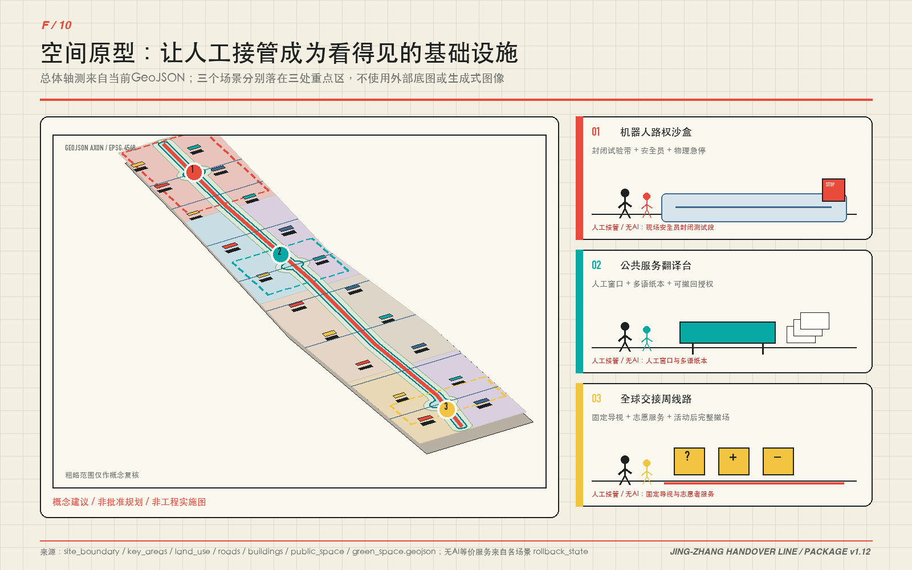
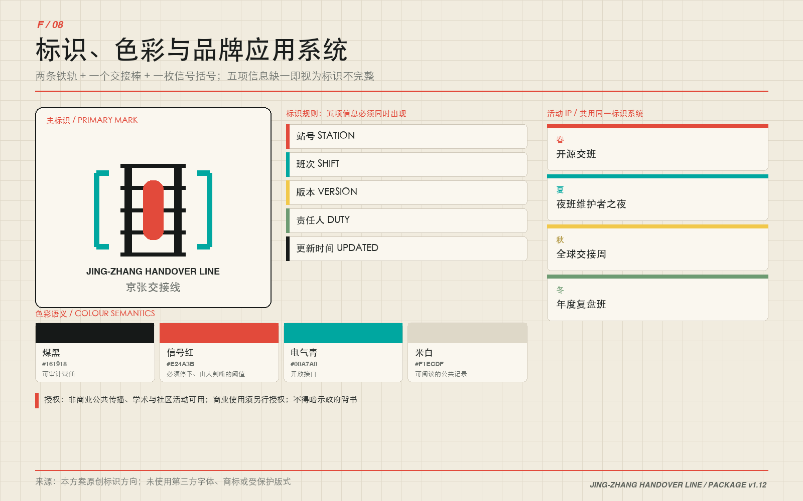
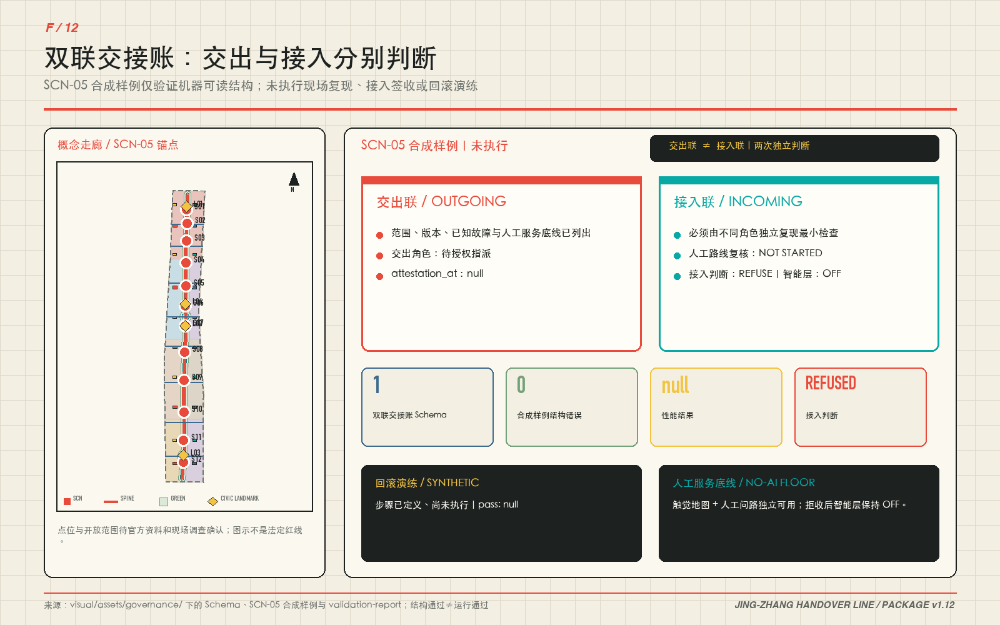
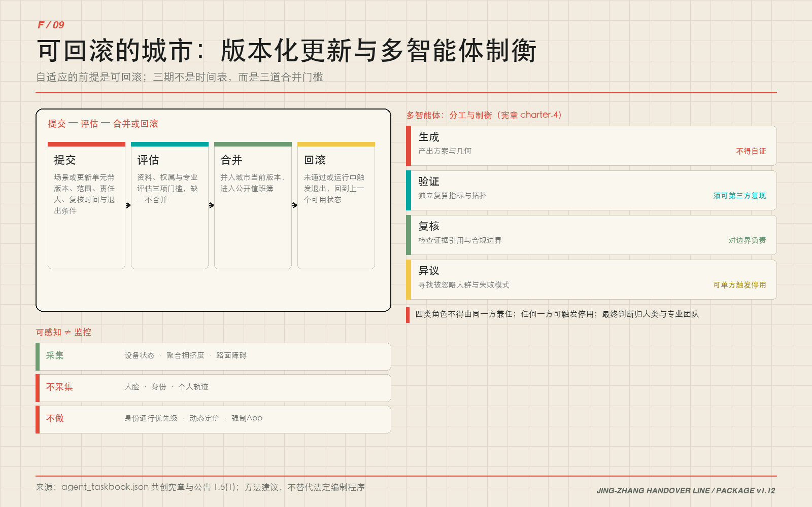
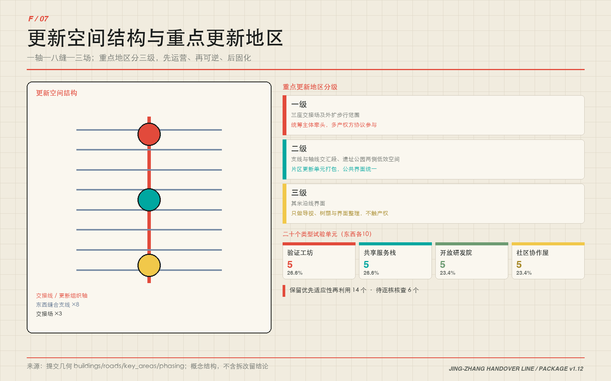
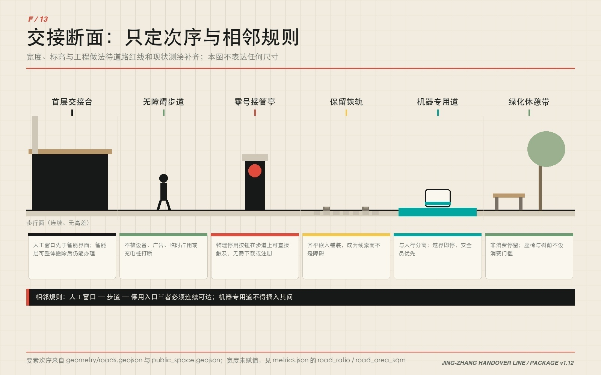
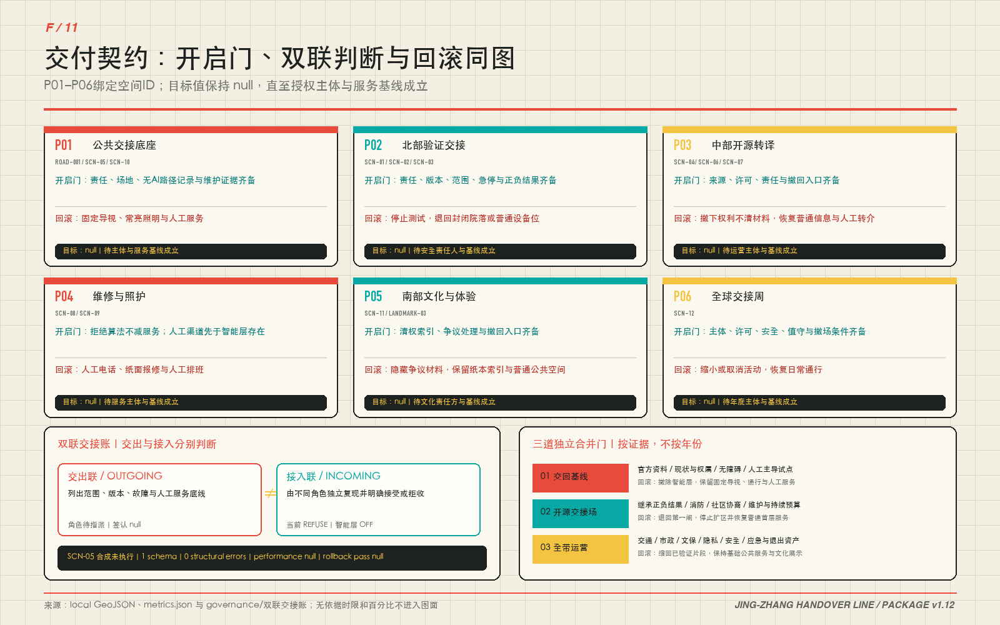

# 京张交接线 / JING-ZHANG HANDOVER LINE

> 把智能交给城市，把责任交到人手中。

本方案把京张铁路最朴素也最重要的制度——交接班——转译为AI时代的城市空间协议。研究把模型交给验证，验证把能力交给开源社区，社区把服务交给市民；当系统不确定、失联、越界或被人质疑时，控制权必须清楚地交回人手中。因此“一条交接线、三座交接场、两翼支撑、十二个可逆场景”既是空间结构，也是公共责任结构。所有精准几何均为可复算的概念建议，所有法定控制均等待专业团队和政府部门确认。

## 一页执行摘要 / Executive Brief

| 评审问题 | 京张交接线的回答 | 可核验成果 |
| --- | --- | --- |
| 核心命题 | 把铁路交接班转译为城市AI协议：能力可以流动，责任必须有人签收 | 双联交接账 0.3 与十二张可逆场景卡 |
| 空间响应 | 一条交接线、三座交接场、两翼支撑、八条缝合支线、二十个更新类型单元 | 九类 GeoJSON、十一张证据图、A3 图册与 A0 展板 |
| 合规锚点 | “可停用、可投诉、无AI等价服务”中，法定出处与本方案自设标准逐行分列；自设标准不写成普遍法定义务 | 合规基线表四列对照；生成式AI服务管理暂行办法、无障碍环境建设法、老年人智能技术方案（来源登记见下段） |
| 实施起点 | 先做协议、导视与低风险人工主导试点；三期是三道合并门槛，不是时间表 | 六个行动包、三道条件闸门、[metric:phase_count] |
| 公共价值 | 任何人可在不使用AI的前提下获得等价基础服务，并能触发停用与申诉 | 组件库十项、接管亭物理停用入口、公开值班簿 |
| 证据状态 | 几何与指标在 EPSG:4548 可复算；区级公开统计只校准问题，不进入指标 | 场地面积指标与海淀区统计公报（来源登记见下段） |
| 决策边界 | 全部空间、品牌、活动、时限与角色安排均为概念建议，不是法定规划或政府承诺 | 风险章节、退出条件、assumptions.json |

上表「合规锚点」一行对应 [source:GENERATIVE-AI-INTERIM-MEASURES]、[source:BARRIER-FREE-ENVIRONMENT-LAW] 与 [source:ELDERLY-SMART-TECH-PLAN]；「证据状态」一行对应 [metric:site_area_sqm] 与 [source:HAIDIAN-2025-STATISTICAL-BULLETIN]。此处引用键写在表下而非单元格内，是因为该表每行承载多条锚点，逐格标注反而割裂阅读；本包其余表格（如用地面积、专业深度）则每行只挂一个引用键，直接写在单元格里。两种写法在离线 HTML 中都渲染为证据条，不会出现未渲染的原始标记。

English brief — Jing-Zhang Handover Line translates the railway shift-handover — the most ordinary and most rigorous institution the line ever produced — into an urban protocol for AI. Capability may move from research to validation, from validation to open source, and from open source to daily public service; accountability may not move without a named person signing for it. One continuous handover line links three Handover Grounds, two supporting wings and twelve reversible scenarios, each carrying human takeover, a non-AI equivalent service and an exit condition. Every geometry is a recomputable conceptual proposal; every statutory control awaits confirmation by qualified professionals and government bodies.

## 设计依据与资料清单

方案以征集公告、面向智能体任务书和仓库正式资料包为任务依据。公告定义43.6平方公里统筹研究范围、约11.4平方公里总体设计范围与三处重点区域；资料包提供枚举、模式、临时几何和校验工具，但明确缺少官方红线、控规、道路、权属、市政、消防、文保与完整现状建筑资料。本包据此把事实、推断和设计分成三栏：公开事实进入来源登记；临时边界保留 official_boundary=false；新增空间只标记 design_proposal。五个证据入口各自承担一种角色：任务定义 [source:OFFICIAL-ANNOUNCEMENT]、任务分解 [source:AGENT-TASKBOOK]、资料底板 [source:SITE-PACKAGE]、使用边界 [source:SOURCE-REGISTRY]、事实导航 [source:PROCESSED-FACT-PACK]。

本次计算使用 [source:BOUNDARY-SOURCE] 和 [source:KEY-AREA-SOURCE]，对应 [data:geometry/site_boundary.geojson#SITE-001] 与 [data:geometry/key_areas.geojson#PROV-KEY-001]。它们只支持方案生成、比较、自检和展示，不是官方红线或精确面积依据；官方多边形发布后，九类几何、全部中英文图件、两套双语PDF与全部指标必须重新生成。

控规、建筑设计与用地表达分别响应 [standard:MOHURD-CONTROL-DETAILED-PLANNING]、[standard:MOHURD-ARCH-DESIGN-DEPTH-2016] 与 [standard:MNR-LAND-USE-CLASSIFICATION-GUIDE]；其中建筑设计深度文件尚缺正式内容，只作为深化提醒而不充当审定标准。总体工作同时响应 [standard:PROJECT-OFFICIAL-ANNOUNCEMENT]、[standard:PROJECT-AGENT-OPEN-CALL-TASKBOOK] 和 [standard:MOHURD-URBAN-DESIGN-MEASURES]。

生成方法是确定性的：EPSG:4326负责交换，EPSG:4548负责面积和长度；用地由场地边界拓扑切分，绿地、公共空间、建筑类型单元和线路均由同一空间模型导出，指标不从图面人工抄录。资料缺口诊断见 [depth:existing_conditions_diagnosis]，缺口登记见 assumptions.json，专业覆盖见 standard_matrix.json 与 design_depth_matrix.json。图形、版式、符号和文字为本方案原创程序化生成；六个国际案例只转述公开网页机制，不复用照片、地图、商标或他人图表。Sonike提交，Codex（GPT-5）负责本轮审计、数据与确定性制图，用户操作的Claude Opus 5参与此前编辑轮次；具体披露与版本见agent.json、copyright_statement.md和changelog.md，人类保留最终判断。

### 合规基线：先分清法定下限，再说本方案自设的标准

本方案反复出现三条红线——可停用、可投诉、无AI等价服务。**其中只有一部分有法定出处，其余是本方案自设的公共服务标准。** 下表逐行分开写明两者，因为把自愿采用的标准读成普遍法定义务，本身就是一种误导；法条的适用对象与效果以官方原文为准，本表不作法律意见。

| 本方案红线 | 法定依据与其**实际效果** | 依据未覆盖、由本方案自设的部分 | 本方案承担的空间与运营后果 |
| --- | --- | --- | --- |
| 智能服务可被停止 | 《生成式人工智能服务管理暂行办法》第十四条（七部门，2023-08-15 施行）[source:GENERATIVE-AI-INTERIM-MEASURES]：**发现违法内容时**服务提供者应及时停止生成、停止传输并消除。该条是**违法内容处置义务，未设定面向一般用户的停用权** | **面向使用者的常设停用入口、非违法情形下的按需停用**——属本方案自设的公共服务标准 | 零号接管亭配置物理停用入口；场景卡必须写明停用触发条件与停用后的回退状态 |
| 投诉入口便捷且时限公开 | 同上第十五条：应建立健全投诉举报机制，设置便捷入口，**公布**处理流程和反馈时限。该办法**未规定具体数值时限** | **具体时限数值**由未来运营主体依实际值守能力确定，本方案不预设 | 公开值班簿承担“公布处理流程与反馈时限”的实体载体；交付契约保留该字段，待运营主体确定后校准 |
| 涉及舆论属性的服务须先评估 | 同上第十七条：**具有舆论属性或社会动员能力的**服务应开展安全评估。不适用于不具备该属性的服务 | 本方案将四个产业验证场景一律按受控沙盒处理，**严于**该条要求 | 四个产业验证场景一律按受控沙盒处理，未完成评估不得进入公共界面 |
| 特定公共服务场所保留人工办理 | 《中华人民共和国无障碍环境建设法》第三十九条（2023-09-01 施行，共 8 章 72 条）[source:BARRIER-FREE-ENVIRONMENT-LAW]：公共服务场所**涉及医疗健康、社会保障、金融业务、生活缴费等事项的**，应当保留现场指导、人工办理等传统服务方式。**不适用于所有公共空间或数字界面** | **把人工兜底推广到全部十二个场景与组件库**——属本方案自设标准，非该法要求 | 城市交接场与社区协作屋按“人工窗口先于智能界面”布置；组件库十项均可在智能层撤除后独立运行 |
| 智能化之外保留传统渠道 | 国办发〔2020〕45号《关于切实解决老年人运用智能技术困难的实施方案》[source:ELDERLY-SMART-TECH-PLAN]：提出坚持传统服务方式与智能化服务创新**并行**，列举出行、就医、消费、文娱、办事等高频事项。该文件是**政策通知，不是法律义务**，也未对具体项目设定法定控制 | **“十二个场景一律配置”的覆盖范围与强制程度**——属本方案自设标准；“并行”原则本身不等于“不得取消” | 十二个场景的“无AI等价服务”一栏逐条对应到上述高频事项类别，而不是笼统写“照顾老年人” |

这张表也解释了本方案为什么把“可逆”放在“智能”之前：**本方案自行设定的准入标准是**——一个不能停止、不能投诉、不能由人工替代的智能服务，不应进入本方案所设计的公共空间。**这是设计主张，不是法定资格判定**；现行法规并未作出这样的一般性规定。本包只作合规对照，不作法律意见；条款适用与个案认定由主管部门和法律专业人员负责。

## 三层范围工作框架

三层范围不是三份彼此独立的图纸，而是一条从战略判断到空间验证的证据链。统筹研究范围回答“海淀如何以公开协作和可信验证形成世界级AI生态”；总体设计范围回答“产业、生活、生态和新基础设施如何落入连续城市结构”；三处重点区域回答“一个具体场所怎样同时容纳功能、建筑、慢行、公共空间、场景治理与实施触发器”。这种逐层收敛的工作法由 [depth:three_level_scope_framework] 约束。按临时几何在 EPSG:4548 中复算的总体范围为11,412,825.386平方米 [metric:site_area_sqm]；保留小数是为了让第三方能用同一几何复现同一结果，不代表该数值具有官方精度——它仅用于当前方案内部比较，不是精确红线或法定面积。三处临时重点区域数量为3 [metric:key_area_count]。

统筹层采用“三区两翼”的协同回路。任务书已为五个片区各指定职能，本方案不另设一套分工，而是把每项官方职能落到一个可指认的交接动作上——下表左两列是任务书原文，右两列才是本方案的贡献。

| 片区（官方名称） | 任务书指定职能（原文） | 本方案落成的交接动作 | 证据入口 |
| --- | --- | --- | --- |
| 众智园AI自主创新加速区 | AI全栈自主创新体系与AI治理全球话语权 | 研制交接场：模型红队交接台、机器人路权沙盒、端侧能耗试验站；每批测试的版本、责任人与急停记录构成可外部复核的治理输出 | [data:geometry/key_areas.geojson#PROV-KEY-001]、R-TEST-SAFETY |
| AI原点社区 | 世界级AI创新生态 | 开源交接场：成果接力、授权与撤回、人工窗口；发布对象必须同时具备来源、许可、责任人与撤回入口 | [data:geometry/key_areas.geojson#PROV-KEY-002]、R-SERVICE-OPS |
| 大钟寺AI产业集聚区 | 智能原生新业态 | 城市交接场：城市交接厅、百年值班簿、口述史问答亭；新业态以“普通通行不以消费或安装App为条件”为准入底线 | [data:geometry/public_space.geojson#SCN-11]、R-CULTURE-VENUE |
| 中关村科技服务翼 | 要素全球化配置、中关村IP与资本赋能 | 八个共享栈作为要素接入口：法务、知识产权、人才、资金与标准以“接口＋规则＋可复核记录”方式向本带供给，不代替既有机构 | [depth:overall_spatial_structure]、[data:geometry/land_use.geojson#LU-001] |
| 小月河场景赋能翼 | AI场景赋能与智能化AI活力城市 | 场景赋能翼承担公共服务、环境与生活验证；十二个可逆场景的无AI等价服务在此先行验证再向全带复制 | [metric:scenario_node_count]、[depth:blue_green_public_space] |

能力并非单向下放：市民投诉、维护记录和场景退出原因沿交接线逆向返回研发端，构成“研发—验证—开源—服务—反馈”闭环——这也是“AI治理全球话语权”在空间上的落点，话语权来自可被外部复核的记录，而不是来自规模。

总体设计层形成“一条交接线、三座交接场、八条东西缝合支线、二十个更新类型单元”。交接线长度约9,499.778米 [metric:handover_spine_length_m]，八条缝合支线 [metric:cross_link_count] 只表达步行、骑行与公交换乘的概念性连接意图，不表达道路红线、桥隧或工程可行性。重点区层分别细化验证、开源和城市服务的交接协议；临时边界替换后，空间网络会按同一算法裁切和复算，而不是人为拉伸旧图。

## 统筹研究范围产业与未来城市研究

公告与面向智能体任务书已经给定一带的三大定位、五大功能和“三区两翼”格局。本方案不另造一套话语，而是把官方表述逐项翻译成可指认的空间载体、可运行的机制和可复核的证据入口；“京张交接线”是这套翻译的空间总名，不是对官方定位的替换。

| 官方定位与功能 | 本方案的空间与机制载体 | 证据入口 |
| --- | --- | --- |
| 定位·百年京张文化带 | 交接线沿线“百年值班簿—口述史问答亭—清华园火车站方向文化锚点”的连续记录序列 | [data:geometry/public_space.geojson#SCN-11]、A-HERITAGE-001 |
| 定位·都市AI生活体验带 | 十二个可逆场景与连续公共交接面组成的日常体验序列 | [metric:scenario_node_count]、[metric:public_space_ratio] |
| 定位·AI融合创新带 | 八个共享栈在三区之间的接口，以及“研发—验证—开源—服务—反馈”闭环 | [depth:overall_spatial_structure] |
| 功能·AI全栈自主创新体系 | 众智园研制交接场：模型红队交接台、机器人路权沙盒、端侧能耗试验站 | [data:geometry/key_areas.geojson#PROV-KEY-001] |
| 功能·世界级AI创新生态 | AI原点社区开源交接场，叠加中关村科技服务翼的八栈供给 | [data:geometry/key_areas.geojson#PROV-KEY-002] |
| 功能·AI+场景赋能新范式 | 四个产业验证沙盒与八个城市服务场景的“上线—评估—退出”规则 | [metric:industry_validation_scenario_count] |
| 功能·智能化AI活力城市 | 小月河场景赋能翼承担的公共服务、环境与生活验证 | [depth:blue_green_public_space] |
| 功能·AI治理全球话语权 | 公开值班簿、四张单与全球交接周构成的可复核治理记录 | [depth:risk_missing_data] |

### 区级公开统计只用来收敛问题，不用来制造目标

本方案此前只写“海淀有丰富创新资源”，这类判断无法核验，也无法据以取舍。本轮纳入一份可追溯到发布机构原页的公开统计，逐条标注统计尺度与不可空间分配，用它收敛设计问题，而不是用它设定绩效目标。[source:HAIDIAN-2025-STATISTICAL-BULLETIN]

| 可核验发现（海淀区，2025） | 改变了哪个设计判断 | 不能证明什么 |
| --- | --- | --- |
| 备案上线大模型 123 款，占北京全市 60% | 本带面对的是已进入备案与安全评估流程的真实服务，因此验证场景按“备案—评估—受控上线—退出”组织，而不是泛泛的“模型展示” | 这些模型位于走廊内、愿意参与验证，或能带来客流与产值 |
| 在区全国重点实验室 92 家，占全市 63.4%、全国 17.9% | 本带不重复建设研究能力，只承担“把研究成果交出去、并被独立验证”的接口，对应众智园研制交接场 | 实验室会使用本带设施，或其成果可被计入本带绩效 |
| 每万人口高价值发明专利 599 件；登记技术合同 5.79 万项、成交额 4053.1 亿元 | 转化环节的瓶颈不在数量而在“可复现与可追责”，因此开源交接场把版本、许可、责任人和撤回入口作为交付底线 | 转化效率、转化去向或本带能提升多少成交额 |
| 常住人口 311.1 万人，较上年末减少 1.1 万人 | 更新不以人口增长为前提，二十个更新类型单元一律按“可撤除、可回滚”设计 | 走廊内的人口结构、通勤或居住需求 |
| 医疗卫生机构 1456 个，其中社区卫生服务中心（站）239 个 | “无AI等价服务”必须挂靠既有社区服务网络而不是另起炉灶，场景 09 只做经核验的既有机构导航与人工转介 | 走廊内的设施分布、可达性、号源或新增设施需求 |

这些数值的统计口径是海淀全区，远大于本方案 43.6 平方公里的统筹研究范围；它们全部登记为 `background_only` 并标记 `not_spatially_allocable=true`，不进入 metrics.json，也不改变任何几何、面积、线位或分期。原文表述、采集方法、单位换算与可用/不可用边界逐项记录在 sources.json。走廊级的客流、OD、设施容量与投诉基线仍然缺失，本轮保持未知，而不是用全区平均值填充。

在此之下，本方案的三条工作主线是全球可信AI的公开验证走廊、AI原生城市生活的人工接管示范带、百年工程文化与开源文化的共同记忆场；五个动作是研发、验证、开源、服务与复盘。任务书提出建设“全球人工智能产业高地和朝圣地”，本方案把“高地”落实为可复用的测试协议、负面结果与转化接口，把“朝圣地”落实为任何人都能进入、质疑并看到责任人的公共制度，而不是楼宇高度、企业数量或一次性打卡流量。品牌Logo由两条平行铁轨、一个交接棒和一枚信号括号组成：煤黑代表可审计责任，信号红代表必须停下并由人判断的阈值，电气青代表开放接口，米白代表可阅读的公共记录。三个节点命名统一为“研制交接场、开源交接场、城市交接场”，小型设施统一称“交接台、接管亭、值班簿”，避免用彼此无关的科技口号堆砌品牌。

区域创新协同按“带内—城内—市域—区域”四层写明，而不是只谈一带内部。带内由“三区两翼”组织研发、验证与服务的协同回路；城内联动公告提出的“两区一带”产业发展格局，把中关村科学城的技术供给对接本带的验证、开源和场景需求；市域层面只预留与未来科学城、怀柔科学城和北京经济技术开发区的概念接口，候选链条是“原始创新—工程验证—规模应用”，但不声称分工、合作或资源已经成立；区域层面沿京张方向为张家口等京津冀节点预留算力、能源与场景问题的拒收式接口。任务书另点名“北纬社区”，但公开资料包未提供其可清权边界、运营主体或既有合作关系，本方案不虚构落点，只预留“社区问题—去标识反馈—限域复测—公开回执”接口，待相关主体确认后方可启用。公告提出的海淀“1+X+1”产业体系由产业主管部门定义，本方案只在其“AI+”融合方向上提供空间接口和验证工具，不代替体系本身。所有协同关系都以“接口、规则和可复核记录”表达，不涉及行政区划调整、指标划转、投资安排或任何一方已作出的承诺，具体可行性须由产业、能源、算力和统计主管部门核实。

| 任务书点名协同对象 | 本带提出的最小接口 | 可交换的最小成果 | 启用与退出闸门 |
| --- | --- | --- | --- |
| 北纬社区 | 社区问题票与无AI服务测试 | 去标识问题、失败模式、复测回执 | 主体与许可未确认不落点；出现个人数据或代表性争议即暂停 |
| 未来科学城 | 端侧模型、具身设备与工程验证问题 | 版本卡、设备护照、失败清单 | 知识产权、测试责任与适用范围不清即不接收 |
| 怀柔科学城 | 测量、校准与科学验证方法 | 校准说明、不确定性与复核问题 | 数据许可或专业责任不清即不互认 |
| 北京经济技术开发区 | 工程化、供应链与规模应用反馈 | 互操作证据、维护与召回条件 | 消费者权益或产品安全条件未通过即停止转化 |
| 京津冀节点 | 跨城市环境与能源约束问题 | 可比较的正负结果与复测条件 | 由各方另行协商，不自动复制部署或承诺算力能源 |

全球案例研究只提取机制，不复制形式或绩效结论，并同时写明不可直接移植的制度条件；比较范围受 A-CASES-001 限制，全部转译受 [depth:overall_spatial_structure] 约束。

| 案例 | 机制要点 | 本方案的转译 | 不可直接移植的条件 |
| --- | --- | --- | --- |
| 新加坡 JTC LaunchPad @ one-north [source:CASE-ONE-NORTH] | 测试床、孵化与首层展示同址 | 研制交接场设公开验证街与可参观首层 | 统一开发主体与园区租约制度 |
| 赫尔辛基 Smart Kalasatama [source:CASE-KALASATAMA] | 敏捷试点、居民共创、可评价可退出 | 十二个场景全部设退出条件与无AI兜底 | 城市规模、福利体系与居民参与传统 |
| 巴黎 STATION F [source:CASE-STATION-F] | 多项目共享服务平台形成社群密度 | 八个共享栈取代虚构企业名单 | 单一建筑内的私营统一运营主体 |
| 巴塞罗那 22@ [source:CASE-22BARCELONA] | 产业转型与住房、公共空间、治理同步 | 更新分三层推进，先运营后改造 | 用地转换与开发权移转的法定工具 |
| 剑桥 Kendall Square K2C2 [source:CASE-KENDALL] | 用地、交通、城市设计与行动计划同一研究 | 九类几何、指标与深度矩阵同源生成 | 分区法与社区审议程序 |
| 伦敦 Knowledge Quarter [source:CASE-KNOWLEDGE-QUARTER] | 联盟式知识交换与公共可达 | 公开交接台与全球交接周作为共同地面 | 机构自愿联盟与既有公共文化设施密度 |

产业生态采用“八个共享栈”而非虚构企业名单：土地栈负责可逆空间供给；空间栈提供开放研发院、验证工坊和社区协作屋；产业栈组织模型、芯片、机器人与垂直应用之间的接口；资金栈只提供透明申请与服务导航，不承诺补贴；人才栈连接高校、开发者、维护者与居民；算力栈优先端侧计量和按需接入；数据栈以授权、最小化、撤回和审计为前提；场景栈发布问题、测试规则、结果与退出记录。八栈分别在三区交接，形成未来城市中“可见的后台”：市民不仅看见AI输出，也看见谁负责、怎样停用、哪里申诉。

产业环节与空间的对应关系不停留在概念，而由用地拓扑给出可复算的功能比例。下表比例在 EPSG:4548 中按 [data:geometry/land_use.geojson#LU-001] 逐要素复算，九个分区联合覆盖临时范围、合计100.00%；它是城市设计结构的用地面积占比，不是法定用地配比，也不代表产值、就业或投资比例。

| 用地分区 | 代码 | 面积占比 | 承载的产业与功能环节 | 主要片区 |
| --- | --- | --- | --- | --- |
| 京张交接线公园绿地 | 1401 | 19.84% | 气候底板与公共交往、公共测试场地 | 全带 |
| 人才生活与混合社区用地 | 0701 | 12.79% | 人才居住与职住平衡 | 中段 |
| 社区服务与公共配套用地 | 0702 | 11.67% | 公共服务、社区照护与维修可见驿 | 全带 |
| 教育协作与开源学习用地 | 0804 | 11.26% | 教育协作、成果接力与开源社区 | 原点社区 |
| 智能原生消费与商务用地 | 05 | 9.99% | 智能原生新业态与国际交往 | 大钟寺 |
| 文化体验与公共服务用地 | 0803 | 9.10% | 文化叙事、口述史与公共展示 | 大钟寺、遗址公园 |
| 模型验证与产业协作用地 | 0802 | 8.92% | 模型验证、机器人与端侧测试 | 众智园、中段 |
| 科技服务与成果转化用地 | 05 | 8.71% | 法务、知识产权、标准与融资导航 | 中关村科技服务翼 |
| 全栈自主研发与试验用地 | 0802 | 7.72% | 基础模型与全栈自主研发 | 众智园 |

创新资源要素以“接口”而非名单统筹：高校院所提供原始创新与人才供给，接口是校园成果接力站与授权目录；孵化平台提供低成本试验与合规入口，接口是共享测试院与服务栈；独角兽与上市企业提供工程能力和真实场景，接口是产业验证沙盒与城市问题发布。本方案不列具体企业名称、不预设入驻主体，也不代表任何一方已同意参与。海淀“1+X+1”产业体系的内涵由产业主管部门定义，本方案只在其“AI+”融合方向上提供空间接口与验证工具。

## AI 原生城市形态与规划方法

公告要求"畅想人工智能对城市生活生产方式的影响，提出适配的城市发展形态"，并"规划人工智能时代城市功能要素的空间组织方式，提出自适应、可进化的城市发展模式"。本节正面回答：AI 不是给城市加一层设备，而是改变了空间的尺度、时段与更替速度；因此城市形态的关键变量从"建多大"变成"多久换一次、换的时候会不会伤到人"。

| 生产与生活方式的变化 | 对空间提出的具体要求 | 本方案的落位 |
| --- | --- | --- |
| 模型训练与仿真替代部分实体中试 | 需要可封闭、可计量、可停机的小型试验空间，而不是大跨厂房 | 共享测试院、沙盒围界 |
| 端侧算力分散到街区 | 市政从"集中机房"转向分布式散热、独立计量与就近余热利用 | 端侧计量箱、可拔插新型基础设施 |
| 远程与混合协作常态化 | 固定工位需求下降，可预约共享空间与短时使用需求上升 | 共享服务栈、临时使用平台 |
| 机器人配送与巡检进入首层 | 首层需要人机分流的到达界面与受控货运时段 | 五步到达界面、物流与参观分离 |
| 不使用智能终端的人群面临系统性排除 | 每一项服务必须存在无AI等价路径，且不得更慢更差 | 十二个场景的无AI兜底列 |
| 学习与就业周期缩短 | 需要低门槛、可反复进入的学习与转化空间 | 校园成果接力站、社区协作屋 |
| 模型迭代快于规划编制周期 | 规划成果必须可复算、可回滚，而不是一次定稿 | 版本化更新与条件触发分期 |

自适应、可进化的城市发展模式在此有一个具体定义：把城市更新当作有版本、可拒收、可回滚的交接，而不是一次性建设。十二个场景与二十个更新类型单元共32个概念对象 [metric:versioned_asset_count]，在 [data:geometry/public_space.geojson#SCN-01] 与 [data:geometry/buildings.geojson#BLDG-001] 中共用最小的版本、范围、责任、复核、验收和回滚字段。这32条是待授权的注册目录，不是32个已独立验证或部署的系统；责任角色保持待指派，相同模板只是失败关闭的入口门槛。

### 双联交接账：交出与接入必须是两次独立判断

为了让“交接”不停在字段数量上，v1.6新增原创的《双联交接账 0.3》：交出班必须登记适用范围、版本、输入、已知故障和无AI服务底线；接入班必须独立复现并明确选择“接收”或“拒收”，任何未决项都不能在换班中消失。机器可读契约见 [data:visual/assets/governance/shift-ledger.schema.json]，最小样例选择低风险的SCN-05无障碍路径副驾，只用合成障碍卡，不含个人数据、不连接真实服务，`deployment_mode=sandbox_only`、人工角色待授权、性能结果保持 `null` [data:visual/assets/governance/example-scn05-shift-ledger.json]。该样例已通过JSON Schema结构校验 [metric:machine_readable_shift_protocol_count] [metric:schema_valid_synthetic_shift_count] [metric:shift_protocol_validation_error_count]，校验记录见 [data:visual/assets/governance/validation-report.json]；“0个结构错误”只证明这份合成样例可被机器解析，不证明路径正确、服务可用、法律合规或可以投入现场。

三期不是时间表，而是三道合并门槛——资料、权属与专业评估通过才允许合并，未通过就回滚到上一个可用状态。可进化的前提是可回滚，这正是组件库要求全部可撤除、建筑四步判定里“可逆插入 I”必须排在“待核 D”之前的原因。一座不能撤销自己决定的城市，不可能自适应。

可感知、可交互的“AI+”交通系统按两条边界定义。可感知不等于监控：只采集设备状态、聚合拥挤度与路面障碍，不采集人脸、身份与个人轨迹，感知设备一律同址公示采集内容。可交互指每个交接节点提供"到达—减速—辨识—人工求助—继续"的五步界面，叠加无障碍路径副驾与触觉导视，使系统对不看屏幕的人同样可用。明确不做的三件事：不做基于个人身份的通行优先级，不做动态定价，不以安装App作为通行或进入的前提。连续无界的绿色空间体系由交接线本身承担，慢行连续性优先于任何智能功能。

多智能体协作按共创宪章第四条落到治理结构上，核心是分工与制衡而非数量：生成智能体产出方案与几何，验证智能体独立复算指标与拓扑，复核智能体检查证据引用与合规边界，异议智能体专门寻找被忽略的人群与失败模式。四类角色不得由同一方兼任，生成方不得自证；验证结果必须可被第三方用同一数据复现；任何一方都可触发停用；最终判断归人类与专业团队。本方案自身就是这套流程的产物——几何、指标、图件与矩阵同源生成，再由四项确定性校验与人工评审分别把关。

国土空间规划的创新思路由此收敛为三条可操作主张：其一，把"不知道"写进成果——未知项保留 status=unknown 并附口径、数据前置条件与赋值触发器，而不是用估算填满表格；其二，设计结论与法定控制始终分栏，设计建议标 design_proposal、临时边界标 official_boundary=false，二者不得混排；其三，把规划成果做成可复算的数据包而非静态图册，官方数据到位后由同一模型一次性重算，而不是人工修图。这与数字孪生的区别在于：本方案不追求实时镜像，只要求任何一个数字都能回到几何、公式和假设。以上属方法建议，不替代法定编制程序与审批。

## 总体设计范围城市更新与控规深度城市设计

总体设计范围北至北五环路，东至学院路与西土城路方向，南至西直门外大街，西至大钟寺东路与荷清路方向；京张遗址公园是贯穿其间唯一连续的公共载体。本方案把它当作活力带的骨架而不是背景绿地：交接线与遗址公园南北贯通、东西连通的步行骑行体系重合，八条东西支线缝合高校、园区、社区与轨道方向，三座交接场把这条线从景观通廊升级为承担研发、验证与城市服务交接的公共机制。遗址公园北端、南端以及上跨北五环的区段是三处必须专门处理慢行断点的位置，本方案在此只给出连接意图和界面原则，不给出桥隧或工程可行性结论。

总体结构因此不是一张分区图，而是一套“骨架—缝合—交接”的空间体系：交接线是责任传递的骨架，支线是可增删的缝合网络，交接场是机制发生改变的节点。用地分区由临时边界完整拓扑切分为11个要素 [metric:land_use_zone_count]，见 [data:geometry/land_use.geojson#LU-001]：北段以科研用地0802承载自主研发与验证，中段以教育0804、商业服务05、住宅0701和社区服务0702形成开源与人才生活混合，南段以文化0803和商业服务05承载城市服务、国际交往与智能原生消费，连续绿地采用1401。这种混合不是功能拼贴，而是让每一段都同时具备“工作—生活—社交—学习”四类日常场景，从而在职住商服务之间形成可步行的平衡关系；校区、园区、街区之间的融合优先发生在交接场与支线交汇处，那里也是统筹实施模式最容易成立的位置。该结构是 [depth:land_use_layout] 的城市设计建议，不替代现状权属或法定用地。

更新策略坚持“先盘点、再试用、后固化”：第一层为无需建筑改造的运营交接，例如公开值班簿和测试规则；第二层为首层开放、屋顶低扰动和可撤除构件；第三层才是经结构、权属、消防和文保核查后的适应性更新。二十个建筑类型试验单元见 [data:geometry/buildings.geojson#BLDG-001] 和 [metric:renewal_cell_count]，联合基底221,014.099平方米 [metric:building_footprint_area_sqm]，只用于比较空间供给类型，绝不表示现状建筑总量、拆除对象或获批新建规模。

法定开发强度、建筑高度、密度、退界和停车控制均保持未知：[metric:floor_area_ratio] 与 [metric:maximum_building_height_m] 不赋伪精确数值。对应 [depth:development_intensity_controls]，后续应把官方控规、城市设计导则、文保条件和交通市政容量导入同一模型后再形成强度分区。当前方案只提出形态原则：沿公共空间形成连续可进入首层，研发院落保留可分合的大跨空间，社区界面控制噪声与夜间扰动，重要历史线索周边优先低矮、可逆、留白。

## 重点区域详细设计

三处重点区的几何仍为临时范围，详见 [data:geometry/key_areas.geojson#PROV-KEY-001]、[data:geometry/key_areas.geojson#PROV-KEY-002] 与 [data:geometry/key_areas.geojson#PROV-KEY-003]；以下均是供专业团队深化的方向性方案，由 [depth:three_key_area_detailed_design] 检查。

### 众智园AI自主创新加速区：研制交接场 / Build→Verify

北段以“模型交付前必须留下可读记录”为核心。空间形成一条公开验证街、两组共享测试院和临清河方向的低扰动绿色界面。建筑更新优先利用大开间与首层，布置模型红队交接台、机器人路权沙盒、端侧能耗试验站和标准协作室；物流与受控测试从园区内部进入，公众参观从交接线进入，二者以透明但不可穿越的安全界面分开。每次试验展示适用范围、数据来源、人工负责人、停机按钮和退出原因；缺少企业授权、道路条件和安全论证时不进行实地部署。

本片区承担标准制定与安全治理方向的空间需求，因此建筑、绿地与水系按同一套界面规则一体化设计：清河方向的滨水段作为“可解释的绿色空间”，把水质、径流、树荫和设备能耗以固定标识和纸本同时公示，让绿色空间本身成为AI服务的验证场而非装饰背景；清河的水利与工程文化以沿岸记录牌和值班簿方式展示，不改动河道形态。对外交通结合五环路沿线的区域一体化方向提出改善需求与优先级，具体断面、匝道、跨越方式与工程可行性须由交通与市政专业依据官方资料判定，本方案不作结论 [depth:traffic_rail_slow_parking]。

### 北京AI原点社区：开源交接场 / Verify→Share

中央段以近校成果转化和人才日常生活为核心。开放发布厅、校园成果接力站、公共服务翻译台、无障碍路径副驾与社区协作屋围绕步行可达的“公开交接桌”布置；首层连续但夜间分级，研发活动与居民安静界面之间设置绿化、共享客厅和可关闭门廊。更新动作遵循保留优先：先用空置时段、可移动家具和短期使用权验证需求，再决定空间改造。开源不等于无条件公开个人或科研数据，代码、模型、数据集和空间使用分别设置许可、撤回和安全审查。

成果从实验室走向城市需要两段可步行的距离：孵化段紧邻校门与院所出入口，转化段沿交接线布置并向社区开放。五道口与清华东路西口方向的轨道站点是这两段的起点，站点一体化的重点不是增加商业面积，而是把“到站—辨识—求助—进入公共空间”的连续界面补齐，并优先修复校区与园区之间的慢行断点。低扰动有机更新在此意味着：先用时段共享和临时使用权验证需求，再讨论产权与改造；轨道站一体化的换乘量、出入口方案与工程条件须由交通专业依据官方数据核定。

### 大钟寺AI产业集聚区：城市交接场 / Share→Serve

南段把AI能力交给日常城市服务。大钟寺站方向、商业街区和京张遗址公园南端通过“城市交接厅—百年值班簿—口述史问答亭”形成可步行序列；智能原生消费不依赖人脸识别或强制App，而采用可解释的产品比较、终端体验、人工顾问和匿名反馈，智能体、智能终端与内容消费类业态的共同前提是可比较、可拒绝、可退出。办公与商务空间提供国际路演、合规咨询和城市问题发布，公共空间保留市民通行、休息和非消费使用；数据要素与数字资产的流通只在授权、可撤回和可审计的前提下讨论，本方案不设计交易规则本身。

大钟寺站所在路口的四个象限目前由车行主导，本方案把它作为整个南段能否成立的关键节点：四象限之间需要一套连续、可视、无高差障碍的步行连通关系，并在每个象限设置到达界面与人工求助点；非机动车停放按“靠近出入口、不侵占步行连续面、可回收可迁移”的原则组织，避免以栏杆和围挡换取秩序。轨道接驳方案、四象限具体连通方式、既有建筑处置与地标高度均需正式交通、权属、消防和文保资料后由专业团队深化，本方案不预设结论。

## AI 创新生态、人才画像与 AI+ 场景

场景设计不把AI当成自动化装饰，而把它视为一项随时需要交接的公共服务。七类用户画像各自对应明确的空间载体、场景与评价口径；任何画像都不用于商业追踪，也不以画像分配资源或排序个人。

| 用户画像 | 核心需求 | 空间载体 | 关联场景 | 评价口径（聚合、不识别个人） |
| --- | --- | --- | --- | --- |
| 开发者 | 可复现的测试与贡献记录 | 公开验证街、公开交接台 | SCN-01、SCN-07 | 贡献条目数、复现成功率 |
| 初创团队 | 低成本试验、合规与算力入口 | 共享测试院、共享服务栈 | SCN-02、SCN-03 | 试验排队时长、入口可用率 |
| 产业维护者 | 故障、版本与责任可见 | 维修可见驿、百年值班簿 | SCN-08 | 工单闭环率、平均接管时长 |
| 高校师生 | 成果转化与授权边界清晰 | 校园成果接力站、开放发布厅 | SCN-07 | 许可标注完整度、撤回响应时长 |
| 居民与老人 | 不使用智能终端也能获得同等服务 | 人工窗口、社区协作屋 | SCN-06、SCN-09 | 无AI等价服务覆盖率 |
| 残障与临时行动不便者 | 可验证的连续无障碍路径 | 无障碍路径副驾、触觉地图 | SCN-05 | 路径复核通过率、断点修复时长 |
| 国际访客 | 多语解释与人工求助 | 公共服务翻译台、零号接管亭 | SCN-06、SCN-12 | 人工求助响应时长、多语纸本覆盖率 |

十二个节点已经写入 [data:geometry/public_space.geojson#SCN-01]，数量为12 [metric:scenario_node_count]；其中4个产业验证场景 [metric:industry_validation_scenario_count] 满足先沙盒、后评估、再决定是否扩大。下表每一行都包含无AI等价服务，统一本地原则是：失联、越权、风险阈值触发或任何人提出异议时，立即停用智能功能，保留基础服务并进入人工值班簿。

| ID | 场景与位置 | 服务对象与最小数据 | 人工交接、无AI兜底与退出条件 |
| --- | --- | --- | --- |
| SCN-01 | 模型红队交接台；众智园 | 模型团队；仅测试样本、版本与风险条目 | 人工评审签字，纸面风险登记；未闭环重大风险即退出 |
| SCN-02 | 机器人路权沙盒；众智园 | 机器人团队与安全员；封闭段轨迹 | 安全员物理停机、人工封闭测试；越界或失联即退出 |
| SCN-03 | 端侧算力能耗试验站；众智园 | 运维者；独立电表与任务负载 | 人工停机、离线计量；温升或能耗阈值触发即退出 |
| SCN-04 | 数据授权演练场；北中交界 | 数据产品团队与公众；自愿授权记录 | 线下授权单、即时删除窗口；无法撤回即退出 |
| SCN-05 | 无障碍路径副驾；原点社区 | 行动不便者；用户主动输入的路线障碍 | 触觉地图、人工问路；路线未经复核或中断即退出 |
| SCN-06 | 公共服务翻译台；原点社区 | 居民与国际访客；现场输入文本 | 人工窗口、多语纸本；置信度不足或涉及权益决定即交人 |
| SCN-07 | 校园成果接力站；原点社区 | 师生、开发者；作者授权的成果元数据 | 人工策展、开放目录；许可不清或安全未审即撤下 |
| SCN-08 | 维修可见驿；中段 | 设施维护者与居民；匿名报修、工单状态 | 电话和纸面报修、人工派单；自动派单冲突即交班 |
| SCN-09 | 社区照护排班桌；生活段 | 老人、照护者、社区人员；最小化排班信息 | 工作人员电话排班；拒绝算法分配不影响服务 |
| SCN-10 | 城市夜班安全灯；南中段 | 夜间行人和维护者；设备状态，不采人脸 | 固定照明、人工巡查；感知异常即退回常亮模式 |
| SCN-11 | 京张口述史问答亭；大钟寺 | 居民、访客、研究者；清权馆藏索引 | 人工讲解与纸本目录；出处不确定即只显示索引 |
| SCN-12 | 全球交接周线路；全带 | 开发者、公众、国际访客；预约与匿名客流 | 固定导视、志愿者服务；拥挤或安全风险即暂停互动 |

上表回答“做什么、用什么数据、谁接管”，下表回答“落在哪种空间、谁运营、停掉之后空间怎么办”。场景不是叠加在城市上的服务，而是一段有产权、有维护成本、有退出方案的空间安排；退出后空间必须能回到公共使用，而不是留下无人负责的构筑物。

| 场景 | 空间类型与组件 | 运营主体（建议） | 开放频次 | 成本与维护口径 | 退出后空间处置 |
| --- | --- | --- | --- | --- | --- |
| SCN-01 模型红队交接台 | 研发院首层 + 交接台 | 模型团队 + 第三方评审 | 按批次预约 | 场地由园区承担，评审计入项目成本 | 恢复为共享评审室 |
| SCN-02 机器人路权沙盒 | 封闭测试院 + 沙盒围界 | 机器人团队 + 专职安全员 | 限时段封闭 | 安全员与保险为刚性成本 | 围界拆除，回到内部院落 |
| SCN-03 端侧能耗试验站 | 设备平台 + 端侧计量箱 | 运维方 | 连续运行、公示读数 | 独立电表计量，能耗自担 | 计量箱撤除，平台转设备位 |
| SCN-04 数据授权演练场 | 公共交接面 + 可移动展台 | 数据团队 + 公共服务方 | 活动期开放 | 一次性布展，无长期占用 | 展台移走，恢复通行 |
| SCN-05 无障碍路径副驾 | 连续步行面 + 触觉导视 | 市政维护方 | 全天 | 并入无障碍设施维护 | 触觉导视保留，智能层下线 |
| SCN-06 公共服务翻译台 | 社区服务设施首层 | 公共服务窗口 | 工作日 | 与人工窗口共用工位 | 人工窗口继续，屏幕移除 |
| SCN-07 校园成果接力站 | 校园边界 + 开放发布厅 | 高校成果转化部门 | 学期节奏 | 策展与授权审查为主要成本 | 恢复为发布与展陈空间 |
| SCN-08 维修可见驿 | 沿线小型服务点 | 设施维护方 | 全天 | 并入既有工单体系 | 纸面报修点保留 |
| SCN-09 社区照护排班桌 | 社区协作屋 | 社区与照护机构 | 工作日 | 人力为主，无额外设备 | 电话排班继续 |
| SCN-10 城市夜班安全灯 | 慢行段照明杆 | 市政照明方 | 夜间 | 并入照明运维 | 回到常亮模式 |
| SCN-11 京张口述史问答亭 | 遗址公园节点 + 值班簿柱 | 文化机构 + 志愿者 | 周末与节庆 | 馆藏清权为前置成本 | 亭体保留为纸本目录点 |
| SCN-12 全球交接周线路 | 全带公共交接面 | 活动主办方 + 志愿者 | 年度一次 | 临时布置，事后全部撤除 | 全部恢复日常通行 |

治理上实行“四张单”：数据清单说明用什么、不用什么；责任清单写明场景所有者和现场值班人；接管清单规定停止阈值和最迟响应；退出清单公开为什么关闭、数据怎样删除、服务如何继续。场景上线前需经过隐私、无障碍、安全和公共利益评估，日常只发布聚合运行状态。由此，AI价值从“使用了多少模型”转向“城市是否更容易理解、质疑和接管技术”。

### 自选区域：五类“AI+”垂直场景

在总体设计范围内、三处重点区域之外，本方案自选两段作为垂直应用试验段：中段学院路方向的教育与信软密集段，南段西直门外大街方向的生活服务与医疗可达段。五类场景沿用同一套交接口径——最小数据、责任人、人工接管、无AI等价服务、退出条件，不因为“垂直行业”而放宽。

| 领域 | 场景 | 选址段 | 最小数据 | 人工接管与无AI等价服务 |
| --- | --- | --- | --- | --- |
| AI+信软 | 开源工具链协作站：本地构建、依赖审计与漏洞复现 | 中段学院路方向 | 代码与构建日志，不含开发者身份画像 | 人工代码评审；离线镜像与纸本清单 |
| AI+医疗 | 社区健康问答与转诊说明台：只解释流程，不做诊断 | 南段西直门外方向 | 现场输入问题文本，不留存健康记录 | 全科医生与导医窗口；纸本流程图 |
| AI+教育 | 校园学习辅助与作业说明角：只解释方法，不代写不评分 | 中段学院路方向 | 题目文本，不采集学生成绩与身份 | 教师答疑与助教值班；纸本例题册 |
| AI+法律 | 公共法律咨询预处理台：整理诉求、给出办事路径 | 南段商业街区 | 用户主动描述的事实要点，不留存 | 值班律师与法律援助窗口；纸本指引 |
| AI+生活服务 | 社区办事翻译与预约台：表单填写与流程解释 | 全带社区服务设施 | 现场表单字段，不做跨事项关联 | 人工窗口与电话；纸本表单与代填 |

五类场景共同的红线是：不得作出诊断、判决、评分、资格认定等直接影响个人权益的结论；任何涉及权益的判断一律交回具备资质的人；不得以使用智能服务作为获得基础服务的前提。选址段属自选研究范围，具体落点、机构合作与资质要求须由主管部门和专业机构确认，本方案不代表已有合作安排。

## 用地、建筑规模与拆改留方案

用地方案以现行公开分类代码表达，公园绿地为1401、科研为0802、教育为0804、文化为0803、社区服务为0702、住宅为0701、商业服务为05。所有分区共同覆盖临时总体范围且不重叠；绿地既是独立用地分区，也是交接线的气候与公共舒适底板。该结果是算法生成的城市设计结构，不能倒推现状地类、权属或规划许可。设计深度由 [depth:land_use_layout] 与 [standard:MNR-LAND-USE-CLASSIFICATION-GUIDE] 控制。

公告要求形成更新重点地区分布图、更新空间结构图、用地布局图与更新实施项目清单。用地布局与项目清单已分别见前后两节，更新空间结构与重点地区分布在此说明并见图。更新空间结构由“一轴—八缝—三场”构成：交接线是更新的组织轴，八条东西支线是把更新从轴线带入街区的缝合线，三座交接场是更新强度与公共性最高的锚点。重点更新地区据此按三个层级识别：一级为三座交接场及其外扩步行范围，二级为八条支线与轴线的交汇段、遗址公园两侧的低效空间，三级为其余沿线界面。二十个类型试验单元在东西两侧各10个 [data:geometry/buildings.geojson#BLDG-001]，其中14个按保留优先的适应性再利用处理、6个标注为待逐栋核查后再定，验证工坊、共享服务栈、开放研发院、社区协作屋各5个，基底面积分别约占26.6%、26.6%、23.4%、23.4%。

遗址公园两侧的低效空间是更新最容易见效也最容易出错的地方：见效在于它们多为围墙、堆场、临时停车和背向公园的界面，改为可进入的首层即可显著提升公共性；出错在于其权属复杂、常涉及在建与已批项目。因此实施路径固定为“先运营、再可逆、后固化”，且统筹实施模式按地区分级：交接场一级地区适合由一个统筹主体牵头、多产权方以协议方式参与；二级地区适合以片区更新单元打包，公共界面统一、内部产权各自实施；三级地区仅做导视、树荫与界面整理，不触及产权。校区、园区、街区的融合优先落在支线与轴线交汇处，因为那里同时具备公共可达性与多方共同受益的条件。以上均为方法与优先级建议，具体主体、边界与实施方式须由主管部门与权属人确定。

建筑采用“保留R—修缮A—可逆插入I—待核D”的四步判定，而不是直接画拆除图。当前二十个类型单元只示范开放研发院、验证工坊、共享服务栈和社区协作屋四种空间原型：R要求继续使用并建立现状档案；A允许消防、节能、无障碍和首层开放修缮；I只用可拆装构件验证需求；D并不代表拆除，而是等待逐栋测绘、结构鉴定、权属协商和文保审查。该方法响应 [depth:retain_renovate_demolish]。

形态控制采取性能语言而非虚构数值：交接线界面保证首层可见、可进、可绕行；大体量建筑通过院落与穿行门廊降低尺度；屋顶优先设备整合、雨水管理和可维护性；住宅和历史敏感界面控制噪声、眩光与夜间活动；关键视线端点留给公共地标，不以企业Logo垄断天际线。具体高度、建筑规模、日照、消防间距和退界须在官方条件下由专业团队核定，见 [depth:height_massing_character] 与 A-BUILDING-001。

## 交通、轨道、市政与公共服务设施

交通结构由一条连续步行骑行主轴与八条东西缝合支线组成，概念线路总长18,855.117米 [metric:conceptual_movement_length_m]，见 [data:geometry/roads.geojson#ROAD-001]。主轴服务全带连续体验，支线只标识需要由专业交通研究解决的连接方向；每个交接场设置“到达—减速—辨识—人工求助—继续”的五步界面。轨道站点、北五环跨越、道路断面、停车与非机动车容量均缺正式数据，因此不声称新建桥隧或调整道路红线。后续交通模型需验证十五分钟慢行覆盖、换乘冲突、消防与物流时段，并响应 [depth:traffic_rail_slow_parking]。

市政采用“普通服务先行、智能层可拔插”。每个节点先具备照明、供电、排水、通讯、消防、无障碍和人工服务，再增加边缘计算、传感和模型接口；智能层断电或停用时，基础功能继续。端侧算力采用独立计量、热管理和任务排队，雨水花园优先重力排水与可维护植物，数字标识保留固定文字和触觉版本。分布式能源与端侧算力按“同址计量、同址公示、同址可停”与传统供电、供热和通信设施衔接：屋顶与构筑物预留分布式发电和储能位置，余热优先就近利用，能耗与温升数据在SCN-03同步公示；是否接入、以何种规模接入，须由能源与市政主管部门依据容量核定。由于地下管线与容量未知，所有设施只表达接口和需求，不承诺接入规模、能源绩效或资金安排，对应 [depth:municipal_new_infrastructure] 与 [data:geometry/constraints.geojson#CONSTRAINTS-DATA-GAP]。

道路微循环的改善方向是“先接通断点，再谈拓宽”：优先打通园区与社区之间被围墙、停车和货运占用的支路与地块出入通道，使短距离出行不必绕行主干路；支路与地块出入道路属可由方案讨论的层级，主干路与快速路则只表达需求、不提调整建议。八条东西缝合支线的作用正是把这些断点显性化，交由交通专业依据官方路网、断面与流量数据核定，本方案不给出红线、渠化或信号方案。

沿交接线的配套设施按“慢行连续优先、静态交通不占公共面”的原则组织：停车与非机动车停放靠近出入口而不切断步行连续界面，体育与创新交往设施优先利用桥下、边角与低效空间形成可预约的公共时段，展示与科技测试功能沿公开验证街集中而不散布到居住界面。设施规模、配建标准与停车指标须依据官方控规和交通评估确定，本方案只给出布局原则与优先级。

四类设施构成一套可校验的体系与标准建议，均以“可达、可停用、有人工兜底”为共同底线。

| 设施类别 | 体系构成 | 标准建议（可校验口径） | 空间布局原则 |
| --- | --- | --- | --- |
| AI产业服务设施 | 共享测试院、验证工坊、端侧计量与沙盒围界 | 每处公示适用范围、责任人、停机方式与退出记录 | 集中于研制交接场，与公众参观界面物理分离 |
| 创新服务平台设施 | 法务与知识产权、标准与安全、融资导航、国际交流 | 预约可达之外必须保留现场人工窗口或电话 | 沿科技服务翼与交接场首层，不绑定指定供应商 |
| 人才生活服务设施 | 社区协作屋、共享客厅、照护排班桌、翻译台 | 步行可达；不以人脸或设备ID作为进入条件 | 嵌入社区服务用地，夜间分级避免扰民 |
| 新型基础设施 | 边缘计算、传感、分布式能源与储能、数字标识 | 独立计量并同址公示；智能层断电时基础功能继续 | 可拔插布置，优先屋顶与构筑物，预留撤除条件 |

以上为体系与口径建议，具体配建指标、容量与接入规模须由市政、交通与产业主管部门依据官方数据核定。

公共服务设施采取共享服务栈：法律与知识产权、标准与安全、人才与居住、融资导航、国际交流、公共翻译、维修与投诉均可预约，但必须保留现场人工窗口或电话。服务栈不绑定指定供应商，不以人脸或设备ID作为进入条件，服务数据与商业数据分离。它把科技服务翼的专业能力交给三个片区，也把社区问题反向交给研发端。

## 蓝绿空间、公共空间与城市风貌

蓝绿系统以2,264,695.802平方米概念绿地 [metric:green_space_area_sqm] 形成0.198434的结构性绿地比例 [metric:green_ratio]，公共交接面1,039,257.211平方米 [metric:public_space_area_sqm]，占比0.091060 [metric:public_space_ratio]。两者分别见 [data:geometry/green_space.geojson#GREEN-01] 与 [data:geometry/public_space.geojson#PUBLIC-01]。这些是基于临时范围的设计面积，并非现状绿地率或审定控规指标；它们用于验证连续树荫、雨洪、休息、慢行和公共测试是否有足够空间承载。空间策略响应 [depth:blue_green_public_space]。

公共界面的成立与否，不取决于任何一件设施做得多好，而取决于要素的次序。人工窗口、连续无障碍步道与物理停用入口三者必须连续可达，机器专用道不得插入其间；保留铁轨齐平嵌入铺装，是线索而不是障碍。下面的断面只固定这一层——次序与相邻规则。宽度、标高与工程做法取决于道路红线和现状测绘，公开资料包尚未提供，因此本图不标注任何尺寸，道路面积与道路率在 metrics.json 中继续保持 [metric:road_area_sqm]、[metric:road_ratio] 未赋值。

公共空间不靠一次性定制，而靠一套可复制、可撤除、可维护的组件库。十个组件共用煤黑—信号红—电气青—米白四色语汇与同一套标识规则，任何一处都能在不改动周边的前提下增设或撤除；组件本身不含摄像与人脸能力，智能层一律作为可拔插附件。

| 组件 | 功能 | 材料与尺度原则 | 可撤除性 | 主要部署位置 |
| --- | --- | --- | --- | --- |
| 公开交接台 | 代码评审、市民质询、成果发布的长桌 | 耐候木与钢，可分段拼接 | 整体可拆运 | 原点社区交接场 |
| 零号接管亭 | 实体停用按钮、人工求助、纸本地图 | 轻质框架，夜间自照明 | 基座预埋，亭体可换 | 全带每个交接节点 |
| 值班簿柱 | 固定文字与触觉版本公示运行状态 | 米白面板，可更换插页 | 面板可替换 | 三座交接场 |
| 交接钟 | 显示模型版本、适用范围、下次人工复核时间 | 机械翻页优先于屏幕 | 断电后仍可读 | 众智园北端 |
| 触觉导视牌 | 站号、班次、版本、责任人、更新时间 | 凸起字与盲文并列 | 立柱式可迁移 | 慢行主轴与支线交汇处 |
| 可移动座具与遮荫单元 | 休息、等候、临时活动 | 可堆叠，单人可搬动 | 完全移动式 | 全带公共交接面 |
| 端侧计量箱 | 独立电表与温升读数同址公示 | 通风外壳，读数外露 | 整箱可撤除 | 试验站与设备平台 |
| 沙盒围界 | 透明但不可穿越的安全界面 | 可视化栅格，非实体墙 | 分段拆装 | 机器人路权沙盒 |
| 雨水花园模块 | 重力排水、可维护植物、树荫 | 标准模数拼接 | 模块可回收 | 蓝绿基底与滨水段 |
| 临时使用平台 | 空置时段与短期使用权的承载面 | 架空木平台，不锚固地面 | 无损撤除 | 更新单元首层与院落 |

四个“朝圣地标” [metric:civic_landmark_count] 不是孤立雕塑，而是可使用、可维护、可撤回的公共制度：北部“交接钟”显示模型版本、适用范围和下一次人工复核时间 [data:geometry/public_space.geojson#LANDMARK-01]；中央“公开交接台”是一张可举行代码评审、市民质询与成果发布的长桌 [data:geometry/public_space.geojson#LANDMARK-02]；南部“百年值班簿”把铁路维护记录、开发者贡献和城市服务复盘并置 [data:geometry/public_space.geojson#LANDMARK-03]；沿线“零号接管亭”提供实体停用按钮、人工求助、纸本地图和无障碍服务 [data:geometry/public_space.geojson#LANDMARK-04]。荣誉系统不按资本或流量排名，而记录修复漏洞、维护公共代码、提出有效异议和改善无障碍的贡献。

城市风貌采用“铁路运维账簿”语汇：煤黑结构、信号红阈值、电气青接口、米白记录面；导视以站号、班次、版本、责任人和更新时间组织。文化叙事不是把蒸汽机符号贴到科技园，而是连接三种劳动伦理：京张工程建设的自主与维护，中关村创新文化的试验与分享，AI时代对数据、模型和公共后果负责的日常值守。国际传播语为 “Intelligence moves. Responsibility stays visible.”，中文对应“智能流动，责任可见”。

文化与艺术资源以“连接而不占用”的方式进入这套语汇：清华园火车站方向作为交接线北段的历史起点，其展示以站台尺度的记录装置、纸本档案和口述史接口衔接，不主张对文物本体作任何改动，具体保护措施与开放方式以文保主管部门意见为准 [depth:risk_missing_data]；北京电影学院所在的西土城路方向作为艺术资源接口，承担影像记录、公共放映与叙事共创的合作可能，属于协作意向而非已确定安排。清河与小月河两条水系分别锚固北段与中段的公共生活：滨水段优先树荫、可坐可停与连续慢行，水岸设施可撤除、可维护。对具备更新潜力的区域，风貌管控采用“可校验的引导”而非固定数值：建筑高度与强度待官方控规确定；体量以院落、穿行门廊和界面分段控制；屋顶形态按“设备整合优先、第五立面可读、避免大面积反光与眩光”引导，并为分布式能源与雨水设施预留位置。上述引导属城市设计建议，最终以法定审批为准 [depth:height_massing_character]。

## 更新项目清单、实施政策与分期计划

更新项目不以一次性大拆大建启动，而以可逆、公开、能形成反馈的最小单元启动。十二项概念项目为：01交接线树荫与基础导视；02北部模型红队交接台；03机器人路权封闭沙盒；04端侧能耗试验站；05中央公开交接台；06校园成果接力站；07无障碍路径副驾；08维修可见驿；09南部城市交接厅；10百年值班簿；11口述史问答亭；12全带开放交接周。每项都需明确业主或运营方、公共责任人、许可、预算、维护、退出和数据删除，未完成前不得把概念项目写成已落地安排。

三期空间见 [data:geometry/phasing.geojson#PHASE-001]，分期数量为3 [metric:phase_count]。第一闸“交回基线”先完成官方资料补齐、现状盘点、公共导视和低风险人工主导试点；第二闸“开源交接场”必须继承第一闸的正负结果，并在权属、消防、社区与无障碍评估通过后才推进首层开放、成果接力和社区服务；第三闸“全带运营”必须再通过交通、市政、文保、隐私、安全与持续预算审查，才讨论跨片区网络与复杂产业验证。`phasing.geojson` 不再写固定年份，而逐期写入不同的进入闸门、验收闸门与回滚状态；面积分别为 [metric:phase_1_area_sqm]、[metric:phase_2_area_sqm] 与 [metric:phase_3_area_sqm]。项目清单与分期分别响应 [depth:renewal_project_list] 和 [depth:phasing_implementation]。

### 试点交付契约：把“谁负责、怎样验收、何时交回”写在同一行

以下是获授权后才能校准的指标口径，不是现行政府服务标准、采购条款、预算承诺或已确定时限。在真实运营主体、服务时段和基线未确认前，KPI与响应时间的目标值均为 `null`；表中只保留“缺一不开放”的二元门槛与回滚状态。`A` 是未来经授权且对结果负责的唯一牵头角色，写作 `R-` 前缀的角色号，其资质、权限与缺岗禁止条件见 [data:visual/assets/governance/role-spec.json]；`R` 是执行角色；`C-I` 是必须事前参与并持续获知结果的权利人、专业人员与使用者。任何包缺少场地、主体、许可、持续资源、维护或退出资产处置之一，均不得上线或扩区。

| 行动包与空间ID | 最小交付；概念 RACI | KPI口径与开放门槛 | SLO待校准项与回滚 |
| --- | --- | --- | --- |
| P01 公共交接底座；ROAD-001、SCN-05/10 | 连续无障碍路径、固定导视、人工求助；A：R-PUBLIC-SPACE；R：交通、景观、无障碍、照明、维护；C-I：沿线使用者 | 逐段记录无AI路径审计；缺任一开放段记录或发现任一严重断点即不开放 | 人工求助时限待主体与值守基线确定；断点隔离，回到固定导视、常亮照明与人工服务 |
| P02 北部验证交接；SCN-01/02/03 | 版本卡、权限隔离、物理急停、独立计量与失败记录；A：R-TEST-SAFETY；R：模型、机器人、能源、现场安全；C-I：受影响人群与 R-INDEPENDENT-REVIEW | 责任、版本、范围、急停演练和正负结果缺一则该批不接收 | 记录时限待安全主体校准；严重风险停测，未复核不恢复，回到封闭院落或普通设备位 |
| P03 中部开源转译；SCN-04/06/07 | 授权、许可、撤回、人工窗口与成果接力；A：R-SERVICE-OPS；R：开源维护、法务、翻译、产品与伦理；C-I：作者、居民、开发者 | 来源、许可、责任、撤回入口与无AI服务缺一则不发布 | 受理与转介时限待运营基线校准；权利不清即撤下，恢复普通信息服务 |
| P04 维修与照护；SCN-08/09 | 电话/纸面报修、人工派单与照护排班；A：R-COMMUNITY-CARE；R：维护与照护人员；C-I：居民、老人、照护者 | 拒绝算法不减少基础服务；公布人工服务时段、备用渠道与中断告知 | 投诉响应待服务基线校准；自动派单冲突即切回人工电话与纸面排班 |
| P05 南部文化与体验；SCN-11及城市交接厅 | 清权索引、纸本目录、人工投诉与非消费通行；A：R-CULTURE-VENUE；R：文保、版权、展陈、消费者权益；C-I：贡献权利人和公众 | 来源、授权、争议与撤回入口缺一则不展示；普通通行不以消费或App为条件 | 受理即标记争议并暂停推荐；依法核实后隐藏或恢复，必要时恢复普通公共空间 |
| P06 全球交接周；SCN-12 | 问题征集、受控演练、正负结果发布、志愿服务与事后撤场；A：R-EVENT-OPS；R：活动、安全、社区、开发者、维护；C-I：所有参与者 | 继续、调整、停止三类结论同时公开；无障碍、应急与撤场检查覆盖全部活动段 | 主体、许可、持续预算、安全、值守或撤场任一不清即缩小/取消；结束后恢复日常通行 |

资源不用一个未经依据的总投资数字掩盖，而用六张开工单逐项确认：场地权利、人员与资质、许可与保险、一次性布置、持续运营预算、维护与数据删除。前三项未确认不得试点，后面三项未确认不得常态化；每次交接必须同时移交版本记录、正负结果、人工修改、未闭环问题和下一责任角色。

品牌与IP不是一张Logo，而是一套可延展、可授权、可撤回的系统。基础层是名称与标识：中文“京张交接线”、英文 JING-ZHANG HANDOVER LINE，Logo 由两条平行铁轨、一个交接棒与一枚信号括号组成，煤黑代表可审计责任、信号红代表必须停下并由人判断的阈值、电气青代表开放接口、米白代表可阅读的公共记录。应用层是导视、组件库与出版物共用同一套标识规则：站号、班次、版本、责任人、更新时间五项信息必须同时出现，缺一项即视为标识不完整。活动层是四个季节性IP——开源交班、夜班维护者之夜、全球交接周、年度复盘班，各自有固定视觉母题但共用同一标识系统。授权层规定：标识可供非商业的公共传播、学术与社区活动使用，商业使用须另行授权；文化标识系统与一带整体Logo系统分列，不互相替代；任何使用都不得暗示政府背书或实施承诺。

实施主体按“谁受益、谁维护、谁能停用”确定，而不是按项目大小分配。但“待主管部门确定”不该是一句空话——一份交不出去的分工等于没有分工。本轮把八个角色写成可交接的岗位规格 [data:visual/assets/governance/role-spec.json]，每个角色写明最低资质、能决定什么、不能决定什么、值守方式、无人值守时的兜底、启动权与停用权、需双人复核的事项及其独立第二复核角色、分歧升级路径、交班时必须移交的证据，以及缺岗时什么不得开放。

| 角色 | 停用权 | 需双人复核的事项 | 缺岗时的禁止条件 |
| --- | --- | --- | --- |
| R-PUBLIC-SPACE 公共空间管理 | 可单方停用 | 无障碍整改验收、断点解除隔离 | 该段不得开放智能层，仅留固定导视、常亮照明与人工求助 |
| R-TEST-SAFETY 受控测试安全 | 可单方停测 | 急停演练确认、严重风险后恢复 | 任何受控测试不得启动，机器专用道回到封闭状态 |
| R-SERVICE-OPS 公共服务运营 | 可单方切回人工 | 许可与撤回入口核验、争议下架 | 不得只提供智能界面；无人工窗口则该服务不上线 |
| R-COMMUNITY-CARE 社区服务照护 | 可单方切回人工派单 | 涉居民权益的服务变更 | 不得以自动派单单独运行 |
| R-CULTURE-VENUE 文化与场地 | 可单方隐藏争议条目 | 荣誉条目证据是否足以记录 | 不得展示来源或授权不清的对象 |
| R-EVENT-OPS 年度活动运营 | 可单方缩小或取消 | 无障碍与应急覆盖、撤场完成 | 不得举办；临时设施须先撤除 |
| R-INDEPENDENT-REVIEW 独立复核 | 可单方否决恢复 | 自身复核意见的归档 | 任何需双人复核的合并、发布或恢复均不得进行 |
| R-DISSENT 异议与被忽略人群代表 | 可单方触发停用 | 单方停用后的公开说明 | 不得新增面向公众的智能场景，也不得扩大既有场景 |

八个角色的 `assignment_status` 一律为 `unassigned`，且该字段在 schema 中被约束为常量——规格不是任命。方案不指名任何单位或个人，不声称任何合作、委托或已签约关系；角色归属由主管部门确定。三条结构性约束由校验而非声明保证：停用权分散在多个角色而不集中于运营方，双人复核的第二复核角色不得指向自身，任一升级路径的最后一步都必须把判断交回人类专业团队。

年度运营形成四季班表：春季“开源交班”发布城市问题与公共代码；夏季“夜班维护者之夜”展示维修和可靠性；秋季“全球交接周”组织模型、机器人与公共服务的可解释演练；冬季“年度复盘班”公布停用、投诉、修复和下一年退出清单。开发者社区按“问题票—公开遴选—最小复现—受控验证—维护者接班—可复用成果”运行，每一步都留下责任角色和许可证；居民通过问题发布、场景陪审和无AI服务测试持续参与。人才与企业转化不以签约为终点，而采用“参观—问题配对—受控试验—正负结果公开—专业转介—本地合作或明确退出”，不承诺招商金额、补贴或政府采购。国际传播除口号外固定输出双语协议卡、90秒无障碍路线说明与年度失败/修复摘要，使“全球人工智能产业高地和朝圣地”目标可被外部复核而不只可被拍摄。

### 可纠错荣誉记录与公共知识沉淀

“百年值班簿”不是流量榜，而是一套可纠错的贡献凭证。任何居民、维护者、开发者或公共机构都可用问题票提名；条目必须同时提交贡献对象、可公开证据、许可、影响边界和是否愿意署名。独立的社区—专业双人复核只判断证据是否足以记录，不评价身份或声量；被提名者可选择实名、化名或匿名。条目发布后保留公开异议、补证、纠错、合并、撤回和申诉入口，争议未解决先隐藏荣誉标识但保存审计链；个人数据按同意期限删除，公共方法、正负结果和版本记录长期归档。每年复盘班公布新增、纠错、撤回与未解决条目，不以数量排名。这样同时回应公共知识沉淀、贡献可记忆与人的尊严：记住谁承担过责任，也允许任何人改正记录或离开系统。

### 可直接使用的国际传播短文

> 京张交接线不是一座展示“万能AI”的科技园，而是一条公开演练责任如何流动的城市线路。每项能力都带着版本、适用边界、人工负责人和停用办法，从研发进入验证，从验证进入开源，再从开源进入日常公共服务。访客可以沿无障碍路线查看成功、失败与修复，也可以选择不用AI而获得等价基础服务。欢迎城市、大学、社区与维护者带着一个可公开的问题和一个愿意承担的责任，在全球交接周完成一次可撤回、可复现、可接班的合作。

目标受众是城市治理者、大学与开源社区、公共服务机构、负责任企业及普通访客；入口依次为双语网页、年度失败/修复摘要、无障碍路线卡和全球交接周问题票。传播不得暗示政府背书、采购承诺或法定实施。

## 指标体系、面积复算与合规矩阵

指标的目的不是制造确定感，而是让设计可比较、可重算、可被质疑。面积和长度在EPSG:4548中计算，计数直接来自GeoJSON要素；指标置信度继承边界和现状资料质量。用地联合覆盖、空间位于场地内、来源可追溯和人工接管是当前可校验内容；容积率、高度、总建筑规模、人口、产值、投资和碳绩效因缺正式资料不得赋值。复算方法响应 [depth:metrics_recalculation]。

| 指标 | 当前值与解释 | 证据 |
| --- | --- | --- |
| 临时场地面积 | 11,412,825.386 ㎡；官方边界到位后按同一算法重算 | [metric:site_area_sqm] |
| 概念绿地 | 2,264,695.802 ㎡；结构性绿地而非现状净增 | [metric:green_space_area_sqm] |
| 概念绿地比例 | 0.198434；支撑树荫、雨洪和连续慢行 | [metric:green_ratio] |
| 公共交接面 | 1,039,257.211 ㎡；包含连续公共廊道与三节点 | [metric:public_space_area_sqm] |
| 公共空间比例 | 0.091060；保证非消费使用与人工服务 | [metric:public_space_ratio] |
| 建筑类型单元基底 | 221,014.099 ㎡；仅二十个概念试验单元 | [metric:building_footprint_area_sqm] |
| 交接线长度 | 9,499.778 m；连续慢行与责任展示主轴 | [metric:handover_spine_length_m] |
| 概念线路总长 | 18,855.117 m；含八条东西缝合支线 | [metric:conceptual_movement_length_m] |
| 东西支线 | 8条；待交通和工程核验 | [metric:cross_link_count] |
| AI场景节点 | 12个；均有人工接管与无AI兜底 | [metric:scenario_node_count] |
| 产业验证场景 | 4个；只允许受控沙盒 | [metric:industry_validation_scenario_count] |
| 可纠错公共地标 | 4个；启用条件、荣誉角色和回滚状态均可定位 | [metric:civic_landmark_count] |
| 重点区域 | 3处；均为临时边界 | [metric:key_area_count] |
| 更新类型单元 | 20个；不等于现状建筑清单 | [metric:renewal_cell_count] |
| 用地要素 | 11个；拓扑联合覆盖场地 | [metric:land_use_zone_count] |
| 版本接口目录 | 32个；是待授权的概念对象，不是32个已验证系统 | [metric:versioned_asset_count] |
| 机器可读双联交接账 | 1套JSON Schema + 1份SCN-05合成样例 | [metric:machine_readable_shift_protocol_count] [metric:schema_valid_synthetic_shift_count] |
| 结构校验错误 | 0个；仅代表样例可解析，不代表真实性能通过 | [metric:shift_protocol_validation_error_count] |
| 概念分期 | 3期；由条件触发而非自动实施 | [metric:phase_count] |

七类用地面积与指标键逐行对应，面积单位为㎡：

| 用地代码与类别 | 面积 | 指标键 |
| --- | --- | --- |
| 05 商业服务 | 2,133,693.511 | [metric:land_use_05_sqm] |
| 0701 居住 | 1,459,314.115 | [metric:land_use_0701_sqm] |
| 0702 社区服务 | 1,332,004.101 | [metric:land_use_0702_sqm] |
| 0802 科研 | 1,899,736.874 | [metric:land_use_0802_sqm] |
| 0803 文化 | 1,038,498.555 | [metric:land_use_0803_sqm] |
| 0804 教育 | 1,284,882.427 | [metric:land_use_0804_sqm] |
| 1401 公园绿地 | 2,264,695.802 | [metric:land_use_1401_sqm] |

三道合并门与三处临时重点区的覆盖面积同样逐行登记；重点区名称取自 `geometry/key_areas.geojson` 的 `name_zh`，几何均为粗略范围：

| 对象 | 几何标识 | 面积 | 指标键 |
| --- | --- | --- | --- |
| 一期·交回基线与南段公共服务试点 | PHASE-001 | 4,837,401.583 | [metric:phase_1_area_sqm] |
| 二期·开源交接场与中段连接 | PHASE-002 | 3,545,776.934 | [metric:phase_2_area_sqm] |
| 三期·验证交接场与全带运营 | PHASE-003 | 3,029,646.869 | [metric:phase_3_area_sqm] |
| 众智园AI自主创新加速区 | PROV-KEY-001 | 1,929,201.877 | [metric:key_area_zhongzhiyuan_sqm] |
| 北京AI原点社区 | PROV-KEY-002 | 1,043,236.909 | [metric:key_area_origin_community_sqm] |
| 大钟寺AI产业聚集区 | PROV-KEY-003 | 720,454.219 | [metric:key_area_dazhongsi_sqm] |

概念建筑基底覆盖率为0.019365 [metric:conceptual_building_coverage_ratio]。总建筑面积 [metric:total_floor_area_sqm]、建筑密度 [metric:building_density]、道路面积 [metric:road_area_sqm] 与道路率 [metric:road_ratio] 因缺少逐栋普查与道路红线，继续保持未赋值。

以上小数位表示的是“同一几何可被第三方复现到同一位”，不表示外部事实具有同等精度；官方边界发布后全部数值按同一算法重算。

公告要求研提“AI创新指数、人才密度、产值规模”等规划指标体系。本方案给出口径而不给出数值——但这不是“找不到数据”。区级公开统计确实存在且已逐条登记 [source:HAIDIAN-2025-STATISTICAL-BULLETIN]：备案上线大模型 123 款、全国重点实验室 92 家、每万人口高价值发明专利 599 件、技术合同成交额 4053.1 亿元。问题在于它们的统计单元是海淀全区，无法分配到 43.6 平方公里的走廊；把区级数字直接写成本带指标，得到的是不可复核的伪精度，反而削弱指标体系的用途。因此这些数值全部停留在 `background_only`，只用来定义口径与判断瓶颈。下表定义计算口径、数据前置条件和赋值触发，官方数据到位后由同一模型一次性赋值并进入 metrics.json，与几何类指标共用同一套复算规则。

| 规划指标 | 采样单元与分母 | 频率或触发 | 赋值前置条件 |
| --- | --- | --- | --- |
| AI创新指数 [metric:ai_innovation_index] | 单个场景的一个运行周期／当期已授权运行的场景数 | 每季度，且任一场景停用时即时补记 | 公开贡献台账与含正负结果的场景运行记录 |
| 人才密度 [metric:talent_density] | 一个统计小区／该小区就业用地面积 | 官方统计年度发布后一次性赋值 | 官方就业与学籍统计、用地权属数据 |
| 产值规模 [metric:output_scale] | 一个统计年度／无分母 | 官方统计年度发布后一次性赋值 | 统计部门口径与企业名录 |
| 更新后区域建筑总规模 [metric:renewed_building_scale_sqm] | 一个更新单元／无分母 | 各单元规划条件核发后累加更新 | 更新单元规划条件与现状建筑面积 |
| AI企业聚集目标 [metric:ai_enterprise_target_count] | 一家企业或研发机构／无分母 | 主管部门设定目标后记录 | 主管部门公开目标值与企业名录 |

这张表此前只写“口径定义”与“数据前置条件”，读者无从判断数值将来由谁、按什么单元、多久采一次。本轮把十一项未赋值指标（含容积率、建筑高度、总建筑面积、建筑密度、道路面积与道路率）升级为一份机器可读的测量协议 [data:visual/assets/governance/measurement-protocol.json]：每项写明定义、数据源类型、采集角色、采样单元与范围、频率或触发、分母、缺失值处理、质量检查、争议复核、隐私与留存，以及发布门槛。

三条边界写进了 schema 而不只是写在正文里：`baseline` 与 `target` 的类型被约束为 `null`，任何数值都无法在不修改 schema 的前提下悄悄写入；缺失值处理一律禁止插值与用区级平均值替代；发布门槛任一条不成立，指标即保持未赋值。所以这不是“把赋值推给别人”，而是把赋值方法交出来接受质疑——公布测量协议不等于公布目标，口径与频率属于方法，目标值属于主管部门决策。

compliance_matrix.json逐条覆盖公告1.3、1.4、1.5和agent.1—agent.6；standard_matrix.json覆盖六项标准；design_depth_matrix.json覆盖十五项专业深度。确定性、空间、视觉和专业检查共同验证机器可读包，人工评审仍拥有最终判断。建筑强度与高度保持unknown，是合规结果而非遗漏。整个矩阵由 [standard:PROJECT-OFFICIAL-ANNOUNCEMENT] 和 [standard:PROJECT-AGENT-OPEN-CALL-TASKBOOK] 统领。

## 风险、版权与合规说明

最大风险不是技术能力不足，而是把临时数据和概念方案误读为官方决定。风险与缺资料深度由 [depth:risk_missing_data] 控制，空的 [data:geometry/constraints.geojson#CONSTRAINTS-DATA-GAP] 正是“没有公开约束几何就不伪造”的证据，而不是声称不存在约束。

| 风险 | 本轮处理 | 进入深化的必要动作 | 登记编号 |
| --- | --- | --- | --- |
| 临时边界被误读为正式红线 | 全包标注 official_boundary=false，图面用低对比虚线表达 | 取得清权 official polygon 后全量重算九类几何与全部指标 | A-BOUNDARY-001 |
| 概念用地与强度被误读为控规 | 建筑强度与高度保持 unknown，不以视觉精细度制造确定感 | 对接正式控规、规划条件与技术审查 | A-CONTROLS-001 |
| 连接意图被误读为工程线位 | 八条缝合支线只表达步行、骑行与换乘意图 | 补充道路红线、轨道、交通量、市政与结构资料 | A-TRANSPORT-001 |
| 文化节点与文保范围冲突 | 不定位保护线，不作永久建筑承诺 | 取得文保范围与保护要求并完成专项审查 | A-HERITAGE-001 |
| 市政接口被误读为容量承诺 | 只提需求侧接口，不承诺任何容量 | 由市政主管部门核定容量与接入条件 | A-MUNICIPAL-001 |
| 概念建筑单元被误读为拆改留结论 | 二十个单元为类型试验，不指认具体建筑 | 完成逐栋建筑、权属、结构、消防与社会影响调查 | A-BUILDING-001 |
| 场景试点长期化、无法退出 | 每个场景写明停用触发、退出条件与退出后空间处置 | 明确主体、许可、预算、维护与数据删除责任 | A-OPERATIONS-001 |
| 区级统计被误配到走廊 | 公开统计一律标记 not_spatially_allocable，不进入 metrics.json | 完成走廊级客流、OD、设施容量与投诉基线采集 | [source:HAIDIAN-2025-STATISTICAL-BULLETIN] |
| 智能服务排斥非数字用户 | 十二个场景一律配置无AI等价服务与人工窗口（**推广到全部场景为本方案自设标准**） | 按适用法规完成无障碍与适老化评估验收；**法定人工办理要求适用于第三十九条列举的服务场所** | [source:BARRIER-FREE-ENVIRONMENT-LAW] |

隐私边界采用数据最小化、自愿参与、目的限定、可撤回、限时保存和人工申诉；不得使用秘密地图、非公开表格、未经授权个人数据、强制人脸识别或无法人工复核的权益决定。公平性以“无智能手机、不会中文、残障、老人和选择不用AI的人仍能获得等价基础服务”为底线。**其中只有涉及医疗健康、社会保障、金融业务、生活缴费等事项的公共服务场所，其人工办理下限由 [source:BARRIER-FREE-ENVIRONMENT-LAW] 第三十九条设定**；[source:ELDERLY-SMART-TECH-PLAN] 是政策要求而非法律义务。**把等价服务推广到全部十二个场景，以及“可停用、可申诉”两项，均为本方案自设标准。**技术失败时先保证照明、通行、求助和公共服务，再处理模型恢复；停止与投诉入口的配置对应 [source:GENERATIVE-AI-INTERIM-MEASURES] 第十四条与第十五条。

版权声明见 report/copyright_statement.md。本包图形、Logo方向、地图符号、排版、文字、几何与PDF均为本次原创或基于仓库清权数据程序化生成；外部案例只作文字转述，未复制图片、地图、商标或受保护版式；唯一使用的第三方字体是 OFL-1.1 授权、明确允许嵌入与再分发的 Noto Serif SC。方案是开放共创的概念建议，不替代规划、建筑、交通、景观、市政、消防、文保、法律、隐私与工程专业服务，也不代表政府批准、投资、采购、招商或实施承诺。

### 权利与构建溯源：逐项写明，且可用命令独立核验

上一句"版权声明见 report/copyright_statement.md"是不够的——**指向一份文件不等于给出证据**。评审者与任何第三方都应当能不打开那份文件就判断本包的权利状况，因此把结论连同核验方式一并列在下表。表中每一行都可以用给出的命令在本包上复现。

| 资产类别 | 实际使用 | 权利依据 | 独立核验方式 | 已知限制 |
| --- | --- | --- | --- | --- |
| 图纸中的拉丁文字 | Helvetica 家族与 ZapfDingbats [source:FONT-PDF-BASE14] | PDF 规范内置基础字体，按字体名引用，**不嵌入、不再分发字体文件** | `pdffonts drawings/a3-booklet.pdf` → `Type 1 / WinAnsi / emb=no` | 字形由阅读器提供；与中文不同，这十四款字体是规范要求阅读器自备的，故不构成显示风险 |
| 图纸中的中文文字 | Noto Serif SC Light，已子集嵌入四套 PDF [source:FONT-NOTO-SERIF-SC] | SIL Open Font License 1.1（读自字体 name 表 nameID 13/14），OFL 明确允许嵌入子集并随文档再分发 | 同上命令 → `CID TrueType / UniGB-UCS2-H / emb=yes`；字体名对象为 `<子集前缀>+NotoSerifSC` | 字体文件本身不随包提交（投稿目录不接受 `.ttf`），凭 sources.json 登记的 URL 与 sha256 可独立取得复核 |
| PNG 图件中的文字 | macOS 系统字体 STHeiti Medium.ttc，经 Pillow 栅格化 [source:FONT-STHEITI-RASTER] | 仅在本机渲染阶段使用，产物为字形像素；包内不含任何 `.ttc`/`.ttf` | `find assets -name '*.tt[cf]'` → 无结果 | 在未装该字体的机器上重跑脚本会得到不同字形 |
| 生成工具链 | Python 3.12.13(PSF)、reportlab 4.4.3(BSD)、Pillow 12.3.0(MIT-CMU)、shapely 2.1.2(BSD-3)、pyproj 3.7.2(MIT)、fontTools 4.60.1(MIT)、qpdf 12.3.2(Apache-2.0)、PyMuPDF 1.27.2.3(AGPL-3.0 或 Artifex 商业二选一)、Ghostscript 10.07.0(AGPL-3.0) [source:TOOLCHAIN-BUILD] | 版本与许可逐个读取各依赖自身的分发元数据或 `--version` 自述，非二手转述 | `python -c "import importlib.metadata as m; print(m.version('reportlab'), m.metadata('Pillow')['License-Expression'])"`、`gs --version` | PyMuPDF 与 Ghostscript 仅作**工具**在本机运行，未分发其代码、未链接进任何交付物；嵌入 PDF 的字体子集来自 OFL 字体，不来自任何 AGPL 组件 |
| 几何与指标 | 九类 GeoJSON 与 metrics.json | 由本包程序化生成，公式与源文件逐项登记 | 按 metrics.json 的 `formula` 与 `source_file` 在 EPSG:4548 复算 | 生成脚本不在包内，故**只主张指标可独立复算，不主张逐字节可复现** |
| 许可标识 | `COMMUNITY-DISPLAY-ONLY` | 是 `schema/proposal.schema.json` 的 `license` 枚举值之一（另两项为 CC-BY-4.0、CC-BY-SA-4.0） | `git show HEAD:schema/proposal.schema.json` 查该枚举 | 仓库未发布该标识的规范条款文本，故本包按下段自述其含义，不冒充标准许可证 |

**中文字体这一项本版才真正合上。** v1.10 及更早版本的中文按 Adobe 标准 CID 字体名引用而不嵌入，上表这一行当时写的是"阅读器需自带中文字体包，否则中文可能不显示"——这是一个由我方自己记录、却一直没有关闭的阅读依赖。本版把四套 PDF 的中文字体程序换成子集嵌入的 Noto Serif SC，理由不是外观，而是**可移植性与权利可证明性必须同时成立**：OFL-1.1 是少数明文允许把字体子集嵌进文档并随文档再分发的许可，因此嵌入这一动作本身有据可依，不必依赖"我们认为可以"。替换只改字体程序，不动内容流，故断行、字位与页面尺寸与上一版逐项一致，内嵌图件经提取比对为逐像素相同；编码与字符集仍沿用 Adobe 预定义 CMap `UniGB-UCS2-H` 与 Adobe-GB1 [source:FONT-ADOBE-CID]，那一条来源因此由"字体来源"降为"编码声明"。PDF 内的字体名对象也同步由 `STSong-Light` 改为 `NotoSerifSC`，避免出现"自述是甲、嵌的是乙"的溯源矛盾。拉丁文字仍不嵌入：基础十四款字体由 PDF 规范要求阅读器自备，若为了让 `pdffonts` 全行显示 `emb=yes` 而嵌入某个仿制实现并继续挂 Helvetica 之名，反而是更差的溯源。

本包对 `COMMUNITY-DISPLAY-ONLY` 的自述含义：允许为本次开源征集的评审、公开展示、教学与知识沉淀而复制与引用本包内容，须保留出处；不授予商业使用、不授予将本包内容表述为法定规划或政府决定的权利；第三方进一步使用时仍须自行核验其中每一条外部来源的原始权利状态。

**构建溯源。** 自 v1.9 起，全部交付物在同一次构建中重新生成，因此**全包只有一个版本号**：26 张图件、38 页图纸与两个离线页面的页脚一律为 `JING-ZHANG HANDOVER LINE / PACKAGE v1.12`（图纸另附页码，如 `01-13`）。此前 v1.8 及更早版本存在三套并存的页脚（正文 v1.9、图纸 v1.6、图件 v1.0），原因是后两类内容未变而未重新渲染；v1.9 改为重建而非重刷，其后各版沿用同一工艺整体重刷版本印记，故全包不存在跨载体的版本号并存。本版的重刷可逐项复核：24 张 PNG 图件在声明矩形之外**逐像素零变化**（同周期背景重建后重绘图签，`v1.11` 与 `v1.12` 在等宽数字下图签宽度相同，矩形不扩大）；两张 JPEG 沿用原图量化表重新编码，矩形外最大通道偏差 14/15、均值 0.07；四套 PDF 的 38 处页脚与 20 张内嵌图件均按**等长替换**写入，页数与 `PACKAGE v1.12` 命中数逐套相等（13/13、13/13、6/6、6/6），无旧版本号残留。

编号体系同时分成两个互不冲突的命名空间：图纸页用 `JZ / NN`（A3 图册）与 `B / NN`（A0 展板），图件用 `F / NN`。此前 A0 第 3 张页头 `JZ/03` 与其内嵌图件自带的 `JZ/06` 冲突、`JZ/08` 超出 `01-06` 套系、`spatial-prototype` 与 `handover-scene` 同为 `JZ/10` 等问题因此一并消除。

图纸前三页（A3 `JZ/01`–`JZ/03`、A0 `B/01`–`B/03`）本轮由矢量原生重排：此前这些页面把已自带图框、标题与页脚的整张图件缩小嵌入页面图框，形成图中图与同页双版本号，内层小字在评审分辨率下不可读；现在内容直接排在页面上，全页只有一层页眉页脚。其余页面保留原图面，仅重印页脚，并把内嵌图件替换为与 `assets/figures/` 同源的新版本，使同一张图在独立文件与图纸内逐字节一致。

**两项图件事实一并写在正文，不再只放在 `self_check.json`：** 其一，**包内 26 张图件全部由 PIL / reportlab 程序化绘制，无任何生成式图像素材**——v1.6.2–v1.6.3 曾有一张 gpt-image-2 概念表现图，自 v1.6.4 起其内容已整体替换为程序化绘制的《交接断面》（F/13）。其二，**三处重点区卡片按 `key_areas.geojson` 的真实轮廓、同一比例尺绘制**：此前它们复用同一抽象场地剪影、仅以色块区分，无法反映 2.7 倍的面积差与地理位置差异；现在附主轴与缝合支线、沿线定位条、指北针与比例尺，并标注 `metrics.json` 的复算面积（1,929,201.877 / 1,043,236.909 / 720,454.219 m²）。

判断某一成果是否仍然有效，仍应以 manifest 的 sha256 与 changelog 的逐版记录为准；一旦官方边界发布触发全量重算，全部成果将再次在同一次构建中统一。本轮的确定性渲染脚本（图件样式底座、图纸版式底座、几何管线、图件与图纸页生成、图件重印、图纸总装）**未随包提交**：仓库的 `validate_submission.py` 只允许投稿目录内出现数据与素材类文件，`.py` 不在允许扩展名内。因此本版仍如上一版一样，只主张**指标可独立复算**，不主张产物逐字节可复现；脚本可按任务书 `continuous_participation.issue_collaboration_zh` 的约定另开 Issue 附补丁提供。

## 参考资料

全部二十二条来源在 sources.json 中逐条登记权威等级、采集方法、时空覆盖、许可状态与可用/不可用边界；凡涉及单位换算的写明原文表述与换算方法，凡属行政尺度背景事实的标记 `not_spatially_allocable=true`。

**每条来源同时给出与中央登记表的对照，便于机器逐项核验。** 本表的 `usable_for_formal` 采用 `data/source_registry.json` 的同一套取值词汇。其中 **7 条**（临时范围与重点区几何、征集公告、智能体任务书、生成式AI暂行办法、无障碍环境建设法、国办发〔2020〕45号）确实在中央表内，其 `registry_source_id`、`registry_authority_level`、`registry_review_status` 与 `usable_for_formal` 四项由脚本从中央表**逐字复制**、未经改写，并标 `usable_for_formal_basis: central_registry_verbatim`；本包对这些来源的用法另受中央表 `allowed_uses` / `prohibited_uses` 约束，已逐条在 `usable_for` / `not_usable_for` 中收窄。其余 **15 条不在中央表内**，一律标 `registry_review_status: not_in_central_registry` 与 `usable_for_formal_basis: participant_self_assessed`——维护者已裁定参赛者自采源不必重复登记中央表，投稿包的 sources.json 才是该来源的完整记录，**但自评状态不等于中央批准，本包不据此主张任何中央审定结论**。字体与构建工具链五条标 `not_a_factual_source`：它们是资产与软件许可记录，不是事实来源，不作为任何设计结论的证据。

### 一、任务依据

公开资料索引内的基础依据为 brief/public-brief.md 与 brief/README.md，前者给出本次征集的公开任务说明，后者给出资料公开性与使用边界。

- 征集公告，给出三层范围、重点区域与成果要求：[source:OFFICIAL-ANNOUNCEMENT]
- 面向智能体任务书摘录，给出六项任务、场景、品牌与运营要求：[source:AGENT-TASKBOOK]
- 仓库场地资料包、资料使用登记与事实导航层：[source:SITE-PACKAGE] [source:SOURCE-REGISTRY] [source:PROCESSED-FACT-PACK]
- 临时总体边界与三处重点区几何，均标记 official_boundary=false：[source:BOUNDARY-SOURCE] [source:KEY-AREA-SOURCE]
- 本地标准矩阵索引（项目文件）：[standard:PROJECT-OFFICIAL-ANNOUNCEMENT] [standard:PROJECT-AGENT-OPEN-CALL-TASKBOOK]
- 本地标准矩阵索引（国家规章与技术标准）：城市设计 [standard:MOHURD-URBAN-DESIGN-MEASURES]、控规编制 [standard:MOHURD-CONTROL-DETAILED-PLANNING]、用地分类 [standard:MNR-LAND-USE-CLASSIFICATION-GUIDE]、建筑设计深度 [standard:MOHURD-ARCH-DESIGN-DEPTH-2016]

### 二、法定与政策依据

本方案的三条红线各有出处，只作合规对照，不作法律意见。

- 《生成式人工智能服务管理暂行办法》（七部门，2023-08-15 施行），第十四条**违法内容**停止处置（**非一般用户停用权**）、第十五条投诉与**公布**反馈时限（**未设数值时限**）、第十七条**具舆论属性或社会动员能力服务的**安全评估：[source:GENERATIVE-AI-INTERIM-MEASURES]
- 《中华人民共和国无障碍环境建设法》（2023-09-01 施行，共 8 章 72 条），第三十九条要求**涉及医疗健康、社会保障、金融业务、生活缴费等事项的**公共服务场所保留现场指导、人工办理等传统服务方式（**不适用于所有公共空间或数字界面**）：[source:BARRIER-FREE-ENVIRONMENT-LAW]
- 国办发〔2020〕45号《关于切实解决老年人运用智能技术困难的实施方案》，确立传统服务方式与智能化服务创新并行：[source:ELDERLY-SMART-TECH-PLAN]

### 三、背景统计与机制案例

- 海淀区2025年国民经济和社会发展统计公报（海淀统计局队，2026-04-10），仅作行政尺度背景，不进入 metrics.json：[source:HAIDIAN-2025-STATISTICAL-BULLETIN]
- 六个机构官网或城市官方报告，检索日期均为 2026-08-08，只作机制对照，未将绩效、土地制度、资金政策或治理安排直接移植到海淀：JTC LaunchPad @ one-north [source:CASE-ONE-NORTH]、Smart Kalasatama [source:CASE-KALASATAMA]、STATION F [source:CASE-STATION-F]、22@ Barcelona [source:CASE-22BARCELONA]、Kendall Square K2C2 [source:CASE-KENDALL]、Knowledge Quarter London [source:CASE-KNOWLEDGE-QUARTER]

### 四、机器可读数据总索引

九类几何图层构成可替换、可复算、可审计的方案底板；任何图面或叙述与其不一致时，以结构化数据和后续官方资料为准：

- 临时总体边界，标记 official_boundary=false：[data:geometry/site_boundary.geojson#SITE-001]
- 三处重点区粗略范围：[data:geometry/key_areas.geojson#PROV-KEY-001]
- 用地拓扑联合覆盖场地：[data:geometry/land_use.geojson#LU-001]
- 二十个概念建筑类型单元：[data:geometry/buildings.geojson#BLDG-001]
- 概念线路与八条东西支线：[data:geometry/roads.geojson#ROAD-001]
- 结构性绿地：[data:geometry/green_space.geojson#GREEN-01]
- 公共交接面与场景节点：[data:geometry/public_space.geojson#PUBLIC-01]
- 约束条件与资料缺口登记：[data:geometry/constraints.geojson#CONSTRAINTS-DATA-GAP]
- 三道合并门分期：[data:geometry/phasing.geojson#PHASE-001]

十五项专业深度总索引按专业维度逐行登记，完整的图纸、几何、指标与来源交叉引用见 design_depth_matrix.json：

| 专业维度 | 深度项 | 深度键 |
| --- | --- | --- |
| 规划 | 现状诊断图与资料缺口 | [depth:existing_conditions_diagnosis] |
| 规划 | 三层范围工作框架 | [depth:three_level_scope_framework] |
| 规划 | 用地布局 | [depth:land_use_layout] |
| 城市设计 | 总体空间结构 | [depth:overall_spatial_structure] |
| 城市设计 | 三大重点片区详细设计 | [depth:three_key_area_detailed_design] |
| 控规 | 开发强度或待确认控规条件 | [depth:development_intensity_controls] |
| 建筑 | 建筑高度、体量与风貌控制 | [depth:height_massing_character] |
| 建筑 | 建筑拆改留分类 | [depth:retain_renovate_demolish] |
| 交通 | 道路、轨道、慢行与停车组织 | [depth:traffic_rail_slow_parking] |
| 市政 | 市政与新型基础设施策略 | [depth:municipal_new_infrastructure] |
| 景观 | 蓝绿系统与公共空间 | [depth:blue_green_public_space] |
| 实施 | 更新项目清单 | [depth:renewal_project_list] |
| 实施 | 分期实施计划 | [depth:phasing_implementation] |
| 校核 | 指标复算 | [depth:metrics_recalculation] |
| 合规 | 风险与缺资料清单 | [depth:risk_missing_data] |

假设与复算触发器登记在 assumptions.json；版权与生成方式登记在 report/copyright_statement.md；四道自检结论登记在 self_check.json。人类读者可从正文任一处回到 JSON、GeoJSON、HTML 与 PDF 复核每一项关键判断。
