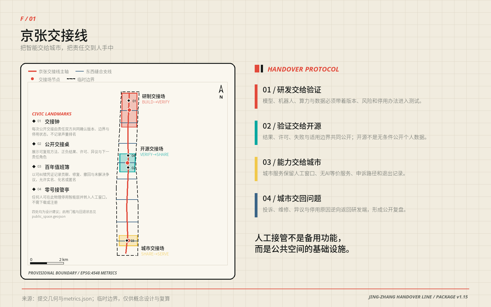
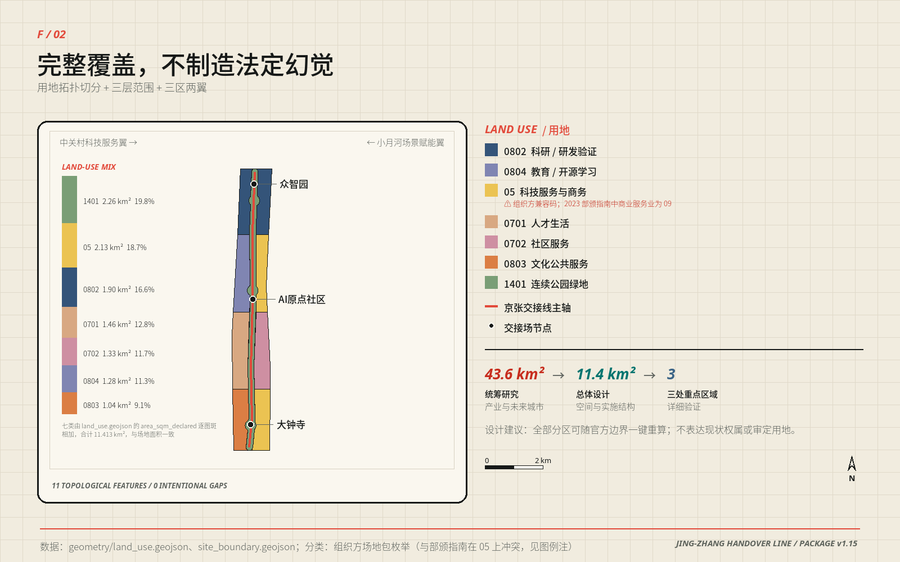
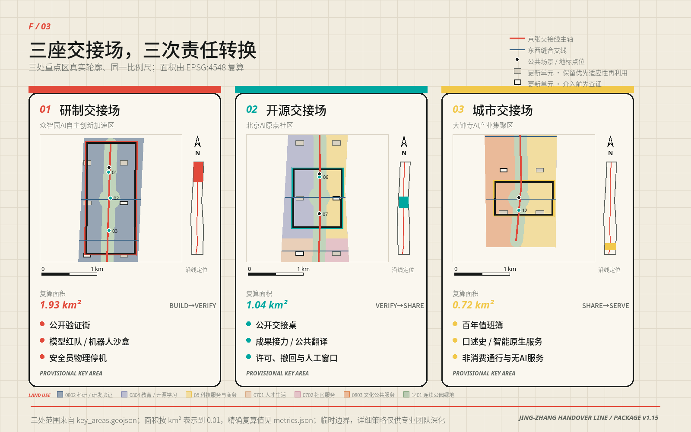
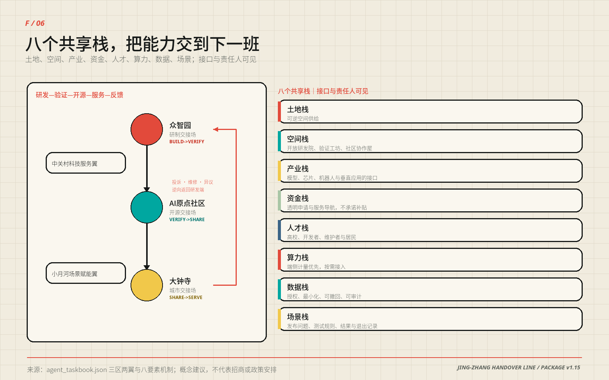
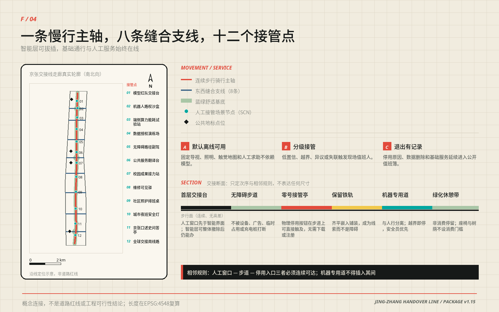
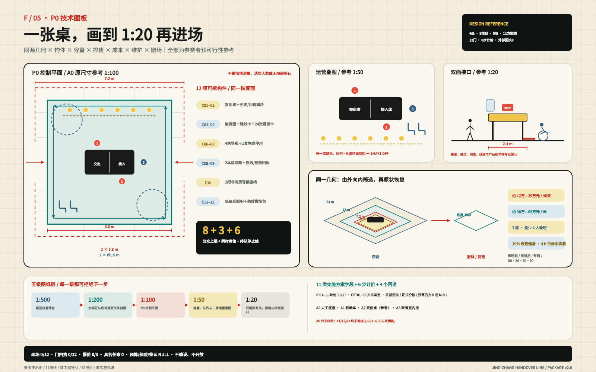
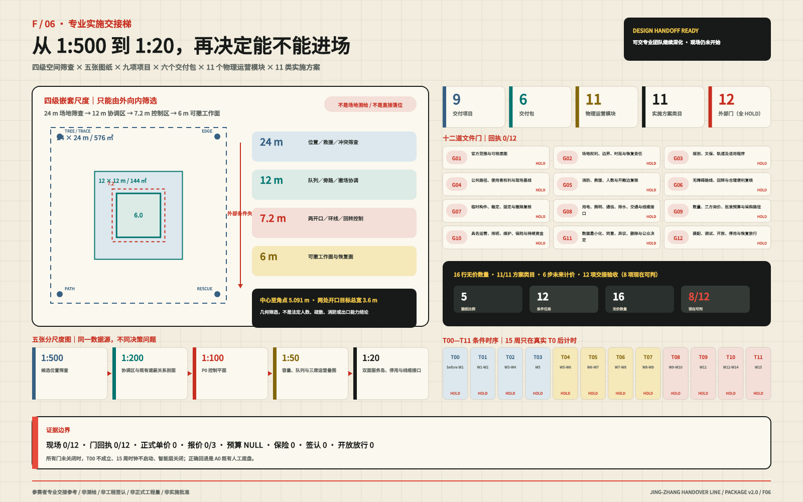

# 京张交接线 / JING-ZHANG HANDOVER LINE

**设计宣言｜把智能交给城市，把责任交到人手中**

**一条 9.5 公里的连续公共脊像梳背，八条东西向城市联系像梳齿；三座交接场让研制、验证、开源、服务与问题回程各有位置。**

京张铁路留下的不只是线位，也是一套让复杂系统可靠运行的日常纪律：上一班说明交出了什么，下一班独立判断是否接收，未完成事项不能在换班中消失。今天，AI 从实验室进入城市时缺少的恰好是这段空间与责任之间的交接。

“京张交接线”因此不是一座新的 AI 园区，也不是沿铁路摆放十二种设备。它是一套可以步行穿过的城市结构：北部把研发能力交给验证，中部把验证结果交给开源协作，南部把可用能力交给日常服务；投诉、维修、异议和停用原因再沿原路回到研发端。能力可以加速流动，责任始终有签收人与回程票。

方案的公共底线只有一句：**任何智能服务，都必须在没有 AI 时仍能办成同一件事。** 人工窗口、纸本、电话、固定导视、触觉地图和物理停用入口先存在，智能层才有资格打开。人工接管不是藏在后台的按钮，而是公共空间的基础设施 [standard:BARRIER-FREE-ENVIRONMENT-LAW] [standard:ELDERLY-SMART-TECH-PLAN-2020-45]。

| 评委阅读路径 | 这一段时间内只需回答什么 | 直接证据 |
| --- | --- | --- |
| **30 秒** | 这是什么、落在哪里、为什么不是空泛 AI 园区 | 一梳三场总体图＋F/05 五级 P0 技术图；现场仍为 0/12 |
| **3 分钟** | 空间、服务与实施是否形成同一条证据链 | 总体结构→三场剖面→十二场景接管→P0 空间/班次/成本→三期条件门 |
| **15 分钟** | 能否复算、拒收、回滚，并交给专业团队继续深化 | A3 图册＋指标/几何＋八门五阶段合同＋公共服务等价＋风险与权利链 |

完整路径与七个评分维度的逐项证据入口见 `visual/assets/governance/jury-evidence-index.json`。它只是阅读导航，不是评分结论或新增实施事实。

本轮已经完成 12/12 个合成离线任务和 48/48 项接管断言；**现场任务仍为 0/12**。这证明协议能被机器执行和审计，不证明现场安全、公众接受、无障碍实测或任何实施批准 [metric:simulation_task_count] [metric:offline_takeover_assertion_count] [metric:field_rehearsal_task_count]。

## 设计依据与资料清单

百年京张走廊同时存在两种城市方向：铁路遗产、公园和轨道形成南北向连续线；高校、园区、社区与商业生活形成东西向高频流动 [source:SRC-JINGZHANG-1909] [source:SRC-HERITAGE-PARK-P1] [source:SRC-BAXUEYUAN-1952]。

今天的断点不是缺少一条“智慧走廊”，而是研发成果与城市日常之间没有一套共同可读的空间接口 [depth:existing_conditions_diagnosis]。

方案依据征集公告、面向智能体任务书、仓库场地资料包、公开资料登记表和本地专业标准快照；所有外部事实与权利边界登记在 `sources.json`，所有未知条件登记在 `assumptions.json` 与 `geometry/constraints.geojson`。百年京张的历史只用于提取“连续线形、道口缝合、双联交班”三种设计方法，不用于推出法定空间结论。

## 三层范围工作框架

三层范围各做一件不同的事：

| 工作层级 | 设计任务 | 本方案的交付 |
| --- | --- | --- |
| 约 43.6 km² 统筹研究范围 | 建立产业、人才、区域协同与长期运营接口 | 五类区域协同接口、八类共享要素、年度活动与国际传播机制 |
| 约 11.4 km² 总体设计范围 | 形成连续空间结构和可计算的更新框架 | 9.5 km 主轴、八条横向联系、七类用地、二十个概念更新单元 |
| 三处重点区域 | 把抽象协议转译为能画平面、剖面与场景的城市空间 | 研制交接场、开源交接场、城市交接场三套不同原型 |

提交几何复算的总体设计范围约为 11.413 km²，三处重点区约为 1.93、1.04、0.72 km²，均为临时模型量 [metric:site_area_sqm] [metric:key_area_count]。仓库没有可用于法定判断的精确边界、审定控规、权属、现状建筑、道路红线、市政容量、消防、文保和完整生态本底；本方案不以商业地图、新闻图或模型推断补齐这些缺口 [source:SITE-PACKAGE] [source:SOURCE-REGISTRY]。

**所有成果均为开放共创建议，不替代正式规划，不构成政府审定结论。所有空间落地建议均为“概念建议”“参考方案”“可供专业团队深化研究”。** 临时边界替换后，九类几何、指标、图件、PDF 与中英文正文按同一公式一键重算 [assumption:A-BOUNDARY-001] [depth:risk_missing_data]。

## 统筹研究范围产业与未来城市研究

统筹范围的核心判断是：AI 产业需要的不只是办公面积，而是从实验室到城市服务之间可共享、可拒收、可退出的接口。土地与时段、验证空间、开源成果、算力设备、合规数据、人才、资金服务和城市场景构成八类共享要素；北纬社区、未来科学城、怀柔科学城、经开区和京津冀节点以“最小可交付成果＋拒收条件”形成五类区域接口。企业和机构可以更替，接口规格与失败记录仍可延续 [depth:three_level_scope_framework] [source:AGENT-TASKBOOK]。

未来城市在这里不是设备密度更高，而是更换智能系统时不伤害基础服务。双联交接、无 AI 等价和退出先于启用三项机制，把创新速度、公共信任与空间更新放进同一个可证伪框架；六个国际案例只用于比较验证、开放与运营机制，不复制其形态、品牌或指标。

## 总体设计范围城市更新与控规深度城市设计

总体结构不是沿线分三块地，而是一把连接城市两侧的“交接梳”：

- **一条梳背**：约 9.5 km 连续公共交接脊，叠合慢行、蓝绿、遗产线索、人工服务与责任展示。
- **八根梳齿**：八条东西联系把高校、园区、社区、轨道站点和商业生活接回主轴；它们表达连接意图，不是道路工程线位。
- **三座交接场**：北部研制、中部开源、南部城市服务，承担三次不能互换的责任转换。
- **两翼支撑**：西翼偏向验证、社区协作与风险收敛；东翼偏向开放研发、共享服务与城市释放。
- **二十个成对单元**：十对概念更新单元横跨主轴布置，以“西收东放”形成可读的产业—公共界面。

七类概念用地由同一拓扑模型切分，11 个图斑完整覆盖临时边界且不相互重叠。科研与验证承载 BUILD→VERIFY，教育与开源学习承载 VERIFY→SHARE，科技服务、商业与社区服务承载 SHARE→SERVE，连续公园绿地与公共空间贯穿全线 [data:geometry/land_use.geojson#LU-001] [metric:land_use_zone_count] [depth:land_use_layout]。

这套结构最重要的形态判断，是**越接近日常生活，主轴越主动让位给横向城市界面**。三处重点区的南北/东西长宽比依次为 2.16、1.18、0.59：北部是纵向测试廊，中部接近方形协作场，南部翻转为横向城市客厅。主轴全长中只有约 39.6% 位于三处重点区，另外约 60.4% 是三区之间的连接段；因此“一线”不是三块地的编号线，而是把中间地带也纳入公共设计 [data:geometry/key_areas.geojson#PROV-KEY-001] [metric:handover_spine_length_m]。

## 重点区域详细设计

### 空间原型｜交接不是流程图，是一条可以走过的断面

人工接管必须变成城市设计关系。三处重点区共享同一条空间顺序：

**建筑首层人工窗口 → 连续无障碍步行面 → 可直接触及的停用入口 → 铁路线索带 → 人机物理隔离 → 可选机器试验带 → 无消费门槛绿化休憩带。**

机器专用空间不得插入人工窗口、步道与停用入口之间；当智能层关闭，前四项仍能独立工作 [depth:three_key_area_detailed_design] [standard:MOHURD-URBAN-DESIGN-MEASURES]。

| 断面分段 | 参考尺寸 | 设计意义 |
| --- | ---: | --- |
| A 建筑退线（含等候、步行、停用设施） | 6.0–8.5 m | 让人工服务、双向轮椅错行和伸手可及的停用入口排在第一顺位 |
| B 铁路线索带 | 0.6 m 或 1.435 m | 以轨枕模数或整轨距嵌入铺装，不制造仿古景观 |
| C 人机物理隔离 | ≥1.5 m | 靠实际距离和可维护构件隔离，不靠地面标线 |
| D 机器试验带 | 0 或 2.0–2.5 m | 只在受控测试段存在；进入城市服务段时归零 |
| E 绿化休憩带 | 4.0–6.0 m | 树荫、雨洪、停留和非消费使用共同组成公共底盘 |
| **单侧合计** | **约 14–20 m** | 是概念设计建议，不是道路红线或施工图尺寸 |

三处断面实取值分别为 **15.4 / 17.1 / 15.1 m**。北部把更多宽度给试验与隔离，中部把最大余量给公开交接桌，南部取消机器试验带，把空间还给等候、树荫和横向城市生活。尺寸来源、逐项复算、相邻规则和待专业确认事项完整保存在 `assets/media/technical-evidence-book.md`。

### 三座交接场｜从封闭测试到城市客厅

三座交接场使用同一协议，却有完全不同的城市性格。它们不是三个相似园区换颜色，而是同一项能力逐步接近日常生活时，空间由“控制”转向“开放”的连续梯度。

#### 众智园｜研制交接场 / BUILD→VERIFY

**场所性格：长、窄、可控。** 约 1.93 km² 的纵向场地把机器人、模型与端侧设备的验证压在主轴一侧，另一侧保持连续公众通行；两者之间以 1.5 m 物理隔离和可关闭接口分开。

- 城市界面：沿主轴形成可观看但不可误入的“观察窗”，而不是把封闭围栏当街墙。
- 建筑策略：五个概念单元优先利用既有主体，插入小尺度评审室、独立计量间与可撤测试棚。
- 公共生活：测试开放日只开放观察、解释与人工问答，不开放机器路权。
- 对应场景：SCN-01 模型红队台、SCN-02 机器人路权沙盒、SCN-03 端侧能耗站。
- 退出状态：设备撤除后恢复普通步道、展陈和院落使用，不留下专用门禁。

#### 北京 AI 原点社区｜开源交接场 / VERIFY→SHARE

**场所性格：近方、可会合、可共同复现。** 约 1.04 km² 的中段以一处“交接十字”组织横向街道、纵向遗产脊、公开交接桌与社区首层；这是全线唯一把技术、社区和公共记录放在同一平面上的位置。

- 城市界面：连续开放首层围绕交接十字布置，任何人不进入办公区也能查看版本、许可、失败与人工渠道。
- 建筑策略：两个概念单元承担开源工作室和共享服务栈，以可拆内装适应项目更替。
- 公共生活：日常是社区客厅和开放工作桌，活动时成为成果复现、翻译和维护协作场。
- 对应场景：SCN-06 公共翻译台、SCN-07 校园成果接力站；LANDMARK-02 公开交接桌与 LANDMARK-04 零号接管亭共同落位。
- 退出状态：智能层停用后，桌、亭、窗口仍作为人工问询、纸本目录和社区议事设施。

#### 大钟寺｜城市交接场 / SHARE→SERVE

**场所性格：横向、开放、以人的等候为中心。** 约 0.72 km² 的南段第一次让东西向城市界面大于南北向走廊；这里不设机器试验带，智能只通过人工窗口进入公共服务。

- 城市界面：一排朝街窗口与 6 m 绿化休憩带组成城市客厅，树荫、座椅和非消费停留优先于展示屏。
- 建筑策略：两个概念单元承载社区服务与文化公共空间，先做首层开放和无障碍修缮。
- 公共生活：日常办事、口述史、无 AI 服务和年度“全球交接周”共用同一公共底盘。
- 对应场景：SCN-12 全球交接周线路；LANDMARK-03 百年值班簿记录维修、异议、停用与修复。
- 退出状态：活动撤场后保留固定导视、人工服务与普通公园使用，不留下临时消费围挡。

## 用地、建筑规模与拆改留方案

二十个建筑要素是**概念类型单元，不是现状建筑清单、拆除清单或获批建设规模** [assumption:A-BUILDING-001]。十对单元沿线成对出现：西侧五个验证工坊与五个社区协作屋负责收敛风险，东侧五个开放研发院与五个共享服务栈负责释放成果；东西各十个、四类各五个 [metric:renewal_cell_count]。

概念基底合计约 **22.10 万 m²（221,014.099 m²）**，只用来比较四类空间供给；研制与服务两类各 51,744 m²，验证与共享两类仅相差约 74 m²。单元到主轴垂距为 245–414 m，平均 330 m、中位 330 m、合计 6596 m。完整二十行落点表与复算过程见技术证据册 [metric:building_footprint_area_sqm]。

更新采用四步判定：

1. **保留 R**：继续使用并补齐测绘、权属、结构和使用档案。
2. **修缮 A**：优先解决消防、节能、无障碍和首层开放。
3. **插入 I**：以可撤构件验证真实需求，不以临时试点替代永久审批。
4. **待核 D**：条件不足时保持现状，不把“待调查”偷换为“待拆除”。

法定容积率、建筑高度、建筑密度、总建筑面积、退界与停车均保持 unknown [metric:floor_area_ratio] [metric:building_density]。当官方控规和逐栋调查到位后，可在二十个单元上叠加经确认的层数与强度；在此之前，本方案宁可不给一个漂亮但虚假的体量总数 [depth:development_intensity_controls] [standard:MOHURD-CONTROL-DETAILED-PLANNING]。

## AI 创新生态、人才画像与 AI+ 场景

产业支撑不靠一份会过期的企业名单，而靠八个可被不同主体接入的共享接口：土地与时段、验证空间、开源成果、算力设备、合规数据、人才、资金服务和城市场景。每个接口都必须说明最小交付、接入条件、拒收条件和退出记录；满足规则的主体可以更替，城市结构不随名单失效 [depth:overall_spatial_structure]。

十二个场景按同一张“交接卡”设计：智能任务、最小数据、责任角色、人工路径、停止条件、退出后用途。它们共同覆盖产业验证、公共服务、知识、运维、照护、夜间安全、文化与活动 [metric:scenario_node_count] [metric:industry_validation_scenario_count]。

| 环节 | 场景 | 人工接管 / 无 AI 等价 | 失败后的空间用途 |
| --- | --- | --- | --- |
| 研制验证 | SCN-01 模型红队交接台 | 人工评审＋纸面风险登记 | 普通评审桌 |
| 研制验证 | SCN-02 机器人路权沙盒 | 安全员物理停机＋封闭测试 | 开放铺地与观察窗 |
| 研制验证 | SCN-03 端侧能耗试验站 | 独立电表＋人工停机 | 设备维护点 |
| 研制验证 | SCN-04 数据授权演练场 | 线下授权单＋即时删除窗口 | 公共工作桌 |
| 公共服务 | SCN-05 无障碍路径副驾 | 触觉地图＋人工问路 | 固定无障碍导视 |
| 公共服务 | SCN-06 公共服务翻译台 | 人工窗口＋多语纸本 | 多语服务台 |
| 知识共享 | SCN-07 校园成果接力站 | 人工策展＋开放目录 | 社区展台 |
| 城市运维 | SCN-08 维修可见驿 | 电话报修＋人工派单 | 值班与维修公告点 |
| 社区照护 | SCN-09 社区照护排班桌 | 工作人员电话排班 | 社区服务桌 |
| 夜间安全 | SCN-10 城市夜班安全灯 | 固定照明＋人工巡查 | 普通照明节点 |
| 文化记忆 | SCN-11 京张口述史问答亭 | 人工讲解＋纸本目录 | 口述史阅读亭 |
| 国际活动 | SCN-12 全球交接周线路 | 固定导视＋志愿者服务 | 日常慢行线路 |

离线页面 `visual/index.html` 提供一个真正可操作的“智能层开关”：关闭后，十二张卡全部翻到无 AI 等价的一面。这个交互不是演示特效，而是方案的公开验收方式——任何一张卡在关闭后办不成同一件事，该场景就不应上线。

## 交通、轨道、市政与公共服务设施

交通策略不是新增一条车行大道，而是把公共服务的连续性放在地面：

`geometry/roads.geojson` 把这一意图落实为 1 条主轴与 8 条横向联系：主轴 `ROAD-001` 的复算长度为 9499.778 m，九条线全部标为 `conceptual_connectivity_only`，所以图上表达的是必须保持的连接关系，而不是工程线位 [data:geometry/roads.geojson#ROAD-001] [metric:handover_spine_length_m]。十二个场景点与四处公共地标沿主轴布置，三座交接场分别组织受控测试、公开协作和城市服务；任何需要预约、申诉、翻译、照护或维修的设施，都必须同时接到有人窗口、无 AI 等价和连续无障碍路线 [depth:traffic_rail_slow_parking] [standard:BARRIER-FREE-ENVIRONMENT-LAW]。

- 主轴提供连续步行与骑行意图，约 9.5 km；线位、坡度、净宽和跨越方式待交通与无障碍专业复核。
- 八条横向联系标记必须被解决的东西断点，不预判桥、隧、平交或道路红线。
- 公交、轨道、停车与市政只设置接口条件，不以缺少数据为由编造工程方案。
- 铁路遗产线索以齐平铺装、构件编号和可阅读记录保留，不复制仿古车站或主题乐园形象。

市政与公共服务采用“先接口、后容量”的推进方式：P0 只需可逆供电、照明、通信、排水和消防接入，不新设永久地下干线；扩展前再由有权单位核验电力余量、雨污分流、通信冗余、消防救援、轨道保护与垃圾清运 [depth:municipal_new_infrastructure]。当前缺少道路红线、轨道保护区、站点客流、停车基线、地下管线、设施容量与权属资料，因此不输出桥隧形式、交叉口渠化、车位数或管径；这些未知项进入条件门，资料不到位时维持现状交通与人工服务，不以 AI 推断补空。

## 蓝绿空间、公共空间与城市风貌

概念绿地约 226.5 ha、公共交接面约 103.9 ha，对应临时模型中的约 19.8% 和 9.1%；它们表达结构性供给，不是现状净增量或法定指标 [metric:green_ratio] [metric:public_space_ratio]。蓝绿底盘承担树荫、雨洪、停留、慢行和非消费使用；即使所有智能设备断电，照明、导视、触觉地图、座椅、人工窗口和普通公园功能仍然存在 [depth:blue_green_public_space]。

八类使用者——研发者、创业者、园区员工、居民、老人、残障者、儿童与国际访客——不以“平均用户”合并。最严格的反例是：一个没有智能手机、行动不便、不会中文、又拒绝被算法记录的人，仍应能沿固定导视到达人工窗口、获得同一项基础服务并提出异议。只要这条路径不成立，场景就不开放智能层。

**公共利益现在是第三道开闸条件，不是项目做完后的加分项。** 第一门问“值得做吗”，第二门问“能安全接管吗”，第三门问“收益是否真实到达公众、代价是否公平分配、拒绝后是否仍有服务”。`visual/assets/governance/public-benefit-gate.json` 将任务书明示的六类群体——居民、青年人才、企业、高校、访客、被忽略与高排斥风险群体——逐类绑定公共价值、无 AI 入口和待采证据；再把 SCN-01—12 全部写成一张“公共收益—要避免的伤害—保障—停止条件—移除技术后仍留下什么”的硬门槛表 [metric:public_benefit_group_count] [metric:scenario_public_benefit_gate_count]。

这张表首先规定**公共生活优先于技术奇观**：普通通行、非消费座椅、树荫休息、低眩光低噪声、儿童/老人/残障者安全、无需个人设备、无强制人脸识别、人工责任、申诉和最小数据，任何一项被技术展示挤掉都关闭智能层。它也逐场景区别风险：照护排班不得作诊断或自动拒绝服务；翻译涉及权益决定时必须人工核对；夜班照明不得以人脸与过度照明换安全；口述史不得生成无出处史实或真人合成引语；全球交接周不得以门票、消费、营销围挡和活动后遗留构筑物占用日常公共空间。**技术效果再好，只要公共底盘失败，仍判失败。**

**公共服务等价合同把这条底线拆成可核验任务，而不是把“包容”留作形容词。** `visual/assets/governance/public-service-equivalence-contract.json` 将 SCN-01—12 逐一绑定到一条先于智能层存在的无 AI 基础路线和两条人工渠道，12/12 均要求无需个人设备，拒绝智能服务不得降低基本服务水平；同一核心结果、同队列优先级、零额外费用和相同基础安全信息是设计目标 [metric:no_ai_equivalent_scenario_count] [metric:no_ai_equivalent_service_target_ratio] [metric:algorithm_refusal_no_penalty_scenario_count]。

| 八类需求夹具 | 必须同时存在的基础路线 | 失败动作 |
| --- | --- | --- |
| 非视觉／屏幕阅读 | 可读真实文本＋触觉或人工口述＋结果回读 | 找不到人工渠道或拿不到同一基础结果，关闭智能层 |
| 仅键盘／无指针 | 原生键盘控件＋可见焦点；现场不要求操作个人设备 | 关键操作只能靠鼠标或个人设备，关闭智能层 |
| 低视力／色觉障碍 | 高对比文字＋代码、形状或唯一纹理＋大字纸本 | 关键区分仍只靠颜色，关闭智能层 |
| 行动不便／轮椅 | 连续步行面＋坐姿窗口／等候位＋可触及停用入口 | 路线被高差、障碍或机器带切断，关闭智能层 |
| 老年／认知负荷 | 单任务短句纸本＋重复说明／结果回读＋无强制倒计时 | 依赖复杂记忆、限时或因求助降级，关闭智能层 |
| 非中文／多语 | 中英核心载体＋多语纸本＋人工复核权利决定 | 权利或停止条件只能靠中文或机器翻译，关闭智能层 |
| 无智能手机／无 App | 固定导视＋有人窗口＋纸本、电话或值班簿 | 任一步骤强制手机、App、扫码或个人账户，关闭智能层 |
| 拒绝算法／可选数据 | 人工决定＋最小记录＋申诉、删除或停用回执 | 拒绝导致延后、加价、少安全信息或无核心结果，关闭智能层 |

这八类当前是 **8/8 设计需求夹具，不是 8 次用户测试**；真实参与者观察 **0**、真实通过记录 **0**，所有人工渠道仍标为 `not_observed` [metric:accessibility_requirement_fixture_task_count] [metric:accessibility_requirement_fixture_coverage_ratio] [metric:real_user_accessibility_observation_count]。授权后的共测已经预注册为至少 **24 个任务场次**，六类任务书群体均须留下任务记录，其中至少 8 场覆盖非视觉/低视力、行动不便、认知负荷、非中文、无设备或拒绝算法等交叉需求；固定补偿、合理便利、失败不扣补偿、可退出和匿名记录是招募底线 [metric:planned_equity_cotest_session_min_count]。这个 24 是计划下限，**当前完成数仍为 0**；场地授权后必须由无障碍专业人员主持真实任务，以观察结果逐项替换夹具，不能把机器审计 PASS 改写成真实可用性。

## 更新项目清单、实施政策与分期计划

### P0 实施｜先搭一张桌，再决定是否建一条线

首个现场原型不是建筑，而是一张**公开交接桌**。这次不再只画它：`visual/index.html#p0-prototype` 在正式评审入口中内嵌了可直接操作的 SCN-05 离线服务原型。评审者可以亲自关闭智能层、拒绝算法与数据、启用大字/高对比、比较智能与无 AI 两条路线、签发投诉/停用/删除回执并打印纸本；两条路线共享同一个 `SCN-05-CORE-001` 核心结果，页面不联网、不留存、不采个人信息 [metric:offline_service_prototype_route_count]。它证明服务义务已经可操作，仍不证明现场路径安全或无障碍达标。

现场套件采用 S 级成本口径。`visual/assets/governance/p0-delivery-contract.json` 把它锁成 **12 项带数量和验收方法的构件清单、8 道进入门和 10 项 RACI 工作包** [metric:p0_component_line_item_count] [metric:p0_entry_gate_count] [metric:p0_raci_work_package_count]。F/05 不再只是包络摘要：它用同一份数据画出 1:100 控制平面、1:50 容量/队列/三席运营叠图、1:20 双面服务接口、24→12→7.2→6 m 由外向内筛查与 36 ㎡原状恢复，并把五级图纸链、12 项构件、成本、排班、维护和四个回退方案放在同一技术图板。每个视图的 drawing ID、source path 与可见检查项登记在 `implementation-handoff-register.json#technical_figure_binding`；图完整不等于现场、产品或专业签认已经完成。

同一合同再预注册 **5 个 90 天节点和 8 项验收判据** [metric:p0_delivery_stage_count] [metric:p0_preregistered_acceptance_criterion_count]。角色引用 `role-spec.json`，但全部保持 `unassigned`；三方报价槽、保险、总预算、持续预算、场地和专业签认在真实证据到位前一律为 `null` 或 `not_started`，没有把表格完整冒充实施已发生。

#### P0 技术图与预可行性｜先证明“画得清、装得下、跑得动、撤得走”

`visual/assets/governance/p0-pre-feasibility-envelope.json` 给出一套**参赛者概念筛选包络**：7.2 × 7.2 m 控制范围内放置 6.0 × 6.0 m 可撤工作面和 2.4 × 1.2 m 双面有人服务岛；四周最窄保留 1.8 m 连续环线，外圈留 0.6 m 安全缓冲，两侧各有一个 1.8 m 开口，并预留两个直径 1.5 m 的回转位。F/05 将这些字段与 8 名公众、3 个同时席位、6 人排队停止线、2 个非消费座位以及 C01—C12 构件直接画在同一控制平面和接口图上。它不含新雨棚、固定铺装、结构和永久管线；没有既有遮蔽、平整连续表面和安全撤场条件时，转室内备选或不启动 [metric:p0_screening_control_envelope_area_sqm] [metric:p0_reversible_operating_patch_area_sqm]。

| 预可行性变量 | 参赛者参考值 | 如何使用，不能如何使用 |
| --- | ---: | --- |
| 面积筛选上限 | `floor(36 ÷ 2.4) = 15` 人 | 只证明几何量级装得下；不是法定人数或消防容量 |
| 保守运营上限 | **8 名公众（含陪同）＋3 个同时在岗席位** | 总计 11 人、约 3.27 ㎡/人；真实场地须专业复核 |
| 排队停止线 | **6 人** | 超过即暂停新任务、关闭智能层并转既有人工服务 |
| 参考班次 | 4 小时/日 × 5 日/周 × 13 周 | 共 260 开放小时、780 席位小时；不是已批准时段或人员任命 |
| 排期余量 | 双面服务 × 10 分钟任务槽 × 75% 缓冲 = **36 槽/日** | 只检验 24 场任务能否排进窗口；不是需求或吞吐承诺 |

三个同时在岗席位分别是交出/服务、接入/问路、独立安全/异议；最少四人组成轮值名单覆盖休息。真实姓名仍为空，三个席位任一缺岗即关闭智能层；两席可以保留既有人工问路，但不能继续共测、签收或发布绩效 [metric:p0_operational_public_cap_persons] [metric:p0_simultaneous_staff_position_count] [metric:p0_queue_cap_persons]。

#### 成本、运维与恢复｜给可比较区间，不伪造报价

90 天成本不是“一张桌多少钱”，而是构件、值守、专业复核、合理便利、维护和撤场共同决定。下表费率全部是**参赛者敏感性变量**，用于检验范围仍否属于 S 级；不是市场询价、工资建议、合同费率或批准预算。

| 90 天敏感性成本线 | 低位—高位 | 复算口径 |
| --- | ---: | --- |
| 12 项可移动构件 | 约 1.8万—5.7万元 | 逐项数量 × 参赛者单价变量；正式采购仍须三方同口径询价 |
| 三席公众班次 | 约 6.2万—12.5万元 | 780 席位小时 × 80—160 元/小时 |
| 专业与独立复核 | 约 1.9万—5.1万元 | 64 角色小时 × 300—800 元/小时；真实资质与范围待签认 |
| 24 场补偿与合理便利 | 约 1.0万—3.0万元 | 固定补偿＋便利物资；失败、退出或拒绝数据不扣补偿 |
| 维护与耗材 | 约 0.7万—2.0万元 | 13 周 × 500—1,500 元/周 |
| 撤场恢复储备 | 约 0.2万—0.8万元 | 可移动构件＋维护的 10%；不是保险或正式预备费 |
| **参赛者敏感性小计** | **约 12万—29万元/90天** | 精确复算 118,042—289,750 元；正式预算仍为 `null` |

若按 4 小时/日、5 日/周、50 周/年的同一三席服务强度，参赛者年度运维敏感性约 **30万—65万元/年**；人员工时是最大变量 [metric:p0_90_day_cost_sensitivity_low_cny] [metric:p0_90_day_cost_sensitivity_high_cny] [metric:p0_annual_opex_sensitivity_high_cny]。两个区间均**不含**场地费、保险、税费、法定报批与专业服务、永久工程、既有场地缺陷和未查明公用事业。上述任一外部项不为零、三方报价未齐或持续预算未获批准时，`total_budget_cny` 保持 `null`，不采购、不进场。

| 周期 | 必查动作 | 失败后 |
| --- | --- | --- |
| 每班前 | 两处开口、1.8 m 环线、停用控件、纸本路线、线缆和照明 | 不开新任务，智能层关闭 |
| 每班后 | 删除临时数字记录、双联值班簿分别签认、投诉与未决项交下班 | 未决项不得消失，智能层保持关闭 |
| 每周 | 触觉图、导视、桌椅、紧固、耗材和备件 | 移除失败构件，基础人工服务继续 |
| D0/D30/D60/D90 | 安全无障碍、队列、成本、故障、投诉与继续/修复/终止 | 不进入下一阶段 |

撤场参考目标是四人四小时、共 16 人时；这只是**尚未实测的目标**。D1—30 没有在授权现场真实完成之前，不得宣传“可快速撤场”；地面、排水、通行、触觉路线、临时记录和人工服务位置任一未恢复，下一场次不开放 [metric:p0_same_day_removal_target_hours]。

#### 四个备选｜备选不绕过准入门

| 方案 | 最适条件 | 主要得失 | 触发决策 |
| --- | --- | --- | --- |
| **A0 既有人工底盘** | 场地、保险或预算门失败 | 不新增构件、风险最低；但不产生 P0 共测证据 | **不启动 P0**，保持既有有人窗口与纸本 |
| **A1 单面移动服务车** | 获准边界小于 6 × 6 m，且低队列已被证明 | 当班可移走；但双联角色、回转和单面队列更易互扰 | 仍须八门全过，公众上限 3、队列 2 |
| **A2 双面公开交接桌** | 6 × 6 m 工作面和两处开口经专业确认 | 三席、双面服务和连续环线能在同一平面复核；人员成本最高 | **本参考方案**，八门 8/8 后方可启动 |
| **A3 借用既有室内房间** | 室外天气或市政条件失败，室内无需租金和装修 | 环境稳定；但城市可见性较弱，产生租装即退出 S 级 | 仍须八门全过，并单独核室内疏散与无障碍 |

四个方案只改变载体与空间包络，不改变公共底线；如果没有任何方案能在既有、已授权、无需永久工程的条件下保持人工服务、双联角色、连续通行和撤场恢复，正确答案就是 A0：不启动 [metric:p0_alternative_option_count]。

#### 专业交付梯｜从 1:500 筛查到 1:20 接口

一张 6 × 6 m 工作面不能直接贴到未知场地。`visual/assets/governance/implementation-handoff-register.json` 因此在现有 P0 外再加两级**只用于排除错误落位**的参赛者尺度：24 × 24 m 候选位置筛查窗口同时检查既有公共路径、两处开敞边、装卸救援、树木／遗产／轨道／市政冲突占位和可撤场路径；12 × 12 m 无固定工程协调区给无 AI 旁路、队列分流、两处回转、换班与撤场暂存留余量。它们分别是 576 ㎡与 144 ㎡的设计筛选框，不是新增占地、铺装、道路红线、消防场地或真实落位 [metric:p0_site_screening_window_area_sqm] [metric:p0_coordination_court_area_sqm]。

| 图纸级别 | 现在回答的问题 | 必须留给真实资料与专业签认的部分 |
| --- | --- | --- |
| **1:500 候选位置筛查** | 24 × 24 m 窗口内是否有连续通行、两处开敞边、救援／装卸入口与可撤场路径 | 正式边界、权属、树木、文保／轨道、市政、救援和真实人流 |
| **1:200 协调关系剖面** | 12 × 12 m 协调区能否保留无 AI 旁路、既有遮蔽与不做永久基础的撤场关系 | 高程、天气、排水、结构、基础、照明、机电和真实遮蔽 |
| **1:100 P0 控制平面** | 7.2 × 7.2 m 控制区、6 × 6 m 工作面、1.8 m 环线、两开口和两回转位是否同源 | 法定人数、消防疏散、无障碍合规及场地测量 |
| **1:50 运营叠图** | 8 名公众、3 个角色席位、6 人排队停止线与两处非消费座位是否互不侵占 | 真实需求、服务率、排队、人员合同、保险和现场行为 |
| **1:20 服务接口** | 2.4 × 1.2 m 无锚固双面服务岛、坐／站接近、停用、纸本／触觉载体和防绊线缆能否被制造团队继续深化 | 产品选型、结构稳定、用电、材料、防火、耐久和专业详图 |

控制区中心至角点的纯几何距离为 `√(3.6²+3.6²)=5.091 m`，两处 1.8 m 开口的目标总净宽为 3.6 m；它们只让评委复算图形，不构成疏散时间、出口能力、烟控、消防或人数结论 [metric:p0_control_envelope_half_diagonal_m] [metric:p0_combined_opening_target_m]。任一外层筛查失败时，不得压缩环线、回转、开口和人工服务来硬塞 A2，而应切换 A1／A3 或直接 A0。

这张 P0 还被放进全方案交付组合：**4 个条件放行状态、9 项项目** [metric:implementation_release_state_count] [metric:implementation_delivery_project_count]，再以 **6 个交付包和 11 个可独立拒收的物理／运营模块** [metric:implementation_delivery_package_count] [metric:implementation_module_count]，把正式几何重绑定、三座交接场、八条联系、二十单元、年度运营与退役关闭接成一条链。现有八道准入门仍是公众可读的启停判据；新增 **12 道文件门**只是把它们拆成未来专业交接所需的官方底图、场地权利、适用程序、公众权利基线、消防、无障碍、临时结构、机电市政、预算采购、运营保险、数据同意和装配／开放／恢复回执，当前全部 `HOLD`、回执 **0/12** [metric:implementation_documentary_gate_count] [metric:implementation_gate_receipt_count]。

**项目交付不再把“11 个构件模块”误当作“11 类实施方案内容”。** `implementation-handoff-register.json#implementation_scheme_module_register` 依据《北京市城市更新实施方案编制工作指南（试行）》把整包另行映射为 **IP01—IP11 十一类专业交接字段**；联合审查办法只用于说明未来文件门的责任与程序语境，不表示已经报审 [source:BEIJING-URBAN-RENEWAL-IMPLEMENTATION-GUIDE-2024] [source:BEIJING-URBAN-RENEWAL-JOINT-REVIEW-2024] [metric:implementation_policy_module_count]。

| 实施方案字段 | 本包现在能交出的参赛者输入 | 必须等待的真实外部凭证 |
| --- | --- | --- |
| IP01 项目基本信息 | PJ01—PJ09、四级条件状态、统一编号与临时范围 | 统筹／实施主体、项目范围、权利边界与正式编号 |
| IP02 前期评估 | 九类临时几何、资料分级、五级筛查与整包重绑定规则 | 测绘、权属、逐栋、交通、市政、消防、文保、生态与现场基线 |
| IP03 功能与公共价值 | BUILD→VERIFY→SHARE→SERVE、12 场景、六类群体与无 AI 同任务 | 权利人、运营者、服务对象代表及主管方共同确认的任务书 |
| IP04 规划与空间落位 | 公共脊、八联系、三场、二十单元与 1:500—1:20 拒收链 | 正式边界、控规、道路／轨道控制、法定指标与专业复核 |
| IP05 建筑与接口 | 三场概念剖面及可撤 P0 控制面、工作面与双面服务岛 | 实测、结构、消防、无障碍、机电、市政、材料与耐久签认 |
| IP06 土地与使用权 | 低干预、授权门、使用边界与恢复义务模板 | 权属／使用权、开放时段、占用边界及恢复责任文件 |
| IP07 未登记建筑与既有物 | unknown 清单及不拆、不改、不锚固停止规则 | 逐栋登记、结构、历史／文保核查与处置意见 |
| IP08 资金、计价与采购 | 16 行未计价数量、敏感性、询价槽、恢复储备与超支停止线 | 正式价格期次、询价、保险、概算、预算与资金承诺 |
| IP09 运营、维护与保险 | 三席四人、3000 岗位小时、2.143→3 FTE、双钥匙与维护退役 | 具名运营者、排班、保险、持续预算、维护合同与任命回执 |
| IP10 条件时序与关闭 | T00—T11、PRE-D0—D90 与 S0—S3 条件状态 | 真实 T0、批准进度、加工调试、开放、撤场与恢复回执 |
| IP11 协商、共测与意见 | 五个区域接口、六类群体、24 场未来共测、异议与复测模板 | 对方确认、授权参与者、合理便利与独立评估回执 |

十一类字段映射为 **11/11**，只证明每类都有“已有输入—未知项—交付包—拒收门”；外部关闭回执仍为 **0**，不得写成正式实施方案完成度 100% [metric:implementation_policy_module_mapping_ratio] [metric:implementation_external_policy_module_receipt_count]。

成本也从“给一个区间”升级为可交接的六步方法：`CST01` 授权实测冻结 16 行数量 → `CST02` 冻结价格基准日与造价信息期次 → `CST03` 取得三方同口径询价 → `CST04` 分列直接价格、措施、管理、利润、税费与专业服务 → `CST05` 同时闭合运营、维护、合理便利、保险与恢复储备 → `CST06` 由有权主体批准总预算、持续预算、资金来源和超支停止线 [source:BEIJING-COST-BASIS-2026] [source:BEIJING-COST-INFORMATION-2026] [metric:implementation_cost_method_step_count]。这两条公开来源只定义未来方法，不验证本包任何费率；当前正式单价回执 **0**、同口径报价 **0/3**、价格期次／基准日／正式概算／批准预算／资金承诺均为 `null` [metric:implementation_cost_policy_source_count] [metric:implementation_comparable_vendor_quote_receipt_count] [metric:implementation_formal_unit_rate_receipt_count]。

未来角色被拆成 12 类，但具名任命仍为 **0** [metric:implementation_role_class_count] [metric:implementation_named_role_appointment_count]；15 周参考时序含 `T00—T11`，只有真实文件 T0 成立后才计时，16 行数量表有推导、有单位，却把实测量、正式单价和金额全部保持为 `null` [metric:implementation_conditional_task_count] [metric:implementation_unpriced_quantity_line_count]。十二项交接验收中，八项现在只能判断“编号、算术、引用、门状态和空值边界是否闭合”，其余四项必须等待现场、专业签认、24 场共测与撤场复测；不能把 **8/12 现在可判**写成现场验收 8/12 [metric:implementation_handoff_acceptance_indicator_count] [metric:implementation_handoff_judgeable_now_count]。

#### 运营就绪控制面｜没有现场，也能先把开层条件算清

无法找到真实场景演练，不等于只能留下“以后再做”。同一登记表把年度排班明确为 **1,000 小时公众开放 × 3 个同时席位＝3,000 岗位小时**；再按参赛者假设的每 FTE 年有效 1,680 小时与 1.2 休假／培训系数，得到 `3000 ÷ 1680 × 1.2＝2.142857…`，登记为 **2.143 FTE 覆盖下限、3 FTE 规划余量** [metric:p0_staffed_seat_hours_per_year] [metric:p0_calculated_minimum_coverage_fte] [metric:p0_planning_coverage_fte]。相应的未来排班底线是**最少 4 人轮休名册** [metric:p0_minimum_roster_headcount]。这是工作量与成本试算，不是劳动合同或已组队事实；当前具名人员、任命回执仍为 **0**，“漏班 0 小时”只是未来排班目标。

智能层再加一条**双钥匙**控制：未来运营负责人持“服务连续性”钥匙，未来独立权利／安全负责人持“否决”钥匙，另由 R12 作独立开放签认；两把有效任命回执缺一、任一方否决或 R12 未签，均保持 `smart_layer=off`。当前有效钥匙回执是 **0/2**，持有人与回执均为 `null` [metric:implementation_two_key_control_count] [metric:implementation_two_key_receipt_count]。六个交付包则各自增加“数量依据＋验收测试”，四个备选各自写出至少三项优势和具名回退门；这让评委能检查方案为何选择、何时降级，而不把备选写成绕门捷径 [metric:implementation_package_acceptance_test_count] [metric:implementation_named_fallback_gate_binding_count]。

真正进场后要执行的内容也预先冻结：`C01—C08` 八项调试／退役检查覆盖场外配置、两处开口与环线、三席四人、无设备同任务、双钥匙回滚、删除投诉回执、异常时段压力、完整撤除恢复；当前执行 **0/8**、回执全为 `null` [metric:implementation_commissioning_check_count] [metric:implementation_commissioning_executed_count]。未来基线按常态、换班峰值、天气、低照度／夜间、断电断网 **5 个时段**，填写路径开口、队列分流、无 AI 同任务、无障碍、停用删除、维护备件、撤除恢复 **7 张表**；授权参与者 0、观察 0、值 `null` [metric:implementation_future_baseline_period_count] [metric:implementation_future_baseline_form_count]。这是一套可直接带到未来现场的空白协议，不是把桌面推演冒充现场成绩。

#### 授权前八道门

| 条件门 | 必须出现的证据 | 未通过时 |
| --- | --- | --- |
| 场地 | 书面授权、使用边界、开放时段 | 不进场 |
| 双联角色 | 交出方与接入方由不同责任人指派 | 不签收、不开放智能层 |
| 安全与无障碍 | 独立专业复核、撤场与应急方案 | 只保留基础人工服务 |
| 保险与维护 | 覆盖范围、维护岗、持续预算 | 不搭建或当日撤除 |
| 数据 | 最小化、合成夹具、删除与留存规则 | 不采集、不记录个人信息 |
| 成本 | 三方询价或同等可核依据，按构件分项 | 维持 S 级，不外推总投资 |
| 消防、交通与市政 | 疏散救援、慢行与轮椅回转、用电通信排水和线缆保护复核 | 不向公众开放，只用既有安全人工设施 |
| 共测、同意与合理便利 | 六类群体招募、知情同意、固定补偿、合理便利、失败—修复—复测记录 | 不宣称包容性已验证，智能层关闭 |

#### 一次 P0 的七个工作步骤

1. 现场复核公共路径与停用入口，划出不留永久痕迹的桌面边界。
2. 先搭人工窗口、纸本、电话和固定导视，再安装智能层。
3. 由交出方登记对象、版本、开放项、失败项与回滚动作。
4. 由接入方独立复现最小证据，明确 ACCEPT 或 REFUSE。
5. 注入同人双签、未决项缺失与智能层失联等可控异常，观察是否被拒。
6. 现场关闭智能层，验证同一事项能否由人工路径完成。
7. 当日撤场，核对临时记录删除、基础服务延续和地面恢复。

这是一份**授权后可直接签认与填证的参考工序**，不是已经执行的现场记录。P0 只允许 SCN-05 一个场景，按 `PRE-D0 → D0 → D1–30 → D31–60 → D61–90` 推进：八门不齐不开始计时；D0 先让人工底盘独立办成；前 30 天只做人员异常演练；31–60 天才在授权、同意与便利齐备后做至少 24 场真实任务；61–90 天由独立角色给出“继续／修复／终止”三选一结论，未全过不得扩到第二场景。

八项验收不以满意度平均数代替公平：核心结果和安全信息必须 100% 对齐；拒绝智能的队列差为 0、价格附加为 0；无 AI 路线完成率不得比智能路线低超过 10 个百分点，中位完成时间比总体不大于 1.5、任一必备群体不大于 2.0；投诉/停用/删除回执生成率 100%；八类无障碍必备任务须 8/8 由真实任务与专业复核共同通过。阈值是**预注册判据，不是观测结果**，当前 `observed_value` 全部为 `null`，现场任务继续保持 0/12 [assumption:A-OPERATIONS-001]。

#### 可实施性交接闭合表｜参与者交付与外部授权分开

| 可实施性问题 | 当前包已经闭合的可交接结构 | 只在未来触发的外部事实 |
| --- | --- | --- |
| 阶段路径是否明确 | PHASE-01—03、`PRE-D0—D90` 与 `T00—T11` 三层条件路径；每一步都有前置门、责任类、拒收与回退 | 有权主体确认适用程序、文件 T0、绝对日期与批准工期 |
| 首个试点是否可定位 | 只允许 SCN-05；24×24 m 筛查→12×12 m 协调→7.2×7.2 m 控制→6×6 m 可逆工作面，并由 1:500—1:20 五级图纸逐级拒收 | 正式边界、场地权利、实测、高程、消防、轨道／文保、市政与专业签认 |
| 参与主体是否有责任结构 | R01—R12 十二类角色已定义；`T00—T11` 每项恰有一个 `accountable_role_id`，六个交付包各有数量依据和验收测试；具名任命仍为 0 [metric:implementation_role_class_count] [metric:implementation_conditional_task_count] [metric:implementation_package_acceptance_test_count] | 有权委托后的具名机构、人员、合同、服务连续性钥匙与独立权利／安全钥匙回执 |
| 项目、采购与成本能否接续 | 4 级释放、9 项目、6 包、11 个物理／运营模块、IP01—IP11、16 行无价数量和 CST01—CST06 同源连接；任一费率无回执即停止 | 价格基准日、造价信息期次、三方询价、保险、概算、批准预算、持续资金与采购决定 |
| 运营与失败回退能否执行 | 3,000 岗位小时→2.143→3 FTE、至少 4 人轮班；双钥匙、每班／周／阶段维护、A0—A3 具名回退及 0/8 调试表均已预登记 | 具名运营者、劳动与保险安排、真实排班、调试、投诉／删除、撤场与恢复回执 |
| 指标和数据边界是否可核 | 12 项交接验收中 8 项现在可判结构、4 项等待现场；五时段×七表、24 场共测、六类群体和停止阈值均已预注册，当前值保持 0／`null` | 获授权参与者、真实观察、专业复核、失败—修复—复测与独立 D90 结论 |

这里的“参与主体”已闭合到**角色类别—单一问责任务—交付包—决定权—证据门**，而不是由参赛者擅自填写机构名称。真实任命只能由未来有权主体作出；因此具名任命为 0 会让现场保持 `HOLD`，但不会让当前交接结构退回“未定义”。同理，报价、保险、签字与现场值保持空白，是这些门正在工作，不是把敏感性或模板冒充成现实证据。

#### 正式评审交接｜投稿闭合不等于现场获准

本轮只以当前包内可复算、可定位的材料作为可实施性依据，不以任何历史分数、PR、合并、入库、获奖或批准状态证明方案质量。`visual/assets/governance/formal-review-readiness-matrix.json` 仅把参与者当前可关闭的材料项与未来外部条件分开：包内证据可由审计器复核；主体、授权、报价、保险、预算、签字、场地与用户观察继续保持 0、`null`、`BLOCKED` 或 `HOLD`。该矩阵是参与者的事实核对，不是官方接收、政府批准、实施许可或评奖证明。

本轮继续只补参与者当前能够诚实完成的可实施性证据：在原有 P0 参考平面、容量、班次、成本敏感性、维护撤场、四个备选和评审入口之外，增加 24×24 m—12×12 m—7.2×7.2 m—6×6 m 四级包络、1:500—1:20 五级图纸链、4 级释放状态、9 项交付项目、6 个工作包与逐包验收、11 项实施模块、12 道文件闸门、12 类专业角色、三席四人的可复算排班、双钥匙控制、四种具名失败回退、`T00—T11` 条件工期、16 行未计价数量、8 项调试／退役检查、5 时段 × 7 表未来基线与 12 项交接验收。真实场地、主体、报价、保险、预算、专业签认、调试执行和现场观察没有被代填，仍由原八门和新增 12 道文件闸门保持阻断。

| 判定层 | 当前状态 | 谁在何时关闭 | 当前投稿能否代填 |
| --- | --- | --- | --- |
| 概念投稿包 | `CLOSED_FOR_FORMAL_REVIEW`；参与者可控制的开放修复 **0 项** | 本轮以正文、矩阵、原型、权利链和四道 Gate 交给正式评委 | 已闭合；这只是参与者自审，不是官方接收或获奖 |
| 人类评委程序 | `REVIEW_PROCEDURE_NOT_PARTICIPANT_REPAIR` | 正式评分时完整翻阅四份 PDF、比较中英主张与图位；若发现差异再形成新修复项 | 不能把“评委尚未评阅”伪装成参与者缺件 |
| 正式边界与控制数据 | `WAITING_ORGANIZER_INPUT` | 组织方提供后，专业团队按 EPSG:4548 固定公式联动复算 | 不能猜测；当前只保持临时边界警示 |
| SCN-05 真实现场 | `BLOCKED_EXTERNAL_PRE_PILOT` | 有权主体与专业角色用真实证据关闭八道门 | 不能代填；任一门未过，现场时钟不启动、智能层关闭 |
| 包容性与现场绩效主张 | `BLOCKED_UNTIL_24_REAL_TASKS` | 授权后由真实参与者和无障碍专业人员完成至少 24 场任务、失败—修复—复测 | 当前只能主张 8/8 设计夹具与离线功能，真实观察仍为 0 |

同一矩阵按官方六类强制拒绝事实做了一次**证据核对**，不是替评委下结论：个人或非公开数据、伪造官方背书、违法／歧视／恶意内容、实质跑题、agent.1—agent.6 缺失、把建议写成既定政府决定，当前均未在包内观察到对应事实，证据命中 **0/6**。包内仍显式声明：所有成果均为开放共创建议，不替代正式规划，不构成政府审定结论；本节的 `CLOSED` 也不构成接收、批准、采购、认证、实施承诺或政府背书。

### 分期与运营｜不按年份推进，按证据开闸

三期不是政府时间表，而是三道可回滚的条件门 [metric:phase_count] [data:geometry/phasing.geojson#PHASE-001]：

| 阶段 | 空间动作 | 进入下一阶段的必要条件 | 失败回滚 |
| --- | --- | --- | --- |
| PHASE-01 交回基线 | 南段人工服务底盘＋一张 P0 公开交接桌 | 八道准入门、基础层单独完成、无障碍与安全通过 | 撤除智能构件，保留普通公共服务 |
| PHASE-02 开源接力 | 中段交接十字＋开源交接场 | 跨主体复现、社区协商、维护预算与权属边界成立 | 缩回单桌或单场景 |
| PHASE-03 全带运营 | 北段研制交接场＋全线协同 | 交通、市政、消防、文保、隐私、持续运营全部经专业复核 | 保留已验证片段，不扩区 |

长期运营围绕四个季节事件形成公共记忆：春季“开放问题周”、夏季“验证开放日”、秋季“全球交接周”、冬季“年度交接账发布”。活动不公布排行榜，而是公开哪些问题被修复、哪些服务被停用、哪些异议改变了设计。

区域协同采用最小可交付单位而非合作口号：北纬社区交换社区服务问题与人工路径；未来科学城和怀柔科学城交换可复现实验与风险清单；经开区交换产业验证和制造接口；京津冀节点交换开放规范、失败记录和退出模板。任何一方无法提供最小证据时可以拒收，不以机构名称制造背书 [depth:three_level_scope_framework]。

国际传播统一为 **HANDOVER LINE**：全球访客看到的不只是技术演示，而是一座城市如何公开交代版本、责任、异议与退出。品牌的四个公共地标——交接钟、公开交接桌、百年值班簿、零号接管亭——记录维护和纠错，而不是资本与流量；完整 Logo、视觉系统、双语导览、音频、视频和触觉地图均已随包交付。

## 指标体系、面积复算与合规矩阵

`metrics.json` 共 **137 项指标，123 项已赋值、14 项待测**。123 项已赋值项来自 GeoJSON、合成演练、设计合同、机器校验或明确标注的参赛者预可行性与专业交接输入；其中 37 项专业实施指标只记录四级包络、开口与对角线算术、五级图纸、交付组合、文件闸门、角色、条件任务、未计价数量、交接验收、11 类实施方案字段映射和 6 步未来计价方法，以及排班公式、逐包验收、具名回退、双钥匙、调试清单和未来基线结构，不把任何一项写成正式场地、法定容量、真实报价、批准预算或实施绩效。故“8/8 需求夹具”“24 场计划下限”“约 12万—29万元敏感性”“11/11 政策字段映射但外部回执 0”“正式报价 0/3”“2.143 → 3 FTE”“0/2 双钥匙回执”“0/8 调试执行”“8/12 现可判交接项”和“真实观察 0”分别记录设计覆盖、未来样本计划、参赛者试算、方法映射、控制结构、执行边界与包级闭合度，绝不合并为用户测试、报审完成、预算通过或现场验收。14 项待测继续包括法定强度、真实交接时间、返工轮次、公众接受度、现场无障碍和运营效果，不以推测填空 [depth:metrics_recalculation]。

| 观察层 | 当前可核值 | 正确读法 |
| --- | ---: | --- |
| 空间 | 约 11.4 km²、9.5 km 主轴、8 条横向联系、3 处重点区、20 个概念单元 | 临时模型量，可复算，不是法定控制 |
| 公共底盘 | 约 19.8% 概念绿地、9.1% 公共交接面 | 结构建议，不是现状净增或法定比例 |
| 场景 | 12 个场景，其中 4 个产业验证场景 | 每个都有人工路径、停止条件与退出用途 |
| P0 预可行性 | 51.84 ㎡控制包络、36 ㎡工作面、8 名公众＋3 席、队列 6 人即停 | 参赛者概念筛选与敏感性输入，不是场地测量或法定容量 |
| 专业实施交接 | 5 级图纸、4 级释放、9 项目、6 包逐包验收、11 个物理运营模块＋11 类实施方案＋6 步正式计价方法、12 文件闸门、12 角色；3,000 岗位小时→2.143→3 FTE、最少 4 人；双钥匙 0/2、调试 0/8、未来基线 5 时段×7 表；12 条件任务、16 行未计价数量、12 项验收 | 交付接口可复核；实施方案外部回执、闸门回执、具名任命、正式单价、三方报价、批准预算、调试执行、现场观察、施工及开放放行均为 0／null |
| 离线证据 | 12/12 任务、48/48 接管断言、96 条规则检查 | 参与者控制的合成验证，不外推现场绩效 |
| 现场证据 | 0/12 | 未授权、未实测、未完成 |

第一年只追踪六类交接质量：HV-01 双联交接完整率、HV-02 人工路径连续可达、HV-03 基础层单独完成率、HV-04 退出记录完备率、HV-05 无障碍实测、HV-06 拒绝算法者的服务等价性。任一场景出现同人双签、停用入口不可及、基础层不能单独完成、退出记录缺项或无障碍必备项不通过，先关闭该场景智能层，基础服务继续，再决定修复或退出。

指标不是为了证明方案永远正确，而是让方案能被及时推翻。详细采样、统计、异常处理和公开格式见技术证据册与 `visual/assets/governance/measurement-protocol.json`。

## 风险、版权与合规说明

| 主要风险 | 当前控制 | 触发后的回滚 |
| --- | --- | --- |
| 临时边界被误读为正式红线 | 全图虚线、低置信度、临时模型注记 | 停止精确落位和法定解读，等待官方几何重算 |
| 智能层失联、越权或误导 | 人工窗口、物理停用、双联角色 | 关闭智能层，基础服务继续 |
| 个人数据过采或无法撤回 | 最小数据、合成夹具、删除断言 | 停止采集并清除临时记录 |
| 老人、残障者或无设备者被排除 | 触觉、纸本、电话、固定导视与人工服务 | 不开放智能层，先修复路径 |
| 临时试点长期化 | S 级可移动构件、撤场清单、维护责任 | 当日撤除，空间恢复普通使用 |
| 概念方案被宣传为政府决定 | 全包统一边界声明与来源登记 | 撤回误导材料并发布订正 |

针对两组在色觉模拟下接近的用地色，F/02 与中英 A0／A3 第 2 页现已在保留原色、代码、面积和几何不变的前提下，为七类用地分别叠加七种唯一纹理；图斑与图例不再只靠颜色区分。随包脚本逐像素核验 7 类 × 6 载体和 98 个区域，但**这仍不是低视力或色觉障碍真实用户共测**；公众部署前须由无障碍专业人员与真实参与者完成共测并保留失败与修复记录 [assumption:A-CONTRAST-001] [standard:WCAG-CONTRAST]。

本包不使用个人隐私、非公开政府数据或企业专有信息，不作诊断、判决、资格、评分和审批决定。任何涉及公共安全、结构、消防、交通、市政、文保、无障碍、法律或个人权益的判断，必须由具备相应资质的专业团队依法依规复核 [standard:GENERATIVE-AI-INTERIM-MEASURES] [depth:risk_missing_data]。

全部成果**不代表任何机构，不得被表述为政府背书或官方认可，不得被表述为实施批准或已确定安排**。空间、品牌、活动、责任组织、成本等级与工序均为概念建议，可供专业、运营和传播团队深化研究。

包内正文、几何推演、程序化图件、PDF、离线网页与合成演练由参与者和已披露智能体协作完成；外部案例只转述公开机制，不复制照片、地图、商标或受保护版式。字体、生成工具、封面生成图、音视频与许可边界逐项登记在 `sources.json`、`manifest.json#rights_inventory` 与 `report/copyright_statement.md`。

机器可读标识为 `COMMUNITY-DISPLAY-ONLY`；在组织方条款尚未发布期间，权利人另行授予 CC BY-NC 4.0 范围内的署名、非商业、标明修改之使用许可，并要求保留“不代表政府决定或审批结论”的声明。完整授权、优先顺序与第三方排除范围见版权声明和技术证据册。

### 证据导航

- **主阅读**：本文件、六张核心图、A3/A0 图册、`visual/index.html`。
- **技术深读**：`assets/media/technical-evidence-book.md`，保留旧版全部逐项论证、表格与复算口径。
- **机器复核**：`metrics.json`、九类 `geometry/*.geojson`、`assumptions.json`、`sources.json`、三个合规矩阵与 `simulation.json`。
- **协议验证**：`visual/assets/governance/` 下的 schema、合成账本、规则检查、模型影子测试与测量协议。

## 参考资料

主要依据包括征集公告、面向智能体任务书、仓库场地资料、城市设计与控规编制规范、用地分类指南、生成式 AI 管理、无障碍环境建设与老年人智能技术政策；完整 48 条来源及其用途、状态、限制和获取日期见 `sources.json` [source:OFFICIAL-ANNOUNCEMENT] [source:AGENT-TASKBOOK] [standard:PROJECT-AGENT-OPEN-CALL-TASKBOOK]。

来源按用途分三层：官方公告、法规与标准只界定任务和底线；公开机构资料只支持历史、产业与案例事实；本包生成的几何、指标、演练和图件只证明本方案内部如何推导，不能反过来替代官方现状。面积、长度和比例均由包内临时几何在 EPSG:4548 中复算，网页新闻或案例页面不进入法定指标；同理，国际案例只转译“可见责任、开放接口、人工接管、退出记录”等方法，不移植其绩效结论。

尚缺的官方边界、地块权属、道路红线、地下管线、设施容量、逐栋调查、消防文保与公众共测都登记为未知项。任何新资料到位时，先更新 `sources.json` 的状态与限制，再替换对应几何并重跑 `metrics.json`、专业矩阵和图件；在复核完成前，11.41 km²、9.5 km、三处重点区和全部断面尺寸只作为概念建议与参考方案，不构成政府审定结论。

**智能可以流动。责任必须始终可见。**
