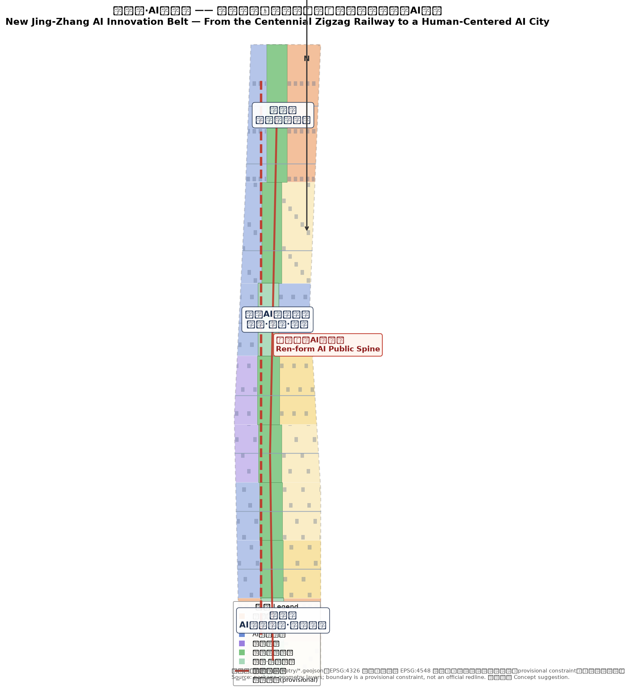
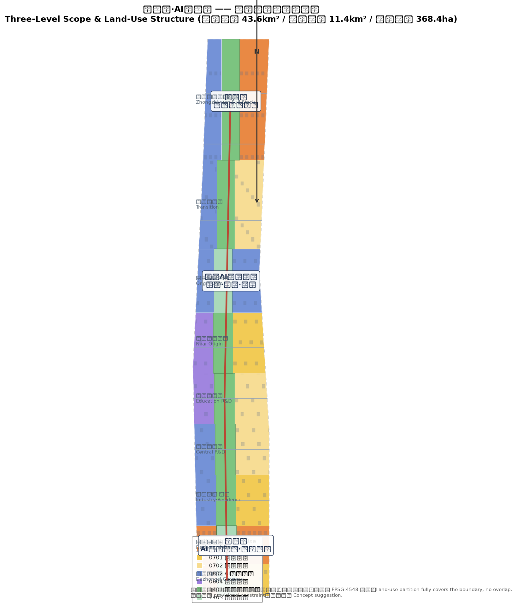
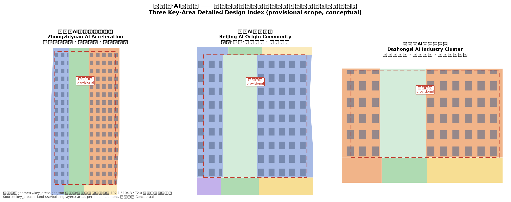
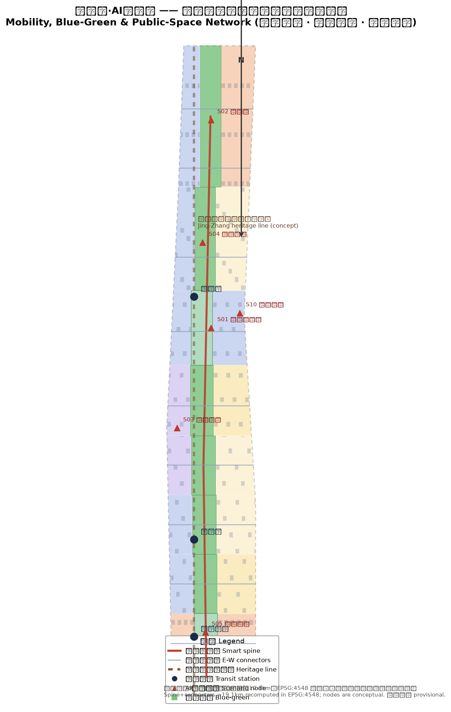
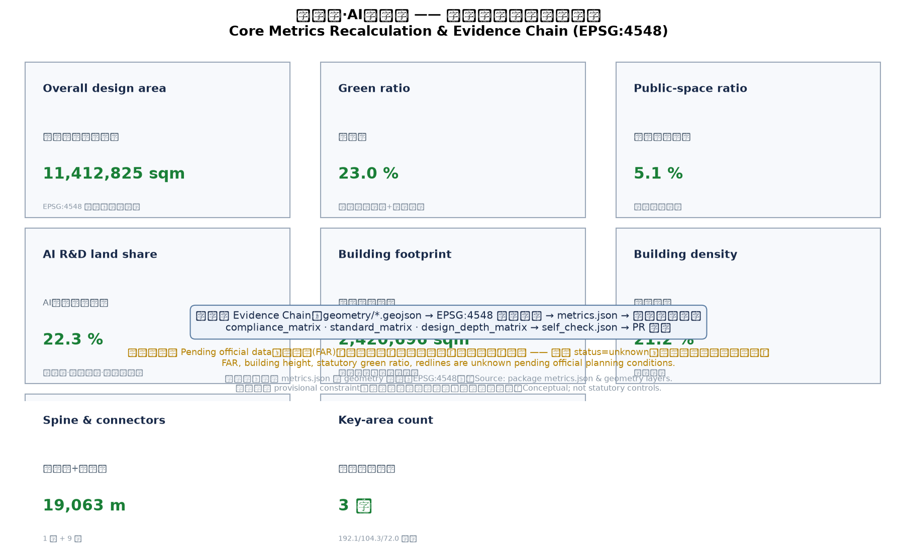

# New Jing-Zhang AI Innovation Belt: From the Centennial Zigzag Railway to a Human-Centered AI City

## Design Basis and Source List

This proposal takes the Qualification Pre-Announcement for the International Urban Design Open Call of the Centennial Jing-Zhang AI Innovation Belt (issued by the Haidian Branch of the Beijing Municipal Commission of Planning and Natural Resources) as its primary basis [source:OFFICIAL-ANNOUNCEMENT] [standard:PROJECT-OFFICIAL-ANNOUNCEMENT]. The announcement defines three planning levels (coordinated research area, approx. 43.6 km2; overall design area, approx. 11.4 km2; key detailed-design area, approx. 368.4 ha), three key areas (Zhongzhiyuan AI Self-Reliance Acceleration Area, approx. 192.1 ha; Beijing AI Origin Community, approx. 104.3 ha; Dazhongsi AI Industry Cluster, approx. 72 ha), and the three positioning statements "Centennial Jing-Zhang culture belt, urban AI living-experience belt, and AI-integrated innovation belt" [source:OFFICIAL-ANNOUNCEMENT].

The Agent Open-Call Taskbook is the basis for the naming system, AI scenarios, user personas, pilgrimage landmarks, cultural narrative, and long-term operations [source:AGENT-TASKBOOK] [standard:PROJECT-AGENT-OPEN-CALL-TASKBOOK]. The taskbook requires all agent outputs to remain open co-creation suggestions that neither replace statutory planning nor constitute government determinations; every spatial proposal in this document follows that boundary [source:AGENT-TASKBOOK].

The proposal follows the Measures for the Administration of Urban Design (MOHURD) on coordinating public space, building height, massing, style, color, and city character [standard:MOHURD-URBAN-DESIGN-MEASURES], and applies the Urban Design Technical Guidelines and other professional standards to organize design depth [standard:MOHURD-URBAN-DESIGN-TECHNICAL-GUIDELINE]. Land-use classification follows the Guideline for Land Use Classification of Territorial Spatial Survey, Planning and Use Control (Ministry of Natural Resources) [standard:MNR-LAND-USE-CLASSIFICATION-GUIDE]; composition also references the Beijing Master Plan (2016-2035) positioning of Haidian innovation districts and the protection of the "Three Hills and Five Gardens" cultural heritage [source:BJ-MASTER-PLAN].

As of the submission date, no official precise boundary or official key-area polygons are available in the repository. This proposal uses the maintainer-registered provisional rough boundary and key-area polygons in `brief/site-package/geometry/provisional_boundaries.geojson` [source:SITE-PACKAGE] [source:SOURCE-REGISTRY]. All geometry is tagged `geometry_role="provisional_constraint"`, `official_boundary=false`, `boundary_precision="provisional_rough"` and may only be used for generation, visualization, design discussion, and local self-checks; it must not be treated as an official redline, approval basis, or precise-area basis [data:geometry/site_boundary.geojson#SITE-001] [data:geometry/key_areas.geojson#PROV-KEY-001]. The organizer data gap does not block content scoring; when official polygons arrive, all area-based metrics must be recalculated in EPSG:4548 [metric:site_area_sqm].

Relationship between narrative and structured evidence: `proposal.md` is the human-readable primary proposal; `geometry/*.geojson`, `metrics.json`, and the three matrix files hold the complete machine-auditable evidence layer. The narrative keeps only a few directly relevant citations and does not duplicate machine indexes [depth:three_level_scope_framework].

## Three-Level Scope Framework

### 2.1 Coordinated Research Area (approx. 43.6 km2)

Bounded by the Fifth Ring Road to the north, the Beijing-Tibet Expressway to the east, Xizhimen Outer Street to the south, and Wanquanhe Road to the west, this is the strategic layer for studying Haidian's AI industry ecology and future-city form [source:OFFICIAL-ANNOUNCEMENT]. It answers three questions: how the AI innovation and industry chains organize within Haidian and the Beijing-Tianjin-Hebei region, how the future AI city form integrates with the existing built environment, and how the three-areas-two-wings synergy loop forms [source:AGENT-TASKBOOK]. This layer does not aim at precise redlines; it works on industry strategy, innovation networks, regional synergy, and future-city experiments, with spatial outputs expressed as reference schemes [data:geometry/site_boundary.geojson#SITE-001].

### 2.2 Overall Design Area (approx. 11.4 km2)

Centered on the 1-2 km urban and industrial zones around the Jing-Zhang Heritage Park, this layer reaches urban-design depth equivalent to a regulatory detailed plan. It translates industry strategy into: land-use structure (R&D 22.3%, commercial 15.9%, residential 27.8%, education 5.9%, heritage-park green 23.0%, squares 5.1%) [data:geometry/land_use.geojson#LU-001] [metric:rnd_land_ratio], building footprint layout [metric:building_footprint_area_sqm], the smart slow-mobility spine [data:geometry/roads.geojson#ROAD-001], the blue-green public-space network [metric:green_ratio], and the phased implementation framework [data:geometry/phasing.geojson#PHASE-001].

### 2.3 Key Detailed-Design Area (approx. 368.4 ha)

Composed of three polygons, this layer reaches urban-design depth equivalent to a comprehensive implementation plan [data:geometry/key_areas.geojson#PROV-KEY-002] [data:geometry/key_areas.geojson#PROV-KEY-003] [metric:key_area_count]. The three areas perform the functions of "full-stack self-reliance innovation", "AI origin and talent community", and "AI industry agglomeration and intelligent economy" — the "three cores" (see Chapter 5).

The three levels cascade: the coordinated research layer determines the industry chain and synergy loop, the overall design layer translates them into land use, transport, blue-green space and character, and the key areas verify buildability of buildings, public space, and AI scenarios at parcel level [depth:three_level_scope_framework] [depth:overall_spatial_structure].

## Coordinated Research Area: Industry and Future City Research

### 3.1 Overall Concept: From the "Ren" (Zigzag) Railway to a Human-Centered AI City

In 1909, the Jing-Zhang Railway opened to traffic; Zhan Tianyou's zigzag ("ren"-shaped) alignment climbed the Badaling mountains, making it China's first trunk railway built under independent Chinese design — the centennial origin of "self-reliance" [source:BJ-MASTER-PLAN]. This proposal develops the **"New Jing-Zhang"** concept: extending the self-reliance spirit of the zigzag railway into a human-centered AI city form — **"the 'ren' character means human-centered"**. Three keywords:

- **Centennial Jing-Zhang culture belt**: Qinghuayuan Station and the railway heritage line serve as cultural anchors [source:AGENT-TASKBOOK];
- **Urban AI living-experience belt**: AI ascends from "industry tool" to "life experience", perceptible and participatory in parks, streets, and communities [source:AGENT-TASKBOOK];
- **AI-integrated innovation belt**: the three-cores-two-wings skeleton closes the loop of innovation, industry, talent, capital, and data [source:AGENT-TASKBOOK].

### 3.2 Naming System and Logo Direction

The naming system adopts a three-level structure: belt name / core names / node names.

| Level | Name (ZH) | Name (EN) | Note |
| --- | --- | --- | --- |
| Belt | 新京张·AI创新带 | New Jing-Zhang AI Innovation Belt | Master brand, reviving centennial Jing-Zhang spirit |
| Three cores | 众智园、北京AI原点社区、大钟寺 | Zhongzhiyuan / AI Origin Community / Dazhongsi | Official names retained for recognition |
| Two wings | 中关村科技服务翼、小月河场景赋能翼 | Zhongguancun Service Wing / Xiaoyuehe Scenario Wing | Service- and scenario-oriented |
| Spatial brand | 人形AI公共脊 | "Ren" (Human) AI Public Spine | Honoring the railway's zigzag heritage |

Logo direction: using the zigzag railway track as the motif, transform the two rails into two facing "human" figures linked by a chain of luminous nodes, symbolizing "human collaboration × AI intelligence". Colors: railway rust-red (heritage) blended with Haidian innovation blue (AI future), with the tagline "Human-centered, co-created, future-bound". All logo, typography, and graphics are self-drawn concepts with no third-party trademark or font licensing issues [source:AGENT-TASKBOOK] [depth:brand_identity_system].

### 3.3 Five Functions and Three-Areas-Two-Wings Synergy Loop

The proposal organizes space around the taskbook's five functions [source:AGENT-TASKBOOK]:

1. **AI full-stack self-reliance system** — anchored at Zhongzhiyuan, covering chips, frameworks, models, data, applications, evaluation, safety and governance;
2. **World-class AI innovation ecosystem** — anchored at the AI Origin Community, powered by university incubation, open-source collaboration, and a talent zone;
3. **AI+ scenario empowerment paradigm** — the Xiaoyuehe wing serves as the testbed turning scenarios from display to operation;
4. **Intelligent AI vibrant city** — the heritage-park public spine integrates AI mobility, public services, and public space;
5. **Global voice in AI governance** — the Zhongzhiyuan safety-governance corridor and Dazhongsi international roadshow hall export standards, evaluation, and governance experience.

The three areas and two wings form the loop "university incubation → open-source collaboration → enterprise conversion → scenario validation → global dissemination → back to incubation": the Zhongguancun service wing (west) supplies capital, IP, professional services, and global factor allocation [data:geometry/land_use.geojson#LU-001]; the Xiaoyuehe scenario wing (east) supplies city-scale testbeds and living scenarios [data:geometry/land_use.geojson#LU-001]. The cores and wings interconnect through the human public spine and slow-mobility network [data:geometry/roads.geojson#ROAD-001].

### 3.4 Global AI Innovation Ecosystem Cases (5-8 readable summaries)

The proposal studies the following global AI innovation ecosystems and extracts transferable spatial and operational mechanisms [source:AGENT-TASKBOOK] [depth:ai_ecosystem_case_studies]:

1. **Silicon Valley (US)**: the Stanford-enterprise-capital "academic spillover" model — the Origin Community should turn university edges into entrepreneurship interfaces;
2. **Cambridge Science Park (UK)**: university-anchored, low-density garden campus — research land should keep high ecological quality and pedestrian scale;
3. **Tel Aviv (Israel)**: military R&D spillover and the "startup nation" ecosystem — Zhongzhiyuan should host safety evaluation and dual-use showcases;
4. **one-north, Singapore**: government-led "industry-city-life" integrated planning — the three areas and two wings need statutory-grade coordination;
5. **Barcelona 22@**: industrial district renewal into a creative-economy district — Dazhongsi should renew existing stock into intelligent-economy buildings;
6. **Hangzhou Future City**: scenario opening and talent policy driving agglomeration — the Xiaoyuehe wing needs a "scenario-opening list" mechanism;
7. **Shenzhen Bay Ecological Technology Park**: anchor enterprises driving clusters — Zhongzhiyuan should reserve flagship spaces for leading firms;
8. **Tokyo Bay Area**: industry-city integration along an innovation corridor — the heritage-park belt should become a "city-living-room" innovation corridor.

The common mechanisms — university incubation, scenario openness, capital services, international exchange, garden environments — are translated into this proposal's land use, public-space system, scenario nodes, and operating mechanisms [depth:ai_ecosystem_case_studies].

## Overall Design Area: Urban Renewal and Regulatory-Plan-Level Urban Design

### 4.1 Overall Spatial Structure

The overall design area forms an "**one-spine three-cores, four-belt two-wings, multi-node network**" structure [depth:overall_spatial_structure]:

- **One spine**: along the Jing-Zhang railway heritage line, the **"Ren" (Human) AI Public Spine** — a north-south smart slow-mobility and public-space main axis linking heritage culture, AI showcases, sports/recreation, and daily services [data:geometry/green_space.geojson#GREEN-001];
- **Three cores**: Zhongzhiyuan (north), Beijing AI Origin Community (middle), Dazhongsi (south) [data:geometry/key_areas.geojson#PROV-KEY-001];
- **Four belts**: Qinghe ecology belt (north), Zhichun Road innovation-service belt (north-middle), Xiaoyuehe scenario belt (middle), Xueyuan Road technology-service belt (south-middle);
- **Two wings**: Zhongguancun technology-service wing (west), Xiaoyuehe scenario wing (east);
- **Multi-node network**: AI scenario nodes around transit stations and public nodes form an operable scenario network [data:geometry/roads.geojson#ROAD-001].

### 4.2 Land-Use Layout and Functional Proportions

Land use is organized into five dominant functions [data:geometry/land_use.geojson#LU-001]:

| Code | Function | Area (thousand sqm) | Share | Design intent |
| --- | --- | --- | --- | --- |
| 0802 | AI R&D land | 2545.6 | 22.3% | Core carrier of Zhongzhiyuan, Origin Community, central R&D belt [metric:rnd_land_ratio] |
| 05 | Commercial/service land | 1810.0 | 15.9% | Dazhongsi intelligent economy, Zhichun Road service belt [metric:commercial_land_ratio] |
| 0701/0702 | Residential & community | 3176.8 | 27.8% | Talent housing, community AI service network [metric:residential_land_ratio] |
| 0804 | Education land | 674.0 | 5.9% | University-adjacent conversion interface [metric:education_land_ratio] |
| 1401/1403 | Green & squares | 3206.5 | 28.1% | Human public spine, blue-green network [metric:green_ratio] [metric:public_space_ratio] |

The partition fully covers the submitted boundary without overlaps, with consistent shared-edge coordinates, satisfying topology self-checks [data:geometry/land_use.geojson#LU-001] [depth:land_use_layout].

### 4.3 Building Scale, Retain/Renovate/New Logic and Intensity Strategy

This proposal issues no statutory FAR, building height, or demolition conclusions; it provides only **conceptual massing** recomputed from this package's geometry, explicitly marked as low-confidence design quantities pending official planning conditions [metric:floor_area_ratio] [metric:building_height_m]. The conceptual building footprint totals approx. 2,421 thousand sqm with a building density of approx. 21.2% [metric:building_footprint_area_sqm] [metric:building_density], organized as [data:geometry/buildings.geojson#BLDG-001]:

- **Retain**: Jing-Zhang railway heritage, Qinghuayuan Station and historic buildings, existing university campuses, mature residential neighborhoods;
- **Renovate**: existing industrial buildings and street-front commercial interfaces, renewed into AI offices, showcases, and living services;
- **Update**: low-efficiency warehouses and vacant properties rebuilt as "intelligent-native new business" space;
- **New-build**: conceptual massing only on reserved potential parcels at Zhongzhiyuan and the Origin Community, as reference schemes for professional teams to deepen [depth:retain_renovate_demolish] [depth:development_intensity_controls].

### 4.4 Urban Renewal Framework and Project List

The renewal framework has three types [depth:renewal_project_list]:

| Type | Examples | Location | Dependencies |
| --- | --- | --- | --- |
| Public-space renewal | Heritage-park slow-mobility gap stitching, spine north-south connection | along the spine | road redlines, under-bridge space, heritage review [data:geometry/green_space.geojson#GREEN-001] |
| Industrial-space renewal | Zhongzhiyuan full-stack buildings, Origin conversion street, Dazhongsi intelligent-economy buildings | three cores | ownership, planning conditions, ground-floor uses [data:geometry/buildings.geojson#BLDG-001] |
| Living-service renewal | community AI service points, talent apartments, station TOD | multi-nodes | municipal, fire, station agreements [data:geometry/roads.geojson#ROAD-001] |

The full project list appears in Chapter 10 and `compliance_matrix.json`.

## Detailed Design of Key Areas

### 5.1 Zhongzhiyuan AI Self-Reliance Acceleration Area (approx. 192.1 ha, provisional)

**Positioning**: a garden-style "AI full-stack self-reliance" district covering frameworks, models, data, compute, safety evaluation, and standards governance [source:AGENT-TASKBOOK] [data:geometry/key_areas.geojson#PROV-KEY-001].

- **Spatial structure**: with the Qinghe ecology belt as the north interface, forming "waterfront ecology corridor + full-stack innovation district + safety-governance corridor";
- **Building renewal**: existing industrial buildings converted into foundation-model R&D towers, compute centers, and open-source collaboration space; flagship sites reserved for leading firms [data:geometry/buildings.geojson#BLDG-001];
- **Public space**: the Qinghe low-carbon innovation corridor links open test fields, standards workshops, and low-carbon compute experience halls [data:geometry/public_space.geojson#PUBLIC-001];
- **Mobility**: external links via the North Fifth Ring Road and rail stations; internal traffic organized as slow-mobility islands [data:geometry/roads.geojson#ROAD-001];
- **AI scenarios**: foundation-model evaluation field, safety-governance hall, low-carbon compute experience (scenario cards S01, S02, S06);
- **Implementation risks**: provisional boundary, missing planning conditions, compute and energy capacity pending review [depth:three_key_area_detailed_design].

### 5.2 Beijing AI Origin Community (approx. 104.3 ha, provisional)

**Positioning**: a university-adjacent "AI origin and talent community" forming an incubation-conversion-talent loop around neighboring universities and research institutes [source:AGENT-TASKBOOK] [data:geometry/key_areas.geojson#PROV-KEY-002].

- **Spatial structure**: Wudaokou as the east gateway, forming "campus interface + origin plaza + conversion street + talent community";
- **Building renewal**: university-adjacent street-front properties converted into ground-floor incubation and launch space; residential functions retained inside blocks [data:geometry/buildings.geojson#BLDG-001];
- **Public space**: the Origin Plaza hosts open-source launches, achievement showcases, and developer events [data:geometry/public_space.geojson#PUBLIC-001];
- **Mobility**: campus-park slow-mobility stitching and station integration [data:geometry/roads.geojson#ROAD-001];
- **AI scenarios**: open-source launch hall, university conversion street, talent-zone service station (S01, S07, S09);
- **Implementation risks**: campus boundaries, ownership, ground-floor uses, talent housing supply pending confirmation [depth:three_key_area_detailed_design].

### 5.3 Dazhongsi AI Industry Cluster (approx. 72 ha, provisional)

**Positioning**: an urban "AI industry agglomeration and intelligent economy" district serving agents, intelligent terminals, content consumption, and data factors [source:AGENT-TASKBOOK] [data:geometry/key_areas.geojson#PROV-KEY-003].

- **Spatial structure**: anchored at Dazhongsi Station, forming "station TOD hub + intelligent-economy buildings + international roadshow hall + four-quadrant pedestrian loop";
- **Building renewal**: existing commercial and office buildings renewed into intelligent-terminal experience stores, content-consumption space, and data-factor service towers [data:geometry/buildings.geojson#BLDG-001];
- **Public space**: station-square and roadshow hall form the public activity core [data:geometry/public_space.geojson#PUBLIC-001];
- **Mobility**: four-quadrant pedestrian connectivity eliminating intersection gaps [data:geometry/roads.geojson#ROAD-001];
- **AI scenarios**: agent city living room, data-factor meeting hall, international roadshow hall (S05, S08, S12);
- **Implementation risks**: station engineering, green-space composite use, commercial renewal sequencing pending confirmation [depth:three_key_area_detailed_design].

## AI Innovation Ecosystem, Personas, and AI+ Scenarios

### 6.1 Talent Personas (5 types)

| Persona | Typical needs | Spatial response | Privacy & human-review boundary |
| --- | --- | --- | --- |
| Open-source developer | launch, collaboration, evaluation, reputation | Origin Plaza launch hall, public code wall, 24h collaboration space | no personal behavior tracking; aggregate statistics only [source:AGENT-TASKBOOK] |
| Startup team | low-cost offices, compute access, product testbed | Zhongzhiyuan shared test field, edge-compute stops, IP services | compute/data services require separate consent |
| Enterprise visitor | showcase, business, international reception, recruiting | Dazhongsi roadshow hall, transit connection, reception route | corporate marks and cases must be cleared |
| Neighborhood resident | commute, leisure, community services, low-disruption renewal | human public spine, community AI service points, tiered night activities | resident profiles never used for commercial targeting |
| University student/faculty | technology transfer, cross-campus collaboration, daily mobility | campus-park stitching, transfer stations, AI education experience points | campus data and research results require consent |

### 6.2 AI Scenario Cards (12, including 3 industry test/validation scenarios)

| No. | Scenario card | Spatial carrier | Users | Data/privacy boundary | Human review | Operator |
| --- | --- | --- | --- | --- | --- | --- |
| S01 | Open-source launch hall | Origin Plaza | developers, universities | aggregate statistics | human-hosted launches | community operator |
| S02 | Foundation-model evaluation field (**test/validation**) | Zhongzhiyuan | model vendors, evaluators | licensed corpora | expert panel | evaluation platform |
| S03 | Edge-compute stop | along the spine | startups, residents | authorized use | service desk | professional operator |
| S04 | AI slow-mobility navigation | Heritage Park | residents, visitors | low-intrusion sensing, explainable | manual signage patrol | park operator |
| S05 | Dazhongsi international roadshow hall | Dazhongsi | firms, investors | activity consent | human pitch review | convention operator |
| S06 | Qinghe low-carbon innovation corridor | Zhongzhiyuan riverside | firms, public | environmental data | ecology patrol | park operator |
| S07 | University conversion street | Origin Community | students, startups | results consent | transfer officers | university partner |
| S08 | Data-factor meeting hall | Dazhongsi | data suppliers/buyers | compliant, auditable | compliance review | data exchange |
| S09 | AI living-service model street | community-commerce junction | residents | data minimization | human-customer-service fallback | community operator |
| S10 | Agent traffic scenario simulation (**test/validation**) | eastern Xiaoyuehe belt | agent firms, traffic authority | de-identified data | traffic authority review | government-enterprise joint |
| S11 | AI safety-governance hall | Zhongzhiyuan | public, industry | public cases | expert explanation | governance body |
| S12 | Global AI week route (**test/validation**) | whole belt | global developers | public events | organizing committee | international team |

Each scenario maps to spatial layers [data:geometry/public_space.geojson#PUBLIC-001], metrics, and the compliance matrix, ensuring scenarios are "perceptible, showcaseable, and promotable" [depth:scenario_cards] [depth:ai_scenario_space_operation_map].

### 6.3 AI Public Space, Intelligent-Native Businesses, and Pilgrimage Landmarks (3)

- **Landmark 1: the "Ren" (Human) AI Public Spine** — a public-space main axis themed on the zigzag railway, integrating heritage display, AI art, and slow-mobility experience; the contemporary pilgrimage route of "centennial self-reliance" [data:geometry/green_space.geojson#GREEN-001];
- **Landmark 2: Origin Plaza · Open-Source Monument** — an "open-source contribution honor wall and monument" in the AI Origin Community, decorated with public keys, code fragments, and contributor names, forming a developer "pilgrimage-check-in-contribution" honor system [data:geometry/public_space.geojson#PUBLIC-001];
- **Landmark 3: Zhongzhi Tower · Full-Stack Innovation Lighthouse** — an interactive full-chain atlas installation in Zhongzhiyuan displaying "chips-frameworks-models-data-applications-governance", becoming the landmark of global AI governance voice [source:AGENT-TASKBOOK].

All three landmarks are conceptual suggestions, not approved construction; signage, logo, typography, imagery, and corporate/personal marks are fully cleared [depth:landmark_catalog] [depth:honor_display_system].

## Land Use, Building Scale, and Retain-Renovate-Demolish Strategy

This proposal organizes building and land strategy under four categories — retain, renovate, update, and new-build — all expressed as directional design suggestions pending ownership, planning conditions, and as-built data; they constitute neither statutory nor engineering conclusions [depth:retain_renovate_demolish] [depth:height_massing_character].

**Retain**: the Jing-Zhang railway heritage line (conceptual, see constraints layer), historic buildings such as Qinghuayuan Station, existing university campuses, and mature residential neighborhoods are preserved as cultural anchors and stable community bases [data:geometry/constraints.geojson#CONSTR-001].

**Renovate**: existing industrial buildings and street-front commercial interfaces form the main body of renewal — at Zhongzhiyuan, existing R&D buildings are converted into foundation-model towers and compute centers; at the Origin Community, street-front properties become ground-floor launch and incubation space; at Dazhongsi, existing commercial/office stock is renewed into intelligent-terminal experience and data-factor service buildings [data:geometry/buildings.geojson#BLDG-001].

**Update**: low-efficiency warehouses and vacant properties are rebuilt as "intelligent-native new business", concentrated on potential parcels around the three cores and combined with station TOD development [data:geometry/roads.geojson#ROAD-001].

**New-build**: conceptual massing is placed only on reserved potential parcels at Zhongzhiyuan and the Origin Community as reference schemes for professional deepening, not as approved construction [data:geometry/land_use.geojson#LU-001].

The conceptual building footprint totals approx. 2,421 thousand sqm with a building density of approx. 21.2%, recomputed from this package's geometry in EPSG:4548 [metric:building_footprint_area_sqm] [metric:building_density]; these express zoning and intensity logic, not statutory control values. In the land-use structure, AI R&D land is 22.3%, commercial/service 15.9%, residential and community 27.8%, education 5.9%, and green/squares 28.1%, supporting the industrial space and talent-living supply of the three cores [metric:rnd_land_ratio] [metric:residential_land_ratio].

**Data gaps**: statutory FAR, building height, building density, setbacks, and road redlines are not included in the public site package and are uniformly recorded as `status=unknown`; they must be recomputed item by item in EPSG:4548 when official planning conditions arrive [metric:floor_area_ratio] [metric:building_height_m] [metric:green_ratio_official].

## Transport, Rail, Municipal Infrastructure, and Public Services

- **Rail**: strengthen TOD development at Wudaokou, Dazhongsi, Xitucheng and other stations, mixing functions around transit nodes [data:geometry/roads.geojson#ROAD-001];
- **Slow mobility**: the human public spine as the north-south main axis with Xiaoyuehe belt as east-west links, eliminating heritage-park cross-road gaps [data:geometry/roads.geojson#ROAD-001];
- **Road microcirculation**: a "one spine, nine links" network (1 smart slow-mobility spine + 9 east-west connectors) separating through and local traffic [metric:road_centerline_length_m];
- **Parking and non-motorized modes**: P+R near stations, shared-bike stops, non-motorized parking buildings [source:AGENT-TASKBOOK];
- **Municipal and new infrastructure**: distributed energy, edge compute, smart poles, utility tunnels, and public data spaces as new-infrastructure prototypes [depth:municipal_new_infrastructure];
- **Public services**: innovation service platforms, talent living services, and community AI service points arranged on a 15-minute living-circle basis [depth:traffic_rail_slow_parking].

## Blue-Green Network, Public Space, and Urban Character

### 9.1 Blue-Green Public-Space System

The Jing-Zhang Heritage Park forms the "one spine"; the Qinghe ecology belt (north) and the Xiaoyuehe scenario belt (middle) form the "two belts", linking the three core plazas and multiple community parks [data:geometry/green_space.geojson#GREEN-001]. Green ratio is approx. 23.0% and public-space ratio approx. 5.1% [metric:green_ratio] [metric:public_space_ratio], jointly supporting the ecological quality of talent life and outdoor settings for innovation exchange [depth:blue_green_public_space].

### 9.2 Cultural Narrative: Centennial Jing-Zhang × Zhongguancun × New AI Culture

The proposal builds a three-layer narrative "**rail-track — code — human-centered**" [source:AGENT-TASKBOOK] [depth:culture_narrative]:

- **Rail-track layer (centennial Jing-Zhang)**: Qinghuayuan Station and the heritage line (conceptual) as historical anchors [data:geometry/constraints.geojson#CONSTR-001];
- **Code layer (Zhongguancun culture)**: the "dare to innovate, tolerate failure" spirit continued through open-source, co-creation, and evaluation scenarios;
- **Human-centered layer (new AI culture)**: the "ren" motif carries AI well-being, human-machine collaboration, and inclusive intelligence as the new cultural claim.

Signage and symbol system: a unified "human figure" signage motif with three color tiers — heritage (rust red), innovation (blue), life (green); international tagline "From the first railway to the first AI city" [depth:signage_system_direction] [depth:spatial_storyline].

## Renewal Projects, Implementation Policy, and Phasing

### 10.1 Renewal Project List (examples)

| No. | Project | Type | Location | Dependency | Phase |
| --- | --- | --- | --- | --- | --- |
| JZ-01 | Public spine slow-mobility gap stitching | public space | the spine | road redlines, under-bridge space | Phase 1 [data:geometry/phasing.geojson#PHASE-001] |
| JZ-02 | Zhongzhiyuan full-stack innovation buildings | industry renewal | Zhongzhiyuan | ownership, planning conditions | Phase 2 |
| JZ-03 | Origin Plaza and open-source monument | public space | Origin Community | site, heritage | Phase 1 |
| JZ-04 | Dazhongsi four-quadrant pedestrian loop | station TOD | Dazhongsi | station works | Phase 1 |
| JZ-05 | Xiaoyuehe scenario empowerment test belt | scenario facilities | east wing | blue line, municipal | Phase 2 |
| JZ-06 | Global AI week public route | operations | the belt | event permits | Phase 3 |

### 10.2 Implementation Policy and Phasing

- **Phase 1 (Dazhongsi first)**: leverage mature commerce and the transit hub; fast results via light activities, temporary showcases, and public-space renewal;
- **Phase 2 (central corridor)**: Origin Community and central innovation belt renewal, delivering open-source, conversion, and talent services;
- **Phase 3 (Zhongzhiyuan full chain)**: full-stack innovation system completed, forming the closed three-cores-two-wings loop [data:geometry/phasing.geojson#PHASE-001] [depth:phasing_implementation].

All phases are conceptual suggestions to be deepened by professional teams after ownership, funding, implementing-body, and approval-path confirmation.

### 10.3 Global AI Innovation Event System and Long-Term Operations (agent.6)

- **Annual event system**: "New Jing-Zhang AI Innovation Week" (spring roadshows), "Open-Source Co-creation Festival" (summer), "AI Governance Forum" (autumn), "Ren Festival · Release Season" (winter) [source:AGENT-TASKBOOK] [depth:annual_event_system];
- **Event brand and communication**: the "human-figure" logo as core IP, unified visual and communication language, international media matrix [depth:brand_ip_system];
- **Developer community operations**: open-source contributor credits, honor walls, talent-zone channels converting "contribution—honor—opportunity" [depth:developer_community_operation];
- **Scenario-open operations**: scenario-opening lists, test-booking platforms, data sandboxes with explicit privacy and human-review boundaries [depth:scenario_open_operation];
- **Public experience and landmark operations**: routine operation and festival activation of the spine, Origin Monument, and Zhongzhi Tower [depth:public_experience_operation];
- **International communication and conversion**: roadshows, evaluations, data-exchange events linked with talent apartments, business services, and policy windows forming talent/enterprise conversion paths [depth:conversion_pathway].

## Metrics, Area Recalculation, and Compliance Matrix

Core indicators are recomputed from geometry in EPSG:4548 [depth:metrics_recalculation]:

| Indicator | Value | Unit | Formula/source | Status |
| --- | --- | --- | --- | --- |
| Overall design area | 11412825 | sqm | polygon_area(site_boundary) [metric:site_area_sqm] | known (provisional) |
| AI R&D land share | 22.3% | ratio | 0802 area/site [metric:rnd_land_ratio] | known |
| Commercial land share | 15.9% | ratio | 05 area/site [metric:commercial_land_ratio] | known |
| Residential share | 27.8% | ratio | 0701+0702 area/site [metric:residential_land_ratio] | known |
| Green ratio | 23.0% | ratio | green area/site [metric:green_ratio] | known (conceptual) |
| Public-space ratio | 5.1% | ratio | square area/site [metric:public_space_ratio] | known (conceptual) |
| Building footprint area | 2420696 | sqm | sum(building footprints) [metric:building_footprint_area_sqm] | known (conceptual) |
| Building density | 21.2% | ratio | footprint/site [metric:building_density] | known (conceptual) |
| Spine + connector length | 19063 | m | sum(road centerlines) [metric:road_centerline_length_m] | known |
| Key-area count | 3 | count | count(key_areas) [metric:key_area_count] | known |
| Zhongzhiyuan area | 1929202 | sqm | polygon_area(PROV-KEY-001) [metric:zhongzhiyuan_area_sqm] | known (provisional) |
| Origin Community area | 1043237 | sqm | polygon_area(PROV-KEY-002) [metric:beijing_ai_origin_community_area_sqm] | known (provisional) |
| Dazhongsi area | 720454 | sqm | polygon_area(PROV-KEY-003) [metric:dazhongsi_area_sqm] | known (provisional) |
| FAR | pending official data | ratio | official planning conditions [metric:floor_area_ratio] | unknown |
| Building height | pending official data | m | official planning conditions [metric:building_height_m] | unknown |
| Statutory green ratio | pending official data | ratio | official planning conditions [metric:green_ratio_official] | unknown |

`compliance_matrix.json` maps every mandatory task in announcement sections 1.3, 1.4, 1.5 and agent.1-agent.6; `standard_matrix.json` covers all mandatory professional standards; `design_depth_matrix.json` covers all required design-depth items [depth:compliance_matrix] [depth:standard_matrix] [depth:design_depth_matrix].

## Risk, Copyright, and Compliance

- **Data legality**: only public sources and repository-registered materials are used; no non-public government data, corporate internal data, or personal privacy data [source:SOURCE-REGISTRY];
- **Copyright**: logo, typography, and graphics are self-drawn concepts; cited announcements, standards, and case information are attributed; no unauthorized trademarks, portraits, or copyrighted images [source:AGENT-TASKBOOK];
- **AI generation responsibility**: generated by an AI agent; methods and provenance disclosed in `report/copyright_statement.md` and `sources.json`;
- **No official-approval/implementation claims**: all spatial conclusions are "conceptual suggestions / reference schemes / material for professional teams to deepen", constituting neither statutory planning, government determinations, investment commitments, nor engineering feasibility conclusions [depth:risk_missing_data];
- **Pending data**: after official boundaries, planning conditions, as-built buildings, ownership, municipal, and heritage data arrive, area-based metrics, land-use partition, and retain/renovate/new assignments must be recalculated [metric:site_area_sqm];
- **Professional review**: transport, rail, municipal, structural, and heritage conclusions require licensed professional review before implementation [depth:risk_missing_data].

This proposal claims no official approval, approved regulatory plan, final land ownership, confirmed construction scale, or guaranteed implementation [source:AGENT-TASKBOOK].

## References

Key bibliography below; the complete machine index is in `sources.json` and the three matrix files [source:OFFICIAL-ANNOUNCEMENT] [source:AGENT-TASKBOOK] [standard:MOHURD-URBAN-DESIGN-MEASURES].

- Qualification Pre-Announcement for the International Urban Design Open Call of the Centennial Jing-Zhang AI Innovation Belt (Haidian Branch, Beijing Municipal Commission of Planning and Natural Resources, 2026-05-09)
- Agent Open-Call Taskbook for the Centennial Jing-Zhang AI Innovation Belt Urban Design (user-provided cleared material)
- Measures for the Administration of Urban Design (MOHURD, 2017)
- Urban Design Technical Guidelines (MOHURD, 2021)
- Guideline for Land Use Classification of Territorial Spatial Survey, Planning and Use Control (Ministry of Natural Resources, 2023)
- Beijing Master Plan (2016-2035) (Beijing Municipal Government, 2017)
- Public reports and planning materials on the Jing-Zhang Railway Heritage Park
- Public materials on Zhongguancun Science City and Haidian innovation districts
- Public research on global AI innovation ecosystems (Silicon Valley, Cambridge, Tel Aviv, one-north, 22@, etc.)
- Complete machine index: `sources.json`, `metrics.json`, `compliance_matrix.json`, `standard_matrix.json`, `design_depth_matrix.json`