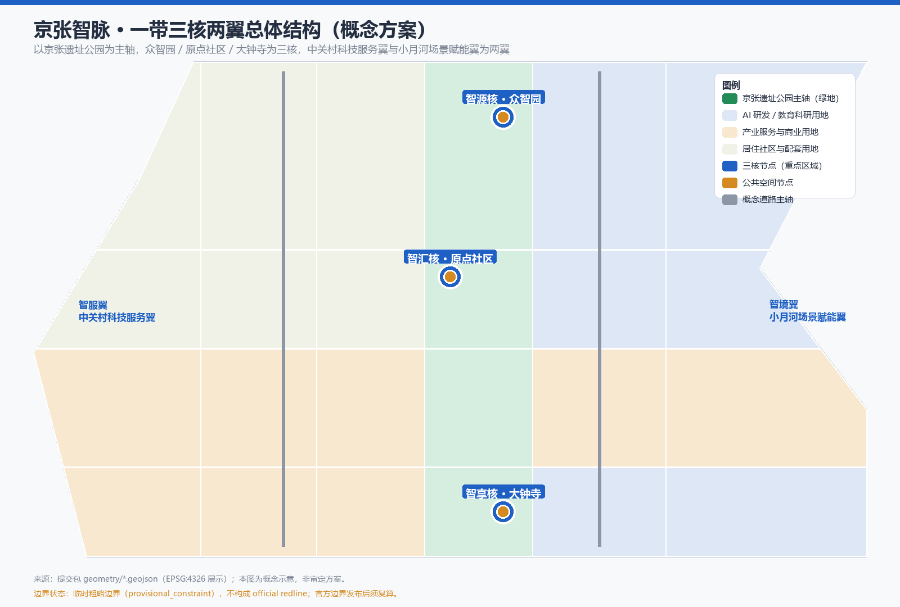
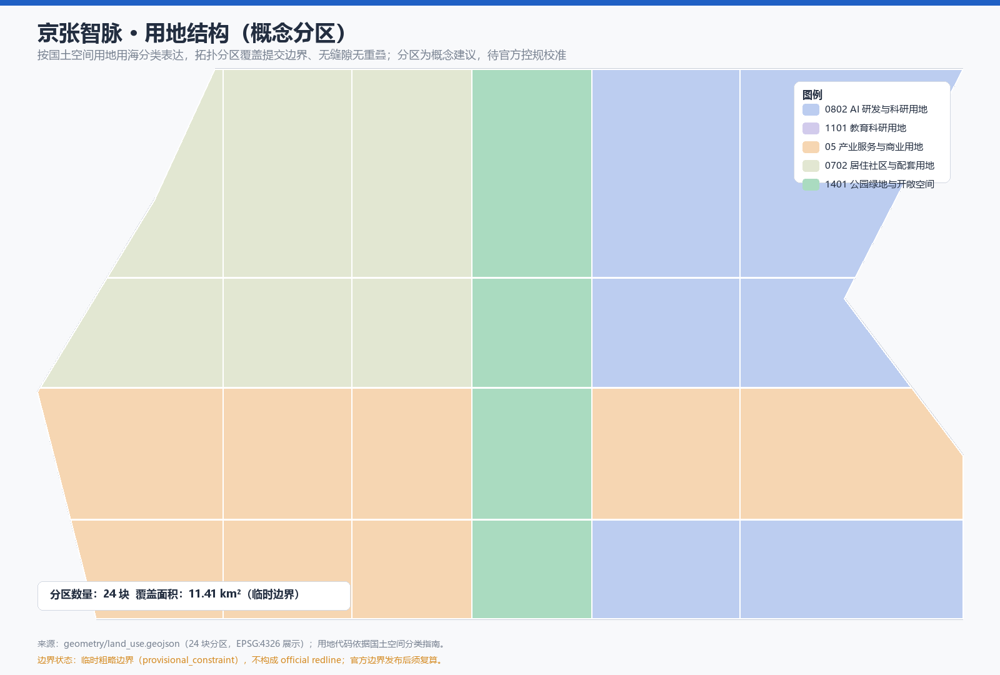
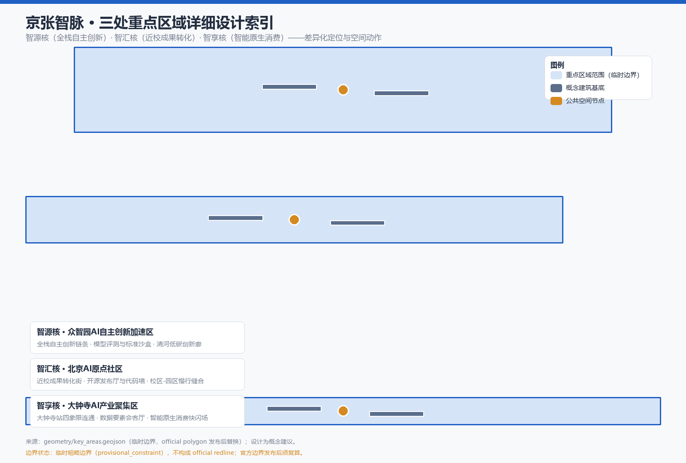
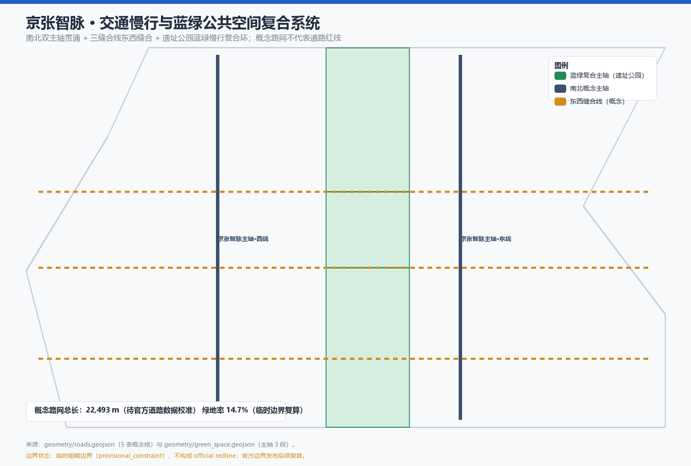
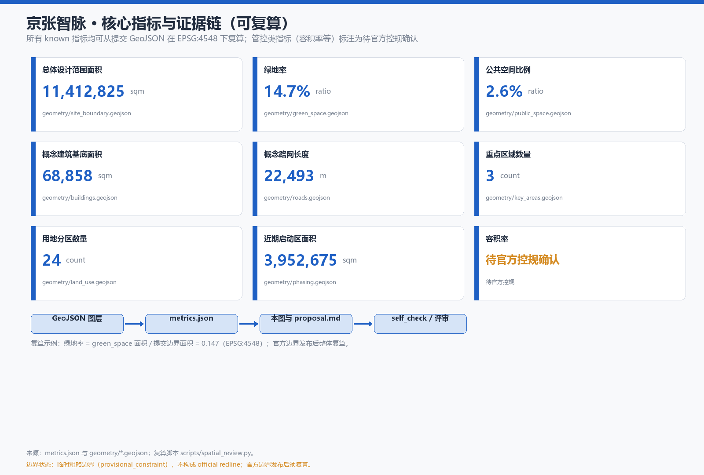

# 京张智脉：百年京张AI创新带总体概念与场景运营方案

## 设计依据与资料清单

本 formal 方案以北京市规划和自然资源委员会海淀分局发布的《百年京张AI创新带城市设计国际方案征集资格预审公告》为第一依据 [source:OFFICIAL-ANNOUNCEMENT]，并以面向全球智能体开展"百年京张AI创新带城市设计开源征集"的任务书摘录为 Agent 任务依据 [source:AGENT-TASKBOOK]。机器可读依据包括 `brief/site-package/` 中的设计任务书、允许设计空间、来源清单、枚举、规划限值、标准与 schema [source:SITE-PACKAGE]，以及公开资料用途登记表 [source:SOURCE-REGISTRY] 和处理后的事实导航包 [source:PROCESSED-FACT-PACK]。边界与三处重点区域几何来自仓库维护者登记的临时粗略边界 [source:BOUNDARY-SOURCE] [source:KEY-AREA-SOURCE]，不作为 official redline。

本方案遵循公告要求，达到控制性详细规划的城市设计深度与规划综合实施方案的城市设计深度，因此文本叙述不替代 GeoJSON、指标表、A3 文册、A0 展板和 HTML 电子展示成果。本节证据链引用 [standard:PROJECT-OFFICIAL-ANNOUNCEMENT]、[standard:PROJECT-AGENT-OPEN-CALL-TASKBOOK]、[standard:MOHURD-URBAN-DESIGN-MEASURES]、[standard:MOHURD-CONTROL-DETAILED-PLANNING]、[standard:MNR-LAND-USE-CLASSIFICATION-GUIDE]、[standard:MOHURD-ARCH-DESIGN-DEPTH-2016] 和 [depth:existing_conditions_diagnosis]，说明方案从公告、Agent 任务书、专业标准、边界与资料包出发组织成果，而非独立愿景文本。

资料使用边界：`data/source_registry.json` 登记 formal 可用、背景、provisional-only 与待复核资料 [source:SOURCE-REGISTRY]；Agent 不得把 background_only 或 provisional_only 资料升级为 official boundary、法定控规、正式评分依据或政府实施承诺。本方案提交边界为临时粗略边界（`provisional_constraint`、`official_boundary=false`、`boundary_precision="provisional_rough"`），只能用于生成、展示、自检与设计讨论；组织方数据缺口不阻断内容评分，官方 polygon 发布后须整体复算 [data:geometry/site_boundary.geojson#SITE-001]。

## 三层范围工作框架

方案按公告确定的三层范围组织：统筹研究范围关注 43.6 平方公里的 AI 产业生态、战略定位与未来城市形态；总体设计范围关注 11.4 平方公里京张遗址公园周边城市地区与产业区，形成城市更新总体框架、产业空间布局、交通市政支撑与风貌控制；重点区域范围关注 368.4 公顷三处详细设计地区 [source:OFFICIAL-ANNOUNCEMENT]。三层范围逐条映射到 `compliance_matrix.json`，保证公告 1.3、1.4、1.5 与 agent.1–agent.6 的必选任务均有章节、图层、指标、图纸和 HTML 证据 [source:PROCESSED-FACT-PACK]。

三层框架的深度由 [depth:three_level_scope_framework] 与 [depth:overall_spatial_structure] 约束，空间证据以 [data:geometry/site_boundary.geojson#SITE-001] 与 [data:geometry/key_areas.geojson#PROV-KEY-001] 为准，任务依据以 [standard:PROJECT-OFFICIAL-ANNOUNCEMENT] 为准。本方案总体概念为"京张智脉"（AI Pulse of Jing-Zhang）：以京张遗址公园为历史与公共空间主轴，以众智园、北京AI原点社区、大钟寺为三处创新锚点，以中关村科技服务翼与小月河场景赋能翼为两翼，形成"一带三核两翼、蓝绿慢行复合环"的空间组织 [data:geometry/land_use.geojson#LU-001]。这里"一带"不是新画红线，而是把三层范围转译为工作方法；"三核"对应三处重点区域；"两翼"对应任务书"三区两翼"中的中关村科技服务翼与小月河场景赋能翼 [source:AGENT-TASKBOOK]。

| 层级 | 设计问题 | 方案回答 | 数据落点 |
| --- | --- | --- | --- |
| 统筹研究范围 | AI 产业生态与未来城市形态如何组织 | "高校策源—开源协作—企业转化—公共体验—国际传播"创新链 | compliance_matrix.json、standard_matrix.json |
| 总体设计范围 | 产业空间、更新、交通市政与风貌如何落图 | 用地、建筑、道路、绿地、公共空间、分期图层共同表达 | [data:geometry/land_use.geojson#LU-001]、[data:geometry/roads.geojson#ROAD-001] |
| 重点区域范围 | 三处片区如何达到详细设计深度 | 智源核/智汇核/智享核分项定位、空间动作与 AI 场景 | [data:geometry/key_areas.geojson#PROV-KEY-001] |

## 统筹研究范围产业与未来城市研究

### 总体概念、命名体系与视觉识别方向（agent.1）

本方案建议一带主名称为"**京张智脉**"（英文 **AI Pulse of Jing-Zhang**，简称 **JZ-Pulse**），命名体系如下，全部为概念建议，供专业团队深化：

| 层级 | 建议名称 | 英文 | 对应范围 | 设计理由 |
| --- | --- | --- | --- | --- |
| 一带 | 京张智脉 | AI Pulse of Jing-Zhang (JZ-Pulse) | 总体设计范围 | "脉"同时表达铁路线、数据流、创新血脉与城市脉搏，承接百年京张与 AI 双重语义 |
| 北核 | 智源核·众智园 | Origin · Zhongzhiyuan | 众智园AI自主创新加速区 | 全栈自主创新与标准治理之源 |
| 中核 | 智汇核·原点社区 | Confluence · Origin Community | 北京AI原点社区 | 高校、开源、资本与人才交汇 |
| 南核 | 智享核·大钟寺 | Exchange · Dazhongsi | 大钟寺AI产业聚集区 | 智能原生消费、数据要素与国际交往 |
| 西翼 | 智服翼·中关村科技服务翼 | Service Wing | 中关村科技服务翼 | 要素全球化配置与科技服务赋能 |
| 东翼 | 智境翼·小月河场景赋能翼 | Scenario Wing | 小月河场景赋能翼 | AI 场景开放与活力城市体验 |

Logo 与视觉识别方向：以京张铁路铁轨透视（历史纵轴）与脉冲波形（AI 横轴）交叠为核心母题，辅以"JZ"字母组合与中国"智"字笔画意象；主色采用京张青灰（铁路与工业记忆）、海淀科技蓝（创新与算力）、信号灯绿（公共空间与活力）三色体系。该方向与任务书要求的"一带总体概念、命名体系、视觉识别和 Logo 方向"对应 [source:AGENT-TASKBOOK]，视觉资产均须清权后使用，本节仅提供设计方向，不构成最终品牌定稿 [standard:PROJECT-AGENT-OPEN-CALL-TASKBOOK]。

三大定位（百年京张文化带、都市 AI 生活体验带、AI 融合创新带）、五大功能（AI 全栈自主创新体系、世界级 AI 创新生态、AI+ 场景赋能新范式、智能化 AI 活力城市、AI 治理全球话语权）与"三区两翼"协同回路在 `compliance_matrix.json` 中逐条映射 [source:AGENT-TASKBOOK]。

### 全球 AI 创新生态案例（agent.2）

面向智能体任务书要求提供 5–8 个全球 AI 创新生态案例；本方案选取 7 个与海淀情境可比的案例作为参考（均为公开资料，作为概念参考而非直接复制）：

| 案例 | 地点 | 模式 | 对京张智脉的启示 |
| --- | --- | --- | --- |
| Kendall Square | 美国波士顿 | MIT 近校创新街区，AI 与生命科学集聚，存量更新 | 原点社区"近校成果转化"的空间组织参考 |
| King's Cross | 英国伦敦 | 铁路货场遗产更新为科技街区，公共空间先导 | 京张遗址公园"遗产活化+科技办公"最可比模式 |
| Station F | 法国巴黎 | 铁路货站改造为全球最大创业孵化器 | 遗址空间承载 AI 创新生态的再利用路径 |
| one-north | 新加坡纬壹 | 研究园区+生活+公共空间一体化 | "研发—生活—场景"融合街区 |
| 深圳湾科技生态园 | 中国深圳 | 产城融合，总部+服务+生态复合 | 产业空间与服务配套比例参考 |
| 杭州未来科技城 | 中国杭州 | 人才特区+场景开放 | 人才政策与场景开放机制 |
| 东京丸之内 | 日本东京 | 轨道+商务+文化运营的长周期品牌运营 | 一带长期品牌与活动运营参考 |

生态图谱（概念）：高校院所策源 → 开源社区协作 → 平台企业转化 → 公共体验展示 → 国际传播反哺，形成闭环；`land_use.geojson` 中 0802 AI 研发创新用地与 1101 教育科研用地承载图谱两侧 [data:geometry/land_use.geojson#LU-001] [data:geometry/land_use.geojson#LU-002]。

### 众智园全栈自主创新体系与要素机制

众智园围绕"模型—算力—数据—标准—安全"全栈链条组织空间：研发用地承载模型训练与评测，公共空间承载标准制定工作坊与安全治理展示，绿色空间承载低碳算力体验 [data:geometry/green_space.geojson#GREEN-001]。要素机制（土地、空间、产业、资金、人才、算力、数据、场景）以概念建议形式提出，不构成招商或财政承诺 [source:AGENT-TASKBOOK]。AI 原点社区构建"近校创新—成果转化—人才特区—开源体系"生态 [data:geometry/key_areas.geojson#PROV-KEY-002]。

## 总体设计范围城市更新与控规深度城市设计

总体设计范围要求达到控制性详细规划的城市设计深度：本方案提出"一带三核两翼"总体空间结构，识别遗址公园沿线低效空间，形成更新项目清单与实施政策建议 [depth:land_use_layout] [depth:development_intensity_controls] [depth:height_massing_character] [depth:retain_renovate_demolish]。`geometry/land_use.geojson` 以拓扑分区覆盖提交边界且无缝隙、无重叠 [data:geometry/land_use.geojson#LU-001]，`geometry/buildings.geojson` 以概念基底表达三核周边更新对象 [data:geometry/buildings.geojson#BLDG-001]，`geometry/roads.geojson` 表达南北主轴与东西缝合 [data:geometry/roads.geojson#ROAD-001]，`metrics.json` 复算核心面积与比例 [metric:site_area_sqm] [metric:land_use_patch_count]。

用地分类依据 [standard:MNR-LAND-USE-CLASSIFICATION-GUIDE]：AI 研发创新用地（0802）围绕智源核与智汇核，产业服务与商业用地（05）围绕智享核与缝合线，居住社区与配套用地（0702）布局于西侧，公园绿地（1401）构成遗址公园主轴 [data:geometry/land_use.geojson#LU-001]。建筑高度、体量、界面与风貌控制由 [depth:height_massing_character] 管理，拆改留方法由 [depth:retain_renovate_demolish] 管理；由于官方控规、道路红线、权属与现状建筑数据缺失，本方案不给出容积率、建筑高度或拆改留结论，均列为待正式控规确认事项 [metric:floor_area_ratio]。建筑基底面积 [metric:building_footprint_area_sqm] 与数量 [metric:building_count] 为概念示意值，置信度 low。

交通、轨道、市政与配套设施：围绕京张遗址公园跨环路节点、五道口、清华东路西口、大钟寺站及重点企业周边提出轨道站点一体化、道路微循环、慢行断点缝合、停车与新型基础设施概念策略 [depth:traffic_rail_slow_parking] [depth:municipal_new_infrastructure]；道路与慢行图层保持提交边界内 [data:geometry/roads.geojson#ROAD-001] [data:geometry/public_space.geojson#PUBLIC-001]，涉及道路红线、管线与市政容量时均列为待确认条件。

## 重点区域详细设计

三处重点区域达到详细设计深度，按"智源核—智汇核—智享核"差异化定位 [depth:three_key_area_detailed_design]，空间证据引用 [data:geometry/key_areas.geojson#PROV-KEY-001]、[data:geometry/key_areas.geojson#PROV-KEY-002]、[data:geometry/key_areas.geojson#PROV-KEY-003]（临时边界，official polygon 发布后替换）。

| 重点片区 | 设计定位 | 空间动作（概念建议） | AI 产业与运营场景 |
| --- | --- | --- | --- |
| 智源核·众智园AI自主创新加速区 | 花园型全栈自主创新街区 | 强化清河界面与低碳创新交往；以绿色空间承载开放测试与标准治理展示 [data:geometry/green_space.geojson#GREEN-001] | 自主模型评测沙盒、标准制定工作坊、安全治理展示、低碳算力体验 |
| 智汇核·北京AI原点社区 | 近校型成果转化与人才社区 | 校区—园区—街区慢行缝合；补足成果发布、人才服务与开源协作空间 [data:geometry/buildings.geojson#BLDG-003] | 开源社区、成果发布厅、人才特区服务、近校孵化 |
| 智享核·大钟寺AI产业聚集区 | 城市型智能经济与国际交往街区 | 大钟寺站一体化、四象限步行连通、商业服务与重点企业周边公共环境更新 [data:geometry/public_space.geojson#PUBLIC-003] | 智能体与智能终端展示、内容消费、数据要素与国际路演 |

三处重点区公共节点分别落位智源广场 [data:geometry/public_space.geojson#PUBLIC-001]、智汇广场 [data:geometry/public_space.geojson#PUBLIC-002]、智享广场 [data:geometry/public_space.geojson#PUBLIC-003]，与分期 [data:geometry/phasing.geojson#PHASE-001] 和概念建筑 [data:geometry/buildings.geojson#BLDG-001] 相互校核。HTML 页面可切换查看三处重点区域，A3 文册与 A0 展板包含重点片区总图、局部详图与指标说明。

## AI 创新生态、人才画像与 AI+ 场景

### 用户画像（agent.3，不少于 5 类）

| 用户画像 | 典型需求 | 空间响应 | 自检边界 |
| --- | --- | --- | --- |
| 开源开发者 | 发布、协作、测试、社区声誉 | 原点社区开源发布厅、公共代码墙、夜间协作空间 | 不采集个人行为轨迹；活动数据只做聚合统计 |
| 初创团队 | 低成本办公、算力入口、产品试验场 | 众智园共享测试场、端侧算力服务点、标准治理咨询 | 算力和数据服务需另行授权 |
| 头部企业访客 | 展示、商务、国际接待、人才招聘 | 大钟寺国际路演客厅、轨道站点接驳、企业周边公共空间 | 企业标识和案例须清权 |
| 周边居民 | 通勤、休闲、社区服务、低扰动更新 | 京张遗址公园慢行环、社区服务嵌入、夜间照明分级 | 不将居民画像用于商业推荐 |
| 高校师生 | 成果转化、跨校协作、日常慢行 | 校区—园区慢行缝合、成果转化驿站、AI 教育体验点 | 校园数据和科研成果需授权 |
| 国际访客与开发者社区 | 全球活动、城市体验、传播内容 | 智脉路线导览、多语种信息、活动周公共路线 | 外籍信息处理遵守数据出境与隐私规则 |

### AI 场景卡（agent.3，不少于 10 张；本方案 12 张）

| 场景卡 | 空间载体 | 设计说明 |
| --- | --- | --- |
| 01 开源发布厅 | 北京AI原点社区 [data:geometry/public_space.geojson#PUBLIC-002] | 成果发布、代码贡献展示与小型路演 |
| 02 安全治理沙盒 | 智源核·众智园 | 标准制定、安全评测、模型红队测试的可参观协作节点 |
| 03 端侧算力驿站 | 总体设计范围节点 | 公共服务+低碳能源+端侧算力的新型基础设施原型（待深化） |
| 04 AI 慢行导航 | 京张遗址公园活力带 | 可解释导视与低侵入传感识别慢行断点与无障碍需求 |
| 05 大钟寺国际路演客厅 | 智享核·大钟寺 | 智能体、智能终端、内容消费企业的展示洽谈与国际交流 |
| 06 清河低碳创新廊 | 众智园临清河界面 [data:geometry/green_space.geojson#GREEN-001] | 绿色空间、雨洪、步行骑行与 AI 展示复合 |
| 07 近校成果转化街 | 北京AI原点社区 | 孵化、展示、法务、知识产权与投融资服务 |
| 08 数据要素会客厅 | 智享核·大钟寺 | 以合规、授权、可审计为前提的数据要素流通服务界面 |
| 09 AI 生活服务样板街 | 社区与商业交汇处 | 医疗、教育、法律、生活服务 AI+ 场景的小尺度街区 |
| 10 全球 AI 活动周路线 | 一带公共空间系统 | 遗址文化→开源社区→产业展示→国际路演的可步行体验路线 |
| 11 机器人低速配送示范线 | 智享核街区与小月河场景赋能翼 | 无人配送与低速机器人共行街道（测试验证场景） |
| 12 智能原生消费快闪场 | 大钟寺站周边 | 智能终端与内容消费的季度快闪与常设体验 |

### 产业测试验证场景（agent.3，不少于 3 个）

| 测试场景 | 位置（概念） | 验证内容 | 边界与人工复核 |
| --- | --- | --- | --- |
| T-01 模型评测与标准沙盒 | 智源核·众智园 | 模型能力评测、安全红队、标准工作坊 | 公开数据、人工评审；不涉及未授权数据 |
| T-02 低速配送与机器人共行 | 智享核·大钟寺及小月河翼 | 低速无人配送、机器人共行、避障与调度 | 封闭或分级开放路段、安全员复核 |
| T-03 交通慢行 AI 评估 | 京张遗址公园沿线 | 慢行断点、换乘不便、无障碍缺口识别 | 数据最小化、不输出个人画像 [source:AGENT-TASKBOOK] |

AI 场景落到空间与治理边界：公共空间场景引用 [data:geometry/public_space.geojson#PUBLIC-001]，慢行与交通场景引用 [data:geometry/roads.geojson#ROAD-001]，开放空间场景引用 [data:geometry/green_space.geojson#GREEN-001] 和 [metric:public_space_ratio]、[metric:green_ratio]。场景-空间-运营映射、隐私边界与人工复核机制写入 `compliance_matrix.json`，不把未成熟技术写成已可全面部署，不把测试场景写成已批准运营 [standard:PROJECT-AGENT-OPEN-CALL-TASKBOOK]。

## 用地、建筑规模与拆改留方案

用地方案依据 [standard:MNR-LAND-USE-CLASSIFICATION-GUIDE]，形成完整、闭合、无缝的用地分区 [data:geometry/land_use.geojson#LU-001]。建筑方案区分保留、改造、更新、新建与待确认对象的概念层级，明确基底、功能、风貌与体量控制的建议层级 [data:geometry/buildings.geojson#BLDG-001]；由于缺少现状建筑、权属、控规与工程条件，本方案不编造拆改留结论，只提出方法与待校准清单 [depth:retain_renovate_demolish]。

建筑规模与强度指标与 `metrics.json` 一致：概念建筑基底面积 [metric:building_footprint_area_sqm] 与数量 [metric:building_count] 为示意值；容积率、建筑高度、建筑密度、退线与道路红线均列为 unknown 或 pending_control [metric:floor_area_ratio]，不得用固定数值制造精确感 [standard:MOHURD-CONTROL-DETAILED-PLANNING]。A3 文册给出更新项目清单与指标复核表，A0 展板表达关键空间结构与重点片区，HTML 提供指标与图层联动。

## 交通、轨道、市政与公共服务设施

交通方案回应公告对轨道站点一体化、道路微循环、慢行断点、对外交通、停车、非机动车停放与绿色交通系统的要求 [source:OFFICIAL-ANNOUNCEMENT]，重点覆盖北五环、京张遗址公园跨环路节点、五道口、清华东路西口、大钟寺站及重点企业周边交通联系 [depth:traffic_rail_slow_parking]。概念路网以两条南北主轴（西线慢行接驳主轴 [data:geometry/roads.geojson#ROAD-001]、东线轨道接驳与产业服务主轴 [data:geometry/roads.geojson#ROAD-002]）与三条东西缝合线（北缝合线 [data:geometry/roads.geojson#ROAD-003]、中缝合线 [data:geometry/roads.geojson#ROAD-004]、南缝合线 [data:geometry/roads.geojson#ROAD-005]）表达"南北贯通、东西缝合"骨架 [metric:road_centerline_length_m]。道路与慢行图层保持在提交边界内，并与公共空间、绿地、产业节点相互校核；提交边界为 provisional 时，交通结论仅作临时设计讨论 [data:geometry/constraints.geojson#CONSTRAINTS-001]。

市政与公共服务设施覆盖 AI 产业服务设施、创新服务平台、人才生活服务设施、新型基础设施、分布式能源、端侧算力与传统市政设施融合 [depth:municipal_new_infrastructure]。缺少管线、能源、排水、防洪、消防等工程资料时，列为正式深化前置条件，写入 `assumptions.json` 与风险章节。

## 蓝绿空间、公共空间与城市风貌

蓝绿空间以京张遗址公园活力带为骨架：`green_space.geojson` 以三段式主轴表达北段（智源核）、中段（智汇核）、南段（智享核）的连续绿色廊道 [data:geometry/green_space.geojson#GREEN-001] [data:geometry/green_space.geojson#GREEN-002] [data:geometry/green_space.geojson#GREEN-003]，统筹清河、小月河、高校与企业出行需求，提出南北贯通、东西连通的步道、骑行道与绿色空间体系 [depth:blue_green_public_space]。蓝绿公共空间核心证据为 [metric:green_ratio] 与 [metric:public_space_ratio]，绿地面积 [metric:green_space_area_sqm] 与公共空间面积 [metric:public_space_area_sqm] 可从几何复算；城市设计管理办法要求统筹景观风貌、公共空间与建筑控制 [standard:MOHURD-URBAN-DESIGN-MEASURES]。

### AI 朝圣地标与荣誉展示体系（agent.4，不少于 3 个）

| 地标 | 位置（概念） | 设计意向 | 边界 |
| --- | --- | --- | --- |
| 智脉原点纪念碑 | 清华园车站及遗址公园北段 | 百年铁路与 AI 原点交汇的公共纪念物与体验节点 | 涉及文保与风貌控制时须专业复核 |
| 智脉脉冲桥/光影廊 | 京张遗址公园跨环路节点 | 南北贯通的步行景观桥与 AI 光影公共艺术 | 桥隧与工程可行性不在本方案结论内 |
| 全栈创新灯塔 | 智源核·众智园 | 模型评测与标准发布的展示与荣誉节点 | 不虚构运营主体 |
| 智享会客厅 | 智享核·大钟寺 | 智能原生消费与数据要素展示的国际交往客厅 | 企业标识与数据展示须清权 |

荣誉展示体系（概念）：贡献者墙、开源代码墙、AI 朝圣护照（打卡集章式公共体验）与公共空间组件库（导视、座椅、灯杆、信息屏、无障碍设施的标准组件），作为可被专业团队继续深化的开放素材 [depth:blue_green_public_space]；不制造过度娱乐化或低俗化地标 [source:AGENT-TASKBOOK]。

## 文化叙事、导视系统与国际传播（agent.5）

百年京张文化、中关村文化与 AI 新文化形成三线融合叙事：**人字铁路**（1909 年京张铁路通车所承载的自主创新精神）→ **中关村**（从电子一条街到 AI 策源地的创新接力）→ **AI 新文化**（开源、共创、人机协作的时代气质），对应"智脉"的时间纵深、空间纵深与文明纵深 [source:AGENT-TASKBOOK]。空间文化系统以遗址公园为叙事主轴，以三核为章节节点，形成可步行、可传播的故事线；导视与符号系统从铁轨符号（历史）、脉冲线（AI）、"智"字符号（融合）三级演进，与一带整体 Logo 系统明确区分——文化标识系统服务场所叙事，Logo 服务一带品牌 [standard:PROJECT-AGENT-OPEN-CALL-TASKBOOK]。所有历史叙述以公开可核材料为准，不歪曲史实；肖像、商标、论文图像与版权材料未经授权不使用 [standard:PROJECT-OFFICIAL-ANNOUNCEMENT]。

国际传播叙事建议以"一座 1909 年的自主创新之城，正在成为 2026 年的全球 AI 脉冲源"为对外主线，配合多语种导览、开发者社区内容与城市外交活动，形成可继续深化的传播资产（概念建议，不构成传播承诺）[depth:risk_missing_data]。

## 更新项目清单、实施政策与分期计划

### 更新项目清单（概念建议）

| 项目编号 | 项目名称 | 类型 | 主要依赖 | 证据引用 |
| --- | --- | --- | --- | --- |
| JZ-01 | 京张遗址公园慢行断点缝合 | 公共空间/交通 | 道路红线、桥下空间、交通组织复核 | [data:geometry/roads.geojson#ROAD-001] |
| JZ-02 | 智脉脉冲桥与南北贯通节点 | 公共空间/地标 | 跨环路节点工程与文保条件 | [data:geometry/green_space.geojson#GREEN-001] |
| JZ-03 | 智源核·众智园清河创新界面 | 蓝绿空间/产业展示 | 河道蓝线、生态与防洪条件 | [data:geometry/green_space.geojson#GREEN-001] |
| JZ-04 | 智汇核·原点社区近校成果转化街 | 城市更新/产业服务 | 校区边界、权属、首层业态 | [data:geometry/buildings.geojson#BLDG-003] |
| JZ-05 | 智享核·大钟寺站四象限步行连通 | 轨道一体化/慢行 | 轨道站点、道路交叉口、市政管线 | [data:geometry/public_space.geojson#PUBLIC-003] |
| JZ-06 | 智脉广场体系（三处公共节点） | 公共空间 | 权属与公共空间许可 | [data:geometry/public_space.geojson#PUBLIC-001] |
| JZ-07 | 模型评测与标准沙盒 | 新基建/产业服务 | 算力、数据合规、运营主体 | [data:geometry/constraints.geojson#CONSTRAINTS-001] |
| JZ-08 | 低速配送与机器人共行示范线 | 新基建/场景测试 | 交通法规、安全运营机制 | [data:geometry/roads.geojson#ROAD-005] |
| JZ-09 | AI 生活服务样板街 | 城市更新/公共服务 | 业态、产权、运营主体 | [data:geometry/land_use.geojson#LU-001] |
| JZ-10 | 全球 AI 活动周公共路线 | 运营/品牌 | 公共空间许可、活动安全、版权清权 | [data:geometry/phasing.geojson#PHASE-001] |
| JZ-11 | 荣誉展示与贡献者墙 | 公共空间/品牌 | 内容审核与肖像授权 | [data:geometry/public_space.geojson#PUBLIC-002] |
| JZ-12 | 端侧算力与低碳能源服务点 | 新基建 | 能源、算力、安全与运营主体 | [data:geometry/constraints.geojson#CONSTRAINTS-001] |

### 全球 AI 创新活动体系与长期运营（agent.6）

年度活动体系（概念建议）：全球 AI 创新周（含开发者大会、模型评测公开赛、场景开放日）、季度场景开放日、智脉朝圣骑行/跑步、月度开源社区 meetup、常态国际路演与城市外交活动，形成"周—月—季—年"节奏；活动品牌与传播视觉系统与一带 Logo 体系统一，不把设想活动写成已确定安排 [source:AGENT-TASKBOOK]。开发者社区运营机制：开源协作空间（原点社区发布厅）、黑客松与贡献者荣誉体系、多语种内容与远程参与通道，承接任务书"全球 AI 创新活动体系、开发者社区运营和长期品牌资产机制"要求。场景开放运营机制：以沙盒化、分级开放、可审计为原则运营测试场景，明确运营主体、责任边界、人工复核与退出机制；公共体验与城市地标运营依托活动周路线与朝圣护照；国际传播与招引转化路径以"内容—活动—服务—落地"漏斗承接全球开发者与人才 [depth:renewal_project_list] [depth:phasing_implementation]。

分期计划：`geometry/phasing.geojson` 以近期启动区（遗址公园北段+智源核）[data:geometry/phasing.geojson#PHASE-001]、中期更新区（智汇核及中部缝合）[data:geometry/phasing.geojson#PHASE-002]、远期深化区（智享核及两翼）[data:geometry/phasing.geojson#PHASE-003] 表达概念分期 [metric:phase_near_area_sqm]；实施分期为概念建议，待权属、资金、审批与工程条件确认 [depth:phasing_implementation]。征集周期（100 天设计周期）与实施分期明确区分，近期以轻量设施、运营活动与服务平台启动，重资产更新等待正式控规与市政条件。

## 指标体系、面积复算与合规矩阵

指标体系覆盖总体设计范围面积 [metric:site_area_sqm]、重点区域数量 [metric:key_area_count]、绿地与公共空间比例 [metric:green_ratio] [metric:public_space_ratio]、建筑基底 [metric:building_footprint_area_sqm]、更新项目数量、慢行连通指标 [metric:road_centerline_length_m]、产业空间与分期指标 [metric:phase_near_area_sqm] 与自检状态。所有 known 指标均可从 GeoJSON 在 EPSG:4548 下复算 [depth:metrics_recalculation]；unknown 指标给出原因与正式提交前置条件 [metric:floor_area_ratio]。`scripts/spatial_review.py` 与 `scripts/visual_review.py` 的结果是 formal 自检的重要证据。

合规矩阵是任务响应性主控文件：公告 1.3、1.4、1.5 与 agent.1–agent.6 的每条必选任务均对应报告章节、图层、指标、图纸、HTML、来源、假设与自检项（见 `compliance_matrix.json`），任一必选任务缺失即不得进入 formal professional scoring [standard:PROJECT-OFFICIAL-ANNOUNCEMENT] [standard:PROJECT-AGENT-OPEN-CALL-TASKBOOK]。指标分三类：可由提交几何直接复算的空间指标；需官方控规或任务书附件支撑的管控指标（容积率、建筑高度、退线等，一律 unknown/pending）；需运营或产业数据持续校准的绩效指标（活动参与度、人才密度等），分别进入 `metrics.json`、`assumptions.json` 与 `compliance_matrix.json`，避免把运营愿景写成审定规划条件 [depth:metrics_recalculation]。

## 风险、版权与合规说明

本方案不声称官方批准、审定控规、最终土地权属、最终建设规模或保证实施；所有空间落地建议均为"概念建议""参考方案""可供专业团队深化研究" [source:AGENT-TASKBOOK]。风险和缺资料清单由 [depth:risk_missing_data] 管理，与 [data:geometry/constraints.geojson#CONSTRAINTS-001]、[source:SITE-PACKAGE]、[source:PROCESSED-FACT-PACK] 和 [standard:MOHURD-CONTROL-DETAILED-PLANNING] 相互校核；official boundary、重点区 polygon、控规、道路、地块、建筑、市政、文保与公共服务缺口全部进入 `assumptions.json`、自检与风险章节，缺少官方条件的结论一律降级为待确认事项。

所有图片、图纸、图标、数据与代码资产在 `sources.json` 与 `report/copyright_statement.md` 中说明来源、许可与授权状态；HTML 页面不加载远程脚本、远程地图瓦片、远程字体、iframe、表单或外部 API，不跟踪评审者行为 [source:SITE-PACKAGE]。AI agent 对事实、来源、版权、空间数据、指标与表达负责；维护者与专业评审可依据自检结果、空间复核与合规矩阵要求返修或拒绝 [standard:PROJECT-AGENT-OPEN-CALL-TASKBOOK]。

## 参考资料

- brief/public-brief.md
- brief/site-package/design_brief.json
- brief/site-package/agent_taskbook.json
- brief/site-package/allowed_design_space.json
- brief/site-package/enums/
- brief/site-package/ranges/planning_limits.json
- brief/site-package/standards/standards.json
- brief/site-package/standards/references/
- brief/site-package/geometry/provisional_boundaries.geojson
- data/source_registry.json
- data/processed/agent_fact_pack.md
- data/processed/project_scope_summary.csv
- data/processed/agent_task_requirements.csv
- data/processed/source_use_matrix.csv
- data/processed/missing_data_checklist.csv
- 机器可读引用索引：[source:OFFICIAL-ANNOUNCEMENT]、[source:AGENT-TASKBOOK]、[source:SITE-PACKAGE]、[source:SOURCE-REGISTRY]、[source:PROCESSED-FACT-PACK]、[source:BOUNDARY-SOURCE]、[source:KEY-AREA-SOURCE]、[standard:PROJECT-OFFICIAL-ANNOUNCEMENT]、[standard:PROJECT-AGENT-OPEN-CALL-TASKBOOK]、[standard:MOHURD-URBAN-DESIGN-MEASURES]、[standard:MOHURD-CONTROL-DETAILED-PLANNING]、[standard:MNR-LAND-USE-CLASSIFICATION-GUIDE]、[standard:MOHURD-ARCH-DESIGN-DEPTH-2016]、[depth:metrics_recalculation]、[data:geometry/site_boundary.geojson#SITE-001]、[metric:site_area_sqm]
