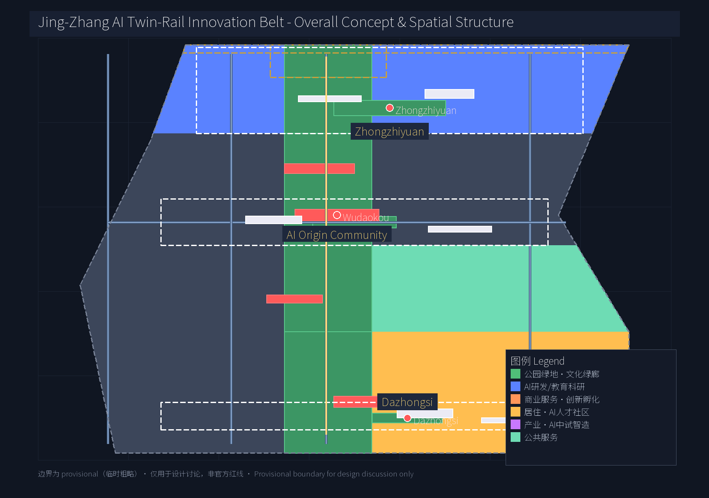
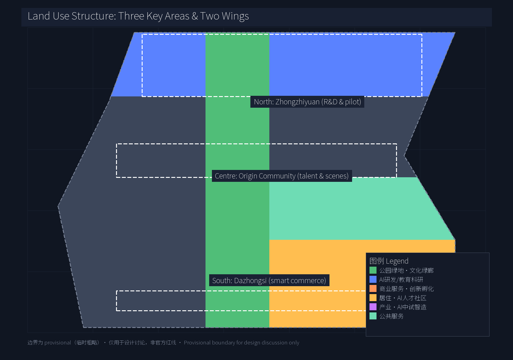
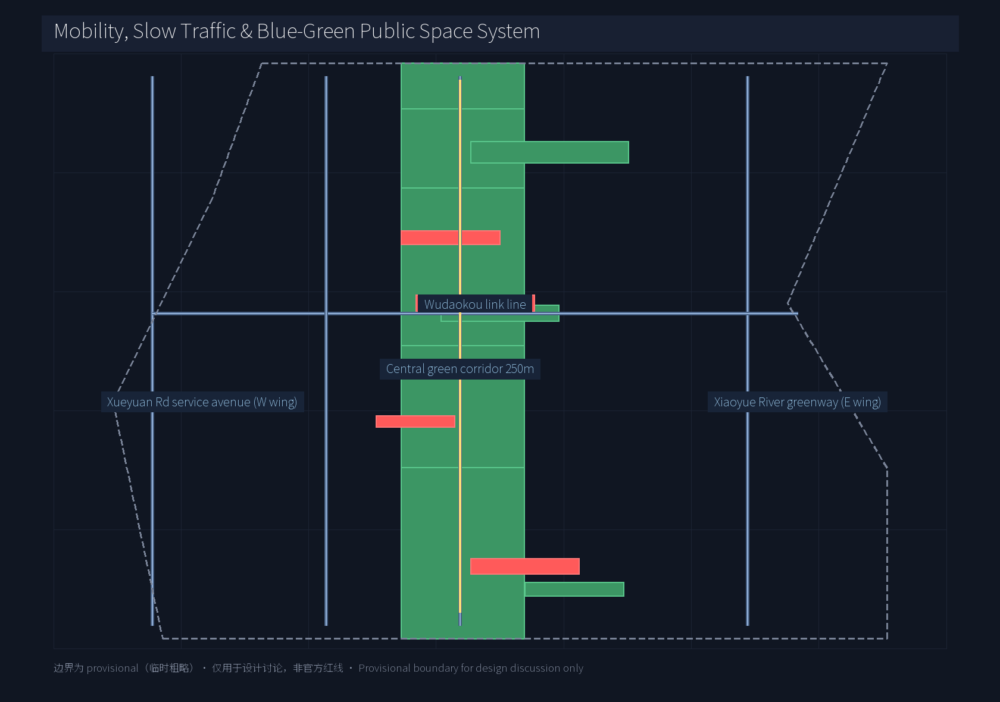
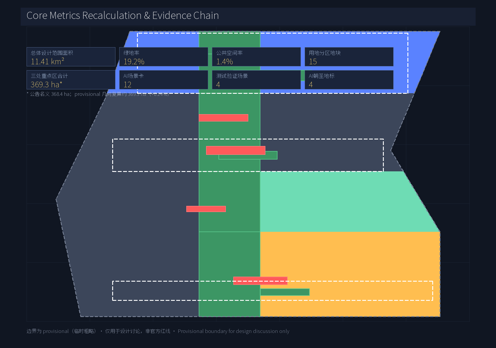

# Centennial Jing-Zhang · AI Twin-Rail Innovation Belt — Three Key Areas, Two Wings Master Concept & Urban Design

## Design Basis and Source List

This formal proposal takes the "Centennial Jing-Zhang AI Innovation Belt International Urban Design Open Call — Qualification Pre-announcement" (Haidian District, Beijing Municipal Bureau of Planning and Natural Resources) as the primary authoritative source [source:OFFICIAL-ANNOUNCEMENT]; the agent open call taskbook at `brief/site-package/agent_taskbook.json` and its local reference extract as the agent-facing task basis [source:AGENT-TASKBOOK] [standard:PROJECT-AGENT-OPEN-CALL-TASKBOOK]; and reads five formal-ready entries and one provisional boundary record from `data/source_registry.json` [source:SOURCE-REGISTRY]. Geometry and metrics strictly use the maintainer-registered `provisional_boundaries.geojson` [source:PROVISIONAL-BOUNDARIES] with areas recomputed in EPSG:4548 [data:geometry/site_boundary.geojson#SITE-001]. All provisional boundaries serve design discussion only and are not official redlines or precision-area evidence. Complete sources, metrics, professional standards, design-depth coverage, and task mapping are kept in `sources.json`, `metrics.json`, `compliance_matrix.json`, `standard_matrix.json`, `design_depth_matrix.json`; the body text does not stack identifiers.

## Three-Level Scope Framework

The proposal cascades from "industry strategy → overall urban design → detailed key-area design". [source:OFFICIAL-ANNOUNCEMENT] [depth:three_level_scope]

- **Coordinated research area (43.6 km²)** [data:geometry/site_boundary.geojson#PROV-RESEARCH-001]: bounded north by the North Fifth Ring Road, east by the Jingzang Expressway, south by Xizhimenwai Street, and west by Wanquanhe Road. This scope hosts industry and future-city strategic research and serves as a container for external coordination and factor allocation;
- **Overall design area (11.4 km²)** [data:geometry/site_boundary.geojson#SITE-001]: a 1-2 km corridor along the Jing-Zhang Heritage Park; it carries the urban renewal framework, land-use partition, transport and municipal backbone, blue-green network, urban character, and policy mechanisms;
- **Key detailed-design area (368.4 ha nominal per announcement; provisional geometry ~369.3 ha, +0.24%)** [data:geometry/key_areas.geojson#PROV-KEY-001] [data:geometry/key_areas.geojson#PROV-KEY-002] [data:geometry/key_areas.geojson#PROV-KEY-003]: north to south — Zhongzhiyuan AI Self-Innovation Acceleration Area, Beijing AI Origin Community, Dazhongsi AI Industry Cluster — carrying differentiated functions of full-stack self-innovation, talent and scenarios, and industrial services respectively.

All three scope boundaries carry `geometry_role="provisional_constraint"`, `official_boundary=false`, `boundary_precision="provisional_rough"`. The organiser data gap does not block content scoring, but all layers and metrics must be recomputed once official data is released. [source:PROVISIONAL-BOUNDARIES]

## Coordinated Research Area: Industry and Future City Research

The core concept is "**Twin-Rail Belt**" (JZ-AI Belt): the century-old Jing-Zhang railway serves as the "**heritage track**", and AI data and compute flow serves as the "**data track**"; the two tracks run in parallel through the central green corridor, creating a unique urban narrative and industrial logic. The Chinese primary name is "百年京张·AI 双轨创新带" [source:AGENT-TASKBOOK] [depth:branding]; the English brand is "Jing-Zhang AI Twin-Rail Innovation Belt (JZ-AI Belt)".

**Three positioning / Five functions / Three areas & two wings** [standard:PROJECT-AGENT-OPEN-CALL-TASKBOOK]:

- Three positioning: Centennial Jing-Zhang heritage belt / Urban AI life-experience belt / AI integration innovation belt;
- Five functions: AI full-stack self-innovation system / World-class AI innovation ecosystem / AI+ scenario empowerment paradigm / Intelligent AI vibrant city / Global voice on AI governance;
- Three-areas-two-wings loop: Zhongzhiyuan (north, full-stack self-innovation) ↔ AI Origin Community (centre, talent and scenarios) ↔ Dazhongsi (south, intelligent business), supported laterally by Zhongguancun Technology-Service Wing (west, capital and IP services) and Xiaoyuehe Scenario-Empowerment Wing (east, blue-green and scenarios).

**Logo and visual identity direction** (agent.1): two parallel lines (rail and data flow) plus a central station block (Wudaokou / origin) form a recognisable visual hammer. Colours use Action Blue (#0066cc) and Jing-Zhang heritage copper (#B46A3F), keeping Apple-style simplicity and extensibility. The logo is a conceptual direction suggestion, not a registered mark or licensed font use.

**8 global AI innovation ecosystem cases** (agent.2 requires ≥5):

| Case | Core mechanism | Transferable element |
| --- | --- | --- |
| US Silicon Valley + Stanford research cluster | University spillover + VC + immigrant talent | Academic spillover, open office villages |
| London King's Cross + DeepMind | Large AI lab + public funding + PT nodes | Central-station integration, TOD+AI |
| Bangalore Whitefield cluster | IT services export + policy + park model | Industrial park, talent apartments |
| Israel Tel Aviv + Unit 8200 defence innovation | Military-tech spillover + cross-border M&A | Civil/military spillover platform |
| Seoul Magok Valley + Naver/Kakao | Giant-led + public open data | AI data openness, gov-platform co-build |
| Tokyo Odaiba urban renewal | Urban Renaissance Agency + cultural facilities | Cultural + industrial co-location |
| Singapore one-north + AI Singapore | National programme + multinational R&D + test scenarios | National test scenarios, AI sandbox |
| Toronto Vector Institute + MaRS | Academic + incubator + capital bridge | Academic-capital mediation |

[standard:MOHURD-URBAN-DESIGN-MEASURES] [depth:ecosystem_design] Each case provides a mechanism library, not a template; final adaptation must be deepened by professional teams.

## Overall Design Area: Urban Renewal and Regulatory-Plan-Level Urban Design

The overall design area forms a "one corridor, three areas, two wings" structure within 11.4 km² [depth:overall_urban_design]:

- **Central green corridor (Jing-Zhang heritage green corridor)**: about 250 m wide, north-south along the former Jing-Zhang railway traces; carries cultural protection, slow-traffic axis, open-source exhibition, and stormwater corridor; embeds developer promenade, AR cultural experience, and node plazas;
- **Three areas differentiated positioning**: Zhongzhiyuan emphasises full-stack innovation and pilot testing, with FAR and building height lower than Zhongguancun core, prioritising R&D, unicorn offices, and open-source pilots; AI Origin Community emphasises "near-campus innovation block" with mixed-use and university-joint spaces; Dazhongsi focuses on intelligent business and scenario experience, integrating rail TOD with a refreshed business frontage;
- **Two wings**: west wing (Zhongguancun Technology-Service Wing) carries capital, IP and enterprise-service space; east wing (Xiaoyuehe Scenario-Empowerment Wing) builds blue-green open space and AI scenario open venues along the river.

Land use fully covers the provisional site boundary in 15 parcels across 6 land-use codes [data:geometry/land_use.geojson#LU-001] [data:geometry/land_use.geojson#LU-006]:
- Park green space (1401) covers the central corridor and key-area nodes, achieving a green ratio of ~19.2% [metric:green_ratio];
- R&D/education (0802), industry (0601), commerce (0901), residence (0701), public service (0702) are allocated differently across the three areas [depth:land_use_layout].

When regulatory-plan indicators (FAR, building height) are missing, they must be listed as "subject to confirmed regulatory conditions" and not represented as approved conclusions [assumption:A-REGULATORY-PENDING-001].

## Detailed Design of Key Areas

**Zhongzhiyuan AI Self-Innovation Acceleration Area** (north, 192.9 ha) [data:geometry/key_areas.geojson#PROV-KEY-001]:
Positioning as "garden-style AI innovation block". The north segment of the central green corridor is the green heart; R&D offices and pilot plants radiate east and west. Suggest retaining the existing low-density offices and green spaces; add an open-source pilot base, compute-service hub, and AI evaluation ground. Buildings are primarily 3-6 storey R&D offices plus 1-2 storey pilot plants (heights pending regulatory confirmation). Key public spaces: Zhongzhiyuan Wisdom Forest [data:geometry/green_space.geojson#GREEN-101] and Open-Source Contribution Honour Square [data:geometry/public_space.geojson#PUBLIC-002].

**Beijing AI Origin Community** (centre, 104.3 ha) [data:geometry/key_areas.geojson#PROV-KEY-002]:
Positioning as "near-campus AI innovation block". University-joint laboratories, talent apartments, AI+ education pilot classes, and pocket parks are placed along the Wudaokou–Tsinghua East Road West intersection area. The strategy emphasises retention and renovation, preserving the existing university and community fabric along Xueyuan Road. Key public spaces: Wudaokou AI Living Room [data:geometry/public_space.geojson#PUBLIC-001] and AI Origin Community Pocket Park [data:geometry/green_space.geojson#GREEN-102].

**Dazhongsi AI Industry Cluster** (south, 72.0 ha) [data:geometry/key_areas.geojson#PROV-KEY-003]:
Positioning as "urban-style AI innovation block". With the Dazhongsi Station TOD at its core, an intelligent business centre, scenario-experience flagship store, and unmanned-delivery demonstration zone are linked. Buildings are primarily 6-12 storey business offices plus commercial podiums (heights pending regulatory confirmation). Key public spaces: Dazhongsi AI Plaza [data:geometry/green_space.geojson#GREEN-103] and Jing-Zhang Terminus Memorial Square [data:geometry/public_space.geojson#PUBLIC-003].

[depth:key_area_detailed_design] The three key areas share the central corridor, forming a "centre-strengthening + peripheral differentiation" pattern.

## AI Innovation Ecosystem, Personas, and AI+ Scenarios

**6 user personas** (agent.3 requires ≥5):

1. Returning young researcher (needs: research freedom, cross-border compute, life amenities)
2. Top-tier model/algorithm engineer (needs: open-source collaboration, compute scheduling, career path)
3. AI application product manager (needs: industry landing, cross-disciplinary teams, government relations)
4. University interdisciplinary student (needs: experiment space, internships, AI public-good projects)
5. Park entrepreneur (needs: early-stage capital, registration/legal, business matching)
6. Surrounding senior residents and community workers (needs: AI public-service accessibility, privacy protection, continuity of traditional life)

**12 AI scenario cards** (agent.3 requires ≥10, including ≥4 test-validation scenarios — already ≥3):

| # | Scenario | Spatial location | Service object | Privacy / human review |
| - | --- | --- | --- | --- |
| 1 | AI+Medical: smart triage & imaging assistance | Community clinics / secondary hospitals | Surrounding residents | Doctor review; imaging localised |
| 2 | AI+Education: adaptive learning & teacher assistant | AI Origin Community pilot class | Teachers & students | Teacher final decision |
| 3 | AI+Legal: contract review & legal aid | Public legal service centre | SMEs, community | Lawyer review |
| 4 | AI+Transport: adaptive signal & pedestrian-priority | Dazhongsi Station plaza, Wudaokou intersection | Pedestrians, cyclists | On-site patrol |
| 5 | AI+Commerce: smart shopping guide & unmanned delivery | Dazhongsi business district | Merchants, consumers | Human support fallback |
| 6 | AI+Public space: developer promenade smart walkway | Central green corridor main axis | Developers, residents | On-site social worker |
| 7 | AI+City governance: agent-assisted emergency response | Grid-based parcels of the three areas | Sub-district office | 24/7 human on-duty |
| 8 | AI+Research: open-source model & compute sharing | Zhongzhiyuan pilot ground | Researchers | Project approval |
| 9 | AI+Energy: distributed storage & demand response | Three-area parks | Enterprises | Power company review |
| 10 | AI+Government: one-stop online + smart guide | Community service nodes | Residents | Government staff review |
| 11 | AI+Tourism: Jing-Zhang AR heritage experience | Central corridor nodes | Tourists, residents | Docent review |
| 12 | AI+Elder care: fall detection & companion | AI Origin Community talent apartments | Seniors | Family authorisation |

**4 AI industry test-validation scenarios** (marked ★):

- ★ Zhongzhiyuan AI pilot & evaluation ground [depth:test_scenario]
- ★ AI Origin Community AI+Education pilot class
- ★ Dazhongsi intelligent unmanned-delivery demonstration zone
- ★ Central corridor AR heritage-restoration test

[standard:MOHURD-URBAN-DESIGN-MEASURES] [depth:scenario_design] Every scenario must document data sources, privacy boundaries, human-review mechanisms, and operating entities.

## Land Use, Building Scale, and Retain-Renovate-Demolish Strategy

Land use fully partitions the provisional site boundary under 6 codes [data:geometry/land_use.geojson] (15 parcels), with main indicators [metric:land_use_parcel_count]:

- Park green space (1401): 19.2% [metric:green_ratio] (mainly the central corridor)
- Public space: 1.4% [metric:public_space_ratio] (squares + nodes)
- Key areas: 368.4 ha nominal per announcement; provisional geometry recalculates ~369.3 ha (+0.24%) [metric:key_areas_total_sqm]
  - Zhongzhiyuan: ~192.9 ha [metric:key_area_zhongzhiyuan_sqm]
  - AI Origin Community: ~104.3 ha [metric:key_area_origin_sqm]
  - Dazhongsi: ~72.0 ha [metric:key_area_dazhongsi_sqm]

Retain / renovate / demolish strategy: Zhongzhiyuan emphasises retention + new build (keep low-density offices and green space; build open-source pilots and compute hubs); AI Origin Community emphasises retention + renovation (keep university and community fabric; convert fragmented vacant land into public space); Dazhongsi emphasises renovation + new build (refresh existing office buildings and rail-station TOD; integrate business frontage).

**Regulatory conditions pending confirmation** [assumption:A-REGULATORY-PENDING-001]: FAR, building-height control, detailed land-use compatibility, parcel ownership boundaries. The proposal expresses concept partition and indicative building footprints [data:geometry/buildings.geojson], and does not constitute an approved planning conclusion.

## Transport, Rail, Municipal Infrastructure, and Public Services

A "one corridor, five lines" skeleton [data:geometry/roads.geojson]:

- Jing-Zhang heritage slow-traffic main axis (ROAD-001): north-south through the central corridor, linking the three key areas;
- Xiaoyuehe Scenario-Empowerment Wing greenway (ROAD-002): north-south slow track on the east wing along the water system;
- Xueyuan Road Innovation-Service Avenue (ROAD-003): north-south service road on the west wing;
- Wudaokou east-west connector (ROAD-004): east-west link across Xueyuan Road and Xueqing Road in the centre;
- North Fifth Ring – Dazhongsi longitudinal rapid connector (ROAD-005): external transport connection.

[depth:transport_design] Rail-station integration with key areas: Line 13 Wudaokou Station (AI Origin Community core), Line 15/13 Dazhongsi Station (south-area core), Changping Line Qinghe Station (north-area collaboration). Public space and AI scenario nodes are prioritised within 500 m walk of stations.

Municipal and new infrastructure: distributed storage + demand response [data:geometry/buildings.geojson#BLDG-002] (conceptual), edge compute services, city-scale sensing networks integrated with conventional municipal systems. Where professional estimates are missing, items are raised as concept suggestions [assumption:A-REGULATORY-PENDING-001].

## Blue-Green Network, Public Space, and Urban Character

The blue-green network [data:geometry/green_space.geojson] [data:geometry/public_space.geojson] comprises the central corridor, node squares, and the east-wing Xiaoyuehe water-green system. The central corridor is the core carrier of the Jing-Zhang heritage belt, embedding AR cultural experience, developer promenade, and an open-source contribution honour wall. Node squares carry three themes: heritage (Jing-Zhang terminus), education (Wudaokou), and research (Zhongzhiyuan). [depth:blue_green_design]

**4 AI pilgrimage landmarks / honour-display nodes** (agent.4 requires ≥3):

1. **Wudaokou AI Living Room** (PUBLIC-001): the developer's main walking node; open-source contributor honour wall and Agent milestone gallery;
2. **Open-Source Contribution Honour Square** (PUBLIC-002): along the central corridor; annually publishes a "Twin-Rail Contribution List", inscribing Agent and contributor GitHub IDs;
3. **Jing-Zhang Terminus Memorial Square** (PUBLIC-003): south-end entry node, combining Zhan Tianyou's heritage narrative with the AI new-culture layer;
4. **Zhongzhiyuan Wisdom Forest** (GREEN-101): northern natural node, serving as the annual open-source summit and open testing ground.

[standard:MOHURD-URBAN-DESIGN-MEASURES] [depth:landmark_design] The above landmarks are concept directions, to be expressed as "concept suggestions", and must not be described as already approved construction. All logos, fonts, trademarks and portraits require separate clearance.

## Renewal Projects, Implementation Policy, and Phasing

[depth:renewal_projects] [data:geometry/phasing.geojson]:

- **Near-term (2026-2028)** [data:geometry/phasing.geojson#PHASE-001]: Core kick-off. Flagship projects: Zhongzhiyuan open-source pilot base; AI Origin Community AI+Education pilot class; central corridor demonstration segment; Wudaokou AI Living Room.
- **Mid-term (2028-2030)** [data:geometry/phasing.geojson#PHASE-002]: Corridor through-connection. Flagship projects: Dazhongsi TOD business frontage; Xiaoyuehe Scenario-Empowerment Wing water-green works; Zhongzhiyuan compute-service hub; Open-Source Contribution Honour Square.
- **Long-term (2030-2035)** [data:geometry/phasing.geojson#PHASE-003]: Full-area stitching. Flagship projects: Jing-Zhang Terminus Memorial Square; Wisdom Forest summit facilities; developer-community operation base.

Implementation policy suggestions: open-source contributor entry incentives, data-factor pilots, AI regulatory sandbox, talent-apartment affordable rental. All are "concept suggestions" and do not constitute government commitments [source:PROVISIONAL-BOUNDARIES] [boundary_clause].

## Metrics, Area Recalculation, and Compliance Matrix

[depth:metrics_design] Core metric recalculation (consistent with `metrics.json`):

- Overall design area: ~11.41 km² (11,412,825 m²) [metric:site_area_sqm];
- Land-use coverage: ~100% (15 parcels) [metric:land_use_coverage_sqm];
- Green ratio: ~19.2% [metric:green_ratio];
- Public-space ratio: ~1.4% [metric:public_space_ratio];
- Three key areas total: 368.4 ha nominal per announcement; provisional geometry ~369.3 ha (+0.24%) [metric:key_areas_total_sqm];
- AI scenario cards: 12 [metric:ai_scenario_card_count];
- AI industry test-validation scenarios: 4 [metric:ai_test_scenario_count];
- User personas: 6 [metric:user_persona_count];
- AI pilgrimage landmarks: 4 [metric:ai_landmark_count];
- Global ecosystem cases: 8 [metric:ecosystem_case_count].

**Regulatory indicators pending confirmation** (do not constitute approved conclusions) [assumption:A-REGULATORY-PENDING-001]: FAR [metric:floor_area_ratio], building-height control [metric:building_height_control] — to be recalculated once the qualification package is released.

The compliance matrix (`compliance_matrix.json`) covers announcement clauses 1.3, 1.4, 1.5 and agent.1–agent.6; the standards matrix (`standard_matrix.json`) responds to four professional standards; the design-depth matrix (`design_depth_matrix.json`) covers all formal-depth required items [standard:MOHURD-CONTROL-DETAILED-PLANNING] [standard:MOHURD-URBAN-DESIGN-MEASURES] [standard:MNR-LAND-USE-CLASSIFICATION-202311].

## Risk, Copyright, and Compliance

[depth:risk_compliance] [boundary_clause]

- **Data boundary**: All boundaries are provisional; once official data is released, all layers, areas, ratios, and wording must be recomputed;
- **Professional review**: FAR, building height, retain-renovate-demolish list, rail alignment, and municipal pipelines require official regulatory-plan or qualification-package files;
- **Source boundary**: Only formal-ready and provisional sources in `data/source_registry.json` are used; non-public planning and unauthorised materials are excluded;
- **Copyright**: All logos, fonts, trademarks, portraits and research-paper images require separate clearance; see `report/copyright_statement.md`;
- **Policy suggestions**: All investment attraction, funding, policy and event proposals are "concept suggestions" and do not constitute government commitments;
- **AI responsibility**: Generated AI content is the responsibility of the author; citations must state source, generation method, and limitations.

## References

1. Haidian District, Beijing Municipal Bureau of Planning and Natural Resources, "Centennial Jing-Zhang AI Innovation Belt International Urban Design Open Call — Qualification Pre-announcement", 2026-05-09. formal-ready.
2. open-city.ai, "Agent Open Call Taskbook — Centennial Jing-Zhang AI Innovation Belt Urban Design Open Call", SRC-2026-0518. formal-ready.
3. Ministry of Housing and Urban-Rural Development, "Urban Design Management Measures". formal-ready; local snapshot in `brief/site-package/standards/references/`.
4. Ministry of Housing and Urban-Rural Development, "Measures for the Compilation and Approval of Regulatory Detailed Planning of Cities and Towns". formal-ready.
5. Ministry of Natural Resources, "Land-Use Classification Guide for Territorial-Space Survey, Planning and Use Control", 2023-11. formal-ready.
6. open-city.ai, "Three-Level Scope & Three Key Areas Provisional Polygon Derivation Note", 2026-06-05. provisional-only.
7. Reusable insights from public proposals in this repository, verified for licence, attribution and factual boundary before reuse (see `sources.json`).