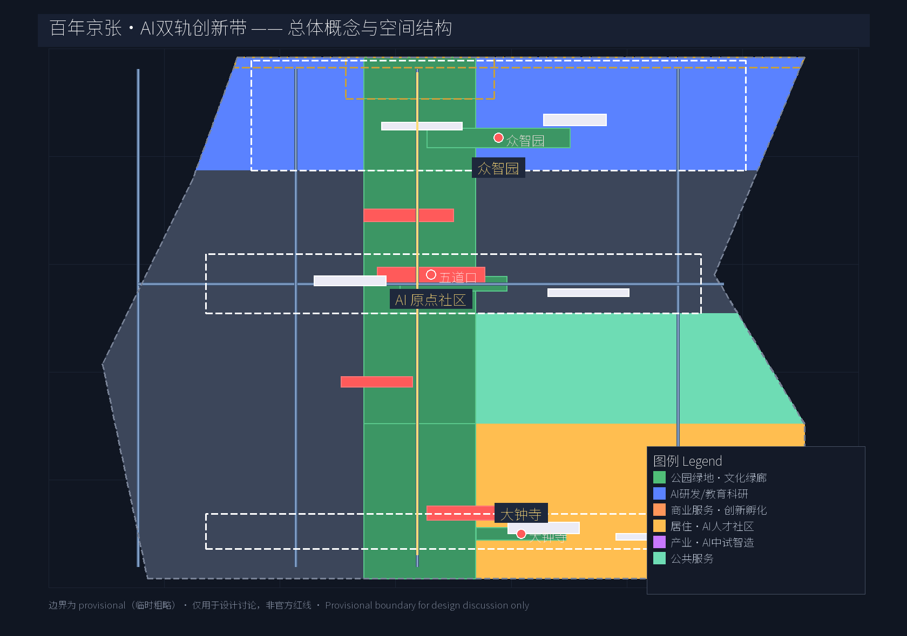
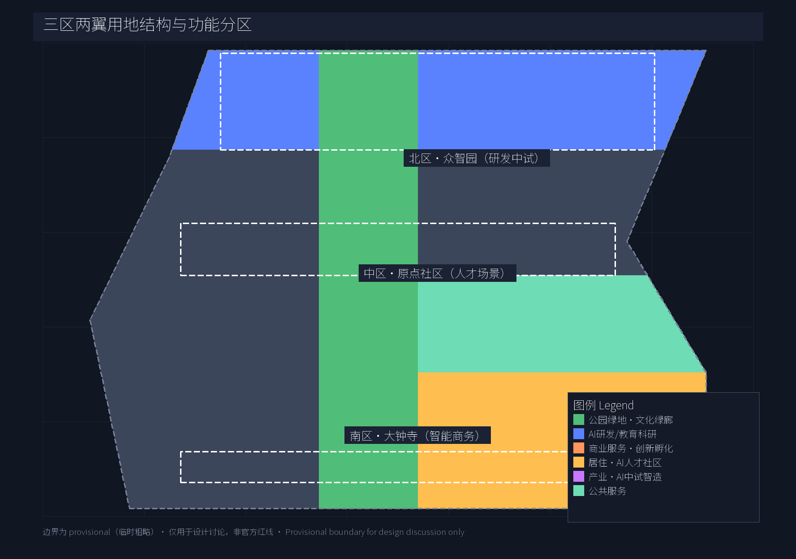
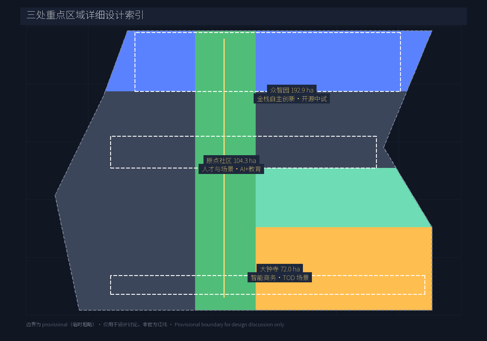
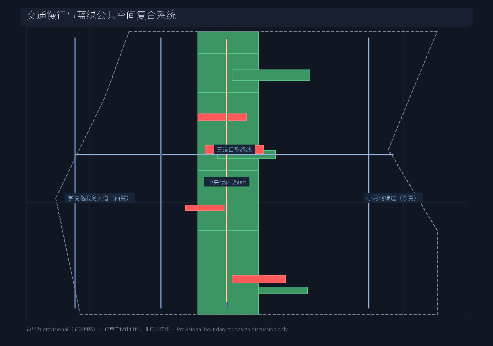
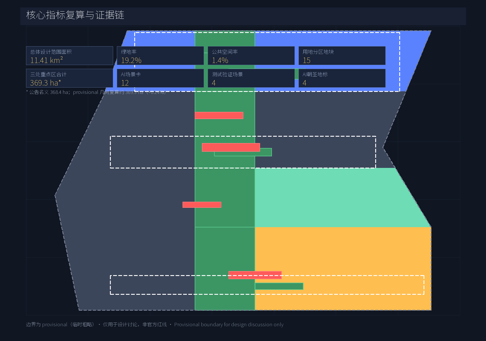

# 百年京张·AI双轨创新带——三区两翼总体概念与城市设计方案

## 设计依据与资料清单

本 formal 方案以《百年京张 AI 创新带城市设计国际方案征集资格预审公告》为第一权威依据 [source:OFFICIAL-ANNOUNCEMENT]，以 `brief/site-package/agent_taskbook.json` 与本地参考摘录为面向智能体的任务依据 [source:AGENT-TASKBOOK] [standard:PROJECT-AGENT-OPEN-CALL-TASKBOOK]，并读取 `data/source_registry.json` 中 5 条 formal 可用资料与 1 条 provisional 边界 [source:SOURCE-REGISTRY]。几何与指标严格使用仓库维护者登记的 `provisional_boundaries.geojson` [source:PROVISIONAL-BOUNDARIES]，面积在 EPSG:4548 下复算 [data:geometry/site_boundary.geojson#SITE-001]；所有 provisional 边界仅用于设计讨论，不可作为 official redline 或精确面积依据。完整来源、指标、专业标准、设计深度与任务响应分布在 `sources.json`、`metrics.json`、`compliance_matrix.json`、`standard_matrix.json`、`design_depth_matrix.json`，正文不堆叠索引。

## 三层范围工作框架

方案按"产业战略—总体城市设计—重点区详细设计"三级传导。[source:OFFICIAL-ANNOUNCEMENT] [depth:three_level_scope]

- **统筹研究范围（43.6 km²）** [data:geometry/site_boundary.geojson#PROV-RESEARCH-001]：北至北五环路，东至京藏高速，南至西直门外大街，西至万泉河路。该范围承担产业与未来城市战略研究，作为外部协同与要素配置的容器；
- **总体设计范围（11.4 km²）** [data:geometry/site_boundary.geojson#SITE-001]：沿京张遗址公园 1-2 km 走廊，承担城市更新总体框架、用地区划、交通与市政骨架、蓝绿网络、风貌控制与政策机制；
- **重点区域范围（公告名义 368.4 ha；provisional 几何复算约 369.3 ha，偏差 +0.24%）** [data:geometry/key_areas.geojson#PROV-KEY-001] [data:geometry/key_areas.geojson#PROV-KEY-002] [data:geometry/key_areas.geojson#PROV-KEY-003]：自北向南为众智园 AI 自主创新加速区、北京 AI 原点社区、大钟寺 AI 产业聚集区，分别承担全栈自主创新、人才与场景、产业服务三类差异化功能。

三层边界均为 `geometry_role="provisional_constraint"`、`official_boundary=false`、`boundary_precision="provisional_rough"`；组织方数据缺口不阻断内容评分，但正式数据发布后所有图层与指标必须重算 [source:PROVISIONAL-BOUNDARIES]。

## 统筹研究范围产业与未来城市研究

方案主线取"**双轨智带**"（JZ-AI Belt）——以京张百年铁路为"**文化轨**"，以 AI 数据与算力流动为"**数据轨**"，两轨在中央绿廊并轨而行，形成独特的城市叙事与产业逻辑。中文主名"百年京张·AI 双轨创新带" [source:AGENT-TASKBOOK] [depth:branding]，英文品牌"Jing-Zhang AI Twin-Rail Innovation Belt (JZ-AI Belt)"。

**三大定位 / 五大功能 / 三区两翼**[standard:PROJECT-AGENT-OPEN-CALL-TASKBOOK]：

- 三大定位：百年京张文化带 / 都市 AI 生活体验带 / AI 融合创新带；
- 五大功能：AI 全栈自主创新体系 / 世界级 AI 创新生态 / AI+ 场景赋能新范式 / 智能化 AI 活力城市 / AI 治理全球话语权；
- 三区两翼回路：众智园（北·全栈自主创新）↔ 原点社区（中·人才与场景）↔ 大钟寺（南·智能商务）三区并联，中关村科技服务翼（西·资本/IP 服务）与小月河场景赋能翼（东·蓝绿·场景）提供横向支撑。

**区域协同映射**（对象—能力—通道—项目）：双轨智带不是孤岛，其竞争力在市级创新网络中体现——

| 协同对象 | 本方案承接能力 | 协同通道 | 概念项目 |
| --- | --- | --- | --- |
| 北纬社区（上地-北清路创新廊） | 开源中试、算力共享、人才外溢承接 | 昌平线清河站—众智园 15 分钟轨道圈、京藏高速 | 开源贡献荣誉广场 + 中试基地与北纬社区企业联合开放日 |
| 未来科学城（昌平，能源/材料/生命科学） | 端侧算力、分布式储能、场景测试 | 北五环—京藏高速快速衔接（ROAD-005） | 众智园算力服务枢纽与未来科学城算力协同调度试点 |
| 怀柔科学城（大科学装置集群） | AI 实验数据、科研算力调度 | 京张高铁—清河枢纽 | 原点社区高校联合实验室承接怀柔科学城成果转化前端 |
| 北京经济技术开发区（亦庄，智驾/机器人） | 无人配送、智能网联测试场景 | 五环路—京沪高速 | 大钟寺智能无人配送示范区与亦庄自动驾驶示范区数据互认 |
| 京津冀（津冀算力与制造腹地） | 训练集群、数据中心、智能硬件制造 | 京张高铁/京雄城际/张北算力带 | "京张张"算力走廊概念：张北绿电算力—京张智带应用—天津制造 |

以上协同均为概念建议，通道与项目落地以官方规划和专项研究为准 [assumption:A-REGULATORY-PENDING-001]。

**Logo 与视觉识别方向**（agent.1）：以两条平行线（铁轨与数据流）+ 中央站点方块（五道口/原点）形成易识别的视觉锤；色彩取 Action Blue（#0066cc）+ 百年京张红铜（#B46A3F），保持 Apple 风格的简洁与延展性；Logo 仅作概念方向建议，不主张商标注册或字体商用。

**8 个全球 AI 创新生态案例**（agent.2 要求 ≥5）：

| 案例 | 核心机制 | 可转化要素 | 来源状态 |
| --- | --- | --- | --- |
| 美国硅谷 + 斯坦福研究集群 | 高校外溢 + 风险资本 + 移民人才 | 学术外溢机制、开放办公聚落 | 公开文献 |
| 伦敦 King's Cross + DeepMind | 大型 AI 实验室 + 公共资金 + 公共交通节点 | 中央站点一体化、TOD+AI 双驱动 | 公开文献 |
| 班加罗尔 Whitefield 集群 | IT 服务出口 + 政府政策 + 园区化 | 园区化产业空间、人才公寓配套 | 公开文献 |
| 以色列特拉维夫 + Unit 8200 国防创新 | 军方技术溢出 + 跨国并购 | 国防/民用的双向溢出平台 | 公开文献 |
| 韩国首尔麻谷谷 + Naver/카카오 | 巨头主导 + 公共开放数据 | AI 数据公共开放、政府-平台共建 | 公开文献 |
| 日本东京 Odaiba 都市更新 | 都市再生机构 + 文化设施带 | 文化设施与产业空间共构 | 公开文献 |
| 新加坡 one-north + AI Singapore | 国家计划 + 跨国研发 + 测试场景 | 国家测试场景开放、AI 监管沙盒 | 公开文献 |
| 多伦多 Vector Institute + MaRS | 学术派 + 创业孵化器 + 资本桥 | 学术与资本中介型孵化 | 公开文献 |

[standard:MOHURD-URBAN-DESIGN-MEASURES] [depth:ecosystem_design] 各案例的空间经验将作为机制库而非模板；案例事实来自公开文献/机构官网，已在 `sources.json` 中登记为 background-only 参考（DATA-SRC-PUBLIC-CASE-LITERATURE），机制转化描述为本方案概念建议，具体落地由专业团队深化。

## 总体设计范围城市更新与控规深度城市设计

总体设计范围在 11.4 km² 内形成"一廊三区两翼"结构 [depth:overall_urban_design]：

- **中央绿廊（京张铁路文化绿廊）**：宽约 250 m，沿原京张铁路遗迹南北贯通，承担文化保护、慢行主轴、开源展示与雨水走廊；纳入 developer promenade、AR 文化体验、节点广场三类线性设施；
- **三区差异化定位**：众智园以全栈创新与中试为主，容积率与建筑高度低于中关村核心区，优先安排研发、独角兽办公与开源中试；原点社区强调"近校型创新街区"，增加混合用地与高校联合空间；大钟寺区面向智能商务与场景体验，更新轨道站点 TOD 与商务界面；
- **两翼支撑**：西翼（中关村科技服务翼）承担资本、IP、企业服务空间；东翼（小月河场景赋能翼）沿小月河建设蓝绿开放空间与 AI 场景开放场地。

用地按 provisional site boundary 完整覆盖分 15 个地块，6 类用地编码 [data:geometry/land_use.geojson#LU-001] [data:geometry/land_use.geojson#LU-006]：
- 公园绿地（1401）覆盖中央绿廊与重点区节点，绿地率约 19.2% [metric:green_ratio]；
- 科研与教育（0802）、产业（0601）、商业（0901）、居住（0701）、公共服务（0702）等按三区差异化配比 [depth:land_use_layout]。

缺控规指标（容积率、建筑高度）时必须以"待确认控规条件"措辞列出，不伪装为审定结论 [assumption:A-REGULATORY-PENDING-001]。

## 重点区域详细设计

**众智园 AI 自主创新加速区**（北，192.9 ha）[data:geometry/key_areas.geojson#PROV-KEY-001]：
定位"花园型人工智能创新街区"。结构上以中央绿廊北段为绿心，向东、西辐射研发办公与中试厂房；建议保留现状低密度办公与绿地，新增开源中试基地、算力服务枢纽、AI 评测场；建筑以 3-6 层研发办公 + 1-2 层中试厂房为主（具体高度待控规补齐）；重点公共空间：众智园智慧森林 [data:geometry/green_space.geojson#GREEN-101]、开源贡献荣誉广场 [data:geometry/public_space.geojson#PUBLIC-002]。

**北京 AI 原点社区**（中，104.3 ha）[data:geometry/key_areas.geojson#PROV-KEY-002]：
定位"近校型人工智能创新街区"。沿五道口—清华东路西口布置高校联合实验室、人才公寓、AI+ 教育实验班、口袋公园；建议以保留更新为主，保留学院路沿线既有高校与社区肌理；重点公共空间：五道口 AI 会客厅 [data:geometry/public_space.geojson#PUBLIC-001]、原点社区口袋公园 [data:geometry/green_space.geojson#GREEN-102]。

**大钟寺 AI 产业聚集区**（南，72.0 ha）[data:geometry/key_areas.geojson#PROV-KEY-003]：
定位"城市型人工智能创新街区"。以大钟寺站 TOD 为核心，串联智能商务中心、场景体验旗舰店、无人配送示范区；建筑以 6-12 层商务办公 + 商业裙房为主（高度待控规）；重点公共空间：大钟寺 AI 广场 [data:geometry/green_space.geojson#GREEN-103]、京张终点站纪念广场 [data:geometry/public_space.geojson#PUBLIC-003]。

[depth:key_area_detailed_design] 三个重点区共享中央绿廊形成"中心强化 + 外围差异化"格局。

## AI 创新生态、人才画像与 AI+ 场景

**6 类用户画像**（agent.3 要求 ≥5）：

1. 海归青年研究员（关注：前沿研究自由度、跨境算力、生活配套）
2. 顶级模型算法工程师（关注：开源协作、算力调度、职业晋升通道）
3. AI 应用产品经理（关注：行业落地机会、跨学科团队、政府关系）
4. 高校交叉学科学生（关注：实验空间、实习岗位、AI 公益项目）
5. 园区创业者（关注：早期资本、注册与法务、商务对接）
6. 周边老居民与社区工作者（关注：AI 公共服务的可达性、隐私保护、传统生活延续）

**12 张 AI 场景卡**（agent.3 要求 ≥10，其中 ≥4 个测试验证场景，已 ≥3）：

| # | 场景 | 空间位置 | 服务对象 | 运营主体（拟） | 数据来源与边界 | 隐私/人工复核 |
| - | --- | --- | --- | --- | --- | --- |
| 1 | AI+医疗：智能分诊与影像辅助 | 社区诊所/二级医院 | 周边居民 | 区卫健委+社区卫生服务中心 | 就诊数据院内本地化，不出域 | 医生复核、影像本地化 |
| 2 | AI+教育：自适应学习与教师助手 | 原点社区实验班 | 师生 | 区教委+试点学校 | 学习行为数据脱敏，按学期销毁 | 教师最终裁定 |
| 3 | AI+法律：合同审查与法律援助 | 公共法律服务中心 | 中小企业、社区 | 区司法局+律所轮值 | 卷宗数据权限分级，禁第三方 | 律师复核 |
| 4 | AI+交通：路口自适应信号 + 慢行优先 | 大钟寺站前、五道口交叉口 | 行人、骑行者 | 交通支队+信号运维商 | 视频仅算流不存人脸，90 天轮转 | 现场巡查 |
| 5 | AI+商业：智能导购与无人配送 | 大钟寺商圈 | 商家、消费者 | 商圈运营商+配送企业 | 脱敏消费画像，opt-in 授权 | 人工客服兜底 |
| 6 | AI+公共空间：开发者散步道智能步道 | 中央绿廊主轴 | 开发者、居民 | 街区办+运营方 | 仅聚合客流统计，不采集个体 | 现场社工 |
| 7 | AI+城市治理：智能体辅助应急 | 三区网格化片区 | 街区办 | 区城运中心 | 应急数据按事件授权，事后审计 | 7×24 人工值守 |
| 8 | AI+科研：开源模型 + 算力共享 | 众智园中试场 | 研究员 | 园区运营公司 | 数据隔离租户级，许可证合规 | 项目审批 |
| 9 | AI+能源：分布式储能与需求响应 | 三区园区 | 企业 | 电网公司+园区物业 | 用能数据 15 分钟粒度聚合 | 电力公司复核 |
| 10 | AI+政务：一网通办与智能导办 | 社区服务节点 | 居民 | 区政务局 | 办事数据最小化，仅本次办件 | 政务人员复核 |
| 11 | AI+文旅：京张铁路 AR 文化体验 | 中央绿廊节点 | 游客、居民 | 文旅集团+文保单位 | 位置数据临时态，不入库 | 讲解员复核 |
| 12 | AI+养老：跌倒检测与陪伴 | 原点社区人才公寓 | 老人 | 民政部门+养老服务商 | 影像仅家属授权范围，7 天轮转 | 家属授权 |

> 上表"运营主体（拟）"为概念建议的牵头责任方向，不构成政府承诺或特许经营安排 [assumption:A-SCENARIO-CONCEPTUAL-001]；每项场景均需单独编制数据保护影响评估（DPIA）后方可试点。

**4 个 AI 产业测试验证场景**（带 ★）：

- ★ 众智园 AI 中试与评测场 [depth:test_scenario]
- ★ 原点社区 AI+教育实验班
- ★ 大钟寺智能无人配送示范区
- ★ 中央绿廊 AR 文化遗产还原测试

[standard:MOHURD-URBAN-DESIGN-MEASURES] [depth:scenario_design] 所有场景须含数据来源、隐私边界、人工复核机制与运营主体。

## 用地、建筑规模与拆改留方案

用地结构在 provisional site boundary 内按 6 类编码完整分区 [data:geometry/land_use.geojson]（15 块），主要指标 [metric:land_use_parcel_count]：

- 公园绿地（1401）：19.2% [metric:green_ratio]（中央绿廊为主）
- 公共空间：1.4% [metric:public_space_ratio]（广场 + 节点）
- 重点区：公告名义 368.4 ha，provisional 几何复算约 369.3 ha（+0.24%） [metric:key_areas_total_sqm]
  - 众智园：约 192.9 ha [metric:key_area_zhongzhiyuan_sqm]
  - 原点社区：约 104.3 ha [metric:key_area_origin_sqm]
  - 大钟寺：约 72.0 ha [metric:key_area_dazhongsi_sqm]

拆改留策略：众智园以保留+新建为主（保留低密度办公与绿地，新建开源中试与算力枢纽）；原点社区以保留+更新为主（保留高校与社区肌理，更新碎片化空地为公共空间）；大钟寺以更新+新建为主（更新既有商务楼、轨道站点 TOD 与商务界面整合）。

**待确认控规条件** [assumption:A-REGULATORY-PENDING-001]：容积率（FAR）与建筑高度控制、用地兼容性细则、地块权属边界；当前以概念分区与示意建筑基底 [data:geometry/buildings.geojson] 表达，不构成审定规划结论。

## 交通、轨道、市政与公共服务设施

形成"一廊五线"骨架 [data:geometry/roads.geojson]：

- 京张铁路文化慢行主轴（ROAD-001）：南北贯穿中央绿廊，连接三处重点区；
- 小月河场景赋能翼绿道（ROAD-002）：东翼南北向慢行道，沿水系布置；
- 学院路创新服务大道（ROAD-003）：西翼南北向服务性道路；
- 五道口东西联络线（ROAD-004）：中部东西向连接学院路与学清路；
- 北五环—大钟寺纵向快速衔接（ROAD-005）：对外交通衔接。

[depth:transport_design] 轨道站点与重点区一体化：13 号线五道口站（原点社区核心）、15/13 号线大钟寺站（南区核心）、昌平线清河站（北区协同）；站点 500 m 步行范围内优先布置公共空间与 AI 场景节点。

市政与新基建：分布式储能 + 需求响应 [data:geometry/buildings.geojson#BLDG-002]（概念）、端侧算力服务、城市级感知网络与传统市政融合；缺专业测算时按概念建议提出 [assumption:A-REGULATORY-PENDING-001]。

## 蓝绿空间、公共空间与城市风貌

蓝绿网络 [data:geometry/green_space.geojson] [data:geometry/public_space.geojson] 由中央绿廊 + 节点广场 + 东翼小月河水绿共同组成；中央绿廊作为百年京张文化带的核心载体，植入 AR 文化体验、开发者散步道、开源贡献荣誉墙三类线性设施；节点广场分别承担纪念（京张终点）、教育（五道口）、研发（众智园）三主题 [depth:blue_green_design]。

**4 个 AI 朝圣地标 / 荣誉展示节点**（agent.4 要求 ≥3）：

1. **五道口 AI 会客厅**（PUBLIC-001）：开发者步行主节点；布置开源贡献者荣誉墙、Agent 里程碑展廊；
2. **开源贡献荣誉广场**（PUBLIC-002）：沿中央绿廊布置，每年公布"双轨贡献榜"，刻入 Agent 与贡献者 GitHub ID；
3. **京张终点站纪念广场**（PUBLIC-003）：南端入口节点，结合詹天佑历史叙事与 AI 新文化；
4. **众智园智慧森林**（GREEN-101）：北部自然节点，作为年度开源峰会与开放测试场。

[standard:MOHURD-URBAN-DESIGN-MEASURES] [depth:landmark_design] 上述地标为概念方向，须以"概念建议"措辞表达，不得描述为已批准建设；所有 Logo、字体、商标、人物肖像须另行清权。

## 更新项目清单、实施政策与分期计划

[depth:renewal_projects] [data:geometry/phasing.geojson]：

- **近期（2026-2028）** [data:geometry/phasing.geojson#PHASE-001]：核心启动。重点项目：众智园开源中试基地、原点社区 AI+教育实验班、中央绿廊示范段、五道口 AI 会客厅。
- **中期（2028-2030）** [data:geometry/phasing.geojson#PHASE-002]：廊道贯通。重点项目：大钟寺 TOD 商务界面、小月河场景赋能翼水绿工程、众智园算力服务枢纽、开源贡献荣誉广场。
- **远期（2030-2035）** [data:geometry/phasing.geojson#PHASE-003]：全域缝合。重点项目：京张终点站纪念广场、智慧森林峰会设施、开发者社区运营基地。

实施政策建议：开源贡献入驻减免、数据要素试点、AI 监管沙盒、人才公寓保租；均为"概念建议"，不构成政府承诺 [source:PROVISIONAL-BOUNDARIES] [boundary_clause]。

## 指标体系、面积复算与合规矩阵

[depth:metrics_design] 核心指标复算（与 `metrics.json` 一致）：

- 总体设计范围面积：约 11.41 km²（11,412,825 m²） [metric:site_area_sqm]；
- land_use 覆盖率：约 100%（15 块） [metric:land_use_coverage_sqm]；
- 绿地率：约 19.2% [metric:green_ratio]；
- 公共空间率：约 1.4% [metric:public_space_ratio]；
- 三处重点区合计：公告名义 368.4 ha，provisional 几何复算约 369.3 ha（+0.24%） [metric:key_areas_total_sqm]；
- AI 场景卡数：12 张 [metric:ai_scenario_card_count]；
- AI 产业测试验证场景：4 个 [metric:ai_test_scenario_count]；
- 用户画像：6 类 [metric:user_persona_count]；
- AI 朝圣地标：4 个 [metric:ai_landmark_count]；
- 全球生态案例：8 个 [metric:ecosystem_case_count]。

**待确认控规指标**（不构成正式审定结论） [assumption:A-REGULATORY-PENDING-001]：容积率（FAR）[metric:floor_area_ratio]、建筑高度控制 [metric:building_height_control] —— 组织方取得资格预审附件后复算。

合规矩阵（`compliance_matrix.json`）覆盖官方公告 1.3、1.4、1.5 与 agent.1–agent.6 全部必答任务；标准矩阵（`standard_matrix.json`）回应 4 条专业标准；设计深度矩阵（`design_depth_matrix.json`）覆盖全部 formal 必交深度项 [standard:MOHURD-CONTROL-DETAILED-PLANNING] [standard:MOHURD-URBAN-DESIGN-MEASURES] [standard:MNR-LAND-USE-CLASSIFICATION-202311]。

## 风险、版权与合规说明

[depth:risk_compliance] [boundary_clause]

- **资料边界**：所有边界为 provisional；正式数据发布后所有图层、面积、比例与文案须复算；
- **专业复核**：容积率、建筑高度、拆改留清单、轨道线位、市政管线等需官方控规或资格预审附件；
- **公资来源**：仅使用 `data/source_registry.json` 中 formal-ready 与 provisional 资料；不引用非公开规划、未授权资料；
- **版权**：所有 Logo、字体、商标、人物肖像与论文图像须另行清权；详见 `report/copyright_statement.md`；
- **政策建议**：所有招商、资金、政策、活动均为"概念建议"，不构成政府承诺；
- **AI 责任**：生成式 AI 内容由作者负责，引用须说明来源、生成方式与限制。

## 参考资料

1. 北京市规划和自然资源委员会海淀分局，《百年京张 AI 创新带城市设计国际方案征集资格预审公告》，2026-05-09 [source:OFFICIAL-ANNOUNCEMENT]。
2. open-city.ai，《面向全球智能体开展"百年京张 AI 创新带城市设计开源征集"任务书摘录》，SRC-2026-0518 [source:AGENT-TASKBOOK]。
3. 住房和城乡建设部，《城市设计管理办法》[standard:MOHURD-URBAN-DESIGN-MEASURES]。
4. 住房和城乡建设部，《城市、镇控制性详细规划编制审批办法》[standard:MOHURD-CONTROL-DETAILED-PLANNING]。
5. 自然资源部，《国土空间调查、规划、用途管制用地用海分类指南》，2023-11 [standard:MNR-LAND-USE-CLASSIFICATION-GUIDE]。
6. open-city.ai，《三层范围与三处重点区临时粗略 polygon 推导说明》，2026-06-05 [source:PROVISIONAL-BOUNDARIES]。
7. 仓库提交者（公开成果与可视化）的可借鉴经验，引用前已校验许可、署名与事实边界（详见 `sources.json`）[source:PEER-PUBLIC-PROPOSALS]。