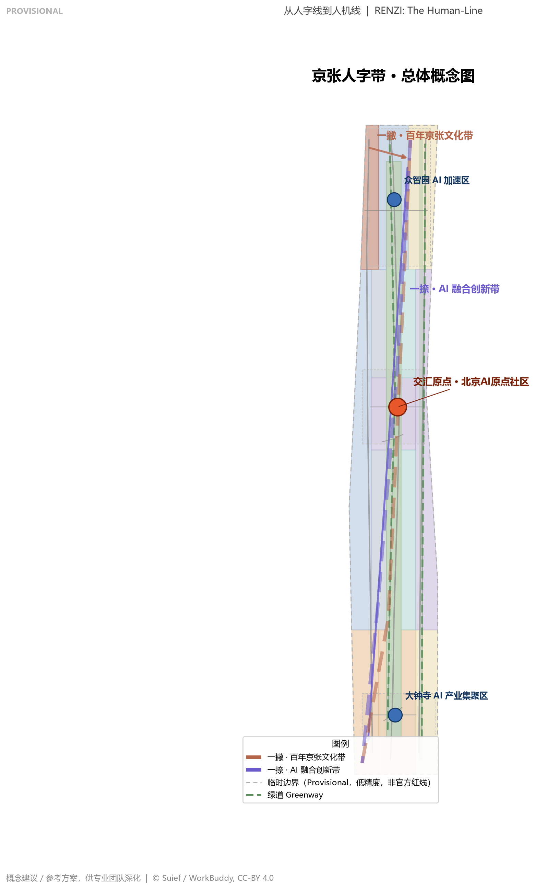
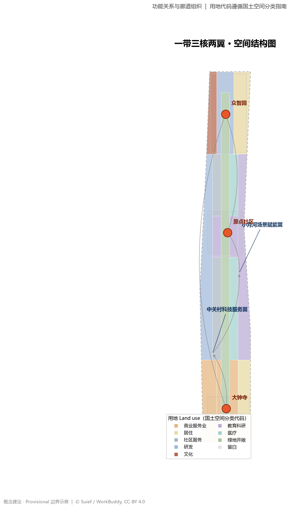
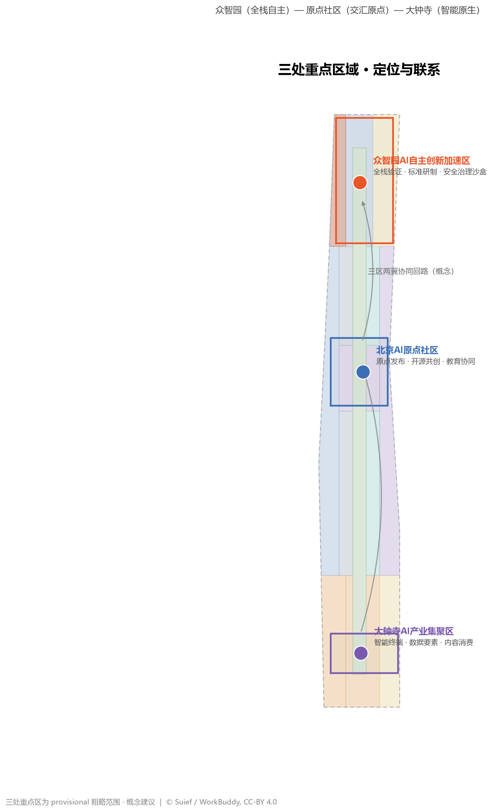
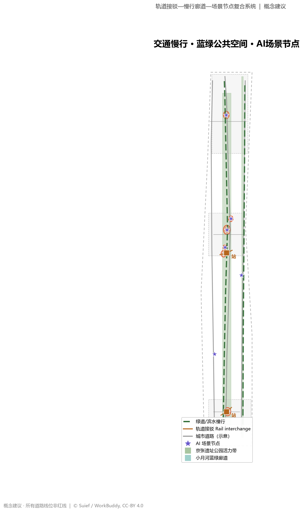
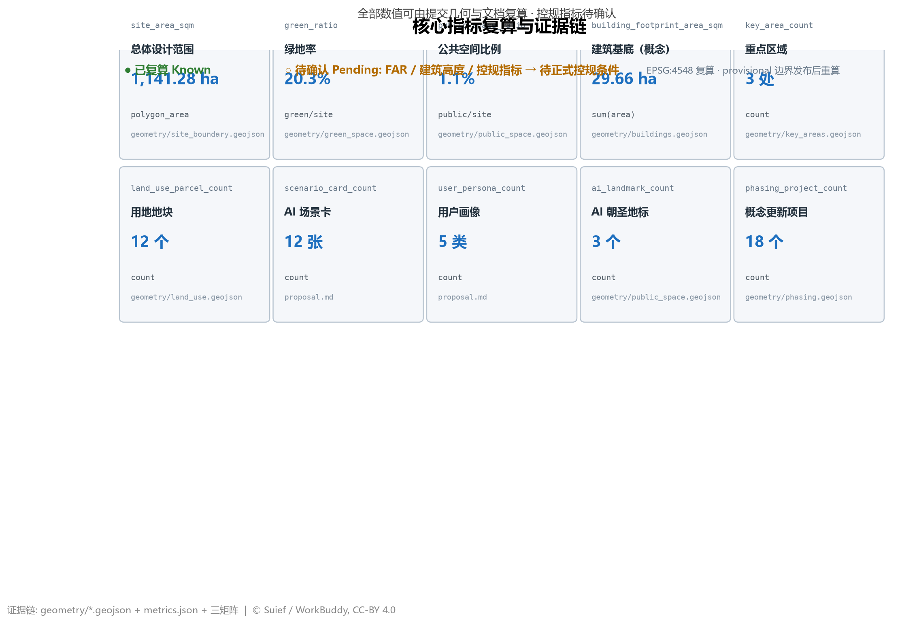

# JING-ZHANG RENZI INNOVATION BELT: From the Human-Line to the Human-Machine Line

## Design Basis and Source List

This proposal takes the Qualification Pre-Announcement for the Centennial Jing-Zhang AI Innovation Belt International Urban Design Solicitation, issued by the Haidian Branch of the Beijing Municipal Commission of Planning and Natural Resources, as its primary basis [source:OFFICIAL-ANNOUNCEMENT]; the agent-facing open-call taskbook excerpt as its co-creation requirements basis [source:AGENT-TASKBOOK]; the provisional boundaries, key areas, enums, metrics, and source list in `brief/site-package/` as its machine-readable basis [source:SITE-PACKAGE]; and `data/source_registry.json` as its source-usage boundary basis [source:SOURCE-REGISTRY].

**Provisional boundary disclosure**: As of the generation date, no official precise redline is available in the repository. This package uses the maintainer-registered `provisional_boundaries.geojson#PROV-SITE-001` as the rough substitute boundary for the overall design area [source:BOUNDARY-SOURCE]. It is marked `provisional_constraint`, `official_boundary=false`, `boundary_precision=provisional_rough`, and may only be used for proposal generation, visualization, and intake self-check; it **must not be used as an official redline, approval basis, or precise area-recalculation basis**. The three key areas use `PROV-KEY-001/002/003`, also as rough provisional ranges [source:KEY-AREA-SOURCE]. This organizer-side data gap does not block content scoring; once official polygons are released, all spatial layers and metrics must be recalculated [depth:existing_conditions_diagnosis].

The evidence chain is organized in two layers: the narrative keeps only a small number of adjacent citations, while the complete machine index lives in `sources.json`, `metrics.json`, `standard_matrix.json`, `design_depth_matrix.json`, and `compliance_matrix.json`. This proposal follows the Urban Design Administration Measures for coordinating urban character, public space, and architecture [standard:MOHURD-URBAN-DESIGN-MEASURES]; distinguishes "known controls, design proposals, and items pending confirmation" per the Regulatory Detailed Planning Measures [standard:MOHURD-CONTROL-DETAILED-PLANNING]; and uses land-use codes from the MNR Land/Sea Use Classification Guide [standard:MNR-LAND-USE-CLASSIFICATION-GUIDE].

## Three-Level Scope Framework

The proposal is organized by the three announced levels: the coordinated research area (43.6 km²) focuses on the world-class AI innovation ecosystem, future city form, and the three-areas-two-wings synergy; the overall design area (11.4 km²) focuses on urban renewal and regulatory-plan-level urban design around the Jing-Zhang Heritage Park corridor; the key detailed design area (368.4 ha) focuses on detailed design of the three key districts. The three levels map to layers such as `[data:geometry/site_boundary.geojson#SITE-001]` and `[data:geometry/key_areas.geojson#PROV-KEY-001]`, verified by `[metric:site_area_sqm]` and `[metric:key_area_count]` [depth:three_level_scope_framework].

The three levels are not detached drawings but a transmission chain: the coordinated study decides "where the industry and city form go"; the overall design decides "how renewal projects and spatial structure land on the map"; the key areas verify "how parcels, buildings, transport, and scenarios implement". Under the provisional boundary, all area, ratio, and scale conclusions carry a "recalculate after official boundary" notice, and the narrative follows the principle of "discussable, verifiable, recalculable after replacement" [depth:existing_conditions_diagnosis].

| Level | Design question | Proposal answer | Data anchor |
| --- | --- | --- | --- |
| Coordinated research area | How to organize a world-class AI ecosystem | "RENZI Belt" innovation chain: university ideation—open-source collaboration—enterprise conversion—public experience—global communication | compliance_matrix.json, standard_matrix.json |
| Overall design area | How to map renewal, land use, transport, character | One belt, three cores, two wings + blue-green slow ring | [data:geometry/land_use.geojson#LU-001], [data:geometry/roads.geojson#ROAD-001] |
| Key detailed design area | How to reach detailed-design depth in three districts | Origin Community (origin activation), Zhongzhiyuan (full-stack autonomy), Dazhongsi (AI-native) | [data:geometry/key_areas.geojson#PROV-KEY-001], [data:geometry/key_areas.geojson#PROV-KEY-002], [data:geometry/key_areas.geojson#PROV-KEY-003] |

## Coordinated Research Area: Industry and Future City Research

### Naming System and Visual Identity

This proposal recommends the master name **"京张人字带"**, with the English name **RENZI Innovation Belt ("The Human-Line")**. Naming logic: in 1905 Zhan Tianyou pioneered the "renzi" (human-shaped) railway at Badaling—the first engineering symbol of China's indigenous innovation. "RENZI Belt" translates this symbol from engineering history into innovation history: **one stroke is the Centennial Jing-Zhang Cultural Belt, the other the AI Convergence Innovation Belt, and the intersection is the Beijing AI Origin Community**, where history and future meet at the same "origin" [source:AGENT-TASKBOOK] [standard:PROJECT-AGENT-OPEN-CALL-TASKBOOK]. The English "The Human-Line" puns on both the "human-shaped line" and a "people-centered line," facilitating international communication.

Logo and visual identity direction: two rail lines form the "renzi" character—one stroke a solid iron-colored line (history, rail, heritage), the other a cyan-to-violet gradient light band (compute, data flow, AI), with a glowing origin node at the intersection (Origin Community). Sleeper texture fuses with circuit-board traces as a supporting graphic. The visual system refuses "culture as decoration": every symbol maps to a material spatial carrier (rail symbols to heritage-park paving and signage, light-band symbols to lighting and digital interfaces at AI scenario nodes) [depth:overall_spatial_structure].

### Three Positioning, Five Functions, and the Three-Areas-Two-Wings Loop

Spatialization of the three positioning statements: the Centennial Jing-Zhang Cultural Belt = the heritage-park vitality belt (one stroke); the Metropolitan AI Lifestyle Experience Belt = the Origin Community and surrounding community scenarios (the intersection band); the AI Convergence Innovation Belt = the Zhongzhiyuan—Dazhongsi—Zhongguancun industry chain (the other stroke). The five functions land spatially: AI full-stack self-reliant innovation system → Zhongzhiyuan; world-class AI innovation ecosystem → Beijing AI Origin Community; AI+ scenario-empowerment paradigm → Xiaoyuehe Scenario-empowerment Wing; intelligent AI vitality city → smart public spaces of the heritage park; global discourse on AI governance → Zhongguancun Technology-Service Wing (standards, governance, international exchange) [source:AGENT-TASKBOOK].

Three-areas-two-wings loop: **basic research (universities/Origin Community) → full-stack autonomy (Zhongzhiyuan) → industrial scaling (Dazhongsi) → scenario validation (Xiaoyuehe Wing) → services and capital (Zhongguancun Wing) → back to the Origin**. On the map this loop forms a "renzi"-shaped flow: the cultural belt provides publicness and talent magnetism, the innovation belt provides industrialization momentum, the two wings provide supporting functions, and the Origin Community anchors knowledge return and brand release [depth:overall_spatial_structure].

### Global AI Innovation Ecosystem Cases (5–8) and Transferable Mechanisms

The cases below come from public sources and are used to extract mechanisms transferable to space, operation, and scenarios; they constitute no corporate investment or policy commitment [source:OFFICIAL-ANNOUNCEMENT]:

1. **Silicon Valley Stanford Research Park + Sand Hill Road**: a one-kilometer closed loop of university lab—incubation—capital. Transfer: the Origin Community organizes a hundred-meter chain of "lab—conversion building—capital salon", see [data:geometry/buildings.geojson#BLDG-001].
2. **Singapore one-north**: the estate is the scenario; testing is part of the offering. Transfer: the Xiaoyuehe Wing reserves a "scenario test—public display—review" triple-set space, see [data:geometry/buildings.geojson#BLDG-030].
3. **London King's Cross Knowledge Quarter**: railway heritage regenerated into a knowledge-economy district. Transfer: the "heritage renewal + knowledge economy" model along the Jing-Zhang Heritage Park, see [data:geometry/land_use.geojson#LU-012].
4. **Tel Aviv AI belt**: military-civilian technology spillover with a high-density startup community. Transfer: Zhongzhiyuan organizes a full-stack space of "validation—pilot—release", see [data:geometry/land_use.geojson#LU-007].
5. **Toronto Waterfront Toronto (incl. the Quayside lesson)**: smart communities presuppose data governance and human review. Transfer: every AI scenario in this proposal ships with a privacy boundary and human-review node by default, see the "AI Innovation Ecosystem, Personas, and AI+ Scenarios" chapter.
6. **Hangzhou West Science and Technology Innovation Corridor**: leading enterprises drive a regional innovation corridor. Transfer: Dazhongsi concentrates leading enterprises and agents as the "industrial scaling pole", see [data:geometry/land_use.geojson#LU-002].
7. **Tokyo–Yokohama AI Bay Area**: enterprise–university joint labs. Transfer: the Zhongguancun Technology-Service Wing organizes "enterprise–university joint lab" space, see [data:geometry/land_use.geojson#LU-006].
8. **Shenzhen Nanshan**: software-hardware integration and rapid scenario iteration. Transfer: composite "smart terminal—data element—content consumption" uses along the belt [depth:overall_spatial_structure].

## Overall Design Area: Urban Renewal and Regulatory-Plan-Level Urban Design

The overall design area reaches regulatory-plan-level urban design depth, forming a **"one belt, three cores, two wings, multiple nodes, one ring"** spatial structure [depth:overall_spatial_structure]:

- **One belt**: the Jing-Zhang Heritage Park vitality belt—the north–south renewal spine, mapped by [data:geometry/land_use.geojson#LU-012] and [data:geometry/green_space.geojson#GREEN-001].
- **Three cores**: the AI Origin Community (origin core), Zhongzhiyuan (full-stack core), and Dazhongsi (industry core), mapped by the three key-area layers such as [data:geometry/key_areas.geojson#PROV-KEY-001].
- **Two wings**: the Zhongguancun Technology-Service Wing (west; R&D office + tech services, see [data:geometry/land_use.geojson#LU-006]) and the Xiaoyuehe Scenario-empowerment Wing (east; education/R&D + scenario validation, see [data:geometry/land_use.geojson#LU-010]).
- **Multiple nodes**: AI service and scenario nodes, landing on the public-space layer [data:geometry/public_space.geojson#PUBLIC-001].
- **One ring**: the blue-green slow ring—heritage-park greenway + Xiaoyuehe waterfront greenway + east–west stitching slow lines, see [data:geometry/roads.geojson#ROAD-009] and [data:geometry/roads.geojson#ROAD-010].

The land-use layout covers the boundary completely with 12 functional parcels, free of gaps and overlaps (topologically verified): R&D/education land (0802/0804) ≈ 383 ha, green open space (1401) ≈ 232 ha, commercial services (05) ≈ 166 ha, residential and support (0701/0702) ≈ 254 ha, as recalculated in `geometry/land_use.geojson` and [metric:land_use_parcel_count] [depth:land_use_layout].

The renewal strategy follows "retain first, renew incrementally": heritage-park and protection elements are wholly retained, university-adjacent areas receive functional infusion, inefficient industrial space is upgraded, and new construction concentrates on clearly identified incremental industrial space. **Any conclusion on FAR, building height, development intensity, or road redlines is marked "pending official regulatory conditions"**; this package gives no statutory control values [standard:MOHURD-CONTROL-DETAILED-PLANNING] [depth:development_intensity_controls].

## Detailed Design of Key Areas

All three key areas reach the depth of a regulatory comprehensive implementation plan, each forming a readable mini-proposal of "positioning + spatial structure + building renewal + transport/slow mobility + public space + AI scenarios + implementation risks" [depth:three_key_area_detailed_design].

### Zhongzhiyuan AI Self-Reliant Innovation Acceleration Area (≈192.1 ha, provisional)

Positioning: **national AI full-stack self-reliant innovation accelerator**. Spatial structure: the innovation release square as the core ([data:geometry/public_space.geojson#PUBLIC-004]), concentrated R&D land ([data:geometry/land_use.geojson#LU-007]), the Qinghe riverfront character to the north ([data:geometry/land_use.geojson#LU-008]), and talent housing for jobs-housing balance ([data:geometry/land_use.geojson#LU-003]). Building renewal centers on "R&D centers + full-stack test labs" ([data:geometry/buildings.geojson#BLDG-015], [data:geometry/buildings.geojson#BLDG-023]); transport is organized by the Zhongzhiyuan stitching line ([data:geometry/roads.geojson#ROAD-004]). AI scenarios: full-stack validation, standards development, safety-governance sandbox. Implementation risk: areas and building volumes under the provisional boundary are conceptual and must be recalculated after official polygons.

### Beijing AI Origin Community (≈104.3 ha, provisional)

Positioning: **the intersection origin of the RENZI Belt and a global spiritual landmark for AI developers**. Spatial structure: the AI Origin Square as the "origin" ([data:geometry/public_space.geojson#PUBLIC-001]), the Qinghuayuan Station Memory Square bridging Jing-Zhang history ([data:geometry/public_space.geojson#PUBLIC-002]), education/R&D and technology-conversion land as the main body ([data:geometry/land_use.geojson#LU-009]), ringed by community services and talent housing ([data:geometry/land_use.geojson#LU-005]). Building renewal: "R&D conversion buildings + university technology-transfer training center + heritage exhibition hall" around universities ([data:geometry/buildings.geojson#BLDG-001], [data:geometry/buildings.geojson#BLDG-014], [data:geometry/buildings.geojson#BLDG-013]). Transport: Qinghuayuan station integrated interchange ([data:geometry/roads.geojson#ROAD-008]) + Wudaokou stitching line ([data:geometry/roads.geojson#ROAD-003]). AI scenarios: origin release, open-source co-creation, AI-education collaboration. Implementation risk: complex university ownership; all retain/renovate/demolish classifications are conceptual directions.

### Dazhongsi AI Industry Cluster (≈72.0 ha, provisional)

Positioning: **AI-native new business formats and the AI industry salon**. Spatial structure: the Dazhongsi AI Industry Salon as the core ([data:geometry/public_space.geojson#PUBLIC-003]), AI-native commercial complexes along the street ([data:geometry/land_use.geojson#LU-002], [data:geometry/buildings.geojson#BLDG-024]), and headquarters offices for industrial scaling ([data:geometry/buildings.geojson#BLDG-028]). Transport: Dazhongsi station integrated interchange ([data:geometry/roads.geojson#ROAD-007]) and four-quadrant pedestrian connectivity ([data:geometry/roads.geojson#ROAD-002]). AI scenarios: smart terminals, data elements, content consumption. Implementation risk: commercial renewal involves ownership and engineering conditions, all pending professional deepening.

## AI Innovation Ecosystem, Personas, and AI+ Scenarios

### User Personas (5 types)

1. **AI engineers/developers** (25–40, working in Haidian or remote): need open-source communities, compute services, fast commutes, and nightlife—mapped to the Origin Community and Wudaokou nodes.
2. **University researchers and students** (18–35): need a short lab—conversion—training chain and low-rent talent apartments—mapped to the Origin Community education/R&D land [data:geometry/land_use.geojson#LU-009].
3. **AI founders/entrepreneurs** (30–45): need capital salons, scenario testing, and policy services—mapped to the Zhongguancun Wing [data:geometry/land_use.geojson#LU-006].
4. **Community residents and the elderly** (40–75): need public spaces where traditional and intelligent services run in parallel—mapped to community-service land [data:geometry/land_use.geojson#LU-005], following accessibility and age-friendly requirements [standard:BARRIER-FREE-ENVIRONMENT-LAW].
5. **International developers and visitors** (global): need bilingual wayfinding, cultural experiences, and innovation-week events—mapped to the heritage park and Origin Square [data:geometry/public_space.geojson#PUBLIC-001].

### AI Scenario Cards (12; 4 are industrial test/validation scenarios)

| # | Scenario | Spatial anchor | Served users | Data & privacy boundary | Human review | Suggested operator |
| --- | --- | --- | --- | --- | --- | --- |
| 1 | **Qinghuayuan Station Memory Replay (AI+Heritage)** | [data:geometry/public_space.geojson#PUBLIC-002] | Public/developers | Public historical material only, no personal data | Heritage expert review | Park operator + universities |
| 2 | **AI Origin Square Release (AI+Public Space)** | [data:geometry/public_space.geojson#PUBLIC-001] | Developers/public | Authorized public-event media | Content review | Developer community + park |
| 3 | **Jing-Zhang Digital Train (AI+Heritage/test-validation)** | [data:geometry/green_space.geojson#GREEN-001] | Public/visitors | Immersive assets fully licensed | Heritage + content-safety review | Culture-tech consortium |
| 4 | **Developer Co-creation Plaza (AI+Open Source)** | [data:geometry/public_space.geojson#PUBLIC-005] | Developers | Contributions follow open-source licenses | Community maintainer self-governance | Open-source foundation + park |
| 5 | **Smart Health Hub (AI+Healthcare)** | [data:geometry/land_use.geojson#LU-011] | Residents/elderly | Localized, de-identified health data | Licensed physician review | Health authority + provider |
| 6 | **AI Collaborative Classroom (AI+Education)** | [data:geometry/land_use.geojson#LU-009] | Students/teachers | Minimized teaching data | Teacher final review | Universities + education authority |
| 7 | **AI-Native Commercial Complex (AI+Commerce)** | [data:geometry/land_use.geojson#LU-002] | Public/consumers | Anonymized aggregated consumption data | Consumer appeal channel | Commercial operator |
| 8 | **AI Shuttle Ring (AI+Transport/test-validation)** | [data:geometry/roads.geojson#ROAD-007] | Commuters/visitors | De-identified trip data | On-board safety attendant | Transport authority + operator |
| 9 | **Civic Agent Governance Sandbox (AI+Governance/test-validation)** | [data:geometry/land_use.geojson#LU-006] | Government/enterprises | Public open data + simulation | Human approval loop | Government + expert committee |
| 10 | **Talent Service Concierge (AI+Life Services)** | [data:geometry/land_use.geojson#LU-005] | Talent/families | Authorized service data | Service-standard supervision | Talent service alliance |
| 11 | **AI Cultural Tour Guide (AI+Heritage)** | [data:geometry/green_space.geojson#GREEN-002] | Tourists/residents | Public cultural data | Content review | Culture-tourism authority |
| 12 | **Unmanned Delivery Corridor (AI+Logistics/test-validation)** | [data:geometry/roads.geojson#ROAD-010] | Residents/enterprises | Minimized route/location data | Delivery supervision spot checks | Logistics enterprise + transport authority |

The scenario-space-operation mapping shows every scenario with a clear spatial anchor, served users, privacy boundary, human review, and suggested operator [metric:scenario_card_count]. All test/validation scenarios run a closed loop of "pilot application—public disclosure—review—scale-up or exit" and **must not be presented as approved operations** [source:AGENT-TASKBOOK].

## Land Use, Building Scale, and Retain-Renovate-Demolish Strategy

The land-use layout is shown in [data:geometry/land_use.geojson#LU-001], with 12 parcels fully covering the boundary. Functional mix: R&D/education land (0802/0804) ≈ 33.6%, green open space (1401) ≈ 20.3% [metric:green_ratio], commercial services (05) ≈ 14.6%, residential and support (0701/0702) ≈ 22.2%, and the remainder as culture (0803), healthcare (0806), and reserve (16). Building footprints focus on the three key areas (30 conceptual buildings, ≈29.7 ha total [metric:building_footprint_area_sqm])—**conceptual massing illustrations, not regulatory indicators** [depth:retain_renovate_demolish].

Retain/renovate/demolish principles (conceptual): **retain**—the heritage park, protected heritage, and core university campuses; **renovate**—functional conversion of low-efficiency buildings, older commercial and industrial space along the belt; **demolish**—only parcels confirmed by professional assessment as dilapidated or severely mismatched, following formal procedures; **new-build**—concentrated in Zhongzhiyuan, Dazhongsi, and the Xiaoyuehe Wing. **This proposal gives no statutory "demolish/retain/renovate" conclusion for any parcel**; all classifications are directional suggestions for professional teams to deepen, pending regulatory plans, existing buildings, ownership, and engineering conditions [standard:MOHURD-CONTROL-DETAILED-PLANNING] [depth:development_intensity_controls].

## Transport, Rail, Municipal Infrastructure, and Public Services

**Roads**: organized by "Jing-Zhang Innovation Spine + two wing axes + stitching lines" [data:geometry/roads.geojson#ROAD-001]. North–south: the Jing-Zhang innovation spine (renewal corridor), the western Zhongguancun service axis [data:geometry/roads.geojson#ROAD-005], and the eastern Xueyuan-Road axis [data:geometry/roads.geojson#ROAD-006]; east–west: the Dazhongsi–Zhongguancun stitching line [data:geometry/roads.geojson#ROAD-002], the Wudaokou stitching line [data:geometry/roads.geojson#ROAD-003], and the Zhongzhiyuan stitching line [data:geometry/roads.geojson#ROAD-004], collectively densifying the micro-circulation [depth:traffic_rail_slow_parking].

**Rail and interchange**: Dazhongsi and Qinghuayuan stations serve as the two integrated interchange nodes [data:geometry/roads.geojson#ROAD-007], [data:geometry/roads.geojson#ROAD-008], organizing "rail + shuttle ring + slow mobility" for the last mile; the 800 m radius around stations prioritizes slow mobility and barrier-free routes.

**Slow mobility and parking**: the heritage-park greenway [data:geometry/roads.geojson#ROAD-009] and Xiaoyuehe waterfront greenway [data:geometry/roads.geojson#ROAD-010] form the north–south cycling spine; stitching lines form the east–west walking network. Parking favors "transit interchange + shared spaces + concentrated non-motorized parking," restraining static car demand along the belt.

**Municipal and new infrastructure**: a conceptual "compute—energy—communication" composite corridor is reserved along the heritage-park belt; distributed energy, edge compute, and charging facilities integrate with public-space nodes; conventional municipal works proceed "underground first, surface second" in sync with renewal. **All municipal capacities, energy loads, and engineering feasibility are items pending professional assessment** [depth:municipal_new_infrastructure].

## Blue-Green Network, Public Space, and Urban Character

**Blue-green network**: the Jing-Zhang Heritage Park vitality belt (≈191.8 ha [data:geometry/green_space.geojson#GREEN-001]) + the Xiaoyuehe blue-green ecological corridor (≈40.1 ha [data:geometry/green_space.geojson#GREEN-002]) + east–west stitching greenways form a continuous "one belt, one corridor, multiple rings" green network [depth:blue_green_public_space]. The green ratio of ≈20.3% [metric:green_ratio] supports the high-quality life talent expects: "green within sight, bikeable access".

**Public space**: six public activity nodes (Origin Square, Qinghuayuan Station Memory Square, Dazhongsi Salon, Zhongzhiyuan Release Square, Wudaokou Co-creation Plaza, Open-Source Achievement Gallery), ≈13.1 ha total [metric:public_space_ratio], hosting release, co-creation, exhibition, performance, and leisure.

**AI pilgrimage landmarks (3, conceptual)**:

1. **RENZI Origin Monument** (Origin Community, [data:geometry/public_space.geojson#PUBLIC-001]): a tower carrying the dual imagery of Zhan Tianyou's "renzi" line and the AI origin, with historical rail paving at the base and a digital light band as the shaft, hosting developer-honor releases and global visitor check-ins.
2. **Jing-Zhang Digital Train** (heritage-park vitality belt, [data:geometry/green_space.geojson#GREEN-001]): an immersive "digital train" gallery in the Jing-Zhang line heritage space narrating the century-long transformation from Human-Line to Human-Machine Line—the spiritual node of the cultural belt.
3. **Dazhongsi AI Salon "Bell-Release" Plaza** (Dazhongsi, [data:geometry/public_space.geojson#PUBLIC-003]): the ancient-bell imagery carries a "model-release bell" ritual, turning industry launches into public cultural events.

**Urban character**: an "industrial heritage + modern technology" tone—heights transition in gradients from the park toward both sides (conceptual, pending regulatory confirmation); materials favor brick-red and iron-gray (echoing rail heritage) with glass and metal (echoing AI technology); rooftops encourage photovoltaics and green roofs [depth:height_massing_character].

## Renewal Projects, Implementation Policy, and Phasing

### Renewal Project List (18 conceptual projects)

Near-term (2026–2028, Origin Activation Phase, see [data:geometry/phasing.geojson#PHASE-001]): 1 Origin Square, 2 Qinghuayuan Station Memory Square, 3 Dazhongsi station integrated interchange, 4 Jing-Zhang smart-驿站 (smart post) demonstration, 5 Wudaokou Co-creation Plaza, 6 Open-Source Achievement Gallery; mid-term (2028–2031, Full-Belt Through-Connection Phase, see [data:geometry/phasing.geojson#PHASE-002]): 7 heritage-park vitality belt full through-connection, 8 Zhongzhiyuan innovation block, 9 full-stack test-validation lab, 10 Xiaoyuehe blue-green corridor, 11 university technology-transfer training center, 12 AI industry headquarters block; long-term (2031–2035, Two-Wings Formation Phase, see [data:geometry/phasing.geojson#PHASE-003]): 13 Zhongguancun Technology-Service Wing renewal, 14 smart health-service district, 15 Zhongzhiyuan talent community, 16 south district living upgrade, 17 AI scenario test-validation base, 18 overall character upgrade along the belt [depth:renewal_project_list] [depth:phasing_implementation].

### Implementation Policy Suggestions (conceptual)

A conceptual policy toolkit: renewal-unit coordination, flexible tenure for industrial land, scenario-open pilot filing, developer-community co-construction agreements, and PPP-style public-space operations delegation. All policies **must not be stated as confirmed government arrangements** [source:AGENT-TASKBOOK].

### Global AI Innovation Activity System and Long-Term Operation (agent.6 response)

- **Annual activity system**: spring "Jing-Zhang AI Origin Festival" (open-source conference + origin release); summer "Developer Camp Season" (youth co-creation + night economy); autumn "Global AI Innovation Week" (international communication + attraction and conversion); winter "Human-Line Winter Camp" (talent attraction + industry-academia-research matchmaking).
- **Activity brand and communication**: a unified "RENZI Belt / The Human-Line" brand with an event visual system and communication narrative, inheriting the visual identity of [depth:overall_spatial_structure].
- **Developer-community operation**: an open-source contribution honor system (echoing the "agent contribution honor wall" idea), monthly co-creation events at the developer plaza, and online-community/offline-space linkage.
- **Scenario-open operation**: AI test/validation scenarios open through "application—public disclosure—review", forming a scenario library and operation manual.
- **Public experience and landmark operation**: three guided routes (cultural-belt walking line, innovation-belt experience line, blue-green slow ring) plus routine operation of the three pilgrimage landmarks.
- **International communication and conversion**: Innovation Week + developer visit program + overseas developer-community linkage, forming an "activity—scenario—policy" conversion funnel. All activities and attraction arrangements are **conceptual proposals** pending professional deepening [source:AGENT-TASKBOOK].

## Metrics, Area Recalculation, and Compliance Matrix

Core metrics are all recalculated from the submitted geometry and documents [depth:metrics_recalculation]:

| Metric | Value | Formula/Source | Status |
| --- | --- | --- | --- |
| Overall design area | 1,141.28 ha | [metric:site_area_sqm], provisional | known |
| Key-area count | 3 | [metric:key_area_count] | known |
| Green ratio | 20.3% | [metric:green_ratio]=green area/area | known |
| Public-space ratio | 1.1% | [metric:public_space_ratio]=public space/area | known |
| Building footprint | 29.66 ha | [metric:building_footprint_area_sqm], conceptual massing | known (conceptual) |
| Land-use parcels | 12 | [metric:land_use_parcel_count] | known |
| AI scenario cards | 12 (4 test/validation) | [metric:scenario_card_count] | known |
| User personas | 5 | [metric:user_persona_count] | known |
| AI pilgrimage landmarks | 3 | [metric:ai_landmark_count] | known |
| Conceptual renewal projects | 18 | [metric:phasing_project_count] | known (conceptual) |
| FAR/height/green-ratio regulatory values | pending | see [standard:MOHURD-CONTROL-DETAILED-PLANNING] | unknown |

Compliance coverage: all mandatory tasks of announcement sections 1.3/1.4/1.5 and agent.1–agent.6 are mapped entry-by-entry to sections, layers, metrics, drawings, and HTML evidence in `compliance_matrix.json`; every mandatory professional standard is addressed in `standard_matrix.json`; all 15 formal depth items are `complete` in `design_depth_matrix.json`. Area recalculation uses EPSG:4548; all values must be recalculated after official polygons [depth:metrics_recalculation].

## Risk, Copyright, and Compliance

1. **Data boundary**: this package uses only the announcement, taskbook, public policy, and repository-registered materials; no non-public planning drawings, non-public spatial data, or unauthorized material [source:SOURCE-REGISTRY].
2. **Provisional boundary**: all geometry is provisional; precision limits and recalculation requirements are disclosed in this document, `sources.json`, `assumptions.json`, and `visual/index.html`.
3. **Copyright**: AI-generated content and case summaries are compiled from public sources; the logo/visual identity is an original conceptual direction; cited standards such as the Barrier-Free Environment Law are used only within their own clause boundaries [standard:BARRIER-FREE-ENVIRONMENT-LAW]. Full statement in `report/copyright_statement.md`.
4. **Privacy and human-centered governance**: all AI scenarios configure privacy boundaries and human-review nodes, following the "human-centered governance" principle among the ten co-creation principles.
5. **Prohibited claims**: all spatial conclusions in this proposal are "conceptual proposals/reference schemes/material for professional deepening"; they do not constitute regulatory adjustments, government approval, engineering feasibility, or investment commitments [source:AGENT-TASKBOOK].
6. **Pending materials**: official boundary, official key-area polygons, regulatory indicators, existing buildings and ownership, municipal and engineering conditions, and the formal taskbook attachments. Corresponding assumptions are recorded in `assumptions.json` (A-CONTROLS-001 et al.) [depth:risk_missing_data].

## References

This list corresponds to [source:OFFICIAL-ANNOUNCEMENT] [source:SITE-PACKAGE] [source:AGENT-TASKBOOK]; the complete machine index is in sources.json.

1. Haidian Branch, Beijing Municipal Commission of Planning and Natural Resources, *Qualification Pre-Announcement for the Centennial Jing-Zhang AI Innovation Belt International Urban Design Solicitation*, 2026-05-09.
2. Agent-facing open-call taskbook excerpt (user-provided cleared summary, 2026-05-18).
3. Beijing Municipal Science & Technology Commission / Zhongguancun Administrative Committee, *"Three Areas, Two Wings" for a World-Class AI Cluster*, 2026-04-03.
4. Haidian District Government, *Haidian's "1+X+1" Modern Industrial System Layout*, 2026-03-02.
5. Ministry of Housing and Urban-Rural Development, *Urban Design Administration Measures*, 2017.
6. Ministry of Housing and Urban-Rural Development, *Measures for Compiling and Approving Regulatory Detailed Plans for Cities and Towns*.
7. Ministry of Natural Resources, *Guide to Land/Sea Use Classification for Territorial Spatial Survey, Planning and Use Control*, 2023.
8. Standing Committee of the National People's Congress, *Barrier-Free Environment Building Law of the People's Republic of China*, 2023.
9. Cyberspace Administration of China et al., *Interim Measures for the Management of Generative AI Services*, 2023.
10. Repository package: brief/site-package/, data/source_registry.json, data/processed/agent_fact_pack.md.

The complete machine index is in `sources.json` and the three matrix files.
