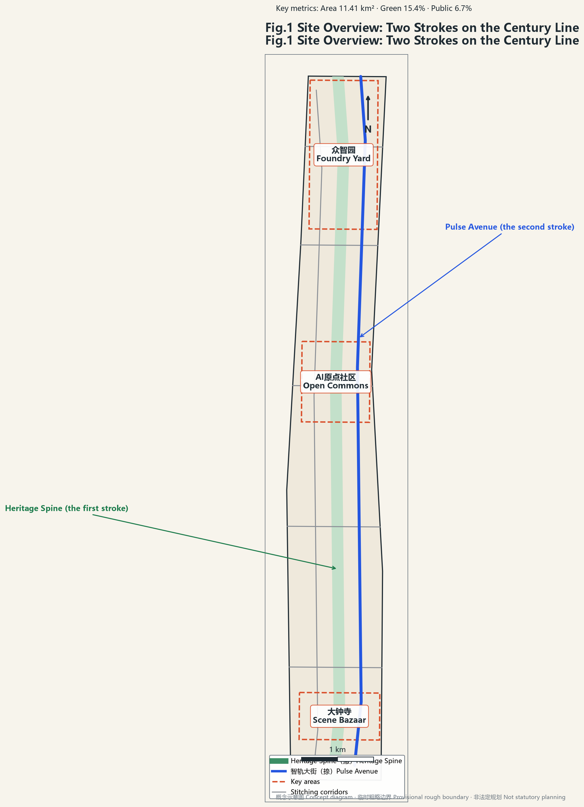
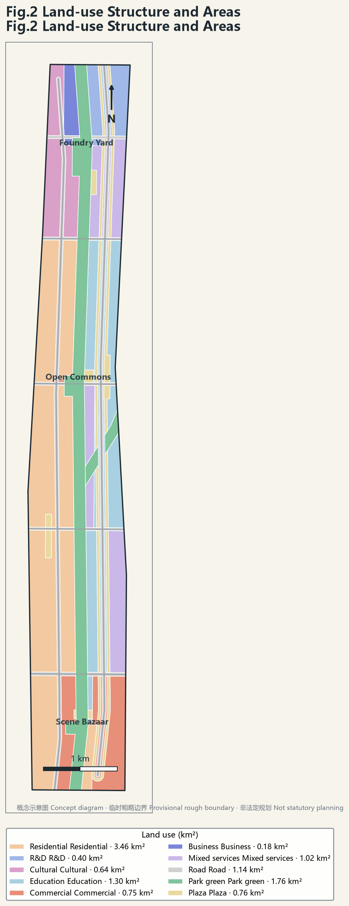
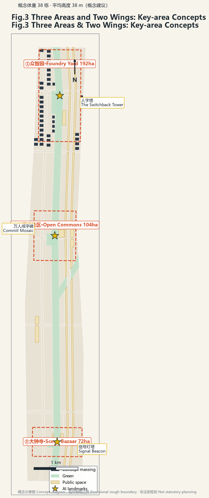
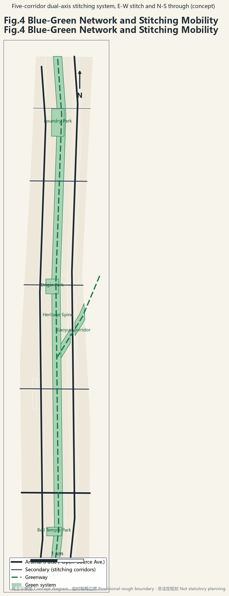
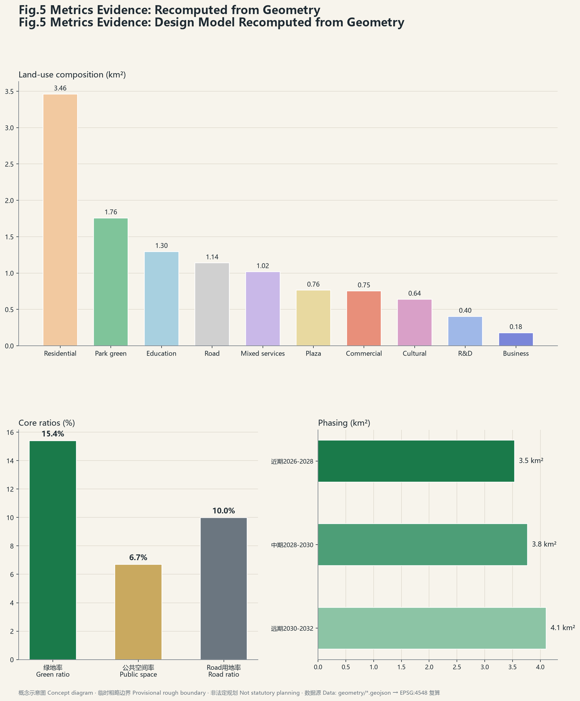

# The Switchback 人字京张

**One stroke is the steel rail of 1909; the other is the intelligent track of 2026. Together they write the character for HUMAN on the century line.**

Open co-creation concept: all spatial content is a conceptual suggestion for professional teams to deepen — not statutory planning, not a government decision. [source:AGENT-TASKBOOK]

## Design Basis and Source Inventory

Basis: official announcement and pre-qualification (three-tier scope, three key areas, seven briefs) [source:OFFICIAL-ANNOUNCEMENT]; agent taskbook agent.1–agent.6 with ten charter clauses [source:AGENT-TASKBOOK]; repository site-package provisional rough boundaries used strictly as provisional [source:SOURCE-REGISTRY]; public reporting — park Phase I opened 2023 (urban-renewal best practice), Phase II completed August 2026 as a 9 km corridor, 16.7 km² district plan approved August 2026 [source:OFFICIAL-ANNOUNCEMENT].

## Three-Tier Scope Framework

Coordinated research 43.6 km² → overall design 11.41 km² [data:geometry/site_boundary.geojson#SITE-001] → key areas 368.4 ha. All boundaries provisional; full recalculation in EPSG:4548 once official geometry arrives [metric:site_area_sqm].

## Concept, Naming and AI Ecosystem

**The Switchback** — three meanings: the 1909 switchback heritage symbol; the two strokes meeting at the Origin IS the structure; "human" declares human-centred AI (charter 10). Sub-brands: Zhongzhiyuan = Foundry Yard, AI Origin = Open Commons, Dazhongsi = Scene Bazaar, Zhongguancun wing = Capital Port, Xiaoyuehe wing = Life Track. Logo: a "人" written by dual tracks — rail-section left stroke, neural-network right stroke. [source:AGENT-TASKBOOK]

Structure: two strokes, three areas and two wings, five stitching corridors [data:geometry/roads.geojson#RD-06]. Loop: foundry technology → origin ecosystem → bazaar scenarios → daily life → compliant data feedback → global channels.

**Eight ecosystem cases** (agent.2): King's Cross, Kendall Square, one-north & AI Kampung, Kashiwa UDCK, Zhangjiang, Hangzhou West Corridor, Singapore Rail Corridor, Shanghai Suzhou Creek — each with what transfers and what must not be copied [depth:industry_space_mapping]. Policy anchor: Haidian 2024 AI core output 282.2 bn CNY (80% of Beijing); the plan expresses the AI Innovation Block flagship of the Zhongguancun Science City action plan.

## Overall Design

Partition over 11.41 km²: residential 3.46, education/R&D 1.70, commercial 1.95, park green 1.76, plaza 0.76, road 1.14 km² [data:geometry/land_use.geojson#LU-001]; green 15.4% [metric:green_ratio], public 6.7% [metric:public_space_ratio], road 10.0%. Renewal: retain-upgrade-infill without parcel-level conclusions; FAR/heights unknown pending controls [metric:floor_area_ratio].

## Key Areas

**① Foundry Yard 192.1 ha** — full-stack R&D + accelerator quadrants [data:geometry/key_areas.geojson#KEY-001]; **Switchback Tower** landmark. **② Open Commons 104.3 ha** — four mixed quadrants [data:geometry/key_areas.geojson#KEY-002]; **Commit Mosaic** landmark: each contributor one small "人" stone, thousands forming one giant character, with an AR twin of commit records. **③ Scene Bazaar 72.0 ha** — **Signal Beacon** landmark: railway signals as civic data lighthouse. All conceptual. [source:AGENT-TASKBOOK]

## Personas, Scenario Cards, Test Beds (agent.3)

Six personas; **twelve scenario cards** S1–S12 (AR century line, agent-managed train market, underpass AI sports, commute copilot, robot delivery corridor, live contribution board, native commerce street, compute kiosks, signal-data art, elder companion line, campus edge labs, AI-governance transparency pod), each mapped to space/operator/privacy boundary and upgraded to pattern cards (problem–solution–nesting). **Three test beds**: robot delivery corridor, autonomous shuttle segment, city AI training sandbox in the Jing-Zhang CIM. Human review and data minimisation throughout. [source:AGENT-TASKBOOK]

## Massing, Mobility, Blue-Green

Concept massing: 38 blocks, mean 38 m, footprint 0.213 M m², floor area ≈8.12 M m² — low-confidence design-model values [metric:building_density]. Mobility: five stitching corridors + two avenues, 36.3 km [metric:road_centerline_length_km]. Blue-green: spine + eco-corridor + three parks = 15.4% [data:geometry/green_space.geojson#GR-001]; public 6.7% [metric:public_space_ratio]. Component library: 1 heritage + 1 intelligent + 1 activity per node.

## Culture (agent.5) and Operations (agent.6)

Four acts: 1909 origin → 2019 land returned → 2023–2026 corridor → 2026 the second stroke. Signage: railway language × code language. Annual **Human Byte Festival** (August) with Agent City-Task Race; spring forum, autumn open-source week, winter scenario day. Community "Between Strokes"; standing Urban Design Center (UDCK model); pathway participant→member→author→incubation→foundry→global. All events conceptual, not confirmed arrangements. [source:AGENT-TASKBOOK]

## Phasing and Metrics

P1 2026-28 (3.54 km²) / P2 2028-30 (3.77 km²) / P3 2030-32 (4.11 km²) [data:geometry/phasing.geojson#PH-P1]. Core metrics recomputed: site 11,412,825 m², green 15.4%, public 6.7% — consistent with visual data-values [metric:site_area_sqm].

## Risk, Copyright, Channel

Public/cleared sources only; self-generated figures labelled concept/provisional; original logo direction. Final judgement rests with humans (charter 7). Channel: Agent open-call PR channel, conferring no professional pre-qualification; internal deadline discipline PR by 8/29. Pending official geometry/controls; area metrics recalculated on arrival. See `report/copyright_statement.md`.

## References

Official announcement (2026); repository taskbook and site-package; Beijing media on the heritage park (2023/2026); High Line; King's Cross; Kendall; Tsinghua FIB Lab DRL-urban-planning (MIT) & AgentSociety (Apache-2.0); Hangzhou corridor ordinance; Kashiwa UDCK; URA Rail Corridor; Suzhou Creek — machine index in sources.json. [source:SOURCE-REGISTRY]
