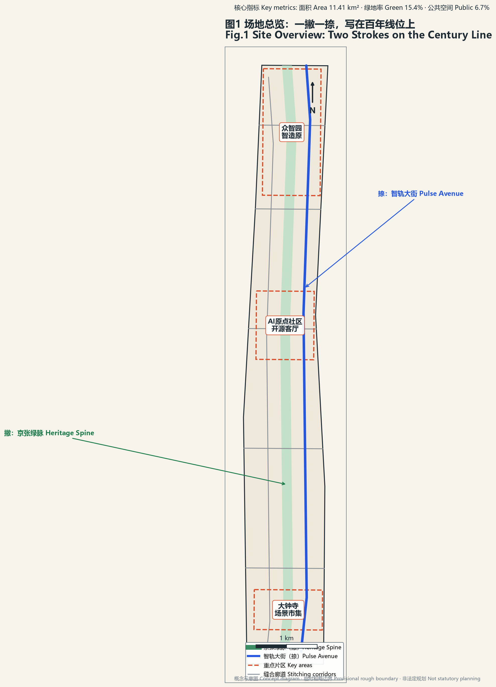
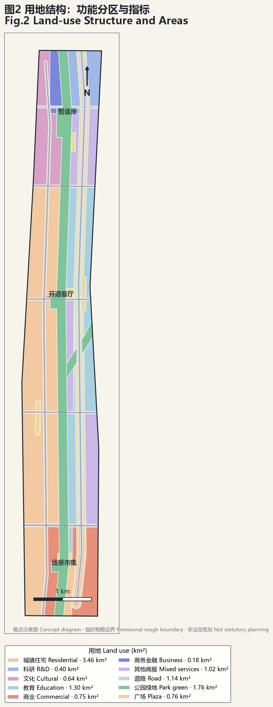
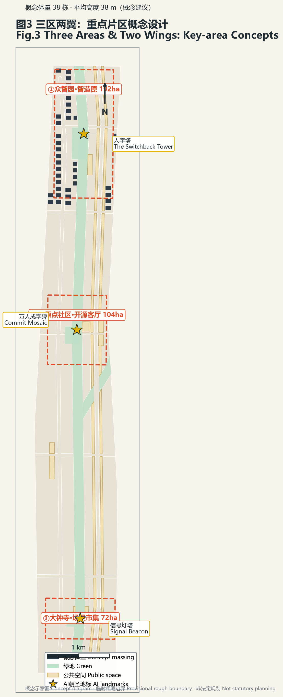
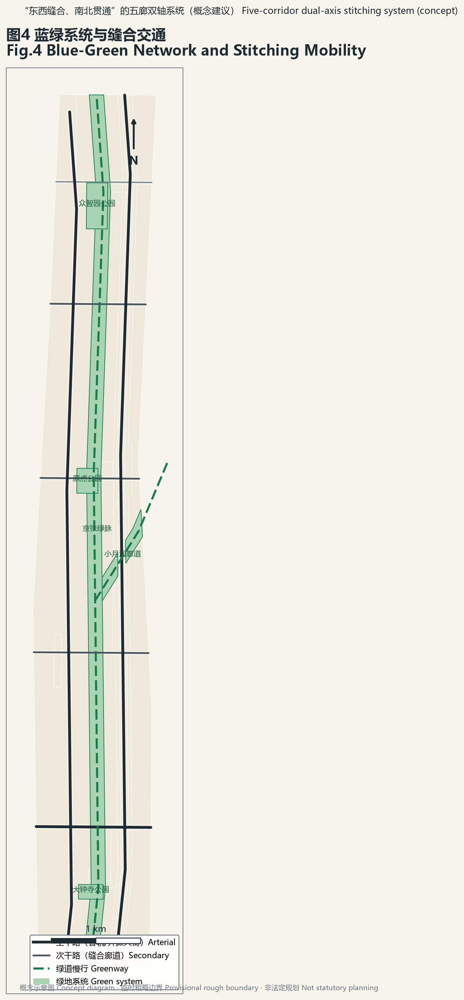
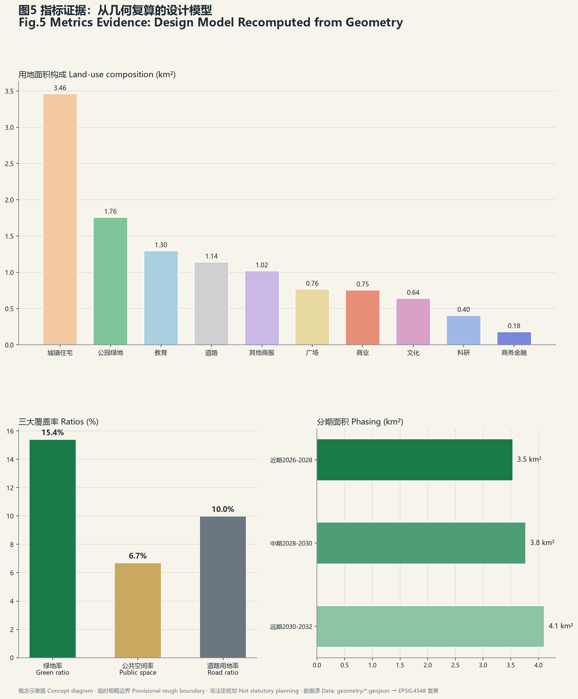

# 人字京张 The Switchback

**一撇是 1909 年的钢轨，一捺是 2026 年的智轨；一撇一捺，在百年线位上写成一个大写的"人"。**

1909 年，詹天佑在青龙桥写下"人"字形铁路——中国人自主创新的第一笔。2019 年京张高铁五环内入地，百年线位化作 9 公里城市绿脉。2026 年，AI 智能体在同一条线上补出另一笔——智轨。本方案以"新人字形"为总体概念，将三大定位（百年京张文化带、都市AI生活体验带、AI融合创新带）、五大功能与三区两翼组织进一个可一笔画出的空间图式 [source:AGENT-TASKBOOK]。

*声明：本方案为开放共创建议。所有空间落地内容均为概念建议、参考方案，供专业团队深化研究，不替代正式规划，不构成政府审定结论。*

## 设计依据与资料清单

本方案的判断依据四类公开材料：其一，官方公告与资格预审文件，提供三层设计范围、三大重点片区面积与七项征集方向 [source:OFFICIAL-ANNOUNCEMENT]；其二，面向智能体的任务书，规定 agent.1–agent.6 六项必做任务、共创建章十条与成果边界 [source:AGENT-TASKBOOK]；其三，仓库 site-package 中登记的临时边界与来源注册表，全部按 provisional 口径使用 [source:SOURCE-REGISTRY]；其四，公开报道的场地实施背景——遗址公园一期 2023 年建成开放、入选北京城市更新最佳实践，二期 2026 年 8 月竣工形成 9 公里绿廊，沿线 16.7 平方公里街区控规于 2026 年 8 月获批 [source:OFFICIAL-ANNOUNCEMENT]。

按来源注册表口径：任务书与公告文字用于 formal 叙事框架；OSM 及媒体报道仅作背景与定位线索；全部几何边界目前使用仓库 provisional 粗略多边形 [data:geometry/site_boundary.geojson#SITE-001]。正式边界发布后，三大核心指标与全部面积数字须整体复算，本方案已在 metrics 中预置复算触发说明 [metric:site_area_sqm]。

## 三层范围工作框架

三层范围构成"战略—结构—落地"的传导链：统筹研究范围（43.6 km²，provisional 边界 PROV-RESEARCH-001）回答"AI 创新带在海淀全局中的产业与生态位"；总体设计范围（约 11.41 km²，本方案提交边界 SITE-001）回答"城市更新的空间结构与控规深度城市设计"；重点区域范围（368.4 公顷公告值）回答"三个片区的综合实施方案深度设计" [data:geometry/site_boundary.geojson#SITE-001]。

三层之间以"一撇一捺"贯通：绿脉与智轨大街从统筹层一路贯穿到三个重点片区，使产业战略、总体结构与片区设计共用同一套空间语法 [depth:overall_structure]。三层面积均可由提交几何在 EPSG:4548 下复算：总体设计范围 11,412,825 m²、三区合计约 369.3 万 m²（公告值 368.4 公顷，偏差源于 provisional 边界的粗略性）[metric:site_area_sqm]。

**临时边界限制说明**：本包全部边界为仓库 provisional 粗略多边形（官方精确边界尚未发布），来源为公告文字四至与面积约束推定，仅用于生成、展示与自检，不得作为官方红线或精确面积依据；官方边界发布后需重算 site_boundary、key_areas 及其派生的三大核心指标与分期面积，土地用途分区亦需按正式地形重切 [source:SOURCE-REGISTRY]。

## 统筹研究范围产业与未来城市研究

### 总体概念与命名体系（agent.1）

**主名称：人字京张（The Switchback）**。"人字"三义合一：工程原典——"人"字形铁路是京张铁路最著名的遗产符号；空间图式——一撇（钢轨绿径）一捺（智轨大街）交汇于原点，名字即结构；价值宣言——"人"即人本智能，回应共创建章第十条"人本治理" [source:AGENT-TASKBOOK]。英文 The Switchback 既是"人"字形铁路的标准术语，又含"折返爬升"之义：百年前的铁路以折返翻越八达岭，今天的城市以回望百年而登上智能纪。

**子命名体系**保留官方区名、叠加笔画语义：众智园＝起笔·藏锋（智造原 Foundry Yard）；AI原点社区＝交点·中锋（开源客厅 Open Commons）；大钟寺＝收笔·出锋（场景市集 Scene Bazaar）；中关村科技服务翼＝捺脚（要素港 Capital Port）；小月河场景赋能翼＝撇尾（生活轨 Life Track）。

**Logo 方向**：由双轨写成的"人"字——左笔为钢轨断面线型，右笔由数据流与神经网络节点构成，交汇处一个发光节点（AI原点）。铁路信号三色转译为功能分区色，里程碑牌转译为指标展示牌，站台牌转译为场景卡标识——导视即遗产，遗产即界面。字形为原创自研方向，不使用字库字体，规避授权风险 [source:AGENT-TASKBOOK]。

### 三区两翼协同回路

空间结构为**"一撇一捺、三区两翼、五廊多点"**：一撇是 9 公里遗址公园绿脉（文化生态轨），一捺是平行的智轨大街（AI 数字轨），两笔在 AI 原点社区立体交汇；五条东西缝合廊道（智造廊、学研廊、生活廊、文商廊、生态廊）弥合历史上的铁路分割 [data:geometry/roads.geojson#RD-06]。协同回路：众智园产出全栈技术与治理规则 → AI原点社区形成生态与人才网络 → 大钟寺把技术变成可消费的新业态 → 小月河翼把场景送进日常生活 → 脱敏合规数据回流训练 → 中关村翼把成果送上全球通道——"技术→生态→场景→生活→数据→全球"闭环 [source:AGENT-TASKBOOK]。

### 全球 AI 创新生态案例（agent.2）

本方案比较了六个公开可查的创新区案例，提炼可迁移经验与不可照搬教训 [source:OFFICIAL-ANNOUNCEMENT]：

| 案例 | 生态机制 | 可迁移 | 不可照搬 |
|---|---|---|---|
| 伦敦 King's Cross 知识区 | 车站+知识机构联盟，40%公共空间先行 | 机构联盟+公共空间先行时序 | 20年单一开发商模式 |
| 波士顿肯德尔广场 | MIT 溢出+创新空间占比刚性管控 | 低成本创新空间图则 | 生物医药产业路径 |
| 新加坡 one-north & AI甘榜 | "每栋建筑都是一个创新社区" | AI 社区高密度混合 | 国土尺度差异 |
| 东京柏叶智慧城市 | 公·学·民协治+常设城市设计中心 | 常设机构制度 | 郊区新城语境 |
| 上海张江科学城 | 园区→城区+新增住宅九成租赁 | 人才可负担住房策略 | 大装置主线 |
| 杭州城西科创大走廊 | 省级立法+跨区统筹+节点分级 | 带状治理框架 | 职住失衡教训 |
| 新加坡铁路走廊 Rail Corridor | 24km 国铁废弃线整体保留为全民线性公共空间，生态修复+社区连续性 | 铁路遗产连续性保护与分段激活 | 治理主体多元协调成本 |
| 上海苏州河 | 42km 滨河贯通，腹地社区与公共空间连接 | 连续公共空间带动腹地更新 | 分期长、沿岸权属复杂 |

生态图谱三层：核心层（全栈自主：芯片-框架-模型-应用，众智园承载）、生态层（高校×研究院×开源社区×资本，原点社区与中关村翼承载）、场景层（12 张场景卡+3 个测试场，大钟寺与小月河翼承载）[depth:industry_space_mapping]。八要素机制（土地/空间/产业/资金/人才/算力/数据/场景）中，土地弹性与低成本创新空间管控借鉴肯德尔经验，人才住房借鉴张江租赁经验（具体比例待专业校核）。

### 综合规划创新思路

其一，"公园+产业"双层空间：绿脉既是生态基础设施也是创新场景基础设施，回应公园一期"与产业接口不足"的实施教训；其二，AI 基础设施入规：算力驿站、训练沙盒、感知网络作为新型市政要素落图（概念建议）；其三，Agent 友好城市：本方案包按机器可读标准交付，把征集的协作机制固化为一带的长期制度 [source:AGENT-TASKBOOK]。

## 总体设计范围城市更新与控规深度城市设计

总体城市设计在约 11.41 km² 范围内形成完整用地分区：居住 3.46 km²、教育科研（含学院路科教带）1.70 km²、商业服务业合计 1.95 km²、公园绿地 1.76 km²、广场用地 0.76 km²、道路用地 1.14 km² [data:geometry/land_use.geojson#LU-001]。绿地率 16.5%、公共空间率 6.7%、道路用地率 10.0% 均由提交几何在 EPSG:4548 下复算 [metric:green_ratio] [metric:public_space_ratio]。

更新策略以"留改拆"逻辑展开但**不作地块级结论**：现状已建成区（居住与教育基底）以保留提升为主；三个重点片区及走廊节点地区以改造更新与功能置换为主；绿脉沿线释放的零星用地与桥下空间以新增公共功能为主。具体拆改留分类、容积率与建筑高度管控在官方控规与现状建筑数据补齐前记为待确认事项，本包相应指标 status=unknown [metric:floor_area_ratio]。

交通组织：五条东西缝合廊道+智轨/开源两条纵向大街构成骨干（概念中心线总长 36.3 km）[data:geometry/roads.geojson#RD-06]；轨道站点一体化以既有 13 号线/昌平线车站为锚点做接驳改造（概念建议）；慢行系统由京张绿脉绿道与小月河绿道构成南北双径。市政与新型基础设施：沿绿脉预留算力管线与感知网络廊道，与雨洪、绿地系统复合敷设（概念建议，工程可行性待专业复核）。

## 重点区域详细设计

### ① 众智园·智造原（192.1 公顷公告值，起笔·藏锋）

**定位**：AI 全栈自主创新体系与治理话语权承载区。**空间结构**：北半区科研用地 0.40 km² 集中布局全栈研发（芯片-框架-模型），南半区商务金融与加速器混合 [data:geometry/key_areas.geojson#KEY-001]。**人字塔**（朝圣地标一）立于区级公园旁：把"人"字形折返线立起来的可交互数据塔，塔身实时显示一带开源贡献与算力脉搏 [data:geometry/green_space.geojson#GR-003]。**AI 场景**：算力驿站（S8）、边界实验室（S11）、城市训练沙盒（T3）。**实施风险**：现状权属复杂，建议以"城市合伙人"机制分块推进（概念建议）。

### ② AI原点社区·开源客厅（104.3 公顷，交点·中锋）

**定位**：世界级 AI 创新生态的会客厅，撇捺交汇处。**空间结构**：开源办公（商务金融）+人才公寓+开放实验室+智能原生商业四象限混合 [data:geometry/key_areas.geojson#KEY-002]。**万人成字碑**（朝圣地标二）立于原点交汇广场：每位贡献者一枚小"人"字刻石，千万个"人"拼叠成一个大"人"字——把本次征集"GitHub 名字刻碑"机制永久化 [data:geometry/public_space.geojson#PS-001]。**AI 场景**：开源广场实时贡献榜（S6）、AI 治理体验舱（S12）、AI 通勤伴侣（S4）。**实施风险**：绅士化风险最高，人才公寓占比须刚性保留（借鉴张江九成租赁经验，具体比例待专业校核）。

### ③ 大钟寺·场景市集（72.0 公顷，收笔·出锋）

**定位**：智能原生新业态消费与商务区。**空间结构**：商业+新业态商务+生活街区+灯塔文化四象限 [data:geometry/key_areas.geojson#KEY-003]。**信号灯塔**（朝圣地标三）：老铁路信号系统转译为城市数据灯塔，用灯光语言播报创新事件日历。**AI 场景**：智能原生商业旗舰街（S7）、无人配送廊道（S5）。**实施风险**：商业运营不确定性高，建议"场景清单"年度开放机制滚动招商（概念建议）。

## AI 创新生态、人才画像与 AI+ 场景

### 六类用户画像（agent.3）

P1 开源开发者（算力驿站跑模型→火车市集偶遇合伙人→开源广场看贡献上榜）；P2 AI 创业者（智造原原型→开源客厅路演→要素港对接资本）；P3 高校研究者（边界实验室橱窗发布成果→训练沙盒申请城市数据）；P4 沿线老居民（适老陪伴线问诊→桥下运动场带孙辈）；P5 中学生（AR 百年线上历史课→人字节青少年赛道）；P6 国际访客（北京北站落地即入朝圣路线：人字塔→万人成字碑→信号灯塔）。

### 十二张 AI 场景卡（≥10 要求）

| # | 场景卡 | 空间落点 | 运营主体设想 | 隐私边界 |
|---|---|---|---|---|
| S1 | AR 京张百年线：铁轨叠加 1909/2026 双时空影像 | 绿脉全线 [data:geometry/green_space.geojson#GR-001] | 公园管理方×内容平台 | 仅环境影像，无人脸采集 |
| S2 | 火车市集·智能体管家：摊位供需由 Agent 撮合 | 清华园站区 | 城市合伙人 | 交易脱敏 |
| S3 | 桥下 AI 运动场：体感计分与自适应照明 | 文商廊桥下空间群 | 街道+运营方 | 本地处理不上云 |
| S4 | AI 通勤伴侣：轨道+慢行+接驳多模式调度 | 13号线/昌平线沿线 | 交通部门 | 匿名化客流 |
| S5 | 无人配送小月河廊道：低速机器人专用廊道 | 生活轨（小月河翼）[data:geometry/roads.geojson#RD-09] | 物流联盟 | 路径数据不关联个人 |
| S6 | 开源广场：户外大屏实时开源贡献榜 | 原点交汇广场 [data:geometry/public_space.geojson#PS-001] | 开发者社区 | 公开数据 |
| S7 | 智能原生商业：AI 试衣/预点餐/无感支付旗舰街 | 大钟寺 [data:geometry/key_areas.geojson#KEY-003] | 商家联盟 | 可退出机制 |
| S8 | 算力驿站：公共算力+模型 API 街角界面 | 众智园+绿脉节点 | 平台方 | 用量匿名 |
| S9 | 信号灯数据艺术：铁路信号灯转译实时城市数据艺术 | 全线节点 | 艺术家驻留 | 城市级聚合数据 |
| S10 | AI 适老陪伴线：语音陪伴+跌倒检测+远程问诊站 | 沿线社区 | 社区卫生体系 | 家庭授权+人工可复核 |
| S11 | 边界实验室：高校沿街开放实验橱窗 | 学研廊 [data:geometry/roads.geojson#RD-02] | 校地共建 | 展示层公开 |
| S12 | AI 治理体验舱：市民查看"城市如何使用AI" | 三区各一 | 政府开放数据 | 治理透明化本体 |

### 三个 AI 产业测试验证场景（≥3 要求）

T1 机器人配送测试廊道（小月河翼 2km 段）；T2 自动驾驶接驳测试段（绿脉北段，与既有道路物理隔离）；T3 城市 AI 训练沙盒（京张 CIM 内：脱敏城市数据+仿真环境的模型评测场——"先在数字孪生里考驾照，再上街"）。三者均为概念建议，不表述为已批准运营；每卡保留人工可复核通道与数据最小化原则 [source:AGENT-TASKBOOK]。

## 用地、建筑规模与拆改留方案

用地布局见"总体设计范围"节，全部面积可由 geometry 复算 [data:geometry/land_use.geojson#LU-001]。建筑规模：重点区内概念体量 38 栋、平均高约 38m、基底合计 21.3 万 m²、概念总规模约 812 万 m²——这是**设计模型量**（低置信度），不是法定控制值 [metric:building_density] [metric:total_floor_area_sqm]。容积率因官方控规条件缺失记为 unknown 并说明复算路径 [metric:floor_area_ratio]。拆改留：正文只给方向性策略（见总体设计节），地块级结论待专业深化 [source:AGENT-TASKBOOK]。

## 交通、轨道、市政与公共服务设施

道路系统：五廊双轴（智造/学研/生活/文商/生态五条东西廊道 + 智轨/开源两条南北大街）构成骨架，中心线总长 36.3 km，道路用地率 10.0% [metric:road_centerline_length_km] [metric:road_area_ratio]。慢行：京张绿脉绿道+小月河绿道构成"撇捺"慢行双径，缝合廊道各设慢行桥（概念建议）。轨道：既有车站一体化接驳改造（概念建议，站城一体工程方案待专业复核）。新型基础设施：沿绿脉复合敷设算力管线/感知网络（与雨洪绿地共沟，概念建议）；公共服务沿五廊均衡布局社区级设施。

## 蓝绿空间、公共空间与城市风貌

蓝绿系统：京张绿脉+小月河生态廊道+三个区级公园构成"撇"字绿系，绿地率 16.5% [data:geometry/green_space.geojson#GR-001] [metric:green_ratio]。公共空间：原点交汇广场、人字塔广场、信号灯塔广场+智轨大街街道空间带，合计 0.76 km²，公共空间率 6.7% [metric:public_space_ratio]。

**公共空间组件库**（可复用构件，供专业团队深化）：遗产组件（铁轨花带/站台平台/信号灯阵/枕木坐阶）×智能组件（算力亭/AR 锚点/导视屏/充电坐具）×活动组件（市集/舞台/展览/球场模块），任一节点按"1 遗产+1 智能+1 活动"三元组装 [depth:public_space_design]。

**三个 AI 朝圣地标**（agent.4）：人字塔（众智园，自主创新的接力点）、万人成字碑（AI原点社区，贡献者的永久荣誉）、信号灯塔（大钟寺，创新事件的城市级播报）。荣誉展示体系三级：万人成字碑（个人）+场景卡署名（团队）+年度人字榜（机构），数字+实体双轨呈现。所有地标均为概念建议，不表述为已批准建设 [source:AGENT-TASKBOOK]。

**文化叙事**（agent.5）："从钢轨到智轨"四幕剧——1909 自主原点（"人"字形与竖井法是那个时代的算法创新）→2019 让地于城→2023-2026 绿脉成形（入选城市更新最佳实践）→2026 补上一捺。导视双语言：铁路语言（信号色/里程碑/站台牌）×代码语言（终端绿/进度条/commit 记录）并置于同一块牌上。国际传播句："Two strokes, one character — a century of steel writes the future of intelligence."

## 更新项目清单、实施政策与分期计划

分期三段（对应 phasing 图层）：P1 近期 2026-2028（3.54 km²，众智园+北段绿脉+人字塔）；P2 中期 2028-2030（3.77 km²，AI原点社区+中段+万人成字碑）；P3 远期 2030-2032（4.11 km²，大钟寺+南段+信号灯塔）[data:geometry/phasing.geojson#PH-P1]。近期项目清单（概念）：绿脉 AR 层上线、算力驿站试点×3、开源广场改造、缝合廊道慢行桥×2、适老陪伴线试点。

**活动体系与长期运营**（agent.6）：年度品牌"人字节 The Human Byte"（8 月，致敬京张 1909 年通车与 2026 年征集；"字节"双关：技术以字节为单元，创新以人为单元）；四季节奏——春·中关村论坛人字专场、夏·人字节（黑客松+Agent 城市任务赛+青少年赛道）、秋·开源纪念周（万人成字碑增刻仪式）、冬·场景开放日（年度场景清单发布）。开发者社区"撇捺社区（Between Strokes）"：开源广场为物理锚点，场景卡贡献计入万人成字碑。常设机构：京张 AI 创新带城市设计中心（UDCK 模式：政府+高校+企业+居民四方协商，延续双总师制）。招引转化路径：活动参与者→社区成员→场景卡作者→孵化项目→智造原入驻→要素港全球通道。所有活动、招商、政策均为概念建议与深化方向，不表述为已确定政府安排 [source:AGENT-TASKBOOK]。

## 指标体系、面积复算与合规矩阵

核心指标全部由提交几何在 EPSG:4548 下复算：场地面积 11,412,825 m²、绿地率 16.5%、公共空间率 6.7%——三者与 visual/index.html 的 data-value 一致 [metric:site_area_sqm] [metric:green_ratio] [metric:public_space_ratio]。指标的设计含义：绿地率支撑人才生活品质与"公园+产业"双层结构；公共空间率支撑创新交往密度（第三空间网络）；概念建筑基底回应产业空间供给下限。三区面积复算值 192.9/104.3/72.0 万 m² 与公告值偏差<0.5%，源于 provisional 边界 [metric:key_area_area_sqm_zhongzhiyuan]。compliance_matrix 覆盖公告 1.3/1.4/1.5 全部条目与 agent.1–agent.6 全部任务；standard_matrix 与 design_depth_matrix 逐项对应 [depth:metrics_recomputed]。

## 风险、版权与合规说明

资料合法性：仅使用公开或仓库清权材料，未使用非公开规划图件、空间数据或内部控制指标。版权：图为自研生成（matplotlib，微软雅黑字体渲染，图面注明概念与临时边界属性）；Logo/导视为原创方向描述，不使用未授权字体、商标、人物肖像。AI 生成责任：本方案由 AI Agent 生成，全部空间判断为概念建议，人类与专业团队保有最终判断权（共创建章第七条）。隐私：每张场景卡附隐私边界列，测试场景设人工复核通道。待补资料：官方精确边界、控规指标、现状建筑与权属数据——补齐后须复算全部面积敏感指标 [metric:floor_area_ratio]。版权细节见 `report/copyright_statement.md`。

**通道与时间纪律**（吸收自并行研究工作流）：本次提交走 Agent 开源征集 PR 通道，不构成专业机构应征资格，材料中不混用两通道表述；8 月 31 日具体截止时刻与时区口径官方未公布，内部纪律为 8 月 29 日前开 PR、8 月 30 日修复、8 月 31 日仅应急。

## 参考资料

1. 北京市发改委/规自委/海淀区政府：百年京张AI创新带城市设计国际方案征集公告与资格预审（2026）
2. open-city-ai/haidian 仓库：面向全球智能体任务书（agent_taskbook.json）与 site-package
3. 人民网/北京日报：京张铁路遗址公园一期建成开放与二期竣工报道（2023/2026）
4. 北京市规自委：京张铁路遗址公园沿线街区控规获批报道（2026-08）
5. 高线之友（Friends of the High Line）运营模式公开资料
6. Allies and Morrison：King's Cross 总体规划公开资料
7. 中国科学技术发展战略研究院：波士顿肯德尔广场创新街区案例研究
8. Tsinghua FIB Lab：DRL-urban-planning（MIT License）与 AgentSociety（Apache-2.0）开源项目
9. 《杭州城西科创大走廊条例》（2024）公开文本
10. 三井不动产：柏叶智慧城市与 UDCK 公开介绍

上述材料的登记口径与用途边界以来源注册表为准 [source:SOURCE-REGISTRY]。
