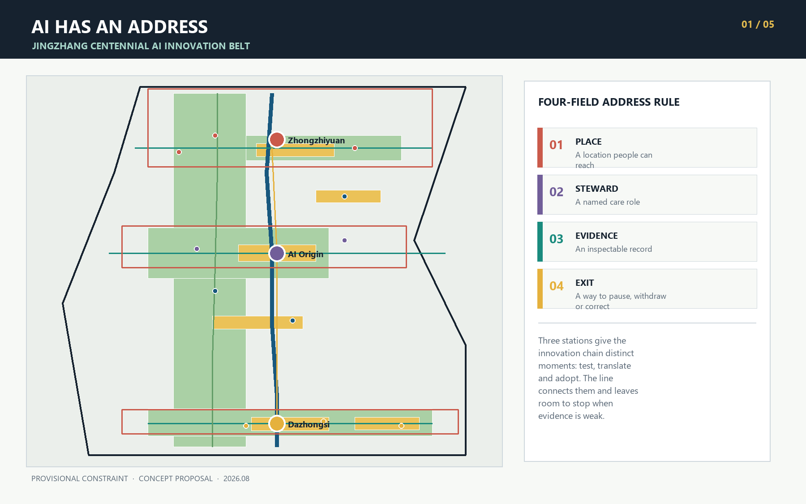
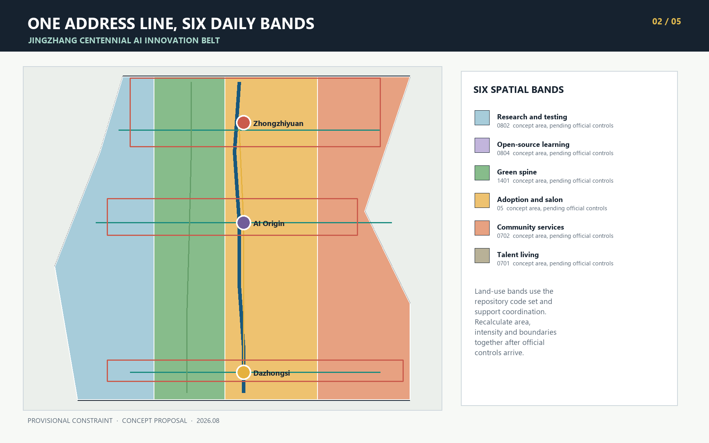
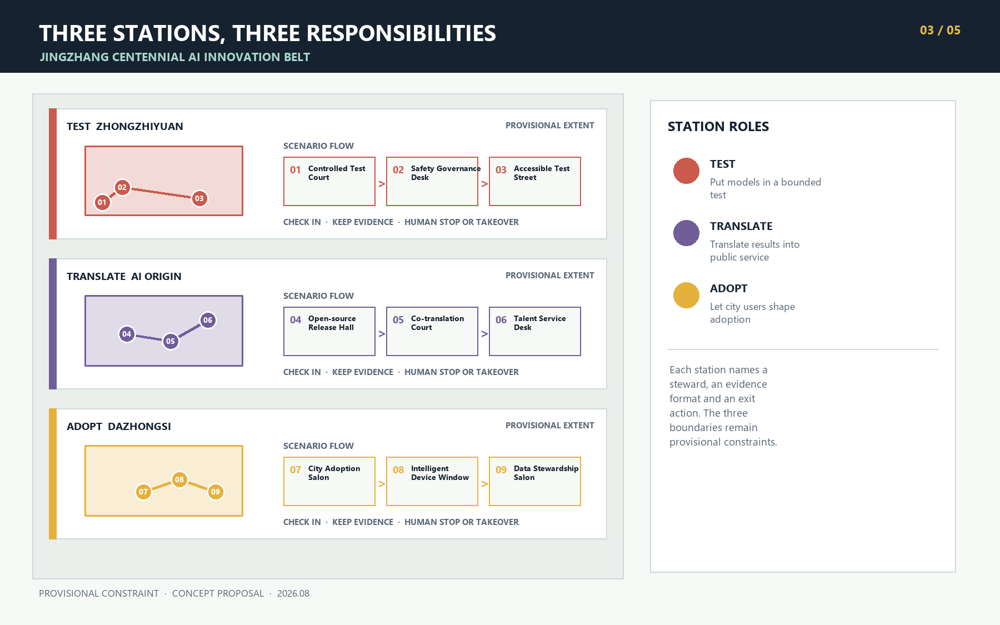
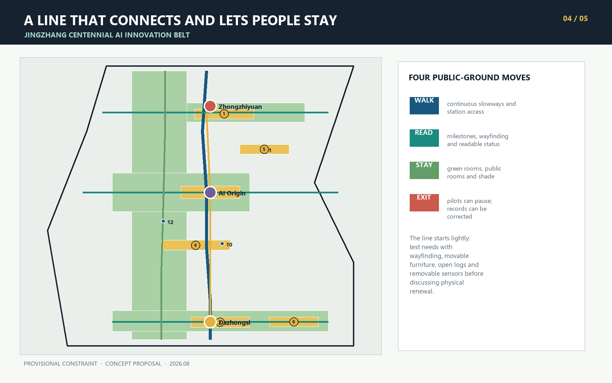
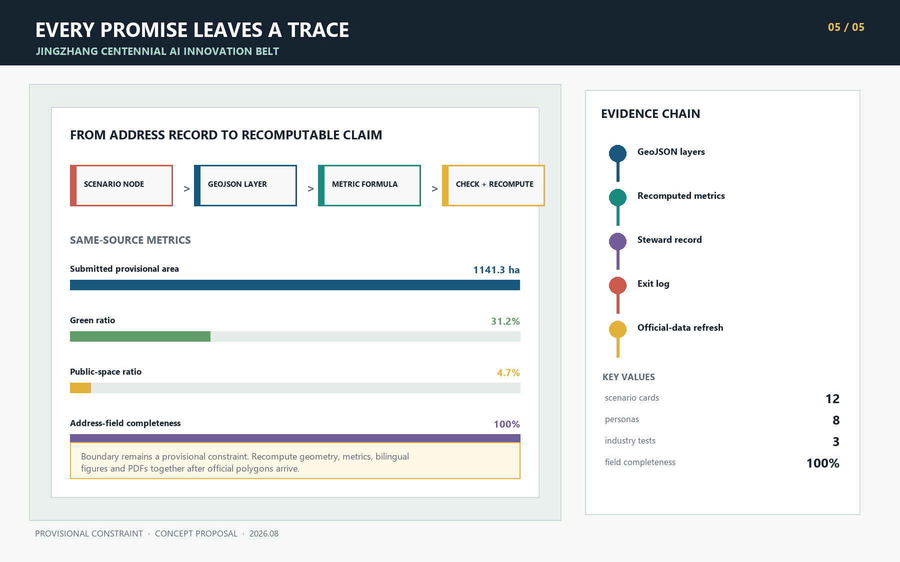

# AI HAS AN ADDRESS / 京张有址

When an AI service enters the city, people ask four practical questions. Where is it? Who answers when something goes wrong? What evidence supports its performance? How can it stop when it no longer fits? Many technical systems hide these answers in the back office. Urban space can bring them into public view, so that responsibility appears alongside service.

AI HAS AN ADDRESS begins here. Every urban AI service registers four fields: **place, steward, evidence and exit**. Together they form a responsibility address. Jingzhang Heritage Park carries the Address Line. Zhongzhiyuan, Beijing AI Origin Community and Dazhongsi host controlled testing, public translation and city adoption. The Zhongguancun Technology Service Wing supplies professional support, while the Xiaoyuehe Scenario Enablement Wing brings feedback from real use. Twelve scenario nodes put the rule into everyday space.

## Design Basis and Source Inventory

The official announcement defines an approximately 43.6 km2 coordinated research scope, an approximately 11.4 km2 overall design scope and approximately 368.4 ha of key areas. It also calls for an industrial ecosystem, urban renewal, transport and municipal support, an active Jingzhang Heritage Park belt and detailed design for three key areas [source:OFFICIAL-ANNOUNCEMENT] [standard:PROJECT-OFFICIAL-ANNOUNCEMENT]. The agent taskbook adds identity, global cases, personas, scenario cards, industry validation, pilgrimage landmarks, cultural narrative and long-term operation [source:AGENT-TASKBOOK] [standard:PROJECT-AGENT-OPEN-CALL-TASKBOOK].

The current package has no official polygon for the overall scope or the three key areas. It also lacks regulatory controls, existing-building data, road redlines, ownership, municipal baselines and heritage-control polygons. This submission uses the repository's provisional rough boundary only for concept generation, visual explanation and intake checks [source:BOUNDARY-SOURCE] [data:geometry/site_boundary.geojson#SITE-001]. Issue #846 notes a possible spatial offset between the provisional overall polygon and mapped park geometry [source:ISSUE-846]. Locations and area-sensitive metrics therefore require a full-package recalculation when official data arrives. Rough rectangles do not represent parcels or road boundaries [depth:existing_conditions_diagnosis].

## Three-Level Scope Framework

The coordinated research scope first looks for missing links among universities, research institutes, enterprise services and urban life. The overall design scope gathers those links along a continuous public Address Line, together with blue-green space, community services and slow mobility. Each key area handles one critical moment: Zhongzhiyuan exposes technical problems, AI Origin makes results understandable, and Dazhongsi considers whether a service is worth adopting [data:geometry/key_areas.geojson#PROV-KEY-001] [depth:three_level_scope_framework].

Jingzhang Heritage Park carries the north-south Address Line. Zhongzhiyuan at the north handles TEST, AI Origin in the middle handles TRANSLATE, and Dazhongsi at the south handles ADOPT. The Zhongguancun Technology Service Wing brings standards, legal, intellectual-property and talent support to all three. The Xiaoyuehe Scenario Enablement Wing brings transport, community and public-space questions into testing. Twelve addresses sit on the line and its wings; each has a steward and a way to pause or leave. The framework describes coordination and creates no new planning boundary [data:geometry/constraints.geojson#ZONE-TEST] [data:geometry/constraints.geojson#NODE-01] [depth:overall_spatial_structure].

| Scope | Design focus | Reviewable outputs |
| --- | --- | --- |
| Coordinated research scope, about 43.6 km2 | Innovation, talent, urban-service and regional collaboration chains | Global cases, ecosystem mechanisms, two-wing relationship, annual operation |
| Overall design scope, about 11.4 km2 | Address Line, functional bands, slow mobility, blue-green network and renewal sequence | Land use, buildings, roads, green space, public space and phasing GeoJSON |
| Key areas, about 368.4 ha | Three responsibility spaces for TEST, TRANSLATE and ADOPT | Station detail, scenario nodes, project list and development gates |

## Belt Concept and Address Rule

The four-field rule acts as a spatial admission condition. Before a scenario enters public space, the team registers a place and steward. Before opening to users, it records the evidence format and exit action. A steward may be a venue operator, community host, professional review group or public-service desk, and someone must remain available for questions. Evidence may include a test log, version record, authorization list or maintenance ticket. Promotional figures do not qualify. The exit explains how to pause a service, withdraw data, restore a human route and correct the public record.

The identity is AI HAS AN ADDRESS / 京张有址. Its mark draws from railway mileposts and Beijing address plates: a vertical line represents Jingzhang, and four adjacent squares represent place, steward, evidence and exit. Deep rail blue marks a continuous public commitment, clear-water green marks inspectable evidence, signal yellow marks human takeover, and vermilion identifies responsibility nodes. All figures use original shapes and system fonts. They contain no corporate marks, portraits or third-party images.

The rule places the taskbook's three positionings inside one service journey. The Jingzhang Cultural Belt preserves source and time. The Urban AI Life Experience Belt lets people judge a service in ordinary settings. The AI Convergence Innovation Belt records each handoff from research and testing to adoption. Full-stack testing, innovation ecosystem, scenario enablement, active city life and governance expression therefore use the same address card. At a site entrance, reviewers can read a service's current state, steward and missing next step, giving all five functions a concrete point of review.

## Coordinated Research Scope: Industry and Future City

International cases help identify useful mechanisms. The proposal does not transfer their areas, investment amounts or governing authority.

| Case | Mechanism worth studying | Jingzhang translation | Use boundary |
| --- | --- | --- | --- |
| Helsinki AI Register | Public descriptions of purpose, data and responsibility | Publish a four-field address card for every scenario | Transparency method only [source:CASE-HELSINKI-AI-REGISTER] |
| Amsterdam Algorithm Register | Register impact, contact and risk by system | Put steward and evidence into the node registry | No transfer of local legal judgments [source:CASE-AMSTERDAM-ALGORITHMS] |
| Singapore one-north | Work, life, learning and leisure form one innovation environment | Use the two wings to support long-term life beyond R&D | No transfer of land or investment models [source:CASE-ONE-NORTH] |
| Smart Kalasatama | Short urban pilots with resident participation | Start small and retain pause and review routes | A pilot does not imply approval [source:CASE-KALASATAMA] |
| 22@Barcelona | Productive-district renewal progresses with public space | Place enterprise adoption beside everyday community life | No transfer of development intensity [source:CASE-BARCELONA-22AT] |
| Paris-Saclay | Urban campus, mobility and daily services work together | Let AI Origin support near-campus translation and talent services | No transfer of scale targets [source:CASE-PARIS-SACLAY] |
| Kendall Square | Innovation-district development is discussed with public benefit | Add public review and return records at Dazhongsi | No local development commitment [source:CASE-CAMBRIDGE-KENDALL] |

Regional coordination begins by defining interfaces, without assuming that a partnership already exists. Jingzhang could share observations from everyday urban settings with North Latitude Community; exchange engineering prototypes and test questions with Future Science City; connect AI for Science results from Huairou Science City with plain-language explanation and urban-use questions; discuss the path from prototype to maintenance for embodied devices and intelligent terminals with the Beijing Economic-Technological Development Area; and compare how one service adapts to different urban settings with Beijing-Tianjin-Hebei partners. Every exchange carries a four-field address card, version and exit condition. Partners, projects and timing all require later agreement [source:AGENT-TASKBOOK].

| Resource | Working mechanism in AI HAS AN ADDRESS | Inspectable record and limit |
| --- | --- | --- |
| Land | Prefer verified existing or temporary space; study permanent construction only after official boundaries, ownership and controls are available | Site permission, term and restoration condition; no land-supply inference |
| Space | Three stations, public rooms and slowway stitches host testing, translation and adoption | Accessibility walkthrough, opening time and maintenance ticket |
| Industry | TEST, TRANSLATE and ADOPT create stage handoffs, with return to an earlier station when needed | Test result, version difference, adoption or retirement record |
| Funding | State maintenance responsibility and exit cost before discussing operating budgets, public grants or disclosed social collaboration | Source, use and conflict disclosure; no fiscal or investment promise |
| Talent | Developers, public translators, site safety staff and community hosts maintain the addresses together | Training record, contributed version and human-duty plan |
| Compute | Register compute source, operating time and energy budget before a test; power down when the budget is exceeded | Energy and uptime log; no claim that capacity already exists |
| Data | Use public material or explicitly authorized aggregate records, with purpose and retention period for each item | Data card, authorization, withdrawal and deletion record |
| Scenarios | Write stop conditions before a small pilot and do not scale weak evidence | Four-field card, anomaly ticket and review minutes |

This table is the working ecosystem map, connecting three stations, two wings and eight resources. Its questions come from the public taskbook and future on-site co-design; they are not findings from completed user research [depth:three_key_area_detailed_design].

A talent-service navigation assistant shows how one service could travel the whole line. At 01 Controlled Test Court, it first answers synthetic questions offline from public directories; an answer without a source or a false eligibility instruction stops the test. At 05 Co-translation Court and 06 Talent Service Desk, students, residents and professionals rewrite its limits in plain language and add a route for people without smartphones. Only after sources, human referral and withdrawal are clear may the team request a time-limited, staffed trial at 07 City Adoption Salon. Adoption, revision or retirement then enters the same address record. This is a candidate workflow, not an approved service.

## Overall Design Scope: Urban Renewal and Regulatory Design Depth

Six conceptual land-use bands organize the overall scope: research and controlled testing, open-source learning and translation, the Jingzhang green spine, enterprise adoption and city salon, community services, and talent living. Each band uses a permitted repository land-use code. The polygons completely cover the submitted boundary without overlap [standard:MNR-LAND-USE-CLASSIFICATION-GUIDE] [data:geometry/land_use.geojson#LU-001] [depth:land_use_layout]. Their areas support spatial coordination. Statutory use, floor-area ratio, building density and height remain pending official controls [standard:MOHURD-CONTROL-DETAILED-PLANNING] [depth:development_intensity_controls].

The earliest move is to place address plates, public desks, evidence logs and removable components in verified existing space, then observe whether they are useful at a small scale. If walkthroughs confirm a need, slow-mobility links and public rooms can follow. Physical building renewal comes last, after surveys, ownership and professional conditions are clear. This order gives residents and operators time to revise the proposal and reduces mistaken assumptions about existing assets.

Twelve building footprints represent conceptual service envelopes. Each says "retain or adapt first, pending survey" and makes no building-specific retain, renovate or demolish decision [data:geometry/buildings.geojson#BLDG-001] [metric:building_footprint_area_sqm] [standard:MOHURD-ARCH-DESIGN-DEPTH-2016] [depth:retain_renovate_demolish]. Height, massing, roof and street interface remain design methods until regulatory, heritage, daylight, fire-safety and ownership conditions are available [depth:height_massing_character].

## Detailed Design of Key Areas

| Address station | Role | Spatial moves | First projects | Conditions for development |
| --- | --- | --- | --- | --- |
| TEST Zhongzhiyuan | Let technology expose problems in a bounded setting | Qinghe Stewardship Quay, Controlled Test Court, Safety Desk, Accessible Test Street | Model red-team open day, low-speed embodied-device test, standards workshop | Official polygon, water and road conditions, site-safety plan |
| TRANSLATE Beijing AI Origin | Translate professional results into publicly understandable services | Open-source Release Hall, Co-translation Court, Talent Desk, near-campus slowway stitches | Versioned release, public explanation drafting, official-directory navigation | Campus and park ownership, building survey, event and fire conditions |
| ADOPT Dazhongsi | Let enterprise, residents and visitors test adoption value together | City Adoption Salon, Four-quadrant Walk Deck, Device Window, Data Stewardship Salon | Time-limited trials, public review, authorization register and exit audit | Station interface, road, municipal, retail-operation and data review |

Zhongzhiyuan's public space works like a visible laboratory. Test boundary, steward and stop conditions appear at the entrance, and a site safety officer can stop activity immediately. AI Origin feels closer to an editorial room and public classroom. Technical teams rewrite model descriptions, limits and human alternatives in plain language. Dazhongsi meets a broader group of city users. Every display distinguishes demonstration, trial and active service, while feedback retains a record of disagreement and response.

The three key-area geometries remain rough rectangles and cannot support parcel-level construction decisions [data:geometry/key_areas.geojson#PROV-KEY-002]. Figures show these temporary extents as low-contrast dashed lines and focus on responsibility among the three stations. When official polygons arrive, node assignment, area, slowway routes and project boundaries must update together.

## AI Innovation Ecosystem, Personas and AI+ Scenarios

The following eight personas are design hypotheses drawn from the public taskbook. They help check whether a service overlooks important users. This AI submission conducted no site visit, stakeholder interview, resident workshop or real-user test, and it creates no trackable personal profile. A professional team should verify these hypotheses through inclusive fieldwork.

| User | Everyday need | Address Line response | Data boundary |
| --- | --- | --- | --- |
| Researchers and open-source developers | Test, release, collaborate and correct | Controlled Test Court, Release Hall and version ledger | No private repository or unauthorized research data |
| Early-stage teams | Find standards, legal help, compute, trial users and workspace support | Zhongzhiyuan entry, wing service desks and Adoption Salon | Enterprise service does not imply approval or funding |
| Nearby residents, older adults and people with low digital confidence | Commute, rest, navigate and use services without a smartphone | Continuous slowways, human desk, paper and readable status plate | No commercial profiling or persistent trajectory tracking |
| University students and faculty | Translate research, collaborate across campuses and meet affordably | Origin Co-translation Court, near-campus walking and evening workspace | Campus and research information requires authorization |
| Disabled users and caregivers | Continuous access, clear cues and on-site assistance | Accessible Test Street, low-sensing guidance and human takeover | Disabled participants co-review every test |
| International visitors and business guests | Multilingual guidance, result interpretation and exchange | Jingzhang Memory Station, Dazhongsi Adoption Station and event route | Multilingual content keeps original sources and human review |
| Children and guardians | Read service status, avoid test risks and find human help at any time | Low-position cues, clear test edge and no-scan help point | No child identity or behavior profile |
| Night workers and public-space maintainers | Safe lighting, fault reporting and a clear person who can shut equipment down | Night Repair Point, paper ticket, local power-off and handover log | Continuous monitoring does not replace inspection or worker protection |

All twelve scenario cards register four fields. Cards 01 to 03 are industry test and validation scenarios. The remaining cards cover open-source work, enterprise and talent services, cultural interpretation, city adoption and public-space maintenance [metric:scenario_card_count] [metric:industry_validation_scenario_count].

| # | Scenario and type | Place | Steward | Inspectable evidence | Exit |
| --- | --- | --- | --- | --- | --- |
| 01 | Controlled Test Court * | Zhongzhiyuan | Venue test lead | Test plan, anomaly and review log | Pause test and restore isolation |
| 02 | Safety Governance Desk * | Zhongzhiyuan | Safety review panel | Red-team summary, issue level and repair version | Close sandbox and revoke access |
| 03 | Accessible Test Street * | Qinghe edge | Accessibility host and site safety officer | Joint walkthrough and conflict list | Remove sensors and temporary devices |
| 04 | Open-source Release Hall | AI Origin | Community curator | Version, license, contribution and known limitation | Revoke event access and retain the correction record |
| 05 | Public Co-translation Court | AI Origin | Public-program team | Original, plain-language version and revision difference | Archive old version and publish correction |
| 06 | Talent Service Desk | AI Origin | Service desk | Official directory link and human response | Hand off to an authorized agency |
| 07 | City Adoption Salon | Dazhongsi | Adoption host | Trial scope, disagreements and response | End trial and restore prior service |
| 08 | Intelligent Device Window | Dazhongsi | On-site operator | Consent notice, failure and takeover record | Remove display and clear temporary data |
| 09 | Data Stewardship Salon | Dazhongsi | Data steward | Source, license, purpose and retention period | Withdraw dataset and stop processing |
| 10 | Jingzhang Memory Station | Heritage-park line | Cultural curator | Citation card, fact review and version | Correct, remove or retire story |
| 11 | Low-carbon Compute Court | Public room on the line | Energy and facility steward | Energy, operating-time and failure log | Power down and return to ordinary service |
| 12 | Night Public Repair Point | Slow-mobility node | Public-space steward | Maintenance ticket, response time and closure reason | Remove component and restore site |

* marks an industry test and validation scenario. Every node is registered in `geometry/constraints.geojson`, and [metric:address_field_completeness] checks four-field completion. AI assists retrieval, explanation, simulation and record keeping. Eligibility decisions, public-safety response, medical and legal advice, planning approval and enforcement stay with people who hold the relevant authority [data:geometry/constraints.geojson#NODE-03].

The table sets out concept-level release protocols for three industry scenarios. Before any real trial, a professional team must preregister test samples, baselines, item-level pass thresholds and review responsibility. The hard stops do not wait for a composite score; any one of them hands control to on-site staff [data:geometry/constraints.geojson#NODE-01] [data:geometry/constraints.geojson#NODE-02] [data:geometry/constraints.geojson#NODE-03].

| Scenario | Technology under test | Input and output | Baseline | Hard stop and human takeover |
| --- | --- | --- | --- | --- |
| 01 Controlled Test Court | Public-service question-answering model | Cleared public documents and synthetic questions; source-linked answers, refusal records and error taxonomy | Human-reviewed reference answers | Stop for any personal-data exposure, fabricated eligibility instruction or untraceable high-risk answer; the venue test lead restores the isolated manual workflow |
| 02 Safety Governance Desk | Tool-using venue operations agent | Synthetic task cards, tool allowlist and mock credentials; action trace, permission diff and rollback proof | Human operations checklist | Stop for any non-allowlisted action, privilege escalation or missing rollback record; the safety panel revokes credentials and isolates the sandbox |
| 03 Accessible Test Street | Low-speed embodied guidance device | Artificial obstacles and consented walkthrough observations; path, conflict and takeover response records | Human-assisted walking route | Stop for contact or near miss, a participant stop request, or lost positioning or communication; the safety officer uses the physical emergency stop and clears the route |

## Land Use, Building Scale and Retain-Renovate-Demolish Approach

Six land-use bands provide a functional balance for discussion, with area recalculated from a topological partition of the provisional boundary. Research, education, green space, commercial service, community service and housing use codes 0802, 0804, 1401, 05, 0702 and 0701. The layer asks which functions need adjacency. It does not answer statutory use change or development intensity [metric:land_use_0802_area_sqm] [depth:land_use_layout].

Building renewal starts by verifying current use, structure, ownership and occupancy. Once those facts are clear, test whether existing space can host a small, reversible service. Study an infill building only when a real space gap remains and professional conditions are complete. The twelve current envelopes only support scenario location and drawing checks. They do not establish construction volume, demolition extent or investment.

## Transport, Rail, Municipal and Public-Service Facilities

The mobility structure includes one north-south Address Line, a parallel green-spine slowway, three east-west stitches and station connectors. The main line joins the three stations. Cross lines serve the Qinghe edge, AI Origin and Dazhongsi's four quadrants. The layer states a conceptual goal for walking and cycling continuity. Transport professionals must review road sections, crossings, bridges, tunnels and station interfaces [data:geometry/roads.geojson#ROAD-001] [metric:address_line_length_m] [depth:traffic_rail_slow_parking].

Public-service nodes use data minimization and human takeover. Guidance favors edge processing, service desks search only public directories, and test devices do not retain identifiable trajectories by default. Reliable baselines for energy, drainage, fire safety, communications and compute capacity are absent, so the proposal reserves interfaces and shutdown conditions only [data:geometry/constraints.geojson#CONSTRAINT-003] [depth:municipal_new_infrastructure].

## Blue-Green Space, Public Space and Urban Character

The Jingzhang green spine supports continuous movement and provides places to pause and talk. Qinghe Stewardship Quay, Origin Quiet Court, a Dazhongsi rain-garden chain and six public rooms form the blue-green network. Every public room checks shade, seating, night lighting, accessibility, drinking-water and restroom guidance, and a route to human help [data:geometry/green_space.geojson#GREEN-001] [data:geometry/public_space.geojson#PUBLIC-001] [metric:green_ratio] [metric:public_space_ratio] [depth:blue_green_public_space].

Public-space components occupy little ground and do not require a smartphone for access to information. Accessibility, heritage, fire-safety and engineering specialists still need to review dimensions, structure and materials.

| Component | Suitable place | Minimum service | Routine care | Exit |
| --- | --- | --- | --- | --- |
| Four-field address plate | Twelve scenario nodes | Large-print status, paper explanation, optional QR code and human contact | Steward checks status and version | Remove plate and move offline page to the public archive |
| Mobile steward desk | Open events at three stations | Shade, seating, paper log, human help and power-off control | Duty operator checks tickets and power | Fold away after event and retain minutes |
| Soft test edge | TEST scenarios | Legible entrance, test extent, emergency stop and detour | Site safety officer checks before every session | Remove the same day and restore ordinary movement |
| Quiet stay kit | Green spine and public rooms | Backed seat, shade, low-glare light and no-scan guidance | Public-space steward inspects | Replace one item or remove the kit without changing foundations |
| Evidence display | Managed indoor or sheltered station edge | E-paper or printed version, date, known limits and correction route | Curator synchronizes the Address Book | Power down, remove the display and keep the former version read-only |

Urban character draws order from railway mileposts, address plates and timetables without copying a historic style. From a distance, each plate shows a station color. Up close, it reveals four fields and current status. Three low-impact, movable AI pilgrimage landmarks support the system. Zhongzhiyuan's Stewardship Gauge records test opening, pause and review. AI Origin's Address Zero Marker displays a first public explanation that has been corrected in the open. Dazhongsi's Adoption Time Platform shows real states of trial, adoption and retirement. A public Address Book distinguishes submitted, tested, adopted and implemented work, avoiding false claims of delivery [standard:MOHURD-URBAN-DESIGN-MEASURES] [metric:landmark_count].

The cultural story follows a simple line. Railways once used mileage, tickets and timetables to connect distant places with daily life. AI services also need a source, destination and person responsible for the handoff. Historic assets such as Tsinghuayuan Station enter detailed interpretation only after factual and heritage review. Zhongguancun innovation culture appears through versioning, contribution and public correction. Emerging AI culture appears through responsibility and the ability to exit. The three cultures meet on the Address Line while keeping their sources distinct.

International communication always uses **PLACE, STEWARD, EVIDENCE, EXIT** in that order. Place and institution names keep a verifiable Chinese-English pairing. Every item distinguishes concept submission, test, limited adoption, formal implementation and retirement, so that an exchange event cannot be mistaken for official endorsement.

## Renewal Project List, Policy and Phasing

For review, each project records a phase, participating actors and measurable acceptance criteria. The table uses L, M and H for relative effort. L mostly uses existing space and movable signs. M requires ongoing staffing or several partners. H involves river, transport or physical-works expertise. Effort bands are not cost estimates; the current evidence cannot support monetary figures.

| ID | Project and relative phase | Lead role and collaborators | Effort | First move and acceptance evidence |
| --- | --- | --- | --- | --- |
| A01 | Four-field address-plate sample, Phase I | Public-space operator; disabled participants, visual and heritage advisers | L | Movable sample; all four fields complete, paper-readable and correction route tested |
| A02 | Zhongzhiyuan Controlled Test Court, Phase I | Venue test lead; research team and safety panel | M | Isolated open day; three validation protocols, emergency stop and anomaly log inspectable |
| A03 | Qinghe Stewardship Quay, Phase II | River and public-space professional lead; ecology, transport and community representatives | H | Temporary seating and joint walkthrough; close water, flood, road and ecology conflicts before development |
| A04 | Origin Open-source Release Hall, Phase I | Venue operator and community curator; open-source teams, fire and rights advisers | M | Small versioned release; source, license, known limits and exit complete |
| A05 | Public Co-translation Court, Phase I | Public-program host; residents, students, disabled and multilingual participants | M | Explanation workshop; original, plain version, disagreement and correction recorded |
| A06 | Talent Service Desk, Phase I | Public-service desk; authorized agencies and university service teams | L | Public-directory guidance; each response shows its source and a human referral |
| A07 | Dazhongsi City Adoption Salon, Phase II | Adoption host; residents, enterprise, data and operations reviewers | M | Time-limited trial; rehearse rollback before opening and publish disagreement and response afterward |
| A08 | Four-quadrant Walk Deck, Phase II | Transport professional lead; station, road, accessibility and community representatives | H | Walking audit and temporary cues; complete gap list and safety review before studying works |
| A09 | Jingzhang Memory Station, Phase II | Cultural curator; history, heritage and multilingual reviewers | M | Citation cards and low-impact guidance; every factual claim sourced, correctable and removable |
| A10 | Address Book and annual review, ongoing from Phase I | Proposed Address Line secretariat; node stewards and public representatives | M | Public status page; contact, version, pause, retirement and appeal records remain complete |

Phase I begins after the necessary permissions and uses a proposed 0 to 12 months to test reversible services. Phase II follows the Phase I review and uses 12 to 36 months to close slow-mobility gaps, add public rooms and build cooperation among the stations. Physical renewal enters Phase III only where a need remains after official boundaries, controls, ownership and engineering conditions are available [data:geometry/phasing.geojson#PHASE-001] [depth:renewal_project_list] [depth:phasing_implementation]. A project that misses its gate can be revised, archived or withdrawn.

| Cadence | Proposed program | Participants | Durable output | Route forward |
| --- | --- | --- | --- | --- |
| Continuous | Address Book and public issue desk | Address Line secretariat, node stewards and users | Status page, issue, version and response records | Do not open without a steward and maintenance resource |
| Monthly | Open Address Day | Developers, venue operators, residents and professionals | Demonstration, pause, failure and correction records | Only evidence-complete work enters translation |
| Quarterly | Address Review | User representatives, professional reviewers and stewards | Disagreement minutes, maintenance effort and keep-or-exit decision | Return to TEST or apply for limited ADOPT |
| Proposed annually | Global AI Address Week reference event | Domestic and international open-source teams, universities, cities and enterprise partners | Bilingual test reports, collaboration leads and exit records | Any later collaboration receives a separate rights, compliance and resource review |

Developers remain involved through public issues, test tasks and versioned contributions. Their records can travel to standards, intellectual-property, talent and enterprise-service desks in the Zhongguancun wing. A research team seeking to advance the service submits test evidence, a plain-language explanation, a maintenance steward and a limited-adoption request in sequence. No step guarantees funding, procurement or delivery. Future venue operating budgets should maintain fixed elements; temporary events may discuss public grants, research funds or disclosed social collaboration. Before an address opens, it states who pays, who maintains it and what resource is reserved for exit. No budget or organizer is currently confirmed [source:AGENT-TASKBOOK].

## Metrics, Recalculation and Compliance Matrix

The submitted boundary recalculates to about 1,141.3 ha, close to the announced approximate value, while the provisional polygon's position and shape remain uncertain [metric:site_area_sqm]. Green ratio, public-space ratio and building footprint come from layer unions. Address Line length comes from road centerlines. Scenarios, personas, validation cases, landmarks and four-field completion come from the report and node registry. Every known metric records its formula, source, confidence and assumptions in `metrics.json` [depth:metrics_recalculation].

Readers can follow the evidence marker beside a judgment to its supporting record. `compliance_matrix.json` maps announcement items 1.3, 1.4 and 1.5 and agent.1 through agent.6. `standard_matrix.json` keeps professional references. `design_depth_matrix.json` records evidence for diagnosis, land use, buildings, transport, municipal systems, blue-green space, key areas, projects, phasing and risk. Those files keep the full index while the report explains the design choices.

## Risk, Copyright and Compliance

The main data risk is mistaking a provisional boundary for a formal conclusion. The overall scope and all three key areas are provisional constraints, and Issue #846 identifies possible spatial offset. Once official polygons arrive, update boundary, land use, buildings, roads, green space, public space, phasing, nodes, metrics, bilingual figures, HTML and PDFs together [source:ISSUE-846] [depth:risk_missing_data].

Regulatory, road, building, ownership, heritage, municipal and public-service baselines are incomplete. Related content remains a concept proposal or a reference for further professional development. This AI submission also conducted no site visit, stakeholder interview, resident workshop or real-user test. It claims no official approval and promises no investment, construction scale, event schedule or implementation outcome. AI scenarios use public material or explicitly authorized aggregate records only; they require no restricted government material, enterprise proprietary material, personal data or named vendor.

OpenAI Codex generated the prose, geometry, diagrams, offline HTML and PDFs for this submission. Figures use original geometry, Microsoft YaHei and Segoe UI. Pillow rasterizes the text into page images; the PDFs do not embed or redistribute the font files. The process also uses Pillow, Shapely and pyproj, with versions and open-source licenses recorded in `report/copyright_statement.md`. The package embeds no commercial map tile, news image, corporate logo, portrait or remote resource. External cases contribute public mechanisms only, with publisher, link, use and limitation recorded in `sources.json`.

## References

- Beijing Municipal Commission of Planning and Natural Resources, Haidian Branch, official announcement [source:OFFICIAL-ANNOUNCEMENT]
- Agent open-call taskbook [source:AGENT-TASKBOOK]
- Repository site package, source registry and provisional boundary [source:SITE-PACKAGE] [source:SOURCE-REGISTRY] [source:BOUNDARY-SOURCE]
- Provisional-boundary alignment discussion [source:ISSUE-846]
- Official pages and use limits for all seven international cases are recorded in `sources.json` [source:CASE-HELSINKI-AI-REGISTER]

The material is offered for open co-creation and professional development. When official boundaries, field research and professional baselines become available, the proposal should be recalculated from source data and tested again with real users.
