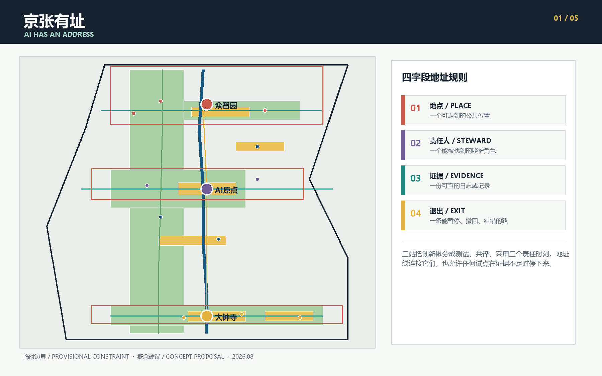
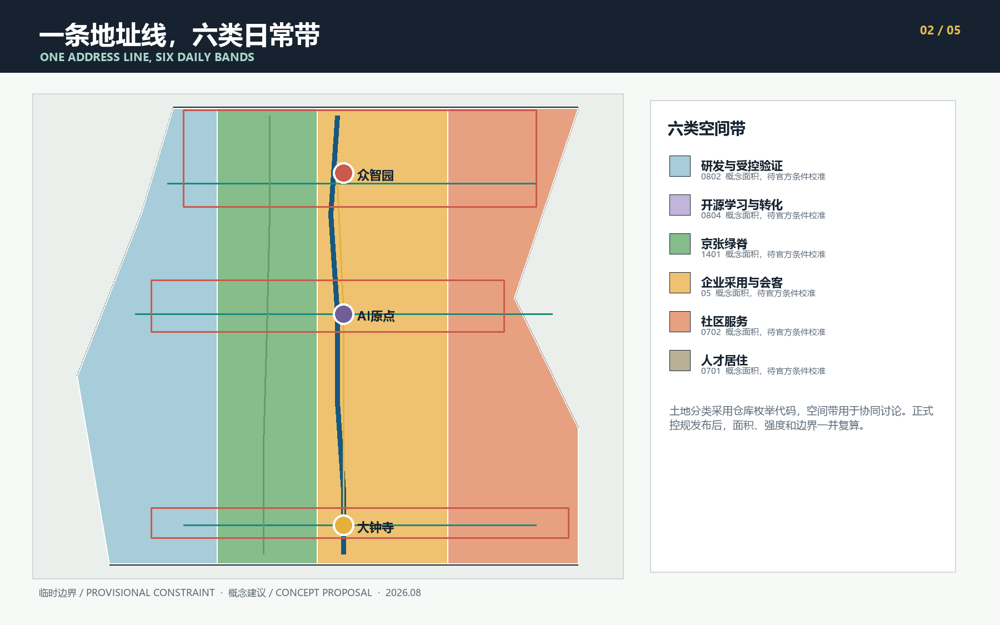
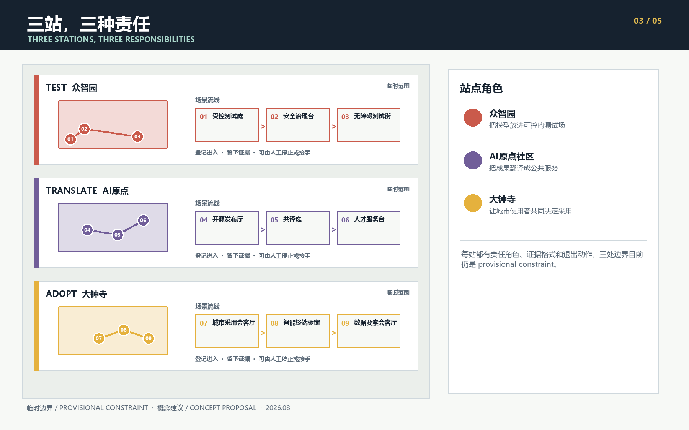
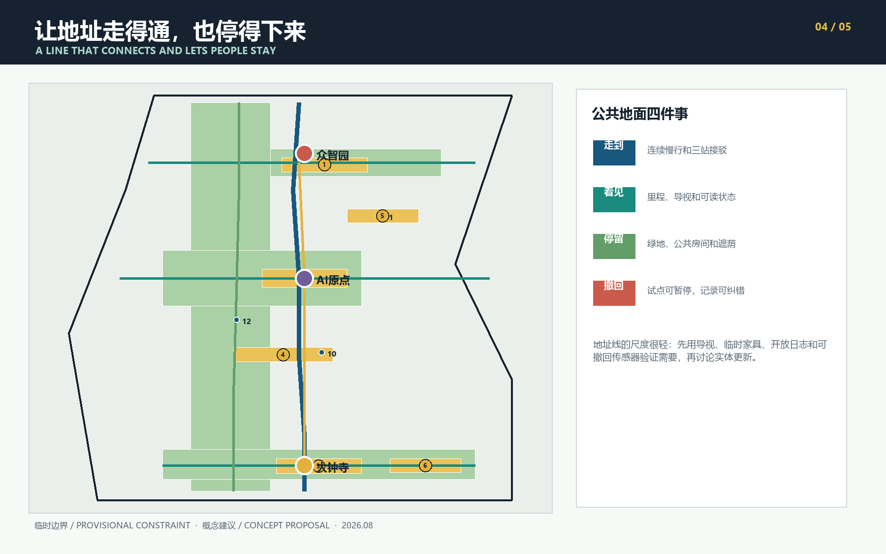
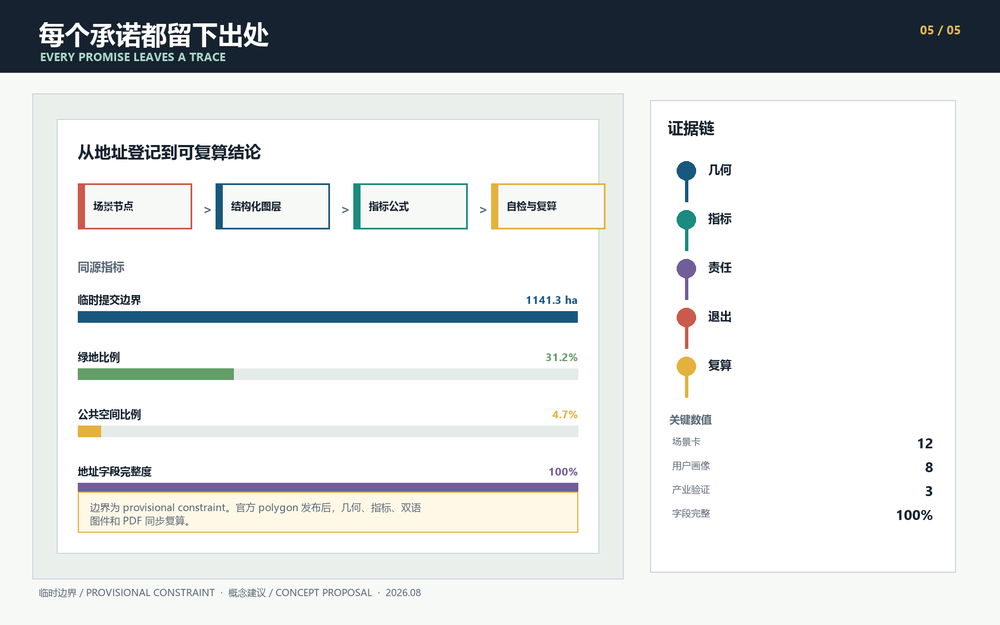

# 京张有址 / AI HAS AN ADDRESS

一项 AI 服务进入城市后，人们先会问四件很实际的事：它在哪里，出了问题找谁，效果凭什么判断，不合适时怎样停下来。很多技术方案把这些答案藏在后台。城市空间可以把它们摆到明处，让责任和服务一起被看见。

“京张有址”由此出发。方案给每项城市 AI 服务登记四个字段：**地点、责任人、证据、退出路径**。四个字段共同构成一张“责任地址”。京张遗址公园串起地址线，众智园、北京 AI 原点社区和大钟寺分别承担受控测试、公共共译和城市采用。中关村科技服务翼提供专业支持，小月河场景赋能翼提供真实使用反馈。十二个场景节点把规则落到日常空间里。

## 设计依据与资料清单

公告确定了约 43.6 平方公里统筹研究范围、约 11.4 平方公里总体设计范围和约 368.4 公顷重点区域范围，也提出产业生态、城市更新、交通市政、遗址公园活力带与三处重点区详细设计任务 [source:OFFICIAL-ANNOUNCEMENT] [standard:PROJECT-OFFICIAL-ANNOUNCEMENT]。

面向智能体的任务书进一步要求命名与视觉系统、全球案例、用户画像、场景卡、测试验证、朝圣地标、文化叙事和长期运营 [source:AGENT-TASKBOOK] [standard:PROJECT-AGENT-OPEN-CALL-TASKBOOK]。

当前资料仍缺少总体范围和三处重点区的官方 polygon、控规条件、现状建筑、道路红线、权属、市政和文保控制线。提交包沿用仓库的临时粗略边界，只用于概念生成、图面表达和 intake 自检 [source:BOUNDARY-SOURCE] [data:geometry/site_boundary.geojson#SITE-001]。

Issue #846 提醒，临时总体 polygon 与地图中的遗址公园几何可能存在空间偏移 [source:ISSUE-846]。因此，图上位置和面积敏感指标都需要在官方数据发布后整包复算；临时矩形也不代表地块或道路边界 [depth:existing_conditions_diagnosis]。

## 三层范围工作框架

统筹研究范围先看高校、科研机构、企业服务和城市生活之间缺了哪些连接。总体设计范围把这些连接收拢到一条连续的公共地址线，并与蓝绿空间、社区服务和慢行网络一起安排。三处重点区各自处理一个关键时刻：众智园暴露技术问题，AI 原点把成果讲明白，大钟寺讨论城市是否值得采用 [data:geometry/key_areas.geojson#PROV-KEY-001] [depth:three_level_scope_framework]。

京张遗址公园承担南北主线。北端的众智园先做 TEST，中段的 AI 原点负责 TRANSLATE，南端的大钟寺处理 ADOPT。中关村科技服务翼把标准、法务、知识产权和人才服务送到三站，小月河场景赋能翼把交通、社区和公共空间问题带进测试。十二个地址节点分布在线上和两翼，每个节点都能找到责任人，也能暂停或退场。这个框架只表达协同关系，不增设规划红线 [data:geometry/constraints.geojson#ZONE-TEST] [data:geometry/constraints.geojson#NODE-01] [depth:overall_spatial_structure]。

| 范围 | 方案关注点 | 可核对成果 |
| --- | --- | --- |
| 统筹研究范围，约 43.6 km2 | 创新链、人才链、城市服务链与区域协同 | 全球案例、生态机制、两翼关系、年度运营 |
| 总体设计范围，约 11.4 km2 | 地址线、功能带、慢行蓝绿网络和更新次序 | 用地、建筑、道路、绿地、公共空间、分期 GeoJSON |
| 重点区域，约 368.4 ha | TEST、TRANSLATE、ADOPT 三种责任空间 | 三站详图、场景节点、项目清单与深化门槛 |

## 一带概念与地址规则

四字段规则是一项空间准入条件。场景进入公共空间前，需要先登记地点和责任人；开放使用前，需要约定证据格式和退出动作。责任人可以是场地运营者、社区主持人、专业评审组或公共服务窗口，但必须有人接受询问。证据可以是测试日志、版本记录、授权清单或维护工单，不能用宣传数据代替。退出路径要说明怎样暂停服务、撤回数据、恢复人工流程和修正公开记录。

品牌名采用“京张有址 / AI HAS AN ADDRESS”。标志方向取自铁路里程牌和北京门牌：一条竖线表示京张主线，四个相邻方格对应地点、责任、证据、退出。深轨蓝用于连续公共承诺，清水绿用于可查证据，信号黄提示人工接管，朱红色标出责任节点。图件使用自绘图形和系统字体，没有调用企业标识、人物肖像或第三方图片。

这套规则把任务书中的三种定位放进同一次服务旅程。京张文化带保存来源和时间，都市 AI 生活体验带让人们在日常场景里判断服务是否好用，AI 融合创新带记录技术从研究、测试到采用的每次交接。全栈测试、创新生态、场景赋能、活力城市和治理表达因此共用一张地址卡。评审者在现场先看到服务当前处于什么状态、由谁照看、下一步还缺什么，五类功能也就有了可以核对的落点。

## 统筹研究范围产业与未来城市研究

国际案例主要帮助我们识别可借鉴的机制。方案没有搬用它们的面积、投资额或治理权限。

| 案例 | 值得研究的机制 | 对京张的转译 | 使用边界 |
| --- | --- | --- | --- |
| Helsinki AI Register | 面向公众说明系统用途、数据与责任 | 每个场景公开四字段地址卡 | 只借鉴透明度方法 [source:CASE-HELSINKI-AI-REGISTER] |
| Amsterdam Algorithm Register | 按系统登记影响、联系人和风险 | 责任人和证据进入节点登记 | 不照搬当地法律判断 [source:CASE-AMSTERDAM-ALGORITHMS] |
| Singapore one-north | 工作、生活、学习和休闲共同构成创新环境 | 两翼补齐研发之外的长期生活服务 | 不移植土地和投资模式 [source:CASE-ONE-NORTH] |
| Smart Kalasatama | 居民参与的短周期城市试验 | 试点先小范围运行，保留暂停和复盘 | 试验不代表获得批准 [source:CASE-KALASATAMA] |
| 22@Barcelona | 生产性城区更新与公共空间并进 | 让企业采用空间和社区日常相邻 | 不采用其开发强度 [source:CASE-BARCELONA-22AT] |
| Paris-Saclay | 城市校园、交通和生活服务协同 | 原点社区承担近校转化和人才服务 | 不移植规模指标 [source:CASE-PARIS-SACLAY] |
| Kendall Square | 创新区开发与公共收益共同讨论 | 大钟寺采用站设置公开评议和回馈记录 | 不构成本地开发承诺 [source:CASE-CAMBRIDGE-KENDALL] |

区域协同先约定接口，不预设已经存在的合作。京张可以向北纬社区提供城区日常场景的观察和反馈；与未来科学城交换工程原型和测试课题；与怀柔科学城交换 AI for Science 成果的通俗说明与城市应用问题；与经开区讨论具身设备、智能终端从样机到运维的条件；与京津冀伙伴比较同一服务在不同城市环境中的适配记录。每次交换都带四字段地址卡、版本和退出条件，合作方、项目和时间需另行确认 [source:AGENT-TASKBOOK]。

| 要素 | 京张有址的工作机制 | 可查记录与边界 |
| --- | --- | --- |
| 土地 | 优先借用已核实的存量空间和临时场地，永久建设等官方边界、权属和控规齐备后再研究 | 场地授权、期限和恢复条件；不推断供地 |
| 空间 | 三站、公共房间和慢行缝合线共同承载测试、共译与采用 | 无障碍走查、开放时段和维护工单 |
| 产业 | TEST、TRANSLATE、ADOPT 形成分段交接，失败可退回上一站 | 测试结论、版本差异、采用或退役记录 |
| 资金 | 每个项目先列维护责任和退出成本，再讨论运营预算、公开资助或披露关系的社会合作 | 资金来源、用途和利益冲突说明；不承诺财政或投资 |
| 人才 | 开发者、公共翻译者、现场安全员和社区主持人共同维护地址 | 培训记录、贡献版本和人工值守安排 |
| 算力 | 测试先登记算力来源、运行时段和能耗预算，超出预算即可停机 | 能耗与运行日志；不声称现有容量充足 |
| 数据 | 仅使用公开资料或明确授权的聚合记录，逐项写明用途和保留期限 | 数据卡、授权、撤回和删除记录 |
| 场景 | 小范围试点先写停止条件，证据不足时不扩展 | 四字段地址卡、异常单和复盘纪要 |

这张要素表是 AI 创新生态图谱的工作版，串起三站、两翼和八类要素。表内课题来自公开任务和后续现场共创，目前不代表已经完成用户调研 [depth:three_key_area_detailed_design]。

“人才服务导航助手”说明一项服务怎样走完整条线：01 受控测试庭使用公开目录和合成问题做离线测试，出现无出处答复或错误资格指引就停下；05 共译庭和 06 人才服务台邀请学生、居民和专业人员把限制条件改写成易读版本，并补上无手机使用方式；只有来源、人工转介和撤回流程都说清楚，才可向 07 城市采用会客厅申请一次限时、有人值守的试用。试用结束后，采用、退回修改或退役都进入同一份地址记录。这个例子是一条候选流程，不表示相关服务已经获准运行。

## 总体设计范围城市更新与控规深度城市设计

总体用地以六类概念带组织：科研与受控验证、开源学习与转化、京张绿脊、企业采用与城市会客、社区服务、人才居住。分带采用仓库允许的国土空间用途代码，几何完整覆盖提交边界且互不重叠 [standard:MNR-LAND-USE-CLASSIFICATION-GUIDE] [data:geometry/land_use.geojson#LU-001] [depth:land_use_layout]。

这些面积帮助检查空间关系，法定用途、容积率、建筑密度和高度仍待官方控规确认 [standard:MOHURD-CONTROL-DETAILED-PLANNING] [depth:development_intensity_controls]。

最早能做的是把地址牌、公共服务台、测试日志和可撤回组件放进已核实的既有空间，小范围观察它们是否真的有用。走查确认需求后，再补三站之间的慢行联系和公共房间。实体建筑更新排在最后，等现状、权属和专业条件齐备再判断。这样的次序让居民和运营者有机会修正方案，也减少对既有资产的误判。

十二个建筑基底表示可能承载服务的概念包络。每个包络都标注“保留或适应性改造优先，待现状调查”，不判断具体建筑的拆、改、留 [data:geometry/buildings.geojson#BLDG-001] [metric:building_footprint_area_sqm] [standard:MOHURD-ARCH-DESIGN-DEPTH-2016]。

高度、体量、屋顶和沿街界面只提出工作方法，需在控规、文保、日照、消防和权属条件齐备后继续设计 [depth:retain_renovate_demolish] [depth:height_massing_character]。

## 重点区域详细设计

| 地址站 | 角色 | 空间动作 | 首批项目 | 深化前置条件 |
| --- | --- | --- | --- | --- |
| TEST 众智园 | 让技术在可控环境中暴露问题 | 清河责任水岸、受控测试庭、安全治理台、无障碍测试街 | 模型红队开放日、低速具身设备测试、标准工作坊 | official polygon、河道与道路条件、现场安全方案 |
| TRANSLATE 北京 AI 原点 | 把专业成果翻译成公众能理解的服务 | 开源发布厅、共译庭、人才服务台、近校慢行缝合 | 版本化发布、公共说明共写、官方服务目录导航 | 校园和园区权属、建筑现状、活动和消防条件 |
| ADOPT 大钟寺 | 让企业、居民和访客共同检验采用价值 | 城市采用会客厅、四象限慢行台、智能终端橱窗、数据要素会客厅 | 限时试用、公众评议、授权登记和退出复盘 | 站点接口、道路、市政、商业运营与数据合规复核 |

众智园的公共空间更像一间可参观的实验室。测试边界、责任人和停止条件在入口处公开；现场安全员保留即时中止权。AI 原点的空间接近编辑部和公共教室，技术团队要把模型说明、适用范围和人工替代路径写成普通人能读懂的版本。大钟寺面对更复杂的城市使用者，所有展示都要区分演示、试用和正式服务状态，反馈也要留下分歧及处理记录。

三处重点区目前只有粗略矩形，不能支持地块层面的建设判断 [data:geometry/key_areas.geojson#PROV-KEY-002]。图件用浅色虚线提示这些临时范围，主要展示三站之间的责任关系。官方 polygon 发布后，节点归属、面积、慢行路线和项目边界都要同步更新。

## AI 创新生态、人才画像与 AI+ 场景

以下八类用户是根据公开任务书整理的设计假设，用来检查服务有没有漏掉重要人群。当前没有开展现场踏勘、访谈、居民工作坊或真实用户测试，也不建立个人追踪档案；后续专业团队需要通过包容性调研核实这些假设。

| 用户 | 一天中的真实需要 | 地址线回应 | 数据边界 |
| --- | --- | --- | --- |
| 研究者与开源开发者 | 测试、发布、协作、纠错 | 受控测试庭、开源发布厅、版本账本 | 不读取私人代码库或未授权实验数据 |
| 初创团队 | 找标准、法务、算力、试用者和办公支持 | 众智园测试入口、两翼服务台、城市采用会 | 企业服务不等于审批或资金承诺 |
| 周边居民、长者与低数字能力者 | 通勤、休息、问路、在没有智能手机时也能办事 | 连续慢行、人工窗口、纸面和可读状态牌 | 不形成商业画像，不持续追踪轨迹 |
| 高校师生 | 成果转化、跨校交流、低成本活动空间 | 原点共译庭、近校步行联系、夜间协作空间 | 校园和科研信息须另行授权 |
| 无障碍使用者与照护者 | 连续通行、清晰提示、现场求助 | 无障碍测试街、低感知导览、人工接管点 | 测试需由无障碍参与者共同评审 |
| 国际访客与企业来宾 | 多语导览、成果理解、商务交流 | 京张记忆站、大钟寺采用站、活动路线 | 多语内容保留原始出处和人工校对 |
| 儿童与监护人 | 看得懂状态、避开测试风险、随时找到人工帮助 | 低位提示、清晰测试边界、无扫码求助点 | 不采集儿童身份和行为画像 |
| 夜班工作者与公共空间维护人员 | 夜间照明、故障上报、清楚设备由谁关闭 | 夜间维修点、纸面工单、现场断电和交接记录 | 不以持续监控替代巡检和劳动保护 |

十二张场景卡都登记四字段。01 至 03 是产业测试验证场景；其余场景覆盖开源协作、企业服务、人才服务、文化导览、城市采用和公共空间维护 [metric:scenario_card_count] [metric:industry_validation_scenario_count]。

| # | 场景与类型 | 地点 | 责任人 | 可查证据 | 退出路径 |
| --- | --- | --- | --- | --- | --- |
| 01 | 受控测试庭 ★ | 众智园 | 场地测试负责人 | 测试计划、异常和复核日志 | 暂停测试，恢复隔离环境 |
| 02 | 安全治理台 ★ | 众智园 | 安全评审组 | 红队摘要、问题分级、修复版本 | 关闭沙盒，撤销开放资格 |
| 03 | 无障碍测试街 ★ | 清河界面 | 无障碍协作主持人和现场安全员 | 共同走查记录、冲突清单 | 撤除传感器与临时设备 |
| 04 | 开源发布厅 | AI 原点 | 社区策展人 | 版本、许可、贡献和已知限制 | 撤回活动权限，保留更正记录 |
| 05 | 公共共译庭 | AI 原点 | 公共项目团队 | 原文、通俗版、修订差异 | 归档旧版，发布勘误 |
| 06 | 人才服务台 | AI 原点 | 服务窗口 | 官方目录链接和人工答复记录 | 转交有权限的主管窗口 |
| 07 | 城市采用会客厅 | 大钟寺 | 采用活动主持人 | 试用范围、意见分歧、处理结果 | 结束试用，恢复原服务 |
| 08 | 智能终端橱窗 | 大钟寺 | 现场运营者 | 授权提示、故障和人工接管记录 | 撤下展示，清除临时数据 |
| 09 | 数据要素会客厅 | 大钟寺 | 数据责任人 | 来源、许可、用途和保留期限 | 撤回数据集，停止后续处理 |
| 10 | 京张记忆站 | 遗址公园主线 | 文化策展人 | 引文卡、史实审校和版本 | 纠错、下架或退役叙事 |
| 11 | 低碳算力庭 | 主线公共房间 | 能源与设施责任人 | 能耗、运行时段和故障日志 | 关机，切回普通公共服务 |
| 12 | 夜间公共维修点 | 主线慢行节点 | 公共空间维护人 | 维护工单、响应时间和关闭原因 | 撤除组件，恢复原场地 |

★ 表示产业测试验证场景。十二个节点在 `geometry/constraints.geojson` 中逐一登记，四字段完整度由 [metric:address_field_completeness] 复核。AI 只协助检索、解释、模拟和记录。资格判断、公共安全处置、医疗法律意见、规划审批和执法仍由有权限的人负责 [data:geometry/constraints.geojson#NODE-03]。

下表先写出三个产业验证场景的概念级放行协议。任何真实试用前，专业团队必须预注册测试样本、对照基线、逐项通过阈值和复核责任。硬停止条件不等待综合评分，任一触发就由现场人员接管 [data:geometry/constraints.geojson#NODE-01] [data:geometry/constraints.geojson#NODE-02] [data:geometry/constraints.geojson#NODE-03]。

| 场景 | 被测技术 | 输入与输出 | 对照基线 | 硬停止条件与人工接管 |
| --- | --- | --- | --- | --- |
| 01 受控测试庭 | 公共服务问答模型 | 已清权公开文件和合成问题；输出带出处答案、拒答记录和错误分类 | 人工审校参考答案 | 出现个人数据泄露、编造资格指引或高风险答复无法追溯时停止；场地测试负责人恢复隔离的人工流程 |
| 02 安全治理台 | 可调用工具的场地运营智能体 | 合成任务卡、工具白名单和模拟凭据；输出动作轨迹、权限差异和回滚证明 | 人工运营清单 | 出现白名单外操作、权限提升或缺少回滚记录时停止；安全评审组撤销凭据并隔离沙盒 |
| 03 无障碍测试街 | 低速具身导览设备 | 人工设置障碍和经同意的共同走查观察；输出路径、冲突和接管响应记录 | 人工陪同行走路线 | 发生接触或险情、参与者要求停止、定位或通信丢失时停止；现场安全员按下物理急停并清空路线 |

## 用地、建筑规模与拆改留方案

六类用地带提供一种可讨论的功能配比，面积统一从临时边界拓扑分割中复算。科研、教育、绿地、商业服务、社区服务和居住分别使用 0802、0804、1401、05、0702、0701 代码。用地层表达“哪些功能需要相邻”，不回答法定用途调整和开发强度 [metric:land_use_0802_area_sqm] [depth:land_use_layout]。

建筑更新从核实现状开始。用途、结构、权属和使用情况清楚后，先看既有空间能否承载轻量服务。只有确有空间缺口且专业条件齐备，才研究增补建筑。当前十二个概念包络只用于场景落位和图面校核，不能据此推断建设规模、拆除范围或投资金额。

## 交通、轨道、市政与公共服务设施

交通结构包括一条南北地址主线、一条平行绿脊慢行线、三条东西缝合线和站点接驳线。主线连接三站，东西线分别服务清河界面、原点社区和大钟寺四象限。图层表达步行与骑行连续性的概念目标，具体道路断面、过街、桥隧和站城接口需交通专业团队复核 [data:geometry/roads.geojson#ROAD-001] [metric:address_line_length_m] [depth:traffic_rail_slow_parking]。

公共服务节点坚持数据最小化和人工接管。导览优先在端侧处理，服务台只检索公开目录，测试设备默认不保存可识别轨迹。能源、排水、消防、通信和算力容量目前没有可靠底数，方案只预留接口和停机条件 [data:geometry/constraints.geojson#CONSTRAINT-003] [depth:municipal_new_infrastructure]。

## 蓝绿空间、公共空间与城市风貌

京张绿脊承担连续通行，也提供停留和交谈的地方。清河责任水岸、原点静声庭、大钟寺雨水花园串和六处公共房间构成蓝绿网络 [data:geometry/green_space.geojson#GREEN-001] [data:geometry/public_space.geojson#PUBLIC-001]。

每个公共房间都检查遮荫、座椅、夜间照明、无障碍、饮水、卫生间指引和人工求助方式 [metric:green_ratio] [metric:public_space_ratio] [depth:blue_green_public_space]。

公共空间组件尽量少占场地，且不把手机设为获取信息的前提。具体尺寸、结构和材料仍需无障碍、文保、消防与工程专业复核。

| 组件 | 适用位置 | 最低服务内容 | 日常维护 | 退场方式 |
| --- | --- | --- | --- | --- |
| 四字段地址牌 | 十二个场景节点 | 大字状态、纸面说明、可选二维码和人工联系方式 | 责任人核对状态与版本 | 拆除牌体，离线页转入公开归档 |
| 移动责任台 | 三站开放活动 | 遮荫、座椅、纸面登记、人工求助和断电开关 | 当班运营者检查工单和电源 | 活动后折叠撤离，保留纪要 |
| 软隔离测试边 | TEST 场景 | 明确入口、测试范围、急停和绕行提示 | 现场安全员逐场检查 | 当日撤除，恢复普通通行 |
| 静声停留组 | 绿脊和公共房间 | 有靠背座椅、遮荫、低眩光照明和无扫码导览 | 公共空间维护人巡检 | 单件更换或整体移走，不改变地基 |
| 证据阅览屏 | 三站室内或有管理的界面 | 电子墨水或纸面版本、日期、已知限制和勘误入口 | 策展人同步地址簿 | 断电下架，旧版保留为只读记录 |

城市风貌从铁路里程、门牌和时刻表中提取秩序感，避免复古复制。地址牌在远处显示站点颜色，走近后可读四字段和状态。三个 AI 朝圣地标都采用低冲击、可移动构造：众智园“责任水尺”记录测试开启、暂停与复核；AI 原点“零号地址碑”展示被公开纠正过的首版说明；大钟寺“采用时刻台”呈现试用、采用、退役的真实状态。荣誉系统使用公开“地址簿”，明确区分投稿、测试、采用和已实施，防止把概念成果说成落地项目 [standard:MOHURD-URBAN-DESIGN-MEASURES] [metric:landmark_count]。

文化叙事沿一条朴素的线展开。铁路曾用里程、车票和时刻表把远方接入日常；今天的 AI 服务同样需要出处、目的地和负责交接的人。清华园火车站等历史资源只在史实核验和文保审查后进入具体导览。中关村创新文化通过版本、贡献和公开纠错呈现，AI 新文化通过责任与退出能力呈现。三类文化在地址线上相遇，各自保留来源。

国际传播统一使用 **PLACE、STEWARD、EVIDENCE、EXIT** 的固定顺序。地名和机构名保留可核对的中英文对照，所有材料都区分概念投稿、测试、有限采用、正式实施和退役状态，避免把交流活动写成官方背书。

## 更新项目清单、实施政策与分期计划

每个项目同时记录阶段、参与主体和可衡量指标。下表用 L、M、H 表示相对工作量。L 主要使用既有场地和可移动标识，M 需要持续值守或多方协作，H 涉及河道、交通或实体工程专业工作。工作量级不等同于投资估算，当前资料不足以给出金额。

| 编号 | 项目与相对阶段 | 牵头角色和协作方 | 工作量 | 首步与验收凭据 |
| --- | --- | --- | --- | --- |
| A01 | 四字段地址牌样段，I 期 | 公共空间运营者；无障碍参与者、视觉与文保顾问 | L | 可移动样牌；四字段齐全，纸面可读，勘误入口完成走查 |
| A02 | 众智园受控测试庭，I 期 | 场地测试负责人；研发团队、安全评审组 | M | 隔离环境开放日；三项验证协议、急停和异常日志可查 |
| A03 | 清河责任水岸，II 期 | 河道与公共空间专业负责人；生态、交通和社区代表 | H | 临时座椅与共同走查；河道、防洪、道路和生态冲突逐项关闭后才深化 |
| A04 | 原点开源发布厅，I 期 | 场地运营者与社区策展人；开源团队、消防和版权顾问 | M | 小型版本化发布；来源、许可、已知限制和退出方式完整 |
| A05 | 公共共译庭，I 期 | 公共项目主持人；居民、学生、无障碍和多语参与者 | M | 说明共写；原文、通俗版、分歧和勘误形成版本记录 |
| A06 | 人才服务台，I 期 | 公共服务窗口；有权限的主管机构与高校服务团队 | L | 公开目录导航；每条答复显示来源并提供人工转介 |
| A07 | 大钟寺采用会客厅，II 期 | 采用活动主持人；居民、企业、数据与运营评审者 | M | 限时试用；开始前演练回滚，结束后公开分歧与处理结果 |
| A08 | 四象限慢行台，II 期 | 交通专业负责人；站点、道路、无障碍和社区代表 | H | 步行走查与临时提示；断点清单和安全意见完成后再研究实体工程 |
| A09 | 京张记忆站，II 期 | 文化策展人；历史、文保和多语审校者 | M | 引文卡与低冲击导览；每条史实有出处且可以纠错下架 |
| A10 | 地址簿与年度复盘，I 期后持续 | 拟议的地址线秘书组；各节点责任人和公众代表 | M | 公开状态页；联系方式、版本、暂停、退役和申诉记录持续完整 |

I 期从获得必要授权后算起，建议用 0 至 12 个月验证可逆服务；II 期在 I 期复盘后，用 12 至 36 个月补慢行缝合、公共房间和三站协作。只有官方边界、控规、权属和工程条件齐备，确有需要的实体更新才进入 III 期 [data:geometry/phasing.geojson#PHASE-001] [depth:renewal_project_list] [depth:phasing_implementation]。项目没有通过验收门槛时，可以退回修改、归档或退出。

| 节奏 | 拟议项目 | 参与角色 | 留下什么 | 怎样进入下一步 |
| --- | --- | --- | --- | --- |
| 持续 | 地址簿与公开问题台 | 地址线秘书组、节点责任人、使用者 | 状态页、问题单、版本与响应记录 | 责任人和维护资源不明确时不开放 |
| 每月 | 地址开放日 | 开发者、场地运营者、居民和专业人员 | 演示、暂停、故障与勘误记录 | 证据齐全的项目才进入共译 |
| 每季度 | 地址复盘会 | 使用者代表、专业评审者、责任人 | 分歧纪要、维护成本和去留决定 | 可退回 TEST，也可申请有限 ADOPT |
| 每年建议一次 | “全球 AI 地址周”参考活动 | 国内外开源团队、高校、城市与企业伙伴 | 双语测试报告、合作线索和退出记录 | 后续合作另做权利、合规和资源审查 |

开发者通过公开问题、测试任务和版本贡献持续参与，贡献记录可以带到中关村科技服务翼的标准、知识产权、人才与企业服务窗口。研究团队若希望继续转化，需要依次提交测试记录、通俗说明、维护责任和限时采用申请；任一环节都不保证资金、采购或落地。固定设施的维护资源应由未来场地运营预算承担，临时活动可讨论公开资助、研究经费或披露关系的社会合作。每个地址在开放前都要写明付款方、维护人和退场预留，当前没有确认任何预算或承办单位 [source:AGENT-TASKBOOK]。

## 指标体系、面积复算与合规矩阵

提交边界复算约 1141.3 公顷，接近公告约值，但临时 polygon 的位置和形状仍有不确定性 [metric:site_area_sqm]。绿地比例、公共空间比例和建筑基底面积来自对应图层 union；地址主线长度来自道路中心线；场景、画像、验证场景、地标和四字段完整度来自正文与节点登记。所有已知指标在 `metrics.json` 中记录公式、来源、置信度和关联假设 [depth:metrics_recalculation]。

若要追问某个判断，可以顺着旁边的证据标记找到对应记录。`compliance_matrix.json` 对照公告 1.3、1.4、1.5 和 agent.1 至 agent.6，`standard_matrix.json` 保存专业依据，`design_depth_matrix.json` 记录现状诊断、用地、建筑、交通、市政、蓝绿、重点区、项目、分期和风险的证据。完整索引留在这些文件里，正文集中解释设计选择。

## 风险、版权与合规说明

最大的资料风险是临时边界被误读成正式结论。总体范围和三处重点区均为 provisional constraint，Issue #846 还指出可能的空间偏移。官方 polygon 到位后，需要同步更新边界、用地、建筑、道路、绿地、公共空间、分期、节点、指标、双语图件、HTML 和 PDF [source:ISSUE-846] [depth:risk_missing_data]。

控规、道路、建筑、权属、文保、市政和公共服务底数缺失，相关内容均为概念建议或可供专业团队深化研究的参考方案。本次 AI 投稿也没有开展现场踏勘、利益相关者访谈、居民工作坊或真实人群测试。方案不声称获得官方批准，不承诺投资、建设规模、活动安排或实施结果。AI 场景只采用公开资料或经过明确授权的聚合记录，不要求受限政府资料、企业专有资料、个人数据或指定供应商。

正文、几何、图表、离线 HTML 与 PDF 由 OpenAI Codex 为本次投稿生成。图件使用自绘几何图形、Microsoft YaHei 和 Segoe UI；文字由 Pillow 栅格化进页面图片，PDF 不嵌入或分发字体文件。生成过程还使用 Pillow、Shapely 和 pyproj，依赖版本与开源许可记录在 `report/copyright_statement.md`。提交包没有嵌入商业地图瓦片、新闻图片、企业 Logo、人物肖像或远程资源。外部案例只转述公开机制，并在 `sources.json` 中记录发布者、链接、用途和限制。

## 参考资料

- 北京市规划和自然资源委员会海淀分局，资格预审公告 [source:OFFICIAL-ANNOUNCEMENT]
- 面向全球智能体开源征集任务书 [source:AGENT-TASKBOOK]
- 仓库资料包、来源登记和临时粗略边界 [source:SITE-PACKAGE] [source:SOURCE-REGISTRY] [source:BOUNDARY-SOURCE]
- 临时边界空间偏移讨论 [source:ISSUE-846]
- 七个国际案例的官方页面及使用限制已逐项登记，完整列表见 `sources.json` [source:CASE-HELSINKI-AI-REGISTER]

这些内容供开放共创和专业深化使用。官方边界、现场调查和专业底数补齐后，方案应从源数据重新计算，并让真实使用者参与下一轮判断。
