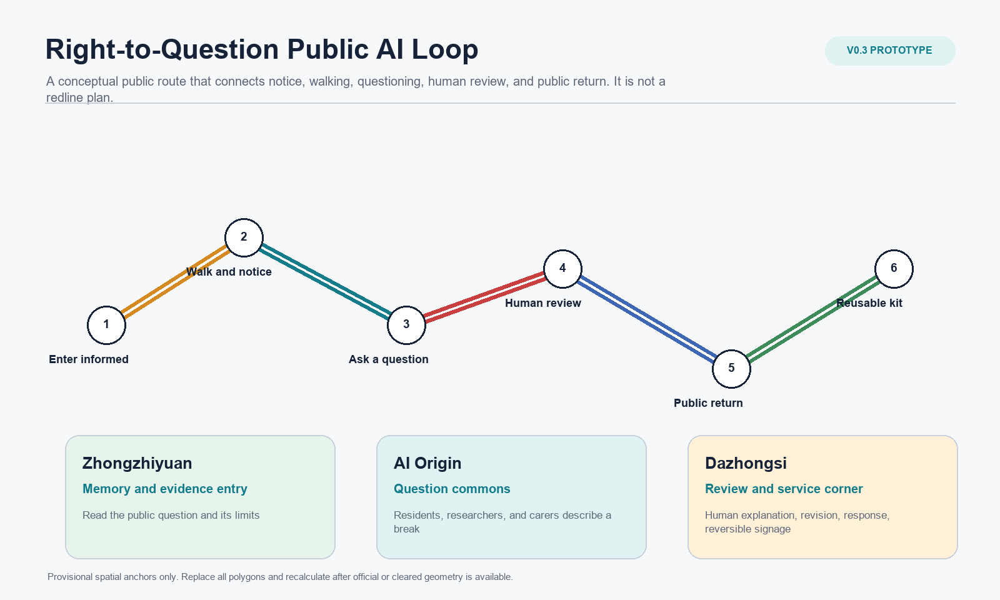
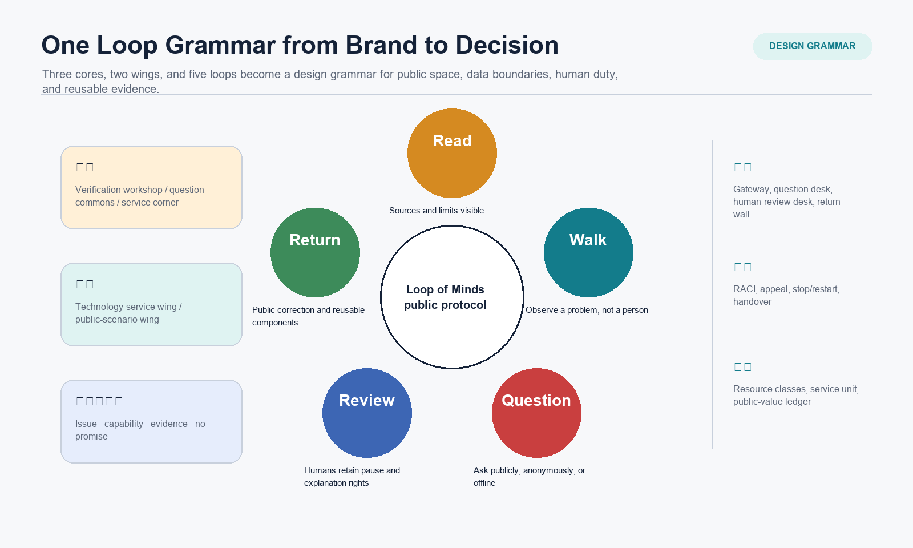
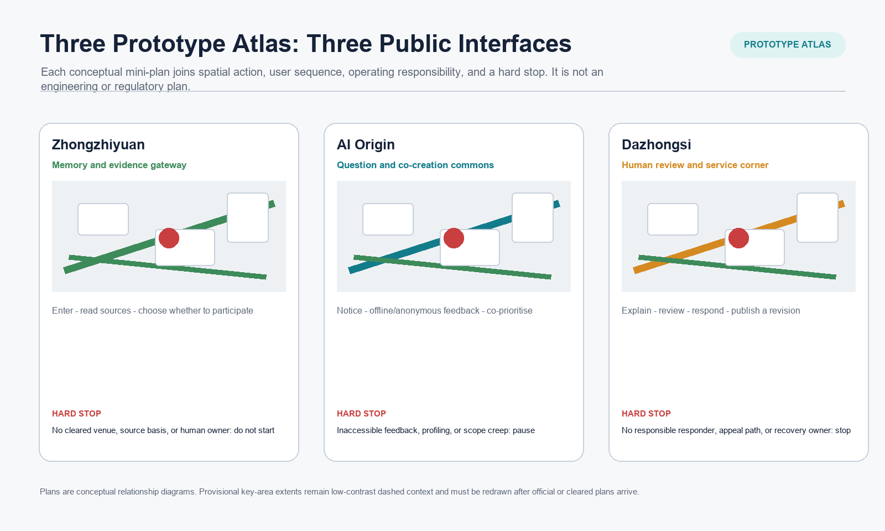
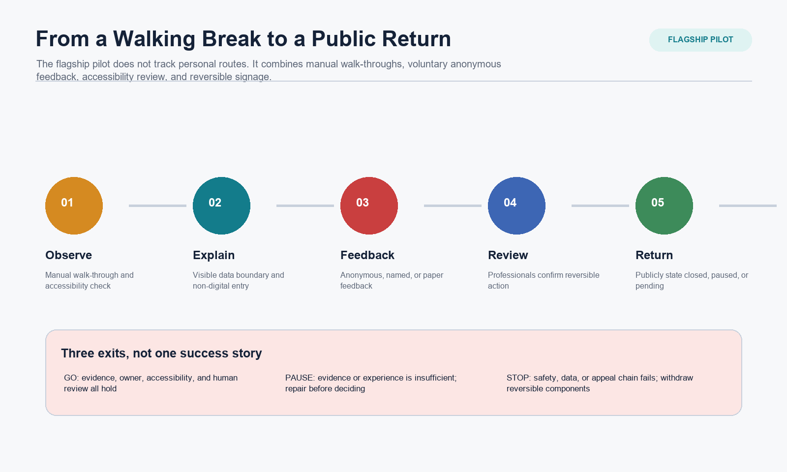
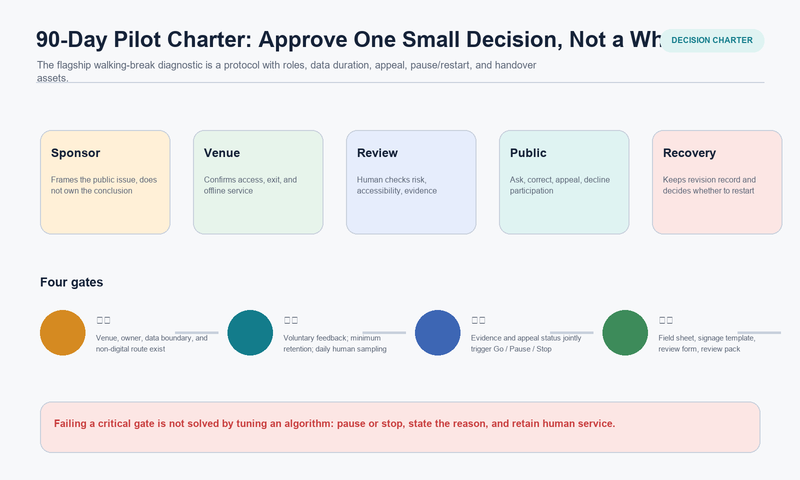
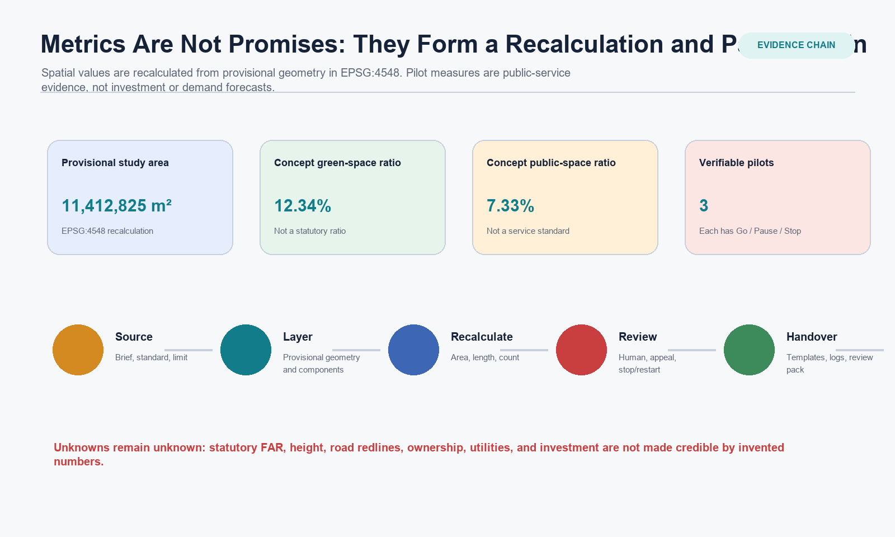

# Loop of Minds v0.3: Right-to-Question Public AI Loop

> Master Name: **Loop of Minds - Right-to-Question Public AI Loop**.
> This package is a conceptual public prototype and open research. It does not replace statutory planning, engineering, venue permission, government approval, investment commitments, partner agreements, or legal advice.

## Design Basis and Source List

v0.3 does not turn v0.2 into a thicker master-plan volume. It reduces the prior proposition to one decision that can be approved, refused, or reviewed: when a cleared venue, named owners, and human service are in place, should one reversible public-AI pilot be allowed to run? The package uses the announcement, taskbook, source registry, and processed fact pack to establish task and data limits. The provisional overall boundary and three key areas support generation, display, and intake self-check only; they are not official redlines, engineering alignments, or a precise-area basis.[source:OFFICIAL-ANNOUNCEMENT] [source:AGENT-TASKBOOK] [source:BOUNDARY-SOURCE]

The new `context_dossier.json` separates policy, data gaps, and a pre-pilot walk-through method. It does not claim that site observation has occurred, and it does not use an open map or generated image as a substitute for regulatory planning. The Interim Measures for Generative AI are used only for complaint/handling boundaries of public generative services; the Barrier-Free Environment Law is used only as a human-service reference in its expressly listed service contexts. Neither is a finding that a particular venue is compliant.[source:POLICY-GENAI-INTERIM] [source:POLICY-BARRIER-FREE] [depth:existing_conditions_diagnosis]

## Three-Level Scope Framework

The coordinated research area uses the announced approximately 43.6 km2 as a strategic scale for the relationship between Jing-Zhang culture, AI innovation, and public service. The overall design area uses the announced approximately 11.4 km2 as an urban-design scale. Zhongzhiyuan, the Beijing AI Origin Community, and Dazhongsi, together about 368.4 ha in the announcement, carry three different public interfaces. The three levels are not separate drawings; they form a continuous evidence chain: regional issue, readable space, operational pilot.[standard:PROJECT-OFFICIAL-ANNOUNCEMENT] [depth:three_level_scope_framework]

`SITE-001` and the three `PROV-KEY` features are `provisional_constraint` features. Current areas, nodes, and corridor values are EPSG:4548 recalculations from the same provisional geometry. When official or cleared polygons arrive, land use, buildings, roads, green space, public space, phasing, and all area metrics must be replaced and recalculated together.[data:geometry/site_boundary.geojson#SITE-001] [data:geometry/key_areas.geojson#PROV-KEY-001] [metric:site_area_sqm]

## Coordinated Research Area: Industry and Future City Research

The three positions remain explicit. The **Centennial Jing-Zhang Cultural Belt** makes historical evidence and public explanation accessible. The **Metropolitan AI Living Experience Belt** allows people to understand, question, decline, and receive human service. The **AI Integration and Innovation Belt** brings research, validation, transfer, and enterprise service back to publicly accountable review. The master name remains Loop of Minds. Its three cores are a verification workshop, question-and-co-creation commons, and human-review service corner; its two wings are a technology-service wing and public-scenario wing; its five loops are Read, Walk, Question, Review, and Return. These verbs determine spatial action, data boundary, human duty, and handover asset rather than serving only as a naming system.[source:AGENT-TASKBOOK] [depth:overall_spatial_structure]

Jing-Jin-Ji collaboration is expressed through an Issue - Reusable Capability - Activation Evidence - Explicit Non-Promise matrix. It can offer an interface for cross-regional research, developer collaboration, or public-service method reuse, but it assumes no existing funding, venue, partner, policy, or delivery date. It can activate only after an accountable owner, data boundary, venue condition, and independent review have been established.[source:AGENT-TASKBOOK] [data:geometry/roads.geojson#ROAD-001]

## Overall Design Area: Urban Renewal and Regulatory-Plan-Level Urban Design

The overall spatial strategy is not new bulk development; it makes the handling of a public issue visible. Five candidate functional bands - research, heritage green space, enterprise service, talent living, and cultural display - express a relationship only. Eleven conceptual building footprints express only three study actions: retain, renew, and light-touch new insertion. They do not establish statutory land use, FAR, height, retain/remove decisions, road redlines, fire conditions, or engineering capacity.[data:geometry/land_use.geojson#LU-001] [data:geometry/buildings.geojson#BLDG-001] [metric:building_count]

The public experience line is conceptual: a northern memory-and-evidence gateway states limits; a middle question-and-co-creation commons allows offline, anonymous, or named feedback; a southern human-review service corner explains, revises, and returns. It is a sequence of roles across key areas, not a precise route, traffic project, or existing-site alignment.[data:geometry/public_space.geojson#NODE-09] [data:geometry/public_space.geojson#NODE-07] [data:geometry/public_space.geojson#NODE-01]

## Detailed Design of Key Areas

| Key area | v0.3 conceptual mini-plan | Public experience | Human responsibility | Hard stop |
|---|---|---|---|---|
| Zhongzhiyuan AI Acceleration Area | Memory and evidence gateway | Read the question, sources, and participation boundary before entering validation. | Venue owner and evidence steward. | No cleared venue, source basis, or human owner: do not start. |
| Beijing AI Origin Community | Question and co-creation commons | Describe a break through observation, paper/offline/anonymous feedback, and co-prioritisation. | Public liaison and accessibility reviewer. | Inaccessible feedback, profiling, or scope creep: pause. |
| Dazhongsi AI Industry Cluster | Human-review service corner | Keep explanation, review, response, and revision in public view. | Service owner, appeal liaison, and recovery owner. | No response owner, appeal channel, or recovery owner: do not continue. |

These mini-plans express conceptual relationship, public components, and operating interface only. Key-area polygons remain provisional rough extents and cannot be read as site plans, parcel boundaries, or construction permission.[data:geometry/key_areas.geojson#PROV-KEY-001] [depth:three_key_area_detailed_design]

## AI Innovation Ecosystem, Personas, and AI+ Scenarios

The six international cases remain method observations only. They help identify living-lab, research-transfer, public-explanation, and service-interface methods; they do not evidence local investment, tenants, policy, spatial intensity, or adoption outcomes. The innovation ecosystem is written as eight independently checkable interfaces, and scenario opening is upgraded from an event title into an auditable protocol.[source:CASE-PDD-JTC] [source:CASE-KALASATAMA-FVH] [metric:global_case_count]

Five personas are not only users; they retain different powers. Residents and carers can request a non-digital route, correct an issue, and decline participation. Researchers can inspect material and failure limits. Startups cannot substitute a display for rights review. Service staff must explain who takes over. Visitors can give anonymous feedback and read revisions. Goals, pain points, spatial touchpoints, data boundaries, human fallback, and proposed response rules are recorded in `personas.json`.[metric:persona_count] [depth:municipal_new_infrastructure]

Ten scenario cards remain, but `scenario_operations.json` separates scenario, space, and operation and records human review, a non-AI alternative, data duration, and exit for each. The three industry pilots include a baseline, RACI, admission evidence, minimum data, retention/deletion, appeal, Go/Pause/Stop, recovery owner, evidence pack, and retirement condition. The walking-break diagnostic is v0.3's flagship. It does not track personal routes and only tests whether reversible signage and service organisation merit continuation.[metric:scenario_card_count] [metric:pilot_scenario_count] [data:geometry/public_space.geojson#NODE-03]

### Concept-visual use boundary

The following four images are contributor-supplied generative concept visuals for four public interfaces: a memory-and-evidence gateway, question-and-co-creation commons, a human-review service corner, and a walking/accessibility-break diagnostic. The declared tool, file hashes, prompt boundary, authorisation, and non-site disclosure are recorded in `concept-render-provenance.json`. They help a reviewer understand a public experience only. They are not evidence of existing conditions, site observation, official design, a built project, permits, accessibility compliance, or an implementation commitment.[source:USER-GPT-IMAGE-2-CONCEPT-RENDERS]

## Land Use, Building Scale, and Retain-Renovate-Demolish Strategy

Candidate land use and the building framework retain v0.2's replaceable conceptual layers, but no longer treat more buildings as progress. The eleven building footprints remain a conceptual count. They do not describe existing buildings, ownership, retention value, demolition, intensity, or construction cost. What is new is how each public interface may use existing or cleared space, when it must not continue, and how a site activity becomes a handover asset.[metric:building_footprint_area_sqm] [metric:floor_area_ratio] [depth:retain_renovate_demolish]

## Transport, Rail, Municipal Infrastructure, and Public Services

The flagship uses Observe - Explain - Feedback - Review - Return to organise walking and public service, rather than designing a road section or rail alignment. Manual walk-throughs, accessibility checks, paper feedback, public explanation boards, and a human service desk can precede any sensor or algorithm. A real road, station, traffic arrangement, utility capacity, or safety facility requires qualified teams, venue permission, and professional review.[data:geometry/roads.geojson#ROAD-001] [depth:traffic_rail_slow_parking]

Accessibility and age-friendly service are not a user-interface switch. The package cites the policy background for human service and non-digital channels only in appropriate service contexts and does not infer that any existing venue meets barrier-free, medical, social-security, financial, or living-payment requirements.[source:POLICY-BARRIER-FREE] [source:POLICY-ELDERLY-SMART]

## Blue-Green Network, Public Space, and Urban Character

Blue-green public space is the public substrate of the loop. A guidance gate explains source and exit; a walking-feedback seat lets a person pause and speak; a human-review-and-exit desk makes pause power visible; a contribution archive track keeps corrections and revisions; a verifiable exhibit label prevents technical capability from being asserted as fact. Three landmarks and six components have a purpose, condition, maintenance cycle, and removal condition. They are not construction details or approved facilities.[data:geometry/green_space.geojson#GREEN-001] [data:geometry/public_space.geojson#NODE-09] [metric:public_realm_component_count]

Jing-Zhang railway memory, Zhongguancun innovation culture, and an AI civic culture form a story from line to loop, display to explanation, and technology to public choice. Historical and heritage facts require professional confirmation. Generated material is conceptual explanation only and cannot replace historical fact, protection boundary, or architectural-value judgement.[standard:MOHURD-URBAN-DESIGN-MEASURES] [depth:blue_green_public_space]

## Renewal Projects, Implementation Policy, and Phasing

v0.3 proposes a 90-day, small-before-large reversible charter instead of approval for a whole city. Days 1-30 establish venue, owner, source/copyright registration, and baseline walk-through. Days 31-60 run three low-risk tests, each with human sampling and an exit rehearsal. Days 61-90 produce a public review pack; only components supported by evidence can enter another round. Any on-site pilot separately requires venue, safety, copyright, data, and professional conditions.[depth:phasing_implementation] [data:geometry/phasing.geojson#PHASE-001]

One decision-and-operations ledger separates sponsor, venue, reviewer, public, and recovery roles so that a model recommendation cannot bypass pause power or appeal. The public-value ledger does not claim GDP, attraction value, footfall, or fiscal savings. It records the role time, reversible materials, accessibility support, evidence management, and review work required for one service unit. Observable results include issue closure, non-digital access, public correction, reduced repeated survey, and reusable assets. Potential commissioning/operating parties are named by type only and are not partnership commitments.[depth:renewal_project_list] [metric:phase_count]

## Metrics, Area Recalculation, and Compliance Matrix

Metrics have two kinds. Provisional spatial metrics are EPSG:4548 recalculations from one geometry and must change with official/cleared polygons. Pilot metrics come from verifiable ledger records and cannot be filled in advance as economic benefit. Statutory FAR, height, road redline, ownership, utilities, fire, investment, and delivery time remain unknown or pending. Unlabelled numbers do not make them real.[metric:site_area_sqm] [metric:green_ratio] [metric:public_space_ratio]

`compliance_matrix.json`, `standard_matrix.json`, and `design_depth_matrix.json` link announcement/agent tasks, professional basis, and deliverable depth to narrative, layers, metrics, booklets, reader, and structured ledgers. v0.3 adds a prototype atlas, context dossier, regional interface, decision ledger, and public-value model so human review can locate one discussable action instead of only a complete number of cards.[standard:PROJECT-AGENT-OPEN-CALL-TASKBOOK] [depth:metrics_recalculation]

## Risk, Copyright, and Compliance

The first risk remains data boundary. Without official/cleared geometry, all extents, relationships, and values are provisional discussion only. The second risk is site condition. Without a venue owner, permission, transport/fire/utility/heritage material, and independent professional judgement, no on-site pilot begins. The third risk is AI governance: public feedback must not become profiling; model outputs must not directly decide administrative, engineering, employment, or rights outcomes; human service, appeal, and stop remain available. The fourth risk is economic misunderstanding: service units, resource classes, and commissioning types are a verification framework, not a quotation, investment, or revenue forecast.[source:SOURCE-REGISTRY] [source:POLICY-GENAI-INTERIM] [depth:risk_missing_data]

All text, diagrams, structured data, HTML, and PDFs are generated by the submission author's AI agent within the package's registered public/cleared boundary. The visual reader loads no remote image, map tile, script, font service, iframe, form, or tracking code. External cases are method observations only; no uncleared image, logo, portrait, or site photograph is used.

## References

Core basis: the announcement, taskbook, site package, source registry, processed fact pack, provisional-boundary notes, accessible local standards, the Interim Measures for Generative AI Services, the Barrier-Free Environment Law, and the plan addressing older people's difficulties using smart technologies. `sources.json` retains access dates, use limits, and snapshot status for external cases. None substitutes for local spatial, ownership, investment, policy, or implementation facts.

Source index:

- [source:SITE-PACKAGE]
- [source:SOURCE-REGISTRY]
- [source:PROCESSED-FACT-PACK]
- [source:OFFICIAL-ANNOUNCEMENT]
- [source:AGENT-TASKBOOK]
- [source:BOUNDARY-SOURCE]
- [source:KEY-AREA-SOURCE]
- [source:POLICY-GENAI-INTERIM]
- [source:POLICY-BARRIER-FREE]
- [source:POLICY-ELDERLY-SMART]
