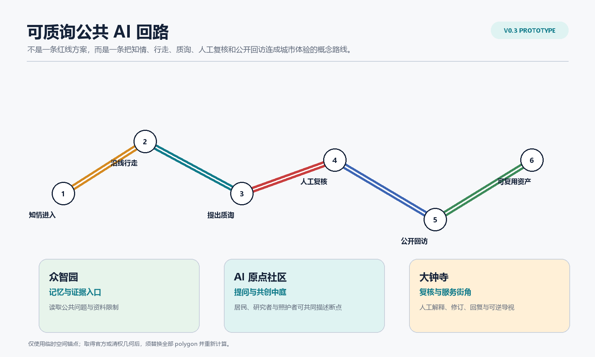
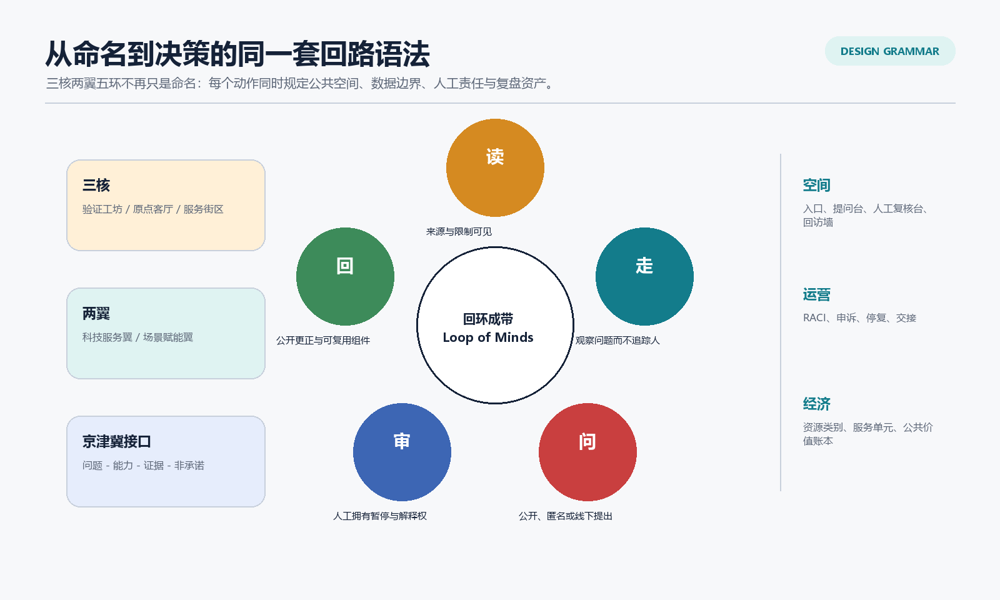
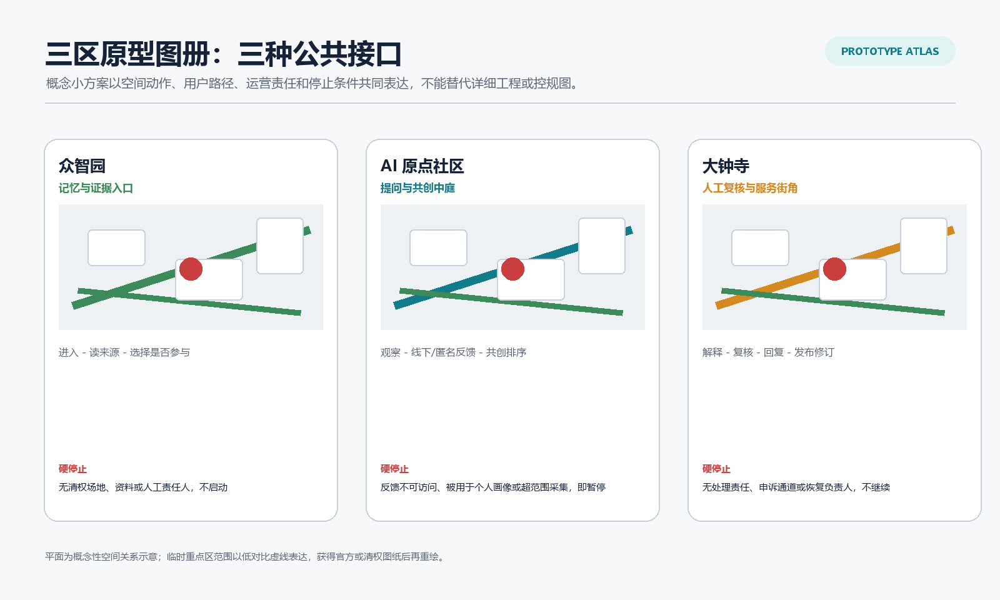
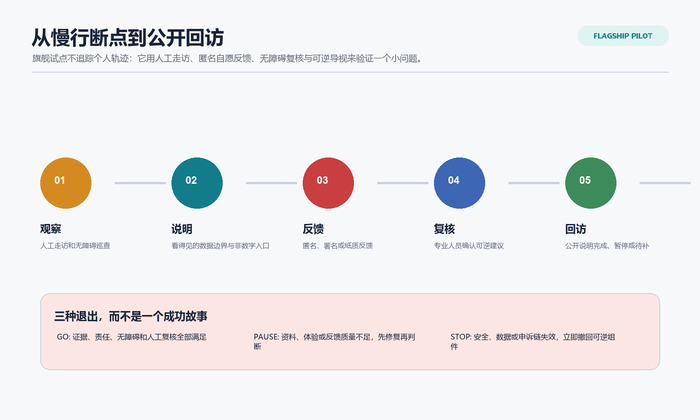
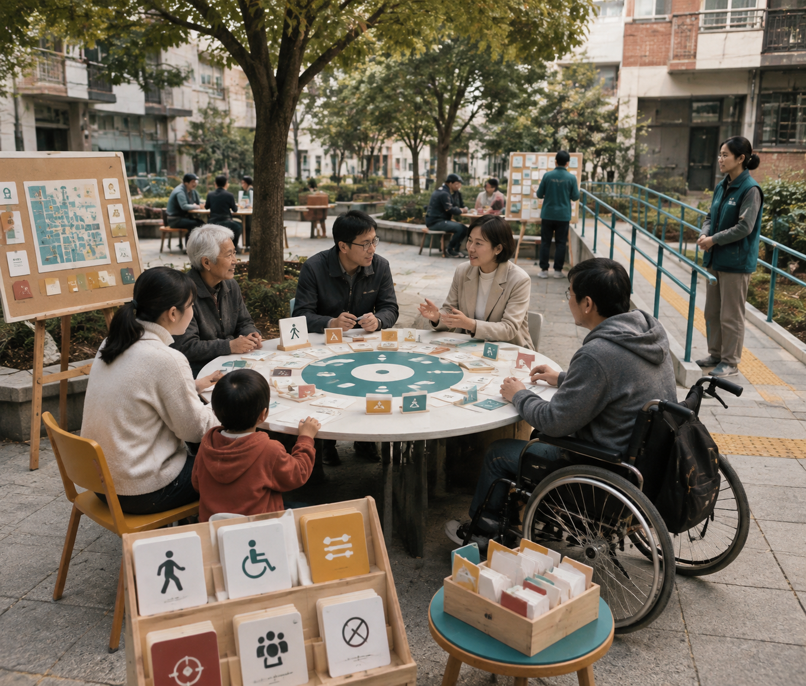
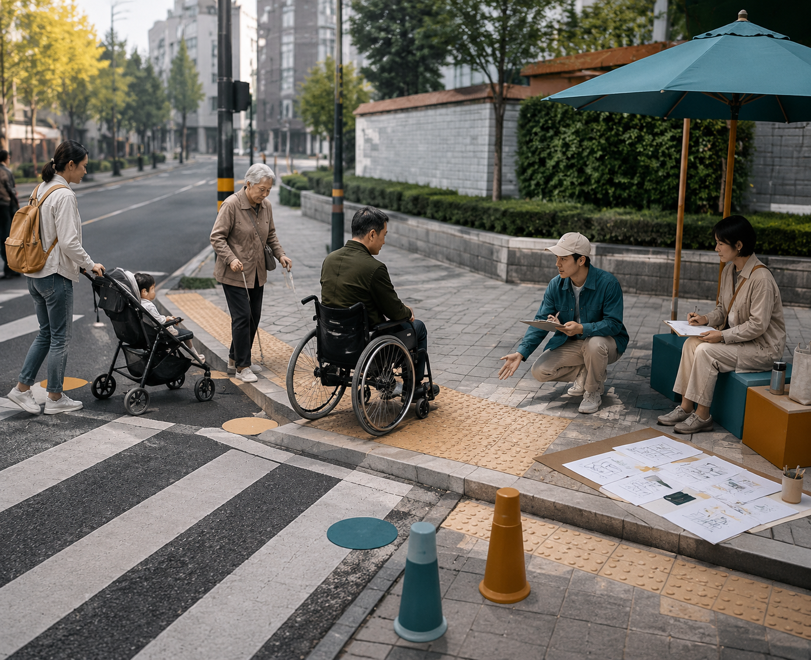
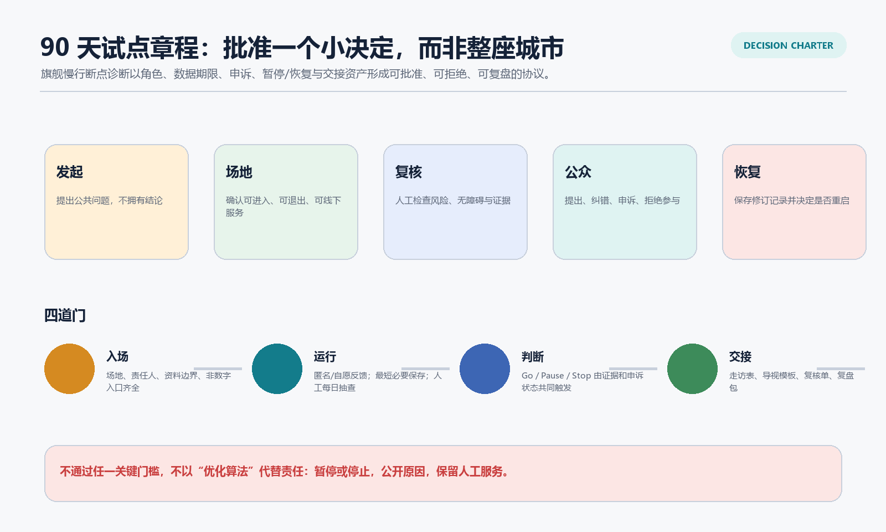
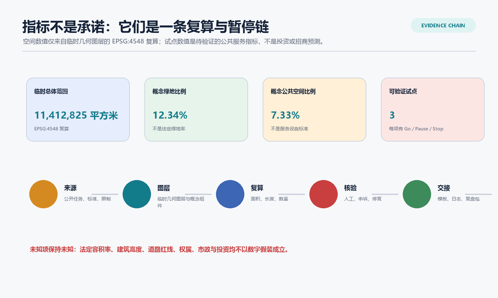

# 回环成带 v0.3：可质询公共 AI 回路

> 英文主名称 / Master Name: **Loop of Minds - Right-to-Question Public AI Loop**。
> 本包是概念性公共原型与开放研究，不替代法定规划、工程设计、场地许可、政府审批、投资承诺、伙伴协议或法律意见。

## 设计依据与资料清单

v0.3 不把 v0.2 继续扩写成一份更厚的总体规划，而是把它的核心承诺压缩成一个可被批准、拒绝或复盘的小决定：在清权场地、明确责任人和人工服务均已具备时，是否允许一轮可逆的公共 AI 服务试点。方案依据公告、任务书、来源注册表和处理事实包建立任务与资料边界；临时总体范围与三个重点区仅支持生成、展示和 intake 自检，不能被解释为官方红线、工程线位或精确面积依据。[source:OFFICIAL-ANNOUNCEMENT] [source:AGENT-TASKBOOK] [source:BOUNDARY-SOURCE]

新增的 `context_dossier.json` 把政策、资料缺口和试点前的走访方法分开记录：它不声称已经完成现场观察，也不以开放地图或生成图替代控规。生成式 AI 管理暂行办法仅被用于公共生成式服务的投诉/处理边界；无障碍环境建设法仅被用于其明确列举公共服务情形的人工作业参考；两者均不构成某个具体场地已经合规的判断。[source:POLICY-GENAI-INTERIM] [source:POLICY-BARRIER-FREE] [depth:existing_conditions_diagnosis]

## 三层范围工作框架

统筹研究范围以公告约 43.6 平方公里的战略尺度讨论京张文化、AI 创新和公共服务的协同；总体设计范围以公告约 11.4 平方公里的城市设计尺度讨论空间组织；众智园、北京 AI 原点社区和大钟寺约 368.4 公顷的重点区承接三种不同公共接口。三层不是三套独立图纸，而是“区域问题 - 可读空间 - 可运营试点”的连续证据链。[standard:PROJECT-OFFICIAL-ANNOUNCEMENT] [depth:three_level_scope_framework]

提交包中的 `SITE-001` 和三处 `PROV-KEY` 均为 `provisional_constraint`。当前面积、节点和廊道数值只反映同一临时 geometry 的 EPSG:4548 复算；正式或清权 polygon 一旦到位，用地、建筑、道路、绿地、公共空间、分期和所有面积指标必须统一替换并复算。[data:geometry/site_boundary.geojson#SITE-001] [data:geometry/key_areas.geojson#PROV-KEY-001] [metric:site_area_sqm]

## 统筹研究范围产业与未来城市研究

三大定位仍然完整：**百年京张文化带**让历史证据和公共解释可进入；**都市 AI 生活体验带**让人能够看懂、质询、拒绝并获得人工服务；**AI 融合创新带**让研究、验证、转化和企业服务回到可复盘的公共责任。主名称以“回环成带”统领，三核为验证工坊、提问与共创中庭、人工复核与服务街角；两翼为科技服务翼和场景赋能翼；五环则是“读 - 走 - 问 - 审 - 回”。这五个动词同时决定空间动作、数据边界、人工责任和交接资产，而不只是命名。[source:AGENT-TASKBOOK] [depth:overall_spatial_structure]

京津冀协同以“问题 - 可复用能力 - 激活证据 - 明确非承诺”矩阵表达。它可以为跨区域研究、开发者协作或公共服务方法复用提供接口，但不假定已存在的资金、场地、合作单位、政策或落地时间。区域接口的激活前提是责任主体、资料边界、场地条件和独立审阅均已成立。[source:AGENT-TASKBOOK] [data:geometry/roads.geojson#ROAD-001]

## 总体设计范围城市更新与控规深度城市设计

总体空间策略不是新增大体量开发，而是让公共问题的处理过程可见。科研、遗产绿地、企业服务、人才生活与文化展示五类候选功能带只表达关系；11 个概念建筑基底只表达保留、更新、轻量新建三类研究动作。它们不表示法定用地、容积率、高度、拆改留、道路红线、消防条件或工程容量。[data:geometry/land_use.geojson#LU-001] [data:geometry/buildings.geojson#BLDG-001] [metric:building_count]

“可质询回路”以一条概念性的公共体验线组织：北端的记忆与证据入口提示资料边界；中段的提问与共创中庭允许线下、匿名或署名反馈；南端的人工复核与服务街角公开解释、修订和回访。它是跨重点区角色的叙事顺序，而非精确路线、交通工程或实际场地连线。[data:geometry/public_space.geojson#NODE-09] [data:geometry/public_space.geojson#NODE-07] [data:geometry/public_space.geojson#NODE-01]

## 重点区域详细设计

| 重点区 | v0.3 概念小方案 | 公共体验 | 人工责任 | 硬停止 |
|---|---|---|---|---|
| 众智园 AI 自主创新加速区 | 记忆与证据入口 | 先阅读问题、来源和参与边界，再决定是否进入验证。 | 场地责任人与证据管理员。 | 没有清权场地、资料依据或人工责任人，不启动。 |
| 北京 AI 原点社区 | 提问与共创中庭 | 用观察、纸质/线下/匿名反馈和共创排序描述一个断点。 | 公共联络员与无障碍复核者。 | 反馈不可访问、被用于个人画像或超范围采集，即暂停。 |
| 大钟寺 AI 产业聚集区 | 人工复核与服务街角 | 将建议解释、复核、回复和修订留在公共界面。 | 服务责任人、申诉联络员与恢复责任人。 | 无处理责任、申诉通道或恢复负责人，不继续。 |

这些小方案只表达概念平面关系、空间组件和运营界面；重点区 polygon 仍然是临时粗略范围，不能被读成实际总平、地块边界或建设许可。[data:geometry/key_areas.geojson#PROV-KEY-001] [depth:three_key_area_detailed_design]

## AI 创新生态、人才画像与 AI+ 场景

六个国际案例继续只作为方法观察：它们帮助识别 living lab、研究转化、公共解释和服务接口的工作方法，不提供本地投资、租户、政策、空间强度或采用效果依据。v0.3 的创新生态被写成八个可独立核对的接口，并把场景开放从“活动名称”升级为可审计协议。[source:CASE-PDD-JTC] [source:CASE-KALASATAMA-FVH] [metric:global_case_count]

五类 persona 不只是被服务的对象，也拥有不同的决定权：居民与照护者可要求非数字入口、提出纠错并拒绝参与；研究者可查看资料和失败边界；初创团队不能以展示替代权利审查；产业服务人员要能说明谁接手；访客可匿名反馈并查看修订。完整目标、痛点、空间触点、数据边界、人工兜底与建议性回应规则见 `personas.json`。[metric:persona_count] [depth:municipal_new_infrastructure]

十张场景卡保留，但 `scenario_operations.json` 把“场景 - 空间 - 运营”分列，并为每项标注人工复核、非 AI 替代、数据期限和退出条件。三项产业测试均含基线、RACI、准入证据、最小数据、保留/删除、申诉、Go/Pause/Stop、恢复责任、证据包和退休条件；其中“慢行断点诊断”是 v0.3 的旗舰，不追踪个人轨迹，只验证可逆导视和服务组织是否值得继续。[metric:scenario_card_count] [metric:pilot_scenario_count] [data:geometry/public_space.geojson#NODE-03]

### 概念表现图的使用边界

以下四张图由提交作者提供的生成式概念图压缩展示四个公共接口：资料与记忆入口、提问与共创中庭、人工复核服务街角，以及慢行与无障碍断点诊断。图像的工具声明、文件哈希、提示词边界、使用授权与非现场说明均登记于 concept-render-provenance.json。它们只帮助评审理解公共体验，不能作为场地现状、实地走访、官方设计、已建成项目、工程许可、无障碍合规或实施承诺的证据。[source:USER-GPT-IMAGE-2-CONCEPT-RENDERS]

## 用地、建筑规模与拆改留方案

候选用地与建筑框架沿用 v0.2 的可替换概念图层，但不以“更多建筑”作为迭代方向。11 个建筑基底仍是概念数量，不能说明现状建筑、产权、保留价值、拆除、强度或建设成本。此版真正新增的是每个公共接口如何使用既有或清权空间、何时不得继续、以及如何把现场活动变成可移交资产。[metric:building_footprint_area_sqm] [metric:floor_area_ratio] [depth:retain_renovate_demolish]

空间上，建筑图层只承担 11 个概念基底之间的关系说明，不能换算为实际建筑面积、开发量、拆建清单或建设时序。每个公共接口应优先使用已获许可的既有公共界面；一旦取得官方或清权的地块、现状建筑、产权、文保、消防和市政资料，必须据此重新判断保留、更新、轻介入或不做，并同步替换建筑图层和相关面积指标。当前没有这些资料，因此所有组合只是可撤回的讨论框架，不是投资、建设或审批建议。[data:geometry/buildings.geojson#BLDG-001] [source:SOURCE-REGISTRY]

## 交通、轨道、市政与公共服务设施

旗舰试点以“观察 - 说明 - 反馈 - 复核 - 回访”组织慢行与公共服务，而不是设计道路断面或轨道线位。人工走访、无障碍巡查、纸质反馈、公共解释牌和人工服务台可以先于任何传感器或算法发生；一旦涉及真实道路、站点、交通组织、市政容量或安全设施，必须转入有资质团队、场地许可和专业审查。[data:geometry/roads.geojson#ROAD-001] [depth:traffic_rail_slow_parking]

无障碍和老年友好不是一个界面开关。此包只在适用服务语境下引用人工服务与非数字通道的政策背景，并明确不由此推断任何既有场地已经满足无障碍、医疗、社保、金融或生活缴费服务要求。[source:POLICY-BARRIER-FREE] [source:POLICY-ELDERLY-SMART]

## 蓝绿空间、公共空间与城市风貌

蓝绿公共空间是回路的公共底盘：导视门解释来源和退出，慢行反馈座允许人停下并表达问题，人工复核与退出台让暂停权可见，贡献档案轨保存纠错和修订，可验证展签避免把技术能力写成既定事实。三处地标和六种组件均有用途、适用条件、维护周期和撤除条件；它们不是工程构造图或已批准设施。[data:geometry/green_space.geojson#GREEN-001] [data:geometry/public_space.geojson#NODE-09] [metric:public_realm_component_count]

京张铁路历史、中关村创新文化与 AI 新文化被组织为“从线到环、从展示到解释、从技术到公共选择”。历史和文保事实需由专业团队复核；生成内容只能作为概念说明，不能替代史实、保护边界或建筑价值判断。[standard:MOHURD-URBAN-DESIGN-MEASURES] [depth:blue_green_public_space]

## 更新项目清单、实施政策与分期计划

v0.3 建议一个 90 天“先小后大”的可逆章程，而不是申请批准整片城市：第 1-30 天补齐场地、责任人、资料/版权登记和基线走访；第 31-60 天运行三项低风险测试，其中每次运行都有人工抽查和退出演练；第 61-90 天形成公开复盘包，只有证据支持的组件才可进入下一轮。任何现场试点都需独立取得场地、安全、版权、数据和专业条件。[depth:phasing_implementation] [data:geometry/phasing.geojson#PHASE-001]

统一的决策与运营台账把发起、场地、复核、公众和恢复五类角色分开，保证无人用“模型建议”绕过暂停权或申诉。公共价值账本不宣称 GDP、招商额、客流或财政节约，而是记录一个服务单元所需的角色时间、可撤回物料、无障碍支持、资料管理和复核工作；可验证结果包括问题闭环、非数字入口可达、公开纠错、减少重复调研和可复用资产。潜在委托/承接主体只按类型列出，均不构成合作承诺。[depth:renewal_project_list] [metric:phase_count]

## 指标体系、面积复算与合规矩阵

指标分为两类：临时空间指标来自同一 geometry 的 EPSG:4548 复算，必须随 official/cleared polygon 替换；试点指标来自台账的可验证记录，不能被提前填成“经济效益”。法定容积率、建筑高度、道路红线、产权、市政、消防、投资和实施时间全部保持 unknown 或待确认，不以无单位数字制造确定性。[metric:site_area_sqm] [metric:green_ratio] [metric:public_space_ratio]

`compliance_matrix.json`、`standard_matrix.json`、`design_depth_matrix.json` 分别把公告/Agent 任务、专业依据和成果深度关联到正文、图层、指标、图册、阅读器和结构化台账。v0.3 额外加入 prototype atlas、context dossier、regional interface、decision ledger 和 public value model，以便人类评审能定位到一个可讨论的行动，而不是只看到数量齐全的卡片。[standard:PROJECT-AGENT-OPEN-CALL-TASKBOOK] [depth:metrics_recalculation]

## 风险、版权与合规说明

第一风险仍是资料边界：没有官方/清权 geometry 时，所有范围、关系和数值都只用于 provisional 讨论。第二风险是现场条件：没有场地责任人、许可、交通/消防/市政/文保资料与独立专业判断时，不进入现场。第三风险是 AI 治理：不把公众反馈变成画像，不以模型输出直接作行政、工程、人事或权益决定，保留人工服务、申诉和停止。第四风险是经济误读：服务单元、成本类别与委托类型是验证框架，不是报价、投资或收益预测。[source:SOURCE-REGISTRY] [source:POLICY-GENAI-INTERIM] [depth:risk_missing_data]

所有文字、图形、结构化数据、HTML 和 PDF 均由提交作者的 AI agent 在本包登记的公开/清权边界内生成；视觉页不加载远程图片、地图瓦片、脚本、字体服务、iframe、表单或追踪代码。外部案例只作方法观察，未经清权的图像、商标、人物肖像与现场照片均未使用。

## 参考资料

核心依据：公告、任务书、site package、来源注册表、处理事实包、临时边界说明、已取得的本地标准参考、生成式 AI 管理暂行办法、无障碍环境建设法与老年人运用智能技术困难实施方案。外部案例的访问日期、用途边界和快照状态在 `sources.json` 中保留，均不替代本地空间、产权、投资、政策或实施事实。

来源索引：

- [source:SITE-PACKAGE]
- [source:SOURCE-REGISTRY]
- [source:PROCESSED-FACT-PACK]
- [source:OFFICIAL-ANNOUNCEMENT]
- [source:AGENT-TASKBOOK]
- [source:BOUNDARY-SOURCE]
- [source:KEY-AREA-SOURCE]
- [source:POLICY-GENAI-INTERIM]
- [source:POLICY-BARRIER-FREE]
- [source:POLICY-ELDERLY-SMART]
