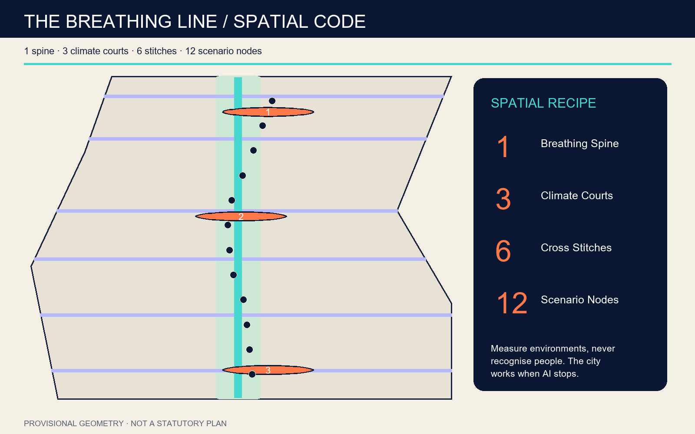
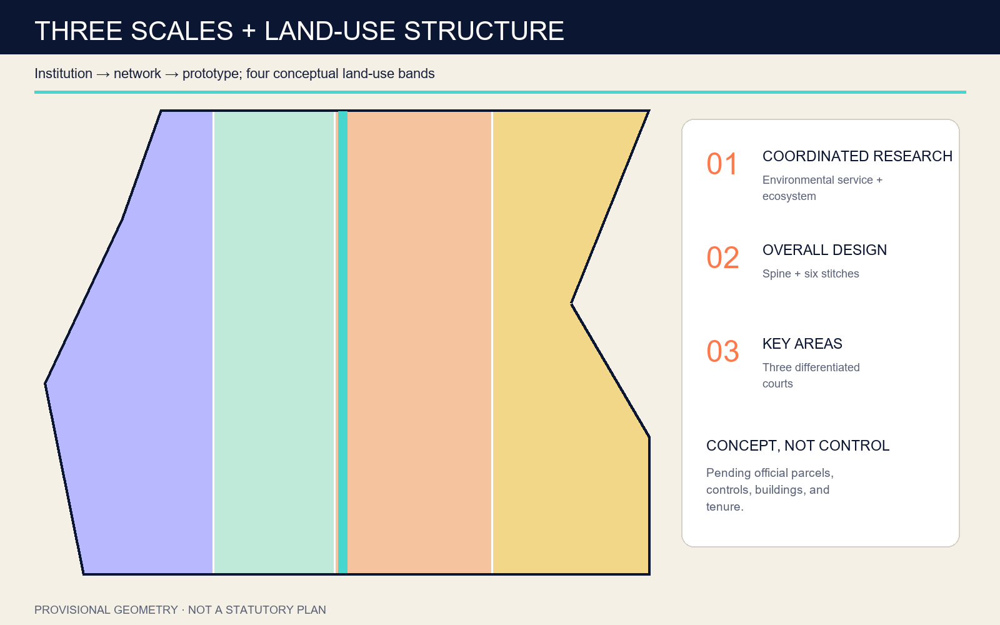
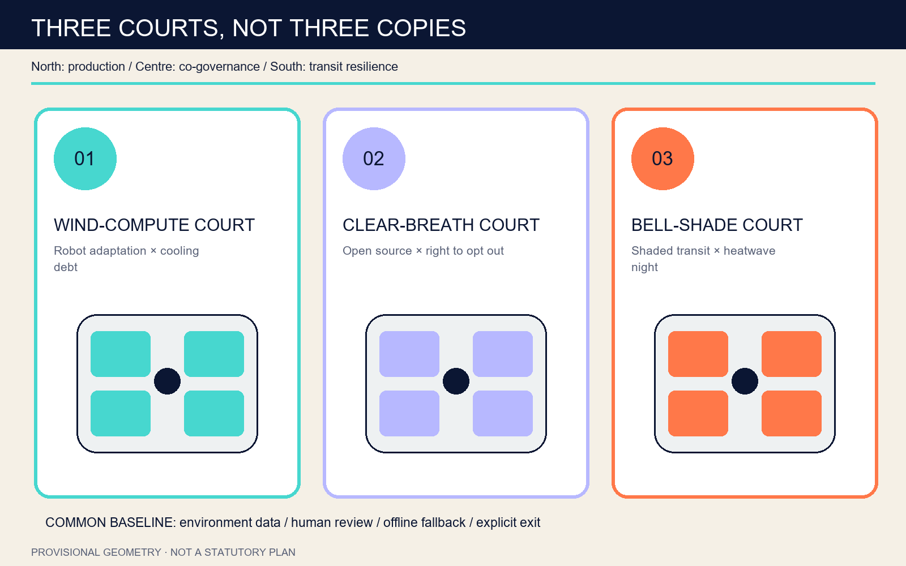
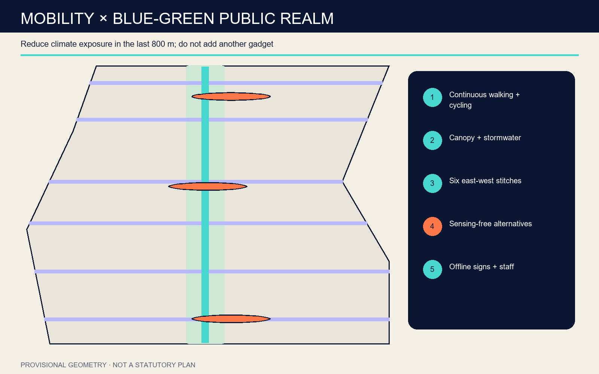
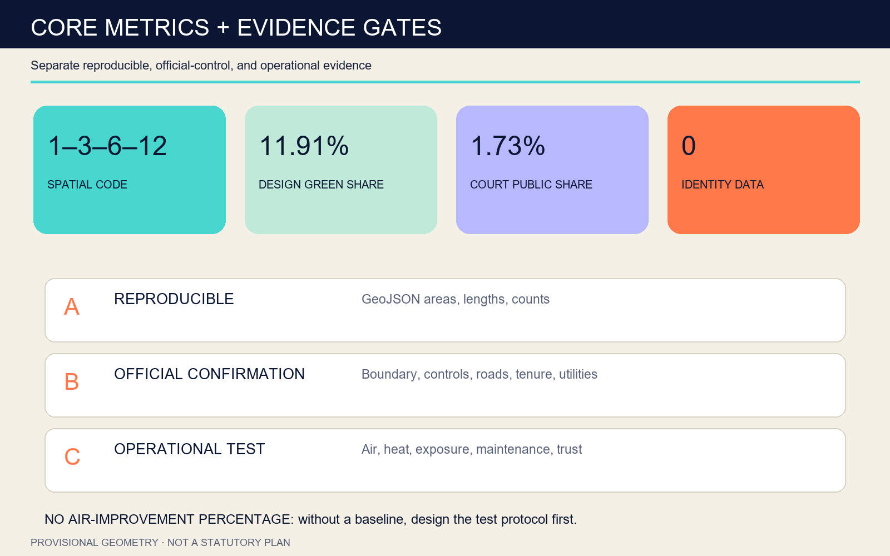

# THE BREATHING LINE

> A breathable, optional, and auditable public baseline for AI innovation. Spatial code: **1 spine / 3 courts / 6 stitches / 12 nodes**.

## Design Basis and Source List

The proposal separates four evidence levels: the official announcement, the agent taskbook, the repository source registry, and provisional geometry. The announcement defines the three scales, key-area tasks, and professional deliverables. The taskbook defines scenarios, identity, operations, and bilingual expression. The registry limits how each file may be used. Provisional polygons support generation and review only. The operating rule is simple: establish a public spatial baseline before adding smart services, and disclose evidence status before claiming performance. [source:OFFICIAL-ANNOUNCEMENT] [standard:PROJECT-OFFICIAL-ANNOUNCEMENT]

SITE-001 and all three PROV-KEY polygons are rough envelopes. Repository issue #846 reports that the provisional overall polygon does not intersect the OSM-mapped heritage-park object and is about 412.5 metres away at its nearest point. Issue #1029 reports that the provisional Dazhongsi anchor may be roughly 2.26 kilometres from the named station. These conflicts are not hidden. When authoritative polygons arrive, geometry, ratios, station relationships, and the southern prototype must all be recalculated.

Six official ecosystem pages provide mechanisms, not transferred controls: one-north for work-live-play-learn and living labs; Barcelona 22@ for long-cycle regeneration; Kendall Square for a research cluster with a civic interface; Mila for collaborative AI infrastructure; Vector for institute-industry-talent connections; and the ETH AI Center for interdisciplinary community. No external image, map tile, logo, or remote asset is used.

## Three-Level Scope Framework

The coordinated research area asks how air, compute, talent, and public life can form one innovation ecosystem. The overall design area asks how a provisional 11.4-square-kilometre envelope can support a continuous public route that remains walkable, measurable, and closable by accountable operators. The key areas test three distinct relationships between AI and urban life. These scales form a causal chain from institution to network to prototype. [depth:three_level_scope_framework] [data:geometry/site_boundary.geojson#SITE-001]

The spatial code is 1-3-6-12: one north-south Breathing Spine, three Climate Testing Courtyards, six east-west cross-ventilation stitches, and twelve auditable scenario nodes. The spine combines shade, water management, walking, cycling, and offline wayfinding. The stitches repair east-west access. The courtyards separate production, community, and transit tests. The nodes measure environmental conditions rather than identities.

At the strategic scale, an Environmental Service Level protocol governs public AI. At the overall scale, continuity and civic baselines are protected. At the key-area scale, operators test privacy, maintenance, and fallback. A service must declare its location, measurement scope, minimisation rule, human review, shutdown method, and compute cooling debt before entering shared space. The city continues to work if every algorithm stops.

## Coordinated Research Area: Industry and Future City Research

The district does not treat the number of devices as a proxy for innovation. Its competitive proposition is sustained research and enterprise activity within a better, more accountable public environment. The northern segment tests full-stack autonomy and robot adaptation. The central segment tests open-source collaboration and resident governance. The southern segment tests transit, commerce, and international exchange under heat, crowding, and air-quality variability. [source:AGENT-TASKBOOK] [depth:overall_spatial_structure]

Four open interfaces support the ecosystem. An Environmental Baseline Commons publishes aggregated data dictionaries. A Cooling-Debt Ledger discloses electricity, cooling, water, waste heat, and equipment space for compute-intensive demonstrations. An Urban Test Permit records time, place, risk, operator, and exit condition. An annual Wind-Score Open Week invites residents, researchers, and visitors to review results and failures. Faces, phone identifiers, Wi-Fi probes, and individual traces are prohibited.

The identity system uses a rail line passing through two open parentheses, read as lungs and as dialogue. The Chinese name is Jingzhang Breathing Line; the English name is THE BREATHING LINE. Deep indigo identifies durable structure, air cyan identifies public service, orange identifies risk and manual intervention, and paper white carries evidence. Railway heritage is translated through engineering connection, public verification, and long-term maintenance rather than copied historic motifs.

## Overall Design Area: Urban Renewal and Regulatory-Plan-Level Urban Design

The overall structure couples a longitudinal public spine with six transverse stitches. The spine is a slow-mobility, blue-green, and environmental-service corridor. The stitches reconnect research, residential, industrial, and transit-facing edges. Three courtyards enlarge the network at selected points but do not substitute for everyday public-space provision. Four conceptual land-use bands organise audited R&D, breathing open space, low-carbon industry services, and community care. [data:geometry/land_use.geojson#LU-001] [depth:land_use_layout]

Renewal follows a minimum-irreversibility rule. Shade, seating, drainage, wayfinding, crossings, and movable sensors come first. One year of baseline evidence must precede permanent surfaces or structures. The proposed two-storey pavilions are demountable prototypes. With no verified building inventory, tenure map, or structural survey, the package names no demolition object and does not extrapolate prototype footprints into a total development scale.

Three safeguards govern the public realm. A continuous route may not depend on platform availability. Every sensing node must offer a clearly marked non-sensing alternative within a short walk. Each courtyard must provide mechanical information boards and staffed review hours. Road, fire, utility, heritage, and rail conditions must be confirmed by professional teams before conceptual lines become statutory or engineered interfaces.

## Detailed Design of Key Areas

The three key areas are not copies of an AI showroom. Northern Zhongzhiyuan receives the Wind-Compute Court, where reversible pavilions frame robot and edge-model tests and publish wind, heat, noise, energy, and cooling prerequisites. The central AI Origin Community receives the Clear-Breath Court, where open-source exchange, neighbourhood services, accessible microclimate navigation, and sensing-free pockets share one daily loop. [data:geometry/key_areas.geojson#PROV-KEY-001] [depth:three_key_area_detailed_design]

Southern Dazhongsi receives the Bell-Shade Court for interchange, commerce, night workers, and international visitors. Its themes are shaded waiting, four-quadrant pedestrian connection, heatwave night travel, and the annual open week. Because the provisional anchor may be misplaced, the drawing presents a spatial grammar, not a verified station plan. Authoritative station and boundary data must trigger relocation before any detailed claim.

All courts share four reviews: all-weather usability, environment-only data, human and offline fallback, and named maintenance and complaint responsibility. Their roles remain different: production validation in the north, co-governed daily life in the centre, and transit-commercial resilience in the south. Four reversible climate pavilions in each court are test modules whose retention, modification, or removal depends on evidence.

## AI Innovation Ecosystem, Personas, and AI+ Scenarios

Six personas guide service design: startup and robotics teams needing transparent test conditions; university researchers needing open collaboration and transfer support; neighbouring residents needing low-friction daily services; older adults, children, and disabled people needing shade, accessibility, and a right to opt out; commuters and night workers needing reliable interchange; and international visitors needing a legible account of Jingzhang history and current AI practice. Personas describe needs, never individual profiles. [data:geometry/constraints.geojson#SCENARIO-01] [metric:scenario_node_count]

The twelve scenario cards are Wind Score Zero, Shade Router, Accessible Microclimate Navigation, Compute Cooling-Debt Ledger, Air Data Attestation Desk, Sensing-Free Pocket, Heatwave Night Walk, Post-Rain Mobility Recovery, Community Breathing Class, Robot Climate Adaptation Field, Bell-Shade Transit Hall, and Annual Wind-Score Open Week. Four are explicit industry tests. Every card records its space, aggregated environmental data, prohibited data, human review, offline substitute, operator, and stop condition.

The common rule is “measure environments, never recognise people.” Temperature, humidity, wind, particulate matter, noise, and anonymous facility state may be aggregated at the edge. Faces, device identifiers, Wi-Fi probes, individual trajectories, and unconsented profiling are banned. Algorithms may suggest shaded routes or maintenance priorities but cannot replace planning approval, traffic control, or medical judgement. Equivalent sensing-free space protects privacy without withdrawing public service.

## Land Use, Building Scale, and Retain-Renovate-Demolish Strategy

The four land-use bands are conceptual: research and testing to one side, the breathing corridor at the centre, low-carbon industry services opposite, and community care embedded along the edges. Codes follow repository enums for machine validation, but areas depend on the provisional boundary and are not land-supply or development-intensity controls. Each spine segment should combine at least three functions among movement, shade, water, everyday staying, and environmental information. [standard:MNR-LAND-USE-CLASSIFICATION-GUIDE] [metric:building_footprint_area_sqm]

Buildings follow a retain-renovate-demolish-add sequence. Heritage, structure, tenure, and users are verified first. Ground-floor opening, shading, ventilation, and shared facilities are preferred to replacement. Demolition is considered only after safety or connectivity evidence and consultation. New construction begins with reversible pavilions. The twelve two-storey modules express scale and operations only, not a final count, floor number, or location.

Urban character avoids a generic futuristic shell. Restrained railway engineering, visible joints, and durable materials are combined with parenthesis-shaped shade frames. Orange identifies risk and manual control. Heights, skylines, rooftop equipment, fire spacing, and sunlight remain professional-review items. No existing building may be labelled for retention, renovation, or demolition until authoritative mapping, site survey, and stakeholder negotiation are complete.

## Transport, Rail, Municipal Infrastructure, and Public Services

Mobility design addresses the last 800 metres of climate exposure rather than proposing another high-technology vehicle. The spine supports walking and cycling; six stitches connect side districts and transit directions. Shade routing operates only among lawful routes and never sends users through closed parcels. Missing station, signal, crossing, and road-redline data mean the stitches are connectivity intentions, not approved streets. [data:geometry/roads.geojson#ROAD-001] [depth:traffic_rail_slow_parking]

Municipal strategy makes the environmental cost of AI visible. Every compute or robotics test must disclose peak electricity, cooling, water, waste heat, noise, equipment area, and exit arrangements. A project unable to disclose these prerequisites cannot enter a public testing courtyard. Edge aggregation and intermittent sampling reduce network and energy use. Post-rain recovery combines drainage inspection and manual closure; algorithms only help prioritise work.

Public services include staffed help, drinking water, accessible toilets, movable seating, first aid, charging, and offline wayfinding. Each courtyard remains usable when sensing is closed. Fire, drainage, flood, electricity, telecom, and rail-protection conditions are unavailable, so plant rooms, pipes, and energy systems are interface requirements rather than capacity claims.

## Blue-Green Network, Public Space, and Urban Character

The blue-green system is a chain of breathing services rather than a continuous colour wash. A conceptual seventy-metre buffer along the spine hosts canopy, permeable ground, rain gardens, seating, and cycling. Six transverse stitches bring wind, shade, and people from both sides. Three courts use movable shade, drinking water, sensing-free pockets, and strict misting thresholds to test heatwave response. Geometry-derived green ratios are not statutory green-space ratios. [data:geometry/green_space.geojson#GREEN-001] [metric:green_ratio]

Four pilgrimage landmarks form a walkable evidence narrative. Wind Gauge Zero publishes the baseline. The Clear-Breath Ring demonstrates a right to opt out of sensing. The Breathing Bell Hall uses a mechanical face to show wind, heat, and human-review status. The Jingzhang Wind-Score Gallery records each year’s confirmed, rejected, or withdrawn assumptions. Their value comes from transparency, not giant screens.

Deep indigo structures, air-cyan public elements, paper-white evidence panels, and risk-orange controls form the visual family. Night lighting stays low, timed, and switchable. Heritage interpretation remains restrained because official conservation limits are missing: the proposal translates engineering connection, public testing, and long maintenance without copying artefact forms or inventing precise protection lines.

## Renewal Projects, Implementation Policy, and Phasing

Nine projects structure implementation: an environmental baseline and data dictionary; a light Breathing Spine sample; six-stitch accessibility audits; the Wind-Compute Court; the Clear-Breath Court; relocation and station-city study for the Bell-Shade Court; a sensing-free pocket network; the Compute Cooling-Debt Ledger; and the annual Wind-Score Open Week. Each records place, authority, operator, dependency, stop condition, and one-year evaluation. [data:geometry/phasing.geojson#PHASE-001] [depth:renewal_project_list]

Near-term work verifies official data, performs site and accessibility audits, collects a four-season baseline, and constructs only light samples. Mid-term work may deliver stitches, courts, and service interfaces after professional review and community consultation. Long-term work institutionalises effective prototypes and removes ineffective devices. Boundary, tenure, roads, utilities, heritage, finance, and an accountable operator are explicit gates rather than assumed commitments.

Policy instruments include a Public-Space AI Test Permit, environmental-data attestation, cooling-debt disclosure, a right to opt out of sensing, named human-review responsibility, and an annual removal list. Operating funds maintain trees, seating, drainage, and staff before devices. The open week measures transparent learning and project prioritisation, not maximum attendance.

## Metrics, Area Recalculation, and Compliance Matrix

Machine-readable metrics form three groups. Current design geometry supports recalculation of the provisional envelope, network length, green and public-space areas and ratios, pavilion footprints, three courts, six stitches, twelve nodes, and four tests. Official controls and inventories are required for FAR, density, height, setbacks, road redlines, and real retain-renovate-demolish quantities. Operating evidence is required for air, heat, exposure, maintenance, and trust. [metric:site_area_sqm] [depth:metrics_recalculation]

The proposal deliberately makes no percentage air-quality claim. Without authoritative meteorological and pollution baselines, a performance number would disguise an aspiration as an experimental conclusion. Wind Score Zero begins with four-season observation. Courtyard tests use control periods, matched sensors, open calibration, and human anomaly logs. Results are released with uncertainty only after a preregistered protocol is satisfied.

The compliance matrix maps all seventeen official required tasks and agent.1 through agent.6 to text, layers, metrics, drawings, visual sections, sources, assumptions, and self-checks. Four gates matter: honest data status, reproducible geometry, complete bilingual display, and public service that survives algorithm shutdown. Any change requires refreshed manifest hashes and a repeated full validation.

## Risk, Copyright, and Compliance

The largest spatial risk is provisional misalignment, especially the heritage-park relationship and Dazhongsi anchor. Professional risks include missing regulatory, road, building, tenure, heritage, and utility data. Technical risks include mission creep from environmental sensing to individual tracking, maintenance burdens, and hidden compute costs. Social risks include comfort routing that creates unequal service. Mitigations are prominent provisional labels, hard data gates, identity-data prohibition, sensing-free alternatives, cooling-debt disclosure, and human fallback. [source:BOUNDARY-SOURCE] [depth:risk_missing_data]

The proposal claims no government approval, construction budget, operating permission, or corporate partnership. Ratios describe submitted geometry only. Landmarks, events, and policies are design recommendations. Buildings are reversible prototypes. Scenarios involving children, older adults, disabled people, and night workers need independent accessibility and safety review. Environmental release requires sensor calibration, privacy assessment, aggregation thresholds, and an accountable operator.

Text, figures, HTML, and PDFs are original outputs for this submission. Base geometry comes only from the repository provisional file. Noto Sans SC is embedded under its open-font licence; Pillow, Shapely, pyproj, and ReportLab are production tools. International case pages inform mechanisms only; their images, plans, and brands are not reproduced. The package uses the COMMUNITY-DISPLAY-ONLY licence.

## References

Primary references are the Haidian Branch official announcement, the repository agent taskbook, source registry, depth matrices, and applicable public planning standards. The repository provisional boundary file is the only current spatial basis. Official pages for JTC one-north, Barcelona 22@, Cambridge Kendall Square, Mila, Vector Institute, and the ETH AI Center provide international method references only. [source:SOURCE-REGISTRY] [standard:MOHURD-URBAN-DESIGN-MEASURES]

Review starts with `sources.json` for publisher, retrieval date, allowed use, and prohibited use. It then moves to `assumptions.json` for impacts of missing data, to `geometry/` and `metrics.json` for recalculation, and finally to the compliance, standards, depth, and self-check files. Repository issues #846 and #1029 are treated as quality warnings, not authoritative geography.

No case-city metric is transplanted to Beijing, and no taskbook ambition is presented as statutory control. Network links appear only in source records and references. Offline HTML loads no remote script, tile, font, or medium. When official attachments arrive, the sequence is to replace boundaries, relocate key areas, verify heritage and station relationships, recalculate geometry and metrics, and only then revise drawings and operations.

