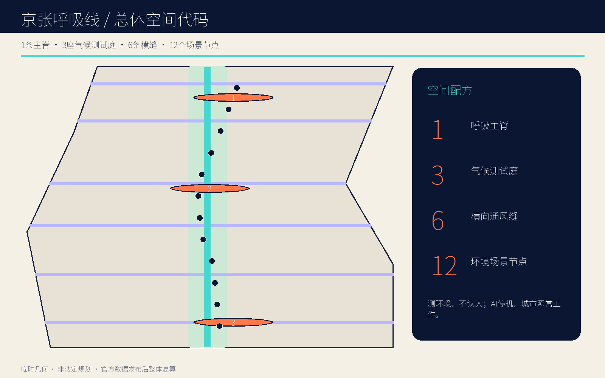
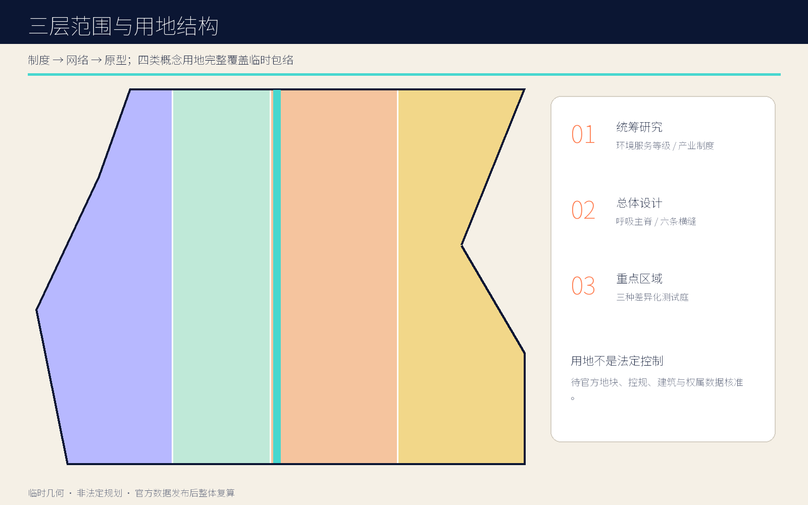
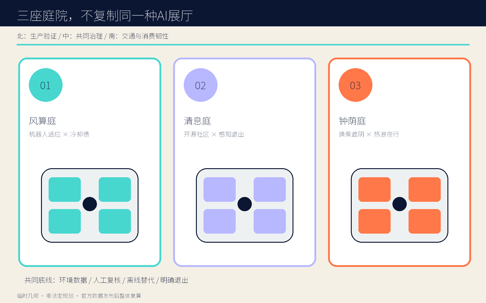
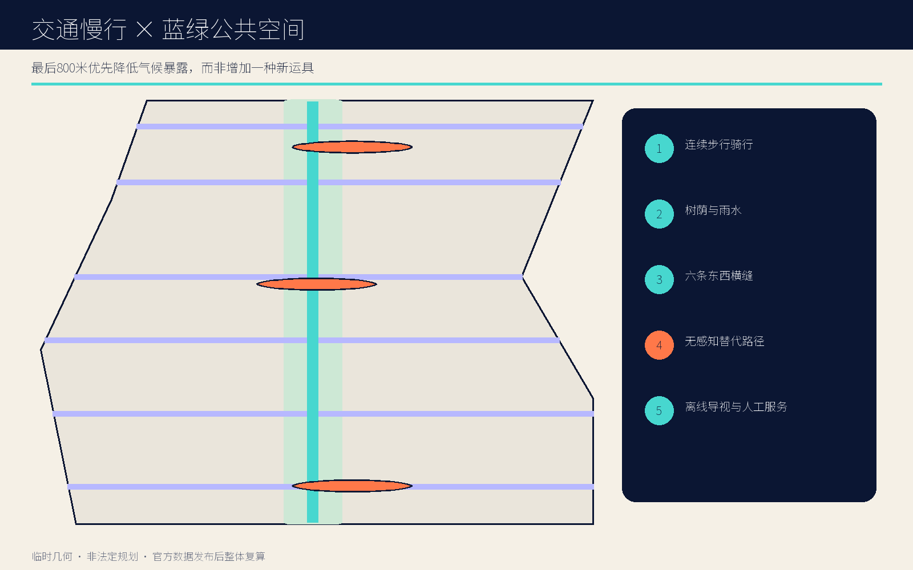
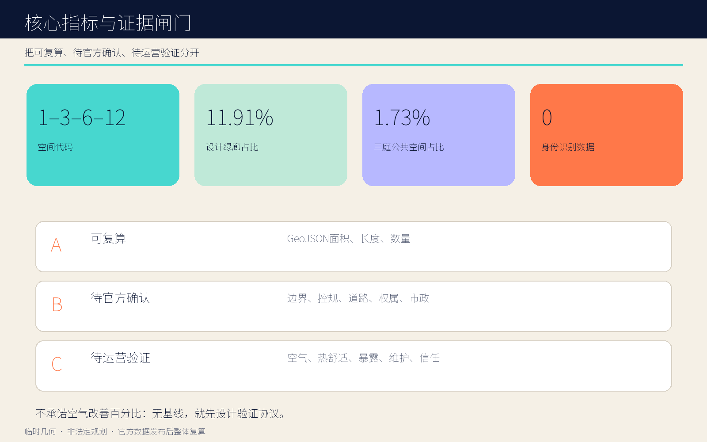

# 京张呼吸线 THE BREATHING LINE

> 让 AI 创新有一条可呼吸、可退出、可复核的公共底线。空间代码：**1 条主脊 / 3 座庭院 / 6 条横缝 / 12 个节点**。

## 设计依据与资料清单

本案把正式公告、智能体任务书、仓库来源登记和临时边界分成四级证据，不把“能画出来”误当成“已被批准”。公告提供三层范围、三处重点区域和专业成果要求；任务书提供场景、品牌、运营和双语表达要求；来源登记限定每份资料能做什么；临时边界只支撑生成与复核。所有官方缺失项进入假设清单，所有设计量从提交几何复算。由此形成一句执行原则：**先画公共底线，再接入智能服务；先声明证据等级，再讨论空间绩效。** [source:OFFICIAL-ANNOUNCEMENT] [standard:PROJECT-OFFICIAL-ANNOUNCEMENT]

现阶段 `SITE-001` 与三处 `PROV-KEY` 都是 provisional rough envelope。仓库 issue #846 提醒临时总体范围与 OSM 所示遗址公园对象并不相交、最近约 412.5 米；issue #1029 提醒临时大钟寺锚点可能与命名站点相距约 2.26 公里。本案不消解这两个矛盾，而是将其显著写入图、文、指标和假设；官方 polygon 到位后，整体图层、比例、站点关系与南部庭院位置必须整体重算。

全球参照只提炼机制：新加坡 one-north 的工作—生活—学习复合与 living lab；Barcelona 22@ 的长期更新；Kendall Square 的科研集群与公共界面；Mila 的协作型 AI 生态；Vector 的人才—产业网络；ETH AI Center 的跨学科社区。它们不提供北京的容积率、气候绩效或政府承诺。方案的五张图、HTML 与 PDF 均由提交几何和原创排版生成，不使用远程图片。

## 三层范围工作框架

统筹研究范围回答“空气、算力、人才和公共生活怎样成为同一套创新生态”；总体设计范围回答“11.4 平方公里临时包络内怎样形成一条可走、可停、可测、可关闭的公共主脊”；重点区域回答“三种不同的 AI 城市关系怎样在具体庭院中被测试”。三层不是等比例放大图，而是一条从制度、到网络、再到原型的因果链。[depth:three_level_scope_framework] [data:geometry/site_boundary.geojson#SITE-001]

空间总图为“1—3—6—12”：一条南北呼吸主脊，三座气候测试庭，六条东西向通风与慢行缝，十二个可审计场景节点。主脊提供树荫、雨水、步行、自行车和离线导视；横缝优先修复东西向可达；测试庭把研发、社区和交通三类场景分开；节点采用环境测量而非身份识别。这个结构即使停用 AI，仍是一套连续公共空间，因此技术失效不会导致城市失效。

统筹层建立“环境服务等级”制度；总体层控制连通与公共底线；重点层验证运营与隐私。对每个新算法，先登记空间位置、测量对象、数据最小化、人工复核、关闭方式和算力冷却债，再决定是否进入公共空间。三层共用同一组 GeoJSON 和指标，避免策略文本、总图和节点表彼此漂移。

## 统筹研究范围产业与未来城市研究

京张 AI 创新带不再以“设备更多”作为先进性的替代指标，而以“创新活动能否在更好的公共环境中持续发生”作为竞争力。呼吸线将高校、企业、社区、交通与遗址叙事连接为一条开放实验链：北段验证全栈自主与机器人对环境的适应；中段验证开源协作与居民共同治理；南段验证交通、商业和国际交往在热浪、拥挤与空气波动中的韧性。[source:AGENT-TASKBOOK] [depth:overall_spatial_structure]

产业机制包含四个公开接口：一是“环境基线仓”，公开聚合后的温湿度、风、颗粒物、噪声与树荫数据字典；二是“冷却债台账”，要求算力密集型展陈说明电力、冷却、水与废热前提；三是“城市测试许可证”，把时间、空间、风险与退出条件写清；四是“年度风谱开放周”，让研究者、居民和访客共同复核结果。平台不采集人脸、手机标识、Wi-Fi 探针或个人轨迹。

品牌符号采用一条铁路竖线穿过一对开放括弧，像肺叶也像对话；中文名“京张呼吸线”，英文名“THE BREATHING LINE”。视觉识别以深靛、空气青、风险橙和纸白为主，不使用企业商标。文化叙事不复制铁路造型，而把百年京张“工程连接”的精神转译为今天“让创新基础设施接受公共检验”的制度连接。

## 总体设计范围城市更新与控规深度城市设计

总体空间由纵向公共主脊和六条横向缝合线构成。主脊是连续慢行—蓝绿—环境服务走廊；横缝在六个区段把居住、科研、产业与轨道方向接回主脊。三座庭院是网络上的放大节点，但不承担整个片区的公共空间供给。四类概念用地分别是环境可验证研发、呼吸主廊开敞空间、低碳产业服务、社区照护与公共服务；其分区完整覆盖临时包络，只用于方案比较。[data:geometry/land_use.geojson#LU-001] [depth:land_use_layout]

更新方法采取“最小不可逆动作”。先做树荫、座椅、排水、导视、路口过街和可移动传感器；再根据一年基线决定铺装、构筑物和设施；建筑原型采用可拆的两层气候亭。没有现状建筑、权属和结构检测前，不给出具体拆除对象，不把新亭投影面积外推为总建筑规模，也不编造容积率、高度和退线。

公共空间控制提出三条设计规则：连续步行路径不得因平台停机中断；每个感知节点 100 米步行范围内应有清晰的无感知替代路径；每座测试庭应设机械式信息牌和人工服务时段。道路、消防、市政、文保和轨道条件补齐后，再由专业团队把概念线转换为红线、断面与工程接口。

## 重点区域详细设计

三处重点区不是同一种“AI 展示馆”的复制。北部众智园设置“风算庭”：四座可逆亭围合机器人和端侧模型测试场，测量风、热、噪声与能源前提，成果进入冷却债台账；庭院外缘连接清河方向，但河道蓝线和防洪条件未核实。中部 AI 原点社区设置“清息庭”：以低暴露、可退出、跨代共用为原则，把开源发布、社区服务、无障碍微气候导航和静默口袋放在同一慢行环上。[data:geometry/key_areas.geojson#PROV-KEY-001] [depth:three_key_area_detailed_design]

南部大钟寺设置“钟荫庭”：服务换乘、商业、夜间工作者和国际访客，以遮阴候车、四象限步行讨论、热浪夜行和年度开放周为主题。由于临时锚点可能偏移，图上只表达“南部原型的空间语法”，不声称已落在大钟寺站真实四象限；官方边界与站点数据发布后必须优先重定位，这是本案的硬性前置条件。

三庭共同采用四项审查：空间是否全天候可用；数据是否只描述环境；故障时是否有人工与离线路径；运营者是否承担维护和投诉责任。差异则体现在北部的生产验证、中部的日常共同治理、南部的交通与消费韧性。每庭均有四个可逆气候亭，先作为原型测试，后续保留、改造或撤除由证据决定。

## AI 创新生态、人才画像与 AI+ 场景

六类核心画像为：需要透明测试条件的初创与机器人团队；需要开源协作和成果转化的高校师生；需要低门槛日常服务的周边居民；需要无障碍、遮阴与可退出感知的老人、儿童和行动不便者；需要夜间安全与可靠换乘的通勤和夜班人群；需要理解京张历史与当代 AI 生态的国际访客。画像只定义服务需求，不作为个体分类或商业推荐依据。[data:geometry/constraints.geojson#SCENARIO-01] [metric:scenario_node_count]

十二张场景卡依次为：风谱零号站、树荫路由、无障碍微气候导航、算力冷却债账本、空气数据公证台、静默避让口袋、热浪夜行灯、雨后慢行恢复、社区呼吸课、机器人环境适应场、钟荫候车厅、年度风谱开放周。其中风谱零号站、冷却债账本、空气数据公证台和机器人环境适应场是四个产业测试场景。每张卡均记录空间载体、聚合环境数据、禁止数据、人工复核、离线替代、运营主体和停止条件。

统一数据规则是“测环境，不认人”：允许温度、湿度、风、颗粒物、噪声和匿名设施状态的边缘聚合；禁止人脸、手机标识、Wi-Fi 探针、个人轨迹和未经同意的画像。算法可以建议树荫路线、维护优先级或测试时段，不能替代规划审批、交通指挥和医疗判断。静默口袋提供不被感知的等价停留空间，让隐私不以放弃公共服务为代价。

## 用地、建筑规模与拆改留方案

四类用地是概念功能带而非法定分类结果：西侧偏研发和试验，中部为呼吸主廊，东侧为产业服务，边缘嵌入社区照护。用地编码沿用仓库允许枚举以便机器校验，但面积依赖临时边界，不构成供地、用途管制或开发强度依据。主廊避免成为“景观剩余”，每一段至少同时承担慢行、树荫、雨水、日常停留和环境信息五项中的三项。[standard:MNR-LAND-USE-CLASSIFICATION-GUIDE] [metric:building_footprint_area_sqm]

建筑策略采用“留—改—拆—加”四步审查：先确认历史、结构、权属和使用人；可通过首层开放、遮阳、通风和共享设施解决的优先改；只有安全或公共连通证据充分且完成协商才讨论拆；新增部分优先可逆气候亭。当前十二座两层原型亭仅表达尺度和运营模块，不代表最终建筑数量、层数或位置。

风貌不使用未来主义外壳。基调来自铁路工程的克制结构、可见连接件和耐候材料；括弧形遮阳框形成“可打开的肺叶”；橙色只标风险和人工介入点。高度、天际线、屋顶设备、消防间距和日照均列为下一阶段专业校核项。任何现状建筑的保留、改造或拆除，都必须在官方建筑底图、现场调查和利益相关者协商后重新标注。

## 交通、轨道、市政与公共服务设施

交通结构优先解决“最后 800 米的气候暴露”，而非另造一套高科技运具。南北主脊服务步行与骑行，六条横缝连接两侧街区和轨道方向；树荫路由只在多条合法路径之间提供舒适度建议，不引导穿越封闭地块。站点、道路红线、信号与过街条件缺失，因此横缝是待核的公共连通意图，不是新路审批结论。[data:geometry/roads.geojson#ROAD-001] [depth:traffic_rail_slow_parking]

市政策略把 AI 基础设施的环境代价可视化。每个算力或机器人测试项目必须披露峰值电力、冷却方式、用水、废热、噪声、设备占地和退出安排；无法披露则不能进入公共测试庭。优先采用端侧聚合和间歇采样，降低网络与能耗。雨后慢行恢复节点以排水巡检和人工封控为底线，算法只辅助排序。

公共服务设施包括人工咨询台、饮水、无障碍卫生间、可移动座椅、急救、充电与离线导视。三庭均设“关闭也可用”的机械标识和人工巡检柜。消防、排水、防洪、供电、通信和轨道保护条件尚未提供，所有管线、机房和能源方案都只能作为接口清单，不能写成具备承载能力的既定事实。

## 蓝绿空间、公共空间与城市风貌

蓝绿系统不是连续着色，而是“呼吸服务链”：主脊七十米概念缓冲提供乔木树冠、透水地表、雨水花园、座椅和骑行；六条横缝将风、影和人流从东西两侧引入；三庭通过可移动遮阳、雾化禁用阈值、饮水和静默口袋形成可测试的热浪响应。绿地面积和比例由设计几何复算，但不等同于法定绿地率。[data:geometry/green_space.geojson#GREEN-001] [metric:green_ratio]

四个“AI 朝圣地标”组成一条可步行叙事：北端“风标零号站”公布基线；中部“清息环”展示个人可退出的公共智能；节点“呼吸钟厅”以机械钟面显示风、热和人工复核状态；贯穿全线的“京张风谱廊”用年度刻度记录哪些假设被证实、被否定或被撤回。地标的价值在证据透明，而不是巨型屏幕。

城市风貌采用深靛结构、空气青公共构件、纸白信息面和风险橙手动控制。夜景坚持低位、分时、可关闭，避免把传感器和屏幕变成视觉主角。遗址文化关系因官方保护范围缺失而保持克制：使用“工程连接、公开验证、长期维护”的精神转译，不复制文物形态，不画伪精确保护线。

## 更新项目清单、实施政策与分期计划

九个更新项目为：JZB-01 环境基线与数据字典；JZB-02 呼吸主脊轻量样段；JZB-03 六条横缝可达性审计；JZB-04 风算庭；JZB-05 清息庭；JZB-06 钟荫庭重定位与站城研究；JZB-07 静默口袋网络；JZB-08 算力冷却债台账；JZB-09 年度风谱开放周。每个项目都需明确空间、主管与运营责任、依赖、停止条件和一年后评估。[data:geometry/phasing.geojson#PHASE-001] [depth:renewal_project_list]

近期先完成官方资料补齐、现场核查、四季环境基线、无障碍走查和两处轻量样段，不进行不可逆建设；中期在专业审查和社区协商后完成横缝、三庭与公共服务接口；远期把有效原型转为持续运营网络，并淘汰无效设备。分期不是建设承诺，关键闸门包括官方边界、权属、道路、市政、文保、资金和运营主体。

政策建议包括：公共空间 AI 测试许可证、环境数据公证、冷却债披露、感知退出权、人工复核责任和年度撤除清单。运营资金优先覆盖树木、座椅、排水和人工服务，再覆盖设备更新。开放周不以客流最大化为目标，而以公开失败、复核假设和形成下一年度项目优先级为成果。

## 指标体系、面积复算与合规矩阵

机器可读指标分三组。第一组可从当前设计几何复算：临时包络面积、主脊与横缝长度、绿地和公共空间面积/比例、原型亭投影、三庭、六缝、十二节点与四项测试。第二组必须等待官方控规和建筑资料：容积率、建筑密度、高度、退线、道路红线和真实拆改留规模。第三组必须通过运营测量：空气、热舒适、步行暴露、维护效率和公众信任。[metric:site_area_sqm] [depth:metrics_recalculation]

本案故意不承诺“空气改善百分比”。没有官方气象与污染基线时，给出绩效数字会把设计愿景伪装成实验结论。相反，风谱零号站先记录四季基线，测试庭采用对照时段、相同传感器、公开校准和人工异常记录；只有样本周期、设备误差和外部天气条件满足预注册协议后，才发布带置信区间的结果。

合规矩阵覆盖公告 17 项必选任务和 agent.1—agent.6，并把章节、图层、指标、图纸、可视化、来源、假设和自检挂接。核心自检不是“文件存在”，而是四个闸门：数据边界是否诚实；空间图层是否可复算；双语视觉是否完整；公共服务在算法停机时是否继续。任何文件更新后都要刷新 manifest 哈希并重跑全套检查。

## 风险、版权与合规说明

最大空间风险是临时边界错位，尤其是遗址公园关系和大钟寺锚点；最大专业风险是缺少控规、道路、建筑、权属、文保和市政数据；最大技术风险是环境传感滑向个体追踪、设备成为维护负担或算力环境成本被隐去；最大社会风险是用“舒适路线”制造新的不平等。对应措施是显著标注 provisional、设置资料闸门、禁止身份数据、保留静默路径、公开冷却债并保证人工替代。[source:BOUNDARY-SOURCE] [depth:risk_missing_data]

方案不声称获得政府批准、建设资金、运营授权或企业合作。所有比例仅描述提交几何；所有地标、活动与政策为设计建议；所有建筑为可逆原型。涉及老年人、儿童、行动不便者和夜班人群的场景需独立安全与无障碍审查。环境数据公开前须完成设备校准、隐私评估、聚合阈值和责任主体确认。

文字、图件、HTML 与 PDF 为本次生成的原创表达；底图只使用仓库内 provisional GeoJSON。Noto Sans SC 字体按其开放字体许可用于嵌入；Pillow、Shapely、pyproj 与 ReportLab 仅作为制作工具。全球案例仅用官方页面的事实机制，不复制其图像、图纸或品牌。提交采用 COMMUNITY-DISPLAY-ONLY 许可，详细清权说明见版权文件。

## 参考资料

正式依据包括北京市规划和自然资源委员会海淀分局公告、仓库智能体任务书、来源登记、设计深度矩阵以及住房城乡建设与自然资源相关公开标准；临时空间依据为仓库 `provisional_boundaries.geojson`。国际案例包括 JTC one-north、Barcelona 22@、Cambridge Kendall Square、Mila、Vector Institute 与 ETH AI Center 的官方页面，均仅用于方法参照。[source:SOURCE-REGISTRY] [standard:MOHURD-URBAN-DESIGN-MEASURES]

复核路径是：先在 `sources.json` 查看发布者、检索日期、允许与禁止用途；再在 `assumptions.json` 查看数据缺口对结论的影响；随后用 `geometry/` 和 `metrics.json` 复算空间量；最后通过 `compliance_matrix.json`、`standard_matrix.json`、`design_depth_matrix.json` 和 `self_check.json` 检查任务覆盖。issue #846 与 #1029 作为仓库质量提示被纳入风险，但不替代权威地理数据。

本方案没有把案例城市的数值移植到北京，也没有将任务书中的倡议写成法定控制。所有网络链接只存在于来源清单与参考文字，离线 HTML 不加载远程脚本、瓦片、字体或媒体。官方附件更新后，优先级依次为替换边界、重定位重点区、复核遗址与站点关系、重算图层和指标、再修订图纸与运营计划。

