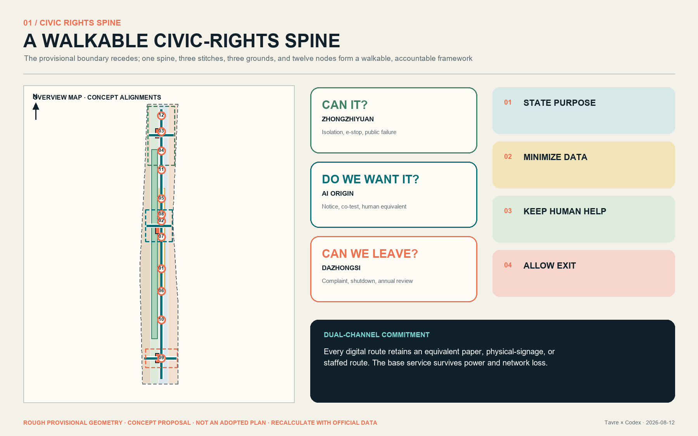
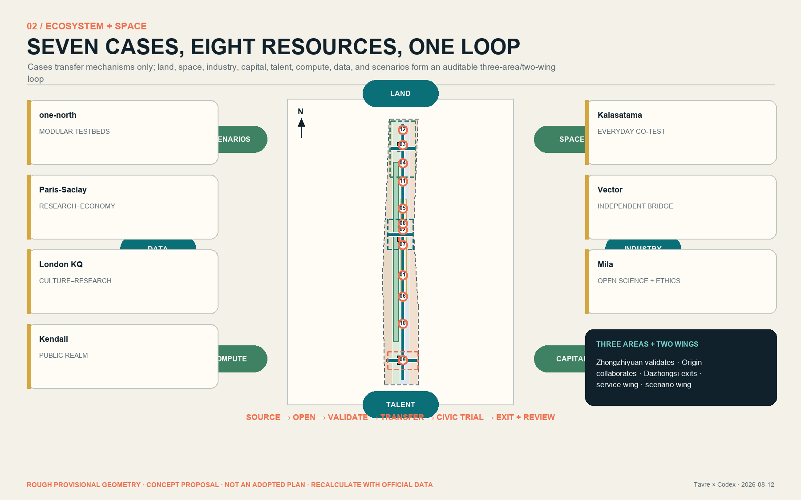
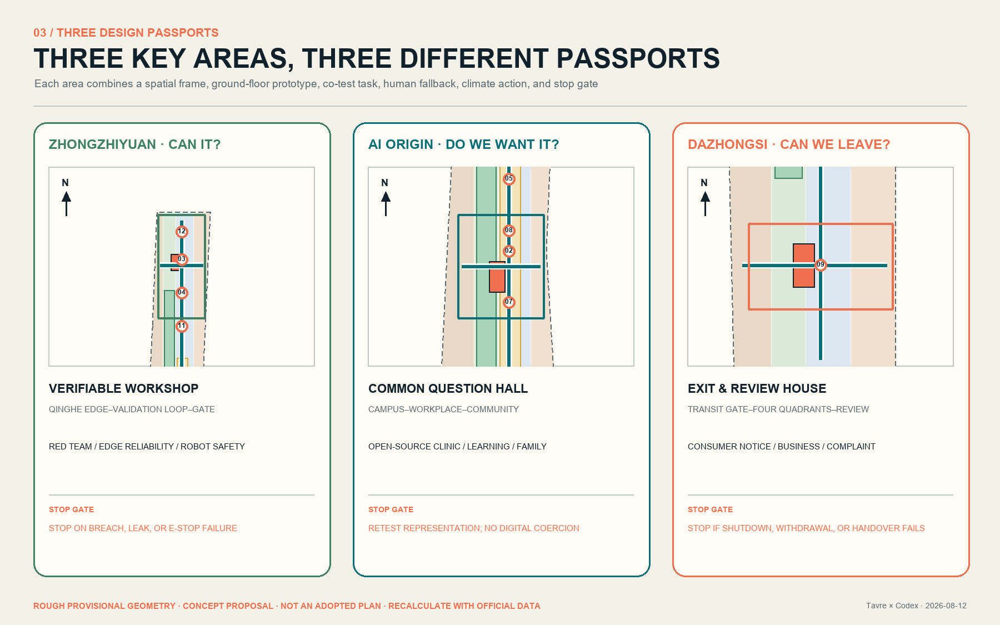
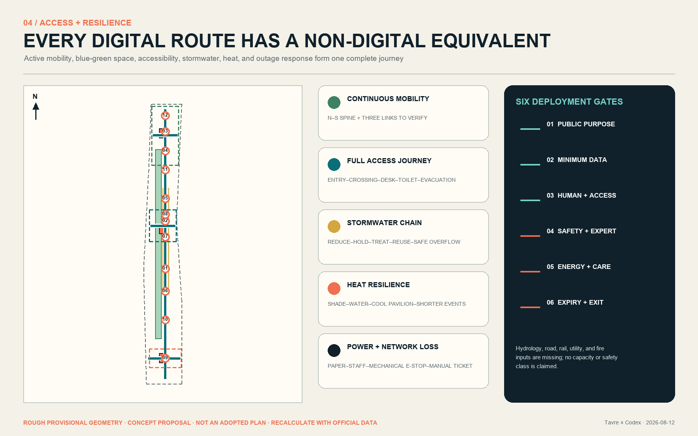
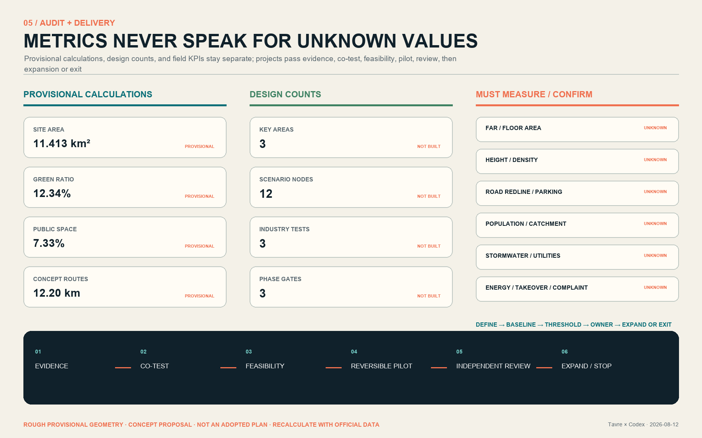

# JINGZHANG CONSENT LINE: The City Asks Before It Computes

**Thesis: a city is not an AI showroom. It is a shared place where everyone can understand, choose, ask for help, and leave.** The “Consent Line” is both a north–south walking route along the Jingzhang Heritage Park and a civic service protocol that people may question, professionals may audit, and operators must be able to stop. A continuous blue line marks a staffed baseline that does not require a phone. Three rings ask: “Can it work?”, “Do we want it?”, and “Can we leave?” This is an open co-creation proposal, not an adopted plan, engineering conclusion, approval, or implementation commitment.

## 1. Basis, evidence, and limits

The public open-call announcement and Agent taskbook define the assignment; the repository’s registered sources, standards, enums, and validation rules define the evidence boundary. Together they require three positions, five functions, a three-area/two-wing structure, five to eight global cases, at least ten AI+ scenarios, three industry validation scenarios, five personas, three landmarks, and a long-term operating model [source:OFFICIAL-ANNOUNCEMENT] [source:AGENT-TASKBOOK] [depth:existing_conditions_diagnosis].

No organizer-supplied exact site or key-area polygons, existing-building survey, ownership data, population/facility baseline, road redlines, rail engineering, river control lines, heritage controls, utility capacity, energy load, or cost data are available. Therefore:

- `site_boundary.geojson` and `key_areas.geojson` are repository-maintained rough provisional constraints. Their dashed outlines support generation, display, and intake checks only; they are not official red lines.
- Approximately 11.413 km², a 12.3423% green ratio, and a 7.3281% public-space ratio are recalculations of this temporary design model—not existing-condition statistics, statutory controls, or approval values [data:geometry/site_boundary.geojson#SITE-001] [metric:site_area_sqm].
- FAR, total floor area, height, demolition/retention, road sections, service catchments, stormwater capacity, energy, and budget remain `unknown` until official inputs permit recalculation.
- Global cases transfer methods only; they do not prove local feasibility. No media from those webpages is redistributed.

The complete audit trail lives in `sources.json`, `assumptions.json`, `metrics.json`, the three matrices, nine GeoJSON layers, bilingual drawings, and offline HTML. Geometry distinguishes `provisional_constraint` from `design_proposal`; final judgment remains human and professional.

## 2. Three scopes and the central idea

The proposal works simultaneously through a research network, a city framework, and three key-area passports; it does not simply enlarge the same diagram [depth:three_level_scope_framework] [standard:PROJECT-OFFICIAL-ANNOUNCEMENT].

| Scale | Design judgment | What this proposal delivers | Limit |
|---|---|---|---|
| Approx. 43.6 km² coordinated study | The AI belt is a collaboration network of research, firms, capital/IP, civic test settings, and everyday communities—not one campus | A source-to-open-source-to-validation-to-transfer-to-public-trial-to-exit loop; three-area/two-wing flows; seven case methods | No invented tenant, investment, incentive, or fiscal commitment |
| Approx. 11.4 km² overall design | The heritage park becomes continuous civic-rights infrastructure rather than background landscape | One north–south spine, three east–west stitches, twelve dual-channel nodes, blue-green resilience, nine project packages | Provisional boundary is not a red line; routes are not engineering alignments |
| Approx. 368.4 ha key areas | Each area asks a different question: can the technology work, does the public want it, and can the service be withdrawn? | Three passports covering gateways, ground-floor prototypes, test grounds, landmarks, projects, and stop gates | No parcel demolition, ownership, building volume, height, or approval conclusion |

Every scale uses the same public question card: **who benefits; what data are used; who is accountable; how the service works when AI is off; what evidence permits expansion; what triggers a stop.** Each action must connect to a spatial element, an operating role, and a stated data gap.

## 3. Coordinated study: industry and future-city research

### Seven cases: transfer mechanisms, never conclusions

| Case | Verifiable mechanism | Jingzhang translation | Explicit non-transfer |
|---|---|---|---|
| Singapore LaunchPad @ one-north | Modular space, incubator/capital network, plug-and-play real-world testbeds | A shared experiment–test–standard–transfer base at Zhongzhiyuan | Scale, lease policy, and operating figures [source:CASE-ONE-NORTH] |
| Paris-Saclay | Research, universities, and the economic sphere connected as an ecosystem | Connectors and an annual project forum across three areas and two wings | French governance and finance [source:CASE-PARIS-SACLAY] |
| London Knowledge Quarter | Culture, research, universities, firms, community groups, and local institutions in one partnership | Treat Jingzhang culture, science, and public learning as equal innovation infrastructure | Institutional counts and the one-mile model [source:CASE-LONDON-KQ] |
| Cambridge Kendall Square | Public space reconnects inward-facing innovation institutions through incremental civic action | East–west stitches, visible ground floors, neighborhood participation, and staged delivery | Land system and existing intensity [source:CASE-KENDALL-SQUARE] |
| Helsinki Kalasatama | Transit/cycling, daily services, phased construction, and urban innovation trials evolve together | Everyday co-testing, climate adaptation, and periodic review in the Xiaoyuehe scenario wing | Waterfront conditions, population, and development figures [source:CASE-KALASATAMA] |
| Toronto Vector Institute | An independent nonprofit bridges research, responsible adoption, industry, and government | Independent review and transfer support in the Zhongguancun service wing | Institutional structure and funding scale [source:CASE-VECTOR] |
| Montréal Mila | Multi-university collaboration, open science, industry transfer, ethics, and social benefit | Open-source workshops, civic AI classes, and talent community at AI Origin | Research scale, partners, and policy context [source:CASE-MILA] |

### Eight resources, one accountable loop

1. **Land:** identify low-efficiency, leftover, and reversible-use opportunities; name no parcel before ownership is verified.
2. **Space:** combine shared test rooms, visible ground floors, civic classrooms, temporary booths, staffed pavilions, and quiet work settings.
3. **Industry:** move from research through three real validation types to transfer/procurement; every civic trial passes a public-interest gate first.
4. **Capital:** describe funding categories and audit conditions only—never amounts or commitments.
5. **Talent:** researchers, founders, transitioning workers, family members, and international visitors need housing, care, night services, and belonging.
6. **Compute:** shared scheduling, energy disclosure, task tiers, and offline alternatives; a large model is never the default for every service.
7. **Data:** minimum necessity, purpose limitation, tiered permission, expiry, complaint, and deletion; no private or personal dataset is assumed.
8. **Scenarios:** three public test grounds close the loop from test to civic experience to independent review to expansion or exit.

Zhongzhiyuan hosts stack validation and standards learning; AI Origin combines open collaboration, transfer, and everyday talent services; Dazhongsi tests AI-native commerce, business services, and withdrawal; the Zhongguancun service wing contributes IP, legal, capital, standards, and global links; the Xiaoyuehe wing provides community and public-service trials. Negative evidence enters the public ledger alongside success [depth:overall_spatial_structure].

## 4. Overall renewal and planning-depth urban design

### One spine, three stitches, three grounds, twelve nodes, two feedback wings

The diagram no longer treats a temporary bbox as the design. A **north–south Consent Spine** links the three areas. Three conceptual east–west stitches connect transit/city streets, campus and workplace edges, neighborhoods, and the green spine. Three **civic test grounds** operate technology-feasibility, social-consent, and withdrawal-review gates. All twelve nodes provide visual, spoken, tactile, low-counter staffed, paper, and offline routes [data:geometry/roads.geojson#ROAD-SPINE-001] [metric:scenario_node_count].

Four temporary land-use classes form a complete, gap-free, non-overlapping partition under the national classification guide. They express functional relationships, not statutory land-use controls, and must be rebuilt after official geometry, ownership, and regulatory controls arrive [data:geometry/land_use.geojson#LU-001] [standard:MNR-LAND-USE-CLASSIFICATION-GUIDE] [depth:land_use_layout].

### Urban form and ground floors

- Ground floors facing the spine prioritize accessible, enterable, and visibly staffed public interfaces. Secure experiments meet public life through lobbies, display windows, and booked co-test rooms rather than blank fences.
- Three building features are adaptive-reuse/reversible-addition **types**, not surveyed buildings or construction sites. Height, volume, setbacks, fire safety, and structure require professional design.
- The three landmarks are civic capacities rather than screen sculptures: Zhongzhiyuan’s Verifiable Workshop, AI Origin’s Common Question Hall, and Dazhongsi’s Exit & Review House. When devices are off, each remains shade, rest, wayfinding, and gathering space.
- An original visual language combines sleeper rhythm, kilometer marks, a continuous blue line, rings, numbers, and a staffed-service figure. It uses no corporate logo, portrait, or unlicensed typeface.

## 5. Three key-area design passports

The three rough polygons recalculate to about 369.289 ha, approximately 0.241% above the announcement’s “about 368.4 ha.” That discrepancy demonstrates why the rectangles cannot serve as precise red lines. Each passport links spatial action, a ground-floor prototype, a co-test task, and a stop gate [data:geometry/key_areas.geojson#PROV-KEY-001] [metric:key_area_count] [depth:three_key_area_detailed_design].

| Area | Role and spatial frame | Prototype/landmark | First packages and prerequisite gate |
|---|---|---|---|
| Zhongzhiyuan AI Acceleration Area | Qinghe edge–validation loop–north gateway; a visible but controlled co-test foyer mediates between test spaces and park | `BLDG-ZZY-001` Verifiable Workshop: shared tests, standards studio, low-carbon compute notice, staffed registration | Industry-model red-team, edge-device reliability, and robot co-space safety; river, flood, road, fire, energy, and accountable-operator review first; failure reverts to non-automated demonstration |
| Beijing AI Origin Community | Campus–workplace–neighborhood stitch; public learning, talent services, open-source collaboration, and transfer-oriented ground floors form an all-day district | `BLDG-ORIGIN-001` Common Question Hall: open-source tables, civic issue room, family/international services, quiet rest | Open-source clinic, learning/employment assistant, daily-service co-test; residents, students, frontline staff, and disabled people walk the prototype before any pilot |
| Dazhongsi AI Industry Cluster | Transit gateway–four-quadrant walkability–commerce/business street–exit review ground; paper and staffed routes equal digital ones | `BLDG-DZS-001` Exit & Review House: staffed complaint, recall/withdrawal notice, annual failure exhibition, community help | Consumer explanation, business navigation, complaint takeover; verify station, crossings, planned green space, bicycle conditions, footfall, and ownership; stop automation if it causes congestion, exclusion, or cannot hand over |

Each passport also requires a retention-first survey tree, a continuous accessible journey, cool rest, logistics/emergency movement, maintenance jobs, an evidence ledger, and annual review. Sections and boundaries are conceptual, not architectural or engineering drawings.

## 6. AI ecosystem, personas, and twelve AI+ scenarios

### Six personas; app literacy is not a condition of citizenship

| Persona | Everyday goal | Often ignored barrier | Non-digital baseline |
|---|---|---|---|
| Nearby resident/older adult | Health, errands, walking, care | Small text, complex consent, night and heat | Staff, paper map, large text/voice, seats, water |
| Wheelchair or sensory-disabled user | Continuous safe movement and independent service | Broken curb route, screen-only cues, obstruction | Continuous route, tactile/voice, low counter, human guide |
| Child and caregiver | Learning, play, trusted public space | Default capture, adult-centered interaction, missing rest/toilet | Guardian choice, no-identification mode, visible staff |
| Frontline service/maintenance worker | Reliable handover and useful work | Black-box alerts, absent owner, night burden | Clear work order, manual takeover, maintenance window, training |
| Researcher/developer/founder | Test, collaborate, transfer | No real feedback, responsibility, or site interface | Co-test protocol, failure data, expert review, expiry |
| International talent and family | Build a life beyond work | Language, partner work, childcare, night service | Multilingual staff, family referral, community connection |

### Twelve dual-channel cards

Each card records users, minimum permitted data, AI’s bounded role, space/accountable role, human takeover, retention/expiry, complaint/exit, and evidence for expansion or stopping. Locations remain conceptual and require site permission [data:geometry/public_space.geojson#SN-01] [standard:PROJECT-AGENT-OPEN-CALL-TASKBOOK].

| Node/scenario | Bounded AI role and minimum data | Human baseline/accountability | Pilot gate and stop trigger |
|---|---|---|---|
| SN-01 North gateway multilingual wayfinding | Local route + selected language; no face recognition | Paper map and staff; service operator | Accessible journey audit; stop after harmful guidance or failed handover |
| SN-02 Qinghe cool-route advice | Weather + anonymous environment sensors | Shade signs, water, patrol; public-space maintenance | Weather/river review; extreme conditions shift to human emergency mode |
| SN-03 Industry model red-team (validation 1) | Approved test set in isolated environment | Professional testers; test owner | Safety/data review; stop on privilege breach, leak, or irreproducibility |
| SN-04 Edge-device reliability (validation 2) | Device logs + explicitly volunteered feedback | Manual control + on-site person; device owner | Electrical/fire/access review; stop on control loss or injury risk |
| SN-05 Robot co-space safety (validation 3) | Minimum environmental sensing; no identity template | Separation, emergency stop, safety officer | Professional risk review; stop on boundary breach, near miss, or e-stop failure |
| SN-06 Open-source maintenance clinic | User-submitted code/problem only | Developer clinic + paper booking; community operator | License/security review; stop on sensitive-code exposure |
| SN-07 Learning and employment assistant | User-entered goals + public opportunities | Human counseling + guest terminal | Bias/explanation evaluation; stop on discrimination or fabricated opportunity |
| SN-08 Civic-service navigation | Public rules + user-chosen task | Staff/telephone; service owner | Named update owner; stop if errors cause consequences or digital coercion |
| SN-09 Quiet work and care coordination | Booking time + capacity only | On-site manager + paper registration | No family profiling; redesign if caregivers/children are excluded |
| SN-10 Dazhongsi consumer explanation | Public product facts + query | Staff counter + plain-language notice; business/platform role | No manipulative profile; stop on incorrect or coercive explanation |
| SN-11 Accessible companion | User-triggered location + stated need, then expiry | Human guide + tactile/voice route | Co-test with disabled users; stop on route break or unanswered call |
| SN-12 Exit, complaint, annual review | Complaint + ticket status under tiered access | Physical desk + paper receipt; independent reviewer | Intake deadline/escalation first; stop service if it cannot be closed or withdrawn |

“Exit” is a voluntary design principle, not a claimed universal statutory right. Duties under personal-information, generative-AI, and public-service law depend on the actual operator, use, and applicable provisions. No scenario is approved or operating.

## 7. Land use, building scale, and retain/adapt/remove logic

The four temporary classes cover the boundary and express relationships among innovation production, civic service, everyday support, and ecological openness. Three key-area prototypes replace the former fiction of one near-two-kilometer building. Footprint is the sum of design prototypes; total floor area, FAR, height, density, and parking remain unknown [data:geometry/buildings.geojson#BLDG-ZZY-001] [metric:building_footprint_area_sqm] [depth:development_intensity_controls].

The decision tree is evidence-gated, not parcel-specific:

1. **Retain** where historical, community, or ongoing-use value and safety are established.
2. **Repair** structure, fire safety, energy, accessibility, and maintenance.
3. **Adaptively reuse** candidate ground floors/industrial space for tests, public learning, or talent services.
4. **Add reversibly** with light, removable systems and named lifespan/accountability, after small trials.
5. **Evaluate removal** only after ownership, structure, carbon, use, and public-impact evidence exists.
6. **Build new** only after statutory planning, capacity, mobility, utilities, heritage, and approvals allow it.

Each prototype needs a legible 24-hour entrance, visible staff, accessible toilet/rest, service access, and a useful public function when equipment is off. With no existing-building survey, this proposal identifies no real building for demolition or alteration.

## 8. Mobility, rail, infrastructure, and public services

The network prioritizes continuous walking/cycling, transit gateways, equivalent digital/non-digital routes, and separate logistics/emergency movement [data:geometry/roads.geojson#ROAD-STITCH-001] [metric:consent_network_length_m] [depth:traffic_rail_slow_parking].

- The north–south spine carries walking, cycling, heritage narrative, and twelve nodes. Three east–west stitches are links to verify, not road redlines, bridges, or tunnels.
- Each gateway begins with a break ledger covering crossings, curbs, fences, underpasses, transfer, bicycle parking, lighting, ponding, and heat exposure; it names affected users, missing evidence, reversible response, and engineering gate.
- Transit work is limited to walking connection, information, and staffed help. Exit locations, capacity, fire safety, and underground work require rail-professional confirmation.
- Parking, loading, emergency, and maintenance must not conflict with the spine. Numbers and final arrangements remain `unknown`.

Public services use a three-level fallback: **preserve the base service → AI only augments → staff can always take over.** Nodes cover wayfinding, civic tasks, learning/employment, care, accessible accompaniment, complaint/exit, and emergency information. Medical judgment, enforcement, and safety response never default to unattended models. New infrastructure is an interface brief only: tiered power/offline mode, minimum local data, network-outage queue, thermal/noise/maintenance, cybersecurity, and energy disclosure; capacity and equipment require professional calculation [depth:municipal_new_infrastructure].

## 9. Blue-green space, public realm, and urban character

The heritage path, Qinghe/Xiaoyuehe edges, small rest spaces, transit gateways, and three test grounds form a network for daily comfort and extreme-weather degradation [data:geometry/green_space.geojson#GREEN-001] [metric:green_space_area_sqm] [depth:blue_green_public_space].

### Five resilience chains

- **Stormwater:** reduction–detention–treatment–reuse–safe overflow is a concept only; no capacity or safety class is claimed without hydrology, river, and flood data.
- **Heat:** continuous shade, sittable rest, water, cool staffed pavilions, and shorter hot-weather operation; shade and comfort need field baselines.
- **Power/network loss:** paper guidance, staffed registration, mechanical e-stop, offline announcement, and manual tickets keep service alive.
- **Accessibility:** co-test the full trip from entrance to desk, toilet, rest, crossing, and evacuation; large text, audio, tactile, and contrast complement rather than substitute one another.
- **Habitat/maintenance:** low-intervention planting, dark-sky operation, seasonal care, and event capacity require ecological and frontline review; green space is not an equipment showroom.

Urban character joins railway memory, Zhongguancun’s open collaboration, and explainable AI. A blue line, rings, numbers, and staffed-service icon create an original `JZ?` family: legible from afar and, nearby, stating purpose, data, owner, and exit. Dynamic screens are optional; physical color, relief text, and staff remain in a blackout.

## 10. Project packages, policy, and gateway phasing

Delivery follows evidence confirmation → joint walk-through → professional feasibility → reversible pilot → independent evaluation → expand or stop [data:geometry/phasing.geojson#PHASE-001] [metric:phase_count] [depth:phasing_implementation].

| Package | Proposal for further design | Primary accountable role | First acceptance evidence / stop gate |
|---|---|---|---|
| JZ-01 | Official-data replacement and break baseline | Planning/data coordinator to be designated | Source/difference report; no parcel design while boundary is unresolved |
| JZ-02 | North–south spine + original wayfinding pilot | Public-space/mobility operator role | Full journeys for six personas; repair if any route fails |
| JZ-03 | Three east–west accessibility audits | Mobility, rail, community roles | Break ledger + expert review; no construction without engineering conditions |
| JZ-04 | Zhongzhiyuan Verifiable Workshop | Test-service owner | Three industry protocols; stop without e-stop, owner, or isolation |
| JZ-05 | AI Origin Common Question Hall | Community/university/workplace collaboration | Public issue + adopted/not-adopted ledger; broaden testing if representation is weak |
| JZ-06 | Dazhongsi Exit & Review House | Service owner + independent reviewer | Complaint, takeover, shutdown drill; no expansion if exit fails |
| JZ-07 | Dual-channel component library | Accessibility co-test + maintenance | Paper/audio/tactile/staff consistency; repair after any critical-user failure |
| JZ-08 | Cool and stormwater nodes | Landscape/water/ecology/maintenance roles | Climate baseline + maintenance plan; no performance claim without review |
| JZ-09 | Annual Consent Week + public ledger | Convenor to be designated | Publish success, failure, complaint, energy, exit together; cancel if it becomes promotion only |

**Gate 0 (suggested 0–6 months):** official inputs, public/frontline/professional walk-through, baseline. **Gate 1 (6–18 months):** wayfinding, staff, paper routes, and removable micro-pilots only. **Gate 2 (18–36 months):** selectively advance test grounds and adaptive ground floors after professional review. **Gate 3 (annual):** independently evaluate, scale, amend, or retire. These dates are a conceptual gateway sequence, not an adopted schedule, approval, or funding promise.

Proposed roles are convenor, service owner, public-interest/ethics panel, accessibility co-test group, data/security team, frontline maintenance, and independent reviewer. Before launch, every package needs RACI, funding category, capital/operating cost band, maintenance shift, expiry, and recovery action; actual organizations remain unconfirmed.

Participation proceeds through needs/break walk-through, co-design, prototype co-test, and annual review. Residents, older/disabled people, child caregivers, frontline staff, research/business, and international talent receive suitable channels. An adopted/not-adopted-with-reason ledger closes the loop. This plan is not a completed statutory consultation and does not replace formal procedures under urban-design rules.

## 11. Metrics, recalculation, and evidence matrices

Three metric classes prevent design configuration from masquerading as urban performance [metric:green_ratio] [depth:metrics_recalculation].

| Class | Recorded items | Proper use |
|---|---|---|
| Provisional geometry recalculation | Site/key areas, four land classes, green/public/prototype areas and ratios, conceptual route length, phases | Internal consistency and replacement-difference test only; low/medium confidence |
| Design counts | 3 key areas, 12 scenario nodes, 3 industry validation scenarios, 3 landmark prototypes, 9 project packages | Proves design coverage—not construction or operation |
| Must be measured/confirmed | FAR, floor area, height, density, road area/redline, parking, utility/energy, population/catchment, shade, stormwater, energy/task, takeover and complaint closure | `unknown`; set method, baseline, threshold, and owner before a trial |

Pilot KPIs are defined before they are measured: accessibility asks whether six personas complete the full journey; reliability tests staff baselines under outage; equity compares failure patterns; governance drills complaint, takeover, shutdown, and data expiry; environmental performance measures maintenance, heat, and energy per task; ecology checks habitat-event conflict. `metrics.json` records formula, source, confidence, and reason for every unknown.

`compliance_matrix.json` maps all 23 brief requirements to genuinely relevant chapters, layers, metrics, drawings, sources, assumptions, and four persisted gates rather than one duplicated evidence set. `standard_matrix.json` separates mandatory task bases, professional references, and supplemental legal background. `design_depth_matrix.json` provides a distinct delivered-evidence/data-gap statement for all fifteen depth items.

## 12. Risks, copyright, and compliance

| Risk | Trigger/impact | Mitigation and stop gate |
|---|---|---|
| Boundary, ownership, controls unknown | Misleading parcel/scale decision | Replace official inputs and recalculate; no parcel conclusion before confirmation |
| Heritage, river, rail, mobility safety | Damage or injury | Professional review first; cancel route/activity on conflict |
| Flood, heat, power/network loss | Failed route and exposure | Degraded mode and emergency route; no opening without safety baseline |
| Accessibility exclusion/digital coercion | People cannot independently travel or obtain service | Lived-experience co-test + equivalent staff/paper; fix after any core-journey failure |
| Privacy, bias, cybersecurity | Rights harm, leak, discrimination | Minimum data, isolation, human review, incident response; stop on breach/leak |
| Vendor lock-in and energy | No exit, uncontrolled maintenance/environmental burden | Open interface, portability, energy disclosure; no scale if shutdown/migration fails |
| Operations and maintenance | Abandoned device and frontline burden | Lifecycle owner + annual budget category; revert to low-tech when maintenance is absent |
| Crowd, displacement, affordability | Everyday life disrupted and public value lost | Capacity/community impact review; reduce or retire on persistent harm |
| Copyright/status inflation | Infringement or false claim of delivery | Register sources/generation/license; never claim approved, selected, built, or funded |

Text, original graphics, tables, and data-driven maps are licensed for this community display. The cover is an AI-generated concept—not a site photograph or official rendering—and contains no company logo, portrait, or third-party media. Global cases are linked and paraphrased only. Peer proposals informed differentiation review; no text, imagery, or signature mechanism was copied. This proposal’s boundary is a real walkable rights route, a continuous staffed blue line, three area-specific questions, and an equivalent non-digital path for every digital one.

The Interim Measures for Generative AI Services and the Barrier-Free Environment Law are supplemental, scenario-specific compliance references. They do not establish a universal exit right or extend a public-service provision to every urban space [standard:GENERATIVE-AI-INTERIM-MEASURES] [standard:BARRIER-FREE-ENVIRONMENT-LAW]. Notice, refusal, takeover, and exit are stricter voluntary design principles and still require legal, cybersecurity, accessibility, and professional review [depth:risk_missing_data].

## 13. References and handoff

`sources.json` records publisher, URL/local path, access date, permitted and prohibited use, authority, limitation, and license note for key task sources, standards, provisional boundaries, and seven cases. Official-source provenance returns to `data/source_registry.json`. The structured files are the complete inventory; prose uses only claim-adjacent anchors [source:SOURCE-REGISTRY] [source:BOUNDARY-SOURCE] [standard:MOHURD-URBAN-DESIGN-MEASURES].

The final package includes equivalent Chinese/English Markdown and HTML, five bilingual static figures, aligned offline visual pages, bilingual A3 booklets and A0 boards, plus recomputable GeoJSON, metrics, assumptions, sources, compliance/standard/depth matrices, and four-gate self-check evidence. When official geometry arrives, replace the site and three key areas, rebuild every dependent layer, metric, drawing, and claim, and return any expansion decision to people and professional teams.
