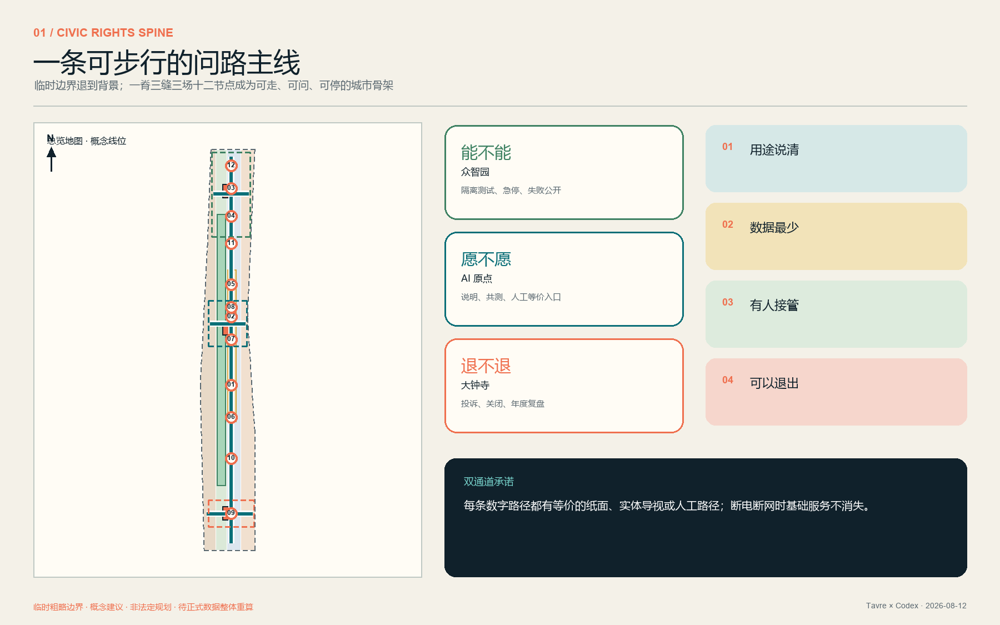
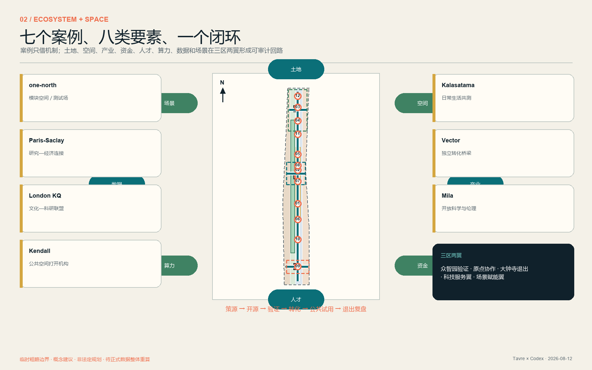
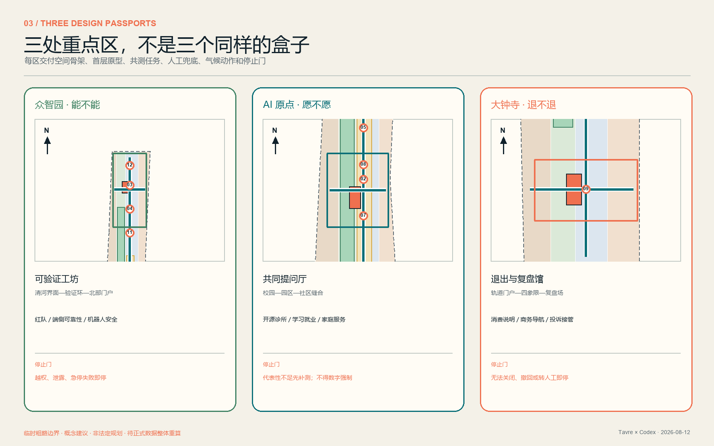
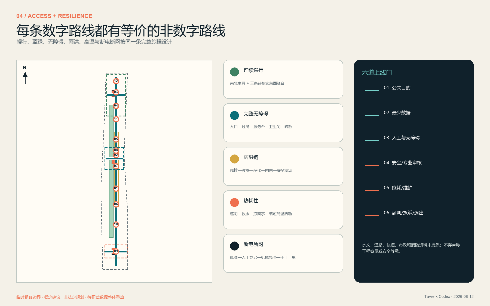
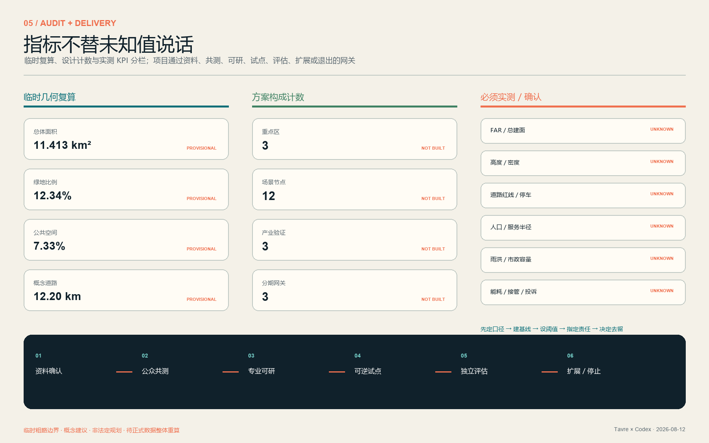

# 京张问路 JINGZHANG CONSENT LINE：城市先问，再算

**总命题：城市不是 AI 的展示柜，而是每个人都能知情、选择、求助和退出的共同生活场。** “问路”既是一条沿京张遗址公园展开的南北慢行路径，也是一套可被公众追问、被专业团队复核、被运营者停止的城市服务协议。蓝色连续线代表不依赖手机的人工服务基线；三种环形标记分别表示“能不能做、愿不愿用、能不能退”。本方案为开放共创建议，不替代正式规划，不构成政府审定、工程可行性或实施承诺。

## 设计依据与资料清单

方案以公开征集公告和面向智能体任务书为任务依据，以仓库登记的来源、标准、枚举与校验脚本为证据边界。公告给出项目定位、三层范围和成果深度；任务书要求三大定位、五大功能、三区两翼、5–8 个全球案例、至少 10 个 AI+ 场景、至少 3 个产业测试场景、至少 5 类人物、3 个地标以及长期运营机制 [source:OFFICIAL-ANNOUNCEMENT] [source:AGENT-TASKBOOK] [depth:existing_conditions_diagnosis]。

当前缺少组织方提供的精确总体边界、三处重点区多边形、现状建筑、权属、人口与设施、道路红线、轨道工程、河道蓝线、文保控制、市政容量、能源负荷和造价资料。因此：

- `geometry/site_boundary.geojson` 与 `geometry/key_areas.geojson` 仅是仓库维护的临时粗略约束；虚线只用于生成、展示和自检，不是 official redline。
- 约 11.413 km²、绿地 12.3423%、公共空间 7.3281% 都是该临时设计模型的复算结果，不是现状统计、法定指标或审批值 [data:geometry/site_boundary.geojson#SITE-001] [metric:site_area_sqm]。
- 容积率、总建筑量、高度、拆改留、道路断面、服务半径、雨洪容量、能源与预算保持 `unknown`；获得正式数据后按 `metrics.json` 的公式重算。
- 全球案例只用于比较机制，不证明其在海淀可直接落地；网页媒体没有复制进入本包。

完整证据分别落在 `sources.json`、`assumptions.json`、`metrics.json`、三个矩阵、九类 GeoJSON、双语图纸与离线网页中。所有几何主张区分 `provisional_constraint` 与 `design_proposal`，所有最终判断由人类与专业团队作出。

## 三层范围工作框架

方案以“研究网络—城市骨架—重点区护照”三层同步工作，而不是把同一张图放大缩小 [depth:three_level_scope_framework] [standard:PROJECT-OFFICIAL-ANNOUNCEMENT]。

| 层级 | 核心判断 | 本方案交付 | 不越过的边界 |
|---|---|---|---|
| 约 43.6 km² 统筹研究范围 | AI 创新带不是单一园区，而是高校院所、企业、资本/IP、公共场景与社区生活组成的协作网络 | “策源—开源—验证—转化—公共试用—退出复盘”生态回路；三区两翼要素流；7 个全球案例方法对照 | 不编造企业名单、投资额、招商与财政承诺 |
| 约 11.4 km² 总体设计范围 | 京张遗址公园应从背景绿带升级为连续的公共权利基础设施 | 一条南北问路主脊、三条东西缝合线、十二个双通道节点、蓝绿与韧性系统、九项更新包 | 临时边界不作为红线；线位不作为工程方案 |
| 约 368.4 ha 三处重点区域 | 三片区分别回答“技术能不能、公众愿不愿、服务退不退” | 众智园、AI 原点、大钟寺三张设计护照：门户、首层原型、共测场、地标、项目与停止门槛 | 不做地块级拆除、权属、建筑量、高度与审批结论 |

跨层传导采用统一问题卡：**谁受益；用什么数据；谁负责；AI 关闭时如何服务；什么证据允许扩展；什么触发停止。** 任何概念动作必须至少回接一项空间要素、一项运营责任与一项资料缺口。

## 统筹研究范围产业与未来城市研究

### 七个案例，只借机制，不借结论

| 案例 | 可核验机制 | 转译到京张 | 明确不照搬 |
|---|---|---|---|
| 新加坡 LaunchPad @ one-north | 模块化空间、孵化器/资本网络、可插拔真实测试场 | 众智园“实验—测试—标准—转化”共享底座 | 规模、租赁政策和运营数据 [source:CASE-ONE-NORTH] |
| Paris-Saclay | 研究、大学与经济网络协同 | 三区两翼的研究—企业连接人和年度项目路演 | 法国治理与融资制度 [source:CASE-PARIS-SACLAY] |
| 伦敦 Knowledge Quarter | 文化、科研、高校、企业、社区与地方机构跨界联盟 | 把京张文化资源、科研与公共学习并列为生态基础设施 | 机构数量与一英里空间模型 [source:CASE-LONDON-KQ] |
| Cambridge Kendall Square | 以公共空间连接封闭创新机构，并通过渐进公共行动激活街区 | 三条东西缝合线、可见首层、邻里参与和渐进实施 | 土地制度与既有开发强度 [source:CASE-KENDALL-SQUARE] |
| Helsinki Kalasatama | 公交/骑行、日常服务、分期建设与城市创新试用并行 | 小月河场景翼的生活共测、气候适应与分期复盘 | 滨海条件、人口与建设指标 [source:CASE-KALASATAMA] |
| Toronto Vector Institute | 独立非营利机构连接研究、产业采用与负责任 AI | 中关村科技服务翼设置独立审查与转化支持角色 | 机构组织与资助规模 [source:CASE-VECTOR] |
| Montréal Mila | 多校协作、开放科学、产业转化与社会伦理同场 | AI 原点的开源工作坊、公共议题课与人才社区 | 研究规模、合作机构与政策环境 [source:CASE-MILA] |

### 八类要素、一个闭环

生态不是招商清单，而是一张可操作的资源路由图：

1. **土地**：优先识别低效、边角和可逆使用机会，正式权属未明前不指认地块。
2. **空间**：共享测试间、可见首层、公共课堂、短期展台、人工服务亭与安静工作空间共存。
3. **产业**：从基础研究到三类真实产业验证，再到采购/转化；任何试用先过公共利益门。
4. **资金**：只提出公共、科研、企业与公益等资金类别及审计要求，不作额度和出资承诺。
5. **人才**：科研人员、创业者、技能转型者、家庭成员和国际访客均需要住房、照护、夜间服务与社区归属。
6. **算力**：共享预约、能耗披露、任务分级和离线替代；不把大模型当作每项服务的默认条件。
7. **数据**：最少必要、分级授权、目的限定、留存到期、投诉与删除流程；不以非公开或个人隐私数据作为设计前提。
8. **场景**：三座共测场提供“测试—公众体验—独立复核—扩展或退出”的真实反馈闭环。

三区两翼的分工为：众智园承担全栈验证与标准学习；AI 原点承接开源协作、成果转化与人才生活；大钟寺检验智能原生消费、商务与退出服务；中关村科技服务翼提供 IP、法律、资本、标准和国际连接；小月河场景赋能翼提供社区生活与公共服务试用。每个项目把产生的负面结果同成功结果一起回写公共台账 [depth:overall_spatial_structure]。

## 总体设计范围城市更新与控规深度城市设计

### 一脊、三缝、三场、十二节点、两翼回路

总体骨架不再以临时边框为构图中心。**问路主脊**沿南北方向串联三片区；**北部门户、原点门户、大钟寺门户**三条概念性东西缝合线把轨道/城市道路、校园园区、社区和绿脊接起来；三处**市民共测场**分别执行“技术可行门、社会同意门、退出复盘门”；十二个节点均提供视觉/语音/触觉说明、低位人工台、纸面路线和断网模式 [data:geometry/roads.geojson#ROAD-SPINE-001] [metric:scenario_node_count]。

用地模型采用四类《国土空间调查、规划、用途管制用地用海分类指南》代码形成完整、无缝、无重叠的临时分区。它表达功能关系而非法定用途；正式边界、现状权属与控规条件到位后须重新分区 [data:geometry/land_use.geojson#LU-001] [standard:MNR-LAND-USE-CLASSIFICATION-GUIDE] [depth:land_use_layout]。

### 城市形态与首层界面

- 面向主脊的首层优先安排可进入、可停留、可看见人工服务的公共界面；实验与办公的安全边界通过门厅、橱窗式展示、预约共测间而不是封闭围墙表达。
- 三个建筑原型只表示“适应性再利用/可逆增建的空间类型”，不代表现状建筑或拟拆新建位置；高度、规模、退界与消防均待专业深化。
- 地标不是屏幕雕塑，而是三种公共能力：众智园“可验证工坊”、AI 原点“共同提问厅”、大钟寺“退出与复盘馆”。三者都必须在设备关闭时仍能作为遮阴、休息、问路与活动空间。
- 文化导视以轨枕节奏、里程刻度和连续蓝线形成原创图形语言；不用企业商标、人物肖像或未经授权字体。

## 重点区域详细设计

三处粗略范围总面积复算约 369.289 ha，与公告“约 368.4 ha”存在约 0.241% 差异；这恰好证明临时矩形不可当作精确红线。每片区用“空间动作—首层原型—共测任务—停止门槛”构成可供专业团队深化的设计护照 [data:geometry/key_areas.geojson#PROV-KEY-001] [metric:key_area_count] [depth:three_key_area_detailed_design]。

| 片区 | 角色与空间骨架 | 原型/地标 | 首批项目与前置门槛 |
|---|---|---|---|
| 众智园 AI 自主创新加速区 | 清河界面—验证环—北部门户；测试空间与公园之间设可见但受控的共测前厅 | `BLDG-ZZY-001` 可验证工坊：共享实验、标准工作坊、低碳算力说明、人工登记 | 行业模型红队、端侧设备可靠性、机器人安全三类验证；先取得河道、防洪、道路、消防、能源与责任主体审查，失败即转为非自动演示 |
| 北京 AI 原点社区 | 校园—园区—社区的慢行缝合；以公共课堂、人才生活服务、开源协作和成果转化首层形成全天候街区 | `BLDG-ORIGIN-001` 共同提问厅：开源桌、公众议题室、家庭/国际人才服务、安静休息 | 开源维护诊所、学习与就业助手、生活服务共测；先做居民/学生/一线人员/残障者共同走查，不把活动当作已完成公众咨询 |
| 大钟寺 AI 产业聚集区 | 轨道门户—四象限步行联系—消费与商务街—退出复盘场；纸面和人工路线与数字路线等价 | `BLDG-DZS-001` 退出与复盘馆：人工投诉、产品召回/退出说明、年度失败展、社区服务 | 消费解释、商务办事、投诉接管；先核实站城、路口、规划绿地、非机动车、客流与权属，拥堵/排斥/无法人工接管则停止自动化 |

每张护照还包含：保留优先的调查树、无障碍连续路线、凉爽休息点、后勤与应急路径、维护岗位、证据台账和一年期复核。图中的剖面与边界均为概念表达，不是建筑或工程图。

## AI 创新生态、人才画像与 AI+ 场景

### 六类人物，不以“会用 App”作为市民资格

| 人物 | 日常目标 | 最易被忽略的阻力 | 必须保留的非数字基线 |
|---|---|---|---|
| 周边居民/老人 | 看病、办事、散步、照护 | 小字、复杂授权、夜间和高温 | 人工台、纸图、大字/语音、座椅与饮水 |
| 轮椅/视听障碍使用者 | 连续安全出行和独立办事 | 断头坡道、纯屏幕提示、临时占道 | 连续无障碍路线、触觉/语音、低位台、人工伴行 |
| 儿童与照护者 | 学习、游戏、放心使用公共空间 | 默认采集、成人化交互、缺少休息/卫生间 | 监护选择、无识别模式、可见人工服务 |
| 一线服务与维护人员 | 可靠交接、少做无效劳动 | 黑箱告警、无人负责、夜班负担 | 清晰工单、手动接管、维护时窗与培训 |
| 研究者/开发者/创业者 | 测试、合作、转化 | 缺真实反馈、责任与场地接口 | 共测协议、失败数据、专业复核和到期退出 |
| 国际人才及家庭 | 工作之外能长期生活 | 语言、伴侣就业、儿童照护、夜间服务 | 多语人工窗口、家庭服务转介、社区连接 |

### 十二张双通道场景卡

每张卡固定记录：服务对象；允许的最少数据；AI 的限定角色；空间与责任角色；人工接管；留存/到期；投诉退出；扩展与停止证据。节点位置是概念建议，均需正式数据和场地许可复核 [data:geometry/public_space.geojson#SN-01] [standard:PROJECT-AGENT-OPEN-CALL-TASKBOOK]。

| 节点/场景 | AI 限定角色与最少数据 | 人工基线/责任 | 试点门与停止触发 |
|---|---|---|---|
| SN-01 北部门户多语问路 | 本地路线与所选语言；不做人脸识别 | 纸图、人工指路；服务运营者 | 无障碍走查后试点；误导或无人工接管即停 |
| SN-02 清河凉爽路线 | 天气与匿名环境传感；只建议路线 | 遮阴标识、饮水与巡查；公共空间维护 | 气象/河道审核；极端天气转人工应急 |
| SN-03 行业模型红队（产业验证 1） | 经批准测试集；隔离环境 | 专业测试员；试验负责人 | 安全/数据审查；越权、泄露或不可复现即停 |
| SN-04 端侧设备可靠性（产业验证 2） | 设备日志、明确同意的试用反馈 | 手动控制和现场人员；设备责任方 | 电气/消防/无障碍审核；失控或伤害风险即停 |
| SN-05 机器人共域安全（产业验证 3） | 最少环境感知，不留身份模板 | 物理隔离、急停、现场安全员 | 专业风险评估；越界、近失或急停失效即停 |
| SN-06 原点开源维护诊所 | 用户主动提交的代码/问题 | 开发者坐诊、纸面预约；社区运营 | 许可证和安全审查；敏感代码外泄即停 |
| SN-07 学习与就业助手 | 用户主动输入的目标与公开岗位 | 人工辅导、公共终端访客模式 | 偏差与可解释评估；差别待遇/虚构机会即停 |
| SN-08 社区办事导航 | 公开办事规则、用户选择事项 | 人工窗口/电话；服务所有者 | 规则更新责任明确；错误办事后果或数字强制即停 |
| SN-09 安静工作与照护协同 | 仅预约时段和空间容量 | 现场管理员、纸面登记 | 不采集家庭画像；排斥儿童/照护者即调整 |
| SN-10 大钟寺消费说明 | 商品公开信息和用户查询 | 人工柜台、明码说明；经营/平台责任方 | 禁止操纵性画像；解释错误或诱导即停 |
| SN-11 无障碍伴行 | 用户主动发起的位置与需求，用后到期 | 人工伴行、触觉/语音导视；服务运营者 | 与残障者共测；路线中断或求助无响应即停 |
| SN-12 退出、投诉与年度复盘 | 投诉内容、工单状态，分级授权 | 线下窗口、纸质回执；独立复核角色 | 先有受理时限与升级路径；无法关闭/撤回服务即停 |

“退出”是本方案的设计原则，不宣称来自某项普遍法定权利。个人信息、生成式 AI 与公共服务的具体义务须按实际运营主体、用途和适用法条另行审查；场景未获批准、未投入运营。

## 用地、建筑规模与拆改留方案

临时用地四分区完整覆盖设计边界，但只表达“创新生产—公共服务—生活支持—生态开放”的关系。建筑模型改为三处重点区的空间原型，不再用一栋近两公里长的假建筑代表城市。建筑基底复算值是设计原型的面积总和；总建筑量、FAR、高度、密度与停车仍未知 [data:geometry/buildings.geojson#BLDG-ZZY-001] [metric:building_footprint_area_sqm] [depth:development_intensity_controls]。

拆改留采用证据门而不是地块结论：

1. **保留**：具有历史、社区或持续使用价值，且安全可用；
2. **修缮**：解决结构、消防、节能、无障碍和维护问题；
3. **适应性再利用**：把低效首层/厂房候选转为共享测试、公共学习或人才服务；
4. **可逆增建**：轻型、可拆、寿命与责任明确，先小规模验证；
5. **待评估拆除**：只有权属、结构、碳排、功能和公众影响证据齐全后才进入专业论证；
6. **新建**：仅在正式控规、容量、交通、市政、文保和审批允许后深化。

三个原型均要求 24 小时可识别入口、可见人工服务、无障碍卫生间/休息条件、设备维护后门、停机后仍有效的公共用途。由于缺少现状建筑调查，方案不指认任何真实建筑的拆除或改造。

## 交通、轨道、市政与公共服务设施

交通系统以“连续慢行优先、轨道门户衔接、数字/非数字等价、后勤应急分流”为原则 [data:geometry/roads.geojson#ROAD-STITCH-001] [metric:consent_network_length_m] [depth:traffic_rail_slow_parking]。

- 南北主脊承担步行、骑行、文化叙事和十二节点；三条东西缝合线是待核实的概念连接，不是道路红线或桥隧方案。
- 每个门户先做“断点台账”：过街、坡道、围栏、桥下、轨道换乘、非机动车停放、夜间照明、积水和热暴露；记录受影响人群、所需资料、临时解法与工程审核门。
- 轨道接驳只提出步行路径、换乘信息和人工求助策略；站点客流、出入口、消防和地下工程须由轨道及专业团队确认。
- 机动车停车、装卸、应急和运维不与主脊混行；具体数量与组织保持 `unknown`。

公共服务采用三级兜底：**基础服务必须保留 → AI 只做增强 → 人工窗口随时接管。** 十二节点覆盖问路、社区办事、学习就业、照护、无障碍伴行、投诉退出和应急信息；医疗判断、执法、安全处置等高风险事项不交给无人值守模型。市政与新基建仅提出接口：分级供电与断电模式、本地最少数据、网络中断队列、设备散热/噪声/维护、网络安全、能耗披露；容量和设备选型待专业测算 [depth:municipal_new_infrastructure]。

## 蓝绿空间、公共空间与城市风貌

蓝绿系统把遗产慢行、清河/小月河界面、口袋停留、轨道门户与三座共测场连成“日常舒适 + 极端天气降级”的公共空间网络 [data:geometry/green_space.geojson#GREEN-001] [metric:green_space_area_sqm] [depth:blue_green_public_space]。

### 五条韧性链

- **雨洪**：源头减排—滞蓄—净化—回用—安全溢流为概念链；未取得水文、蓝线和防洪数据，不声称容量或安全等级。
- **热环境**：连续遮阴、可坐靠休息点、饮水、凉爽人工服务亭和高温缩短活动；遮阴比例与热舒适基线待实测。
- **断电断网**：纸面导视、人工登记、机械急停、离线广播和手工工单保证服务不消失。
- **无障碍**：从入口到服务台、卫生间、休息点、过街和疏散的完整旅程共测；大字、语音、触觉与高对比不互相替代。
- **生境与维护**：低干预植物、暗夜友好、季节性维护与活动容量须由生态/运维人员共同确认；不把绿地当设备展台。

城市风貌采用“轨道记忆的节奏 + 中关村开放协作 + AI 可解释界面”。蓝线、圆环、编号与人形服务标识组成原创 `JZ?` 视觉母题：远看可寻路，近看可读用途、数据、责任和退出。动态屏只是附加层，停电时实体色带与凸字仍成立。

## 更新项目清单、实施政策与分期计划

实施采用“资料确认—共同走查—专业可研—可逆试点—独立评估—扩展或停止”的门槛式路线，而不是把开发时序写成既定安排 [data:geometry/phasing.geojson#PHASE-001] [metric:phase_count] [depth:phasing_implementation]。

| 包号 | 可供深化的项目包 | 首要责任角色 | 第一份验收证据 / 停止门 |
|---|---|---|---|
| JZ-01 | 官方数据替换与断点基线 | 待指定规划/数据协调者 | 来源清单、差异报告；边界不明则不进入地块深化 |
| JZ-02 | 南北问路主脊与原创导视试点 | 公共空间/交通运营角色 | 6 类人物完整旅程走查；无法连续通过即修正 |
| JZ-03 | 三条东西缝合线可达性审计 | 交通、轨道、社区角色 | 断点台账与专业审查；工程条件不明不施工 |
| JZ-04 | 众智园可验证工坊 | 试验服务所有者 | 三类产业测试协议；急停/责任/隔离不全即停 |
| JZ-05 | AI 原点共同提问厅 | 社区/高校/园区协作角色 | 公开议题与采纳/不采纳台账；代表性不足则补测 |
| JZ-06 | 大钟寺退出与复盘馆 | 服务所有者 + 独立复核 | 投诉、接管、关闭演练；无法退出则不得扩展 |
| JZ-07 | 双通道公共组件库 | 无障碍共测组 + 运维 | 纸面/语音/触觉/人工版本一致性；任一群体失败即修正 |
| JZ-08 | 凉爽与雨洪节点 | 景观、水务、生态、运维角色 | 气候基线与维护表；无水文/安全审核不声称绩效 |
| JZ-09 | 年度“京张问路周”与公共账本 | 待指定召集方 | 项目成功/失败/投诉/能耗/退出同表发布；只宣传不复盘则取消 |

**阶段 0（0–6 个月，建议）**：取得正式资料、建立公众/一线/专业共同走查和基线；**阶段 1（6–18 个月）**：只做导视、人工台、纸面路线及可撤回小试点；**阶段 2（18–36 个月）**：经专业审查后选择性推进三座共测场和首层适应性再利用；**阶段 3（年度循环）**：独立评估后扩展、修订或退出。时间仅为概念性网关，不是政府计划、审批或资金承诺。

拟议治理角色包括：召集方、服务所有者、公共利益与伦理小组、无障碍共测组、数据/安全组、一线运维人员和独立复核者。每个项目在启动前写清 RACI、资金类别、建设/运营成本等级、维护班次、到期日和恢复动作；实际主体均待确认。

公众参与计划分四步：需求与断点走查、方案共创、原型共测、年度复盘；居民、老人、残障者、儿童照护者、一线人员、研究/企业和国际人才分别获得适配参与方式。所有意见进入“采纳/不采纳及理由”台账。该计划不是已完成的法定公众意见征询，也不替代《城市设计管理办法》所涉正式程序。

## 指标体系、面积复算与合规矩阵

指标分三类，防止把方案配置值包装成城市绩效 [metric:green_ratio] [depth:metrics_recalculation]。

| 类别 | 已记录 | 使用方式 |
|---|---|---|
| 临时几何复算 | 总体/重点区面积、四类用地、绿地/公共空间/建筑原型面积与比例、概念道路长度、阶段数 | 只用于内部一致性和正式几何替换时的差异检查；置信度低或中 |
| 方案构成计数 | 3 个重点区、12 个场景节点、3 个产业验证场景、3 个地标原型、9 个项目包 | 证明设计覆盖，不代表已建成或运行 |
| 必须实测/确认 | FAR、总建面、高度、密度、道路面积/红线、停车、市政/能源、人口与服务半径、遮阴、雨洪、能耗/任务、人工接管率、投诉闭环率 | `unknown`；试点前先定口径、基线、阈值和责任人 |

试点 KPI 不预填漂亮数字，而采用“先定义、再测量、再决定”：可达性看六类人物能否完整走完全程；可靠性看断电/断网后人工基线是否完成；公平性看不同群体失败差异；治理看投诉、接管、关闭和数据到期能否演练；环境看维护、热舒适和单任务能耗；生态看生境与活动冲突。每项在 `metrics.json` 中注明公式、来源、置信度与未知原因。

`compliance_matrix.json` 将公告 23 项逐条映射到真正相关章节、图层、指标、图纸、来源、假设与四项自检，不再以同一组证据兜底；`standard_matrix.json` 区分强制任务依据、专业参考与补充法律背景；`design_depth_matrix.json` 对 15 项设计深度分别写明已交付与数据缺口。

## 风险、版权与合规说明

### 风险登记与停止规则

| 风险 | 触发/影响 | 缓解与停止门 |
|---|---|---|
| 边界、权属、控规不明 | 误导地块与规模判断 | 替换官方数据并全量重算；未确认不作地块结论 |
| 文保、河道、轨道与交通安全 | 破坏遗产/生态或造成伤害 | 专业审查优先；条件冲突即取消线位或活动 |
| 洪涝、高温、断电断网 | 路线失效、脆弱人群暴露 | 降级运行与应急路线；无安全基线不开放 |
| 无障碍排斥与数字强制 | 部分人无法独立办事 | 当事人共测、人工/纸面等价；任一核心旅程失败即修正 |
| 隐私、偏差、网络安全 | 伤害权利、泄露或差别待遇 | 最少数据、隔离测试、人工复核、事件响应；越权/泄露即停 |
| 供应商锁定与能耗 | 无法退出、维护与环境成本失控 | 开放接口、数据可迁移、能耗披露；无法关闭/迁移即不扩展 |
| 运营资金与维护不足 | 设备荒废、一线负担加剧 | 全生命周期责任和年度预算类别；无人维护则转为低技术设施 |
| 活动拥挤、社区置换与可负担性 | 日常生活受扰、公共价值流失 | 容量管理、社区台账与影响复核；持续负面影响则降频/退出 |
| 版权与错误宣传 | 侵权或把概念说成落地 | 来源/生成方式/许可登记；不得声称获批、入选、建成或政府承诺 |

本包的文字、原创图形、图表与数据驱动制图用于本次社区展示；封面为 AI 生成的概念图，不是现状照片或官方规划效果图，未使用企业 Logo、人物肖像或第三方媒体。全球案例只提供链接和转述，不再分发页面图片。同行提案仅用于差异审计，未复制其文本、图件或特有机制；本方案的差异边界是“一条真实可步行的权利路径、连续人工服务蓝线、三片区三种问题、每条数字路径都有等价非数字路径”。

《生成式人工智能服务管理暂行办法》和《无障碍环境建设法》作为补充合规背景按具体主体与场景限定适用，不能据此推导一个覆盖所有服务的普遍“退出权”或把特定公共服务人工兜底条款泛化到全部空间 [standard:GENERATIVE-AI-INTERIM-MEASURES] [standard:BARRIER-FREE-ENVIRONMENT-LAW]。本方案更高的知情、拒绝、接管和退出要求是自愿设计原则，后续仍需法律、网络安全、无障碍与专业审查 [depth:risk_missing_data]。

## 参考资料

关键任务依据、法规标准、临时边界与 7 个案例均在 `sources.json` 记录发布者、链接/本地路径、获取日期、用途、禁用范围和许可说明；官方来源登记可回溯 `data/source_registry.json`。结构化文件是完整清单，正文只在判断旁放置有限证据锚点 [source:SOURCE-REGISTRY] [source:BOUNDARY-SOURCE] [standard:MOHURD-URBAN-DESIGN-MEASURES]。

最终交付包括：中英等价 Markdown/HTML、五张中英静态图、双语离线视觉页、双语 A3 文册和 A0 展板，以及可复算 GeoJSON、指标、假设、来源、合规/标准/深度矩阵和四门自检记录。正式边界到位后，替换边界及三个重点区，再重建所有依赖图层、指标、图纸和声明；任何扩展仍由人类、公众与专业团队共同决定。
