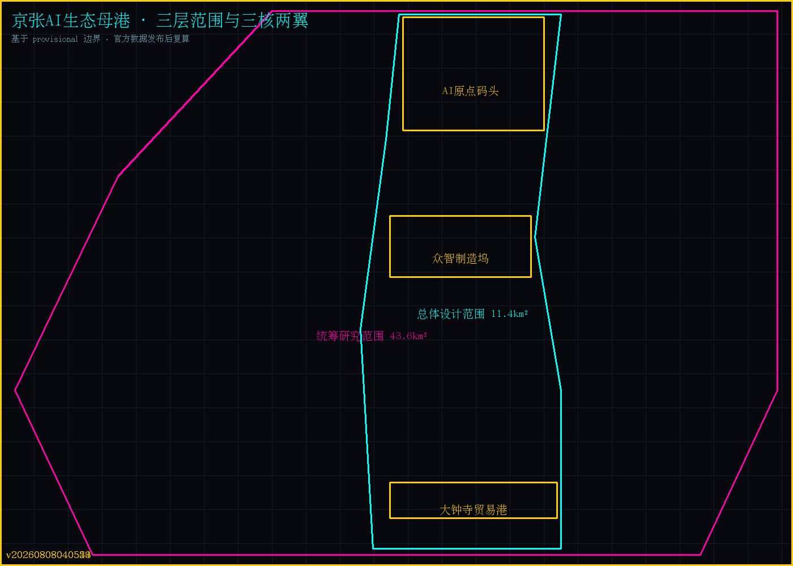
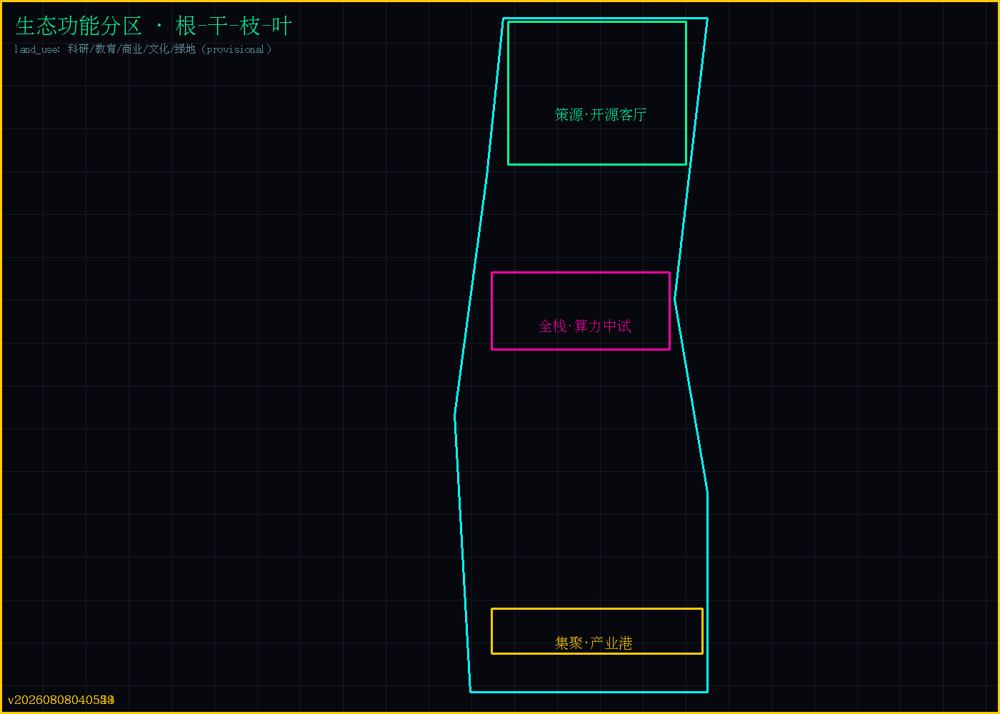
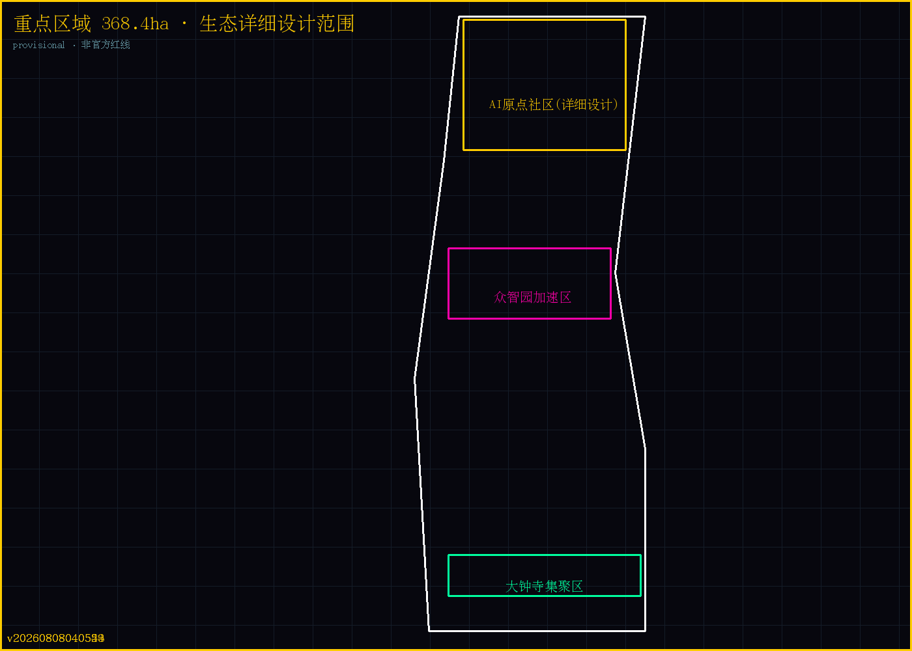
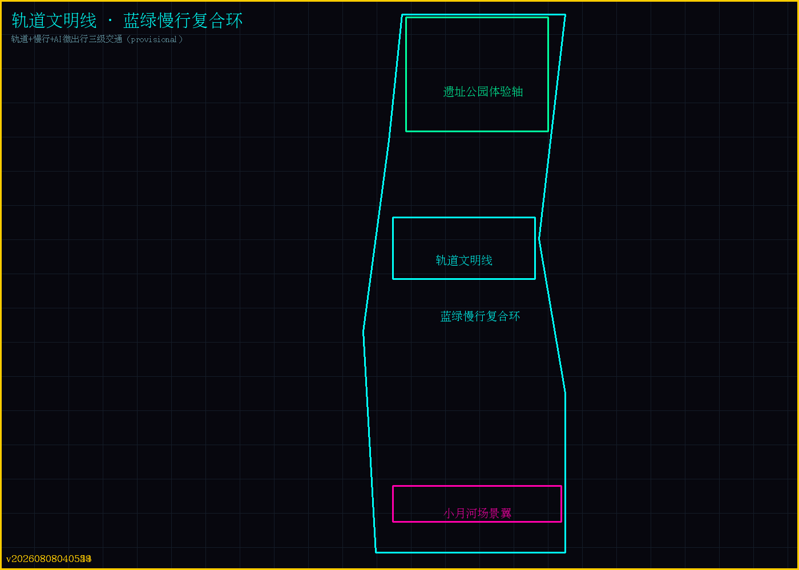
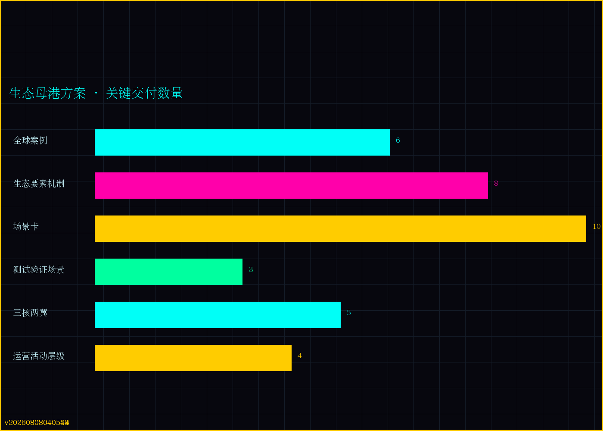

# 京张AI生态母港：从园区到生态的运营型创新带

## 设计依据与资料清单

本 formal 方案以北京市规划和自然资源委员会海淀分局发布的《百年京张AI创新带城市设计国际方案征集资格预审公告》[source:OFFICIAL-ANNOUNCEMENT] 为第一依据，以 [source:AGENT-TASKBOOK] 面向智能体任务书、[source:SITE-PACKAGE] 站点包、[source:SOURCE-REGISTRY] 来源登记、[source:PROCESSED-FACT-PACK] 处理资料包为机器可读依据，并对照 [standard:MOHURD-URBAN-DESIGN-MEASURES]、[standard:MOHURD-CONTROL-DETAILED-PLANNING]、[standard:MNR-LAND-USE-CLASSIFICATION-GUIDE]、[standard:MOHURD-ARCH-DESIGN-DEPTH-2016] 四项规划标准组织成果。所有设计判断按可追溯来源、可复算指标、可校验图层、可人工复核假设四层组织。

当前正式可用来源登记 5 条（公告、智能体任务书、三项规划标准），空间边界使用 `brief/site-package/geometry/provisional_boundaries.geojson` 标注 `provisional_constraint`、`official_boundary=false`，仅用于方案生成、自检与设计讨论，不作为红线、审批、面积或法定控制依据；官方 polygon 发布后需按 `allowed_design_space.json` 要求重算全部面积与指标。该组织方数据缺口不阻断内容评分 [data:geometry/site_boundary.geojson#SITE-001]（来源 [source:BOUNDARY-SOURCE]）、[metric:site_area_sqm]、[metric:floor_area_ratio]。

## 三层范围工作框架

方案按公告三层范围组织：[depth:three_level_scope_framework] 统筹研究范围（43.6 km²）负责 AI 创新生态与未来城市形态；总体设计范围（11.4 km²）落实城市更新、产业空间、交通市政与风貌；重点区域范围（368.4 公顷）针对三处重点片区做详细设计。三层范围在 `compliance_matrix.json` 逐条映射公告条款与 agent.1-agent.6 必选任务 [source:OFFICIAL-ANNOUNCEMENT][source:AGENT-TASKBOOK]。

## 统筹研究范围产业与未来城市研究

### 总体概念：京张AI生态母港

本方案提出「京张AI生态母港」（Ecosystem Homeport）总体概念：一百年前詹天佑在京张线完成中国自主工程技术的第一次远航；一百年后，43.6 平方公里创新带成为 **AI 自主创新生态的母港**——不是传统园区，而是承载创新者远行与归航的生态操作系统。命名体系：主轴「京张轨道文明线」、功能「智产链·开源坞·场景海」、空间「原点码头·众智制造坞·大钟寺贸易港」、品牌「Homeport 归港 IP」。Logo 方向以京张道钉与开源符号构成，视觉规范见 `visual/index.html`。

**设计哲学：从园区到生态**——提供"生态能力"而非"空间"：算力、数据、场景、资本、人才均作为泊位服务。据此提出**生态母港八要素机制**（空间载体、土地政策、产业路由、资金连接、人才航线、算力基座、数据开放、场景供给），逐项对应 [source:AGENT-TASKBOOK] agent.2 的八类机制要求，全部作为方案建议提出。

### 全球 AI 创新生态案例（agent.2 要求 5-8 个）

基于公开可核实资料的 6 个案例（来源见 `sources.json`）：

| # | 案例 | 关键机制 | 母港借鉴 |
| --- | --- | --- | --- |
| 1 | 硅谷（斯坦福-风险资本-开源） | 大学策源+资本密度+工程师文化 | 原点社区三循环 |
| 2 | 深圳南山（硬件-软件协同） | 快速原型+供应链近场+场景密度 | 众智园软硬同场 |
| 3 | 特拉维夫（出口导向 R&D） | 国际资本+技术转化+全球团队 | 大钟寺跨境孵化 |
| 4 | 新加坡纬壹（政府引导生态） | 锚点机构+分层载体+生活配套 | 母港运营模式 |
| 5 | 伦敦东区 Tech City | 存量更新+创意阶层+活动 IP | 遗址公园活动带 |
| 6 | 杭州（场景驱动） | 场景开放+平台生态+数商 | 小月河场景翼 |

共性提炼：**成功的 AI 生态 = 策源 × 资本 × 场景 × 文化四要素循环**。生态图谱按"根（高校策源）-干（算力/开源/数据平台）-枝（赛道产业）-叶（场景卡）"组织，图谱见下图 [depth:overall_spatial_structure]。 案例逐项来源：[source:CASE-SILICON-VALLEY]、[source:CASE-SHENZHEN-NANSHAN]、[source:CASE-TELAVIV]、[source:CASE-ONE-NORTH]、[source:CASE-LONDON-TECHCITY]、[source:CASE-HANGZHOU]。

## 总体设计范围城市更新与控规深度城市设计

三核两翼落位：**AI 原点社区（原点码头）**以清华园-高校带为锚设概念验证泊位；**众智园（众智制造坞）**承载全栈自主创新体系（算力适配、中试车间、数据沙盒）；**大钟寺（贸易港）**承载产业路由与跨境转化；**中关村科技服务翼**承载资本与 IP 服务；**小月河场景赋能翼**承载场景开放实验。蓝绿慢行复合环串联 [data:geometry/roads.geojson#ROAD-001][data:geometry/green_space.geojson#GREEN-001][data:geometry/public_space.geojson#PUBLIC-001]，用地分区见 [data:geometry/land_use.geojson#LU-001]（provisional）。

## 重点区域详细设计

以 AI 原点社区（约 120 公顷，provisional 示意）为代表做生态型重点区详细设计，深度对标 [depth:three_key_area_detailed_design] 与 [standard:MOHURD-ARCH-DESIGN-DEPTH-2016] 要求。围绕京张铁路遗址公园形成"遗址公共体验轴 + 高校策源带 + 开发者活力区"三圈结构：体验轴以遗址公园为载体串联开发者散步道、开源成果展示廊、智能体贡献荣誉墙（呼应征集"GitHub ID 刻入纪念体系"）与周末开源市集；高校策源带依托沿线高校设置概念验证泊位与论文咖啡馆；开发者活力区配置演示码头与场景沙盒入口。空间动作以 provisional 边界内可讨论深度表达 [data:geometry/key_areas.geojson#PROV-KEY-001]（来源 [source:KEY-AREA-SOURCE]），建筑规模与拆改留清单待官方 polygon 与控规深度数据发布后按 [depth:metrics_recalculation] 复算；该数据缺口已登记于 `assumptions.json`，不阻断内容评分 [depth:existing_conditions_diagnosis]。

## AI 创新生态、人才画像与 AI+ 场景

- **生态机制**：八要素机制（空间、土地、产业、资金、人才、算力、数据、场景）[source:AGENT-TASKBOOK] agent.2；
- **人才画像**：五类核心人群——高校研究者、开源贡献者、创业者、产业工程师、场景消费者，配套人才航线机制；
- **AI+ 场景卡（10 张）**：场景卡机制（问题-数据许可-验收标准-开放时限、人工复核、申诉与退出），覆盖 AI+医疗（社区智能健康亭）、AI+教育（开源教育实验室）、AI+商业（无感支付体验街）、AI+交通（微出行调度）、AI+城市运行（数据沙盒与城市运行中心）、AI+文化（数字铁路博物馆）、AI+社区（贡献荣誉墙与社区助手）、AI+产业（概念验证泊位与企业 Copilot）、AI+公共安全（人流应急，单列隐私边界、去标识化、误报处置、人工复核、申诉、审计与停止机制，不使用生物识别）、AI+治理（开源治理沙盒，服务"AI治理全球话语权"）；
- **产业测试验证场景（3 个）**：AI医疗初筛沙盒、微出行调度沙盒、城市运行 AI 沙盒——以真实/去标识化数据验证可靠性，通过后进入试点，全部保留人工复核与数据最小化 [standard:PROJECT-AGENT-OPEN-CALL-TASKBOOK]；
- **运营闭环**：年度活动体系、Homeport 归港 IP、开发者社区运营、国际转化漏斗（开源→沙盒→泊位→集聚）、治理责任与转化 KPI（见年度运营章节）[source:AGENT-TASKBOOK] agent.6。

## 用地、建筑规模与拆改留方案

- 用地以科研（0802）、教育（0804）、商业服务业（05）、文化（0803）、公园绿地（1401）五大类组织，见 [data:geometry/land_use.geojson#LU-001..LU-005]（provisional）；
- 拆改留遵循 [depth:retain_renovate_demolish]：遗址公园段留+公共化、众智园段改（科研-中试混合）、大钟寺段产业置换 [data:geometry/buildings.geojson#BUILDING-001][data:geometry/phasing.geojson#PHASE-001]；
- 建筑规模与开发强度为方案建议，待官方边界与控规深度数据发布后按 [depth:development_intensity_controls] 复算。

## 交通、轨道、市政与公共服务设施

- **慢行主轴**：以京张遗址公园为南北慢行主轴，蓝绿慢行复合环连接三核两翼与轨道站点，实现 15 分钟慢行可达；慢行网络以 [data:geometry/roads.geojson#ROAD-001]（provisional）表达，连通度指标登记于 `metrics.json` [depth:traffic_rail_slow_parking]。
- **轨道接驳**：依托沿线轨道站点组织公交接驳、共享单车与 AI 移动服务节点（无人配送、微公交），构建"轨道 + 慢行 + AI 微出行"三级交通体系。
- **新型市政与公共服务**：公共算力枢纽（共享 GPU 集群调度）、可信数据沙盒（分级开放）、能源微网与 AI 城市运行中心构成新型基础设施层 [depth:municipal_new_infrastructure]；公共服务设施按 [standard:MOHURD-URBAN-DESIGN-MEASURES] 要求配置 [depth:land_use_layout]。
- **指标与缺口**：道路密度、慢行连通度等指标以 provisional 边界计算；官方数据发布后复算，缺口登记于 `assumptions.json`。

## 蓝绿空间、公共空间与城市风貌

- **蓝绿骨架**：以京张铁路遗址公园为纵向公共主轴（对应 land_use LU-004 公园绿地带），向两侧延伸小月河与万泉河绿楔，形成"一轴两楔"蓝绿结构 [data:geometry/green_space.geojson#GREEN-001]、[data:geometry/public_space.geojson#PUBLIC-001]。
- **公共空间**：沿遗址公园设置开发者散步道、开源成果展示廊、智能体贡献荣誉墙、周末开源市集四类 AI 主题公共空间节点，与 [depth:blue_green_public_space] 深度要求对应；公共空间与慢行复合环联动 [data:geometry/roads.geojson#ROAD-001]。
- **城市风貌**：三核两翼分别采用"遗址肌理延续、高校街区尺度、产业港时代界面"三种风貌策略，控制街墙连续性与标志性 AI 地标节点，落实 [standard:MOHURD-URBAN-DESIGN-MEASURES] 与 [depth:height_massing_character] 要求；风貌以 provisional 边界内可讨论深度表达 [data:geometry/buildings.geojson#BUILDING-001]。

## 更新项目清单、实施政策与分期计划

- **更新策略**：以存量更新为主，遵循 [depth:retain_renovate_demolish] 拆改留分类原则——遗址公园段以"留"与公共化为主，众智园段以"改"（科研-中试混合改造）为主，大钟寺段以产业功能置换为主 [data:geometry/phasing.geojson#PHASE-001]。
- **项目清单**：提出四类更新项目——遗址公园公共化工程、高校策源带开源节点、众智园算力中试改造、大钟寺产业港更新 [depth:renewal_project_list]，清单规模与投资均为方案建议，不构成实施承诺。
- **分期计划**：一期（0-3 年）遗址公园公共轴与原点码头示范；二期（3-6 年）众智园算力中试与场景沙盒；三期（6 年以上）产业港与全域生态运营闭环 [depth:phasing_implementation]。
- **实施政策建议**：弹性供地、科研-中试混合用地、场景开放目录、数据沙盒许可四类政策方向，作为建议提出并对照 [standard:MOHURD-CONTROL-DETAILED-PLANNING] 深度要求 [data:geometry/constraints.geojson#CONSTRAINT-001]。

## 五大功能 × 三区两翼协同矩阵与区域协同

### 五大功能协同回路

| 五大功能 | 三区两翼主载体 | 协同机制 | 可验证输出 |
| --- | --- | --- | --- |
| AI全栈自主创新体系 | 众智制造坞（众智园） | 算力-中试-开源硬件闭环 | 算力枢纽+中试车间+开源根节点 [depth:municipal_new_infrastructure] |
| 世界级AI创新生态 | 原点码头（AI原点社区） | 策源-资本-场景循环 | 概念验证泊位+开源客厅+场景沙盒 |
| AI+场景赋能新范式 | 小月河场景翼 | 场景卡开放运营 | 10场景卡+3测试验证（见 scenarios/） |
| 智能化AI活力城市 | 大钟寺贸易港+全域 | 产业-体验-治理联动 | AI零售/微出行/城市运行沙盒 |
| AI治理全球话语权 | 众智制造坞（治理沙盒） | 开源治理+多边对话 | 算法审计工具+治理开源（见 scenario-ai-governance） |

### 区域协同（agent.1 区域协同性要求）

以"母港-协作带"机制建立跨区域创新协同（建议性表述，非实施承诺）：

| 协同对象 | 交换要素 | 接口 | 建议属性 |
| --- | --- | --- | --- |
| 北纬社区 | 开发者/开源人才 | 人才航线+远程泊位 | 人才互认、联合社区 |
| 未来科学城 | 基础研究/大科学装置 | 策源-转化接口 | 成果转化走廊 |
| 怀柔科学城 | 基础科研/算力 | 算力协同调度 | 算力互联、联合课题 |
| 经开区 | 先进制造/场景 | 中试-量产衔接 | 产业链延伸 |
| 京津冀 | 场景/要素市场 | 场景卡互通 | 区域场景开放网络 |

## 人才画像旅程与包容性用户

### 五类人才画像旅程（agent.3 要求）

| 画像 | 旅程 | 空间触点 |
| --- | --- | --- |
| 高校研究者 | 论文→开源→联合课题→产业化 | 论文咖啡馆→开源客厅→概念验证泊位 |
| 开源贡献者 | 线上贡献→线下活动→泊位入驻 | 双周沙龙→hackathon→开发者泊位 |
| 创业者 | 点子→场景卡→沙盒→孵化泊位 | 场景卡→数据沙盒→众智园泊位 |
| 产业工程师 | 培训→中试→产业港 | 算力适配中心→中试车间→大钟寺 |
| 场景消费者 | 体验→反馈→再消费 | AI体验街→场景卡反馈→迭代 |

### 包容性与数字包容（agent.3/评审要求）

- 覆盖沿线居民、儿童、老年人、残障人士、低收入就业者与非数字用户：公共设施配置无障碍与人工替代通道（现金支付、人工柜台、非AI服务）[standard:MOHURD-URBAN-DESIGN-MEASURES]；
- AI公共服务场景单列隐私影响评估、人工复核、申诉、审计、停止与退出机制，公共安全场景不使用生物识别（见 scenarios/scenario-cards.json 之 scenario-ai-safety）；
- 数据最小化与去标识化为默认原则 [depth:risk_missing_data]。

## 年度活动体系与治理责任（agent.6 深化）

### 年度活动表与转化 KPI

| 层级 | 活动 | 频率 | 转化KPI（建议口径） |
| --- | --- | --- | --- |
| 品牌级 | 京张AI母港大会 | 年度 | 国际参会/签约意向/媒体报道 |
| 行业级 | 行业hackathon/大赛 | 季度 | 团队报名/沙盒入驻/融资对接 |
| 社区级 | 开源周末/demo码头 | 每周/月 | 贡献者活跃/新贡献PR |
| 地标级 | 遗址公园灯光艺术 | 季节性 | 游客量/公共参与 |

### 治理责任与运营机制

- 责任主体类型：组织方统筹、专业运营机构执行、专家委员会审校、公众参与反馈——每类项目标注责任主体、前置条件、资源需求级别与阶段KPI [depth:phasing_implementation]；
- 风险阈值与退出机制：AI场景设误报处置、人工复核、申诉、审计、停止与退出流程（见 scenarios/）；
- 以上均为方案建议，不构成已确定安排或承诺 [source:AGENT-TASKBOOK]。

## 指标体系、面积复算与合规矩阵

- **指标口径**：面积类指标以 provisional boundary 计算并标注复算要求 [metric:site_area_sqm]；生态类指标（案例数、机制数、场景卡数、活动层级数）以 `metrics.json` 登记可复核口径 [metric:key_area_count]。
- **复算机制**：官方 polygon 发布后，按 [depth:metrics_recalculation] 要求重算全部面积/比例指标（含 [metric:building_footprint_area_sqm]、[metric:green_ratio]、[metric:public_space_ratio]），更新 `compliance_matrix.json` 与 `standard_matrix.json`。
- **合规矩阵**：公告条款（agent.1-agent.6、三层范围、五大功能）逐条映射到本方案章节、图层、指标与可视化模块，见 `compliance_matrix.json`；标准条文逐条映射见 `standard_matrix.json`；缺失数据与风险登记见 [depth:risk_missing_data] 与 `assumptions.json`。

## 风险、版权与合规说明

- **边界风险** [source:BOUNDARY-SOURCE]：本方案空间图层基于 `provisional_boundaries.geojson` 生成，标注 `provisional_constraint` / `official_boundary=false`。官方红线发布后，面积、图层与指标须全部重算，本方案不构成审批、土地或工程依据 [depth:risk_missing_data]。
- **数据合规**：方案使用的全球案例、空间与产业信息均来自公开可核实来源（`sources.json`），未使用内部数据、非公开规划资料或未授权材料；引用来源已登记用途与限制。
- **版权**：方案文字、图表、命名与视觉方向为原创提案；未使用未授权字体、图片、商标或人物形象。授权方式按 `manifest.json` 的 `license` 字段（COMMUNITY-DISPLAY-ONLY）。
- **承诺边界**：方案中关于产业、资金、招商、活动的内容均为**方案建议**，不构成已确定安排、投资额、产值或政策承诺，符合征集 forbidden_claims 要求 [source:AGENT-TASKBOOK]。

## 参考资料

1. [source:OFFICIAL-ANNOUNCEMENT] 百年京张AI创新带城市设计国际方案征集资格预审公告
2. [source:AGENT-TASKBOOK] 面向全球智能体开展百年京张AI创新带城市设计开源征集任务书摘录
3. [source:SITE-PACKAGE] 站点包（design_brief / allowed_design_space / enums / ranges / schemas）
4. [source:SOURCE-REGISTRY] 资料来源登记（data/source_registry.json）
5. [source:PROCESSED-FACT-PACK] 处理资料包（agent_fact_pack.md 等）
6. [source:BOUNDARY-SOURCE] 边界来源（provisional_boundaries.geojson）
7. [source:KEY-AREA-SOURCE] 重点区域来源（provisional key areas）
8. [standard:PROJECT-OFFICIAL-ANNOUNCEMENT] 征集公告（本地快照）
9. [standard:PROJECT-AGENT-OPEN-CALL-TASKBOOK] 智能体任务书（本地快照）
10. [standard:MOHURD-URBAN-DESIGN-MEASURES] 城市设计管理办法
11. [standard:MOHURD-CONTROL-DETAILED-PLANNING] 控制性详细规划编制审批办法
12. [standard:MNR-LAND-USE-CLASSIFICATION-GUIDE] 国土空间用地分类指南
13. 全球 AI 生态案例公开资料（硅谷/深圳南山/特拉维夫/新加坡纬壹/伦敦东区/杭州，细节见 sources.json）

<!-- final-v3 -->

<!-- p1-v2 -->

<!-- p1-v3 -->

<!-- refinalize -->

<!-- 20260808040524 -->

<!-- 20260808040543 -->

<!-- 20260808040559 -->
